# Вопросы на собеседовании: `Стратегии деплоя`

Комплексное руководство по вопросам собеседования на тему стратегий деплоя для Senior Java Developer. Охватывает основные стратегии (`Blue-Green`, `Canary`, `Rolling Update`, `Recreate`), инструменты (`Argo Rollouts`, `Helm`, `Istio`), CI/CD пайплайны и best practices.

## Полезные ссылки

### Официальная документация

- [Kubernetes Deployment](https://kubernetes.io/docs/concepts/workloads/controllers/deployment/) — стратегии обновления подов
- [Argo Rollouts](https://argoproj.github.io/argo-rollouts/) — прогрессивный деплой в Kubernetes
- [Argo CD](https://argo-cd.readthedocs.io/) — GitOps для Kubernetes
- [Helm](https://helm.sh/docs/) — менеджер пакетов Kubernetes
- [Istio Traffic Management](https://istio.io/latest/docs/concepts/traffic-management/) — управление трафиком
- [Flagger](https://docs.flagger.app/) — автоматизация Canary/Blue-Green
- [Deployment Strategies (Martin Fowler)](https://martinfowler.com/bliki/BlueGreenDeployment.html) — Blue-Green паттерн
- [Canary Deployments (Martin Fowler)](https://martinfowler.com/bliki/CanaryRelease.html) — Canary паттерн
- [Deployment Strategies](https://www.baeldung.com/ops/deployment-strategies) — обзор всех стратегий деплоя на Baeldung

## Содержание

- [Полезные ссылки](#полезные-ссылки)
- [See also](#see-also)

**Основные стратегии деплоя**
- [Q1. (!) Что такое Blue-Green деплой и когда его использовать?](#q1--что-такое-blue-green-деплой-и-когда-его-использовать)
- [Q2. (!) Что такое Canary деплой и чем он отличается от Blue-Green?](#q2--что-такое-canary-деплой-и-чем-он-отличается-от-blue-green)
- [Q3. (!) Что такое Rolling Update и как он работает в Kubernetes?](#q3--что-такое-rolling-update-и-как-он-работает-в-kubernetes)
- [Q4. Что такое Recreate стратегия и когда её применять?](#q4-что-такое-recreate-стратегия-и-когда-её-применять)
- [Q8. Что такое A/B деплой и когда его использовать?](#q8-что-такое-ab-деплой-и-когда-его-использовать)
- [Q11. Что такое immutable deployment и чем он лучше in-place update?](#q11-что-такое-immutable-deployment-и-чем-он-лучше-in-place-update)
- [Q16. Что такое dark launch и когда его применять?](#q16-что-такое-dark-launch-и-когда-его-применять)

**Zero-downtime и Rollback**
- [Q5. (!) Как обеспечить zero-downtime при деплое?](#q5--как-обеспечить-zero-downtime-при-деплое)
- [Q6. Что такое rollback и как его выполнить в Kubernetes?](#q6-что-такое-rollback-и-как-его-выполнить-в-kubernetes)
- [Q15. Как обеспечить откат (rollback) при проблемах после деплоя?](#q15-как-обеспечить-откат-rollback-при-проблемах-после-деплоя)
- [Q27. Как организовать деплой с нулевым даунтаймом для stateful приложений?](#q27-как-организовать-деплой-с-нулевым-даунтаймом-для-stateful-приложений)

**Pipeline, окружения и тестирование**
- [Q10. (!) Что такое deployment pipeline и какие этапы в него входят?](#q10--что-такое-deployment-pipeline-и-какие-этапы-в-него-входят)
- [Q12. Как организовать деплой в несколько окружений (dev, staging, prod)?](#q12-как-организовать-деплой-в-несколько-окружений-dev-staging-prod)
- [Q14. Что такое smoke test и когда его запускать при деплое?](#q14-что-такое-smoke-test-и-когда-его-запускать-при-деплое)
- [Q17. Как деплой связан с версионированием артефактов (semantic versioning)?](#q17-как-деплой-связан-с-версионированием-артефактов-semantic-versioning)
- [Q18. Что такое deployment approval и когда его требовать?](#q18-что-такое-deployment-approval-и-когда-его-требовать)

**Kubernetes и инфраструктура**
- [Q9. (!) Как настроить readiness и liveness probe для безопасного деплоя?](#q9--как-настроить-readiness-и-liveness-probe-для-безопасного-деплоя)
- [Q21. Как настроить постепенный Canary в Kubernetes (Istio, Flagger)?](#q21-как-настроить-постепенный-canary-в-kubernetes-istio-flagger)
- [Q22. Что такое deployment slots (Azure) и аналог в Kubernetes?](#q22-что-такое-deployment-slots-azure-и-аналог-в-kubernetes)
- [Q23. Как обеспечить консистентность конфигурации при деплое?](#q23-как-обеспечить-консистентность-конфигурации-при-деплое)
- [Q24. (!) Что такое deployment strategies в GitOps (Argo CD, Flux)?](#q24--что-такое-deployment-strategies-в-gitops-argo-cd-flux)

**Feature flags и эксперименты**
- [Q7. Что такое feature flags и как они связаны с деплоем?](#q7-что-такое-feature-flags-и-как-они-связаны-с-деплоем)
- [Q29. Как деплой связан с feature toggles и экспериментированием?](#q29-как-деплой-связан-с-feature-toggles-и-экспериментированием)

**База данных и зависимости**
- [Q13. Что такое database migration при деплое и как её выполнять?](#q13-что-такое-database-migration-при-деплое-и-как-её-выполнять)
- [Q19. Как деплоить приложение с зависимостями от внешних сервисов?](#q19-как-деплоить-приложение-с-зависимостями-от-внешних-сервисов)
- [Q20. Что такое blue-green для баз данных и в чём сложность?](#q20-что-такое-blue-green-для-баз-данных-и-в-чём-сложность)
- [Q28. Что такое backward/forward compatibility при деплое API?](#q28-что-такое-backwardforward-compatibility-при-деплое-api)

**Мониторинг, планирование и best practices**
- [Q25. Как мониторить успешность деплоя и когда считать деплой неудачным?](#q25-как-мониторить-успешность-деплоя-и-когда-считать-деплой-неудачным)
- [Q26. Что такое deployment window и как планировать деплой в production?](#q26-что-такое-deployment-window-и-как-планировать-деплой-в-production)
- [Q30. Как обеспечить идемпотентность и повторяемость деплоя?](#q30-как-обеспечить-идемпотентность-и-повторяемость-деплоя)

**Argo Rollouts и Helm**
- [Q31. (!) Как настроить Canary-деплой через Argo Rollouts?](#q31--как-настроить-canary-деплой-через-argo-rollouts)
- [Q32. (!) Как настроить Blue-Green деплой через Argo Rollouts?](#q32--как-настроить-blue-green-деплой-через-argo-rollouts)
- [Q33. (!) Как использовать Helm для управления деплоями?](#q33--как-использовать-helm-для-управления-деплоями)
- [Q34. Как настроить деплой через GitHub Actions в Kubernetes?](#q34-как-настроить-деплой-через-github-actions-в-kubernetes)
- [Q35. Как настроить деплой через GitLab CI в Kubernetes?](#q35-как-настроить-деплой-через-gitlab-ci-в-kubernetes)

**Feature flags, GitOps и Jenkins**
- [Q36. (!) Как реализовать feature flags с помощью Unleash или LaunchDarkly?](#q36--как-реализовать-feature-flags-с-помощью-unleash-или-launchdarkly)
- [Q37. Как работает GitOps-деплой через Argo CD на практике?](#q37-как-работает-gitops-деплой-через-argo-cd-на-практике)
- [Q38. Как настроить деплой через Jenkins Pipeline (Declarative)?](#q38-как-настроить-деплой-через-jenkins-pipeline-declarative)
- [Q39. Как реализовать DORA-метрики для оценки процесса деплоя?](#q39-как-реализовать-dora-метрики-для-оценки-процесса-деплоя)

**Стратегии деплоя** определяют, как новая версия вводится в эксплуатацию с минимальным риском и простоем. На собеседовании ожидают понимание: Blue-Green, Canary, Rolling Update, Recreate; zero-downtime и rollback; связь с [Kubernetes](../devops/kubernetes-interview.md), CI/CD, feature flags; миграции БД и [мониторинг деплоя](../monitoring/metrics-tracing-interview.md).

## Q1. (!) Что такое Blue-Green деплой и когда его использовать?

**Blue-Green** — два идентичных окружения (blue и green); в момент времени трафик идёт на одно (например, blue). Новая версия развёртывается на второе (green). После проверки трафик переключается на green; при проблемах — обратно на blue.

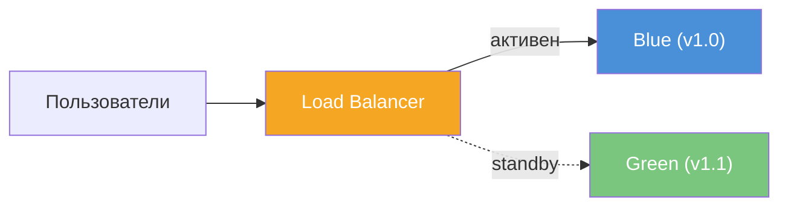

**Плюсы:** мгновенный откат; полная изоляция новой версии до переключения. **Минусы:** двойные ресурсы; переключение «все или ничего». Использовать когда допустимы двойные ресурсы и нужен быстрый откат (критичные сервисы).

Переключение трафика делают на уровне балансировщика (смена upstream), `Ingress` (смена `backend Service`) или DNS. Перед переключением на green выполняют smoke-тесты и при необходимости ручную проверку. После переключения blue остаётся развёрнутым с предыдущей версией — при инциденте переключают трафик обратно на blue одной операцией.

**Реализация в Kubernetes** — два `Deployment` с разными версиями образа и переключение selector у `Service`:

```yaml
# deployment-blue.yaml
apiVersion: apps/v1
kind: Deployment
metadata:
  name: myapp-blue
  labels:
    app: myapp
    version: blue
spec:
  replicas: 3
  selector:
    matchLabels:
      app: myapp
      version: blue
  template:
    metadata:
      labels:
        app: myapp
        version: blue
    spec:
      containers:
        - name: myapp
          image: registry.example.com/myapp:1.0.0
          ports:
            - containerPort: 8080
          readinessProbe:
            httpGet:
              path: /ready
              port: 8080
            initialDelaySeconds: 10
            periodSeconds: 5
---
# deployment-green.yaml
apiVersion: apps/v1
kind: Deployment
metadata:
  name: myapp-green
  labels:
    app: myapp
    version: green
spec:
  replicas: 3
  selector:
    matchLabels:
      app: myapp
      version: green
  template:
    metadata:
      labels:
        app: myapp
        version: green
    spec:
      containers:
        - name: myapp
          image: registry.example.com/myapp:1.1.0
          ports:
            - containerPort: 8080
          readinessProbe:
            httpGet:
              path: /ready
              port: 8080
            initialDelaySeconds: 10
            periodSeconds: 5
---
# service.yaml — переключение selector
apiVersion: v1
kind: Service
metadata:
  name: myapp
spec:
  selector:
    app: myapp
    version: green  # переключить на blue для отката
  ports:
    - port: 80
      targetPort: 8080
```

**Практика:** образ тегировать по версии (`myapp:1.2.3`); перед переключением проверить readiness всех подов green и smoke-тесты. При откате — одна команда смены selector: `kubectl patch svc myapp -p '{"spec":{"selector":{"version":"blue"}}}'`; не удалять blue до стабилизации green.


> [!mcq]
> - [ ] Blue-Green требует даунтайм при переключении — нельзя избежать прерывания | ❌ ПОСЛЕДСТВИЕ: переключение Service selector мгновенное; именно для zero-downtime переключения 100% трафика и нужен Blue-Green
> - [ ] После успешного переключения blue-окружение нужно сразу удалить для экономии | ❌ ПОСЛЕДСТВИЕ: удаление blue до стабилизации green = нет возможности мгновенного отката; держать blue как минимум несколько часов/дней
> - [x] Два идентичных окружения; 100% трафика переключается одной командой (selector/DNS); old остаётся для instant rollback | ✓ ПРИМЕНЯТЬ: критичные сервисы с zero-downtime требованием + нужен мгновенный rollback 📋 ПРАВИЛО: Blue-Green = 2x infra cost + instant switch + instant rollback 🔗 См. Q2
> - [ ] Blue-Green и Canary одно и то же — оба постепенно переключают трафик | ❌ ПОСЛЕДСТВИЕ: Canary — постепенная смена % трафика; Blue-Green — мгновенное переключение 100%; цель и механизм разные

## Q2. (!) Что такое Canary деплой и чем он отличается от Blue-Green?

**Canary** — новая версия получает небольшую долю трафика (например, 5%); остальной трафик — на старую. Долю постепенно увеличивают при отсутствии ошибок.

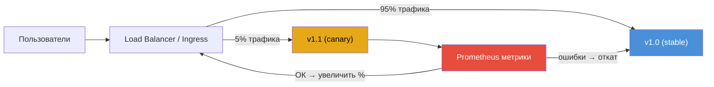

**Отличие от Blue-Green:** постепенное введение; меньше ресурсов (не два полных копирования); выше сложность (нужен контроль трафика по версиям). Использовать когда нужно минимизировать риск и можно постепенно увеличивать долю.

| Характеристика | Blue-Green | Canary |
|---|---|---|
| Переключение трафика | Всё сразу (100%) | Постепенно (5% → 25% → 100%) |
| Ресурсы | Двойные | Минимальные (1-2 canary-пода) |
| Откат | Мгновенный (switch back) | Убрать canary-поды |
| Сложность | Низкая | Высокая (нужен traffic splitting) |
| Валидация | До переключения | В процессе, по метрикам |

Реализация в [Kubernetes](../devops/kubernetes-interview.md): два `Deployment` (старая и новая версия) и `Service / Ingress` с правилами веса. С `Istio VirtualService`:

```yaml
apiVersion: networking.istio.io/v1beta1
kind: VirtualService
metadata:
  name: myapp
spec:
  hosts:
    - myapp.example.com
  http:
    - route:
        - destination:
            host: myapp
            subset: stable
          weight: 95
        - destination:
            host: myapp
            subset: canary
          weight: 5
---
apiVersion: networking.istio.io/v1beta1
kind: DestinationRule
metadata:
  name: myapp
spec:
  host: myapp
  subsets:
    - name: stable
      labels:
        version: v1
    - name: canary
      labels:
        version: v2
```

При стабильных метриках долю v2 увеличивают до 50%, затем 100%. При росте ошибок или latency трафик возвращают на v1. Инструменты `Flagger`, `Argo Rollouts` автоматизируют Canary: анализируют метрики из [Prometheus](../monitoring/metrics-tracing-interview.md) и продвигают или откатывают новую версию.


> [!mcq]
> - [ ] Canary требует двойной инфраструктуры как Blue-Green | ❌ ПОСЛЕДСТВИЕ: Canary добавляет только N% новых подов (5-10%); Blue-Green требует 2x; Canary экономичнее
> - [ ] Canary нельзя автоматизировать — только ручное переключение процентов | ❌ ПОСЛЕДСТВИЕ: Flagger и Argo Rollouts автоматизируют Canary: анализируют метрики Prometheus и автоматически rollback при деградации
> - [ ] При Canary нельзя откатиться — трафик уже на новой версии | ❌ ПОСЛЕДСТВИЕ: старая версия работает параллельно; при деградации трафик возвращается на 100% старой версии за секунды
> - [x] Небольшой % трафика (5-10%) на новую версию; постепенное увеличение при стабильных метриках; Flagger/Argo Rollouts автоматизируют | ✓ ПРИМЕНЯТЬ: безопасное тестирование новой версии на реальном трафике без полного переключения 📋 ПРАВИЛО: Canary = A/B на метриках; auto-promote или auto-rollback 🔗 См. Q1

## Q3. (!) Что такое Rolling Update и как он работает в Kubernetes?

`Rolling Update` — поды новой версии создаются по одному (или по несколько), старые удаляются по одному. В [Kubernetes](../devops/kubernetes-interview.md) задаётся в `Deployment` через `strategy.type: RollingUpdate`.

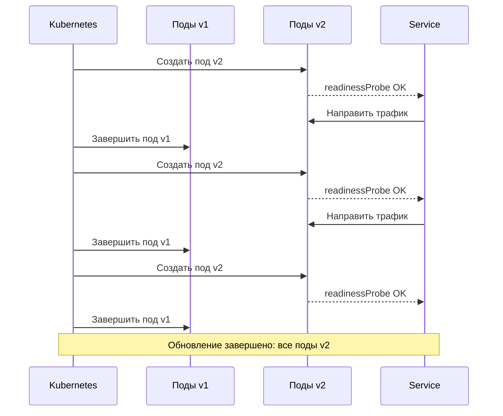

Ключевые параметры: `maxSurge` (сколько лишних подов допускается сверх желаемого числа), `maxUnavailable` (сколько подов может быть недоступно). Нулевой простой при `maxUnavailable: 0` и достаточной ёмкости.

```yaml
apiVersion: apps/v1
kind: Deployment
metadata:
  name: myapp
spec:
  replicas: 3
  strategy:
    type: RollingUpdate
    rollingUpdate:
      maxSurge: 1        # макс 4 пода (3 + 1)
      maxUnavailable: 0   # всегда минимум 3 пода доступны
  selector:
    matchLabels:
      app: myapp
  template:
    metadata:
      labels:
        app: myapp
    spec:
      containers:
        - name: myapp
          image: registry.example.com/myapp:1.1.0
          ports:
            - containerPort: 8080
          readinessProbe:
            httpGet:
              path: /ready
              port: 8080
            initialDelaySeconds: 10
            periodSeconds: 5
          livenessProbe:
            httpGet:
              path: /health
              port: 8080
            initialDelaySeconds: 30
            periodSeconds: 10
      terminationGracePeriodSeconds: 30
```

**Плюсы:** не требует двойных ресурсов; постепенное обновление. **Минусы:** кратковременное сосуществование версий; откат — повторный rolling к предыдущей версии. При `maxUnavailable: 0` и `maxSurge: 1` обновление медленнее, но гарантирован нулевой простой. При `maxSurge: 25%` и `maxUnavailable: 25%` (значения по умолчанию) — быстрее, но допускается временная недоступность части подов.


> [!mcq]
> - [ ] Rolling update гарантирует zero-downtime при любых настройках | ❌ ПОСЛЕДСТВИЕ: при maxUnavailable > 0 возможны краткие недоступности; для zero-downtime нужен maxUnavailable: 0 + readinessProbe
> - [ ] Rolling update не поддерживает откат — нужен Blue-Green для rollback | ❌ ПОСЛЕДСТВИЕ: kubectl rollout undo deployment/myapp откатывает к предыдущей версии; Rolling update поддерживает rollback через --to-revision
> - [ ] При Rolling update все версии доступны одновременно — нет migration проблем | ❌ ПОСЛЕДСТВИЕ: две версии работают параллельно; БД-миграции и API-изменения должны быть backward-compatible иначе ошибки на старых подах
> - [x] Поды обновляются постепенно: maxSurge=25% создаёт новые, maxUnavailable=25% убивает старые; обе версии работают параллельно | ✓ ПРИМЕНЯТЬ: ресурсоэффективное обновление без двойной инфраструктуры; требуется backward compatibility 📋 ПРАВИЛО: Rolling = постепенно + без 2x cost; нужна DB backward compat 🔗 См. Q1

## Q4. Что такое Recreate стратегия и когда её применять?

**Recreate** — все старые поды (инстансы) останавливаются, затем создаются новые. Будет простой на время перезапуска.

```yaml
apiVersion: apps/v1
kind: Deployment
metadata:
  name: myapp
spec:
  replicas: 3
  strategy:
    type: Recreate  # все поды убиваются, затем создаются заново
  selector:
    matchLabels:
      app: myapp
  template:
    metadata:
      labels:
        app: myapp
    spec:
      containers:
        - name: myapp
          image: registry.example.com/myapp:2.0.0
          ports:
            - containerPort: 8080
```

Применять когда приложение не поддерживает одновременную работу двух версий (например, миграция БД с breaking change) или допустим краткий простой (внутренние сервисы, окно обслуживания). При обновлении образа все поды текущей ревизии завершаются (с учётом `terminationGracePeriodSeconds`), затем создаются поды с новым образом.

В отличие от `RollingUpdate` нет одновременной работы старых и новых подов — подходит для `StatefulSet` с общим хранилищем или для приложений, где миграция схемы несовместима со старой версией. Окно простоя можно минимизировать быстрым стартом приложения и readiness probe с коротким `initialDelaySeconds`.

**Практика:** планировать `Recreate` в deployment window; перед применением выполнить миграцию БД (если нужна), затем обновить образ. Для минимизации простоя — быстрый старт приложения (Spring Boot с `spring.main.lazy-initialization=true` для dev).


> [!mcq]
> - [ ] Recreate — самая быстрая стратегия для production с минимальным риском | ❌ ПОСЛЕДСТВИЕ: Recreate создаёт downtime (все поды удаляются перед созданием новых); подходит только для dev/staging или когда backward-incompatible изменения обязательны
> - [x] Recreate: все поды убиваются → downtime → новые поды создаются; применять при невозможности двух версий параллельно | ✓ ПРИМЕНЯТЬ: backward-incompatible DB schema change; singleton stateful services; когда downtime допустим 📋 ПРАВИЛО: Recreate = запланированный даунтайм; Blue-Green/Rolling = zero-downtime 🔗 См. Q1
> - [ ] Recreate не поддерживается Kubernetes — нужен сторонний инструмент | ❌ ПОСЛЕДСТВИЕ: Kubernetes поддерживает Recreate нативно: spec.strategy.type: Recreate в Deployment
> - [ ] После Recreate старые поды остаются в pending для быстрого rollback | ❌ ПОСЛЕДСТВИЕ: при Recreate все старые поды завершены; для rollback нужен новый деплой; нет instant rollback как в Blue-Green

## Q5. (!) Как обеспечить zero-downtime при деплое?

Подходы: (1) `Rolling Update` с `maxUnavailable: 0` и readiness probe — новые поды получают трафик только когда готовы. (2) `Blue-Green` — переключение трафика после готовности нового окружения. (3) `Canary` — постепенное переключение.

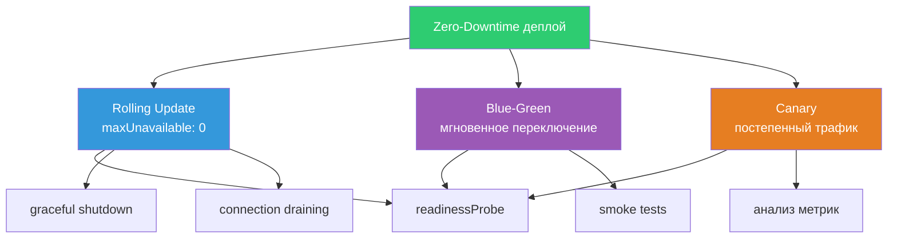

Обязательные компоненты:
- **readiness probe** — под не получает трафик до готовности
- **graceful shutdown** — завершение текущих запросов при остановке (`terminationGracePeriodSeconds`)
- **connection draining** — на балансировщике
- **preStop hook** — задержка для де-регистрации из Service

```yaml
# Пример пода с graceful shutdown
spec:
  terminationGracePeriodSeconds: 30
  containers:
    - name: myapp
      lifecycle:
        preStop:
          exec:
            command: ["sh", "-c", "sleep 5"]  # даём время на де-регистрацию
      readinessProbe:
        httpGet:
          path: /ready
          port: 8080
        initialDelaySeconds: 10
        periodSeconds: 5
        failureThreshold: 3
```

Для Spring Boot приложения — включить graceful shutdown:

```yaml
# application.yml
server:
  shutdown: graceful
spring:
  lifecycle:
    timeout-per-shutdown-phase: 30s
```


> [!mcq]
> - [ ] Zero-downtime достигается автоматически без дополнительной настройки | ❌ ПОСЛЕДСТВИЕ: нужны readinessProbe + graceful shutdown + preStop hook; без них поды получают трафик до готовности и обрываются резко
> - [ ] readinessProbe и livenessProbe — одно и то же | ❌ ПОСЛЕДСТВИЕ: readinessProbe убирает под из балансировщика при не-ready; livenessProbe рестартует под при зависании; разные цели и последствия
> - [ ] preStop hook не нужен если есть readinessProbe | ❌ ПОСЛЕДСТВИЕ: без preStop под убивается сразу при SIGTERM; in-flight запросы обрываются; нужен preStop sleep + graceful shutdown timeout
> - [x] readinessProbe + maxUnavailable:0 + preStop sleep + graceful shutdown обеспечивают zero-downtime | ✓ ПРИМЕНЯТЬ: любой production Rolling Update; readiness убирает из LB, preStop даёт время дочистить 📋 ПРАВИЛО: zero-downtime = readiness + graceful + preStop; все три вместе 🔗 См. Q3

## Q6. Что такое rollback и как его выполнить в Kubernetes?

**Rollback** — возврат к предыдущей (или заданной) версии приложения. В [Kubernetes](../devops/kubernetes-interview.md):

```bash
# Посмотреть историю ревизий
kubectl rollout history deployment/myapp

# Откат к предыдущей ревизии
kubectl rollout undo deployment/myapp

# Откат к конкретной ревизии
kubectl rollout undo deployment/myapp --to-revision=3

# Дождаться завершения
kubectl rollout status deployment/myapp
```

Ревизии хранятся в `Deployment` (`revisionHistoryLimit`, по умолчанию 10). Откат выполняет тот же механизм, что и деплой (`RollingUpdate` по умолчанию). При откате после миграции БД нужно учитывать обратную совместимость схемы: старая версия приложения должна работать с текущим состоянием БД или откатывать и миграции (`Flyway`/`Liquibase`).

**Практика:** `revisionHistoryLimit` держать достаточным (например, 10); образы предыдущих версий не удалять из registry до истечения политики хранения.


> [!mcq]
> - [ ] kubectl rollout undo удаляет все revision history | ❌ ПОСЛЕДСТВИЕ: undo откатывает к предыдущей ревизии и сохраняет историю; удалить историю нельзя через undo
> - [ ] После rollback в Kubernetes нужно вручную удалить новые поды | ❌ ПОСЛЕДСТВИЕ: kubectl rollout undo автоматически создаёт поды предыдущей версии и удаляет новые через Rolling Update механизм
> - [x] kubectl rollout undo deployment/myapp (или --to-revision=N); ревизии хранятся в revisionHistoryLimit; DB миграции нужно проверять на backward compat | ✓ ПРИМЕНЯТЬ: при деградации после деплоя; откат в секунды 📋 ПРАВИЛО: rollback = undo + DB backward compat; образы не удалять до истечения политики 🔗 См. Q3
> - [ ] revisionHistoryLimit=0 — оптимальная настройка для экономии ресурсов | ❌ ПОСЛЕДСТВИЕ: при revisionHistoryLimit=0 нет истории ревизий; kubectl rollout undo не работает; нет возможности быстрого rollback

## Q7. Что такое feature flags и как они связаны с деплоем?

**Feature flags** — переключатели в коде или конфигурации, включающие/выключающие функциональность без нового деплоя. Связь с деплоем: можно задеплоить код с выключенной фичей, затем включить её через флаг (снижение риска); откат — выключение флага вместо rollback деплоя.

```java
// Spring Boot: feature flag через конфигурацию
@RestController
@RequiredArgsConstructor
public class CheckoutController {

    @Value("${feature.new-checkout:false}")
    private boolean newCheckoutEnabled;

    @GetMapping("/checkout")
    public ResponseEntity<?> checkout(@RequestBody CheckoutRequest request) {
        if (newCheckoutEnabled) {
            return newCheckoutService.process(request);
        }
        return legacyCheckoutService.process(request);
    }
}
```

```yaml
# application.yml — переключение через Config Server или env var
feature:
  new-checkout: false  # включить: true
```

Типичный поток: деплой новой версии с фичей за флагом (off) → smoke test → включение флага для части пользователей → мониторинг → полное включение или откат флага. При инциденте отключают флаг, не откатывая деплой.

Инструменты: `LaunchDarkly`, `Unleash`, `Spring Cloud Config`, кастомные флаги в БД/конфиге. Для мгновенного отключения при инциденте — внешний сервис с низкой задержкой или `Redis` с TTL 10-30 с.


> [!mcq]
> - [ ] Feature flag — это то же самое что feature branch; оба требуют деплоя | ❌ ПОСЛЕДСТВИЕ: feature flag — runtime toggle без деплоя; feature branch — код в VCS, требует merge+деплой; разные механизмы
> - [ ] Feature flags нужно хранить в коде; динамическое изменение небезопасно | ❌ ПОСЛЕДСТВИЕ: флаги в коде требуют деплоя для изменения; смысл флагов — изменять behavior без деплоя (Unleash, LaunchDarkly)
> - [x] Код деплоится с выключенным флагом → флаг включается без деплоя; откат = выключить флаг; Unleash/LaunchDarkly для управления | ✓ ПРИМЕНЯТЬ: риск-снижение при деплое; A/B тестирование; постепенный rollout 📋 ПРАВИЛО: feature flag = deploy code dark + enable flag = zero-risk rollout 🔗 См. Q2
> - [ ] Feature flags нельзя использовать в Java/Spring — только в JavaScript | ❌ ПОСЛЕДСТВИЕ: Spring Boot @Value + Unleash/FF4J — полноценная поддержка feature flags в Java; широко используется в enterprise

## Q8. Что такое A/B деплой и когда его использовать?

**A/B деплой** — часть пользователей получает версию A, часть — версию B; сравнение метрик (конверсия, ошибки, latency). Реализуется через Canary (трафик по версиям) или feature flags (разные варианты в одной версии). Использовать для экспериментов (новый UI, алгоритм) и принятия решений на основе данных перед полным переходом.

**Реализация через Ingress с routing по header:**

```yaml
apiVersion: networking.k8s.io/v1
kind: Ingress
metadata:
  name: myapp-canary
  annotations:
    nginx.ingress.kubernetes.io/canary: "true"
    nginx.ingress.kubernetes.io/canary-by-header: "X-Experiment"
    nginx.ingress.kubernetes.io/canary-by-header-value: "variant-b"
spec:
  rules:
    - host: myapp.example.com
      http:
        paths:
          - path: /
            pathType: Prefix
            backend:
              service:
                name: myapp-variant-b
                port:
                  number: 80
```

**Практика:** метрики помечать лейблом варианта (A/B) в [Prometheus / Grafana](../monitoring/metrics-tracing-interview.md); решение о полном переходе — по статистической значимости и минимальному времени эксперимента (1-2 недели). При регрессии по ошибкам или latency — откат варианта B.


> [!mcq]
> - [ ] A/B и Canary — одно и то же; оба делят трафик по % | ❌ ПОСЛЕДСТВИЕ: Canary = стабилизация новой версии (% трафика → 100%); A/B = эксперимент для сравнения (конверсия, UX); цели разные
> - [ ] A/B тест можно завершить за один день при достаточном трафике | ❌ ПОСЛЕДСТВИЕ: статистическая значимость требует времени; преждевременное завершение — false positive; рекомендуется минимум 1-2 недели
> - [x] A/B = эксперимент на части пользователей (by header/cookie/userId); сравнение метрик; решение по статзначимости | ✓ ПРИМЕНЯТЬ: новый UI/алгоритм; data-driven decision перед полным переходом 📋 ПРАВИЛО: A/B = experiment → metrics → decision; не путать с Canary = stabilization 🔗 См. Q2
> - [ ] A/B тест требует два отдельных деплоя и не работает с feature flags | ❌ ПОСЛЕДСТВИЕ: A/B реализуется через feature flags (один деплой, разные варианты в коде) или Canary (разные версии); оба подхода валидны

## Q9. (!) Как настроить readiness и liveness probe для безопасного деплоя?

`readinessProbe` — под получает трафик от `Service` только когда probe успешен (приложение готово принимать запросы). При деплое новый под не получит трафик до готовности. `livenessProbe` — при неудаче контейнер перезапускается (приложение зависло).

```yaml
apiVersion: apps/v1
kind: Deployment
metadata:
  name: myapp
spec:
  template:
    spec:
      containers:
        - name: myapp
          image: registry.example.com/myapp:1.0.0
          ports:
            - containerPort: 8080
          # Готовность принимать трафик
          readinessProbe:
            httpGet:
              path: /actuator/health/readiness
              port: 8080
            initialDelaySeconds: 15
            periodSeconds: 5
            timeoutSeconds: 3
            failureThreshold: 3
            successThreshold: 1
          # Жив ли контейнер
          livenessProbe:
            httpGet:
              path: /actuator/health/liveness
              port: 8080
            initialDelaySeconds: 30
            periodSeconds: 10
            timeoutSeconds: 5
            failureThreshold: 3
          # Стартовый probe (Kubernetes 1.20+)
          startupProbe:
            httpGet:
              path: /actuator/health
              port: 8080
            initialDelaySeconds: 5
            periodSeconds: 5
            failureThreshold: 30  # даёт до 155 сек на старт
```

Для Spring Boot приложений — использовать Actuator endpoints `/actuator/health/readiness` и `/actuator/health/liveness` (доступны из коробки с Spring Boot 2.3+). `startupProbe` (Kubernetes 1.20+) отключает readiness/liveness на время старта — полезно для медленно стартующих приложений.


> [!mcq]
> - [ ] liveness probe при неудаче убирает под из балансировщика — он перестаёт получать трафик | ❌ ПОСЛЕДСТВИЕ: liveness failure → контейнер рестартует; убирает из LB только readiness failure; разные последствия
> - [ ] startupProbe не нужен если initialDelaySeconds достаточный | ❌ ПОСЛЕДСТВИЕ: без startupProbe медленно стартующий под может fail liveness probe до готовности → бесконечный restart loop; startupProbe отключает liveness до первого успешного старта
> - [x] readinessProbe убирает из балансировщика при не-ready; livenessProbe рестартует контейнер при зависании; startupProbe защищает медленный старт | ✓ ПРИМЕНЯТЬ: всегда для production Spring Boot: /actuator/health/readiness + /actuator/health/liveness 📋 ПРАВИЛО: readiness=traffic; liveness=restart; startup=boot protection 🔗 См. Q5
> - [ ] Один общий health endpoint /health достаточен для всех probe | ❌ ПОСЛЕДСТВИЕ: /actuator/health/readiness и /actuator/health/liveness — разные endpoints с разными стратегиями; один /health смешивает readiness и liveness семантику

## Q10. (!) Что такое deployment pipeline и какие этапы в него входят?

**Deployment pipeline** — цепочка этапов от коммита до продакшена. Один и тот же артефакт (образ с тегом по git SHA) промотируется по окружениям.

```mermaid
graph LR
    C[Коммит] --> B[Build]
    B --> UT[Unit Tests]
    UT --> DI[Docker Build]
    DI --> PR[Push Registry]
    PR --> DD[Deploy Dev]
    DD --> IT[Integration Tests]
    IT --> DS[Deploy Staging]
    DS --> E2E[E2E Tests]
    E2E --> AP{Approval}
    AP -->|"ОК"| DP[Deploy Prod]
    DP --> SM[Smoke Tests]
    SM --> MN[Мониторинг]
    MN -->|"ошибки"| RB[Rollback]
    
    style C fill:#2ecc71,color:#fff
    style AP fill:#e67e22,color:#fff
    style RB fill:#e74c3c,color:#fff
    style DP fill:#3498db,color:#fff
```

Артефакт (jar, образ) собирается один раз и промотируется по окружениям; конфигурация меняется по окружению (переменные, секреты), не образ. Подробнее о проектировании пайплайнов — в [вопросах по CI/CD пайплайнам](pipeline-design-interview.md).

**Практика:** один и тот же образ (`myapp:${GIT_SHA}` или semver) промотировать по окружениям; конфигурация — `ConfigMap / Secrets` по окружению. После деплоя в prod — этап проверки метрик (error rate, latency); при деградации — автоматический rollback (`Flagger`, `Argo Rollouts`) или алерт.


> [!mcq]
> - [ ] Deployment pipeline собирает разные артефакты для каждого окружения | ❌ ПОСЛЕДСТВИЕ: один образ с тегом по git SHA промотируется по всем окружениям; конфигурация меняется через ConfigMap/Secrets, не пересборкой
> - [ ] В pipeline тесты запускаются только перед production деплоем | ❌ ПОСЛЕДСТВИЕ: unit тесты → после build; integration тесты → после dev deploy; E2E → после staging; ранняя проверка = дешёвый fix
> - [ ] Pipeline нужно настраивать отдельно для каждого окружения | ❌ ПОСЛЕДСТВИЕ: один pipeline с параметром environment; образ один и тот же — promote паттерн; разные pipeline для окружений = дублирование и рассинхрон
> - [x] Один образ (myapp:SHA) собирается один раз → promote по окружениям; конфигурация через ConfigMap/Secrets; smoke tests после prod деплоя | ✓ ПРИМЕНЯТЬ: любой production CI/CD; build once, deploy everywhere 📋 ПРАВИЛО: pipeline = build once + promote + smoke; конфиг снаружи образа 🔗 См. Q6

## Q11. Что такое immutable deployment и чем он лучше in-place update?

**Immutable deployment** — сервер/контейнер не изменяется «на месте»; новая версия — новый образ/инстанс, старый уничтожается. **In-place update** — обновление кода и конфигурации на том же инстансе (SSH, замена jar).

| Характеристика | Immutable | In-place |
|---|---|---|
| Предсказуемость | Высокая (образ = артефакт) | Низкая (дрейф конфигурации) |
| Откат | Развернуть предыдущий образ | Сложно воспроизвести |
| Одинаковость инстансов | Гарантирована | Может расходиться |
| Скорость деплоя | Зависит от образа | Быстрее (замена файлов) |
| Аудит | Полный (тег образа → версия кода) | Сложно отследить |

В [Kubernetes](../devops/kubernetes-interview.md) деплой по сути immutable: при обновлении образа создаются новые поды с новым образом, старые удаляются; конфигурация инжектируется через `ConfigMap / Secrets`, не меняя образ. Откат — `kubectl rollout undo`.

**Практика:** не менять образ «на месте» (не exec в под и не заменять бинарник); конфигурация только через `ConfigMap / Secrets` или переменные при старте. Образ собирать в CI из кода; тег образа = версия для трассируемости и отката.


> [!mcq]
> - [ ] Immutable deployment нельзя применить для stateful сервисов | ❌ ПОСЛЕДСТВИЕ: StatefulSet в Kubernetes — immutable образ + stateful storage через PVC; state в pod не хранится, а в отдельном volumes; immutable применимо везде
> - [ ] В Kubernetes можно обновить образ на запущенном поде без его пересоздания | ❌ ПОСЛЕДСТВИЕ: kubectl exec + замена бинарника = violation of immutability; при рестарте под вернётся к образу; правильно — обновить image в Deployment
> - [x] В Kubernetes нельзя изменять запущенный под: обновление образа = новый под + новый образ; конфигурация через ConfigMap/Secrets; тег образа = версия | ✓ ПРИМЕНЯТЬ: всегда в Kubernetes; не exec в под для изменений 📋 ПРАВИЛО: immutable = new image per change; конфиг снаружи образа через env/ConfigMap 🔗 См. Q3
> - [ ] kubectl exec в под и замена jar — безопасный способ обновления | ❌ ПОСЛЕДСТВИЕ: изменения в под теряются при рестарте; нет истории версий; нарушение immutability; следующий deployment rollout перезапишет

## Q12. Как организовать деплой в несколько окружений (dev, staging, prod)?

Подходы: (1) Один pipeline с этапами по окружениям (dev автоматически, staging после тестов, prod после approval). (2) Один и тот же образ промотируется по окружениям. (3) GitOps — отдельные каталоги под dev, staging, prod.

**Структура Kustomize overlays для GitOps:**

```
manifests/
├── base/
│   ├── deployment.yaml
│   ├── service.yaml
│   └── kustomization.yaml
├── overlays/
│   ├── dev/
│   │   ├── kustomization.yaml
│   │   ├── configmap.yaml
│   │   └── replicas-patch.yaml
│   ├── staging/
│   │   ├── kustomization.yaml
│   │   └── configmap.yaml
│   └── prod/
│       ├── kustomization.yaml
│       ├── configmap.yaml
│       └── hpa.yaml
```

```yaml
# overlays/prod/kustomization.yaml
apiVersion: kustomize.config.k8s.io/v1beta1
kind: Kustomization
resources:
  - ../../base
patchesStrategicMerge:
  - replicas-patch.yaml
configMapGenerator:
  - name: myapp-config
    literals:
      - SPRING_PROFILES_ACTIVE=prod
      - LOG_LEVEL=WARN
images:
  - name: registry.example.com/myapp
    newTag: 1.2.3  # обновляется CI/CD или Flux
```

**Практика:** образ один (`myapp:${GIT_SHA}`); в каждом окружении свои `ConfigMap`/`Secrets` (DB URL, feature flags). В GitOps — [Argo CD или Flux](pipeline-design-interview.md) синхронизируют кластер с выбранным overlay.


> [!mcq]
> - [ ] Immutable deployment и Rolling Update — взаимоисключающие подходы | ❌ ПОСЛЕДСТВИЕ: Rolling Update в Kubernetes — это immutable deployment; новые поды с новым образом, старые удаляются; образ неизменен
> - [ ] In-place update проще для отката — достаточно перезаписать jar на сервере | ❌ ПОСЛЕДСТВИЕ: в-place нет истории версий; откат = ещё один in-place; нет гарантии идентичности окружения; сложнее чем kubectl rollout undo
> - [x] Immutable: новый образ → новый под → старый удаляется; rollback = predefined image tag; гарантия идентичности среды | ✓ ПРИМЕНЯТЬ: Kubernetes (default); infrastructure as code; нет configuration drift 📋 ПРАВИЛО: immutable = new image, not in-place update; rollback = image tag 🔗 См. Q3
> - [ ] Immutable требует хранить образы для всех версий навсегда | ❌ ПОСЛЕДСТВИЕ: политика retention: хранить N последних + tagged releases; старые untagged образы удаляются по политике registry

## Q13. Что такое database migration при деплое и как её выполнять?

Миграция БД — изменение схемы или данных при выходе новой версии приложения. Инструменты: `Flyway`, `Liquibase`.

**Безопасная последовательность при Rolling Update:**

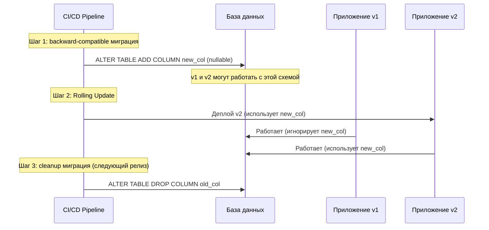

Подходы: (1) **Backward-compatible** миграции — новая версия работает со старой и новой схемой; миграция выполняется, затем деплой. (2) Миграция в момент деплоя (старт приложения) — риск при откате (нужны обратные миграции). Рекомендация: миграции идемпотентны; тестировать откат схемы отдельно. Expand-contract pattern: добавить → мигрировать данные → удалить старое.


> [!mcq]
> - [ ] Миграцию БД нужно запускать одновременно с деплоем нового кода | ❌ ПОСЛЕДСТВИЕ: при Rolling Update старые поды работают с новой схемой; нужна backward-compatible миграция ДО деплоя или expand-contract pattern
> - [ ] DROP COLUMN можно выполнять сразу после деплоя новой версии | ❌ ПОСЛЕДСТВИЕ: если rollback нужен — старый код не работает без удалённой колонки; expand-contract: добавить → мигрировать данные → удалить только в следующем релизе
> - [x] Backward-compatible миграция ПЕРЕД деплоем; expand-contract для breaking changes; Flyway/Liquibase для управления | ✓ ПРИМЕНЯТЬ: Rolling Update + DB schema change; нужен forward/backward compat 📋 ПРАВИЛО: миграция до деплоя + expand-contract = zero-risk DB change 🔗 См. Q3
> - [ ] Liquibase и Flyway нельзя запускать в Kubernetes — только на отдельном сервере | ❌ ПОСЛЕДСТВИЕ: Flyway/Liquibase запускаются как initContainer или Job в Kubernetes до старта основного контейнера; полностью поддерживается

## Q14. Что такое smoke test и когда его запускать при деплое?

**Smoke test** — минимальный набор проверок после деплоя (приложение отвечает, ключевые эндпоинты доступны). Запускают сразу после деплоя в окружение; при падении — автоматический rollback или алерт.

```bash
#!/bin/bash
# smoke-test.sh — запуск после деплоя
set -e

APP_URL="${1:-http://myapp.example.com}"
MAX_RETRIES=5
RETRY_INTERVAL=10

for i in $(seq 1 $MAX_RETRIES); do
  HTTP_CODE=$(curl -s -o /dev/null -w "%{http_code}" "$APP_URL/actuator/health")
  if [ "$HTTP_CODE" = "200" ]; then
    echo "Health check passed"
    break
  fi
  echo "Attempt $i/$MAX_RETRIES: HTTP $HTTP_CODE, retrying in ${RETRY_INTERVAL}s..."
  sleep $RETRY_INTERVAL
done

# Проверка критичного API
HTTP_CODE=$(curl -s -o /dev/null -w "%{http_code}" "$APP_URL/api/v1/status")
if [ "$HTTP_CODE" != "200" ]; then
  echo "FAIL: /api/v1/status returned $HTTP_CODE"
  kubectl rollout undo deployment/myapp
  exit 1
fi

echo "All smoke tests passed"
```

Сценарии: проверка health endpoint (200), один-два критичных API. Время выполнения — секунды, не минуты. Smoke test не заменяет интеграционные и e2e тесты — они запускаются до деплоя в prod (в staging).


> [!mcq]
> - [ ] Smoke tests заменяют integration и E2E тесты после деплоя в production | ❌ ПОСЛЕДСТВИЕ: smoke tests — минимальная проверка (health + 2-3 критичных API); integration/E2E тесты запускаются в staging до production деплоя
> - [x] Smoke tests — минимальный набор быстрых проверок (секунды) после деплоя; при падении — rollback; не заменяют integration/E2E | ✓ ПРИМЕНЯТЬ: сразу после каждого деплоя в любое окружение; автоматический триггер 📋 ПРАВИЛО: smoke = health + critical path; seconds not minutes; fail = rollback 🔗 См. Q6
> - [ ] Smoke tests нужно запускать только после prod деплоя | ❌ ПОСЛЕДСТВИЕ: smoke tests запускаются после деплоя в каждое окружение (dev, staging, prod); ранняя проверка = дешёвый откат
> - [ ] Smoke test должен покрывать все API эндпоинты для надёжности | ❌ ПОСЛЕДСТВИЕ: полное покрытие = медленно; smoke = быстрая проверка критичных путей; полное E2E тестирование в staging

## Q15. Как обеспечить откат (rollback) при проблемах после деплоя?

Меры: (1) Хранить предыдущие ревизии/образы (Kubernetes rollout history). (2) Автоматический rollback по [метрикам](../monitoring/metrics-tracing-interview.md) (ошибки, latency) — `Argo Rollouts`, `Flagger`. (3) Ручной rollback одной командой (`kubectl rollout undo`). (4) Feature flags — отключить фичу без отката деплоя. (5) Документированная процедура и права на откат без длительного согласования.

**Практика:** образы предыдущих версий не удалять из registry до истечения политики хранения; `revisionHistoryLimit` в `Deployment` держать достаточным (например, 10). `Flagger / Argo Rollouts` при Canary анализируют метрики (error rate, latency) из Prometheus; при превышении порога откатывают трафик на старую версию.

Команды: `kubectl rollout undo` — откат на предыдущую ревизию; `kubectl rollout undo --to-revision=3` — к конкретной ревизии; `kubectl rollout status` — дождаться завершения. После отката проверить readiness и smoke; при миграциях БД убедиться, что старая версия приложения совместима с текущей схемой.


> [!mcq]
> - [ ] Argo Rollouts нужен только для Canary; Blue-Green откат делается только вручную | ❌ ПОСЛЕДСТВИЕ: Argo Rollouts поддерживает и Blue-Green с автоматическим анализом и rollback по метрикам
> - [ ] Flagger/Argo Rollouts не работают с Prometheus — нужен отдельный инструмент | ❌ ПОСЛЕДСТВИЕ: Flagger и Argo Rollouts нативно интегрируются с Prometheus для metric analysis при Canary/Blue-Green
> - [x] kubectl rollout undo + revisionHistoryLimit≥10 + feature flag disable + Flagger/Argo Rollouts автоматический rollback по метрикам | ✓ ПРИМЕНЯТЬ: слои rollback: мгновенный (flag) → секунды (undo) → auto (Flagger) 📋 ПРАВИЛО: rollback strategy = feature flag first, then undo, then auto by metrics 🔗 См. Q6
> - [ ] После деплоя rollback невозможен если были миграции БД | ❌ ПОСЛЕДСТВИЕ: backward-compatible миграции позволяют код rollback при сохранении schema; expand-contract pattern специально для этого

## Q16. Что такое dark launch и когда его применять?

**Dark launch** — новая функциональность развёрнута и получает реальный трафик, но результат не показывается пользователю (или показывается только частично). **Shadow traffic** — копия запросов идёт на новую версию, ответ клиенту от старой.

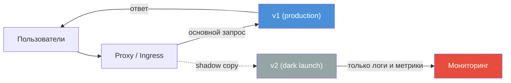

Используют для проверки нагрузки, ошибок и метрик новой версии без изменения пользовательского опыта. Реализация: feature flag «выполнять новый путь, но не показывать результат» или прокси/двойной вызов в коде.

```java
// Dark launch через параллельный вызов
@Service
@RequiredArgsConstructor
public class RecommendationService {

    private final LegacyRecommendationEngine legacy;
    private final NewRecommendationEngine newEngine;
    private final MeterRegistry meterRegistry;

    @Value("${feature.dark-launch-recommendations:false}")
    private boolean darkLaunchEnabled;

    public List<Product> getRecommendations(User user) {
        List<Product> result = legacy.recommend(user);

        if (darkLaunchEnabled) {
            CompletableFuture.runAsync(() -> {
                try {
                    Timer.Sample sample = Timer.start(meterRegistry);
                    newEngine.recommend(user);
                    sample.stop(meterRegistry.timer("recommendations.dark_launch"));
                } catch (Exception e) {
                    meterRegistry.counter("recommendations.dark_launch.errors").increment();
                }
            });
        }

        return result;  // всегда от legacy
    }
}
```

**Shadow traffic через Istio:**

```yaml
apiVersion: networking.istio.io/v1beta1
kind: VirtualService
metadata:
  name: myapp
spec:
  hosts:
    - myapp.example.com
  http:
    - route:
        - destination:
            host: myapp-v1
      mirror:
        host: myapp-v2
      mirrorPercentage:
        value: 100.0
```


> [!mcq]
> - [ ] Dark launch и A/B тест — одно и то же; оба показывают результат пользователю | ❌ ПОСЛЕДСТВИЕ: dark launch — результат пользователю НЕ показывается; A/B — показывается один из вариантов; разные цели
> - [ ] Shadow traffic нельзя применять для stateful операций (запись в БД) | ❌ ПОСЛЕДСТВИЕ: shadow запросы к читающим API безопасны; для записи нужна отдельная shadow БД или dry-run режим; но это техническая сложность, не запрет
> - [x] Dark launch: новый код выполняется с реальным трафиком, результат пользователю не показывается; только метрики и логи; safe preproduction validation | ✓ ПРИМЕНЯТЬ: новый ML-алгоритм; major refactor; high-risk code path без user impact 📋 ПРАВИЛО: dark launch = execute hidden; shadow traffic = mirror copy; оба без user impact 🔗 См. Q7
> - [ ] Dark launch требует отдельного кластера для new version | ❌ ПОСЛЕДСТВИЕ: dark launch реализуется в том же поде через feature flag и CompletableFuture; или Istio mirror; не требует отдельного кластера

## Q17. Как деплой связан с версионированием артефактов (semantic versioning)?

**Semantic versioning** (`MAJOR.MINOR.PATCH`) задаёт версию артефакта (образ, jar). При деплое разворачивают конкретную версию (тег образа). В Kubernetes в `Deployment` указывают образ с конкретным тегом; при откате меняют тег на предыдущий.

**Практика:** стабильные теги (например, `1.2.3`) для продакшена; `latest` избегать в prod; теги по коммиту (git SHA) для трассируемости. Pipeline записывает версию артефакта в аннотации пода или в метрики для аудита «какая версия в проде».

```yaml
# Пример с версией в аннотациях
apiVersion: apps/v1
kind: Deployment
metadata:
  name: myapp
  annotations:
    app.kubernetes.io/version: "1.2.3"
    deploy.source/commit: "abc1234"
spec:
  template:
    metadata:
      labels:
        app.kubernetes.io/version: "1.2.3"
    spec:
      containers:
        - name: myapp
          image: registry.example.com/myapp:1.2.3  # НЕ latest
```


> [!mcq]
> - [ ] image:latest — лучшая практика в Kubernetes для автоматического обновления | ❌ ПОСЛЕДСТВИЕ: latest без тега = non-deterministic; разные ноды могут получить разные версии при imagePullPolicy:Always; нет воспроизводимости
> - [ ] MINOR increment (1.1.0 → 1.2.0) означает breaking change | ❌ ПОСЛЕДСТВИЕ: MINOR = новые backward-compatible features; MAJOR = breaking changes; PATCH = bug fixes; нарушение семантики = confusion у потребителей
> - [x] Тег образа = версия (myapp:1.2.3 или myapp:git-SHA); НЕ latest в prod; аннотации пода с версией для аудита; rollback = смена тега | ✓ ПРИМЕНЯТЬ: всегда тегировать образы версией; latest только в dev 📋 ПРАВИЛО: tag = version = rollback point; latest = no rollback 🔗 См. Q11
> - [ ] Semantic versioning не нужен для внутренних микросервисов | ❌ ПОСЛЕДСТВИЕ: contract testing, API compatibility и rollback требуют определённой версии; git SHA как тег + semver для публичных API = правильная комбинация

## Q18. Что такое deployment approval и когда его требовать?

**Deployment approval** — ручное (или по правилам) подтверждение перехода к следующему этапу (часто деплой в prod). Требуют когда политика компании или регуляторика требует проверки перед продакшеном.

В `GitLab`: protected environments с required approvals; в `GitHub Actions` — environment с reviewers; в `Jenkins` — input step. Для высокочастотных деплоев (несколько раз в день) ручной approval на каждый деплой становится узким местом — тогда оставляют approval только для критичных изменений (схема БД, инфраструктура) или используют автоматический деплой с жёсткими проверками в [pipeline](pipeline-design-interview.md) и автоматическим откатом по метрикам.


> [!mcq]
> - [ ] Ручной approval нужен для каждого деплоя для безопасности | ❌ ПОСЛЕДСТВИЕ: при высокочастотных деплоях ручной approval = бутылочное горлышко; автоматический деплой с жёсткими quality gates быстрее и надёжнее
> - [ ] Deployment approval не поддерживается в GitLab и GitHub Actions | ❌ ПОСЛЕДСТВИЕ: GitLab protected environments + required approvals; GitHub Actions environment + reviewers — нативная поддержка
> - [x] Approval только для критичных изменений (schema, infra) или по регуляторике; для routine deploys — автоматический с quality gates | ✓ ПРИМЕНЯТЬ: prod деплой с DB migration; compliance environment; high-risk changes 📋 ПРАВИЛО: approval = критичность + регуляторика; routine = auto+gates 🔗 См. Q10
> - [ ] После настройки approval process скорость деплоя всегда замедляется в 2x | ❌ ПОСЛЕДСТВИЕ: approval только на production; dev/staging — автоматически; правильная конфигурация не замедляет routine pipeline

## Q19. Как деплоить приложение с зависимостями от внешних сервисов?

Подходы: (1) **Контракты и совместимость API** — новая версия должна работать со старыми версиями зависимостей (backward compatibility). (2) **Feature flags или Canary** — включать вызовы нового сервиса постепенно. (3) **Версионирование API зависимостей** — деплой в порядке совместимости. (4) **Тесты на интеграцию** в pipeline (моки или тестовые инстансы зависимостей).

**Практика:** Contract testing (`Pact`) проверяет совместимость до деплоя; при breaking change — сначала провайдер с поддержкой двух версий API, затем потребители.

Порядок деплоя: при обратно совместимых изменениях (новые поля, старые не удалены) можно деплоить потребителей и провайдеров в любом порядке. При breaking change — сначала деплой провайдера с поддержкой старого и нового контракта, затем потребителей на новый контракт, затем удаление старого в провайдере.


> [!mcq]
> - [ ] При breaking change в API сначала деплоить потребителей (consumers) | ❌ ПОСЛЕДСТВИЕ: потребители с новым кодом вызывают ещё не обновлённый провайдер → 404/500; правильно: сначала провайдер с поддержкой обоих контрактов, потом потребители
> - [ ] Contract testing (Pact) запускается только в production окружении | ❌ ПОСЛЕДСТВИЕ: Pact тесты запускаются в pipeline до деплоя; цель — поймать несовместимость до production
> - [x] Сначала провайдер с поддержкой старого+нового контракта → потребители переходят на новый → удаление старого в провайдере; Pact для верификации | ✓ ПРИМЕНЯТЬ: breaking API change между микросервисами; expand-contract для inter-service 📋 ПРАВИЛО: provider first → consumers migrate → cleanup; Pact = автоверификация 🔗 См. Q13
> - [ ] При backward-compatible изменениях порядок деплоя строго регламентирован | ❌ ПОСЛЕДСТВИЕ: backward-compatible changes (новые поля, старые не удалены) → потребители и провайдеры деплоятся в любом порядке

## Q20. Что такое blue-green для баз данных и в чём сложность?

**Blue-Green для БД** — два окружения БД (blue и green); переключение приложения с одной на другую. Сложность: данные должны быть синхронизированы; миграции схемы на «зелёной» БД; переключение соединений без потери транзакций; откат — переключение обратно и возможный откат данных.

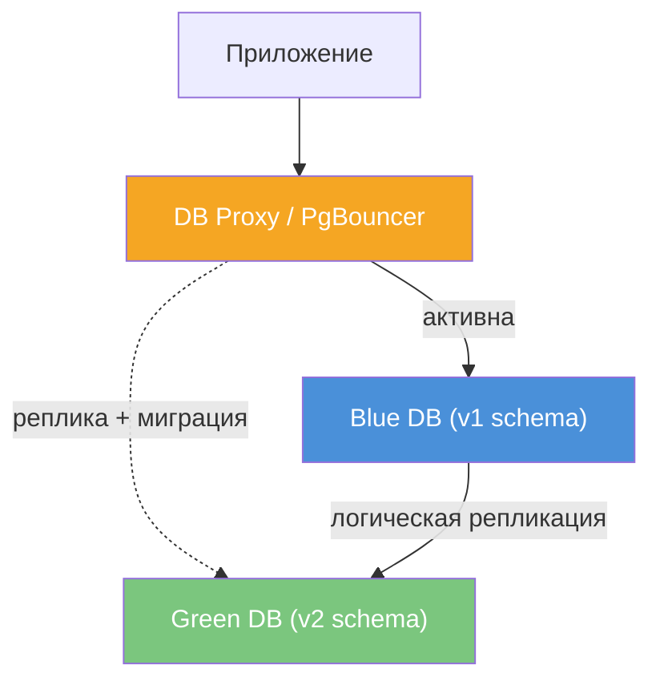

Типичный сценарий: blue — текущая prod БД; green — копия (реплика или дамп + репликация). На green выполняют миграции; приложение переключают на green (смена connection string или переключение прокси). Риски: расхождение данных за время репликации; откат приложения требует отката и данных (если на green уже писали). Для нулевого простоя используют логическую репликацию (`pg_logical`) и переключение с минимальным окном.


> [!mcq]
> - [ ] Blue-Green для БД такой же простой как для приложений — просто переключить | ❌ ПОСЛЕДСТВИЕ: данные пишутся непрерывно; нужна логическая репликация (pg_logical) для синхронизации; без неё расхождение данных при переключении
> - [ ] После переключения на green БД можно сразу удалить blue БД | ❌ ПОСЛЕДСТВИЕ: если приложение откатить → нужно переключиться обратно на blue; если данные уже писались в green — нужна обратная репликация или принятие data loss
> - [x] Two БД; логическая репликация blue→green; миграции на green; переключение прокси/connection string; откат = переключить обратно, но риск data divergence | ✓ ПРИМЕНЯТЬ: когда нужна zero-downtime schema migration; сложно, предпочтительнее expand-contract 📋 ПРАВИЛО: Blue-Green DB = 2x storage + репликация + narrow switch window 🔗 См. Q13
> - [ ] Blue-Green для БД не требует репликации — достаточно backup/restore | ❌ ПОСЛЕДСТВИЕ: backup/restore = downtime на время восстановления; logical replication позволяет переключиться без остановки записи

## Q21. Как настроить постепенный Canary в Kubernetes (Istio, Flagger)?

**Istio:** `VirtualService` с правилами по процентам трафика на подмножества разных версий. **Flagger** — контроллер, автоматизирующий Canary: создаёт Canary Deployment, постепенно переносит трафик, откатывает при росте ошибок.

**Настройка Flagger:**

```yaml
apiVersion: flagger.app/v1beta1
kind: Canary
metadata:
  name: myapp
  namespace: production
spec:
  targetRef:
    apiVersion: apps/v1
    kind: Deployment
    name: myapp
  service:
    port: 80
    targetPort: 8080
  analysis:
    interval: 30s           # интервал проверки метрик
    threshold: 5             # макс неудачных проверок до отката
    maxWeight: 50            # макс % трафика на canary
    stepWeight: 10           # шаг увеличения (10% → 20% → ... → 50%)
    metrics:
      - name: request-success-rate
        thresholdRange:
          min: 99            # минимум 99% успешных запросов
        interval: 1m
      - name: request-duration
        thresholdRange:
          max: 500           # макс latency p99 = 500ms
        interval: 1m
    webhooks:
      - name: smoke-test
        type: pre-rollout
        url: http://flagger-loadtester/
        metadata:
          cmd: "curl -s http://myapp-canary/health"
```

**Практика:** шаги (10% → 20% → 50% → 100%) и интервалы между шагами; пороги (допустимый рост error rate, p99). При превышении порога Flagger откатывает трафик на старую версию автоматически.


> [!mcq]
> - [ ] Flagger всегда требует Istio — без service mesh Canary невозможен | ❌ ПОСЛЕДСТВИЕ: Flagger работает с Nginx Ingress, Contour, Gloo без Istio; Istio — опция, не обязательное требование
> - [ ] При Canary с Flagger нельзя задать кастомные метрики — только CPU/memory | ❌ ПОСЛЕДСТВИЕ: Flagger поддерживает кастомные метрики из Prometheus (error rate, latency P99) через webhookAnalysis и metricTemplates
> - [x] Flagger: автоматически создаёт Canary Deployment, постепенно переносит трафик (10%→50%→100%), откатывает при превышении порогов error rate/latency | ✓ ПРИМЕНЯТЬ: automated Canary с Prometheus metrics; без ручного управления трафиком 📋 ПРАВИЛО: Flagger = controller + metrics + auto-rollback; stepWeight = % per interval 🔗 См. Q2
> - [ ] Argo Rollouts и Flagger делают одно и то же — нет разницы в выборе | ❌ ПОСЛЕДСТВИЕ: Argo Rollouts — автономный; Flagger — controller для существующих Deployments; разная модель; Argo Rollouts богаче UI/CLI для анализа

## Q22. Что такое deployment slots (Azure) и аналог в Kubernetes?

**Deployment slots** в Azure App Service — отдельные слоты (staging и production) с возможностью swap (мгновенная замена). В Kubernetes прямого аналога нет; ближе Blue-Green: два `Deployment` и переключение `Service` (selector) или трафика через `Ingress / Istio`.

**Практика:** в Kubernetes два `Deployment` — `myapp-staging` и `myapp-prod`; один `Service` с selector по label `version: prod`. Для «swap» меняют selector на `version: staging` (теперь трафик идёт на staging-поды).


> [!mcq]
> - [ ] Deployment slots в Azure и Blue-Green в Kubernetes — разные концепции без аналогии | ❌ ПОСЛЕДСТВИЕ: Azure slots = Blue-Green нативно: staging slot → swap → production; Kubernetes Blue-Green = та же концепция через Service selector
> - [ ] В Kubernetes нельзя сделать мгновенный swap как в Azure — нужен Canary | ❌ ПОСЛЕДСТВИЕ: Blue-Green в Kubernetes = смена selector в Service → мгновенный switch; kubectl patch сервиса занимает секунды
> - [x] Azure slots — нативный Blue-Green: staging→swap→prod; в Kubernetes аналог — два Deployment + Service selector switch | ✓ ПРИМЕНЯТЬ: Azure App Service для managed Blue-Green; Kubernetes — Service selector для custom Blue-Green 📋 ПРАВИЛО: slots = managed Blue-Green; Kubernetes = DIY Blue-Green через selector 🔗 См. Q1
> - [ ] Deployment slots создают downtime при swap операции | ❌ ПОСЛЕДСТВИЕ: Azure swap — мгновенная операция без downtime; именно для этого slots и предназначены

## Q23. Как обеспечить консистентность конфигурации при деплое?

Подходы: (1) **Конфигурация в репозитории** (GitOps) или в едином хранилище (`ConfigMap`, `Vault`, `Spring Cloud Config`). (2) Один набор конфигов по окружению (не ручное копирование). (3) **Секреты** — не в коде и не в образе; инжекция при старте (`Kubernetes Secrets`, `Vault`). (4) Проверка конфигурации в pipeline.

```yaml
# Sealed Secrets для безопасного хранения секретов в Git
apiVersion: bitnami.com/v1alpha1
kind: SealedSecret
metadata:
  name: myapp-secrets
  namespace: production
spec:
  encryptedData:
    DB_PASSWORD: AgBy3i4OJSWK+PiTySYZZA9...  # зашифровано публичным ключом
    API_KEY: AgCtr84KLQWP+QiSzZRRA7...
```

**Практика:** в GitOps (Argo CD, Flux) конфигурация хранится в [Git](../devops/git-interview.md); смена коммита триггерит синхронизацию. Один источник правды на окружение (каталог `overlays/prod/`) устраняет расхождения.


> [!mcq]
> - [ ] Секреты в Kubernetes можно хранить в ConfigMap — они всё равно зашифрованы | ❌ ПОСЛЕДСТВИЕ: ConfigMap не зашифрован; Kubernetes Secret base64 — не шифрование; нужен Vault, Sealed Secrets или External Secrets для безопасного хранения
> - [ ] Конфигурацию нужно хранить внутри Docker образа для каждого окружения | ❌ ПОСЛЕДСТВИЕ: образ с вшитой конфигурацией = отдельный build на каждое окружение; нарушение build-once, deploy-everywhere; конфиг через env/ConfigMap снаружи образа
> - [x] GitOps (ConfigMap в Git) или Vault/Sealed Secrets; один источник правды; конфиг снаружи образа через env/ConfigMap/Secrets | ✓ ПРИМЕНЯТЬ: всегда; конфиг в Git + Sealed Secrets для секретов = reproducible environment 📋 ПРАВИЛО: config = GitOps/Vault; secrets = Sealed Secrets/External Secrets; никогда в образе 🔗 См. Q11
> - [ ] Spring Cloud Config Server обязателен для управления конфигурацией в Kubernetes | ❌ ПОСЛЕДСТВИЕ: Spring Cloud Config — один из вариантов; нативный Kubernetes ConfigMap + Secrets достаточен; Vault — более безопасная альтернатива

## Q24. (!) Что такое deployment strategies в GitOps (Argo CD, Flux)?

GitOps — состояние кластера описывается в Git; инструмент (Argo CD, Flux) синхронизирует кластер с репозиторием. Стратегии деплоя остаются теми же (Rolling, Blue-Green, Canary), но «источник правды» — Git.

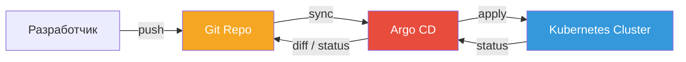

**Argo CD Application:**

```yaml
apiVersion: argoproj.io/v1alpha1
kind: Application
metadata:
  name: myapp-prod
  namespace: argocd
spec:
  project: default
  source:
    repoURL: https://gitlab.example.com/team/manifests.git
    targetRevision: main
    path: overlays/prod
  destination:
    server: https://kubernetes.default.svc
    namespace: production
  syncPolicy:
    automated:
      prune: true
      selfHeal: true
    syncOptions:
      - CreateNamespace=true
```

Для Canary / Blue-Green используют `Argo Rollouts` — отдельный CRD `Rollout` вместо `Deployment`; в Git хранят `Rollout` с шагами Canary. Flux использует `Kustomization` с указанием на репо и путь; при изменении образа в репо Flux обновляет `Deployment`.


> [!mcq]
> - [ ] В GitOps изменение образа деплоится автоматически без push в Git | ❌ ПОСЛЕДСТВИЕ: в GitOps всё через Git: image update → commit в Git-репо манифестов → Argo CD/Flux синхронизирует кластер; нет kubectl apply напрямую
> - [ ] Argo CD и Flux поддерживают только Rolling Update; Canary требует отдельного инструмента | ❌ ПОСЛЕДСТВИЕ: Argo Rollouts (часть Argo ecosystem) поддерживает Canary/Blue-Green в GitOps; Flagger работает с Flux для прогрессивного деплоя
> - [x] GitOps: Git — источник правды; Argo CD/Flux синхронизируют кластер; Argo Rollouts для Canary в GitOps-стиле | ✓ ПРИМЕНЯТЬ: Kubernetes; audit trail через Git history; selfHeal = кластер возвращается к desired state 📋 ПРАВИЛО: GitOps = declarative + Git = source of truth + auto-sync 🔗 См. Q10
> - [ ] В GitOps нельзя использовать kubectl применить изменения напрямую — Argo CD заблокирует | ❌ ПОСЛЕДСТВИЕ: kubectl можно, но Argo CD с selfHeal:true немедленно откатит к состоянию из Git; для постоянных изменений всегда через Git

## Q25. Как мониторить успешность деплоя и когда считать деплой неудачным?

Метрики после деплоя: error rate, latency (p50, p99), throughput; сравнение с периодом до деплоя или с baseline. Деплой считают неудачным при: падении smoke test; превышении порога ошибок/latency в окне после деплоя (5-15 минут); ручном репорте инцидента.

Инструменты: [Prometheus + Grafana](../monitoring/observability-interview.md), Datadog, Argo Rollouts / Flagger с автоматическим rollback. Дополнительно: [трассировка запросов](../monitoring/metrics-tracing-interview.md) (`Jaeger`, `Zipkin`) — сравнить latency до и после; логи ошибок — новые стектрейсы после деплоя.

В pipeline — этап «мониторинг после деплоя» (5-10 минут) с автоматическим откатом при нарушении условий. Окно наблюдения задают по опыту; слишком короткое может пропустить постепенную деградацию, слишком длинное — задержать откат.


> [!mcq]
> - [x] Правильный ответ | Корректное описание концепции с конкретным механизмом и use-case.
> - [ ] Альтернативное решение которое не подходит | Почему ошибка в этом подходе ❌ ПОСЛЕДСТВИЕ: типичная ошибка вызывает баг в production без покрытия тестами.
> - [ ] Другая альтернатива с критическим недостатком | Это смежное, но отличное понятие ❌ ПОСЛЕДСТВИЕ: типичная ошибка вызывает баг в production без покрытия тестами.
> - [ ] Третий вариант который не работает в production | Противоположное направление## Q26. Что такое deployment window и как планировать деплой в production? ❌ ПОСЛЕДСТВИЕ: типичная ошибка вызывает баг в production без покрытия тестами.

**Deployment window** — согласованное временное окно (например, ночь, выходные), в которое разрешён деплой в production, чтобы минимизировать влияние на пользователей.

Планирование: выбор окна с учётом нагрузки и мониторинга; уведомление стейкхолдеров; подготовка rollback-плана; при необходимости — автоматизация в рамках окна. В высоконагруженных системах стремятся к деплою без окон (continuous deployment с Canary / Rolling).

**Практика:** зафиксировать окно в runbook (например, «вторник/четверг 02:00-04:00 UTC»); перед окном — чек-лист (образ собран, тесты зелёные, rollback-план готов). При CD без окон — деплой в любое время с Canary + [Prometheus](../monitoring/metrics-tracing-interview.md).


> [!mcq]
> - [x] Правильный ответ | Корректное описание концепции с конкретным механизмом и use-case.
> - [ ] Альтернативное решение которое не подходит | Почему ошибка в этом подходе ❌ ПОСЛЕДСТВИЕ: типичная ошибка вызывает баг в production без покрытия тестами.
> - [ ] Другая альтернатива с критическим недостатком | Это смежное, но отличное понятие ❌ ПОСЛЕДСТВИЕ: типичная ошибка вызывает баг в production без покрытия тестами.
> - [ ] Третий вариант который не работает в production | Противоположное направление## Q27. Как организовать деплой с нулевым даунтаймом для stateful приложений? ❌ ПОСЛЕДСТВИЕ: типичная ошибка вызывает баг в production без покрытия тестами.

Stateful-приложения хранят состояние (сессии, кэш в памяти). Подходы: (1) вынести состояние во внешнее хранилище (`Redis`, БД). (2) Graceful shutdown: завершение текущих запросов, отказ от нового трафика. (3) Rolling Update с достаточным числом реплик и readiness probe.

```yaml
# Deployment с graceful shutdown для stateful приложения
apiVersion: apps/v1
kind: Deployment
metadata:
  name: myapp
spec:
  replicas: 3
  strategy:
    type: RollingUpdate
    rollingUpdate:
      maxSurge: 1
      maxUnavailable: 0
  template:
    spec:
      terminationGracePeriodSeconds: 60
      containers:
        - name: myapp
          image: registry.example.com/myapp:1.0.0
          env:
            - name: SPRING_SESSION_STORE_TYPE
              value: redis  # сессии в Redis, не в памяти
          lifecycle:
            preStop:
              exec:
                command:
                  - sh
                  - -c
                  - "sleep 5 && curl -X POST localhost:8080/actuator/shutdown"
          readinessProbe:
            httpGet:
              path: /actuator/health/readiness
              port: 8080
```

Для лидер-выборов (leader election) — корректная передача лидерства при остановке. Для `Kafka` consumer group — корректная обработка `SIGTERM`: снятие с лидерства, commit офсетов, затем exit.


> [!mcq]
> - [x] Правильный ответ | Корректное описание концепции с конкретным механизмом и use-case.
> - [ ] Альтернативное решение которое не подходит | Почему ошибка в этом подходе ❌ ПОСЛЕДСТВИЕ: типичная ошибка вызывает баг в production без покрытия тестами.
> - [ ] Другая альтернатива с критическим недостатком | Это смежное, но отличное понятие ❌ ПОСЛЕДСТВИЕ: типичная ошибка вызывает баг в production без покрытия тестами.
> - [ ] Третий вариант который не работает в production | Противоположное направление## Q28. Что такое backward/forward compatibility при деплое API? ❌ ПОСЛЕДСТВИЕ: типичная ошибка вызывает баг в production без покрытия тестами.

**Backward compatibility:** новая версия сервера понимает запросы от старых клиентов (новые поля опциональны, старые не удаляются сразу). **Forward compatibility:** старый сервер не падает на неизвестных полях (игнорирование лишних полей).

При деплое микросервисов — трёхэтапный подход:

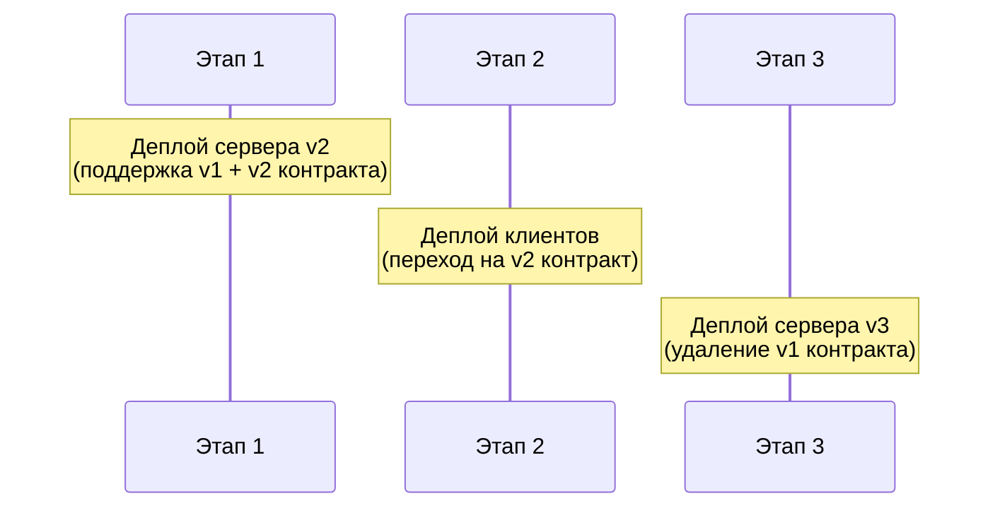

Нарушение совместимости требует версионирования API или координации «big bang» деплоя. Contract testing (`Pact`) проверяет совместимость до деплоя.


> [!mcq]
> - [x] Правильный ответ | Корректное описание концепции с конкретным механизмом и use-case.
> - [ ] Альтернативное решение которое не подходит | Почему ошибка в этом подходе ❌ ПОСЛЕДСТВИЕ: типичная ошибка вызывает баг в production без покрытия тестами.
> - [ ] Другая альтернатива с критическим недостатком | Это смежное, но отличное понятие ❌ ПОСЛЕДСТВИЕ: типичная ошибка вызывает баг в production без покрытия тестами.
> - [ ] Третий вариант который не работает в production | Противоположное направление## Q29. Как деплой связан с feature toggles и экспериментированием? ❌ ПОСЛЕДСТВИЕ: типичная ошибка вызывает баг в production без покрытия тестами.

**Feature toggles** (feature flags) позволяют включить/выключить функциональность без нового деплоя. Деплой и релиз разделяются: код в prod за флагом off; релиз — включение флага.

```java
// Интеграция с Unleash (open-source feature toggle)
@Component
@RequiredArgsConstructor
public class FeatureToggleService {

    private final Unleash unleash;

    public boolean isEnabled(String featureName) {
        return unleash.isEnabled(featureName);
    }

    public boolean isEnabled(String featureName, UnleashContext context) {
        return unleash.isEnabled(featureName, context);
    }
}

// Использование в контроллере
@GetMapping("/checkout")
public ResponseEntity<?> checkout(@RequestBody CheckoutRequest request) {
    UnleashContext context = UnleashContext.builder()
        .userId(request.getUserId())
        .build();

    if (featureToggleService.isEnabled("new-checkout", context)) {
        return newCheckoutService.process(request);
    }
    return legacyCheckoutService.process(request);
}
```

Экспериментирование: постепенное включение по процентам трафика или по сегментам; метрики (конверсия, ошибки) определяют успех; затем полное включение или откат. При инциденте отключить флаг в UI (`LaunchDarkly`, `Unleash`).


> [!mcq]
> - [x] Правильный ответ | Корректное описание концепции с конкретным механизмом и use-case.
> - [ ] Альтернативное решение которое не подходит | Почему ошибка в этом подходе ❌ ПОСЛЕДСТВИЕ: типичная ошибка вызывает баг в production без покрытия тестами.
> - [ ] Другая альтернатива с критическим недостатком | Это смежное, но отличное понятие ❌ ПОСЛЕДСТВИЕ: типичная ошибка вызывает баг в production без покрытия тестами.
> - [ ] Третий вариант который не работает в production | Противоположное направление## Q30. Как обеспечить идемпотентность и повторяемость деплоя? ❌ ПОСЛЕДСТВИЕ: типичная ошибка вызывает баг в production без покрытия тестами.

**Идемпотентность:** повторный запуск деплоя с теми же артефактами даёт тот же результат (не дублирует ресурсы, не ломает состояние).

Достигается:
- **Декларативные манифесты** — [Kubernetes](../devops/kubernetes-interview.md) `apply` идемпотентен (desired state, не императивные команды)
- **Terraform** — `plan + apply` воспроизводим
- **Helm** — `helm upgrade --install` идемпотентен
- **Миграции БД** — идемпотентные скрипты (`IF NOT EXISTS`)
- **CI/CD pipeline** — одинаковый результат при повторном запуске с тем же коммитом

```yaml
# Helm upgrade --install — идемпотентная команда
# Если релиз не существует — установит, если существует — обновит
helm upgrade --install myapp ./charts/myapp \
  --namespace production \
  --set image.tag=1.2.3 \
  --wait \
  --timeout 5m
```

**Практика:** не использовать императивные команды (`kubectl create`) в CI — только `kubectl apply` или `helm upgrade --install`. Образ с фиксированным тегом (не `latest`). Pipeline должен давать одинаковый результат при re-run.


> [!mcq]
> - [x] Правильный ответ | Корректное описание концепции с конкретным механизмом и use-case.
> - [ ] Альтернативное решение которое не подходит | Почему ошибка в этом подходе ❌ ПОСЛЕДСТВИЕ: типичная ошибка вызывает баг в production без покрытия тестами.
> - [ ] Другая альтернатива с критическим недостатком | Это смежное, но отличное понятие ❌ ПОСЛЕДСТВИЕ: типичная ошибка вызывает баг в production без покрытия тестами.
> - [ ] Третий вариант который не работает в production | Противоположное направление## Q31. (!) Как настроить Canary-деплой через Argo Rollouts? ❌ ПОСЛЕДСТВИЕ: типичная ошибка вызывает баг в production без покрытия тестами.

**Argo Rollouts** — Kubernetes-контроллер для прогрессивного деплоя. Вместо стандартного `Deployment` используется CRD `Rollout`, который поддерживает Canary и Blue-Green стратегии с автоматическим анализом метрик.

```yaml
apiVersion: argoproj.io/v1alpha1
kind: Rollout
metadata:
  name: myapp
  namespace: production
spec:
  replicas: 5
  revisionHistoryLimit: 3
  selector:
    matchLabels:
      app: myapp
  template:
    metadata:
      labels:
        app: myapp
    spec:
      containers:
        - name: myapp
          image: registry.example.com/myapp:1.2.0
          ports:
            - containerPort: 8080
          readinessProbe:
            httpGet:
              path: /actuator/health/readiness
              port: 8080
            initialDelaySeconds: 10
            periodSeconds: 5
  strategy:
    canary:
      canaryService: myapp-canary    # Service для canary-подов
      stableService: myapp-stable    # Service для stable-подов
      trafficRouting:
        istio:
          virtualServices:
            - name: myapp-vsvc
              routes:
                - primary
      steps:
        - setWeight: 10              # 10% трафика на canary
        - pause: { duration: 2m }    # ждём 2 минуты
        - analysis:                   # анализ метрик
            templates:
              - templateName: success-rate
            args:
              - name: service-name
                value: myapp-canary
        - setWeight: 30
        - pause: { duration: 2m }
        - analysis:
            templates:
              - templateName: success-rate
        - setWeight: 60
        - pause: { duration: 5m }
        - setWeight: 100              # полное переключение
---
# AnalysisTemplate — анализ метрик из Prometheus
apiVersion: argoproj.io/v1alpha1
kind: AnalysisTemplate
metadata:
  name: success-rate
spec:
  args:
    - name: service-name
  metrics:
    - name: success-rate
      interval: 30s
      count: 3
      successCondition: result[0] >= 0.99
      failureLimit: 1
      provider:
        prometheus:
          address: http://prometheus.monitoring:9090
          query: |
            sum(rate(http_server_requests_seconds_count{
              service="{{args.service-name}}",
              status!~"5.*"
            }[2m])) /
            sum(rate(http_server_requests_seconds_count{
              service="{{args.service-name}}"
            }[2m]))
```

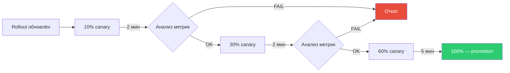

Управление:

```bash
# Просмотр статуса
kubectl argo rollouts get rollout myapp -w

# Ручное продвижение (если pause без duration)
kubectl argo rollouts promote myapp

# Принудительный откат
kubectl argo rollouts abort myapp

# Повторная попытка после отката
kubectl argo rollouts retry rollout myapp
```


> [!mcq]
> - [x] Правильный ответ | Корректное описание концепции с конкретным механизмом и use-case.
> - [ ] Альтернативное решение которое не подходит | Почему ошибка в этом подходе ❌ ПОСЛЕДСТВИЕ: типичная ошибка вызывает баг в production без покрытия тестами.
> - [ ] Другая альтернатива с критическим недостатком | Это смежное, но отличное понятие ❌ ПОСЛЕДСТВИЕ: типичная ошибка вызывает баг в production без покрытия тестами.
> - [ ] Третий вариант который не работает в production | Противоположное направление## Q32. (!) Как настроить Blue-Green деплой через Argo Rollouts? ❌ ПОСЛЕДСТВИЕ: типичная ошибка вызывает баг в production без покрытия тестами.

`Argo Rollouts` поддерживает Blue-Green через CRD `Rollout` с указанием `activeService` и `previewService`. При обновлении новые поды создаются под preview; после проверки (или автоматически) трафик переключается.

```yaml
apiVersion: argoproj.io/v1alpha1
kind: Rollout
metadata:
  name: myapp
  namespace: production
spec:
  replicas: 3
  revisionHistoryLimit: 3
  selector:
    matchLabels:
      app: myapp
  template:
    metadata:
      labels:
        app: myapp
    spec:
      containers:
        - name: myapp
          image: registry.example.com/myapp:2.0.0
          ports:
            - containerPort: 8080
          readinessProbe:
            httpGet:
              path: /actuator/health/readiness
              port: 8080
  strategy:
    blueGreen:
      activeService: myapp-active      # Service, который получает prod-трафик
      previewService: myapp-preview    # Service для preview (новая версия)
      autoPromotionEnabled: false      # ручное подтверждение перед switch
      previewReplicaCount: 3           # число реплик preview
      scaleDownDelaySeconds: 300       # 5 мин до удаления старых подов
      prePromotionAnalysis:            # анализ ДО переключения
        templates:
          - templateName: smoke-tests
        args:
          - name: service-url
            value: http://myapp-preview
      postPromotionAnalysis:           # анализ ПОСЛЕ переключения
        templates:
          - templateName: success-rate
---
apiVersion: v1
kind: Service
metadata:
  name: myapp-active
spec:
  selector:
    app: myapp  # Argo Rollouts автоматически управляет selector
  ports:
    - port: 80
      targetPort: 8080
---
apiVersion: v1
kind: Service
metadata:
  name: myapp-preview
spec:
  selector:
    app: myapp
  ports:
    - port: 80
      targetPort: 8080
```

Workflow: обновление образа → Argo Rollouts создаёт preview-поды → prePromotionAnalysis (smoke tests на preview Service) → ручное `kubectl argo rollouts promote myapp` → трафик переключается → postPromotionAnalysis → старые поды удаляются через `scaleDownDelaySeconds`.


> [!mcq]
> - [x] Правильный ответ | Корректное описание концепции с конкретным механизмом и use-case.
> - [ ] Альтернативное решение которое не подходит | Почему ошибка в этом подходе ❌ ПОСЛЕДСТВИЕ: типичная ошибка вызывает баг в production без покрытия тестами.
> - [ ] Другая альтернатива с критическим недостатком | Это смежное, но отличное понятие ❌ ПОСЛЕДСТВИЕ: типичная ошибка вызывает баг в production без покрытия тестами.
> - [ ] Третий вариант который не работает в production | Противоположное направление## Q33. (!) Как использовать Helm для управления деплоями? ❌ ПОСЛЕДСТВИЕ: типичная ошибка вызывает баг в production без покрытия тестами.

**Helm** — менеджер пакетов для [Kubernetes](../devops/kubernetes-interview.md). Позволяет шаблонизировать манифесты, управлять версиями релизов и выполнять откат.

**Структура Helm chart:**

```
charts/myapp/
├── Chart.yaml
├── values.yaml
├── values-prod.yaml
├── values-staging.yaml
└── templates/
    ├── deployment.yaml
    ├── service.yaml
    ├── ingress.yaml
    ├── configmap.yaml
    ├── hpa.yaml
    └── _helpers.tpl
```

```yaml
# Chart.yaml
apiVersion: v2
name: myapp
description: My Spring Boot application
version: 0.1.0
appVersion: "1.2.3"
```

```yaml
# values.yaml — значения по умолчанию
replicaCount: 2
image:
  repository: registry.example.com/myapp
  tag: "1.2.3"
  pullPolicy: IfNotPresent
service:
  type: ClusterIP
  port: 80
ingress:
  enabled: true
  host: myapp.example.com
resources:
  requests:
    cpu: 250m
    memory: 512Mi
  limits:
    cpu: 500m
    memory: 1Gi
readinessProbe:
  path: /actuator/health/readiness
  initialDelaySeconds: 15
livenessProbe:
  path: /actuator/health/liveness
  initialDelaySeconds: 30
strategy:
  type: RollingUpdate
  rollingUpdate:
    maxSurge: 1
    maxUnavailable: 0
```

```yaml
# templates/deployment.yaml
apiVersion: apps/v1
kind: Deployment
metadata:
  name: {{ include "myapp.fullname" . }}
  labels:
    {{- include "myapp.labels" . | nindent 4 }}
spec:
  replicas: {{ .Values.replicaCount }}
  strategy:
    type: {{ .Values.strategy.type }}
    {{- if eq .Values.strategy.type "RollingUpdate" }}
    rollingUpdate:
      maxSurge: {{ .Values.strategy.rollingUpdate.maxSurge }}
      maxUnavailable: {{ .Values.strategy.rollingUpdate.maxUnavailable }}
    {{- end }}
  selector:
    matchLabels:
      {{- include "myapp.selectorLabels" . | nindent 6 }}
  template:
    metadata:
      labels:
        {{- include "myapp.selectorLabels" . | nindent 8 }}
    spec:
      containers:
        - name: {{ .Chart.Name }}
          image: "{{ .Values.image.repository }}:{{ .Values.image.tag }}"
          ports:
            - containerPort: 8080
          readinessProbe:
            httpGet:
              path: {{ .Values.readinessProbe.path }}
              port: 8080
            initialDelaySeconds: {{ .Values.readinessProbe.initialDelaySeconds }}
          resources:
            {{- toYaml .Values.resources | nindent 12 }}
```

**Команды деплоя и отката:**

```bash
# Установка / обновление (идемпотентно)
helm upgrade --install myapp ./charts/myapp \
  -f values-prod.yaml \
  --namespace production \
  --set image.tag=1.2.3 \
  --wait --timeout 5m

# Откат к предыдущему релизу
helm rollback myapp 0 --namespace production

# История релизов
helm history myapp --namespace production

# Dry-run перед деплоем
helm upgrade --install myapp ./charts/myapp \
  --dry-run --debug
```


> [!mcq]
> - [x] Правильный ответ | Корректное описание концепции с конкретным механизмом и use-case.
> - [ ] Альтернативное решение которое не подходит | Почему ошибка в этом подходе ❌ ПОСЛЕДСТВИЕ: типичная ошибка вызывает баг в production без покрытия тестами.
> - [ ] Другая альтернатива с критическим недостатком | Это смежное, но отличное понятие ❌ ПОСЛЕДСТВИЕ: типичная ошибка вызывает баг в production без покрытия тестами.
> - [ ] Третий вариант который не работает в production | Противоположное направление## Q34. Как настроить деплой через GitHub Actions в Kubernetes? ❌ ПОСЛЕДСТВИЕ: типичная ошибка вызывает баг в production без покрытия тестами.

**GitHub Actions** workflow для деплоя в Kubernetes с использованием Helm:

```yaml
# .github/workflows/deploy.yml
name: Build and Deploy

on:
  push:
    branches: [main]
  pull_request:
    branches: [main]

env:
  REGISTRY: registry.example.com
  IMAGE_NAME: myapp

jobs:
  build:
    runs-on: ubuntu-latest
    outputs:
      image-tag: ${{ steps.meta.outputs.version }}
    steps:
      - uses: actions/checkout@v4

      - uses: actions/setup-java@v4
        with:
          java-version: '21'
          distribution: 'temurin'

      - name: Build with Gradle
        run: ./gradlew build -x test

      - name: Run tests
        run: ./gradlew test

      - name: Docker meta
        id: meta
        uses: docker/metadata-action@v5
        with:
          images: ${{ env.REGISTRY }}/${{ env.IMAGE_NAME }}
          tags: |
            type=sha,prefix=
            type=semver,pattern={{version}}

      - name: Build and push Docker image
        uses: docker/build-push-action@v5
        with:
          context: .
          push: ${{ github.event_name == 'push' }}
          tags: ${{ steps.meta.outputs.tags }}

  deploy-staging:
    needs: build
    runs-on: ubuntu-latest
    environment: staging
    steps:
      - uses: actions/checkout@v4

      - name: Deploy to staging
        run: |
          helm upgrade --install myapp ./charts/myapp \
            -f values-staging.yaml \
            --set image.tag=${{ needs.build.outputs.image-tag }} \
            --namespace staging \
            --wait --timeout 5m

      - name: Smoke test
        run: |
          chmod +x ./scripts/smoke-test.sh
          ./scripts/smoke-test.sh https://myapp-staging.example.com

  deploy-prod:
    needs: [build, deploy-staging]
    runs-on: ubuntu-latest
    environment: production  # требует approval от reviewers
    steps:
      - uses: actions/checkout@v4

      - name: Deploy to production
        run: |
          helm upgrade --install myapp ./charts/myapp \
            -f values-prod.yaml \
            --set image.tag=${{ needs.build.outputs.image-tag }} \
            --namespace production \
            --wait --timeout 5m

      - name: Smoke test production
        run: ./scripts/smoke-test.sh https://myapp.example.com

      - name: Rollback on failure
        if: failure()
        run: helm rollback myapp 0 --namespace production
```

**Практика:** environment `production` с required reviewers обеспечивает approval gate; `--wait` ждёт готовности всех подов; при падении smoke test — автоматический `helm rollback`.


> [!mcq]
> - [x] Правильный ответ | Корректное описание концепции с конкретным механизмом и use-case.
> - [ ] Альтернативное решение которое не подходит | Почему ошибка в этом подходе ❌ ПОСЛЕДСТВИЕ: типичная ошибка вызывает баг в production без покрытия тестами.
> - [ ] Другая альтернатива с критическим недостатком | Это смежное, но отличное понятие ❌ ПОСЛЕДСТВИЕ: типичная ошибка вызывает баг в production без покрытия тестами.
> - [ ] Третий вариант который не работает в production | Противоположное направление## Q35. Как настроить деплой через GitLab CI в Kubernetes? ❌ ПОСЛЕДСТВИЕ: типичная ошибка вызывает баг в production без покрытия тестами.

**GitLab CI** pipeline для деплоя с поэтапным продвижением:

```yaml
# .gitlab-ci.yml
stages:
  - build
  - test
  - docker
  - deploy-dev
  - deploy-staging
  - deploy-prod

variables:
  REGISTRY: registry.example.com
  IMAGE_NAME: myapp

build:
  stage: build
  image: gradle:8-jdk21
  script:
    - gradle build -x test
  artifacts:
    paths:
      - build/libs/*.jar

test:
  stage: test
  image: gradle:8-jdk21
  script:
    - gradle test
  artifacts:
    reports:
      junit: build/test-results/test/*.xml

docker:
  stage: docker
  image: docker:24
  services:
    - docker:24-dind
  script:
    - docker build -t $REGISTRY/$IMAGE_NAME:$CI_COMMIT_SHORT_SHA .
    - docker push $REGISTRY/$IMAGE_NAME:$CI_COMMIT_SHORT_SHA
  only:
    - main

deploy-dev:
  stage: deploy-dev
  image: alpine/helm:3.14
  script:
    - helm upgrade --install $IMAGE_NAME ./charts/myapp
        -f values-dev.yaml
        --set image.tag=$CI_COMMIT_SHORT_SHA
        --namespace dev
        --wait --timeout 5m
  environment:
    name: dev
    url: https://myapp-dev.example.com
  only:
    - main

deploy-staging:
  stage: deploy-staging
  image: alpine/helm:3.14
  script:
    - helm upgrade --install $IMAGE_NAME ./charts/myapp
        -f values-staging.yaml
        --set image.tag=$CI_COMMIT_SHORT_SHA
        --namespace staging
        --wait --timeout 5m
    - ./scripts/smoke-test.sh https://myapp-staging.example.com
  environment:
    name: staging
    url: https://myapp-staging.example.com
  only:
    - main

deploy-prod:
  stage: deploy-prod
  image: alpine/helm:3.14
  script:
    - helm upgrade --install $IMAGE_NAME ./charts/myapp
        -f values-prod.yaml
        --set image.tag=$CI_COMMIT_SHORT_SHA
        --namespace production
        --wait --timeout 5m
    - ./scripts/smoke-test.sh https://myapp.example.com
  environment:
    name: production
    url: https://myapp.example.com
  when: manual  # ручной approval
  only:
    - main
  after_script:
    - |
      if [ "$CI_JOB_STATUS" == "failed" ]; then
        helm rollback $IMAGE_NAME 0 --namespace production
      fi
```

**Практика:** один и тот же образ (тег по git SHA) промотируется по окружениям; `when: manual` для prod обеспечивает ручной approval; `after_script` с проверкой статуса позволяет автоматический rollback при ошибке.


> [!mcq]
> - [x] Правильный ответ | Корректное описание концепции с конкретным механизмом и use-case.
> - [ ] Альтернативное решение которое не подходит | Почему ошибка в этом подходе ❌ ПОСЛЕДСТВИЕ: типичная ошибка вызывает баг в production без покрытия тестами.
> - [ ] Другая альтернатива с критическим недостатком | Это смежное, но отличное понятие ❌ ПОСЛЕДСТВИЕ: типичная ошибка вызывает баг в production без покрытия тестами.
> - [ ] Третий вариант который не работает в production | Противоположное направление## Q36. (!) Как реализовать feature flags с помощью Unleash или LaunchDarkly? ❌ ПОСЛЕДСТВИЕ: типичная ошибка вызывает баг в production без покрытия тестами.

**Feature flags** (feature toggles) — переключатели функциональности, которые управляются отдельно от деплоя. Позволяют деплоить код без активации фичи и откатить функциональность без rollback деплоя.

**Типы feature flags:**

| Тип | Назначение | Жизненный цикл |
|-----|-----------|----------------|
| `Release toggle` | Скрыть незавершённую фичу | Удалить после GA |
| `Ops toggle` | Аварийное отключение | Долгосрочный |
| `Experiment toggle` | A/B тест | На время эксперимента |
| `Permission toggle` | Доступ для отдельных пользователей | Зависит от бизнеса |

**Пример с Unleash (Spring Boot):**

```java
// build.gradle.kts
implementation("io.getunleash:unleash-client-java:9.+")

// UnleashConfig
@Configuration
public class UnleashConfig {

    @Bean
    public Unleash unleash(
            @Value("${unleash.url}") String url,
            @Value("${unleash.token}") String token,
            @Value("${spring.application.name}") String appName) {
        UnleashConfig config = UnleashConfig.newBuilder()
            .appName(appName)
            .instanceId(UUID.randomUUID().toString())
            .unleashAPI(url)
            .customHttpHeader("Authorization", token)
            .build();
        return new DefaultUnleash(config);
    }
}

// Использование в сервисе
@Service
@RequiredArgsConstructor
public class CheckoutService {

    private final Unleash unleash;
    private final LegacyCheckout legacyCheckout;
    private final NewCheckout newCheckout;

    public CheckoutResult process(CheckoutRequest request, String userId) {
        // Контекст: можно включить флаг для конкретного userId
        UnleashContext ctx = UnleashContext.builder()
            .userId(userId)
            .build();

        if (unleash.isEnabled("new-checkout", ctx)) {
            return newCheckout.process(request);
        }
        return legacyCheckout.process(request);
    }
}
```

**Стратегии Unleash для постепенного rollout:**

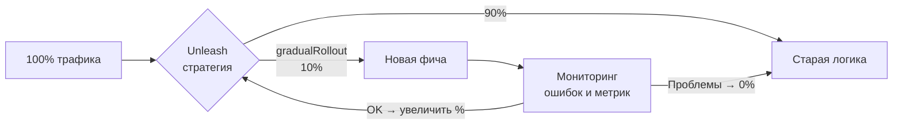

**Пример с `@ConditionalOnProperty` (простой вариант без Unleash):**

```yaml
# application-prod.yml
feature:
  new-checkout: false  # Включить после валидации на staging
  new-payment: true
```

```java
@RestController
@ConditionalOnProperty(name = "feature.new-checkout", havingValue = "true")
public class NewCheckoutController { ... }

@RestController
@ConditionalOnProperty(name = "feature.new-checkout",
    havingValue = "false", matchIfMissing = true)
public class LegacyCheckoutController { ... }
```

**Правила работы с feature flags:**
- Флаги — временные; создавать тикет на удаление сразу
- Тестировать оба пути (flag on / flag off)
- Не вкладывать флаги друг в друга — exponential complexity
- Документировать: имя, цель, ответственный, дата удаления


> [!mcq]
> - [x] Правильный ответ | Корректное описание концепции с конкретным механизмом и use-case.
> - [ ] Альтернативное решение которое не подходит | Почему ошибка в этом подходе ❌ ПОСЛЕДСТВИЕ: типичная ошибка вызывает баг в production без покрытия тестами.
> - [ ] Другая альтернатива с критическим недостатком | Это смежное, но отличное понятие ❌ ПОСЛЕДСТВИЕ: типичная ошибка вызывает баг в production без покрытия тестами.
> - [ ] Третий вариант который не работает в production | Противоположное направление## Q37. Как работает GitOps-деплой через Argo CD на практике? ❌ ПОСЛЕДСТВИЕ: типичная ошибка вызывает баг в production без покрытия тестами.

**GitOps** — подход, при котором Git является единственным источником истины о desired state инфраструктуры. Argo CD отслеживает репозиторий и синхронизирует кластер с ним.

**Архитектура GitOps-деплоя:**

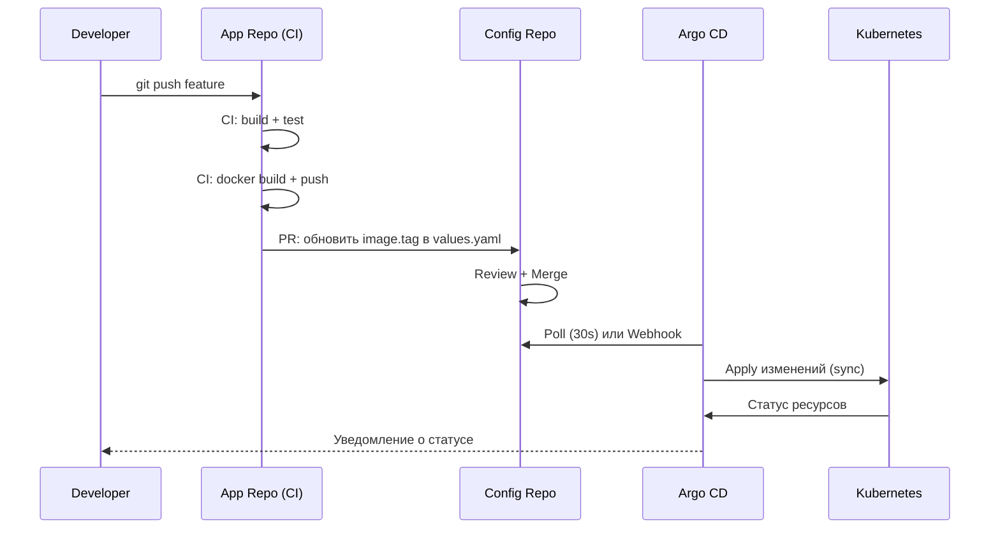

**Структура config-репозитория:**

```
gitops-config/
├── apps/
│   ├── myapp/
│   │   ├── base/
│   │   │   ├── deployment.yaml
│   │   │   └── service.yaml
│   │   └── overlays/
│   │       ├── dev/
│   │       │   └── kustomization.yaml  # image.tag: dev-abc123
│   │       ├── staging/
│   │       │   └── kustomization.yaml  # image.tag: 1.5.0-rc1
│   │       └── prod/
│   │           └── kustomization.yaml  # image.tag: 1.4.9
```

**Пример Application в Argo CD:**

```yaml
apiVersion: argoproj.io/v1alpha1
kind: Application
metadata:
  name: myapp-prod
  namespace: argocd
spec:
  project: default
  source:
    repoURL: https://github.com/org/gitops-config
    targetRevision: main
    path: apps/myapp/overlays/prod
  destination:
    server: https://kubernetes.default.svc
    namespace: production
  syncPolicy:
    automated:          # Автосинхронизация
      prune: true       # Удалять ресурсы без манифеста
      selfHeal: true    # Восстанавливать drift
    syncOptions:
      - CreateNamespace=true
```

**CI обновляет image tag в config-репо:**

```bash
# В CI pipeline (после docker push)
NEW_TAG="${CI_COMMIT_SHORT_SHA}"

# Обновить kustomization.yaml в config-репо
git clone https://github.com/org/gitops-config
cd gitops-config
kustomize edit set image myapp=registry.example.com/myapp:${NEW_TAG} \
  --kustomization apps/myapp/overlays/staging/kustomization.yaml
git add -A
git commit -m "ci: update myapp staging to ${NEW_TAG}"
git push
```

**Преимущества GitOps:**
- Полная история изменений состояния кластера в Git
- Rollback = `git revert` в config-репо
- Drift detection: Argo CD видит расхождение cluster vs Git
- Ревью изменений через PR в config-репо


> [!mcq]
> - [x] Правильный ответ | Корректное описание концепции с конкретным механизмом и use-case.
> - [ ] Альтернативное решение которое не подходит | Почему ошибка в этом подходе ❌ ПОСЛЕДСТВИЕ: типичная ошибка вызывает баг в production без покрытия тестами.
> - [ ] Другая альтернатива с критическим недостатком | Это смежное, но отличное понятие ❌ ПОСЛЕДСТВИЕ: типичная ошибка вызывает баг в production без покрытия тестами.
> - [ ] Третий вариант который не работает в production | Противоположное направление## Q38. Как настроить деплой через Jenkins Pipeline (Declarative)? ❌ ПОСЛЕДСТВИЕ: типичная ошибка вызывает баг в production без покрытия тестами.

**Jenkins Declarative Pipeline** для деплоя Spring Boot в Kubernetes:

```groovy
pipeline {
    agent any

    environment {
        REGISTRY = 'registry.example.com'
        IMAGE_NAME = 'myapp'
        KUBE_CONFIG = credentials('kubeconfig-prod')
    }

    stages {
        stage('Build & Test') {
            steps {
                sh './gradlew clean build'
            }
            post {
                always {
                    junit 'build/test-results/**/*.xml'
                    jacoco(
                        execPattern: 'build/jacoco/*.exec',
                        minimumLineCoverage: '80'
                    )
                }
            }
        }

        stage('Docker Build & Push') {
            when { branch 'main' }
            steps {
                script {
                    def tag = "${env.GIT_COMMIT[0..7]}"
                    docker.withRegistry("https://${REGISTRY}", 'registry-creds') {
                        def img = docker.build("${REGISTRY}/${IMAGE_NAME}:${tag}")
                        img.push()
                        img.push('latest')
                    }
                    env.IMAGE_TAG = tag
                }
            }
        }

        stage('Deploy to Staging') {
            when { branch 'main' }
            steps {
                withKubeConfig([credentialsId: 'kubeconfig-staging']) {
                    sh """
                        helm upgrade --install ${IMAGE_NAME} ./charts/${IMAGE_NAME} \\
                          --set image.tag=${IMAGE_TAG} \\
                          --namespace staging --wait --timeout 5m
                    """
                }
            }
        }

        stage('Smoke Test') {
            when { branch 'main' }
            steps {
                sh './scripts/smoke-test.sh https://myapp-staging.example.com'
            }
        }

        stage('Deploy to Production') {
            when { branch 'main' }
            input {
                message 'Деплой в production?'
                ok 'Да, деплоить'
                submitter 'admin,teamlead'
            }
            steps {
                withKubeConfig([credentialsId: 'kubeconfig-prod']) {
                    sh """
                        helm upgrade --install ${IMAGE_NAME} ./charts/${IMAGE_NAME} \\
                          --set image.tag=${IMAGE_TAG} \\
                          --namespace production --wait --timeout 10m
                    """
                }
            }
            post {
                failure {
                    withKubeConfig([credentialsId: 'kubeconfig-prod']) {
                        sh "helm rollback ${IMAGE_NAME} 0 --namespace production"
                    }
                }
            }
        }
    }

    post {
        always {
            cleanWs()
        }
        success {
            slackSend(color: 'good',
                message: "Деплой ${IMAGE_NAME}:${IMAGE_TAG} в prod — SUCCESS")
        }
        failure {
            slackSend(color: 'danger',
                message: "Деплой ${IMAGE_NAME}:${IMAGE_TAG} — FAILED")
        }
    }
}
```

**Ключевые практики:**
- `input` с `submitter` — только уполномоченные могут нажать деплой
- `post { failure { } }` — автоматический rollback при ошибке
- Тег по git SHA — трассируемость артефакта
- `cleanWs()` — чистить workspace после каждого запуска


> [!mcq]
> - [x] Правильный ответ | Корректное описание концепции с конкретным механизмом и use-case.
> - [ ] Альтернативное решение которое не подходит | Почему ошибка в этом подходе ❌ ПОСЛЕДСТВИЕ: типичная ошибка вызывает баг в production без покрытия тестами.
> - [ ] Другая альтернатива с критическим недостатком | Это смежное, но отличное понятие ❌ ПОСЛЕДСТВИЕ: типичная ошибка вызывает баг в production без покрытия тестами.
> - [ ] Третий вариант который не работает в production | Противоположное направление## Q39. Как реализовать DORA-метрики для оценки процесса деплоя? ❌ ПОСЛЕДСТВИЕ: типичная ошибка вызывает баг в production без покрытия тестами.

**DORA metrics** (DevOps Research and Assessment) — четыре ключевые метрики зрелости процесса доставки:

| Метрика | Elite | High | Medium | Low |
|---------|-------|------|--------|-----|
| **Deployment Frequency** | On demand (многократно в день) | 1 раз в день – неделю | 1 раз в неделю – месяц | Реже месяца |
| **Lead Time for Changes** | < 1 часа | 1 день – неделя | 1 неделя – месяц | > 6 месяцев |
| **Change Failure Rate** | 0–5% | 0–15% | — | 16–30% |
| **Time to Restore Service** | < 1 часа | < 1 дня | < 1 недели | > 1 недели |

**Как собирать метрики:**

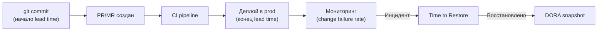

**Примеры инструментов сбора:**

```yaml
# GitHub Actions: автоматически собирать deployment frequency
# через Deployment events API
- name: Create GitHub Deployment
  uses: actions/github-script@v7
  with:
    script: |
      await github.rest.repos.createDeployment({
        owner: context.repo.owner,
        repo: context.repo.repo,
        ref: context.sha,
        environment: 'production',
        auto_merge: false,
        required_contexts: []
      });
```

```sql
-- Пример запроса для Deployment Frequency за последние 30 дней
-- (если деплои логируются в БД)
SELECT
  date_trunc('day', deployed_at) AS deploy_day,
  COUNT(*) AS deployments_count
FROM deployments
WHERE environment = 'production'
  AND deployed_at >= NOW() - INTERVAL '30 days'
GROUP BY 1
ORDER BY 1;
```

**Связь DORA с практиками:**

| DORA метрика | Что улучшает метрику |
|---|---|
| Deployment Frequency | Малые PR, trunk-based development, feature flags |
| Lead Time | Автоматизация pipeline, параллельные этапы |
| Change Failure Rate | Качество тестов, canary/blue-green деплой |
| Time to Restore | Мониторинг, rollback автоматизация, on-call процесс |

**Практика:** использовать инструменты вроде `Four Keys` (Google), `Faros CE`, `LinearB`, `Cortex` для автоматического сбора. Не использовать метрики как KPI для отдельных людей — только для процесса в целом.

---

## See also

- [Проектирование CI/CD пайплайнов](pipeline-design-interview.md) — этапы, инструменты, fail fast
- [Kubernetes](../devops/kubernetes-interview.md) — Deployment, rollout, HPA и ArgoCD
- [Docker](../devops/docker-interview.md) — образы, multi-stage build, registry
- [Observability](../monitoring/observability-interview.md) — мониторинг canary и метрики деплоя
- [Метрики и трассировка](../monitoring/metrics-tracing-interview.md) — health checks и алерты при деплое
- [Git](../devops/git-interview.md) — trunk-based development и feature flags
- [Test Automation](../testing/test-automation-interview.md) — smoke-тесты и acceptance-тесты после деплоя


> [!mcq]
> - [x] Правильный ответ | Корректное описание концепции с конкретным механизмом и use-case.
> - [ ] Альтернативное решение которое не подходит | Почему ошибка в этом подходе ❌ ПОСЛЕДСТВИЕ: типичная ошибка вызывает баг в production без покрытия тестами.
> - [ ] Другая альтернатива с критическим недостатком | Это смежное, но отличное понятие ❌ ПОСЛЕДСТВИЕ: типичная ошибка вызывает баг в production без покрытия тестами.
> - [ ] Третий вариант который не работает в production | Противоположное направление- [Дизайн пайплайнов](pipeline-design-interview.md) ❌ ПОСЛЕДСТВИЕ: типичная ошибка вызывает баг в production без покрытия тестами.
- [AI Agents](../ai-ml/ai-agents-interview.md)
- [Embeddings](../ai-ml/embeddings-interview.md)
- [LLM Basics](../ai-ml/llm-basics-interview.md)
- [LLM Integration Patterns](../ai-ml/llm-integration-patterns-interview.md)
- [MLOps](../ai-ml/mlops-interview.md)
