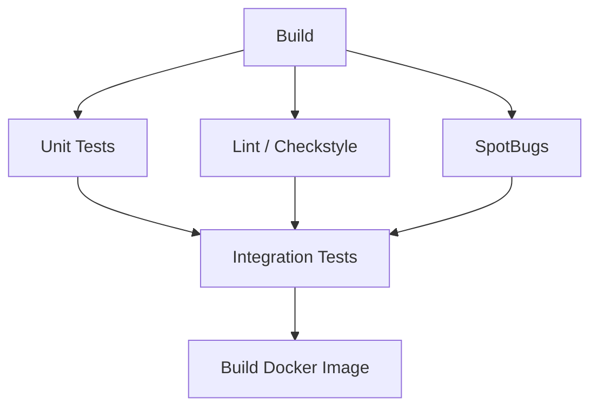
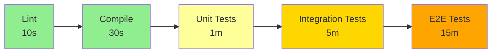
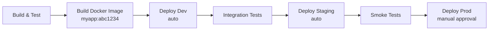
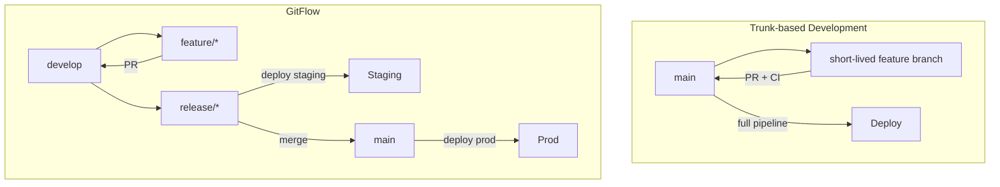
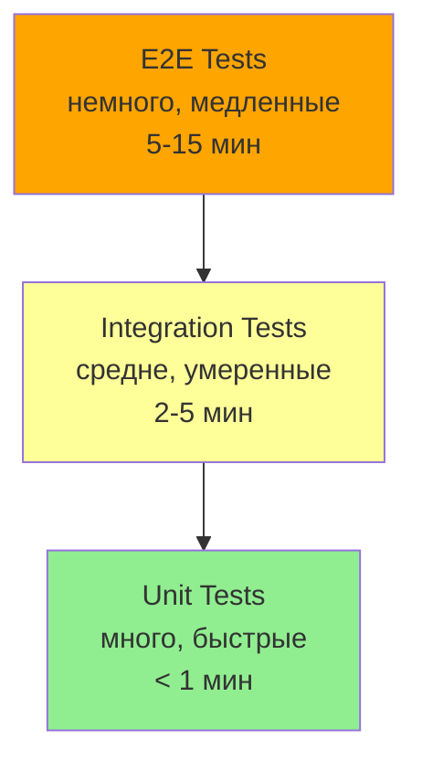
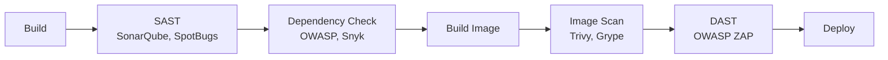
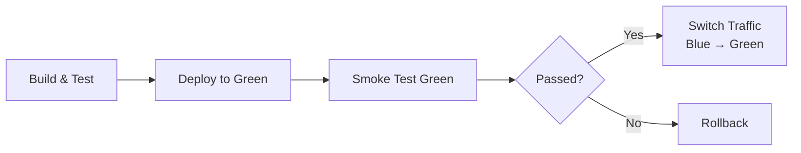
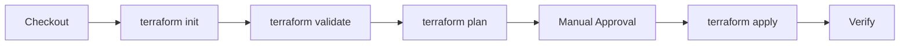
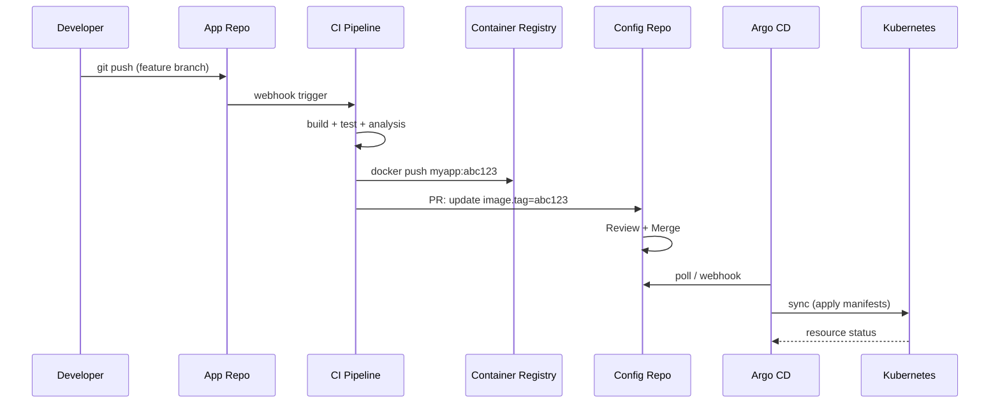
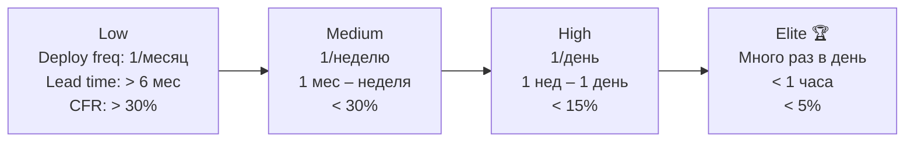

# Вопросы на собеседовании: Дизайн пайплайнов

Комплексное руководство по вопросам собеседования на тему дизайна `CI/CD` пайплайнов для Senior Java Developer. Охватывает `Jenkins`, `GitHub Actions`, `GitLab CI`, `Gradle`, `Docker`, стратегии тестирования, безопасность и оптимизацию.

## Полезные ссылки

### Официальная документация

- [Jenkins Pipeline](https://www.jenkins.io/doc/book/pipeline/) — документация по `Jenkins Pipeline`
- [GitLab CI/CD](https://docs.gitlab.com/ee/ci/) — документация `GitLab CI/CD`
- [GitHub Actions](https://docs.github.com/en/actions) — документация `GitHub Actions`
- [Gradle Build Tool](https://docs.gradle.org/current/userguide/userguide.html) — руководство `Gradle`
- [Intro to Jenkins Pipelines (Baeldung)](https://www.baeldung.com/ops/jenkins-pipelines) — обзор `Jenkins Pipeline`
- [CI/CD with Spring Boot (Baeldung)](https://www.baeldung.com/spring-boot-ci-cd) — `CI/CD` для `Spring Boot`
- [Dockerizing Spring Boot (Baeldung)](https://www.baeldung.com/spring-boot-docker-images) — `Docker`-образы `Spring Boot`

## Содержание

- [Полезные ссылки](#полезные-ссылки)
- [See also](#see-also)

**Основы CI/CD pipeline**
- [Q1. (!) Что такое CI/CD pipeline и из каких этапов он состоит?](#q1--что-такое-cicd-pipeline-и-из-каких-этапов-он-состоит)
- [Q2. (!) Чем отличается CI от CD (continuous delivery vs continuous deployment)?](#q2--чем-отличается-ci-от-cd-continuous-delivery-vs-continuous-deployment)
- [Q3. Как организовать этапы pipeline: последовательно vs параллельно?](#q3-как-организовать-этапы-pipeline-последовательно-vs-параллельно)
- [Q4. (!) Что такое pipeline as code и зачем он нужен?](#q4--что-такое-pipeline-as-code-и-зачем-он-нужен)
- [Q5. (!) Как обеспечить быструю обратную связь в pipeline (fail fast)?](#q5--как-обеспечить-быструю-обратную-связь-в-pipeline-fail-fast)
- [Q6. Что такое quality gates и как их реализовать в pipeline?](#q6-что-такое-quality-gates-и-как-их-реализовать-в-pipeline)

**Jenkins Pipeline**
- [Q7. (!) Чем отличается Declarative Pipeline от Scripted Pipeline в Jenkins?](#q7--чем-отличается-declarative-pipeline-от-scripted-pipeline-в-jenkins)
- [Q8. Что такое Jenkins Shared Libraries и когда их использовать?](#q8-что-такое-jenkins-shared-libraries-и-когда-их-использовать)
- [Q9. Как организовать параллельные стадии в Jenkins Pipeline?](#q9-как-организовать-параллельные-стадии-в-jenkins-pipeline)

**GitHub Actions и GitLab CI**
- [Q10. (!) Как устроен workflow в GitHub Actions?](#q10--как-устроен-workflow-в-github-actions)
- [Q11. Что такое matrix build и когда его применять?](#q11-что-такое-matrix-build-и-когда-его-применять)
- [Q12. Как настроить CI/CD pipeline в GitLab CI?](#q12-как-настроить-cicd-pipeline-в-gitlab-ci)

**Артефакты, версионирование и кэширование**
- [Q13. (!) Что такое артефакты pipeline и как их версионировать?](#q13--что-такое-артефакты-pipeline-и-как-их-версионировать)
- [Q14. Как кэшировать зависимости в pipeline (Gradle, Maven, npm)?](#q14-как-кэшировать-зависимости-в-pipeline-gradle-maven-npm)
- [Q15. Как pipeline интегрируется с артефактным репозиторием (Nexus, Artifactory)?](#q15-как-pipeline-интегрируется-с-артефактным-репозиторием-nexus-artifactory)
- [Q16. Как обеспечить воспроизводимость сборки в pipeline?](#q16-как-обеспечить-воспроизводимость-сборки-в-pipeline)

**Сборка Java-проектов в pipeline**
- [Q17. (!) Как настроить Gradle для CI/CD pipeline?](#q17--как-настроить-gradle-для-cicd-pipeline)
- [Q18. Как использовать Gradle Build Cache в CI?](#q18-как-использовать-gradle-build-cache-в-ci)

**Окружения, approval и ветки**
- [Q19. Как организовать pipeline для нескольких окружений (dev, staging, prod)?](#q19-как-организовать-pipeline-для-нескольких-окружений-dev-staging-prod)
- [Q20. Что такое manual approval и когда его использовать?](#q20-что-такое-manual-approval-и-когда-его-использовать)
- [Q21. (!) Как pipeline связан с ветками Git (trunk-based, GitFlow)?](#q21--как-pipeline-связан-с-ветками-git-trunk-based-gitflow)
- [Q22. Что такое pipeline для pull request (PR pipeline)?](#q22-что-такое-pipeline-для-pull-request-pr-pipeline)

**Тесты в pipeline**
- [Q23. (!) Как организовать тесты в pipeline (unit, integration, e2e)?](#q23--как-организовать-тесты-в-pipeline-unit-integration-e2e)
- [Q24. Что такое smoke test после деплоя и когда его запускать?](#q24-что-такое-smoke-test-после-деплоя-и-когда-его-запускать)
- [Q25. Как запускать интеграционные тесты с Testcontainers в CI?](#q25-как-запускать-интеграционные-тесты-с-testcontainers-в-ci)

**Безопасность pipeline**
- [Q26. (!) Что такое секреты в pipeline и как их хранить?](#q26--что-такое-секреты-в-pipeline-и-как-их-хранить)
- [Q27. Как обеспечить безопасность pipeline (SAST, DAST, сканирование образов)?](#q27-как-обеспечить-безопасность-pipeline-sast-dast-сканирование-образов)

**Docker и контейнеры в pipeline**
- [Q28. (!) Как организовать сборку Docker-образа в pipeline?](#q28--как-организовать-сборку-docker-образа-в-pipeline)
- [Q29. Что такое multi-stage build и как он ускоряет pipeline?](#q29-что-такое-multi-stage-build-и-как-он-ускоряет-pipeline)

**Стратегии деплоя в pipeline**
- [Q30. Как реализовать blue-green и canary деплой в pipeline?](#q30-как-реализовать-blue-green-и-canary-деплой-в-pipeline)
- [Q31. (!) Как организовать откат (rollback) в pipeline?](#q31--как-организовать-откат-rollback-в-pipeline)
- [Q32. Как обеспечить идемпотентность этапов pipeline?](#q32-как-обеспечить-идемпотентность-этапов-pipeline)

**Специализированные pipeline**
- [Q33. Что такое pipeline для монолита vs микросервисов?](#q33-что-такое-pipeline-для-монолита-vs-микросервисов)
- [Q34. Как организовать pipeline для монорепозитория?](#q34-как-организовать-pipeline-для-монорепозитория)
- [Q35. Что такое pipeline для инфраструктуры (IaC, Terraform)?](#q35-что-такое-pipeline-для-инфраструктуры-iac-terraform)

**Мониторинг и оптимизация**
- [Q36. Как мониторить и оптимизировать время выполнения pipeline?](#q36-как-мониторить-и-оптимизировать-время-выполнения-pipeline)

**GitOps pipeline и DORA**
- [Q37. (!) Как выглядит GitOps-pipeline с разделением app и config репозиториев?](#q37--как-выглядит-gitops-pipeline-с-разделением-app-и-config-репозиториев)
- [Q38. Что такое DORA-метрики и как их улучшить через pipeline?](#q38-что-такое-dora-метрики-и-как-их-улучшить-через-pipeline)

---

## Основы `CI/CD` pipeline

## Q1. (!) Что такое `CI/CD` pipeline и из каких этапов он состоит?

`CI/CD pipeline` — автоматизированная цепочка шагов от изменения кода до развёртывания в продакшен. Каждый этап выполняет конкретную задачу и передаёт результат следующему.

**Типичные этапы:**


1. **`Checkout`** — получение кода из репозитория
2. **`Build`** — компиляция (`Gradle`, `Maven`)
3. **`Unit Tests`** — быстрые юнит-тесты
4. **`Integration Tests`** — тесты с БД, внешними сервисами (см. [интеграционное тестирование](../testing/integration-testing-interview.md))
5. **`Static Analysis`** — линтеры, `SonarQube`, `Checkstyle`
6. **`Build Image`** — сборка `Docker`-образа (см. [Docker](../devops/docker-interview.md))
7. **`Push to Registry`** — публикация образа в `Harbor`, `ECR`, `Nexus`
8. **`Deploy`** — развёртывание в окружения (dev -> staging -> prod)
9. **`Smoke/Health Check`** — проверка работоспособности после деплоя

Дополнительно: security scan (`Trivy`, `OWASP`), performance tests, approval gates.


> [!mcq]
> - [ ] CI/CD pipeline — это просто скрипт деплоя, без сборки и тестов | ❌ ПОСЛЕДСТВИЕ: без unit/integration этапов на prod проникают регрессии и сломанные сборки.
> - [ ] Этапы обязаны выполняться строго последовательно: checkout → build → test → deploy без параллелизма | ❌ ПОСЛЕДСТВИЕ: pipeline растёт до 30+ минут, обратная связь становится бесполезной для разработчиков.
> - [x] Цепочка автоматизированных этапов (checkout → build → test → analysis → image → deploy → smoke), каждый передаёт артефакт следующему и обеспечивает fail-fast | ✓ ПРИМЕНЯТЬ: всегда добавлять quality gates (SonarQube, JaCoCo, Trivy) и smoke check после деплоя 📋 ПРАВИЛО: «один артефакт — много окружений» 🔗 См. Q2
> - [ ] Pipeline = только CI без CD: задача автоматизации заканчивается после публикации jar в Nexus | ❌ ПОСЛЕДСТВИЕ: ручной деплой создаёт расхождения между staging и prod, увеличивает MTTR при инцидентах.

## Q2. (!) Чем отличается `CI` от `CD` (`continuous delivery` vs `continuous deployment`)?

| Аспект | `CI` | `CD` (Delivery) | `CD` (Deployment) |
|--------|------|-----------------|-------------------|
| Цель | Быстрая обратная связь | Код всегда готов к релизу | Автоматический деплой |
| Деплой в prod | Нет | Ручной / по approval | Автоматический |
| Частота релизов | — | По решению команды | При каждом merge |
| Требования | Тесты, сборка | + staging, quality gates | + полная автоматизация |

**`CI` (`Continuous Integration`)** — при каждом коммите автоматически запускаются сборка и тесты. Цель — быстро выявить поломки и конфликты интеграции.

**`CD` (`Continuous Delivery`)** — код всегда в состоянии, готовом к деплою в prod. Деплой в prod требует ручного подтверждения или запуска.

**`CD` (`Continuous Deployment`)** — деплой в prod полностью автоматический после прохождения всех этапов `pipeline`.

На собеседовании важно объяснить, что `Continuous Delivery` и `Continuous Deployment` — разные практики: в delivery деплой в prod управляемый (approval), в deployment — автоматический. Большинство enterprise-команд используют `Continuous Delivery` с `manual approval` перед prod.


> [!mcq]
> - [ ] Continuous Delivery и Continuous Deployment — синонимы, разницы между ними нет | ❌ ПОСЛЕДСТВИЕ: команда не различает approval gate и автодеплой, неконтролируемо выкатывает в prod.
> - [ ] CI означает «деплой каждый коммит в prod», а CD — «сборка с тестами» | ❌ ПОСЛЕДСТВИЕ: путаница терминов на собесе и в проектной документации, неверное планирование SLA.
> - [ ] Continuous Deployment безопаснее Continuous Delivery, потому что включает ручной approval | ❌ ПОСЛЕДСТВИЕ: ровно наоборот — automated deployment требует более сильных guardrails (canary, feature flags), без них раскат токсичен.
> - [x] CI = автосборка и тесты на каждый коммит; Delivery = код всегда releasable, prod деплой по approval; Deployment = автодеплой в prod после прохождения всех gates | ✓ ПРИМЕНЯТЬ: enterprise обычно выбирает Delivery с manual approval перед prod 📋 ПРАВИЛО: «integration → ready-to-release → автодеплой» 🔗 См. Q3

## Q3. Как организовать этапы pipeline: последовательно vs параллельно?

**Последовательное** выполнение — каждый этап стартует после успеха предыдущего. Подходит для зависимых шагов: сборка -> тесты -> образ.

**Параллельное** — независимые этапы выполняются одновременно. Ускоряет `pipeline` в 2-3 раза.



**Пример параллельных этапов в `GitHub Actions`:**

```yaml
jobs:
  build:
    runs-on: ubuntu-latest
    steps:
      - uses: actions/checkout@v4
      - uses: actions/setup-java@v4
        with: { distribution: temurin, java-version: 21 }
      - run: ./gradlew assemble

  unit-tests:
    needs: build
    runs-on: ubuntu-latest
    steps:
      - run: ./gradlew test

  lint:
    needs: build
    runs-on: ubuntu-latest
    steps:
      - run: ./gradlew checkstyleMain

  integration-tests:
    needs: [unit-tests, lint]
    runs-on: ubuntu-latest
    steps:
      - run: ./gradlew integrationTest
```

Правило: параллелить всё, что не зависит друг от друга; последовательно — только когда этап требует артефакт предыдущего.


> [!mcq]
> - [x] Параллельность для независимых этапов (lint, unit, spotbugs одновременно после build), последовательность — только когда нужен артефакт предыдущего шага | ✓ ПРИМЕНЯТЬ: использовать `needs:` (GitHub Actions) / `parallel {}` (Jenkins) для ветвления, экономит 30-50% времени 📋 ПРАВИЛО: «параллелить всё что независимо» 🔗 См. Q4
> - [ ] Всё последовательно — это безопаснее, потому что один runner потребляет меньше ресурсов | ❌ ПОСЛЕДСТВИЕ: pipeline 30+ минут, разработчики теряют контекст и переключаются на другие задачи.
> - [ ] Параллелить нужно даже зависимые этапы — современные CI сами разрулят порядок через dependency resolution | ❌ ПОСЛЕДСТВИЕ: интеграционные тесты стартуют до сборки jar, падают с NoSuchFileException, маскируют реальные баги.
> - [ ] Параллелизм даёт прирост только на крупных проектах от 100k LOC, малым проектам он вреден | ❌ ПОСЛЕДСТВИЕ: даже на маленьких проектах lint+test одновременно дают -1-2 мин, разработчики ждут зря.

## Q4. (!) Что такое `pipeline as code` и зачем он нужен?

**`Pipeline as code`** — описание `pipeline` в файле внутри репозитория, а не через `UI` `CI`-системы.

| CI-система | Файл |
|------------|------|
| `Jenkins` | `Jenkinsfile` |
| `GitLab CI` | `.gitlab-ci.yml` |
| `GitHub Actions` | `.github/workflows/*.yml` |

**Преимущества:**
- **Версионирование** — изменения `pipeline` проходят `code review` через `PR`
- **Воспроизводимость** — при откате кода откатывается и `pipeline`
- **Аудит** — история изменений в `Git`
- **Единый источник правды** — нет рассинхронизации «код старый, `pipeline` новый»

**Пример `Jenkinsfile` (Declarative):**

```groovy
pipeline {
    agent { docker { image 'eclipse-temurin:21-jdk' } }
    stages {
        stage('Build') {
            steps { sh './gradlew assemble' }
        }
        stage('Test') {
            steps { sh './gradlew test' }
        }
        stage('Docker') {
            steps {
                sh 'docker build -t myapp:${GIT_COMMIT} .'
                sh 'docker push registry.example.com/myapp:${GIT_COMMIT}'
            }
        }
    }
    post {
        always { junit '**/build/test-results/**/*.xml' }
        failure { slackSend channel: '#builds', message: "Build failed: ${env.JOB_NAME}" }
    }
}
```


> [!mcq]
> - [ ] Pipeline as code = настройка джобов через UI Jenkins с экспортом конфига в XML | ❌ ПОСЛЕДСТВИЕ: «pipeline» уезжает в `config.xml`, не версионируется в проекте, любые правки теряются при миграции master.
> - [ ] Pipeline в репозитории нужен только для open-source, в enterprise проще держать всё в Jenkins UI | ❌ ПОСЛЕДСТВИЕ: невозможно сделать code review pipeline-изменений, нет аудита, нет отката pipeline вместе с кодом.
> - [ ] Pipeline as code обязательно требует Jenkins — других реализаций нет | ❌ ПОСЛЕДСТВИЕ: упускается выбор между GitHub Actions / GitLab CI / Tekton, переплата за инфраструктуру Jenkins.
> - [x] Описание pipeline в файле репозитория (`Jenkinsfile`, `.gitlab-ci.yml`, `.github/workflows/*.yml`); даёт версионирование, code review, аудит и согласованность кода с pipeline | ✓ ПРИМЕНЯТЬ: коммитить pipeline-файл в тот же репо что и код, проходить через PR 📋 ПРАВИЛО: «pipeline живёт в Git, не в UI» 🔗 См. Q5

## Q5. (!) Как обеспечить быструю обратную связь в pipeline (`fail fast`)?

Принципы `fail fast`:

1. **Быстрые этапы первыми** — `lint`, `compile`, `unit tests` (секунды) перед `integration` и `e2e` (минуты)
2. **Остановка при падении** — не тратить ресурсы на следующие этапы при сломанном коде
3. **Параллельность** — независимые проверки одновременно
4. **Кэширование** — зависимости не скачиваются каждый раз
5. **Инкрементальная сборка** — собирать только изменённое



**В `GitHub Actions`:** `fail-fast: true` в матрице отменяет остальные jobs при падении одного. Зависимости между jobs (`needs`) гарантируют, что тяжёлые этапы не запускаются при сломанной сборке.

**Целевые метрики:** `lint` + `compile` < 1 мин; `unit tests` < 3 мин; полный `pipeline` < 15 мин. Если `pipeline` > 30 мин — нужна оптимизация.


> [!mcq]
> - [ ] Fail fast = ставить долгие e2e в начале pipeline, чтобы поймать проблемы как можно раньше | ❌ ПОСЛЕДСТВИЕ: каждый коммит ждёт 15 минут e2e перед быстрыми unit-тестами, обратная связь по компилятору приходит к концу часа.
> - [ ] Fail fast достигается отключением всех тестов кроме главных, чтобы pipeline всегда был зелёным | ❌ ПОСЛЕДСТВИЕ: реальные регрессии попадают в prod, fail-fast превращается в «всегда pass».
> - [x] Быстрые этапы первыми (lint → compile → unit → integration → e2e), параллельность независимых проверок, остановка цепочки при первом падении и кэширование зависимостей | ✓ ПРИМЕНЯТЬ: целевые метрики lint+compile < 1 мин, unit < 3 мин, полный pipeline < 15 мин 📋 ПРАВИЛО: «cheap and fast checks first» 🔗 См. Q6
> - [ ] Fail fast — это `set -e` в bash-скрипте; других механизмов не нужно | ❌ ПОСЛЕДСТВИЕ: при упавшем shell-шаге не отменяются параллельные jobs в матрице, расход CI-минут продолжается впустую.

## Q6. Что такое `quality gates` и как их реализовать в pipeline?

**`Quality gate`** — набор критериев, которые код должен пройти перед продвижением на следующий этап. Если хотя бы один критерий не выполнен — `pipeline` падает.

**Типичные quality gates:**
- Покрытие тестами >= 80% (`JaCoCo`)
- 0 критических/блокирующих issues в `SonarQube`
- Все `unit`/`integration` тесты зелёные
- Нет критических уязвимостей в зависимостях (`OWASP`)
- `Docker`-образ прошёл сканирование (`Trivy`)

**Пример `Gradle` с `JaCoCo` quality gate:**

```groovy
jacocoTestCoverageVerification {
    violationRules {
        rule {
            limit {
                minimum = 0.80
            }
        }
        rule {
            element = 'CLASS'
            excludes = ['*.config.*', '*.dto.*']
            limit {
                counter = 'LINE'
                minimum = 0.70
            }
        }
    }
}

check.dependsOn jacocoTestCoverageVerification
```

В `SonarQube` quality gate настраивается через UI или `API`; результат проверяется в `pipeline` через `waitForQualityGate()` (в `Jenkins`) или через `sonar-quality-gate-check` action (в `GitHub Actions`).

---

## `Jenkins Pipeline`


> [!mcq]
> - [ ] Quality gate = единственное правило «все тесты зелёные»; остальное — задача разработчика | ❌ ПОСЛЕДСТВИЕ: без coverage/SonarQube/security gate в prod попадают код-смеллы, уязвимости и непокрытые ветки.
> - [x] Набор критериев (coverage ≥ 80%, 0 critical issues в SonarQube, 0 high CVEs, image scan), которые проверяются автоматически и блокируют продвижение pipeline при нарушении | ✓ ПРИМЕНЯТЬ: реализовать через JaCoCo + `waitForQualityGate()` + Trivy с `exit-code: 1` 📋 ПРАВИЛО: «gate fails → pipeline fails» 🔗 См. Q7
> - [ ] Quality gate — это пост-фактум-отчёт, не должен влиять на pipeline | ❌ ПОСЛЕДСТВИЕ: отчёты копятся в Sonar и Trivy, никто их не читает, prod деградирует.
> - [ ] Quality gate настраивается только в SonarQube, других инструментов нет | ❌ ПОСЛЕДСТВИЕ: упускаются coverage threshold в JaCoCo, OWASP/Snyk на зависимости и Trivy на образ.

## Q7. (!) Чем отличается `Declarative Pipeline` от `Scripted Pipeline` в `Jenkins`?

| Аспект | `Declarative` | `Scripted` |
|--------|--------------|-----------|
| Синтаксис | Структурированный (`pipeline {}`) | Произвольный `Groovy` (`node {}`) |
| Валидация | На этапе парсинга | Только при исполнении |
| Гибкость | Ограниченная, покрывает 90% случаев | Полная — любой `Groovy`-код |
| Обработка ошибок | Блок `post {}` | `try/catch/finally` |
| Blue Ocean UI | Полная поддержка | Частичная |
| Рекомендация | Для большинства проектов | Для сложной логики |

**`Declarative Pipeline`** (рекомендуется `Jenkins`):

```groovy
pipeline {
    agent any
    environment {
        REGISTRY = 'registry.example.com'
    }
    stages {
        stage('Build & Test') {
            steps {
                sh './gradlew clean build'
            }
            post {
                always {
                    junit '**/build/test-results/test/*.xml'
                    jacoco execPattern: '**/build/jacoco/*.exec'
                }
            }
        }
        stage('SonarQube') {
            steps {
                withSonarQubeEnv('SonarQube') {
                    sh './gradlew sonar'
                }
                waitForQualityGate abortPipeline: true
            }
        }
        stage('Docker Build & Push') {
            when { branch 'main' }
            steps {
                sh "docker build -t ${REGISTRY}/myapp:${GIT_COMMIT[0..7]} ."
                sh "docker push ${REGISTRY}/myapp:${GIT_COMMIT[0..7]}"
            }
        }
    }
    post {
        failure {
            slackSend channel: '#ci-alerts', message: "FAILED: ${env.JOB_NAME} #${env.BUILD_NUMBER}"
        }
    }
}
```

**`Scripted Pipeline`** — для сложных сценариев с условной логикой:

```groovy
node {
    try {
        stage('Build') { sh './gradlew assemble' }
        stage('Test')  { sh './gradlew test' }

        if (env.BRANCH_NAME == 'main') {
            stage('Deploy') {
                withCredentials([usernamePassword(credentialsId: 'registry', ...)]) {
                    sh 'docker push ...'
                }
            }
        }
    } catch (e) {
        slackSend message: "Build failed: ${e.message}"
        throw e
    } finally {
        junit '**/build/test-results/**/*.xml'
    }
}
```

На собеседовании рекомендуется отвечать, что `Declarative` — предпочтительный выбор для 90% случаев; `Scripted` — когда нужна нетривиальная логика, которую нельзя выразить декларативно.


> [!mcq]
> - [ ] Declarative — это про Groovy скрипты, Scripted — про YAML файлы; они работают на разных движках | ❌ ПОСЛЕДСТВИЕ: разработчик путается в синтаксисе, переписывает корректный код, теряет время.
> - [x] Declarative — структурированный `pipeline {}` с валидацией парсера и блоком `post {}`, Scripted — произвольный Groovy с `node {}` и `try/catch`; Declarative покрывает 90% случаев и поддерживается Blue Ocean | ✓ ПРИМЕНЯТЬ: использовать Declarative по умолчанию, Scripted — только если нужна нетривиальная логика 📋 ПРАВИЛО: «declarative first, scripted на крайний случай» 🔗 См. Q8
> - [ ] Scripted Pipeline быстрее Declarative потому что не валидируется | ❌ ПОСЛЕДСТВИЕ: ошибки синтаксиса проявляются только во время выполнения, цикл правок занимает часы.
> - [ ] Declarative нельзя расширять — все нестандартные операции требуют Scripted | ❌ ПОСЛЕДСТВИЕ: команда отказывается от удобного Declarative там где можно использовать `script {}` блок внутри stage.

## Q8. Что такое `Jenkins Shared Libraries` и когда их использовать?

**`Shared Libraries`** — переиспользуемые `Groovy`-библиотеки, подключаемые к `Jenkinsfile` из отдельного `Git`-репозитория. Позволяют вынести общую логику `pipeline` (сборка, деплой, нотификации) и использовать её в десятках проектов.

**Структура:**

```
jenkins-shared-library/
├── vars/
│   ├── buildJavaApp.groovy      # глобальные функции
│   └── deployToK8s.groovy
├── src/
│   └── com/example/pipeline/    # классы Groovy
└── resources/                    # шаблоны, конфиги
```

**Определение (`vars/buildJavaApp.groovy`):**

```groovy
def call(Map config = [:]) {
    pipeline {
        agent { docker { image config.jdkImage ?: 'eclipse-temurin:21-jdk' } }
        stages {
            stage('Build') { steps { sh './gradlew assemble' } }
            stage('Test')  { steps { sh './gradlew test' } }
            stage('Publish') {
                when { branch 'main' }
                steps { sh './gradlew publish' }
            }
        }
    }
}
```

**Использование в `Jenkinsfile`:**

```groovy
@Library('my-shared-lib') _
buildJavaApp(jdkImage: 'eclipse-temurin:21-jdk')
```

**Когда использовать:** более 3-5 проектов с одинаковой структурой `pipeline`; стандартизация процесса CI/CD в организации; вынос секретов и credentials management.


> [!mcq]
> - [ ] Shared Libraries — это копипаст Jenkinsfile между репозиториями | ❌ ПОСЛЕДСТВИЕ: при правке стандартного pipeline нужно обходить 50 проектов, рассинхронизация неизбежна.
> - [ ] Shared Libraries загружаются из Maven Central как обычная JAR-библиотека | ❌ ПОСЛЕДСТВИЕ: путаница в развёртывании, попытка тащить runtime-jar вместо отдельного git-репо с `vars/` и `src/`.
> - [x] Переиспользуемые Groovy-библиотеки в отдельном Git-репо (`vars/`, `src/`, `resources/`), подключаются `@Library('name') _` в Jenkinsfile; нужны при 3-5+ проектах с общей структурой pipeline | ✓ ПРИМЕНЯТЬ: вынести buildJavaApp/deployToK8s в shared library для всей организации 📋 ПРАВИЛО: «DRY на уровне CI» 🔗 См. Q9
> - [ ] Shared Libraries работают только в Scripted Pipeline, в Declarative их использовать нельзя | ❌ ПОСЛЕДСТВИЕ: команда отказывается от модульности и копирует код, хотя Declarative прекрасно поддерживает `@Library` и шаги из `vars/`.

## Q9. Как организовать параллельные стадии в `Jenkins Pipeline`?

Директива `parallel` позволяет выполнять несколько веток одновременно:

```groovy
pipeline {
    agent any
    stages {
        stage('Build') {
            steps { sh './gradlew assemble' }
        }
        stage('Parallel Checks') {
            parallel {
                stage('Unit Tests') {
                    steps { sh './gradlew test' }
                }
                stage('Checkstyle') {
                    steps { sh './gradlew checkstyleMain' }
                }
                stage('SpotBugs') {
                    steps { sh './gradlew spotbugsMain' }
                }
            }
            failFast true  // при падении одного — остановить остальные
        }
        stage('Integration Tests') {
            steps { sh './gradlew integrationTest' }
        }
    }
}
```

`failFast true` останавливает все параллельные ветки при падении любой из них — экономит ресурсы и время. При поддержке нескольких нод `Jenkins` распределяет параллельные стадии по разным агентам.

---

## `GitHub Actions` и `GitLab CI`


> [!mcq]
> - [x] Директива `parallel {}` внутри stage с несколькими вложенными stages и опцией `failFast true` — останавливает все ветки при первой ошибке и распределяет stages по агентам | ✓ ПРИМЕНЯТЬ: размещать lint/unit/spotbugs в параллельном блоке после общей build-стадии 📋 ПРАВИЛО: «parallel { stage(a); stage(b) }» 🔗 См. Q10
> - [ ] Параллельные стадии достигаются запуском нескольких Jenkinsfile в разных pipeline jobs | ❌ ПОСЛЕДСТВИЕ: теряется единая отчётность Blue Ocean, post-блок и Slack-нотификации, артефакты не связаны.
> - [ ] Параллелизм в Jenkins возможен только через `multibranchPipelineJob`, отдельно от `parallel {}` | ❌ ПОСЛЕДСТВИЕ: путаница терминов и архитектуры; ветки и параллельные stages — разные вещи.
> - [ ] `parallel` нельзя комбинировать с `failFast` — это конфликтующие опции | ❌ ПОСЛЕДСТВИЕ: при падении одной ветки остальные продолжают есть CI-минуты и время разработчика впустую.

## Q10. (!) Как устроен `workflow` в `GitHub Actions`?

`GitHub Actions` `workflow` — это `YAML`-файл в `.github/workflows/`, описывающий автоматизированный процесс.

**Ключевые концепции:**
- **`Workflow`** — весь процесс, запускаемый по триггеру
- **`Job`** — набор шагов, выполняемых на одном runner
- **`Step`** — атомарная единица (команда или action)
- **`Action`** — переиспользуемый компонент (аналог `Jenkins Shared Library`)

**Полный пример для `Java`/`Gradle` проекта:**

```yaml
name: CI/CD Pipeline
on:
  push:
    branches: [main, release/*]
  pull_request:
    branches: [main]

permissions:
  contents: read
  packages: write

jobs:
  build:
    runs-on: ubuntu-latest
    steps:
      - uses: actions/checkout@v4
      - uses: actions/setup-java@v4
        with:
          distribution: temurin
          java-version: 21
          cache: gradle
      - run: ./gradlew assemble
      - uses: actions/upload-artifact@v4
        with:
          name: app-jar
          path: build/libs/*.jar

  test:
    needs: build
    runs-on: ubuntu-latest
    services:
      postgres:
        image: postgres:16
        env:
          POSTGRES_DB: testdb
          POSTGRES_PASSWORD: test
        ports: ['5432:5432']
    steps:
      - uses: actions/checkout@v4
      - uses: actions/setup-java@v4
        with: { distribution: temurin, java-version: 21, cache: gradle }
      - run: ./gradlew test integrationTest
        env:
          SPRING_DATASOURCE_URL: jdbc:postgresql://localhost:5432/testdb
      - uses: actions/upload-artifact@v4
        if: always()
        with:
          name: test-reports
          path: build/reports/tests/

  docker:
    needs: test
    if: github.ref == 'refs/heads/main'
    runs-on: ubuntu-latest
    steps:
      - uses: actions/checkout@v4
      - uses: docker/login-action@v3
        with:
          registry: ghcr.io
          username: ${{ github.actor }}
          password: ${{ secrets.GITHUB_TOKEN }}
      - uses: docker/build-push-action@v5
        with:
          push: true
          tags: ghcr.io/${{ github.repository }}:${{ github.sha }}

  deploy-staging:
    needs: docker
    runs-on: ubuntu-latest
    environment: staging
    steps:
      - run: kubectl set image deployment/myapp myapp=ghcr.io/${{ github.repository }}:${{ github.sha }}

  deploy-prod:
    needs: deploy-staging
    runs-on: ubuntu-latest
    environment:
      name: production
      url: https://myapp.example.com
    steps:
      - run: kubectl set image deployment/myapp myapp=ghcr.io/${{ github.repository }}:${{ github.sha }}
```


> [!mcq]
> - [ ] Workflow в GitHub Actions — это плагин для Jenkins, конфигурируется через `Jenkinsfile.gh` | ❌ ПОСЛЕДСТВИЕ: попытка найти несуществующий файл, потерянное время на ложные API.
> - [x] YAML-файл в `.github/workflows/`, состоящий из jobs (наборов steps на одном runner), которые могут зависеть через `needs:` и переиспользовать actions; запускается по триггеру `on:` (push/pull_request/schedule) | ✓ ПРИМЕНЯТЬ: разносить build/test/docker/deploy на отдельные jobs с явным `needs:` 📋 ПРАВИЛО: «job = runner, step = команда» 🔗 См. Q11
> - [ ] Workflow содержит только один job — для нескольких задач нужны разные workflow-файлы | ❌ ПОСЛЕДСТВИЕ: лишние workflow-файлы дублируют setup-java и кэширование, фрагментируют отчётность.
> - [ ] Action — это синоним workflow, оба термина обозначают YAML-конфиг | ❌ ПОСЛЕДСТВИЕ: путаница на интервью; action — переиспользуемый компонент (типа `actions/checkout@v4`), workflow — оркестратор.

## Q11. Что такое `matrix build` и когда его применять?

**`Matrix build`** — запуск одного `workflow` с разными комбинациями параметров (версия `Java`, ОС, БД).

```yaml
jobs:
  test:
    strategy:
      fail-fast: true
      matrix:
        java: [17, 21]
        os: [ubuntu-latest, windows-latest]
    runs-on: ${{ matrix.os }}
    steps:
      - uses: actions/checkout@v4
      - uses: actions/setup-java@v4
        with:
          distribution: temurin
          java-version: ${{ matrix.java }}
          cache: gradle
      - run: ./gradlew test
```

**Когда применять:**
- Библиотеки с поддержкой нескольких версий `Java` (17, 21)
- Кроссплатформенные проекты
- Тестирование с разными СУБД (`PostgreSQL`, `MySQL`)

**Ограничения:** каждая комбинация — отдельный job; матрица `2 x 2` = 4 job. Не раздувать без необходимости. `fail-fast: true` останавливает все jobs при падении одного.


> [!mcq]
> - [ ] Matrix build — это последовательный прогон тестов с разными параметрами в одном job | ❌ ПОСЛЕДСТВИЕ: матрица 2x2 идёт 4× дольше вместо параллельных 4 jobs, теряется главная польза.
> - [ ] Matrix применим только к JDK-версиям, для OS используется отдельный механизм | ❌ ПОСЛЕДСТВИЕ: команда городит лишние workflow-копии вместо одной матрицы `os: [ubuntu, windows]`.
> - [x] Запуск одного job с разными комбинациями параметров (java/os/db) через `strategy.matrix`; каждая комбинация — отдельный параллельный runner; применять для библиотек с поддержкой нескольких JDK, кроссплатформенных проектов, разных СУБД | ✓ ПРИМЕНЯТЬ: ограничивать размер матрицы (2x2=4) и ставить `fail-fast: true` 📋 ПРАВИЛО: «не раздувать матрицу без необходимости» 🔗 См. Q12
> - [ ] Matrix не поддерживает fail-fast: при падении одной комбинации остальные обязательно выполняются | ❌ ПОСЛЕДСТВИЕ: расход CI-минут на заведомо нерелевантные комбинации после первого падения.

## Q12. Как настроить `CI/CD` pipeline в `GitLab CI`?

`GitLab CI` использует файл `.gitlab-ci.yml` в корне репозитория:

```yaml
stages:
  - build
  - test
  - analyze
  - docker
  - deploy

variables:
  GRADLE_OPTS: "-Dorg.gradle.daemon=false"

cache:
  key: ${CI_COMMIT_REF_SLUG}
  paths:
    - .gradle/

build:
  stage: build
  image: eclipse-temurin:21-jdk
  script:
    - ./gradlew assemble
  artifacts:
    paths:
      - build/libs/*.jar
    expire_in: 1 hour

unit-tests:
  stage: test
  image: eclipse-temurin:21-jdk
  script:
    - ./gradlew test
  artifacts:
    reports:
      junit: build/test-results/test/*.xml

integration-tests:
  stage: test
  image: eclipse-temurin:21-jdk
  services:
    - postgres:16
  variables:
    POSTGRES_DB: testdb
    POSTGRES_PASSWORD: test
  script:
    - ./gradlew integrationTest

sonar:
  stage: analyze
  script:
    - ./gradlew sonar -Dsonar.host.url=$SONAR_URL -Dsonar.token=$SONAR_TOKEN
  rules:
    - if: $CI_PIPELINE_SOURCE == "merge_request_event"

docker-build:
  stage: docker
  image: docker:24
  services:
    - docker:24-dind
  script:
    - docker build -t $CI_REGISTRY_IMAGE:$CI_COMMIT_SHA .
    - docker push $CI_REGISTRY_IMAGE:$CI_COMMIT_SHA
  rules:
    - if: $CI_COMMIT_BRANCH == "main"

deploy-prod:
  stage: deploy
  script:
    - kubectl set image deployment/myapp myapp=$CI_REGISTRY_IMAGE:$CI_COMMIT_SHA
  when: manual
  rules:
    - if: $CI_COMMIT_BRANCH == "main"
```

Ключевые отличия `GitLab CI` от `GitHub Actions`: встроенный container registry; `services` для sidecar-контейнеров; `rules` вместо `if`; `when: manual` для ручных этапов; `artifacts:reports:junit` для автоматического отображения результатов тестов в MR.

---

## Артефакты, версионирование и кэширование


> [!mcq]
> - [x] Файл `.gitlab-ci.yml` в корне репо с `stages`, jobs с `image`/`script`/`artifacts`/`rules`, `services` для sidecar-контейнеров, `when: manual` для approval gate, встроенный container registry | ✓ ПРИМЕНЯТЬ: использовать `rules:` вместо устаревшего `only/except`, `artifacts:reports:junit` для отображения тестов в MR 📋 ПРАВИЛО: «stages → jobs → rules» 🔗 См. Q13
> - [ ] GitLab CI требует отдельный workflow-сервер, в отличие от GitHub Actions | ❌ ПОСЛЕДСТВИЕ: ложное представление о сложности, попытка ставить ненужный сервис, хотя достаточно gitlab-runner.
> - [ ] `services` в GitLab CI — это микросервисы, которые pipeline разворачивает в Kubernetes | ❌ ПОСЛЕДСТВИЕ: путаница; `services` — sidecar-контейнеры (postgres, redis) для тестов в этом job.
> - [ ] `when: manual` блокирует pipeline до перезапуска вручную через CLI | ❌ ПОСЛЕДСТВИЕ: команда боится использовать manual jobs, хотя достаточно нажать Play в UI/API.

## Q13. (!) Что такое артефакты pipeline и как их версионировать?

**Артефакты** — результат сборки (`jar`, `war`, `Docker`-образ), передаваемый между этапами или в registry.

**Стратегии версионирования:**

| Стратегия | Пример тега | Использование |
|-----------|-------------|---------------|
| `Semver` | `1.2.3` | Релизы, библиотеки |
| Git `SHA` | `abc1234` | Dev/staging образы |
| Semver + build | `1.2.3-rc.5` | Release candidate |
| Branch + SHA | `main-abc1234` | Feature-ветки |

**Правила:**
- Один артефакт — одна версия: не перезаписывать уже опубликованный тег
- В prod **никогда** не использовать `latest` — только явная версия
- `jar` публикуется в `Nexus`/`Artifactory`; образ — в container registry
- При откате — деплоить предыдущую версию артефакта, не пересобирать

**Пример `Gradle` publishing:**

```groovy
publishing {
    publications {
        maven(MavenPublication) {
            groupId = 'com.example'
            artifactId = 'myapp'
            version = project.version  // из gradle.properties или git tag
            from components.java
        }
    }
    repositories {
        maven {
            url = uri("https://nexus.example.com/repository/maven-releases/")
            credentials {
                username = System.getenv("NEXUS_USER")
                password = System.getenv("NEXUS_PASSWORD")
            }
        }
    }
}
```


> [!mcq]
> - [ ] Артефакт — это любой текстовый лог сборки, версионируется по timestamp | ❌ ПОСЛЕДСТВИЕ: невозможно найти и задеплоить конкретный jar/image, откат невозможен.
> - [ ] Артефакты в prod всегда должны иметь тег `latest` для гарантии «свежей» версии | ❌ ПОСЛЕДСТВИЕ: «latest» меняется при каждом push, теряется детерминизм, откат превращается в «попробуй угадать что было».
> - [x] Результат сборки (jar/war/Docker-image) с тегом по semver (`1.2.3`), git SHA (`abc1234`), или branch+SHA; в prod — только явная версия, никогда `latest`; артефакт не перезаписывается, для отката деплоим предыдущую версию | ✓ ПРИМЕНЯТЬ: jar в Nexus с `publishing { maven { ... } }`, image — в Harbor/ECR с тегом по `${GIT_COMMIT}` 📋 ПРАВИЛО: «один артефакт = одна версия, immutable» 🔗 См. Q14
> - [ ] Артефакт нужно пересобирать на каждом окружении (dev/staging/prod) с одного коммита | ❌ ПОСЛЕДСТВИЕ: build на prod может дать другой бинарник (разные runners, env), теряется главное преимущество «build once».

## Q14. Как кэшировать зависимости в pipeline (`Gradle`, `Maven`, `npm`)?

Кэширование зависимостей ускоряет `pipeline` на 2-5 минут за счёт исключения повторного скачивания.

**`GitHub Actions` (встроенная поддержка `Gradle`):**

```yaml
- uses: actions/setup-java@v4
  with:
    distribution: temurin
    java-version: 21
    cache: gradle   # автоматически кэширует ~/.gradle
```

**`GitHub Actions` (ручной кэш для `Maven`):**

```yaml
- uses: actions/cache@v4
  with:
    path: ~/.m2/repository
    key: ${{ runner.os }}-m2-${{ hashFiles('**/pom.xml') }}
    restore-keys: |
      ${{ runner.os }}-m2-
```

**`GitLab CI`:**

```yaml
cache:
  key:
    files:
      - build.gradle.kts
      - gradle/wrapper/gradle-wrapper.properties
  paths:
    - .gradle/caches/
    - .gradle/wrapper/
```

**Ключевые правила:**
- Ключ кэша = хэш lock-файла; при изменении зависимостей кэш пересоздаётся
- `restore-keys` — fallback на частичный кэш
- `TTL` кэша: `GitHub Actions` — 7 дней; `GitLab CI` — настраиваемый
- Не кэшировать `build/` — только зависимости


> [!mcq]
> - [ ] Ключ кэша должен быть фиксированной строкой `gradle-deps`, чтобы переиспользоваться всегда | ❌ ПОСЛЕДСТВИЕ: при обновлении lock-файла старые зависимости остаются, сборка падает или ставит несовместимые версии.
> - [x] Ключ кэша = `runner.os + hash(lock-файл)` с `restore-keys:` для partial fallback; кэшируется `~/.gradle`/`~/.m2/repository`/`node_modules`, но НЕ `build/`; экономия 2-5 минут на pipeline | ✓ ПРИМЕНЯТЬ: `actions/setup-java@v4` с `cache: gradle` или ручной `actions/cache@v4` с `hashFiles('**/pom.xml')` 📋 ПРАВИЛО: «кэшировать deps, не output» 🔗 См. Q15
> - [ ] Кэшировать нужно `build/` целиком для максимальной скорости | ❌ ПОСЛЕДСТВИЕ: stale build artifacts маскируют изменения, тесты «зелёные» на старом байт-коде.
> - [ ] Кэш в GitHub Actions хранится вечно, поэтому TTL настраивать не нужно | ❌ ПОСЛЕДСТВИЕ: на самом деле TTL = 7 дней; команда теряет кэш в выходные и не понимает почему pipeline стал медленным.

## Q15. Как pipeline интегрируется с артефактным репозиторием (`Nexus`, `Artifactory`)?

Артефактный репозиторий — единое место хранения и версионирования артефактов. `Pipeline` публикует артефакты после успешной сборки и тестов.

**Интеграция `Gradle` с `Nexus`:**

```groovy
// build.gradle.kts
publishing {
    repositories {
        maven {
            val releasesUrl = uri("https://nexus.example.com/repository/maven-releases/")
            val snapshotsUrl = uri("https://nexus.example.com/repository/maven-snapshots/")
            url = if (version.toString().endsWith("SNAPSHOT")) snapshotsUrl else releasesUrl
            credentials {
                username = System.getenv("NEXUS_USER")
                password = System.getenv("NEXUS_PASSWORD")
            }
        }
    }
}
```

**В `Jenkinsfile`:**

```groovy
stage('Publish') {
    when { branch 'main' }
    steps {
        withCredentials([usernamePassword(credentialsId: 'nexus-creds',
                usernameVariable: 'NEXUS_USER', passwordVariable: 'NEXUS_PASSWORD')]) {
            sh './gradlew publish'
        }
    }
}
```

**Promotion:** в `Artifactory` артефакт перемещается из `dev` в `release` репозиторий без пересборки. `Nexus` не поддерживает promotion нативно — используют staging-репозитории.


> [!mcq]
> - [ ] Pipeline должен публиковать SNAPSHOT-версии в release-репозиторий, чтобы всегда была актуальная сборка | ❌ ПОСЛЕДСТВИЕ: смешение SNAPSHOT и release ломает воспроизводимость, потребители получают разные бинарники под одним именем.
> - [x] `gradle publish` с разделением releases/snapshots-репозиториев по версии (`endsWith("SNAPSHOT")`), credentials через `withCredentials`/secrets, promotion (Artifactory move dev→release) или staging-репо (Nexus) | ✓ ПРИМЕНЯТЬ: публиковать только после успешных gates, на main-ветке 📋 ПРАВИЛО: «build once → publish → promote» 🔗 См. Q16
> - [ ] Nexus и Artifactory одинаковы и для всех задач взаимозаменяемы | ❌ ПОСЛЕДСТВИЕ: упускается ключевое отличие — Artifactory поддерживает native promotion, Nexus требует staging-репозиторий.
> - [ ] Credentials к Nexus можно хранить в `build.gradle` под `username = "admin"` для удобства | ❌ ПОСЛЕДСТВИЕ: токен утекает в Git, любой со read-доступом может публиковать поддельные артефакты.

## Q16. Как обеспечить воспроизводимость сборки в pipeline?

**Воспроизводимость** — повторная сборка из того же коммита даёт идентичный артефакт.

**Меры:**
1. **Фиксированные версии зависимостей** — `Gradle` dependency locking, `Maven` с explicit versions, npm `package-lock.json`
2. **Фиксированный образ сборки** — `eclipse-temurin:21.0.2-jdk`, не `latest`
3. **`Gradle Wrapper`** — фиксированная версия `Gradle` в `gradle-wrapper.properties`
4. **Тегирование по коммиту** — трассируемость артефакта к коду

**`Gradle` dependency locking:**

```groovy
// build.gradle.kts
dependencyLocking {
    lockAllConfigurations()
}
```

```bash
# Генерация lock-файла
./gradlew dependencies --write-locks
# Файлы gradle/dependency-locks/*.lockfile коммитить в Git
```

**В `CI`:** использовать `./gradlew build --no-daemon` для стабильности; `Gradle Wrapper` (`./gradlew`) вместо системного `Gradle`; образ сборки с конкретным тегом.

---

## Сборка `Java`-проектов в pipeline


> [!mcq]
> - [ ] Воспроизводимость — это запуск pipeline в одно и то же время суток | ❌ ПОСЛЕДСТВИЕ: ложное понимание, реальная проблема (плавающие версии deps) остаётся.
> - [ ] Достаточно зафиксировать только версию Gradle, остальное Gradle подтянет автоматически | ❌ ПОСЛЕДСТВИЕ: транзитивные зависимости меняются между сборками, между deploy и compile возникают разные jar.
> - [x] Фиксированные версии deps через `dependency locking` (lock-файлы в Git), фиксированный образ сборки (`eclipse-temurin:21.0.2-jdk`, не `latest`), Gradle Wrapper с pinned version, тег артефакта по git SHA | ✓ ПРИМЕНЯТЬ: `./gradlew dependencies --write-locks`, образ с конкретным digest, `./gradlew build --no-daemon` 📋 ПРАВИЛО: «pinned everything» 🔗 См. Q17
> - [ ] Воспроизводимость требует обязательно `Bazel` или `Nix`, Gradle её не поддерживает | ❌ ПОСЛЕДСТВИЕ: команда не использует dependency locking из Gradle и решает проблему дороже чем нужно.

## Q17. (!) Как настроить `Gradle` для `CI/CD` pipeline?

`Gradle` — основной инструмент сборки в современных `Java`-проектах. Правильная настройка для `CI` критична для скорости и надёжности.

**`build.gradle.kts` для CI:**

```kotlin
plugins {
    java
    jacoco
    id("org.sonarqube") version "5.0.0.4638"
    id("com.github.ben-manes.versions") version "0.51.0"
}

java {
    toolchain {
        languageVersion.set(JavaLanguageVersion.of(21))
    }
}

tasks.test {
    useJUnitPlatform()
    maxParallelForks = (Runtime.getRuntime().availableProcessors() / 2).coerceAtLeast(1)
    jvmArgs("-XX:+UseParallelGC")  // быстрый GC для тестов
    finalizedBy(tasks.jacocoTestReport)
}

tasks.jacocoTestReport {
    reports {
        xml.required.set(true)  // для SonarQube
        html.required.set(true)
    }
}

tasks.jacocoTestCoverageVerification {
    violationRules {
        rule {
            limit { minimum = "0.80".toBigDecimal() }
        }
    }
}

tasks.check {
    dependsOn(tasks.jacocoTestCoverageVerification)
}
```

**Ключевые флаги `Gradle` для CI:**

```bash
./gradlew build \
  --no-daemon \           # не тратить RAM на daemon
  --parallel \            # параллельная сборка модулей
  --build-cache \         # локальный/удалённый build cache
  -Dorg.gradle.workers.max=4
```

`--no-daemon` рекомендуется в `CI`, потому что daemon не переиспользуется между запусками. `--parallel` ускоряет multi-module проекты. `--build-cache` позволяет переиспользовать результаты задач между сборками.


> [!mcq]
> - [ ] В CI обязательно включать `--daemon`, чтобы Gradle переиспользовал процесс между запусками | ❌ ПОСЛЕДСТВИЕ: daemon не переиспользуется между разными pipeline runs, тратит RAM зря, может зависнуть.
> - [ ] В CI лучше использовать системный Gradle через `apt install gradle` вместо wrapper | ❌ ПОСЛЕДСТВИЕ: версия Gradle отличается от локальной у разработчиков, плавающие баги воспроизводимости.
> - [x] `./gradlew build --no-daemon --parallel --build-cache` с toolchain JDK 21, `useJUnitPlatform()`, `maxParallelForks`, JaCoCo XML для SonarQube и coverage verification через `tasks.check.dependsOn jacocoTestCoverageVerification` | ✓ ПРИМЕНЯТЬ: `--no-daemon` обязателен в CI, `--parallel` для multi-module, `--build-cache` для инкрементальной сборки 📋 ПРАВИЛО: «wrapper + no-daemon + build-cache» 🔗 См. Q18
> - [ ] `maxParallelForks` лучше ставить равным числу CPU runner для максимальной скорости | ❌ ПОСЛЕДСТВИЕ: forks конкурируют за CPU и file IO, тесты flaky, OOM на runner с ограниченной памятью; safe default — половина CPU.

## Q18. Как использовать `Gradle Build Cache` в `CI`?

`Gradle Build Cache` сохраняет результаты задач (`compile`, `test`) и переиспользует их при повторных сборках, если входные данные не изменились.

**Локальный кэш** (по умолчанию): `~/.gradle/caches/build-cache-*`

**Удалённый кэш** (для `CI`): все агенты сборки используют общее хранилище.

```kotlin
// settings.gradle.kts
buildCache {
    local {
        isEnabled = true
    }
    remote<HttpBuildCache> {
        url = uri("https://gradle-cache.example.com/cache/")
        isPush = System.getenv("CI") != null  // push только из CI
        credentials {
            username = System.getenv("CACHE_USER")
            password = System.getenv("CACHE_PASSWORD")
        }
    }
}
```

**В `GitHub Actions`:**

```yaml
- uses: gradle/actions/setup-gradle@v3
  with:
    cache-read-only: ${{ github.ref != 'refs/heads/main' }}
    # PR-ы только читают кэш; main — читает и пишет
```

Экономия: при изменении одного файла `Gradle` пересобирает только затронутые задачи; остальные берёт из кэша. На крупных проектах экономия — 50-70% времени сборки.

---

## Окружения, approval и ветки


> [!mcq]
> - [x] Удалённый HTTP build cache в `settings.gradle.kts`, `isPush = (env CI != null)` — push только из CI; локальный включён по умолчанию; экономия 50-70% времени на инкрементальных изменениях | ✓ ПРИМЕНЯТЬ: PR-ы только читают (`cache-read-only: true`), main — читает и пишет 📋 ПРАВИЛО: «PR read-only, main read-write» 🔗 См. Q19
> - [ ] Build cache работает идентично с локальным, удалённый не нужен | ❌ ПОСЛЕДСТВИЕ: каждый runner стартует с пустым кэшем, экономия 0%, теряется главное преимущество.
> - [ ] Push в кэш нужно разрешать всем веткам и PR | ❌ ПОСЛЕДСТВИЕ: PR из форков могут «отравить» кэш заведомо плохим результатом, остальные сборки пользуются мусором.
> - [ ] Build cache отключает все Gradle-тесты для скорости | ❌ ПОСЛЕДСТВИЕ: непонимание механики — cache сохраняет результат таска, не пропускает таски целиком; тесты проходят, просто переиспользуют ранее посчитанный output.

## Q19. Как организовать pipeline для нескольких окружений (dev, staging, prod)?

**Принцип:** один образ собирается один раз и промотируется по окружениям. Меняется только конфигурация.



**Подходы:**
1. **Один pipeline с этапами** — dev автоматически, staging после тестов, prod после approval
2. **`GitOps`** — `ArgoCD`/`Flux` синхронизирует кластер с `Git`-репозиторием; деплой = коммит в `Git` (подробнее в [Kubernetes](../devops/kubernetes-interview.md))

**Конфигурация по окружению:**
- `Kubernetes`: `ConfigMap`/`Secret` per namespace
- `Spring Boot`: `application-{profile}.yml`
- `CI`: environment-specific variables

**В `GitHub Actions`:**

```yaml
deploy-prod:
  needs: deploy-staging
  runs-on: ubuntu-latest
  environment:
    name: production
    url: https://myapp.example.com
  steps:
    - run: |
        helm upgrade myapp ./chart \
          --set image.tag=${{ github.sha }} \
          --values values-prod.yaml
```

`environment: production` с `required_reviewers` автоматически создаёт approval gate.


> [!mcq]
> - [ ] Для каждого окружения нужно собирать отдельный образ с включёнными prod/dev профилями | ❌ ПОСЛЕДСТВИЕ: prod-образ отличается от того что тестировали на staging, гарантии «build once → deploy anywhere» нарушены.
> - [x] Один образ собирается один раз и промотируется по окружениям (`myapp:abc1234` → dev → staging → prod); меняется только конфигурация (ConfigMap/Secret per namespace, Spring profiles); approval gate перед prod через `environment: production` с required_reviewers | ✓ ПРИМЕНЯТЬ: GitOps через ArgoCD/Flux + Kustomize overlays per env 📋 ПРАВИЛО: «build once, promote many» 🔗 См. Q20
> - [ ] Окружения должны отличаться по версии Java и Gradle для теста совместимости | ❌ ПОСЛЕДСТВИЕ: dev/staging/prod становятся несопоставимыми, баги воспроизводимы только в prod.
> - [ ] Запретить деплой в prod до тех пор пока на dev не пройдут полные load-тесты | ❌ ПОСЛЕДСТВИЕ: load-тесты на dev не репрезентативны (другая инфра), задерживают релиз без снижения риска.

## Q20. Что такое `manual approval` и когда его использовать?

**`Manual approval`** — ручное подтверждение перехода к следующему этапу (обычно деплой в prod).

| CI-система | Механизм |
|-----------|----------|
| `Jenkins` | `input` step |
| `GitLab CI` | `when: manual` |
| `GitHub Actions` | Environment protection rules |

**Когда использовать:**
- Деплой в prod при `Continuous Delivery`
- Изменения схемы БД
- Инфраструктурные изменения (`Terraform apply` на prod)
- Регуляторные требования (SOX, PCI DSS)

**Когда НЕ использовать:**
- Высокочастотные деплои (10+ в день) — тормозит поток
- При наличии автоматического отката по метрикам (`Argo Rollouts`, `Flagger`)

**В `Jenkins`:**

```groovy
stage('Approve Prod Deploy') {
    steps {
        input message: 'Deploy to production?', submitter: 'tech-lead,devops'
    }
}
```


> [!mcq]
> - [ ] Manual approval нужно ставить на каждом этапе pipeline для максимальной безопасности | ❌ ПОСЛЕДСТВИЕ: pipeline превращается в очередь ожидания, разработчики теряют контекст, выкладки задерживаются на дни.
> - [x] Ручное подтверждение перехода к следующему этапу (обычно prod-деплой): Jenkins `input`, GitLab `when: manual`, GitHub Actions environment protection rules; применять при Continuous Delivery, DB schema changes, IaC apply, регуляторике (SOX/PCI); НЕ при ≥10 деплоев в день или auto-rollback (Argo Rollouts/Flagger) | ✓ ПРИМЕНЯТЬ: с явным списком submitter (`tech-lead,devops`) и таймаутом 📋 ПРАВИЛО: «approval для риска, не для всего» 🔗 См. Q21
> - [ ] Manual approval запускается автоматически через cron-расписание | ❌ ПОСЛЕДСТВИЕ: смешение manual approval с scheduled deploy, теряется смысл человеческого подтверждения.
> - [ ] При наличии auto-rollback manual approval всё равно обязателен «для подстраховки» | ❌ ПОСЛЕДСТВИЕ: при 10+ деплоях в день approval становится bottleneck'ом, замедляет lead time без снижения риска.

## Q21. (!) Как pipeline связан с ветками `Git` (`trunk-based`, `GitFlow`)?



| Аспект | `Trunk-based` | `GitFlow` |
|--------|--------------|----------|
| Основная ветка | `main` | `develop` + `main` |
| Feature-ветки | Короткоживущие (1-2 дня) | Долгоживущие |
| Pipeline на PR | Сборка + unit тесты | Сборка + unit тесты |
| Pipeline на main | Полный + деплой | На develop — деплой в dev |
| Релизы | По каждому merge в main | Через release-ветку |
| Feature flags | Да, обязательно | Не обязательно |

**`Trunk-based`** упрощает `CI` и частые деплои; подходит для команд с `feature flags` (см. [стратегии деплоя](deployment-strategies-interview.md)). **`GitFlow`** — для проектов со строгим релизным циклом и длинными стабилизационными фазами.

В pipeline условия по ветке определяют набор этапов: `if: github.ref == 'refs/heads/main'` или `rules: if: $CI_COMMIT_BRANCH == "main"` в `GitLab`.


> [!mcq]
> - [x] Trunk-based: одна основная `main`, короткоживущие feature-ветки (1-2 дня), feature flags обязательны, релиз = merge в main; GitFlow: `develop` + `main` + долгоживущие feature, релиз через release-ветки и стабилизацию | ✓ ПРИМЕНЯТЬ: trunk-based для частых деплоев и feature flags, GitFlow — для строгих релизных циклов 📋 ПРАВИЛО: «trunk-based → быстрый CD, GitFlow → ритуальные релизы» 🔗 См. Q22
> - [ ] Trunk-based — это работа в основном через прямые push в main без PR | ❌ ПОСЛЕДСТВИЕ: исчезает code review, регрессии прорываются на main, blocking всех остальных разработчиков.
> - [ ] GitFlow обязателен для микросервисов, trunk-based — только для монолитов | ❌ ПОСЛЕДСТВИЕ: ровно наоборот: trunk-based + feature flags оптимален для микросервисов с частыми деплоями.
> - [ ] В trunk-based нельзя использовать pipeline — все проверки делаются после merge | ❌ ПОСЛЕДСТВИЕ: непонимание сути: trunk-based требует **более сильного** PR-pipeline (быстрый, надёжный), иначе ломается main каждые 30 минут.

## Q22. Что такое pipeline для `pull request` (`PR pipeline`)?

**`PR pipeline`** — сокращённый `pipeline`, запускаемый при создании/обновлении `pull request`. Цель — проверить, что изменение не ломает сборку до merge.

**Типичный состав:** сборка, `unit` тесты, линтер, `SonarQube` analysis. **Без:** деплоя, тяжёлых e2e, публикации артефактов.

```yaml
# GitHub Actions — PR pipeline
on:
  pull_request:
    branches: [main]

jobs:
  pr-check:
    runs-on: ubuntu-latest
    steps:
      - uses: actions/checkout@v4
      - uses: actions/setup-java@v4
        with: { distribution: temurin, java-version: 21, cache: gradle }
      - run: ./gradlew build
      - name: SonarQube
        run: ./gradlew sonar
        env:
          SONAR_TOKEN: ${{ secrets.SONAR_TOKEN }}
```

Результат отображается в `PR` как status check; merge возможен только при зелёном статусе (branch protection rules). `PR pipeline` должен быть быстрым (< 5 мин) для быстрой обратной связи автору.

---

## Тесты в pipeline


> [!mcq]
> - [ ] PR pipeline = полный pipeline, включая деплой PR-сборки в prod для тестирования | ❌ ПОСЛЕДСТВИЕ: каждый PR ломает prod, нарушается изоляция между ветками.
> - [ ] PR pipeline нужен только для open-source, в enterprise сразу merge в main | ❌ ПОСЛЕДСТВИЕ: на main попадают сломанные сборки, blocking всей команды, MTTR растёт.
> - [x] Сокращённый pipeline на `on: pull_request`: сборка, unit-тесты, lint, SonarQube; БЕЗ деплоя, e2e и публикации артефактов; merge возможен только при зелёном status check (branch protection); цель — <5 мин feedback | ✓ ПРИМЕНЯТЬ: совмещать с required reviews и required status checks в settings репо 📋 ПРАВИЛО: «PR pipeline — быстрая воротная проверка» 🔗 См. Q23
> - [ ] В PR pipeline обязательно проводить нагрузочное тестирование на каждом PR | ❌ ПОСЛЕДСТВИЕ: feedback 30+ минут, разработчики теряют контекст, переключаются и забывают что коммитили.

## Q23. (!) Как организовать тесты в pipeline (`unit`, `integration`, `e2e`)?

Тесты организуются по пирамиде тестирования (подробнее в [стратегиях тестирования](../testing/test-strategies-interview.md)):



**Порядок в pipeline:**

1. **`Unit`** — быстрые, в начале; при падении — fail fast
2. **`Integration`** — с БД (`Testcontainers`), после `unit`
3. **`E2E`** — на развёрнутом окружении, после деплоя в staging

**`Gradle` — разделение тестов по source sets:**

```kotlin
// build.gradle.kts
sourceSets {
    create("integrationTest") {
        compileClasspath += sourceSets.main.get().output
        runtimeClasspath += sourceSets.main.get().output
    }
}

tasks.register<Test>("integrationTest") {
    testClassesDirs = sourceSets["integrationTest"].output.classesDirs
    classpath = sourceSets["integrationTest"].runtimeClasspath
    useJUnitPlatform()
    shouldRunAfter(tasks.test)
}

tasks.check {
    dependsOn(tasks.named("integrationTest"))
}
```

**В `GitHub Actions`:**

```yaml
jobs:
  unit-tests:
    needs: build
    steps:
      - run: ./gradlew test
  integration-tests:
    needs: build
    steps:
      - run: ./gradlew integrationTest
  e2e:
    needs: [deploy-staging]
    steps:
      - run: ./gradlew e2eTest
```

Для `PR` — только `unit` + lint; полные integration + e2e — на push в main.


> [!mcq]
> - [ ] Все тесты (unit/integration/e2e) запускать одновременно в одном job для скорости | ❌ ПОСЛЕДСТВИЕ: e2e блокируют unit-тесты на ресурсы, общий runtime растёт, fail-fast не работает.
> - [x] По пирамиде: unit (быстрые, <1 мин, в начале) → integration с Testcontainers (2-5 мин, после build) → e2e на развёрнутом staging (5-15 мин, после deploy); раздельные `sourceSets` в Gradle (`integrationTest`); на PR — только unit+lint, полные тесты на push в main | ✓ ПРИМЕНЯТЬ: `shouldRunAfter(tasks.test)` и `tasks.check.dependsOn integrationTest` 📋 ПРАВИЛО: «pyramid first, e2e last» 🔗 См. Q24
> - [ ] Integration тесты обязательно запускать на каждом PR через `H2 in-memory` DB вместо реальной | ❌ ПОСЛЕДСТВИЕ: разница SQL-диалектов и поведения с реальной СУБД (Postgres) пропускает баги, тесты «зелёные», prod падает.
> - [ ] E2e и unit взаимозаменяемы — можно отказаться от unit при наличии e2e | ❌ ПОСЛЕДСТВИЕ: feedback переходит с секунд на минуты, mean time to detect (MTTD) ошибок логики растёт.

## Q24. Что такое `smoke test` после деплоя и когда его запускать?

**`Smoke test`** — минимальный набор проверок сразу после деплоя: приложение поднялось и ключевые эндпоинты отвечают.

**Что проверять:**
- `GET /actuator/health` — 200 и `status: UP`
- `GET /actuator/readiness` — готовность принимать трафик
- Один-два критичных `API` (например, главная страница, авторизация)

**Пример скрипта `smoke test`:**

```bash
#!/bin/bash
set -euo pipefail

BASE_URL="${1:?Usage: smoke-test.sh <base-url>}"
MAX_RETRIES=10
RETRY_DELAY=5

for i in $(seq 1 $MAX_RETRIES); do
  STATUS=$(curl -s -o /dev/null -w "%{http_code}" "$BASE_URL/actuator/health" || true)
  if [ "$STATUS" = "200" ]; then
    echo "Health check passed"
    break
  fi
  echo "Attempt $i/$MAX_RETRIES: status=$STATUS, retrying in ${RETRY_DELAY}s..."
  sleep $RETRY_DELAY
done

[ "$STATUS" != "200" ] && echo "FAILED: health check" && exit 1

# Проверка критичного API
curl -sf "$BASE_URL/api/v1/version" > /dev/null || { echo "FAILED: version endpoint"; exit 1; }
echo "All smoke tests passed"
```

При падении `smoke test` — автоматический rollback (если настроен) или алерт команде. Отличие от полных e2e: `smoke` — 30 секунд; e2e — 15 минут.


> [!mcq]
> - [x] Минимальный набор проверок сразу после деплоя (~30 сек): `/actuator/health` 200 + `status: UP`, `/actuator/readiness`, 1-2 критичных API; запускается **после** rollout с retry+backoff; при провале — auto-rollback или алерт; отличие от e2e — не покрывает бизнес-логику, только «приложение поднялось» | ✓ ПРИМЕНЯТЬ: `curl -sf $URL/actuator/health || rollback` в post-deploy stage 📋 ПРАВИЛО: «smoke = breathing check» 🔗 См. Q25
> - [ ] Smoke test = полные e2e тесты после деплоя в prod | ❌ ПОСЛЕДСТВИЕ: 15 минут после деплоя — пользователи уже видят сломанный prod, MTTR безумно высокий.
> - [ ] Smoke test нужно запускать до деплоя, на собранном артефакте | ❌ ПОСЛЕДСТВИЕ: артефакт без runtime-окружения не показывает реальных проблем с config/DB/сетью.
> - [ ] При провале smoke test нужно отправить алерт и продолжить пайплайн | ❌ ПОСЛЕДСТВИЕ: prod остаётся сломанным до ручного вмешательства; правильно — автоматический rollback.

## Q25. Как запускать интеграционные тесты с `Testcontainers` в `CI`?

`Testcontainers` поднимает реальные зависимости (`PostgreSQL`, `Kafka`, `Redis`) в `Docker`-контейнерах для тестов. В `CI` требуется доступ к `Docker daemon`.

**Пример теста:**

```java
@SpringBootTest
@Testcontainers
class OrderRepositoryTest {

    @Container
    static PostgreSQLContainer<?> postgres = new PostgreSQLContainer<>("postgres:16")
        .withDatabaseName("testdb")
        .withUsername("test")
        .withPassword("test");

    @DynamicPropertySource
    static void configureProperties(DynamicPropertyRegistry registry) {
        registry.add("spring.datasource.url", postgres::getJdbcUrl);
        registry.add("spring.datasource.username", postgres::getUsername);
        registry.add("spring.datasource.password", postgres::getPassword);
    }

    @Autowired
    private OrderRepository orderRepository;

    @Test
    void shouldSaveAndFindOrder() {
        var order = new Order("item-1", BigDecimal.TEN);
        orderRepository.save(order);
        assertThat(orderRepository.findById(order.getId())).isPresent();
    }
}
```

**В `GitHub Actions`** `Docker` доступен из коробки на `ubuntu-latest`. Для ускорения можно использовать `services` вместо `Testcontainers` (без зависимости от `Docker-in-Docker`).

**В `Jenkins`** нужен agent с `Docker` или `DinD` (Docker-in-Docker). Альтернатива — запуск agent в `Docker` с примонтированным `/var/run/docker.sock`.

Подробнее о `Testcontainers` — в [интеграционном тестировании](../testing/integration-testing-interview.md).

---

## Безопасность pipeline


> [!mcq]
> - [ ] Testcontainers требуют отдельной установки Docker в каждый Java-тест через `Runtime.exec("apt install docker")` | ❌ ПОСЛЕДСТВИЕ: бессмысленные попытки эскалировать привилегии в тестах, всё ломается.
> - [x] Testcontainers поднимает реальные Postgres/Kafka/Redis в Docker для теста через `@Container` + `@DynamicPropertySource`; требует доступ к `docker.sock` или DinD; в GitHub Actions ubuntu-latest Docker доступен из коробки, в Jenkins нужен agent с Docker или примонтированный `/var/run/docker.sock` | ✓ ПРИМЕНЯТЬ: `withReuse(true)` для скорости в локалке, выделенный network для изоляции 📋 ПРАВИЛО: «реальные deps, не H2» 🔗 См. Q26
> - [ ] В Testcontainers БД нельзя задать версию — всегда используется latest | ❌ ПОСЛЕДСТВИЕ: команда упускает `PostgreSQLContainer<>("postgres:16")` и плавающие версии ломают тесты при выходе нового postgres.
> - [ ] Testcontainers и `services:` в GitHub Actions — идентичны | ❌ ПОСЛЕДСТВИЕ: services быстрее (без DinD), но без программного контроля над БД (миграции, seed данных); путаница приводит к выбору неправильного инструмента.

## Q26. (!) Что такое секреты в pipeline и как их хранить?

Секреты — пароли, токены, ключи для доступа к registry, БД, облаку. **Никогда** не хранить в коде или открытом виде в конфиге `pipeline`.

**Варианты хранения:**

| Подход | Примеры | Плюсы | Минусы |
|--------|---------|-------|--------|
| Встроенные в CI | `GitHub Secrets`, `GitLab CI Variables`, `Jenkins Credentials` | Простота | Ограниченная ротация |
| Внешнее хранилище | `HashiCorp Vault`, AWS `Secrets Manager` | Ротация, аудит, централизация | Сложность настройки |
| `OIDC` federation | `GitHub OIDC` → AWS/GCP | Без долгоживущих секретов | Требует настройки provider |

**Правила:**
- Маскировать секреты в логах (`CI`-системы делают это автоматически при правильной настройке)
- Ограничивать доступ к секретам по окружению и ролям
- Не использовать `echo $SECRET` — значение попадёт в лог
- Ротация: менять секреты регулярно; `Vault` — автоматическая ротация

**В `Jenkins`:**

```groovy
withCredentials([
    usernamePassword(credentialsId: 'nexus', usernameVariable: 'NEXUS_USER', passwordVariable: 'NEXUS_PASS'),
    string(credentialsId: 'sonar-token', variable: 'SONAR_TOKEN')
]) {
    sh './gradlew publish sonar'
}
```


> [!mcq]
> - [ ] Секреты можно класть в Jenkinsfile под `def password = "secret"`, чтобы pipeline был самодостаточным | ❌ ПОСЛЕДСТВИЕ: пароль утекает в Git history, отозвать = ротировать у внешнего сервиса, риск компрометации.
> - [ ] Echo секретов в логи — нормальная практика для отладки | ❌ ПОСЛЕДСТВИЕ: секрет попадает в Job log; в Jenkins/GHA маскировка работает только для известных секретов, через split-print можно обойти.
> - [x] Хранить в специализированных хранилищах: GitHub Secrets / GitLab CI Variables / Jenkins Credentials, лучше — Vault / AWS Secrets Manager с ротацией; в pipeline инжектить через `withCredentials` или `${{ secrets.X }}`; идеал — OIDC federation без долгоживущих токенов | ✓ ПРИМЕНЯТЬ: маскировать в логах, ограничивать scope по env, ротировать регулярно 📋 ПРАВИЛО: «никаких секретов в Git, никаких echo» 🔗 См. Q27
> - [ ] OIDC federation — это только для cloud-провайдеров, для собственного Vault он не нужен | ❌ ПОСЛЕДСТВИЕ: упускается главное преимущество OIDC — отсутствие долгоживущих ключей; HashiCorp Vault тоже поддерживает OIDC trust.

## Q27. Как обеспечить безопасность pipeline (`SAST`, `DAST`, сканирование образов)?

**Security gates в pipeline:**



| Тип проверки | Инструмент | Когда |
|-------------|-----------|-------|
| `SAST` | `SonarQube`, `SpotBugs`, `Semgrep` | При сборке |
| Dependency scan | `OWASP Dependency Check`, `Snyk` | При сборке |
| Image scan | `Trivy`, `Grype`, `Clair` | После docker build |
| `DAST` | `OWASP ZAP` | После деплоя в staging |
| Secret scan | `gitleaks`, `trufflehog` | При каждом коммите |

**`Trivy` в `GitHub Actions`:**

```yaml
- name: Scan Docker image
  uses: aquasecurity/trivy-action@master
  with:
    image-ref: myapp:${{ github.sha }}
    format: table
    exit-code: 1
    severity: CRITICAL,HIGH
```

**`OWASP Dependency Check` в `Gradle`:**

```kotlin
plugins {
    id("org.owasp.dependencycheck") version "9.0.9"
}

dependencyCheck {
    failBuildOnCVSS = 7.0f  // fail при CVSS >= 7 (High)
    formats = listOf("HTML", "JSON")
}
```

При критических уязвимостях `pipeline` падает — артефакт не публикуется и не деплоится.

---

## `Docker` и контейнеры в pipeline


> [!mcq]
> - [x] Многоуровневая защита: SAST (SonarQube/SpotBugs/Semgrep на сборке), Dependency scan (OWASP/Snyk), Image scan (Trivy/Grype после docker build), DAST (OWASP ZAP после деплоя в staging), Secret scan (gitleaks на каждом коммите); fail pipeline при critical/high CVE | ✓ ПРИМЕНЯТЬ: `failBuildOnCVSS = 7.0f` в OWASP Dependency Check, `exit-code: 1` в Trivy 📋 ПРАВИЛО: «security gates на каждом этапе» 🔗 См. Q28
> - [ ] Достаточно одного scanner-а (Trivy) для всего — он покрывает SAST, DAST и dependencies | ❌ ПОСЛЕДСТВИЕ: Trivy не делает SAST на исходниках; ложное чувство безопасности, реальные уязвимости в коде пропускаются.
> - [ ] Security scan можно запускать раз в неделю по cron, не на каждом pipeline | ❌ ПОСЛЕДСТВИЕ: уязвимый образ уезжает в prod за неделю до обнаружения, теряется shift-left.
> - [ ] При обнаружении HIGH CVE надо отправлять алерт, но pipeline не блокировать | ❌ ПОСЛЕДСТВИЕ: алерт игнорируется в Slack, уязвимый образ всё равно деплоится; security as warning не работает.

## Q28. (!) Как организовать сборку `Docker`-образа в pipeline?

Сборка `Docker`-образа — типичный этап `pipeline` после успешных тестов. Подробнее о `Docker` — в [Docker](../devops/docker-interview.md).

**`Dockerfile` для `Spring Boot` (multi-stage):**

```dockerfile
# Stage 1: Build
FROM eclipse-temurin:21-jdk AS builder
WORKDIR /app
COPY gradle/ gradle/
COPY gradlew build.gradle.kts settings.gradle.kts ./
RUN ./gradlew dependencies --no-daemon
COPY src/ src/
RUN ./gradlew bootJar --no-daemon

# Stage 2: Runtime
FROM eclipse-temurin:21-jre
WORKDIR /app
COPY --from=builder /app/build/libs/*.jar app.jar
RUN addgroup --system appuser && adduser --system --ingroup appuser appuser
USER appuser
EXPOSE 8080
ENTRYPOINT ["java", "-jar", "app.jar"]
```

**В `GitHub Actions`:**

```yaml
- uses: docker/setup-buildx-action@v3
- uses: docker/login-action@v3
  with:
    registry: ghcr.io
    username: ${{ github.actor }}
    password: ${{ secrets.GITHUB_TOKEN }}
- uses: docker/build-push-action@v5
  with:
    context: .
    push: true
    tags: |
      ghcr.io/${{ github.repository }}:${{ github.sha }}
      ghcr.io/${{ github.repository }}:latest
    cache-from: type=gha
    cache-to: type=gha,mode=max
```

**Правила тегирования:**
- Dev/staging: `myapp:main-abc1234` (ветка + SHA)
- Release: `myapp:1.2.3` (semver из git tag)
- Prod: **никогда** `latest` — только конкретная версия


> [!mcq]
> - [ ] Сборка образа на каждом окружении даёт максимальную совместимость с runtime | ❌ ПОСЛЕДСТВИЕ: nondeterministic образы; staging тестировал не то, что попадает в prod.
> - [ ] В prod использовать тег `myapp:latest` — это конвенция Docker | ❌ ПОСЛЕДСТВИЕ: `latest` непрерывно меняется, откат к конкретной версии невозможен, инциденты неотлаживаемы.
> - [x] Multi-stage Dockerfile (builder + runtime), сборка с `docker/build-push-action` или `docker buildx` с `cache-from/to: type=gha`, тегирование по git SHA для dev/staging и semver для release; non-root user, минимальный base image (`-jre`) | ✓ ПРИМЕНЯТЬ: layered jar Spring Boot для cache-friendly слоёв 📋 ПРАВИЛО: «build once, tag immutable» 🔗 См. Q29
> - [ ] Образ собирается отдельно от pipeline в локальной dev-машине разработчика и пушится вручную | ❌ ПОСЛЕДСТВИЕ: образ зависит от состояния dev-машины, нет аудита, теряется reproducibility.

## Q29. Что такое `multi-stage build` и как он ускоряет pipeline?

**`Multi-stage build`** — `Dockerfile` с несколькими `FROM`-инструкциями: одна стадия для сборки, другая для runtime. Итоговый образ содержит только артефакт и `JRE`, без `JDK`, `Gradle`, исходников.

**Преимущества:**
- Размер образа: ~800 MB (`JDK` + `Gradle`) → ~300 MB (только `JRE` + `jar`)
- Безопасность: меньше attack surface
- Кэширование слоёв `Docker`: зависимости меняются редко → слой `COPY gradle/` кэшируется

**Spring Boot layered jar** — дополнительная оптимизация:

```dockerfile
FROM eclipse-temurin:21-jdk AS builder
WORKDIR /app
COPY . .
RUN ./gradlew bootJar --no-daemon

# Извлечение слоёв из layered jar
RUN java -Djarmode=layertools -jar build/libs/*.jar extract

FROM eclipse-temurin:21-jre
WORKDIR /app
COPY --from=builder /app/dependencies/ ./
COPY --from=builder /app/spring-boot-loader/ ./
COPY --from=builder /app/snapshot-dependencies/ ./
COPY --from=builder /app/application/ ./
ENTRYPOINT ["java", "org.springframework.boot.loader.launch.JarLauncher"]
```

Слои `dependencies` и `spring-boot-loader` меняются редко и кэшируются `Docker`; при изменении только кода пересобирается только слой `application` — экономия 2-3 минуты на push. Подробнее — в [Reusing Docker Layers with Spring Boot (Baeldung)](https://www.baeldung.com/docker-layers-spring-boot).

---

## Стратегии деплоя в pipeline


> [!mcq]
> - [ ] Multi-stage build — это сборка нескольких микросервисов в одном Dockerfile | ❌ ПОСЛЕДСТВИЕ: путаница; multi-stage = несколько `FROM` для одного итогового образа, не для нескольких сервисов.
> - [x] Несколько `FROM`-инструкций в одном Dockerfile: stage `builder` с JDK+Gradle, stage `runtime` с JRE; копируется только jar; итоговый образ ~300MB вместо ~800MB, меньше attack surface; Spring Boot layered jar разделяет зависимости/loader/app — кешируются по отдельности, пересборка только application-слоя при изменении кода | ✓ ПРИМЕНЯТЬ: `RUN java -Djarmode=layertools -jar ... extract` для layered подхода 📋 ПРАВИЛО: «build stage толстый, runtime тонкий» 🔗 См. Q30
> - [ ] Multi-stage поддерживается только в Docker, в OCI runtimes (podman/containerd) — нет | ❌ ПОСЛЕДСТВИЕ: команда отказывается от мощной фичи, хотя OCI spec её требует.
> - [ ] Layered jar — это плагин для Gradle, который заменяет multi-stage | ❌ ПОСЛЕДСТВИЕ: непонимание комбинации: layered jar + multi-stage работают вместе для максимальной cache-friendly сборки.

## Q30. Как реализовать `blue-green` и `canary` деплой в pipeline?

Подробно стратегии деплоя описаны в [стратегиях деплоя](deployment-strategies-interview.md). Здесь — как они реализуются в pipeline.

**`Blue-Green`:**



В `Kubernetes` — два `Deployment` (`blue` и `green`); `Service` переключает selector. В pipeline — этап переключения `Service` после smoke test.

**`Canary`:**

```yaml
# Argo Rollouts — canary strategy
apiVersion: argoproj.io/v1alpha1
kind: Rollout
spec:
  strategy:
    canary:
      steps:
        - setWeight: 5       # 5% трафика на новую версию
        - pause: { duration: 5m }
        - setWeight: 25
        - pause: { duration: 10m }
        - setWeight: 75
        - pause: { duration: 10m }
      canaryMetadata:
        labels:
          version: canary
```

Pipeline вызывает `kubectl apply` для `Rollout`; `Argo Rollouts` управляет постепенным переключением трафика и автоматическим откатом при деградации метрик.


> [!mcq]
> - [ ] Blue-green = постепенное переключение трафика 5/25/75/100%, canary = одномоментное переключение всего трафика | ❌ ПОСЛЕДСТВИЕ: ровно наоборот, путаница терминов приводит к выбору неподходящей стратегии.
> - [x] Blue-Green: два Deployment, Service переключает selector blue↔green после smoke test; Canary: Argo Rollouts с `setWeight` 5→25→75→100 и `pause` между шагами, авто-rollback по метрикам; pipeline вызывает `kubectl apply` для Rollout CRD | ✓ ПРИМЕНЯТЬ: blue-green для stateless, canary для пользовательских изменений с измеримыми метриками 📋 ПРАВИЛО: «green перед switch, canary с метриками» 🔗 См. Q31
> - [ ] Blue-green требует двойного prod-кластера и недоступен в Kubernetes | ❌ ПОСЛЕДСТВИЕ: команда отказывается от удобной стратегии, хотя в k8s она реализуется через Service selector тривиально.
> - [ ] Canary без Argo Rollouts невозможен — это собственная фича GitOps | ❌ ПОСЛЕДСТВИЕ: упускаются альтернативы (Flagger, Istio VirtualService, Linkerd traffic split).

## Q31. (!) Как организовать откат (`rollback`) в pipeline?

**Стратегии отката:**

| Подход | Скорость | Надёжность |
|--------|----------|------------|
| `kubectl rollout undo` | Секунды | Высокая |
| Деплой предыдущего образа | 1-2 мин | Высокая |
| Revert commit + pipeline | 5-15 мин | Средняя |
| `Argo Rollouts` auto-rollback | Автоматически | Высокая |

**Автоматический откат в pipeline:**

```groovy
// Jenkinsfile
stage('Deploy & Verify') {
    steps {
        sh 'kubectl apply -f k8s/deployment.yaml'
        sh 'kubectl rollout status deployment/myapp --timeout=300s'
    }
    post {
        failure {
            sh 'kubectl rollout undo deployment/myapp'
            slackSend message: "Deploy failed, rolled back: ${env.BUILD_URL}"
        }
    }
}
```

**В `GitHub Actions`:**

```yaml
- name: Deploy
  run: kubectl set image deployment/myapp myapp=${{ env.IMAGE }}
- name: Wait for rollout
  run: kubectl rollout status deployment/myapp --timeout=5m
- name: Smoke test
  run: ./scripts/smoke-test.sh https://myapp.example.com
- name: Rollback on failure
  if: failure()
  run: kubectl rollout undo deployment/myapp
```

Ключевой принцип: откат должен быть одной командой / одним нажатием кнопки, а не «пересобрать предыдущую версию».


> [!mcq]
> - [ ] Rollback = revert commit и прогон полного pipeline заново | ❌ ПОСЛЕДСТВИЕ: 15+ минут до восстановления prod, пользователи страдают, MTTR растёт.
> - [x] Откат должен быть **одной командой**: `kubectl rollout undo deployment/myapp` (секунды), деплой предыдущего образа (1-2 мин), или авто-rollback Argo Rollouts по метрикам; в pipeline — блок `post.failure` с `kubectl rollout undo` + Slack-нотификация | ✓ ПРИМЕНЯТЬ: всегда хранить предыдущий образ доступным в registry, не удалять старые теги 📋 ПРАВИЛО: «один шаг → восстановление» 🔗 См. Q32
> - [ ] Rollback работает только при blue-green, для rolling deploy его настроить нельзя | ❌ ПОСЛЕДСТВИЕ: Deployment k8s по дизайну хранит history (revisionHistoryLimit), `rollout undo` работает для любой стратегии.
> - [ ] При rollback нужно вручную править ConfigMap/Secret для прошлой версии конфига | ❌ ПОСЛЕДСТВИЕ: лишний ручной шаг под стрессом инцидента — частая причина ошибок; правильно — хранить config в git + GitOps revert.

## Q32. Как обеспечить идемпотентность этапов pipeline?

**Идемпотентность** — повторный запуск этапа даёт тот же результат и не ломает состояние.

**Меры:**
1. **Чистая среда** — каждый запуск в новом контейнере / VM (эфемерные runner)
2. **`./gradlew clean build`** — очистка перед сборкой
3. **Версионированные артефакты** — не перезаписывать опубликованный тег
4. **`Kubernetes` деплой** — `kubectl apply` идемпотентен по дизайну
5. **Миграции БД** (`Flyway`) — каждая миграция применяется один раз

**Антипаттерны:**
- Зависимость от глобального состояния между запусками
- `docker tag latest` → перезаписывается при каждом push
- `DROP TABLE IF EXISTS` в миграциях — теряет данные при повторном применении

Перезапуск упавшего `pipeline` не должен ломать окружение. Если этап не идемпотентен (например, отправка email) — защитить guard-условием или вынести в отдельный процесс.

---

## Специализированные pipeline


> [!mcq]
> - [x] Эфемерные runner (каждый запуск в новом контейнере), `./gradlew clean build`, versioned артефакты (никаких перезаписей), `kubectl apply` (idempotent по дизайну), Flyway-миграции (каждая применяется один раз с checksum); guard-условия для неидемпотентных шагов (email/notify) | ✓ ПРИМЕНЯТЬ: проверка `kubectl get deployment` перед `kubectl apply` не нужна — apply сам diff'ит 📋 ПРАВИЛО: «retry-safe by design» 🔗 См. Q33
> - [ ] Идемпотентность обеспечивается за счёт `sleep 60` перед каждым этапом | ❌ ПОСЛЕДСТВИЕ: ложное решение, гонки и проблемы сохраняются, время pipeline растёт впустую.
> - [ ] `DROP TABLE IF EXISTS` в Flyway-миграциях — нормальная практика для идемпотентности | ❌ ПОСЛЕДСТВИЕ: при повторном применении теряются данные prod; правильно — версионированные up-only миграции с checksum.
> - [ ] `docker tag latest` перед push гарантирует идемпотентность | ❌ ПОСЛЕДСТВИЕ: ровно наоборот — `latest` перезаписывается каждый раз и нарушает все принципы immutable артефактов.

## Q33. Что такое pipeline для монолита vs микросервисов?

| Аспект | Монолит | Микросервисы |
|--------|---------|-------------|
| Репозиторий | Один | Один per service или monorepo |
| Pipeline | Один | Один per service |
| Сборка | Всего приложения | Только изменённого сервиса |
| Тесты | Все тесты | Тесты сервиса + контрактные |
| Деплой | Весь артефакт | Только изменённый сервис |
| Время | Длиннее (всё вместе) | Короче (один сервис) |
| Координация | Простая | Сложная (версии, зависимости) |

**Монолит:** один `Jenkinsfile` / workflow — сборка, тесты, образ, деплой.

**Микросервисы (repo per service):** каждый сервис — свой `pipeline`. При изменении общей библиотеки — триггер downstream `pipeline` или `Dependabot`/`Renovate` создаёт `PR` в потребителях.

**Микросервисы (monorepo):** path filters определяют, какие сервисы пересобирать (см. Q34). Контрактные тесты (`Spring Cloud Contract`, `Pact`) проверяют совместимость между сервисами в `pipeline`.


> [!mcq]
> - [ ] Микросервисный pipeline — это всегда мегамонстр на 100+ jobs, монолит — простое 5-шаговое решение | ❌ ПОСЛЕДСТВИЕ: страх перед микросервисами; правильно — независимые pipeline per service, каждый простой.
> - [x] Монолит: один pipeline, собирающий и тестирующий всё приложение, единый деплой; Микросервисы (repo-per-service): свой pipeline для каждого, контрактные тесты (Spring Cloud Contract / Pact); Микросервисы (monorepo): path filters пересобирают только изменённое; координация версий между сервисами — главная сложность | ✓ ПРИМЕНЯТЬ: contract tests в обоих pipeline-ах потребителя и продюсера 📋 ПРАВИЛО: «один сервис = один pipeline» 🔗 См. Q34
> - [ ] Монолит обязательно использует GitFlow, микросервисы — trunk-based | ❌ ПОСЛЕДСТВИЕ: ложная связь — обе модели работают с любой ветвящейся стратегией.
> - [ ] При микросервисах общая библиотека требует ручного обновления версий во всех потребителях | ❌ ПОСЛЕДСТВИЕ: упускается Dependabot/Renovate, который автоматически создаёт PR в потребителях.

## Q34. Как организовать pipeline для монорепозитория?

В монорепо несколько проектов/сервисов в одном репозитории. `Pipeline` должен собирать только изменённое.

**`GitHub Actions` — path filters:**

```yaml
on:
  push:
    paths:
      - 'services/order-service/**'
      - 'libs/common/**'

jobs:
  build-order-service:
    runs-on: ubuntu-latest
    steps:
      - uses: actions/checkout@v4
      - run: ./gradlew :order-service:build
```

**`GitLab CI` — `rules:changes`:**

```yaml
build-order-service:
  rules:
    - changes:
        - services/order-service/**
        - libs/common/**
  script:
    - ./gradlew :order-service:build
```

**Инструменты для монорепо:**
- `Nx` / `Turborepo` — определение затронутых проектов по графу зависимостей
- `Gradle` multi-project — `./gradlew :affected-module:build`
- `Bazel` — инкрементальная сборка с кэшированием

**Правило:** при изменении shared-библиотеки пересобирать все зависимые сервисы. Граф зависимостей `Gradle` (`./gradlew dependencies`) помогает определить затронутые модули.


> [!mcq]
> - [ ] В монорепо всегда пересобираются все сервисы при любом коммите для гарантии совместимости | ❌ ПОСЛЕДСТВИЕ: pipeline 1 час на каждый push, разработчики теряют скорость, CI-минуты выжигаются.
> - [x] Path filters (`paths:` в GitHub Actions, `rules:changes` в GitLab CI) собирают только затронутые модули; Nx/Turborepo/Gradle multi-project с `:affected:build` определяют граф зависимостей; при изменении shared-библиотеки пересобирать всех потребителей | ✓ ПРИМЕНЯТЬ: дополнительно contract тесты между сервисами 📋 ПРАВИЛО: «build only changed + their dependents» 🔗 См. Q35
> - [ ] Monorepo требует обязательно Bazel — другие инструменты не работают | ❌ ПОСЛЕДСТВИЕ: упускаются более простые варианты (Gradle multi-project), Bazel избыточен для большинства проектов.
> - [ ] Path filters не работают для shared-библиотек — нужны отдельные триггеры | ❌ ПОСЛЕДСТВИЕ: можно указать `paths: [libs/common/**, services/order/**]` — фильтр триггерит когда меняется любой из путей.

## Q35. Что такое pipeline для инфраструктуры (`IaC`, `Terraform`)?

`Pipeline` для `IaC` — применение изменений инфраструктуры через `CI/CD` (подробнее о `Kubernetes` — в [Kubernetes](../devops/kubernetes-interview.md)).

**Этапы:**



**В `GitHub Actions`:**

```yaml
jobs:
  plan:
    runs-on: ubuntu-latest
    steps:
      - uses: hashicorp/setup-terraform@v3
      - run: terraform init
      - run: terraform validate
      - run: terraform plan -out=plan.tfplan
      - uses: actions/upload-artifact@v4
        with: { name: plan, path: plan.tfplan }

  apply:
    needs: plan
    runs-on: ubuntu-latest
    environment: production  # requires approval
    steps:
      - uses: actions/download-artifact@v4
        with: { name: plan }
      - run: terraform apply plan.tfplan
```

**Безопасность:** state в удалённом хранилище (`S3` + `DynamoDB` lock); блокировка state при параллельном запуске; секреты облака из `OIDC` federation (без долгоживущих ключей).

---

## Мониторинг и оптимизация


> [!mcq]
> - [ ] `terraform apply` нужно запускать автоматически после каждого push без approval | ❌ ПОСЛЕДСТВИЕ: ошибочное изменение инфры (drop table, удалённый кластер) применяется мгновенно, восстановление часами.
> - [x] Этапы init → validate → plan → manual approval → apply; plan сохраняется как артефакт и применяется именно тот, что был ревьюшен; state в S3 + DynamoDB lock; secrets через OIDC federation; для prod `environment: production` требует approval | ✓ ПРИМЕНЯТЬ: разнести plan (PR) и apply (post-merge) на разные jobs 📋 ПРАВИЛО: «plan → review → apply tfplan» 🔗 См. Q36
> - [ ] State можно хранить локально в файле в репозитории | ❌ ПОСЛЕДСТВИЕ: state содержит секреты, утекают в Git; конкурентные apply ломают state без lock.
> - [ ] Между plan и apply можно безопасно править Terraform-код | ❌ ПОСЛЕДСТВИЕ: applied изменения отличаются от revieweed, manual approval становится бесполезным, audit-trail сломан.

## Q36. Как мониторить и оптимизировать время выполнения pipeline?

**Метрики для мониторинга:**
- Среднее время `pipeline` (lead time)
- Время каждого этапа (bottleneck analysis)
- Процент успешных/неуспешных запусков
- Время ожидания runner (queue time)
- Частота flaky тестов

**Инструменты:**
- `Jenkins` — Pipeline Stage View, Blue Ocean, Prometheus plugin
- `GitHub Actions` — Actions tab, `gh run list --json`
- `GitLab CI` — CI/CD Analytics, Pipeline Charts
- Внешние — `Datadog CI Visibility`, `Grafana` + `Prometheus`

**Оптимизация (по приоритету):**

| Приём | Эффект |
|-------|--------|
| Кэширование зависимостей | -2-5 мин |
| Параллельные этапы | -30-50% времени |
| `Gradle Build Cache` | -50-70% при инкрементальных изменениях |
| `Docker layer caching` | -2-3 мин на сборку образа |
| Более мощные runner | -20-40% (CPU-bound задачи) |
| Выборочный запуск тестов на PR | -5-10 мин |
| Удаление дублирующихся этапов | Зависит от pipeline |

**Целевые показатели:**
- `PR pipeline`: < 5 мин
- Полный `pipeline` (до staging): < 15 мин
- Полный `pipeline` (до prod): < 30 мин

Если `pipeline` систематически превышает эти пороги — анализировать bottleneck (обычно это тесты или сборка `Docker`-образа) и применять соответствующие оптимизации.

---

## GitOps pipeline и DORA


> [!mcq]
> - [x] Метрики: lead time, время каждого этапа (bottleneck), success rate, queue time, flaky-rate; инструменты: Jenkins Stage View / Blue Ocean, GitHub Actions analytics, GitLab CI/CD Analytics, Datadog CI Visibility; оптимизация по приоритету — кэш deps, параллельные jobs, Gradle Build Cache, Docker layer caching, мощные runner | ✓ ПРИМЕНЯТЬ: целевые SLA: PR <5 мин, до staging <15 мин, до prod <30 мин 📋 ПРАВИЛО: «измерять → bottleneck → оптимизация» 🔗 См. Q37
> - [ ] Достаточно смотреть зелёный/красный статус, остальное не важно | ❌ ПОСЛЕДСТВИЕ: pipeline незаметно растёт с 5 до 45 мин, разработчики мучаются, никто не понимает почему.
> - [ ] Pipeline-метрики собираются только на платном тарифе CI | ❌ ПОСЛЕДСТВИЕ: упускается free-tier analytics (Actions tab GitHub, Pipeline Charts GitLab) и open-source Four Keys / dora-team.
> - [ ] Самое быстрое решение — арендовать более мощные runners; кэширование вторично | ❌ ПОСЛЕДСТВИЕ: переплата за CI, корневые проблемы (отсутствие кэша, sequential jobs) сохраняются.

## Q37. (!) Как выглядит GitOps-pipeline с разделением `app` и `config` репозиториев?

**GitOps-pipeline** разделяет CI (сборка и тесты) и CD (деплой через Git). Принцип: `CI` обновляет образ и фиксирует новый тег в отдельном `config`-репозитории; `Argo CD` или `Flux` синхронизирует `config`-репо с кластером.

**Схема взаимодействия:**



**Почему два репозитория?**

| Аргумент | Объяснение |
|----------|-----------|
| Разные права | CI-бот пишет в `config`-репо, не имеет доступа к `app`-репо production ветке |
| Аудит деплоев | История `config`-репо = история деплоев с review |
| Rollback | `git revert` в `config`-репо откатывает деплой |
| Drift detection | `Argo CD` видит расхождение кластера с `config`-репо |

**CI-шаг обновления `config`-репо (GitHub Actions):**

```yaml
- name: Update image tag in config repo
  env:
    GH_TOKEN: ${{ secrets.CONFIG_REPO_TOKEN }}
  run: |
    git clone https://github.com/org/gitops-config.git
    cd gitops-config

    # Обновить тег через yq
    yq e ".image.tag = \"${GITHUB_SHA::8}\"" -i \
      apps/myapp/overlays/staging/values.yaml

    git config user.email "ci-bot@example.com"
    git config user.name "CI Bot"
    git add .
    git commit -m "ci: update myapp staging to ${GITHUB_SHA::8}"
    git push
```

**Структура `config`-репо с Kustomize:**

```
gitops-config/
├── apps/
│   └── myapp/
│       ├── base/
│       │   ├── deployment.yaml    # image: myapp (без тега)
│       │   ├── service.yaml
│       │   └── kustomization.yaml
│       └── overlays/
│           ├── dev/
│           │   └── kustomization.yaml  # image.newTag: dev-latest
│           ├── staging/
│           │   └── kustomization.yaml  # image.newTag: abc123
│           └── prod/
│               └── kustomization.yaml  # image.newTag: 1.5.0
└── argocd/
    ├── myapp-dev.yaml     # Application CRD
    ├── myapp-staging.yaml
    └── myapp-prod.yaml
```

**Практика:** `Argo CD` в prod настраивать без `automated.prune` — удаление ресурсов только вручную; `selfHeal: true` — восстанавливать drift (ручные `kubectl` правки). `Flux` как альтернатива — `image automation` умеет сам обновлять тег в `config`-репо без CI-шага.


> [!mcq]
> - [ ] App и config репозитории нужны только для open-source, в enterprise всё в одном репо | ❌ ПОСЛЕДСТВИЕ: CI-бот имеет полный доступ к app-репо, любая компрометация runner = доступ к prod-коду; теряется аудит деплоев в истории config.
> - [x] CI собирает образ в `app`-репо и через PR обновляет `image.tag` в `config`-репо (Kustomize/Helm); ArgoCD/Flux синхронизирует `config`-репо с кластером через pull-модель; разные права (CI-бот пишет в config-репо, нет доступа к app prod-ветке); rollback через `git revert` в config-репо; drift detection через ArgoCD | ✓ ПРИМЕНЯТЬ: Argo `selfHeal: true`, `prune: false` в prod, Flux image automation для авто-обновления тегов 📋 ПРАВИЛО: «push image, PR config, pull deploy» 🔗 См. Q38
> - [ ] GitOps = ArgoCD push в кластер из CI напрямую | ❌ ПОСЛЕДСТВИЕ: путаница push vs pull модели; в GitOps ArgoCD сам подтягивает изменения из config-репо.
> - [ ] Config-репо должен содержать секреты в открытом виде для удобства ArgoCD | ❌ ПОСЛЕДСТВИЕ: секреты утекают в Git; правильно — Sealed Secrets / External Secrets Operator / SOPS.

## Q38. Что такое DORA-метрики и как их улучшить через pipeline?

**DORA metrics** — четыре показателя зрелости DevOps (Google/DORA research):

| Метрика | Что измеряет | Как улучшить через pipeline |
|---------|-------------|----------------------------|
| **Deployment Frequency** | Как часто деплоим в prod | Trunk-based dev, feature flags, маленькие PR |
| **Lead Time for Changes** | Время от коммита до prod | Параллельные этапы, кэш, выборочные тесты |
| **Change Failure Rate** | % деплоев с инцидентом | Canary/blue-green, quality gates, smoke тесты |
| **Time to Restore** | Время восстановления | Автоматический rollback, on-call, Feature flags |

**Уровни зрелости:**



**Конкретные изменения в pipeline для улучшения метрик:**

```yaml
# Lead Time: параллельные этапы (GitHub Actions)
jobs:
  lint:
    runs-on: ubuntu-latest
    steps: [...]         # ← параллельно с unit-tests

  unit-tests:
    runs-on: ubuntu-latest
    steps: [...]         # ← параллельно с lint

  integration-tests:
    needs: [lint, unit-tests]   # ← ждёт оба
    steps: [...]

# Change Failure Rate: canary-деплой с автоматическим анализом
  deploy-canary:
    needs: integration-tests
    steps:
      - run: |
          kubectl argo rollouts set image myapp myapp=image:$TAG
          # Argo Rollouts сам проверит метрики и откатит если нужно
```

**Инструменты измерения:**

```bash
# Four Keys (Google) — open source проект для сбора DORA метрик
# Интегрируется с GitHub, GitLab, Cloud Build

# Через GitHub CLI: собрать deployment frequency
gh run list \
  --workflow=deploy-prod.yml \
  --json createdAt,conclusion \
  --jq '[.[] | select(.conclusion=="success")] | length'
```

**Практика:** начинать с Lead Time — это самая управляемая метрика. Bottleneck обычно: медленные тесты (параллелизм + Gradle Build Cache), долгий ревью (процесс, не pipeline), ручные деплои в staging (автоматизировать). Deployment Frequency растёт при trunk-based development и feature flags — без них малые команды застревают на feature branches неделями.


> [!mcq]
> - [ ] DORA-метрики — это инструмент Google, недоступный для самостоятельного применения | ❌ ПОСЛЕДСТВИЕ: команда не измеряет зрелость CD, не видит прогресса и регрессии, не может объяснить менеджменту value of DevOps.
> - [ ] Достаточно деплоить часто (deployment frequency), остальные метрики не важны | ❌ ПОСЛЕДСТВИЕ: высокая частота деплоев с CFR 50% — это деградация, а не зрелость; нужны все 4 метрики в балансе.
> - [ ] Lead Time и Time to Restore — синонимы | ❌ ПОСЛЕДСТВИЕ: путаница: Lead Time = commit→prod (фича), Time to Restore = инцидент→восстановление; разные процессы, разные оптимизации.
> - [x] Четыре метрики: Deployment Frequency, Lead Time for Changes, Change Failure Rate, Time to Restore; Elite: много раз в день, <1 часа, <5%, <1 часа; улучшать через trunk-based + feature flags (DF), параллельность + кэш (LT), canary + quality gates (CFR), auto-rollback (TTR); инструмент — Four Keys (Google open-source) | ✓ ПРИМЕНЯТЬ: начинать с Lead Time как самой управляемой метрики 📋 ПРАВИЛО: «измеряй все 4, балансируй» 🔗 См. See also

---

## See also

- [Стратегии деплоя](deployment-strategies-interview.md) — `blue-green`, `canary`, `rolling update`
- [Docker](../devops/docker-interview.md) — контейнеризация, `Dockerfile`, `multi-stage build`
- [Kubernetes](../devops/kubernetes-interview.md) — оркестрация, `Helm`, `ArgoCD`
- [Git](../devops/git-interview.md) — ветвление, `trunk-based`, `GitFlow`
- [Стратегии тестирования](../testing/test-strategies-interview.md) — пирамида тестов, `TDD`
- [Test Automation](../testing/test-automation-interview.md) — автоматизация тестирования в CI/CD
- [Практики code review](../leadership/code-review-practices-interview.md) — quality gates и автоматизация проверок
- [AI Agents](../ai-ml/ai-agents-interview.md)
- [Embeddings](../ai-ml/embeddings-interview.md)
- [LLM Basics](../ai-ml/llm-basics-interview.md)
- [LLM Integration Patterns](../ai-ml/llm-integration-patterns-interview.md)
- [MLOps](../ai-ml/mlops-interview.md)
