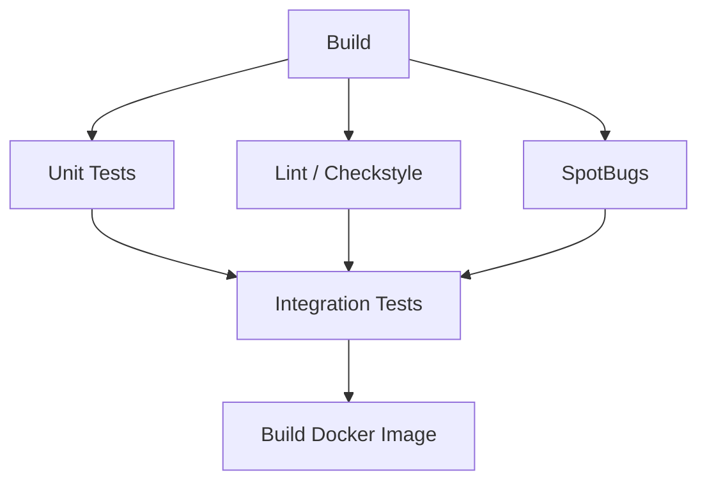
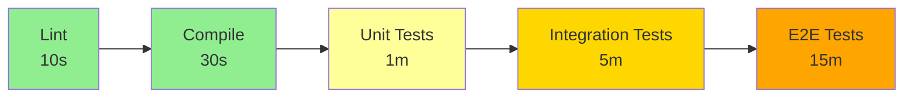
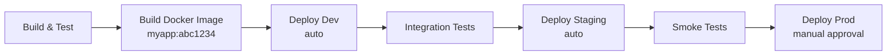
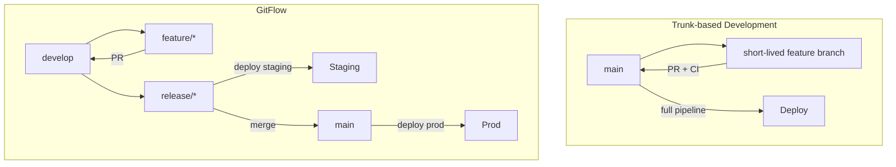
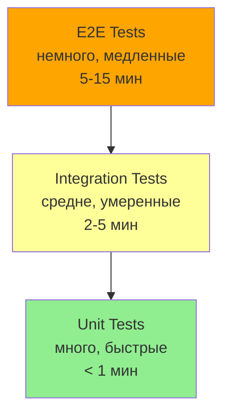
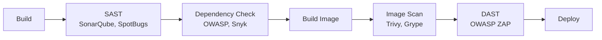
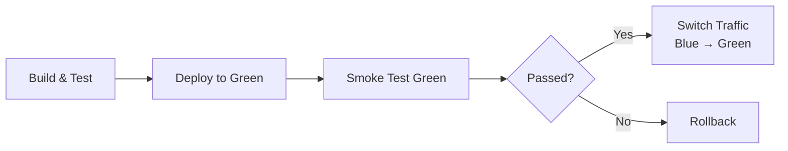
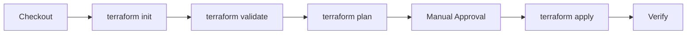
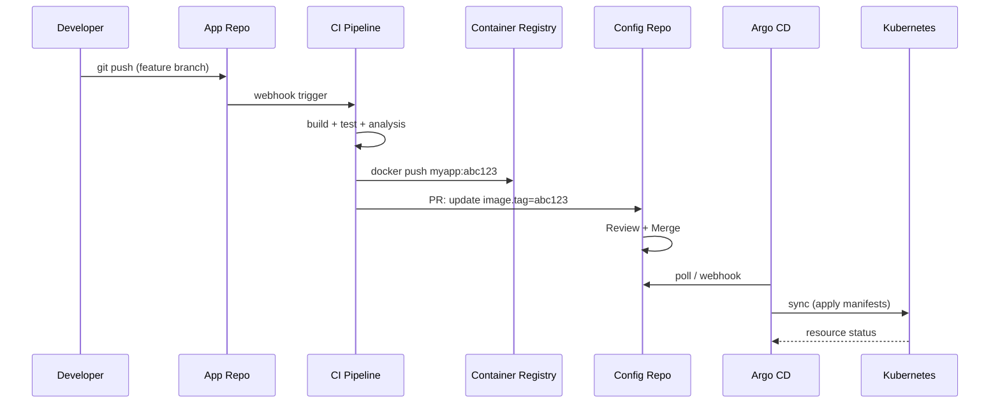
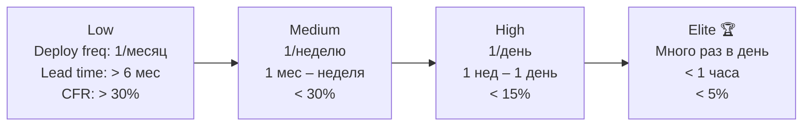

# Вопросы на собеседовании: Дизайн пайплайнов

Комплексное руководство по вопросам собеседования на тему дизайна `CI/CD` пайплайнов для Senior Java Developer. Охватывает `Jenkins`, `GitHub Actions`, `GitLab CI`, `Gradle`, `Docker`, стратегии тестирования, безопасность и оптимизацию.

## Полезные ссылки

### Официальная документация

- [Jenkins Pipeline](https://www.jenkins.io/doc/book/pipeline/) — документация по `Jenkins Pipeline`
- [GitLab CI/CD](https://docs.gitlab.com/ee/ci/) — документация `GitLab CI/CD`
- [GitHub Actions](https://docs.github.com/en/actions) — документация `GitHub Actions`
- [Gradle Build Tool](https://docs.gradle.org/current/userguide/userguide.html) — руководство `Gradle`
- [Intro to Jenkins Pipelines (Baeldung)](https://www.baeldung.com/ops/jenkins-pipelines) — обзор `Jenkins Pipeline`
- [CI/CD with Spring Boot (Baeldung)](https://www.baeldung.com/spring-boot-ci-cd) — `CI/CD` для `Spring Boot`
- [Dockerizing Spring Boot (Baeldung)](https://www.baeldung.com/spring-boot-docker-images) — `Docker`-образы `Spring Boot`

## Содержание

- [Полезные ссылки](#полезные-ссылки)
- [See also](#see-also)

**Основы CI/CD pipeline**
- [Q1. (!) Что такое `CI/CD` pipeline и из каких этапов он состоит?](#q1--что-такое-cicd-pipeline-и-из-каких-этапов-он-состоит)
- [Q2. (!) Чем отличается `CI` от `CD` (`continuous delivery` vs `continuous deployment`)?](#q2--чем-отличается-ci-от-cd-continuous-delivery-vs-continuous-deployment)
- [Q3. Как организовать этапы pipeline: последовательно vs параллельно?](#q3-как-организовать-этапы-pipeline-последовательно-vs-параллельно)
- [Q4. (!) Что такое `pipeline as code` и зачем он нужен?](#q4--что-такое-pipeline-as-code-и-зачем-он-нужен)
- [Q5. (!) Как обеспечить быструю обратную связь в pipeline (`fail fast`)?](#q5--как-обеспечить-быструю-обратную-связь-в-pipeline-fail-fast)
- [Q6. Что такое `quality gates` и как их реализовать в pipeline?](#q6-что-такое-quality-gates-и-как-их-реализовать-в-pipeline)

**Jenkins Pipeline**
- [Q7. (!) Чем отличается `Declarative Pipeline` от `Scripted Pipeline` в `Jenkins`?](#q7--чем-отличается-declarative-pipeline-от-scripted-pipeline-в-jenkins)
- [Q8. Что такое `Jenkins Shared Libraries` и когда их использовать?](#q8-что-такое-jenkins-shared-libraries-и-когда-их-использовать)
- [Q9. Как организовать параллельные стадии в `Jenkins Pipeline`?](#q9-как-организовать-параллельные-стадии-в-jenkins-pipeline)

**GitHub Actions и GitLab CI**
- [Q10. (!) Как устроен `workflow` в `GitHub Actions`?](#q10--как-устроен-workflow-в-github-actions)
- [Q11. Что такое `matrix build` и когда его применять?](#q11-что-такое-matrix-build-и-когда-его-применять)
- [Q12. Как настроить `CI/CD` pipeline в `GitLab CI`?](#q12-как-настроить-cicd-pipeline-в-gitlab-ci)

**Артефакты, версионирование и кэширование**
- [Q13. (!) Что такое артефакты pipeline и как их версионировать?](#q13--что-такое-артефакты-pipeline-и-как-их-версионировать)
- [Q14. Как кэшировать зависимости в pipeline (`Gradle`, `Maven`, `npm`)?](#q14-как-кэшировать-зависимости-в-pipeline-gradle-maven-npm)
- [Q15. Как pipeline интегрируется с артефактным репозиторием (`Nexus`, `Artifactory`)?](#q15-как-pipeline-интегрируется-с-артефактным-репозиторием-nexus-artifactory)
- [Q16. Как обеспечить воспроизводимость сборки в pipeline?](#q16-как-обеспечить-воспроизводимость-сборки-в-pipeline)

**Сборка Java-проектов в pipeline**
- [Q17. (!) Как настроить `Gradle` для `CI/CD` pipeline?](#q17--как-настроить-gradle-для-cicd-pipeline)
- [Q18. Как использовать `Gradle Build Cache` в `CI`?](#q18-как-использовать-gradle-build-cache-в-ci)

**Окружения, approval и ветки**
- [Q19. Как организовать pipeline для нескольких окружений (dev, staging, prod)?](#q19-как-организовать-pipeline-для-нескольких-окружений-dev-staging-prod)
- [Q20. Что такое `manual approval` и когда его использовать?](#q20-что-такое-manual-approval-и-когда-его-использовать)
- [Q21. (!) Как pipeline связан с ветками `Git` (`trunk-based`, `GitFlow`)?](#q21--как-pipeline-связан-с-ветками-git-trunk-based-gitflow)
- [Q22. Что такое pipeline для `pull request` (`PR pipeline`)?](#q22-что-такое-pipeline-для-pull-request-pr-pipeline)

**Тесты в pipeline**
- [Q23. (!) Как организовать тесты в pipeline (`unit`, `integration`, `e2e`)?](#q23--как-организовать-тесты-в-pipeline-unit-integration-e2e)
- [Q24. Что такое `smoke test` после деплоя и когда его запускать?](#q24-что-такое-smoke-test-после-деплоя-и-когда-его-запускать)
- [Q25. Как запускать интеграционные тесты с `Testcontainers` в `CI`?](#q25-как-запускать-интеграционные-тесты-с-testcontainers-в-ci)

**Безопасность pipeline**
- [Q26. (!) Что такое секреты в pipeline и как их хранить?](#q26--что-такое-секреты-в-pipeline-и-как-их-хранить)
- [Q27. Как обеспечить безопасность pipeline (`SAST`, `DAST`, сканирование образов)?](#q27-как-обеспечить-безопасность-pipeline-sast-dast-сканирование-образов)

**Docker и контейнеры в pipeline**
- [Q28. (!) Как организовать сборку `Docker`-образа в pipeline?](#q28--как-организовать-сборку-docker-образа-в-pipeline)
- [Q29. Что такое `multi-stage build` и как он ускоряет pipeline?](#q29-что-такое-multi-stage-build-и-как-он-ускоряет-pipeline)

**Стратегии деплоя в pipeline**
- [Q30. Как реализовать `blue-green` и `canary` деплой в pipeline?](#q30-как-реализовать-blue-green-и-canary-деплой-в-pipeline)
- [Q31. (!) Как организовать откат (`rollback`) в pipeline?](#q31--как-организовать-откат-rollback-в-pipeline)
- [Q32. Как обеспечить идемпотентность этапов pipeline?](#q32-как-обеспечить-идемпотентность-этапов-pipeline)

**Специализированные pipeline**
- [Q33. Что такое pipeline для монолита vs микросервисов?](#q33-что-такое-pipeline-для-монолита-vs-микросервисов)
- [Q34. Как организовать pipeline для монорепозитория?](#q34-как-организовать-pipeline-для-монорепозитория)
- [Q35. Что такое pipeline для инфраструктуры (`IaC`, `Terraform`)?](#q35-что-такое-pipeline-для-инфраструктуры-iac-terraform)

**Мониторинг и оптимизация**
- [Q36. Как мониторить и оптимизировать время выполнения pipeline?](#q36-как-мониторить-и-оптимизировать-время-выполнения-pipeline)

**GitOps pipeline и DORA**
- [Q37. (!) Как выглядит GitOps-pipeline с разделением `app` и `config` репозиториев?](#q37--как-выглядит-gitops-pipeline-с-разделением-app-и-config-репозиториев)
- [Q38. Что такое DORA-метрики и как их улучшить через pipeline?](#q38-что-такое-dora-метрики-и-как-их-улучшить-через-pipeline)

---

## Основы `CI/CD` pipeline

## Q1. (!) Что такое `CI/CD` pipeline и из каких этапов он состоит?

`CI/CD pipeline` — автоматизированная цепочка шагов, которая проводит изменение кода от коммита до продакшена без ручного вмешательства. Каждый этап решает одну задачу и передаёт результат следующему; падение любого этапа останавливает всю цепочку, поэтому до prod доезжает только проверенный код.

Смысл pipeline — заменить ручные операции («собери, прогони тесты, выложи») воспроизводимым процессом, одинаковым для каждого коммита. Этапы выстроены по принципу «дёшево и быстро — раньше»: сначала компиляция и быстрые тесты, в конце — дорогой деплой.

**Типичные этапы:**


1. **`Checkout`** — получение кода из репозитория
2. **`Build`** — компиляция (`Gradle`, `Maven`)
3. **`Unit Tests`** — быстрые юнит-тесты
4. **`Integration Tests`** — тесты с БД, внешними сервисами (см. [интеграционное тестирование](../testing/integration-testing-interview.md))
5. **`Static Analysis`** — линтеры, `SonarQube`, `Checkstyle`
6. **`Build Image`** — сборка `Docker`-образа (см. [Docker](../devops/docker-interview.md))
7. **`Push to Registry`** — публикация образа в `Harbor`, `ECR`, `Nexus`
8. **`Deploy`** — развёртывание в окружения (dev -> staging -> prod)
9. **`Smoke/Health Check`** — проверка работоспособности после деплоя

Дополнительно подключают: security scan (`Trivy`, `OWASP`), нагрузочные тесты, approval gates перед prod.

**Главная мысль для собеседования:** этапы расположены не случайно — порядок задаёт стоимость ошибки. Чем раньше упадёт сборка, тем дешевле обходится фидбэк разработчику.

## Q2. (!) Чем отличается `CI` от `CD` (`continuous delivery` vs `continuous deployment`)?

| Аспект | `CI` | `CD` (Delivery) | `CD` (Deployment) |
|--------|------|-----------------|-------------------|
| Цель | Быстрая обратная связь | Код всегда готов к релизу | Автоматический деплой |
| Деплой в prod | Нет | Ручной / по approval | Автоматический |
| Частота релизов | — | По решению команды | При каждом merge |
| Требования | Тесты, сборка | + staging, quality gates | + полная автоматизация |

Три аббревиатуры описывают три уровня автоматизации, надстроенные друг над другом: каждый следующий включает предыдущий и добавляет автоматизацию ещё одного ручного шага.

- **`CI` (`Continuous Integration`)** — каждый коммит автоматически собирается и прогоняется через тесты. Решает проблему «у меня всё работало»: интеграционные конфликты между ветками всплывают сразу, а не на этапе релиза.
- **`CD` (`Continuous Delivery`)** — добавляет к CI гарантию, что код в любой момент готов к деплою (прошёл staging и quality gates). Сам выкат в prod запускает человек кнопкой или approval.
- **`CD` (`Continuous Deployment`)** — снимает последний ручной шаг: после зелёного pipeline код уезжает в prod автоматически, без участия человека.

**Ключевое различие, которое любят спрашивать:** `Continuous Delivery` и `Continuous Deployment` отличаются ровно одним — кто нажимает кнопку «в prod». В delivery это человек (approval), в deployment — сам pipeline. Большинство enterprise-команд останавливаются на `Continuous Delivery` с `manual approval` перед prod: техническая готовность есть, но финальное решение оставляют за людьми из-за регуляторики и бизнес-рисков.

## Q3. Как организовать этапы pipeline: последовательно vs параллельно?

Выбор между последовательным и параллельным определяется одним вопросом: зависит ли этап от результата другого. Если да — только последовательно; если нет — параллелим, чтобы не ждать.

- **Последовательное** выполнение — каждый этап стартует после успеха предыдущего. Обязательно там, где есть зависимость по данным: сборка → тесты → образ (тесты нужен скомпилированный код, образ — собранный jar).
- **Параллельное** — независимые проверки идут одновременно. Линтер, юнит-тесты и SpotBugs работают с одним и тем же исходником и не мешают друг другу, поэтому их можно запускать вместе. Это сокращает `pipeline` в 2-3 раза, потому что общее время становится равным самой долгой ветке, а не сумме всех.



**Пример параллельных этапов в `GitHub Actions`:**

```yaml
jobs:
  build:
    runs-on: ubuntu-latest
    steps:
      - uses: actions/checkout@v4
      - uses: actions/setup-java@v4
        with: { distribution: temurin, java-version: 21 }
      - run: ./gradlew assemble

  unit-tests:
    needs: build
    runs-on: ubuntu-latest
    steps:
      - run: ./gradlew test

  lint:
    needs: build
    runs-on: ubuntu-latest
    steps:
      - run: ./gradlew checkstyleMain

  integration-tests:
    needs: [unit-tests, lint]
    runs-on: ubuntu-latest
    steps:
      - run: ./gradlew integrationTest
```

**Эмпирическое правило:** параллелить всё, что не зависит друг от друга; оставлять последовательным только то, что требует артефакт предыдущего этапа. На практике в `GitHub Actions` это выражается полем `needs` — оно описывает граф зависимостей, а движок сам решает, что можно запустить одновременно.

## Q4. (!) Что такое `pipeline as code` и зачем он нужен?

**`Pipeline as code`** — описание `pipeline` файлом, который лежит рядом с кодом в репозитории, а не настройками, накликанными в `UI` `CI`-системы. Pipeline становится частью кодовой базы и подчиняется тем же правилам: версионируется, ревьюится, откатывается.

| CI-система | Файл |
|------------|------|
| `Jenkins` | `Jenkinsfile` |
| `GitLab CI` | `.gitlab-ci.yml` |
| `GitHub Actions` | `.github/workflows/*.yml` |

**Зачем это нужно (и почему UI-конфиги — антипаттерн):**
- **Версионирование** — изменение `pipeline` проходит через `PR` и `code review`, как любой код; нельзя «по-тихому» поправить сборку в обход команды.
- **Воспроизводимость** — откатили коммит → откатился и pipeline вместе с ним; старая версия кода всегда собирается своей версией pipeline.
- **Аудит** — вся история «кто и когда менял сборку» лежит в `Git`, а не теряется в кликах по веб-интерфейсу.
- **Единый источник правды** — невозможна ситуация «код в репозитории старый, а pipeline в UI уже новый»; они синхронизированы по определению.

**Пример `Jenkinsfile` (Declarative):**

```groovy
pipeline {
    agent { docker { image 'eclipse-temurin:21-jdk' } }
    stages {
        stage('Build') {
            steps { sh './gradlew assemble' }
        }
        stage('Test') {
            steps { sh './gradlew test' }
        }
        stage('Docker') {
            steps {
                sh 'docker build -t myapp:${GIT_COMMIT} .'
                sh 'docker push registry.example.com/myapp:${GIT_COMMIT}'
            }
        }
    }
    post {
        always { junit '**/build/test-results/**/*.xml' }
        failure { slackSend channel: '#builds', message: "Build failed: ${env.JOB_NAME}" }
    }
}
```

## Q5. (!) Как обеспечить быструю обратную связь в pipeline (`fail fast`)?

`Fail fast` — это стратегия «сломайся как можно раньше и дешевле»: pipeline проектируют так, чтобы дефект всплыл на первых секундах, а не после 20 минут прогона. Чем быстрее разработчик узнаёт о поломке, тем дешевле она в починке — контекст ещё в голове.

Принципы `fail fast`:

1. **Быстрые этапы первыми** — `lint`, `compile`, `unit tests` (секунды) ставят перед `integration` и `e2e` (минуты). Опечатка должна валить сборку за 10 секунд на линтере, а не за 15 минут на e2e.
2. **Остановка при первом падении** — если код не компилируется, нет смысла гонять тесты; ресурсы runner-а не тратятся впустую.
3. **Параллельность** — независимые проверки идут одновременно, чтобы суммарное время фидбэка было равно самой долгой из них.
4. **Кэширование** — зависимости не скачиваются заново на каждом запуске, иначе быстрые этапы перестают быть быстрыми.
5. **Инкрементальная сборка** — пересобирается только изменённое, а не весь проект целиком.



**Как это включается в `GitHub Actions`:** `fail-fast: true` в матрице отменяет остальные комбинации при падении одной. Зависимости между jobs (`needs`) гарантируют, что тяжёлые этапы вообще не стартуют при сломанной сборке — движок их пропускает.

**Целевые метрики (на что ориентироваться в ответе):** `lint` + `compile` < 1 мин; `unit tests` < 3 мин; полный `pipeline` < 15 мин. Порог боли — 30 минут: если pipeline стабильно дольше, разработчики перестают ждать фидбэк и переключаются на другое, теряя контекст — это сигнал к оптимизации.

## Q6. Что такое `quality gates` и как их реализовать в pipeline?

**`Quality gate`** — автоматический порог качества: набор критериев, которые код обязан выполнить, чтобы двигаться дальше по pipeline. Не выполнен хотя бы один — pipeline падает, и код не продвигается. Это превращает «договорённости о качестве» в обязательное к исполнению правило, которое нельзя обойти забывчивостью или спешкой.

**Типичные quality gates:**
- Покрытие тестами >= 80% (`JaCoCo`)
- 0 критических/блокирующих issues в `SonarQube`
- Все `unit`/`integration` тесты зелёные
- Нет критических уязвимостей в зависимостях (`OWASP`)
- `Docker`-образ прошёл сканирование (`Trivy`)

**Пример `Gradle` с `JaCoCo` quality gate:**

```groovy
jacocoTestCoverageVerification {
    violationRules {
        rule {
            limit {
                minimum = 0.80
            }
        }
        rule {
            element = 'CLASS'
            excludes = ['*.config.*', '*.dto.*']
            limit {
                counter = 'LINE'
                minimum = 0.70
            }
        }
    }
}

check.dependsOn jacocoTestCoverageVerification
```

В `SonarQube` quality gate настраивается через UI или `API`, а pipeline дожидается вердикта: в `Jenkins` это `waitForQualityGate()`, в `GitHub Actions` — action `sonar-quality-gate-check`. Без этого ожидания pipeline отправит код дальше до того, как SonarQube закончит анализ, и gate станет бесполезным.

**Подводный камень:** слишком строгие gates на старте проекта (например, 90% покрытия на legacy-кодовой базе) приводят к тому, что команда начинает их обходить (`@SuppressWarnings`, исключения в конфиге). Gate должен быть достижимым, иначе его перестают воспринимать всерьёз.

---

## `Jenkins Pipeline`

## Q7. (!) Чем отличается `Declarative Pipeline` от `Scripted Pipeline` в `Jenkins`?

| Аспект | `Declarative` | `Scripted` |
|--------|--------------|-----------|
| Синтаксис | Структурированный (`pipeline {}`) | Произвольный `Groovy` (`node {}`) |
| Валидация | На этапе парсинга | Только при исполнении |
| Гибкость | Ограниченная, покрывает 90% случаев | Полная — любой `Groovy`-код |
| Обработка ошибок | Блок `post {}` | `try/catch/finally` |
| Blue Ocean UI | Полная поддержка | Частичная |
| Рекомендация | Для большинства проектов | Для сложной логики |

Оба — способы написать `Jenkinsfile`, но с разным балансом «строгость против свободы». `Declarative` — это DSL с фиксированной структурой (`pipeline { stages { stage {} } }`), которую Jenkins валидирует ещё до запуска. `Scripted` — почти чистый `Groovy` внутри `node {}`, где можно писать любую логику, но ошибку вы увидите только в момент исполнения нужной ветки.

Ключевой компромисс: `Declarative` жертвует гибкостью ради читаемости, раннней валидации и поддержки Blue Ocean — и этого хватает в ~90% случаев. `Scripted` отдаёт читаемость за полную власть над логикой.

**`Declarative Pipeline`** (рекомендуемый по умолчанию):

```groovy
pipeline {
    agent any
    environment {
        REGISTRY = 'registry.example.com'
    }
    stages {
        stage('Build & Test') {
            steps {
                sh './gradlew clean build'
            }
            post {
                always {
                    junit '**/build/test-results/test/*.xml'
                    jacoco execPattern: '**/build/jacoco/*.exec'
                }
            }
        }
        stage('SonarQube') {
            steps {
                withSonarQubeEnv('SonarQube') {
                    sh './gradlew sonar'
                }
                waitForQualityGate abortPipeline: true
            }
        }
        stage('Docker Build & Push') {
            when { branch 'main' }
            steps {
                sh "docker build -t ${REGISTRY}/myapp:${GIT_COMMIT[0..7]} ."
                sh "docker push ${REGISTRY}/myapp:${GIT_COMMIT[0..7]}"
            }
        }
    }
    post {
        failure {
            slackSend channel: '#ci-alerts', message: "FAILED: ${env.JOB_NAME} #${env.BUILD_NUMBER}"
        }
    }
}
```

**`Scripted Pipeline`** — для сложных сценариев с условной логикой:

```groovy
node {
    try {
        stage('Build') { sh './gradlew assemble' }
        stage('Test')  { sh './gradlew test' }

        if (env.BRANCH_NAME == 'main') {
            stage('Deploy') {
                withCredentials([usernamePassword(credentialsId: 'registry', ...)]) {
                    sh 'docker push ...'
                }
            }
        }
    } catch (e) {
        slackSend message: "Build failed: ${e.message}"
        throw e
    } finally {
        junit '**/build/test-results/**/*.xml'
    }
}
```

**Что сказать на собеседовании:** по умолчанию — `Declarative`, он покрывает 90% случаев и защищает от ошибок ранней валидацией. К `Scripted` переходят точечно — когда нужна нетривиальная логика (динамическая генерация стадий, сложные циклы), которую декларативный синтаксис не выражает. Распространённый гибрид — `Declarative` с блоком `script {}` внутри `steps`, куда прячут небольшие куски императивного `Groovy`, не теряя структуру всего pipeline.

## Q8. Что такое `Jenkins Shared Libraries` и когда их использовать?

**`Shared Libraries`** — переиспользуемые `Groovy`-библиотеки в отдельном `Git`-репозитории, которые подключаются к `Jenkinsfile`. Решают проблему копипасты: вместо того чтобы дублировать одинаковую логику сборки и деплоя в сотне `Jenkinsfile`, её описывают один раз в библиотеке, а проекты вызывают готовую функцию. Изменили логику в одном месте — обновились все потребители.

**Структура:**

```
jenkins-shared-library/
├── vars/
│   ├── buildJavaApp.groovy      # глобальные функции
│   └── deployToK8s.groovy
├── src/
│   └── com/example/pipeline/    # классы Groovy
└── resources/                    # шаблоны, конфиги
```

**Определение (`vars/buildJavaApp.groovy`):**

```groovy
def call(Map config = [:]) {
    pipeline {
        agent { docker { image config.jdkImage ?: 'eclipse-temurin:21-jdk' } }
        stages {
            stage('Build') { steps { sh './gradlew assemble' } }
            stage('Test')  { steps { sh './gradlew test' } }
            stage('Publish') {
                when { branch 'main' }
                steps { sh './gradlew publish' }
            }
        }
    }
}
```

**Использование в `Jenkinsfile`:**

```groovy
@Library('my-shared-lib') _
buildJavaApp(jdkImage: 'eclipse-temurin:21-jdk')
```

**Когда применять:** когда 3-5+ проектов имеют одинаковую структуру pipeline; когда организации нужен единый стандарт CI/CD, который нельзя обойти; когда логику работы с секретами и credentials хочется централизовать и не размазывать по проектам.

**Подводный камень:** Shared Library — это код, который выполняется с правами Jenkins. Без `code review` и контроля доступа к её репозиторию любой, кто меняет библиотеку, по сути меняет поведение всех pipeline сразу — это и сила, и риск.

## Q9. Как организовать параллельные стадии в `Jenkins Pipeline`?

Параллельные стадии в Jenkins описываются директивой `parallel` внутри `stage`: вложенные в неё `stage` выполняются одновременно, а не друг за другом.

```groovy
pipeline {
    agent any
    stages {
        stage('Build') {
            steps { sh './gradlew assemble' }
        }
        stage('Parallel Checks') {
            parallel {
                stage('Unit Tests') {
                    steps { sh './gradlew test' }
                }
                stage('Checkstyle') {
                    steps { sh './gradlew checkstyleMain' }
                }
                stage('SpotBugs') {
                    steps { sh './gradlew spotbugsMain' }
                }
            }
            failFast true  // при падении одного — остановить остальные
        }
        stage('Integration Tests') {
            steps { sh './gradlew integrationTest' }
        }
    }
}
```

`failFast true` останавливает все параллельные ветки, как только падает любая из них, — нет смысла дожидаться SpotBugs, если уже упали тесты. Если в кластере несколько нод, `Jenkins` раскидывает параллельные стадии по разным агентам, и они выполняются по-настоящему одновременно, а не конкурируют за один исполнитель.

**Нюанс:** параллельные стадии на одном агенте делят его ресурсы (CPU, память, рабочую директорию). Если три тяжёлые стадии запустить на слабом агенте, они замедлят друг друга — выигрыша от параллелизма может не быть. Реальное ускорение даёт распределение по нескольким нодам.

---

## `GitHub Actions` и `GitLab CI`

## Q10. (!) Как устроен `workflow` в `GitHub Actions`?

`Workflow` в `GitHub Actions` — это `YAML`-файл в `.github/workflows/`, описывающий, что и при каком событии должно автоматически выполниться. Модель строится из четырёх вложенных уровней, и на собеседовании важно не путать их иерархию.

**Иерархия концепций (от большего к меньшему):**
- **`Workflow`** — весь процесс целиком, запускаемый по триггеру (push, PR, расписание).
- **`Job`** — набор шагов на одном runner; jobs по умолчанию параллельны, а зависимости задаются через `needs`. Каждый job стартует на чистой машине — данные между jobs передаются только через артефакты или кэш.
- **`Step`** — атомарный шаг внутри job: либо shell-команда (`run`), либо вызов action (`uses`). Steps внутри job всегда последовательны и делят рабочую директорию.
- **`Action`** — переиспользуемый компонент-«кубик» (аналог `Jenkins Shared Library`), который подключают через `uses`, не дублируя его реализацию.

**Полный пример для `Java`/`Gradle` проекта:**

```yaml
name: CI/CD Pipeline
on:
  push:
    branches: [main, release/*]
  pull_request:
    branches: [main]

permissions:
  contents: read
  packages: write

jobs:
  build:
    runs-on: ubuntu-latest
    steps:
      - uses: actions/checkout@v4
      - uses: actions/setup-java@v4
        with:
          distribution: temurin
          java-version: 21
          cache: gradle
      - run: ./gradlew assemble
      - uses: actions/upload-artifact@v4
        with:
          name: app-jar
          path: build/libs/*.jar

  test:
    needs: build
    runs-on: ubuntu-latest
    services:
      postgres:
        image: postgres:16
        env:
          POSTGRES_DB: testdb
          POSTGRES_PASSWORD: test
        ports: ['5432:5432']
    steps:
      - uses: actions/checkout@v4
      - uses: actions/setup-java@v4
        with: { distribution: temurin, java-version: 21, cache: gradle }
      - run: ./gradlew test integrationTest
        env:
          SPRING_DATASOURCE_URL: jdbc:postgresql://localhost:5432/testdb
      - uses: actions/upload-artifact@v4
        if: always()
        with:
          name: test-reports
          path: build/reports/tests/

  docker:
    needs: test
    if: github.ref == 'refs/heads/main'
    runs-on: ubuntu-latest
    steps:
      - uses: actions/checkout@v4
      - uses: docker/login-action@v3
        with:
          registry: ghcr.io
          username: ${{ github.actor }}
          password: ${{ secrets.GITHUB_TOKEN }}
      - uses: docker/build-push-action@v5
        with:
          push: true
          tags: ghcr.io/${{ github.repository }}:${{ github.sha }}

  deploy-staging:
    needs: docker
    runs-on: ubuntu-latest
    environment: staging
    steps:
      - run: kubectl set image deployment/myapp myapp=ghcr.io/${{ github.repository }}:${{ github.sha }}

  deploy-prod:
    needs: deploy-staging
    runs-on: ubuntu-latest
    environment:
      name: production
      url: https://myapp.example.com
    steps:
      - run: kubectl set image deployment/myapp myapp=ghcr.io/${{ github.repository }}:${{ github.sha }}
```

## Q11. Что такое `matrix build` и когда его применять?

**`Matrix build`** — способ прогнать один и тот же job на всех комбинациях заданных параметров (версия `Java`, ОС, БД), не дублируя его описание. Вместо того чтобы копировать job четыре раза под Java 17/21 на Linux/Windows, описывают одну матрицу — движок сам разворачивает её в четыре параллельных job. Это инструмент для проверки совместимости: «работает ли мой код на всех платформах, которые мы обещаем поддерживать».

```yaml
jobs:
  test:
    strategy:
      fail-fast: true
      matrix:
        java: [17, 21]
        os: [ubuntu-latest, windows-latest]
    runs-on: ${{ matrix.os }}
    steps:
      - uses: actions/checkout@v4
      - uses: actions/setup-java@v4
        with:
          distribution: temurin
          java-version: ${{ matrix.java }}
          cache: gradle
      - run: ./gradlew test
```

**Когда применять:**
- Библиотеки с поддержкой нескольких версий `Java` (17, 21)
- Кроссплатформенные проекты
- Тестирование с разными СУБД (`PostgreSQL`, `MySQL`)

**Подводный камень:** комбинации перемножаются. Матрица `2 x 2` — это уже 4 job, а `3 x 3 x 3` — 27, и все они едят минуты runner-ов. Раздувать матрицу без необходимости дорого; добавляйте измерение, только если реально обещаете поддержку этой комбинации. `fail-fast: true` отменяет остальные комбинации при первом падении (экономит ресурсы), `fail-fast: false` — наоборот, прогоняет все, чтобы увидеть полную картину, на какой именно платформе сломалось.

## Q12. Как настроить `CI/CD` pipeline в `GitLab CI`?

`GitLab CI` описывает pipeline файлом `.gitlab-ci.yml` в корне репозитория. Базовая модель проще, чем в GitHub Actions: job-ы группируются по `stages`, job-ы одной стадии идут параллельно, а следующая стадия стартует только после успеха всей предыдущей.

```yaml
stages:
  - build
  - test
  - analyze
  - docker
  - deploy

variables:
  GRADLE_OPTS: "-Dorg.gradle.daemon=false"

cache:
  key: ${CI_COMMIT_REF_SLUG}
  paths:
    - .gradle/

build:
  stage: build
  image: eclipse-temurin:21-jdk
  script:
    - ./gradlew assemble
  artifacts:
    paths:
      - build/libs/*.jar
    expire_in: 1 hour

unit-tests:
  stage: test
  image: eclipse-temurin:21-jdk
  script:
    - ./gradlew test
  artifacts:
    reports:
      junit: build/test-results/test/*.xml

integration-tests:
  stage: test
  image: eclipse-temurin:21-jdk
  services:
    - postgres:16
  variables:
    POSTGRES_DB: testdb
    POSTGRES_PASSWORD: test
  script:
    - ./gradlew integrationTest

sonar:
  stage: analyze
  script:
    - ./gradlew sonar -Dsonar.host.url=$SONAR_URL -Dsonar.token=$SONAR_TOKEN
  rules:
    - if: $CI_PIPELINE_SOURCE == "merge_request_event"

docker-build:
  stage: docker
  image: docker:24
  services:
    - docker:24-dind
  script:
    - docker build -t $CI_REGISTRY_IMAGE:$CI_COMMIT_SHA .
    - docker push $CI_REGISTRY_IMAGE:$CI_COMMIT_SHA
  rules:
    - if: $CI_COMMIT_BRANCH == "main"

deploy-prod:
  stage: deploy
  script:
    - kubectl set image deployment/myapp myapp=$CI_REGISTRY_IMAGE:$CI_COMMIT_SHA
  when: manual
  rules:
    - if: $CI_COMMIT_BRANCH == "main"
```

**Чем `GitLab CI` отличается от `GitHub Actions` (полезно для сравнения на собеседовании):**
- Container registry встроен в сам GitLab — образ некуда отдельно «логиниться», переменные `$CI_REGISTRY_*` готовы из коробки.
- `services` поднимают sidecar-контейнеры (например, `postgres:16`) рядом с job — аналог `services` в Actions.
- Условия запуска описываются через `rules` (а не `if`, как в Actions); `when: manual` превращает job в кнопку для ручного запуска.
- `artifacts:reports:junit` автоматически подтягивает результаты тестов прямо в интерфейс merge request — видно, какой тест упал, без копания в логах.

---

## Артефакты, версионирование и кэширование

## Q13. (!) Что такое артефакты pipeline и как их версионировать?

**Артефакт** — это результат сборки (`jar`, `war`, `Docker`-образ), который передаётся между этапами pipeline или публикуется в registry для деплоя. Главное свойство, ради которого артефакты версионируют, — трассируемость: по тегу должно быть однозначно понятно, из какого коммита он собран, чтобы при инциденте найти виновный код, а при откате — вернуть конкретную предыдущую версию.

**Стратегии версионирования:**

| Стратегия | Пример тега | Использование |
|-----------|-------------|---------------|
| `Semver` | `1.2.3` | Релизы, библиотеки |
| Git `SHA` | `abc1234` | Dev/staging образы |
| Semver + build | `1.2.3-rc.5` | Release candidate |
| Branch + SHA | `main-abc1234` | Feature-ветки |

**Правила (и почему они важны):**
- **Один тег — один артефакт навсегда:** опубликованный тег не перезаписывают. Иначе `myapp:1.2.3` сегодня и завтра — разные образы, и теряется смысл версии.
- **В prod никогда не `latest`:** `latest` указывает «на последний», а не на конкретное; два пода одного деплоя могут поднять разные образы, а воспроизвести инцидент станет невозможно. Только явная версия.
- **Разделение по типу хранилища:** `jar`/`war` едут в `Nexus`/`Artifactory`, `Docker`-образ — в container registry.
- **Откат — это деплой готового старого артефакта, а не пересборка.** Пересборка из старого коммита может дать другой результат (поменялись зависимости, базовый образ); готовый артефакт гарантированно тот же.

**Пример `Gradle` publishing:**

```groovy
publishing {
    publications {
        maven(MavenPublication) {
            groupId = 'com.example'
            artifactId = 'myapp'
            version = project.version  // из gradle.properties или git tag
            from components.java
        }
    }
    repositories {
        maven {
            url = uri("https://nexus.example.com/repository/maven-releases/")
            credentials {
                username = System.getenv("NEXUS_USER")
                password = System.getenv("NEXUS_PASSWORD")
            }
        }
    }
}
```

## Q14. Как кэшировать зависимости в pipeline (`Gradle`, `Maven`, `npm`)?

Кэширование зависимостей экономит 2-5 минут на запуск, исключая повторное скачивание сотен `jar`-ов из репозитория. Логика простая: на чистом runner-е первый прогон скачивает все зависимости заново; кэш сохраняет их между запусками, и пока список зависимостей не менялся, скачивать нечего.

**`GitHub Actions` (встроенная поддержка `Gradle`):**

```yaml
- uses: actions/setup-java@v4
  with:
    distribution: temurin
    java-version: 21
    cache: gradle   # автоматически кэширует ~/.gradle
```

**`GitHub Actions` (ручной кэш для `Maven`):**

```yaml
- uses: actions/cache@v4
  with:
    path: ~/.m2/repository
    key: ${{ runner.os }}-m2-${{ hashFiles('**/pom.xml') }}
    restore-keys: |
      ${{ runner.os }}-m2-
```

**`GitLab CI`:**

```yaml
cache:
  key:
    files:
      - build.gradle.kts
      - gradle/wrapper/gradle-wrapper.properties
  paths:
    - .gradle/caches/
    - .gradle/wrapper/
```

**Ключевые правила (и почему именно так):**
- **Ключ кэша = хэш lock-файла** (`pom.xml`, `build.gradle.kts`). Пока зависимости не менялись, хэш тот же — берётся старый кэш. Добавили зависимость — хэш изменился — кэш пересоздаётся. Это гарантирует, что вы не работаете с устаревшим набором.
- **`restore-keys` — fallback на частичный кэш:** если точного совпадения по ключу нет, подтягивается ближайший подходящий, чтобы докачать только разницу, а не всё с нуля.
- **`TTL`:** в `GitHub Actions` неиспользуемый кэш живёт 7 дней, в `GitLab CI` срок настраивается.
- **Кэшировать только зависимости, а не `build/`.** Содержимое `build/` — это результат текущей сборки; закэшировав его, вы рискуете подсунуть устаревшие классы и получить «призрачные» баги. Кэшируется то, что не зависит от вашего кода.

## Q15. Как pipeline интегрируется с артефактным репозиторием (`Nexus`, `Artifactory`)?

Артефактный репозиторий (`Nexus`, `Artifactory`) — централизованное хранилище собранных артефактов с версионированием и контролем доступа. Pipeline кладёт туда `jar`/образ после успешной сборки и тестов, а потребители (другие сборки, деплой) забирают конкретную версию оттуда, а не пересобирают её сами. Это и кэш зависимостей для всей организации, и единая точка, откуда деплоится прод.

**Интеграция `Gradle` с `Nexus`:**

```groovy
// build.gradle.kts
publishing {
    repositories {
        maven {
            val releasesUrl = uri("https://nexus.example.com/repository/maven-releases/")
            val snapshotsUrl = uri("https://nexus.example.com/repository/maven-snapshots/")
            url = if (version.toString().endsWith("SNAPSHOT")) snapshotsUrl else releasesUrl
            credentials {
                username = System.getenv("NEXUS_USER")
                password = System.getenv("NEXUS_PASSWORD")
            }
        }
    }
}
```

**В `Jenkinsfile`:**

```groovy
stage('Publish') {
    when { branch 'main' }
    steps {
        withCredentials([usernamePassword(credentialsId: 'nexus-creds',
                usernameVariable: 'NEXUS_USER', passwordVariable: 'NEXUS_PASSWORD')]) {
            sh './gradlew publish'
        }
    }
}
```

**Снапшоты vs релизы:** SNAPSHOT-репозиторий допускает перезапись версии (для промежуточных сборок в разработке), релизный — нет: опубликованный релиз неизменен. Поэтому в конфиге выше URL выбирается по суффиксу `SNAPSHOT`.

**Promotion (продвижение):** хорошая практика — один и тот же артефакт продвигать между репозиториями, а не пересобирать под каждое окружение. `Artifactory` умеет перемещать артефакт из `dev` в `release` без пересборки нативно. `Nexus` так не умеет — там используют staging-репозитории и копирование. Смысл тот же: в prod уезжает ровно тот бинарник, который прошёл тесты на staging.

## Q16. Как обеспечить воспроизводимость сборки в pipeline?

**Воспроизводимость** — сборка из одного и того же коммита всегда даёт идентичный артефакт, независимо от того, когда и на какой машине её запустили. Без этого свойства теряется доверие к pipeline: «у меня собралось, а в CI — нет» и невозможность точно воссоздать прод-сборку для отладки.

Источник невоспроизводимости один — любая «плавающая» переменная: версия зависимости, образа, инструмента, которая может незаметно поменяться между запусками. Поэтому все меры сводятся к фиксации этих переменных.

**Меры:**
1. **Фиксированные версии зависимостей** — `Gradle` dependency locking, `Maven` с явными версиями, npm `package-lock.json`. Без локов транзитивная зависимость может подтянуть новую минорную версию и сломать сборку «на ровном месте».
2. **Фиксированный образ сборки** — `eclipse-temurin:21.0.2-jdk`, а не `latest`: `latest` сегодня и через месяц — разные образы.
3. **`Gradle Wrapper`** — версия `Gradle` зашита в `gradle-wrapper.properties`, поэтому все собирают одной и той же версией, а не той, что стоит на конкретной машине.
4. **Тегирование по коммиту** — артефакт однозначно связан с кодом, из которого собран.

**`Gradle` dependency locking:**

```groovy
// build.gradle.kts
dependencyLocking {
    lockAllConfigurations()
}
```

```bash
# Генерация lock-файла
./gradlew dependencies --write-locks
# Файлы gradle/dependency-locks/*.lockfile коммитить в Git
```

**В `CI`:** использовать `./gradlew build --no-daemon` для стабильности; `Gradle Wrapper` (`./gradlew`) вместо системного `Gradle`; образ сборки с конкретным тегом.

---

## Сборка `Java`-проектов в pipeline

## Q17. (!) Как настроить `Gradle` для `CI/CD` pipeline?

`Gradle` — основной инструмент сборки в современных `Java`-проектах, но его поведение по умолчанию заточено под локальную разработку, а не под CI. В CI важны три вещи: скорость, стабильность (никаких «иногда падает») и воспроизводимость — и под них Gradle нужно донастроить. Ключевые отличия CI-сборки от локальной — отключённый daemon, явный параллелизм и build cache.

**`build.gradle.kts` для CI:**

```kotlin
plugins {
    java
    jacoco
    id("org.sonarqube") version "5.0.0.4638"
    id("com.github.ben-manes.versions") version "0.51.0"
}

java {
    toolchain {
        languageVersion.set(JavaLanguageVersion.of(21))
    }
}

tasks.test {
    useJUnitPlatform()
    maxParallelForks = (Runtime.getRuntime().availableProcessors() / 2).coerceAtLeast(1)
    jvmArgs("-XX:+UseParallelGC")  // быстрый GC для тестов
    finalizedBy(tasks.jacocoTestReport)
}

tasks.jacocoTestReport {
    reports {
        xml.required.set(true)  // для SonarQube
        html.required.set(true)
    }
}

tasks.jacocoTestCoverageVerification {
    violationRules {
        rule {
            limit { minimum = "0.80".toBigDecimal() }
        }
    }
}

tasks.check {
    dependsOn(tasks.jacocoTestCoverageVerification)
}
```

**Ключевые флаги `Gradle` для CI:**

```bash
./gradlew build \
  --no-daemon \           # не тратить RAM на daemon
  --parallel \            # параллельная сборка модулей
  --build-cache \         # локальный/удалённый build cache
  -Dorg.gradle.workers.max=4
```

Почему именно эти флаги:
- **`--no-daemon`** — daemon-процесс Gradle полезен локально, где он переживает между запусками и держит JVM прогретой. В CI runner эфемерный: после прогона он умирает, daemon переиспользовать некому, а память он съедает. Поэтому в CI его выключают.
- **`--parallel`** — на multi-module проектах собирает независимые модули одновременно, используя все ядра агента.
- **`--build-cache`** — переиспользует результаты задач (`compile`, `test`) между сборками, если входные данные не менялись (подробнее в Q18).

## Q18. Как использовать `Gradle Build Cache` в `CI`?

`Gradle Build Cache` кэширует не зависимости, а результаты выполнения задач: для каждой задачи Gradle считает хэш её входов (исходники, classpath, флаги) и, если такой хэш уже встречался, берёт готовый результат вместо повторного выполнения. Важно не путать с кэшем зависимостей из Q14 — там кэшируются скачанные `jar`, здесь — результаты компиляции и тестов.

Кэш бывает двух уровней, и для CI принципиален именно второй:

- **Локальный кэш** (включён по умолчанию): `~/.gradle/caches/build-cache-*`. Полезен на машине разработчика, но на эфемерном CI-runner-е исчезает вместе с ним.
- **Удалённый кэш** (для `CI`): общее хранилище для всех агентов. Задачу, скомпилированную на одном агенте, переиспользуют все остальные — в том числе и сборка коллеги, который не менял эти файлы. Именно это даёт основной выигрыш в CI.

```kotlin
// settings.gradle.kts
buildCache {
    local {
        isEnabled = true
    }
    remote<HttpBuildCache> {
        url = uri("https://gradle-cache.example.com/cache/")
        isPush = System.getenv("CI") != null  // push только из CI
        credentials {
            username = System.getenv("CACHE_USER")
            password = System.getenv("CACHE_PASSWORD")
        }
    }
}
```

**В `GitHub Actions`:**

```yaml
- uses: gradle/actions/setup-gradle@v3
  with:
    cache-read-only: ${{ github.ref != 'refs/heads/main' }}
    # PR-ы только читают кэш; main — читает и пишет
```

Обратите внимание на типичный паттерн в примере выше: PR-ы только читают кэш (`cache-read-only: true`), а пишет в него лишь сборка `main`. Так PR не «отравит» общий кэш своими промежуточными результатами, но при этом пользуется наработками главной ветки.

Экономия: при изменении одного файла Gradle пересобирает только затронутые задачи, остальные мгновенно берёт из кэша. На крупных проектах это 50-70% времени сборки — за счёт того, что большая часть модулей при типичном изменении вообще не трогается.

---

## Окружения, approval и ветки

## Q19. Как организовать pipeline для нескольких окружений (dev, staging, prod)?

**Главный принцип — build once, deploy many:** образ собирается ровно один раз и затем продвигается по окружениям dev → staging → prod как есть, без пересборки. От окружения к окружению меняется только конфигурация (URL баз, секреты, фичефлаги), а сам бинарник один и тот же. Это критично: если под каждое окружение пересобирать заново, то в prod уедет не тот артефакт, который тестировали на staging, — и все проверки теряют смысл.



**Два подхода к организации:**
1. **Один pipeline с цепочкой этапов** — dev деплоится автоматически, staging после прохождения тестов, prod после ручного approval. Деплой выполняет сам pipeline (push-модель).
2. **`GitOps`** — pipeline не деплоит напрямую, а коммитит новый тег образа в Git; `ArgoCD`/`Flux` непрерывно синхронизирует кластер с репозиторием (pull-модель). Деплой = коммит в Git (подробнее в [Kubernetes](../devops/kubernetes-interview.md)).

**Где живёт конфигурация для каждого окружения:**
- `Kubernetes` — `ConfigMap`/`Secret` в отдельном namespace на окружение.
- `Spring Boot` — `application-{profile}.yml`, профиль выбирается на запуске.
- `CI` — environment-specific variables (хранятся в настройках окружения CI-системы).

**В `GitHub Actions`:**

```yaml
deploy-prod:
  needs: deploy-staging
  runs-on: ubuntu-latest
  environment:
    name: production
    url: https://myapp.example.com
  steps:
    - run: |
        helm upgrade myapp ./chart \
          --set image.tag=${{ github.sha }} \
          --values values-prod.yaml
```

`environment: production` с `required_reviewers` автоматически создаёт approval gate.

## Q20. Что такое `manual approval` и когда его использовать?

**`Manual approval`** — пауза в pipeline, на которой человек должен явно подтвердить переход к следующему этапу (чаще всего — к деплою в prod). Это сознательная вставка ручного контроля в автоматизированный процесс: pipeline технически готов выкатить, но финальное «да» оставляют за человеком, когда цена ошибки слишком высока для полной автоматизации.

| CI-система | Механизм |
|-----------|----------|
| `Jenkins` | `input` step |
| `GitLab CI` | `when: manual` |
| `GitHub Actions` | Environment protection rules |

**Когда оправдано:**
- Деплой в prod при `Continuous Delivery` — финальное решение за человеком.
- Необратимые или рискованные операции: изменения схемы БД, `Terraform apply` на prod.
- Регуляторные требования (SOX, PCI DSS), где разделение «кто пишет код» и «кто разрешает выкат» обязательно по аудиту.

**Когда мешает (антипаттерн):**
- Высокочастотные деплои (10+ в день) — approval превращается в бутылочное горлышко и убивает поток; люди начинают штамповать «ок», не глядя, и контроль становится фикцией.
- Когда уже есть автоматический откат по метрикам (`Argo Rollouts`, `Flagger`) — система сама отловит деградацию быстрее и надёжнее человека, и ручной gate избыточен.

**В `Jenkins`:**

```groovy
stage('Approve Prod Deploy') {
    steps {
        input message: 'Deploy to production?', submitter: 'tech-lead,devops'
    }
}
```

## Q21. (!) Как pipeline связан с ветками `Git` (`trunk-based`, `GitFlow`)?



| Аспект | `Trunk-based` | `GitFlow` |
|--------|--------------|----------|
| Основная ветка | `main` | `develop` + `main` |
| Feature-ветки | Короткоживущие (1-2 дня) | Долгоживущие |
| Pipeline на PR | Сборка + unit тесты | Сборка + unit тесты |
| Pipeline на main | Полный + деплой | На develop — деплой в dev |
| Релизы | По каждому merge в main | Через release-ветку |
| Feature flags | Да, обязательно | Не обязательно |

Связь модели ветвления и pipeline прямая: стратегия веток определяет, что и когда запускать. Имя ветки в условиях (`if: github.ref == 'refs/heads/main'` в Actions или `rules: if: $CI_COMMIT_BRANCH == "main"` в GitLab) задаёт набор этапов — на feature-ветке только сборка и быстрые тесты, на main добавляется деплой.

**`Trunk-based`** — короткоживущие ветки и частые merge в `main` — упрощает CI (мало конфликтов, всегда свежий main) и делает частые деплои естественными. Цена за это — недоделанная фича в общей ветке должна быть скрыта за `feature flags`, иначе попадёт в prod раньше времени (см. [стратегии деплоя](deployment-strategies-interview.md)). **`GitFlow`** с долгоживущими `develop`/`release`-ветками подходит проектам со строгим релизным циклом и длинными фазами стабилизации, но усложняет CI и замедляет поток изменений.

## Q22. Что такое pipeline для `pull request` (`PR pipeline`)?

**`PR pipeline`** — облегчённый pipeline, который запускается при создании или обновлении `pull request`, чтобы дать ответ на один вопрос: безопасно ли вливать это изменение в основную ветку. Это «привратник» перед merge — его задача поймать поломку до того, как она попадёт в общий код, а не довести изменение до прода.

Из этой задачи следует его состав. Включают то, что быстро и показывает «ломает / не ломает»; исключают то, что долго или имеет побочные эффекты.

- **Включают:** сборку, `unit`-тесты, линтер, `SonarQube` analysis.
- **Исключают:** деплой, тяжёлые e2e, публикацию артефактов — это побочные эффекты и долгие шаги, которым на непринятом изменении делать нечего.

```yaml
# GitHub Actions — PR pipeline
on:
  pull_request:
    branches: [main]

jobs:
  pr-check:
    runs-on: ubuntu-latest
    steps:
      - uses: actions/checkout@v4
      - uses: actions/setup-java@v4
        with: { distribution: temurin, java-version: 21, cache: gradle }
      - run: ./gradlew build
      - name: SonarQube
        run: ./gradlew sonar
        env:
          SONAR_TOKEN: ${{ secrets.SONAR_TOKEN }}
```

Результат показывается в `PR` как status check, а branch protection rules делают зелёный статус обязательным условием merge — красный PR физически нельзя влить. Поэтому скорость критична: PR pipeline должен укладываться в ~5 минут. Если он идёт 20 минут, автор уходит переключаться на другую задачу, теряет контекст и возвращается к ревью с задержкой — поток замедляется.

---

## Тесты в pipeline

## Q23. (!) Как организовать тесты в pipeline (`unit`, `integration`, `e2e`)?

Тесты в pipeline располагают по пирамиде тестирования: много быстрых юнит-тестов в основании, меньше интеграционных в середине, совсем немного медленных e2e на вершине (подробнее в [стратегиях тестирования](../testing/test-strategies-interview.md)). В pipeline эта пирамида превращается в порядок запуска — снизу вверх, по принципу fail fast: дешёвое и быстрое раньше дорогого и медленного.



**Порядок в pipeline и почему именно такой:**

1. **`Unit`** — секунды, без внешних зависимостей; стоят первыми, чтобы тривиальная ошибка в логике уронила сборку сразу (fail fast).
2. **`Integration`** — поднимают реальную БД через `Testcontainers`, идут после unit: нет смысла тратить минуты на поднятие Postgres, если уже упал юнит-тест.
3. **`E2E`** — самые медленные, гоняются на уже развёрнутом окружении после деплоя в staging: им нужно живое приложение целиком, поэтому раньше деплоя их запустить негде.

**`Gradle` — разделение тестов по source sets:**

```kotlin
// build.gradle.kts
sourceSets {
    create("integrationTest") {
        compileClasspath += sourceSets.main.get().output
        runtimeClasspath += sourceSets.main.get().output
    }
}

tasks.register<Test>("integrationTest") {
    testClassesDirs = sourceSets["integrationTest"].output.classesDirs
    classpath = sourceSets["integrationTest"].runtimeClasspath
    useJUnitPlatform()
    shouldRunAfter(tasks.test)
}

tasks.check {
    dependsOn(tasks.named("integrationTest"))
}
```

**В `GitHub Actions`:**

```yaml
jobs:
  unit-tests:
    needs: build
    steps:
      - run: ./gradlew test
  integration-tests:
    needs: build
    steps:
      - run: ./gradlew integrationTest
  e2e:
    needs: [deploy-staging]
    steps:
      - run: ./gradlew e2eTest
```

**Распределение по триггерам:** на `PR` гоняют только `unit` + lint (быстрый фидбэк автору), а полный набор integration + e2e — на push в main. Так PR остаётся быстрым, но в основную ветку всё равно ничего не попадает без полной проверки.

## Q24. Что такое `smoke test` после деплоя и когда его запускать?

**`Smoke test`** — минимальный набор проверок сразу после деплоя, отвечающий на единственный вопрос: «приложение вообще поднялось и живо?». Это не проверка корректности всех фич, а быстрая проверка «дым идёт или нет» (отсюда название — из электроники, где первое включение прибора показывало, не задымился ли он). Цель — поймать очевидно сломанный деплой за секунды и откатиться, пока он не успел навредить пользователям.

**Что проверять:**
- `GET /actuator/health` — 200 и `status: UP`
- `GET /actuator/readiness` — готовность принимать трафик
- Один-два критичных `API` (например, главная страница, авторизация)

**Пример скрипта `smoke test`:**

```bash
#!/bin/bash
set -euo pipefail

BASE_URL="${1:?Usage: smoke-test.sh <base-url>}"
MAX_RETRIES=10
RETRY_DELAY=5

for i in $(seq 1 $MAX_RETRIES); do
  STATUS=$(curl -s -o /dev/null -w "%{http_code}" "$BASE_URL/actuator/health" || true)
  if [ "$STATUS" = "200" ]; then
    echo "Health check passed"
    break
  fi
  echo "Attempt $i/$MAX_RETRIES: status=$STATUS, retrying in ${RETRY_DELAY}s..."
  sleep $RETRY_DELAY
done

[ "$STATUS" != "200" ] && echo "FAILED: health check" && exit 1

# Проверка критичного API
curl -sf "$BASE_URL/api/v1/version" > /dev/null || { echo "FAILED: version endpoint"; exit 1; }
echo "All smoke tests passed"
```

Падение smoke test — это сигнал «деплой нерабочий»: либо автоматический rollback (если настроен), либо немедленный алерт команде. Главное отличие от e2e — в назначении, а не только в длительности: smoke (~30 секунд) отвечает «жив ли сервис», e2e (~15 минут) — «правильно ли работают бизнес-сценарии». Smoke ставят сразу после деплоя как защёлку, e2e — как полноценную проверку функциональности.

## Q25. Как запускать интеграционные тесты с `Testcontainers` в `CI`?

`Testcontainers` поднимает реальные зависимости (`PostgreSQL`, `Kafka`, `Redis`) в `Docker`-контейнерах прямо из теста — это даёт точность «как в проде» без моков и без ручного развёртывания тестовой инфраструктуры. Контейнер живёт ровно столько, сколько идёт тест, и автоматически удаляется. Ключевое требование к CI отсюда: раз библиотека запускает контейнеры, агенту нужен доступ к `Docker daemon` — и именно вокруг этого крутятся все нюансы настройки в разных CI-системах.

**Пример теста:**

```java
@SpringBootTest
@Testcontainers
class OrderRepositoryTest {

    @Container
    static PostgreSQLContainer<?> postgres = new PostgreSQLContainer<>("postgres:16")
        .withDatabaseName("testdb")
        .withUsername("test")
        .withPassword("test");

    @DynamicPropertySource
    static void configureProperties(DynamicPropertyRegistry registry) {
        registry.add("spring.datasource.url", postgres::getJdbcUrl);
        registry.add("spring.datasource.username", postgres::getUsername);
        registry.add("spring.datasource.password", postgres::getPassword);
    }

    @Autowired
    private OrderRepository orderRepository;

    @Test
    void shouldSaveAndFindOrder() {
        var order = new Order("item-1", BigDecimal.TEN);
        orderRepository.save(order);
        assertThat(orderRepository.findById(order.getId())).isPresent();
    }
}
```

**В `GitHub Actions`** `Docker` доступен из коробки на `ubuntu-latest` — Testcontainers работает без дополнительной настройки. Если контейнер один и его не нужно конфигурировать из кода, иногда дешевле взять `services` на уровне workflow (Postgres поднимет сам runner) — это убирает зависимость от Docker-in-Docker.

**В `Jenkins`** Docker не гарантирован — нужен agent с установленным Docker либо `DinD` (Docker-in-Docker). Частая альтернатива — запускать agent в контейнере с примонтированным сокетом `/var/run/docker.sock`: тогда Testcontainers создаёт контейнеры на хостовом демоне, а не внутри агента (быстрее и без вложенной виртуализации).

Подробнее о `Testcontainers` — в [интеграционном тестировании](../testing/integration-testing-interview.md).

---

## Безопасность pipeline

## Q26. (!) Что такое секреты в pipeline и как их хранить?

Секреты — пароли, токены, ключи для доступа к registry, БД, облаку, которые pipeline-у нужны для работы, но которые нельзя раскрывать. Железное правило: секрет **никогда** не хранится в коде или открыто в конфиге pipeline. Причина в том, что коммит остаётся в истории Git навсегда — даже удалив секрет следующим коммитом, вы его не убрали; он лежит в прошлом и виден всем, у кого есть доступ к репозиторию. Поэтому секреты держат отдельно от кода и подставляют в runtime.

**Варианты хранения (по нарастанию зрелости):**

| Подход | Примеры | Плюсы | Минусы |
|--------|---------|-------|--------|
| Встроенные в CI | `GitHub Secrets`, `GitLab CI Variables`, `Jenkins Credentials` | Простота | Ограниченная ротация |
| Внешнее хранилище | `HashiCorp Vault`, AWS `Secrets Manager` | Ротация, аудит, централизация | Сложность настройки |
| `OIDC` federation | `GitHub OIDC` → AWS/GCP | Без долгоживущих секретов | Требует настройки provider |

Отдельно стоит выделить `OIDC` federation как современный идеал: вместо того чтобы хранить долгоживущий ключ AWS в CI, pipeline предъявляет облаку короткоживущий токен и получает временные права на время запуска. Хранить нечего — нечего и красть.

**Правила эксплуатации:**
- **Маскировать секреты в логах** — CI-системы заменяют их на `***` при правильной настройке, но полагаться только на это нельзя.
- **Не печатать секрет руками:** `echo $SECRET` обойдёт маскирование в некоторых случаях и засветит значение в логе; то же с `set -x`.
- **Ограничивать доступ по окружению и ролям** — секрет prod не должен быть доступен из pipeline feature-ветки (принцип наименьших привилегий).
- **Ротация** — регулярно менять секреты, чтобы утёкший токен жил недолго; `Vault` умеет ротировать автоматически, а `OIDC` снимает вопрос ротации вовсе.

**В `Jenkins`:**

```groovy
withCredentials([
    usernamePassword(credentialsId: 'nexus', usernameVariable: 'NEXUS_USER', passwordVariable: 'NEXUS_PASS'),
    string(credentialsId: 'sonar-token', variable: 'SONAR_TOKEN')
]) {
    sh './gradlew publish sonar'
}
```

## Q27. Как обеспечить безопасность pipeline (`SAST`, `DAST`, сканирование образов)?

Безопасность встраивают в pipeline по принципу shift-left — проверки сдвигают как можно левее (раньше), чтобы уязвимость нашлась при сборке, а не на проде. Каждый тип проверки смотрит на свой слой риска, поэтому в зрелом pipeline они дополняют друг друга, а не заменяют: `SAST` читает исходный код, dependency scan — чужие библиотеки, image scan — собранный образ, `DAST` — уже запущенное приложение.

**Security gates в pipeline:**



| Тип проверки | Инструмент | Когда |
|-------------|-----------|-------|
| `SAST` | `SonarQube`, `SpotBugs`, `Semgrep` | При сборке |
| Dependency scan | `OWASP Dependency Check`, `Snyk` | При сборке |
| Image scan | `Trivy`, `Grype`, `Clair` | После docker build |
| `DAST` | `OWASP ZAP` | После деплоя в staging |
| Secret scan | `gitleaks`, `trufflehog` | При каждом коммите |

Разница `SAST` vs `DAST`, которую любят спрашивать: `SAST` (статический) анализирует код, не запуская его, — ловит уязвимые паттерны, но даёт ложные срабатывания; `DAST` (динамический) бьёт по уже запущенному приложению снаружи реальными запросами — находит то, что видно только в рантайме (конфиг, аутентификация), но требует развёрнутого стенда. Поэтому DAST и стоит после деплоя в staging.

**`Trivy` в `GitHub Actions`:**

```yaml
- name: Scan Docker image
  uses: aquasecurity/trivy-action@master
  with:
    image-ref: myapp:${{ github.sha }}
    format: table
    exit-code: 1
    severity: CRITICAL,HIGH
```

**`OWASP Dependency Check` в `Gradle`:**

```kotlin
plugins {
    id("org.owasp.dependencycheck") version "9.0.9"
}

dependencyCheck {
    failBuildOnCVSS = 7.0f  // fail при CVSS >= 7 (High)
    formats = listOf("HTML", "JSON")
}
```

Обратите внимание на `exit-code: 1` и `failBuildOnCVSS` в примерах: именно они превращают сканер из «отчёта, который никто не читает» в настоящий quality gate. При критических уязвимостях pipeline падает, и уязвимый артефакт физически не доезжает до публикации и деплоя — security становится блокирующим условием, а не рекомендацией.

---

## `Docker` и контейнеры в pipeline

## Q28. (!) Как организовать сборку `Docker`-образа в pipeline?

Сборка `Docker`-образа — этап pipeline, который запускают после успешных тестов: упаковывать в образ имеет смысл только проверенный код. Три вещи отличают грамотную CI-сборку образа от наивной: multi-stage (тонкий образ без инструментов сборки), кэширование слоёв (быстрая пересборка) и осмысленное тегирование (трассируемость). Подробнее о `Docker` — в [Docker](../devops/docker-interview.md).

**`Dockerfile` для `Spring Boot` (multi-stage):**

```dockerfile
# Stage 1: Build
FROM eclipse-temurin:21-jdk AS builder
WORKDIR /app
COPY gradle/ gradle/
COPY gradlew build.gradle.kts settings.gradle.kts ./
RUN ./gradlew dependencies --no-daemon
COPY src/ src/
RUN ./gradlew bootJar --no-daemon

# Stage 2: Runtime
FROM eclipse-temurin:21-jre
WORKDIR /app
COPY --from=builder /app/build/libs/*.jar app.jar
RUN addgroup --system appuser && adduser --system --ingroup appuser appuser
USER appuser
EXPOSE 8080
ENTRYPOINT ["java", "-jar", "app.jar"]
```

**В `GitHub Actions`:**

```yaml
- uses: docker/setup-buildx-action@v3
- uses: docker/login-action@v3
  with:
    registry: ghcr.io
    username: ${{ github.actor }}
    password: ${{ secrets.GITHUB_TOKEN }}
- uses: docker/build-push-action@v5
  with:
    context: .
    push: true
    tags: |
      ghcr.io/${{ github.repository }}:${{ github.sha }}
      ghcr.io/${{ github.repository }}:latest
    cache-from: type=gha
    cache-to: type=gha,mode=max
```

Отметьте `cache-from`/`cache-to: type=gha` в примере — это переиспользование слоёв образа между запусками через кэш GitHub Actions, что экономит время на повторной сборке неизменившихся слоёв.

**Правила тегирования (тот же принцип трассируемости, что в Q13):**
- Dev/staging: `myapp:main-abc1234` (ветка + SHA) — видно, из какой ветки и коммита собран.
- Release: `myapp:1.2.3` (semver из git tag) — человекочитаемая версия для релизов.
- Prod: **никогда** `latest` — только конкретная версия, иначе невозможно понять, что именно сейчас крутится в проде, и нечего откатывать.

## Q29. Что такое `multi-stage build` и как он ускоряет pipeline?

**`Multi-stage build`** — `Dockerfile` с несколькими `FROM`: одна стадия (`builder`) собирает приложение со всем тяжёлым инструментарием, вторая (runtime) копирует из неё только готовый артефакт. В финальный образ попадает лишь `jar` и `JRE`, а `JDK`, `Gradle` и исходники остаются в выброшенной стадии сборки. Это решает противоречие: для сборки нужен большой набор инструментов, а для запуска — почти ничего, и без multi-stage всё это тащилось бы в прод.

**Что это даёт:**
- **Размер:** ~800 MB (`JDK` + `Gradle`) → ~300 MB (`JRE` + `jar`). Меньше образ — быстрее push/pull в registry и быстрее старт пода.
- **Безопасность:** меньше содержимого — меньше attack surface; в проде нет компилятора и build-инструментов, которыми мог бы воспользоваться атакующий.
- **Кэширование слоёв:** зависимости меняются редко, поэтому слой их установки кэшируется и не пересобирается при правке только кода приложения.

**Spring Boot layered jar** — дополнительная оптимизация:

```dockerfile
FROM eclipse-temurin:21-jdk AS builder
WORKDIR /app
COPY . .
RUN ./gradlew bootJar --no-daemon

# Извлечение слоёв из layered jar
RUN java -Djarmode=layertools -jar build/libs/*.jar extract

FROM eclipse-temurin:21-jre
WORKDIR /app
COPY --from=builder /app/dependencies/ ./
COPY --from=builder /app/spring-boot-loader/ ./
COPY --from=builder /app/snapshot-dependencies/ ./
COPY --from=builder /app/application/ ./
ENTRYPOINT ["java", "org.springframework.boot.loader.launch.JarLauncher"]
```

Слои `dependencies` и `spring-boot-loader` меняются редко и кэшируются `Docker`; при изменении только кода пересобирается только слой `application` — экономия 2-3 минуты на push. Подробнее — в [Reusing Docker Layers with Spring Boot (Baeldung)](https://www.baeldung.com/docker-layers-spring-boot).

---

## Стратегии деплоя в pipeline

## Q30. Как реализовать `blue-green` и `canary` деплой в pipeline?

Обе стратегии решают одну проблему — как выкатить новую версию без даунтайма и с возможностью мгновенно откатиться, — но по-разному. `Blue-green` держит две полные среды и переключает трафик целиком; `canary` пускает на новую версию сначала малую долю трафика и постепенно её наращивает. Подробно стратегии разобраны в [стратегиях деплоя](deployment-strategies-interview.md); здесь — как pipeline их реализует на практике.

**`Blue-Green`:**



В `Kubernetes` это два `Deployment` (`blue` и `green`), между которыми `Service` переключает selector. Суть в том, что переключение — атомарное изменение одной метки в селекторе: весь трафик мгновенно уходит на новую версию, а старая остаётся прогретой и готовой принять трафик обратно при откате. В pipeline отдельным этапом ставят переключение `Service`, и делают его только после прохождения smoke test на green-среде.

**`Canary`:**

```yaml
# Argo Rollouts — canary strategy
apiVersion: argoproj.io/v1alpha1
kind: Rollout
spec:
  strategy:
    canary:
      steps:
        - setWeight: 5       # 5% трафика на новую версию
        - pause: { duration: 5m }
        - setWeight: 25
        - pause: { duration: 10m }
        - setWeight: 75
        - pause: { duration: 10m }
      canaryMetadata:
        labels:
          version: canary
```

Здесь pipeline делает мало — всего лишь `kubectl apply` для `Rollout`. Всю сложную работу берёт на себя `Argo Rollouts`: он сам ведёт трафик по ступеням (`setWeight`), выдерживает паузы для наблюдения и, если метрики на canary-версии деградируют, автоматически откатывается. Pipeline не пишет логику постепенного выката руками — он делегирует её контроллеру, который умеет читать метрики и принимать решение об откате.

## Q31. (!) Как организовать откат (`rollback`) в pipeline?

Откат (`rollback`) — это возврат на предыдущую заведомо рабочую версию, когда новый деплой сломал прод. Главная идея, которую проверяют на собеседовании: откат должен быть быстрее и проще, чем починка «вперёд». В инциденте у вас нет времени разбираться в баге — нужно сначала вернуть работающую систему, а уже потом расследовать. Поэтому откат проектируют заранее, а не импровизируют по факту.

**Стратегии отката (от самой быстрой к самой медленной):**

| Подход | Скорость | Надёжность |
|--------|----------|------------|
| `kubectl rollout undo` | Секунды | Высокая |
| Деплой предыдущего образа | 1-2 мин | Высокая |
| Revert commit + pipeline | 5-15 мин | Средняя |
| `Argo Rollouts` auto-rollback | Автоматически | Высокая |

**Автоматический откат в pipeline:**

```groovy
// Jenkinsfile
stage('Deploy & Verify') {
    steps {
        sh 'kubectl apply -f k8s/deployment.yaml'
        sh 'kubectl rollout status deployment/myapp --timeout=300s'
    }
    post {
        failure {
            sh 'kubectl rollout undo deployment/myapp'
            slackSend message: "Deploy failed, rolled back: ${env.BUILD_URL}"
        }
    }
}
```

**В `GitHub Actions`:**

```yaml
- name: Deploy
  run: kubectl set image deployment/myapp myapp=${{ env.IMAGE }}
- name: Wait for rollout
  run: kubectl rollout status deployment/myapp --timeout=5m
- name: Smoke test
  run: ./scripts/smoke-test.sh https://myapp.example.com
- name: Rollback on failure
  if: failure()
  run: kubectl rollout undo deployment/myapp
```

**Ключевой принцип:** откат — это одна команда или одно нажатие кнопки на уже существующий артефакт, а не «пересобрать предыдущую версию из старого коммита». Пересборка занимает минуты, может дать другой результат (изменились зависимости) и в самый острый момент инцидента способна сама упасть. Поэтому надёжный откат опирается на готовый предыдущий образ (`kubectl rollout undo` или деплой конкретного тега), а не на CI.

**Важный нюанс — миграции БД.** Откат кода легко обратим, откат схемы БД — нет: если новая версия сделала `DROP COLUMN`, простой `rollout undo` приложения не вернёт данные. Поэтому миграции пишут обратно-совместимыми (expand/contract): сначала выкатывают код, работающий и со старой, и с новой схемой, и только потом удаляют старое — тогда откат кода безопасен.

## Q32. Как обеспечить идемпотентность этапов pipeline?

**Идемпотентность** — повторный запуск этапа приводит к тому же результату, что и единственный, и не ломает состояние системы. Зачем это нужно: pipeline регулярно перезапускают — из-за flaky-теста, упавшего runner-а, ручного retry. Если этап не идемпотентен, второй запуск может задвоить деплой, перезаписать опубликованный артефакт или повторно применить миграцию — и привести систему в неконсистентное состояние. Идемпотентность делает retry безопасным.

**Меры (и почему они работают):**
1. **Чистая среда** — каждый запуск на новом контейнере/VM (эфемерные runner), чтобы не было «хвостов» от предыдущего прогона.
2. **`./gradlew clean build`** — очистка `build/` перед сборкой убирает влияние старых артефактов.
3. **Версионированные артефакты** — опубликованный тег не перезаписывается, поэтому повторный publish не подменит уже выложенное.
4. **`kubectl apply`** — идемпотентен по дизайну: применяет желаемое состояние, а не «команды»; повторный apply того же манифеста ничего не меняет.
5. **Миграции БД** (`Flyway`) — ведут таблицу применённых версий, поэтому каждая миграция выполняется ровно один раз, сколько бы раз ни запускали этап.

**Антипаттерны:**
- Зависимость от глобального состояния между запусками
- `docker tag latest` → перезаписывается при каждом push
- `DROP TABLE IF EXISTS` в миграциях — теряет данные при повторном применении

Перезапуск упавшего `pipeline` не должен ломать окружение. Если этап не идемпотентен (например, отправка email) — защитить guard-условием или вынести в отдельный процесс.

---

## Специализированные pipeline

## Q33. Что такое pipeline для монолита vs микросервисов?

| Аспект | Монолит | Микросервисы |
|--------|---------|-------------|
| Репозиторий | Один | Один per service или monorepo |
| Pipeline | Один | Один per service |
| Сборка | Всего приложения | Только изменённого сервиса |
| Тесты | Все тесты | Тесты сервиса + контрактные |
| Деплой | Весь артефакт | Только изменённый сервис |
| Время | Длиннее (всё вместе) | Короче (один сервис) |
| Координация | Простая | Сложная (версии, зависимости) |

Принципиальная разница в том, что для монолита деплой атомарен (всё приложение одной версией), а для микросервисов он распределён (сервисы выкатываются и версионируются независимо). Из этого вырастают и плюсы, и главная сложность микросервисного CI — координация версий и совместимость между сервисами.

- **Монолит:** один `Jenkinsfile`/workflow на всё приложение — сборка, тесты, образ, деплой. Просто, но любое изменение требует прогона всего pipeline целиком, даже если правка точечная.
- **Микросервисы (repo per service):** у каждого сервиса свой независимый pipeline. Изменение общей библиотеки распространяется через downstream-триггер или `Dependabot`/`Renovate`, который создаёт PR в каждом потребителе — иначе сервисы разъедутся по версиям незаметно.
- **Микросервисы (monorepo):** все сервисы в одном репозитории, а path filters определяют, какие из них пересобирать при изменении (см. Q34). Поскольку прямого compile-time контроля между сервисами нет, совместимость проверяют контрактными тестами (`Spring Cloud Contract`, `Pact`) прямо в pipeline.

## Q34. Как организовать pipeline для монорепозитория?

В монорепо несколько проектов/сервисов живут в одном репозитории. Центральная задача его pipeline — собирать и тестировать только то, что реально затронуто изменением, а не весь репозиторий. Иначе правка одной строки в одном сервисе запускала бы сборку всех — и при росте монорепо pipeline становится неприемлемо медленным. Поэтому ключевой механизм здесь — определение «затронутого» по изменённым файлам.

**`GitHub Actions` — path filters:**

```yaml
on:
  push:
    paths:
      - 'services/order-service/**'
      - 'libs/common/**'

jobs:
  build-order-service:
    runs-on: ubuntu-latest
    steps:
      - uses: actions/checkout@v4
      - run: ./gradlew :order-service:build
```

**`GitLab CI` — `rules:changes`:**

```yaml
build-order-service:
  rules:
    - changes:
        - services/order-service/**
        - libs/common/**
  script:
    - ./gradlew :order-service:build
```

**Инструменты для монорепо:**
- `Nx` / `Turborepo` — определение затронутых проектов по графу зависимостей
- `Gradle` multi-project — `./gradlew :affected-module:build`
- `Bazel` — инкрементальная сборка с кэшированием

**Важный подводный камень path filters:** они смотрят только на изменённые пути, но не понимают зависимостей. Если правка в `libs/common/**` затрагивает десять сервисов, наивный фильтр по пути сервиса их пропустит. Поэтому правило: при изменении shared-библиотеки пересобирать все зависимые от неё сервисы. Что именно зависит, подсказывает граф зависимостей (`./gradlew dependencies`); инструменты вроде `Nx`/`Turborepo`/`Bazel` строят этот граф автоматически и вычисляют точный набор затронутых проектов — это надёжнее ручных path filters.

## Q35. Что такое pipeline для инфраструктуры (`IaC`, `Terraform`)?

Pipeline для `IaC` применяет изменения инфраструктуры (`Terraform`) через CI/CD — тот же подход, что и к коду: ревью, версионирование, автоматический выкат. Ключевое отличие от обычного pipeline — обязательная связка `plan` → approval → `apply`: прежде чем что-то менять в реальной инфраструктуре, человек видит точный список изменений (`terraform plan`) и подтверждает их. Ошибка в IaC может удалить базу или открыть security group наружу, поэтому «посмотреть, что будет, до того как это случится» здесь не опция, а необходимость (подробнее о `Kubernetes` — в [Kubernetes](../devops/kubernetes-interview.md)).

**Этапы:**



**В `GitHub Actions`:**

```yaml
jobs:
  plan:
    runs-on: ubuntu-latest
    steps:
      - uses: hashicorp/setup-terraform@v3
      - run: terraform init
      - run: terraform validate
      - run: terraform plan -out=plan.tfplan
      - uses: actions/upload-artifact@v4
        with: { name: plan, path: plan.tfplan }

  apply:
    needs: plan
    runs-on: ubuntu-latest
    environment: production  # requires approval
    steps:
      - uses: actions/download-artifact@v4
        with: { name: plan }
      - run: terraform apply plan.tfplan
```

Обратите внимание: `plan` сохраняется как артефакт и затем `apply` применяет именно его (`terraform apply plan.tfplan`), а не пересчитывает заново. Это гарантирует, что применится ровно то, что человек одобрил, — между approval и apply ничего не подменится.

**Безопасность IaC-pipeline:**
- **State в удалённом хранилище** (`S3` + `DynamoDB` lock), а не локально — иначе состояние инфраструктуры живёт на чьём-то ноутбуке.
- **Блокировка state** при параллельном запуске — два одновременных `apply` без лока могут привести state в нерабочее состояние.
- **Секреты облака через `OIDC` federation** — без долгоживущих ключей: pipeline получает временные права на время прогона (см. Q26).

---

## Мониторинг и оптимизация

## Q36. Как мониторить и оптимизировать время выполнения pipeline?

Оптимизация pipeline начинается не с угадывания, а с измерения: сначала находят bottleneck (этап, который дольше всего), потом бьют точно по нему. Оптимизировать «на глаз» бессмысленно — можно неделю ускорять сборку, когда всё время съедают тесты. Поэтому метрики — это в первую очередь инструмент поиска узкого места.

**Что измерять:**
- Среднее время pipeline (lead time) — общий показатель здоровья.
- Время каждого этапа отдельно — именно это вскрывает bottleneck.
- Процент успешных/неуспешных запусков — стабильность.
- Queue time (ожидание свободного runner) — если он велик, проблема не в pipeline, а в нехватке агентов.
- Частота flaky-тестов — нестабильные тесты заставляют делать ненужные retry и подрывают доверие к pipeline.

**Инструменты:**
- `Jenkins` — Pipeline Stage View, Blue Ocean, Prometheus plugin
- `GitHub Actions` — Actions tab, `gh run list --json`
- `GitLab CI` — CI/CD Analytics, Pipeline Charts
- Внешние — `Datadog CI Visibility`, `Grafana` + `Prometheus`

**Оптимизация (по приоритету):**

| Приём | Эффект |
|-------|--------|
| Кэширование зависимостей | -2-5 мин |
| Параллельные этапы | -30-50% времени |
| `Gradle Build Cache` | -50-70% при инкрементальных изменениях |
| `Docker layer caching` | -2-3 мин на сборку образа |
| Более мощные runner | -20-40% (CPU-bound задачи) |
| Выборочный запуск тестов на PR | -5-10 мин |
| Удаление дублирующихся этапов | Зависит от pipeline |

**Целевые показатели:**
- `PR pipeline`: < 5 мин
- Полный `pipeline` (до staging): < 15 мин
- Полный `pipeline` (до prod): < 30 мин

Если pipeline стабильно превышает эти пороги — найти bottleneck по метрикам этапов и применить точечную оптимизацию из таблицы выше. На практике узкое место почти всегда одно из двух: медленные тесты (лечится параллелизмом и Gradle Build Cache) или сборка Docker-образа (layer caching, multi-stage). Ускорять стоит именно их, а не то, что «кажется медленным».

---

## GitOps pipeline и DORA

## Q37. (!) Как выглядит GitOps-pipeline с разделением `app` и `config` репозиториев?

**GitOps-pipeline** разделяет CI и CD и меняет саму модель деплоя с push на pull. CI собирает образ и пушит, но не деплоит; вместо этого он фиксирует новый тег в отдельном `config`-репозитории. А `Argo CD` или `Flux`, работающий внутри кластера, непрерывно сравнивает кластер с этим репозиторием и подтягивает изменения сам. Желаемое состояние инфраструктуры всегда описано в Git — отсюда название: Git как единственный источник правды о том, что должно быть развёрнуто. Деплой превращается в обычный коммит, который проходит review и откатывается через `git revert`.

**Схема взаимодействия:**



**Почему именно два репозитория, а не один?** Это частый уточняющий вопрос. Разделение `app` (код) и `config` (манифесты деплоя) даёт разграничение прав и чистую историю деплоев, отдельную от истории кода.

| Аргумент | Объяснение |
|----------|-----------|
| Разные права | CI-бот пишет в `config`-репо, не имеет доступа к `app`-репо production ветке |
| Аудит деплоев | История `config`-репо = история деплоев с review |
| Rollback | `git revert` в `config`-репо откатывает деплой |
| Drift detection | `Argo CD` видит расхождение кластера с `config`-репо |

**CI-шаг обновления `config`-репо (GitHub Actions):**

```yaml
- name: Update image tag in config repo
  env:
    GH_TOKEN: ${{ secrets.CONFIG_REPO_TOKEN }}
  run: |
    git clone https://github.com/org/gitops-config.git
    cd gitops-config

    # Обновить тег через yq
    yq e ".image.tag = \"${GITHUB_SHA::8}\"" -i \
      apps/myapp/overlays/staging/values.yaml

    git config user.email "ci-bot@example.com"
    git config user.name "CI Bot"
    git add .
    git commit -m "ci: update myapp staging to ${GITHUB_SHA::8}"
    git push
```

**Структура `config`-репо с Kustomize:**

```
gitops-config/
├── apps/
│   └── myapp/
│       ├── base/
│       │   ├── deployment.yaml    # image: myapp (без тега)
│       │   ├── service.yaml
│       │   └── kustomization.yaml
│       └── overlays/
│           ├── dev/
│           │   └── kustomization.yaml  # image.newTag: dev-latest
│           ├── staging/
│           │   └── kustomization.yaml  # image.newTag: abc123
│           └── prod/
│               └── kustomization.yaml  # image.newTag: 1.5.0
└── argocd/
    ├── myapp-dev.yaml     # Application CRD
    ├── myapp-staging.yaml
    └── myapp-prod.yaml
```

**Практика:** `Argo CD` в prod настраивать без `automated.prune` — удаление ресурсов только вручную; `selfHeal: true` — восстанавливать drift (ручные `kubectl` правки). `Flux` как альтернатива — `image automation` умеет сам обновлять тег в `config`-репо без CI-шага.

## Q38. Что такое DORA-метрики и как их улучшить через pipeline?

**DORA metrics** — четыре показателя из исследования Google/DORA, которыми измеряют зрелость доставки ПО. Их ценность в том, что они парные и сбалансированные: две метрики про скорость (как быстро и часто катим) и две про стабильность (как часто ломаем и как быстро чиним). Эта пара не даёт оптимизировать одно за счёт другого — нельзя «разогнать» частоту деплоев ценой постоянных инцидентов, метрики стабильности это сразу покажут.

| Метрика | Что измеряет | Как улучшить через pipeline |
|---------|-------------|----------------------------|
| **Deployment Frequency** | Как часто деплоим в prod | Trunk-based dev, feature flags, маленькие PR |
| **Lead Time for Changes** | Время от коммита до prod | Параллельные этапы, кэш, выборочные тесты |
| **Change Failure Rate** | % деплоев с инцидентом | Canary/blue-green, quality gates, smoke тесты |
| **Time to Restore** | Время восстановления | Автоматический rollback, on-call, Feature flags |

**Уровни зрелости:**



**Конкретные изменения в pipeline для улучшения метрик:**

```yaml
# Lead Time: параллельные этапы (GitHub Actions)
jobs:
  lint:
    runs-on: ubuntu-latest
    steps: [...]         # ← параллельно с unit-tests

  unit-tests:
    runs-on: ubuntu-latest
    steps: [...]         # ← параллельно с lint

  integration-tests:
    needs: [lint, unit-tests]   # ← ждёт оба
    steps: [...]

# Change Failure Rate: canary-деплой с автоматическим анализом
  deploy-canary:
    needs: integration-tests
    steps:
      - run: |
          kubectl argo rollouts set image myapp myapp=image:$TAG
          # Argo Rollouts сам проверит метрики и откатит если нужно
```

**Инструменты измерения:**

```bash
# Four Keys (Google) — open source проект для сбора DORA метрик
# Интегрируется с GitHub, GitLab, Cloud Build

# Через GitHub CLI: собрать deployment frequency
gh run list \
  --workflow=deploy-prod.yml \
  --json createdAt,conclusion \
  --jq '[.[] | select(.conclusion=="success")] | length'
```

**Практика:** начинать с Lead Time — это самая управляемая метрика. Bottleneck обычно: медленные тесты (параллелизм + Gradle Build Cache), долгий ревью (процесс, не pipeline), ручные деплои в staging (автоматизировать). Deployment Frequency растёт при trunk-based development и feature flags — без них малые команды застревают на feature branches неделями.

---

## See also

- [Стратегии деплоя](deployment-strategies-interview.md) — `blue-green`, `canary`, `rolling update`
- [Docker](../devops/docker-interview.md) — контейнеризация, `Dockerfile`, `multi-stage build`
- [Kubernetes](../devops/kubernetes-interview.md) — оркестрация, `Helm`, `ArgoCD`
- [Git](../devops/git-interview.md) — ветвление, `trunk-based`, `GitFlow`
- [Стратегии тестирования](../testing/test-strategies-interview.md) — пирамида тестов, `TDD`
- [Test Automation](../testing/test-automation-interview.md) — автоматизация тестирования в CI/CD
- [Практики code review](../leadership/code-review-practices-interview.md) — quality gates и автоматизация проверок
- [AI Agents](../ai-ml/ai-agents-interview.md)
- [Embeddings](../ai-ml/embeddings-interview.md)
- [LLM Basics](../ai-ml/llm-basics-interview.md)
- [LLM Integration Patterns](../ai-ml/llm-integration-patterns-interview.md)
- [MLOps](../ai-ml/mlops-interview.md)
