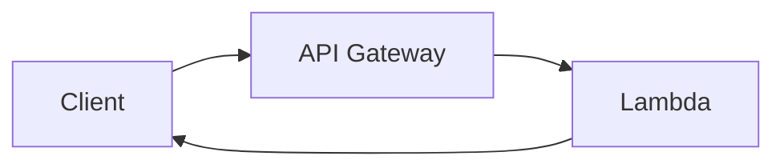

# Вопросы на собеседовании: `AWS Lambda`

`AWS Lambda` — самый популярный FaaS (Function as a Service). Run code без управления серверами, pay per invocation. На интервью спрашивают: cold start, lifecycle, integrations (API Gateway, S3, SQS, DynamoDB Streams), limits, monitoring, deployment (SAM, CDK), best practices.

## Полезные ссылки

### Официальная документация и авторитетные источники

- [AWS Lambda Documentation](https://docs.aws.amazon.com/lambda/)
- [AWS Lambda Best Practices](https://docs.aws.amazon.com/lambda/latest/dg/best-practices.html)
- [AWS SAM Documentation](https://docs.aws.amazon.com/serverless-application-model/)
- [Serverless Framework](https://www.serverless.com/)
- [Lambda Powertools (Python, TS, Java)](https://docs.powertools.aws.dev/)
- [AWS Compute Blog](https://aws.amazon.com/blogs/compute/)

## Содержание

- [Полезные ссылки](#полезные-ссылки)
- [See also](#see-also)

**Базовые понятия**
- [Q1. (!) Что такое AWS Lambda?](#q1--что-такое-aws-lambda)
- [Q2. (!) Lambda lifecycle (cold/warm start)?](#q2--lambda-lifecycle-coldwarm-start)
- [Q3. (!) Какие runtimes поддерживаются?](#q3--какие-runtimes-поддерживаются)
- [Q4. Container images vs ZIP deployment?](#q4-container-images-vs-zip-deployment)

**Cold start**
- [Q5. (!) Что такое cold start?](#q5--что-такое-cold-start)
- [Q6. (!) Как уменьшить cold start?](#q6--как-уменьшить-cold-start)
- [Q7. (!) SnapStart для Java?](#q7--snapstart-для-java)
- [Q8. Provisioned Concurrency?](#q8-provisioned-concurrency)

**Конфигурация**
- [Q9. (!) Memory, CPU, timeout?](#q9--memory-cpu-timeout)
- [Q10. Environment variables?](#q10-environment-variables)
- [Q11. Lambda Layers?](#q11-lambda-layers)
- [Q12. (!) ARM (Graviton2) vs x86?](#q12--arm-graviton2-vs-x86)

**Integrations / Triggers**
- [Q13. (!) API Gateway → Lambda?](#q13--api-gateway--lambda)
- [Q14. Lambda Function URLs?](#q14-lambda-function-urls)
- [Q15. (!) S3, DynamoDB Streams, Kinesis?](#q15--s3-dynamodb-streams-kinesis)
- [Q16. (!) SQS как trigger?](#q16--sqs-как-trigger)
- [Q17. EventBridge?](#q17-eventbridge)
- [Q18. Step Functions для orchestration?](#q18-step-functions-для-orchestration)

**Concurrency**
- [Q19. (!) Что такое concurrent executions?](#q19--что-такое-concurrent-executions)
- [Q20. Reserved vs Provisioned concurrency?](#q20-reserved-vs-provisioned-concurrency)
- [Q21. (!) Что происходит при превышении concurrency limit?](#q21--что-происходит-при-превышении-concurrency-limit)

**Limits**
- [Q22. (!) Какие лимиты у Lambda?](#q22--какие-лимиты-у-lambda)
- [Q23. Как обойти 15 min timeout?](#q23-как-обойти-15-min-timeout)

**Networking**
- [Q24. (!) Lambda в VPC?](#q24--lambda-в-vpc)
- [Q25. Cold start в VPC — раньше проблема?](#q25-cold-start-в-vpc--раньше-проблема)

**Deployment**
- [Q26. (!) SAM, CDK, Serverless Framework?](#q26--sam-cdk-serverless-framework)
- [Q27. Lambda versions, aliases, traffic shifting?](#q27-lambda-versions-aliases-traffic-shifting)

**Monitoring**
- [Q28. (!) CloudWatch Logs / X-Ray для Lambda?](#q28--cloudwatch-logs--x-ray-для-lambda)
- [Q29. Cost analysis Lambda?](#q29-cost-analysis-lambda)

**Production**
- [Q30. (!) Когда использовать Lambda, когда нет?](#q30--когда-использовать-lambda-когда-нет)
- [Q31. Best practices?](#q31-best-practices)
- [Q32. (!) Какие частые ошибки?](#q32--какие-частые-ошибки)

## Q1. (!) Что такое AWS Lambda?

`AWS Lambda` — **Function as a Service (FaaS)**. Запускает код без управления серверами:

- **Event-driven** — запуск на event (HTTP, S3, SQS, etc.)
- **Pay-per-use** — платишь только за выполнение
- **Auto-scaling** — concurrent executions auto
- **Stateless** — нет local persistent state
- **Short-lived** — до 15 минут execution

**Появился:** 2014 (первый mainstream FaaS).

**Применения:**
- API backends (с API Gateway)
- Event processing (S3 uploads, DynamoDB streams)
- Cron jobs (CloudWatch Events)
- ETL (один-shot transformations)
- Webhooks
- Frontend для микросервисов

## Q2. (!) Lambda lifecycle (cold/warm start)?

```
1. Init phase (cold start):
   - Allocate environment
   - Download code
   - Initialize runtime
   - Run init code (outside handler)

2. Invoke phase:
   - Run handler

3. (Reuse): if next invocation в same environment → "warm"
   - Skip init phase, just invoke handler
```

**Cold start:** ~100ms - several seconds (Java, .NET).
**Warm:** ~ms latency (handler execution only).

**Idle timeout:** AWS keeps execution environment warm for **5-15 minutes** after last invocation.

```python
# Init code — runs once per cold start
import boto3
db_client = boto3.client('dynamodb')

def handler(event, context):
    # runs every invocation
    return db_client.get_item(...)
```

## Q3. (!) Какие runtimes поддерживаются?

**Native runtimes:**
- Python (3.9, 3.10, 3.11, 3.12, 3.13)
- Node.js (18, 20, 22)
- Java (8, 11, 17, 21)
- .NET (6, 8)
- Ruby (3.2, 3.3)
- Go (deprecated separate runtime → use custom)
- **Custom runtime** (любой язык через Lambda Runtime API)

**Container images** — bring your own image (Docker), up to 10 GB.

В **2025**:
- **Python, Node.js** — самые популярные (быстрый cold start)
- **Java, .NET** — slower cold start, но **SnapStart** помогает
- **Go, Rust** — через custom runtime / Container

## Q4. Container images vs ZIP deployment?

**ZIP deployment:**
- До 250 MB unzipped
- Faster deployment
- Faster cold start
- Standard runtime

**Container images:**
- До 10 GB
- Custom dependencies, libraries
- Same image как локальный Docker
- Любой language
- Slower cold start (image pull)

**Когда container:**
- Большие dependencies (ML models, native libs)
- Custom languages
- Already containerized apps

**Default — ZIP** (faster, simpler).

## Q5. (!) Что такое cold start?

**Cold start** — invocation, требующая создания **нового execution environment**.

**Стадии:**
1. Provision execution environment (~50-200ms)
2. Download code (~50-200ms)
3. Init runtime (~100ms - 5s, language-dependent)
4. Run init code (your imports)
5. Run handler

**Cold start by runtime (примерно):**
- Python: ~200-500ms
- Node.js: ~150-400ms
- Go: ~100-300ms
- Java (без SnapStart): ~1-5 sec
- .NET: ~500ms - 2 sec
- Java SnapStart: ~200-500ms

**Когда cold start happens:**
- First invocation
- After idle period (5-15 min)
- Concurrency increase (need new envs)
- Code update (new version)
- Configuration change

## Q6. (!) Как уменьшить cold start?

1. **Smaller deployment package** — меньше код = быстрее download/init
2. **Lazy load** dependencies (import inside handler если редко нужно)
3. **More memory** — Lambda gives more CPU proportionally → faster init
4. **Use ARM (Graviton)** — обычно faster + cheaper
5. **Provisioned concurrency** — keeps N envs warm
6. **Avoid heavy frameworks** (Spring Boot — slow на Lambda без SnapStart)
7. **Choose fast runtime** (Node, Python, Go)
8. **Minimize VPC** (раньше был slow, сейчас OK)
9. **SnapStart для Java** (5-10x faster cold start)
10. **Pre-warming** через scheduled invocations (hack)

## Q7. (!) SnapStart для Java?

**SnapStart** (с 2022) — Lambda берёт **snapshot** initialized environment после init phase, переиспользует.

```
Без SnapStart: Init Java + Spring Boot = 5-10 sec
С SnapStart: Restore snapshot = 200-500ms
```

**Как работает:**
1. При publish version Lambda runs init
2. Делает snapshot memory + disk
3. При invocation — **restore from snapshot** (Firecracker MicroVM)

**Подвох:** state shared между invocations. Нужно избегать `Random()` в init и т.п. (uniqueness ломается).

В **2025** — SnapStart доступен для **Java, Python, .NET**.

## Q8. Provisioned Concurrency?

**Provisioned Concurrency (PC)** — pre-initialized envs, всегда warm.

```bash
aws lambda put-provisioned-concurrency-config \
  --function-name my-fn \
  --qualifier prod \
  --provisioned-concurrent-executions 10
```

**Зачем:**
- Предсказуемая low latency
- Избегаем cold starts для critical APIs

**Cost:** ~$0.015 per GB-hour за provisioned env (даже если idle). Дополнительная стоимость к invocation.

**Auto-scaling** PC — на основе schedule или metrics.

**Когда нужен:**
- Latency-sensitive APIs
- Burst predictable workloads (start-of-day rush)

## Q9. (!) Memory, CPU, timeout?

**Memory:** 128 MB - 10 GB (с инкрементом 1 MB).

**CPU:** проpротional к memory (нельзя set отдельно).
- 1769 MB ≈ 1 vCPU
- 10240 MB = ~6 vCPUs

**Timeout:** до **15 минут**. Default 3 sec.

```python
# Choose memory based on workload
# CPU-bound → больше memory = больше CPU = faster + cheaper
# Memory-bound → enough memory для data
```

**Cost:** per-ms × GB. **Не всегда** меньше memory дешевле — больше memory может finish быстрее.

**Lambda Power Tuning** tool — automated benchmark optimal memory.

## Q10. Environment variables?

```python
import os
db_url = os.environ['DB_URL']
```

**Limit:** 4 KB total.

**Best practices:**
- Не secrets в plain ENV (use Secrets Manager / Parameter Store)
- KMS encryption для sensitive ENV
- Different ENV per environment (dev/prod)

```python
# Использовать Parameter Store
import boto3
ssm = boto3.client('ssm')
db_url = ssm.get_parameter(Name='/myapp/prod/db_url', WithDecryption=True)['Parameter']['Value']
```

## Q11. Lambda Layers?

**Layer** — переиспользуемый код/dependencies, shared между Lambdas.

```
Lambda function (your code) — 1 MB
Layer 1: dependencies (numpy, pandas) — 50 MB
Layer 2: shared utilities — 5 MB
```

**Преимущества:**
- DRY — shared code в одном месте
- Меньше deployment packages
- Пере используется в multiple functions

**Limits:** до 5 layers per function, max 250 MB unzipped suммарно.

**Use cases:**
- AWS SDK (но он built-in)
- Common libraries (Pandas, NumPy)
- Custom utilities
- Lambda Powertools

## Q12. (!) ARM (Graviton2) vs x86?

**Graviton2 (ARM)** — AWS's ARM-based processor.

| Критерий | x86 | ARM (Graviton2) |
|----------|-----|------|
| Cost | Standard | **20% cheaper** |
| Performance | Good | **15-20% better** для most workloads |
| Compatibility | All x86 binaries | Need ARM-compatible deps |

```yaml
Architectures:
  - arm64
```

**Compatible:**
- Pure Python, Node.js, Java — works (interpreted)
- Go, Rust — recompile for ARM
- Native libs (PIL, numpy) — нужны ARM versions

**Default 2025:** **ARM** для new Lambdas (если deps support).

## Q13. (!) API Gateway → Lambda?

**Самая частая** integration: HTTP request → API Gateway → Lambda → response.



**Two API Gateway types:**

**REST API** (v1):
- Полный feature set (caching, throttling, request validation)
- Higher cost ($3.50 per million requests)
- More mature

**HTTP API** (v2):
- 70% cheaper ($1.00 per million)
- Faster (lower latency)
- Менее features (нет request validation, etc.)

В **2025** — HTTP API default для simple cases.

```python
def handler(event, context):
    # event['httpMethod'], event['path'], event['headers'], event['body']
    return {
        "statusCode": 200,
        "headers": {"Content-Type": "application/json"},
        "body": '{"message": "hello"}'
    }
```

## Q14. Lambda Function URLs?

С 2022 — **Function URLs** = built-in HTTPS endpoint без API Gateway.

```bash
aws lambda create-function-url-config \
  --function-name my-fn \
  --auth-type AWS_IAM  # or NONE
```

URL: `https://abc123.lambda-url.us-east-1.on.aws/`.

**Преимущества:**
- Бесплатно (без API Gateway costs)
- Lower latency
- Simpler

**Недостатки:**
- No throttling, caching, request validation
- Только URL, нет complex routing

**Для simple webhooks** или public endpoints — Function URLs идеальны.

## Q15. (!) S3, DynamoDB Streams, Kinesis?

**S3 trigger:**
```
PUT /my-bucket/uploads/photo.jpg → Lambda → process image
```

**DynamoDB Streams:**
```
INSERT/UPDATE/DELETE in DynamoDB table → Lambda processes change record
```

**Kinesis Data Streams:**
```
Records published к stream → Lambda processes batch
```

**Common pattern:** event-driven processing.

```python
def handler(event, context):
    for record in event['Records']:
        # S3
        bucket = record['s3']['bucket']['name']
        key = record['s3']['object']['key']
        # process
```

**Batch settings:**
- BatchSize — max records per invocation
- BatchWindow — wait для batch fill
- MaxRetries

## Q16. (!) SQS как trigger?

```
SQS message → Lambda → process → ack (delete from SQS)
```

**Particulars:**
- Lambda **automatically** polls SQS
- Если Lambda fails → message returned to queue (retry)
- After max retries → DLQ (Dead Letter Queue)

**Batch processing:**
- BatchSize: до 10000 (для standard), 10 (FIFO)
- ReportBatchItemFailures — partial failure reporting

```python
def handler(event, context):
    failed_records = []
    for record in event['Records']:
        try:
            process(record)
        except Exception:
            failed_records.append({"itemIdentifier": record['messageId']})
    return {"batchItemFailures": failed_records}
```

**Подвох:** Lambda concurrency может быть **bottlenecked SQS visibility timeout**. Set visibility = 6 × Lambda timeout.

## Q17. EventBridge?

**EventBridge** — event bus с rules.

```
EventBridge rule: 
  source: "aws.s3"
  detail-type: "Object Created"
  → trigger Lambda
```

**Зачем над прямой S3 → Lambda:**
- **Multiple subscribers** (Lambda + SNS + ...)
- **Filtering** (только PDF files)
- **Schemas, replay, archive**
- **Cross-account, cross-region**
- 100+ SaaS integrations

В **2025** — EventBridge **preferred** для complex event routing.

## Q18. Step Functions для orchestration?

**Step Functions** — visual workflow для chaining Lambdas / AWS services.

```json
{
  "States": {
    "Validate": { "Type": "Task", "Resource": "arn:...:validate" },
    "Process": { "Type": "Task", "Resource": "arn:...:process" },
    "Notify": { "Type": "Task", "Resource": "arn:...:notify" }
  }
}
```

**Применения:**
- Long-running workflows (orders, approvals)
- Saga pattern
- Parallel processing
- Error handling, retries

**Express vs Standard:**
- **Express** — high volume, short (< 5 min), at-least-once
- **Standard** — long workflows (until 1 year), exactly-once

## Q19. (!) Что такое concurrent executions?

**Concurrent executions** — Lambdas running **в один момент**.

```
1000 concurrent = 1000 invocations executing at once
```

**Default account limit:** 1000 (можно увеличить через support).

**Per function** — без limit (использует account limit shared).

## Q20. Reserved vs Provisioned concurrency?

**Reserved concurrency:**
- **Limit** для конкретной function (макс concurrency)
- **Subtracts** из account-wide pool
- Use case: prevent function от eating all concurrency

**Provisioned concurrency:**
- **Pre-warmed** envs (ALWAYS ready)
- **Дополнительная стоимость**
- Use case: latency-sensitive endpoints

```bash
# Reserved (just limit)
aws lambda put-function-concurrency --function-name my-fn --reserved-concurrent-executions 100

# Provisioned (pre-warm)
aws lambda put-provisioned-concurrency-config --function-name my-fn --qualifier prod --provisioned-concurrent-executions 10
```

## Q21. (!) Что происходит при превышении concurrency limit?

| Тип trigger | При throttling |
|-------------|----------------|
| Synchronous (API Gateway) | HTTP 429, client retries |
| Async (S3, SNS) | Lambda retries (до 6 hours), потом DLQ |
| SQS | Message returned to queue (retried) |
| Kinesis/DynamoDB Streams | Lambda retries (blocking shard processing) |

**Best practice:** monitor concurrency metrics, set alarms на throttle errors.

## Q22. (!) Какие лимиты у Lambda?

| Limit | Value |
|-------|-------|
| Memory | 128 MB - 10 GB |
| Timeout | 15 min |
| Deployment package (ZIP) | 250 MB unzipped |
| Container image | 10 GB |
| /tmp storage | 512 MB - 10 GB |
| Concurrent executions | 1000 (default, increase) |
| Environment variables | 4 KB total |
| Layers | 5 per function |
| Request payload (sync) | 6 MB |
| Request payload (async) | 256 KB |
| Response payload | 6 MB |

**При превышении** — adapt architecture (split work, use Step Functions, switch to ECS).

## Q23. Как обойти 15 min timeout?

**Если задача > 15 min:**

1. **Split** — разбить на меньшие Lambdas
2. **Step Functions** — chained Lambdas, до 1 year
3. **AWS Batch** — для real long-running jobs
4. **ECS/Fargate** — containers, no time limit
5. **EC2** — full control

**Common pattern:** Lambda triggers Fargate task для heavy work.

## Q24. (!) Lambda в VPC?

```yaml
VpcConfig:
  SubnetIds: ["subnet-abc", "subnet-def"]
  SecurityGroupIds: ["sg-123"]
```

**Зачем:** access к VPC resources (RDS in private subnet, internal services).

**По default:** Lambda не в VPC, имеет internet access через AWS-managed network.

**В VPC:** Lambda gets ENI in subnet, нужен NAT Gateway для internet access.

## Q25. Cold start в VPC — раньше проблема?

**До 2019:** ENI attached at cold start → ~10-15 sec extra delay. **Очень болезненно**.

**С 2019 (Hyperplane ENI):** ENI **shared** между Lambda invocations → **~10-50 ms** overhead. Минимально.

В **2025** — Lambda в VPC **OK**. No more "избегайте VPC" advice.

## Q26. (!) SAM, CDK, Serverless Framework?

**Tools для deploy Lambda:**

**AWS SAM (Serverless Application Model):**
```yaml
# template.yaml
Resources:
  HelloFunction:
    Type: AWS::Serverless::Function
    Properties:
      Handler: app.handler
      Runtime: python3.11
      Events:
        Api:
          Type: Api
          Properties:
            Path: /hello
            Method: get
```
```bash
sam deploy --guided
```

**AWS CDK:**
```python
from aws_cdk import aws_lambda as lambda_
fn = lambda_.Function(self, "MyFn",
    runtime=lambda_.Runtime.PYTHON_3_11,
    handler="app.handler",
    code=lambda_.Code.from_asset("src/")
)
```

**Serverless Framework:**
```yaml
service: my-app
provider:
  name: aws
  runtime: python3.11
functions:
  hello:
    handler: app.handler
    events:
      - http: GET /hello
```

| Tool | Pros |
|------|------|
| **SAM** | AWS-native, simple YAML |
| **CDK** | Imperative (Python/TS code), powerful |
| **Serverless Framework** | Multi-cloud (AWS, GCP, Azure) |
| **Terraform** | Multi-cloud, state management |

В **2025** — **CDK** для serious AWS-only projects, **Serverless Framework** для multi-cloud.

## Q27. Lambda versions, aliases, traffic shifting?

**Versions** — immutable snapshots Lambda.
```
my-fn:1, my-fn:2, my-fn:3 (latest)
```

**Aliases** — pointers к versions.
```
prod → my-fn:2
staging → my-fn:3
```

**Traffic shifting** на alias:
```
prod: 90% v2 + 10% v3 (canary)
```

```bash
aws lambda update-alias --function-name my-fn --name prod \
  --function-version 3 \
  --routing-config AdditionalVersionWeights={"2"=0.9}
```

**Use case:** safe deploys через canary deployment.

## Q28. (!) CloudWatch Logs / X-Ray для Lambda?

**CloudWatch Logs** — automatic.
- Log group: `/aws/lambda/<function-name>`
- Каждый `print` / `console.log` → CloudWatch
- Retention configurable (default — never expire = $$$)

**X-Ray** — distributed tracing.
```python
from aws_xray_sdk.core import xray_recorder
@xray_recorder.capture('my_function')
def process(): ...
```

**Lambda Insights** (extension) — system-level metrics (CPU, memory utilization beyond default).

**Lambda Powertools** (Python/TS/Java/.NET) — utilities для logging, metrics, tracing.

```python
from aws_lambda_powertools import Logger, Tracer, Metrics
logger = Logger()
tracer = Tracer()
metrics = Metrics()

@tracer.capture_lambda_handler
@logger.inject_lambda_context
@metrics.log_metrics
def handler(event, context):
    ...
```

## Q29. Cost analysis Lambda?

**Pricing:**
- **Per-invocation:** $0.20 per 1M invocations
- **Per duration:** $0.0000166667 per GB-second

```
1M invocations × 100ms × 512 MB = $0.20 + $0.83 = ~$1.03
```

**Cost optimization:**
- Right memory (Lambda Power Tuning tool)
- ARM (Graviton2) — 20% cheaper
- Avoid unnecessary cold starts (provisioned concurrency wisely)
- Lambda destinations vs SNS/SQS in code

**Hidden costs:**
- CloudWatch Logs ingestion
- VPC ENI usage
- Data transfer
- API Gateway costs

## Q30. (!) Когда использовать Lambda, когда нет?

**Use Lambda:**
- Event-driven processing (S3 uploads, DynamoDB streams)
- HTTP APIs с unpredictable traffic
- Cron jobs / scheduled tasks
- Webhooks
- Glue code (integrations)
- Real-time stream processing (Kinesis, MSK)
- Spike traffic (auto-scale)

**Не use Lambda:**
- Long-running tasks > 15 min
- High-throughput steady traffic (cheaper EC2/Fargate)
- WebSocket connections (use API Gateway WebSocket или ALB)
- ML inference с large models (cold start, memory)
- Apps с heavy framework startup (Spring Boot — даже с SnapStart)
- Stateful applications

**Break-even:** примерно **50K req/day** или constant load. Меньше — Lambda дешевле, больше — EC2.

## Q31. Best practices?

1. **Keep functions small** — single responsibility
2. **Init outside handler** — connection pools, SDK clients
3. **Reuse connections** — DB pools, HTTP clients
4. **Async invoke** для fire-and-forget (с DLQ)
5. **Use Layers** для shared dependencies
6. **Don't store state в /tmp** между invocations (не reliable)
7. **Powertools** для observability
8. **Versioning + aliases** для safe deploys
9. **Right memory** через Power Tuning
10. **CloudWatch Logs retention** — set TTL чтобы не платить лишнее

## Q32. (!) Какие частые ошибки?

1. **Cold start surprises** — 30 sec timeout первого запроса
2. **No DLQ** — failed messages потеряны
3. **Hardcoded credentials** в env vars
4. **Memory mistakes** — too low (slow), too high (expensive)
5. **No idempotency** — retry → duplicate processing
6. **Long-running outside Lambda timeout** — `15 min ` strict limit
7. **VPC misconfig** — no NAT Gateway, no internet
8. **Heavy frameworks** (Spring Boot без SnapStart)
9. **Logging too much** — CloudWatch ingestion expensive
10. **Concurrency limits** — production hit 1000 → service down

В **2025** Lambda — workhorse serverless, но требует **правильной архитектуры**.

---

## See also

- [AWS](aws-interview.md) — общие основы
- [Serverless](serverless-interview.md) — концепции
- [GCP](gcp-interview.md) — Cloud Functions сравнение
- [Azure](azure-interview.md) — Functions сравнение
- [Cloud-native Patterns](cloud-native-patterns-interview.md) — patterns
- [Микросервисы](../architecture/microservices-interview.md) — Lambda как microservice
- [Event-driven](../architecture/event-driven-patterns-interview.md) — Lambda triggers
- [API Gateway](../architecture/api-gateway-interview.md) — front для Lambda
- [Saga Pattern](../architecture/saga-pattern-interview.md) — Step Functions
- [Caching](../architecture/caching-strategies-interview.md) — для Lambda
- [Observability](../monitoring/observability-interview.md) — Powertools, X-Ray
- [Application Security](../security/application-security-interview.md) — IAM roles
- [JVM](../jvm/jvm-interview.md) — для Java на Lambda

- [AWS](aws-interview.md)
- [Azure](azure-interview.md)
- [Cloud-native Patterns](cloud-native-patterns-interview.md)
- [GCP (Google Cloud Platform)](gcp-interview.md)
- [Serverless](serverless-interview.md)
- [AI Agents](../ai-ml/ai-agents-interview.md)
