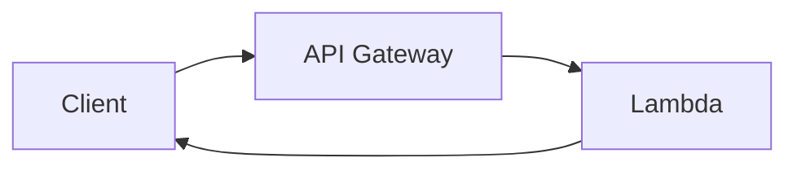

# Вопросы на собеседовании: `AWS Lambda`

`AWS Lambda` — самый популярный FaaS (Function as a Service). Запускает код без управления серверами, оплата за каждый вызов. На интервью спрашивают: cold start, жизненный цикл, интеграции (API Gateway, S3, SQS, DynamoDB Streams), лимиты, мониторинг, деплой (SAM, CDK), best practices.

## Полезные ссылки

### Официальная документация и авторитетные источники

- [AWS Lambda Documentation](https://docs.aws.amazon.com/lambda/)
- [AWS Lambda Best Practices](https://docs.aws.amazon.com/lambda/latest/dg/best-practices.html)
- [AWS SAM Documentation](https://docs.aws.amazon.com/serverless-application-model/)
- [Serverless Framework](https://www.serverless.com/)
- [Lambda Powertools (Python, TS, Java)](https://docs.powertools.aws.dev/)
- [AWS Compute Blog](https://aws.amazon.com/blogs/compute/)

## Содержание

- [Полезные ссылки](#полезные-ссылки)
- [See also](#see-also)

**Базовые понятия**
- [Q1. (!) Что такое AWS Lambda?](#q1--что-такое-aws-lambda)
- [Q2. (!) Lambda lifecycle (cold/warm start)?](#q2--lambda-lifecycle-coldwarm-start)
- [Q3. (!) Какие runtimes поддерживаются?](#q3--какие-runtimes-поддерживаются)
- [Q4. Container images vs ZIP deployment?](#q4-container-images-vs-zip-deployment)

**Cold start**
- [Q5. (!) Что такое cold start?](#q5--что-такое-cold-start)
- [Q6. (!) Как уменьшить cold start?](#q6--как-уменьшить-cold-start)
- [Q7. (!) SnapStart для Java?](#q7--snapstart-для-java)
- [Q8. Provisioned Concurrency?](#q8-provisioned-concurrency)

**Конфигурация**
- [Q9. (!) Memory, CPU, timeout?](#q9--memory-cpu-timeout)
- [Q10. Environment variables?](#q10-environment-variables)
- [Q11. Lambda Layers?](#q11-lambda-layers)
- [Q12. (!) ARM (Graviton2) vs x86?](#q12--arm-graviton2-vs-x86)

**Integrations / Triggers**
- [Q13. (!) API Gateway → Lambda?](#q13--api-gateway--lambda)
- [Q14. Lambda Function URLs?](#q14-lambda-function-urls)
- [Q15. (!) S3, DynamoDB Streams, Kinesis?](#q15--s3-dynamodb-streams-kinesis)
- [Q16. (!) SQS как trigger?](#q16--sqs-как-trigger)
- [Q17. EventBridge?](#q17-eventbridge)
- [Q18. Step Functions для orchestration?](#q18-step-functions-для-orchestration)

**Concurrency**
- [Q19. (!) Что такое concurrent executions?](#q19--что-такое-concurrent-executions)
- [Q20. Reserved vs Provisioned concurrency?](#q20-reserved-vs-provisioned-concurrency)
- [Q21. (!) Что происходит при превышении concurrency limit?](#q21--что-происходит-при-превышении-concurrency-limit)

**Limits**
- [Q22. (!) Какие лимиты у Lambda?](#q22--какие-лимиты-у-lambda)
- [Q23. Как обойти 15 min timeout?](#q23-как-обойти-15-min-timeout)

**Networking**
- [Q24. (!) Lambda в VPC?](#q24--lambda-в-vpc)
- [Q25. Cold start в VPC — раньше проблема?](#q25-cold-start-в-vpc--раньше-проблема)

**Deployment**
- [Q26. (!) SAM, CDK, Serverless Framework?](#q26--sam-cdk-serverless-framework)
- [Q27. Lambda versions, aliases, traffic shifting?](#q27-lambda-versions-aliases-traffic-shifting)

**Monitoring**
- [Q28. (!) CloudWatch Logs / X-Ray для Lambda?](#q28--cloudwatch-logs--x-ray-для-lambda)
- [Q29. Cost analysis Lambda?](#q29-cost-analysis-lambda)

**Production**
- [Q30. (!) Когда использовать Lambda, когда нет?](#q30--когда-использовать-lambda-когда-нет)
- [Q31. Best practices?](#q31-best-practices)
- [Q32. (!) Какие частые ошибки?](#q32--какие-частые-ошибки)

## Q1. (!) Что такое AWS Lambda?

(!) Что такое AWS Lambda?

`AWS Lambda` — **Function as a Service (FaaS)**. Запускает код без управления серверами:

- **Event-driven** — запуск по событию (HTTP, S3, SQS и т.п.)
- **Pay-per-use** — платишь только за выполнение
- **Auto-scaling** — параллельные исполнения масштабируются автоматически
- **Stateless** — нет локального постоянного состояния
- **Short-lived** — исполнение до 15 минут

**Появился:** 2014 (первый mainstream FaaS).

**Применения:**
- API-бэкенды (с API Gateway)
- Обработка событий (загрузки в S3, DynamoDB streams)
- Cron-задачи (CloudWatch Events)
- ETL (разовые трансформации)
- Вебхуки
- Фронтенд для микросервисов

## Q2. (!) Lambda lifecycle (cold/warm start)?

```
1. Init phase (cold start):
   - Allocate environment
   - Download code
   - Initialize runtime
   - Run init code (outside handler)

2. Invoke phase:
   - Run handler

3. (Reuse): if next invocation в same environment → "warm"
   - Skip init phase, just invoke handler
```

**Cold start:** ~100 мс — несколько секунд (Java, .NET).
**Warm:** задержка ~миллисекунды (только исполнение handler-а).

**Idle timeout:** AWS держит execution environment «тёплым» **5–15 минут** после последнего вызова.

```python
# Init code — runs once per cold start
import boto3
db_client = boto3.client('dynamodb')

def handler(event, context):
    # runs every invocation
    return db_client.get_item(...)
```

## Q3. (!) Какие runtimes поддерживаются?

**Нативные runtimes:**
- Python (3.9, 3.10, 3.11, 3.12, 3.13)
- Node.js (18, 20, 22)
- Java (8, 11, 17, 21)
- .NET (6, 8)
- Ruby (3.2, 3.3)
- Go (отдельный runtime устарел → используй custom)
- **Custom runtime** (любой язык через Lambda Runtime API)

**Container images** — приноси свой образ (Docker), до 10 GB.

В **2025**:
- **Python, Node.js** — самые популярные (быстрый cold start)
- **Java, .NET** — cold start медленнее, но **SnapStart** помогает
- **Go, Rust** — через custom runtime / Container

## Q4. Container images vs ZIP deployment?

**ZIP deployment:**
- До 250 MB в распакованном виде
- Деплой быстрее
- Cold start быстрее
- Стандартный runtime

**Container images:**
- До 10 GB
- Произвольные зависимости и библиотеки
- Тот же образ, что и локальный Docker
- Любой язык
- Cold start медленнее (нужно скачать образ)

**Когда контейнер:**
- Большие зависимости (ML-модели, нативные библиотеки)
- Нестандартные языки
- Уже контейнеризированные приложения

**По умолчанию — ZIP** (быстрее, проще).

## Q5. (!) Что такое cold start?

**Cold start** — вызов, требующий создания **нового execution environment**.

**Стадии:**
1. Выделение execution environment (~50–200 мс)
2. Скачивание кода (~50–200 мс)
3. Инициализация runtime (~100 мс — 5 с, зависит от языка)
4. Запуск init-кода (ваши импорты)
5. Запуск handler-а

**Cold start по runtime (примерно):**
- Python: ~200–500 мс
- Node.js: ~150–400 мс
- Go: ~100–300 мс
- Java (без SnapStart): ~1–5 с
- .NET: ~500 мс — 2 с
- Java SnapStart: ~200–500 мс

**Когда случается cold start:**
- Первый вызов
- После периода простоя (5–15 мин)
- Рост concurrency (нужны новые окружения)
- Обновление кода (новая версия)
- Изменение конфигурации

## Q6. (!) Как уменьшить cold start?

1. **Меньше deployment-пакет** — меньше кода = быстрее скачивание/инициализация
2. **Lazy load** зависимостей (импорт внутри handler-а, если нужны редко)
3. **Больше памяти** — Lambda пропорционально даёт больше CPU → быстрее инициализация
4. **ARM (Graviton)** — обычно быстрее и дешевле
5. **Provisioned concurrency** — держит N окружений «тёплыми»
6. **Избегай тяжёлых фреймворков** (Spring Boot на Lambda без SnapStart медленный)
7. **Выбирай быстрый runtime** (Node, Python, Go)
8. **Минимизируй VPC** (раньше было медленно, сейчас нормально)
9. **SnapStart для Java** (cold start быстрее в 5–10 раз)
10. **Прогрев** через scheduled-вызовы (хак)

## Q7. (!) SnapStart для Java?

**SnapStart** (с 2022) — Lambda делает **snapshot** инициализированного окружения после init-фазы и переиспользует его.

```
Без SnapStart: Init Java + Spring Boot = 5-10 sec
С SnapStart: Restore snapshot = 200-500ms
```

**Как работает:**
1. При публикации версии Lambda выполняет инициализацию
2. Делает snapshot памяти и диска
3. При вызове — **восстановление из snapshot** (Firecracker MicroVM)

**Подвох:** состояние шарится между вызовами. Нужно избегать `Random()` в init-коде и т.п. (ломается уникальность).

В **2025** — SnapStart доступен для **Java, Python, .NET**.

## Q8. Provisioned Concurrency?

**Provisioned Concurrency (PC)** — заранее инициализированные окружения, всегда «тёплые».

```bash
aws lambda put-provisioned-concurrency-config \
  --function-name my-fn \
  --qualifier prod \
  --provisioned-concurrent-executions 10
```

**Зачем:**
- Предсказуемо низкая задержка
- Избегаем cold start для критичных API

**Стоимость:** ~$0.015 за GB-час на provisioned-окружение (даже если простаивает). Это доплата сверх оплаты за вызовы.

**Auto-scaling** PC — по расписанию или по метрикам.

**Когда нужен:**
- Чувствительные к задержке API
- Предсказуемые всплески нагрузки (наплыв в начале дня)

## Q9. (!) Memory, CPU, timeout?

**Память:** 128 MB — 10 GB (с шагом 1 MB).

**CPU:** пропорционально памяти (отдельно задать нельзя).
- 1769 MB ≈ 1 vCPU
- 10240 MB = ~6 vCPU

**Timeout:** до **15 минут**. По умолчанию 3 с.

```python
# Choose memory based on workload
# CPU-bound → больше memory = больше CPU = faster + cheaper
# Memory-bound → enough memory для data
```

**Стоимость:** за миллисекунду × GB. **Не всегда** меньше памяти = дешевле — с большей памятью функция может завершиться быстрее.

**Lambda Power Tuning** — инструмент для автоматического бенчмарка и подбора оптимальной памяти.

## Q10. Environment variables?

```python
import os
db_url = os.environ['DB_URL']
```

**Лимит:** 4 KB суммарно.

**Best practices:**
- Не храни секреты в открытом ENV (используй Secrets Manager / Parameter Store)
- KMS-шифрование для чувствительных ENV
- Разные ENV под разные окружения (dev/prod)

```python
# Использовать Parameter Store
import boto3
ssm = boto3.client('ssm')
db_url = ssm.get_parameter(Name='/myapp/prod/db_url', WithDecryption=True)['Parameter']['Value']
```

## Q11. Lambda Layers?

**Layer** — переиспользуемый код или зависимости, общие для нескольких Lambda.

```
Lambda function (your code) — 1 MB
Layer 1: dependencies (numpy, pandas) — 50 MB
Layer 2: shared utilities — 5 MB
```

**Преимущества:**
- DRY — общий код в одном месте
- Меньше deployment-пакеты
- Переиспользуется в нескольких функциях

**Лимиты:** до 5 layer-ов на функцию, максимум 250 MB в распакованном виде суммарно.

**Сценарии:**
- AWS SDK (хотя он уже встроен)
- Распространённые библиотеки (Pandas, NumPy)
- Свои утилиты
- Lambda Powertools

## Q12. (!) ARM (Graviton2) vs x86?

**Graviton2 (ARM)** — процессор AWS на архитектуре ARM.

| Критерий | x86 | ARM (Graviton2) |
|----------|-----|------|
| Стоимость | Стандартная | **на 20% дешевле** |
| Производительность | Хорошая | **на 15–20% выше** для большинства нагрузок |
| Совместимость | Все x86-бинарники | Нужны ARM-совместимые зависимости |

```yaml
Architectures:
  - arm64
```

**Совместимость:**
- Чистый Python, Node.js, Java — работают (интерпретируемые)
- Go, Rust — нужна перекомпиляция под ARM
- Нативные библиотеки (PIL, numpy) — нужны ARM-версии

**Дефолт в 2025:** **ARM** для новых Lambda (если зависимости поддерживают).

## Q13. (!) API Gateway → Lambda?

**Самая частая** интеграция: HTTP-запрос → API Gateway → Lambda → ответ.



**Два типа API Gateway:**

**REST API** (v1):
- Полный набор возможностей (caching, throttling, валидация запросов)
- Дороже ($3.50 за миллион запросов)
- Более зрелый

**HTTP API** (v2):
- На 70% дешевле ($1.00 за миллион)
- Быстрее (ниже задержка)
- Меньше возможностей (нет валидации запросов и т.п.)

В **2025** — HTTP API по умолчанию для простых случаев.

```python
def handler(event, context):
    # event['httpMethod'], event['path'], event['headers'], event['body']
    return {
        "statusCode": 200,
        "headers": {"Content-Type": "application/json"},
        "body": '{"message": "hello"}'
    }
```

## Q14. Lambda Function URLs?

С 2022 — **Function URLs** = встроенный HTTPS-эндпоинт без API Gateway.

```bash
aws lambda create-function-url-config \
  --function-name my-fn \
  --auth-type AWS_IAM  # or NONE
```

URL: `https://abc123.lambda-url.us-east-1.on.aws/`.

**Преимущества:**
- Бесплатно (без расходов на API Gateway)
- Ниже задержка
- Проще

**Недостатки:**
- Нет throttling, caching, валидации запросов
- Только URL, нет сложной маршрутизации

**Для простых вебхуков** или публичных эндпоинтов Function URLs идеальны.

## Q15. (!) S3, DynamoDB Streams, Kinesis?

**S3 trigger:**
```
PUT /my-bucket/uploads/photo.jpg → Lambda → process image
```

**DynamoDB Streams:**
```
INSERT/UPDATE/DELETE in DynamoDB table → Lambda processes change record
```

**Kinesis Data Streams:**
```
Records published к stream → Lambda processes batch
```

**Типовой паттерн:** обработка, управляемая событиями.

```python
def handler(event, context):
    for record in event['Records']:
        # S3
        bucket = record['s3']['bucket']['name']
        key = record['s3']['object']['key']
        # process
```

**Настройки батчей:**
- BatchSize — максимум записей на вызов
- BatchWindow — ожидание заполнения батча
- MaxRetries

## Q16. (!) SQS как trigger?

```
SQS message → Lambda → process → ack (delete from SQS)
```

**Особенности:**
- Lambda **автоматически** опрашивает SQS
- Если Lambda падает → сообщение возвращается в очередь (повторная попытка)
- После максимума повторов → DLQ (Dead Letter Queue)

**Обработка батчами:**
- BatchSize: до 10000 (для standard), 10 (FIFO)
- ReportBatchItemFailures — отчёт о частичных сбоях

```python
def handler(event, context):
    failed_records = []
    for record in event['Records']:
        try:
            process(record)
        except Exception:
            failed_records.append({"itemIdentifier": record['messageId']})
    return {"batchItemFailures": failed_records}
```

**Подвох:** concurrency Lambda может **упереться в SQS visibility timeout**. Ставь visibility = 6 × timeout Lambda.

## Q17. EventBridge?

**EventBridge** — шина событий с правилами.

```
EventBridge rule: 
  source: "aws.s3"
  detail-type: "Object Created"
  → trigger Lambda
```

**Зачем вместо прямой связки S3 → Lambda:**
- **Несколько подписчиков** (Lambda + SNS + ...)
- **Фильтрация** (только PDF-файлы)
- **Схемы, replay, архив**
- **Cross-account, cross-region**
- 100+ интеграций с SaaS

В **2025** — EventBridge **предпочтителен** для сложной маршрутизации событий.

## Q18. Step Functions для orchestration?

**Step Functions** — визуальный workflow для связывания Lambda и сервисов AWS в цепочки.

```json
{
  "States": {
    "Validate": { "Type": "Task", "Resource": "arn:...:validate" },
    "Process": { "Type": "Task", "Resource": "arn:...:process" },
    "Notify": { "Type": "Task", "Resource": "arn:...:notify" }
  }
}
```

**Применения:**
- Долгоиграющие workflow (заказы, согласования)
- Saga-паттерн
- Параллельная обработка
- Обработка ошибок, повторы

**Express vs Standard:**
- **Express** — высокий объём, короткие (< 5 мин), at-least-once
- **Standard** — длинные workflow (до 1 года), exactly-once

## Q19. (!) Что такое concurrent executions?

**Concurrent executions** — Lambda, исполняющиеся **в один момент**.

```
1000 concurrent = 1000 invocations executing at once
```

**Лимит аккаунта по умолчанию:** 1000 (можно увеличить через support).

**На функцию** — без отдельного лимита (использует общий лимит аккаунта).

## Q20. Reserved vs Provisioned concurrency?

**Reserved concurrency:**
- **Лимит** для конкретной функции (максимум concurrency)
- **Вычитается** из общего пула аккаунта
- Сценарий: не дать функции «съесть» всю concurrency

**Provisioned concurrency:**
- **Заранее прогретые** окружения (ВСЕГДА готовы)
- **Дополнительная стоимость**
- Сценарий: эндпоинты, чувствительные к задержке

```bash
# Reserved (just limit)
aws lambda put-function-concurrency --function-name my-fn --reserved-concurrent-executions 100

# Provisioned (pre-warm)
aws lambda put-provisioned-concurrency-config --function-name my-fn --qualifier prod --provisioned-concurrent-executions 10
```

## Q21. (!) Что происходит при превышении concurrency limit?

| Тип триггера | При throttling |
|-------------|----------------|
| Синхронный (API Gateway) | HTTP 429, клиент повторяет запрос |
| Асинхронный (S3, SNS) | Lambda повторяет (до 6 часов), затем DLQ |
| SQS | Сообщение возвращается в очередь (повторяется) |
| Kinesis/DynamoDB Streams | Lambda повторяет (блокирует обработку shard-а) |

**Best practice:** следи за метриками concurrency, ставь алармы на ошибки throttle.

## Q22. (!) Какие лимиты у Lambda?

| Лимит | Значение |
|-------|-------|
| Память | 128 MB — 10 GB |
| Timeout | 15 мин |
| Deployment-пакет (ZIP) | 250 MB в распакованном виде |
| Container image | 10 GB |
| Хранилище /tmp | 512 MB — 10 GB |
| Concurrent executions | 1000 (по умолчанию, можно увеличить) |
| Environment variables | 4 KB суммарно |
| Layers | 5 на функцию |
| Payload запроса (sync) | 6 MB |
| Payload запроса (async) | 256 KB |
| Payload ответа | 6 MB |

**При превышении** — адаптируй архитектуру (раздели работу, используй Step Functions, перейди на ECS).

## Q23. Как обойти 15 min timeout?

**Если задача > 15 мин:**

1. **Split** — разбить на меньшие Lambda
2. **Step Functions** — цепочка Lambda, до 1 года
3. **AWS Batch** — для по-настоящему долгих задач
4. **ECS/Fargate** — контейнеры, без лимита по времени
5. **EC2** — полный контроль

**Типовой паттерн:** Lambda запускает Fargate-задачу для тяжёлой работы.

## Q24. (!) Lambda в VPC?

```yaml
VpcConfig:
  SubnetIds: ["subnet-abc", "subnet-def"]
  SecurityGroupIds: ["sg-123"]
```

**Зачем:** доступ к ресурсам VPC (RDS в приватной подсети, внутренние сервисы).

**По умолчанию:** Lambda не в VPC и имеет доступ в интернет через сеть, управляемую AWS.

**В VPC:** Lambda получает ENI в подсети, для доступа в интернет нужен NAT Gateway.

## Q25. Cold start в VPC — раньше проблема?

**До 2019:** ENI подключался при cold start → ~10–15 с лишней задержки. **Очень болезненно**.

**С 2019 (Hyperplane ENI):** ENI **шарится** между вызовами Lambda → накладные расходы **~10–50 мс**. Минимально.

В **2025** — Lambda в VPC **нормально**. Совет «избегайте VPC» больше неактуален.

## Q26. (!) SAM, CDK, Serverless Framework?

**Инструменты для деплоя Lambda:**

**AWS SAM (Serverless Application Model):**
```yaml
# template.yaml
Resources:
  HelloFunction:
    Type: AWS::Serverless::Function
    Properties:
      Handler: app.handler
      Runtime: python3.11
      Events:
        Api:
          Type: Api
          Properties:
            Path: /hello
            Method: get
```
```bash
sam deploy --guided
```

**AWS CDK:**
```python
from aws_cdk import aws_lambda as lambda_
fn = lambda_.Function(self, "MyFn",
    runtime=lambda_.Runtime.PYTHON_3_11,
    handler="app.handler",
    code=lambda_.Code.from_asset("src/")
)
```

**Serverless Framework:**
```yaml
service: my-app
provider:
  name: aws
  runtime: python3.11
functions:
  hello:
    handler: app.handler
    events:
      - http: GET /hello
```

| Инструмент | Плюсы |
|------|------|
| **SAM** | Нативный для AWS, простой YAML |
| **CDK** | Императивный (код на Python/TS), мощный |
| **Serverless Framework** | Мультиоблачный (AWS, GCP, Azure) |
| **Terraform** | Мультиоблачный, управление состоянием |

В **2025** — **CDK** для серьёзных AWS-only проектов, **Serverless Framework** для мультиоблака.

## Q27. Lambda versions, aliases, traffic shifting?

**Versions** — неизменяемые снимки Lambda.
```
my-fn:1, my-fn:2, my-fn:3 (latest)
```

**Aliases** — указатели на версии.
```
prod → my-fn:2
staging → my-fn:3
```

**Traffic shifting** на alias:
```
prod: 90% v2 + 10% v3 (canary)
```

```bash
aws lambda update-alias --function-name my-fn --name prod \
  --function-version 3 \
  --routing-config AdditionalVersionWeights={"2"=0.9}
```

**Сценарий:** безопасные деплои через canary deployment.

## Q28. (!) CloudWatch Logs / X-Ray для Lambda?

**CloudWatch Logs** — автоматически.
- Log group: `/aws/lambda/<function-name>`
- Каждый `print` / `console.log` → CloudWatch
- Retention настраивается (по умолчанию логи не истекают = $$$)

**X-Ray** — распределённая трассировка.
```python
from aws_xray_sdk.core import xray_recorder
@xray_recorder.capture('my_function')
def process(): ...
```

**Lambda Insights** (расширение) — системные метрики (CPU, использование памяти сверх дефолтных).

**Lambda Powertools** (Python/TS/Java/.NET) — утилиты для логирования, метрик и трассировки.

```python
from aws_lambda_powertools import Logger, Tracer, Metrics
logger = Logger()
tracer = Tracer()
metrics = Metrics()

@tracer.capture_lambda_handler
@logger.inject_lambda_context
@metrics.log_metrics
def handler(event, context):
    ...
```

## Q29. Cost analysis Lambda?

**Тарификация:**
- **За вызов:** $0.20 за 1M вызовов
- **За длительность:** $0.0000166667 за GB-секунду

```
1M invocations × 100ms × 512 MB = $0.20 + $0.83 = ~$1.03
```

**Оптимизация стоимости:**
- Правильная память (инструмент Lambda Power Tuning)
- ARM (Graviton2) — на 20% дешевле
- Избегай лишних cold start (provisioned concurrency с умом)
- Lambda destinations вместо SNS/SQS в коде

**Скрытые расходы:**
- Приём логов в CloudWatch Logs
- Использование ENI в VPC
- Передача данных
- Расходы на API Gateway

## Q30. (!) Когда использовать Lambda, когда нет?

**Использовать Lambda:**
- Обработка событий (загрузки в S3, DynamoDB streams)
- HTTP API с непредсказуемым трафиком
- Cron-задачи / задачи по расписанию
- Вебхуки
- Связующий код (интеграции)
- Обработка потоков в реальном времени (Kinesis, MSK)
- Всплески трафика (auto-scale)

**Не использовать Lambda:**
- Долгие задачи > 15 мин
- Стабильно высокий поток (EC2/Fargate дешевле)
- WebSocket-соединения (используй API Gateway WebSocket или ALB)
- ML-инференс на больших моделях (cold start, память)
- Приложения с тяжёлым стартом фреймворка (Spring Boot — даже со SnapStart)
- Stateful-приложения

**Точка безубыточности:** примерно **50K запросов/день** или постоянная нагрузка. Меньше — Lambda дешевле, больше — EC2.

## Q31. Best practices?

1. **Держи функции маленькими** — единая ответственность
2. **Инициализируй вне handler-а** — пулы соединений, SDK-клиенты
3. **Переиспользуй соединения** — пулы БД, HTTP-клиенты
4. **Асинхронный вызов** для fire-and-forget (с DLQ)
5. **Используй Layers** для общих зависимостей
6. **Не храни состояние в /tmp** между вызовами (ненадёжно)
7. **Powertools** для observability
8. **Versioning + aliases** для безопасных деплоев
9. **Правильная память** через Power Tuning
10. **Retention в CloudWatch Logs** — задай TTL, чтобы не платить лишнее

## Q32. (!) Какие частые ошибки?

1. **Сюрпризы с cold start** — таймаут 30 с на первом запросе
2. **Нет DLQ** — упавшие сообщения теряются
3. **Захардкоженные креды** в env vars
4. **Ошибки с памятью** — слишком мало (медленно), слишком много (дорого)
5. **Нет идемпотентности** — повтор → дублирующая обработка
6. **Долгая работа сверх timeout Lambda** — жёсткий лимит `15 min `
7. **Кривой VPC** — нет NAT Gateway, нет интернета
8. **Тяжёлые фреймворки** (Spring Boot без SnapStart)
9. **Слишком много логов** — приём в CloudWatch дорогой
10. **Лимиты concurrency** — прод упёрся в 1000 → сервис лёг

В **2025** Lambda — рабочая лошадка serverless, но требует **правильной архитектуры**.

## See also

- [AWS](aws-interview.md) — общие основы
- [Serverless](serverless-interview.md) — концепции
- [GCP](gcp-interview.md) — Cloud Functions сравнение
- [Azure](azure-interview.md) — Functions сравнение
- [Cloud-native Patterns](cloud-native-patterns-interview.md) — patterns
- [Микросервисы](../architecture/microservices-interview.md) — Lambda как microservice
- [Event-driven](../architecture/event-driven-patterns-interview.md) — Lambda triggers
- [API Gateway](../architecture/api-gateway-interview.md) — front для Lambda
- [Saga Pattern](../architecture/saga-pattern-interview.md) — Step Functions
- [Caching](../architecture/caching-strategies-interview.md) — для Lambda
- [Observability](../monitoring/observability-interview.md) — Powertools, X-Ray
- [Application Security](../security/application-security-interview.md) — IAM roles
- [JVM](../jvm/jvm-interview.md) — для Java на Lambda

- [Azure](azure-interview.md)
- [Cloud-native Patterns](cloud-native-patterns-interview.md)
- [GCP (Google Cloud Platform)](gcp-interview.md)
- [Serverless](serverless-interview.md)
- [AI Agents](../ai-ml/ai-agents-interview.md)
