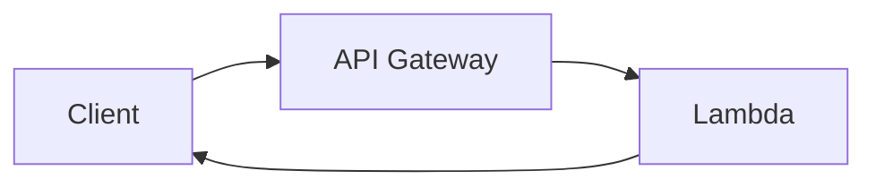

# Вопросы на собеседовании: `AWS Lambda`

`AWS Lambda` — самый популярный FaaS (Function as a Service). Запускает код без управления серверами, оплата за каждый вызов. На интервью спрашивают: cold start, жизненный цикл, интеграции (API Gateway, S3, SQS, DynamoDB Streams), лимиты, мониторинг, деплой (SAM, CDK), best practices.

## Полезные ссылки

### Официальная документация и авторитетные источники

- [AWS Lambda Documentation](https://docs.aws.amazon.com/lambda/)
- [AWS Lambda Best Practices](https://docs.aws.amazon.com/lambda/latest/dg/best-practices.html)
- [AWS SAM Documentation](https://docs.aws.amazon.com/serverless-application-model/)
- [Serverless Framework](https://www.serverless.com/)
- [Lambda Powertools (Python, TS, Java)](https://docs.powertools.aws.dev/)
- [AWS Compute Blog](https://aws.amazon.com/blogs/compute/)

## Содержание

- [Полезные ссылки](#полезные-ссылки)
- [See also](#see-also)

**Базовые понятия**
- [Q1. (!) Что такое AWS Lambda?](#q1--что-такое-aws-lambda)
- [Q2. (!) Как устроен жизненный цикл вызова Lambda (cold start и warm start)?](#q2--как-устроен-жизненный-цикл-вызова-lambda-cold-start-и-warm-start)
- [Q3. (!) Какие runtime поддерживает Lambda?](#q3--какие-runtime-поддерживает-lambda)
- [Q4. ZIP-деплой против container images — что выбрать?](#q4-zip-деплой-против-container-images--что-выбрать)

**Cold start**
- [Q5. (!) Что такое cold start?](#q5--что-такое-cold-start)
- [Q6. (!) Как уменьшить cold start?](#q6--как-уменьшить-cold-start)
- [Q7. (!) Как работает SnapStart для Java?](#q7--как-работает-snapstart-для-java)
- [Q8. Что такое Provisioned Concurrency?](#q8-что-такое-provisioned-concurrency)

**Конфигурация**
- [Q9. (!) Как задаются память, CPU и timeout?](#q9--как-задаются-память-cpu-и-timeout)
- [Q10. Как работать с переменными окружения (environment variables)?](#q10-как-работать-с-переменными-окружения-environment-variables)
- [Q11. Что такое Lambda Layers?](#q11-что-такое-lambda-layers)
- [Q12. (!) Чем ARM (Graviton2) отличается от x86 в Lambda?](#q12--чем-arm-graviton2-отличается-от-x86-в-lambda)

**Integrations / Triggers**
- [Q13. (!) Как связать API Gateway и Lambda?](#q13--как-связать-api-gateway-и-lambda)
- [Q14. Что такое Lambda Function URLs?](#q14-что-такое-lambda-function-urls)
- [Q15. (!) Как Lambda обрабатывает события из S3, DynamoDB Streams и Kinesis?](#q15--как-lambda-обрабатывает-события-из-s3-dynamodb-streams-и-kinesis)
- [Q16. (!) Как использовать SQS в качестве триггера?](#q16--как-использовать-sqs-в-качестве-триггера)
- [Q17. Что такое EventBridge и зачем он нужен?](#q17-что-такое-eventbridge-и-зачем-он-нужен)
- [Q18. Зачем нужны Step Functions для оркестрации?](#q18-зачем-нужны-step-functions-для-оркестрации)

**Concurrency**
- [Q19. (!) Что такое concurrent executions?](#q19--что-такое-concurrent-executions)
- [Q20. Чем reserved concurrency отличается от provisioned?](#q20-чем-reserved-concurrency-отличается-от-provisioned)
- [Q21. (!) Что происходит при превышении лимита concurrency?](#q21--что-происходит-при-превышении-лимита-concurrency)

**Limits**
- [Q22. (!) Какие лимиты у Lambda?](#q22--какие-лимиты-у-lambda)
- [Q23. Как обойти лимит timeout в 15 минут?](#q23-как-обойти-лимит-timeout-в-15-минут)

**Networking**
- [Q24. (!) Как и зачем запускать Lambda в VPC?](#q24--как-и-зачем-запускать-lambda-в-vpc)
- [Q25. Был ли cold start в VPC проблемой и актуально ли это сейчас?](#q25-был-ли-cold-start-в-vpc-проблемой-и-актуально-ли-это-сейчас)

**Deployment**
- [Q26. (!) Чем отличаются SAM, CDK и Serverless Framework?](#q26--чем-отличаются-sam-cdk-и-serverless-framework)
- [Q27. Как работают versions, aliases и traffic shifting в Lambda?](#q27-как-работают-versions-aliases-и-traffic-shifting-в-lambda)

**Monitoring**
- [Q28. (!) Как наблюдать за Lambda через CloudWatch Logs и X-Ray?](#q28--как-наблюдать-за-lambda-через-cloudwatch-logs-и-x-ray)
- [Q29. Из чего складывается стоимость Lambda?](#q29-из-чего-складывается-стоимость-lambda)

**Production**
- [Q30. (!) Когда стоит использовать Lambda, а когда нет?](#q30--когда-стоит-использовать-lambda-а-когда-нет)
- [Q31. Какие best practices для Lambda?](#q31-какие-best-practices-для-lambda)
- [Q32. (!) Какие частые ошибки при работе с Lambda?](#q32--какие-частые-ошибки-при-работе-с-lambda)

## Q1. (!) Что такое AWS Lambda?

`AWS Lambda` — это **Function as a Service (FaaS)**: ты загружаешь функцию, а AWS сам запускает её по событию и масштабирует. Серверов, на которых код исполняется, не существует с твоей точки зрения — нет ни инстансов, ни ОС, ни процессов, которые надо поддерживать. Ты платишь только за фактические миллисекунды работы, в простое — ноль.

Ключевые свойства, из которых вытекает всё остальное:

- **Event-driven** — функция не «висит» и не слушает порт, а запускается в ответ на событие (HTTP-запрос через API Gateway, новый объект в S3, сообщение в SQS и т.п.).
- **Pay-per-use** — счёт идёт за число вызовов и время работы; пока вызовов нет, плата не начисляется.
- **Auto-scaling** — на N одновременных событий AWS поднимает N копий функции; масштабирование «до нуля» и «вверх» — встроенное, его не надо настраивать.
- **Stateless** — между вызовами нельзя полагаться на локальное состояние; данные хранят во внешних сервисах (DynamoDB, S3, Redis).
- **Short-lived** — один вызов живёт максимум 15 минут, поэтому Lambda не для длительных процессов.

**Появился** в 2014 — первый массовый FaaS, фактически задавший стандарт serverless-вычислений.

**Типичные сценарии применения:**
- API-бэкенды (в связке с API Gateway)
- Обработка событий (загрузки в S3, изменения в DynamoDB Streams)
- Задачи по расписанию (cron через CloudWatch Events / EventBridge)
- ETL — разовые трансформации данных
- Приём вебхуков от внешних систем
- Связующий слой между микросервисами

## Q2. (!) Как устроен жизненный цикл вызова Lambda (cold start и warm start)?

Каждый вызов исполняется внутри **execution environment** — изолированной мини-песочницы. Жизненный цикл — это две фазы: дорогая инициализация окружения (Init) и дешёвый вызов handler-а (Invoke). Cold start — это когда приходится пройти обе; warm start — когда AWS переиспользует уже готовое окружение и сразу идёт в Invoke.

```
1. Init phase (cold start):
   - Allocate environment
   - Download code
   - Initialize runtime
   - Run init code (outside handler)

2. Invoke phase:
   - Run handler

3. (Reuse): if next invocation в same environment → "warm"
   - Skip init phase, just invoke handler
```

- **Cold start** — полная инициализация: от ~100 мс до нескольких секунд (хуже всего у Java и .NET, где поднимается JVM/CLR).
- **Warm start** — окружение уже прогрето, выполняется только handler; задержка в миллисекундах.

**Idle timeout:** AWS держит прогретое окружение **5–15 минут** после последнего вызова. Поэтому код вне handler-а (импорты, создание клиентов) выполняется один раз на cold start, а затем переиспользуется — это и есть ключ к производительности:

```python
# Init code — runs once per cold start
import boto3
db_client = boto3.client('dynamodb')

def handler(event, context):
    # runs every invocation
    return db_client.get_item(...)
```

## Q3. (!) Какие runtime поддерживает Lambda?

Lambda даёт **управляемые (нативные) runtime** для популярных языков — AWS сам обновляет ОС и среду выполнения — плюс две лазейки для всего остального: custom runtime и контейнеры.

**Нативные runtime:**
- Python (3.9, 3.10, 3.11, 3.12, 3.13)
- Node.js (18, 20, 22)
- Java (8, 11, 17, 21)
- .NET (6, 8)
- Ruby (3.2, 3.3)
- Go (отдельный managed-runtime устарел → используй custom)
- **Custom runtime** — любой язык через Lambda Runtime API (реализуешь цикл «запросить событие → обработать → вернуть ответ»)

**Container images** — приносишь собственный Docker-образ, до 10 GB.

Что выбрать на практике:
- **Python, Node.js** — рабочая лошадка: быстрый cold start, минимум зависимостей.
- **Java, .NET** — cold start медленнее из-за подъёма JVM/CLR, но это лечится **SnapStart**.
- **Go, Rust** — компилируемые, очень быстрый старт; запускаются через custom runtime или контейнер.

## Q4. ZIP-деплой против container images — что выбрать?

Два способа упаковать код: лёгкий ZIP-архив поверх нативного runtime или собственный Docker-образ. Выбор сводится к одному вопросу: помещаешься ли ты в лимит 250 MB и стандартный runtime — тогда ZIP, иначе контейнер.

**ZIP-деплой:**
- До 250 MB в распакованном виде
- Деплой и cold start быстрее (нечего скачивать, кроме архива)
- Только стандартный runtime

**Container images:**
- До 10 GB — на порядок больше места
- Любые зависимости и библиотеки, любой язык
- Один и тот же образ локально (Docker) и в проде — паритет окружений
- Cold start медленнее: при холодном старте образ надо подтянуть

**Контейнер оправдан, когда:**
- Большие зависимости — ML-модели, нативные библиотеки, не влезающие в 250 MB
- Нестандартный язык или окружение
- Приложение и так уже контейнеризировано (переиспользуешь существующий образ)

**Рекомендация:** по умолчанию ZIP — быстрее и проще; контейнер берут под конкретную причину из списка выше.

## Q5. (!) Что такое cold start?

**Cold start** — это вызов, для которого AWS вынужден создать **новое execution environment** с нуля. Дополнительная задержка появляется именно потому, что окружение надо собрать и инициализировать, прежде чем дойти до твоего кода.

**Из чего складывается задержка:**
1. Выделение execution environment (~50–200 мс)
2. Скачивание кода (~50–200 мс)
3. Инициализация runtime (~100 мс — 5 с, зависит от языка)
4. Запуск init-кода (твои импорты, создание клиентов)
5. Запуск handler-а

Главный вклад — шаг 3: чем тяжелее среда выполнения, тем дольше старт.

**Порядок cold start по runtime (примерно):**
- Python: ~200–500 мс
- Node.js: ~150–400 мс
- Go: ~100–300 мс
- Java (без SnapStart): ~1–5 с
- .NET: ~500 мс — 2 с
- Java SnapStart: ~200–500 мс

**Когда возникает cold start:**
- Самый первый вызов функции
- После простоя (окружение «остыло» через 5–15 мин)
- Рост concurrency — на новые параллельные вызовы нужны новые окружения
- Обновление кода (публикуется новая версия)
- Изменение конфигурации функции

## Q6. (!) Как уменьшить cold start?

Все приёмы бьют по двум вещам: либо сокращают саму инициализацию (меньше кода, лёгкий runtime, больше CPU), либо вовсе её избегают (держат окружения прогретыми). По эффекту:

1. **Меньше deployment-пакет** — меньше кода и зависимостей = быстрее скачивание и инициализация
2. **Lazy load** зависимостей — импортируй тяжёлые модули внутри handler-а, если они нужны редко
3. **Больше памяти** — CPU выделяется пропорционально памяти, так что больше памяти ускоряет инициализацию
4. **ARM (Graviton)** — обычно быстрее и при этом дешевле
5. **Provisioned concurrency** — держит N окружений всегда «тёплыми», убирая cold start совсем
6. **Избегай тяжёлых фреймворков** — Spring Boot на Lambda без SnapStart стартует медленно
7. **Выбирай быстрый runtime** — Node, Python, Go стартуют куда быстрее JVM/CLR
8. **Не злоупотребляй VPC** — раньше это сильно замедляло старт, сейчас почти не влияет
9. **SnapStart для Java** — ускоряет cold start в 5–10 раз
10. **Прогрев** через вызовы по расписанию — хак: периодически дёргаешь функцию, чтобы окружение не остыло

## Q7. (!) Как работает SnapStart для Java?

**SnapStart** (с 2022) убирает дорогую инициализацию из горячего пути: вместо того чтобы поднимать JVM при каждом cold start, Lambda один раз прогоняет init-фазу, делает **snapshot** готового окружения и затем при вызовах просто восстанавливается из этого снимка.

```
Без SnapStart: Init Java + Spring Boot = 5-10 sec
С SnapStart: Restore snapshot = 200-500ms
```

**Как работает:**
1. При публикации версии Lambda один раз выполняет инициализацию
2. Снимает snapshot памяти и диска прогретого окружения
3. При вызове **восстанавливает снимок** в Firecracker MicroVM — без повторной инициализации

**Подводный камень:** все вызовы стартуют из одного и того же снимка, поэтому любое значение, зафиксированное в init-коде, окажется одинаковым у всех. Классическая ловушка — сгенерировать seed для `Random()` в init: уникальность сломается. Такие вещи переносят в handler.

SnapStart доступен для **Java, Python и .NET**.

## Q8. Что такое Provisioned Concurrency?

**Provisioned Concurrency (PC)** — это N окружений, которые AWS держит заранее инициализированными и всегда «тёплыми». Cold start для них не наступает: handler выполняется сразу, потому что init-фаза уже пройдена. По сути ты платишь за гарантию мгновенного отклика.

```bash
aws lambda put-provisioned-concurrency-config \
  --function-name my-fn \
  --qualifier prod \
  --provisioned-concurrent-executions 10
```

**Зачем нужен:**
- Предсказуемо низкая задержка без всплесков от cold start
- Критичные API, где даже одна-две секунды старта недопустимы

**Стоимость:** ~$0.015 за GB-час на каждое provisioned-окружение, причём плата идёт даже в простое — это доплата сверх обычной оплаты за вызовы. В этом главный компромисс: убираешь cold start ценой постоянных расходов.

**Auto-scaling** PC можно привязать к расписанию или к метрикам — держать больше окружений в часы пик и меньше ночью.

**Когда брать:**
- API, чувствительные к задержке
- Предсказуемые всплески нагрузки (например, наплыв в начале рабочего дня)

## Q9. (!) Как задаются память, CPU и timeout?

Главное, что надо понять: **напрямую крутится только память**, а CPU и стоимость подтягиваются за ней автоматически.

**Память:** от 128 MB до 10 GB, с шагом 1 MB.

**CPU:** выделяется пропорционально памяти, отдельно задать нельзя.
- 1769 MB ≈ 1 vCPU
- 10240 MB ≈ 6 vCPU

**Тайм-аут:** максимум **15 минут**, по умолчанию 3 с.

Как подбирать память под нагрузку:

```python
# Choose memory based on workload
# CPU-bound → больше memory = больше CPU = faster + cheaper
# Memory-bound → enough memory для data
```

**Контринтуитивный момент про стоимость:** счёт идёт за «GB × миллисекунды», поэтому меньше памяти **не значит** дешевле. С большей памятью функция получает больше CPU, отрабатывает быстрее — и итоговая цена за вызов может оказаться ниже. Поэтому память подбирают замерами, а не на глаз.

**Lambda Power Tuning** — инструмент, который автоматически прогоняет функцию на разных объёмах памяти и показывает оптимум по цене/скорости.

## Q10. Как работать с переменными окружения (environment variables)?

Переменные окружения — это пары «ключ-значение», которые задаются на уровне функции и доступны коду через стандартный механизм окружения. Удобно выносить туда конфигурацию (URL, имена таблиц, флаги), которая отличается между dev и prod.

```python
import os
db_url = os.environ['DB_URL']
```

**Лимит:** 4 KB суммарно на все переменные.

**Рекомендации:**
- Не клади секреты в открытые ENV — пароли и токены храни в Secrets Manager или Parameter Store
- Для чувствительных значений включай шифрование KMS
- Разделяй окружения: свой набор переменных под dev и под prod

Секрет лучше подтянуть в рантайме из Parameter Store, а не зашивать в ENV:

```python
# Использовать Parameter Store
import boto3
ssm = boto3.client('ssm')
db_url = ssm.get_parameter(Name='/myapp/prod/db_url', WithDecryption=True)['Parameter']['Value']
```

## Q11. Что такое Lambda Layers?

**Layer** — это отдельно публикуемый пакет с кодом или зависимостями, который подключается сразу к нескольким функциям. Layer монтируется к окружению как общий слой, а сам код функции остаётся маленьким — тяжёлые библиотеки лежат в слоях.

```
Lambda function (your code) — 1 MB
Layer 1: dependencies (numpy, pandas) — 50 MB
Layer 2: shared utilities — 5 MB
```

**Что это даёт:**
- DRY — общий код и зависимости в одном месте, а не скопированы в каждую функцию
- Меньше deployment-пакеты — деплой кода функции быстрее
- Обновил слой один раз — подхватили все функции, которые его используют

**Лимиты:** до 5 слоёв на функцию; суммарно функция + слои — не больше 250 MB в распакованном виде.

**Типичные сценарии:**
- AWS SDK (хотя он уже встроен в runtime)
- Распространённые библиотеки — Pandas, NumPy
- Собственные общие утилиты
- Lambda Powertools

## Q12. (!) Чем ARM (Graviton2) отличается от x86 в Lambda?

**Graviton2** — это собственный процессор AWS на архитектуре ARM. Для Lambda смысл простой: при тех же сценариях он одновременно и дешевле, и зачастую быстрее x86 — поэтому к нему стоит переходить, если зависимости совместимы.

| Критерий | x86 | ARM (Graviton2) |
|----------|-----|------|
| Стоимость | Стандартная | **на 20% дешевле** |
| Производительность | Хорошая | **на 15–20% выше** для большинства нагрузок |
| Совместимость | Все x86-бинарники | Нужны ARM-совместимые зависимости |

```yaml
Architectures:
  - arm64
```

Совместимость — единственная реальная преграда, и зависит она от типа зависимостей:
- Чистый Python, Node.js, Java — переносятся как есть (интерпретируемый/байт-код, нет привязки к архитектуре)
- Go, Rust — нужна перекомпиляция под ARM
- Нативные библиотеки (PIL, NumPy) — нужны их ARM-сборки

**Рекомендация:** для новых функций по умолчанию бери **ARM** — выигрыш по цене и скорости даётся почти бесплатно, если зависимости поддерживают ARM.

## Q13. (!) Как связать API Gateway и Lambda?

Это **самая частая** интеграция: API Gateway принимает HTTP-запрос, вызывает Lambda, та возвращает ответ. Gateway берёт на себя сетевую обвязку (TLS, маршрутизация, авторизация, throttling), а Lambda — только бизнес-логику.



Есть два типа API Gateway, и выбор между ними — это компромисс «возможности против цены»:

**REST API** (v1):
- Полный набор возможностей — кэширование, throttling, валидация запросов
- Дороже: $3.50 за миллион запросов
- Более зрелый, для сложных API

**HTTP API** (v2):
- На 70% дешевле: $1.00 за миллион
- Ниже задержка
- Меньше возможностей — нет валидации запросов и ряда фич REST API

**Рекомендация:** для простых случаев берут HTTP API (дешевле и быстрее), REST API — когда реально нужны его фичи вроде валидации или кэширования.

```python
def handler(event, context):
    # event['httpMethod'], event['path'], event['headers'], event['body']
    return {
        "statusCode": 200,
        "headers": {"Content-Type": "application/json"},
        "body": '{"message": "hello"}'
    }
```

## Q14. Что такое Lambda Function URLs?

С 2022 года у функции может быть собственный встроенный HTTPS-эндпоинт — **Function URL** — без API Gateway вообще. Это «бедный, но бесплатный» способ выставить Lambda в интернет напрямую.

```bash
aws lambda create-function-url-config \
  --function-name my-fn \
  --auth-type AWS_IAM  # or NONE
```

Получаешь готовый адрес вида `https://abc123.lambda-url.us-east-1.on.aws/`.

**Плюсы:**
- Бесплатно — не платишь за API Gateway
- Ниже задержка (нет промежуточного слоя)
- Проще в настройке

**Минусы:** ты теряешь всё, что давал Gateway —
- Нет throttling, кэширования, валидации запросов
- Только один URL, без сложной маршрутизации

**Сценарий применения:** простые вебхуки и публичные эндпоинты, где маршрутизация и фичи Gateway не нужны.

## Q15. (!) Как Lambda обрабатывает события из S3, DynamoDB Streams и Kinesis?

Это три классических источника событий. Принцип общий: что-то меняется в сервисе — и Lambda получает на вход запись (или батч записей) об этом изменении.

**S3 trigger** — событие на операцию с объектом:
```
PUT /my-bucket/uploads/photo.jpg → Lambda → process image
```

**DynamoDB Streams** — поток изменений строк таблицы:
```
INSERT/UPDATE/DELETE in DynamoDB table → Lambda processes change record
```

**Kinesis Data Streams** — поток записей, обрабатываемых батчами:
```
Records published к stream → Lambda processes batch
```

**Типовой паттерн** во всех случаях — событийная обработка: событие приходит в `event['Records']`, и ты идёшь по списку записей:

```python
def handler(event, context):
    for record in event['Records']:
        # S3
        bucket = record['s3']['bucket']['name']
        key = record['s3']['object']['key']
        # process
```

**Настройка батчей** (для потоковых источников) определяет, как записи собираются перед вызовом:
- **BatchSize** — максимум записей на один вызов
- **BatchWindow** — сколько ждать накопления батча перед запуском
- **MaxRetries** — число повторов при ошибке

## Q16. (!) Как использовать SQS в качестве триггера?

```
SQS message → Lambda → process → ack (delete from SQS)
```

Главное отличие SQS от потоковых источников — **гарантия доставки через повторы**. Lambda не теряет сообщение при сбое:

- Lambda **сама опрашивает** очередь (event source mapping), без отдельного poller-а
- Если вызов упал → сообщение возвращается в очередь и обрабатывается снова
- После исчерпания повторов → уходит в DLQ (Dead Letter Queue), где его можно разобрать вручную

**Обработка батчами:**
- **BatchSize**: до 10000 для standard-очереди, до 10 для FIFO
- **ReportBatchItemFailures** — отчёт о частичных сбоях: если из батча упала часть сообщений, переотправляются только они, а не весь батч

```python
def handler(event, context):
    failed_records = []
    for record in event['Records']:
        try:
            process(record)
        except Exception:
            failed_records.append({"itemIdentifier": record['messageId']})
    return {"batchItemFailures": failed_records}
```

**Подводный камень:** пока Lambda обрабатывает сообщение, оно скрыто из очереди на время visibility timeout. Если функция работает дольше этого окна, сообщение снова станет видимым и обработается повторно. **Эмпирическое правило:** ставь visibility timeout = 6 × timeout Lambda.

## Q17. Что такое EventBridge и зачем он нужен?

**EventBridge** — это шина событий с правилами маршрутизации. Источник публикует событие в шину, а правила решают, кому и при каком условии его доставить. Прямая связка вроде «S3 → Lambda» соединяет ровно одного производителя с одним потребителем; EventBridge снимает это ограничение.

```
EventBridge rule: 
  source: "aws.s3"
  detail-type: "Object Created"
  → trigger Lambda
```

**Что даёт по сравнению с прямой связкой S3 → Lambda:**
- **Несколько подписчиков** на одно событие (Lambda + SNS + …)
- **Фильтрация по содержимому** — например, реагировать только на PDF-файлы
- **Схемы событий, replay и архив** — можно переиграть прошлые события
- **Cross-account и cross-region** доставка
- 100+ готовых интеграций с SaaS-сервисами

**Сценарий применения:** EventBridge предпочтителен, когда нужна сложная маршрутизация событий или несколько получателей; для простой связки «один источник — один обработчик» хватает прямого триггера.

## Q18. Зачем нужны Step Functions для оркестрации?

**Step Functions** — это движок workflow: ты описываешь последовательность шагов (стейт-машину), а сервис сам вызывает функции по очереди, ветвит логику, делает повторы и обрабатывает ошибки. Идея — вынести оркестрацию из кода: вместо того чтобы одна Lambda вызывала другую и вручную разруливала сбои, поток шагов задаётся декларативно.

```json
{
  "States": {
    "Validate": { "Type": "Task", "Resource": "arn:...:validate" },
    "Process": { "Type": "Task", "Resource": "arn:...:process" },
    "Notify": { "Type": "Task", "Resource": "arn:...:notify" }
  }
}
```

**Сценарии применения:**
- Долгоиграющие workflow (обработка заказов, цепочки согласований)
- Saga-паттерн — распределённые транзакции с компенсацией
- Параллельная обработка ветвей
- Встроенная обработка ошибок и повторов

**Express против Standard** — два режима под разные задачи:
- **Express** — высокий поток коротких задач (< 5 мин), семантика at-least-once
- **Standard** — длинные workflow (до 1 года), семантика exactly-once

## Q19. (!) Что такое concurrent executions?

**Concurrent executions** — это число вызовов Lambda, исполняющихся **одновременно** в один момент времени. Не путать с RPS: важна не частота запросов, а сколько из них «висит в работе» прямо сейчас. Например, 100 запросов в секунду по 50 мс каждый дают всего ~5 одновременных исполнений.

```
1000 concurrent = 1000 invocations executing at once
```

**Лимит аккаунта по умолчанию:** 1000 одновременных исполнений на регион (повышается через support).

**На отдельную функцию** жёсткого лимита нет — все функции аккаунта по умолчанию делят общий пул concurrency.

## Q20. Чем reserved concurrency отличается от provisioned?

Названия похожи, но решают **разные задачи**. Reserved — это про лимиты и изоляцию (сколько максимум), provisioned — про прогрев и задержку (что готово заранее). Их можно сочетать.

**Reserved concurrency** — резервирует и одновременно ограничивает долю пула для функции:
- Задаёт **потолок** concurrency для конкретной функции
- Этот объём **вычитается** из общего пула аккаунта и гарантированно доступен функции
- **Сценарий:** не дать одной функции выесть всю concurrency аккаунта и положить остальные

**Provisioned concurrency** — про производительность, а не про лимиты:
- **Заранее прогретые** окружения, всегда готовые принять вызов
- Стоит **дополнительных денег** (платишь за прогрев в простое)
- **Сценарий:** эндпоинты, чувствительные к задержке, где cold start недопустим

```bash
# Reserved (just limit)
aws lambda put-function-concurrency --function-name my-fn --reserved-concurrent-executions 100

# Provisioned (pre-warm)
aws lambda put-provisioned-concurrency-config --function-name my-fn --qualifier prod --provisioned-concurrent-executions 10
```

## Q21. (!) Что происходит при превышении лимита concurrency?

Когда свободных окружений не осталось, вызов отбрасывается с ошибкой throttling. А вот что будет дальше — зависит от того, как функция была вызвана: синхронно (ответ ждут здесь и сейчас) или асинхронно/через поток (вызов можно отложить и повторить).

| Тип триггера | При throttling |
|-------------|----------------|
| Синхронный (API Gateway) | HTTP 429, клиент повторяет запрос |
| Асинхронный (S3, SNS) | Lambda повторяет (до 6 часов), затем DLQ |
| SQS | Сообщение возвращается в очередь (повторяется) |
| Kinesis/DynamoDB Streams | Lambda повторяет (блокирует обработку shard-а) |

Ключевой вывод: при синхронном вызове ошибка прилетает прямо клиенту (429), а при асинхронном AWS сам ретраит, и потеря данных случается только если повторы исчерпаны без DLQ.

**Рекомендация:** следи за метриками concurrency и ставь алармы на ошибки throttle, чтобы поймать упор в лимит до того, как он станет инцидентом.

## Q22. (!) Какие лимиты у Lambda?

Лимиты Lambda — частый вопрос, потому что именно они определяют, где функция перестаёт подходить под задачу. Ключевые числа стоит держать в голове:

| Лимит | Значение |
|-------|-------|
| Память | 128 MB — 10 GB |
| Timeout | 15 мин |
| Deployment-пакет (ZIP) | 250 MB в распакованном виде |
| Container image | 10 GB |
| Хранилище /tmp | 512 MB — 10 GB |
| Concurrent executions | 1000 (по умолчанию, можно увеличить) |
| Environment variables | 4 KB суммарно |
| Layers | 5 на функцию |
| Payload запроса (sync) | 6 MB |
| Payload запроса (async) | 256 KB |
| Payload ответа | 6 MB |

**Если упёрся в лимит** — это сигнал поменять архитектуру, а не «выбивать» исключение: раздели работу на части, оркеструй через Step Functions или вынеси тяжёлое в ECS/Fargate.

## Q23. Как обойти лимит timeout в 15 минут?

15 минут — жёсткий потолок, его нельзя поднять. Поэтому «обход» — это не настройка, а смена подхода: либо разбить задачу на короткие куски, либо унести её туда, где лимита нет.

Варианты по нарастанию «тяжести» задачи:

1. **Разбить на части** — несколько мелких Lambda вместо одной длинной
2. **Step Functions** — оркестрация цепочки Lambda, общий workflow живёт до 1 года
3. **AWS Batch** — для по-настоящему долгих пакетных вычислений
4. **ECS/Fargate** — контейнеры без лимита по времени работы
5. **EC2** — полный контроль, когда нужны долгоживущие процессы

**Типовой паттерн:** Lambda служит «спусковым крючком» — принимает событие и запускает Fargate-задачу, которая делает тяжёлую долгую работу.

## Q24. (!) Как и зачем запускать Lambda в VPC?

```yaml
VpcConfig:
  SubnetIds: ["subnet-abc", "subnet-def"]
  SecurityGroupIds: ["sg-123"]
```

**Зачем:** чтобы достучаться до ресурсов внутри приватной сети — RDS в приватной подсети, внутренние сервисы, кэши. Без VPC такие ресурсы для Lambda недоступны.

**По умолчанию** функция работает **вне** твоей VPC: AWS даёт ей собственную управляемую сеть с выходом в интернет «из коробки».

**Подключённая к VPC** Lambda получает ENI (сетевой интерфейс) в указанной подсети. Важный нюанс: попав в приватную подсеть, она теряет дефолтный выход в интернет — чтобы вернуть его, нужен **NAT Gateway**. Это частая причина «функция в VPC не видит интернет».

## Q25. Был ли cold start в VPC проблемой и актуально ли это сейчас?

Короткий ответ: раньше — да, сейчас — практически нет. Старый совет «не суйте Lambda в VPC» родом из эпохи, которая давно прошла.

**До 2019:** при каждом cold start функции создавался и подключался отдельный ENI — это добавляло **~10–15 секунд** задержки. **Очень болезненно** для любого API.

**С 2019 (Hyperplane ENI):** сетевые интерфейсы стали **общими** и переиспользуются между вызовами, поэтому накладные расходы упали до **~10–50 мс** — фактически незаметно.

**Вывод:** сегодня Lambda в VPC работает нормально, и старая рекомендация «избегайте VPC» больше неактуальна.

## Q26. (!) Чем отличаются SAM, CDK и Serverless Framework?

Это инструменты Infrastructure-as-Code для деплоя Lambda. Все решают одну задачу — описать функцию и её инфраструктуру в коде, — но по-разному: SAM декларативен и заточен под AWS, CDK даёт настоящий язык программирования, Serverless Framework универсален по облакам.

**AWS SAM (Serverless Application Model):**
```yaml
# template.yaml
Resources:
  HelloFunction:
    Type: AWS::Serverless::Function
    Properties:
      Handler: app.handler
      Runtime: python3.11
      Events:
        Api:
          Type: Api
          Properties:
            Path: /hello
            Method: get
```
```bash
sam deploy --guided
```

**AWS CDK:**
```python
from aws_cdk import aws_lambda as lambda_
fn = lambda_.Function(self, "MyFn",
    runtime=lambda_.Runtime.PYTHON_3_11,
    handler="app.handler",
    code=lambda_.Code.from_asset("src/")
)
```

**Serverless Framework:**
```yaml
service: my-app
provider:
  name: aws
  runtime: python3.11
functions:
  hello:
    handler: app.handler
    events:
      - http: GET /hello
```

| Инструмент | Плюсы |
|------|------|
| **SAM** | Нативный для AWS, простой YAML |
| **CDK** | Императивный (код на Python/TS), мощный |
| **Serverless Framework** | Мультиоблачный (AWS, GCP, Azure) |
| **Terraform** | Мультиоблачный, управление состоянием |

**Как выбирать:** CDK — для серьёзных AWS-only проектов, где нужна вся мощь языка; Serverless Framework — когда важна переносимость между облаками; SAM — когда хочется простого декларативного YAML под AWS.

## Q27. Как работают versions, aliases и traffic shifting в Lambda?

Вместе эти три механизма дают безопасную выкатку: версии фиксируют код, алиасы дают стабильное имя для окружения, а traffic shifting позволяет перелить трафик на новую версию постепенно.

**Versions** — неизменяемые снимки кода и конфигурации функции:
```
my-fn:1, my-fn:2, my-fn:3 (latest)
```

**Aliases** — именованные указатели на версии; внешний потребитель ходит на алиас, а не на номер версии:
```
prod → my-fn:2
staging → my-fn:3
```

**Traffic shifting** на алиасе — расщепление трафика между версиями для canary-выката:
```
prod: 90% v2 + 10% v3 (canary)
```

```bash
aws lambda update-alias --function-name my-fn --name prod \
  --function-version 3 \
  --routing-config AdditionalVersionWeights={"2"=0.9}
```

**Сценарий применения:** безопасные деплои через canary — пускаешь на новую версию малую долю трафика, следишь за метриками и при ошибках мгновенно откатываешься, переключив алиас.

## Q28. (!) Как наблюдать за Lambda через CloudWatch Logs и X-Ray?

Observability в Lambda строится из трёх слоёв: логи (что произошло), трассировка (где время и кто кого вызвал) и метрики. CloudWatch Logs включён всегда, X-Ray добавляет сквозную трассировку по сервисам.

**CloudWatch Logs** — пишутся автоматически, без настройки:
- Log group: `/aws/lambda/<function-name>`
- Каждый `print` / `console.log` уходит в CloudWatch
- Retention настраивается — и это важно: по умолчанию логи не истекают никогда, то есть копятся и стоят денег. Задавай TTL.

**X-Ray** — распределённая трассировка: видно путь запроса через сервисы и где тратится время.
```python
from aws_xray_sdk.core import xray_recorder
@xray_recorder.capture('my_function')
def process(): ...
```

**Lambda Insights** (расширение) — системные метрики (CPU, использование памяти сверх дефолтных).

**Lambda Powertools** (Python/TS/Java/.NET) — утилиты для логирования, метрик и трассировки.

```python
from aws_lambda_powertools import Logger, Tracer, Metrics
logger = Logger()
tracer = Tracer()
metrics = Metrics()

@tracer.capture_lambda_handler
@logger.inject_lambda_context
@metrics.log_metrics
def handler(event, context):
    ...
```

## Q29. Из чего складывается стоимость Lambda?

Счёт состоит из двух частей: фиксированная плата за число вызовов плюс плата за время работы, помноженное на выделенную память. Отсюда и берутся все приёмы оптимизации.

**Тарификация:**
- **За вызов:** $0.20 за 1M вызовов
- **За длительность:** $0.0000166667 за GB-секунду

```
1M invocations × 100ms × 512 MB = $0.20 + $0.83 = ~$1.03
```

**Как снижать стоимость:**
- Подобрать правильную память (инструмент Lambda Power Tuning) — баланс «быстрее × дороже за мс»
- ARM (Graviton2) — на 20% дешевле при той же работе
- Не плодить лишние cold start (provisioned concurrency применять с умом, она тоже стоит денег)
- Lambda destinations вместо ручной отправки в SNS/SQS из кода — меньше вызовов и кода

**Скрытые расходы**, о которых часто забывают:
- Приём логов в CloudWatch Logs (особенно при многословном логировании)
- Использование ENI и NAT при работе в VPC
- Передача данных между сервисами
- Счёт за сам API Gateway перед функцией

## Q30. (!) Когда стоит использовать Lambda, а когда нет?

Lambda хороша там, где нагрузка событийная, неравномерная и короткая, и проигрывает там, где она стабильная, длинная или stateful. Если коротко — её сильная сторона (платишь только за вызовы и масштабируешься до нуля) превращается в слабость при постоянном высоком потоке.

**Подходит для:**
- Обработки событий (загрузки в S3, изменения в DynamoDB Streams)
- HTTP API с непредсказуемым трафиком
- Задач по расписанию (cron)
- Приёма вебхуков
- Связующего кода и интеграций между сервисами
- Потоковой обработки в реальном времени (Kinesis, MSK)
- Всплесков трафика — авто-масштабирование «из коробки»

**Не подходит для:**
- Долгих задач > 15 мин (упирается в timeout)
- Стабильно высокого потока — здесь EC2/Fargate выходят дешевле
- WebSocket-соединений (бери API Gateway WebSocket или ALB)
- ML-инференса на больших моделях — мешают cold start и лимит памяти
- Приложений с тяжёлым стартом фреймворка (Spring Boot тормозит даже со SnapStart)
- Stateful-приложений, которым нужно постоянное локальное состояние

**Точка безубыточности:** ориентир — около **50K запросов/день** или постоянная нагрузка. Меньше — Lambda дешевле; больше и стабильно — выгоднее EC2.

## Q31. Какие best practices для Lambda?

Многие из этих правил вытекают прямо из устройства Lambda: окружение переиспользуется (отсюда инициализация вне handler-а), оно stateless (отсюда — не полагайся на /tmp), а оплата идёт за время и логи (отсюда — память и retention).

1. **Держи функции маленькими** — одна функция = одна ответственность
2. **Инициализируй вне handler-а** — пулы соединений и SDK-клиенты создавай в init-коде, чтобы переиспользовать между вызовами
3. **Переиспользуй соединения** — пулы БД и HTTP-клиенты вместо создания на каждый вызов
4. **Асинхронный вызов** для fire-and-forget сценариев (обязательно с DLQ)
5. **Используй Layers** для общих зависимостей
6. **Не храни состояние в /tmp** между вызовами — оно переживёт окружение лишь случайно, полагаться нельзя
7. **Powertools** для логирования, метрик и трассировки
8. **Versioning + aliases** для безопасных деплоев и быстрого отката
9. **Подбирай память** замерами через Power Tuning, а не на глаз
10. **Задай retention в CloudWatch Logs** — без TTL логи копятся вечно и тянут деньги

## Q32. (!) Какие частые ошибки при работе с Lambda?

Почти все типичные грабли — это игнорирование природы Lambda: что окружение может быть холодным, что вызов могут повторить, и что состояние нельзя хранить локально.

1. **Сюрприз с cold start** — первый запрос ловит таймаут 30 с, потому что не заложили время на холодный старт
2. **Нет DLQ** — упавшие сообщения просто теряются, разобрать их потом негде
3. **Захардкоженные креды** в переменных окружения вместо Secrets Manager
4. **Неверная память** — слишком мало (медленно), слишком много (дорого); подбирается замерами
5. **Нет идемпотентности** — повторная доставка приводит к дублирующей обработке
6. **Работа дольше timeout** — упор в жёсткий лимит `15 min `, функция обрывается на полпути
7. **Кривой VPC** — нет NAT Gateway, и функция теряет доступ в интернет
8. **Тяжёлые фреймворки** — Spring Boot без SnapStart даёт огромный cold start
9. **Слишком много логов** — приём в CloudWatch стоит ощутимых денег
10. **Упор в concurrency** — прод уткнулся в лимит 1000 → сервис лёг

**Вывод:** Lambda — рабочая лошадка serverless, но раскрывается только при **правильной архитектуре** — с учётом cold start, повторов и stateless-природы.

## See also

- [AWS](aws-interview.md) — общие основы
- [Serverless](serverless-interview.md) — концепции
- [GCP](gcp-interview.md) — Cloud Functions сравнение
- [Azure](azure-interview.md) — Functions сравнение
- [Cloud-native Patterns](cloud-native-patterns-interview.md) — patterns
- [Микросервисы](../architecture/microservices-interview.md) — Lambda как microservice
- [Event-driven](../architecture/event-driven-patterns-interview.md) — Lambda triggers
- [API Gateway](../architecture/api-gateway-interview.md) — front для Lambda
- [Saga Pattern](../architecture/saga-pattern-interview.md) — Step Functions
- [Caching](../architecture/caching-strategies-interview.md) — для Lambda
- [Observability](../monitoring/observability-interview.md) — Powertools, X-Ray
- [Application Security](../security/application-security-interview.md) — IAM roles
- [JVM](../jvm/jvm-interview.md) — для Java на Lambda

- [Azure](azure-interview.md)
- [Cloud-native Patterns](cloud-native-patterns-interview.md)
- [GCP (Google Cloud Platform)](gcp-interview.md)
- [Serverless](serverless-interview.md)
- [AI Agents](../ai-ml/ai-agents-interview.md)
