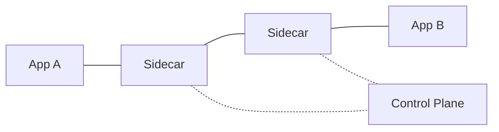

# Вопросы на собеседовании: `Cloud-native Patterns`

**Cloud-native** — приложения, спроектированные под облако (а не перенесённые методом lift-and-shift): контейнеризованные, динамически оркестрируемые, построенные на микросервисах. Паттерны: **12-factor**, **sidecar**, **circuit breaker**, **retry**, **bulkhead**, **leader election**, **autoscaling**, **service mesh**. Стандарты: проекты **CNCF** (K8s, Prometheus, Envoy, ...).

## Полезные ссылки

### Официальная документация и авторитетные источники

- [12-Factor App Methodology](https://12factor.net/)
- [Cloud Native Computing Foundation (CNCF)](https://www.cncf.io/)
- [CNCF Landscape](https://landscape.cncf.io/)
- [Microsoft Azure Cloud Design Patterns](https://learn.microsoft.com/azure/architecture/patterns/)
- [Designing Distributed Systems (book by Brendan Burns)](https://www.oreilly.com/library/view/designing-distributed-systems/9781491983638/)
- [Site Reliability Engineering (SRE book)](https://sre.google/books/)

## Содержание

- [Полезные ссылки](#полезные-ссылки)
- [See also](#see-also)

**Базовые принципы**
- [Q1. (!) Что такое cloud-native?](#q1--что-такое-cloud-native)
- [Q2. (!) 12-factor app principles?](#q2--12-factor-app-principles)
- [Q3. (!) Что такое CNCF?](#q3--что-такое-cncf)

**Container patterns**
- [Q4. (!) Sidecar pattern?](#q4--sidecar-pattern)
- [Q5. Ambassador pattern?](#q5-ambassador-pattern)
- [Q6. Adapter pattern?](#q6-adapter-pattern)
- [Q7. Init containers?](#q7-init-containers)

**Resilience patterns**
- [Q8. (!) Circuit breaker?](#q8--circuit-breaker)
- [Q9. (!) Retry с exponential backoff?](#q9--retry-с-exponential-backoff)
- [Q10. (!) Bulkhead?](#q10--bulkhead)
- [Q11. Timeout, deadline propagation?](#q11-timeout-deadline-propagation)
- [Q12. Health checks (liveness, readiness, startup)?](#q12-health-checks-liveness-readiness-startup)

**Stateful patterns**
- [Q13. (!) Stateless apps — почему важно?](#q13--stateless-apps--почему-важно)
- [Q14. Session state externalization?](#q14-session-state-externalization)
- [Q15. (!) Leader election?](#q15--leader-election)
- [Q16. Distributed locking?](#q16-distributed-locking)

**Scaling**
- [Q17. (!) Horizontal vs vertical scaling?](#q17--horizontal-vs-vertical-scaling)
- [Q18. Auto-scaling triggers?](#q18-auto-scaling-triggers)
- [Q19. Predictive vs reactive scaling?](#q19-predictive-vs-reactive-scaling)

**Observability**
- [Q20. (!) Three pillars: metrics, logs, traces?](#q20--three-pillars-metrics-logs-traces)
- [Q21. OpenTelemetry?](#q21-opentelemetry)
- [Q22. Service mesh (Istio, Linkerd)?](#q22-service-mesh-istio-linkerd)

**Deployment patterns**
- [Q23. (!) Blue-green deployment?](#q23--blue-green-deployment)
- [Q24. (!) Canary deployment?](#q24--canary-deployment)
- [Q25. Feature flags?](#q25-feature-flags)
- [Q26. GitOps?](#q26-gitops)

**Configuration**
- [Q27. (!) Configuration management в cloud-native?](#q27--configuration-management-в-cloud-native)
- [Q28. Secrets management?](#q28-secrets-management)

**Production**
- [Q29. (!) Какие частые анти-паттерны?](#q29--какие-частые-анти-паттерны)
- [Q30. Cloud-native maturity model?](#q30-cloud-native-maturity-model)

## Q1. (!) Что такое cloud-native?

**Cloud-native** — подход к построению и запуску приложений, использующий преимущества облака:
- **Containers** — упаковка
- **Microservices** — архитектура
- **Dynamic orchestration** — Kubernetes
- **DevOps-практики** — CI/CD, инфраструктура как код
- **Declarative APIs** — желаемое состояние
- **Loosely coupled** — сервисы независимы друг от друга
- **Resilient** — корректно переживают сбои
- **Observable** — metrics, logs, traces

**Определение CNCF:**
> "Cloud native technologies empower organizations to build and run scalable applications in modern, dynamic environments such as public, private, and hybrid clouds."

**Не cloud-native:** lift-and-shift legacy-приложений в облако (монолит, запущенный в EC2, — не cloud-native).

## Q2. (!) 12-factor app principles?

**12-Factor App** (Heroku, 2012) — методология для cloud-native приложений.

1. **Codebase** — один кодбейз под контролем git, много развёртываний
2. **Dependencies** — явные, изолированные (package.json, requirements.txt)
3. **Config** — в env-переменных, не в коде
4. **Backing services** — БД, очереди = подключаемые ресурсы по URL
5. **Build, release, run** — строгое разделение этапов
6. **Processes** — stateless, ничем не делятся (share-nothing)
7. **Port binding** — самодостаточен, отдаёт HTTP через порт
8. **Concurrency** — масштабирование через процессную модель (горизонтально)
9. **Disposability** — быстрый старт, корректное завершение работы
10. **Dev/prod parity** — окружения держим максимально похожими
11. **Logs** — пишем в stdout (сбор берёт на себя инфраструктура)
12. **Admin processes** — разовые задачи как отдельные процессы

**Современные дополнения** ("Beyond 12-factor"):
- API first
- Telemetry
- Authentication and authorization

## Q3. (!) Что такое CNCF?

**Cloud Native Computing Foundation** (CNCF) — vendor-нейтральная организация (часть Linux Foundation), управляющая cloud-native-проектами.

**Известные проекты CNCF:**

**Graduated:**
- **Kubernetes** — оркестрация
- **Prometheus** — мониторинг
- **Envoy** — прокси
- **gRPC** — RPC
- **Helm** — пакетный менеджер K8s
- **Containerd** — container runtime
- **etcd** — распределённое key-value-хранилище
- **Argo** — CI/CD, workflows
- **Linkerd**, **Istio** — service mesh
- **Vitess** — распределённый MySQL
- **Open Policy Agent (OPA)** — политики
- **Flux** — GitOps
- **Cilium** — сеть, eBPF
- **Harbor** — реестр контейнеров

100+ активных проектов. De facto стандарты cloud-native-стека.

## Q4. (!) Sidecar pattern?

**Sidecar** — вспомогательный контейнер в том же pod, добавляющий дополнительную функциональность.

```
Pod
├── App container (main business logic)
└── Sidecar container (logging, proxy, ...)
   - Shares network namespace
   - Shares volumes
```

**Примеры:**
- **Logging sidecar** — собирает логи из приложения
- **Service mesh proxy** (Envoy в Istio) — управляет трафиком
- Sidecar для обновления конфигурации (**config refresh**)
- **TLS termination**
- **Vault Agent** — инъекция секретов
- **Metrics exporter** для Prometheus

**Преимущества:**
- Разделение ответственности
- Переиспользование без правки приложения
- Разные циклы релизов
- Разные команды

**Недостаток:** дополнительные ресурсы на каждый pod.

## Q5. Ambassador pattern?

**Ambassador** — sidecar специально для **исходящих** (outbound) соединений.

```
App → Ambassador (handles retry, auth, monitoring) → External service
```

**Сценарии применения:**
- Клиентская часть service mesh (Envoy)
- Sidecar для пулинга соединений с БД
- Sidecar-API-gateway для исходящих вызовов

Приложение думает, что общается с простым сервисом (`localhost:8080`), а вся сложность ложится на ambassador.

## Q6. Adapter pattern?

**Adapter** — sidecar, который **преобразует** вывод приложения в стандартный формат.

```
App (custom format) → Adapter → Standardized output
                                   (Prometheus metrics, ELK logs)
```

**Сценарии применения:**
- Legacy-приложение пишет логи в своём формате → adapter преобразует их в JSON для logging-стека
- Приложение отдаёт метрики в своём формате → adapter выставляет их в формате Prometheus

## Q7. Init containers?

**Init containers** — запускаются **до** основного контейнера, отрабатывают и завершаются.

```yaml
spec:
  initContainers:
    - name: db-migrate
      image: my-app
      command: ["./migrate.sh"]
  containers:
    - name: app
      image: my-app
```

**Сценарии применения:**
- Миграции базы данных
- Ожидание готовности зависимостей
- Подготовка volumes / конфигов
- Загрузка данных

Если init-контейнер падает → pod перезапускается.

## Q8. (!) Circuit breaker?

**Circuit breaker** — предотвращает каскадные сбои. Если downstream-сервис сбоит → размыкаем ("open") цепь и сразу отдаём ошибку (fail fast).

**Состояния:**
- **Closed** — вызовы идут как обычно
- **Open** — все вызовы сразу падают (реального вызова нет)
- **Half-open** — пробуем 1-2 вызова; если ОК → closed, если сбой → open

```python
@circuit_breaker(failure_threshold=5, recovery_timeout=60)
def call_payment_service(order):
    return requests.post(payment_url, json=order)
```

**Инструменты:** Hystrix (legacy), Resilience4j, Polly (.NET), встроенные средства service mesh.

Подробнее — в [Resilience Patterns](../architecture/resilience-patterns-interview.md).

## Q9. (!) Retry с exponential backoff?

```python
@retry(
    stop=stop_after_attempt(5),
    wait=wait_exponential(multiplier=1, min=2, max=60)
)
def call_service():
    return requests.get(...)
```

**Схема задержек:** 2s → 4s → 8s → 16s → 60s.

**Лучшие практики:**
- **Jitter** (рандомизация) — чтобы избежать thundering herd
- Только идемпотентные операции (или с idempotency-ключами)
- Повторять только **временные** (transient) ошибки (5xx, таймауты), не 4xx
- Ограничивать общее время (не ретраить бесконечно)

**Анти-паттерн:** ретраи без jitter → 1000 клиентов одновременно бьются в упавший сервис → шторм только усиливается.

## Q10. (!) Bulkhead?

**Bulkhead** — изоляция сбоев, чтобы одна часть не задевала другую.

**Например:** отдельные пулы потоков для разных downstream-сервисов.

```
Service A: thread pool 10 (для users API)
Service B: thread pool 5 (для analytics)

Если analytics dies → users API не affected
```

**Аналогия:** корабельные перегородки — пробоина в одной не утопит весь корабль.

**В K8s:** лимиты ресурсов на каждый pod (CPU, memory).

## Q11. Timeout, deadline propagation?

**Timeout** на каждый внешний вызов — обязательно.

```python
requests.get(url, timeout=5)
```

**Deadline propagation** — проброс таймаута по цепочке вызовов.

```
Client request: 10 sec timeout
  → Service A: пропускает remaining 8 sec timeout
    → Service B: пропускает remaining 5 sec timeout
      → Database: 2 sec timeout
```

В **gRPC** встроено. В REST — через заголовки (`X-Request-Deadline`).

## Q12. Health checks (liveness, readiness, startup)?

**Health checks в Kubernetes:**

- **Liveness** — жив ли контейнер? Если падает → перезапуск контейнера.
- **Readiness** — готов ли контейнер принимать трафик? Если падает → убираем из load balancer (без перезапуска).
- **Startup** — для медленно стартующих приложений; приостанавливает liveness/readiness-проверки, пока старт не завершится успешно.

```yaml
livenessProbe:
  httpGet: { path: /health, port: 8080 }
  periodSeconds: 10
readinessProbe:
  httpGet: { path: /ready, port: 8080 }
startupProbe:
  httpGet: { path: /startup, port: 8080 }
  failureThreshold: 30  # 5 minutes для startup
```

**Лучшая практика:**
- Liveness — простой (просто жив ли процесс)
- Readiness — проверять зависимости (соединение с БД)
- Startup — для приложений с долгим прогревом

## Q13. (!) Stateless apps — почему важно?

**Stateless-приложение** — без локального состояния. Каждый запрос обрабатывается независимо.

**Зачем:**
- **Horizontal scaling** легко (клонируем инстансы)
- **Простая замена** — инстанс умер → поднимаем новый
- **Load balancing** — любой инстанс обслужит любой запрос
- **Rolling updates** — заменяем инстансы без простоя
- **Auto-scaling** работает без проблем

**Где хранится состояние:**
- База данных (PostgreSQL, DynamoDB)
- Кэш (Redis)
- Объектное хранилище (S3)
- Хранилище сессий (Redis, JWT в cookie)

**Если состояние держится в памяти:** sticky sessions → менее гибкое масштабирование.

## Q14. Session state externalization?

**Плохо:** сессия в памяти сервера (обслужить пользователя может только этот инстанс).
**Хорошо:** сессия в общем хранилище (shared store).

```
Option 1: Server-side sessions в Redis
  Cookie: session_id=abc123
  Backend reads Redis: SET session:abc123 {...}

Option 2: Stateless via JWT
  Cookie: jwt=eyJhbGc...
  Backend validates signature, no lookup
```

**Плюсы JWT:** нет похода в БД, масштабируется неограниченно.
**Минусы JWT:** трудно отозвать (revoke).

В **2025** обычно комбинируют: JWT как access token (короткоживущий), refresh token + Redis для отзыва.

## Q15. (!) Leader election?

**Leader election** — выбор одного инстанса для эксклюзивной задачи в кластере.

**Сценарии применения:**
- Cron-задачи (запускает только один инстанс)
- Миграции базы данных
- Прогрев кэша
- Координационные задачи

**Инструменты:**
- **Kubernetes leader election** (через ConfigMap / Lease objects)
- Распределённый лок в **etcd**
- **ZooKeeper**
- **Redis Redlock** (с осторожностью)
- **Consul**

```python
# K8s leader election (Python kubernetes client)
from kubernetes.leaderelection import leaderelection

def run_when_leader():
    while True:
        do_cron_job()
        time.sleep(60)

candidate = leaderelection.Candidate(name="my-app")
leader_election = leaderelection.LeaderElection(
    candidate, run_when_leader, ...
)
```

## Q16. Distributed locking?

**Distributed lock** — согласованный мьютекс между несколькими инстансами.

**Инструменты:**
- **Redis** — `SET NX EX 60` (setNX с TTL) или **Redlock**
- **etcd** — строгая согласованность, на основе lease
- **ZooKeeper** — эфемерные узлы
- **База данных** — `SELECT ... FOR UPDATE`

**Подвох:** распределённые локи тяжелы. По возможности избегайте — проектируйте идемпотентно.

```python
# Redis simple lock
def acquire_lock(key, timeout=60):
    return redis.set(key, "locked", nx=True, ex=timeout)

if acquire_lock("my-task"):
    try:
        do_task()
    finally:
        redis.delete("my-task")
```

## Q17. (!) Horizontal vs vertical scaling?

**Vertical (scale-up):**
- Машина мощнее (больше CPU, RAM)
- Есть предел (самый крупный тип VM)
- Требуется перезапуск
- **Нет проблемы распределения трафика**

**Horizontal (scale-out):**
- Больше машин
- Практически без ограничений
- Без простоя (rolling)
- **Нужны stateless-приложения**

**Cloud-native:** по умолчанию **горизонтальное**.

```yaml
# K8s HPA (Horizontal Pod Autoscaler)
apiVersion: autoscaling/v2
spec:
  minReplicas: 2
  maxReplicas: 100
  metrics:
    - type: Resource
      resource:
        name: cpu
        target:
          type: Utilization
          averageUtilization: 70
```

## Q18. Auto-scaling triggers?

**Частые триггеры:**
- **Загрузка CPU** (> 70%)
- **Загрузка памяти**
- **Кастомные метрики** (глубина очереди, частота запросов)
- **Внешние метрики** (Kafka consumer lag, размер очереди SQS)
- **По расписанию** (предсказуемые паттерны)

**KEDA (Kubernetes Event-driven Autoscaling)** — авто-масштабирование на основе **30+ источников событий**:
- Kafka, Redis, RabbitMQ
- Облачные очереди (SQS, Service Bus, Pub/Sub)
- Кастомный HTTP

## Q19. Predictive vs reactive scaling?

**Reactive:** масштабирование **после** того, как метрика достигла порога. Задержка секунды-минуты.
**Predictive:** масштабирование **заранее** на основе паттернов / ML.

**Reactive (простое):**
- HPA с порогами по CPU
- KEDA по длине очереди

**Predictive:**
- AWS Predictive Scaling (на основе ML)
- Собственное прогнозирование (для известных паттернов)
- Прогрев заранее, перед ожидаемым всплеском

В **2025** большинство использует **reactive** + ручное масштабирование по расписанию для известных паттернов (начало рабочего дня).

## Q20. (!) Three pillars: metrics, logs, traces?

**Metrics** — числовые, агрегированные (counters, gauges, histograms).
- Prometheus, Datadog, CloudWatch
- Большой объём, низкая кардинальность

**Logs** — дискретные события с контекстом.
- ELK, Loki, CloudWatch Logs, Datadog Logs
- Большой объём, высокая кардинальность

**Traces** — пути запроса через сервисы.
- Jaeger, Zipkin, X-Ray, Datadog APM
- Сэмплируются (не все запросы)

**Все три** дополняют друг друга. Production-системе нужны все.

Подробнее — в [Observability](../monitoring/observability-interview.md).

## Q21. OpenTelemetry?

**OpenTelemetry (OTel)** — стандарт CNCF для **vendor-нейтральной** observability.

```
Apps → OpenTelemetry SDK → OTel Collector → Backend (Datadog, Honeycomb, ...)
```

**Преимущества:**
- **Одна инструментация, много бэкендов** — смена без правок кода
- SDK для **множества языков**
- **Авто-инструментация** для популярных библиотек (HTTP, DB, gRPC)

**Компоненты:**
- **Tracing** (зрелый)
- **Metrics** (стабильны)
- **Logs** (новее остальных)

В **2025** OTel — **стандарт** для новых проектов. Вытесняет vendor-специфичную инструментацию.

## Q22. Service mesh (Istio, Linkerd)?

**Service mesh** — инфраструктурный слой для взаимодействия сервис-сервис. Sidecar-прокси (Envoy) берут на себя:

- **Управление трафиком** — маршрутизация, load balancing, circuit breaker
- **Безопасность** — mTLS, авторизация
- **Observability** — metrics, traces, logs



**Инструменты:**
- **Istio** — богатый функционал, сложный
- **Linkerd** — проще, легче
- **Consul Connect** — HashiCorp
- **Cilium Service Mesh** — на eBPF, без sidecar'ов

**Компромисс:** service mesh добавляет сложности (доп. латентность, операционные накладные расходы) в обмен на преимущества.

В **2025** многие берут **только mTLS + телеметрию** (через Linkerd или Cilium), без полной сложности Istio.

## Q23. (!) Blue-green deployment?

**Blue (текущий production)** + **Green (новая версия)** — оба запущены. Трафик переключается с blue на green разом.

```
Time 1: Blue serves 100% traffic, Green idle
Time 2: Deploy new version to Green
Time 3: Test Green
Time 4: Switch traffic Blue → Green
Time 5: If issues, instant rollback (switch back)
```

**Плюсы:** мгновенный откат.
**Минусы:** **двойная** стоимость инфраструктуры на время деплоя.

**В K8s:** через services (маршрутизация на blue- или green-selector).

Подробнее — в [Deployment Strategies](../cicd/deployment-strategies-interview.md).

## Q24. (!) Canary deployment?

**Canary** — постепенно увеличиваем трафик на новую версию.

```
Day 1: 1% traffic → new version
Day 2: 5%
Day 3: 25%
Day 4: 50%
Day 5: 100%
```

При обнаружении проблем (error rate, латентность) → откат.

**Инструменты:**
- **Argo Rollouts** — canary, нативный для K8s
- **Flagger** — автоматизированный canary
- **Service mesh** (Istio, Linkerd) — разделение трафика

**Авто-откат** по порогам метрик — лучшая практика.

## Q25. Feature flags?

**Feature flags** — переключение фич в рантайме, без передеплоя.

```python
if feature_flag("new_checkout_flow", user=current_user):
    return new_checkout()
else:
    return old_checkout()
```

**Сценарии применения:**
- Постепенный раскат (10% → 50% → 100%)
- Kill switch (мгновенно отключить сломанную фичу)
- A/B-тестирование
- Таргетинг по пользователю / сегменту

**Инструменты:**
- **LaunchDarkly** (популярный SaaS)
- **Unleash** (open-source)
- **Flagsmith**, **GrowthBook**, **Statsig**

**Развязка релиза и деплоя** — современная лучшая практика.

## Q26. GitOps?

**GitOps** — декларативная инфраструктура с Git как единым источником истины.

```
Developer commits manifest changes к git
  ↓
GitOps tool (Argo CD, Flux) detects change
  ↓
Auto-syncs cluster к desired state в git
```

**Принципы:**
1. Декларативные конфигурации (K8s-манифесты, Helm)
2. Контроль версий (Git)
3. Автоматическая синхронизация
4. Непрерывный мониторинг (обнаружение дрейфа конфигурации)

**Инструменты:**
- **Argo CD** — самый популярный, web UI
- **Flux** (CNCF) — упор на автоматизацию

**Преимущества:**
- **Audit trail** в git
- Простой откат (`git revert`)
- Согласование через PR review
- Самовосстановление (обнаружение дрейфа конфигурации)

## Q27. (!) Configuration management в cloud-native?

**12-factor:** конфигурация через **env-переменные**.

```bash
DATABASE_URL=postgres://...
REDIS_URL=redis://...
LOG_LEVEL=info
```

**В K8s:**
- **ConfigMaps** — нечувствительная конфигурация
- **Secrets** — чувствительные данные (пароли, токены)
- **External Secrets Operator** — синхронизация из Vault, AWS Secrets Manager

**По окружениям:**
- Свои ConfigMaps на каждое окружение
- Helm values, Kustomize-оверлеи
- Параметры Argo CD

**Лучшая практика:** **никогда не коммитьте секреты** в git. Используйте внешнее хранилище.

## Q28. Secrets management?

**Инструменты:**
- **HashiCorp Vault** — стандарт уровня enterprise
- **AWS Secrets Manager**
- **Azure Key Vault**
- **GCP Secret Manager**
- **Sealed Secrets** (нативно для K8s, зашифровано в git)
- **External Secrets Operator** — синхронизация внешнего хранилища с K8s Secrets

**Лучшие практики:**
- **Ротация** — авто-ротация периодически
- **Аудит-логирование** — кто и когда обращался к секрету
- **Least privilege** — IAM-доступ только тем, кому нужно
- **Шифрование at rest** + in transit
- **Никаких секретов в env-переменных** в Docker-образах / git

## Q29. (!) Какие частые анти-паттерны?

1. **Distributed monolith** — микросервисы с сильной связанностью
2. **Общая база данных** между сервисами
3. **Синхронные цепочки** — A → B → C → D (каскадные сбои)
4. **Нет circuit breaker'ов** — единичный сбой расходится каскадом
5. **Stateful-pods** без StatefulSet
6. **Захардкоженные конфиги** в образах
7. **Логирование в файлы** (должно быть в stdout)
8. **Нет health checks**
9. **Нет лимитов ресурсов** — один pod съедает ноду
10. **Образы без тегов** (`latest`)
11. **Деплои «всё разом»** (без canary)
12. **Нет observability** — production как чёрный ящик
13. **Ручные деплои** — нет GitOps
14. **Не тестируются бэкапы**

## Q30. Cloud-native maturity model?

**Уровни (CNCF Maturity Model):**

**Level 1 — Build:**
- Контейнеризация приложений
- Контроль версий
- Базовый CI/CD

**Level 2 — Operate:**
- Оркестрация контейнеров (K8s)
- Централизованное логирование
- Базовый мониторинг

**Level 3 — Scale:**
- Авто-масштабирование
- Service mesh
- Продвинутая observability (трейсинг)
- GitOps

**Level 4 — Improve:**
- Chaos engineering
- Операции на основе ML
- Полная автоматизация

В **2025** большинство компаний — на Level 1-2. Топовые компании (Netflix, Spotify, Airbnb) — на Level 3-4.

---

## See also

- [GCP](gcp-interview.md) — alternative
- [Azure](azure-interview.md) — alternative
- [Serverless](serverless-interview.md) — cloud-native compute
- [Микросервисы](../architecture/microservices-interview.md) — main architecture
- [Kubernetes](../devops/kubernetes-interview.md) — orchestration
- [Docker](../devops/docker-interview.md) — containerization
- [Resilience Patterns](../architecture/resilience-patterns-interview.md) — circuit breaker, retry
- [Deployment Strategies](../cicd/deployment-strategies-interview.md) — blue-green, canary
- [Observability](../monitoring/observability-interview.md) — three pillars
- [Event-driven Patterns](../architecture/event-driven-patterns-interview.md) — natural fit
- [Scalability Patterns](../architecture/scalability-patterns-interview.md) — horizontal scaling
- [Application Security](../security/application-security-interview.md) — secrets, mTLS
- [[gitops-interview|GitOps]] — если будем добавлять
- [ArgoCD](../devops/argocd-interview.md) — GitOps tool
