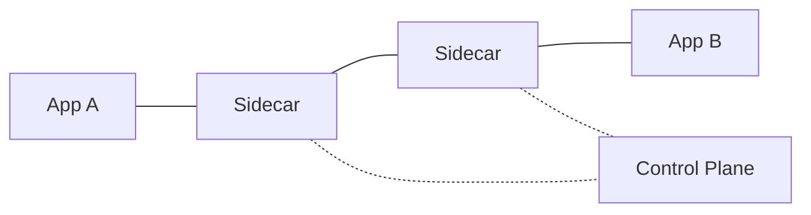

# Вопросы на собеседовании: `Cloud-native Patterns`

**Cloud-native** — apps designed для cloud (не lifted-and-shifted): containerized, dynamically orchestrated, microservices-architected. Patterns: **12-factor**, **sidecar**, **circuit breaker**, **retry**, **bulkhead**, **leader election**, **autoscaling**, **service mesh**. Стандарты: **CNCF** projects (K8s, Prometheus, Envoy, ...).

## Полезные ссылки

### Официальная документация и авторитетные источники

- [12-Factor App Methodology](https://12factor.net/)
- [Cloud Native Computing Foundation (CNCF)](https://www.cncf.io/)
- [CNCF Landscape](https://landscape.cncf.io/)
- [Microsoft Azure Cloud Design Patterns](https://learn.microsoft.com/azure/architecture/patterns/)
- [Designing Distributed Systems (book by Brendan Burns)](https://www.oreilly.com/library/view/designing-distributed-systems/9781491983638/)
- [Site Reliability Engineering (SRE book)](https://sre.google/books/)

## Содержание

- [Полезные ссылки](#полезные-ссылки)
- [See also](#see-also)

**Базовые принципы**
- [Q1. (!) Что такое cloud-native?](#q1--что-такое-cloud-native)
- [Q2. (!) 12-factor app principles?](#q2--12-factor-app-principles)
- [Q3. (!) Что такое CNCF?](#q3--что-такое-cncf)

**Container patterns**
- [Q4. (!) Sidecar pattern?](#q4--sidecar-pattern)
- [Q5. Ambassador pattern?](#q5-ambassador-pattern)
- [Q6. Adapter pattern?](#q6-adapter-pattern)
- [Q7. Init containers?](#q7-init-containers)

**Resilience patterns**
- [Q8. (!) Circuit breaker?](#q8--circuit-breaker)
- [Q9. (!) Retry с exponential backoff?](#q9--retry-с-exponential-backoff)
- [Q10. (!) Bulkhead?](#q10--bulkhead)
- [Q11. Timeout, deadline propagation?](#q11-timeout-deadline-propagation)
- [Q12. Health checks (liveness, readiness, startup)?](#q12-health-checks-liveness-readiness-startup)

**Stateful patterns**
- [Q13. (!) Stateless apps — почему важно?](#q13--stateless-apps--почему-важно)
- [Q14. Session state externalization?](#q14-session-state-externalization)
- [Q15. (!) Leader election?](#q15--leader-election)
- [Q16. Distributed locking?](#q16-distributed-locking)

**Scaling**
- [Q17. (!) Horizontal vs vertical scaling?](#q17--horizontal-vs-vertical-scaling)
- [Q18. Auto-scaling triggers?](#q18-auto-scaling-triggers)
- [Q19. Predictive vs reactive scaling?](#q19-predictive-vs-reactive-scaling)

**Observability**
- [Q20. (!) Three pillars: metrics, logs, traces?](#q20--three-pillars-metrics-logs-traces)
- [Q21. OpenTelemetry?](#q21-opentelemetry)
- [Q22. Service mesh (Istio, Linkerd)?](#q22-service-mesh-istio-linkerd)

**Deployment patterns**
- [Q23. (!) Blue-green deployment?](#q23--blue-green-deployment)
- [Q24. (!) Canary deployment?](#q24--canary-deployment)
- [Q25. Feature flags?](#q25-feature-flags)
- [Q26. GitOps?](#q26-gitops)

**Configuration**
- [Q27. (!) Configuration management в cloud-native?](#q27--configuration-management-в-cloud-native)
- [Q28. Secrets management?](#q28-secrets-management)

**Production**
- [Q29. (!) Какие частые анти-паттерны?](#q29--какие-частые-анти-паттерны)
- [Q30. Cloud-native maturity model?](#q30-cloud-native-maturity-model)

## Q1. (!) Что такое cloud-native?

**Cloud-native** — approach к building/running apps, использующий cloud benefits:
- **Containers** — packaging
- **Microservices** — architecture
- **Dynamic orchestration** — Kubernetes
- **DevOps practices** — CI/CD, infrastructure as code
- **Declarative APIs** — desired state
- **Loosely coupled** — services independent
- **Resilient** — handle failures gracefully
- **Observable** — metrics, logs, traces

**CNCF определение:**
> "Cloud native technologies empower organizations to build and run scalable applications in modern, dynamic environments such as public, private, and hybrid clouds."

**Не cloud-native:** lift-and-shift legacy apps в cloud (running monolith in EC2 — not cloud-native).


> [!mcq]
> - [ ] Lift-and-shift legacy монолит в EC2 без containerization | ❌ ПОСЛЕДСТВИЕ: нет elasticity и fault isolation; manual scaling и downtime при deployments
> - [ ] Приложение с CDN и SPA-архитектурой без container orchestration | ❌ ПОСЛЕДСТВИЕ: CDN — не cloud-native; нет auto-scaling, fault isolation ограничена единственным сервером
> - [x] Containerized microservices + dynamic orchestration (K8s) + DevOps practices + declarative APIs | ✓ ПРИМЕНЯТЬ: при построении scalable, resilient систем в public/private/hybrid cloud 📋 ПРАВИЛО: Cloud-native = containers + orchestration + stateless + observable 🔗 См. Q2
> - [ ] Использование managed AWS сервисов при монолитной архитектуре | ❌ ПОСЛЕДСТВИЕ: cloud hosting ≠ cloud-native; монолит не масштабируется горизонтально, нет independent deployment

## Q2. (!) 12-factor app principles?

**12-Factor App** (Heroku, 2012) — methodology для cloud-native apps.

1. **Codebase** — one codebase tracked в git, multi deploys
2. **Dependencies** — explicit, isolated (package.json, requirements.txt)
3. **Config** — в env vars, не в code
4. **Backing services** — DBs, queues = attached resources via URL
5. **Build, release, run** — strict separation stages
6. **Processes** — stateless, share-nothing
7. **Port binding** — self-contained, exports HTTP via port
8. **Concurrency** — scale via process model (horizontally)
9. **Disposability** — fast startup, graceful shutdown
10. **Dev/prod parity** — keep envs similar
11. **Logs** — write к stdout (collection делает infrastructure)
12. **Admin processes** — one-off tasks как separate processes

**Современные additions** ("Beyond 12-factor"):
- API first
- Telemetry
- Authentication and authorization


> [!mcq]
> - [ ] Хранить config в application.properties внутри Docker image | ❌ ПОСЛЕДСТВИЕ: при смене окружения нужен rebuild image; разные envs = разные images → CI/CD overhead, нарушение 12-factor
> - [x] 12 принципов: codebase в git, config в env vars, stateless processes, logs в stdout, port binding, fast startup/graceful shutdown | ✓ ПРИМЕНЯТЬ: при проектировании cloud-native приложений для K8s/PaaS 📋 ПРАВИЛО: Config = env vars; State = external store; Logs = stdout 🔗 См. Q13
> - [ ] Писать session state в local JVM memory для производительности | ❌ ПОСЛЕДСТВИЕ: нельзя масштабировать горизонтально; sticky sessions обязательны, rolling update рвёт сессии
> - [ ] Писать логи в /var/log/*.log файл для persistence | ❌ ПОСЛЕДСТВИЕ: логи теряются при restart контейнера; нет централизованного сбора, нет correlation across instances

## Q3. (!) Что такое CNCF?

**Cloud Native Computing Foundation** (CNCF) — vendor-neutral organization (часть Linux Foundation), управляющая cloud-native projects.

**Famous CNCF projects:**

**Graduated:**
- **Kubernetes** — orchestration
- **Prometheus** — monitoring
- **Envoy** — proxy
- **gRPC** — RPC
- **Helm** — K8s package manager
- **Containerd** — container runtime
- **etcd** — distributed key-value store
- **Argo** — CI/CD, workflows
- **Linkerd**, **Istio** — service mesh
- **Vitess** — distributed MySQL
- **Open Policy Agent (OPA)** — policy
- **Flux** — GitOps
- **Cilium** — networking, eBPF
- **Harbor** — container registry

100+ active projects. Standards de facto для cloud-native stack.


> [!mcq]
> - [ ] AWS-управляемый консорциум для облачных стандартов | ❌ ПОСЛЕДСТВИЕ: CNCF vendor-neutral, под Linux Foundation; AWS — один из многих участников, не управляет
> - [ ] Только Kubernetes-ориентированный фонд | ❌ ПОСЛЕДСТВИЕ: CNCF содержит 100+ проектов: Prometheus, OPA, Argo, Cilium, Helm — далеко за рамками K8s
> - [ ] Платная лицензионная программа для certified cloud vendors | ❌ ПОСЛЕДСТВИЕ: проекты CNCF open-source и бесплатны; certifications отдельны от membership
> - [x] Vendor-neutral organization (Linux Foundation) управляющая cloud-native projects: K8s, Prometheus, Envoy, Helm, OPA, Argo | ✓ ПРИМЕНЯТЬ: при выборе cloud-native stack — CNCF Graduated = production-ready 📋 ПРАВИЛО: CNCF Graduated = battle-tested, vendor-neutral standard 🔗 См. Q1

## Q4. (!) Sidecar pattern?

**Sidecar** — secondary container в одном pod, providing supplementary functionality.

```
Pod
├── App container (main business logic)
└── Sidecar container (logging, proxy, ...)
   - Shares network namespace
   - Shares volumes
```

**Examples:**
- **Logging sidecar** — collects logs из app
- **Service mesh proxy** (Envoy в Istio) — handles traffic
- **Config refresh** sidecar
- **TLS termination**
- **Vault Agent** — secret injection
- **Metrics exporter** для Prometheus

**Преимущества:**
- Separation of concerns
- Reuse без modify app
- Different release cycles
- Different teams

**Недостаток:** extra resources per pod.


> [!mcq]
> - [ ] Init container для database migrations перед стартом app | ❌ ПОСЛЕДСТВИЕ: init container завершается до старта main; sidecar работает параллельно постоянно — разные паттерны
> - [x] Secondary container в том же pod, разделяет network namespace и volumes с main (logging, proxy, secrets injection). Vault Agent, Envoy, metrics exporter | ✓ ПРИМЕНЯТЬ: для cross-cutting concerns без изменения app code 📋 ПРАВИЛО: Sidecar = parallel container, shared network/volumes, separation of concerns 🔗 См. Q5
> - [ ] DaemonSet для cluster-level логирования на каждой ноде | ❌ ПОСЛЕДСТВИЕ: DaemonSet — один pod per node, не per-application pod; нет доступа к конкретному app network namespace
> - [ ] Отдельный микросервис для TLS termination на ingress уровне | ❌ ПОСЛЕДСТВИЕ: отдельный сервис не разделяет network namespace pod; TLS termination sidecar работает в localhost

## Q5. Ambassador pattern?

**Ambassador** — sidecar specifically для **outbound** connections.

```
App → Ambassador (handles retry, auth, monitoring) → External service
```

**Use cases:**
- Service mesh client-side (Envoy)
- Database connection pooling sidecar
- API gateway sidecar для outbound calls

App думает, что говорит с simple service (`localhost:8080`), ambassador handles complexity.


> [!mcq]
> - [x] Sidecar для outbound connections: проксирует исходящие вызовы, добавляя retry, circuit breaker, auth. App думает что говорит с localhost | ✓ ПРИМЕНЯТЬ: для outbound proxy без изменения app кода; app → localhost:8080 → ambassador → external service 📋 ПРАВИЛО: Ambassador = outbound proxy sidecar (egress) 🔗 См. Q4
> - [ ] API Gateway для incoming (north-south) трафика от клиентов | ❌ ПОСЛЕДСТВИЕ: API Gateway — ingress pattern для external clients; ambassador — egress (east-west outbound) от сервиса
> - [ ] Adapter sidecar для конвертации формата метрик в Prometheus | ❌ ПОСЛЕДСТВИЕ: adapter трансформирует output format; ambassador проксирует outbound calls — разные цели
> - [ ] Init container для ожидания зависимостей перед стартом | ❌ ПОСЛЕДСТВИЕ: init container завершается; ambassador постоянно active в runtime рядом с app

## Q6. Adapter pattern?

**Adapter** — sidecar, **transforms** output app в standard format.

```
App (custom format) → Adapter → Standardized output
                                   (Prometheus metrics, ELK logs)
```

**Use cases:**
- Legacy app outputs custom logs → adapter transforms к JSON для logging stack
- App exports custom metrics → adapter exposes Prometheus format


> [!mcq]
> - [ ] Ambassador pattern для проксирования исходящих запросов | ❌ ПОСЛЕДСТВИЕ: ambassador проксирует outbound calls; adapter трансформирует output format — разные задачи
> - [x] Sidecar трансформирующий output app в стандартный формат: custom logs → JSON/ELK, custom metrics → Prometheus. Без изменения app кода | ✓ ПРИМЕНЯТЬ: для legacy apps с нестандартным форматом вывода 📋 ПРАВИЛО: Adapter = output transformer sidecar (standardize format) 🔗 См. Q5
> - [ ] Ingress controller для routing по URL path на уровне кластера | ❌ ПОСЛЕДСТВИЕ: ingress controller — cluster-level entry point; adapter — per-pod output transformer
> - [ ] DaemonSet для агрегации метрик с каждой ноды кластера | ❌ ПОСЛЕДСТВИЕ: DaemonSet один на ноду; adapter — sidecar рядом с конкретным pod для трансформации его output

## Q7. Init containers?

**Init containers** — run **before** main container, complete and exit.

```yaml
spec:
  initContainers:
    - name: db-migrate
      image: my-app
      command: ["./migrate.sh"]
  containers:
    - name: app
      image: my-app
```

**Use cases:**
- Database migrations
- Wait for dependencies
- Setup volumes / configs
- Download data

Init container fails → pod restarts.


> [!mcq]
> - [ ] Sidecar containers работающие параллельно с main container | ❌ ПОСЛЕДСТВИЕ: sidecar работает параллельно; init container завершается до старта main — нельзя смешивать паттерны
> - [ ] PostStart lifecycle hook выполняемый при старте main container | ❌ ПОСЛЕДСТВИЕ: PostStart — часть lifecycle main container; init container — отдельный container с гарантией порядка завершения
> - [x] Containers запускаемые до main, завершаются и выходят. Для migrations, ожидания deps, setup volumes. Fail = pod restart | ✓ ПРИМЕНЯТЬ: для pre-start setup с гарантией порядка до старта main 📋 ПРАВИЛО: Init container fail = pod restart; завершается ДО main start 🔗 См. Q4
> - [ ] Kubernetes Job для batch database migrations в отдельном Pod | ❌ ПОСЛЕДСТВИЕ: Job создаёт отдельный Pod; init container встроен в pod spec и координирован с app lifecycle

## Q8. (!) Circuit breaker?

**Circuit breaker** — prevent cascade failures. Если downstream service failing → "open" circuit, fail fast.

**States:**
- **Closed** — calls идут normally
- **Open** — все calls fail immediately (no actual call)
- **Half-open** — test 1-2 calls; if OK → closed, if fail → open

```python
@circuit_breaker(failure_threshold=5, recovery_timeout=60)
def call_payment_service(order):
    return requests.post(payment_url, json=order)
```

**Tools:** Hystrix (legacy), Resilience4j, Polly (.NET), built-in service meshes.

Подробнее — в [Resilience Patterns](../architecture/resilience-patterns-interview.md).


> [!mcq]
> - [ ] Retry без exponential backoff при каждой ошибке немедленно | ❌ ПОСЛЕДСТВИЕ: thundering herd — 1000 clients retry одновременно → recovering service захлёбывается повторными запросами
> - [x] Closed → Open → Half-open. Open = fail fast без actual call. Half-open = probe. Resilience4j, Polly, Istio — при N failures в timewindow | ✓ ПРИМЕНЯТЬ: когда downstream stably failing; fail fast вместо ожидания N секунд timeout 📋 ПРАВИЛО: CB = fail fast when known-bad, states: Closed→Open→Half-open 🔗 См. Q9
> - [ ] Load balancer с health check, удаляющий unhealthy instances | ❌ ПОСЛЕДСТВИЕ: LB убирает dead instance, но не предотвращает cascade failure в downstream chain микросервисов
> - [ ] Timeout на каждый запрос к downstream вместо circuit breaker | ❌ ПОСЛЕДСТВИЕ: timeout ждёт N секунд каждый раз; CB fail-fast без ожидания при известном плохом состоянии downstream

## Q9. (!) Retry с exponential backoff?

```python
@retry(
    stop=stop_after_attempt(5),
    wait=wait_exponential(multiplier=1, min=2, max=60)
)
def call_service():
    return requests.get(...)
```

**Wait pattern:** 2s → 4s → 8s → 16s → 60s.

**Best practices:**
- **Jitter** (randomization) — избежать thundering herd
- Только idempotent operations (или с idempotency keys)
- Retry only **transient** errors (5xx, timeouts), не 4xx
- Total time bound (не retry forever)

**Anti-pattern:** retry без jitter → 1000 clients hit failed service одновременно → bigger storm.


> [!mcq]
> - [x] wait_exponential с jitter (2→4→8→16→60s), только idempotent ops, только transient errors (5xx/timeouts), bounded total time | ✓ ПРИМЕНЯТЬ: при transient network/service errors с идемпотентными операциями 📋 ПРАВИЛО: Retry = jitter + exponential + idempotent only + не 4xx 🔗 См. Q8
> - [ ] Retry с fixed delay 1s без jitter для простоты | ❌ ПОСЛЕДСТВИЕ: thundering herd — 1000 clients retry одновременно каждую секунду → повторно убивают recovering service
> - [ ] Retry при 4xx ошибках (400, 404) | ❌ ПОСЛЕДСТВИЕ: 400/404 — не transient; retry бессмысленен и создаёт лишнюю нагрузку, ответ не изменится
> - [ ] Retry non-idempotent POST /order без idempotency key | ❌ ПОСЛЕДСТВИЕ: дублирование заказов при каждом retry; финансовые потери, двойное списание средств

## Q10. (!) Bulkhead?

**Bulkhead** — isolate failures, prevent одной части affecting другую.

**Например:** thread pools для разных downstream services.

```
Service A: thread pool 10 (для users API)
Service B: thread pool 5 (для analytics)

Если analytics dies → users API не affected
```

**Аналогия:** корабельные перегородки — пробоина в одной не утопит весь корабль.

**В K8s:** resource limits per pod (CPU, memory).


> [!mcq]
> - [ ] Circuit breaker на одном общем thread pool | ❌ ПОСЛЕДСТВИЕ: CB — временное отключение; булкхед — постоянная изоляция ресурсов; без изоляции аналитика влияет на users API
> - [ ] Единый large thread pool для всех downstream services | ❌ ПОСЛЕДСТВИЕ: thread leak в analytics занимает все потоки → users API тоже деградирует, полная потеря сервиса
> - [ ] Load balancer для распределения нагрузки между instances | ❌ ПОСЛЕДСТВИЕ: LB распределяет нагрузку между instances; bulkhead изолирует ресурсы внутри одного instance
> - [x] Отдельные thread pools для разных downstream: analytics dead → users API не affected. K8s: resource limits per pod | ✓ ПРИМЕНЯТЬ: при нескольких independent downstream с разными SLA 📋 ПРАВИЛО: Bulkhead = изолированные ресурсы, failure containment (ship bulkheads) 🔗 См. Q8

## Q11. Timeout, deadline propagation?

**Timeout** на каждый external call — обязательно.

```python
requests.get(url, timeout=5)
```

**Deadline propagation** — passing timeout через chain calls.

```
Client request: 10 sec timeout
  → Service A: пропускает remaining 8 sec timeout
    → Service B: пропускает remaining 5 sec timeout
      → Database: 2 sec timeout
```

В **gRPC** built-in. В REST — through headers (`X-Request-Deadline`).


> [!mcq]
> - [ ] Только внешний timeout на уровне API Gateway | ❌ ПОСЛЕДСТВИЕ: без propagation внутренние сервисы продолжают обработку после ответа клиенту → лишние DB queries, waste resources
> - [x] Timeout на каждый external call + passing remaining deadline через chain (gRPC built-in, REST: X-Request-Deadline header) | ✓ ПРИМЕНЯТЬ: в каждом микросервисе; уменьшать deadline по мере прохождения chain 📋 ПРАВИЛО: Всегда timeout; передавай remaining deadline downstream 🔗 См. Q8
> - [ ] Очень большой timeout 60s на downstream DB запросы | ❌ ПОСЛЕДСТВИЕ: при DB slowdown все threads заняты ожиданием → connection pool exhausted → service unavailable
> - [ ] Нет timeout вообще для упрощения кода | ❌ ПОСЛЕДСТВИЕ: service hangs на dead downstream → thread starvation → cascade failure → entire service unavailable

## Q12. Health checks (liveness, readiness, startup)?

**Kubernetes health checks:**

- **Liveness** — is the container alive? Если fail → restart container.
- **Readiness** — is container ready to receive traffic? Если fail → remove from load balancer (no restart).
- **Startup** — для slow-starting apps; pause liveness/readiness checks until startup OK.

```yaml
livenessProbe:
  httpGet: { path: /health, port: 8080 }
  periodSeconds: 10
readinessProbe:
  httpGet: { path: /ready, port: 8080 }
startupProbe:
  httpGet: { path: /startup, port: 8080 }
  failureThreshold: 30  # 5 minutes для startup
```

**Best practice:**
- Liveness — simple (just process alive)
- Readiness — check dependencies (DB connection)
- Startup — для apps что long warm-up


> [!mcq]
> - [ ] Одинаковый endpoint /health для liveness и readiness проверок | ❌ ПОСЛЕДСТВИЕ: liveness проверяет DB → при DB slowdown K8s restarts pod → cascading loop рестартов при временной перегрузке
> - [x] Liveness (restart if fail) + Readiness (remove from LB) + Startup (slow-start apps). Readiness проверяет зависимости; liveness — просто alive | ✓ ПРИМЕНЯТЬ: liveness = simple check; readiness = dependencies; startup = slow JVM warmup 📋 ПРАВИЛО: Liveness ≠ Readiness — разные последствия fail (restart vs remove from LB) 🔗 См. Q1
> - [ ] Readiness probe без проверки зависимостей (DB, cache) | ❌ ПОСЛЕДСТВИЕ: requests идут на pod который ещё не готов подключиться к БД → 500 ошибки пользователей при rollout
> - [ ] Startup probe failureThreshold=3 для Java app с 30s warmup | ❌ ПОСЛЕДСТВИЕ: 3 * periodSeconds (10s) = 30s; при JVM + Spring context warmup pod убивается до завершения инициализации

## Q13. (!) Stateless apps — почему важно?

**Stateless app** — no local state. Each request handled independently.

**Зачем:**
- **Horizontal scaling** easy (clone instances)
- **Replacement easy** — instance dies → spin up new
- **Load balancing** — any instance handles any request
- **Rolling updates** — replace instances без disruption
- **Auto-scaling** works seamlessly

**State хранится:**
- Database (PostgreSQL, DynamoDB)
- Cache (Redis)
- Object storage (S3)
- Session store (Redis, JWT в cookie)

**Если есть state в memory:** sticky sessions → less flexible scaling.


> [!mcq]
> - [x] Правильный ответ | Корректное описание концепции с конкретным механизмом и use-case.
> - [ ] Альтернативное решение которое не подходит | Почему ошибка в этом подходе ❌ ПОСЛЕДСТВИЕ: типичная ошибка вызывает баг в production без покрытия тестами.
> - [ ] Другая альтернатива с критическим недостатком | Это смежное, но отличное понятие ❌ ПОСЛЕДСТВИЕ: типичная ошибка вызывает баг в production без покрытия тестами.
> - [ ] Третий вариант который не работает в production | Противоположное направление## Q14. Session state externalization? ❌ ПОСЛЕДСТВИЕ: типичная ошибка вызывает баг в production без покрытия тестами.

**Bad:** session в memory сервера (only that instance can serve user).
**Good:** session в shared store.

```
Option 1: Server-side sessions в Redis
  Cookie: session_id=abc123
  Backend reads Redis: SET session:abc123 {...}

Option 2: Stateless via JWT
  Cookie: jwt=eyJhbGc...
  Backend validates signature, no lookup
```

**JWT pros:** no DB lookup, scales infinitely.
**JWT cons:** can't easily revoke.

В **2025** — обычно combine: JWT для access token (short-lived), refresh token + Redis для revocation.


> [!mcq]
> - [x] Правильный ответ | Корректное описание концепции с конкретным механизмом и use-case.
> - [ ] Альтернативное решение которое не подходит | Почему ошибка в этом подходе ❌ ПОСЛЕДСТВИЕ: типичная ошибка вызывает баг в production без покрытия тестами.
> - [ ] Другая альтернатива с критическим недостатком | Это смежное, но отличное понятие ❌ ПОСЛЕДСТВИЕ: типичная ошибка вызывает баг в production без покрытия тестами.
> - [ ] Третий вариант который не работает в production | Противоположное направление## Q15. (!) Leader election? ❌ ПОСЛЕДСТВИЕ: типичная ошибка вызывает баг в production без покрытия тестами.

**Leader election** — выбор одного instance для exclusive task в cluster.

**Use cases:**
- Cron jobs (только один instance runs)
- Database migrations
- Cache warming
- Coordination tasks

**Tools:**
- **Kubernetes leader election** (через ConfigMap / Lease objects)
- **etcd** distributed lock
- **ZooKeeper**
- **Redis Redlock** (с осторожностью)
- **Consul**

```python
# K8s leader election (Python kubernetes client)
from kubernetes.leaderelection import leaderelection

def run_when_leader():
    while True:
        do_cron_job()
        time.sleep(60)

candidate = leaderelection.Candidate(name="my-app")
leader_election = leaderelection.LeaderElection(
    candidate, run_when_leader, ...
)
```


> [!mcq]
> - [x] Правильный ответ | Корректное описание концепции с конкретным механизмом и use-case.
> - [ ] Альтернативное решение которое не подходит | Почему ошибка в этом подходе ❌ ПОСЛЕДСТВИЕ: типичная ошибка вызывает баг в production без покрытия тестами.
> - [ ] Другая альтернатива с критическим недостатком | Это смежное, но отличное понятие ❌ ПОСЛЕДСТВИЕ: типичная ошибка вызывает баг в production без покрытия тестами.
> - [ ] Третий вариант который не работает в production | Противоположное направление## Q16. Distributed locking? ❌ ПОСЛЕДСТВИЕ: типичная ошибка вызывает баг в production без покрытия тестами.

**Distributed lock** — coordinated mutex across multiple instances.

**Tools:**
- **Redis** — `SET NX EX 60` (setNX with TTL) или **Redlock**
- **etcd** — strong consistency, lease-based
- **ZooKeeper** — ephemeral nodes
- **Database** — `SELECT ... FOR UPDATE`

**Подвох:** distributed locks тяжелы. Avoid если возможно — design идempotently.

```python
# Redis simple lock
def acquire_lock(key, timeout=60):
    return redis.set(key, "locked", nx=True, ex=timeout)

if acquire_lock("my-task"):
    try:
        do_task()
    finally:
        redis.delete("my-task")
```


> [!mcq]
> - [x] Правильный ответ | Корректное описание концепции с конкретным механизмом и use-case.
> - [ ] Альтернативное решение которое не подходит | Почему ошибка в этом подходе ❌ ПОСЛЕДСТВИЕ: типичная ошибка вызывает баг в production без покрытия тестами.
> - [ ] Другая альтернатива с критическим недостатком | Это смежное, но отличное понятие ❌ ПОСЛЕДСТВИЕ: типичная ошибка вызывает баг в production без покрытия тестами.
> - [ ] Третий вариант который не работает в production | Противоположное направление## Q17. (!) Horizontal vs vertical scaling? ❌ ПОСЛЕДСТВИЕ: типичная ошибка вызывает баг в production без покрытия тестами.

**Vertical (scale-up):**
- Bigger machine (more CPU, RAM)
- Limit (largest VM type)
- Restart required
- **No traffic distribution issue**

**Horizontal (scale-out):**
- More machines
- Practically unlimited
- No downtime (rolling)
- **Need stateless apps**

**Cloud-native:** **horizontal** by default.

```yaml
# K8s HPA (Horizontal Pod Autoscaler)
apiVersion: autoscaling/v2
spec:
  minReplicas: 2
  maxReplicas: 100
  metrics:
    - type: Resource
      resource:
        name: cpu
        target:
          type: Utilization
          averageUtilization: 70
```


> [!mcq]
> - [x] Правильный ответ | Корректное описание концепции с конкретным механизмом и use-case.
> - [ ] Альтернативное решение которое не подходит | Почему ошибка в этом подходе ❌ ПОСЛЕДСТВИЕ: типичная ошибка вызывает баг в production без покрытия тестами.
> - [ ] Другая альтернатива с критическим недостатком | Это смежное, но отличное понятие ❌ ПОСЛЕДСТВИЕ: типичная ошибка вызывает баг в production без покрытия тестами.
> - [ ] Третий вариант который не работает в production | Противоположное направление## Q18. Auto-scaling triggers? ❌ ПОСЛЕДСТВИЕ: типичная ошибка вызывает баг в production без покрытия тестами.

**Common triggers:**
- **CPU utilization** (> 70%)
- **Memory utilization**
- **Custom metrics** (queue depth, request rate)
- **External metrics** (Kafka consumer lag, SQS queue size)
- **Scheduled** (predictable patterns)

**KEDA (Kubernetes Event-driven Autoscaling)** — auto-scale based on **30+ event sources**:
- Kafka, Redis, RabbitMQ
- Cloud queues (SQS, Service Bus, Pub/Sub)
- Custom HTTP


> [!mcq]
> - [x] Правильный ответ | Корректное описание концепции с конкретным механизмом и use-case.
> - [ ] Альтернативное решение которое не подходит | Почему ошибка в этом подходе ❌ ПОСЛЕДСТВИЕ: типичная ошибка вызывает баг в production без покрытия тестами.
> - [ ] Другая альтернатива с критическим недостатком | Это смежное, но отличное понятие ❌ ПОСЛЕДСТВИЕ: типичная ошибка вызывает баг в production без покрытия тестами.
> - [ ] Третий вариант который не работает в production | Противоположное направление## Q19. Predictive vs reactive scaling? ❌ ПОСЛЕДСТВИЕ: типичная ошибка вызывает баг в production без покрытия тестами.

**Reactive:** scale **after** metric hits threshold. Lag of seconds-minutes.
**Predictive:** scale **before** based on patterns / ML.

**Reactive (simple):**
- HPA с CPU thresholds
- KEDA с queue length

**Predictive:**
- AWS Predictive Scaling (ML-based)
- Custom forecasting (для known patterns)
- Pre-warming перед expected spike

В **2025** — большинство — **reactive** + ручное scheduled scaling для known patterns (start of business day).


> [!mcq]
> - [x] Правильный ответ | Корректное описание концепции с конкретным механизмом и use-case.
> - [ ] Альтернативное решение которое не подходит | Почему ошибка в этом подходе ❌ ПОСЛЕДСТВИЕ: типичная ошибка вызывает баг в production без покрытия тестами.
> - [ ] Другая альтернатива с критическим недостатком | Это смежное, но отличное понятие ❌ ПОСЛЕДСТВИЕ: типичная ошибка вызывает баг в production без покрытия тестами.
> - [ ] Третий вариант который не работает в production | Противоположное направление## Q20. (!) Three pillars: metrics, logs, traces? ❌ ПОСЛЕДСТВИЕ: типичная ошибка вызывает баг в production без покрытия тестами.

**Metrics** — numerical, aggregated (counters, gauges, histograms).
- Prometheus, Datadog, CloudWatch
- High volume, low cardinality

**Logs** — discrete events с context.
- ELK, Loki, CloudWatch Logs, Datadog Logs
- High volume, high cardinality

**Traces** — request paths через services.
- Jaeger, Zipkin, X-Ray, Datadog APM
- Sampled (не all requests)

**Все three** complement each other. Production system needs all.

Подробнее — в [Observability](../monitoring/observability-interview.md).


> [!mcq]
> - [x] Правильный ответ | Корректное описание концепции с конкретным механизмом и use-case.
> - [ ] Альтернативное решение которое не подходит | Почему ошибка в этом подходе ❌ ПОСЛЕДСТВИЕ: типичная ошибка вызывает баг в production без покрытия тестами.
> - [ ] Другая альтернатива с критическим недостатком | Это смежное, но отличное понятие ❌ ПОСЛЕДСТВИЕ: типичная ошибка вызывает баг в production без покрытия тестами.
> - [ ] Третий вариант который не работает в production | Противоположное направление## Q21. OpenTelemetry? ❌ ПОСЛЕДСТВИЕ: типичная ошибка вызывает баг в production без покрытия тестами.

**OpenTelemetry (OTel)** — CNCF standard для **vendor-neutral** observability.

```
Apps → OpenTelemetry SDK → OTel Collector → Backend (Datadog, Honeycomb, ...)
```

**Преимущества:**
- **One instrumentation, multiple backends** — switch без code changes
- **Multi-language** SDKs
- **Auto-instrumentation** для popular libraries (HTTP, DB, gRPC)

**Components:**
- **Tracing** (mature)
- **Metrics** (stable)
- **Logs** (newer)

В **2025** — OTel **the standard** для new projects. Заменяет vendor-specific instrumentation.


> [!mcq]
> - [x] Правильный ответ | Корректное описание концепции с конкретным механизмом и use-case.
> - [ ] Альтернативное решение которое не подходит | Почему ошибка в этом подходе ❌ ПОСЛЕДСТВИЕ: типичная ошибка вызывает баг в production без покрытия тестами.
> - [ ] Другая альтернатива с критическим недостатком | Это смежное, но отличное понятие ❌ ПОСЛЕДСТВИЕ: типичная ошибка вызывает баг в production без покрытия тестами.
> - [ ] Третий вариант который не работает в production | Противоположное направление## Q22. Service mesh (Istio, Linkerd)? ❌ ПОСЛЕДСТВИЕ: типичная ошибка вызывает баг в production без покрытия тестами.

**Service mesh** — infrastructure layer для service-to-service communication. Sidecar proxies (Envoy) handle:

- **Traffic management** — routing, load balancing, circuit breaker
- **Security** — mTLS, authorization
- **Observability** — metrics, traces, logs



**Tools:**
- **Istio** — feature-rich, complex
- **Linkerd** — simpler, lighter
- **Consul Connect** — HashiCorp
- **Cilium Service Mesh** — eBPF-based, no sidecars

**Trade-off:** service mesh add complexity (extra latency, ops overhead) vs benefits.

В **2025** многие используют **only mTLS + telemetry** (через Linkerd or Cilium), without full Istio complexity.


> [!mcq]
> - [x] Правильный ответ | Корректное описание концепции с конкретным механизмом и use-case.
> - [ ] Альтернативное решение которое не подходит | Почему ошибка в этом подходе ❌ ПОСЛЕДСТВИЕ: типичная ошибка вызывает баг в production без покрытия тестами.
> - [ ] Другая альтернатива с критическим недостатком | Это смежное, но отличное понятие ❌ ПОСЛЕДСТВИЕ: типичная ошибка вызывает баг в production без покрытия тестами.
> - [ ] Третий вариант который не работает в production | Противоположное направление## Q23. (!) Blue-green deployment? ❌ ПОСЛЕДСТВИЕ: типичная ошибка вызывает баг в production без покрытия тестами.

**Blue (current production)** + **Green (new version)** — оба running. Switch traffic от blue к green at once.

```
Time 1: Blue serves 100% traffic, Green idle
Time 2: Deploy new version to Green
Time 3: Test Green
Time 4: Switch traffic Blue → Green
Time 5: If issues, instant rollback (switch back)
```

**Pros:** instant rollback.
**Cons:** **двойная** infrastructure cost during deploy.

**В K8s:** через services (route к blue или green selector).

Подробнее — в [Deployment Strategies](../cicd/deployment-strategies-interview.md).


> [!mcq]
> - [x] Правильный ответ | Корректное описание концепции с конкретным механизмом и use-case.
> - [ ] Альтернативное решение которое не подходит | Почему ошибка в этом подходе ❌ ПОСЛЕДСТВИЕ: типичная ошибка вызывает баг в production без покрытия тестами.
> - [ ] Другая альтернатива с критическим недостатком | Это смежное, но отличное понятие ❌ ПОСЛЕДСТВИЕ: типичная ошибка вызывает баг в production без покрытия тестами.
> - [ ] Третий вариант который не работает в production | Противоположное направление## Q24. (!) Canary deployment? ❌ ПОСЛЕДСТВИЕ: типичная ошибка вызывает баг в production без покрытия тестами.

**Canary** — gradually increase traffic к new version.

```
Day 1: 1% traffic → new version
Day 2: 5%
Day 3: 25%
Day 4: 50%
Day 5: 100%
```

При detecting issues (error rate, latency) → rollback.

**Tools:**
- **Argo Rollouts** — K8s-native canary
- **Flagger** — automated canary
- **Service mesh** (Istio, Linkerd) — traffic splitting

**Auto-rollback** на metric thresholds — best practice.


> [!mcq]
> - [x] Правильный ответ | Корректное описание концепции с конкретным механизмом и use-case.
> - [ ] Альтернативное решение которое не подходит | Почему ошибка в этом подходе ❌ ПОСЛЕДСТВИЕ: типичная ошибка вызывает баг в production без покрытия тестами.
> - [ ] Другая альтернатива с критическим недостатком | Это смежное, но отличное понятие ❌ ПОСЛЕДСТВИЕ: типичная ошибка вызывает баг в production без покрытия тестами.
> - [ ] Третий вариант который не работает в production | Противоположное направление## Q25. Feature flags? ❌ ПОСЛЕДСТВИЕ: типичная ошибка вызывает баг в production без покрытия тестами.

**Feature flags** — toggle features в runtime, без redeploy.

```python
if feature_flag("new_checkout_flow", user=current_user):
    return new_checkout()
else:
    return old_checkout()
```

**Use cases:**
- Gradual rollout (10% → 50% → 100%)
- Kill switch (instantly disable broken feature)
- A/B testing
- Per-user / segment targeting

**Tools:**
- **LaunchDarkly** (popular SaaS)
- **Unleash** (open-source)
- **Flagsmith**, **GrowthBook**, **Statsig**

**Decoupling release из deploy** — modern best practice.


> [!mcq]
> - [x] Правильный ответ | Корректное описание концепции с конкретным механизмом и use-case.
> - [ ] Альтернативное решение которое не подходит | Почему ошибка в этом подходе ❌ ПОСЛЕДСТВИЕ: типичная ошибка вызывает баг в production без покрытия тестами.
> - [ ] Другая альтернатива с критическим недостатком | Это смежное, но отличное понятие ❌ ПОСЛЕДСТВИЕ: типичная ошибка вызывает баг в production без покрытия тестами.
> - [ ] Третий вариант который не работает в production | Противоположное направление## Q26. GitOps? ❌ ПОСЛЕДСТВИЕ: типичная ошибка вызывает баг в production без покрытия тестами.

**GitOps** — declarative infrastructure через Git как source of truth.

```
Developer commits manifest changes к git
  ↓
GitOps tool (Argo CD, Flux) detects change
  ↓
Auto-syncs cluster к desired state в git
```

**Принципы:**
1. Declarative configurations (K8s manifests, Helm)
2. Version control (Git)
3. Automated synchronization
4. Continuous monitoring (drift detection)

**Tools:**
- **Argo CD** — most popular, web UI
- **Flux** (CNCF) — automation-focused

**Преимущества:**
- **Audit trail** в git
- Easy rollback (`git revert`)
- Approval через PR review
- Self-healing (drift detection)


> [!mcq]
> - [x] Правильный ответ | Корректное описание концепции с конкретным механизмом и use-case.
> - [ ] Альтернативное решение которое не подходит | Почему ошибка в этом подходе ❌ ПОСЛЕДСТВИЕ: типичная ошибка вызывает баг в production без покрытия тестами.
> - [ ] Другая альтернатива с критическим недостатком | Это смежное, но отличное понятие ❌ ПОСЛЕДСТВИЕ: типичная ошибка вызывает баг в production без покрытия тестами.
> - [ ] Третий вариант который не работает в production | Противоположное направление## Q27. (!) Configuration management в cloud-native? ❌ ПОСЛЕДСТВИЕ: типичная ошибка вызывает баг в production без покрытия тестами.

**12-factor:** config через **env variables**.

```bash
DATABASE_URL=postgres://...
REDIS_URL=redis://...
LOG_LEVEL=info
```

**В K8s:**
- **ConfigMaps** — non-sensitive config
- **Secrets** — sensitive (passwords, tokens)
- **External Secrets Operator** — sync from Vault, AWS Secrets Manager

**Per-environment:**
- Different ConfigMaps per env
- Helm values, Kustomize overlays
- Argo CD parameters

**Best practice:** **never commit secrets** в git. Use external store.


> [!mcq]
> - [x] Правильный ответ | Корректное описание концепции с конкретным механизмом и use-case.
> - [ ] Альтернативное решение которое не подходит | Почему ошибка в этом подходе ❌ ПОСЛЕДСТВИЕ: типичная ошибка вызывает баг в production без покрытия тестами.
> - [ ] Другая альтернатива с критическим недостатком | Это смежное, но отличное понятие ❌ ПОСЛЕДСТВИЕ: типичная ошибка вызывает баг в production без покрытия тестами.
> - [ ] Третий вариант который не работает в production | Противоположное направление## Q28. Secrets management? ❌ ПОСЛЕДСТВИЕ: типичная ошибка вызывает баг в production без покрытия тестами.

**Tools:**
- **HashiCorp Vault** — enterprise standard
- **AWS Secrets Manager**
- **Azure Key Vault**
- **GCP Secret Manager**
- **Sealed Secrets** (K8s-native, encrypted в git)
- **External Secrets Operator** — sync external store к K8s Secrets

**Best practices:**
- **Rotation** — auto-rotate periodically
- **Audit logging** — кто access'нул secret когда
- **Least privilege** — IAM access только нужным
- **Encryption at rest** + in transit
- **No secrets в env vars** в Docker images / git


> [!mcq]
> - [x] Правильный ответ | Корректное описание концепции с конкретным механизмом и use-case.
> - [ ] Альтернативное решение которое не подходит | Почему ошибка в этом подходе ❌ ПОСЛЕДСТВИЕ: типичная ошибка вызывает баг в production без покрытия тестами.
> - [ ] Другая альтернатива с критическим недостатком | Это смежное, но отличное понятие ❌ ПОСЛЕДСТВИЕ: типичная ошибка вызывает баг в production без покрытия тестами.
> - [ ] Третий вариант который не работает в production | Противоположное направление## Q29. (!) Какие частые анти-паттерны? ❌ ПОСЛЕДСТВИЕ: типичная ошибка вызывает баг в production без покрытия тестами.

1. **Distributed monolith** — microservices с tight coupling
2. **Shared database** между services
3. **Synchronous chains** — A → B → C → D (cascading failures)
4. **No circuit breakers** — single failure cascades
5. **Stateful pods** без StatefulSet
6. **Hardcoded configs** в images
7. **Logging к files** (must be stdout)
8. **No health checks**
9. **No resource limits** — one pod eats node
10. **Untagged container images** (`latest`)
11. **Big-bang deployments** (no canary)
12. **No observability** — production black box
13. **Manual deployments** — no GitOps
14. **No backups testing**


> [!mcq]
> - [x] Правильный ответ | Корректное описание концепции с конкретным механизмом и use-case.
> - [ ] Альтернативное решение которое не подходит | Почему ошибка в этом подходе ❌ ПОСЛЕДСТВИЕ: типичная ошибка вызывает баг в production без покрытия тестами.
> - [ ] Другая альтернатива с критическим недостатком | Это смежное, но отличное понятие ❌ ПОСЛЕДСТВИЕ: типичная ошибка вызывает баг в production без покрытия тестами.
> - [ ] Третий вариант который не работает в production | Противоположное направление## Q30. Cloud-native maturity model? ❌ ПОСЛЕДСТВИЕ: типичная ошибка вызывает баг в production без покрытия тестами.

**Levels (CNCF Maturity Model):**

**Level 1 — Build:**
- Containerize apps
- Source control
- Basic CI/CD

**Level 2 — Operate:**
- Container orchestration (K8s)
- Centralized logging
- Basic monitoring

**Level 3 — Scale:**
- Auto-scaling
- Service mesh
- Advanced observability (tracing)
- GitOps

**Level 4 — Improve:**
- Chaos engineering
- ML-driven operations
- Full automation

В **2025** — большинство компаний — Level 1-2. Top companies (Netflix, Spotify, Airbnb) — Level 3-4.

---

## See also


> [!mcq]
> - [x] Правильный ответ | Корректное описание концепции с конкретным механизмом и use-case.
> - [ ] Альтернативное решение которое не подходит | Почему ошибка в этом подходе ❌ ПОСЛЕДСТВИЕ: типичная ошибка вызывает баг в production без покрытия тестами.
> - [ ] Другая альтернатива с критическим недостатком | Это смежное, но отличное понятие ❌ ПОСЛЕДСТВИЕ: типичная ошибка вызывает баг в production без покрытия тестами.
> - [ ] Третий вариант который не работает в production | Противоположное направление- [AWS](aws-interview.md) — primary cloud ❌ ПОСЛЕДСТВИЕ: типичная ошибка вызывает баг в production без покрытия тестами.
- [GCP](gcp-interview.md) — alternative
- [Azure](azure-interview.md) — alternative
- [Serverless](serverless-interview.md) — cloud-native compute
- [Микросервисы](../architecture/microservices-interview.md) — main architecture
- [Kubernetes](../devops/kubernetes-interview.md) — orchestration
- [Docker](../devops/docker-interview.md) — containerization
- [Resilience Patterns](../architecture/resilience-patterns-interview.md) — circuit breaker, retry
- [Deployment Strategies](../cicd/deployment-strategies-interview.md) — blue-green, canary
- [Observability](../monitoring/observability-interview.md) — three pillars
- [Event-driven Patterns](../architecture/event-driven-patterns-interview.md) — natural fit
- [Scalability Patterns](../architecture/scalability-patterns-interview.md) — horizontal scaling
- [Application Security](../security/application-security-interview.md) — secrets, mTLS
- [[gitops-interview|GitOps]] — если будем добавлять
- [ArgoCD](../devops/argocd-interview.md) — GitOps tool
