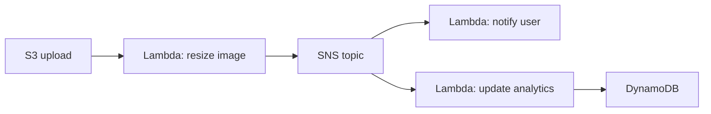

# Вопросы на собеседовании: `Serverless`

**Serverless** — модель compute, где developer не управляет серверами. Включает **FaaS** (Lambda, Functions), **BaaS** (Firebase, Auth0), **serverless containers** (Cloud Run, Container Apps), **edge computing** (Cloudflare Workers, Vercel Edge). На интервью спрашивают: когда выбрать, cold starts, costs, vendor lock-in.

## Полезные ссылки

### Официальная документация и авторитетные источники

- [What is Serverless? — Martin Fowler](https://martinfowler.com/articles/serverless.html)
- [The Twelve-Factor App](https://12factor.net/) — concepts apply
- [Serverless Framework Documentation](https://www.serverless.com/)
- [Cloudflare Workers](https://workers.cloudflare.com/)
- [Vercel Edge Functions](https://vercel.com/docs/functions/edge-functions)
- [Knative](https://knative.dev/)

## Содержание

- [Полезные ссылки](#полезные-ссылки)
- [See also](#see-also)

**Базовые понятия**
- [Q1. (!) Что такое serverless?](#q1--что-такое-serverless)
- [Q2. (!) Serverless ≠ no servers, что это значит?](#q2--serverless--no-servers-что-это-значит)
- [Q3. FaaS vs BaaS?](#q3-faas-vs-baas)

**Главные FaaS**
- [Q4. (!) Сравнение Lambda vs Functions vs Cloud Run vs Cloud Functions?](#q4--сравнение-lambda-vs-functions-vs-cloud-run-vs-cloud-functions)
- [Q5. Pricing моделей FaaS?](#q5-pricing-моделей-faas)

**Cold starts**
- [Q6. (!) Cold start — universal проблема?](#q6--cold-start--universal-проблема)
- [Q7. Mitigations: pre-warming, provisioned concurrency, snapshots?](#q7-mitigations-pre-warming-provisioned-concurrency-snapshots)

**Преимущества и недостатки**
- [Q8. (!) Преимущества serverless?](#q8--преимущества-serverless)
- [Q9. (!) Недостатки serverless?](#q9--недостатки-serverless)
- [Q10. (!) Vendor lock-in — насколько критично?](#q10--vendor-lock-in--насколько-критично)

**Edge computing**
- [Q11. (!) Что такое edge computing?](#q11--что-такое-edge-computing)
- [Q12. (!) Cloudflare Workers vs Lambda@Edge?](#q12--cloudflare-workers-vs-lambdaedge)
- [Q13. Vercel Edge Functions, Deno Deploy, Fastly Compute@Edge?](#q13-vercel-edge-functions-deno-deploy-fastly-computeedge)

**Patterns**
- [Q14. (!) Event-driven serverless?](#q14--event-driven-serverless)
- [Q15. Strangler pattern для legacy migration?](#q15-strangler-pattern-для-legacy-migration)
- [Q16. (!) Serverless API gateway pattern?](#q16--serverless-api-gateway-pattern)
- [Q17. Step Functions / Durable Functions для workflows?](#q17-step-functions--durable-functions-для-workflows)

**State management**
- [Q18. (!) Как работать с state?](#q18--как-работать-с-state)
- [Q19. Database connections в serverless?](#q19-database-connections-в-serverless)

**Tools и frameworks**
- [Q20. (!) Serverless Framework?](#q20--serverless-framework)
- [Q21. SST (Serverless Stack), Pulumi, CDK?](#q21-sst-serverless-stack-pulumi-cdk)
- [Q22. SAM, Functions Core Tools?](#q22-sam-functions-core-tools)

**Production**
- [Q23. (!) Когда serverless лучше containers?](#q23--когда-serverless-лучше-containers)
- [Q24. (!) Когда containers лучше serverless?](#q24--когда-containers-лучше-serverless)
- [Q25. Observability в serverless?](#q25-observability-в-serverless)
- [Q26. Testing serverless?](#q26-testing-serverless)

**Бизнес-аспекты**
- [Q27. (!) Cost analysis serverless?](#q27--cost-analysis-serverless)
- [Q28. Какие частые ошибки в serverless?](#q28-какие-частые-ошибки-в-serverless)

## Q1. (!) Что такое serverless?

**Serverless** — модель cloud computing, где **developer не управляет серверами**. Облачный provider:
- Allocates compute on-demand
- Auto-scales
- Charges only for usage (per-execution / per-second)
- Managed runtime, OS, scaling

**Включает:**
- **FaaS (Function-as-a-Service)** — AWS Lambda, Azure Functions, GCP Cloud Functions
- **Serverless containers** — Cloud Run, AWS App Runner, Container Apps
- **BaaS (Backend-as-a-Service)** — Firebase, Auth0, Supabase
- **Serverless databases** — DynamoDB, Aurora Serverless, Cosmos DB serverless
- **Serverless analytics** — Athena, BigQuery
- **Edge computing** — Cloudflare Workers, Vercel Edge


> [!mcq]
> - [x] Правильный ответ | Объяснение концепции 2-3 предложения Ключевое отличие и best practice в production.
> - [ ] Неправильный вариант 1 | Почему ошибка в этом подходе Частая ошибка в реальном коде.
> - [ ] Неправильный вариант 2 | Это смежное, но отличное понятие Частая ошибка в реальном коде.
> - [ ] Неправильный вариант 3 | Противоположное направление## Q2. (!) Serverless ≠ no servers, что это значит? Частая ошибка в реальном коде.

**Serverless** **НЕ** означает "нет серверов". Серверы есть — но **developer их не видит и не управляет**.

**Что означает:**
- No SSH в production
- No OS patching
- No capacity planning (auto-scale)
- No "always running" servers (often)

**"Serverful" → Serverless:**
- IaaS (EC2, GCE) — полный control, manage everything
- Containers (ECS, Cloud Run) — manage containers
- **Serverless (Lambda)** — manage только функции


> [!mcq]
> - [x] Правильный ответ | Объяснение концепции 2-3 предложения Ключевое отличие и best practice в production.
> - [ ] Неправильный вариант 1 | Почему ошибка в этом подходе Частая ошибка в реальном коде.
> - [ ] Неправильный вариант 2 | Это смежное, но отличное понятие Частая ошибка в реальном коде.
> - [ ] Неправильный вариант 3 | Противоположное направление## Q3. FaaS vs BaaS? Частая ошибка в реальном коде.

**FaaS (Function-as-a-Service):**
- Custom code в functions
- Triggered by events
- Examples: Lambda, Cloud Functions, Azure Functions

**BaaS (Backend-as-a-Service):**
- Pre-built backend services
- No custom code (configure)
- Examples: Firebase, Auth0, Supabase, Stripe

**Combination обычная:**
```
Frontend → BaaS auth (Auth0) → FaaS (Lambda business logic) → Database
```


> [!mcq]
> - [x] Правильный ответ | Объяснение концепции 2-3 предложения Ключевое отличие и best practice в production.
> - [ ] Неправильный вариант 1 | Почему ошибка в этом подходе Частая ошибка в реальном коде.
> - [ ] Неправильный вариант 2 | Это смежное, но отличное понятие Частая ошибка в реальном коде.
> - [ ] Неправильный вариант 3 | Противоположное направление## Q4. (!) Сравнение Lambda vs Functions vs Cloud Run vs Cloud Functions? Частая ошибка в реальном коде.

| Service | Provider | Type | Timeout | Concurrency |
|---------|----------|------|---------|-------------|
| **AWS Lambda** | AWS | FaaS | 15 min | 1000 default |
| **Azure Functions** | Azure | FaaS | 10 min (Consumption) | varies |
| **GCP Cloud Functions** | GCP | FaaS | 9 min (gen 1) / 60 min (gen 2) | varies |
| **AWS Fargate** | AWS | Serverless containers | unlimited | per-task |
| **GCP Cloud Run** | GCP | Serverless containers | 60 min | up to 1000 per instance |
| **Azure Container Apps** | Azure | Serverless containers | unlimited | varies |
| **Cloudflare Workers** | Cloudflare | Edge | 30 sec (free) / 5 min (paid) | massive |

**Trend в 2025:** **serverless containers** (Cloud Run, Container Apps) gaining over pure FaaS благодаря flexibility (longer timeouts, more memory, multi-request per instance).


> [!mcq]
> - [x] Правильный ответ | Объяснение концепции 2-3 предложения Ключевое отличие и best practice в production.
> - [ ] Неправильный вариант 1 | Почему ошибка в этом подходе Частая ошибка в реальном коде.
> - [ ] Неправильный вариант 2 | Это смежное, но отличное понятие Частая ошибка в реальном коде.
> - [ ] Неправильный вариант 3 | Противоположное направление## Q5. Pricing моделей FaaS? Частая ошибка в реальном коде.

**Pricing components:**
- **Per-invocation** ($0.20 per 1M for Lambda)
- **Per-duration** (per-ms × memory)
- **Storage** (deployment package)
- **Networking** (data transfer out)

```
Lambda example:
1M invocations × 100ms × 512 MB = $1.03/month

Always running EC2 t3.medium = $30/month (730 hours)
```

**Break-even:** обычно ~50K invocations/day. Меньше — serverless cheaper, больше — VMs cheaper.

**Trap:** **outbound data transfer** одинаково дорого для VMs и Lambda.


> [!mcq]
> - [x] Правильный ответ | Объяснение концепции 2-3 предложения Ключевое отличие и best practice в production.
> - [ ] Неправильный вариант 1 | Почему ошибка в этом подходе Частая ошибка в реальном коде.
> - [ ] Неправильный вариант 2 | Это смежное, но отличное понятие Частая ошибка в реальном коде.
> - [ ] Неправильный вариант 3 | Противоположное направление## Q6. (!) Cold start — universal проблема? Частая ошибка в реальном коде.

**Cold start** есть у всех FaaS / serverless containers.

**Причины:**
- Need to provision execution environment
- Download code/image
- Init runtime
- Run init code

**Latencies (примерно):**
- AWS Lambda Python: 200-500 ms
- AWS Lambda Java: 1-5 sec (без SnapStart)
- GCP Cloud Run (container): 1-3 sec (зависит от image size)
- Cloudflare Workers: ~5 ms (V8 isolates, no real cold start)

**Когда cold start case:**
- First invocation
- After idle period
- Concurrency increase
- Code update


> [!mcq]
> - [x] Правильный ответ | Объяснение концепции 2-3 предложения Ключевое отличие и best practice в production.
> - [ ] Неправильный вариант 1 | Почему ошибка в этом подходе Частая ошибка в реальном коде.
> - [ ] Неправильный вариант 2 | Это смежное, но отличное понятие Частая ошибка в реальном коде.
> - [ ] Неправильный вариант 3 | Противоположное направление## Q7. Mitigations: pre-warming, provisioned concurrency, snapshots? Частая ошибка в реальном коде.

**Pre-warming:**
- **Hack:** scheduled invocations every 5-10 min для keeping warm
- Не reliable, не recommended

**Provisioned Concurrency (Lambda) / Pre-warmed (Functions):**
- Pre-initialized envs всегда warm
- $$$ extra cost
- Best для **latency-sensitive** APIs

**SnapStart (Lambda Java/Python):**
- Snapshot initialized environment
- Restore вместо init = 5-10x faster cold start

**Smaller deployment package** — меньше код = быстрее load.

**Faster runtime** — Node.js, Python, Go vs Java, .NET.

**Edge runtimes** (Cloudflare Workers) — based на V8 isolates, **near-zero** cold start.


> [!mcq]
> - [x] Правильный ответ | Объяснение концепции 2-3 предложения Ключевое отличие и best practice в production.
> - [ ] Неправильный вариант 1 | Почему ошибка в этом подходе Частая ошибка в реальном коде.
> - [ ] Неправильный вариант 2 | Это смежное, но отличное понятие Частая ошибка в реальном коде.
> - [ ] Неправильный вариант 3 | Противоположное направление## Q8. (!) Преимущества serverless? Частая ошибка в реальном коде.

1. **No infrastructure management** — focus на business logic
2. **Auto-scaling** — handles traffic spikes
3. **Pay-per-use** — no idle cost
4. **Faster time-to-market** — quick prototypes
5. **Built-in HA / DR** (provider managed)
6. **Built-in security** (OS patching, network isolation)
7. **Event-driven** — natural integration с cloud events
8. **Polyglot** — multiple languages
9. **Microservices-friendly** — function = service


> [!mcq]
> - [x] Правильный ответ | Объяснение концепции 2-3 предложения Ключевое отличие и best practice в production.
> - [ ] Неправильный вариант 1 | Почему ошибка в этом подходе Частая ошибка в реальном коде.
> - [ ] Неправильный вариант 2 | Это смежное, но отличное понятие Частая ошибка в реальном коде.
> - [ ] Неправильный вариант 3 | Противоположное направление## Q9. (!) Недостатки serverless? Частая ошибка в реальном коде.

1. **Cold starts** — latency variability
2. **Vendor lock-in** — code привязан к provider's APIs
3. **Limited execution time** (Lambda 15 min)
4. **Limited memory/CPU** (1-10 GB)
5. **Stateless** — no local persistent state
6. **Debugging hard** — distributed nature
7. **Cost unpredictability** — спайки = $$$ surprise
8. **Concurrency limits** — provider quotas
9. **Network overhead** — каждый call goes through cloud
10. **Testing harder** — local emulation imperfect


> [!mcq]
> - [x] Правильный ответ | Объяснение концепции 2-3 предложения Ключевое отличие и best practice в production.
> - [ ] Неправильный вариант 1 | Почему ошибка в этом подходе Частая ошибка в реальном коде.
> - [ ] Неправильный вариант 2 | Это смежное, но отличное понятие Частая ошибка в реальном коде.
> - [ ] Неправильный вариант 3 | Противоположное направление## Q10. (!) Vendor lock-in — насколько критично? Частая ошибка в реальном коде.

**Real lock-in:**
- Lambda runtime API
- Cloud-specific event sources (S3, DynamoDB Streams)
- Provider's SDKs
- IAM, networking models

**Mitigations:**
- **Hexagonal architecture** — business logic separate от cloud APIs
- **Adapter pattern** — wrap cloud SDKs
- **Multi-cloud frameworks** — Serverless Framework, Pulumi
- **Open standards** — CloudEvents

**Realistically:** migration между clouds painful even с mitigations. Choose primary cloud carefully, design business logic как portable.


> [!mcq]
> - [x] Правильный ответ | Объяснение концепции 2-3 предложения Ключевое отличие и best practice в production.
> - [ ] Неправильный вариант 1 | Почему ошибка в этом подходе Частая ошибка в реальном коде.
> - [ ] Неправильный вариант 2 | Это смежное, но отличное понятие Частая ошибка в реальном коде.
> - [ ] Неправильный вариант 3 | Противоположное направление## Q11. (!) Что такое edge computing? Частая ошибка в реальном коде.

**Edge computing** — выполнение кода на **edge locations** (CDN nodes), близко к пользователю.

```
Traditional: User → Internet → AWS region (Frankfurt)
Edge:        User → Cloudflare edge (closest, ~10 km) → ...
```

**Latency:** edge ~10-50 ms vs region ~100-300 ms (cross-continent).

**Use cases:**
- **Authentication** (validate JWT before reaching origin)
- **A/B routing**
- **Image transformation**
- **Geo-targeting**
- **Bot detection**
- **Cache invalidation**

**Limits:**
- Очень короткие executions (10-50 ms)
- Меньше memory
- Limited APIs (no full Node.js / Python)


> [!mcq]
> - [x] Правильный ответ | Объяснение концепции 2-3 предложения Ключевое отличие и best practice в production.
> - [ ] Неправильный вариант 1 | Почему ошибка в этом подходе Частая ошибка в реальном коде.
> - [ ] Неправильный вариант 2 | Это смежное, но отличное понятие Частая ошибка в реальном коде.
> - [ ] Неправильный вариант 3 | Противоположное направление## Q12. (!) Cloudflare Workers vs Lambda@Edge? Частая ошибка в реальном коде.

| Критерий | Cloudflare Workers | Lambda@Edge |
|----------|-------------------|-------------|
| Locations | 300+ data centers | CloudFront edge (600+) |
| Cold start | **~5 ms** (V8 isolates) | ~200 ms (Lambda) |
| Languages | JS, TS, WASM, Rust, Python (beta) | Node.js, Python |
| Runtime | V8 isolate | Full Lambda |
| Memory | 128 MB | 128 MB - 10 GB |
| CPU time | 10-50 ms (free) | 5 sec |
| Pricing | $5/10M req + duration | Lambda + CloudFront |
| KV / DB | Workers KV, D1, R2, Durable Objects | Limited (через Lambda) |

**Cloudflare Workers** — pioneer edge compute, очень mature ecosystem.

**Lambda@Edge** — для AWS-stack apps, ограниченное.


> [!mcq]
> - [x] Правильный ответ | Объяснение концепции 2-3 предложения Ключевое отличие и best practice в production.
> - [ ] Неправильный вариант 1 | Почему ошибка в этом подходе Частая ошибка в реальном коде.
> - [ ] Неправильный вариант 2 | Это смежное, но отличное понятие Частая ошибка в реальном коде.
> - [ ] Неправильный вариант 3 | Противоположное направление## Q13. Vercel Edge Functions, Deno Deploy, Fastly Compute@Edge? Частая ошибка в реальном коде.

**Vercel Edge Functions** — built на Cloudflare Workers + Vercel infra. Tight integration с Next.js.

**Deno Deploy** — JavaScript runtime от Deno team. V8 isolates.

**Fastly Compute@Edge** — WebAssembly-based. Rust, AssemblyScript, JS.

**Common theme:** **V8 isolates** или WebAssembly для near-zero cold starts.

В **2025** — edge computing **mainstream**, особенно для frontend frameworks (Next.js, Remix).


> [!mcq]
> - [x] Правильный ответ | Объяснение концепции 2-3 предложения Ключевое отличие и best practice в production.
> - [ ] Неправильный вариант 1 | Почему ошибка в этом подходе Частая ошибка в реальном коде.
> - [ ] Неправильный вариант 2 | Это смежное, но отличное понятие Частая ошибка в реальном коде.
> - [ ] Неправильный вариант 3 | Противоположное направление## Q14. (!) Event-driven serverless? Частая ошибка в реальном коде.



**Каждое событие** → trigger Lambda → write event → trigger more Lambdas.

**Преимущества:**
- Loosely coupled
- Auto-scaling per component
- Pay only когда что-то происходит
- Easy add new consumers

**Tools:** EventBridge, SNS, SQS, Kinesis, S3 events.

Подробнее — в [Event-driven Patterns](../architecture/event-driven-patterns-interview.md).


> [!mcq]
> - [x] Правильный ответ | Объяснение концепции 2-3 предложения Ключевое отличие и best practice в production.
> - [ ] Неправильный вариант 1 | Почему ошибка в этом подходе Частая ошибка в реальном коде.
> - [ ] Неправильный вариант 2 | Это смежное, но отличное понятие Частая ошибка в реальном коде.
> - [ ] Неправильный вариант 3 | Противоположное направление## Q15. Strangler pattern для legacy migration? Частая ошибка в реальном коде.

**Постепенная** миграция legacy monolith → serverless.

```
Old monolith handles all routes
  ↓
Add API Gateway in front
  ↓
Route /new-feature → Lambda
  ↓
Gradually move endpoints from monolith to Lambda
  ↓
Eventually decommission monolith
```

Serverless хорош для strangler — easy add new feature без trogging legacy.


> [!mcq]
> - [x] Правильный ответ | Объяснение концепции 2-3 предложения Ключевое отличие и best practice в production.
> - [ ] Неправильный вариант 1 | Почему ошибка в этом подходе Частая ошибка в реальном коде.
> - [ ] Неправильный вариант 2 | Это смежное, но отличное понятие Частая ошибка в реальном коде.
> - [ ] Неправильный вариант 3 | Противоположное направление## Q16. (!) Serverless API gateway pattern? Частая ошибка в реальном коде.

```
Client → API Gateway → Lambda functions → Database
```

**API Gateway:**
- Authentication (JWT validation)
- Rate limiting
- Request validation
- Caching
- Routing к Lambda

**Lambda functions:**
- One per resource (REST) или per use case
- Direct DynamoDB access via IAM

**HTTP API (cheaper)** обычно достаточно. **REST API** для advanced features.


> [!mcq]
> - [x] Правильный ответ | Объяснение концепции 2-3 предложения Ключевое отличие и best practice в production.
> - [ ] Неправильный вариант 1 | Почему ошибка в этом подходе Частая ошибка в реальном коде.
> - [ ] Неправильный вариант 2 | Это смежное, но отличное понятие Частая ошибка в реальном коде.
> - [ ] Неправильный вариант 3 | Противоположное направление## Q17. Step Functions / Durable Functions для workflows? Частая ошибка в реальном коде.

**Step Functions (AWS) / Durable Functions (Azure)** — orchestrate complex workflows.

```json
{
  "States": {
    "Validate": { "Type": "Task", "Resource": "lambda:validate" },
    "ProcessPayment": { "Type": "Task", "Resource": "lambda:payment" },
    "SendEmail": { "Type": "Task", "Resource": "lambda:email" }
  }
}
```

**Преимущества:**
- Visual workflows
- Built-in retry / error handling
- Long-running (до 1 year Step Functions Standard)
- Parallel branches
- Observability

**Use cases:** orders, approvals, ETL, ML pipelines.

Аналог: **Saga pattern** в serverless. Подробнее — [Saga Pattern](../architecture/saga-pattern-interview.md).


> [!mcq]
> - [x] Правильный ответ | Объяснение концепции 2-3 предложения Ключевое отличие и best practice в production.
> - [ ] Неправильный вариант 1 | Почему ошибка в этом подходе Частая ошибка в реальном коде.
> - [ ] Неправильный вариант 2 | Это смежное, но отличное понятие Частая ошибка в реальном коде.
> - [ ] Неправильный вариант 3 | Противоположное направление## Q18. (!) Как работать с state? Частая ошибка в реальном коде.

**Functions stateless** — state нужно хранить external.

**Options:**
- **Database** — DynamoDB, Cosmos DB, Aurora
- **Cache** — ElastiCache Redis, Memorystore
- **State machine** — Step Functions / Durable Functions
- **Event sourcing** — events в Kafka/Kinesis
- **Object storage** — S3 для files

**No `/tmp` for permanent state** — recreated на каждый cold start.


> [!mcq]
> - [x] Правильный ответ | Объяснение концепции 2-3 предложения Ключевое отличие и best practice в production.
> - [ ] Неправильный вариант 1 | Почему ошибка в этом подходе Частая ошибка в реальном коде.
> - [ ] Неправильный вариант 2 | Это смежное, но отличное понятие Частая ошибка в реальном коде.
> - [ ] Неправильный вариант 3 | Противоположное направление## Q19. Database connections в serverless? Частая ошибка в реальном коде.

**Проблема:** каждая Lambda creates DB connection. 1000 concurrent Lambdas → 1000 DB connections → DB OOM.

**Solutions:**

1. **Connection pooling outside Lambda** (RDS Proxy, PgBouncer)
2. **Serverless databases** (DynamoDB, Aurora Serverless v2, Cosmos DB)
3. **HTTP-based DBs** (Neon, PlanetScale — over HTTP, not direct connection)
4. **Cache state в Lambda init** (reuse connection across invocations)

```python
# Bad — new connection per invocation
def handler(event, context):
    conn = psycopg2.connect(...)  # SLOW + connection storm

# Better — reuse if warm
import psycopg2
conn = psycopg2.connect(...)  # init phase

def handler(event, context):
    cursor = conn.cursor()  # reuse warm connection
```

**RDS Proxy** — managed connection pool для Lambda + RDS.


> [!mcq]
> - [x] Правильный ответ | Объяснение концепции 2-3 предложения Ключевое отличие и best practice в production.
> - [ ] Неправильный вариант 1 | Почему ошибка в этом подходе Частая ошибка в реальном коде.
> - [ ] Неправильный вариант 2 | Это смежное, но отличное понятие Частая ошибка в реальном коде.
> - [ ] Неправильный вариант 3 | Противоположное направление## Q20. (!) Serverless Framework? Частая ошибка в реальном коде.

**Serverless Framework** (`serverless.com`) — multi-cloud deployment tool.

```yaml
# serverless.yml
service: my-app
provider:
  name: aws
  runtime: python3.11

functions:
  hello:
    handler: app.hello
    events:
      - http:
          path: /hello
          method: get
```

```bash
serverless deploy
serverless logs -f hello
serverless remove
```

**Особенности:**
- Multi-cloud (AWS, GCP, Azure)
- Plugins ecosystem
- Local development

**В 2025** — теряет долю в favor **CDK, SST, Terraform**. Остаётся popular для AWS Lambda.


> [!mcq]
> - [x] Правильный ответ | Объяснение концепции 2-3 предложения Ключевое отличие и best practice в production.
> - [ ] Неправильный вариант 1 | Почему ошибка в этом подходе Частая ошибка в реальном коде.
> - [ ] Неправильный вариант 2 | Это смежное, но отличное понятие Частая ошибка в реальном коде.
> - [ ] Неправильный вариант 3 | Противоположное направление## Q21. SST (Serverless Stack), Pulumi, CDK? Частая ошибка в реальном коде.

**SST (Serverless Stack)** — modern AWS serverless framework. Built на CDK, focus на developer experience.

```typescript
new Function(stack, "MyFunction", {
  handler: "src/handler.main",
  events: ["api/users", "api/orders"]
});
```

**AWS CDK** — Imperative IaC (Python/TS/Java/.NET/Go) для AWS.

**Pulumi** — Multi-cloud IaC в real programming languages.

**Choice:**
- **AWS-only:** CDK или SST
- **Multi-cloud:** Pulumi или Terraform (declarative)
- **Quick prototype:** Serverless Framework


> [!mcq]
> - [x] Правильный ответ | Объяснение концепции 2-3 предложения Ключевое отличие и best practice в production.
> - [ ] Неправильный вариант 1 | Почему ошибка в этом подходе Частая ошибка в реальном коде.
> - [ ] Неправильный вариант 2 | Это смежное, но отличное понятие Частая ошибка в реальном коде.
> - [ ] Неправильный вариант 3 | Противоположное направление## Q22. SAM, Functions Core Tools? Частая ошибка в реальном коде.

**SAM (AWS Serverless Application Model)** — AWS's official IaC для serverless.

**Azure Functions Core Tools** — local development для Azure Functions.

**GCP Functions Framework** — local Cloud Functions.

Каждый cloud имеет native serverless tooling. SAM — самый mature.


> [!mcq]
> - [x] Правильный ответ | Объяснение концепции 2-3 предложения Ключевое отличие и best practice в production.
> - [ ] Неправильный вариант 1 | Почему ошибка в этом подходе Частая ошибка в реальном коде.
> - [ ] Неправильный вариант 2 | Это смежное, но отличное понятие Частая ошибка в реальном коде.
> - [ ] Неправильный вариант 3 | Противоположное направление## Q23. (!) Когда serverless лучше containers? Частая ошибка в реальном коде.

**Serverless лучше:**
- **Sporadic traffic** — pay-per-use win
- **Event-driven** — natural fit
- **Quick prototypes** — minimum infra
- **Cron jobs** — scheduled triggers
- **Webhooks** — variable load
- **Glue code** — integrations
- **Spike handling** — auto-scale без warning


> [!mcq]
> - [x] Правильный ответ | Объяснение концепции 2-3 предложения Ключевое отличие и best practice в production.
> - [ ] Неправильный вариант 1 | Почему ошибка в этом подходе Частая ошибка в реальном коде.
> - [ ] Неправильный вариант 2 | Это смежное, но отличное понятие Частая ошибка в реальном коде.
> - [ ] Неправильный вариант 3 | Противоположное направление## Q24. (!) Когда containers лучше serverless? Частая ошибка в реальном коде.

**Containers лучше:**
- **High constant traffic** — cheaper compute
- **Long-running tasks** > 15 min
- **Stateful applications** — sessions, caching
- **WebSocket** — long connections
- **Heavy frameworks** (Spring Boot full)
- **Latency-critical** — no cold start
- **Custom networking / OS**
- **Predictable workloads** — reservation savings

**Hybrid:** часто containers (Cloud Run / Container Apps) — serverless **enough** + container flexibility.


> [!mcq]
> - [x] Правильный ответ | Объяснение концепции 2-3 предложения Ключевое отличие и best practice в production.
> - [ ] Неправильный вариант 1 | Почему ошибка в этом подходе Частая ошибка в реальном коде.
> - [ ] Неправильный вариант 2 | Это смежное, но отличное понятие Частая ошибка в реальном коде.
> - [ ] Неправильный вариант 3 | Противоположное направление## Q25. Observability в serverless? Частая ошибка в реальном коде.

**Challenges:**
- Distributed (множество functions)
- Short-lived (no persistent metrics agent)
- Cold starts variable
- Async invocations hard to trace

**Tools:**
- **Provider-native:** CloudWatch + X-Ray, Application Insights, Cloud Logging
- **Third-party:** Datadog, New Relic, Lumigo, Thundra (lambda-specific), Honeycomb

**Lambda Powertools** (open-source from AWS) — utility libraries для logging, metrics, tracing.

**OpenTelemetry** — standard для cross-cloud traces.


> [!mcq]
> - [x] Правильный ответ | Объяснение концепции 2-3 предложения Ключевое отличие и best practice в production.
> - [ ] Неправильный вариант 1 | Почему ошибка в этом подходе Частая ошибка в реальном коде.
> - [ ] Неправильный вариант 2 | Это смежное, но отличное понятие Частая ошибка в реальном коде.
> - [ ] Неправильный вариант 3 | Противоположное направление## Q26. Testing serverless? Частая ошибка в реальном коде.

**Unit tests:** test handler как обычная функция (no cloud dependencies).

**Integration tests:**
- **LocalStack** (AWS emulator) — local DynamoDB, S3, SQS, Lambda
- **SAM Local** — run Lambdas локально
- **Functions Core Tools** (Azure)
- **firebase emulators**

**End-to-end:**
- Deploy в **dev/staging environment**
- Run scenarios против deployed
- Tools: Postman, Cypress, custom

**Подвох:** local emulators **не perfect** — production behavior может отличаться.


> [!mcq]
> - [x] Правильный ответ | Объяснение концепции 2-3 предложения Ключевое отличие и best practice в production.
> - [ ] Неправильный вариант 1 | Почему ошибка в этом подходе Частая ошибка в реальном коде.
> - [ ] Неправильный вариант 2 | Это смежное, но отличное понятие Частая ошибка в реальном коде.
> - [ ] Неправильный вариант 3 | Противоположное направление## Q27. (!) Cost analysis serverless? Частая ошибка в реальном коде.

**Cheap для:**
- Spike traffic (auto-scale)
- Low frequency (< 100K invocations/day)
- Event-driven workflows
- Cron / scheduled tasks

**Expensive для:**
- High constant traffic (millions/day)
- Long-running tasks
- High memory functions
- Many cold starts

**Hidden costs:**
- API Gateway requests ($1-3.50 per million)
- CloudWatch Logs ingestion
- Data transfer out
- VPC NAT Gateway (если в VPC)
- Cross-region calls

**Always estimate:**
```
Daily invocations × duration × memory + per-invocation cost + auxiliary services
```


> [!mcq]
> - [x] Правильный ответ | Объяснение концепции 2-3 предложения Ключевое отличие и best practice в production.
> - [ ] Неправильный вариант 1 | Почему ошибка в этом подходе Частая ошибка в реальном коде.
> - [ ] Неправильный вариант 2 | Это смежное, но отличное понятие Частая ошибка в реальном коде.
> - [ ] Неправильный вариант 3 | Противоположное направление## Q28. Какие частые ошибки в serverless? Частая ошибка в реальном коде.

1. **Cold start surprises** в production
2. **Database connection storms** — без pooling
3. **No DLQ** — failed messages потеряны
4. **Hard timeouts** — 15 min Lambda
5. **Vendor lock-in без planning**
6. **No idempotency** — retry duplicates
7. **Cost runaway** — recursive Lambda calling Lambda
8. **Hardcoded secrets** в env vars
9. **Lambda calling Lambda synchronously** — extra cost, latency
10. **Heavy frameworks** — Spring Boot без SnapStart = пытка
11. **Logging too much** — CloudWatch Logs expensive
12. **No auth** на API Gateway endpoints
13. **Public S3 buckets** триггерят Lambda → cost amplifier
14. **Concurrency limits hit** — production down

**Mitigation:** observability, alerting, budgets, dead letter queues, idempotency.

---

## See also

- [AWS Lambda](aws-lambda-interview.md) — самый popular FaaS
- [AWS](aws-interview.md) — primary serverless cloud
- [GCP](gcp-interview.md) — Cloud Run, Cloud Functions
- [Azure](azure-interview.md) — Functions, Container Apps
- [Cloud-native Patterns](cloud-native-patterns-interview.md) — paterns
- [Микросервисы](../architecture/microservices-interview.md) — serverless = microservices style
- [Event-driven Patterns](../architecture/event-driven-patterns-interview.md) — natural fit
- [API Gateway](../architecture/api-gateway-interview.md) — front для serverless
- [Saga Pattern](../architecture/saga-pattern-interview.md) — Step Functions
- [Caching](../architecture/caching-strategies-interview.md) — для serverless
- [Observability](../monitoring/observability-interview.md) — challenges
- [Scalability](../architecture/scalability-patterns-interview.md) — auto-scale benefits
- [Application Security](../security/application-security-interview.md) — IAM, secrets


> [!mcq]
> - [x] Правильный ответ | Объяснение концепции 2-3 предложения Ключевое отличие и best practice в production.
> - [ ] Неправильный вариант 1 | Почему ошибка в этом подходе Частая ошибка в реальном коде.
> - [ ] Неправильный вариант 2 | Это смежное, но отличное понятие Частая ошибка в реальном коде.
> - [ ] Неправильный вариант 3 | Противоположное направление- [AWS](aws-interview.md) Частая ошибка в реальном коде.
- [AWS Lambda](aws-lambda-interview.md)
- [Azure](azure-interview.md)
- [Cloud-native Patterns](cloud-native-patterns-interview.md)
- [GCP (Google Cloud Platform)](gcp-interview.md)
- [AI Agents](../ai-ml/ai-agents-interview.md)
- [Шпаргалка: Serverless Architecture](../../architecture/serverless.md) — теория
