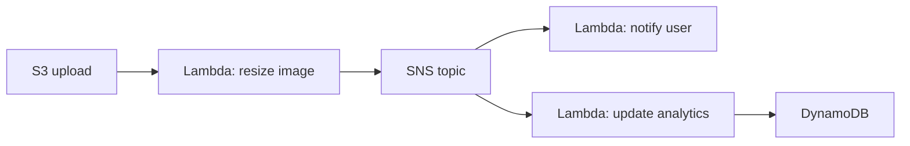

# Вопросы на собеседовании: `Serverless`

**Serverless** — модель вычислений, в которой разработчик не управляет серверами. Включает **FaaS** (Lambda, Functions), **BaaS** (Firebase, Auth0), serverless-контейнеры (Cloud Run, Container Apps), edge computing (Cloudflare Workers, Vercel Edge). На собеседовании спрашивают: когда выбирать, cold starts, стоимость, vendor lock-in.

## Полезные ссылки

### Официальная документация и авторитетные источники

- [What is Serverless? — Martin Fowler](https://martinfowler.com/articles/serverless.html)
- [The Twelve-Factor App](https://12factor.net/) — concepts apply
- [Serverless Framework Documentation](https://www.serverless.com/)
- [Cloudflare Workers](https://workers.cloudflare.com/)
- [Vercel Edge Functions](https://vercel.com/docs/functions/edge-functions)
- [Knative](https://knative.dev/)

## Содержание

- [Полезные ссылки](#полезные-ссылки)
- [See also](#see-also)

**Базовые понятия**
- [Q1. (!) Что такое serverless?](#q1--что-такое-serverless)
- [Q2. (!) Serverless ≠ no servers, что это значит?](#q2--serverless--no-servers-что-это-значит)
- [Q3. FaaS vs BaaS?](#q3-faas-vs-baas)

**Главные FaaS**
- [Q4. (!) Сравнение Lambda vs Functions vs Cloud Run vs Cloud Functions?](#q4--сравнение-lambda-vs-functions-vs-cloud-run-vs-cloud-functions)
- [Q5. Pricing моделей FaaS?](#q5-pricing-моделей-faas)

**Cold starts**
- [Q6. (!) Cold start — universal проблема?](#q6--cold-start--universal-проблема)
- [Q7. Mitigations: pre-warming, provisioned concurrency, snapshots?](#q7-mitigations-pre-warming-provisioned-concurrency-snapshots)

**Преимущества и недостатки**
- [Q8. (!) Преимущества serverless?](#q8--преимущества-serverless)
- [Q9. (!) Недостатки serverless?](#q9--недостатки-serverless)
- [Q10. (!) Vendor lock-in — насколько критично?](#q10--vendor-lock-in--насколько-критично)

**Edge computing**
- [Q11. (!) Что такое edge computing?](#q11--что-такое-edge-computing)
- [Q12. (!) Cloudflare Workers vs Lambda@Edge?](#q12--cloudflare-workers-vs-lambdaedge)
- [Q13. Vercel Edge Functions, Deno Deploy, Fastly Compute@Edge?](#q13-vercel-edge-functions-deno-deploy-fastly-computeedge)

**Patterns**
- [Q14. (!) Event-driven serverless?](#q14--event-driven-serverless)
- [Q15. Strangler pattern для legacy migration?](#q15-strangler-pattern-для-legacy-migration)
- [Q16. (!) Serverless API gateway pattern?](#q16--serverless-api-gateway-pattern)
- [Q17. Step Functions / Durable Functions для workflows?](#q17-step-functions--durable-functions-для-workflows)

**State management**
- [Q18. (!) Как работать с state?](#q18--как-работать-с-state)
- [Q19. Database connections в serverless?](#q19-database-connections-в-serverless)

**Tools и frameworks**
- [Q20. (!) Serverless Framework?](#q20--serverless-framework)
- [Q21. SST (Serverless Stack), Pulumi, CDK?](#q21-sst-serverless-stack-pulumi-cdk)
- [Q22. SAM, Functions Core Tools?](#q22-sam-functions-core-tools)

**Production**
- [Q23. (!) Когда serverless лучше containers?](#q23--когда-serverless-лучше-containers)
- [Q24. (!) Когда containers лучше serverless?](#q24--когда-containers-лучше-serverless)
- [Q25. Observability в serverless?](#q25-observability-в-serverless)
- [Q26. Testing serverless?](#q26-testing-serverless)

**Бизнес-аспекты**
- [Q27. (!) Cost analysis serverless?](#q27--cost-analysis-serverless)
- [Q28. Какие частые ошибки в serverless?](#q28-какие-частые-ошибки-в-serverless)

## Q1. (!) Что такое serverless?

(!) Что такое serverless?

**Serverless** — модель облачных вычислений, в которой **разработчик не управляет серверами**. Облачный провайдер:
- Выделяет вычислительные ресурсы по запросу (on-demand)
- Масштабируется автоматически
- Берёт плату только за использование (за вызов / за секунду)
- Берёт на себя runtime, ОС и масштабирование

**Включает:**
- **FaaS (Function-as-a-Service)** — AWS Lambda, Azure Functions, GCP Cloud Functions
- **Serverless-контейнеры** — Cloud Run, AWS App Runner, Container Apps
- **BaaS (Backend-as-a-Service)** — Firebase, Auth0, Supabase
- **Serverless-базы данных** — DynamoDB, Aurora Serverless, Cosmos DB serverless
- **Serverless-аналитика** — Athena, BigQuery
- **Edge computing** — Cloudflare Workers, Vercel Edge

## Q2. (!) Serverless ≠ no servers, что это значит?

**Serverless** **НЕ** означает «нет серверов». Серверы есть — но **разработчик их не видит и не управляет ими**.

**Что это означает:**
- Нет SSH в production
- Нет патчинга ОС
- Нет планирования ёмкости (auto-scale)
- Часто нет «всегда работающих» серверов

**«Serverful» → Serverless:**
- IaaS (EC2, GCE) — полный контроль, управляешь всем
- Контейнеры (ECS, Cloud Run) — управляешь контейнерами
- **Serverless (Lambda)** — управляешь только функциями

## Q3. FaaS vs BaaS?

**FaaS (Function-as-a-Service):**
- Свой код в функциях
- Запускается по событиям
- Примеры: Lambda, Cloud Functions, Azure Functions

**BaaS (Backend-as-a-Service):**
- Готовые backend-сервисы
- Без своего кода (только конфигурация)
- Примеры: Firebase, Auth0, Supabase, Stripe

**Типичная комбинация:**
```
Frontend → BaaS auth (Auth0) → FaaS (Lambda business logic) → Database
```

## Q4. (!) Сравнение Lambda vs Functions vs Cloud Run vs Cloud Functions?

| Сервис | Провайдер | Тип | Таймаут | Конкурентность |
|---------|----------|------|---------|-------------|
| **AWS Lambda** | AWS | FaaS | 15 мин | 1000 по умолчанию |
| **Azure Functions** | Azure | FaaS | 10 мин (Consumption) | зависит |
| **GCP Cloud Functions** | GCP | FaaS | 9 мин (gen 1) / 60 мин (gen 2) | зависит |
| **AWS Fargate** | AWS | Serverless-контейнеры | без лимита | на задачу |
| **GCP Cloud Run** | GCP | Serverless-контейнеры | 60 мин | до 1000 на инстанс |
| **Azure Container Apps** | Azure | Serverless-контейнеры | без лимита | зависит |
| **Cloudflare Workers** | Cloudflare | Edge | 30 сек (free) / 5 мин (paid) | очень высокая |

**Тренд в 2025:** **serverless-контейнеры** (Cloud Run, Container Apps) обгоняют чистый FaaS за счёт гибкости (более длинные таймауты, больше памяти, несколько запросов на инстанс).

## Q5. Pricing моделей FaaS?

**Составляющие цены:**
- **За вызов** ($0.20 за 1M для Lambda)
- **За длительность** (за мс × память)
- **Хранилище** (пакет деплоя)
- **Сеть** (исходящий трафик)

```
Lambda example:
1M invocations × 100ms × 512 MB = $1.03/month

Always running EC2 t3.medium = $30/month (730 hours)
```

**Точка безубыточности:** обычно ~50K вызовов в день. Меньше — serverless дешевле, больше — VM дешевле.

**Ловушка:** **исходящий трафик** одинаково дорогой и для VM, и для Lambda.

## Q6. (!) Cold start — universal проблема?

**Cold start** есть у всех FaaS / serverless-контейнеров.

**Причины:**
- Нужно подготовить окружение выполнения
- Скачать код/образ
- Инициализировать runtime
- Выполнить init-код

**Задержки (примерно):**
- AWS Lambda Python: 200-500 мс
- AWS Lambda Java: 1-5 сек (без SnapStart)
- GCP Cloud Run (контейнер): 1-3 сек (зависит от размера образа)
- Cloudflare Workers: ~5 мс (V8 isolates, реального cold start почти нет)

**Когда возникает cold start:**
- При первом вызове
- После периода простоя
- При росте конкурентности
- При обновлении кода

## Q7. Mitigations: pre-warming, provisioned concurrency, snapshots?

**Pre-warming (прогрев):**
- **Хак:** запланированные вызовы каждые 5-10 мин, чтобы держать инстанс тёплым
- Ненадёжно, не рекомендуется

**Provisioned Concurrency (Lambda) / Pre-warmed (Functions):**
- Предынициализированные окружения, всегда тёплые
- Дополнительные затраты ($$$)
- Лучший выбор для **чувствительных к задержке** API

**SnapStart (Lambda Java/Python):**
- Снимок (snapshot) инициализированного окружения
- Восстановление вместо инициализации = cold start в 5-10x быстрее

**Меньший пакет деплоя** — меньше кода = быстрее загрузка.

**Более быстрый runtime** — Node.js, Python, Go против Java, .NET.

**Edge-рантаймы** (Cloudflare Workers) — на базе V8 isolates, **почти нулевой** cold start.

## Q8. (!) Преимущества serverless?

1. **Нет управления инфраструктурой** — фокус на бизнес-логике
2. **Auto-scaling** — выдерживает всплески трафика
3. **Pay-per-use** — нет платы за простой
4. **Быстрее time-to-market** — быстрые прототипы
5. **Встроенные HA / DR** (на стороне провайдера)
6. **Встроенная безопасность** (патчинг ОС, сетевая изоляция)
7. **Event-driven** — естественная интеграция с облачными событиями
8. **Полиглот** — несколько языков
9. **Дружелюбность к микросервисам** — функция = сервис

## Q9. (!) Недостатки serverless?

1. **Cold starts** — нестабильность задержки
2. **Vendor lock-in** — код привязан к API провайдера
3. **Ограниченное время выполнения** (Lambda 15 мин)
4. **Ограниченные память/CPU** (1-10 GB)
5. **Stateless** — нет локального постоянного состояния
6. **Сложная отладка** — распределённая природа
7. **Непредсказуемость стоимости** — всплески = неожиданный счёт на $$$
8. **Лимиты конкурентности** — квоты провайдера
9. **Сетевые накладные расходы** — каждый вызов идёт через облако
10. **Сложнее тестировать** — локальная эмуляция несовершенна

## Q10. (!) Vendor lock-in — насколько критично?

**Реальный lock-in:**
- Lambda runtime API
- Облако-специфичные источники событий (S3, DynamoDB Streams)
- SDK провайдера
- Модели IAM и сети

**Смягчение:**
- **Гексагональная архитектура** — бизнес-логика отделена от облачных API
- **Adapter pattern** — обёртки над облачными SDK
- **Multi-cloud фреймворки** — Serverless Framework, Pulumi
- **Открытые стандарты** — CloudEvents

**Реалистично:** миграция между облаками болезненна даже со смягчениями. Тщательно выбирай основное облако, проектируй бизнес-логику переносимой (portable).

## Q11. (!) Что такое edge computing?

**Edge computing** — выполнение кода на **граничных локациях** (CDN-узлах), близко к пользователю.

```
Traditional: User → Internet → AWS region (Frankfurt)
Edge:        User → Cloudflare edge (closest, ~10 km) → ...
```

**Задержка:** edge ~10-50 мс против региона ~100-300 мс (между континентами).

**Сценарии использования:**
- **Аутентификация** (проверка JWT до обращения к origin)
- **A/B-маршрутизация**
- **Трансформация изображений**
- **Гео-таргетинг**
- **Детект ботов**
- **Инвалидация кэша**

**Ограничения:**
- Очень короткие выполнения (10-50 мс)
- Меньше памяти
- Ограниченные API (нет полного Node.js / Python)

## Q12. (!) Cloudflare Workers vs Lambda@Edge?

| Критерий | Cloudflare Workers | Lambda@Edge |
|----------|-------------------|-------------|
| Локации | 300+ дата-центров | CloudFront edge (600+) |
| Cold start | **~5 мс** (V8 isolates) | ~200 мс (Lambda) |
| Языки | JS, TS, WASM, Rust, Python (beta) | Node.js, Python |
| Runtime | V8 isolate | полноценная Lambda |
| Память | 128 MB | 128 MB - 10 GB |
| CPU-время | 10-50 мс (free) | 5 сек |
| Цена | $5/10M запросов + длительность | Lambda + CloudFront |
| KV / DB | Workers KV, D1, R2, Durable Objects | ограниченно (через Lambda) |

**Cloudflare Workers** — пионер edge-вычислений, очень зрелая экосистема.

**Lambda@Edge** — для приложений на AWS-стеке, ограниченный.

## Q13. Vercel Edge Functions, Deno Deploy, Fastly Compute@Edge?

**Vercel Edge Functions** — построены на Cloudflare Workers + инфраструктуре Vercel. Тесная интеграция с Next.js.

**Deno Deploy** — JavaScript-runtime от команды Deno. V8 isolates.

**Fastly Compute@Edge** — на базе WebAssembly. Rust, AssemblyScript, JS.

**Общая идея:** **V8 isolates** или WebAssembly ради почти нулевых cold starts.

В **2025** edge computing — **мейнстрим**, особенно для frontend-фреймворков (Next.js, Remix).

## Q14. (!) Event-driven serverless?



**Каждое событие** → запускает Lambda → пишет событие → запускает новые Lambda.

**Преимущества:**
- Слабая связанность
- Auto-scaling по каждому компоненту
- Платишь только когда что-то происходит
- Легко добавлять новых потребителей

**Инструменты:** EventBridge, SNS, SQS, Kinesis, события S3.

Подробнее — в [Event-driven Patterns](../architecture/event-driven-patterns-interview.md).

## Q15. Strangler pattern для legacy migration?

**Постепенная** миграция legacy-монолита → serverless.

```
Old monolith handles all routes
  ↓
Add API Gateway in front
  ↓
Route /new-feature → Lambda
  ↓
Gradually move endpoints from monolith to Lambda
  ↓
Eventually decommission monolith
```

Serverless хорош для strangler — легко добавить новую фичу, не трогая legacy.

## Q16. (!) Serverless API gateway pattern?

```
Client → API Gateway → Lambda functions → Database
```

**API Gateway:**
- Аутентификация (валидация JWT)
- Rate limiting
- Валидация запросов
- Кэширование
- Маршрутизация к Lambda

**Lambda-функции:**
- По одной на ресурс (REST) или на use case
- Прямой доступ к DynamoDB через IAM

**HTTP API (дешевле)** обычно достаточно. **REST API** — для продвинутых возможностей.

## Q17. Step Functions / Durable Functions для workflows?

**Step Functions (AWS) / Durable Functions (Azure)** — оркестрация сложных workflow.

```json
{
  "States": {
    "Validate": { "Type": "Task", "Resource": "lambda:validate" },
    "ProcessPayment": { "Type": "Task", "Resource": "lambda:payment" },
    "SendEmail": { "Type": "Task", "Resource": "lambda:email" }
  }
}
```

**Преимущества:**
- Визуальные workflow
- Встроенные retry / обработка ошибок
- Долгоживущие (до 1 года для Step Functions Standard)
- Параллельные ветки
- Observability

**Сценарии:** заказы, согласования, ETL, ML-пайплайны.

Аналог: **Saga pattern** в serverless. Подробнее — [Saga Pattern](../architecture/saga-pattern-interview.md).

## Q18. (!) Как работать с state?

**Функции stateless** — состояние нужно хранить во внешнем хранилище.

**Варианты:**
- **База данных** — DynamoDB, Cosmos DB, Aurora
- **Кэш** — ElastiCache Redis, Memorystore
- **Конечный автомат** — Step Functions / Durable Functions
- **Event sourcing** — события в Kafka/Kinesis
- **Объектное хранилище** — S3 для файлов

**Нельзя использовать `/tmp` для постоянного состояния** — он пересоздаётся на каждый cold start.

## Q19. Database connections в serverless?

**Проблема:** каждая Lambda создаёт соединение с БД. 1000 конкурентных Lambda → 1000 соединений с БД → БД падает по OOM.

**Решения:**

1. **Пул соединений вне Lambda** (RDS Proxy, PgBouncer)
2. **Serverless-базы данных** (DynamoDB, Aurora Serverless v2, Cosmos DB)
3. **БД поверх HTTP** (Neon, PlanetScale — по HTTP, без прямого соединения)
4. **Кэширование состояния в init-фазе Lambda** (переиспользование соединения между вызовами)

```python
# Bad — new connection per invocation
def handler(event, context):
    conn = psycopg2.connect(...)  # SLOW + connection storm

# Better — reuse if warm
import psycopg2
conn = psycopg2.connect(...)  # init phase

def handler(event, context):
    cursor = conn.cursor()  # reuse warm connection
```

**RDS Proxy** — управляемый пул соединений для связки Lambda + RDS.

## Q20. (!) Serverless Framework?

**Serverless Framework** (`serverless.com`) — multi-cloud инструмент деплоя.

```yaml
# serverless.yml
service: my-app
provider:
  name: aws
  runtime: python3.11

functions:
  hello:
    handler: app.hello
    events:
      - http:
          path: /hello
          method: get
```

```bash
serverless deploy
serverless logs -f hello
serverless remove
```

**Особенности:**
- Multi-cloud (AWS, GCP, Azure)
- Экосистема плагинов
- Локальная разработка

**В 2025** теряет долю в пользу **CDK, SST, Terraform**. Остаётся популярным для AWS Lambda.

## Q21. SST (Serverless Stack), Pulumi, CDK?

**SST (Serverless Stack)** — современный AWS serverless-фреймворк. Построен на CDK, с упором на developer experience.

```typescript
new Function(stack, "MyFunction", {
  handler: "src/handler.main",
  events: ["api/users", "api/orders"]
});
```

**AWS CDK** — императивный IaC (Python/TS/Java/.NET/Go) для AWS.

**Pulumi** — multi-cloud IaC на настоящих языках программирования.

**Выбор:**
- **Только AWS:** CDK или SST
- **Multi-cloud:** Pulumi или Terraform (декларативный)
- **Быстрый прототип:** Serverless Framework

## Q22. SAM, Functions Core Tools?

**SAM (AWS Serverless Application Model)** — официальный IaC от AWS для serverless.

**Azure Functions Core Tools** — локальная разработка для Azure Functions.

**GCP Functions Framework** — локальный запуск Cloud Functions.

У каждого облака есть нативный serverless-тулинг. SAM — самый зрелый.

## Q23. (!) Когда serverless лучше containers?

**Serverless лучше:**
- **Спорадический трафик** — выигрывает pay-per-use
- **Event-driven** — естественно ложится
- **Быстрые прототипы** — минимум инфраструктуры
- **Cron-задачи** — запуск по расписанию
- **Webhooks** — переменная нагрузка
- **Glue-код** — интеграции
- **Обработка всплесков** — auto-scale без предупреждения

## Q24. (!) Когда containers лучше serverless?

**Контейнеры лучше:**
- **Высокий постоянный трафик** — дешевле по вычислениям
- **Долгие задачи** > 15 мин
- **Stateful-приложения** — сессии, кэширование
- **WebSocket** — длинные соединения
- **Тяжёлые фреймворки** (полный Spring Boot)
- **Критична задержка** — нет cold start
- **Кастомная сеть / ОС**
- **Предсказуемые нагрузки** — экономия на резервировании

**Гибрид:** часто контейнеры (Cloud Run / Container Apps) дают «достаточно serverless» + гибкость контейнеров.

## Q25. Observability в serverless?

**Сложности:**
- Распределённость (множество функций)
- Короткий жизненный цикл (нет постоянного агента метрик)
- Изменчивые cold starts
- Асинхронные вызовы сложно трассировать

**Инструменты:**
- **Нативные у провайдера:** CloudWatch + X-Ray, Application Insights, Cloud Logging
- **Сторонние:** Datadog, New Relic, Lumigo, Thundra (специфичный для Lambda), Honeycomb

**Lambda Powertools** (open-source от AWS) — утилитарные библиотеки для логирования, метрик и трассировки.

**OpenTelemetry** — стандарт для кросс-облачных трейсов.

## Q26. Testing serverless?

**Unit-тесты:** тестируем handler как обычную функцию (без облачных зависимостей).

**Интеграционные тесты:**
- **LocalStack** (эмулятор AWS) — локальные DynamoDB, S3, SQS, Lambda
- **SAM Local** — запуск Lambda локально
- **Functions Core Tools** (Azure)
- **firebase emulators**

**End-to-end:**
- Деплой в **dev/staging-окружение**
- Прогон сценариев против развёрнутой версии
- Инструменты: Postman, Cypress, кастомные

**Подвох:** локальные эмуляторы **несовершенны** — поведение в production может отличаться.

## Q27. (!) Cost analysis serverless?

**Дёшево для:**
- Всплесков трафика (auto-scale)
- Низкой частоты (< 100K вызовов в день)
- Event-driven workflow
- Cron / задач по расписанию

**Дорого для:**
- Высокого постоянного трафика (миллионы в день)
- Долгих задач
- Функций с большой памятью
- Множества cold starts

**Скрытые затраты:**
- Запросы API Gateway ($1-3.50 за миллион)
- Приём логов в CloudWatch Logs
- Исходящий трафик
- VPC NAT Gateway (если внутри VPC)
- Межрегиональные вызовы

**Всегда оценивай:**
```
Daily invocations × duration × memory + per-invocation cost + auxiliary services
```

## Q28. Какие частые ошибки в serverless?

1. **Неожиданные cold start** в production
2. **Штормы соединений с БД** — без пулинга
3. **Нет DLQ** — упавшие сообщения теряются
4. **Жёсткие таймауты** — 15 мин у Lambda
5. **Vendor lock-in без планирования**
6. **Нет идемпотентности** — retry создаёт дубликаты
7. **Неконтролируемый рост затрат** — рекурсивный вызов Lambda из Lambda
8. **Захардкоженные секреты** в переменных окружения
9. **Синхронный вызов Lambda из Lambda** — лишняя стоимость и задержка
10. **Тяжёлые фреймворки** — Spring Boot без SnapStart = пытка
11. **Слишком много логов** — CloudWatch Logs дорогой
12. **Нет аутентификации** на эндпоинтах API Gateway
13. **Публичные S3-бакеты** триггерят Lambda → усилитель затрат
14. **Упёрлись в лимиты конкурентности** — production лежит

**Смягчение:** observability, алертинг, бюджеты, dead letter queues, идемпотентность.

## See also

- [AWS Lambda](aws-lambda-interview.md) — самый popular FaaS
- [AWS](aws-interview.md) — primary serverless cloud
- [GCP](gcp-interview.md) — Cloud Run, Cloud Functions
- [Azure](azure-interview.md) — Functions, Container Apps
- [Cloud-native Patterns](cloud-native-patterns-interview.md) — paterns
- [Микросервисы](../architecture/microservices-interview.md) — serverless = microservices style
- [Event-driven Patterns](../architecture/event-driven-patterns-interview.md) — natural fit
- [API Gateway](../architecture/api-gateway-interview.md) — front для serverless
- [Saga Pattern](../architecture/saga-pattern-interview.md) — Step Functions
- [Caching](../architecture/caching-strategies-interview.md) — для serverless
- [Observability](../monitoring/observability-interview.md) — challenges
- [Scalability](../architecture/scalability-patterns-interview.md) — auto-scale benefits
- [Application Security](../security/application-security-interview.md) — IAM, secrets

- [AWS Lambda](aws-lambda-interview.md)
- [Azure](azure-interview.md)
- [Cloud-native Patterns](cloud-native-patterns-interview.md)
- [GCP (Google Cloud Platform)](gcp-interview.md)
- [AI Agents](../ai-ml/ai-agents-interview.md)
- [Шпаргалка: Serverless Architecture](../../architecture/serverless.md) — теория
