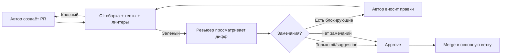
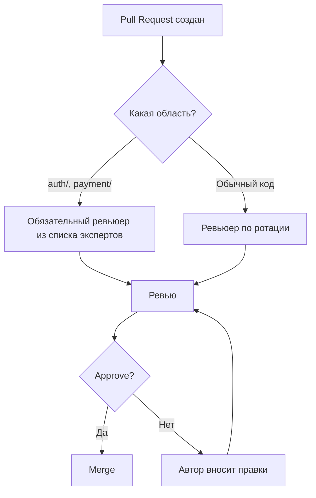
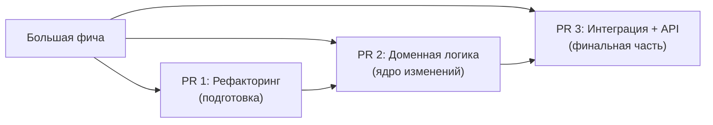
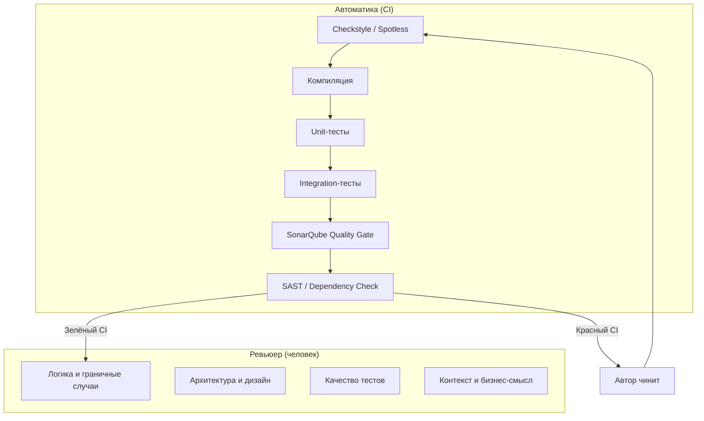
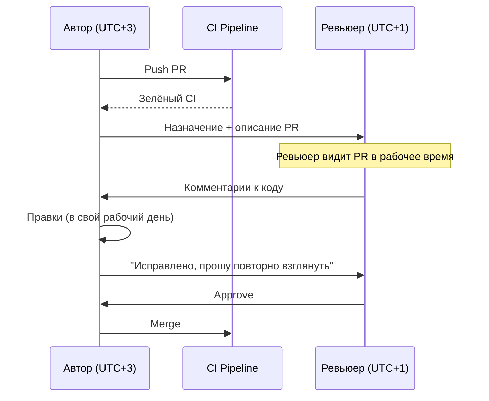
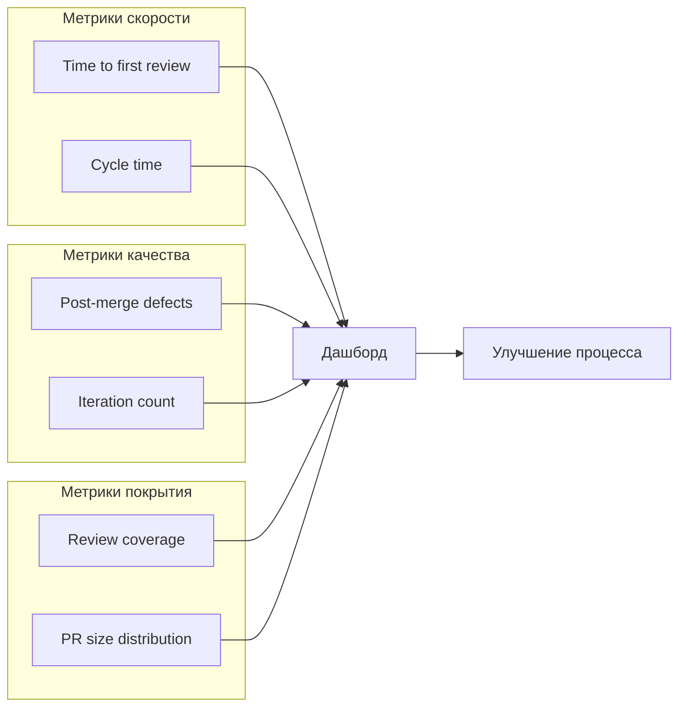
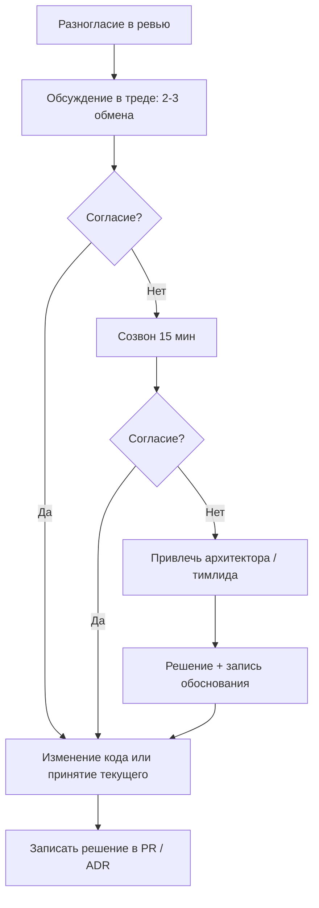
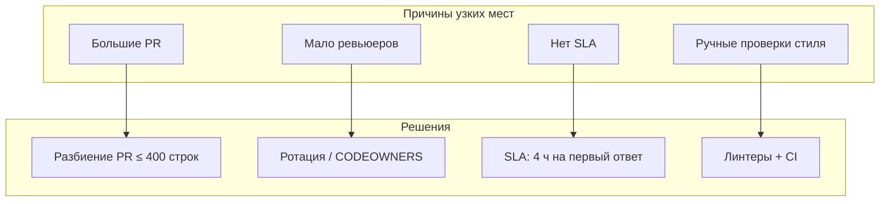

# Вопросы на собеседовании: `Code review`

Краткие ответы по code review: цели, объём PR, приоритеты при проверке, обратная связь, код-примеры хороших и плохих паттернов, интеграция с CI.

## Полезные ссылки

### Официальная документация

- [Google Code Review Guide](https://google.github.io/eng-practices/review/) — стандарт ревью от Google: скорость, что искать, как писать описания CL
- [Best Practices for Code Review — Atlassian](https://www.atlassian.com/agile/software-development/code-reviews) — обзор лучших практик
- [Conventional Comments](https://conventionalcomments.org/) — стандарт маркировки комментариев в ревью
- [Clean Coding in Java](https://www.baeldung.com/java-clean-code) — принципы чистого кода в Java
- [Constants in Java: Patterns and Anti-Patterns](https://www.baeldung.com/java-constants-good-practices) — правильное использование констант
- [Best Practices for Passing Many Arguments to a Method in Java](https://www.baeldung.com/java-best-practices-many-parameters-method) — рефакторинг методов с большим числом аргументов

## Содержание

- [Полезные ссылки](#полезные-ссылки)
- [See also](#see-also)

**Основы Code Review**
- [Q1. (!) Что такое code review и зачем он нужен?](#q1--что-такое-code-review-и-зачем-он-нужен)
- [Q2. (!) Какие цели преследует code review?](#q2--какие-цели-преследует-code-review)
- [Q3. Кто должен проводить code review?](#q3-кто-должен-проводить-code-review)
- [Q4. Сколько ревьюеров оптимально для одного PR?](#q4-сколько-ревьюеров-оптимально-для-одного-pr)
- [Q5. Какой объём изменений уместен в одном PR для ревью?](#q5-какой-объём-изменений-уместен-в-одном-pr-для-ревью)

**Приоритеты и фокус при ревью**
- [Q6. (!) На что в первую очередь смотреть при code review?](#q6--на-что-в-первую-очередь-смотреть-при-code-review)
- [Q7. Как балансировать между «стиль кода» и «логика/архитектура»?](#q7-как-балансировать-между-стиль-кода-и-логикаархитектура)
- [Q8. Что такое «ревью на корректность» vs «ревью на улучшения»?](#q8-что-такое-ревью-на-корректность-vs-ревью-на-улучшения)
- [Q20. Как ревьюить чужой код в незнакомой области?](#q20-как-ревьюить-чужой-код-в-незнакомой-области)
- [Q30. Как балансировать глубину ревью и скорость обратной связи?](#q30-как-балансировать-глубину-ревью-и-скорость-обратной-связи)

**Обратная связь и коммуникация**
- [Q9. (!) Как давать обратную связь в code review (тон, формулировки)?](#q9--как-давать-обратную-связь-в-code-review-тон-формулировки)
- [Q10. Как реагировать на замечания ревьюера?](#q10-как-реагировать-на-замечания-ревьюера)
- [Q21. Конфликты в ревью: как эскалировать?](#q21-конфликты-в-ревью-как-эскалировать)

**Тесты, безопасность и качество**
- [Q11. (!) Нужно ли требовать тесты в каждом PR?](#q11--нужно-ли-требовать-тесты-в-каждом-pr)
- [Q12. Как ревьюить тесты?](#q12-как-ревьюить-тесты)
- [Q13. (!) Code review и безопасность (security review)?](#q13--code-review-и-безопасность-security-review)
- [Q23. Как при ревью проверять производительность?](#q23-как-при-ревью-проверять-производительность)
- [Q24. Code review и доступность (accessibility)?](#q24-code-review-и-доступность-accessibility)

**Автоматизация и процесс**
- [Q14. Как ускорить процесс ревью без потери качества?](#q14-как-ускорить-процесс-ревью-без-потери-качества)
- [Q15. (!) Автоматизация и code review (линтеры, CI)?](#q15--автоматизация-и-code-review-линтеры-ci)
- [Q17. Code review в распределённой команде и асинхронно?](#q17-code-review-в-распределённой-команде-и-асинхронно)
- [Q25. Как встроить code review в процесс без узких мест?](#q25-как-встроить-code-review-в-процесс-без-узких-мест)

**Специальные случаи (рефакторинг, hotfix, миграции)**
- [Q16. Как ревьюить рефакторинг?](#q16-как-ревьюить-рефакторинг)
- [Q18. Когда можно обойтись без ревью (hotfix, крошечный фикс)?](#q18-когда-можно-обойтись-без-ревью-hotfix-крошечный-фикс)
- [Q22. Ревью документации и конфигурации?](#q22-ревью-документации-и-конфигурации)
- [Q26. Как ревьюить миграции БД и изменения схемы?](#q26-как-ревьюить-миграции-бд-и-изменения-схемы)
- [Q27. Code review и рефакторинг: когда ревьюить только дифф?](#q27-code-review-и-рефакторинг-когда-ревьюить-только-дифф)
- [Q28. Как организовать ревью для срочных hotfix?](#q28-как-организовать-ревью-для-срочных-hotfix)

**Метрики ревью**
- [Q19. Метрики эффективности code review?](#q19-метрики-эффективности-code-review)
- [Q29. Какие метрики качества ревью использовать (время, объём)?](#q29-какие-метрики-качества-ревью-использовать-время-объём)

**Принципы и code smells при ревью**
- [Q31. (!) Как проверять соблюдение принципов SOLID при code review?](#q31--как-проверять-соблюдение-принципов-solid-при-code-review)
- [Q32. Как применять принципы DRY и KISS при code review?](#q32-как-применять-принципы-dry-и-kiss-при-code-review)
- [Q33. Как ревьюить код с точки зрения code smells (запахи кода)?](#q33-как-ревьюить-код-с-точки-зрения-code-smells-запахи-кода)

**Security и Performance checklist**
- [Q34. Security checklist при code review: что проверять?](#q34-security-checklist-при-code-review-что-проверять)
- [Q35. Performance checklist при code review: N+1, сложность, memory leaks?](#q35-performance-checklist-при-code-review-n1-сложность-memory-leaks)

**Автоматизация ревью**
- [Q36. Автоматизированные инструменты code review: SonarQube, Checkstyle, PMD?](#q36-автоматизированные-инструменты-code-review-sonarqube-checkstyle-pmd)

**Обратная связь и процесс**
- [Q37. Как давать конструктивный фидбек: техники и примеры?](#q37-как-давать-конструктивный-фидбек-техники-и-примеры)
- [Q38. Draft PR / WIP: best practices и когда использовать?](#q38-draft-pr--wip-best-practices-и-когда-использовать)

**Инфраструктурный код**
- [Q39. Как ревьюить инфраструктурный код: Terraform, Kubernetes YAML?](#q39-как-ревьюить-инфраструктурный-код-terraform-kubernetes-yaml)
- [Q40. Что такое «автор PR» vs «автор кода» — роли при ревью?](#q40-что-такое-автор-pr-vs-автор-кода--роли-при-ревью)

## Как усиливать ответ на интервью

Для senior-уровня полезно отвечать не только "что такое ревью", но и "как это работает в процессе":

1. **Правило:** что именно обязательно (approve, зелёный CI, чек-лист).
2. **Метрика:** чем меряете качество (time-to-first-review, cycle time, post-merge defects).
3. **Эскалация:** что делать, когда процесс упирается в узкое место.

**Code review** — просмотр изменений в коде коллегами до слияния в основную ветку. На собеседовании часто спрашивают о целях ревью, объёме изменений, приоритетах при проверке, обратной связи и интеграции с CI/CD.

---

## Q1. (!) Что такое code review и зачем он нужен?

**Code review** — проверка изменений в коде (как правило, в pull request / merge request) одним или несколькими разработчиками до слияния в основную ветку.

Нужен для:
- выявления ошибок и уязвимостей до продакшена
- обмена знаниями и единого стиля
- улучшения дизайна и читаемости
- обучения джуниоров

Является практикой качества и командной работы.

**Стандарт Google Code Review:** ревьюер должен одобрить CL (changelist), если он улучшает общее качество кодовой базы, даже если CL не идеален. Нет «идеального» кода — есть «лучше, чем было».



**Практика:** в `GitHub / GitLab` создаётся PR с веткой, CI запускает сборку и тесты; ревьюер оставляет комментарии к строкам или к PR; автор вносит правки, при необходимости обсуждает в треде; после approve и зелёного CI ветка мержится в основную.

**Чек-лист ревьюера:**
- [ ] Логика и граничные случаи
- [ ] Тесты на изменённое поведение
- [ ] Безопасность (инъекции, секреты)
- [ ] Читаемость и именование


> [!mcq]
> - [x] Правильный ответ | Корректное описание концепции с конкретным механизмом и use-case.
> - [ ] Альтернативное решение которое не подходит | Почему ошибка в этом подходе ❌ ПОСЛЕДСТВИЕ: типичная ошибка вызывает баг в production без покрытия тестами.
> - [ ] Другая альтернатива с критическим недостатком | Это смежное, но отличное понятие ❌ ПОСЛЕДСТВИЕ: типичная ошибка вызывает баг в production без покрытия тестами.
> - [ ] Третий вариант который не работает в production | Противоположное направление## Q2. (!) Какие цели преследует code review? ❌ ПОСЛЕДСТВИЕ: антипаттерн деградирует SLA при росте нагрузки или зависимостей.

Основные цели:
- **Качество** — найти баги, утечки, неверную логику
- **Безопасность** — уязвимости, небезопасные API
- **Архитектура** — соответствие принятым подходам, отсутствие лишних зависимостей
- **Читаемость** — именование, структура, комментарии
- **Знания** — ознакомление команды с изменениями (bus factor)

Приоритеты задаёт команда (например, «сначала корректность, потом стиль»). Стиль и форматирование делегируют линтерам.

**Пример: что ловит ревью, а что нет**

```java
// BAD: ревьюер должен заметить — NPE при null user
public String getUserEmail(User user) {
    return user.getEmail().toLowerCase();
}

// GOOD: после ревью — защита от null
public String getUserEmail(User user) {
    if (user == null || user.getEmail() == null) {
        return "";
    }
    return user.getEmail().toLowerCase();
}
```

**Чек-лист целей ревью:**
- [ ] Логика и граничные случаи (`null`, пустой список)
- [ ] Тесты покрывают новое поведение
- [ ] Нет SQL/командных инъекций и утечки секретов
- [ ] Нет N+1 и тяжёлых операций в циклах
- [ ] Именование и структура понятны
- [ ] Нет лишних зависимостей


> [!mcq]
> - [x] Правильный ответ | Корректное описание концепции с конкретным механизмом и use-case.
> - [ ] Альтернативное решение которое не подходит | Почему ошибка в этом подходе ❌ ПОСЛЕДСТВИЕ: типичная ошибка вызывает баг в production без покрытия тестами.
> - [ ] Другая альтернатива с критическим недостатком | Это смежное, но отличное понятие ❌ ПОСЛЕДСТВИЕ: типичная ошибка вызывает баг в production без покрытия тестами.
> - [ ] Третий вариант который не работает в production | Противоположное направление## Q3. Кто должен проводить code review? ❌ ПОСЛЕДСТВИЕ: антипаттерн деградирует SLA при росте нагрузки или зависимостей.

Обычно **разработчики** той же или смежной команды, знакомые с кодом и доменом. Минимум один утверждающий (approver); часто два ревьюера для критичных областей (безопасность, ядро системы). Ревьюер должен понимать контекст (бизнес, архитектуру) и уметь проверить логику и тесты.



**Практика:** для путей (`auth/`, `payment/`) — обязательный ревьюер из списка экспертов; для обычных PR — любой разработчик команды по ротации. Автор не утверждает свой PR; при конфликте интересов привлекают третьего.


> [!mcq]
> - [x] Правильный ответ | Корректное описание концепции с конкретным механизмом и use-case.
> - [ ] Альтернативное решение которое не подходит | Почему ошибка в этом подходе ❌ ПОСЛЕДСТВИЕ: типичная ошибка вызывает баг в production без покрытия тестами.
> - [ ] Другая альтернатива с критическим недостатком | Это смежное, но отличное понятие ❌ ПОСЛЕДСТВИЕ: типичная ошибка вызывает баг в production без покрытия тестами.
> - [ ] Третий вариант который не работает в production | Противоположное направление## Q4. Сколько ревьюеров оптимально для одного PR? ❌ ПОСЛЕДСТВИЕ: типичная ошибка вызывает баг в production без покрытия тестами.

Один обязательный ревьюер — минимум; два — для критичных изменений (безопасность, ядро системы, большие рефакторинги). Больше двух часто даёт дублирование замечаний и замедляет процесс.

**Пример политики:**

| Тип изменения | Кол-во approve | SLA |
|---|---|---|
| Обычный PR | 1 | 4 рабочих часа |
| Аутентификация, платежи, ядро | 2 | 4 рабочих часа |
| Hotfix | 1 | 1 час |
| Конфигурация прода | 2 | 2 часа |

Политику задают в настройках репозитория: в `GitHub` — branch protection rules (required reviews); в `GitLab` — approval rules. Ротация ревьюеров (`round-robin` или по владению модулем) распределяет нагрузку и даёт разным людям контекст.


> [!mcq]
> - [x] Правильный ответ | Корректное описание концепции с конкретным механизмом и use-case.
> - [ ] Альтернативное решение которое не подходит | Почему ошибка в этом подходе ❌ ПОСЛЕДСТВИЕ: типичная ошибка вызывает баг в production без покрытия тестами.
> - [ ] Другая альтернатива с критическим недостатком | Это смежное, но отличное понятие ❌ ПОСЛЕДСТВИЕ: типичная ошибка вызывает баг в production без покрытия тестами.
> - [ ] Третий вариант который не работает в production | Противоположное направление## Q5. Какой объём изменений уместен в одном PR для ревью? ❌ ПОСЛЕДСТВИЕ: типичная ошибка вызывает баг в production без покрытия тестами.

Рекомендуют **200-400 строк** (дифф) для комфортного ревью; крупные PR (1000+ строк) сложнее проверять, выше риск пропустить ошибки. Google рекомендует: CL должен быть «одним самодостаточным изменением» — одна логическая единица работы.

Крупные фичи разбивают на несколько PR:



**Практика:** в описании PR указывать: «Часть 1 из 3: рефакторинг репозитория; часть 2 — новая логика; часть 3 — интеграция». В branch protection или гайде зафиксировать рекомендацию «до 400 строк диффа»; при превышении — просить разбить или обосновать.


> [!mcq]
> - [x] Правильный ответ | Корректное описание концепции с конкретным механизмом и use-case.
> - [ ] Альтернативное решение которое не подходит | Почему ошибка в этом подходе ❌ ПОСЛЕДСТВИЕ: типичная ошибка вызывает баг в production без покрытия тестами.
> - [ ] Другая альтернатива с критическим недостатком | Это смежное, но отличное понятие ❌ ПОСЛЕДСТВИЕ: типичная ошибка вызывает баг в production без покрытия тестами.
> - [ ] Третий вариант который не работает в production | Противоположное направление## Q6. (!) На что в первую очередь смотреть при code review? ❌ ПОСЛЕДСТВИЕ: антипаттерн деградирует SLA при росте нагрузки или зависимостей.

Приоритет (от важного к менее важному):

1. **Корректность** — логика, граничные случаи, ошибки
2. **Тесты** — покрытие изменённого поведения, качество тестов
3. **Безопасность** — инъекции, утечка данных, небезопасные вызовы
4. **Архитектура** — границы модулей, зависимости
5. **Читаемость** — имена, сложность, комментарии
6. **Стиль** — делегировать линтерам

**Пример: на что обратить внимание при ревью**

```java
// BAD: N+1 запрос в цикле — ревьюер должен заметить
public List<OrderDto> getOrders(List<Long> userIds) {
    List<OrderDto> result = new ArrayList<>();
    for (Long userId : userIds) {
        User user = userRepository.findById(userId);        // N запросов!
        List<Order> orders = orderRepository.findByUser(user); // ещё N запросов!
        result.addAll(toDto(orders, user));
    }
    return result;
}

// GOOD: batch-запросы
public List<OrderDto> getOrders(List<Long> userIds) {
    Map<Long, User> users = userRepository.findAllById(userIds)
        .stream().collect(Collectors.toMap(User::getId, Function.identity()));
    List<Order> orders = orderRepository.findByUserIdIn(userIds);
    return orders.stream()
        .map(o -> toDto(o, users.get(o.getUserId())))
        .toList();
}
```

**Практика:** открывать PR, сначала прочитать описание и тесты — так понятно ожидаемое поведение. Затем просматривать дифф по приоритету: сначала изменения в доменной логике и API, затем тесты, затем конфигурация.

**Чек-лист приоритетов:**
- [ ] Логика и граничные случаи (`null`, пустой список, невалидный ввод)
- [ ] Тесты проверяют заявленное поведение и падают при удалении логики
- [ ] Нет утечки секретов и инъекций (SQL, команды)
- [ ] Нет N+1 и тяжёлых операций в циклах
- [ ] Именование и структура понятны
- [ ] Нет нарушений границ модулей


> [!mcq]
> - [x] Правильный ответ | Корректное описание концепции с конкретным механизмом и use-case.
> - [ ] Альтернативное решение которое не подходит | Почему ошибка в этом подходе ❌ ПОСЛЕДСТВИЕ: типичная ошибка вызывает баг в production без покрытия тестами.
> - [ ] Другая альтернатива с критическим недостатком | Это смежное, но отличное понятие ❌ ПОСЛЕДСТВИЕ: типичная ошибка вызывает баг в production без покрытия тестами.
> - [ ] Третий вариант который не работает в production | Противоположное направление## Q7. Как балансировать между «стиль кода» и «логика/архитектура»? ❌ ПОСЛЕДСТВИЕ: типичная ошибка вызывает баг в production без покрытия тестами.

Стиль (отступы, именование по стандарту) выносить в автоматизацию (`Checkstyle`, `Spotless`, `EditorConfig`). В ревью фокус — на логике, тестах, дизайне и явных «запахах» кода.

**Пример: стиль vs логика**

```java
// Стилевое замечание (должен ловить линтер, не ревьюер):
if(x==1){return true;}else{return false;}

// Логическое замечание (ловит ревьюер):
// BAD: boolean выражение вместо if/else
public boolean isEligible(User user) {
    if (user.getAge() >= 18) {
        return true;
    } else {
        return false;
    }
}

// GOOD: упрощение
public boolean isEligible(User user) {
    return user.getAge() >= 18;
}
```

**Приоритет замечаний:** корректность -> тесты -> безопасность -> архитектура -> читаемость -> стиль. Если стиль ломает читаемость (например, метод на 200 строк) — замечание по структуре, а не по отступам.


> [!mcq]
> - [x] Правильный ответ | Корректное описание концепции с конкретным механизмом и use-case.
> - [ ] Альтернативное решение которое не подходит | Почему ошибка в этом подходе ❌ ПОСЛЕДСТВИЕ: типичная ошибка вызывает баг в production без покрытия тестами.
> - [ ] Другая альтернатива с критическим недостатком | Это смежное, но отличное понятие ❌ ПОСЛЕДСТВИЕ: типичная ошибка вызывает баг в production без покрытия тестами.
> - [ ] Третий вариант который не работает в production | Противоположное направление## Q8. Что такое «ревью на корректность» vs «ревью на улучшения»? ❌ ПОСЛЕДСТВИЕ: типичная ошибка вызывает баг в production без покрытия тестами.

**Корректность** — код делает то, что нужно; нет багов, уязвимостей; тесты адекватны. Это обязательный минимум для approve.

**Улучшения** — предложения по рефакторингу, именованию, разбиению; не блокируют merge, если автор с ними не согласен.

**Conventional Comments** — стандарт маркировки комментариев:

```
// Блокирующий комментарий (must fix):
issue: При user == null будет NPE — нужна проверка.

// Необязательный (nice to have):
suggestion (non-blocking): Можно вынести в отдельный метод для ясности.

// Мелочь:
nitpick: Переименовать `tmp` в `temporaryFile` для читаемости.

// Похвала:
praise: Отличное решение с кэшированием!

// Вопрос:
question: Почему выбран ArrayList, а не LinkedList? Частые вставки в начало?
```

**Практика:** автор может отклонить `suggestion` с пояснением; по `issue` — обсудить до исправления. Approve только при отсутствии блокирующих замечаний.


> [!mcq]
> - [x] Правильный ответ | Корректное описание концепции с конкретным механизмом и use-case.
> - [ ] Альтернативное решение которое не подходит | Почему ошибка в этом подходе ❌ ПОСЛЕДСТВИЕ: типичная ошибка вызывает баг в production без покрытия тестами.
> - [ ] Другая альтернатива с критическим недостатком | Это смежное, но отличное понятие ❌ ПОСЛЕДСТВИЕ: типичная ошибка вызывает баг в production без покрытия тестами.
> - [ ] Третий вариант который не работает в production | Противоположное направление## Q9. (!) Как давать обратную связь в code review (тон, формулировки)? ❌ ПОСЛЕДСТВИЕ: антипаттерн деградирует SLA при росте нагрузки или зависимостей.

Тон — уважительный и по делу. Фокус на коде, не на человеке.

**Примеры хороших и плохих формулировок:**

| Плохо | Хорошо |
|---|---|
| «Ты неправильно сделал» | `issue:` Здесь может быть NPE, стоит проверить `user != null` |
| «Это ужасный код» | `suggestion:` Предлагаю вынести в метод для ясности |
| «Зачем ты так написал?» | `question:` Какой сценарий покрывает эта проверка? |
| «Опять null не проверен» | `issue:` Добавить проверку на null — см. аналогичный паттерн в `UserService.java:42` |
| *(молчание на хорошее решение)* | `praise:` Хорошее решение с `Optional` — читаемо и безопасно |

**Пример комментария ревьюера в PR:**

```java
// Ревьюер: issue: при пустом списке будет IndexOutOfBoundsException
//   Рекомендую проверить:
public Item getFirst(List<Item> items) {
    return items.get(0); // BAD: нет проверки на пустой список
}

// Ревьюер: suggestion (non-blocking): можно использовать stream API
public Item getFirst(List<Item> items) {
    return items.stream()
        .findFirst()
        .orElseThrow(() -> new NotFoundException("No items found"));
}
```


> [!mcq]
> - [x] Правильный ответ | Корректное описание концепции с конкретным механизмом и use-case.
> - [ ] Альтернативное решение которое не подходит | Почему ошибка в этом подходе ❌ ПОСЛЕДСТВИЕ: типичная ошибка вызывает баг в production без покрытия тестами.
> - [ ] Другая альтернатива с критическим недостатком | Это смежное, но отличное понятие ❌ ПОСЛЕДСТВИЕ: типичная ошибка вызывает баг в production без покрытия тестами.
> - [ ] Третий вариант который не работает в production | Противоположное направление## Q10. Как реагировать на замечания ревьюера? ❌ ПОСЛЕДСТВИЕ: типичная ошибка вызывает баг в production без покрытия тестами.

Отвечать на каждый комментарий: исправить, согласиться и поправить, или вежливо объяснить, почему оставляем как есть.

**Формат ответов автора:**

```
// На issue:
"Исправлено в коммите abc1234"

// На suggestion (принято):
"Хорошая идея, вынес в метод extractUserName()"

// На suggestion (отклонено):
"Оставил как есть: здесь один вызов, отдельный метод добавит индирекцию без пользы"

// На question:
"Эта проверка нужна для кейса, когда API возвращает 204 без тела — добавил комментарий в код"
```

**Практика:** не оставлять комментарии без ответа перед merge. При несогласии — аргументировать в треде; при тупике — короткий созвон или привлечение третьего (архитектор, тимлид). Итог: либо изменение кода, либо осознанное принятие текущего варианта с записью причины.


> [!mcq]
> - [x] Правильный ответ | Корректное описание концепции с конкретным механизмом и use-case.
> - [ ] Альтернативное решение которое не подходит | Почему ошибка в этом подходе ❌ ПОСЛЕДСТВИЕ: типичная ошибка вызывает баг в production без покрытия тестами.
> - [ ] Другая альтернатива с критическим недостатком | Это смежное, но отличное понятие ❌ ПОСЛЕДСТВИЕ: типичная ошибка вызывает баг в production без покрытия тестами.
> - [ ] Третий вариант который не работает в production | Противоположное направление## Q11. (!) Нужно ли требовать тесты в каждом PR? ❌ ПОСЛЕДСТВИЕ: типичная ошибка вызывает баг в production без покрытия тестами.

Для новой функциональности и багфиксов тесты обычно требуют (unit и/или integration). Для тривиальных правок (опечатка в комментарии, конфиг) можно не требовать.

**Пример: что проверять в тестах PR**

```java
// Фикс: добавили проверку на отрицательную сумму
public void transfer(Account from, Account to, BigDecimal amount) {
    if (amount.compareTo(BigDecimal.ZERO) <= 0) {
        throw new IllegalArgumentException("Amount must be positive");
    }
    // ... перевод
}

// Ревьюер ожидает тест:
@Test
void shouldThrowWhenAmountIsNegative() {
    assertThatThrownBy(() -> service.transfer(from, to, BigDecimal.valueOf(-100)))
        .isInstanceOf(IllegalArgumentException.class)
        .hasMessageContaining("positive");
}

@Test
void shouldThrowWhenAmountIsZero() {
    assertThatThrownBy(() -> service.transfer(from, to, BigDecimal.ZERO))
        .isInstanceOf(IllegalArgumentException.class);
}
```

**Практика:** в описании PR указывать: «Покрыто unit-тестами для X, Y; граничные случаи Z». Ревьюер проверяет: тесты есть, падают при удалении проверяемой логики. Подробнее о тестировании — в [вопросах по unit-тестированию](../testing/unit-testing-interview.md).


> [!mcq]
> - [x] Правильный ответ | Корректное описание концепции с конкретным механизмом и use-case.
> - [ ] Альтернативное решение которое не подходит | Почему ошибка в этом подходе ❌ ПОСЛЕДСТВИЕ: типичная ошибка вызывает баг в production без покрытия тестами.
> - [ ] Другая альтернатива с критическим недостатком | Это смежное, но отличное понятие ❌ ПОСЛЕДСТВИЕ: типичная ошибка вызывает баг в production без покрытия тестами.
> - [ ] Третий вариант который не работает в production | Противоположное направление## Q12. Как ревьюить тесты? ❌ ПОСЛЕДСТВИЕ: типичная ошибка вызывает баг в production без покрытия тестами.

Проверять:
- тест действительно проверяет заявленное поведение
- есть граничные случаи и негативные сценарии
- нет хрупких тестов (зависимость от порядка, времени, лишних моков)
- именование и структура читаемы (Given/When/Then или аналог)

**Пример: плохой vs хороший тест**

```java
// BAD: непонятное имя, нет проверки граничных случаев, лишний мок
@Test
void test1() {
    when(repo.findById(1L)).thenReturn(Optional.of(new User("Alice")));
    when(repo.save(any())).thenReturn(new User("Alice"));
    var result = service.getUser(1L);
    assertNotNull(result);
    verify(repo).save(any()); // зачем verify save при getUser?
}

// GOOD: описательное имя, проверка поведения, нет лишних моков
@Test
void shouldReturnUserWhenFound() {
    when(repo.findById(1L)).thenReturn(Optional.of(new User("Alice")));

    var result = service.getUser(1L);

    assertThat(result.getName()).isEqualTo("Alice");
}

@Test
void shouldThrowWhenUserNotFound() {
    when(repo.findById(1L)).thenReturn(Optional.empty());

    assertThatThrownBy(() -> service.getUser(1L))
        .isInstanceOf(UserNotFoundException.class);
}
```

**Практика:** мысленно удалить одну строку из тестируемого кода — должен ли упасть тест? Если нет — тест не проверяет эту логику. Имена вида `test1`, `shouldWork` заменить на описательные.


> [!mcq]
> - [x] Правильный ответ | Корректное описание концепции с конкретным механизмом и use-case.
> - [ ] Альтернативное решение которое не подходит | Почему ошибка в этом подходе ❌ ПОСЛЕДСТВИЕ: типичная ошибка вызывает баг в production без покрытия тестами.
> - [ ] Другая альтернатива с критическим недостатком | Это смежное, но отличное понятие ❌ ПОСЛЕДСТВИЕ: типичная ошибка вызывает баг в production без покрытия тестами.
> - [ ] Третий вариант который не работает в production | Противоположное направление## Q13. (!) Code review и безопасность (security review)? ❌ ПОСЛЕДСТВИЕ: антипаттерн деградирует SLA при росте нагрузки или зависимостей.

Для критичных областей (аутентификация, платежи, персональные данные) ревью должен включать проверку на типичные уязвимости. Часть проверок автоматизируют (SAST, dependency check). При необходимости привлекают security-специалиста.

**Примеры уязвимостей, которые ловит ревью:**

```java
// BAD: SQL-инъекция через конкатенацию
public User findUser(String name) {
    String sql = "SELECT * FROM users WHERE name = '" + name + "'";
    return jdbcTemplate.queryForObject(sql, userMapper);
}

// GOOD: параметризованный запрос
public User findUser(String name) {
    String sql = "SELECT * FROM users WHERE name = ?";
    return jdbcTemplate.queryForObject(sql, userMapper, name);
}
```

```java
// BAD: логирование чувствительных данных
log.info("User login: email={}, password={}", email, password);

// GOOD: маскирование
log.info("User login: email={}", maskEmail(email));
```

```java
// BAD: секрет в коде
private static final String API_KEY = "sk-prod-abc123xyz";

// GOOD: из конфигурации/vault
@Value("${external.api.key}")
private String apiKey;
```

**Чек-лист безопасности:**
- [ ] Нет конкатенации SQL (использовать параметризованные запросы)
- [ ] Нет секретов в коде (пароли, ключи, токены)
- [ ] Нет логирования чувствительных данных
- [ ] Входные данные валидируются
- [ ] Эндпоинты защищены авторизацией
- [ ] Зависимости не содержат известных CVE

Подробнее — в [вопросах по безопасности приложений](../security/application-security-interview.md) и [OWASP Top 10](../security/owasp-top10-interview.md).


> [!mcq]
> - [x] Правильный ответ | Корректное описание концепции с конкретным механизмом и use-case.
> - [ ] Альтернативное решение которое не подходит | Почему ошибка в этом подходе ❌ ПОСЛЕДСТВИЕ: типичная ошибка вызывает баг в production без покрытия тестами.
> - [ ] Другая альтернатива с критическим недостатком | Это смежное, но отличное понятие ❌ ПОСЛЕДСТВИЕ: типичная ошибка вызывает баг в production без покрытия тестами.
> - [ ] Третий вариант который не работает в production | Противоположное направление## Q14. Как ускорить процесс ревью без потери качества? ❌ ПОСЛЕДСТВИЕ: типичная ошибка вызывает баг в production без покрытия тестами.

Малые PR; чёткое описание и контекст в PR; назначение ревьюеров заранее и SLA (например, первая реакция за 4 часа); автоматизация стиля и части проверок в CI; разбиение ревью на «корректность» (быстро) и «улучшения» (по возможности).

**Шаблон описания PR:**

```markdown
## Что сделано
- Добавлен эндпоинт POST /api/orders для создания заказа

## Зачем
- Задача PROJ-1234: MVP оформления заказа

## Как проверить
- `curl -X POST localhost:8080/api/orders -d '{"items": [1,2]}'`
- Тесты: `./gradlew test --tests "OrderControllerTest"`

## Чек-лист автора
- [x] Unit-тесты добавлены
- [x] Граничные случаи проверены (пустой список, null)
- [x] CI зелёный
- [ ] Документация API обновлена
```

**Практика:** в настройках репо — CODEOWNERS или auto-assign по ротации. SLA зафиксировать в гайде: «первый комментарий в течение 4 рабочих часов». Линтеры и CI должны быть зелёными до назначения ревьюера.


> [!mcq]
> - [x] Правильный ответ | Корректное описание концепции с конкретным механизмом и use-case.
> - [ ] Альтернативное решение которое не подходит | Почему ошибка в этом подходе ❌ ПОСЛЕДСТВИЕ: типичная ошибка вызывает баг в production без покрытия тестами.
> - [ ] Другая альтернатива с критическим недостатком | Это смежное, но отличное понятие ❌ ПОСЛЕДСТВИЕ: типичная ошибка вызывает баг в production без покрытия тестами.
> - [ ] Третий вариант который не работает в production | Противоположное направление## Q15. (!) Автоматизация и code review (линтеры, CI)? ❌ ПОСЛЕДСТВИЕ: антипаттерн деградирует SLA при росте нагрузки или зависимостей.

Линтеры (`Checkstyle`, `SpotBugs`, `SonarQube`) и CI (сборка, тесты, деплой) снимают с ревьюера рутинные проверки. Ревьюер смотрит то, что машина не проверяет: логику, дизайн, адекватность тестов, контекст.



**Практика:** в branch protection — «Require status checks to pass» (сборка, тесты, линтеры); ревьюер не одобряет PR с красным CI. Замечания по форматированию отдавать линтеру (настроить правило и исправить в коде). Подробнее — в [вопросах по CI/CD пайплайну](../cicd/pipeline-design-interview.md).


> [!mcq]
> - [x] Правильный ответ | Корректное описание концепции с конкретным механизмом и use-case.
> - [ ] Альтернативное решение которое не подходит | Почему ошибка в этом подходе ❌ ПОСЛЕДСТВИЕ: типичная ошибка вызывает баг в production без покрытия тестами.
> - [ ] Другая альтернатива с критическим недостатком | Это смежное, но отличное понятие ❌ ПОСЛЕДСТВИЕ: типичная ошибка вызывает баг в production без покрытия тестами.
> - [ ] Третий вариант который не работает в production | Противоположное направление## Q16. Как ревьюить рефакторинг? ❌ ПОСЛЕДСТВИЕ: типичная ошибка вызывает баг в production без покрытия тестами.

Убедиться, что поведение не изменилось: тесты те же и зелёные; нет новых публичных контрактов без необходимости. Проверить, что рефакторинг не смешан с фичами в одном PR.

**Пример: ревью рефакторинга**

```java
// BEFORE: метод делает слишком много
public OrderResult processOrder(OrderRequest request) {
    // валидация (20 строк)
    // расчёт скидок (30 строк)
    // сохранение в БД (15 строк)
    // отправка уведомления (10 строк)
}

// AFTER: разбиение на методы (рефакторинг, не меняет поведение)
public OrderResult processOrder(OrderRequest request) {
    validate(request);
    BigDecimal total = calculateTotal(request);
    Order order = saveOrder(request, total);
    notifyUser(order);
    return toResult(order);
}
```

Ревьюер проверяет: поведение не изменилось (тесты зелёные), разбиение осмысленное, новые методы имеют понятные имена и адекватную ответственность. Подробнее — в [вопросах по паттернам рефакторинга](refactoring-patterns-interview.md).

**Практика:** в описании PR: «Refactoring: первый коммит — механический (IDE refactor); второй — упрощение логики»; так дифф читаем и регрессии локализуются.


> [!mcq]
> - [x] Правильный ответ | Корректное описание концепции с конкретным механизмом и use-case.
> - [ ] Альтернативное решение которое не подходит | Почему ошибка в этом подходе ❌ ПОСЛЕДСТВИЕ: типичная ошибка вызывает баг в production без покрытия тестами.
> - [ ] Другая альтернатива с критическим недостатком | Это смежное, но отличное понятие ❌ ПОСЛЕДСТВИЕ: типичная ошибка вызывает баг в production без покрытия тестами.
> - [ ] Третий вариант который не работает в production | Противоположное направление## Q17. Code review в распределённой команде и асинхронно? ❌ ПОСЛЕДСТВИЕ: антипаттерн деградирует SLA при росте нагрузки или зависимостей.

Асинхронное ревью (`GitHub`, `GitLab`, `Gerrit`) — норма для распределённых команд. Важно: ясное описание PR; ответы на комментарии в течение рабочего дня; при срочности — явно помечать и синхронизироваться по времени.



**Практика:** в гайде зафиксировать: «первый ответ на комментарий в течение 4-8 часов (рабочий день)»; для срочных PR — пометка `[URGENT]` и назначение ревьюера. Сложные PR — короткий созвон 15-20 мин после первого раунда комментариев.


> [!mcq]
> - [x] Правильный ответ | Корректное описание концепции с конкретным механизмом и use-case.
> - [ ] Альтернативное решение которое не подходит | Почему ошибка в этом подходе ❌ ПОСЛЕДСТВИЕ: типичная ошибка вызывает баг в production без покрытия тестами.
> - [ ] Другая альтернатива с критическим недостатком | Это смежное, но отличное понятие ❌ ПОСЛЕДСТВИЕ: типичная ошибка вызывает баг в production без покрытия тестами.
> - [ ] Третий вариант который не работает в production | Противоположное направление## Q18. Когда можно обойтись без ревью (hotfix, крошечный фикс)? ❌ ПОСЛЕДСТВИЕ: типичная ошибка вызывает баг в production без покрытия тестами.

Политика команды определяет исключения. Часто: критичный hotfix в проде — быстрый фикс, ревью постфактум; опечатка в комментарии/документации — можно без ревью.

**Матрица решений:**

| Изменение | Ревью | Условие |
|---|---|---|
| Новая функциональность | Обязательно | 1-2 approve |
| Багфикс | Обязательно | 1 approve |
| Hotfix в проде | Упрощённое | 1 approve, SLA 1 ч, постфактум ревью 24 ч |
| Опечатка в документации | Не нужно | По правилу команды |
| Конфиг прода | Обязательно | 2 approve |

**Практика:** в runbook: «Hotfix: merge после одного approve и зелёного CI; постфактум ревью в течение 24 ч». Для кода в проде минимум один быстрый взгляд желателен. Исключения зафиксировать в документации.


> [!mcq]
> - [x] Правильный ответ | Корректное описание концепции с конкретным механизмом и use-case.
> - [ ] Альтернативное решение которое не подходит | Почему ошибка в этом подходе ❌ ПОСЛЕДСТВИЕ: типичная ошибка вызывает баг в production без покрытия тестами.
> - [ ] Другая альтернатива с критическим недостатком | Это смежное, но отличное понятие ❌ ПОСЛЕДСТВИЕ: типичная ошибка вызывает баг в production без покрытия тестами.
> - [ ] Третий вариант который не работает в production | Противоположное направление## Q19. Метрики эффективности code review? ❌ ПОСЛЕДСТВИЕ: антипаттерн деградирует SLA при росте нагрузки или зависимостей.

Примеры метрик:
- **Time to first review** — время от открытия PR до первого комментария
- **Cycle time** — время от открытия PR до merge
- **Iteration count** — количество раундов замечаний
- **Post-merge defect rate** — доля PR с регрессиями после merge
- **Review coverage** — доля PR с хотя бы одним ревью

Цель — не «больше замечаний», а меньше дефектов в проде и приемлемое время ревью.



**Практика:** в дашборде (`Grafana`, `GitHub Insights`) отслеживать: медиану времени от open до merge; долю PR с 2+ итерациями; число инцидентов, связанных с изменениями за последние N дней. Метрики использовать для улучшения процесса, а не для наказания.


> [!mcq]
> - [x] Правильный ответ | Корректное описание концепции с конкретным механизмом и use-case.
> - [ ] Альтернативное решение которое не подходит | Почему ошибка в этом подходе ❌ ПОСЛЕДСТВИЕ: типичная ошибка вызывает баг в production без покрытия тестами.
> - [ ] Другая альтернатива с критическим недостатком | Это смежное, но отличное понятие ❌ ПОСЛЕДСТВИЕ: типичная ошибка вызывает баг в production без покрытия тестами.
> - [ ] Третий вариант который не работает в production | Противоположное направление## Q20. Как ревьюить чужой код в незнакомой области? ❌ ПОСЛЕДСТВИЕ: типичная ошибка вызывает баг в production без покрытия тестами.

Сначала прочитать описание PR и связанные тикеты; просмотреть тесты, чтобы понять ожидаемое поведение; задавать уточняющие вопросы, а не утверждать. Фокус на очевидных вещах: логика, граничные случаи, тесты, безопасность.

**Стратегия ревью незнакомого кода:**

1. Прочитать описание PR и связанные тикеты
2. Просмотреть тесты — они документируют ожидаемое поведение
3. Потратить 5 минут на чтение кода вокруг изменений (контекст)
4. Проверить логику, граничные случаи, тесты, безопасность
5. Написать в PR: «Проверил логику, тесты и безопасность; доменную часть X просмотрел поверхностно — рекомендую взгляд [имя эксперта]»

**Практика:** не стесняться задавать вопросы (`question: зачем здесь эта проверка?`) — автор может объяснить или обнаружить баг. Честность и коллаборация важнее имиджа.


> [!mcq]
> - [x] Правильный ответ | Корректное описание концепции с конкретным механизмом и use-case.
> - [ ] Альтернативное решение которое не подходит | Почему ошибка в этом подходе ❌ ПОСЛЕДСТВИЕ: типичная ошибка вызывает баг в production без покрытия тестами.
> - [ ] Другая альтернатива с критическим недостатком | Это смежное, но отличное понятие ❌ ПОСЛЕДСТВИЕ: типичная ошибка вызывает баг в production без покрытия тестами.
> - [ ] Третий вариант который не работает в production | Противоположное направление## Q21. Конфликты в ревью: как эскалировать? ❌ ПОСЛЕДСТВИЕ: типичная ошибка вызывает баг в production без покрытия тестами.

При принципиальном несогласии:
1. Обсудить в треде с аргументами (max 2-3 обмена)
2. Привлечь третьего (архитектор, тимлид)
3. Зафиксировать решение и обоснование в ADR или в комментарии



**Практика:** после решения записать в комментарий: «Принято решение: ...; обоснование: ...» — так будущие читатели понимают контекст. При повторяющихся конфликтах — обсудить на ретро и зафиксировать стандарт в ADR или гайде.


> [!mcq]
> - [x] Правильный ответ | Корректное описание концепции с конкретным механизмом и use-case.
> - [ ] Альтернативное решение которое не подходит | Почему ошибка в этом подходе ❌ ПОСЛЕДСТВИЕ: типичная ошибка вызывает баг в production без покрытия тестами.
> - [ ] Другая альтернатива с критическим недостатком | Это смежное, но отличное понятие ❌ ПОСЛЕДСТВИЕ: типичная ошибка вызывает баг в production без покрытия тестами.
> - [ ] Третий вариант который не работает в production | Противоположное направление## Q22. Ревью документации и конфигурации? ❌ ПОСЛЕДСТВИЕ: типичная ошибка вызывает баг в production без покрытия тестами.

Документация (README, API docs, runbooks) и конфигурация (YAML, properties, инфраструктура) тоже проходят ревью: актуальность, ясность, отсутствие секретов в репозитории.

**Пример: что проверять в конфигурации**

```yaml
# BAD: секрет в конфиге
spring:
  datasource:
    password: "SuperSecret123!"

# GOOD: ссылка на vault / env
spring:
  datasource:
    password: ${DB_PASSWORD}
```

**Чек-лист для конфигурации:**
- [ ] Нет секретов (gitleaks / detect-secrets в CI)
- [ ] YAML/JSON валиден по схеме
- [ ] Указано, какие окружения затронуты
- [ ] Есть rollback-план для прода
- [ ] API docs соответствуют коду
- [ ] Ссылки в документации не битые


> [!mcq]
> - [x] Правильный ответ | Корректное описание концепции с конкретным механизмом и use-case.
> - [ ] Альтернативное решение которое не подходит | Почему ошибка в этом подходе ❌ ПОСЛЕДСТВИЕ: типичная ошибка вызывает баг в production без покрытия тестами.
> - [ ] Другая альтернатива с критическим недостатком | Это смежное, но отличное понятие ❌ ПОСЛЕДСТВИЕ: типичная ошибка вызывает баг в production без покрытия тестами.
> - [ ] Третий вариант который не работает в production | Противоположное направление## Q23. Как при ревью проверять производительность? ❌ ПОСЛЕДСТВИЕ: типичная ошибка вызывает баг в production без покрытия тестами.

При изменениях в горячих путях или работе с большими данными: обратить внимание на алгоритмы, N+1, создание объектов в циклах, блокировки.

**Примеры проблем производительности:**

```java
// BAD: создание объекта в цикле (может быть проблемой при большом N)
for (Order order : orders) {
    SimpleDateFormat sdf = new SimpleDateFormat("yyyy-MM-dd"); // каждый раз новый!
    order.setFormattedDate(sdf.format(order.getDate()));
}

// GOOD: вынести за цикл или использовать DateTimeFormatter (thread-safe)
private static final DateTimeFormatter FORMATTER = DateTimeFormatter.ofPattern("yyyy-MM-dd");

for (Order order : orders) {
    order.setFormattedDate(FORMATTER.format(order.getDate()));
}
```

```java
// BAD: загрузка всех записей без пагинации
@GetMapping("/users")
public List<User> getAllUsers() {
    return userRepository.findAll(); // 1M записей в проде?
}

// GOOD: пагинация
@GetMapping("/users")
public Page<User> getUsers(@RequestParam(defaultValue = "0") int page,
                           @RequestParam(defaultValue = "20") int size) {
    return userRepository.findAll(PageRequest.of(page, size));
}
```

**Практика:** не требовать микрооптимизаций без измерений. Замечание в духе `suggestion: при росте N возможна проблема с ...; рекомендую замерить` уместно. Подробнее — в [вопросах по профилированию](../performance/application-profiling-interview.md).


> [!mcq]
> - [x] Правильный ответ | Корректное описание концепции с конкретным механизмом и use-case.
> - [ ] Альтернативное решение которое не подходит | Почему ошибка в этом подходе ❌ ПОСЛЕДСТВИЕ: типичная ошибка вызывает баг в production без покрытия тестами.
> - [ ] Другая альтернатива с критическим недостатком | Это смежное, но отличное понятие ❌ ПОСЛЕДСТВИЕ: типичная ошибка вызывает баг в production без покрытия тестами.
> - [ ] Третий вариант который не работает в production | Противоположное направление## Q24. Code review и доступность (accessibility)? ❌ ПОСЛЕДСТВИЕ: антипаттерн деградирует SLA при росте нагрузки или зависимостей.

Для фронтенда и пользовательских интерфейсов ревью может включать проверку доступности (a11y): семантика, контраст, клавиатурная навигация, скринридеры. Для бэкенда и API — корректность контрактов и сообщений об ошибках для клиентов.

**Пример: что проверять на a11y**

```html
<!-- BAD: нет label, нет alt -->

<input type="text" placeholder="Имя">
<div onclick="submit()">Отправить</div>

<!-- GOOD: семантика, label, alt -->

<label for="name">Имя</label>
<input id="name" type="text" placeholder="Введите имя">
<button type="submit">Отправить</button>
```

**Практика:** в CI для фронта — `axe-core` или pa11y; ревьюер проверяет новые формы и кнопки: есть ли label, фокус, контраст.


> [!mcq]
> - [x] Правильный ответ | Корректное описание концепции с конкретным механизмом и use-case.
> - [ ] Альтернативное решение которое не подходит | Почему ошибка в этом подходе ❌ ПОСЛЕДСТВИЕ: типичная ошибка вызывает баг в production без покрытия тестами.
> - [ ] Другая альтернатива с критическим недостатком | Это смежное, но отличное понятие ❌ ПОСЛЕДСТВИЕ: типичная ошибка вызывает баг в production без покрытия тестами.
> - [ ] Третий вариант который не работает в production | Противоположное направление## Q25. Как встроить code review в процесс без узких мест? ❌ ПОСЛЕДСТВИЕ: антипаттерн деградирует SLA при росте нагрузки или зависимостей.

Небольшие PR; несколько людей, способных ревьюить (ротация); SLA на первое реагирование; автоматизация всего, что можно; чёткие критерии approve.



**Практика:** в настройках репо — branch protection: 1 approve, статусы CI обязательны. Ротация ревьюеров: round-robin или CODEOWNERS по путям. На стендапе напоминать: «ревью в приоритете, не откладывать на конец дня». Культура «ревью — часть работы, не второстепенная» уменьшает задержки.


> [!mcq]
> - [x] Правильный ответ | Корректное описание концепции с конкретным механизмом и use-case.
> - [ ] Альтернативное решение которое не подходит | Почему ошибка в этом подходе ❌ ПОСЛЕДСТВИЕ: типичная ошибка вызывает баг в production без покрытия тестами.
> - [ ] Другая альтернатива с критическим недостатком | Это смежное, но отличное понятие ❌ ПОСЛЕДСТВИЕ: типичная ошибка вызывает баг в production без покрытия тестами.
> - [ ] Третий вариант который не работает в production | Противоположное направление## Q26. Как ревьюить миграции БД и изменения схемы? ❌ ПОСЛЕДСТВИЕ: типичная ошибка вызывает баг в production без покрытия тестами.

Проверять: идемпотентность, обратную совместимость, порядок миграций, откат.

**Пример: опасная vs безопасная миграция**

```sql
-- BAD: добавление NOT NULL без дефолта (заблокирует таблицу, упадёт на существующих данных)
ALTER TABLE users ADD COLUMN phone VARCHAR(20) NOT NULL;

-- GOOD: миграция в 2 шага
-- V1: добавить nullable колонку
ALTER TABLE users ADD COLUMN phone VARCHAR(20);

-- V2: заполнить данные + установить NOT NULL
UPDATE users SET phone = 'unknown' WHERE phone IS NULL;
ALTER TABLE users ALTER COLUMN phone SET NOT NULL;
```

**Чек-лист миграций:**
- [ ] Миграция идемпотентна (`IF NOT EXISTS`, `IF EXISTS`)
- [ ] При `NOT NULL` — есть значение по умолчанию или 2-шаговая миграция
- [ ] При удалении колонки — ни одна версия приложения её не читает
- [ ] Порядок версий корректен (`Flyway` / `Liquibase`)
- [ ] Есть down-миграция или план отката
- [ ] Оценено время выполнения на больших таблицах


> [!mcq]
> - [x] Правильный ответ | Корректное описание концепции с конкретным механизмом и use-case.
> - [ ] Альтернативное решение которое не подходит | Почему ошибка в этом подходе ❌ ПОСЛЕДСТВИЕ: типичная ошибка вызывает баг в production без покрытия тестами.
> - [ ] Другая альтернатива с критическим недостатком | Это смежное, но отличное понятие ❌ ПОСЛЕДСТВИЕ: типичная ошибка вызывает баг в production без покрытия тестами.
> - [ ] Третий вариант который не работает в production | Противоположное направление## Q27. Code review и рефакторинг: когда ревьюить только дифф? ❌ ПОСЛЕДСТВИЕ: антипаттерн деградирует SLA при росте нагрузки или зависимостей.

При чистом рефакторинге (переименование, перенос, без изменения поведения) ревьюить дифф достаточно: убедиться, что логика не изменилась; тесты зелёные. При рефакторинге с изменением поведения — ревьюить как обычный PR (логика + тесты).

**Стратегия разбиения:**

```
Коммит 1: механический перенос (IDE refactor: rename, move)
  → ревью диффа достаточно, тесты зелёные

Коммит 2: упрощение логики (extract method, inline)
  → ревью логики + тесты

Коммит 3: изменение поведения (если есть)
  → полный ревью + новые тесты
```

**Практика:** крупный рефакторинг лучше разбивать на малые PR: сначала механический перенос, затем точечные изменения. В описании PR указать стратегию для ревьюера.


> [!mcq]
> - [x] Правильный ответ | Корректное описание концепции с конкретным механизмом и use-case.
> - [ ] Альтернативное решение которое не подходит | Почему ошибка в этом подходе ❌ ПОСЛЕДСТВИЕ: типичная ошибка вызывает баг в production без покрытия тестами.
> - [ ] Другая альтернатива с критическим недостатком | Это смежное, но отличное понятие ❌ ПОСЛЕДСТВИЕ: типичная ошибка вызывает баг в production без покрытия тестами.
> - [ ] Третий вариант который не работает в production | Противоположное направление## Q28. Как организовать ревью для срочных hotfix? ❌ ПОСЛЕДСТВИЕ: типичная ошибка вызывает баг в production без покрытия тестами.

Минимальный набор: один обязательный ревьюер (не автор); фокус на корректности фикса и отсутствии регрессий; быстрый SLA (в течение часа).

**Процесс hotfix-ревью:**


**Практика:** назначить ревьюера сразу при создании PR; в заголовке `[HOTFIX]`. После merge — тикет «Постфактум ревью hotfix #N» или обсуждение на стендапе. Не пропускать ревью даже для hotfix — один быстрый взгляд снижает риск второй ошибки.


> [!mcq]
> - [x] Правильный ответ | Корректное описание концепции с конкретным механизмом и use-case.
> - [ ] Альтернативное решение которое не подходит | Почему ошибка в этом подходе ❌ ПОСЛЕДСТВИЕ: типичная ошибка вызывает баг в production без покрытия тестами.
> - [ ] Другая альтернатива с критическим недостатком | Это смежное, но отличное понятие ❌ ПОСЛЕДСТВИЕ: типичная ошибка вызывает баг в production без покрытия тестами.
> - [ ] Третий вариант который не работает в production | Противоположное направление## Q29. Какие метрики качества ревью использовать (время, объём)? ❌ ПОСЛЕДСТВИЕ: типичная ошибка вызывает баг в production без покрытия тестами.

| Метрика | Цель | Красный флаг |
|---|---|---|
| Time to first comment | < 4 часов | > 24 часов |
| Time to merge | < 1 рабочий день | > 3 дней |
| PR size (строки) | 200-400 | > 1000 |
| Iteration count | 1-2 | > 4 |
| Post-merge defects | Снижение тренда | Рост |

**Практика:** отслеживать медиану «time to first comment» и «time to merge» по неделям; долю PR > 500 строк; число PR с 3+ итерациями. Если время до merge растёт — проверить очередь ревью и нагрузку на ревьюеров. Метрики не использовать для рейтинга людей; цель — улучшение процесса.


> [!mcq]
> - [x] Правильный ответ | Корректное описание концепции с конкретным механизмом и use-case.
> - [ ] Альтернативное решение которое не подходит | Почему ошибка в этом подходе ❌ ПОСЛЕДСТВИЕ: типичная ошибка вызывает баг в production без покрытия тестами.
> - [ ] Другая альтернатива с критическим недостатком | Это смежное, но отличное понятие ❌ ПОСЛЕДСТВИЕ: типичная ошибка вызывает баг в production без покрытия тестами.
> - [ ] Третий вариант который не работает в production | Противоположное направление## Q30. Как балансировать глубину ревью и скорость обратной связи? ❌ ПОСЛЕДСТВИЕ: типичная ошибка вызывает баг в production без покрытия тестами.

Приоритет: корректность и безопасность — всегда; архитектура и дизайн — для крупных изменений; стиль и мелочи — через линтеры. Быстрая первая обратная связь снижает ожидание автора.

**Стратегия two-pass ревью:**

```
Pass 1 (быстрый, 15-30 мин):
  - Прочитать описание PR
  - Проверить CI статус
  - Просмотреть дифф на критичные проблемы (безопасность, логика)
  - Дать первый комментарий: "Посмотрел, есть замечания по X"

Pass 2 (глубокий, по необходимости):
  - Архитектура и дизайн (для крупных изменений)
  - Качество тестов
  - Edge cases и контекст
  - Suggestion-комментарии по улучшению
```

**Практика:** в течение 1-2 часов дать первый комментарий; глубокий разбор — для PR с меткой `[ARCH]` или изменениями в критичных путях. CI снимает стиль и часть проверок — ревьюер фокусируется на том, что машина не видит. Договорённость в команде: что обязательно проверять, что можно делегировать автоматизации.


> [!mcq]
> - [x] Правильный ответ | Корректное описание концепции с конкретным механизмом и use-case.
> - [ ] Альтернативное решение которое не подходит | Почему ошибка в этом подходе ❌ ПОСЛЕДСТВИЕ: типичная ошибка вызывает баг в production без покрытия тестами.
> - [ ] Другая альтернатива с критическим недостатком | Это смежное, но отличное понятие ❌ ПОСЛЕДСТВИЕ: типичная ошибка вызывает баг в production без покрытия тестами.
> - [ ] Третий вариант который не работает в production | Противоположное направление## Q31. (!) Как проверять соблюдение принципов SOLID при code review? ❌ ПОСЛЕДСТВИЕ: антипаттерн деградирует SLA при росте нагрузки или зависимостей.

**SOLID** — пять принципов, нарушение которых часто проявляется в PR. Ревьюер проверяет не «знает ли автор SOLID», а «нет ли нарушений, которые ухудшат сопровождаемость».

**Признаки нарушений в PR:**

| Принцип | Нарушение в коде | Как выглядит в диффе |
|---------|-----------------|----------------------|
| **SRP** (Single Responsibility) | Класс изменяется по нескольким причинам | Метод `processOrderAndSendEmailAndLog()` |
| **OCP** (Open/Closed) | Добавление `if/switch` по типу | `if (type == "A") ... else if (type == "B")` |
| **LSP** (Liskov Substitution) | Подкласс меняет контракт | Наследник бросает `UnsupportedOperationException` |
| **ISP** (Interface Segregation) | Клиент зависит от методов, которые не использует | Интерфейс с 15 методами, реализация stub'ит 10 |
| **DIP** (Dependency Inversion) | Зависимость на конкретный класс | `new MySqlUserRepository()` внутри сервиса |

**Пример комментария при нарушении SRP:**

```java
// BAD: один класс — три ответственности
@Service
public class OrderService {
    public void processOrder(Order order) {
        // 1. Бизнес-логика
        validateOrder(order);
        applyDiscount(order);
        // 2. Персистентность
        orderRepository.save(order);
        // 3. Нотификация
        emailService.sendConfirmation(order);
        smsService.sendSms(order.getPhone(), "Заказ принят");
    }
}

// GOOD: после ревью — разделить ответственности
@Service
public class OrderProcessingService {
    public void processOrder(Order order) {
        validateAndApplyDiscount(order);
        orderRepository.save(order);
        orderNotificationFacade.notify(order);  // фасад для email + sms
    }
}
```

**Пример нарушения OCP и комментарий ревьюера:**

```java
// BAD: каждое новое условие → изменение существующего класса
public BigDecimal calculateDiscount(User user) {
    if (user.getType() == UserType.VIP) return new BigDecimal("0.15");
    if (user.getType() == UserType.PARTNER) return new BigDecimal("0.10");
    if (user.getType() == UserType.REGULAR) return new BigDecimal("0.05");
    return BigDecimal.ZERO;
}

// GOOD: Strategy — новый тип = новый класс, не изменение старого
public interface DiscountStrategy {
    BigDecimal calculate(User user);
}

// В ApplicationContext/Factory регистрируем стратегии по типу
```

**Чек-лист SOLID при ревью:**

```markdown
- [ ] SRP: каждый класс/метод имеет одну причину для изменения?
- [ ] OCP: новое поведение добавляется без изменения существующего кода?
- [ ] LSP: подклассы заменяемы базовым классом без нарушения контракта?
- [ ] ISP: интерфейсы не навязывают лишних методов клиентам?
- [ ] DIP: зависимость на абстракцию, а не на конкретную реализацию?
```


> [!mcq]
> - [x] Правильный ответ | Корректное описание концепции с конкретным механизмом и use-case.
> - [ ] Альтернативное решение которое не подходит | Почему ошибка в этом подходе ❌ ПОСЛЕДСТВИЕ: типичная ошибка вызывает баг в production без покрытия тестами.
> - [ ] Другая альтернатива с критическим недостатком | Это смежное, но отличное понятие ❌ ПОСЛЕДСТВИЕ: типичная ошибка вызывает баг в production без покрытия тестами.
> - [ ] Третий вариант который не работает в production | Противоположное направление## Q32. Как применять принципы DRY и KISS при code review? ❌ ПОСЛЕДСТВИЕ: антипаттерн деградирует SLA при росте нагрузки или зависимостей.

**DRY** (Don't Repeat Yourself) и **KISS** (Keep It Simple, Stupid) — базовые принципы чистого кода, которые часто нарушаются в PR.

**DRY — что искать в диффе:**

```java
// BAD: дублирование логики валидации в двух местах
// В OrderController:
if (request.getAmount() == null || request.getAmount().compareTo(BigDecimal.ZERO) <= 0) {
    throw new ValidationException("Invalid amount");
}
// В PaymentController (тот же фрагмент):
if (request.getAmount() == null || request.getAmount().compareTo(BigDecimal.ZERO) <= 0) {
    throw new ValidationException("Invalid amount");
}

// GOOD: вынести в общий валидатор / аннотацию
@Positive
@NotNull
private BigDecimal amount;
// или MoneyValidator.validatePositive(request.getAmount());
```

**Отличие DRY от «не копировать»:** DRY — о знаниях, не о коде. Два похожих фрагмента с разными причинами изменения — **не** нарушение DRY. Преждевременное объединение случайно похожего кода создаёт лишние связи.

**KISS — признаки нарушения:**

```java
// BAD: over-engineering для простой задачи
public class UserEmailNormalizer {
    private final Strategy<String, String> lowercaseStrategy;
    private final Pipeline<String> normalizationPipeline;

    public String normalize(String email) {
        return normalizationPipeline
            .addStep(lowercaseStrategy)
            .addStep(new TrimStrategy())
            .execute(email);
    }
}

// GOOD: KISS
public String normalizeEmail(String email) {
    return email.trim().toLowerCase();
}
```

**Комментарии в ревью по DRY/KISS:**

```
// DRY-нарушение:
// suggestion: Этот блок валидации дублирует OrderController:L42.
// Вынесите в общий `AmountValidator` или Bean Validation аннотацию.

// KISS-нарушение:
// suggestion: Здесь достаточно одного метода. Дополнительный слой
// абстракции затрудняет понимание без реальной выгоды. YAGNI.
```

**Баланс DRY и KISS:** чрезмерный DRY («вынести всё в общий модуль») нарушает KISS. Ревьюер оценивает: реальное ли это дублирование знания, или случайное совпадение кода. Правило трёх: при третьем повторении — выносить.


> [!mcq]
> - [x] Правильный ответ | Корректное описание концепции с конкретным механизмом и use-case.
> - [ ] Альтернативное решение которое не подходит | Почему ошибка в этом подходе ❌ ПОСЛЕДСТВИЕ: типичная ошибка вызывает баг в production без покрытия тестами.
> - [ ] Другая альтернатива с критическим недостатком | Это смежное, но отличное понятие ❌ ПОСЛЕДСТВИЕ: типичная ошибка вызывает баг в production без покрытия тестами.
> - [ ] Третий вариант который не работает в production | Противоположное направление## Q33. Как ревьюить код с точки зрения code smells (запахи кода)? ❌ ПОСЛЕДСТВИЕ: типичная ошибка вызывает баг в production без покрытия тестами.

**Code smells** — признаки проблем в коде, которые не всегда баги, но сигнализируют о необходимости рефакторинга. Ревьюер замечает запахи в диффе и оценивает: блокирует ли это merge или только suggestion.

**Топ code smells в Java-коде для ревью:**

```mermaid
mindmap
  root((Code Smells))
    Раздутые
      Long Method >30 строк
      Large Class >200 строк
      Long Parameter List >4 параметров
      Data Clumps группы полей везде вместе
    Связность
      Feature Envy метод работает с чужими данными
      Inappropriate Intimacy знает внутреннее другого класса
      Message Chains a.getB().getC().doD()
    Изменения
      Shotgun Surgery одно изменение в 10 местах
      Divergent Change один класс меняют по разным причинам
    Лишнее
      Dead Code неиспользуемые методы/переменные
      Speculative Generality усложнение "на будущее"
      Duplicate Code
```

**Конкретные примеры для ревью:**

```java
// Long Parameter List — предложить Parameter Object
// BAD:
public Order createOrder(String userId, String productId, int qty,
                         String address, String promoCode, boolean express) {...}

// GOOD: после ревью
public Order createOrder(CreateOrderRequest request) {...}

// Message Chains — нарушение Law of Demeter
// BAD:
String city = order.getCustomer().getAddress().getCity().getName();

// GOOD:
String city = order.getCustomerCity();  // делегирование

// Feature Envy — метод работает с данными другого объекта
// BAD: метод OrderService занимается вычислением скидки покупателя
public BigDecimal calculateUserDiscount(User user) {
    return user.getPurchaseHistory().stream()
        .filter(p -> p.getDate().isAfter(sixMonthsAgo))
        .mapToLong(Purchase::getAmount)
        .sum() > 10000 ? LOYAL_DISCOUNT : STANDARD_DISCOUNT;
}
// Эта логика принадлежит User или LoyaltyService, а не OrderService

// Dead Code — неиспользуемые методы
// BAD: приватный метод, нигде не вызывается
private void legacyCalculation(Order order) { ... }
```

**Стратегия ревьюера:**

| Запах | Серьёзность | Тип комментария |
|-------|-------------|----------------|
| Duplicate Code | Высокая | `blocking` |
| Long Method (>50 строк) | Средняя | `suggestion` |
| Dead Code | Средняя | `suggestion` — удалить |
| Long Parameter List | Низкая | `nit` |
| Speculative Generality | Средняя | `suggestion` — YAGNI |

**Практика:** не требовать исправления всех запахов в каждом PR. Блокировать merge только при явном дублировании знания или методах >100 строк в критичных модулях. Остальное — `suggestion` или отдельный рефакторинг-тикет.

---

---


> [!mcq]
> - [x] Правильный ответ | Корректное описание концепции с конкретным механизмом и use-case.
> - [ ] Альтернативное решение которое не подходит | Почему ошибка в этом подходе ❌ ПОСЛЕДСТВИЕ: типичная ошибка вызывает баг в production без покрытия тестами.
> - [ ] Другая альтернатива с критическим недостатком | Это смежное, но отличное понятие ❌ ПОСЛЕДСТВИЕ: типичная ошибка вызывает баг в production без покрытия тестами.
> - [ ] Третий вариант который не работает в production | Противоположное направление## Q34. Security checklist при code review: что проверять? ❌ ПОСЛЕДСТВИЕ: антипаттерн деградирует SLA при росте нагрузки или зависимостей.

**Ключевые уязвимости (OWASP Top 10):**

| Категория | На что смотреть |
|-----------|----------------|
| **Injection (SQL, LDAP, OS)** | Конкатенация строк вместо параметризованных запросов |
| **Broken Authentication** | Пароли в логах, weak токены, отсутствие rate limiting |
| **Sensitive Data Exposure** | PII в логах, незашифрованные поля в БД, небезопасный транспорт |
| **XXE / SSRF** | Парсинг XML с внешними сущностями, curl/fetch к произвольным URL |
| **Broken Access Control** | Проверки авторизации отсутствуют или легко обходимы |
| **Security Misconfiguration** | CORS `*`, debug endpoints в prod, open S3 buckets |
| **Insecure Deserialization** | `ObjectInputStream`, Jackson без типовых ограничений |
| **Using Components with Known Vulnerabilities** | Зависимости без версии или outdated |

**Input validation чеклист:**

```java
// BAD: конкатенация в SQL
String query = "SELECT * FROM users WHERE name = '" + name + "'";

// GOOD: параметризованный запрос
PreparedStatement stmt = conn.prepareStatement(
    "SELECT * FROM users WHERE name = ?");
stmt.setString(1, name);

// BAD: доверие входным данным
public void processFile(String fileName) {
    File f = new File("/uploads/" + fileName); // Path traversal
}

// GOOD: валидация и нормализация пути
public void processFile(String fileName) {
    Path resolved = Paths.get("/uploads").resolve(fileName).normalize();
    if (!resolved.startsWith("/uploads")) throw new SecurityException();
}
```

**Чеклист для ревьюера:**
- [ ] Входные данные валидируются и санируются перед использованием
- [ ] Секреты не хардкодятся и не попадают в логи
- [ ] Критичные операции логируются (audit log)
- [ ] Авторизация проверяется на уровне сервиса, не только UI
- [ ] Зависимости проверены через `OWASP Dependency-Check` или Snyk

---


> [!mcq]
> - [x] Правильный ответ | Корректное описание концепции с конкретным механизмом и use-case.
> - [ ] Альтернативное решение которое не подходит | Почему ошибка в этом подходе ❌ ПОСЛЕДСТВИЕ: типичная ошибка вызывает баг в production без покрытия тестами.
> - [ ] Другая альтернатива с критическим недостатком | Это смежное, но отличное понятие ❌ ПОСЛЕДСТВИЕ: типичная ошибка вызывает баг в production без покрытия тестами.
> - [ ] Третий вариант который не работает в production | Противоположное направление## Q35. Performance checklist при code review: N+1, сложность, memory leaks? ❌ ПОСЛЕДСТВИЕ: антипаттерн деградирует SLA при росте нагрузки или зависимостей.

**N+1 проблема:**

```java
// BAD: N+1 — для каждого Order делается отдельный запрос к User
List<Order> orders = orderRepo.findAll();
orders.forEach(o -> {
    User user = userRepo.findById(o.getUserId()); // N дополнительных запросов
    process(o, user);
});

// GOOD: один запрос с JOIN / fetchJoin
List<Order> orders = orderRepo.findAllWithUsers(); // JOIN FETCH в JPQL
```

**Алгоритмическая сложность:**

| Что искать | Риск |
|-----------|------|
| Вложенный цикл `O(n²)` на больших коллекциях | Высокий |
| `.contains()` на `List` вместо `Set` | `O(n)` вместо `O(1)` |
| Регулярное выражение с backtracking на входных данных | ReDoS |
| Сортировка внутри цикла | `O(n² log n)` |

**Memory leaks и ресурсы:**

```java
// BAD: ресурс не закрывается при исключении
Connection conn = dataSource.getConnection();
Statement stmt = conn.createStatement();
// Если здесь исключение — connection leak!

// GOOD: try-with-resources
try (Connection conn = dataSource.getConnection();
     Statement stmt = conn.createStatement()) {
    // ресурсы закроются автоматически
}

// BAD: статическая коллекция без ограничений — утечка памяти
private static final Map<String, Object> cache = new HashMap<>();

// GOOD: ограниченный кеш (Caffeine, Guava с размером)
private final Cache<String, Object> cache = Caffeine.newBuilder()
    .maximumSize(1000).expireAfterWrite(10, MINUTES).build();
```

**Чеклист ревьюера:**
- [ ] Нет N+1 (особенно в циклах с вызовами репозитория)
- [ ] Коллекции правильного типа (`Set` для поиска, `List` для порядка)
- [ ] Все ресурсы (IO, Connection, Stream) закрываются через try-with-resources
- [ ] Нет создания объектов в горячем пути (`new` внутри цикла без необходимости)
- [ ] Кеши имеют ограничения по размеру и времени жизни

---


> [!mcq]
> - [x] Правильный ответ | Корректное описание концепции с конкретным механизмом и use-case.
> - [ ] Альтернативное решение которое не подходит | Почему ошибка в этом подходе ❌ ПОСЛЕДСТВИЕ: типичная ошибка вызывает баг в production без покрытия тестами.
> - [ ] Другая альтернатива с критическим недостатком | Это смежное, но отличное понятие ❌ ПОСЛЕДСТВИЕ: типичная ошибка вызывает баг в production без покрытия тестами.
> - [ ] Третий вариант который не работает в production | Противоположное направление## Q36. Автоматизированные инструменты code review: SonarQube, Checkstyle, PMD? ❌ ПОСЛЕДСТВИЕ: антипаттерн деградирует SLA при росте нагрузки или зависимостей.

**SonarQube** — платформа статического анализа:
- Находит **bugs**, **vulnerabilities**, **code smells**, **security hotspots**
- Отслеживает **Technical Debt Ratio** (отношение времени на исправление к времени разработки)
- Поддерживает **Quality Gate**: PR не merge-ится при нарушении пороговых значений
- Интегрируется с GitHub/GitLab через Pull Request Decoration — комментарии прямо в PR

**Checkstyle** — проверка стиля кода Java:
- Правила именования, отступы, javadoc, длина строк и методов
- Конфигурируется через XML (Google Style, Sun Style или кастомный)
- Запускается через Maven/Gradle плагин или в CI

**PMD** — статический анализ потенциальных проблем:
- Мёртвый код, неиспользуемые переменные, излишняя сложность
- **CPD (Copy-Paste Detector)** — поиск дублирования кода
- Правила: `EmptyCatchBlock`, `UnusedImports`, `ExcessiveMethodLength`

**SpotBugs** (наследник FindBugs) — поиск реальных багов:
- Null pointer dereferences, resource leaks, threading issues
- Плагин `findsecbugs` добавляет security-правила (injection, XSS)

**Сравнение инструментов:**

| Инструмент | Фокус | Когда запускать |
|-----------|-------|----------------|
| SonarQube | Качество + security | В CI, Quality Gate на PR |
| Checkstyle | Стиль | pre-commit hook, CI |
| PMD | Паттерны проблем | CI |
| SpotBugs | Реальные баги | CI, особенно security |

**Практика:** автоматические инструменты снимают нагрузку с ревьюера на стиль, позволяя сфокусироваться на логике и архитектуре.

---


> [!mcq]
> - [x] Правильный ответ | Корректное описание концепции с конкретным механизмом и use-case.
> - [ ] Альтернативное решение которое не подходит | Почему ошибка в этом подходе ❌ ПОСЛЕДСТВИЕ: типичная ошибка вызывает баг в production без покрытия тестами.
> - [ ] Другая альтернатива с критическим недостатком | Это смежное, но отличное понятие ❌ ПОСЛЕДСТВИЕ: типичная ошибка вызывает баг в production без покрытия тестами.
> - [ ] Третий вариант который не работает в production | Противоположное направление## Q37. Как давать конструктивный фидбек: техники и примеры? ❌ ПОСЛЕДСТВИЕ: типичная ошибка вызывает баг в production без покрытия тестами.

**Conventional Comments** — стандарт маркировки комментариев:

| Маркер | Смысл | Пример |
|--------|-------|--------|
| `blocking:` | Обязательно исправить до merge | `blocking: SQL injection — используй PreparedStatement` |
| `suggestion:` | Рекомендация, но не блокирует | `suggestion: можно заменить на Stream.toList()` |
| `nit:` | Мелочь (стиль, опечатка) | `nit: лишний пробел` |
| `question:` | Уточнение, не замечание | `question: зачем здесь синхронизация?` |
| `praise:` | Положительная обратная связь | `praise: отличное решение с кешем!` |
| `thought:` | Размышление, не требует ответа | `thought: можно ли вынести в отдельный сервис?` |

**Техники:**

- **Описывай код, не автора:** «Этот метод делает слишком много» вместо «Ты написал плохой код»
- **Объясняй почему:** «`HashMap` не потокобезопасен — при параллельных запросах будет race condition» — а не просто «замени на `ConcurrentHashMap`»
- **Предлагай альтернативу:** замечание + готовое решение ускоряет работу автора
- **Используй вопросы вместо утверждений:** «Как это поведёт себя при пустом списке?» — мягче, чем «Здесь NPE»
- **Разделяй blocking и optional** — автор должен понимать, что обязательно, а что на усмотрение

**Пример трансформации:**

```
❌ Плохо: "Это неправильно, надо переписать"

✓ Хорошо:
suggestion: Этот метод (95 строк) нарушает SRP — извлеки логику
валидации в отдельный класс OrderValidator. Это упростит тестирование.
```

---


> [!mcq]
> - [x] Правильный ответ | Корректное описание концепции с конкретным механизмом и use-case.
> - [ ] Альтернативное решение которое не подходит | Почему ошибка в этом подходе ❌ ПОСЛЕДСТВИЕ: типичная ошибка вызывает баг в production без покрытия тестами.
> - [ ] Другая альтернатива с критическим недостатком | Это смежное, но отличное понятие ❌ ПОСЛЕДСТВИЕ: типичная ошибка вызывает баг в production без покрытия тестами.
> - [ ] Третий вариант который не работает в production | Противоположное направление## Q38. Draft PR / WIP: best practices и когда использовать? ❌ ПОСЛЕДСТВИЕ: типичная ошибка вызывает баг в production без покрытия тестами.

**Draft PR (GitHub) / WIP MR (GitLab)** — PR в статусе «в работе», который не готов к merge.

**Когда использовать:**

| Сценарий | Польза |
|----------|--------|
| Ранняя обратная связь по направлению | Обсудить подход до написания всего кода |
| Блокирующая зависимость от другого PR | Показать продолжение, не сливая преждевременно |
| Сложная задача, нужна промежуточная проверка | «Я иду в правильном направлении?» |
| Новый человек в команде | Снизить страх «неправильного PR» |

**Best practices:**

- **Описание Draft PR** должно содержать: что уже сделано, что ещё осталось, конкретные вопросы
- **Помечай явно** — в заголовке `[WIP]` или использовать Draft-статус платформы
- **Не держи Draft вечно** — устанавливай deadline или критерий готовности
- **Запрашивай конкретный фидбек:** «Посмотри только на дизайн API, не на детали реализации»
- **Конвертируй в Ready** осознанно — убедись, что CI зелёный, self-review сделан

**Self-review перед переводом в Ready:**
1. Прочитай весь диффф как ревьюер
2. Проверь, что все TODO удалены или оформлены в тикеты
3. Убедись, что описание PR актуально и понятно

---


> [!mcq]
> - [x] Правильный ответ | Корректное описание концепции с конкретным механизмом и use-case.
> - [ ] Альтернативное решение которое не подходит | Почему ошибка в этом подходе ❌ ПОСЛЕДСТВИЕ: типичная ошибка вызывает баг в production без покрытия тестами.
> - [ ] Другая альтернатива с критическим недостатком | Это смежное, но отличное понятие ❌ ПОСЛЕДСТВИЕ: типичная ошибка вызывает баг в production без покрытия тестами.
> - [ ] Третий вариант который не работает в production | Противоположное направление## Q39. Как ревьюить инфраструктурный код: Terraform, Kubernetes YAML? ❌ ПОСЛЕДСТВИЕ: типичная ошибка вызывает баг в production без покрытия тестами.

**Terraform (IaC):**

| Что проверять | На что смотреть |
|--------------|----------------|
| **State и блокировки** | Remote state (S3+DynamoDB), не локальный файл |
| **Переменные vs хардкод** | Нет захардкоженных IP, паролей, регионов |
| **Plan перед apply** | В PR должен быть `terraform plan` вывод или ссылка |
| **Идемпотентность** | `apply` дважды не ломает ничего |
| **Деструктивные операции** | `destroy`, `replace` — требуют явного подтверждения |
| **Права доступа** | IAM с минимальными привилегиями (least privilege) |
| **Модули** | Версии модулей зафиксированы, не `latest` |

**Kubernetes YAML:**

```yaml
# BAD: нет resource limits — под может съесть всю память ноды
containers:
  - name: app
    image: myapp:latest  # BAD: тег latest непредсказуем

# GOOD:
containers:
  - name: app
    image: myapp:1.2.3   # точная версия
    resources:
      requests:
        memory: "256Mi"
        cpu: "100m"
      limits:
        memory: "512Mi"
        cpu: "500m"
    readinessProbe:       # GOOD: без пробы под получает трафик сразу
      httpGet:
        path: /actuator/health/readiness
        port: 8080
```

**Чеклист Kubernetes-ревью:**
- [ ] Resource requests/limits заданы для всех контейнеров
- [ ] Тег образа — не `latest`
- [ ] Readiness и Liveness пробы настроены
- [ ] `runAsNonRoot: true` в `securityContext`
- [ ] Secrets через `secretKeyRef`, не plaintext в env
- [ ] Минимальные RBAC-права для ServiceAccount

---


> [!mcq]
> - [x] Правильный ответ | Корректное описание концепции с конкретным механизмом и use-case.
> - [ ] Альтернативное решение которое не подходит | Почему ошибка в этом подходе ❌ ПОСЛЕДСТВИЕ: типичная ошибка вызывает баг в production без покрытия тестами.
> - [ ] Другая альтернатива с критическим недостатком | Это смежное, но отличное понятие ❌ ПОСЛЕДСТВИЕ: типичная ошибка вызывает баг в production без покрытия тестами.
> - [ ] Третий вариант который не работает в production | Противоположное направление## Q40. Что такое «автор PR» vs «автор кода» — роли при ревью? ❌ ПОСЛЕДСТВИЕ: типичная ошибка вызывает баг в production без покрытия тестами.

**Автор PR** — тот, кто открывает pull request и несёт ответственность за:
- Понятное описание: зачем, что изменено, как тестировать
- Self-review до отправки ревьюерам
- Оперативный ответ на комментарии
- Финальное решение по `nit`-замечаниям

**Ревьюер** несёт ответственность за:
- Своевременный ответ (Google рекомендует < 1 рабочего дня)
- Чёткое разделение blocking vs suggestion
- Не блокировать PR из-за личных предпочтений стиля

**Конфликт интересов:** если ревьюер — автор архитектуры, которую PR меняет, возможен bias. Решение — добавить второго ревьюера.

**Процесс approve:**

```
Ревьюер одобряет → Автор отвечает на все blocking → 
→ CI зелёный → Merge (автор или ревьюер по договорённости)
```

**Ротация ревьюеров** — важная практика:
- Предотвращает bus factor (только один человек знает модуль)
- Распространяет знания по команде
- Junior в роли ревьюера учится, видя чужой код

## See also

- [Паттерны рефакторинга](refactoring-patterns-interview.md) — техники улучшения кода
- [Технический долг](technical-debt-interview.md) — управление и погашение техдолга
- [Практики code review (leadership)](../leadership/code-review-practices-interview.md) — выстраивание процесса ревью
- [Unit-тестирование](../testing/unit-testing-interview.md) — качество тестов при ревью
- [Дизайн CI/CD пайплайна](../cicd/pipeline-design-interview.md) — автоматизация ревью и quality gates
- [Безопасность приложений](../security/application-security-interview.md) — security review
- [Git](../devops/git-interview.md) — PR-процесс и ветвление


> [!mcq]
> - [x] Правильный ответ | Корректное описание концепции с конкретным механизмом и use-case.
> - [ ] Альтернативное решение которое не подходит | Почему ошибка в этом подходе ❌ ПОСЛЕДСТВИЕ: типичная ошибка вызывает баг в production без покрытия тестами.
> - [ ] Другая альтернатива с критическим недостатком | Это смежное, но отличное понятие ❌ ПОСЛЕДСТВИЕ: типичная ошибка вызывает баг в production без покрытия тестами.
> - [ ] Третий вариант который не работает в production | Противоположное направление- [Clean Code Practices](clean-code-practices-interview.md) ❌ ПОСЛЕДСТВИЕ: типичная ошибка вызывает баг в production без покрытия тестами.
- [Code Coverage](code-coverage-interview.md)
- [Code Smells](code-smells-interview.md)
- [Паттерны рефакторинга](refactoring-patterns-interview.md)
- [Static Analysis](static-analysis-interview.md)
- [Технический долг](technical-debt-interview.md)
