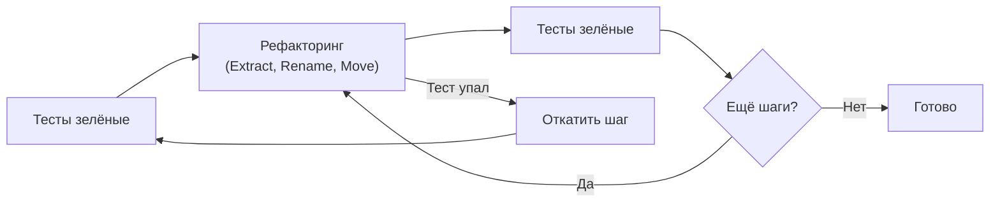
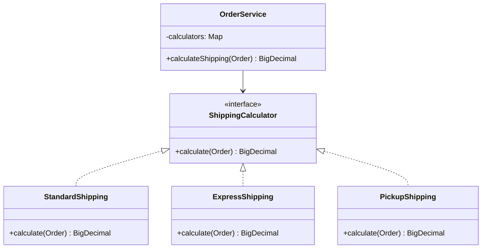
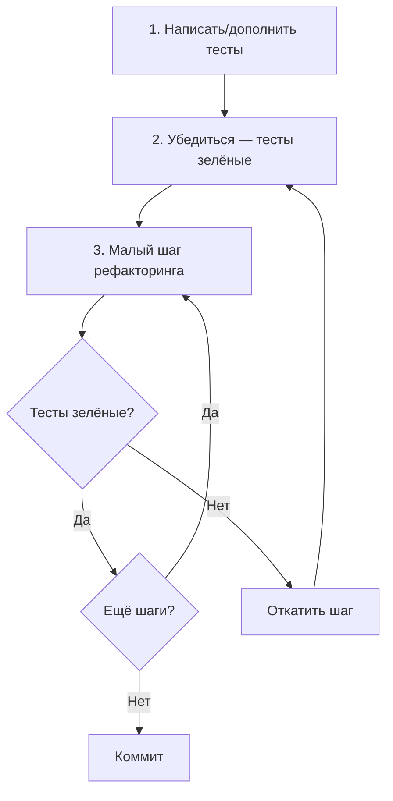
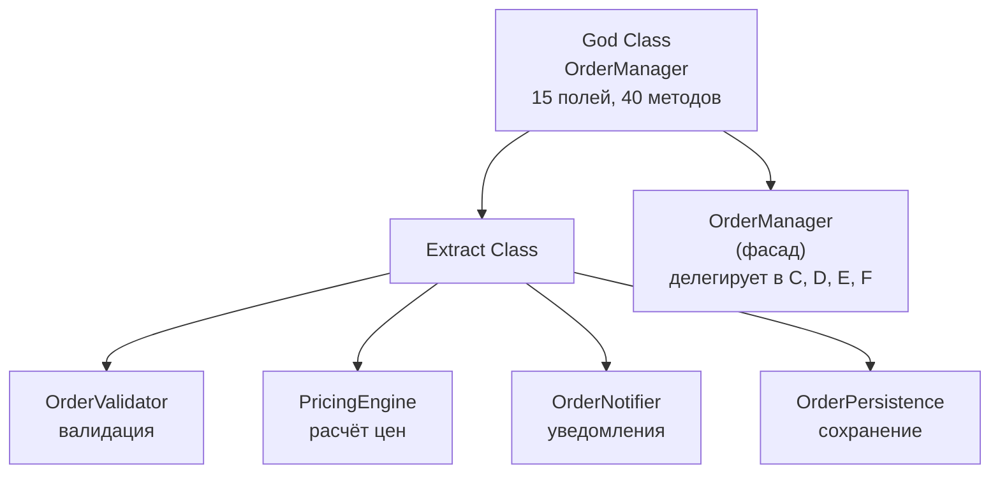
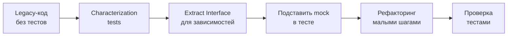
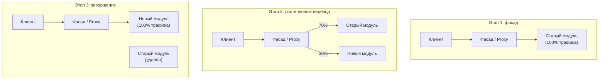
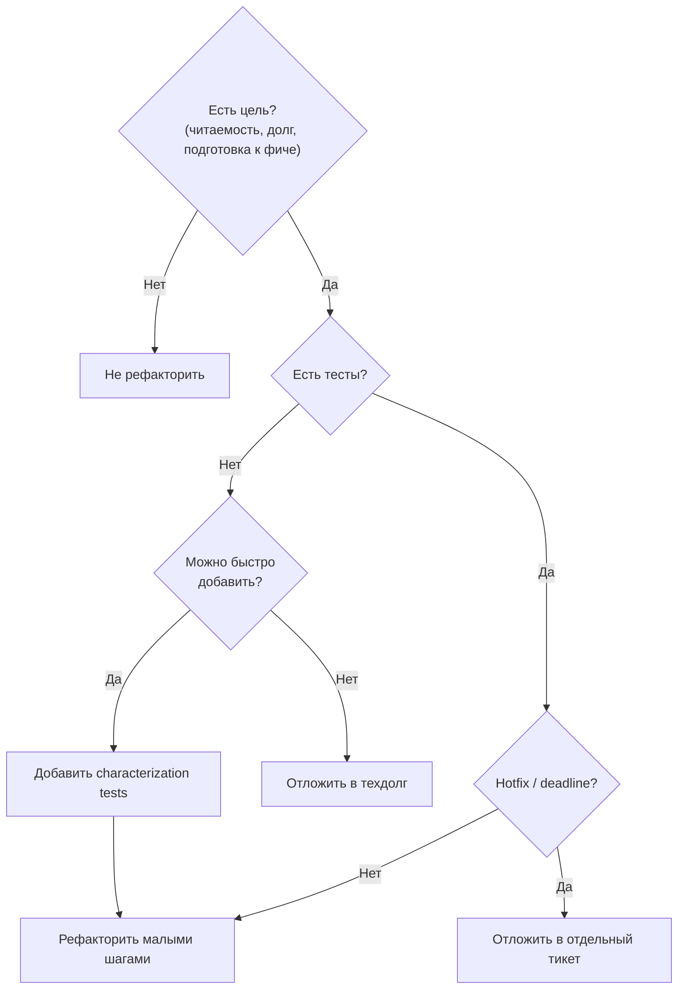

# Вопросы на собеседовании: Паттерны рефакторинга

Краткие ответы по рефакторингу: приёмы (`Extract Method`, `Replace Conditional` и др.), связь с тестами, «запахи кода», legacy.

## Полезные ссылки

### Официальная документация

- [Refactoring Guru](https://refactoring.guru/refactoring)
- [Martin Fowler - Refactoring](https://refactoring.com/)
- [Baeldung — Refactoring in Java](https://www.baeldung.com/java-refactoring)
- [Code Smells](https://www.baeldung.com/cs/code-smells) — виды "запахов кода" с примерами
- [An Introduction to Refactoring with IntelliJ IDEA](https://www.baeldung.com/intellij-refactoring) — рефакторинг в IntelliJ IDEA
- [Clean Coding in Java](https://www.baeldung.com/java-clean-code) — принципы чистого кода

## Содержание

- [Полезные ссылки](#полезные-ссылки)
- [See also](#see-also)
- [Введение](#введение)

**Основы рефакторинга**
- [Q1. (!) Что такое рефакторинг и когда его проводить?](#q1-что-такое-рефакторинг-и-когда-его-проводить)
- [Q2. (!) Рефакторинг без изменения поведения — что это значит?](#q2-рефакторинг-без-изменения-поведения--что-это-значит)
- [Q3. (!) Что такое Extract Method и когда применять?](#q3-что-такое-extract-method-и-когда-применять)
- [Q4. Что такое Replace Conditional with Polymorphism?](#q4-что-такое-replace-conditional-with-polymorphism)
- [Q5. Что такое Move Method / Move Field?](#q5-что-такое-move-method--move-field)

**Паттерны рефакторинга (Fowler)**
- [Q6. Что такое Introduce Parameter Object?](#q6-что-такое-introduce-parameter-object)
- [Q7. Что такое Replace Magic Numbers with Constants?](#q7-что-такое-replace-magic-numbers-with-constants)
- [Q8. Что такое Replace Type Code with State/Strategy?](#q8-что-такое-replace-type-code-with-statestrategy)
- [Q9. Что такое Extract Class / Extract Interface?](#q9-что-такое-extract-class--extract-interface)
- [Q10. Что такое Inline Method / Inline Variable?](#q10-что-такое-inline-method--inline-variable)
- [Q11. Что такое Replace Inheritance with Delegation (и наоборот)?](#q11-что-такое-replace-inheritance-with-delegation-и-наоборот)
- [Q12. Что такое Replace Exception with Test?](#q12-что-такое-replace-exception-with-test)
- [Q13. Что такое Introduce Null Object?](#q13-что-такое-introduce-null-object)

**Рефакторинг и тестирование**
- [Q14. Рефакторинг и тесты — как связаны?](#q14-рефакторинг-и-тесты--как-связаны)
- [Q15. Что такое «запахи кода» (code smells)?](#q15-что-такое-запахи-кода-code-smells)
- [Q16. Рефакторинг больших классов (God Class)?](#q16-рефакторинг-больших-классов-god-class)
- [Q17. Рефакторинг длинных методов?](#q17-рефакторинг-длинных-методов)
- [Q18. Рефакторинг дублирования кода?](#q18-рефакторинг-дублирования-кода)

**Рефакторинг в legacy и больших системах**
- [Q19. Рефакторинг в legacy-коде без тестов?](#q19-рефакторинг-в-legacy-коде-без-тестов)
- [Q20. Что такое Strangler Fig при рефакторинге системы?](#q20-что-такое-strangler-fig-при-рефакторинге-системы)
- [Q21. Рефакторинг и производительность?](#q21-рефакторинг-и-производительность)
- [Q22. Рефакторинг API и обратная совместимость?](#q22-рефакторинг-api-и-обратная-совместимость)
- [Q23. Какие инструменты помогают при рефакторинге в Java?](#q23-какие-инструменты-помогают-при-рефакторинге-в-java)
- [Q24. Рефакторинг многопоточного кода?](#q24-рефакторинг-многопоточного-кода)
- [Q25. Когда рефакторинг не стоит делать?](#q25-когда-рефакторинг-не-стоит-делать)

**Практики и метрики**
- [Q26. Что такое Replace Method with Method Object?](#q26-что-такое-replace-method-with-method-object)
- [Q27. Рефакторинг и покрытие тестами: какой минимум?](#q27-рефакторинг-и-покрытие-тестами-какой-минимум)
- [Q28. Как рефакторить без «большого взрыва» в монолите?](#q28-как-рефакторить-без-большого-взрыва-в-монолите)
- [Q29. Рефакторинг и код-ревью: на что смотреть?](#q29-рефакторинг-и-код-ревью-на-что-смотреть)
- [Q30. Какие метрики использовать до и после рефакторинга?](#q30-какие-метрики-использовать-до-и-после-рефакторинга)

**Дополнительные приёмы Фаулера и принципы**
- [Q31. (!) Что такое Decompose Conditional и когда применять?](#q31--что-такое-decompose-conditional-и-когда-применять)
- [Q32. Что такое Separate Query from Modifier?](#q32-что-такое-separate-query-from-modifier)
- [Q33. Как рефакторить нарушения SOLID-принципов на практике?](#q33-как-рефакторить-нарушения-solid-принципов-на-практике)
- [Q34. Что такое рефакторинг «по DRY»: Consolidate Duplicate Conditional Fragments?](#q34-что-такое-рефакторинг-по-dry-consolidate-duplicate-conditional-fragments)

**Продвинутые паттерны рефакторинга**
- [Q35. Как реализовать паттерн Strangler Fig в Spring Boot?](#q35-как-реализовать-паттерн-strangler-fig-в-spring-boot)
- [Q36. Decompose Conditional — замена if/else-цепочек паттернами](#q36-decompose-conditional--замена-ifelse-цепочек-паттернами)
- [Q37. Replace Primitive With Object — паттерн Value Object](#q37-replace-primitive-with-object--паттерн-value-object)
- [Q38. Introduce Parameter Object — борьба с длинными списками параметров](#q38-introduce-parameter-object--борьба-с-длинными-списками-параметров)
- [Q39. Рефакторинг схемы БД — Expand-Contract паттерн](#q39-рефакторинг-схемы-бд--expand-contract-паттерн)
- [Q40. Feature Envy — когда метод слишком интересуется чужими данными](#q40-feature-envy--когда-метод-слишком-интересуется-чужими-данными)
- [Q41. Shotgun Surgery — распознавание и лечение](#q41-shotgun-surgery--распознавание-и-лечение)
- [Q42. Extract Method Object — когда Extract Method недостаточно](#q42-extract-method-object--когда-extract-method-недостаточно)

## Введение

**Рефакторинг** — изменение внутренней структуры кода без изменения внешнего поведения. На собеседовании часто спрашивают о приёмах (по Фаулеру), связи с [тестами](../testing/unit-testing-interview.md), «запахах кода» и стратегиях в legacy. Рефакторинг тесно связан с [паттернами проектирования](../design-patterns/design-patterns-interview.md) — многие приёмы рефакторинга приводят код к известным паттернам.

## Q1. (!) Что такое рефакторинг и когда его проводить?

**Рефакторинг** — изменение внутренней структуры кода (именование, разбиение, перенос) без изменения наблюдаемого поведения.
Проводят: при добавлении новой функциональности (чтобы код легче расширять); при исправлении бага (упростить место бага); при «запахах кода» (дублирование, длинные методы, большие классы). Не стоит смешивать рефакторинг и фичи в одном коммите: сначала рефакторинг, затем фича (или отдельные PR).

Правило «три удара»: при первом дублировании оставляем как есть, при втором замечаем, при третьем выносим в общий метод/класс. Рефакторинг без [тестов](../testing/unit-testing-interview.md) рискован — сначала покрыть критичные места тестами, затем менять структуру. В PR рефакторинг лучше выносить отдельно от фичи: один PR — только рефакторинг (тесты зелёные), второй — новая логика. Так проще [ревью](code-review-interview.md) и откат.

**Практика:** перед фичей в модуле X — тикет «Рефакторинг X: вынести дублирование, разбить метод `processOrder`»; после merge рефакторинга — тикет с фичей. В описании коммита указывать «refactor: extract `calculateDiscount`» без «feat:» в том же коммите. IDE (`IntelliJ Refactor` -> `Extract Method`, `Rename`) и зелёные тесты после каждого шага.


> [!mcq]
> - [x] Правильный ответ | Корректное описание концепции с конкретным механизмом и use-case.
> - [ ] Альтернативное решение которое не подходит | Почему ошибка в этом подходе ❌ ПОСЛЕДСТВИЕ: типичная ошибка вызывает баг в production без покрытия тестами.
> - [ ] Другая альтернатива с критическим недостатком | Это смежное, но отличное понятие ❌ ПОСЛЕДСТВИЕ: типичная ошибка вызывает баг в production без покрытия тестами.
> - [ ] Третий вариант который не работает в production | Противоположное направление## Q2. (!) Рефакторинг без изменения поведения — что это значит? ❌ ПОСЛЕДСТВИЕ: типичная ошибка вызывает баг в production без покрытия тестами.

Поведение системы для пользователя и для вызывающего кода не меняется: те же входы дают те же выходы, те же исключения, те же побочные эффекты.
Достигается за счёт тестов (unit/integration): перед рефакторингом тесты зелёные, после — тоже. Изменяется только структура: имена, разбиение на методы/классы, расположение кода. Это позволяет безопасно улучшать код и не вносить регрессии.



**Практика:** перед рефакторингом запустить полный набор тестов и зафиксировать результат; после каждого шага (`Extract Method`, `Rename`) — снова запустить. Если тест упал — откатить шаг или исправить логику. Публичный API (сигнатуры методов, контракты) не менять в рамках «чистого» рефакторинга; при смене сигнатуры — отдельный коммит с миграцией вызывающего кода или `@Deprecated`.


> [!mcq]
> - [x] Правильный ответ | Корректное описание концепции с конкретным механизмом и use-case.
> - [ ] Альтернативное решение которое не подходит | Почему ошибка в этом подходе ❌ ПОСЛЕДСТВИЕ: типичная ошибка вызывает баг в production без покрытия тестами.
> - [ ] Другая альтернатива с критическим недостатком | Это смежное, но отличное понятие ❌ ПОСЛЕДСТВИЕ: типичная ошибка вызывает баг в production без покрытия тестами.
> - [ ] Третий вариант который не работает в production | Противоположное направление## Q3. (!) Что такое `Extract Method` и когда применять? ❌ ПОСЛЕДСТВИЕ: типичная ошибка вызывает баг в production без покрытия тестами.

`Extract Method` — вынос фрагмента кода в отдельный метод с говорящим именем. Применяют, когда: фрагмент можно назвать одним действием; метод слишком длинный; один и тот же фрагмент повторяется. Улучшает читаемость и даёт возможность переиспользовать логику.

**До рефакторинга:**

```java
public void processOrder(Order order) {
    // валидация
    if (order.getItems().isEmpty()) {
        throw new IllegalArgumentException("Пустой заказ");
    }
    if (order.getCustomer() == null) {
        throw new IllegalArgumentException("Нет покупателя");
    }

    // расчёт скидки
    BigDecimal discount = BigDecimal.ZERO;
    if (order.getCustomer().isVip()) {
        discount = order.getTotal()
            .multiply(new BigDecimal("0.10"));
    }
    if (order.getItems().size() > 10) {
        discount = discount.add(
            order.getTotal().multiply(new BigDecimal("0.05"))
        );
    }

    // применение и сохранение
    order.setDiscount(discount);
    order.setFinalPrice(order.getTotal().subtract(discount));
    orderRepository.save(order);
    notificationService.sendConfirmation(order);
}
```

**После рефакторинга:**

```java
public void processOrder(Order order) {
    validateOrder(order);
    BigDecimal discount = calculateDiscount(order);
    applyAndSave(order, discount);
}

private void validateOrder(Order order) {
    if (order.getItems().isEmpty()) {
        throw new IllegalArgumentException("Пустой заказ");
    }
    if (order.getCustomer() == null) {
        throw new IllegalArgumentException("Нет покупателя");
    }
}

private BigDecimal calculateDiscount(Order order) {
    BigDecimal discount = BigDecimal.ZERO;
    if (order.getCustomer().isVip()) {
        discount = order.getTotal()
            .multiply(VIP_DISCOUNT_RATE);
    }
    if (order.getItems().size() > BULK_THRESHOLD) {
        discount = discount.add(
            order.getTotal().multiply(BULK_DISCOUNT_RATE)
        );
    }
    return discount;
}

private void applyAndSave(Order order, BigDecimal discount) {
    order.setDiscount(discount);
    order.setFinalPrice(order.getTotal().subtract(discount));
    orderRepository.save(order);
    notificationService.sendConfirmation(order);
}
```

Имя метода должно описывать действие, а не детали реализации. Если для имени нужны «и», «или» — возможно, фрагмент стоит разбить на несколько методов. IDE (`IntelliJ`, `Eclipse`) поддерживают `Refactor` -> `Extract Method`.


> [!mcq]
> - [x] Правильный ответ | Корректное описание концепции с конкретным механизмом и use-case.
> - [ ] Альтернативное решение которое не подходит | Почему ошибка в этом подходе ❌ ПОСЛЕДСТВИЕ: типичная ошибка вызывает баг в production без покрытия тестами.
> - [ ] Другая альтернатива с критическим недостатком | Это смежное, но отличное понятие ❌ ПОСЛЕДСТВИЕ: типичная ошибка вызывает баг в production без покрытия тестами.
> - [ ] Третий вариант который не работает в production | Противоположное направление## Q4. Что такое `Replace Conditional with Polymorphism`? ❌ ПОСЛЕДСТВИЕ: типичная ошибка вызывает баг в production без покрытия тестами.

Замена цепочек `if/else` или `switch` по типу или коду на полиморфизм: у каждого варианта — свой класс (или стратегия), общий интерфейс. Этот приём часто приводит к паттерну [Strategy](../design-patterns/design-patterns-interview.md).

**До рефакторинга:**

```java
public BigDecimal calculateShipping(Order order) {
    switch (order.getDeliveryType()) {
        case STANDARD:
            return order.getWeight()
                .multiply(new BigDecimal("5.0"));
        case EXPRESS:
            return order.getWeight()
                .multiply(new BigDecimal("10.0"))
                .add(new BigDecimal("200"));
        case PICKUP:
            return BigDecimal.ZERO;
        default:
            throw new IllegalArgumentException(
                "Unknown delivery: " + order.getDeliveryType()
            );
    }
}
```

**После рефакторинга:**

```java
public interface ShippingCalculator {
    BigDecimal calculate(Order order);
}

public class StandardShipping implements ShippingCalculator {
    public BigDecimal calculate(Order order) {
        return order.getWeight().multiply(new BigDecimal("5.0"));
    }
}

public class ExpressShipping implements ShippingCalculator {
    public BigDecimal calculate(Order order) {
        return order.getWeight()
            .multiply(new BigDecimal("10.0"))
            .add(new BigDecimal("200"));
    }
}

public class PickupShipping implements ShippingCalculator {
    public BigDecimal calculate(Order order) {
        return BigDecimal.ZERO;
    }
}

// Использование через Map или фабрику
private final Map<DeliveryType, ShippingCalculator> calculators = Map.of(
    STANDARD, new StandardShipping(),
    EXPRESS,  new ExpressShipping(),
    PICKUP,   new PickupShipping()
);

public BigDecimal calculateShipping(Order order) {
    return calculators.get(order.getDeliveryType())
        .calculate(order);
}
```



Добавление нового типа доставки = новый класс + строка в `Map`, без правок в условной логике.


> [!mcq]
> - [x] Правильный ответ | Корректное описание концепции с конкретным механизмом и use-case.
> - [ ] Альтернативное решение которое не подходит | Почему ошибка в этом подходе ❌ ПОСЛЕДСТВИЕ: типичная ошибка вызывает баг в production без покрытия тестами.
> - [ ] Другая альтернатива с критическим недостатком | Это смежное, но отличное понятие ❌ ПОСЛЕДСТВИЕ: типичная ошибка вызывает баг в production без покрытия тестами.
> - [ ] Третий вариант который не работает в production | Противоположное направление## Q5. Что такое `Move Method / Move Field`? ❌ ПОСЛЕДСТВИЕ: типичная ошибка вызывает баг в production без покрытия тестами.

**Move Method** — перенос метода в тот класс, чьи данные он использует чаще всего (или куда он логически относится). **Move Field** — перенос поля в класс, который им владеет по смыслу. Улучшает связность и уменьшает сцепление.

**До рефакторинга:**

```java
// Метод в OrderService использует только поля Order
public class OrderService {
    public String formatAddress(Order order) {
        return order.getCity() + ", "
            + order.getStreet() + " "
            + order.getBuilding();
    }
}
```

**После рефакторинга:**

```java
public class Order {
    private String city;
    private String street;
    private String building;

    public String formatAddress() {
        return city + ", " + street + " " + building;
    }
}

// В сервисе — делегирование с @Deprecated до миграции
public class OrderService {
    @Deprecated(since = "2.0", forRemoval = true)
    public String formatAddress(Order order) {
        return order.formatAddress();
    }
}
```

Перед переносом убедиться, что старый API (если есть) сохраняется через делегирование или `@Deprecated`, чтобы не сломать вызывающий код.


> [!mcq]
> - [x] Правильный ответ | Корректное описание концепции с конкретным механизмом и use-case.
> - [ ] Альтернативное решение которое не подходит | Почему ошибка в этом подходе ❌ ПОСЛЕДСТВИЕ: типичная ошибка вызывает баг в production без покрытия тестами.
> - [ ] Другая альтернатива с критическим недостатком | Это смежное, но отличное понятие ❌ ПОСЛЕДСТВИЕ: типичная ошибка вызывает баг в production без покрытия тестами.
> - [ ] Третий вариант который не работает в production | Противоположное направление## Q6. Что такое `Introduce Parameter Object`? ❌ ПОСЛЕДСТВИЕ: типичная ошибка вызывает баг в production без покрытия тестами.

Группа часто передаваемых вместе параметров заменяется одним объектом (record или классом). Уменьшает количество параметров, упрощает добавление новых полей и передачу контекста.

**До рефакторинга:**

```java
public List<Transaction> findTransactions(
        long userId,
        LocalDate from,
        LocalDate to,
        String currency,
        BigDecimal minAmount) {
    // ... фильтрация по всем параметрам
}
```

**После рефакторинга:**

```java
public record DateRange(LocalDate from, LocalDate to) {
    public DateRange {
        if (from.isAfter(to)) {
            throw new IllegalArgumentException(
                "from не может быть позже to"
            );
        }
    }
}

public record TransactionFilter(
        long userId,
        DateRange dateRange,
        String currency,
        BigDecimal minAmount) {}

public List<Transaction> findTransactions(
        TransactionFilter filter) {
    // ... фильтрация через filter.dateRange().from() и т.д.
}
```

В Java 16+ удобно использовать `record` для неизменяемых Parameter Object. Добавление нового поля в фильтр не меняет сигнатуру метода.


> [!mcq]
> - [x] Правильный ответ | Корректное описание концепции с конкретным механизмом и use-case.
> - [ ] Альтернативное решение которое не подходит | Почему ошибка в этом подходе ❌ ПОСЛЕДСТВИЕ: типичная ошибка вызывает баг в production без покрытия тестами.
> - [ ] Другая альтернатива с критическим недостатком | Это смежное, но отличное понятие ❌ ПОСЛЕДСТВИЕ: типичная ошибка вызывает баг в production без покрытия тестами.
> - [ ] Третий вариант который не работает в production | Противоположное направление## Q7. Что такое `Replace Magic Numbers with Constants`? ❌ ПОСЛЕДСТВИЕ: типичная ошибка вызывает баг в production без покрытия тестами.

Числовые и строковые литералы с неочевидным смыслом заменяются именованными константами. Улучшает читаемость и централизует изменение «магических» значений.

**До рефакторинга:**

```java
public void processWithRetry(Runnable task) {
    for (int i = 0; i < 3; i++) {
        try {
            task.run();
            return;
        } catch (Exception e) {
            try {
                Thread.sleep(3000);
            } catch (InterruptedException ie) {
                Thread.currentThread().interrupt();
            }
        }
    }
    if (role.equals("admin")) {
        notifyAdmin();
    }
}
```

**После рефакторинга:**

```java
private static final int MAX_RETRY_COUNT = 3;
private static final long RETRY_DELAY_MS = 3_000L;
private static final String ROLE_ADMIN = "admin";

public void processWithRetry(Runnable task) {
    for (int i = 0; i < MAX_RETRY_COUNT; i++) {
        try {
            task.run();
            return;
        } catch (Exception e) {
            try {
                Thread.sleep(RETRY_DELAY_MS);
            } catch (InterruptedException ie) {
                Thread.currentThread().interrupt();
            }
        }
    }
    if (ROLE_ADMIN.equals(role)) {
        notifyAdmin();
    }
}
```

Константы размещают в классе сущности или в отдельном классе констант. Для строковых значений ролей лучше использовать `enum`.


> [!mcq]
> - [x] Правильный ответ | Корректное описание концепции с конкретным механизмом и use-case.
> - [ ] Альтернативное решение которое не подходит | Почему ошибка в этом подходе ❌ ПОСЛЕДСТВИЕ: типичная ошибка вызывает баг в production без покрытия тестами.
> - [ ] Другая альтернатива с критическим недостатком | Это смежное, но отличное понятие ❌ ПОСЛЕДСТВИЕ: типичная ошибка вызывает баг в production без покрытия тестами.
> - [ ] Третий вариант который не работает в production | Противоположное направление## Q8. Что такое `Replace Type Code with State/Strategy`? ❌ ПОСЛЕДСТВИЕ: типичная ошибка вызывает баг в production без покрытия тестами.

Вместо поля «тип» (число или enum) и ветвлений по нему вводятся **отдельные классы состояний или стратегий**; объект делегирует поведение текущему состоянию/стратегии. Этот приём связан с [паттернами State и Strategy](../design-patterns/design-patterns-interview.md).

**State** — когда объект меняет поведение в зависимости от внутреннего состояния; **Strategy** — когда выбирается алгоритм извне.

**До рефакторинга:**

```java
public class Employee {
    private int type; // 0 = ENGINEER, 1 = MANAGER, 2 = SALESMAN

    public BigDecimal calculatePay(int hoursWorked) {
        switch (type) {
            case 0: return hourlyRate.multiply(
                        BigDecimal.valueOf(hoursWorked));
            case 1: return salary;
            case 2: return salary.add(commission);
            default: throw new IllegalStateException();
        }
    }
}
```

**После рефакторинга:**

```java
public interface EmployeeType {
    BigDecimal calculatePay(PayContext ctx);
}

public class Engineer implements EmployeeType {
    public BigDecimal calculatePay(PayContext ctx) {
        return ctx.hourlyRate()
            .multiply(BigDecimal.valueOf(ctx.hoursWorked()));
    }
}

public class Manager implements EmployeeType {
    public BigDecimal calculatePay(PayContext ctx) {
        return ctx.salary();
    }
}

public class Salesman implements EmployeeType {
    public BigDecimal calculatePay(PayContext ctx) {
        return ctx.salary().add(ctx.commission());
    }
}

public class Employee {
    private final EmployeeType type;

    public BigDecimal calculatePay(int hoursWorked) {
        return type.calculatePay(
            new PayContext(hourlyRate, salary, commission, hoursWorked)
        );
    }
}
```

Добавление нового типа сотрудника = новый класс, без правок в `switch`.


> [!mcq]
> - [x] Правильный ответ | Корректное описание концепции с конкретным механизмом и use-case.
> - [ ] Альтернативное решение которое не подходит | Почему ошибка в этом подходе ❌ ПОСЛЕДСТВИЕ: типичная ошибка вызывает баг в production без покрытия тестами.
> - [ ] Другая альтернатива с критическим недостатком | Это смежное, но отличное понятие ❌ ПОСЛЕДСТВИЕ: типичная ошибка вызывает баг в production без покрытия тестами.
> - [ ] Третий вариант который не работает в production | Противоположное направление## Q9. Что такое `Extract Class / Extract Interface`? ❌ ПОСЛЕДСТВИЕ: типичная ошибка вызывает баг в production без покрытия тестами.

**Extract Class** — выделение части ответственности большого класса в новый класс; исходный класс держит ссылку и делегирует. **Extract Interface** — выделение контракта в интерфейс, чтобы клиенты зависели от абстракции.

**Пример Extract Class:**

```java
// До: God Class с расчётами и аудитом
public class OrderService {
    public BigDecimal calculateDiscount(Order order) { /* ... */ }
    public BigDecimal calculateTax(Order order) { /* ... */ }
    public void logAudit(Order order, String action) { /* ... */ }
    public void sendAuditReport(LocalDate date) { /* ... */ }
}

// После: ответственности разделены
public class DiscountCalculator {
    public BigDecimal calculate(Order order) { /* ... */ }
}

public class TaxCalculator {
    public BigDecimal calculate(Order order) { /* ... */ }
}

public class OrderAuditLogger {
    public void log(Order order, String action) { /* ... */ }
    public void sendReport(LocalDate date) { /* ... */ }
}

public class OrderService {
    private final DiscountCalculator discountCalc;
    private final TaxCalculator taxCalc;
    private final OrderAuditLogger auditLogger;

    public void processOrder(Order order) {
        BigDecimal discount = discountCalc.calculate(order);
        BigDecimal tax = taxCalc.calculate(order);
        auditLogger.log(order, "processed");
    }
}
```

**Пример Extract Interface:**

```java
public interface UserRepository {
    Optional<User> findById(Long id);
    User save(User user);
    List<User> findByRole(String role);
}

// В тестах подставляем in-memory реализацию
public class InMemoryUserRepository implements UserRepository {
    private final Map<Long, User> store = new HashMap<>();

    public Optional<User> findById(Long id) {
        return Optional.ofNullable(store.get(id));
    }
    // ...
}
```

Уменьшает размер класса, улучшает тестируемость (моки по интерфейсу) и позволяет подставлять разные реализации. В Java интерфейсы часто используют для слоёв (сервис, репозиторий), что хорошо видно в [вопросах по unit-тестированию](../testing/unit-testing-interview.md).


> [!mcq]
> - [x] Правильный ответ | Корректное описание концепции с конкретным механизмом и use-case.
> - [ ] Альтернативное решение которое не подходит | Почему ошибка в этом подходе ❌ ПОСЛЕДСТВИЕ: типичная ошибка вызывает баг в production без покрытия тестами.
> - [ ] Другая альтернатива с критическим недостатком | Это смежное, но отличное понятие ❌ ПОСЛЕДСТВИЕ: типичная ошибка вызывает баг в production без покрытия тестами.
> - [ ] Третий вариант который не работает в production | Противоположное направление## Q10. Что такое `Inline Method / Inline Variable`? ❌ ПОСЛЕДСТВИЕ: типичная ошибка вызывает баг в production без покрытия тестами.

**Inline Method** — тело метода вставляется в место вызова, метод удаляется. Применяют, когда метод только дублирует имя и не даёт пользы.
**Inline Variable** — замена переменной одним выражением. Упрощает код, когда промежуточная абстракция избыточна.

**До рефакторинга:**

```java
private int getRating() {
    return moreThanFiveDeliveries() ? 2 : 1;
}

private boolean moreThanFiveDeliveries() {
    return numberOfDeliveries > 5;
}

// Вызов:
int rating = getRating();
if (rating > 1) {
    applyBonus();
}
```

**После Inline Method + Inline Variable:**

```java
// moreThanFiveDeliveries() не добавляет ясности — инлайним
if (numberOfDeliveries > 5) {
    applyBonus();
}
```

Перед инлайном убедиться, что тесты покрывают поведение и что читаемость не пострадает. IDE (`IntelliJ Refactor` -> `Inline`) выполняет подстановку и удаление автоматически.


> [!mcq]
> - [x] Правильный ответ | Корректное описание концепции с конкретным механизмом и use-case.
> - [ ] Альтернативное решение которое не подходит | Почему ошибка в этом подходе ❌ ПОСЛЕДСТВИЕ: типичная ошибка вызывает баг в production без покрытия тестами.
> - [ ] Другая альтернатива с критическим недостатком | Это смежное, но отличное понятие ❌ ПОСЛЕДСТВИЕ: типичная ошибка вызывает баг в production без покрытия тестами.
> - [ ] Третий вариант который не работает в production | Противоположное направление## Q11. Что такое `Replace Inheritance with Delegation` (и наоборот)? ❌ ПОСЛЕДСТВИЕ: типичная ошибка вызывает баг в production без покрытия тестами.

**Replace Inheritance with Delegation** — вместо наследования класс хранит экземпляр «родителя» и делегирует ему вызовы. Убирает жёсткую связь и лишние методы наследника. **Replace Delegation with Inheritance** — когда делегат используется почти как единственная реализация, можно наследоваться от него.

**До рефакторинга (проблема с наследованием):**

```java
// Stack наследует Vector — тянет все методы: get(i), add(i, e)
// Нарушает инкапсуляцию стека — можно вставить в середину!
public class Stack<E> extends Vector<E> {
    public E push(E item) {
        addElement(item);
        return item;
    }
    public E pop() {
        return remove(size() - 1);
    }
}

// Проблема:
Stack<String> stack = new Stack<>();
stack.push("a");
stack.add(0, "oops"); // доступен метод Vector — сломан LIFO
```

**После рефакторинга (делегирование):**

```java
public class Stack<E> {
    private final List<E> delegate = new ArrayList<>();

    public E push(E item) {
        delegate.add(item);
        return item;
    }

    public E pop() {
        if (delegate.isEmpty()) {
            throw new EmptyStackException();
        }
        return delegate.remove(delegate.size() - 1);
    }

    public E peek() {
        if (delegate.isEmpty()) {
            throw new EmptyStackException();
        }
        return delegate.get(delegate.size() - 1);
    }

    public int size() {
        return delegate.size();
    }
}
```

Выбор зависит от того, нужна ли подстановка разных реализаций и не нарушается ли Liskov Substitution Principle.


> [!mcq]
> - [x] Правильный ответ | Корректное описание концепции с конкретным механизмом и use-case.
> - [ ] Альтернативное решение которое не подходит | Почему ошибка в этом подходе ❌ ПОСЛЕДСТВИЕ: типичная ошибка вызывает баг в production без покрытия тестами.
> - [ ] Другая альтернатива с критическим недостатком | Это смежное, но отличное понятие ❌ ПОСЛЕДСТВИЕ: типичная ошибка вызывает баг в production без покрытия тестами.
> - [ ] Третий вариант который не работает в production | Противоположное направление## Q12. Что такое `Replace Exception with Test`? ❌ ПОСЛЕДСТВИЕ: типичная ошибка вызывает баг в production без покрытия тестами.

Проверка условия до операции заменяет использование исключения для управления потоком. Исключения оставляем для действительно исключительных ситуаций.

**До рефакторинга:**

```java
public User findUser(Long id) {
    try {
        return repository.findById(id);
    } catch (EntityNotFoundException e) {
        return null;
    }
}
```

**После рефакторинга:**

```java
// Вариант 1: Optional
public Optional<User> findUser(Long id) {
    return repository.findOptionalById(id);
}

// Вариант 2: явная проверка
public User findUser(Long id) {
    if (!repository.existsById(id)) {
        return null;
    }
    return repository.findById(id);
}
```

Исключения дороги по стеку вызовов — для ожидаемого «не найдено» проверка дешевле и читаемее. В API часто используют `Optional` как результат с типом «значение или отсутствие».


> [!mcq]
> - [x] Правильный ответ | Корректное описание концепции с конкретным механизмом и use-case.
> - [ ] Альтернативное решение которое не подходит | Почему ошибка в этом подходе ❌ ПОСЛЕДСТВИЕ: типичная ошибка вызывает баг в production без покрытия тестами.
> - [ ] Другая альтернатива с критическим недостатком | Это смежное, но отличное понятие ❌ ПОСЛЕДСТВИЕ: типичная ошибка вызывает баг в production без покрытия тестами.
> - [ ] Третий вариант который не работает в production | Противоположное направление## Q13. Что такое `Introduce Null Object`? ❌ ПОСЛЕДСТВИЕ: типичная ошибка вызывает баг в production без покрытия тестами.

Вместо `null` и проверок на `null` подставляется объект с «пустым» поведением. Убирает разбросанные `if (x != null)` и `NullPointerException`. Подходит для зависимостей (логирование, уведомления), где «ничего не делать» — валидное поведение.

**До рефакторинга:**

```java
public class OrderService {
    private final Logger logger; // может быть null

    public void process(Order order) {
        if (logger != null) {
            logger.info("Processing order: " + order.getId());
        }
        // ... бизнес-логика
        if (logger != null) {
            logger.info("Order processed: " + order.getId());
        }
    }
}
```

**После рефакторинга:**

```java
public interface Logger {
    void info(String message);
    void error(String message, Throwable cause);
}

public class ConsoleLogger implements Logger {
    public void info(String message) {
        System.out.println("[INFO] " + message);
    }
    public void error(String message, Throwable cause) {
        System.err.println("[ERROR] " + message);
        cause.printStackTrace();
    }
}

// Null Object — пустая реализация
public class NoOpLogger implements Logger {
    public void info(String message) { /* ничего */ }
    public void error(String message, Throwable cause) { /* ничего */ }
}

public class OrderService {
    private final Logger logger; // всегда не null

    public OrderService(Logger logger) {
        this.logger = Objects.requireNonNull(logger);
    }

    public void process(Order order) {
        logger.info("Processing order: " + order.getId());
        // ... бизнес-логика — никаких if (logger != null)
        logger.info("Order processed: " + order.getId());
    }
}
```

Для коллекций аналогичный подход — `Collections.emptyList()` вместо `null`, чтобы не проверять `if (list != null && !list.isEmpty())`.


> [!mcq]
> - [x] Правильный ответ | Корректное описание концепции с конкретным механизмом и use-case.
> - [ ] Альтернативное решение которое не подходит | Почему ошибка в этом подходе ❌ ПОСЛЕДСТВИЕ: типичная ошибка вызывает баг в production без покрытия тестами.
> - [ ] Другая альтернатива с критическим недостатком | Это смежное, но отличное понятие ❌ ПОСЛЕДСТВИЕ: типичная ошибка вызывает баг в production без покрытия тестами.
> - [ ] Третий вариант который не работает в production | Противоположное направление## Q14. Рефакторинг и тесты — как связаны? ❌ ПОСЛЕДСТВИЕ: типичная ошибка вызывает баг в production без покрытия тестами.

Тесты — страховка при рефакторинге: до и после рефакторинга [тесты](../testing/unit-testing-interview.md) должны оставаться зелёными. Сначала пишут или дополняют тесты на критичное поведение (особенно в legacy), затем рефакторят небольшими шагами, после каждого шага запускают тесты.



**Пример characterization test для legacy-кода:**

```java
@Test
void characterize_discountCalculation() {
    // Фиксируем ТЕКУЩЕЕ поведение, даже если оно кажется странным
    Order order = new Order();
    order.setTotal(new BigDecimal("1000"));
    order.setCustomerType("VIP");
    order.setItemCount(15);

    BigDecimal result = legacyService.calculateDiscount(order);

    // Этот тест защищает от регрессии при рефакторинге
    assertThat(result).isEqualByComparingTo("150.00");
}
```

Крупный рефакторинг лучше разбивать на малые коммиты/PR, каждый с зелёными тестами. В legacy без тестов: добавлять characterization tests в местах, которые собираетесь менять.


> [!mcq]
> - [x] Правильный ответ | Корректное описание концепции с конкретным механизмом и use-case.
> - [ ] Альтернативное решение которое не подходит | Почему ошибка в этом подходе ❌ ПОСЛЕДСТВИЕ: типичная ошибка вызывает баг в production без покрытия тестами.
> - [ ] Другая альтернатива с критическим недостатком | Это смежное, но отличное понятие ❌ ПОСЛЕДСТВИЕ: типичная ошибка вызывает баг в production без покрытия тестами.
> - [ ] Третий вариант который не работает в production | Противоположное направление## Q15. Что такое «запахи кода» (code smells)? ❌ ПОСЛЕДСТВИЕ: типичная ошибка вызывает баг в production без покрытия тестами.

Запахи кода — признаки возможных проблем, указывающие места для рефакторинга. Классификация по Фаулеру помогает систематически улучшать код. Тесно связаны с [техническим долгом](technical-debt-interview.md).

| Запах кода | Приём рефакторинга |
|---|---|
| Длинный метод (> 20 строк) | `Extract Method` |
| Большой класс (God Class) | `Extract Class`, `Extract Interface` |
| Длинный список параметров | `Introduce Parameter Object` |
| Дублирование кода | `Extract Method`, вынос в общий модуль |
| Цепочки `if/else` по типу | `Replace Conditional with Polymorphism` |
| Feature Envy (метод завидует чужим данным) | `Move Method` |
| Magic Numbers | `Replace Magic Numbers with Constants` |
| Отказ от наследства | `Replace Inheritance with Delegation` |

**Пример Feature Envy:**

```java
// До: метод в ReportService завидует данным Order
public class ReportService {
    public String formatOrderSummary(Order order) {
        return order.getCustomer().getName() + ": "
            + order.getItems().size() + " items, "
            + order.getTotal().subtract(order.getDiscount());
    }
}

// После: логика перенесена в Order (Move Method)
public class Order {
    public String formatSummary() {
        return customer.getName() + ": "
            + items.size() + " items, "
            + total.subtract(discount);
    }
}
```

`SonarQube` и `SpotBugs` находят часть запахов (дублирование, сложность). При [ревью](code-review-interview.md) обращать внимание на запахи из таблицы выше.


> [!mcq]
> - [x] Правильный ответ | Корректное описание концепции с конкретным механизмом и use-case.
> - [ ] Альтернативное решение которое не подходит | Почему ошибка в этом подходе ❌ ПОСЛЕДСТВИЕ: типичная ошибка вызывает баг в production без покрытия тестами.
> - [ ] Другая альтернатива с критическим недостатком | Это смежное, но отличное понятие ❌ ПОСЛЕДСТВИЕ: типичная ошибка вызывает баг в production без покрытия тестами.
> - [ ] Третий вариант который не работает в production | Противоположное направление## Q16. Рефакторинг больших классов (God Class)? ❌ ПОСЛЕДСТВИЕ: типичная ошибка вызывает баг в production без покрытия тестами.

Класс с множеством полей и методов разбивают: `Extract Class` по зонам ответственности; `Extract Interface` для контракта; перенос части логики в сервисы/хелперы.



**Пример поэтапного разбиения:**

```java
// Шаг 1: выделяем самый независимый кусок
public class DiscountCalculator {
    public BigDecimal calculate(Order order) {
        // логика из OrderManager
    }
}

// Шаг 2: исходный класс делегирует
public class OrderManager {
    private final DiscountCalculator discountCalc =
        new DiscountCalculator();

    @Deprecated(since = "2.0", forRemoval = true)
    public BigDecimal calculateDiscount(Order order) {
        return discountCalc.calculate(order);
    }
}

// Шаг 3: повторить для следующей зоны ответственности
```

Важно не сломать существующие вызовы: оставлять фасад или deprecated-методы с делегированием до миграции клиентов. Не делать «большой взрыв» — один `Extract Class` за PR.


> [!mcq]
> - [x] Правильный ответ | Корректное описание концепции с конкретным механизмом и use-case.
> - [ ] Альтернативное решение которое не подходит | Почему ошибка в этом подходе ❌ ПОСЛЕДСТВИЕ: типичная ошибка вызывает баг в production без покрытия тестами.
> - [ ] Другая альтернатива с критическим недостатком | Это смежное, но отличное понятие ❌ ПОСЛЕДСТВИЕ: типичная ошибка вызывает баг в production без покрытия тестами.
> - [ ] Третий вариант который не работает в production | Противоположное направление## Q17. Рефакторинг длинных методов? ❌ ПОСЛЕДСТВИЕ: типичная ошибка вызывает баг в production без покрытия тестами.

`Extract Method` для логических блоков; циклы и условия выносят в отдельные методы с говорящими именами. Цель — метод, который читается как последовательность шагов высокого уровня.

**До рефакторинга:**

```java
public Invoice generateInvoice(Order order) {
    // 80 строк: валидация, расчёт, форматирование, отправка
    if (order == null || order.getItems().isEmpty()) {
        throw new IllegalArgumentException("Invalid order");
    }
    BigDecimal subtotal = BigDecimal.ZERO;
    for (OrderItem item : order.getItems()) {
        subtotal = subtotal.add(
            item.getPrice().multiply(
                BigDecimal.valueOf(item.getQuantity())
            )
        );
    }
    BigDecimal tax = subtotal.multiply(TAX_RATE);
    BigDecimal total = subtotal.add(tax);
    // ... ещё 50 строк форматирования и отправки
}
```

**После рефакторинга (метод-оркестратор):**

```java
public Invoice generateInvoice(Order order) {
    validateOrder(order);
    BigDecimal subtotal = calculateSubtotal(order);
    BigDecimal tax = calculateTax(subtotal);
    Invoice invoice = formatInvoice(order, subtotal, tax);
    sendToCustomer(invoice);
    return invoice;
}
```

Каждый новый метод — один шаг рефакторинга, затем тесты. Не выносить в метод один оператор без смысла; блок должен иметь имя-действие.


> [!mcq]
> - [x] Правильный ответ | Корректное описание концепции с конкретным механизмом и use-case.
> - [ ] Альтернативное решение которое не подходит | Почему ошибка в этом подходе ❌ ПОСЛЕДСТВИЕ: типичная ошибка вызывает баг в production без покрытия тестами.
> - [ ] Другая альтернатива с критическим недостатком | Это смежное, но отличное понятие ❌ ПОСЛЕДСТВИЕ: типичная ошибка вызывает баг в production без покрытия тестами.
> - [ ] Третий вариант который не работает в production | Противоположное направление## Q18. Рефакторинг дублирования кода? ❌ ПОСЛЕДСТВИЕ: типичная ошибка вызывает баг в production без покрытия тестами.

Идентичный или почти идентичный код выносят в общий метод; при различиях — параметризация или шаблонный метод.

**До рефакторинга (дублирование):**

```java
public List<User> findActiveAdmins() {
    List<User> result = new ArrayList<>();
    for (User user : allUsers) {
        if (user.isActive() && user.getRole().equals("ADMIN")) {
            result.add(user);
        }
    }
    return result;
}

public List<User> findActiveManagers() {
    List<User> result = new ArrayList<>();
    for (User user : allUsers) {
        if (user.isActive() && user.getRole().equals("MANAGER")) {
            result.add(user);
        }
    }
    return result;
}
```

**После рефакторинга (параметризация):**

```java
public List<User> findActiveByRole(String role) {
    return allUsers.stream()
        .filter(User::isActive)
        .filter(u -> u.getRole().equals(role))
        .toList();
}

// Или более гибко — через Predicate
public List<User> findUsers(Predicate<User> criteria) {
    return allUsers.stream()
        .filter(criteria)
        .toList();
}
```

Правило трёх: при первом дублировании можно оставить, при втором задуматься, при третьем вынести. При выносе в утилитный класс проверить зависимости; утилита не должна тянуть доменную логику.


> [!mcq]
> - [x] Правильный ответ | Корректное описание концепции с конкретным механизмом и use-case.
> - [ ] Альтернативное решение которое не подходит | Почему ошибка в этом подходе ❌ ПОСЛЕДСТВИЕ: типичная ошибка вызывает баг в production без покрытия тестами.
> - [ ] Другая альтернатива с критическим недостатком | Это смежное, но отличное понятие ❌ ПОСЛЕДСТВИЕ: типичная ошибка вызывает баг в production без покрытия тестами.
> - [ ] Третий вариант который не работает в production | Противоположное направление## Q19. Рефакторинг в legacy-коде без тестов? ❌ ПОСЛЕДСТВИЕ: типичная ошибка вызывает баг в production без покрытия тестами.

Сначала по возможности добавить тесты на критичное поведение (characterization tests), затем рефакторить небольшими шагами с частым запуском тестов.



**Пример: обёртка зависимости для тестирования:**

```java
// Legacy: жёсткая зависимость, невозможно тестировать
public class LegacyReportService {
    public Report generate(String query) {
        Connection conn = DriverManager.getConnection(DB_URL);
        // 200 строк SQL и логики...
    }
}

// Шаг 1: Extract Interface для зависимости
public interface DataSource {
    List<Map<String, Object>> executeQuery(String sql);
}

// Шаг 2: обернуть legacy-зависимость
public class JdbcDataSource implements DataSource {
    public List<Map<String, Object>> executeQuery(String sql) {
        // ... JDBC-код
    }
}

// Шаг 3: теперь можно тестировать
public class ReportService {
    private final DataSource dataSource;

    public ReportService(DataSource dataSource) {
        this.dataSource = dataSource;
    }
    // ... логика без прямого JDBC
}

// В тесте:
DataSource mock = Mockito.mock(DataSource.class);
var service = new ReportService(mock);
```

Если зависимости тяжёлые — вынести интерфейс и подставлять заглушку в [тесте](../testing/unit-testing-interview.md); затем рефакторить реализацию. Подробнее о Strangler Fig — в следующем вопросе.


> [!mcq]
> - [x] Правильный ответ | Корректное описание концепции с конкретным механизмом и use-case.
> - [ ] Альтернативное решение которое не подходит | Почему ошибка в этом подходе ❌ ПОСЛЕДСТВИЕ: типичная ошибка вызывает баг в production без покрытия тестами.
> - [ ] Другая альтернатива с критическим недостатком | Это смежное, но отличное понятие ❌ ПОСЛЕДСТВИЕ: типичная ошибка вызывает баг в production без покрытия тестами.
> - [ ] Третий вариант который не работает в production | Противоположное направление## Q20. Что такое Strangler Fig при рефакторинге системы? ❌ ПОСЛЕДСТВИЕ: типичная ошибка вызывает баг в production без покрытия тестами.

Strangler Fig — постепенная замена старой системы новой: новый функционал реализуется в новом коде; трафик/вызовы по мере готовности переключаются на новый код; старый код со временем отключается.



**Пример переключения по feature flag:**

```java
@Service
public class OrderFacade {
    private final LegacyOrderService legacyService;
    private final NewOrderService newService;
    private final FeatureToggle featureToggle;

    public OrderResult processOrder(Order order) {
        if (featureToggle.isEnabled("new-order-processing")) {
            return newService.process(order);
        }
        return legacyService.process(order);
    }
}
```

Позволяет не делать «большой взрыв» и снижает риски. Применимо к монолиту -> микросервисам, смене технологий, крупному рефакторингу без остановки продукта.


> [!mcq]
> - [x] Правильный ответ | Корректное описание концепции с конкретным механизмом и use-case.
> - [ ] Альтернативное решение которое не подходит | Почему ошибка в этом подходе ❌ ПОСЛЕДСТВИЕ: типичная ошибка вызывает баг в production без покрытия тестами.
> - [ ] Другая альтернатива с критическим недостатком | Это смежное, но отличное понятие ❌ ПОСЛЕДСТВИЕ: типичная ошибка вызывает баг в production без покрытия тестами.
> - [ ] Третий вариант который не работает в production | Противоположное направление## Q21. Рефакторинг и производительность? ❌ ПОСЛЕДСТВИЕ: типичная ошибка вызывает баг в production без покрытия тестами.

Рефакторинг в первую очередь про структуру и читаемость; явная цель — не «ускорить», а «не замедлить». После рефакторинга при необходимости проводят замеры (профилирование, бенчмарки).

**Пример: бенчмарк до/после рефакторинга (JMH):**

```java
@BenchmarkMode(Mode.AverageTime)
@OutputTimeUnit(TimeUnit.MICROSECONDS)
@State(Scope.Thread)
public class DiscountBenchmark {

    private Order testOrder;

    @Setup
    public void setup() {
        testOrder = createLargeOrder(1000);
    }

    @Benchmark
    public BigDecimal legacyCalculation() {
        return legacyService.calculateDiscount(testOrder);
    }

    @Benchmark
    public BigDecimal refactoredCalculation() {
        return new DiscountCalculator().calculate(testOrder);
    }
}
```

Иногда рефакторинг улучшает производительность (устранение дублирования, более ясные границы кэширования), иногда добавляет накладные расходы (лишние вызовы, абстракции). Критичные по производительности участки лучше рефакторить с замерами до/после. Не делать микрооптимизации «на будущее» — сначала измерить.


> [!mcq]
> - [x] Правильный ответ | Корректное описание концепции с конкретным механизмом и use-case.
> - [ ] Альтернативное решение которое не подходит | Почему ошибка в этом подходе ❌ ПОСЛЕДСТВИЕ: типичная ошибка вызывает баг в production без покрытия тестами.
> - [ ] Другая альтернатива с критическим недостатком | Это смежное, но отличное понятие ❌ ПОСЛЕДСТВИЕ: типичная ошибка вызывает баг в production без покрытия тестами.
> - [ ] Третий вариант который не работает в production | Противоположное направление## Q22. Рефакторинг API и обратная совместимость? ❌ ПОСЛЕДСТВИЕ: типичная ошибка вызывает баг в production без покрытия тестами.

Публичный API при рефакторинге сохраняют: старые методы помечают `@Deprecated` и делегируют в новую реализацию; в описании указывают замену и срок удаления.

**Пример эволюции API:**

```java
public class UserService {

    /**
     * @deprecated Use {@link #findUser(UserQuery)} instead.
     * Will be removed in 3.0.
     */
    @Deprecated(since = "2.0", forRemoval = true)
    public User findByNameAndAge(String name, int age) {
        return findUser(new UserQuery(name, age, null));
    }

    // Новый метод с Parameter Object
    public User findUser(UserQuery query) {
        // ... реализация
    }
}

// Контракт-тест (Spring Cloud Contract / Pact)
@Test
void legacyMethod_delegatesToNew() {
    User result = service.findByNameAndAge("John", 30);
    User expected = service.findUser(
        new UserQuery("John", 30, null)
    );
    assertThat(result).isEqualTo(expected);
}
```

Контракт-тесты (`Pact`, `Spring Cloud Contract`) помогают не сломать клиентов — подробнее в [вопросах по интеграционному тестированию](../testing/integration-testing-interview.md). Для внутренних модулей можно допускать breaking changes с версионированием и миграцией вызывающего кода.


> [!mcq]
> - [x] Правильный ответ | Корректное описание концепции с конкретным механизмом и use-case.
> - [ ] Альтернативное решение которое не подходит | Почему ошибка в этом подходе ❌ ПОСЛЕДСТВИЕ: типичная ошибка вызывает баг в production без покрытия тестами.
> - [ ] Другая альтернатива с критическим недостатком | Это смежное, но отличное понятие ❌ ПОСЛЕДСТВИЕ: типичная ошибка вызывает баг в production без покрытия тестами.
> - [ ] Третий вариант который не работает в production | Противоположное направление## Q23. Какие инструменты помогают при рефакторинге в Java? ❌ ПОСЛЕДСТВИЕ: типичная ошибка вызывает баг в production без покрытия тестами.

| Категория | Инструменты | Назначение |
|---|---|---|
| IDE | `IntelliJ IDEA`, `Eclipse` | `Rename`, `Extract Method/Class/Interface`, `Move`, `Inline` |
| Статический анализ | `SonarQube`, `SpotBugs`, `Checkstyle` | Дублирование, сложность, «запахи» |
| Тестирование | `JUnit 5`, `Mockito`, `AssertJ` | Страховка при рефакторинге |
| Покрытие | `JaCoCo` | Визуализация покрытия тестами |
| Бенчмарки | `JMH` | Замеры производительности до/после |

**Пример: Extract Method в IntelliJ IDEA:**

```java
// 1. Выделить фрагмент кода
// 2. Ctrl+Alt+M (или Refactor → Extract Method)
// 3. Задать имя метода
// 4. IDE автоматически определит параметры и возвращаемый тип
// 5. Запустить тесты — убедиться, что всё зелёное
```

Перед крупным рефакторингом — `SonarQube` по проекту, исправить критичные замечания. При ручном переносе — один приём за коммит, [тесты](../testing/unit-testing-interview.md) после каждого шага.


> [!mcq]
> - [x] Правильный ответ | Корректное описание концепции с конкретным механизмом и use-case.
> - [ ] Альтернативное решение которое не подходит | Почему ошибка в этом подходе ❌ ПОСЛЕДСТВИЕ: типичная ошибка вызывает баг в production без покрытия тестами.
> - [ ] Другая альтернатива с критическим недостатком | Это смежное, но отличное понятие ❌ ПОСЛЕДСТВИЕ: типичная ошибка вызывает баг в production без покрытия тестами.
> - [ ] Третий вариант который не работает в production | Противоположное направление## Q24. Рефакторинг многопоточного кода? ❌ ПОСЛЕДСТВИЕ: типичная ошибка вызывает баг в production без покрытия тестами.

Сохранять потоковую модель: не вводить новые блокировки без необходимости; не менять порядок операций и видимость (`happens-before`, риск deadlock).

**Безопасный рефакторинг:**

```java
// Extract Method внутри synchronized — безопасно
public synchronized void transfer(Account from, Account to,
                                   BigDecimal amount) {
    validateBalance(from, amount);  // извлечённый метод
    executeTransfer(from, to, amount);  // извлечённый метод
}

private void validateBalance(Account from, BigDecimal amount) {
    if (from.getBalance().compareTo(amount) < 0) {
        throw new InsufficientFundsException();
    }
}

private void executeTransfer(Account from, Account to,
                              BigDecimal amount) {
    from.debit(amount);
    to.credit(amount);
}
```

**Опасный рефакторинг (нарушение happens-before):**

```java
// ОПАСНО: вынос части кода за пределы synchronized
public void transfer(Account from, Account to, BigDecimal amount) {
    validateBalance(from, amount); // БЕЗ блокировки — гонка!
    synchronized (this) {
        executeTransfer(from, to, amount);
    }
}
```

Документировать инварианты и потоковую модель в комментариях. Нагрузочные тесты до и после; при появлении гонок — откат.


> [!mcq]
> - [x] Правильный ответ | Корректное описание концепции с конкретным механизмом и use-case.
> - [ ] Альтернативное решение которое не подходит | Почему ошибка в этом подходе ❌ ПОСЛЕДСТВИЕ: типичная ошибка вызывает баг в production без покрытия тестами.
> - [ ] Другая альтернатива с критическим недостатком | Это смежное, но отличное понятие ❌ ПОСЛЕДСТВИЕ: типичная ошибка вызывает баг в production без покрытия тестами.
> - [ ] Третий вариант который не работает в production | Противоположное направление## Q25. Когда рефакторинг не стоит делать? ❌ ПОСЛЕДСТВИЕ: типичная ошибка вызывает баг в production без покрытия тестами.

Не стоит: в середине горячего фикса под давлением (риск регрессии); без [тестов](../testing/unit-testing-interview.md) в критичной области; «рефакторинг ради рефакторинга» без цели.

**Дерево принятия решения:**



Стоит отложить, если: нет времени на тесты и проверку; команда не согласовала объём и границы; рефакторинг тянет за собой каскад изменений без явной выгоды. При hotfix — только минимальные правки; рефакторинг в том же PR отложить в отдельный тикет. Это связано с управлением [техническим долгом](technical-debt-interview.md).


> [!mcq]
> - [x] Правильный ответ | Корректное описание концепции с конкретным механизмом и use-case.
> - [ ] Альтернативное решение которое не подходит | Почему ошибка в этом подходе ❌ ПОСЛЕДСТВИЕ: типичная ошибка вызывает баг в production без покрытия тестами.
> - [ ] Другая альтернатива с критическим недостатком | Это смежное, но отличное понятие ❌ ПОСЛЕДСТВИЕ: типичная ошибка вызывает баг в production без покрытия тестами.
> - [ ] Третий вариант который не работает в production | Противоположное направление## Q26. Что такое `Replace Method with Method Object`? ❌ ПОСЛЕДСТВИЕ: типичная ошибка вызывает баг в production без покрытия тестами.

Приём: длинный метод с множеством локальных переменных вынести в отдельный класс (Method Object); поля класса — бывшие локальные переменные; один метод — бывшее тело.

**До рефакторинга:**

```java
public BigDecimal calculatePrice(Order order, Customer customer,
                                  List<Promotion> promotions) {
    BigDecimal base = order.getSubtotal();
    BigDecimal loyaltyDiscount = BigDecimal.ZERO;
    BigDecimal promoDiscount = BigDecimal.ZERO;
    BigDecimal taxRate = resolveTaxRate(customer.getRegion());
    BigDecimal shippingCost = BigDecimal.ZERO;

    // 60 строк переплетённой логики с этими переменными
    if (customer.isVip()) {
        loyaltyDiscount = base.multiply(VIP_RATE);
    }
    for (Promotion p : promotions) {
        promoDiscount = promoDiscount.add(p.apply(base));
    }
    // ... и так далее
}
```

**После рефакторинга (Method Object):**

```java
public class PriceCalculator {
    // Бывшие параметры
    private final Order order;
    private final Customer customer;
    private final List<Promotion> promotions;

    // Бывшие локальные переменные — теперь поля
    private BigDecimal base;
    private BigDecimal loyaltyDiscount;
    private BigDecimal promoDiscount;
    private BigDecimal taxRate;
    private BigDecimal shippingCost;

    public PriceCalculator(Order order, Customer customer,
                           List<Promotion> promotions) {
        this.order = order;
        this.customer = customer;
        this.promotions = promotions;
    }

    public BigDecimal compute() {
        initializeBase();
        applyLoyaltyDiscount();
        applyPromotions();
        calculateShipping();
        return calculateFinalPrice();
    }

    private void initializeBase() {
        this.base = order.getSubtotal();
        this.taxRate = resolveTaxRate(customer.getRegion());
    }

    private void applyLoyaltyDiscount() {
        loyaltyDiscount = customer.isVip()
            ? base.multiply(VIP_RATE)
            : BigDecimal.ZERO;
    }

    private void applyPromotions() {
        promoDiscount = promotions.stream()
            .map(p -> p.apply(base))
            .reduce(BigDecimal.ZERO, BigDecimal::add);
    }

    // ...
}

// Вызов:
BigDecimal price = new PriceCalculator(order, customer, promos)
    .compute();
```

Внутри Method Object применяют `Extract Method` к фрагментам — поля доступны всем методам. Подходит для парсеров, сложных расчётов с множеством промежуточных переменных.


> [!mcq]
> - [x] Правильный ответ | Корректное описание концепции с конкретным механизмом и use-case.
> - [ ] Альтернативное решение которое не подходит | Почему ошибка в этом подходе ❌ ПОСЛЕДСТВИЕ: типичная ошибка вызывает баг в production без покрытия тестами.
> - [ ] Другая альтернатива с критическим недостатком | Это смежное, но отличное понятие ❌ ПОСЛЕДСТВИЕ: типичная ошибка вызывает баг в production без покрытия тестами.
> - [ ] Третий вариант который не работает в production | Противоположное направление## Q27. Рефакторинг и покрытие тестами: какой минимум? ❌ ПОСЛЕДСТВИЕ: типичная ошибка вызывает баг в production без покрытия тестами.

Перед рефакторингом критичной области — минимум тесты на текущее поведение (приёмочные или интеграционные). После рефакторинга — те же тесты должны быть зелёными. Не обязательно 100% покрытия; достаточно покрыть ветки и граничные случаи, которые затрагивает рефакторинг.

**Пример: защитные тесты перед рефакторингом:**

```java
@Nested
class BeforeRefactoring {

    @Test
    void normalOrder_calculatesCorrectly() {
        Order order = createOrder(3, "100.00");
        assertThat(service.calculate(order))
            .isEqualByComparingTo("300.00");
    }

    @Test
    void emptyOrder_throwsException() {
        Order order = createOrder(0, "0");
        assertThatThrownBy(() -> service.calculate(order))
            .isInstanceOf(IllegalArgumentException.class);
    }

    @Test
    void vipDiscount_appliedCorrectly() {
        Order order = createVipOrder(5, "200.00");
        BigDecimal result = service.calculate(order);
        // VIP скидка 10%
        assertThat(result).isEqualByComparingTo("900.00");
    }

    @ParameterizedTest
    @ValueSource(ints = {1, 5, 10, 100})
    void variousQuantities_noExceptions(int qty) {
        Order order = createOrder(qty, "50.00");
        assertThatCode(() -> service.calculate(order))
            .doesNotThrowAnyException();
    }
}
```

Подробнее о стратегиях покрытия — в [вопросах по стратегиям тестирования](../testing/test-strategies-interview.md). В legacy — characterization tests на вход/выход затронутого метода; затем рефакторить малыми шагами.


> [!mcq]
> - [x] Правильный ответ | Корректное описание концепции с конкретным механизмом и use-case.
> - [ ] Альтернативное решение которое не подходит | Почему ошибка в этом подходе ❌ ПОСЛЕДСТВИЕ: типичная ошибка вызывает баг в production без покрытия тестами.
> - [ ] Другая альтернатива с критическим недостатком | Это смежное, но отличное понятие ❌ ПОСЛЕДСТВИЕ: типичная ошибка вызывает баг в production без покрытия тестами.
> - [ ] Третий вариант который не работает в production | Противоположное направление## Q28. Как рефакторить без «большого взрыва» в монолите? ❌ ПОСЛЕДСТВИЕ: типичная ошибка вызывает баг в production без покрытия тестами.

Поэтапно: Strangler Fig (новый код рядом со старым, постепенное переключение); изоляция модуля через фасад или API; рефакторинг внутри модуля малыми шагами.

**Пример поэтапного плана:**

```java
// Этап 1: фасад перед модулем
public class PaymentFacade {
    private final LegacyPaymentService legacy;

    public PaymentResult process(PaymentRequest request) {
        return legacy.processPayment(
            request.getAmount(),
            request.getCurrency(),
            request.getCardToken()
        );
    }
}

// Этап 2: новая реализация за фасадом
public class PaymentFacade {
    private final LegacyPaymentService legacy;
    private final NewPaymentService newService;
    private final FeatureToggle toggle;

    public PaymentResult process(PaymentRequest request) {
        if (toggle.isEnabled("new-payment")) {
            return newService.process(request);
        }
        return legacy.processPayment(
            request.getAmount(),
            request.getCurrency(),
            request.getCardToken()
        );
    }
}

// Этап 3: удалить legacy после полного переключения
public class PaymentFacade {
    private final NewPaymentService service;

    public PaymentResult process(PaymentRequest request) {
        return service.process(request);
    }
}
```

Каждый этап — отдельный PR и деплой. Не планировать «переписать модуль за месяц» — разбить на 2-недельные итерации с ценностью на выходе. Документировать план и границы (ADR, бэклог).


> [!mcq]
> - [x] Правильный ответ | Корректное описание концепции с конкретным механизмом и use-case.
> - [ ] Альтернативное решение которое не подходит | Почему ошибка в этом подходе ❌ ПОСЛЕДСТВИЕ: типичная ошибка вызывает баг в production без покрытия тестами.
> - [ ] Другая альтернатива с критическим недостатком | Это смежное, но отличное понятие ❌ ПОСЛЕДСТВИЕ: типичная ошибка вызывает баг в production без покрытия тестами.
> - [ ] Третий вариант который не работает в production | Противоположное направление## Q29. Рефакторинг и код-ревью: на что смотреть? ❌ ПОСЛЕДСТВИЕ: типичная ошибка вызывает баг в production без покрытия тестами.

Ревьюер проверяет: поведение не изменилось (тесты зелёные, контракты сохранены); рефакторинг логичен (нет лишних изменений «заодно»); нет введения новых «запахов». Подробнее о процессе — в [вопросах по code review](code-review-interview.md).

**Чек-лист ревьюера для рефакторинг-PR:**

```markdown
- [ ] Тесты есть и зелёные
- [ ] Поведение не изменилось (те же входы/выходы)
- [ ] Публичный API сохранён (или @Deprecated + делегирование)
- [ ] Разбиение логичное и понятное
- [ ] Нет смешивания рефакторинга и фичи
- [ ] Нет введения новых запахов
- [ ] В описании PR явно указан объём рефакторинга
```

Крупный рефакторинг — отдельный PR от фич; малый «по пути» — в том же PR с пояснением в описании. Ревьюер не должен угадывать, что изменилось; автор явно описывает объём рефакторинга.


> [!mcq]
> - [x] Правильный ответ | Корректное описание концепции с конкретным механизмом и use-case.
> - [ ] Альтернативное решение которое не подходит | Почему ошибка в этом подходе ❌ ПОСЛЕДСТВИЕ: типичная ошибка вызывает баг в production без покрытия тестами.
> - [ ] Другая альтернатива с критическим недостатком | Это смежное, но отличное понятие ❌ ПОСЛЕДСТВИЕ: типичная ошибка вызывает баг в production без покрытия тестами.
> - [ ] Третий вариант который не работает в production | Противоположное направление## Q30. Какие метрики использовать до и после рефакторинга? ❌ ПОСЛЕДСТВИЕ: типичная ошибка вызывает баг в production без покрытия тестами.

| Метрика | Инструмент | Что показывает |
|---|---|---|
| Цикломатическая сложность | `SonarQube`, `Checkstyle` | Количество путей в методе |
| Когнитивная сложность | `SonarQube` | Насколько трудно понять код |
| Дублирование | `SonarQube`, `CPD` | Процент дублированных строк |
| Размер класса/метода | `SonarQube` | Строки кода, количество методов |
| Покрытие тестами | `JaCoCo` | Процент покрытого кода |
| Связность (LCOM4) | `JDepend` | Степень связности внутри класса |
| Сцепление (afferent/efferent) | `JDepend` | Зависимости между пакетами |

**Пример: снятие метрик до/после в CI:**

```bash
# До рефакторинга — сохранить отчёт
./gradlew sonarqube -Dsonar.branch=before-refactoring

# После рефакторинга
./gradlew sonarqube -Dsonar.branch=after-refactoring

# Сравнить в SonarQube UI:
# - Cognitive Complexity: 45 → 12
# - Duplicated Lines: 18% → 3%
# - Test Coverage: 62% → 85%
```

Метрики — не самоцель; они помогают обосновать рефакторинг перед командой и зафиксировать улучшение. Связано с управлением [техническим долгом](technical-debt-interview.md) и мониторингом качества кода.


> [!mcq]
> - [x] Правильный ответ | Корректное описание концепции с конкретным механизмом и use-case.
> - [ ] Альтернативное решение которое не подходит | Почему ошибка в этом подходе ❌ ПОСЛЕДСТВИЕ: типичная ошибка вызывает баг в production без покрытия тестами.
> - [ ] Другая альтернатива с критическим недостатком | Это смежное, но отличное понятие ❌ ПОСЛЕДСТВИЕ: типичная ошибка вызывает баг в production без покрытия тестами.
> - [ ] Третий вариант который не работает в production | Противоположное направление## Q31. (!) Что такое Decompose Conditional и когда применять? ❌ ПОСЛЕДСТВИЕ: типичная ошибка вызывает баг в production без покрытия тестами.

**Decompose Conditional** — рефакторинг из каталога Фаулера: вынести условие и ветви `if/else` в отдельные методы с говорящими именами. Цель: сделать логику читаемой на уровне намерений, а не деталей реализации.

**До рефакторинга:**

```java
// Сложное условие — нужно понять детали, чтобы понять смысл
public BigDecimal calculateDelivery(Order order) {
    if (order.getItems().stream()
             .mapToInt(Item::getWeight).sum() > 10
        && order.getDeliveryAddress().getCity().equals("Moscow")
        && !order.isExpressDelivery()) {
        return order.getTotal()
                    .multiply(new BigDecimal("0.05"));
    } else if (order.isExpressDelivery()
               && ChronoUnit.DAYS.between(
                   LocalDate.now(), order.getDeliveryDate()) < 2) {
        return new BigDecimal("500");
    } else {
        return new BigDecimal("200");
    }
}
```

**После рефакторинга:**

```java
public BigDecimal calculateDelivery(Order order) {
    if (isEligibleForFreeDelivery(order)) {
        return freeDeliveryDiscount(order);
    } else if (isUrgentExpress(order)) {
        return URGENT_EXPRESS_FEE;
    } else {
        return STANDARD_DELIVERY_FEE;
    }
}

private boolean isEligibleForFreeDelivery(Order order) {
    int totalWeight = order.getItems().stream()
        .mapToInt(Item::getWeight).sum();
    return totalWeight > HEAVY_THRESHOLD
        && isMoscowDelivery(order)
        && !order.isExpressDelivery();
}

private boolean isUrgentExpress(Order order) {
    long daysUntilDelivery = ChronoUnit.DAYS.between(
        LocalDate.now(), order.getDeliveryDate());
    return order.isExpressDelivery() && daysUntilDelivery < URGENT_DAYS;
}

private boolean isMoscowDelivery(Order order) {
    return "Moscow".equals(order.getDeliveryAddress().getCity());
}
```

**Когда применять:** условие занимает больше одной строки; условие объединяет несвязанные проверки; смысл условия не очевиден по коду. Composable методы-предикаты легче тестируются (`isEligibleForFreeDelivery()` — отдельный unit-тест) и повторно используются.


> [!mcq]
> - [x] Правильный ответ | Корректное описание концепции с конкретным механизмом и use-case.
> - [ ] Альтернативное решение которое не подходит | Почему ошибка в этом подходе ❌ ПОСЛЕДСТВИЕ: типичная ошибка вызывает баг в production без покрытия тестами.
> - [ ] Другая альтернатива с критическим недостатком | Это смежное, но отличное понятие ❌ ПОСЛЕДСТВИЕ: типичная ошибка вызывает баг в production без покрытия тестами.
> - [ ] Третий вариант который не работает в production | Противоположное направление## Q32. Что такое Separate Query from Modifier? ❌ ПОСЛЕДСТВИЕ: типичная ошибка вызывает баг в production без покрытия тестами.

**Separate Query from Modifier** (Command-Query Separation, CQS) — приём Фаулера: методы, возвращающие значение (query), не должны иметь побочных эффектов; методы с побочными эффектами (command) не должны возвращать значение. Нарушение делает код непредсказуемым.

**До рефакторинга:**

```java
// BAD: метод одновременно возвращает значение И изменяет состояние
public User getUserAndMarkVisited(Long id) {
    User user = userRepository.findById(id)
        .orElseThrow(() -> new NotFoundException("User " + id));
    user.setLastVisited(Instant.now());   // побочный эффект!
    userRepository.save(user);            // ещё побочный эффект!
    return user;
}

// Вызов выглядит невинно, но меняет БД:
User u = service.getUserAndMarkVisited(42L);
```

**После рефакторинга — разделение:**

```java
// Query: только читаем, без побочных эффектов
public User getUser(Long id) {
    return userRepository.findById(id)
        .orElseThrow(() -> new NotFoundException("User " + id));
}

// Command: только изменяем, без возврата значения
public void markUserVisited(Long id) {
    User user = getUser(id);
    user.setLastVisited(Instant.now());
    userRepository.save(user);
}

// Вызов — явно видно: сначала действие, потом чтение
service.markUserVisited(42L);
User u = service.getUser(42L);
```

**Практическое значение:** query-методы безопасно вызывать несколько раз (idempotent); command-методы сигнализируют о побочных эффектах. Тестирование query-методов не требует проверки состояния хранилища. Паттерн лежит в основе CQRS — в [архитектурных паттернах](../design-patterns/design-patterns-interview.md) разделяют read и write модели.

**Исключения:** итераторы и стеки (pop/poll) нарушают CQS по дизайну — это осознанный компромисс. В Java Streams операции — query (без побочных эффектов внутри stream pipeline).


> [!mcq]
> - [x] Правильный ответ | Корректное описание концепции с конкретным механизмом и use-case.
> - [ ] Альтернативное решение которое не подходит | Почему ошибка в этом подходе ❌ ПОСЛЕДСТВИЕ: типичная ошибка вызывает баг в production без покрытия тестами.
> - [ ] Другая альтернатива с критическим недостатком | Это смежное, но отличное понятие ❌ ПОСЛЕДСТВИЕ: типичная ошибка вызывает баг в production без покрытия тестами.
> - [ ] Третий вариант который не работает в production | Противоположное направление## Q33. Как рефакторить нарушения SOLID-принципов на практике? ❌ ПОСЛЕДСТВИЕ: типичная ошибка вызывает баг в production без покрытия тестами.

**SOLID-рефакторинг** — систематическое устранение нарушений принципов, которые накопились как [технический долг](technical-debt-interview.md).

**SRP: разбиение God Class с помощью Extract Class:**

```java
// BAD: OrderService делает всё
@Service
public class OrderService {
    public Order create(OrderRequest req) { /* валидация, расчёт, сохранение */ }
    public void sendConfirmation(Order order) { /* email + sms */ }
    public byte[] generateInvoice(Order order) { /* PDF генерация */ }
    public void processPayment(Order order) { /* вызов платёжного шлюза */ }
}

// GOOD после рефакторинга (Extract Class)
@Service public class OrderCreationService { ... }    // создание + валидация
@Service public class OrderNotificationService { ... } // email + sms
@Service public class InvoiceService { ... }           // PDF
@Service public class PaymentService { ... }           // платёж
// OrderFacade координирует (опционально)
```

**OCP: Replace Conditional with Strategy:**

```java
// BAD: каждое новое условие — правка существующего класса
public void export(Report report, String format) {
    if ("pdf".equals(format)) { /* ... */ }
    else if ("excel".equals(format)) { /* ... */ }
    else if ("csv".equals(format)) { /* ... */ }
}

// GOOD: новый формат = новый класс, существующий код не трогаем
public interface ReportExporter {
    String format();
    byte[] export(Report report);
}

@Component public class PdfExporter implements ReportExporter { ... }
@Component public class ExcelExporter implements ReportExporter { ... }

@Service
@RequiredArgsConstructor
public class ReportExportService {
    private final Map<String, ReportExporter> exporters;  // инжекция всех

    public byte[] export(Report report, String format) {
        return Optional.ofNullable(exporters.get(format))
            .orElseThrow(() -> new IllegalArgumentException("Unknown format: " + format))
            .export(report);
    }
}
```

**DIP: Introduce Dependency Injection:**

```java
// BAD: зависимость от конкретного класса — не тестируется
public class OrderService {
    private final MySqlOrderRepository repo = new MySqlOrderRepository();
    private final SmtpEmailSender emailSender = new SmtpEmailSender("smtp.mail.ru");
}

// GOOD: инверсия зависимостей — зависим от абстракций
public class OrderService {
    private final OrderRepository repo;        // интерфейс
    private final NotificationSender sender;   // интерфейс

    public OrderService(OrderRepository repo, NotificationSender sender) {
        this.repo = repo;
        this.sender = sender;
    }
}
// В тестах: new OrderService(mockRepo, mockSender)
// В prod: Spring подставляет MySqlOrderRepository и SmtpEmailSender
```

**Рекомендуемый порядок SOLID-рефакторинга:**
1. Начать с нарушений SRP — они наиболее болезненны и дают быстрый результат
2. После разбиения классов — DIP (каждый новый класс принимает зависимости через конструктор)
3. OCP — когда встречаем `if/switch` по типу в растущем коде
4. LSP / ISP — при рефакторинге иерархий наследования


> [!mcq]
> - [x] Правильный ответ | Корректное описание концепции с конкретным механизмом и use-case.
> - [ ] Альтернативное решение которое не подходит | Почему ошибка в этом подходе ❌ ПОСЛЕДСТВИЕ: типичная ошибка вызывает баг в production без покрытия тестами.
> - [ ] Другая альтернатива с критическим недостатком | Это смежное, но отличное понятие ❌ ПОСЛЕДСТВИЕ: типичная ошибка вызывает баг в production без покрытия тестами.
> - [ ] Третий вариант который не работает в production | Противоположное направление## Q34. Что такое рефакторинг «по DRY»: Consolidate Duplicate Conditional Fragments? ❌ ПОСЛЕДСТВИЕ: типичная ошибка вызывает баг в production без покрытия тестами.

**Consolidate Duplicate Conditional Fragments** — приём Фаулера: если один и тот же фрагмент кода присутствует во всех ветвях условия, он дублируется. Нужно вынести его до или после условия.

**До рефакторинга:**

```java
// Дублирование в обеих ветвях — отправка уведомления
public void processRefund(Order order, RefundReason reason) {
    if (reason == RefundReason.DEFECT) {
        order.setStatus(OrderStatus.REFUNDED);
        order.setRefundAmount(order.getTotal());      // полный возврат
        notificationService.sendRefundNotification(order);  // дубль!
        orderRepository.save(order);                        // дубль!
    } else if (reason == RefundReason.CANCEL) {
        order.setStatus(OrderStatus.CANCELLED);
        order.setRefundAmount(calculatePartialRefund(order));
        notificationService.sendRefundNotification(order);  // дубль!
        orderRepository.save(order);                        // дубль!
    }
}
```

**После рефакторинга:**

```java
public void processRefund(Order order, RefundReason reason) {
    // Уникальная логика по ветвям
    if (reason == RefundReason.DEFECT) {
        order.setStatus(OrderStatus.REFUNDED);
        order.setRefundAmount(order.getTotal());
    } else if (reason == RefundReason.CANCEL) {
        order.setStatus(OrderStatus.CANCELLED);
        order.setRefundAmount(calculatePartialRefund(order));
    }

    // Общий для всех ветвей — вынесен после условия
    notificationService.sendRefundNotification(order);
    orderRepository.save(order);
}
```

**Связанный приём — Guard Clause (Replace Nested Conditional with Guard Clauses):**

```java
// BAD: глубокая вложенность
public BigDecimal getDiscount(User user) {
    if (user != null) {
        if (user.isActive()) {
            if (user.getLoyaltyLevel() > 0) {
                return calculateLoyaltyDiscount(user);
            } else {
                return BigDecimal.ZERO;
            }
        } else {
            return BigDecimal.ZERO;
        }
    } else {
        return BigDecimal.ZERO;
    }
}

// GOOD: guard clauses — early return
public BigDecimal getDiscount(User user) {
    if (user == null) return BigDecimal.ZERO;
    if (!user.isActive()) return BigDecimal.ZERO;
    if (user.getLoyaltyLevel() <= 0) return BigDecimal.ZERO;
    return calculateLoyaltyDiscount(user);
}
```

**Правило:** условия «особых случаев» (null, inactive, invalid) — guard clauses вначале; основная логика — без вложенности. Читаемость вырастает кратно, тестирование упрощается (каждый guard — один тест).

---


> [!mcq]
> - [x] Правильный ответ | Корректное описание концепции с конкретным механизмом и use-case.
> - [ ] Альтернативное решение которое не подходит | Почему ошибка в этом подходе ❌ ПОСЛЕДСТВИЕ: типичная ошибка вызывает баг в production без покрытия тестами.
> - [ ] Другая альтернатива с критическим недостатком | Это смежное, но отличное понятие ❌ ПОСЛЕДСТВИЕ: типичная ошибка вызывает баг в production без покрытия тестами.
> - [ ] Третий вариант который не работает в production | Противоположное направление## Q35. Как реализовать паттерн Strangler Fig в Spring Boot? ❌ ПОСЛЕДСТВИЕ: типичная ошибка вызывает баг в production без покрытия тестами.

**Strangler Fig** (Фаулер) — постепенная замена legacy-системы: новая функциональность добавляется в новый сервис/модуль, старая вытесняется порциями через маршрутизацию запросов. Название от дерева-душителя, которое оплетает старое и со временем полностью его замещает.

**Стратегия в Spring Boot:**

1. **Proxy/Router перед legacy** — Spring Cloud Gateway или обычный `@RestController` принимает все запросы и маршрутизирует: новые эндпоинты → новый сервис, остальные → legacy.
2. **Feature toggle** — включить новую реализацию для части трафика.
3. **Data synchronisation** — пока оба сервиса живут, данные синхронизируются через event или dual write.
4. **Cut-over** — когда все эндпоинты перенесены, proxy убирается.

```java
// Gateway-роутер через Spring Cloud Gateway (application.yml)
// spring:
//   cloud:
//     gateway:
//       routes:
//         - id: new-orders
//           uri: http://orders-new-service
//           predicates:
//             - Path=/api/v2/orders/**
//         - id: legacy-orders
//           uri: http://legacy-monolith
//           predicates:
//             - Path=/api/v1/orders/**

// Или программный вариант — @RestController-facade
@RestController
@RequestMapping("/api/orders")
@RequiredArgsConstructor
public class OrderStranglerController {

    private final NewOrderService newOrderService;
    private final LegacyOrderClient legacyOrderClient;
    private final FeatureToggleService featureToggle;

    @GetMapping("/{id}")
    public ResponseEntity<OrderDto> getOrder(@PathVariable Long id) {
        if (featureToggle.isEnabled("new-order-service")) {
            return ResponseEntity.ok(newOrderService.findById(id));
        }
        return legacyOrderClient.getOrder(id);  // проксируем в legacy
    }
}
```

**Ключевые риски:**
- Данные должны быть согласованы — используй dual write или Change Data Capture (Debezium).
- Не оставляй прокси-слой навсегда — удали после полной миграции.
- Тестируй паритет поведения: новая и старая реализации должны давать одинаковый результат.

---


> [!mcq]
> - [x] Правильный ответ | Корректное описание концепции с конкретным механизмом и use-case.
> - [ ] Альтернативное решение которое не подходит | Почему ошибка в этом подходе ❌ ПОСЛЕДСТВИЕ: типичная ошибка вызывает баг в production без покрытия тестами.
> - [ ] Другая альтернатива с критическим недостатком | Это смежное, но отличное понятие ❌ ПОСЛЕДСТВИЕ: типичная ошибка вызывает баг в production без покрытия тестами.
> - [ ] Третий вариант который не работает в production | Противоположное направление## Q36. Decompose Conditional — замена if/else-цепочек паттернами ❌ ПОСЛЕДСТВИЕ: типичная ошибка вызывает баг в production без покрытия тестами.

**Проблема:** сложные условные конструкции (`if/else if/else`, `switch`) — трудно читать, тяжело расширять, нарушают OCP.

**Приёмы устранения:**

**1. Replace Conditional with Polymorphism** — каждая ветвь становится отдельным классом:
```java
// ДО: длинный switch
public double calculateShipping(Order order) {
    return switch (order.getDeliveryType()) {
        case EXPRESS  -> order.getTotal() * 0.1 + 5.0;
        case STANDARD -> order.getTotal() * 0.05;
        case FREE     -> 0.0;
        default       -> throw new IllegalArgumentException();
    };
}

// ПОСЛЕ: Strategy/полиморфизм
public interface ShippingStrategy {
    double calculate(Order order);
}

@Component("EXPRESS")
public class ExpressShipping implements ShippingStrategy {
    public double calculate(Order order) { return order.getTotal() * 0.1 + 5.0; }
}

@Component("STANDARD")
public class StandardShipping implements ShippingStrategy {
    public double calculate(Order order) { return order.getTotal() * 0.05; }
}

// Реестр стратегий из Spring context
@Service
@RequiredArgsConstructor
public class ShippingService {
    private final Map<String, ShippingStrategy> strategies; // Spring инжектирует

    public double calculate(Order order) {
        return strategies.get(order.getDeliveryType().name()).calculate(order);
    }
}
```

**2. Introduce Null Object** — убирает `if (x == null)` цепочки.

**3. Replace Conditional with Command** — если ветви — это действия, Map<Key, Runnable/Function>.

**4. Decompose Conditional** (Фаулер) — сложное условие и ветви выносятся в отдельные методы с говорящими именами:
```java
// ДО:
if (date.before(SUMMER_START) || date.after(SUMMER_END)) {
    charge = quantity * winterRate + winterServiceCharge;
} else {
    charge = quantity * summerRate;
}

// ПОСЛЕ:
if (isWinter(date)) {
    charge = winterCharge(quantity);
} else {
    charge = summerCharge(quantity);
}
```

---


> [!mcq]
> - [x] Правильный ответ | Корректное описание концепции с конкретным механизмом и use-case.
> - [ ] Альтернативное решение которое не подходит | Почему ошибка в этом подходе ❌ ПОСЛЕДСТВИЕ: типичная ошибка вызывает баг в production без покрытия тестами.
> - [ ] Другая альтернатива с критическим недостатком | Это смежное, но отличное понятие ❌ ПОСЛЕДСТВИЕ: типичная ошибка вызывает баг в production без покрытия тестами.
> - [ ] Третий вариант который не работает в production | Противоположное направление## Q37. Replace Primitive With Object — паттерн Value Object ❌ ПОСЛЕДСТВИЕ: типичная ошибка вызывает баг в production без покрытия тестами.

**Feature Envy** и примитивная одержимость (Primitive Obsession) — когда бизнес-концепция представлена примитивом (`String`, `int`, `BigDecimal`). Это код-запах: логика валидации и форматирования разбросана по коду.

**Решение — Value Object:**

```java
// ДО: Email — просто String, валидация везде
public class User {
    private String email;  // primitive obsession
    public void setEmail(String email) {
        if (!email.contains("@")) throw new IllegalArgumentException();
        this.email = email;
    }
}

// ПОСЛЕ: Email — Value Object
public final class Email {
    private final String value;

    public Email(String value) {
        if (value == null || !value.matches("^[^@]+@[^@]+\\.[^@]+$")) {
            throw new InvalidEmailException(value);
        }
        this.value = value.toLowerCase().trim();
    }

    public String getValue() { return value; }

    @Override public boolean equals(Object o) {
        if (this == o) return true;
        if (!(o instanceof Email)) return false;
        return value.equals(((Email) o).value);
    }
    @Override public int hashCode() { return value.hashCode(); }
    @Override public String toString() { return value; }
}

// User использует Email
public class User {
    private Email email;  // богатый тип
    public User(Email email) { this.email = email; }
}

// JPA/Hibernate — Embeddable
@Embeddable
public class Money {
    private BigDecimal amount;
    private Currency currency;
    // equals/hashCode/toString + бизнес-методы
    public Money add(Money other) {
        if (!this.currency.equals(other.currency)) throw new CurrencyMismatchException();
        return new Money(this.amount.add(other.amount), this.currency);
    }
}
```

**Преимущества:** валидация в одном месте, невозможно создать невалидный объект, бизнес-методы инкапсулированы, equals/hashCode по значению.

---


> [!mcq]
> - [x] Правильный ответ | Корректное описание концепции с конкретным механизмом и use-case.
> - [ ] Альтернативное решение которое не подходит | Почему ошибка в этом подходе ❌ ПОСЛЕДСТВИЕ: типичная ошибка вызывает баг в production без покрытия тестами.
> - [ ] Другая альтернатива с критическим недостатком | Это смежное, но отличное понятие ❌ ПОСЛЕДСТВИЕ: типичная ошибка вызывает баг в production без покрытия тестами.
> - [ ] Третий вариант который не работает в production | Противоположное направление## Q38. Introduce Parameter Object — борьба с длинными списками параметров ❌ ПОСЛЕДСТВИЕ: типичная ошибка вызывает баг в production без покрытия тестами.

**Код-запах «Long Parameter List»** — метод с 4+ параметрами трудно вызывать, тестировать и изменять.

**Признаки:**
- Несколько параметров всегда передаются вместе.
- Сигнатура меняется при добавлении нового «поля».
- `null` в аргументах — признак опциональности.

**Рефакторинг:**

```java
// ДО: 7 параметров — nightmare
public Order createOrder(
    Long customerId,
    String deliveryCity,
    String deliveryStreet,
    BigDecimal discount,
    String promoCode,
    boolean isPriority,
    LocalDate requestedDate
) { ... }

// ШАГИ:
// 1. Выделяем Parameter Object (или несколько)
public record DeliveryInfo(
    String city,
    String street,
    LocalDate requestedDate,
    boolean isPriority
) {}

public record DiscountInfo(
    BigDecimal discount,
    String promoCode
) {}

// 2. Метод упрощается
public Order createOrder(Long customerId, DeliveryInfo delivery, DiscountInfo discountInfo) { ... }

// 3. Можно добавить методы в Parameter Object (бизнес-логику)
public record DiscountInfo(BigDecimal discount, String promoCode) {
    public boolean hasPromoCode() { return promoCode != null && !promoCode.isBlank(); }
    public BigDecimal effectiveDiscount() { return hasPromoCode() ? discount.add(PROMO_BONUS) : discount; }
}
```

**Builder** — альтернатива для объектов с большим числом опциональных полей:
```java
Order order = Order.builder()
    .customerId(customerId)
    .deliveryCity("Moscow")
    .isPriority(true)
    .build();
```

**Отличие от Value Object:** Parameter Object передаётся как транзитный DTO (не обязательно immutable и без equals); Value Object — постоянная концепция домена (immutable, equals по значению).

---


> [!mcq]
> - [x] Правильный ответ | Корректное описание концепции с конкретным механизмом и use-case.
> - [ ] Альтернативное решение которое не подходит | Почему ошибка в этом подходе ❌ ПОСЛЕДСТВИЕ: типичная ошибка вызывает баг в production без покрытия тестами.
> - [ ] Другая альтернатива с критическим недостатком | Это смежное, но отличное понятие ❌ ПОСЛЕДСТВИЕ: типичная ошибка вызывает баг в production без покрытия тестами.
> - [ ] Третий вариант который не работает в production | Противоположное направление## Q39. Рефакторинг схемы БД — Expand-Contract паттерн ❌ ПОСЛЕДСТВИЕ: типичная ошибка вызывает баг в production без покрытия тестами.

**Проблема:** изменение схемы БД при работающем приложении чревато downtime или несовместимостью.

**Expand-Contract** (он же Parallel Change) — безопасная стратегия:

**Фаза 1 — Expand (расширение):**
```sql
-- Добавляем новую колонку (nullable, backward-compatible)
ALTER TABLE users ADD COLUMN full_name VARCHAR(255);

-- Flyway-миграция V2__add_full_name.sql
-- Приложение обновлено: пишет в обе колонки (old + new)
-- UPDATE users SET full_name = first_name || ' ' || last_name;
```

**Фаза 2 — Migrate (миграция данных):**
```sql
-- Заполняем новую колонку для существующих строк
UPDATE users SET full_name = CONCAT(first_name, ' ', last_name)
WHERE full_name IS NULL;

-- Делаем NOT NULL после заполнения
ALTER TABLE users ALTER COLUMN full_name SET NOT NULL;
```

**Фаза 3 — Contract (сужение):**
```sql
-- После того как все версии приложения перешли на full_name
ALTER TABLE users DROP COLUMN first_name;
ALTER TABLE users DROP COLUMN last_name;
```

**Правила:**
- Никогда не переименовывай и не удаляй колонку в одном деплое с кодом.
- Новая колонка должна быть nullable ИЛИ иметь DEFAULT.
- В Hibernate: `@Column(name = "full_name", insertable = true, updatable = true)` — читай по новому полю.
- Zero-downtime: деплой нового кода → backfill данных → удаление старой колонки (следующий деплой).

---


> [!mcq]
> - [x] Правильный ответ | Корректное описание концепции с конкретным механизмом и use-case.
> - [ ] Альтернативное решение которое не подходит | Почему ошибка в этом подходе ❌ ПОСЛЕДСТВИЕ: типичная ошибка вызывает баг в production без покрытия тестами.
> - [ ] Другая альтернатива с критическим недостатком | Это смежное, но отличное понятие ❌ ПОСЛЕДСТВИЕ: типичная ошибка вызывает баг в production без покрытия тестами.
> - [ ] Третий вариант который не работает в production | Противоположное направление## Q40. Feature Envy — когда метод слишком интересуется чужими данными ❌ ПОСЛЕДСТВИЕ: типичная ошибка вызывает баг в production без покрытия тестами.

**Feature Envy** (Зависть к функциям) — код-запах: метод класса A активно использует поля/методы класса B больше, чем свои собственные.

**Симптомы:**
- Метод начинается с серии геттеров другого объекта.
- Метод принимает объект и разбирает его на части.
- Логика, которая «знает» слишком много о другом классе.

```java
// ДО: OrderService слишком много знает о Customer
public class OrderService {
    public BigDecimal calculateDiscount(Order order) {
        Customer customer = order.getCustomer();
        // Feature Envy — всё про Customer:
        int loyaltyYears = customer.getLoyaltyYears();
        String tier = customer.getMembershipTier();
        boolean hasPremium = customer.hasPremiumSubscription();

        if (hasPremium && loyaltyYears > 3) return BigDecimal.valueOf(0.20);
        if ("GOLD".equals(tier)) return BigDecimal.valueOf(0.15);
        if (loyaltyYears > 1) return BigDecimal.valueOf(0.05);
        return BigDecimal.ZERO;
    }
}

// ПОСЛЕ: Move Method — логика переезжает в Customer
public class Customer {
    // ...
    public BigDecimal getDiscount() {
        if (hasPremiumSubscription() && getLoyaltyYears() > 3) return BigDecimal.valueOf(0.20);
        if ("GOLD".equals(getMembershipTier())) return BigDecimal.valueOf(0.15);
        if (getLoyaltyYears() > 1) return BigDecimal.valueOf(0.05);
        return BigDecimal.ZERO;
    }
}

public class OrderService {
    public BigDecimal calculateDiscount(Order order) {
        return order.getCustomer().getDiscount();  // делегируем владельцу данных
    }
}
```

**Исключение:** паттерн Data Transfer Object (DTO) — не обязательно иметь методы; `Strategy` — алгоритм намеренно отделён от данных.

---


> [!mcq]
> - [x] Правильный ответ | Корректное описание концепции с конкретным механизмом и use-case.
> - [ ] Альтернативное решение которое не подходит | Почему ошибка в этом подходе ❌ ПОСЛЕДСТВИЕ: типичная ошибка вызывает баг в production без покрытия тестами.
> - [ ] Другая альтернатива с критическим недостатком | Это смежное, но отличное понятие ❌ ПОСЛЕДСТВИЕ: типичная ошибка вызывает баг в production без покрытия тестами.
> - [ ] Третий вариант который не работает в production | Противоположное направление## Q41. Shotgun Surgery — распознавание и лечение ❌ ПОСЛЕДСТВИЕ: типичная ошибка вызывает баг в production без покрытия тестами.

**Shotgun Surgery** (Выстрел дробью) — код-запах: одно изменение требует правок во многих разных классах/файлах. Противоположность Feature Envy.

**Симптомы:**
- Добавление нового поля → правка 10 классов.
- Изменение формата даты → поиск всех мест форматирования.
- Новый статус заказа → изменение в контроллере, сервисе, репозитории, маппере, DTO, тестах...

**Пример:**
```java
// Изменение: добавить поле `updatedAt` в Order
// Нужно поправить:
// OrderEntity.java (+поле)
// OrderDto.java (+поле)
// OrderMapper.java (+маппинг)
// OrderRepository.java (+колонка в SQL)
// OrderService.java (+установка значения)
// V5__add_updated_at.sql (+миграция)
// 3 теста...

// ← это Shotgun Surgery. Причина: логика разбросана, нет единой точки.
```

**Рефакторинг — Move Field / Inline Class:**
```java
// Объединить разрозненную логику в одном месте
// Аудит-поля → вынести в @MappedSuperclass или @Embeddable
@MappedSuperclass
public abstract class AuditableEntity {
    @CreatedDate
    private LocalDateTime createdAt;
    @LastModifiedDate
    private LocalDateTime updatedAt;
}
// Теперь @EnableJpaAuditing + наследование — поля автоматически.

// Маппинг → MapStruct с автоматическим маппингом по имени
// DTO → record с Lombok/Java record
// Единая точка изменения
```

**Связь с принципами:** Shotgun Surgery — нарушение SRP (Single Responsibility) и DRY. Лечение: переместить логику туда, где сосредоточены данные.

---


> [!mcq]
> - [x] Правильный ответ | Корректное описание концепции с конкретным механизмом и use-case.
> - [ ] Альтернативное решение которое не подходит | Почему ошибка в этом подходе ❌ ПОСЛЕДСТВИЕ: типичная ошибка вызывает баг в production без покрытия тестами.
> - [ ] Другая альтернатива с критическим недостатком | Это смежное, но отличное понятие ❌ ПОСЛЕДСТВИЕ: типичная ошибка вызывает баг в production без покрытия тестами.
> - [ ] Третий вариант который не работает в production | Противоположное направление## Q42. Extract Method Object — когда Extract Method недостаточно ❌ ПОСЛЕДСТВИЕ: типичная ошибка вызывает баг в production без покрытия тестами.

**Проблема:** длинный метод содержит много локальных переменных, которые используются в нескольких частях. Простой Extract Method невозможен без передачи 5-7 параметров.

**Решение — Extract Method Object** (Replace Method with Method Object у Фаулера): сам метод превращается в отдельный класс, локальные переменные становятся полями.

```java
// ДО: метод processLoanApplication с 8 локальными переменными
public class LoanService {
    public LoanResult processLoanApplication(LoanApplication app) {
        BigDecimal income = app.getAnnualIncome();
        BigDecimal existingDebt = creditBureauService.getDebt(app.getApplicantId());
        double dti = existingDebt.doubleValue() / income.doubleValue();  // debt-to-income
        BigDecimal requestedAmount = app.getRequestedAmount();
        int creditScore = creditBureauService.getCreditScore(app.getApplicantId());
        BigDecimal maxAllowed = income.multiply(BigDecimal.valueOf(5));
        boolean dtiOk = dti < 0.43;
        boolean scoreOk = creditScore >= 640;
        // ... 50 строк бизнес-логики с этими переменными ...
    }
}

// ПОСЛЕ: Method Object
public class LoanApplicationProcessor {
    // Локальные переменные → поля класса
    private final LoanApplication app;
    private final CreditBureauService creditBureauService;
    private BigDecimal income;
    private BigDecimal existingDebt;
    private double dti;
    private int creditScore;

    public LoanApplicationProcessor(LoanApplication app, CreditBureauService creditBureauService) {
        this.app = app;
        this.creditBureauService = creditBureauService;
    }

    public LoanResult process() {
        computeFinancials();
        validateDti();
        return buildResult();
    }

    private void computeFinancials() {
        income = app.getAnnualIncome();
        existingDebt = creditBureauService.getDebt(app.getApplicantId());
        dti = existingDebt.doubleValue() / income.doubleValue();
        creditScore = creditBureauService.getCreditScore(app.getApplicantId());
    }

    private void validateDti() {
        if (dti >= 0.43) throw new DtiExceededException(dti);
    }

    private LoanResult buildResult() { ... }
}

// LoanService стал простым:
public class LoanService {
    public LoanResult processLoanApplication(LoanApplication app) {
        return new LoanApplicationProcessor(app, creditBureauService).process();
    }
}
```

**Когда применять:** метод > 30-50 строк с 5+ локальными переменными; нет возможности разделить без большого числа параметров; нужно отдельно тестировать части метода.

---

## See also

- [Code review](code-review-interview.md) — вопросы по code review
- [Технический долг](technical-debt-interview.md) — вопросы по техническому долгу
- [Паттерны проектирования](../design-patterns/design-patterns-interview.md) — GoF-паттерны, которые часто применяются при рефакторинге
- [Unit-тестирование](../testing/unit-testing-interview.md) — тесты как страховка при рефакторинге
- [Стратегии тестирования](../testing/test-strategies-interview.md) — планирование тестового покрытия перед рефакторингом
- [ООП в Java](../programming-languages/java/java-oop-interview.md) — принципы SOLID и проектирование классов


> [!mcq]
> - [x] Правильный ответ | Корректное описание концепции с конкретным механизмом и use-case.
> - [ ] Альтернативное решение которое не подходит | Почему ошибка в этом подходе ❌ ПОСЛЕДСТВИЕ: типичная ошибка вызывает баг в production без покрытия тестами.
> - [ ] Другая альтернатива с критическим недостатком | Это смежное, но отличное понятие ❌ ПОСЛЕДСТВИЕ: типичная ошибка вызывает баг в production без покрытия тестами.
> - [ ] Третий вариант который не работает в production | Противоположное направление- [Clean Code Practices](clean-code-practices-interview.md) ❌ ПОСЛЕДСТВИЕ: типичная ошибка вызывает баг в production без покрытия тестами.
- [Code Coverage](code-coverage-interview.md)
- [Code review](code-review-interview.md)
- [Code Smells](code-smells-interview.md)
- [Static Analysis](static-analysis-interview.md)
- [Технический долг](technical-debt-interview.md)
