# Вопросы на собеседовании: Технический долг

Краткие ответы по техническому долгу: типы, приоритизация, связь с рефакторингом, коммуникация со стейкхолдерами.

## Полезные ссылки

### Официальная документация

- [Technical Debt (Martin Fowler)](https://martinfowler.com/bliki/TechnicalDebt.html)
- [Technical Debt Quadrant (Martin Fowler)](https://martinfowler.com/bliki/TechnicalDebtQuadrant.html)
- [Refactoring](https://refactoring.com/)
- [SonarQube — Technical Debt](https://docs.sonarsource.com/sonarqube/latest/user-guide/metric-definitions/)
- [Technical Debt](https://www.baeldung.com/cs/technical-debt) — технический долг: понятие, виды, управление
- [Clean Coding in Java](https://www.baeldung.com/java-clean-code) — принципы чистого кода для снижения техдолга

## Содержание

- [Полезные ссылки](#полезные-ссылки)
- [See also](#see-also)
- [Введение](#введение)

**Основы технического долга**
- [Q1. (!) Что такое технический долг?](#q1-что-такое-технический-долг)
- [Q2. (!) Чем технический долг отличается от «плохого кода»?](#q2-чем-технический-долг-отличается-от-плохого-кода)
- [Q3. Какие типы технического долга выделяют?](#q3-какие-типы-технического-долга-выделяют)
- [Q4. Что такое преднамеренный и непреднамеренный долг?](#q4-что-такое-преднамеренный-и-непреднамеренный-долг)
- [Q5. Как измерить технический долг?](#q5-как-измерить-технический-долг)
- [Q6. Что такое «проценты» по техническому долгу?](#q6-что-такое-проценты-по-техническому-долгу)

**Управление и приоритизация**
- [Q7. (!) Когда брать технический долг осознанно?](#q7-когда-брать-технический-долг-осознанно)
- [Q8. Как приоритизировать погашение долга?](#q8-как-приоритизировать-погашение-долга)
- [Q9. Как выделять время на погашение долга в спринте?](#q9-как-выделять-время-на-погашение-долга-в-спринте)
- [Q10. Связь технического долга и рефакторинга?](#q10-связь-технического-долга-и-рефакторинга)
- [Q11. Технический долг в legacy-системах?](#q11-технический-долг-в-legacy-системах)

**Коммуникация и документирование**
- [Q12. Как объяснить технический долг нетехническим стейкхолдерам?](#q12-как-объяснить-технический-долг-нетехническим-стейкхолдерам)
- [Q13. Документирование технического долга (ADR, бэклог)?](#q13-документирование-технического-долга-adr-бэклог)
- [Q14. Когда технический долг «критичен» и требует срочного погашения?](#q14-когда-технический-долг-критичен-и-требует-срочного-погашения)
- [Q15. Технический долг и безопасность?](#q15-технический-долг-и-безопасность)
- [Q16. Как не накапливать новый долг при разработке?](#q16-как-не-накапливать-новый-долг-при-разработке)
- [Q17. Инструменты для отслеживания технического долга?](#q17-инструменты-для-отслеживания-технического-долга)

**Архитектура и зависимости**
- [Q18. Технический долг в монолите vs микросервисах?](#q18-технический-долг-в-монолите-vs-микросервисах)
- [Q19. Как оценить «стоимость» погашения долга?](#q19-как-оценить-стоимость-погашения-долга)
- [Q20. Boy Scout Rule и технический долг?](#q20-boy-scout-rule-и-технический-долг)
- [Q21. Рефакторинг «по пути» vs отдельные задачи на долг?](#q21-рефакторинг-по-пути-vs-отдельные-задачи-на-долг)
- [Q22. Технический долг в зависимостях (библиотеки, версии)?](#q22-технический-долг-в-зависимостях-библиотеки-версии)

**Бизнес и метрики**
- [Q23. Как балансировать фичи и погашение долга?](#q23-как-балансировать-фичи-и-погашение-долга)
- [Q24. Роль архитектора и тимлида в управлении долгом?](#q24-роль-архитектора-и-тимлида-в-управлении-долгом)
- [Q25. Когда «переписать с нуля» вместо погашения долга?](#q25-когда-переписать-с-нуля-вместо-погашения-долга)
- [Q26. Технический долг и скорость доставки: как измерить влияние?](#q26-технический-долг-и-скорость-доставки-как-измерить-влияние)
- [Q27. Как коммуницировать технический долг продукту и бизнесу?](#q27-как-коммуницировать-технический-долг-продукту-и-бизнесу)
- [Q28. Технический долг в тестах (хрупкие, медленные тесты)?](#q28-технический-долг-в-тестах-хрупкие-медленные-тесты)
- [Q29. Как приоритизировать долг в зависимостях (уязвимости, EOL)?](#q29-как-приоритизировать-долг-в-зависимостях-уязвимости-eol)
- [Q30. Роль метрик кода (SonarQube и др.) в управлении долгом?](#q30-роль-метрик-кода-sonarqube-и-др-в-управлении-долгом)

**DORA, coupling/cohesion и процесс**
- [Q31. (!) Как технический долг влияет на DORA-метрики?](#q31--как-технический-долг-влияет-на-dora-метрики)
- [Q32. Что такое coupling и cohesion как метрики долга?](#q32-что-такое-coupling-и-cohesion-как-метрики-долга)
- [Q33. Как организовать «долговой реестр» (debt registry) в команде?](#q33-как-организовать-долговой-реестр-debt-registry-в-команде)

**Архитектурный долг и Strangler Fig**
- [Q34. Технический долг vs архитектурный долг — в чём разница?](#q34-технический-долг-vs-архитектурный-долг--в-чём-разница)
- [Q35. Что такое Strangler Fig Pattern и как он помогает с legacy?](#q35-что-такое-strangler-fig-pattern-и-как-он-помогает-с-legacy)

**Измерение долга**
- [Q36. Как измерить технический долг через SonarQube: Technical Debt Ratio и SQALE?](#q36-как-измерить-технический-долг-через-sonarqube-technical-debt-ratio-и-sqale)

**Feature Toggles, Dark Launch и Canary**
- [Q37. Feature Toggles как инструмент управления техническим долгом?](#q37-feature-toggles-как-инструмент-управления-техническим-долгом)
- [Q38. Тёмный запуск и Canary: связь с техническим долгом?](#q38-тёмный-запуск-и-canary-связь-с-техническим-долгом)

**Процесс и микросервисы**
- [Q39. Definition of Done как инструмент предотвращения долга?](#q39-definition-of-done-как-инструмент-предотвращения-долга)
- [Q40. Специфические риски технического долга в микросервисной архитектуре?](#q40-специфические-риски-технического-долга-в-микросервисной-архитектуре)

## Квадрант технического долга (Martin Fowler)

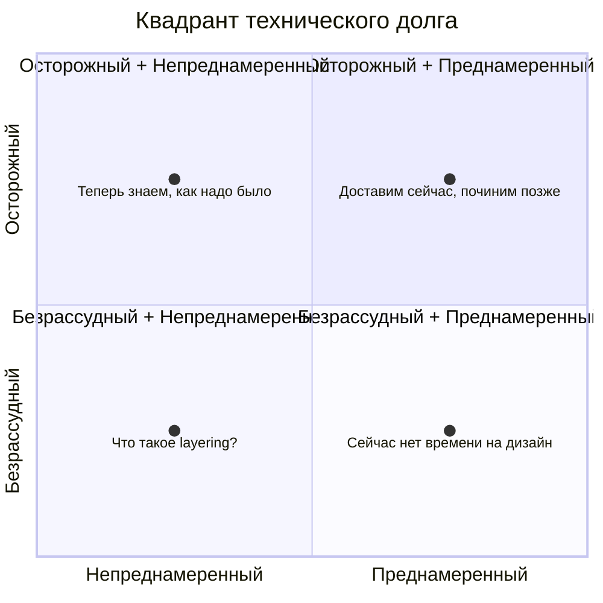

| Квадрант | Пример | Стратегия |
|----------|--------|-----------|
| Безрассудный + Преднамеренный | «Нет времени на дизайн» | ADR + тикет с дедлайном; не допускать в критичных модулях |
| Безрассудный + Непреднамеренный | «Что такое layering?» | Обучение, код-ревью, линтеры |
| Осторожный + Преднамеренный | «Доставим сейчас, починим позже» | ADR + план погашения в ближайшем спринте |
| Осторожный + Непреднамеренный | «Теперь знаем, как надо было» | Рефакторинг при касании; Boy Scout Rule |

## Быстрая матрица приоритизации долга

На интервью полезно явно проговаривать приоритет:

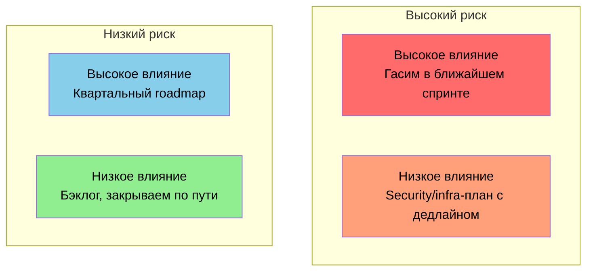

- **Высокий риск + высокое влияние** — гасим в ближайшем спринте.
- **Высокий риск + низкое влияние** — отдельный security/infra-план с дедлайном.
- **Низкий риск + высокое влияние** — планируем в квартальный roadmap.
- **Низкий риск + низкое влияние** — ведём в бэклоге и закрываем "по пути".

## Введение

**Технический долг** — метафора последствий упрощений и отложенных улучшений в коде и архитектуре. На собеседовании ожидают понимание типов долга, приоритизации, связи с [[refactoring-patterns-interview|рефакторингом]] и способов коммуникации со стейкхолдерами.

## Q1. (!) Что такое технический долг?

**Технический долг** — последствия решений, которые ускоряют доставку в краткосрочной перспективе, но усложняют изменения в будущем (дополнительная работа, риски, замедление разработки).

Аналогия с финансовым долгом: «проценты» — стоимость поддержки и изменений в таком коде; «погашение» — рефакторинг и улучшения. Долг может быть осознанным (взят намеренно) или накопленным по недосмотру.

Примеры типичного долга в коде:

```java
// Пример 1: Копипаста вместо общего модуля — ДОЛГ
public class OrderService {
    public BigDecimal calculateDiscount(Order order) {
        // 50 строк логики расчёта скидки
        if (order.getTotal().compareTo(new BigDecimal("1000")) > 0) {
            return order.getTotal().multiply(new BigDecimal("0.1"));
        }
        return BigDecimal.ZERO;
    }
}

public class CartService {
    public BigDecimal calculateDiscount(Cart cart) {
        // Те же 50 строк, скопированные 1:1
        if (cart.getTotal().compareTo(new BigDecimal("1000")) > 0) {
            return cart.getTotal().multiply(new BigDecimal("0.1"));
        }
        return BigDecimal.ZERO;
    }
}
```

```java
// Погашение: вынести общий модуль
public class DiscountCalculator {
    public BigDecimal calculate(BigDecimal total) {
        if (total.compareTo(new BigDecimal("1000")) > 0) {
            return total.multiply(new BigDecimal("0.1"));
        }
        return BigDecimal.ZERO;
    }
}
```

Управление долгом: фиксировать решения (`ADR`), оценивать стоимость погашения, выделять время в спринте и приоритизировать по влиянию на скорость и риску. **Практика:** при осознанном долге создать тикет «Рефакторинг X» в бэклоге с оценкой и ссылкой на `ADR`; при касании модуля — Boy Scout Rule (оставить код лучше).

## Q2. (!) Чем технический долг отличается от «плохого кода»?

**«Плохой код»** — оценочное понятие (нечитаемый, хрупкий, без тестов).
**Технический долг** — фокус на последствиях и стоимости: какой объём работы потребуется, чтобы вернуть систему в желаемое состояние, и какие риски несёт откладывание.

Плохой код часто является источником долга; управление долгом предполагает оценку и приоритизацию, а не только моральную оценку кода.

```java
// «Плохой код» — субъективная оценка на ревью
public Object process(Object data) {
    // 200 строк с вложенными if/else, магические числа, 
    // непонятные имена переменных
    int x = 42;
    if (data != null) {
        // ...ещё 10 уровней вложенности
    }
    return null;
}

// Технический долг — зафиксированная задача с оценкой:
// TECH-456: Модуль OrderProcessor: 5 дней на рефакторинг,
//           блокирует миграцию на Java 21.
//           Цикломатическая сложность: 47 (порог: 15).
//           Покрытие тестами: 12% (порог: 80%).
```

Для стейкхолдеров формулируют в терминах долга и процентов («замедляет доставку»), а не «плохой код». Подробнее о метриках — см. [[code-review-interview|вопросы по code review]].

## Q3. Какие типы технического долга выделяют?

Часто выделяют: **преднамеренный** (взят осознанно под сроки/ограничения) и **непреднамеренный** (накоплен из-за незнания или недосмотра); **по области** — код, архитектура, инфраструктура, документация.

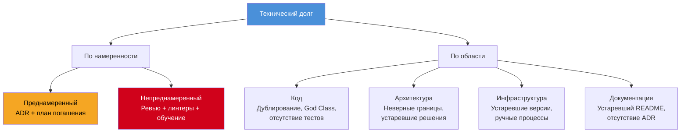

Примеры по области:

```java
// Долг в коде: God Class (> 1000 строк, > 30 методов)
public class OrderManager {
    // Отвечает за: создание, валидацию, расчёт скидок,
    // отправку уведомлений, логирование, экспорт в PDF...
    // SonarQube покажет: "Class has 47 methods" (порог 20)
}

// Долг в архитектуре: жёсткая связность между модулями
public class PaymentService {
    // Прямой вызов другого сервиса вместо события/контракта
    @Autowired
    private InventoryService inventoryService; // тесная связь
    @Autowired
    private NotificationService notificationService;
    @Autowired
    private ReportingService reportingService;
}
```

Для преднамеренного долга фиксируют `ADR` и план погашения; для непреднамеренного — процессы (ревью, линтеры) и приоритизированный бэклог.

## Q4. Что такое преднамеренный и непреднамеренный долг?

**Преднамеренный** — решение зафиксировано (например, «используем быстрый костыль для релиза, задача на рефакторинг в бэклоге»). Команда знает о долге и планирует его погасить.

**Непреднамеренный** — долг накапливается без явного решения: устаревшие практики, копипаста, отсутствие ревью.

```java
// Преднамеренный долг: костыль с ADR и тикетом
public class PromotionService {
    // TODO(TECH-789): Заменить хардкод на конфигурацию после релиза.
    //                  ADR-042. Оценка погашения: 2 дня.
    private static final double PROMO_DISCOUNT = 0.15;
    
    public BigDecimal applyPromo(BigDecimal price) {
        return price.multiply(BigDecimal.valueOf(1 - PROMO_DISCOUNT));
    }
}

// Непреднамеренный долг: никто не заметил нарушения принципов
public class UserService {
    public void registerUser(String name, String email, 
            String phone, String address, String city, 
            String zip, String country) {  // Primitive Obsession
        // Все поля — строки, нет Value Objects,
        // нет валидации, легко перепутать аргументы
    }
}
```

С непреднамеренным борются процессами ([[code-review-interview|обязательный ревью]], линтеры, обучение); преднамеренный управляют через бэклог и приоритеты. В ретро обсуждать: «Где накопился непреднамеренный долг? Какие процессы добавить?»

## Q5. Как измерить технический долг?

Качественно: ретроспективы, ревью кода, аудит архитектуры.
Количественно: метрики кода (дублирование, сложность, покрытие тестами — `SonarQube`, `Checkstyle`); время на типичные изменения (lead time); количество инцидентов и багов в модулях.

Пример отчёта `SonarQube` — ключевые метрики для оценки долга:

```
┌──────────────────────────────────────────────────────────┐
│  SonarQube — Project: order-service                      │
│──────────────────────────────────────────────────────────│
│  Technical Debt:        12d 4h          Rating: C        │
│  Reliability:           3 bugs          Rating: B        │
│  Security:              1 vulnerability Rating: C        │
│  Duplications:          8.2%            (порог: 3%)      │
│  Coverage:              43%             (порог: 80%)     │
│  Cyclomatic Complexity: avg 18          (порог: 15)      │
│──────────────────────────────────────────────────────────│
│  Quality Gate: FAILED                                    │
│  Причины: Coverage < 80%, Duplications > 3%              │
└──────────────────────────────────────────────────────────┘
```

`SonarQube` даёт **technical debt ratio** (время на исправление в днях) и рейтинг по правилам (A-E). Метрики используют для приоритизации: модули с высокой сложностью и низким покрытием — кандидаты на рефакторинг.

Lead time по фичам в затронутых областях — косвенная метрика: рост времени при тех же объёмах указывает на накопленный долг.

## Q6. Что такое «проценты» по техническому долгу?

**«Проценты»** — дополнительная стоимость работы из-за долга: больше времени на понимание кода, на изменения, на отладку; выше риск регрессий. Чем выше долг, тем больше «процент» (замедление разработки).

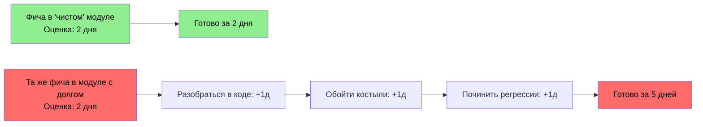

Погашение долга снижает эти накладные расходы. Метафора помогает объяснять стейкхолдерам, почему часть времени нужно тратить на рефакторинг.

Практика: «добавление фичи в модуль X занимает 5 дней вместо 2 из-за долга — это и есть проценты». При погашении долга (рефакторинг модуля X) следующие фичи в этом модуле делаются быстрее — «проценты» снижаются.

## Q7. (!) Когда брать технический долг осознанно?

Когда: сроки критичны и ограничены; прототип или эксперимент (неясно, будет ли продукт жить); объём долга и план погашения зафиксированы (`ADR`, задача в бэклоге). Не стоит брать долг «молча»: решение должно быть явным, с оценкой стоимости погашения и сроками.

```java
// Пример ADR для осознанного долга
/**
 * ADR-042: Использование in-memory кэша вместо Redis
 * 
 * Контекст: Дедлайн релиза через 3 дня. Redis кластер 
 *           не настроен, настройка займёт 5 дней.
 * 
 * Решение: Используем ConcurrentHashMap с TTL.
 *          Ограничение: не работает в кластере (> 1 инстанса).
 * 
 * Последствия: 
 *   - Работает только с 1 инстансом (нет горизонтального масштабирования)
 *   - При рестарте кэш теряется
 * 
 * План погашения: TECH-890, спринт 24.
 *   Оценка: 3 дня (настройка Redis + миграция кэша)
 */
@Service
public class ProductCache {
    // TODO(TECH-890): Мигрировать на Redis. ADR-042.
    private final Map<String, CacheEntry> cache = new ConcurrentHashMap<>();
}
```

Избегать долга в критичных по безопасности и стабильности местах. Не брать долг в аутентификации, платежах, хранении секретов без крайней необходимости; если взяли — тикет с высоким приоритетом.

## Q8. Как приоритизировать погашение долга?

Критерии: влияние на скорость — модули, в которых чаще всего меняют код; риск — области с багами, уязвимостями, отсутствием тестов; зависимости — долг, блокирующий другие улучшения или фичи.

Матрица «влияние x усилие»:

| | Малое усилие (< 3 дня) | Большое усилие (> 5 дней) |
|---|---|---|
| **Высокое влияние** | Делать первыми (quick wins) | Планировать в ближайший спринт |
| **Низкое влияние** | Boy Scout Rule | Бэклог, делать при необходимости |

Практика: составить список задач на долг (из `SonarQube`, ретроспектив, ревью); оценить влияние (сколько фич затрагивает модуль, частота багов) и усилие (дни на рефакторинг); отсортировать по отношению влияние/усилие. Критичный долг (уязвимости, блокирующие миграции) поднимать выше независимо от усилия.

## Q9. Как выделять время на погашение долга в спринте?

Подходы: фиксированный процент спринта (например, 20% на долг и инфраструктуру); отдельные задачи в бэклоге с приоритетом; «правило бойскаута» — оставлять код лучше, чем нашли, при касании модуля. Важно не только «чинить по мере поступления», но и планировать целенаправленные рефакторинги для самых болезненных областей.

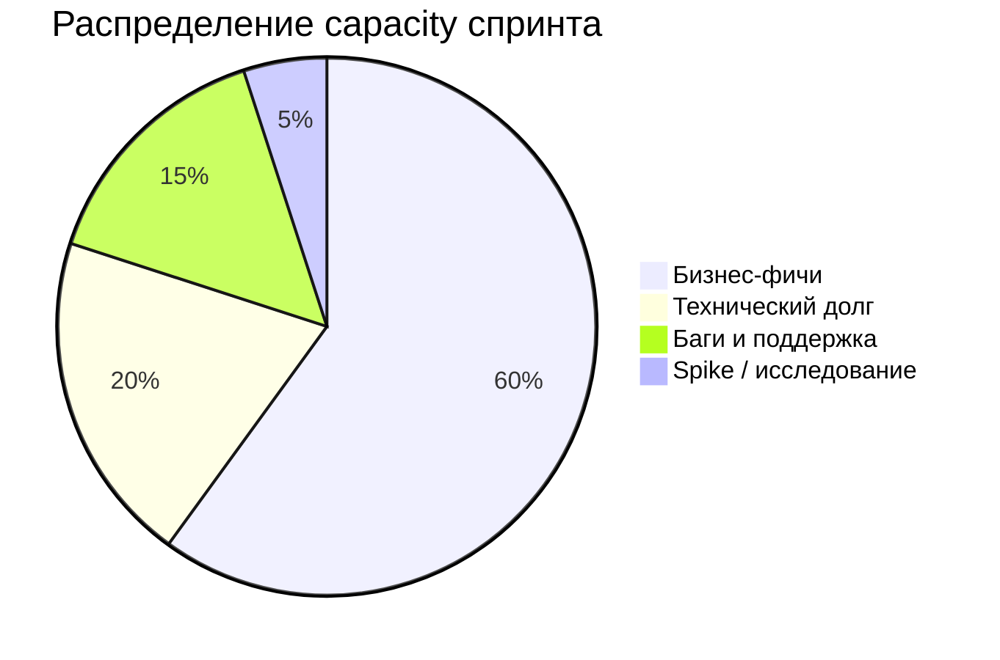

**Практика:** договориться с продуктом: «20% спринта — на долг и инфраструктуру» или «N задач в квартале с меткой `tech-debt`». На планировании включать 1-2 задачи на долг в спринт; приоритет по влиянию и риску. Boy Scout Rule: при касании модуля — небольшая улучшающая правка (вынести метод, переименовать, добавить тест). На ретро проверять: «Сколько времени ушло на долг? Нужно ли скорректировать долю?»

## Q10. Связь технического долга и рефакторинга?

Рефакторинг — основной инструмент погашения долга в коде: изменение структуры без смены поведения. Долг описывает «что не так» и «почему это дорого»; рефакторинг — «как исправить». Подробнее — в [[refactoring-patterns-interview|вопросах по паттернам рефакторинга]].

```java
// ДО: долг — God Method с высокой цикломатической сложностью
public OrderResult processOrder(Order order) {
    // валидация (20 строк)
    if (order.getItems() == null || order.getItems().isEmpty()) { throw new ValidationException("No items"); }
    if (order.getCustomer() == null) { throw new ValidationException("No customer"); }
    // расчёт цены (30 строк)
    BigDecimal total = BigDecimal.ZERO;
    for (var item : order.getItems()) {
        total = total.add(item.getPrice().multiply(BigDecimal.valueOf(item.getQuantity())));
    }
    // применение скидок (20 строк)
    if (total.compareTo(new BigDecimal("5000")) > 0) { total = total.multiply(new BigDecimal("0.9")); }
    // сохранение (10 строк)
    // отправка уведомлений (15 строк)
    return new OrderResult(total);
}

// ПОСЛЕ: рефакторинг Extract Method — каждый шаг отдельно
public OrderResult processOrder(Order order) {
    validate(order);
    BigDecimal total = calculateTotal(order);
    total = applyDiscounts(total, order);
    Order saved = persist(order, total);
    notifyCustomer(saved);
    return new OrderResult(total);
}
```

Рефакторинг без тестов рискован; сначала покрытие критичных мест. Погашение долга может включать не только рефакторинг, но и тесты, документацию, обновление зависимостей, архитектурные изменения.

## Q11. Технический долг в legacy-системах?

В legacy долг часто высокий: устаревший стек, мало тестов, непонятная структура. Стратегии: `Strangler Fig` — новый функционал и переписанные части в новом коде, старый постепенно выключается; точечный рефакторинг и покрытие тестами в местах изменений.

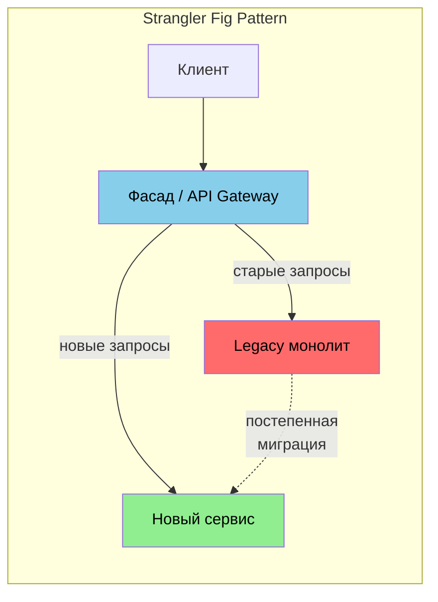

**Практика:** при изменении legacy — characterization tests на текущее поведение, затем рефакторинг в затронутой области:

```java
// Characterization test: фиксируем текущее поведение legacy-кода
@Test
void legacyDiscountCalculation_preservesExistingBehavior() {
    // Этот тест документирует, ЧТО делает код сейчас,
    // даже если это поведение неидеальное.
    var legacyCalc = new LegacyDiscountCalculator();
    
    // Обнаружено: скидка считается от цены без НДС (баг или фича?)
    assertThat(legacyCalc.calculate(1000.0)).isEqualTo(85.0);
    assertThat(legacyCalc.calculate(500.0)).isEqualTo(0.0);
    
    // Теперь можно рефакторить с уверенностью,
    // что поведение не изменилось
}
```

Карта долга: в `Confluence` или в коде (`ADR`) — «модуль X: устаревший, без тестов, менять осторожно». Не планировать «переписать за год» — разбить на этапы с ценностью на каждом шаге. Подробнее о паттерне Strangler Fig — см. [[microservices-interview|вопросы по микросервисам]].

## Q12. Как объяснить технический долг нетехническим стейкхолдерам?

Метафора долга и процентов: «сейчас мы экономим время, но потом будем платить больше за каждое изменение». Конкретика: «добавление новой фичи в этот модуль занимает N дней вместо M из-за старого кода»; «риск сбоев при изменениях выше».

Пример слайда для квартального планирования:

```
┌──────────────────────────────────────────────────────────────┐
│  Влияние технического долга на скорость доставки              │
│──────────────────────────────────────────────────────────────│
│                                                              │
│  Модуль              │ Оценка без долга │ Факт с долгом      │
│  ────────────────────┼──────────────────┼───────────────────  │
│  Каталог товаров     │ 3 дня            │ 3 дня (чистый)     │
│  Корзина             │ 2 дня            │ 5 дней (+150%)     │
│  Оплата              │ 3 дня            │ 7 дней (+133%)     │
│  ────────────────────┼──────────────────┼───────────────────  │
│                                                              │
│  Запрос: 20% спринта на погашение долга в модулях            │
│  Корзина и Оплата. Ожидаемый эффект: -40% к оценкам         │
│  фич в этих модулях к концу квартала.                        │
└──────────────────────────────────────────────────────────────┘
```

Предлагать план: «X% времени в квартале на погашение даст к сроку Y ускорение разработки». Связывать с бизнес-целями (скорость вывода фич, стабильность). Избегать жаргона; говорить «ускорение доставки», «снижение риска сбоев», «подготовка к новой фиче».

## Q13. Документирование технического долга (`ADR`, бэклог)?

Фиксировать решения о сознательном долге в `ADR` (`Architecture Decision Record`) с контекстом и планом погашения. Задачи на погашение — в общий бэклог с приоритетом и оценкой; можно помечать тегом `tech-debt`.

```markdown
# ADR-042: Использование in-memory кэша вместо Redis

## Статус
Принят (2026-03-15). Долг — план погашения: спринт 24.

## Контекст
Дедлайн релиза MVP через 3 дня. Redis кластер не настроен.

## Решение
Используем `ConcurrentHashMap` с TTL вместо Redis.

## Последствия
- Не работает в кластере (>1 инстанса)
- Кэш теряется при рестарте
- Оценка погашения: 3 дня (TECH-890)

## План погашения
- [ ] Настроить Redis кластер (DevOps, 2 дня)
- [ ] Мигрировать кэш на Redis (Backend, 1 день)
- [ ] Убрать in-memory реализацию
```

В коде: `// TODO(TECH-123): вынести дублирование после миграции на X`. На планировании фильтр по лейблу даёт список задач на долг; приоритизация по влиянию и риску.

## Q14. Когда технический долг «критичен» и требует срочного погашения?

Когда: блокирует важные фичи или релизы; создаёт высокий риск сбоев или уязвимостей; делает систему неспособной к масштабированию или миграции.

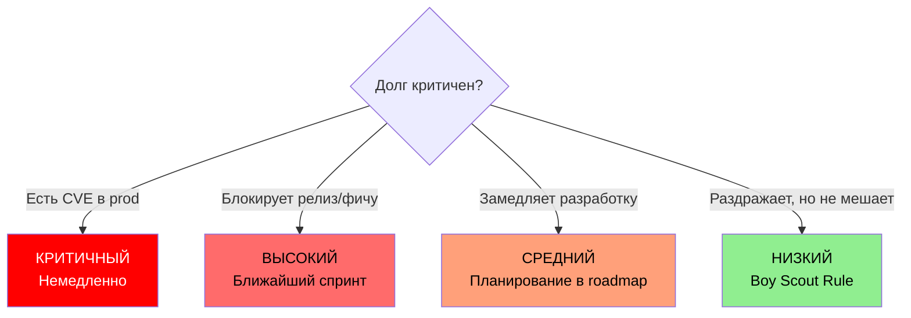

**Практика:** примеры критичного долга: блокирующая миграция зависимости с `EOL`; уязвимость `CVE` в prod; модуль без тестов, в котором часто ломаются фичи. Такие задачи поднимают в приоритете над новыми фичами в том же модуле.

## Q15. Технический долг и безопасность?

Устаревшие зависимости (известные `CVE`), небезопасные паттерны, отсутствие валидации и санитизации — долг с риском безопасности. Такой долг приоритизируют высоко.

```java
// Долг безопасности: SQL-инъекция через конкатенацию
public class UserRepository {
    // ОПАСНО: конкатенация пользовательского ввода в SQL
    public User findByName(String name) {
        String sql = "SELECT * FROM users WHERE name = '" + name + "'";
        return jdbcTemplate.queryForObject(sql, userMapper);
    }
    
    // ПРАВИЛЬНО: параметризованный запрос
    public User findByNameSafe(String name) {
        String sql = "SELECT * FROM users WHERE name = ?";
        return jdbcTemplate.queryForObject(sql, userMapper, name);
    }
}
```

```java
// Долг безопасности: секреты в коде
public class PaymentGateway {
    // ОПАСНО: захардкоженный секрет
    private static final String API_KEY = "sk_live_abc123xyz";
    
    // ПРАВИЛЬНО: из переменных окружения / vault
    @Value("${payment.gateway.api-key}")
    private String apiKey;
}
```

**Практика:** регулярный аудит зависимостей (`OWASP Dependency-Check`, `Snyk`) и обновления снижают накопление. Приоритизация: критические `CVE` — немедленно; высокие — в ближайший спринт; средние и низкие — в бэклог с дедлайном. В [[pipeline-design-interview|CI]] — gate на уязвимости; при появлении `CVE` создавать тикет с приоритетом по severity.

## Q16. Как не накапливать новый долг при разработке?

Code review с фокусом на качестве; автоматизация (линтеры, тесты, `CI`); стандарты кодирования и архитектурные принципы; выделение времени на рефакторинг «по пути» (Boy Scout Rule); обучение и обмен опытом.

Типичный workflow предотвращения долга:

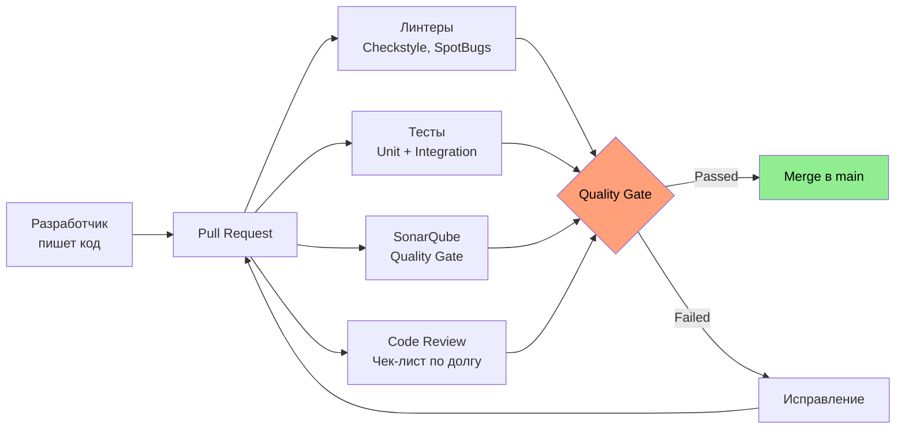

**Практика:** в branch protection — обязательный ревью и зелёный `CI`. В чек-листе ревью — пункты: «нет дублирования без обоснования», «новый код покрыт тестами», «нет магических чисел и нарушений архитектурных границ». Культура «долг — исключение, а не норма» важнее разовых акций.

## Q17. Инструменты для отслеживания технического долга?

Статический анализ: `SonarQube`, `Checkstyle`, `SpotBugs` — дублирование, сложность, покрытие, «запахи». Зависимости: `Dependabot`, `Renovate`, `OWASP Dependency-Check`. Бэклог: `Jira`, `Linear` с метками `tech-debt`.

Пример конфигурации `SonarQube` Quality Gate для контроля долга:

```yaml
# sonar-project.properties
sonar.projectKey=order-service
sonar.sources=src/main/java
sonar.tests=src/test/java
sonar.java.binaries=build/classes

# Quality Gate пороги (настраиваются в UI SonarQube):
# - Coverage on New Code: >= 80%
# - Duplicated Lines on New Code: <= 3%
# - Maintainability Rating: A
# - Reliability Rating: A
# - Security Rating: A
# - Technical Debt Ratio on New Code: <= 5%
```

```groovy
// build.gradle — интеграция SonarQube
plugins {
    id 'org.sonarqube' version '5.0.0.4638'
}

sonar {
    properties {
        property 'sonar.projectKey', 'order-service'
        property 'sonar.host.url', 'https://sonar.example.com'
        property 'sonar.coverage.jacoco.xmlReportPaths', 
                 'build/reports/jacoco/test/jacocoTestReport.xml'
    }
}
```

**Практика:** инструменты дают данные; приоритизацию и план формирует команда. На ретро раз в квартал — обзор `SonarQube` (`Debt`, `Reliability`), списка зависимостей с `CVE`, бэклога по лейблу `tech-debt`. Итог: топ-5 задач на погашение с оценкой и владельцем.

## Q18. Технический долг в монолите vs микросервисах?

В монолите долг часто концентрирован: один репозиторий, общие модули, сложные зависимости. В [[microservices-interview|микросервисах]] долг распределён по сервисам: можно погашать по одному сервису; но появляется долг на границах.

| Аспект | Монолит | Микросервисы |
|--------|---------|-------------|
| Локализация долга | Концентрирован в одном репозитории | Распределён по сервисам |
| Рефакторинг | Затрагивает всю систему | Можно рефакторить по одному сервису |
| Долг на границах | Внутренние зависимости между модулями | Устаревшие контракты API, дублирование логики |
| Стратегия погашения | Strangler Fig, точечный рефакторинг | Приоритет по сервисам с наибольшим влиянием |
| Тестирование | Сложнее — нужны тесты на весь монолит | Проще изолировать; но нужны contract tests |

```java
// Долг на границах микросервисов: дублирование DTO
// order-service
public class CustomerDto {
    private String name;
    private String email;
    // 20 полей, скопированных из customer-service
}

// payment-service
public class CustomerDto {
    private String name;
    private String email;
    // Те же 20 полей, но 3 уже рассинхронизированы
}

// Решение: общая библиотека контрактов или schema registry
```

## Q19. Как оценить «стоимость» погашения долга?

Оценка в человеко-днях на основе: объёма кода и сложности; необходимости тестов и регрессий; рисков при изменении. Используют экспертизу команды, аналоги с прошлыми рефакторингами.

```
Тикет: TECH-890 — Миграция кэша с ConcurrentHashMap на Redis

Оценка погашения:
  - Настройка Redis кластера (DevOps):         2 дня
  - Реализация Redis-адаптера (Backend):        1 день
  - Тесты + регрессия:                          1 день
  - Итого:                                      4 дня

Стоимость НЕ погашать (за квартал):
  - Ограничение масштабирования: 1 инстанс      — потеря 2 9's доступности
  - Потеря кэша при каждом деплое               — +15 мин прогрев x 20 деплоев = 5 часов
  - Блокирует переход на Kubernetes              — задерживает 3 фичи

ROI погашения: 4 дня инвестиций → экономия ~10 дней / квартал
```

«Стоимость не погашать» — оценка замедления разработки и рисков в будущем. Сравнение «погасить сейчас» vs «отложить» помогает приоритизировать; точной формулы нет, важна прозрачность оценок.

## Q20. Boy Scout Rule и технический долг?

Boy Scout Rule: «оставь код лучше, чем ты его нашёл». При каждом касании модуля — небольшое улучшение: вынести метод, переименовать, добавить тест, убрать дублирование.

```java
// Пример Boy Scout Rule: при работе с модулем заметили проблему
// ДО (в рамках фичи заметили magic number и плохое имя)
public void process(List<Item> items) {
    if (items.size() > 50) {  // magic number
        var p = items.subList(0, 50);  // непонятное имя
        sendBatch(p);
    }
}

// ПОСЛЕ (минимальное улучшение «по пути», не меняя поведение)
private static final int MAX_BATCH_SIZE = 50;

public void process(List<Item> items) {
    if (items.size() > MAX_BATCH_SIZE) {
        var batch = items.subList(0, MAX_BATCH_SIZE);
        sendBatch(batch);
    }
}
```

Постепенно снижает долг без отдельных «мега-рефакторингов». Не заменяет целенаправленное погашение критичного долга, но дополняет его. В гайде команды зафиксировать: «при касании модуля — одна небольшая улучшающая правка (без смены поведения)». На ревью не требовать отдельного тикета на каждое такое изменение.

## Q21. Рефакторинг «по пути» vs отдельные задачи на долг?

По пути — при реализации фичи в модуле слегка подчистить код (Boy Scout Rule), не менять поведение глобально. Отдельные задачи — выделенные спринты или квартальные цели на рефакторинг крупных областей.

| Критерий | По пути (Boy Scout) | Отдельная задача |
|----------|--------------------|--------------------|
| Объём изменений | Малый (переименование, extract method) | Большой (смена архитектуры модуля) |
| Тикет | Не нужен | Обязательно (TECH-xxx) |
| PR | В составе фичи (явно описать) | Отдельный PR |
| Тесты | Существующие должны проходить | Новые + регрессионные |
| Риск | Низкий | Средний-высокий |

Оба подхода нужны: по пути — для поддержания; отдельные задачи — для областей с высоким долгом, где «по пути» недостаточно. Смешивать рефакторинг и фичу в одном `PR` допустимо только если объём рефакторинга мал и явно описан.

## Q22. Технический долг в зависимостях (библиотеки, версии)?

Устаревшие версии библиотек — долг: нет фиксов безопасности и багов, сложнее интеграция с новыми версиями экосистемы.

```groovy
// build.gradle — пример устаревших зависимостей (ДОЛГ)
dependencies {
    // Log4j 1.x — EOL, известные CVE (CVE-2021-44228 в Log4j 2.x)
    implementation 'log4j:log4j:1.2.17'          // EOL с 2015!
    
    // Spring Boot 2.x — EOL с ноября 2023
    implementation 'org.springframework.boot:spring-boot-starter:2.7.18'
    
    // Jackson с известной уязвимостью
    implementation 'com.fasterxml.jackson.core:jackson-databind:2.13.0'
}

// ПОСЛЕ погашения долга:
dependencies {
    implementation 'ch.qos.logback:logback-classic:1.5.6'
    implementation 'org.springframework.boot:spring-boot-starter:3.3.0'
    implementation 'com.fasterxml.jackson.core:jackson-databind:2.17.1'
}
```

**Практика:** критичные уязвимости (`CVE`) закрывать в приоритете. В [[pipeline-design-interview|CI]] — проверка зависимостей (`OWASP Dependency-Check`); `Dependabot` / `Renovate` создают `PR` с обновлениями — ревьюить и мержить в рамках спринта. Мажорные обновления — отдельный тикет с оценкой и тестами. Зависимости от неподдерживаемых проектов планировать на замену.

## Q23. Как балансировать фичи и погашение долга?

Договариваться с продуктом о доле времени на долг (например, 20% спринта или N задач в квартале). Показывать влияние долга на скорость: «из-за долга в модуле X каждая фича там +3 дня». Приоритизировать долг, блокирующий фичи или несущий риски.

**Практика:** прозрачность бэклога по долгу и регулярное обсуждение на ретро помогают сохранять баланс без «тихого» накопления долга. На планировании включать 1-2 задачи на долг в спринт; при перегрузке — явно говорить: «берём долг X, фичу Y сдвигаем». Не жертвовать долгом молча ради «больше фич в спринте».

## Q24. Роль архитектора и тимлида в управлении долгом?

Архитектор: выявление архитектурного долга, приоритизация по влиянию на систему, `ADR` и план миграций. Тимлид: выделение времени в спринтах, защита команды от перегрузки «только фичами», коммуникация с продуктом, культура качества и ревью.

**Практика:** совместно — ретро по долгу, метрики, эскалация критичного долга. Без явного владельца долг редко планомерно погашается. На квартальном планировании архитектор даёт список приоритетного архитектурного долга; тимлид резервирует capacity и доводит до продукта необходимость погашения.

## Q25. Когда «переписать с нуля» вместо погашения долга?

Переписывание оправдано редко: высокие риски, длительный период без улучшений. Рассматривать, когда: погашение по оценке дороже и дольше переписывания; технологический тупик (платформа не поддерживается); бизнес-требования радикально изменились.

Предпочтительнее поэтапная замена (Strangler Fig):

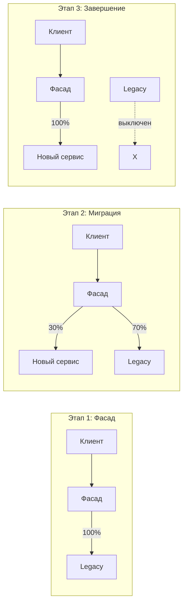

Решение о переписывании должно быть документировано и согласовано. Каждый этап должен приносить ценность — нельзя планировать «переписать за год» без промежуточных результатов.

## Q26. Технический долг и скорость доставки: как измерить влияние?

Метрики: время от коммита до продакшена (lead time); время на исправление бага; количество регрессий. Сравнение «здоровых» модулей и областей с высоким долгом.

Пример трекинга в `SonarQube` по модулям:

```
Модуль              │ Debt   │ Coverage │ Bugs │ Avg Lead Time (фича)
────────────────────┼────────┼──────────┼──────┼─────────────────────
catalog-service     │ 2d     │ 87%      │ 1    │ 2.5 дня
cart-service        │ 14d    │ 34%      │ 8    │ 6.2 дня  ← долг
payment-service     │ 21d    │ 22%      │ 12   │ 8.1 дня  ← долг
notification-svc    │ 1d     │ 91%      │ 0    │ 1.8 дня
```

Качественные индикаторы: частота «боимся трогать», количество блокеров при фичах. **Практика:** документировать влияние долга на оценки и сроки в ретро и при планировании. В тикетах на фичу указывать затронутые модули; если модуль с высоким долгом — добавлять к оценке «+N дней из-за долга».

## Q27. Как коммуницировать технический долг продукту и бизнесу?

Язык бизнеса: риски (сбои, безопасность), замедление доставки, стоимость отложенного погашения. Конкретные примеры: «модуль X увеличивает оценку каждой фичи на 2 дня»; «уязвимость в зависимости требует патча в течение месяца».

Предлагать варианты: выделить спринт на долг; платить «проценты» каждый спринт (X% времени).

**Практика:** не пугать; показывать последствия и план. На квартальном обзоре — 2-3 слайда: влияние на скорость, топ задач на погашение, запрос на долю времени. Формулировки без жаргона: «поддержка и ускорение разработки», «снижение риска сбоев».

## Q28. Технический долг в тестах (хрупкие, медленные тесты)?

Хрупкие тесты (падают при безобидных изменениях) и медленные (блокируют обратную связь) — тоже долг. Подробнее — в [[test-strategies-interview|вопросах по стратегиям тестирования]].

```java
// Хрупкий тест: привязан к деталям реализации (ДОЛГ)
@Test
void shouldCreateOrder() {
    orderService.createOrder(request);
    
    // Проверяем внутренние вызовы — тест ломается при любом рефакторинге
    verify(repository).save(any());
    verify(eventPublisher).publish(any());
    verify(metricsService).increment("orders.created");
    verify(auditService).log(any());
    // Добавили логирование? Тест упал.
}

// Устойчивый тест: проверяет поведение, а не реализацию
@Test
void shouldCreateOrder() {
    var result = orderService.createOrder(request);
    
    // Проверяем результат и наблюдаемые побочные эффекты
    assertThat(result.getStatus()).isEqualTo(OrderStatus.CREATED);
    assertThat(orderRepository.findById(result.getId())).isPresent();
}
```

```java
// Медленный тест: реальная БД и внешние сервисы для unit-теста (ДОЛГ)
@SpringBootTest  // поднимает весь контекст Spring — 30 секунд
@Test
void shouldCalculateDiscount() {
    // Это чистая бизнес-логика, не нужен Spring контекст
    var discount = discountService.calculate(1000);
    assertThat(discount).isEqualTo(100);
}

// Быстрый тест: без лишних зависимостей
@Test
void shouldCalculateDiscount() {
    var service = new DiscountService(new InMemoryPriceRepository());
    var discount = service.calculate(1000);
    assertThat(discount).isEqualTo(100);
}
```

**Практика:** рефакторинг тестов без изменения покрытия допустим и поощряется. В спринте выделять время на «починить падающие/медленные тесты»; в ревью обращать внимание на хрупкие паттерны. Медленный CI — тикет на оптимизацию тестов с оценкой выигрыша по времени.

## Q29. Как приоритизировать долг в зависимостях (уязвимости, `EOL`)?

Уязвимости (`CVE`) — по severity и эксплуатируемости; критические — срочно. `EOL` (конец поддержки) — по сроку и рискам безопасности.

Workflow обработки уязвимостей в зависимостях:

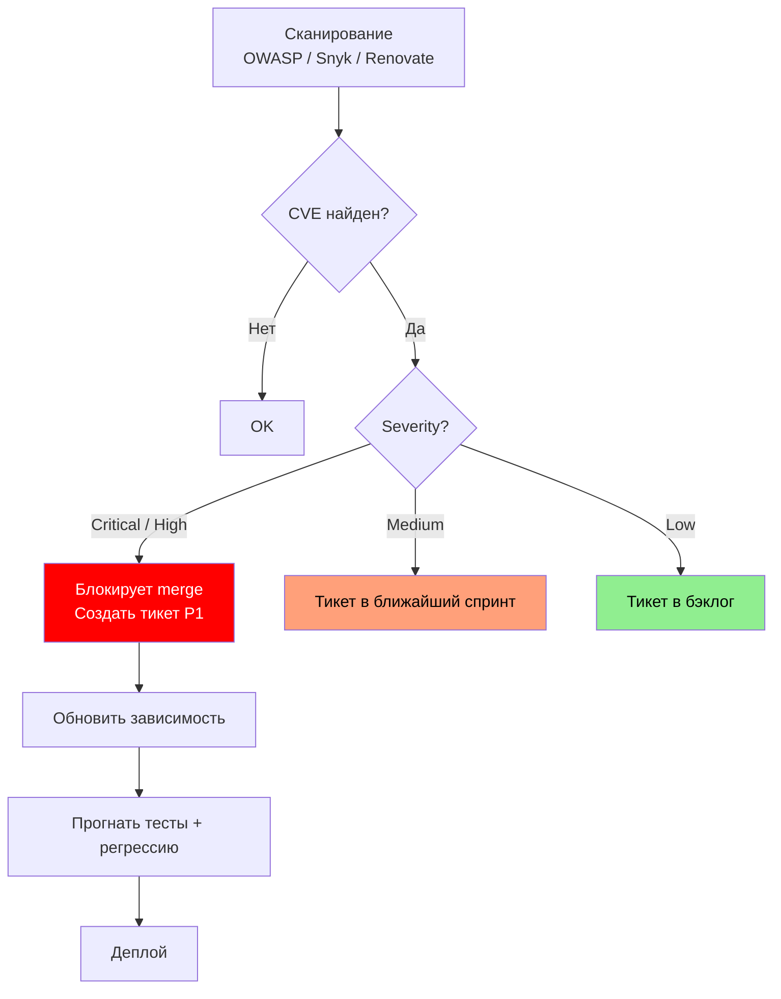

**Практика:** обновления с breaking changes — оценить трудозатраты и запланировать; малые обновления — в рамках текущих задач. В `CI` — gate на критические `CVE` (merge блокируется до обновления или обоснованного исключения). Ежеквартально — обзор зависимостей с `EOL` и план миграции в `ADR` или бэклог.

## Q30. Роль метрик кода (`SonarQube` и др.) в управлении долгом?

Метрики (дублирование, сложность, покрытие, запахи) дают объективную основу для приоритизации и трекинга. Интеграция в `CI`: не блокировать merge по одному порогу; использовать для трендов и ретро. Тимлид и архитектор интерпретируют метрики в контексте проекта.

Ключевые метрики `SonarQube` для управления долгом:

| Метрика | Что показывает | Порог (рекомендация) |
|---------|---------------|---------------------|
| Technical Debt Ratio | Время на исправление всех issues / время на разработку | < 5% для нового кода |
| Duplicated Lines % | Процент дублированных строк | < 3% |
| Cyclomatic Complexity | Количество линейно независимых путей | < 15 на метод |
| Cognitive Complexity | Сложность понимания кода человеком | < 15 на метод |
| Coverage | Покрытие тестами | >= 80% для нового кода |
| Reliability Rating | Рейтинг по багам (A-E) | A или B |
| Security Rating | Рейтинг по уязвимостям (A-E) | A |
| Code Smells | Количество «запахов» в коде | Тренд не должен расти |

```groovy
// Пример Quality Gate в CI (Jenkinsfile)
stage('SonarQube Analysis') {
    steps {
        withSonarQubeEnv('sonar') {
            sh './gradlew sonar'
        }
    }
}
stage('Quality Gate') {
    steps {
        timeout(time: 5, unit: 'MINUTES') {
            waitForQualityGate abortPipeline: true
        }
    }
}
```

**Практика:** в `SonarQube` смотреть разделы «Debt», «Reliability», «Security» (рейтинги), дублирование, покрытие. Quality Gate настроить мягко для legacy-кода, строго для нового. На ретро — обзор метрик по модулям и выбор областей для погашения долга. Метрики — инструмент, не замена суждению команды.

## Q31. (!) Как технический долг влияет на DORA-метрики?

**DORA-метрики** измеряют зрелость процесса доставки. Высокий технический долг деградирует все четыре показателя.

**Связь долга с DORA:**

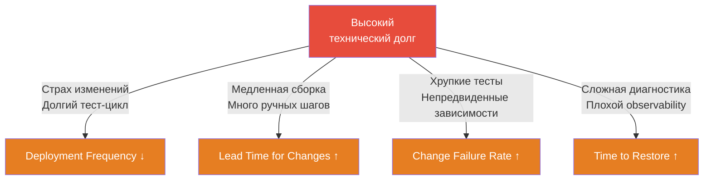

**Конкретные примеры:**

| DORA метрика | Проявление долга | Способ погашения |
|---|---|---|
| Deployment Frequency | Деплой раз в месяц из-за страха сломать — монолит без тестов | Покрыть тестами, разбить на части, ввести feature flags |
| Lead Time | CI занимает 45 мин из-за медленных тестов и монолитной сборки | Параллелизация, Gradle Build Cache, selective testing |
| Change Failure Rate | 25% деплоев с инцидентом — нет интеграционных тестов | Testcontainers, contract testing, canary deploy |
| Time to Restore | Нет centralized logging, нет structured logs | Внедрить ELK/OpenTelemetry, structured logging |

**Как обосновать погашение долга через DORA:**

```
Сейчас: Lead Time = 2 недели, CFR = 20%
Цель через квартал: Lead Time < 3 дней, CFR < 5%

Что делаем:
1. Покрыть модуль X тестами (сейчас 30% → 80%)
2. Ускорить CI: параллельные этапы + Gradle Build Cache
3. Внедрить canary-деплой для сервиса Y
4. Добавить structured logging + алерты по error rate
```

Аргумент для бизнеса: «при текущем CFR 20% каждый пятый деплой создаёт инцидент, который стоит N часов команды. Снижение до 5% освободит X часов в квартал».

## Q32. Что такое coupling и cohesion как метрики долга?

**Coupling** (сцепление) и **cohesion** (связность) — классические метрики качества дизайна. Высокий долг выражается в **высоком coupling** и **низкой cohesion**.

**Принцип:** низкое сцепление (loose coupling) + высокая связность (high cohesion) = хороший дизайн.

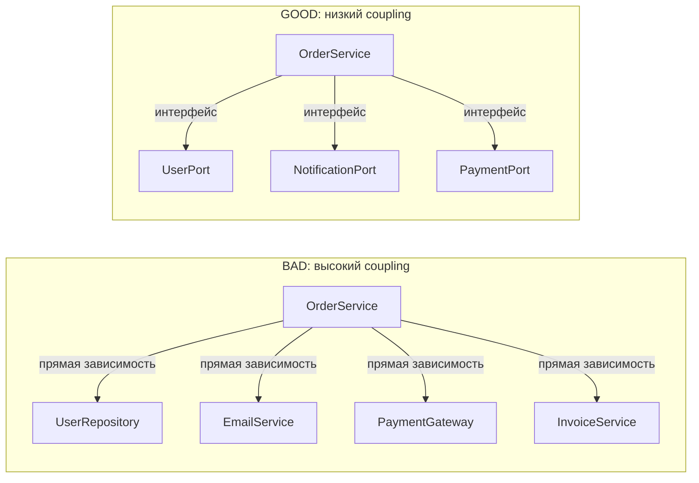

**Метрики coupling в Java (JDepend):**

| Метрика | Значение | Красный флаг |
|---------|---------|-------------|
| `Ca` (Afferent coupling) | Сколько пакетов зависят от данного | Очень высокий → риск при изменении |
| `Ce` (Efferent coupling) | Сколько пакетов данный пакет зависит | Очень высокий → много зависимостей |
| `I` (Instability) = Ce/(Ca+Ce) | 0 = стабильный, 1 = нестабильный | Критичные пакеты должны быть ближе к 0 |
| `A` (Abstractness) | Доля абстрактных классов/интерфейсов | — |
| `D` (Distance from main sequence) | `|A+I-1|` | < 0.1 — зона боли или бесполезности |

**Cohesion — LCOM (Lack of Cohesion of Methods):**

```java
// BAD: низкая cohesion — методы используют разные поля
// LCOM4 = 2 (два несвязанных кластера)
public class UserService {
    private UserRepository userRepo;      // поле группы 1
    private PasswordEncoder encoder;      // поле группы 1

    // Кластер 1: работает с userRepo и encoder
    public User register(RegisterRequest req) { ... }
    public void changePassword(Long id, String newPwd) { ... }

    // Кластер 2: совсем другая логика
    private EmailTemplateEngine emailEngine;  // поле группы 2
    public void sendWelcomeEmail(User user) { ... }  // не связан с auth
    public void sendPromoEmail(User user, String promo) { ... }
}

// GOOD: высокая cohesion — разделить на два класса
public class UserAuthService { ... }    // register, changePassword
public class UserEmailService { ... }  // sendWelcomeEmail, sendPromoEmail
```

**Инструменты измерения:**

```bash
# JDepend через Gradle
./gradlew jdepend

# SonarQube — метрики coupling встроены
# В UI: Issues → "Coupling" / Metrics → Complexity

# IntelliJ IDEA: Analyze → Dependency Matrix
# Показывает циклические зависимости между пакетами
```

**Практика:** устанавливать architecture tests (ArchUnit) для запрета прямых зависимостей между слоями. Cyclical dependencies — первоочередной долг к погашению (они блокируют разбиение на модули и тестирование).

## Q33. Как организовать «долговой реестр» (debt registry) в команде?

**Debt registry** — структурированный список известного технического долга с приоритетами, стоимостью и планом погашения. Без реестра долг невидим и не управляем.

**Структура записи в реестре:**

```markdown
## TD-042: Отсутствие интеграционных тестов для OrderService

| Поле           | Значение                                      |
|----------------|-----------------------------------------------|
| **Модуль**     | order-service                                 |
| **Тип**        | Тестовый долг                                 |
| **Приоритет**  | High                                          |
| **Риск**       | CFR OrderService = 25% (3 инцидента/квартал)  |
| **Стоимость**  | 5 story points                                |
| **Выгода**     | CFR → 5%, экономия ~12 часов инцидентов/кв   |
| **Когда взять**| Sprint 24 (до релиза v2.0)                    |
| **Ответственный** | @dev-team                                 |
| **ADR**        | ADR-015                                       |
```

**Форматы реестра:**

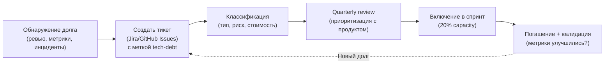

**Jira-метки для реестра:**

```
tech-debt               — любой технический долг
tech-debt:security      — уязвимости и безопасность
tech-debt:test          — тестовый долг
tech-debt:dependency    — устаревшие библиотеки
tech-debt:arch          — архитектурные проблемы
tech-debt:perf          — производительность
```

**Правила работы с реестром:**
- **Создавать тикет сразу** при обнаружении долга (в том числе при code review)
- **Квартальный обзор** с командой и продуктом: что в этом квартале погашаем
- **Не закрывать** тикет без валидации (метрики улучшились, тесты зелёные)
- **20% capacity** спринта — зарезервировать для технического долга
- Технический долг без тикета = долг, о котором забудут

**Пример шаблона ADR для планового погашения:**

```markdown
# ADR-015: Покрытие OrderService интеграционными тестами

## Статус: Approved

## Контекст
OrderService имеет CFR 25%, 3 инцидента за Q1 2026 связаны с отсутствием
интеграционных тестов бизнес-логики.

## Решение
Покрыть критичные пути Testcontainers-тестами до Sprint 24.
Минимальный coverage: 80% строк OrderService.

## Последствия
- CFR ожидается снизить до < 5%
- Добавляет 30 секунд к CI (integration-tests стадия)
- Позволяет рефакторинг без риска регрессий
```

---

---

## Q34. Технический долг vs архитектурный долг — в чём разница?

**Технический долг** — краткосрочные компромиссы в **реализации**: плохие имена, дублирование, отсутствие тестов, запутанная логика. Локален — живёт внутри класса или модуля.

**Архитектурный долг** — компромиссы в **структуре системы**: неправильные границы сервисов, неверные технологические выборы, циклические зависимости между модулями, монолитный модуль там, где нужна изоляция.

| Аспект | Технический долг | Архитектурный долг |
|--------|------------------|--------------------|
| Уровень | Код, класс, метод | Модули, сервисы, системы |
| Стоимость исправления | Низкая–средняя | Высокая |
| Видимость | Легко обнаружить (SonarQube) | Требует анализа зависимостей |
| Последствия | Медленная разработка, баги | Невозможность масштабировать, vendor lock-in |
| Инструменты измерения | SonarQube, PMD | Dependency analysis, ArchUnit, C4 diagrams |

**Примеры архитектурного долга:**
- Микросервис, который знает слишком много о других сервисах (tight coupling)
- Синхронные вызовы там, где нужен async (Kafka/RabbitMQ)
- Монолитная БД, разделяемая несколькими сервисами
- Отсутствие API versioning — Breaking changes без предупреждения

**Почему архитектурный долг опаснее:** его сложнее исправить инкрементально. Часто требует Strangler Fig или Big Bang rewrite.

---

## Q35. Что такое Strangler Fig Pattern и как он помогает с legacy?

**Strangler Fig** (удушающий фикус) — паттерн постепенной замены legacy-системы новой, без остановки бизнеса. Назван по аналогии с деревом: новое растение обвивает старое и постепенно заменяет его.

**Шаги:**

```
1. ROUTE  — Поставить прокси/фасад перед старой системой
2. STRANGLE — Постепенно перехватывать маршруты, реализуя в новой системе
3. REMOVE — Убрать legacy-код после полного переноса
```

**Пример (монолит → микросервисы):**

```
Клиент → [Nginx / API Gateway]
             ├── /orders/* → [Новый Orders Service] ✓ уже мигрирован
             ├── /products/* → [Новый Products Service] ✓ 
             └── /users/* → [Монолит] ← ещё не мигрирован
```

**Преимущества:**
- Нет риска «всё или ничего» — система всегда работает
- Можно откатить отдельный маршрут
- Feature parity можно проверить A/B тестированием

**Когда подходит:**
- Legacy монолит с чёткими бизнес-доменами
- Есть возможность поставить прокси-слой
- Команда готова поддерживать временно две системы

**Анти-паттерн:** «Big Bang Rewrite» — переписываем всё с нуля, замораживая фичи. Исторически провальная стратегия (Netscape Navigator, FogBugz).

---

## Q36. Как измерить технический долг через SonarQube: Technical Debt Ratio и SQALE?

**SQALE** (Software Quality Assessment based on Lifecycle Expectations) — методология оценки техдолга, лежащая в основе SonarQube.

**Ключевые метрики SonarQube:**

| Метрика | Что показывает | Единица |
|---------|---------------|---------|
| **Technical Debt** | Суммарное время на исправление всех code smells | минуты/часы |
| **Technical Debt Ratio** | Отношение долга к стоимости разработки всей кодовой базы | % |
| **Maintainability Rating** | A (≤5%), B (6–10%), C (11–20%), D (21–50%), E (>50%) | A–E |
| **Reliability Rating** | На основе количества bugs (A = 0 bugs) | A–E |
| **Security Rating** | На основе vulnerabilities | A–E |

**Technical Debt Ratio формула:**
```
TDR = (время на исправление всех smells) / (стоимость всего кода) × 100%
```

Где стоимость кода = количество строк × стоимость часа разработчика.

**Practical quality gate (пример для команды):**
```yaml
# sonar-project.properties
sonar.qualitygate.wait=true
# Quality Gate условия:
# - Coverage on New Code >= 80%
# - Duplicated Lines on New Code <= 3%
# - Maintainability Rating on New Code = A
# - Security Rating on New Code = A
# - Reliability Rating on New Code = A
```

**Ограничения SQALE:**
- TDR — условный показатель (оценка времени субъективна)
- Не учитывает архитектурный долг
- Высокий TDR в устаревшем коде без изменений — не обязательно проблема

Использовать как **тренд**, а не абсолютный показатель. Смотреть на изменение TDR по спринтам.

---

## Q37. Feature Toggles как инструмент управления техническим долгом?

**Feature Toggles** (feature flags) — механизм включения/выключения функциональности без деплоя. Напрямую связаны с техдолгом: каждый неудалённый toggle — это долг.

**Как toggles помогают управлять долгом:**

1. **Инкрементальный рефакторинг в production:**
```java
if (featureToggle.isEnabled("new-order-service")) {
    return newOrderService.process(order);   // новая реализация
} else {
    return legacyOrderService.process(order); // старая
}
```
→ Можно включить для 1% трафика, убедиться, что работает, и плавно мигрировать.

2. **Strangler Fig без прокси** — toggle переключает между old/new code path.

3. **Dark Launch** — новый код работает параллельно, но ответ старого кода возвращается пользователю. Позволяет сравнить результаты.

**Типы toggles по сроку жизни (по Fowler):**

| Тип | Срок жизни | Примеры |
|-----|-----------|---------|
| Release toggles | Дни–недели | Скрыть незаконченную фичу |
| Experiment toggles | Недели | A/B тестирование |
| Ops toggles | Месяцы | Kill switch для нагрузки |
| Permission toggles | Годы | Бета-доступ для клиентов |

**Toggle как долг:** каждый toggle требует удаления после завершения. Накопленные «мёртвые» toggles усложняют код и тестирование. **Правило:** создавая toggle, создавай тикет на его удаление с дедлайном.

---

## Q38. Тёмный запуск и Canary: связь с техническим долгом?

**Тёмный запуск (Dark Launch / Shadow Mode)** — новый код выполняется параллельно со старым, его результат не возвращается пользователю, только логируется.

```
Запрос → Старый сервис → Ответ пользователю
              ↓ (асинхронно)
         Новый сервис → Лог (сравнение результатов)
```

**Связь с техдолгом:**
- Позволяет безопасно тестировать новую реализацию на реальной нагрузке
- Обнаруживает расхождения в результатах до переключения трафика
- Снижает риск погашения архитектурного долга (смена алгоритма/БД)

**Canary Release** — постепенное переключение трафика (1% → 10% → 50% → 100%):

```yaml
# Kubernetes: Ingress с canary-аннотациями
annotations:
  nginx.ingress.kubernetes.io/canary: "true"
  nginx.ingress.kubernetes.io/canary-weight: "10"  # 10% трафика
```

**Когда использовать при погашении долга:**
- Замена устаревшей библиотеки на новую (Spring Boot 2 → 3)
- Миграция БД (PostgreSQL → другая схема)
- Смена алгоритма расчёта с side-by-side сравнением

**Отличие Dark Launch от Canary:**
- Dark Launch — пользователь не видит результат нового кода
- Canary — часть пользователей получает результат нового кода

---

## Q39. Definition of Done как инструмент предотвращения долга?

**Definition of Done (DoD)** — согласованный чеклист критериев, при выполнении которых задача считается завершённой. Главный инструмент предотвращения нового долга.

**Типичный DoD для инженерной команды:**

```markdown
## Definition of Done

### Код
- [ ] Код написан и прошёл self-review
- [ ] Pull Request открыт и одобрен минимум одним ревьюером
- [ ] CI/CD пайплайн зелёный (build, unit tests, integration tests)
- [ ] Coverage на новом коде ≥ 80%
- [ ] SonarQube Quality Gate пройден (нет новых bugs, vulnerabilities)

### Тесты
- [ ] Unit-тесты для бизнес-логики написаны
- [ ] Integration-тесты для ключевых сценариев написаны
- [ ] Регрессионные тесты обновлены

### Документация и операции
- [ ] README / ADR обновлены (если изменилась архитектура)
- [ ] API-документация (OpenAPI) актуальна
- [ ] Метрики и алерты добавлены для новой функциональности
- [ ] Runbook обновлён

### Деплой
- [ ] Задача задеплоена на dev/staging
- [ ] Product Owner принял результат
```

**Как DoD предотвращает долг:**
- Тесты обязательны → нет тестового долга
- SonarQube Gate → нет нового code smell долга
- Документация → нет долга знаний

**Частая проблема:** DoD де-юре есть, де-факто его не соблюдают под давлением дедлайнов. Решение — сделать DoD техническим требованием (Quality Gate в CI), а не «джентльменским соглашением».

---

## Q40. Специфические риски технического долга в микросервисной архитектуре?

Микросервисы умножают некоторые виды долга, создавая проблемы, которых нет в монолите.

**1. Distributed технический долг (размазанный по сервисам):**
- Устаревший API-контракт в одном сервисе ломает N потребителей
- Дублирование кода между сервисами (общая утилита, скопированная в 10 сервисов)
- Несогласованные версии библиотек (Jackson 2.13 в одном, 2.15 в другом)

**2. Versioning и backward compatibility:**
```java
// Плохой долг: нет версионирования API
@GetMapping("/api/orders")  // v1 и v2 смешаны в одном endpoint

// Хорошо: явное версионирование
@GetMapping("/api/v1/orders")
@GetMapping("/api/v2/orders")  // новая схема ответа, v1 deprecated
```

**3. Schema migration debt:**
- Каждый сервис имеет свою БД — миграции разрозненные
- Shared database антипаттерн: изменение схемы ломает несколько сервисов

**4. Observability debt:**
- Без единых correlation ID / traceId — невозможно отследить запрос
- Разные форматы логов в сервисах — агрегация сложна

**5. Contract testing debt:**
- Нет Pact/Contract тестов — интеграция проверяется только вручную
- Сломанный контракт обнаруживается в production, не в CI

**6. Service proliferation:**
- Слишком много сервисов без владельца (orphan services)
- Каждый сервис — потенциальное место накопления долга без надзора

**Практика управления:**
- Единый golden path (шаблон сервиса с best practices)
- Централизованные dependency updates (Renovate Bot / Dependabot)
- Архитектурные fitness functions (ArchUnit) в каждом сервисе

## See also

- [[code-review-interview|Code review]] — вопросы по code review
- [[refactoring-patterns-interview|Паттерны рефакторинга]] — вопросы по рефакторингу
- [[design-patterns-interview|Design Patterns]] — вопросы по паттернам
- [[microservices-interview|Микросервисы]] — долг в микросервисной архитектуре
- [[pipeline-design-interview|CI/CD пайплайны]] — автоматизация quality gates
- [[test-strategies-interview|Стратегии тестирования]] — долг в тестах и покрытие
- [[code-review-practices-interview|Практики code review]] — процесс и культура ревью

- [[clean-code-practices-interview|Clean Code Practices]]
- [[code-coverage-interview|Code Coverage]]
- [[code-review-interview|Code review]]
- [[code-smells-interview|Code Smells]]
- [[refactoring-patterns-interview|Паттерны рефакторинга]]
- [[static-analysis-interview|Static Analysis]]
