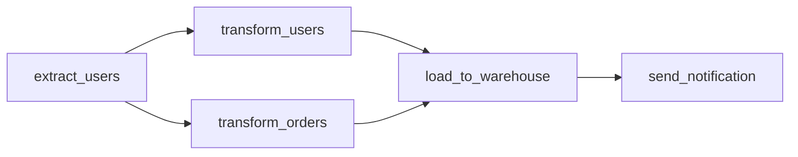
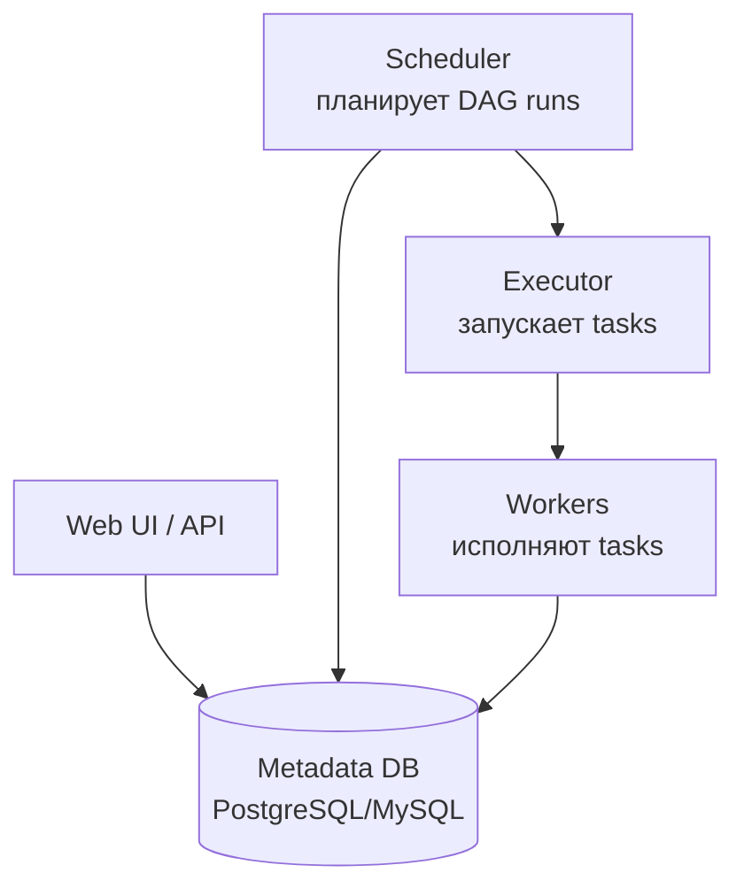
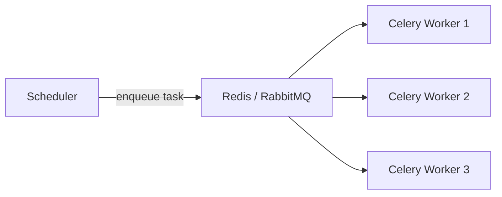

# Вопросы на собеседовании: `Apache Airflow`

`Apache Airflow` — самый популярный оркестратор workflow в data engineering. Создан в **Airbnb** (2014), Apache top-level с 2019. Workflow описываются как **DAG на Python**. Применяется для ETL, ML-пайплайнов и регулярных задач. Альтернативы: Prefect, Dagster, Argo Workflows, Luigi.

## Полезные ссылки

### Официальная документация и авторитетные источники

- [Apache Airflow Documentation](https://airflow.apache.org/docs/)
- [Astronomer Airflow Guides](https://www.astronomer.io/guides/)
- [Airflow vs Prefect vs Dagster](https://www.prefect.io/blog/airflow-vs-prefect-vs-dagster)
- [Best Practices for Apache Airflow](https://airflow.apache.org/docs/apache-airflow/stable/best-practices.html)

## Содержание

- [Полезные ссылки](#полезные-ссылки)
- [See also](#see-also)

**Базовые понятия**
- [Q1. (!) Что такое Apache Airflow?](#q1--что-такое-apache-airflow)
- [Q2. (!) Что такое DAG?](#q2--что-такое-dag)
- [Q3. Архитектура Airflow — компоненты?](#q3-архитектура-airflow--компоненты)
- [Q4. Зачем metadata DB?](#q4-зачем-metadata-db)

**DAG и tasks**
- [Q5. (!) Как написать простейший DAG?](#q5--как-написать-простейший-dag)
- [Q6. (!) Что такое operator?](#q6--что-такое-operator)
- [Q7. (!) Самые частые operators?](#q7--самые-частые-operators)
- [Q8. TaskFlow API (с Airflow 2.0+)?](#q8-taskflow-api-с-airflow-20)
- [Q9. (!) Зависимости между tasks?](#q9--зависимости-между-tasks)
- [Q10. Dynamic DAG generation?](#q10-dynamic-dag-generation)

**Scheduling**
- [Q11. (!) Как работает scheduling в Airflow?](#q11--как-работает-scheduling-в-airflow)
- [Q12. (!) schedule_interval, start_date, catchup?](#q12--schedule_interval-start_date-catchup)
- [Q13. Backfill?](#q13-backfill)
- [Q14. (!) execution_date vs logical_date?](#q14--execution_date-vs-logical_date)

**Executors**
- [Q15. (!) Какие executors бывают?](#q15--какие-executors-бывают)
- [Q16. SequentialExecutor vs LocalExecutor?](#q16-sequentialexecutor-vs-localexecutor)
- [Q17. (!) CeleryExecutor — как работает?](#q17--celeryexecutor--как-работает)
- [Q18. (!) KubernetesExecutor — почему рекомендуется?](#q18--kubernetesexecutor--почему-рекомендуется)

**Состояние и связь между tasks**
- [Q19. (!) XCom — что это?](#q19--xcom--что-это)
- [Q20. Connections и Variables?](#q20-connections-и-variables)
- [Q21. Hooks и operators?](#q21-hooks-и-operators)

**Sensors**
- [Q22. (!) Что такое sensor?](#q22--что-такое-sensor)
- [Q23. Reschedule mode для long-running sensors?](#q23-reschedule-mode-для-long-running-sensors)

**Production**
- [Q24. (!) Как deploy Airflow в production?](#q24--как-deploy-airflow-в-production)
- [Q25. (!) Сколько DAG'ов / tasks может выдержать?](#q25--сколько-dagов--tasks-может-выдержать)
- [Q26. Best practices для production DAGs?](#q26-best-practices-для-production-dags)

**Альтернативы и сравнения**
- [Q27. (!) Airflow vs Prefect vs Dagster?](#q27--airflow-vs-prefect-vs-dagster)
- [Q28. Какие минусы Airflow?](#q28-какие-минусы-airflow)

## Q1. (!) Что такое Apache Airflow?

`Apache Airflow` — **платформа оркестрации workflow**. Workflow описываются как **DAG (направленный ациклический граф)** на Python.

**Применения:**
- **ETL/ELT-пайплайны** — извлечение, преобразование, загрузка
- **Data-пайплайны** — оркестрация Spark/Flink-задач
- **ML-пайплайны** — обучение, оценка, деплой
- **Регулярные задачи** — бэкапы, отчёты, очистка данных

**Не подходит для:**
- Потоковой обработки в реальном времени (используй Kafka Streams, Flink)
- Долгоживущих интерактивных workflow
- Оркестрации на уровне задач внутри Spark (используй Spark scheduler)

## Q2. (!) Что такое DAG?

**DAG (Directed Acyclic Graph)** — граф **tasks** с **направленными** связями и **без циклов**.



В Airflow DAG = Python файл, описывающий tasks и их зависимости.

**Свойства:**
- Acyclic — нет циклов (иначе невозможно определить порядок)
- Directed — стрелки показывают порядок
- DAG должен быть идемпотентным (можно перезапускать)

## Q3. Архитектура Airflow — компоненты?



- **Scheduler** — читает DAG файлы, планирует runs, отправляет tasks executor'у
- **Executor** — стратегия запуска (Sequential, Local, Celery, K8s)
- **Workers** — фактически выполняют tasks
- **Web UI** — мониторинг, ручной запуск
- **Metadata DB** — состояние DAG-запусков, tasks, connections, variables

## Q4. Зачем metadata DB?

Хранит:
- Описание DAG-запусков (запущен, успех, ошибка)
- Логи (опционально, обычно отдельно)
- Connections (учётные данные к БД)
- Variables (значения конфигурации)
- XComs (данные между tasks)
- Конфигурации пулов

В production — **PostgreSQL** (рекомендуется) или MySQL. **SQLite** только для dev/локальной работы.

## Q5. (!) Как написать простейший DAG?

```python
from airflow import DAG
from airflow.operators.bash import BashOperator
from airflow.operators.python import PythonOperator
from datetime import datetime, timedelta

default_args = {
    'owner': 'airflow',
    'depends_on_past': False,
    'email_on_failure': True,
    'retries': 2,
    'retry_delay': timedelta(minutes=5),
}

with DAG(
    dag_id='my_etl_pipeline',
    default_args=default_args,
    description='Daily ETL',
    schedule_interval='@daily',
    start_date=datetime(2025, 1, 1),
    catchup=False,
    tags=['etl'],
) as dag:

    def extract_data():
        return "data"

    extract = PythonOperator(
        task_id='extract',
        python_callable=extract_data,
    )

    transform = BashOperator(
        task_id='transform',
        bash_command='python /opt/scripts/transform.py',
    )

    load = BashOperator(
        task_id='load',
        bash_command='psql -f /opt/scripts/load.sql',
    )

    extract >> transform >> load
```

DAG-файл должен быть в директории, которую сканирует Scheduler (обычно `dags/`).

## Q6. (!) Что такое operator?

`Operator` — **template** для конкретной операции. Один operator = один task.

```python
PythonOperator(task_id='my_task', python_callable=func)
BashOperator(task_id='my_task', bash_command='ls')
EmptyOperator(task_id='dummy')
```

При выполнении operator создаёт **task instance**.

**Типы операторов:**
- **Action** — что-то делают (BashOperator, PythonOperator, EmailOperator)
- **Transfer** — переносят данные (S3ToGCSOperator, MySqlToHiveOperator)
- **Sensor** — ждут условия (FileSensor, ExternalTaskSensor)

## Q7. (!) Самые частые operators?

| Operator | Назначение |
|----------|------------|
| `PythonOperator` | Вызвать Python функцию |
| `BashOperator` | Выполнить bash команду |
| `SqlOperator` (DB-specific) | SQL query |
| `KubernetesPodOperator` | Запустить под в K8s |
| `SparkSubmitOperator` | Запустить Spark job |
| `S3ToGCSOperator` | S3 → Google Cloud Storage |
| `EmailOperator` | Отправить email |
| `HttpOperator` | HTTP request |
| `BranchPythonOperator` | Условное ветвление |
| `EmptyOperator` (dummy) | Группировка/маркер |
| `TriggerDagRunOperator` | Запустить другой DAG |
| `ExternalTaskSensor` | Дождаться task в другом DAG |

Также — **provider-пакеты** (`apache-airflow-providers-*`) для Snowflake, BigQuery, Redshift и т.д.

## Q8. TaskFlow API (с Airflow 2.0+)?

**TaskFlow API** — модернизированный синтаксис через декораторы:

```python
from airflow.decorators import dag, task
from datetime import datetime

@dag(schedule_interval='@daily', start_date=datetime(2025, 1, 1), catchup=False)
def my_pipeline():

    @task
    def extract():
        return {"users": [1, 2, 3]}

    @task
    def transform(data):
        return [u * 2 for u in data["users"]]

    @task
    def load(data):
        print(f"Loading: {data}")

    data = extract()
    transformed = transform(data)
    load(transformed)

my_pipeline()
```

**Преимущества:**
- Похоже на обычный Python-код
- Передача через XCom автоматическая (через возвращаемые значения)
- Меньше шаблонного кода

В **новых проектах** TaskFlow API предпочтительнее классических операторов.

## Q9. (!) Зависимости между tasks?

```python
# Через bitshift operators (классический)
extract >> transform >> load

# Несколько tasks
extract >> [transform_a, transform_b] >> load

# Эквивалентно
transform.set_upstream(extract)
load.set_downstream(notify)

# В TaskFlow API — через вызовы
data = extract()
result = transform(data)  # неявная зависимость
load(result)
```

`>>` — `task1 << task2` или `task1 >> task2`. Создаёт рёбра в DAG.

## Q10. Dynamic DAG generation?

```python
# Статически
for i in range(10):
    task = PythonOperator(
        task_id=f'task_{i}',
        python_callable=process,
        op_args=[i],
    )

# Dynamic Task Mapping (Airflow 2.3+)
@task
def process_item(item):
    return item * 2

@task
def get_items():
    return [1, 2, 3, 4, 5]

@dag(...)
def my_dag():
    items = get_items()
    process_item.expand(item=items)  # создаст N tasks динамически
```

**Dynamic Task Mapping** — для случаев когда **число tasks неизвестно** до runtime.

## Q11. (!) Как работает scheduling в Airflow?

1. Scheduler **сканирует DAG файлы** периодически
2. Для каждого DAG — определяет **next run** на основе `schedule_interval`
3. Когда время приходит → создаёт **DAG run** со статусом `running`
4. Tasks отправляются executor'у в правильном порядке (по dependencies)
5. После завершения всех tasks → DAG-запуск = `success` или `failed`

Scheduler **сам не выполняет** tasks — только отправляет их executor'у.

## Q12. (!) schedule_interval, start_date, catchup?

```python
DAG(
    schedule_interval='0 2 * * *',     # cron — каждый день в 2:00
    schedule_interval='@daily',         # preset
    schedule_interval=timedelta(hours=6), # каждые 6 часов
    start_date=datetime(2025, 1, 1),
    catchup=False,
)
```

**`schedule_interval`** — как часто запускать.
**`start_date`** — когда начать.
**`catchup`** — если `True`, Airflow выполнит **все пропущенные** запуски от `start_date`.

С `catchup=False` — только **последний** пропущенный запуск.

**Подвох:** DAG запускается **в конце интервала**, не в начале. Daily DAG со start_date `2025-01-01` запустится **2 января** для данных от 1-го.

## Q13. Backfill?

`Backfill` — выполнить DAG для исторических периодов.

```bash
airflow dags backfill -s 2025-01-01 -e 2025-01-31 my_dag
```

Создаёт DAG runs для всех дат в диапазоне. Полезно после изменений логики или для пересчёта старых данных.

## Q14. (!) execution_date vs logical_date?

В **старых версиях** — `execution_date` означало **начало интервала** (не время запуска).

С Airflow 2.2+ — переименовано в `logical_date` (логическая дата процессинга).

```python
@task
def my_task(**context):
    logical_date = context['logical_date']  # новое имя
    execution_date = context['execution_date']  # старое имя (deprecated)
```

**Подвох:** для daily DAG, `logical_date = 2025-01-01` означает "обработка данных за 1 января", а сам run произошёл 2 января.

## Q15. (!) Какие executors бывают?

| Executor | Описание | Когда использовать |
|----------|----------|----------|
| **SequentialExecutor** | Один task за раз | Локальная отладка |
| **LocalExecutor** | Параллельно на одной машине | Небольшие инсталляции |
| **CeleryExecutor** | Распределённо через Celery + Redis/RabbitMQ | Средний масштаб |
| **KubernetesExecutor** | Каждый task — pod в K8s | Cloud-native |
| **CeleryKubernetesExecutor** | Гибрид | Смешанные нагрузки |
| **DaskExecutor** | Dask-кластер (deprecated) | — |

## Q16. SequentialExecutor vs LocalExecutor?

**SequentialExecutor** — один task в один момент. Используется только с **SQLite** (для dev). Для production не подходит.

**LocalExecutor** — параллельные tasks через **multiprocessing** на одной машине.

```python
# airflow.cfg
executor = LocalExecutor
sql_alchemy_conn = postgresql+psycopg2://...
```

LocalExecutor хорош для **небольших инсталляций** (~100 DAG'ов). Горизонтально не масштабируется.

## Q17. (!) CeleryExecutor — как работает?

`CeleryExecutor` использует **Celery** + брокер сообщений (RabbitMQ или Redis) для распределения нагрузки.



**Workers** — отдельные процессы (на разных машинах), которые забирают tasks из брокера.

**Масштабирование:** добавляешь больше воркеров.

```bash
airflow celery worker
```

**Минусы:**
- Сложнее в эксплуатации (нужен брокер)
- Worker-процессы долгоживущие (труднее обновлять библиотеки)

## Q18. (!) KubernetesExecutor — почему рекомендуется?

`KubernetesExecutor` запускает **каждый task** как **отдельный pod** в K8s.

**Преимущества:**
- **Полная изоляция** между tasks (разные зависимости, лимиты ресурсов)
- **Автомасштабирование** через K8s
- Нет постоянных воркеров (платим только за выполняемые tasks)
- Cloud-native деплой

**Недостатки:**
- Накладные расходы на старт пода (~5–30 сек на task)
- Не подходит для **очень коротких** tasks (накладные расходы превышают полезную работу)

В **2024** KubernetesExecutor — рекомендуемый выбор для облачных production-деплоев.

## Q19. (!) XCom — что это?

**XCom (Cross-Communication)** — механизм обмена данными между задачами.

```python
@task
def push():
    return {"key": "value"}  # автоматически push в XCom

@task
def pull(data):  # автоматически pull
    print(data)

push() >> pull()

# Или explicitly
def push_xcom(**context):
    context['ti'].xcom_push(key='my_key', value='my_value')

def pull_xcom(**context):
    value = context['ti'].xcom_pull(key='my_key', task_ids='push')
```

**Подвох:** XCom хранятся в **metadata DB** → не для **больших данных**. Только мета-информация (paths, IDs, статусы).

Для больших данных — пиши в S3/HDFS, передавай **path** через XCom.

## Q20. Connections и Variables?

**Connections** — учётные данные для внешних систем:

```python
from airflow.hooks.postgres_hook import PostgresHook
hook = PostgresHook(postgres_conn_id='my_postgres')
df = hook.get_pandas_df("SELECT * FROM users")
```

Создаются через UI или CLI. Хранятся в metadata DB (в зашифрованном виде).

**Variables** — конфигурация:

```python
from airflow.models import Variable
api_key = Variable.get("my_api_key")
config = Variable.get("config", deserialize_json=True)
```

**Хорошая практика:** не хранить секреты в Variables. Использовать **Secrets Backends** (Vault, AWS Secrets Manager).

## Q21. Hooks и operators?

**Hook** — низкоуровневая обёртка над внешней системой (DB, API, S3).

**Operator** — высокоуровневый task, обычно использует hook внутри.

```python
# Hook
hook = PostgresHook(postgres_conn_id='my_postgres')
records = hook.get_records("SELECT * FROM users")

# Operator (использует Hook)
task = PostgresOperator(
    task_id='insert',
    postgres_conn_id='my_postgres',
    sql='INSERT INTO users (name) VALUES (\'Alice\');',
)
```

Hooks — для кастомных Python-задач. Operators — для декларативных workflow.

## Q22. (!) Что такое sensor?

**Sensor** — task, который **ждёт** выполнения условия (появился файл, обновилась таблица и т.п.).

```python
from airflow.sensors.filesystem import FileSensor

wait_for_file = FileSensor(
    task_id='wait_file',
    filepath='/data/input.csv',
    poke_interval=60,    # проверять каждую минуту
    timeout=3600,         # максимум 1 час
)
```

**Частые сенсоры:**
- `FileSensor`, `S3KeySensor` — ждут появления файла
- `ExternalTaskSensor` — ждёт task в другом DAG
- `SqlSensor` — ждёт выполнения SQL-условия
- `HttpSensor` — ждёт HTTP-ответ

## Q23. Reschedule mode для long-running sensors?

```python
sensor = FileSensor(
    task_id='wait',
    mode='reschedule',  # вместо 'poke' (default)
    poke_interval=300,
)
```

| Mode | Поведение |
|------|-----------|
| `poke` (default) | Worker слот занят всё время ожидания |
| `reschedule` | Worker слот освобождается между проверками |

**Reschedule** для долгих ожиданий (часы/дни) — иначе воркеры застрянут на сенсорах.

## Q24. (!) Как deploy Airflow в production?

**Опции:**

1. **Astronomer** (управляемый Airflow) — самый популярный SaaS
2. **MWAA** (Amazon Managed Workflows for Apache Airflow)
3. **Cloud Composer** (управляемый сервис Google)
4. **Self-hosted на K8s** через [официальный Helm-chart](https://airflow.apache.org/docs/helm-chart/stable/)

**Рекомендуемая архитектура:**
- KubernetesExecutor
- PostgreSQL для metadata
- S3/GCS для логов
- Secrets backend (Vault, AWS Secrets Manager)
- Sentry / DataDog для мониторинга

```bash
helm install airflow apache-airflow/airflow
```

## Q25. (!) Сколько DAG'ов / tasks может выдержать?

Зависит от executor'а и железа:

- **LocalExecutor:** 50–200 DAG'ов, ~100 параллельных tasks
- **CeleryExecutor:** 1000+ DAG'ов, тысячи параллельных tasks
- **KubernetesExecutor:** ограничено только ресурсами K8s

**Узкие места:**
1. **Scheduler** — медленно сканирует большое число DAG'ов (тысячи)
2. **Metadata DB** — может стать узким местом (нужны индексы, vacuum)
3. **Сеть** — для распределённых executor'ов

В **крупных инсталляциях** DAG'и разделяют по нескольким инстансам Airflow.

## Q26. Best practices для production DAGs?

1. **Идемпотентность** — DAG должен быть безопасен к повторному запуску
2. **Атомарность** — task делает одну вещь, можно перезапускать
3. **Не импортируй тяжёлые библиотеки** на верхнем уровне DAG (медленный парсинг)
4. **Используй Variables/Connections** для конфигурации, не зашивай значения в код
5. **Pools** — ограничивать параллелизм для общих ресурсов (DB, API)
6. **Tags** — для организации (`tags=['etl', 'critical']`)
7. **Retries** — настраивать в `default_args`
8. **SLA** — алерты, если task не завершился вовремя
9. **Тестируй DAG'и** — `pytest` для валидации DAG
10. **CI/CD** — деплой DAG'ов через git

## Q27. (!) Airflow vs Prefect vs Dagster?

| Критерий | Airflow | Prefect | Dagster |
|----------|---------|---------|---------|
| Возраст | 2014 | 2018 | 2018 |
| Статус | Apache top-level | Open-source | Open-source |
| Описание workflow | DAG в Python | Tasks + Flows | Assets |
| Система типов | Нет | Есть | Сильная (PEP 484) |
| Локальная разработка | Сложная | Простая | Простая |
| UI | Хороший | Современный | Современный |
| Распространённость | Доминирует | Растёт | Растёт |

**Prefect** и **Dagster** — современные альтернативы, проще в локальной разработке. **Airflow** — стандарт де-факто, огромное сообщество.

В **новых проектах** часто рассматривают Prefect/Dagster, особенно ради удобства разработки. В **enterprise** доминирует Airflow.

## Q28. Какие минусы Airflow?

1. **Медленная локальная разработка** — поднять Airflow для теста долго
2. **Тяжёлый для маленьких задач** — нужны metadata DB, scheduler, executor, web UI
3. **Тесная связанность tasks ↔ Airflow API** — task'и сложно покрыть unit-тестами
4. **Лимит XCom** — не для больших данных
5. **Накладные расходы на парсинг DAG** — Scheduler медленный при сотнях DAG'ов
6. **Масштабирование сенсоров** — режим `poke` съедает воркеры
7. **Не для streaming** — Airflow только для batch-обработки
8. **`execution_date` vs `logical_date`** — исторически вносит путаницу
9. **Сложности обновления** — мажорные версии могут ломать DAG'и

В **2024** многие выбирают **Prefect или Dagster** для новых проектов из-за более удобной разработки. Airflow остаётся стандартом в enterprise.

---

## See also

- [Apache Spark](apache-spark-interview.md) — Airflow часто оркестрирует Spark jobs
- [Apache Flink](apache-flink-interview.md) — vs Airflow (streaming vs batch)
- [Kafka Streams](kafka-streams-interview.md) — другой стиль (event-driven)
- [dbt](dbt-interview.md) — часто оркестрируется через Airflow
- [Stream Processing](stream-processing-interview.md) — Airflow для batch, не streaming
- [Data Warehousing](data-warehousing-interview.md) — main use case Airflow
- [Data Lake / Lakehouse](data-lake-lakehouse-interview.md) — pipelines в lake/warehouse
- [Kubernetes](../devops/kubernetes-interview.md) — KubernetesExecutor
- [Микросервисы](../architecture/microservices-interview.md) — Airflow vs scheduled jobs
- [PostgreSQL](../databases/postgresql-interview.md) — metadata DB
- [Docker](../devops/docker-interview.md) — деплой Airflow
- [[python-interview|Python]] — DAG = Python код (когда добавим)
