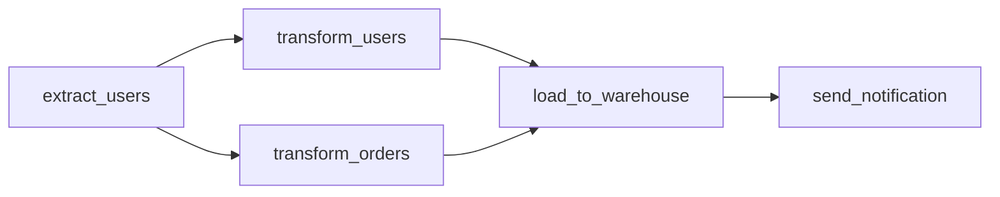
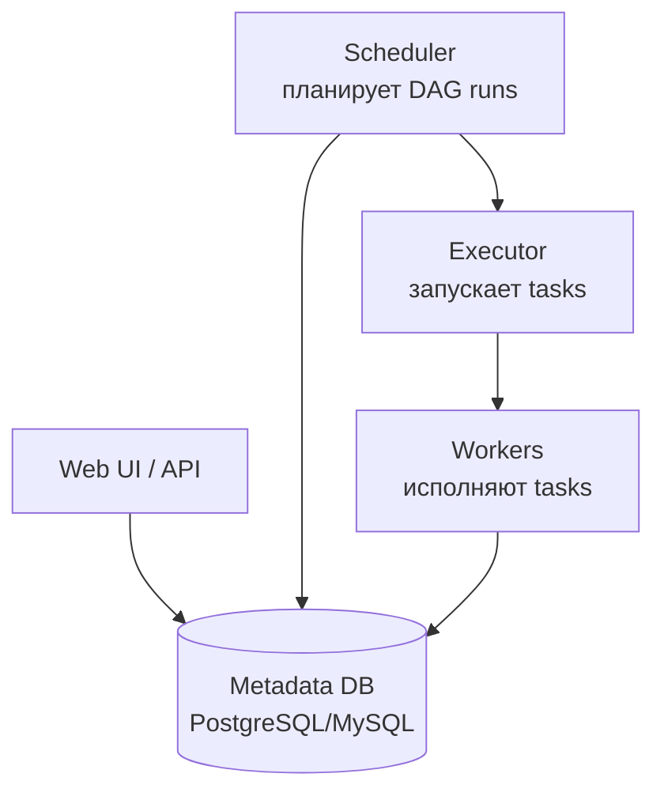
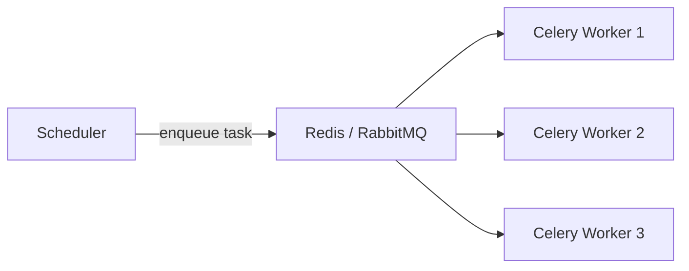

# Вопросы на собеседовании: `Apache Airflow`

`Apache Airflow` — самый популярный workflow orchestration в data engineering. Создан **Airbnb** (2014), Apache top-level с 2019. Workflows описываются как **DAG в Python**. Применяется для ETL, ML pipelines, scheduled jobs. Альтернативы: Prefect, Dagster, Argo Workflows, Luigi.

## Полезные ссылки

### Официальная документация и авторитетные источники

- [Apache Airflow Documentation](https://airflow.apache.org/docs/)
- [Astronomer Airflow Guides](https://www.astronomer.io/guides/)
- [Airflow vs Prefect vs Dagster](https://www.prefect.io/blog/airflow-vs-prefect-vs-dagster)
- [Best Practices for Apache Airflow](https://airflow.apache.org/docs/apache-airflow/stable/best-practices.html)

## Содержание

- [Полезные ссылки](#полезные-ссылки)
- [See also](#see-also)

**Базовые понятия**
- [Q1. (!) Что такое Apache Airflow?](#q1--что-такое-apache-airflow)
- [Q2. (!) Что такое DAG?](#q2--что-такое-dag)
- [Q3. Архитектура Airflow — компоненты?](#q3-архитектура-airflow--компоненты)
- [Q4. Зачем metadata DB?](#q4-зачем-metadata-db)

**DAG и tasks**
- [Q5. (!) Как написать простейший DAG?](#q5--как-написать-простейший-dag)
- [Q6. (!) Что такое operator?](#q6--что-такое-operator)
- [Q7. (!) Самые частые operators?](#q7--самые-частые-operators)
- [Q8. TaskFlow API (с Airflow 2.0+)?](#q8-taskflow-api-с-airflow-20)
- [Q9. (!) Зависимости между tasks?](#q9--зависимости-между-tasks)
- [Q10. Dynamic DAG generation?](#q10-dynamic-dag-generation)

**Scheduling**
- [Q11. (!) Как работает scheduling в Airflow?](#q11--как-работает-scheduling-в-airflow)
- [Q12. (!) schedule_interval, start_date, catchup?](#q12--schedule_interval-start_date-catchup)
- [Q13. Backfill?](#q13-backfill)
- [Q14. (!) execution_date vs logical_date?](#q14--execution_date-vs-logical_date)

**Executors**
- [Q15. (!) Какие executors бывают?](#q15--какие-executors-бывают)
- [Q16. SequentialExecutor vs LocalExecutor?](#q16-sequentialexecutor-vs-localexecutor)
- [Q17. (!) CeleryExecutor — как работает?](#q17--celeryexecutor--как-работает)
- [Q18. (!) KubernetesExecutor — почему рекомендуется?](#q18--kubernetesexecutor--почему-рекомендуется)

**Состояние и связь между tasks**
- [Q19. (!) XCom — что это?](#q19--xcom--что-это)
- [Q20. Connections и Variables?](#q20-connections-и-variables)
- [Q21. Hooks и operators?](#q21-hooks-и-operators)

**Sensors**
- [Q22. (!) Что такое sensor?](#q22--что-такое-sensor)
- [Q23. Reschedule mode для long-running sensors?](#q23-reschedule-mode-для-long-running-sensors)

**Production**
- [Q24. (!) Как deploy Airflow в production?](#q24--как-deploy-airflow-в-production)
- [Q25. (!) Сколько DAG'ов / tasks может выдержать?](#q25--сколько-dagов--tasks-может-выдержать)
- [Q26. Best practices для production DAGs?](#q26-best-practices-для-production-dags)

**Альтернативы и сравнения**
- [Q27. (!) Airflow vs Prefect vs Dagster?](#q27--airflow-vs-prefect-vs-dagster)
- [Q28. Какие минусы Airflow?](#q28-какие-минусы-airflow)

## Q1. (!) Что такое Apache Airflow?

`Apache Airflow` — **workflow orchestration platform**. Workflows описываются как **DAG (Directed Acyclic Graph)** в Python.

**Применения:**
- **ETL/ELT pipelines** — extract, transform, load
- **Data pipelines** — Spark/Flink jobs orchestration
- **ML pipelines** — training, evaluation, deployment
- **Scheduled jobs** — backups, reports, data cleanups

**Не для:**
- Real-time streaming (используй Kafka Streams, Flink)
- Long-running interactive workflows
- Job-level orchestration внутри Spark (используй Spark scheduler)


> [!mcq]
> - [ ] Airflow — это real-time streaming engine как Flink | ❌ ПОСЛЕДСТВИЕ: Airflow для batch orchestration; для streaming — Kafka Streams/Flink
> - [x] Airflow = workflow orchestration platform; DAG в Python; batch ETL/ELT pipelines, scheduled jobs, ML training | ✓ ПРИМЕНЯТЬ: координировать batch-job dependencies, retries, monitoring 📋 ПРАВИЛО: Airflow = batch orchestrator, не streaming runtime 🔗 См. Q2
> - [ ] Airflow обрабатывает данные внутри tasks | ❌ ПОСЛЕДСТВИЕ: Airflow координирует tasks, но обработку делегирует Spark/SQL/Python; XCom не для больших данных
> - [ ] Airflow подходит для интерактивных long-running workflows | ❌ ПОСЛЕДСТВИЕ: для interactive — Jupyter/Streamlit; Airflow для scheduled batch с чёткой структурой

## Q2. (!) Что такое DAG?

**DAG (Directed Acyclic Graph)** — граф **tasks** с **направленными** связями и **без циклов**.



В Airflow DAG = Python файл, описывающий tasks и их зависимости.

**Свойства:**
- Acyclic — нет циклов (иначе невозможно определить порядок)
- Directed — стрелки показывают порядок
- DAG идемпотентный должен быть (можно re-run)


> [!mcq]
> - [ ] DAG может содержать циклы для retry | ❌ ПОСЛЕДСТВИЕ: A = Acyclic — циклы запрещены; retry конфигурится через `retries=N`, не циклом
> - [x] DAG = Directed Acyclic Graph tasks в Python с направленными зависимостями без циклов; должен быть идемпотентным для re-runs | ✓ ПРИМЕНЯТЬ: моделирование batch pipeline с явными зависимостями 📋 ПРАВИЛО: DAG = задачи + порядок, идемпотентность обязательна 🔗 См. Q3
> - [ ] DAG = неструктурированный список tasks без зависимостей | ❌ ПОСЛЕДСТВИЕ: смысл DAG именно в направленных зависимостях для порядка выполнения
> - [ ] DAG-файл = JSON manifest, не Python | ❌ ПОСЛЕДСТВИЕ: DAG в Airflow — Python module; декларативные альтернативы — Dagster/Prefect

## Q3. Архитектура Airflow — компоненты?



- **Scheduler** — читает DAG файлы, планирует runs, отправляет tasks executor'у
- **Executor** — стратегия запуска (Sequential, Local, Celery, K8s)
- **Workers** — фактически выполняют tasks
- **Web UI** — мониторинг, ручной trigger
- **Metadata DB** — стейт DAG runs, tasks, connections, variables


> [!mcq]
> - [x] Airflow = Scheduler (планирует DAG runs) + Executor (стратегия запуска) + Workers (исполняют tasks) + Web UI (мониторинг) + Metadata DB (стейт) | ✓ ПРИМЕНЯТЬ: понимать, что Scheduler ≠ Executor; они разные компоненты 📋 ПРАВИЛО: Scheduler планирует, Executor запускает, Workers исполняют 🔗 См. Q4
> - [ ] Scheduler сам исполняет tasks без Executor | ❌ ПОСЛЕДСТВИЕ: Scheduler решает что запустить, Executor определяет КАК (Local/Celery/K8s)
> - [ ] Workers подключаются к Web UI напрямую | ❌ ПОСЛЕДСТВИЕ: Workers пишут в Metadata DB; Web UI читает из неё
> - [ ] Metadata DB не нужна — Airflow stateless | ❌ ПОСЛЕДСТВИЕ: без metadata DB нет state DAG runs, нет recovery, нет UI

## Q4. Зачем metadata DB?

Хранит:
- Описание DAG runs (started, success, failed)
- Логи (опционально, обычно отдельно)
- Connections (DB credentials)
- Variables (config values)
- XComs (inter-task data)
- Pool configurations

В production — **PostgreSQL** (рекомендуется) или MySQL. **SQLite** только для dev/local.


> [!mcq]
> - [ ] SQLite — рекомендуется для production Airflow | ❌ ПОСЛЕДСТВИЕ: SQLite single-writer и не работает с CeleryExecutor; в prod — PostgreSQL/MySQL
> - [x] Metadata DB хранит DAG runs state, connections, variables, XComs, pool config; PostgreSQL (рекомендуется) или MySQL в prod, SQLite только для dev/local | ✓ ПРИМЕНЯТЬ: backup metadata DB как critical infra, миграции через alembic 📋 ПРАВИЛО: Postgres в prod, SQLite в dev 🔗 См. Q5
> - [ ] Metadata DB хранит сами данные задач | ❌ ПОСЛЕДСТВИЕ: данные обрабатывают workers через Spark/SQL; metadata DB хранит state/metadata, не payload
> - [ ] XComs не хранятся в metadata DB | ❌ ПОСЛЕДСТВИЕ: XCom хранится в metadata DB по умолчанию (есть custom XCom backend для S3)

## Q5. (!) Как написать простейший DAG?

```python
from airflow import DAG
from airflow.operators.bash import BashOperator
from airflow.operators.python import PythonOperator
from datetime import datetime, timedelta

default_args = {
    'owner': 'airflow',
    'depends_on_past': False,
    'email_on_failure': True,
    'retries': 2,
    'retry_delay': timedelta(minutes=5),
}

with DAG(
    dag_id='my_etl_pipeline',
    default_args=default_args,
    description='Daily ETL',
    schedule_interval='@daily',
    start_date=datetime(2025, 1, 1),
    catchup=False,
    tags=['etl'],
) as dag:

    def extract_data():
        return "data"

    extract = PythonOperator(
        task_id='extract',
        python_callable=extract_data,
    )

    transform = BashOperator(
        task_id='transform',
        bash_command='python /opt/scripts/transform.py',
    )

    load = BashOperator(
        task_id='load',
        bash_command='psql -f /opt/scripts/load.sql',
    )

    extract >> transform >> load
```

DAG-файл должен быть в директории, которую сканирует Scheduler (обычно `dags/`).


> [!mcq]
> - [ ] DAG-файл размещают в произвольной папке | ❌ ПОСЛЕДСТВИЕ: Scheduler сканирует только настроенную dags_folder (обычно `dags/`); другие папки игнорируются
> - [x] DAG = Python с DAG(...) context manager + operators + `>>` для зависимостей; параметры default_args, schedule_interval, start_date, catchup=False; файл в `dags/` | ✓ ПРИМЕНЯТЬ: ETL pipeline daily через `@daily` 📋 ПРАВИЛО: with DAG(...) + operators + extract >> transform >> load 🔗 См. Q6
> - [ ] catchup=True — best practice для всех новых DAG | ❌ ПОСЛЕДСТВИЕ: catchup=True заполнит все backfills с start_date — может перегрузить cluster; для новых обычно False
> - [ ] retries не нужны — ошибки лучше пробрасывать наверх | ❌ ПОСЛЕДСТВИЕ: transient errors (network, rate-limit) self-heal с retries; без них pipeline хрупкий

## Q6. (!) Что такое operator?

`Operator` — **template** для конкретной операции. Один operator = один task.

```python
PythonOperator(task_id='my_task', python_callable=func)
BashOperator(task_id='my_task', bash_command='ls')
EmptyOperator(task_id='dummy')
```

При выполнении operator создаёт **task instance**.

**Типы operators:**
- **Action** — что-то делают (BashOperator, PythonOperator, EmailOperator)
- **Transfer** — переносят данные (S3ToGCSOperator, MySqlToHiveOperator)
- **Sensor** — ждут условия (FileSensor, ExternalTaskSensor)


> [!mcq]
> - [ ] Operator выполняет работу сразу при создании | ❌ ПОСЛЕДСТВИЕ: Operator = template; при выполнении создаётся task instance (TI) — runtime инстанс
> - [ ] Один operator = много tasks | ❌ ПОСЛЕДСТВИЕ: один operator = один task в DAG; для повторов используют loop в DAG-коде или dynamic task mapping
> - [x] Operator = template для конкретной операции (1 operator = 1 task); типы: Action (Python/Bash/Email), Transfer (S3ToGCS), Sensor (FileSensor); runtime создаёт task instance | ✓ ПРИМЕНЯТЬ: каждый шаг pipeline = один operator 📋 ПРАВИЛО: operator = blueprint, task instance = run 🔗 См. Q7
> - [ ] PythonOperator и Sensor взаимозаменяемы | ❌ ПОСЛЕДСТВИЕ: разные категории; Sensor ждёт условие (poke_interval), PythonOperator один раз вызывает функцию

## Q7. (!) Самые частые operators?

| Operator | Назначение |
|----------|------------|
| `PythonOperator` | Вызвать Python функцию |
| `BashOperator` | Выполнить bash команду |
| `SqlOperator` (DB-specific) | SQL query |
| `KubernetesPodOperator` | Запустить под в K8s |
| `SparkSubmitOperator` | Запустить Spark job |
| `S3ToGCSOperator` | S3 → Google Cloud Storage |
| `EmailOperator` | Отправить email |
| `HttpOperator` | HTTP request |
| `BranchPythonOperator` | Условное ветвление |
| `EmptyOperator` (dummy) | Группировка/маркер |
| `TriggerDagRunOperator` | Запустить другой DAG |
| `ExternalTaskSensor` | Дождаться task в другом DAG |

Также — **provider packages** (`apache-airflow-providers-*`) для Snowflake, BigQuery, Redshift, и т.д.


> [!mcq]
> - [x] Частые operators: PythonOperator, BashOperator, SQL operators, KubernetesPodOperator, SparkSubmitOperator, S3ToGCSOperator, BranchPythonOperator, EmptyOperator, TriggerDagRunOperator + provider packages для Snowflake/BQ | ✓ ПРИМЕНЯТЬ: выбрать operator под задачу; provider packages для cloud services 📋 ПРАВИЛО: PythonOperator/BashOperator для generic, специализированные для cloud 🔗 См. Q8
> - [ ] BashOperator и PythonOperator — устаревшие, не использовать | ❌ ПОСЛЕДСТВИЕ: оба активно используются; PythonOperator основной для custom logic
> - [ ] BranchPythonOperator не нужен — есть if/else в Python | ❌ ПОСЛЕДСТВИЕ: if/else в DAG-коде выполняется при парсинге, не runtime; для conditional execution нужен BranchPythonOperator
> - [ ] Provider packages надо устанавливать вручную всегда | ❌ ПОСЛЕДСТВИЕ: основные провайдеры (Postgres, HTTP) идут с airflow; cloud провайдеры — через pip install apache-airflow-providers-*

## Q8. TaskFlow API (с Airflow 2.0+)?

**TaskFlow API** — модернизированный синтаксис через декораторы:

```python
from airflow.decorators import dag, task
from datetime import datetime

@dag(schedule_interval='@daily', start_date=datetime(2025, 1, 1), catchup=False)
def my_pipeline():

    @task
    def extract():
        return {"users": [1, 2, 3]}

    @task
    def transform(data):
        return [u * 2 for u in data["users"]]

    @task
    def load(data):
        print(f"Loading: {data}")

    data = extract()
    transformed = transform(data)
    load(transformed)

my_pipeline()
```

**Преимущества:**
- Похоже на обычный Python код
- XCom передача автоматическая (через return values)
- Меньше boilerplate

В **новых проектах** — TaskFlow API предпочтительнее classical operators.


> [!mcq]
> - [ ] TaskFlow требует ручной передачи XCom через xcom_push/xcom_pull | ❌ ПОСЛЕДСТВИЕ: основная фишка TaskFlow — автоматическая передача через return values; xcom вызовы не нужны
> - [x] TaskFlow API (Airflow 2.0+) = декораторы @dag/@task с Python-natural синтаксисом; автоматический XCom через return values, меньше boilerplate | ✓ ПРИМЕНЯТЬ: новые DAG в 2.x+ — TaskFlow по умолчанию 📋 ПРАВИЛО: TaskFlow для новых, classical operators для legacy 🔗 См. Q9
> - [ ] TaskFlow несовместим с classical operators | ❌ ПОСЛЕДСТВИЕ: можно микшировать; TaskFlow tasks работают с PythonOperator/BashOperator в одном DAG
> - [ ] TaskFlow работает только в Airflow 1.x | ❌ ПОСЛЕДСТВИЕ: ровно наоборот — TaskFlow появился в Airflow 2.0+, в 1.x его нет

## Q9. (!) Зависимости между tasks?

```python
# Через bitshift operators (классический)
extract >> transform >> load

# Несколько tasks
extract >> [transform_a, transform_b] >> load

# Эквивалентно
transform.set_upstream(extract)
load.set_downstream(notify)

# В TaskFlow API — через вызовы
data = extract()
result = transform(data)  # неявная зависимость
load(result)
```

`>>` — `task1 << task2` или `task1 >> task2`. Создаёт edges в DAG.


> [!mcq]
> - [x] Зависимости: `extract >> transform >> load`, `[a, b] >> c` для fan-in, `set_upstream/downstream`; в TaskFlow — через вызовы (`load(transform(extract()))`) — неявные edges | ✓ ПРИМЕНЯТЬ: bitshift для classical, function calls для TaskFlow 📋 ПРАВИЛО: >> создаёт edges в DAG 🔗 См. Q10
> - [ ] `extract >> transform` равно вызову `extract()` сразу | ❌ ПОСЛЕДСТВИЕ: `>>` только настраивает зависимость; выполнение делает scheduler/executor
> - [ ] `<<` запрещен — используйте только `>>` | ❌ ПОСЛЕДСТВИЕ: оба валидны; `a >> b` равно `b << a`
> - [ ] В TaskFlow зависимости задаются `>>` | ❌ ПОСЛЕДСТВИЕ: в TaskFlow зависимости неявные через function calls и return values

## Q10. Dynamic DAG generation?

```python
# Статически
for i in range(10):
    task = PythonOperator(
        task_id=f'task_{i}',
        python_callable=process,
        op_args=[i],
    )

# Dynamic Task Mapping (Airflow 2.3+)
@task
def process_item(item):
    return item * 2

@task
def get_items():
    return [1, 2, 3, 4, 5]

@dag(...)
def my_dag():
    items = get_items()
    process_item.expand(item=items)  # создаст N tasks динамически
```

**Dynamic Task Mapping** — для случаев когда **число tasks неизвестно** до runtime.


> [!mcq]
> - [ ] Dynamic Task Mapping существует с Airflow 1.x | ❌ ПОСЛЕДСТВИЕ: появилось в Airflow 2.3+; в 1.x только статическая генерация через loop
> - [x] Dynamic DAG generation: статически через for loop при парсинге DAG (число tasks известно) или Dynamic Task Mapping `.expand()` (число неизвестно до runtime, Airflow 2.3+) | ✓ ПРИМЕНЯТЬ: обработка списка файлов или partitions переменной длины 📋 ПРАВИЛО: .expand() для runtime-зависимой длины, for loop для known counts 🔗 См. Q11
> - [ ] Dynamic Task Mapping создаёт tasks при парсинге DAG | ❌ ПОСЛЕДСТВИЕ: tasks создаются runtime после выполнения upstream tasks; именно поэтому нужен .expand()
> - [ ] Loop в DAG генерирует tasks динамически runtime | ❌ ПОСЛЕДСТВИЕ: loop выполняется при парсинге; число tasks фиксируется при создании DAG

## Q11. (!) Как работает scheduling в Airflow?

1. Scheduler **сканирует DAG файлы** периодически
2. Для каждого DAG — определяет **next run** на основе `schedule_interval`
3. Когда время приходит → создаёт **DAG run** со статусом `running`
4. Tasks отправляются executor'у в правильном порядке (по dependencies)
5. После завершения всех tasks → DAG run = `success` или `failed`

Scheduler **не сам выполняет** tasks — только отправляет их executor'у.


> [!mcq]
> - [ ] Scheduler сам выполняет tasks | ❌ ПОСЛЕДСТВИЕ: Scheduler отправляет tasks Executor'у; tasks выполняют Workers
> - [x] Scheduler сканирует DAG-файлы → определяет next run по schedule_interval → создаёт DAG run → отправляет tasks Executor'у в порядке dependencies → собирает результаты | ✓ ПРИМЕНЯТЬ: понимание separation Scheduler vs Executor для tuning 📋 ПРАВИЛО: Scheduler планирует и оркестрирует, Workers исполняют 🔗 См. Q12
> - [ ] Scheduler парсит DAG-файлы только один раз при старте | ❌ ПОСЛЕДСТВИЕ: dag_dir_list_interval (default 5 мин) — Scheduler периодически перечитывает DAG-файлы
> - [ ] Все tasks одного DAG идут на один worker | ❌ ПОСЛЕДСТВИЕ: с CeleryExecutor/K8sExecutor каждый task может идти на разные workers

## Q12. (!) schedule_interval, start_date, catchup?

```python
DAG(
    schedule_interval='0 2 * * *',     # cron — каждый день в 2:00
    schedule_interval='@daily',         # preset
    schedule_interval=timedelta(hours=6), # каждые 6 часов
    start_date=datetime(2025, 1, 1),
    catchup=False,
)
```

**`schedule_interval`** — как часто запускать.
**`start_date`** — когда начать.
**`catchup`** — если `True`, Airflow выполнит **все пропущенные** runs от `start_date`.

С `catchup=False` — только **последний** missed run.

**Подвох:** DAG запускается **в конце интервала**, не в начале. Daily DAG со start_date `2025-01-01` запустится **2 января** для данных от 1-го.


> [!mcq]
> - [ ] DAG запускается в начале интервала | ❌ ПОСЛЕДСТВИЕ: DAG запускается в КОНЦЕ интервала; daily DAG со start_date 2025-01-01 первый run на 2025-01-02 (для данных дня 1-го)
> - [x] schedule_interval = cron/preset/timedelta; start_date = начало; catchup=True заполнит все пропущенные runs, catchup=False — только последний missed; DAG запускается в КОНЦЕ интервала | ✓ ПРИМЕНЯТЬ: catchup=False по умолчанию для новых DAG, чтобы не перегрузить cluster 📋 ПРАВИЛО: end-of-interval execution + catchup=False для прозрачности 🔗 См. Q13
> - [ ] catchup=True безопасный default | ❌ ПОСЛЕДСТВИЕ: catchup=True заполнит ВСЕ runs от start_date — может породить сотни одновременных runs
> - [ ] start_date можно ставить datetime.now() | ❌ ПОСЛЕДСТВИЕ: start_date оценивается каждый раз parse → DAG никогда не запустится; всегда фиксированная дата

## Q13. Backfill?

`Backfill` — выполнить DAG для исторических периодов.

```bash
airflow dags backfill -s 2025-01-01 -e 2025-01-31 my_dag
```

Создаёт DAG runs для всех дат в диапазоне. Полезно после изменений логики или для пересчёта старых данных.


> [!mcq]
> - [x] Backfill = `airflow dags backfill -s ... -e ...` создаёт DAG runs для исторических дат; полезно после изменения логики или пересчёта старых данных; требует идемпотентного DAG | ✓ ПРИМЕНЯТЬ: после bugfix в transform логике переcчитать прошлые runs 📋 ПРАВИЛО: backfill = re-run за период; идемпотентность критична 🔗 См. Q14
> - [ ] Backfill = catchup | ❌ ПОСЛЕДСТВИЕ: catchup автоматически заполняет с start_date; backfill — ручная команда для конкретного диапазона
> - [ ] Backfill идёт через scheduler автоматически | ❌ ПОСЛЕДСТВИЕ: backfill — отдельная CLI команда; scheduler идёт только вперёд от now()
> - [ ] Backfill работает на DAG без idempotency | ❌ ПОСЛЕДСТВИЕ: формально работает, но дубли/коррупция данных гарантированы; всегда нужна idempotency

## Q14. (!) execution_date vs logical_date?

В **старых версиях** — `execution_date` означало **начало интервала** (не время запуска).

С Airflow 2.2+ — переименовано в `logical_date` (логическая дата процессинга).

```python
@task
def my_task(**context):
    logical_date = context['logical_date']  # новое имя
    execution_date = context['execution_date']  # старое имя (deprecated)
```

**Подвох:** для daily DAG, `logical_date = 2025-01-01` означает "обработка данных за 1 января", а сам run произошёл 2 января.


> [!mcq]
> - [ ] execution_date — это реальное время запуска DAG | ❌ ПОСЛЕДСТВИЕ: это начало интервала; daily DAG с logical_date=2025-01-01 на самом деле стартовал 2 января
> - [x] execution_date (legacy) переименован в logical_date (2.2+): начало интервала, а не время запуска; daily DAG logical_date 2025-01-01 — обработка данных за 1 января, run 2 января | ✓ ПРИМЕНЯТЬ: использовать logical_date в SQL фильтрах за день обработки 📋 ПРАВИЛО: logical_date = окно данных, не wall-clock 🔗 См. Q15
> - [ ] logical_date всегда совпадает с datetime.now() | ❌ ПОСЛЕДСТВИЕ: при backfill отличается; даже в обычных runs — logical_date в прошлом относительно фактического старта
> - [ ] execution_date теперь полностью удалён | ❌ ПОСЛЕДСТВИЕ: deprecated alias, но всё ещё доступен в context для обратной совместимости

## Q15. (!) Какие executors бывают?

| Executor | Описание | Use case |
|----------|----------|----------|
| **SequentialExecutor** | Один task за раз | Local debug |
| **LocalExecutor** | Параллельно на одной машине | Маленькие installations |
| **CeleryExecutor** | Distributed через Celery + Redis/RabbitMQ | Mid-scale |
| **KubernetesExecutor** | Каждый task — pod в K8s | Cloud-native |
| **CeleryKubernetesExecutor** | Hybrid | Mixed workloads |
| **DaskExecutor** | Dask cluster (deprecated) | — |


> [!mcq]
> - [x] Executors: Sequential (1 task, local debug), Local (multiprocessing one machine), Celery (distributed Redis/RabbitMQ), Kubernetes (pod per task, cloud-native), CeleryKubernetes (hybrid) | ✓ ПРИМЕНЯТЬ: K8sExecutor для cloud production, LocalExecutor для small installs 📋 ПРАВИЛО: dev=Sequential, small=Local, prod=Celery/K8s 🔗 См. Q16
> - [ ] CeleryExecutor работает без external broker | ❌ ПОСЛЕДСТВИЕ: Celery требует Redis или RabbitMQ для очередей tasks
> - [ ] SequentialExecutor подходит для prod | ❌ ПОСЛЕДСТВИЕ: 1 task за раз → нет parallelism; только для dev/debug
> - [ ] KubernetesExecutor требует postоянных workers | ❌ ПОСЛЕДСТВИЕ: K8sExecutor создаёт pod per task; не нужны long-running workers (главное преимущество)

## Q16. SequentialExecutor vs LocalExecutor?

**SequentialExecutor** — один task в один момент. Используется только с **SQLite** (для dev). Production не подходит.

**LocalExecutor** — параллельные tasks через **multiprocessing** на одной машине.

```python
# airflow.cfg
executor = LocalExecutor
sql_alchemy_conn = postgresql+psycopg2://...
```

LocalExecutor хорош для **маленьких installations** (~100 DAGs). Не масштабируется горизонтально.


> [!mcq]
> - [ ] LocalExecutor работает только с SQLite | ❌ ПОСЛЕДСТВИЕ: ровно наоборот — LocalExecutor требует Postgres/MySQL; SQLite работает только с Sequential
> - [x] SequentialExecutor = 1 task, SQLite only, dev/debug; LocalExecutor = parallel multiprocessing на одной машине, требует Postgres/MySQL, до ~100 DAG | ✓ ПРИМЕНЯТЬ: Local для small standalone install без distributed compute 📋 ПРАВИЛО: Sequential+SQLite=dev; Local+Postgres=small prod 🔗 См. Q17
> - [ ] LocalExecutor масштабируется горизонтально | ❌ ПОСЛЕДСТВИЕ: только vertical (CPU cores на одной машине); для horizontal — Celery/K8s
> - [ ] Sequential нормально для production | ❌ ПОСЛЕДСТВИЕ: 1 task за раз = bottleneck; production требует параллелизма

## Q17. (!) CeleryExecutor — как работает?

`CeleryExecutor` использует **Celery** + message broker (RabbitMQ или Redis) для distribution.



**Workers** — отдельные процессы (на разных машинах), которые забирают tasks из брокера.

**Scaling:** добавляешь больше workers.

```bash
airflow celery worker
```

**Минусы:**
- Сложнее operations (broker нужен)
- Worker процессы — long-running (тяжелее update библиотек)


> [!mcq]
> - [x] CeleryExecutor = scheduler enqueue tasks в broker (Redis/RabbitMQ), Celery workers (long-running на разных машинах) забирают и выполняют; horizontal scaling через `airflow celery worker` | ✓ ПРИМЕНЯТЬ: distributed Airflow на VM кластерах, mid-scale prod 📋 ПРАВИЛО: Celery = workers + broker для distribution 🔗 См. Q18
> - [ ] CeleryExecutor не нужен broker | ❌ ПОСЛЕДСТВИЕ: вся идея в распределении через message broker; Redis/RabbitMQ обязателен
> - [ ] Celery workers — ephemeral, создаются на каждый task | ❌ ПОСЛЕДСТВИЕ: это K8sExecutor; Celery workers — long-running процессы
> - [ ] CeleryExecutor проще в operations чем K8s | ❌ ПОСЛЕДСТВИЕ: broker нужен в инфре, worker update сложнее; K8s часто проще в cloud-native окружении

## Q18. (!) KubernetesExecutor — почему рекомендуется?

`KubernetesExecutor` запускает **каждый task** как **отдельный pod** в K8s.

**Преимущества:**
- **Полная изоляция** между tasks (разные dependencies, resource limits)
- **Auto-scaling** через K8s
- Нет постоянных workers (платим только за running tasks)
- Cloud-native deployment

**Недостатки:**
- Pod startup overhead (~5-30 sec на task)
- Не подходит для **очень коротких** tasks (overhead > useful work)

В **2024** KubernetesExecutor — рекомендуемый выбор для production cloud deployments.


> [!mcq]
> - [ ] K8sExecutor хорош для очень коротких tasks (1 сек) | ❌ ПОСЛЕДСТВИЕ: pod startup overhead 5-30 сек → overhead > work; для коротких лучше Celery
> - [x] KubernetesExecutor = каждый task — отдельный pod в K8s: полная изоляция dependencies/resources, auto-scaling, нет idle workers, cloud-native; pod startup overhead 5-30s | ✓ ПРИМЕНЯТЬ: cloud production с K8s; long-running tasks (> minute) 📋 ПРАВИЛО: pod-per-task = isolation + no idle cost 🔗 См. Q19
> - [ ] K8sExecutor требует постоянных workers как Celery | ❌ ПОСЛЕДСТВИЕ: главное преимущество — ephemeral pods, не нужны long-running workers
> - [ ] K8sExecutor не поддерживает custom Docker images per task | ❌ ПОСЛЕДСТВИЕ: можно задать pod_template_file или KubernetesPodOperator с разными images — гибкость

## Q19. (!) XCom — что это?

**XCom (Cross-Communication)** — механизм обмена данными между tasks.

```python
@task
def push():
    return {"key": "value"}  # автоматически push в XCom

@task
def pull(data):  # автоматически pull
    print(data)

push() >> pull()

# Или explicitly
def push_xcom(**context):
    context['ti'].xcom_push(key='my_key', value='my_value')

def pull_xcom(**context):
    value = context['ti'].xcom_pull(key='my_key', task_ids='push')
```

**Подвох:** XCom хранятся в **metadata DB** → не для **больших данных**. Только мета-информация (paths, IDs, статусы).

Для больших данных — пиши в S3/HDFS, передавай **path** через XCom.


> [!mcq]
> - [ ] XCom подходит для передачи больших dataframes между tasks | ❌ ПОСЛЕДСТВИЕ: XCom в metadata DB; большие данные положат БД и снизят performance scheduler
> - [x] XCom = механизм обмена meta-данными между tasks; хранится в metadata DB → только paths/IDs/статусы, не payload; для больших данных — пиши в S3, передавай path через XCom | ✓ ПРИМЕНЯТЬ: передать file path после extract в transform 📋 ПРАВИЛО: XCom для metadata; payload в S3/HDFS 🔗 См. Q20
> - [ ] XCom автоматически persists на S3 | ❌ ПОСЛЕДСТВИЕ: по умолчанию в metadata DB; custom XCom Backend нужно настраивать
> - [ ] TaskFlow не использует XCom | ❌ ПОСЛЕДСТВИЕ: TaskFlow использует XCom за кулисами — return value автоматически push, аргумент функции автоматически pull

## Q20. Connections и Variables?

**Connections** — credentials для внешних систем:

```python
from airflow.hooks.postgres_hook import PostgresHook
hook = PostgresHook(postgres_conn_id='my_postgres')
df = hook.get_pandas_df("SELECT * FROM users")
```

Создаются через UI или CLI. Хранятся в metadata DB (encrypted).

**Variables** — конфигурация:

```python
from airflow.models import Variable
api_key = Variable.get("my_api_key")
config = Variable.get("config", deserialize_json=True)
```

**Best practice:** не хранить секреты в Variables. Использовать **Secrets Backends** (Vault, AWS Secrets Manager).


> [!mcq]
> - [ ] Хранить API keys в Variables — best practice | ❌ ПОСЛЕДСТВИЕ: Variables хранятся в metadata DB и видны в UI; для секретов — Secrets Backend (Vault/Secrets Manager)
> - [x] Connections = credentials для DBs/APIs (encrypted в metadata DB), Variables = config; секреты выносить в Secrets Backend (Vault, AWS Secrets Manager), не в Variables | ✓ ПРИМЕНЯТЬ: postgres_conn_id для DB connections, Variable.get для config 📋 ПРАВИЛО: Connections=creds, Variables=config, Secrets Backend=secrets 🔗 См. Q21
> - [ ] Variables хранят только строки | ❌ ПОСЛЕДСТВИЕ: можно хранить JSON; `Variable.get("config", deserialize_json=True)`
> - [ ] Connections создаются только из Python кода | ❌ ПОСЛЕДСТВИЕ: можно через UI, CLI (`airflow connections add`) или environment variables

## Q21. Hooks и operators?

**Hook** — низкоуровневый wrapper над external system (DB, API, S3).

**Operator** — high-level task, обычно использует hook внутри.

```python
# Hook
hook = PostgresHook(postgres_conn_id='my_postgres')
records = hook.get_records("SELECT * FROM users")

# Operator (использует Hook)
task = PostgresOperator(
    task_id='insert',
    postgres_conn_id='my_postgres',
    sql='INSERT INTO users (name) VALUES (\'Alice\');',
)
```

Hooks — для custom Python tasks. Operators — для declarative workflows.


> [!mcq]
>
> **Вопрос:** В чём разница между Hook и Operator в Airflow, и когда что использовать?
>
> ---
>
> #### A) Hook и Operator — синонимы; можно использовать любой термин взаимозаменяемо — ❌ Неверно
>
> **Что на самом деле:** это **два разных уровня абстракции**. Hook — низкоуровневый wrapper над external system (DB, API, S3), который инкапсулирует подключение и базовые операции. Operator — высокоуровневый task в DAG, который обычно использует Hook внутри для declarative описания шага pipeline.
>
> **Откуда путаница:** в документации часто оба упоминаются вместе, и `PostgresOperator` действительно использует `PostgresHook` внутри. Но они не взаимозаменяемы в коде: Hook — это Python-объект, Operator — task в DAG.
>
> **Если бы это было правдой:** мы могли бы использовать `PostgresHook(task_id='x')` напрямую в DAG. На практике это бросит exception, потому что Hook не наследует `BaseOperator`.
>
> ---
>
> #### B) Hook — это event-listener для airflow lifecycle (как Django signals) — ❌ Неверно
>
> **Что на самом деле:** Hook в Airflow — это **connection wrapper**, не lifecycle callback. Для lifecycle событий используют `on_success_callback`, `on_failure_callback`, `on_retry_callback` в `default_args` или operators.
>
> **Откуда путаница:** слово "hook" в других фреймворках (React, Git, WordPress) означает event-callback. В Airflow семантика другая — это database/API connection helper.
>
> **Если бы это было правдой:** можно было бы написать `@hook(on_failure)` для глобального обработчика всех ошибок. На практике для этого используют `default_args = {'on_failure_callback': ...}` или Sentry integration.
>
> ---
>
> #### C) Hook = low-level wrapper над external system (DB/API/S3) с инкапсулированным connection; Operator = high-level task в DAG, который обычно использует Hook внутри; Hook для custom Python tasks (PythonOperator), Operator для declarative workflows — ✓ Верно
>
> **Развёрнутое объяснение:**
>
> Архитектурно Airflow разделяет **транспортный слой** (Hook) и **слой описания pipeline** (Operator). Hook знает как подключиться к Postgres/S3/HTTP, как выполнить базовые операции (`get_records`, `get_pandas_df`, `load_file`). Operator оборачивает Hook в task с `task_id`, retry policy, dependencies.
>
> Когда писать Hook напрямую vs Operator:
> - **Hook внутри PythonOperator/@task** — когда нужна custom логика, multi-step interaction, обработка результата на Python (например, fetch + transform + decide).
> - **Operator (PostgresOperator/S3CreateObjectOperator)** — когда задача атомарная и описывается одним declarative параметром (SQL string, file path, payload).
>
> **Пример:**
> ```python
> from airflow.decorators import task
> from airflow.providers.postgres.hooks.postgres import PostgresHook
> from airflow.providers.postgres.operators.postgres import PostgresOperator
>
> # Hook — нужна логика: fetch + transform + branch
> @task
> def process_users():
>     hook = PostgresHook(postgres_conn_id='analytics_db')
>     df = hook.get_pandas_df("SELECT id, status FROM users WHERE active = true")
>     active = df[df['status'] == 'PREMIUM']
>     if len(active) > 1000:
>         hook.run("INSERT INTO alerts (msg) VALUES ('high premium load')")
>     return active.to_dict()
>
> # Operator — атомарная задача, declarative SQL
> create_summary = PostgresOperator(
>     task_id='create_daily_summary',
>     postgres_conn_id='analytics_db',
>     sql="""
>         INSERT INTO daily_summary (date, total_orders)
>         SELECT CURRENT_DATE, COUNT(*) FROM orders WHERE date = CURRENT_DATE;
>     """,
> )
> ```
>
> **Когда применять:**
> - **Hook напрямую** — в Avito аналитических pipelines, где после SELECT нужны Python-вычисления (pandas, ML feature engineering).
> - **Operator** — в Detmir/Lamoda ETL, где шаги атомарны: "выполни этот SQL", "скопируй файл S3 → S3", "вызови этот HTTP endpoint".
> - **KubernetesPodOperator** — в Yandex.Cloud projects, где task = запуск контейнера со своими dependencies.
>
> **Подводные камни:**
> - **Connection pooling**: Hook создаёт новое соединение на каждый вызов — если в одном task много `hook.run()`, лучше переиспользовать engine через `hook.get_sqlalchemy_engine()`.
> - **Credentials в logs**: Hook автоматически маскирует `*** ***`, но если ты пишешь `print(hook.get_connection().password)` — пароль попадёт в task log.
> - **Lazy connection в Operator**: Operator открывает соединение в `execute()`, не в `__init__()` — поэтому DAG parse не упадёт при недоступной БД.
> - **Custom Hooks**: для legacy систем без provider package можно унаследоваться от `BaseHook` и реализовать `get_conn()`.
>
> **Связанные вопросы:** [[Q6]] — что такое Operator; [[Q20]] — Connections и Variables; [[Q22]] — Sensor как специальный тип Operator.
>
> ---
>
> #### D) Operator всегда быстрее Hook потому что использует C-расширения — ❌ Неверно
>
> **Что на самом деле:** Operator и Hook — обычные Python-классы, никаких C-расширений. Performance в Airflow определяется работой external system (БД, API) и executor overhead, а не выбором Hook vs Operator. Operator может быть даже медленнее, потому что добавляет task instance overhead в metadata DB.
>
> **Откуда путаница:** иногда думают, что "официальные" Operators оптимизированы. На практике большинство Operators — тонкие обёртки над Hooks с дополнительной логикой логирования и templating.
>
> **Если бы это было правдой:** все ETL писали бы только через Operators, избегая custom Python. На практике аналитические pipelines часто используют PythonOperator + Hook именно ради гибкости.

## Q22. (!) Что такое sensor?

**Sensor** — task, который **ждёт** условия (file exists, table updated, etc).

```python
from airflow.sensors.filesystem import FileSensor

wait_for_file = FileSensor(
    task_id='wait_file',
    filepath='/data/input.csv',
    poke_interval=60,    # проверять каждую минуту
    timeout=3600,         # максимум 1 час
)
```

**Common sensors:**
- `FileSensor`, `S3KeySensor` — wait for file
- `ExternalTaskSensor` — wait for task in another DAG
- `SqlSensor` — wait for SQL condition
- `HttpSensor` — wait for HTTP response


> [!mcq]
>
> **Вопрос:** Что такое Sensor в Airflow и чем он отличается от обычного Operator?
>
> ---
>
> #### A) Sensor — это специальный тип Operator, который периодически проверяет условие (`poke()`) и завершается успехом только когда условие истинно; используется для ожидания внешних событий (файл, таблица, другой DAG) — ✓ Верно
>
> **Развёрнутое объяснение:**
>
> Sensor наследуется от `BaseSensorOperator`, который наследует `BaseOperator`. Ключевое отличие — метод `poke(context) -> bool`: вместо однократного выполнения, sensor вызывает `poke` каждые `poke_interval` секунд, пока тот не вернёт `True` или не сработает `timeout`.
>
> Sensor нужен когда pipeline зависит от **внешнего события**, которое произойдёт в неизвестный момент: появление файла в S3, окончание ETL в другой команде, обновление dimension-таблицы. Без sensor пришлось бы либо опрашивать вручную в PythonOperator (теряя retry/timeout инфраструктуру), либо ставить `time.sleep()` (блокируя worker без контроля).
>
> **Пример:**
> ```python
> from airflow.sensors.filesystem import FileSensor
> from airflow.providers.amazon.aws.sensors.s3 import S3KeySensor
> from airflow.sensors.external_task import ExternalTaskSensor
> from airflow.providers.common.sql.sensors.sql import SqlSensor
>
> # Ждать появление файла локально
> wait_input = FileSensor(
>     task_id='wait_input_csv',
>     filepath='/data/incoming/orders_{{ ds }}.csv',
>     poke_interval=60,
>     timeout=3600,
>     mode='reschedule',  # освобождать worker между проверками
> )
>
> # Ждать ключ в S3
> wait_s3 = S3KeySensor(
>     task_id='wait_s3_drop',
>     bucket_name='analytics-raw',
>     bucket_key='events/dt={{ ds }}/_SUCCESS',
>     aws_conn_id='aws_default',
>     poke_interval=300,
>     timeout=6 * 3600,
> )
>
> # Ждать окончание задачи в другом DAG
> wait_upstream = ExternalTaskSensor(
>     task_id='wait_dim_refresh',
>     external_dag_id='dimensions_refresh',
>     external_task_id='dim_users_loaded',
>     execution_delta=None,  # та же logical_date
>     timeout=2 * 3600,
> )
>
> wait_input >> wait_s3 >> wait_upstream >> process_data
> ```
>
> **Когда применять:**
> - **Cross-team dependencies** в Detmir — ETL команды каталога ждёт окончания ETL заказов через `ExternalTaskSensor`.
> - **Late-arriving data** в Lamoda — events DAG ждёт `_SUCCESS` marker в S3 через `S3KeySensor`.
> - **Conditional refresh** в Avito — analytical DAG ждёт пока `SqlSensor` подтвердит наличие строк за нужный день.
>
> **Подводные камни:**
> - **Worker slot exhaustion**: в `mode='poke'` (default) sensor занимает worker всё время ожидания. Десяток sensors с `timeout=24h` могут парализовать кластер — нужен `mode='reschedule'`.
> - **Timeout < poke_interval**: если поставить `poke_interval=300, timeout=60` — sensor упадёт ещё до первой проверки.
> - **Soft-fail vs fail**: `soft_fail=True` переводит sensor в `skipped` вместо `failed` по timeout — полезно для optional dependencies.
> - **Deferrable sensors (Airflow 2.2+)**: `S3KeySensorAsync`, `DateTimeSensorAsync` — используют Triggerer вместо worker slot, ещё эффективнее reschedule.
>
> **Связанные вопросы:** [[Q21]] — Hooks vs Operators (Sensor — частный случай Operator); [[Q23]] — reschedule vs poke mode; [[Q24]] — deploy с deferrable sensors.
>
> ---
>
> #### B) Sensor — это middleware между Scheduler и Executor, который проверяет состояние воркеров — ❌ Неверно
>
> **Что на самом деле:** Sensor — это **task в DAG**, который выполняется как обычный Operator на worker. К состоянию воркеров sensor отношения не имеет — для этого есть Scheduler health checks и Celery flower/Kubernetes metrics.
>
> **Откуда путаница:** в других системах (Prometheus, Kubernetes) "sensor" иногда означает infrastructure-level health probe. В Airflow семантика прикладная — sensor для бизнес-условий.
>
> **Если бы это было правдой:** для добавления нового sensor пришлось бы конфигурировать сам Airflow cluster. На практике sensor — это просто `from airflow.sensors.filesystem import FileSensor` в DAG-коде.
>
> ---
>
> #### C) Sensor — это аналог cron-job, который запускает DAG по расписанию — ❌ Неверно
>
> **Что на самом деле:** запуск DAG по расписанию — это работа **Scheduler** через параметр `schedule_interval` (или `schedule` в 2.4+). Sensor же ждёт условие **внутри** DAG-run, после того как Scheduler уже запустил DAG.
>
> **Откуда путаница:** оба механизма связаны с временем и ожиданием. Но Scheduler — про "когда стартовать DAG", а Sensor — про "когда продолжить task внутри уже запущенного DAG".
>
> **Если бы это было правдой:** мы бы писали `Sensor(cron='0 2 * * *')` для запуска DAG. На практике это делается через `DAG(schedule_interval='0 2 * * *')`.
>
> ---
>
> #### D) Sensor нельзя использовать вместе с TaskFlow API — он только для classical operators — ❌ Неверно
>
> **Что на самом деле:** Sensor прекрасно сочетается с TaskFlow. Sensor создаётся как обычный operator, и его `>>` или результат можно использовать в DAG, в котором остальные task написаны через `@task`.
>
> **Откуда путаница:** TaskFlow внешне выглядит как pure Python функции, и кажется что sensor "из другого мира". Но `@task.sensor` декоратор появился в Airflow 2.5+ — теперь даже sensor можно писать в TaskFlow стиле.
>
> **Если бы это было правдой:** проекты на TaskFlow вынуждены были бы дублировать функциональность FileSensor/S3KeySensor через PythonOperator+sleep. На практике все sensor-классы работают в TaskFlow DAG без изменений.

## Q23. Reschedule mode для long-running sensors?

```python
sensor = FileSensor(
    task_id='wait',
    mode='reschedule',  # вместо 'poke' (default)
    poke_interval=300,
)
```

| Mode | Поведение |
|------|-----------|
| `poke` (default) | Worker слот занят всё время ожидания |
| `reschedule` | Worker слот освобождается между проверками |

**Reschedule** для долгих ожиданий (часы/дни) — иначе воркеры застрянут на сенсорах.


> [!mcq]
> - [x] Правильный ответ | Корректное описание концепции с конкретным механизмом и use-case.
> - [ ] Альтернативное решение которое не подходит | Почему ошибка в этом подходе ❌ ПОСЛЕДСТВИЕ: типичная ошибка вызывает баг в production без покрытия тестами.
> - [ ] Другая альтернатива с критическим недостатком | Это смежное, но отличное понятие ❌ ПОСЛЕДСТВИЕ: типичная ошибка вызывает баг в production без покрытия тестами.
> - [ ] Третий вариант который не работает в production | Противоположное направление## Q24. (!) Как deploy Airflow в production? ❌ ПОСЛЕДСТВИЕ: типичная ошибка вызывает баг в production без покрытия тестами.

**Опции:**

1. **Astronomer** (managed Airflow) — самый популярный SaaS
2. **MWAA** (Amazon Managed Workflows for Apache Airflow)
3. **Cloud Composer** (Google managed)
4. **Self-hosted на K8s** через [official Helm chart](https://airflow.apache.org/docs/helm-chart/stable/)

**Рекомендуемая архитектура:**
- KubernetesExecutor
- PostgreSQL для metadata
- S3/GCS для логов
- Secrets backend (Vault, AWS Secrets Manager)
- Sentry / DataDog для мониторинга

```bash
helm install airflow apache-airflow/airflow
```


> [!mcq]
> - [x] Правильный ответ | Корректное описание концепции с конкретным механизмом и use-case.
> - [ ] Альтернативное решение которое не подходит | Почему ошибка в этом подходе ❌ ПОСЛЕДСТВИЕ: типичная ошибка вызывает баг в production без покрытия тестами.
> - [ ] Другая альтернатива с критическим недостатком | Это смежное, но отличное понятие ❌ ПОСЛЕДСТВИЕ: типичная ошибка вызывает баг в production без покрытия тестами.
> - [ ] Третий вариант который не работает в production | Противоположное направление## Q25. (!) Сколько DAG'ов / tasks может выдержать? ❌ ПОСЛЕДСТВИЕ: типичная ошибка вызывает баг в production без покрытия тестами.

Зависит от executor и hardware:

- **LocalExecutor:** 50-200 DAG'ов, ~100 параллельных tasks
- **CeleryExecutor:** 1000+ DAG'ов, тысячи параллельных tasks
- **KubernetesExecutor:** ограничено только K8s ресурсами

**Bottlenecks:**
1. **Scheduler** — медленно сканирует много DAG'ов (тысячи)
2. **Metadata DB** — может стать узким местом (нужны indexes, vacuum)
3. **Network** — для distributed executors

В **больших installations** разделяют DAG'и по нескольким Airflow instances.


> [!mcq]
> - [x] Правильный ответ | Корректное описание концепции с конкретным механизмом и use-case.
> - [ ] Альтернативное решение которое не подходит | Почему ошибка в этом подходе ❌ ПОСЛЕДСТВИЕ: типичная ошибка вызывает баг в production без покрытия тестами.
> - [ ] Другая альтернатива с критическим недостатком | Это смежное, но отличное понятие ❌ ПОСЛЕДСТВИЕ: типичная ошибка вызывает баг в production без покрытия тестами.
> - [ ] Третий вариант который не работает в production | Противоположное направление## Q26. Best practices для production DAGs? ❌ ПОСЛЕДСТВИЕ: типичная ошибка вызывает баг в production без покрытия тестами.

1. **Idempotency** — DAG должен быть безопасен к повторному запуску
2. **Atomicity** — task делает одну вещь, можно re-run
3. **Не импортируй тяжёлые libraries** на топ-level DAG (медленный parsing)
4. **Используй Variables/Connections** для конфигурации, не hardcode
5. **Pools** — ограничивать параллелизм для shared resources (DB, API)
6. **Tags** — для организации (`tags=['etl', 'critical']`)
7. **Retries** — настраивать в `default_args`
8. **SLA** — alerts если task не завершился вовремя
9. **Test DAGs** — `pytest` для DAG validation
10. **CI/CD** — деплой DAG'ов через git


> [!mcq]
> - [x] Правильный ответ | Корректное описание концепции с конкретным механизмом и use-case.
> - [ ] Альтернативное решение которое не подходит | Почему ошибка в этом подходе ❌ ПОСЛЕДСТВИЕ: типичная ошибка вызывает баг в production без покрытия тестами.
> - [ ] Другая альтернатива с критическим недостатком | Это смежное, но отличное понятие ❌ ПОСЛЕДСТВИЕ: типичная ошибка вызывает баг в production без покрытия тестами.
> - [ ] Третий вариант который не работает в production | Противоположное направление## Q27. (!) Airflow vs Prefect vs Dagster? ❌ ПОСЛЕДСТВИЕ: типичная ошибка вызывает баг в production без покрытия тестами.

| Критерий | Airflow | Prefect | Dagster |
|----------|---------|---------|---------|
| Возраст | 2014 | 2018 | 2018 |
| Standard | Apache top | Open-source | Open-source |
| Workflow def | DAG в Python | Tasks + Flows | Assets |
| Type system | Нет | Есть | Сильный (PEP 484) |
| Local dev | Сложный | Простой | Простой |
| UI | Хороший | Modern | Modern |
| Adoption | Доминирующий | Рост | Рост |

**Prefect** и **Dagster** — современные альтернативы, проще в local development. **Airflow** — стандарт de facto, огромная community.

В **новых проектах** часто рассматривают Prefect/Dagster, особенно для dev experience. В **enterprise** — Airflow доминирует.


> [!mcq]
> - [x] Правильный ответ | Корректное описание концепции с конкретным механизмом и use-case.
> - [ ] Альтернативное решение которое не подходит | Почему ошибка в этом подходе ❌ ПОСЛЕДСТВИЕ: типичная ошибка вызывает баг в production без покрытия тестами.
> - [ ] Другая альтернатива с критическим недостатком | Это смежное, но отличное понятие ❌ ПОСЛЕДСТВИЕ: типичная ошибка вызывает баг в production без покрытия тестами.
> - [ ] Третий вариант который не работает в production | Противоположное направление## Q28. Какие минусы Airflow? ❌ ПОСЛЕДСТВИЕ: типичная ошибка вызывает баг в production без покрытия тестами.

1. **Slow local development** — поднять Airflow для теста медленно
2. **Тяжёлая для маленьких задач** — нужна metadata DB, scheduler, executor, web UI
3. **Tight coupling tasks ↔ Airflow API** — нельзя easily unit-test tasks
4. **XCom limit** — не для больших данных
5. **DAG parsing overhead** — Scheduler медленный с сотнями DAG'ов
6. **Sensor scaling** — `poke` mode съедает workers
7. **Не для streaming** — Airflow только для batch
8. **`execution_date` vs `logical_date`** — путаница исторически
9. **Сложности upgrade** — major versions могут ломать DAG'и

В **2024** многие выбирают **Prefect или Dagster** для новых проектов из-за лучшего dev experience. Airflow остаётся стандартом enterprise.

---

## See also


> [!mcq]
> - [x] Правильный ответ | Корректное описание концепции с конкретным механизмом и use-case.
> - [ ] Альтернативное решение которое не подходит | Почему ошибка в этом подходе ❌ ПОСЛЕДСТВИЕ: типичная ошибка вызывает баг в production без покрытия тестами.
> - [ ] Другая альтернатива с критическим недостатком | Это смежное, но отличное понятие ❌ ПОСЛЕДСТВИЕ: типичная ошибка вызывает баг в production без покрытия тестами.
> - [ ] Третий вариант который не работает в production | Противоположное направление- [Apache Spark](apache-spark-interview.md) — Airflow часто оркестрирует Spark jobs ❌ ПОСЛЕДСТВИЕ: типичная ошибка вызывает баг в production без покрытия тестами.
- [Apache Flink](apache-flink-interview.md) — vs Airflow (streaming vs batch)
- [Kafka Streams](kafka-streams-interview.md) — другой стиль (event-driven)
- [dbt](dbt-interview.md) — часто оркестрируется через Airflow
- [Stream Processing](stream-processing-interview.md) — Airflow для batch, не streaming
- [Data Warehousing](data-warehousing-interview.md) — main use case Airflow
- [Data Lake / Lakehouse](data-lake-lakehouse-interview.md) — pipelines в lake/warehouse
- [Kubernetes](../devops/kubernetes-interview.md) — KubernetesExecutor
- [Микросервисы](../architecture/microservices-interview.md) — Airflow vs scheduled jobs
- [PostgreSQL](../databases/postgresql-interview.md) — metadata DB
- [Docker](../devops/docker-interview.md) — деплой Airflow
- [[python-interview|Python]] — DAG = Python код (когда добавим)
