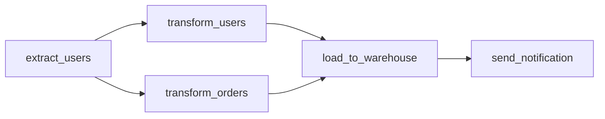
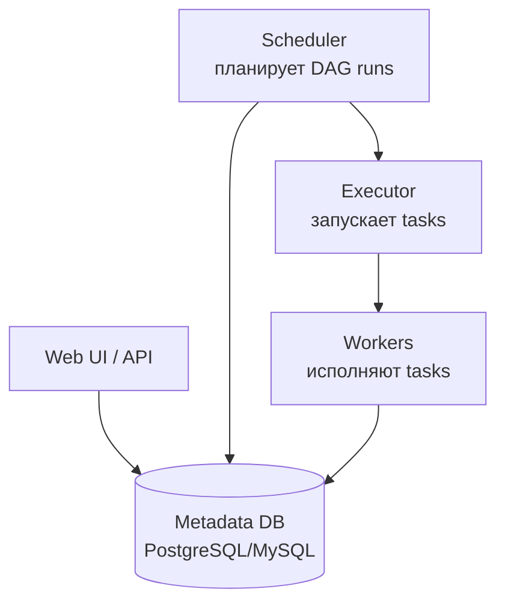
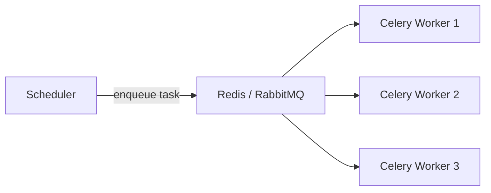

# Вопросы на собеседовании: `Apache Airflow`

`Apache Airflow` — самый популярный оркестратор workflow в data engineering. Создан в **Airbnb** (2014), Apache top-level с 2019. Workflow описываются как **DAG на Python**. Применяется для ETL, ML-пайплайнов и регулярных задач. Альтернативы: Prefect, Dagster, Argo Workflows, Luigi.

## Полезные ссылки

### Официальная документация и авторитетные источники

- [Apache Airflow Documentation](https://airflow.apache.org/docs/)
- [Astronomer Airflow Guides](https://www.astronomer.io/guides/)
- [Airflow vs Prefect vs Dagster](https://www.prefect.io/blog/airflow-vs-prefect-vs-dagster)
- [Best Practices for Apache Airflow](https://airflow.apache.org/docs/apache-airflow/stable/best-practices.html)

## Содержание

- [Полезные ссылки](#полезные-ссылки)
- [See also](#see-also)

**Базовые понятия**
- [Q1. (!) Что такое Apache Airflow?](#q1--что-такое-apache-airflow)
- [Q2. (!) Что такое DAG?](#q2--что-такое-dag)
- [Q3. Архитектура Airflow — компоненты?](#q3-архитектура-airflow--компоненты)
- [Q4. Зачем metadata DB?](#q4-зачем-metadata-db)

**DAG и tasks**
- [Q5. (!) Как написать простейший DAG?](#q5--как-написать-простейший-dag)
- [Q6. (!) Что такое operator?](#q6--что-такое-operator)
- [Q7. (!) Самые частые operators?](#q7--самые-частые-operators)
- [Q8. Что такое TaskFlow API (Airflow 2.0+)?](#q8-что-такое-taskflow-api-airflow-20)
- [Q9. (!) Зависимости между tasks?](#q9--зависимости-между-tasks)
- [Q10. Как генерировать задачи динамически?](#q10-как-генерировать-задачи-динамически)

**Scheduling**
- [Q11. (!) Как работает scheduling в Airflow?](#q11--как-работает-scheduling-в-airflow)
- [Q12. (!) Что задают schedule_interval, start_date и catchup?](#q12--что-задают-schedule_interval-start_date-и-catchup)
- [Q13. Что такое backfill?](#q13-что-такое-backfill)
- [Q14. (!) Чем execution_date отличается от logical_date?](#q14--чем-execution_date-отличается-от-logical_date)

**Executors**
- [Q15. (!) Какие executors бывают?](#q15--какие-executors-бывают)
- [Q16. Чем SequentialExecutor отличается от LocalExecutor?](#q16-чем-sequentialexecutor-отличается-от-localexecutor)
- [Q17. (!) CeleryExecutor — как работает?](#q17--celeryexecutor--как-работает)
- [Q18. (!) KubernetesExecutor — почему его рекомендуют?](#q18--kubernetesexecutor--почему-его-рекомендуют)

**Состояние и связь между tasks**
- [Q19. (!) XCom — что это?](#q19--xcom--что-это)
- [Q20. Что такое Connections и Variables?](#q20-что-такое-connections-и-variables)
- [Q21. Чем hook отличается от operator?](#q21-чем-hook-отличается-от-operator)

**Sensors**
- [Q22. (!) Что такое sensor?](#q22--что-такое-sensor)
- [Q23. Зачем reschedule mode для долгих sensor'ов?](#q23-зачем-reschedule-mode-для-долгих-sensorов)

**Production**
- [Q24. (!) Как развернуть Airflow в production?](#q24--как-развернуть-airflow-в-production)
- [Q25. (!) Сколько DAG'ов и tasks потянет Airflow?](#q25--сколько-dagов-и-tasks-потянет-airflow)
- [Q26. Какие best practices для production-DAG?](#q26-какие-best-practices-для-production-dag)

**Альтернативы и сравнения**
- [Q27. (!) Чем Airflow отличается от Prefect и Dagster?](#q27--чем-airflow-отличается-от-prefect-и-dagster)
- [Q28. Какие минусы у Airflow?](#q28-какие-минусы-у-airflow)

## Q1. (!) Что такое Apache Airflow?

`Apache Airflow` — это **платформа оркестрации workflow**: она запускает задачи по расписанию, в правильном порядке, следит за их зависимостями и перезапускает упавшие. Сам код задач Airflow не выполняет — он дирижирует тем, *когда* и *в каком порядке* их запускать. Workflow описываются как **DAG (направленный ациклический граф)** обычным Python-кодом, поэтому пайплайн — это версионируемая программа, а не конфиг в UI.

Ключевая идея: Airflow отвечает на вопрос «что за чем и когда», а саму обработку данных делают внешние системы (Spark, БД, скрипты), которые он дёргает.

**Где применяют:**
- **ETL/ELT-пайплайны** — извлечь данные, преобразовать, загрузить в хранилище
- **Оркестрация data-задач** — последовательно запускать Spark/Flink-джобы
- **ML-пайплайны** — обучение → оценка → деплой модели
- **Регулярные операции** — бэкапы, отчёты, очистка данных по расписанию

**Где не подходит** (и почему):
- **Потоковая обработка в реальном времени** — Airflow планирует *батчи* по расписанию, у него нет модели непрерывного потока событий (бери Kafka Streams, Flink)
- **Долгоживущие интерактивные workflow** — модель «запустил задачу → дождался завершения» плохо ложится на сценарии с ожиданием ввода пользователя
- **Оркестрация внутри одной Spark-джобы** — управление стадиями внутри Spark — работа Spark scheduler, Airflow живёт уровнем выше

## Q2. (!) Что такое DAG?

**DAG (Directed Acyclic Graph)** — это сам пайплайн: граф из **tasks**, связанных **направленными** рёбрами и **без циклов**. В Airflow один DAG = один Python-файл, который описывает задачи и порядок их выполнения.



Почему именно такая структура:

- **Directed (направленный)** — стрелка `A → B` означает «B не стартует, пока не завершится A». Так задаётся порядок и зависимости.
- **Acyclic (без циклов)** — если бы граф зацикливался (`A → B → A`), порядок выполнения определить было бы невозможно: каждая задача ждала бы саму себя. Запрет циклов — это гарантия, что у пайплайна есть начало и конец.

**Важное требование на практике:** DAG должен быть **идемпотентным** — повторный запуск за тот же период должен давать тот же результат, не создавая дублей. Это нужно, потому что Airflow перезапускает упавшие задачи и backfill-ит исторические периоды; без идемпотентности перезапуск ломает данные.

## Q3. Архитектура Airflow — компоненты?



Как компоненты работают вместе: Scheduler решает *что и когда* запустить, передаёт это Executor'у (выбранная *стратегия* запуска), Executor поднимает Workers, которые делают саму работу, а Metadata DB хранит общее состояние, через которое все компоненты синхронизируются.

- **Scheduler** — мозг системы: читает DAG-файлы, по расписанию создаёт DAG runs и отправляет готовые к запуску tasks Executor'у
- **Executor** — стратегия запуска tasks (Sequential, Local, Celery, K8s); определяет, *где и как* физически выполняются задачи
- **Workers** — процессы, которые фактически выполняют код tasks
- **Web UI** — мониторинг статусов, просмотр логов, ручной запуск и перезапуск
- **Metadata DB** — единый источник правды: состояние DAG-запусков и tasks, connections, variables, XCom. Через неё компоненты не общаются напрямую, а читают/пишут общее состояние

## Q4. Зачем metadata DB?

Metadata DB — это **общая память Airflow**: в ней хранится всё состояние, через которое Scheduler, Executor, Workers и Web UI согласуют свою работу. Без неё компоненты не знали бы, какие задачи уже выполнены, а какие ждут запуска.

Что именно хранится:

- **Состояние DAG runs и task instances** — `running`, `success`, `failed`, `up_for_retry` и т.д. (главное содержимое)
- **Connections** — учётные данные к внешним системам (БД, API), в зашифрованном виде
- **Variables** — значения конфигурации
- **XComs** — небольшие данные, передаваемые между tasks
- **Конфигурации пулов** — лимиты параллелизма для общих ресурсов
- **Логи** — обычно хранятся *отдельно* (S3/файлы), в БД только ссылки и метаданные

В production — **PostgreSQL** (рекомендуется) или MySQL: они держат конкурентные запросы от Scheduler и воркеров. **SQLite** — только для локальной разработки, так как не поддерживает параллельный доступ и работает лишь с SequentialExecutor.

## Q5. (!) Как написать простейший DAG?

```python
from airflow import DAG
from airflow.operators.bash import BashOperator
from airflow.operators.python import PythonOperator
from datetime import datetime, timedelta

default_args = {
    'owner': 'airflow',
    'depends_on_past': False,
    'email_on_failure': True,
    'retries': 2,
    'retry_delay': timedelta(minutes=5),
}

with DAG(
    dag_id='my_etl_pipeline',
    default_args=default_args,
    description='Daily ETL',
    schedule_interval='@daily',
    start_date=datetime(2025, 1, 1),
    catchup=False,
    tags=['etl'],
) as dag:

    def extract_data():
        return "data"

    extract = PythonOperator(
        task_id='extract',
        python_callable=extract_data,
    )

    transform = BashOperator(
        task_id='transform',
        bash_command='python /opt/scripts/transform.py',
    )

    load = BashOperator(
        task_id='load',
        bash_command='psql -f /opt/scripts/load.sql',
    )

    extract >> transform >> load
```

Разбор ключевых частей:

- **`with DAG(...) as dag:`** — объявляет сам пайплайн и его расписание. Все task'и внутри блока автоматически привязываются к этому DAG.
- **`default_args`** — общие настройки для всех task'ов (владелец, число retries, задержка между ними), чтобы не дублировать их в каждом операторе.
- **`schedule_interval='@daily'` + `catchup=False`** — запускать раз в сутки и не доганивать пропущенные исторические запуски.
- **`extract >> transform >> load`** — задаёт зависимости: задачи выполнятся строго в этом порядке.

DAG-файл должен лежать в директории, которую сканирует Scheduler (по умолчанию `dags/`) — иначе Airflow его просто не увидит.

## Q6. (!) Что такое operator?

`Operator` — это **шаблон одной операции**: готовый класс, который описывает, *что делает* задача (выполнить bash-команду, вызвать Python-функцию, отправить письмо). Ты не пишешь логику запуска с нуля — берёшь подходящий оператор и параметризуешь его. Один экземпляр оператора = один task в DAG.

```python
PythonOperator(task_id='my_task', python_callable=func)
BashOperator(task_id='my_task', bash_command='ls')
EmptyOperator(task_id='dummy')
```

Важно различать два понятия: **operator** — это описание (определение в коде DAG), а при каждом запуске за конкретный период он порождает **task instance** — реальное выполнение этой задачи. Один оператор → много task instances (по одному на каждый run).

**Три категории операторов** (по тому, что они делают):
- **Action** — выполняют действие (`BashOperator`, `PythonOperator`, `EmailOperator`)
- **Transfer** — перекладывают данные из одной системы в другую (`S3ToGCSOperator`, `MySqlToHiveOperator`)
- **Sensor** — особый вид: ждут наступления условия, прежде чем пропустить пайплайн дальше (`FileSensor`, `ExternalTaskSensor`)

## Q7. (!) Самые частые operators?

| Operator | Назначение |
|----------|------------|
| `PythonOperator` | Вызвать Python функцию |
| `BashOperator` | Выполнить bash команду |
| `SqlOperator` (DB-specific) | SQL query |
| `KubernetesPodOperator` | Запустить под в K8s |
| `SparkSubmitOperator` | Запустить Spark job |
| `S3ToGCSOperator` | S3 → Google Cloud Storage |
| `EmailOperator` | Отправить email |
| `HttpOperator` | HTTP request |
| `BranchPythonOperator` | Условное ветвление |
| `EmptyOperator` (dummy) | Группировка/маркер |
| `TriggerDagRunOperator` | Запустить другой DAG |
| `ExternalTaskSensor` | Дождаться task в другом DAG |

Ядро Airflow содержит лишь базовые операторы (Python, Bash, Email, ветвление). Интеграции с внешними системами вынесены в **provider-пакеты** (`apache-airflow-providers-*`) — отдельно ставишь пакет для Snowflake, BigQuery, Redshift и т.д. и получаешь его операторы и hooks. Так ядро остаётся лёгким, а ставится только то, что нужно проекту.

## Q8. Что такое TaskFlow API (Airflow 2.0+)?

**TaskFlow API** — это современный способ писать DAG через декораторы `@dag` и `@task`, при котором пайплайн выглядит как обычный Python-код: функция вызывает функцию, а зависимости и передача данных выводятся автоматически.

```python
from airflow.decorators import dag, task
from datetime import datetime

@dag(schedule_interval='@daily', start_date=datetime(2025, 1, 1), catchup=False)
def my_pipeline():

    @task
    def extract():
        return {"users": [1, 2, 3]}

    @task
    def transform(data):
        return [u * 2 for u in data["users"]]

    @task
    def load(data):
        print(f"Loading: {data}")

    data = extract()
    transformed = transform(data)
    load(transformed)

my_pipeline()
```

**Чем лучше классического стиля:**
- **Читается как обычный код** — `transform(extract())` вместо явных операторов и `>>`
- **XCom прозрачен** — возвращаемое значение функции автоматически уходит в XCom, а аргумент следующей функции автоматически его подтягивает; не нужно вручную вызывать `xcom_push`/`xcom_pull`
- **Зависимости выводятся сами** — раз `transform` принимает результат `extract`, Airflow понимает, что `extract` должен отработать первым; явные стрелки не нужны
- **Меньше boilerplate** — нет ручного создания операторов под каждую функцию

**Рекомендация:** в новых проектах TaskFlow API предпочтительнее классических операторов; их по-прежнему используют там, где нужен готовый оператор-интеграция (KubernetesPod, SparkSubmit и т.п.).

## Q9. (!) Зависимости между tasks?

```python
# Через bitshift operators (классический)
extract >> transform >> load

# Несколько tasks
extract >> [transform_a, transform_b] >> load

# Эквивалентно
transform.set_upstream(extract)
load.set_downstream(notify)

# В TaskFlow API — через вызовы
data = extract()
result = transform(data)  # неявная зависимость
load(result)
```

Зависимости — это рёбра графа: они говорят Airflow, что одна задача должна завершиться раньше другой. Способы задать их эквивалентны, выбирай по читаемости:

- **Bitshift-операторы `>>` / `<<`** — основной идиоматичный способ. `a >> b` читается «a, затем b» (`a << b` — то же наоборот). Список `[t1, t2]` означает параллельные ветки.
- **`set_upstream` / `set_downstream`** — те же связи методами, многословнее.
- **TaskFlow** — зависимость возникает *неявно* из передачи результата: раз `transform(data)` использует выход `extract()`, порядок выводится сам.

## Q10. Как генерировать задачи динамически?

Иногда число task'ов заранее неизвестно — например, нужно обработать по задаче на каждый файл, а их количество выясняется только в рантайме. Есть два подхода: цикл при парсинге DAG (число задач фиксируется на момент сканирования файла) и Dynamic Task Mapping (число задач определяется во время выполнения).

```python
# Статически
for i in range(10):
    task = PythonOperator(
        task_id=f'task_{i}',
        python_callable=process,
        op_args=[i],
    )

# Dynamic Task Mapping (Airflow 2.3+)
@task
def process_item(item):
    return item * 2

@task
def get_items():
    return [1, 2, 3, 4, 5]

@dag(...)
def my_dag():
    items = get_items()
    process_item.expand(item=items)  # создаст N tasks динамически
```

**Разница между подходами:**
- **Цикл `for` при парсинге** — Scheduler фиксирует число задач в момент чтения DAG-файла. Подходит, когда количество известно на этапе парсинга (например, фиксированный список регионов).
- **Dynamic Task Mapping** (`.expand()`, Airflow 2.3+) — задачи разворачиваются *во время выполнения* из значения, которое вернула предыдущая task. Подходит, когда **число задач неизвестно** до рантайма (например, столько задач, сколько файлов нашлось).

## Q11. (!) Как работает scheduling в Airflow?

Scheduler крутится в бесконечном цикле и на каждой итерации решает, что пора запустить:

1. **Сканирует DAG-файлы** — периодически перечитывает папку `dags/`, чтобы знать актуальные пайплайны и их расписания
2. **Считает next run** — для каждого DAG по `schedule_interval` определяет, когда должен быть следующий запуск
3. **Создаёт DAG run** — когда время интервала наступило, заводит запуск со статусом `running`
4. **Раздаёт готовые tasks** — отправляет Executor'у те задачи, у которых уже выполнены все upstream-зависимости (остальные ждут своей очереди)
5. **Закрывает run** — когда все tasks завершились, помечает DAG run как `success` или `failed`

Ключевой момент: Scheduler **сам не выполняет** код задач — он только *решает, что и когда* запустить, и передаёт это Executor'у. Поэтому он остаётся лёгким даже при большой нагрузке.

## Q12. (!) Что задают schedule_interval, start_date и catchup?

```python
DAG(
    schedule_interval='0 2 * * *',     # cron — каждый день в 2:00
    schedule_interval='@daily',         # preset
    schedule_interval=timedelta(hours=6), # каждые 6 часов
    start_date=datetime(2025, 1, 1),
    catchup=False,
)
```

Эти три параметра вместе определяют, *когда* и *за какие периоды* пойдут запуски:

- **`schedule_interval`** — как часто запускать. Задаётся cron-строкой, пресетом (`@daily`, `@hourly`) или `timedelta`.
- **`start_date`** — с какой даты DAG считается «активным»; от неё отсчитываются интервалы.
- **`catchup`** — что делать с периодами, которые уже прошли к моменту включения DAG. При `catchup=True` Airflow выполнит **все пропущенные** запуски от `start_date` до текущего момента (доганивает историю); при `catchup=False` — только **последний** пропущенный.

**Подводный камень:** DAG запускается **в конце интервала**, а не в его начале. Daily-DAG со `start_date` `2025-01-01` физически стартует **2 января** — он обрабатывает данные *за уже завершившийся* день 1 января. Логика проста: чтобы обработать сутки, они должны сначала закончиться.

## Q13. Что такое backfill?

`Backfill` — это запуск DAG за **прошедшие периоды**: ты вручную просишь Airflow выполнить пайплайн для диапазона исторических дат, как будто он работал тогда.

```bash
airflow dags backfill -s 2025-01-01 -e 2025-01-31 my_dag
```

Команда создаёт по одному DAG run на каждую дату диапазона. Типичные сценарии: добавили новый DAG и нужно посчитать его за всю прошлую историю; поменяли логику обработки и хотите пересчитать старые данные с новым кодом. Именно здесь критична **идемпотентность** (см. Q2): backfill переписывает уже существующие периоды, и без неё появятся дубли.

## Q14. (!) Чем execution_date отличается от logical_date?

Это **одно и то же понятие под двумя именами** — историческое переименование, источник вечной путаницы. Оба обозначают **начало обрабатываемого интервала**, а не момент, когда задача реально запустилась.

- В старых версиях параметр назывался `execution_date`. Имя сбивало с толку: люди читали его как «дата выполнения» (когда запустилось), хотя на деле это «за какой период обрабатываем».
- С Airflow 2.2+ его переименовали в `logical_date` — «логическая дата процессинга», чтобы подчеркнуть смысл «за какой период», а не «когда запущено». `execution_date` оставлен как deprecated-алиас.

```python
@task
def my_task(**context):
    logical_date = context['logical_date']  # новое имя
    execution_date = context['execution_date']  # старое имя (deprecated)
```

**Подвох (та же история, что в Q12):** для daily-DAG `logical_date = 2025-01-01` означает «обрабатываем данные за 1 января», но сам run произошёл 2 января — после того, как сутки завершились. Поэтому в коде задачи берут именно `logical_date` для фильтрации данных по периоду, а не реальное «сейчас».

## Q15. (!) Какие executors бывают?

Executor — это стратегия, *где и как* физически запускаются tasks. Выбор executor'а — главное архитектурное решение при деплое: от него зависит масштабируемость и изоляция задач. Линейка идёт от «всё на одной машине, по очереди» до «каждая задача — отдельный pod в кластере».

| Executor | Как запускает tasks | Когда использовать |
|----------|----------|----------|
| **SequentialExecutor** | Один task за раз, без параллелизма | Только локальная отладка (с SQLite) |
| **LocalExecutor** | Параллельно процессами на одной машине | Небольшие инсталляции |
| **CeleryExecutor** | Распределённо: воркеры забирают tasks из брокера (Redis/RabbitMQ) | Средний и крупный масштаб |
| **KubernetesExecutor** | Каждый task — отдельный pod в K8s | Cloud-native деплои |
| **CeleryKubernetesExecutor** | Гибрид Celery + K8s | Смешанные нагрузки |
| **DaskExecutor** | На Dask-кластере (deprecated) | — |

## Q16. Чем SequentialExecutor отличается от LocalExecutor?

Оба запускают tasks локально (на той же машине, что и Scheduler), но различаются параллелизмом:

**SequentialExecutor** — выполняет строго **один task за раз**. Это единственный executor, совместимый с **SQLite** (которая не умеет конкурентный доступ), поэтому он дефолтный «из коробки», но годится только для dev/отладки. В production не используется.

**LocalExecutor** — запускает tasks **параллельно** через `multiprocessing` на одной машине; требует «настоящую» БД (PostgreSQL/MySQL).

```python
# airflow.cfg
executor = LocalExecutor
sql_alchemy_conn = postgresql+psycopg2://...
```

LocalExecutor хорош для **небольших инсталляций** (~100 DAG'ов). Его принципиальное ограничение: он привязан к одной машине и **горизонтально не масштабируется** — упёрся в CPU/память сервера, и дальше расти некуда. Когда нагрузка перерастает одну машину, переходят на Celery- или Kubernetes-executor.

## Q17. (!) CeleryExecutor — как работает?

`CeleryExecutor` распределяет tasks по **нескольким машинам** через очередь: Scheduler кладёт задачи в **брокер сообщений** (RabbitMQ или Redis), а отдельные **Celery-воркеры** разбирают их оттуда. Это снимает ограничение «одна машина» у LocalExecutor.



**Workers** — отдельные долгоживущие процессы (часто на разных машинах), которые забирают tasks из брокера и выполняют. Запускаются командой:

```bash
airflow celery worker
```

**Масштабирование** — линейное и простое: нужно больше пропускной способности — добавляешь воркеров.

**Минусы (плата за распределённость):**
- **Сложнее в эксплуатации** — появляется ещё один компонент (брокер), который нужно поднимать, мониторить и держать живым
- **Воркеры долгоживущие** — раз процесс работает постоянно, обновить на нём библиотеки/зависимости тяжелее: нужно пересоздавать воркеры (в отличие от Kubernetes-executor, где окружение задаётся образом пода)

## Q18. (!) KubernetesExecutor — почему его рекомендуют?

`KubernetesExecutor` запускает **каждый task** как **отдельный pod** в Kubernetes — под создаётся под задачу и уничтожается после её завершения. Из этой модели «один pod на task» вытекают все его плюсы и минусы.

**Преимущества:**
- **Полная изоляция между tasks** — у каждого пода свой образ, свои зависимости и лимиты CPU/памяти. Задачи не конфликтуют за библиотеки и не «отъедают» ресурсы друг у друга (в отличие от общих Celery-воркеров)
- **Автомасштабирование** — кластер K8s сам поднимает ноды под пики нагрузки и убирает их в простое
- **Нет постоянных воркеров** — поды живут только во время выполнения задачи, поэтому платишь ровно за используемые ресурсы, а не за простаивающий пул
- **Cloud-native деплой** — естественно ложится на инфраструктуру в облаке

**Недостатки** (обратная сторона создания пода под каждую задачу):
- **Накладные расходы на старт пода** — поднять под занимает ~5–30 секунд
- **Невыгоден для очень коротких tasks** — если задача работает 2 секунды, а запуск пода — 20, оверхед превышает полезную работу (для таких сценариев берут Celery или гибрид)

**Итог:** для облачных production-деплоев это рекомендуемый выбор — изоляция и эластичность перевешивают оверхед старта пода.

## Q19. (!) XCom — что это?

**XCom (cross-communication)** — встроенный механизм передачи **небольших данных от одной task к другой** внутри DAG. Нужен потому, что задачи выполняются изолированно (часто в разных процессах или подах) и не могут просто передать друг другу переменную в памяти — XCom прокладывает между ними канал через metadata DB.

```python
@task
def push():
    return {"key": "value"}  # автоматически push в XCom

@task
def pull(data):  # автоматически pull
    print(data)

push() >> pull()

# Или explicitly
def push_xcom(**context):
    context['ti'].xcom_push(key='my_key', value='my_value')

def pull_xcom(**context):
    value = context['ti'].xcom_pull(key='my_key', task_ids='push')
```

**Подвох:** XCom хранятся в **metadata DB**, поэтому передавать через них большие данные нельзя — это раздует БД и убьёт её производительность. XCom — только для **мета-информации**: путей к файлам, ID, статусов, небольших словарей.

**Рекомендация:** большие данные пиши в S3/HDFS, а через XCom передавай лишь **путь** к ним. Так задачи обмениваются «адресом» данных, а не самими данными.

## Q20. Что такое Connections и Variables?

Это два механизма вынести параметры **из кода DAG в конфигурацию**, чтобы не хардкодить их. Разница в назначении: Connections — про *как подключиться к внешней системе*, Variables — про *произвольные настройки*.

**Connections** — учётные данные и адреса внешних систем (хост, порт, логин, пароль). Hooks и операторы обращаются к ним по `conn_id`:

```python
from airflow.hooks.postgres_hook import PostgresHook
hook = PostgresHook(postgres_conn_id='my_postgres')
df = hook.get_pandas_df("SELECT * FROM users")
```

Создаются через UI или CLI, хранятся в metadata DB **в зашифрованном виде** — поэтому пароли не лежат в коде DAG.

**Variables** — произвольные значения конфигурации (ключи API, флаги, пути), доступные из любого DAG:

```python
from airflow.models import Variable
api_key = Variable.get("my_api_key")
config = Variable.get("config", deserialize_json=True)
```

**Рекомендация:** не хранить секреты в Variables — они менее защищены, чем Connections, и видны в UI. Для секретов используй **Secrets Backends** (Vault, AWS Secrets Manager), откуда Airflow подтягивает их на лету.

## Q21. Чем hook отличается от operator?

Это два слоя одной интеграции. **Hook** — низкоуровневая обёртка над внешней системой (БД, API, S3): он умеет подключаться (берёт креды из Connection) и выполнять отдельные операции. **Operator** — высокоуровневый task поверх hook: он оборачивает работу с системой в готовую задачу DAG. По сути оператор внутри использует hook, добавляя к нему интеграцию со scheduling, retries и контекстом Airflow.

```python
# Hook
hook = PostgresHook(postgres_conn_id='my_postgres')
records = hook.get_records("SELECT * FROM users")

# Operator (использует Hook)
task = PostgresOperator(
    task_id='insert',
    postgres_conn_id='my_postgres',
    sql='INSERT INTO users (name) VALUES (\'Alice\');',
)
```

**Когда что:** оператор — когда задача — это «выполни SQL/перенеси файл» и под неё есть готовый оператор (декларативно, минимум кода). Hook — когда внутри `PythonOperator`/`@task` нужна гибкая кастомная логика с обращениями к внешней системе.

## Q22. (!) Что такое sensor?

**Sensor** — это специальный task, который **блокирует пайплайн, пока не выполнится условие**: периодически проверяет «готово ли?» (появился ли файл, обновилась ли таблица, отработала ли задача в другом DAG) и пропускает дальше только когда условие истинно. Так пайплайн дожидается внешних событий, прежде чем продолжить.

```python
from airflow.sensors.filesystem import FileSensor

wait_for_file = FileSensor(
    task_id='wait_file',
    filepath='/data/input.csv',
    poke_interval=60,    # проверять каждую минуту
    timeout=3600,         # максимум 1 час
)
```

**Частые сенсоры:**
- `FileSensor`, `S3KeySensor` — ждут появления файла
- `ExternalTaskSensor` — ждёт task в другом DAG
- `SqlSensor` — ждёт выполнения SQL-условия
- `HttpSensor` — ждёт HTTP-ответ

## Q23. Зачем reschedule mode для долгих sensor'ов?

Проблема: по умолчанию сенсор в режиме `poke` **держит worker-слот занятым всё время ожидания**, даже когда просто спит между проверками. Если ждать нужно часами, такие сенсоры выедают все слоты — настоящим задачам выполняться негде. Режим `reschedule` решает это, освобождая слот между проверками.

```python
sensor = FileSensor(
    task_id='wait',
    mode='reschedule',  # вместо 'poke' (default)
    poke_interval=300,
)
```

| Режим | Поведение | Цена |
|------|-----------|------|
| `poke` (default) | Слот воркера занят всё ожидание | Реакция мгновенная, но слот простаивает |
| `reschedule` | Между проверками слот освобождается, задача «засыпает» до следующего poke | Слот свободен, но небольшой оверхед на перепланирование |

**Рекомендация:** для долгих ожиданий (часы/дни) — всегда `reschedule`, иначе сенсоры заблокируют воркеры. Для коротких проверок (секунды) подойдёт и `poke`.

## Q24. (!) Как развернуть Airflow в production?

Главный выбор — **управляемый сервис против self-hosted**: managed снимает с команды эксплуатацию (обновления, БД, масштабирование) ценой денег и меньшей гибкости; self-hosted даёт полный контроль, но всю операционку держишь сам.

**Управляемые варианты** (меньше эксплуатации):
1. **Astronomer** — самый популярный SaaS поверх Airflow, кросс-облачный
2. **MWAA** — Amazon Managed Workflows for Apache Airflow (внутри AWS)
3. **Cloud Composer** — управляемый Airflow от Google (внутри GCP)

**Self-hosted** (полный контроль):
4. На своём кластере K8s через [официальный Helm-chart](https://airflow.apache.org/docs/helm-chart/stable/)

**Рекомендуемая production-архитектура** (и зачем каждый кусок):
- **KubernetesExecutor** — эластичность и изоляция задач (см. Q18)
- **PostgreSQL для metadata** — выдерживает конкурентную нагрузку от Scheduler и воркеров
- **S3/GCS для логов** — поды эфемерны, локально логи не сохранить, нужно внешнее хранилище
- **Secrets backend** (Vault, AWS Secrets Manager) — секреты вне metadata DB
- **Sentry / DataDog** — мониторинг падений задач и алертинг

```bash
helm install airflow apache-airflow/airflow
```

## Q25. (!) Сколько DAG'ов и tasks потянет Airflow?

Жёсткого предела нет — масштаб упирается в выбранный executor и в три узких места ниже. Ориентиры по executor'у:

- **LocalExecutor:** 50–200 DAG'ов, ~100 параллельных tasks (одна машина)
- **CeleryExecutor:** 1000+ DAG'ов, тысячи параллельных tasks (горизонтальное масштабирование воркеров)
- **KubernetesExecutor:** ограничено только ресурсами кластера K8s

**Где обычно упирается** (и почему):
1. **Scheduler** — при тысячах DAG'ов он медленно перечитывает и парсит все файлы, и интервал между сканированиями растёт; запуски начинают опаздывать
2. **Metadata DB** — все компоненты бьют в неё запросами; без индексов и регулярного vacuum она становится бутылочным горлышком
3. **Сеть** — для распределённых executor'ов трафик между Scheduler, брокером и воркерами

**Решение на больших масштабах:** DAG'и **шардируют по нескольким инстансам Airflow** — каждый инстанс со своим Scheduler и БД обслуживает часть пайплайнов, снимая нагрузку с единого Scheduler.

## Q26. Какие best practices для production-DAG?

Большинство правил сводятся к одному принципу: DAG должен **переживать перезапуск без вреда**, потому что Airflow по своей природе перезапускает задачи (retries, backfill, ручной rerun).

1. **Идемпотентность** — повторный запуск за тот же период даёт тот же результат без дублей; основа всего остального
2. **Атомарность** — task делает ровно одну вещь, чтобы при падении перезапустить только её, а не весь пайплайн
3. **Не импортируй тяжёлые библиотеки на верхнем уровне DAG** — Scheduler парсит файл при каждом сканировании, и тяжёлые импорты замедляют весь scheduling
4. **Конфигурацию — в Variables/Connections**, а не в код, чтобы менять значения без правки и редеплоя DAG
5. **Pools** — ограничивают параллелизм к общему ресурсу (БД, внешний API), чтобы пайплайн не положил его всплеском запросов
6. **Tags** — для навигации и фильтрации в UI (`tags=['etl', 'critical']`)
7. **Retries** — задавать в `default_args`, чтобы временный сбой (сеть, таймаут) не валил весь run
8. **SLA** — алерт, если task не уложился в срок (раннее обнаружение проблем)
9. **Тестируй DAG'и** — `pytest` ловит ошибки парсинга и битые зависимости до деплоя
10. **CI/CD** — деплой DAG'ов через git: версионирование, ревью, откат

## Q27. (!) Чем Airflow отличается от Prefect и Dagster?

| Критерий | Airflow | Prefect | Dagster |
|----------|---------|---------|---------|
| Возраст | 2014 | 2018 | 2018 |
| Статус | Apache top-level | Open-source | Open-source |
| Описание workflow | DAG в Python | Tasks + Flows | Assets |
| Система типов | Нет | Есть | Сильная (PEP 484) |
| Локальная разработка | Сложная | Простая | Простая |
| UI | Хороший | Современный | Современный |
| Распространённость | Доминирует | Растёт | Растёт |

Главное различие — в **модели описания пайплайна**: Airflow мыслит задачами в DAG (императивно: «выполни шаги в таком порядке»), Dagster — *ассетами* (декларативно: «какие данные должны существовать»), Prefect — гибкими flow с акцентом на удобство разработки и динамику.

**Итог:**
- **Airflow** — стандарт де-факто, огромное сообщество и экосистема провайдеров, но тяжелее в локальной разработке
- **Prefect / Dagster** — моложе и удобнее локально (проще писать и тестировать), но меньше экосистема

**Эмпирическое правило:** для нового проекта Prefect/Dagster часто берут ради скорости разработки; в enterprise по-прежнему доминирует Airflow — из-за зрелости, поддержки и широкой совместимости.

## Q28. Какие минусы у Airflow?

Большинство недостатков — следствие его тяжеловесной батч-архитектуры: мощно для крупных регулярных пайплайнов, но громоздко для всего остального.

1. **Медленная локальная разработка** — чтобы протестировать DAG, нужно поднять весь Airflow (БД, scheduler, executor); цикл правка→проверка долгий
2. **Тяжёлый для мелких задач** — ради простого скрипта приходится держать metadata DB, scheduler, executor и web UI
3. **Связанность кода с Airflow API** — задачи завязаны на контекст Airflow (`context`, XCom), поэтому их трудно покрыть обычными unit-тестами в изоляции
4. **Лимит XCom** — не годится для передачи больших данных между задачами (см. Q19)
5. **Оверхед парсинга DAG** — Scheduler перечитывает все файлы, и при сотнях DAG'ов scheduling замедляется (см. Q25)
6. **Масштабирование сенсоров** — `poke`-режим занимает воркеры на всё ожидание (см. Q23)
7. **Только batch** — нет модели потоковой обработки в реальном времени
8. **`execution_date` vs `logical_date`** — историческая двойственность имени стабильно путает (см. Q14)
9. **Болезненные обновления** — мажорные версии меняют API и могут ломать существующие DAG'и

**Итог:** именно из-за этих минусов (особенно неудобной разработки) для новых проектов часто выбирают Prefect или Dagster; Airflow при этом остаётся стандартом в enterprise.

---

## See also

- [Apache Spark](apache-spark-interview.md) — Airflow часто оркестрирует Spark jobs
- [Apache Flink](apache-flink-interview.md) — vs Airflow (streaming vs batch)
- [Kafka Streams](kafka-streams-interview.md) — другой стиль (event-driven)
- [dbt](dbt-interview.md) — часто оркестрируется через Airflow
- [Stream Processing](stream-processing-interview.md) — Airflow для batch, не streaming
- [Data Warehousing](data-warehousing-interview.md) — main use case Airflow
- [Data Lake / Lakehouse](data-lake-lakehouse-interview.md) — pipelines в lake/warehouse
- [Kubernetes](../devops/kubernetes-interview.md) — KubernetesExecutor
- [Микросервисы](../architecture/microservices-interview.md) — Airflow vs scheduled jobs
- [PostgreSQL](../databases/postgresql-interview.md) — metadata DB
- [Docker](../devops/docker-interview.md) — деплой Airflow
- [[python-interview|Python]] — DAG = Python код (когда добавим)
