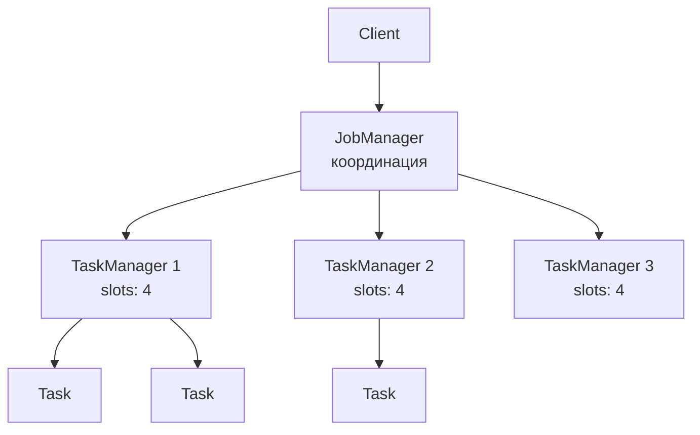
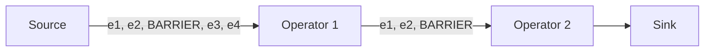
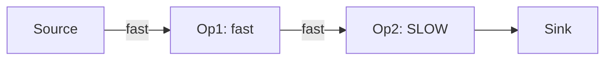

# Вопросы на собеседовании: `Apache Flink`

`Apache Flink` — distributed stream processing framework с **true streaming** архитектурой (не micro-batch как Spark). Создан в Berlin (TU Berlin), Apache top-level с 2014. Главные применения: **low-latency streaming** (миллисекунды), **stateful processing**, exactly-once гарантии, **CEP (complex event processing)**.

## Полезные ссылки

### Официальная документация и авторитетные источники

- [Apache Flink Documentation](https://nightlies.apache.org/flink/flink-docs-stable/)
- [Flink Streaming Guide](https://nightlies.apache.org/flink/flink-docs-stable/docs/dev/datastream/overview/)
- [Flink State and Fault Tolerance](https://nightlies.apache.org/flink/flink-docs-stable/docs/concepts/stateful-stream-processing/)
- [Flink vs Spark — Baeldung](https://www.baeldung.com/apache-spark-vs-apache-flink)
- [Stream Processing with Apache Flink (book)](https://www.oreilly.com/library/view/stream-processing-with/9781491974285/)

## Содержание

- [Полезные ссылки](#полезные-ссылки)
- [See also](#see-also)

**Базовые понятия**
- [Q1. (!) Что такое Apache Flink?](#q1--что-такое-apache-flink)
- [Q2. (!) Чем Flink отличается от Spark Streaming?](#q2--чем-flink-отличается-от-spark-streaming)
- [Q3. (!) Архитектура Flink — JobManager, TaskManager?](#q3--архитектура-flink--jobmanager-taskmanager)
- [Q4. Deployment режимы (Standalone, YARN, K8s)?](#q4-deployment-режимы-standalone-yarn-k8s)

**Streaming основы**
- [Q5. (!) DataStream API — основные операции?](#q5--datastream-api--основные-операции)
- [Q6. (!) KeyedStream — что это?](#q6--keyedstream--что-это)
- [Q7. Sources и Sinks?](#q7-sources-и-sinks)

**Time semantics**
- [Q8. (!) Event time vs Processing time vs Ingestion time?](#q8--event-time-vs-processing-time-vs-ingestion-time)
- [Q9. (!) Watermarks — как работают?](#q9--watermarks--как-работают)
- [Q10. (!) Late data — стратегии?](#q10--late-data--стратегии)

**Windows**
- [Q11. (!) Tumbling windows?](#q11--tumbling-windows)
- [Q12. (!) Sliding windows?](#q12--sliding-windows)
- [Q13. Session windows?](#q13-session-windows)
- [Q14. Global windows?](#q14-global-windows)

**State**
- [Q15. (!) Что такое state в Flink?](#q15--что-такое-state-в-flink)
- [Q16. (!) Keyed state vs Operator state?](#q16--keyed-state-vs-operator-state)
- [Q17. State backends — какие?](#q17-state-backends--какие)
- [Q18. (!) RocksDB state backend — особенности?](#q18--rocksdb-state-backend--особенности)

**Fault tolerance**
- [Q19. (!) Checkpointing — как работает?](#q19--checkpointing--как-работает)
- [Q20. (!) Exactly-once semantics?](#q20--exactly-once-semantics)
- [Q21. (!) Savepoints — отличие от checkpoints?](#q21--savepoints--отличие-от-checkpoints)
- [Q22. Barriers и алгоритм Chandy-Lamport?](#q22-barriers-и-алгоритм-chandy-lamport)

**APIs**
- [Q23. (!) DataStream vs Table vs SQL API?](#q23--datastream-vs-table-vs-sql-api)
- [Q24. ProcessFunction — что это?](#q24-processfunction--что-это)
- [Q25. (!) CEP (Complex Event Processing)?](#q25--cep-complex-event-processing)

**Производительность**
- [Q26. (!) Backpressure в Flink?](#q26--backpressure-в-flink)
- [Q27. Parallelism — как настраивать?](#q27-parallelism--как-настраивать)
- [Q28. Network buffering и chains?](#q28-network-buffering-и-chains)

**Применения**
- [Q29. (!) Когда выбирать Flink вместо Spark Streaming?](#q29--когда-выбирать-flink-вместо-spark-streaming)
- [Q30. (!) Где Flink в production?](#q30--где-flink-в-production)
- [Q31. Какие минусы Flink?](#q31-какие-минусы-flink)

## Q1. (!) Что такое Apache Flink?

(!) Что такое Apache Flink?

`Apache Flink` — distributed stream processing engine. Создан в **TU Berlin** (2010), Apache top-level с 2014. Написан на **Scala/Java**, работает на JVM.

**Ключевое отличие от Spark:** **настоящий streaming** — обрабатывает каждое событие **мгновенно**, не группирует в micro-batch.

**Применения:**
- Аналитика в реальном времени (clickstream, IoT, финансовый трейдинг)
- Обнаружение мошенничества (fraud detection)
- Рекомендации в реальном времени
- Потоковый ETL (Kafka → БД / Data Lake)
- Обработка сложных событий (CEP)

## Q2. (!) Чем Flink отличается от Spark Streaming?

| Критерий | Flink | Spark Structured Streaming |
|----------|-------|---------------------------|
| Модель | Настоящий streaming | Micro-batch (continuous mode экспериментальный) |
| Задержка | < 100 мс (часто < 10 мс) | 100 мс — секунды |
| Пропускная способность | Высокая | Высокая |
| Семантика времени | Event time как граждан первого класса | Event time через watermark |
| Управление состоянием | Богатое (keyed/operator) | Stateful-операции есть, но проще |
| Exactly-once | Строго (Chandy-Lamport) | Строго (через WAL) |
| Batch | Да (батч = частный случай streaming) | Да (batch + streaming) |
| Типы окон | Tumbling, sliding, session, global | Tumbling, sliding, session |
| Итеративные алгоритмы | Нативно (для ML/графов) | Через DataFrame-цикл |

**Spark** — лучше для batch + streaming в одном стеке. **Flink** — лучше для **чистого low-latency streaming**.

## Q3. (!) Архитектура Flink — JobManager, TaskManager?



**JobManager:**
- Принимает jobs от клиентов
- Координирует выполнение
- Управляет checkpointing
- Единая точка отказа (можно настроить HA)

**TaskManager:**
- Рабочий процесс (worker)
- Имеет **task slots** (по умолчанию = числу ядер)
- Каждый slot — одна параллельная subtask

**Slot:** единица параллелизма (фиксированная память/CPU).

## Q4. Deployment режимы (Standalone, YARN, K8s)?

| Режим | Описание |
|-------|----------|
| **Standalone** | Встроенный менеджер кластера |
| **YARN** | Экосистема Hadoop |
| **Kubernetes** | Cloud-native, растущая популярность |
| **Mesos** | Apache Mesos (устарел) |
| **Local** | Один процесс для тестов |

С Flink 1.12+ — полноценная интеграция с K8s через **Flink Kubernetes Operator**.

```bash
flink run -m yarn-cluster -p 4 -ys 2 myapp.jar
```

## Q5. (!) DataStream API — основные операции?

```scala
val env = StreamExecutionEnvironment.getExecutionEnvironment

val stream: DataStream[String] = env.socketTextStream("localhost", 9999)

val counts = stream
  .flatMap(_.split(" "))
  .map(word => (word, 1))
  .keyBy(_._1)
  .sum(1)

counts.print()

env.execute("Word Count")
```

**Операции:**
- `map`, `filter`, `flatMap` — поэлементные
- `keyBy` — партиционирование по ключу
- `reduce`, `sum`, `min`, `max` — агрегации
- `window` — окна
- `join`, `coGroup` — соединения
- `connect`, `union` — комбинирование потоков

## Q6. (!) KeyedStream — что это?

`KeyedStream` — `DataStream`, разделённый по **ключу**. Все события с одним ключом обрабатываются **последовательно** одним subtask.

```scala
val keyed: KeyedStream[Event, String] = stream.keyBy(_.userId)

// Stateful operation per key
keyed.process(new MyKeyedProcessFunction())
```

**Зачем:**
- **Stateful-операции на каждый ключ** — счётчик на пользователя, агрегации
- **Гарантия порядка** в пределах ключа
- **Параллелизация** — разные ключи на разных subtasks

`KeyedStream` — основа для **окон**, **состояния**, **таймеров**.

## Q7. Sources и Sinks?

**Sources** — откуда данные:
- Apache Kafka (`flink-connector-kafka`)
- Файлы (FileSource)
- Сокеты (для тестов)
- Собственные (custom)

**Sinks** — куда:
- Kafka
- JDBC-базы данных
- Elasticsearch
- Файловые системы (S3, HDFS, Iceberg, Delta Lake)
- Собственные (custom)

```scala
val stream = env.fromSource(
  KafkaSource.builder()
    .setBootstrapServers("kafka:9092")
    .setTopics("events")
    .setGroupId("flink-consumer")
    .setStartingOffsets(OffsetsInitializer.earliest())
    .setValueOnlyDeserializer(new SimpleStringSchema())
    .build(),
  WatermarkStrategy.noWatermarks(),
  "Kafka Source"
)

stream.sinkTo(
  KafkaSink.builder()
    .setBootstrapServers("kafka:9092")
    .setRecordSerializer(...)
    .build()
)
```

## Q8. (!) Event time vs Processing time vs Ingestion time?

| Time | Что значит |
|------|------------|
| **Event time** | Когда событие **произошло** в реальности (timestamp в данных) |
| **Processing time** | Когда событие **обрабатывается** в Flink |
| **Ingestion time** | Когда событие **поступило** в Flink |

**Пример:** clickstream
```
event_time = 14:00 (клик)
ingestion_time = 14:05 (Kafka получил)
processing_time = 14:07 (Flink обрабатывает)
```

**Event time** — единственный **корректный** для аналитики (детерминирован, воспроизводим).
**Processing time** — для low-latency, когда точность не важна.

```scala
WatermarkStrategy.forBoundedOutOfOrderness[Event](Duration.ofSeconds(20))
  .withTimestampAssigner((event, _) => event.timestamp)
```

## Q9. (!) Watermarks — как работают?

**Watermark** — утверждение «до этого event_time все события **уже** получены».

```
events:    e1(t=10) e2(t=12) e3(t=11) e4(t=15) e5(t=13)
                                                      ↓
                                             watermark = 13 (событий с t<=13 больше не будет)
```

Используется для:
- **Закрытия окон** — когда watermark проходит конец окна, окно закрывается
- **Определения опоздавших данных** — события с timestamp < watermark считаются late
- **State TTL** — освобождать состояние старше watermark

```scala
WatermarkStrategy.forBoundedOutOfOrderness(Duration.ofSeconds(5))
// allows up to 5s out-of-order events
```

## Q10. (!) Late data — стратегии?

```scala
val late = new OutputTag[Event]("late-events")

stream
  .keyBy(_.userId)
  .window(TumblingEventTimeWindows.of(Time.minutes(5)))
  .allowedLateness(Time.minutes(1))     // ждать ещё 1 мин после закрытия окна
  .sideOutputLateData(late)              // совсем late → side output
  .process(new MyWindowFunction())

stream.getSideOutput(late) // обрабатываем отдельно
```

**Стратегии:**
- **Отбрасывание** (по умолчанию) — поздние события игнорируются
- **`allowedLateness`** — окно остаётся открытым ещё N времени, обновляет результат
- **`sideOutputLateData`** — поздние события идут в отдельный поток

Компромисс: больше lateness — больше состояния.

## Q11. (!) Tumbling windows?

**Tumbling window** — окна фиксированной длины, **не перекрываются**:

```
| 0-5 | 5-10 | 10-15 | 15-20 |
```

```scala
keyedStream
  .window(TumblingEventTimeWindows.of(Time.minutes(5)))
  .sum(1)
```

Каждое событие попадает **ровно в одно** окно.

Применение: статистика за минуту/час/день.


## Q12. (!) Sliding windows?

**Sliding window** — окна фиксированной длины, перекрываются с заданным шагом:

```
window 1: |0-5|
window 2:   |2-7|
window 3:     |4-9|
window 4:       |6-11|
```

```scala
keyedStream
  .window(SlidingEventTimeWindows.of(
    Time.minutes(5),     // длина окна
    Time.minutes(1)       // slide (как часто новое окно)
  ))
  .sum(1)
```

Каждое событие может попасть в **несколько** окон. Полезно для **скользящих средних**.

## Q13. Session windows?

**Session window** — окно объединяет события одной сессии (пользователь активен), разделённые **периодом неактивности (gap)**.

```
events: e1 e2 e3      e4 e5     e6
        |--session--|  |session| |session|
              gap     gap
```

```scala
keyedStream
  .window(EventTimeSessionWindows.withGap(Time.minutes(15)))
  .reduce(...)
```

Применение: пользовательские сессии в аналитике, определение последовательностей действий.

## Q14. Global windows?

**Global window** — все события в **одном** окне. Нужен **собственный триггер (custom trigger)** для выдачи результата.

```scala
keyedStream
  .window(GlobalWindows.create())
  .trigger(CountTrigger.of(100)) // emit когда 100 событий
  .reduce(...)
```

Используется редко — для специфичных случаев (по количеству событий, собственные триггеры).

## Q15. (!) Что такое state в Flink?

**State** — данные, которые оператор хранит между событиями. Flink — **stateful streaming-движок**.

Примеры состояния:
- Счётчик на пользователя (ключ)
- Оконные агрегации
- Последнее увиденное значение
- Модель машинного обучения

Состояние **персистентно** через checkpoints — переживает рестарты.

## Q16. (!) Keyed state vs Operator state?

| Тип | Привязан к | Использование |
|-----|------------|---------------|
| **Keyed state** | Ключу (KeyedStream) | Агрегации на пользователя, сессии |
| **Operator state** | Параллельной subtask | Состояние коннектора (Kafka offsets) |

**Типы keyed state:**
- `ValueState[T]` — одно значение
- `ListState[T]` — список
- `MapState[K, V]` — словарь
- `ReducingState[T]` — reduce-функция
- `AggregatingState[I, O]` — aggregate-функция

```scala
class CounterFunction extends KeyedProcessFunction[String, Event, Long] {
  private var count: ValueState[Long] = _

  override def open(parameters: Configuration): Unit = {
    count = getRuntimeContext.getState(
      new ValueStateDescriptor("count", classOf[Long])
    )
  }

  override def processElement(value: Event, ctx: Context, out: Collector[Long]): Unit = {
    val current = Option(count.value()).getOrElse(0L)
    count.update(current + 1)
    out.collect(current + 1)
  }
}
```

## Q17. State backends — какие?

| Backend | Хранение состояния | Горячий путь | Размер |
|---------|----------------|----------|--------|
| **HashMapStateBackend** | JVM heap | Очень быстро | Ограничен heap |
| **EmbeddedRocksDBStateBackend** | RocksDB на диске | Медленнее (сериализация/десериализация) | Огромный (терабайты) |

```scala
env.setStateBackend(new EmbeddedRocksDBStateBackend())
env.getCheckpointConfig.setCheckpointStorage("s3://bucket/checkpoints")
```

**HashMap:** для небольшого состояния (< 1 ГБ), низкая задержка.
**RocksDB:** для огромного состояния (терабайты), инкрементальные checkpoints.

## Q18. (!) RocksDB state backend — особенности?

**RocksDB** — встраиваемое key-value-хранилище на LSM-tree от Facebook. В Flink — для огромного состояния.

**Преимущества:**
- Состояние не ограничено RAM (хранится на диске, до терабайтов)
- **Инкрементальные checkpoints** — сохраняют только изменения
- Сжатие, predicate pushdown

**Недостатки:**
- Каждое чтение/запись — сериализация/десериализация (медленнее HashMap)
- Тюнинг RocksDB сложен (BlockCache, уровни compaction)

В **production** для streaming с большим состоянием — почти всегда RocksDB.

## Q19. (!) Checkpointing — как работает?

**Checkpoint** — snapshot состояния всех операторов в определённый момент.

```scala
env.enableCheckpointing(60000) // каждые 60 секунд
env.getCheckpointConfig.setCheckpointingMode(CheckpointingMode.EXACTLY_ONCE)
env.getCheckpointConfig.setMinPauseBetweenCheckpoints(500)
env.getCheckpointConfig.setCheckpointTimeout(600000)
```

**Алгоритм (Chandy-Lamport):**
1. JobManager вставляет **barrier** во входные потоки
2. Barriers проходят через операторы
3. Когда оператор получил barriers со всех входов — снимает snapshot своего состояния
4. Snapshot пишется в **state backend** (HDFS, S3)
5. Когда все операторы закончили — checkpoint завершён

При **сбое** — рестарт с последнего checkpoint.

## Q20. (!) Exactly-once semantics?

Flink гарантирует **exactly-once** — каждое событие обрабатывается ровно один раз (с точки зрения состояния).

**Условия:**
- **Source** должен поддерживать повторное чтение (replay) — Kafka, Kinesis
- **Sink** должен поддерживать **транзакционную запись** или **идемпотентную запись**

**Сквозной (end-to-end) exactly-once:**
- Kafka → Flink → Kafka (через транзакции Kafka)
- Flink → JDBC (через 2PC-sink) — медленно, но строго

**At-least-once** — проще, быстрее, но возможны дубли.

## Q21. (!) Savepoints — отличие от checkpoints?

| Критерий | Checkpoint | Savepoint |
|----------|------------|-----------|
| Цель | Отказоустойчивость | Эксплуатация (upgrade, A/B) |
| Создание | Автоматически | Вручную (`flink savepoint`) |
| Удаление | Автоматически (по retention) | Вручную |
| Формат | Оптимизированный | Стандартный (можно восстанавливать после рефакторинга) |

```bash
flink savepoint <job-id> s3://bucket/savepoints/
flink run -s s3://bucket/savepoints/savepoint-... newapp.jar
```

**Savepoints** — для:
- **Версионных обновлений** Flink-приложения
- **Миграций** схемы состояния
- A/B-тестирования

## Q22. Barriers и алгоритм Chandy-Lamport?

**Barrier** — специальный маркер, вставляемый в поток для координации checkpoint.



Когда оператор получил barrier со ВСЕХ входных потоков → пишет snapshot. Это и есть **алгоритм Chandy-Lamport** для распределённых снимков (1985).

В Flink barriers **выравниваются** (alignment) — оператор ждёт barriers со всех входов. Это даёт **exactly-once**, но может вызвать backpressure. Альтернатива — **невыровненные checkpoints (unaligned)** (Flink 1.11+).

## Q23. (!) DataStream vs Table vs SQL API?

| API | Стиль | Аудитория |
|-----|-------|----------|
| **DataStream** | Императивный, Scala/Java | Разработчики |
| **Table** | Декларативный, типобезопасный | Гибридная |
| **SQL** | Стандартный SQL | Аналитики, BI |

```scala
// DataStream
stream.keyBy(_.userId).window(...).reduce(...)

// Table API
table.groupBy($"userId").select($"userId", $"amount".sum())

// SQL
tableEnv.sqlQuery("SELECT userId, SUM(amount) FROM events GROUP BY userId")
```

У всех трёх **одинаковая производительность** — компилируются в один Flink runtime.

С Flink 1.13+ — **Table API + SQL** активно развиваются для аналитических сценариев.

## Q24. ProcessFunction — что это?

`ProcessFunction` — **низкоуровневое** API для собственной обработки событий с **состоянием и таймерами**.

```scala
class MyFunction extends KeyedProcessFunction[String, Event, Result] {
  private var state: ValueState[Long] = _

  override def processElement(value: Event, ctx: Context, out: Collector[Result]): Unit = {
    // обработка, state, регистрация timer
    ctx.timerService().registerEventTimeTimer(value.timestamp + 60_000)
  }

  override def onTimer(timestamp: Long, ctx: OnTimerContext, out: Collector[Result]): Unit = {
    // выполнится через 60 сек event time
  }
}
```

Применение: своя логика, которую не выразить через стандартные операторы (CEP с собственными правилами, fraud detection).

## Q25. (!) CEP (Complex Event Processing)?

`Flink CEP` — библиотека для поиска **сложных паттернов** в потоке.

```scala
import org.apache.flink.cep.scala.pattern.Pattern

val pattern = Pattern.begin[Event]("start")
  .where(_.amount > 100)
  .next("middle")
  .where(_.userId == "X")
  .followedBy("end")
  .where(_.action == "transfer")
  .within(Time.minutes(10))

CEP.pattern(stream, pattern).select(matches => alert(matches))
```

Применения:
- **Обнаружение мошенничества** — последовательность подозрительных действий
- **Торговые сигналы** — паттерны рыночных событий
- **Мониторинг систем** — алерты по сложным условиям
- **Анализ clickstream** — пользовательские последовательности

CEP сложнее, чем простые агрегации, но даёт мощные возможности.

## Q26. (!) Backpressure в Flink?

**Backpressure** — медленный downstream-оператор замедляет upstream (через network buffers).



Когда `Op2` не успевает — буферы перед ним заполняются → `Op1` не может писать → замедляется.

Flink **не теряет данные** при backpressure — просто замедляется в целом.

**Обнаружение:** Flink Web UI → вкладка Backpressure. Высокий — значит, узкое место.

**Решение:**
- Увеличить параллелизм медленного оператора
- Оптимизировать его логику
- Увеличить ресурсы (CPU, память)

## Q27. Parallelism — как настраивать?

```scala
env.setParallelism(8) // global default

stream
  .map(...)
  .setParallelism(4) // override для конкретного operator

env.setMaxParallelism(128) // verticale scaling
```

**Лучшие практики:**
- Начинай с `parallelism = число ядер в кластере`
- Источник — обычно меньший параллелизм (= числу партиций Kafka-топика)
- Операторы — узкие места — больше параллелизма

`maxParallelism` — для будущего масштабирования, нельзя поменять после первого запуска без миграции через savepoint.

## Q28. Network buffering и chains?

**Operator chain** — Flink объединяет несколько операторов в один task, если возможно (нет shuffle между ними):

```
source → map → filter → keyBy → sum → sink
\__________ chain __________/  shuffle  \chain/
```

В chain — операции в одном потоке (thread), без сериализации. **Огромный прирост производительности**.

Принудительно отключить:
```scala
stream.map(...).disableChaining()
```

**Network buffers** — буферы для передачи между операторами. Настраиваются через `taskmanager.network.memory.*`.

## Q29. (!) Когда выбирать Flink вместо Spark Streaming?

**Выбирай Flink когда:**
- Критична **задержка < 100 мс**
- **Stateful-обработка** с большим состоянием
- **Сквозной exactly-once** (Kafka → Flink → Kafka)
- **CEP** — сложные паттерны событий
- **Настоящий streaming** (не micro-batch)
- Уже есть команда с экспертизой по Java/Scala

**Выбирай Spark Streaming когда:**
- Один стек для batch + streaming
- Приемлема задержка > 1 секунды
- В компании уже используется Spark
- Команда знакома со Spark

## Q30. (!) Где Flink в production?

**Известные пользователи:**
- **Alibaba** — Singles' Day, аналитика в реальном времени (миллиарды событий/сек)
- **Netflix** — рекомендательный движок, обнаружение мошенничества
- **Uber** — ценообразование, оценка ETA
- **Stripe** — обнаружение мошенничества
- **Lyft, Pinterest, Twitter, Yelp**
- **ING Bank, Comcast**

Особенно сильна позиция в **финтехе** и крупных интернет-компаниях.

## Q31. Какие минусы Flink?

1. **Более крутая кривая обучения** — больше концепций (состояние, watermarks, checkpoints)
2. **Меньше сообщество** по сравнению со Spark
3. **Меньше готовых коннекторов** (хотя основные есть)
4. **Операционная сложность** — checkpointing, savepoints, миграция состояния
5. **SQL API менее зрелый**, чем Spark SQL
6. **Меньше возможностей для ML/AI**
7. **Сложнее в Python** (PyFlink) — не такой зрелый, как PySpark

В **2024** Flink — лидер для **чистого streaming**, но Spark всё ещё в целом доминирует в data engineering.

## See also

- [Apache Spark](apache-spark-interview.md) — главный конкурент
- [Kafka Streams](kafka-streams-interview.md) — другая JVM streaming opция
- [Stream Processing](stream-processing-interview.md) — концепции
- [Apache Kafka](../messaging/kafka-interview.md) — главный source/sink Flink
- [Apache Airflow](apache-airflow-interview.md) — orchestration Flink jobs
- [Event-driven паттерны](../architecture/event-driven-patterns-interview.md) — концепции CEP
- [Scala](../programming-languages/scala/scala-interview.md) — родной API Flink
- [Микросервисы](../architecture/microservices-interview.md) — vs реактивный streaming
- [Распределённые системы](../architecture/distributed-systems-interview.md) — Chandy-Lamport
- [Performance Testing](../performance/performance-testing-interview.md) — Flink benchmarking
- [Memory Management](../performance/memory-management-interview.md) — RocksDB, off-heap
- [JVM](../jvm/jvm-interview.md) — Flink на JVM

- [Apache Spark](apache-spark-interview.md)
- [Data Lake и Lakehouse](data-lake-lakehouse-interview.md)
- [Data Warehousing](data-warehousing-interview.md)
- [dbt](dbt-interview.md)
- [Kafka Streams](kafka-streams-interview.md)
