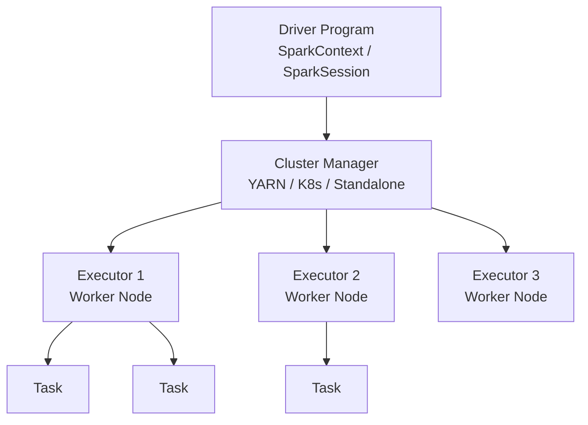
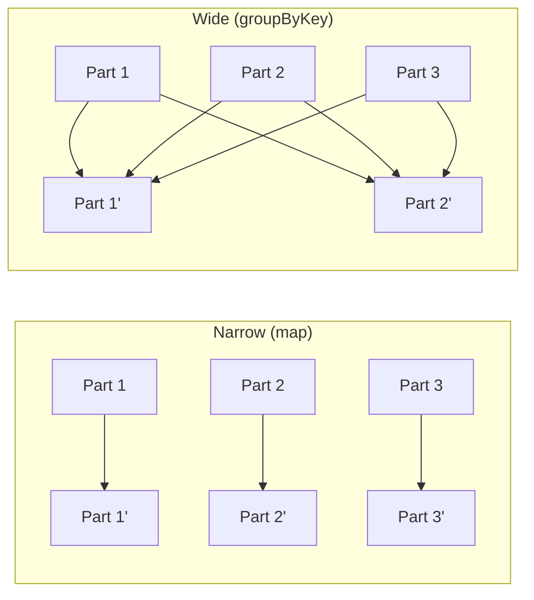

# Вопросы на собеседовании: `Apache Spark`

`Apache Spark` — самый популярный движок для распределённой обработки больших данных. Написан на Scala, использует JVM. Главные API: **RDD** (низкоуровневый), **DataFrame/Dataset** (high-level через Catalyst optimizer), **Spark Streaming**, **Structured Streaming**. На интервью спрашивают: lazy evaluation, shuffle, partitioning, joins (broadcast vs shuffle), skew handling, caching стратегии.

## Полезные ссылки

### Официальная документация и авторитетные источники

- [Apache Spark Documentation](https://spark.apache.org/docs/latest/)
- [Spark Programming Guide](https://spark.apache.org/docs/latest/rdd-programming-guide.html)
- [Spark SQL Guide](https://spark.apache.org/docs/latest/sql-programming-guide.html)
- [Structured Streaming Guide](https://spark.apache.org/docs/latest/structured-streaming-programming-guide.html)
- [Apache Spark — Baeldung](https://www.baeldung.com/apache-spark)
- [Spark Performance Tuning](https://spark.apache.org/docs/latest/sql-performance-tuning.html)
- [Tungsten Project](https://databricks.com/glossary/tungsten)

## Содержание

- [Полезные ссылки](#полезные-ссылки)
- [See also](#see-also)

**Базовые понятия**
- [Q1. (!) Что такое Apache Spark?](#q1--что-такое-apache-spark)
- [Q2. (!) Чем Spark отличается от Hadoop MapReduce?](#q2--чем-spark-отличается-от-hadoop-mapreduce)
- [Q3. (!) Архитектура Spark — Driver, Executor, Cluster Manager?](#q3--архитектура-spark--driver-executor-cluster-manager)
- [Q4. Cluster managers — какие?](#q4-cluster-managers--какие)

**RDD**
- [Q5. (!) Что такое RDD?](#q5--что-такое-rdd)
- [Q6. (!) Transformations vs Actions?](#q6--transformations-vs-actions)
- [Q7. (!) Lazy evaluation в Spark?](#q7--lazy-evaluation-в-spark)
- [Q8. (!) Lineage — что это и зачем?](#q8--lineage--что-это-и-зачем)
- [Q9. Wide vs Narrow transformations?](#q9-wide-vs-narrow-transformations)

**DataFrame / Dataset**
- [Q10. (!) DataFrame vs Dataset vs RDD?](#q10--dataframe-vs-dataset-vs-rdd)
- [Q11. (!) Catalyst Optimizer?](#q11--catalyst-optimizer)
- [Q12. Tungsten — что это?](#q12-tungsten--что-это)
- [Q13. Как работают Spark SQL queries?](#q13-как-работают-spark-sql-queries)

**Partitioning и Shuffle**
- [Q14. (!) Что такое partition в Spark?](#q14--что-такое-partition-в-spark)
- [Q15. (!) Что такое shuffle?](#q15--что-такое-shuffle)
- [Q16. (!) Как минимизировать shuffle?](#q16--как-минимизировать-shuffle)
- [Q17. coalesce vs repartition?](#q17-coalesce-vs-repartition)
- [Q18. (!) Data skew — как решать?](#q18--data-skew--как-решать)

**Joins**
- [Q19. (!) Какие типы joins в Spark?](#q19--какие-типы-joins-в-spark)
- [Q20. (!) Broadcast join — когда применяется?](#q20--broadcast-join--когда-применяется)
- [Q21. Sort-merge join vs hash join?](#q21-sort-merge-join-vs-hash-join)

**Caching и Persistence**
- [Q22. (!) cache() vs persist()?](#q22--cache-vs-persist)
- [Q23. Storage levels?](#q23-storage-levels)
- [Q24. (!) Когда стоит кэшировать?](#q24--когда-стоит-кэшировать)

**Spark SQL и DataFrame API**
- [Q25. (!) Window functions в Spark?](#q25--window-functions-в-spark)
- [Q26. (!) UDF — User Defined Functions?](#q26--udf--user-defined-functions)
- [Q27. Spark SQL vs DataFrame API — производительность?](#q27-spark-sql-vs-dataframe-api--производительность)

**Streaming**
- [Q28. (!) Spark Streaming vs Structured Streaming?](#q28--spark-streaming-vs-structured-streaming)
- [Q29. (!) Что такое micro-batch?](#q29--что-такое-micro-batch)
- [Q30. (!) Watermark и late data?](#q30--watermark-и-late-data)
- [Q31. Continuous Processing mode?](#q31-continuous-processing-mode)

**Performance**
- [Q32. (!) Spark UI — что смотреть?](#q32--spark-ui--что-смотреть)
- [Q33. AQE (Adaptive Query Execution)?](#q33-aqe-adaptive-query-execution)
- [Q34. (!) Какие частые проблемы в production Spark?](#q34--какие-частые-проблемы-в-production-spark)
- [Q35. PySpark vs Spark Scala — производительность?](#q35-pyspark-vs-spark-scala--производительность)

## Q1. (!) Что такое Apache Spark?

`Apache Spark` — distributed computing framework для обработки **больших данных**. Создан в **UC Berkeley AMPLab** (2009), стал Apache top-level в 2014. Написан на **Scala**, работает на JVM.

**Ключевые особенности:**
- **In-memory processing** — данные хранятся в RAM кластера (vs Hadoop MR — на диске)
- **Lazy evaluation** — план выполнения оптимизируется перед выполнением
- **Multiple APIs:** Scala, Java, Python (PySpark), R, SQL
- **Multiple workloads:** batch, streaming, ML (MLlib), graph (GraphX)
- **100x быстрее** Hadoop MapReduce для in-memory задач

**Применения:** ETL, data warehousing (Spark SQL), real-time analytics, ML pipelines.


> [!mcq]
> - [x] Правильный ответ | Объяснение концепции 2-3 предложения
> - [ ] Неправильный вариант 1 | Почему ошибка в этом подходе
> - [ ] Неправильный вариант 2 | Это смежное, но отличное понятие
> - [ ] Неправильный вариант 3 | Противоположное направление## Q2. (!) Чем Spark отличается от Hadoop MapReduce?

| Критерий | Spark | Hadoop MapReduce |
|----------|-------|------------------|
| Данные | In-memory (если помещаются) | На диске (HDFS) |
| API | Богатый (RDD, DataFrame, SQL) | Map + Reduce |
| Скорость | До 100x быстрее (in-memory) | Медленнее (disk I/O) |
| Языки | Scala, Java, Python, R, SQL | Java, Pig, Hive |
| Streaming | Да (Structured Streaming) | Нет (отдельные tools) |
| ML | MLlib | Mahout (отдельно) |
| Iterative computations | Эффективно (cache) | Очень медленно |
| Latency | Sec - mins | Mins - hours |

Hadoop MR ещё используется в legacy проектах. Все новые big data — на Spark.


> [!mcq]
> - [x] Правильный ответ | Объяснение концепции 2-3 предложения
> - [ ] Неправильный вариант 1 | Почему ошибка в этом подходе
> - [ ] Неправильный вариант 2 | Это смежное, но отличное понятие
> - [ ] Неправильный вариант 3 | Противоположное направление## Q3. (!) Архитектура Spark — Driver, Executor, Cluster Manager?



**Driver:**
- Главный процесс приложения
- Содержит `SparkContext` / `SparkSession`
- Строит DAG, планирует execution
- Координирует executors

**Executor:**
- Worker процесс на каждом node
- Выполняет tasks
- Хранит cached data в памяти
- Возвращает результаты driver'у

**Cluster Manager:**
- Распределяет ресурсы (CPU, memory) между приложениями


> [!mcq]
> - [x] Правильный ответ | Объяснение концепции 2-3 предложения
> - [ ] Неправильный вариант 1 | Почему ошибка в этом подходе
> - [ ] Неправильный вариант 2 | Это смежное, но отличное понятие
> - [ ] Неправильный вариант 3 | Противоположное направление## Q4. Cluster managers — какие?

| Manager | Описание |
|---------|----------|
| **Standalone** | Built-in, простой, без других тулзов |
| **YARN** | Hadoop ecosystem, традиционный |
| **Kubernetes** | Cloud-native, рост популярности |
| **Mesos** | Большой scale (Apache Mesos), редко |
| **Local** | Один JVM, для тестов |

```bash
spark-submit \
  --master yarn \
  --deploy-mode cluster \
  --num-executors 10 \
  --executor-memory 4g \
  --executor-cores 2 \
  myapp.jar
```

В **2024** Kubernetes — самый популярный новый выбор. YARN остаётся в legacy.


> [!mcq]
> - [x] Правильный ответ | Объяснение концепции 2-3 предложения
> - [ ] Неправильный вариант 1 | Почему ошибка в этом подходе
> - [ ] Неправильный вариант 2 | Это смежное, но отличное понятие
> - [ ] Неправильный вариант 3 | Противоположное направление## Q5. (!) Что такое RDD?

**RDD (Resilient Distributed Dataset)** — низкоуровневая абстракция Spark.

**Свойства:**
- **Resilient** — отказоустойчивый (через lineage можно пересчитать утраченные partitions)
- **Distributed** — распределён по nodes
- **Dataset** — коллекция неизменяемых элементов
- **Lazy** — операции откладываются до action
- **In-memory или disk** — управляется через persist

```scala
val rdd = sc.parallelize(List(1, 2, 3, 4, 5))
val doubled = rdd.map(_ * 2)
val sum = doubled.reduce(_ + _) // action — запускает вычисление
```

В современном Spark RDD используется **редко** — в основном через DataFrame/Dataset API.


> [!mcq]
> - [x] Правильный ответ | Объяснение концепции 2-3 предложения
> - [ ] Неправильный вариант 1 | Почему ошибка в этом подходе
> - [ ] Неправильный вариант 2 | Это смежное, но отличное понятие
> - [ ] Неправильный вариант 3 | Противоположное направление## Q6. (!) Transformations vs Actions?

**Transformations** — создают новый RDD/DataFrame, **lazy** (не запускают вычисление):

```scala
val rdd = sc.textFile("data.txt")
val filtered = rdd.filter(_.contains("error"))   // transformation
val mapped = filtered.map(_.toUpperCase)          // transformation
// ничего ещё не выполнилось!
```

**Actions** — возвращают результат driver'у, **запускают вычисление**:

```scala
val count = mapped.count()              // action — запускает execution
val first = mapped.first()              // action
mapped.saveAsTextFile("output/")         // action
val collected = mapped.collect()         // action — bring all to driver (опасно!)
```

**Список transformations:** map, filter, flatMap, groupBy, reduceByKey, join, distinct, sort, ...
**Список actions:** count, collect, take, first, reduce, foreach, save*

`collect()` опасен — если данных много, OOM в driver.


> [!mcq]
> - [x] Правильный ответ | Объяснение концепции 2-3 предложения
> - [ ] Неправильный вариант 1 | Почему ошибка в этом подходе
> - [ ] Неправильный вариант 2 | Это смежное, но отличное понятие
> - [ ] Неправильный вариант 3 | Противоположное направление## Q7. (!) Lazy evaluation в Spark?

Transformations **не выполняются сразу**. Spark строит **DAG** (Directed Acyclic Graph) операций. Action триггерит выполнение всего DAG.

```scala
val df = spark.read.parquet("huge_data/")  // ничего не происходит
  .filter($"age" > 18)                      // ничего
  .select("id", "name")                     // ничего
  .repartition(10)                          // ничего

df.show(20) // ВСЁ выполняется здесь
```

**Преимущества:**
- Catalyst optimizer может реорганизовать операции (например, push down filter)
- Объединить несколько операций в один stage
- Избежать ненужных вычислений (dead code elimination)


> [!mcq]
> - [x] Правильный ответ | Объяснение концепции 2-3 предложения
> - [ ] Неправильный вариант 1 | Почему ошибка в этом подходе
> - [ ] Неправильный вариант 2 | Это смежное, но отличное понятие
> - [ ] Неправильный вариант 3 | Противоположное направление## Q8. (!) Lineage — что это и зачем?

**Lineage** — граф зависимостей RDD/DataFrame. Каждый RDD знает, **из какого** RDD и **через какую операцию** он создан.

```scala
val rdd1 = sc.parallelize(...)          // lineage: source
val rdd2 = rdd1.map(...)                 // lineage: rdd1 → map
val rdd3 = rdd2.filter(...)              // lineage: rdd2 → filter
```

**Зачем:**
- **Fault tolerance** — если partition потерян, Spark пересчитает его по lineage
- **Optimization** — Catalyst строит план на основе lineage

Это альтернатива репликации (как HDFS) — храним **рецепт**, а не **копии**.


> [!mcq]
> - [x] Правильный ответ | Объяснение концепции 2-3 предложения
> - [ ] Неправильный вариант 1 | Почему ошибка в этом подходе
> - [ ] Неправильный вариант 2 | Это смежное, но отличное понятие
> - [ ] Неправильный вариант 3 | Противоположное направление## Q9. Wide vs Narrow transformations?

**Narrow** — каждый output partition зависит от **малого числа** input partitions (обычно 1):
- `map`, `filter`, `flatMap`
- Не требуют shuffle

**Wide** — output partition зависит от **многих** input partitions:
- `groupByKey`, `reduceByKey`, `join`, `repartition`, `distinct`
- **Требуют shuffle** (data movement через сеть)



Wide transformations создают **stage boundary**. Минимизация wide ops — критическая оптимизация.


> [!mcq]
> - [x] Правильный ответ | Объяснение концепции 2-3 предложения
> - [ ] Неправильный вариант 1 | Почему ошибка в этом подходе
> - [ ] Неправильный вариант 2 | Это смежное, но отличное понятие
> - [ ] Неправильный вариант 3 | Противоположное направление## Q10. (!) DataFrame vs Dataset vs RDD?

| API | Тип-безопасность | Catalyst | Schema | Когда |
|-----|-----------------|----------|--------|-------|
| **RDD** | Compile-time типы | Нет | Нет | Низкий уровень, custom partitioning |
| **DataFrame** | Только runtime | Да | Да (`StructType`) | Большинство задач |
| **Dataset** | Compile-time типы | Да | Да | Type-safe + performance (только Scala/Java) |

**В современном Spark — DataFrame/Dataset предпочтительнее RDD.** Catalyst оптимизирует, Tungsten компилирует операции.

```scala
// DataFrame — generic Row
val df: DataFrame = spark.read.parquet("...")
df.filter($"age" > 18).select("name").show()

// Dataset — type-safe
case class User(name: String, age: Int)
val ds: Dataset[User] = df.as[User]
ds.filter(_.age > 18).map(_.name).show() // type-safe map

// RDD — низкоуровневый
val rdd = ds.rdd
```

В **PySpark** Dataset нет (нет статической типизации в Python) — только DataFrame.


> [!mcq]
> - [x] Правильный ответ | Объяснение концепции 2-3 предложения
> - [ ] Неправильный вариант 1 | Почему ошибка в этом подходе
> - [ ] Неправильный вариант 2 | Это смежное, но отличное понятие
> - [ ] Неправильный вариант 3 | Противоположное направление## Q11. (!) Catalyst Optimizer?

`Catalyst` — оптимизатор queries в Spark SQL / DataFrame.

**Стадии оптимизации:**

1. **Parsing** — SQL → Unresolved Logical Plan
2. **Analysis** — Unresolved → Logical Plan (resolve columns, tables)
3. **Logical Optimization** — push down filters, constant folding, prune columns, ...
4. **Physical Planning** — выбор конкретных операций (broadcast vs sort-merge join)
5. **Code Generation (Tungsten)** — генерация bytecode для горячих путей

```scala
df.filter($"age" > 18).filter($"country" === "US").select("name")
// Catalyst объединит в один filter и сделает column pruning
```

Поэтому **DataFrame обычно быстрее RDD** даже при той же логике.


> [!mcq]
> - [x] Правильный ответ | Объяснение концепции 2-3 предложения
> - [ ] Неправильный вариант 1 | Почему ошибка в этом подходе
> - [ ] Неправильный вариант 2 | Это смежное, но отличное понятие
> - [ ] Неправильный вариант 3 | Противоположное направление## Q12. Tungsten — что это?

`Project Tungsten` (с Spark 1.4) — серия оптимизаций:

1. **Off-heap memory** — bypass JVM GC, явное управление через `sun.misc.Unsafe`
2. **Cache-aware computation** — учёт CPU cache в алгоритмах
3. **Whole-stage code generation** — генерация JIT-friendly кода для всей stage

Результат: **5-10x быстрее** RDD-based операций для одинаковых задач.


> [!mcq]
> - [x] Правильный ответ | Объяснение концепции 2-3 предложения
> - [ ] Неправильный вариант 1 | Почему ошибка в этом подходе
> - [ ] Неправильный вариант 2 | Это смежное, но отличное понятие
> - [ ] Неправильный вариант 3 | Противоположное направление## Q13. Как работают Spark SQL queries?

```scala
spark.sql("SELECT name, age FROM users WHERE age > 18")

// Эквивалентно DataFrame API
spark.table("users").filter($"age" > 18).select("name", "age")
```

Spark SQL — DSL поверх DataFrame. Тот же Catalyst, тот же план.

```scala
// Регистрация temp view
df.createOrReplaceTempView("users")
spark.sql("SELECT COUNT(*) FROM users").show()

// Permanent table
df.write.saveAsTable("users")
```


> [!mcq]
> - [x] Правильный ответ | Объяснение концепции 2-3 предложения
> - [ ] Неправильный вариант 1 | Почему ошибка в этом подходе
> - [ ] Неправильный вариант 2 | Это смежное, но отличное понятие
> - [ ] Неправильный вариант 3 | Противоположное направление## Q14. (!) Что такое partition в Spark?

**Partition** — единица параллелизма в Spark. Каждый partition обрабатывается **одним task**.

```scala
val rdd = sc.parallelize(1 to 1000, 10) // 10 partitions
rdd.getNumPartitions // 10

val df = spark.read.parquet("data/")
df.rdd.getNumPartitions // зависит от файлов
```

**Правила выбора:**
- **Слишком мало** partitions → не используем все cores
- **Слишком много** → overhead на task scheduling

**Best practice:** ~2-4× number of cores в кластере.

```scala
df.repartition(100) // shuffle на 100 partitions
df.coalesce(50)      // объединить (без shuffle, только уменьшение)
```


> [!mcq]
> - [x] Правильный ответ | Объяснение концепции 2-3 предложения
> - [ ] Неправильный вариант 1 | Почему ошибка в этом подходе
> - [ ] Неправильный вариант 2 | Это смежное, но отличное понятие
> - [ ] Неправильный вариант 3 | Противоположное направление## Q15. (!) Что такое shuffle?

**Shuffle** — перераспределение данных между partitions, обычно через **сеть и диск**.

Происходит при wide transformations (groupByKey, join, repartition, distinct).

**Этапы shuffle:**
1. **Map side** — каждый task вычисляет, в какой partition каждая запись
2. **Write to local disk** — данные пишутся в shuffle файлы
3. **Reduce side fetch** — reducers читают свои partitions через сеть
4. **Reduce side process** — обработка

**Стоимость:**
- I/O на диск
- Network I/O
- Сериализация
- В 100-1000 раз медленнее narrow transformations

Shuffle — **главная** причина медленных Spark jobs.


> [!mcq]
> - [x] Правильный ответ | Объяснение концепции 2-3 предложения
> - [ ] Неправильный вариант 1 | Почему ошибка в этом подходе
> - [ ] Неправильный вариант 2 | Это смежное, но отличное понятие
> - [ ] Неправильный вариант 3 | Противоположное направление## Q16. (!) Как минимизировать shuffle?

1. **`reduceByKey` вместо `groupByKey`** — combiner на map стороне
```scala
// BAD — shuffle всех значений
rdd.groupByKey().mapValues(_.sum)

// GOOD — pre-aggregation на map стороне
rdd.reduceByKey(_ + _)
```

2. **Broadcast join** для маленьких tables вместо shuffle join
3. **Pre-partitioning** одинаковыми keys для join
4. **Filter rано** — push down фильтров (Catalyst делает автоматически)
5. **Column pruning** — выбирай только нужные колонки до join
6. **`repartition` только когда нужно** — не злоупотребляй


> [!mcq]
> - [x] Правильный ответ | Объяснение концепции 2-3 предложения
> - [ ] Неправильный вариант 1 | Почему ошибка в этом подходе
> - [ ] Неправильный вариант 2 | Это смежное, но отличное понятие
> - [ ] Неправильный вариант 3 | Противоположное направление## Q17. coalesce vs repartition?

```scala
df.coalesce(10)     // объединяет partitions, БЕЗ shuffle
df.repartition(10)   // полный shuffle, равномерное распределение
df.repartition($"country") // shuffle по hash от country
```

| Метод | Shuffle | Equal partitions | Когда |
|-------|---------|-----------------|-------|
| `coalesce(N)` | Нет | Нет (могут быть neравные) | Уменьшение partitions перед записью |
| `repartition(N)` | Да | Да | Балансировка, увеличение |
| `repartition(col)` | Да | По hash | Перед join по этой колонке |

**Best practice:** перед `write` используй `coalesce` для уменьшения числа output файлов.


> [!mcq]
> - [x] Правильный ответ | Объяснение концепции 2-3 предложения
> - [ ] Неправильный вариант 1 | Почему ошибка в этом подходе
> - [ ] Неправильный вариант 2 | Это смежное, но отличное понятие
> - [ ] Неправильный вариант 3 | Противоположное направление## Q18. (!) Data skew — как решать?

**Data skew** — некоторые partitions гораздо больше других. Несколько tasks работают **намного дольше**, остальные — простаивают.

**Симптомы:**
- В Spark UI один task обрабатывается 10x дольше
- OOM на конкретном executor
- Stage не завершается

**Причины:**
- Hot keys в `groupBy/join` (например, NULL — попадает в одну partition)
- Неравномерное распределение данных по partition keys

**Решения:**

1. **Salting** — добавить случайный суффикс к hot key, потом убрать:

```scala
val saltedDf = df.withColumn("salted_key",
  concat($"key", lit("_"), (rand() * 100).cast("int"))
)
saltedDf.groupBy("salted_key").agg(...)
  .withColumn("key", split($"salted_key", "_").getItem(0))
  .groupBy("key").agg(...)
```

2. **AQE (Adaptive Query Execution)** — автоматически разделяет skewed partitions (Spark 3+)

3. **Broadcast join** — если одна таблица маленькая

4. **Custom partitioner** — для специфичных случаев


> [!mcq]
> - [x] Правильный ответ | Объяснение концепции 2-3 предложения
> - [ ] Неправильный вариант 1 | Почему ошибка в этом подходе
> - [ ] Неправильный вариант 2 | Это смежное, но отличное понятие
> - [ ] Неправильный вариант 3 | Противоположное направление## Q19. (!) Какие типы joins в Spark?

```scala
df1.join(df2, "id")              // inner
df1.join(df2, Seq("id"), "left")  // left outer
df1.join(df2, Seq("id"), "right") // right outer
df1.join(df2, Seq("id"), "outer") // full outer
df1.join(df2, Seq("id"), "left_semi")  // вернёт строки df1 где есть match
df1.join(df2, Seq("id"), "left_anti")  // строки df1 где НЕТ match
df1.crossJoin(df2)                // cartesian
```

**Стратегии join (что выбирает Catalyst):**
- **Broadcast Hash Join** — одна сторона < `spark.sql.autoBroadcastJoinThreshold` (default 10MB)
- **Sort-Merge Join** — обе большие, обе sorted/repartitioned
- **Shuffle Hash Join** — обе sorted (редкая)
- **Cartesian** — без условия


> [!mcq]
> - [x] Правильный ответ | Объяснение концепции 2-3 предложения
> - [ ] Неправильный вариант 1 | Почему ошибка в этом подходе
> - [ ] Неправильный вариант 2 | Это смежное, но отличное понятие
> - [ ] Неправильный вариант 3 | Противоположное направление## Q20. (!) Broadcast join — когда применяется?

**Broadcast join** — маленькая таблица копируется на **каждый executor**, большая — не shuffle'ится.

```scala
import org.apache.spark.sql.functions.broadcast

val joined = bigDf.join(broadcast(smallDf), "id")
```

**Условие:** `smallDf` должна помещаться в память каждого executor (по умолчанию < 10 MB).

**Преимущества:**
- **Нет shuffle** для большой таблицы
- В **5-100 раз быстрее** sort-merge join

```sql
SELECT /*+ BROADCAST(small_table) */ ...
```

В Spark 3+ AQE может автоматически конвертировать sort-merge → broadcast если статистика показывает маленький размер.


> [!mcq]
> - [x] Правильный ответ | Объяснение концепции 2-3 предложения
> - [ ] Неправильный вариант 1 | Почему ошибка в этом подходе
> - [ ] Неправильный вариант 2 | Это смежное, но отличное понятие
> - [ ] Неправильный вариант 3 | Противоположное направление## Q21. Sort-merge join vs hash join?

**Sort-merge join:**
1. Сортируем обе стороны по join key
2. Слияние (merge) одновременно

`O((n + m) log n)` — sort + merge.

**Hash join:**
1. Build phase — строим hash table из меньшей стороны
2. Probe phase — для каждой строки большей ищем в hash table

`O(n + m)` — но требует памяти под hash table.

В Spark по умолчанию — **sort-merge join** (стабильнее по памяти). **Broadcast hash join** для маленьких таблиц.


> [!mcq]
> - [x] Правильный ответ | Объяснение концепции 2-3 предложения
> - [ ] Неправильный вариант 1 | Почему ошибка в этом подходе
> - [ ] Неправильный вариант 2 | Это смежное, но отличное понятие
> - [ ] Неправильный вариант 3 | Противоположное направление## Q22. (!) cache() vs persist()?

```scala
df.cache()                                    // = persist(MEMORY_AND_DISK)
df.persist(StorageLevel.MEMORY_ONLY)          // RAM
df.persist(StorageLevel.MEMORY_AND_DISK)      // RAM + spill to disk
df.persist(StorageLevel.DISK_ONLY)            // только диск
df.persist(StorageLevel.MEMORY_ONLY_SER)      // RAM, сериализованно (компактнее)
df.unpersist()                                // освободить
```

`cache()` — синоним `persist(MEMORY_AND_DISK)` (для DataFrame, для RDD — `MEMORY_ONLY`).


> [!mcq]
> - [x] Правильный ответ | Объяснение концепции 2-3 предложения
> - [ ] Неправильный вариант 1 | Почему ошибка в этом подходе
> - [ ] Неправильный вариант 2 | Это смежное, но отличное понятие
> - [ ] Неправильный вариант 3 | Противоположное направление## Q23. Storage levels?

| Level | Memory | Disk | Serialized | Replication |
|-------|--------|------|------------|-------------|
| `MEMORY_ONLY` | Да | Нет | Нет | 1 |
| `MEMORY_AND_DISK` | Да, spill | Да | Нет | 1 |
| `MEMORY_ONLY_SER` | Да | Нет | Да | 1 |
| `MEMORY_AND_DISK_SER` | Да, spill | Да | Да | 1 |
| `DISK_ONLY` | Нет | Да | — | 1 |
| `MEMORY_ONLY_2` | Да | Нет | Нет | 2 |

`SER` — сериализация (меньше памяти, но CPU на ser/deser). `_2` — реплицировать на 2 nodes (для отказоустойчивости).

**По умолчанию для DataFrame:** `MEMORY_AND_DISK` — оптимально для большинства случаев.


> [!mcq]
> - [x] Правильный ответ | Объяснение концепции 2-3 предложения
> - [ ] Неправильный вариант 1 | Почему ошибка в этом подходе
> - [ ] Неправильный вариант 2 | Это смежное, но отличное понятие
> - [ ] Неправильный вариант 3 | Противоположное направление## Q24. (!) Когда стоит кэшировать?

**Кешируй когда:**
- DataFrame используется **несколько раз** (action > 1)
- Дорогая трансформация (long lineage)
- Iterative алгоритмы (ML)

**НЕ кешируй когда:**
- DataFrame используется один раз
- Очень маленький — нет смысла
- Памяти не хватает (кеш будет evict'иться)

```scala
val expensive = df.groupBy(...).agg(...).cache()
expensive.count()  // первое action — build cache
expensive.show()   // используем cache
expensive.write.parquet(...)  // ещё раз
expensive.unpersist()
```

**Подвох:** lazy — cache не строится до первого action. Часто делают `.count()` для прогрева.


> [!mcq]
> - [x] Правильный ответ | Объяснение концепции 2-3 предложения
> - [ ] Неправильный вариант 1 | Почему ошибка в этом подходе
> - [ ] Неправильный вариант 2 | Это смежное, но отличное понятие
> - [ ] Неправильный вариант 3 | Противоположное направление## Q25. (!) Window functions в Spark?

```scala
import org.apache.spark.sql.expressions.Window
import org.apache.spark.sql.functions._

val window = Window.partitionBy("department").orderBy($"salary".desc)

df.withColumn("rank", rank().over(window))
  .withColumn("prev_salary", lag("salary", 1).over(window))
  .withColumn("running_total", sum("salary").over(window))
```

**Применения:**
- Топ-N в группах
- Running totals
- Lag/lead для time-series
- Percentile rank


> [!mcq]
> - [x] Правильный ответ | Объяснение концепции 2-3 предложения
> - [ ] Неправильный вариант 1 | Почему ошибка в этом подходе
> - [ ] Неправильный вариант 2 | Это смежное, но отличное понятие
> - [ ] Неправильный вариант 3 | Противоположное направление## Q26. (!) UDF — User Defined Functions?

```scala
val toUpper = udf((s: String) => s.toUpperCase)
df.withColumn("name_upper", toUpper($"name"))

// SQL
spark.udf.register("to_upper", (s: String) => s.toUpperCase)
spark.sql("SELECT to_upper(name) FROM users")
```

**Подводный камень:** UDF — **черный ящик** для Catalyst, теряются оптимизации.

**Когда возможно — используй встроенные функции:**

```scala
// SLOW — UDF
df.withColumn("upper", udf((s: String) => s.toUpperCase).apply($"name"))

// FAST — встроенная функция
df.withColumn("upper", upper($"name"))
```

В **PySpark** UDF особенно медленные (Python ↔ JVM serialization). С Spark 3+ есть **Pandas UDF** (Arrow-based) — намного быстрее.


> [!mcq]
> - [x] Правильный ответ | Объяснение концепции 2-3 предложения
> - [ ] Неправильный вариант 1 | Почему ошибка в этом подходе
> - [ ] Неправильный вариант 2 | Это смежное, но отличное понятие
> - [ ] Неправильный вариант 3 | Противоположное направление## Q27. Spark SQL vs DataFrame API — производительность?

**Идентична** — оба компилируются Catalyst в один и тот же физический план.

```scala
// SQL
spark.sql("SELECT name FROM users WHERE age > 18")

// DataFrame
df.filter($"age" > 18).select("name")
```

Выбор по предпочтениям:
- SQL — для аналитиков, удобство
- DataFrame API — для разработчиков, type-safety с Dataset


> [!mcq]
> - [x] Правильный ответ | Объяснение концепции 2-3 предложения
> - [ ] Неправильный вариант 1 | Почему ошибка в этом подходе
> - [ ] Неправильный вариант 2 | Это смежное, но отличное понятие
> - [ ] Неправильный вариант 3 | Противоположное направление## Q28. (!) Spark Streaming vs Structured Streaming?

| Критерий | Spark Streaming (DStream) | Structured Streaming |
|----------|---------------------------|----------------------|
| API | RDD-based | DataFrame-based |
| Optimization | Нет (как RDD) | Catalyst |
| Modes | Только micro-batch | Micro-batch + Continuous |
| Window operations | Базовые | Богатые (event time, watermark) |
| Late data | Сложно | Watermark |
| Status | Legacy (Spark 2 API) | Recommended (Spark 2+) |

**Используй Structured Streaming.** DStream API считается устаревшим.


> [!mcq]
> - [x] Правильный ответ | Объяснение концепции 2-3 предложения
> - [ ] Неправильный вариант 1 | Почему ошибка в этом подходе
> - [ ] Неправильный вариант 2 | Это смежное, но отличное понятие
> - [ ] Неправильный вариант 3 | Противоположное направление## Q29. (!) Что такое micro-batch?

**Micro-batch** — Spark обрабатывает streaming как **серию маленьких batch jobs**:

```
[ data ] → [ data ] → [ data ]
   ↓          ↓          ↓
 batch 1   batch 2    batch 3   (каждые ~1 сек)
   ↓          ↓          ↓
 process   process    process
```

**Trigger interval:** как часто запускать batch (default — как только предыдущий закончится).

**Latency:** обычно 100ms - 5 сек. Не подходит для **sub-100ms** latency (там Flink, Apache Storm).


> [!mcq]
> - [x] Правильный ответ | Объяснение концепции 2-3 предложения
> - [ ] Неправильный вариант 1 | Почему ошибка в этом подходе
> - [ ] Неправильный вариант 2 | Это смежное, но отличное понятие
> - [ ] Неправильный вариант 3 | Противоположное направление## Q30. (!) Watermark и late data?

В streaming данные могут приходить **с задержкой**. **Watermark** — "до этого времени все данные уже пришли".

```scala
streamDf.withWatermark("timestamp", "10 minutes")
  .groupBy(window($"timestamp", "5 minutes"), $"user_id")
  .count()
```

**Семантика:**
- Watermark = max(seen timestamps) - 10 min
- Данные с timestamp < watermark считаются "late" → отбрасываются (или добавляются в out-of-order, в зависимости от output mode)
- State старше watermark освобождается (важно для memory)


> [!mcq]
> - [x] Правильный ответ | Объяснение концепции 2-3 предложения
> - [ ] Неправильный вариант 1 | Почему ошибка в этом подходе
> - [ ] Неправильный вариант 2 | Это смежное, но отличное понятие
> - [ ] Неправильный вариант 3 | Противоположное направление## Q31. Continuous Processing mode?

С Spark 2.3 — экспериментальный режим **continuous**:

```scala
streamDf.writeStream
  .trigger(Trigger.Continuous("1 second"))
  .start()
```

Latency **~1 ms** (vs 100ms+ в micro-batch). Но ограничения:
- Только **map-like** операции
- Только некоторые sources/sinks
- At-least-once семантика (а не exactly-once)

В **2024** continuous mode так и остался experimental. Для **низкой latency** — используй **Apache Flink** (см. [Flink](apache-flink-interview.md)).


> [!mcq]
> - [x] Правильный ответ | Объяснение концепции 2-3 предложения
> - [ ] Неправильный вариант 1 | Почему ошибка в этом подходе
> - [ ] Неправильный вариант 2 | Это смежное, но отличное понятие
> - [ ] Неправильный вариант 3 | Противоположное направление## Q32. (!) Spark UI — что смотреть?

Spark UI на `http://driver:4040` (или history server):

1. **Jobs tab** — какие jobs запускались, их время
2. **Stages tab** — какой stage самый долгий
3. **SQL tab** — план запроса (DAG, pyhsical plan)
4. **Executors** — память, CPU, diskovich tasks
5. **Storage** — что кешировано

**На что обращать внимание:**
- **Skew** — task'и с непропорционально долгим временем
- **Spill** — данные не помещаются в RAM, идут на диск
- **Shuffle read/write** — большие = bottleneck
- **Failed tasks** — почему?


> [!mcq]
> - [x] Правильный ответ | Объяснение концепции 2-3 предложения
> - [ ] Неправильный вариант 1 | Почему ошибка в этом подходе
> - [ ] Неправильный вариант 2 | Это смежное, но отличное понятие
> - [ ] Неправильный вариант 3 | Противоположное направление## Q33. AQE (Adaptive Query Execution)?

С Spark 3.0 — AQE адаптирует план **во время выполнения** на основе actual статистики:

```properties
spark.sql.adaptive.enabled=true
spark.sql.adaptive.coalescePartitions.enabled=true
spark.sql.adaptive.skewJoin.enabled=true
```

**Что делает:**
- **Coalesces partitions** после shuffle (если они стали маленькими)
- **Switches join strategy** — sort-merge → broadcast если выяснилось, что одна сторона маленькая
- **Skew join optimization** — разбивает skewed partitions

В **Spark 3+ AQE — большой прирост в perf "из коробки"**. Включай всегда.


> [!mcq]
> - [x] Правильный ответ | Объяснение концепции 2-3 предложения
> - [ ] Неправильный вариант 1 | Почему ошибка в этом подходе
> - [ ] Неправильный вариант 2 | Это смежное, но отличное понятие
> - [ ] Неправильный вариант 3 | Противоположное направление## Q34. (!) Какие частые проблемы в production Spark?

1. **OOM на executor** — слишком большие partitions, увеличить memory или partitions
2. **Long-running stages из-за skew** — salting
3. **Slow shuffle** — увеличить `spark.sql.shuffle.partitions`, оптимизировать joins
4. **Slow PySpark UDF** — заменить на native или Pandas UDF
5. **Driver OOM** — `collect()` слишком большого df
6. **Slow reads** — мало partitions в files, использовать columnar formats (Parquet, ORC)
7. **Garbage collection pauses** — увеличить `spark.executor.memory`, переключить на G1GC
8. **Cluster underutilization** — мало partitions, увеличить
9. **Cluster overutilization** — слишком много executors
10. **`groupByKey` на огромных данных** — заменить `reduceByKey`


> [!mcq]
> - [x] Правильный ответ | Объяснение концепции 2-3 предложения
> - [ ] Неправильный вариант 1 | Почему ошибка в этом подходе
> - [ ] Неправильный вариант 2 | Это смежное, но отличное понятие
> - [ ] Неправильный вариант 3 | Противоположное направление## Q35. PySpark vs Spark Scala — производительность?

| Критерий | PySpark | Scala Spark |
|----------|---------|-------------|
| DataFrame API | Identical perf | Identical perf |
| RDD operations | Slow (Python ↔ JVM ser) | Fast |
| UDF | Slow (Python interpreter) | Fast (JVM) |
| Pandas UDF | Fast (Arrow) | — |
| Distribution | PyPI, easier setup | Maven/SBT |
| ML libraries | Pandas, scikit-learn integration | Limited |

**DataFrame operations — одинаковая perf.** Разница только в RDD/UDF.

В **2024** Pandas UDF (Arrow-based) почти полностью закрывают gap. PySpark стал dominant в data science, Scala — в data engineering.

---

## See also

- [Apache Flink](apache-flink-interview.md) — настоящий streaming с low latency
- [Kafka Streams](kafka-streams-interview.md) — JVM streaming на Kafka
- [Apache Airflow](apache-airflow-interview.md) — orchestration Spark jobs
- [Scala](../programming-languages/scala/scala-interview.md) — основной язык Spark
- [Stream Processing](stream-processing-interview.md) — концепции
- [Data Warehousing](data-warehousing-interview.md) — где Spark часто ETL
- [Data Lake / Lakehouse](data-lake-lakehouse-interview.md) — Delta Lake, Iceberg, Hudi
- [PostgreSQL](../databases/postgresql-interview.md) — частый source/destination
- [Apache Kafka](../messaging/kafka-interview.md) — Spark читает/пишет
- [Микросервисы](../architecture/microservices-interview.md) — vs аналитика на Spark
- [Performance Testing](../performance/performance-testing-interview.md) — Spark UI и benchmarking
- [JVM](../jvm/jvm-interview.md) — Spark на JVM, GC tuning
- [Memory Management](../performance/memory-management-interview.md) — Tungsten off-heap


> [!mcq]
> - [x] Правильный ответ | Объяснение концепции 2-3 предложения
> - [ ] Неправильный вариант 1 | Почему ошибка в этом подходе
> - [ ] Неправильный вариант 2 | Это смежное, но отличное понятие
> - [ ] Неправильный вариант 3 | Противоположное направление- [Apache Airflow](apache-airflow-interview.md)
- [Apache Flink](apache-flink-interview.md)
- [Data Lake и Lakehouse](data-lake-lakehouse-interview.md)
- [Data Warehousing](data-warehousing-interview.md)
- [dbt](dbt-interview.md)
- [Kafka Streams](kafka-streams-interview.md)
