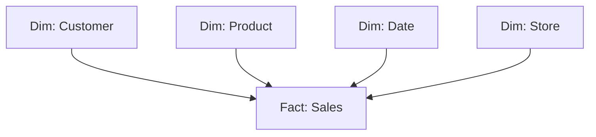

# Вопросы на собеседовании: `Data Warehousing`

Data warehouse — централизованное хранилище для **аналитики и BI**. Оптимизировано под **OLAP** (агрегации, joins, отчёты), не для transactional нагрузки. Современные DWH: **Snowflake**, **BigQuery**, **Redshift**, **Databricks**. На интервью спрашивают: dimensional modeling (Kimball), columnar storage, MPP, slowly changing dimensions.

## Полезные ссылки

### Официальная документация и авторитетные источники

- [Kimball Group Data Warehouse Design](https://www.kimballgroup.com/data-warehouse-business-intelligence-resources/)
- [Snowflake Documentation](https://docs.snowflake.com/)
- [BigQuery Documentation](https://cloud.google.com/bigquery/docs)
- [Amazon Redshift Documentation](https://docs.aws.amazon.com/redshift/)
- [Databricks Lakehouse](https://www.databricks.com/glossary/data-lakehouse)
- [The Data Warehouse Toolkit (Kimball book)](https://www.kimballgroup.com/data-warehouse-business-intelligence-resources/books/data-warehouse-dw-toolkit/)

## Содержание

- [Полезные ссылки](#полезные-ссылки)
- [See also](#see-also)

**Базовые понятия**
- [Q1. (!) Что такое data warehouse?](#q1--что-такое-data-warehouse)
- [Q2. (!) OLTP vs OLAP — в чём разница?](#q2--oltp-vs-olap--в-чём-разница)
- [Q3. (!) Зачем отдельный DWH, а не запросы прямо к OLTP-базе?](#q3--зачем-отдельный-dwh-а-не-запросы-прямо-к-oltp-базе)

**Архитектура**
- [Q4. (!) Что такое MPP?](#q4--что-такое-mpp)
- [Q5. (!) Что такое columnar storage и зачем оно в DWH?](#q5--что-такое-columnar-storage-и-зачем-оно-в-dwh)
- [Q6. Как работает сжатие данных в DWH?](#q6-как-работает-сжатие-данных-в-dwh)
- [Q7. Что такое vectorized execution?](#q7-что-такое-vectorized-execution)

**Modeling — Kimball**
- [Q8. (!) Что такое dimensional modeling?](#q8--что-такое-dimensional-modeling)
- [Q9. (!) Star schema или Snowflake schema — в чём разница?](#q9--star-schema-или-snowflake-schema--в-чём-разница)
- [Q10. (!) Какие бывают типы fact-таблиц?](#q10--какие-бывают-типы-fact-таблиц)
- [Q11. (!) Что такое dimension-таблица и зачем она нужна?](#q11--что-такое-dimension-таблица-и-зачем-она-нужна)
- [Q12. (!) Slowly Changing Dimensions (SCD) — какие бывают типы?](#q12--slowly-changing-dimensions-scd--какие-бывают-типы)

**Modeling — другие подходы**
- [Q13. Чем подход Inmon (3NF) отличается от Kimball?](#q13-чем-подход-inmon-3nf-отличается-от-kimball)
- [Q14. Что такое Data Vault?](#q14-что-такое-data-vault)
- [Q15. (!) Что такое One Big Table (OBT) и денормализация?](#q15--что-такое-one-big-table-obt-и-денормализация)

**Современные DWH (cloud)**
- [Q16. (!) Snowflake — что в нём особенного?](#q16--snowflake--что-в-нём-особенного)
- [Q17. (!) BigQuery — в чём особенности?](#q17--bigquery--в-чём-особенности)
- [Q18. Что представляет собой Redshift?](#q18-что-представляет-собой-redshift)
- [Q19. Что такое Databricks SQL?](#q19-что-такое-databricks-sql)
- [Q20. (!) Где применяется ClickHouse?](#q20--где-применяется-clickhouse)

**Loading данных (ETL/ELT)**
- [Q21. (!) ETL vs ELT — в чём разница?](#q21--etl-vs-elt--в-чём-разница)
- [Q22. Что такое CDC (Change Data Capture)?](#q22-что-такое-cdc-change-data-capture)
- [Q23. Какими инструментами грузят данные (Fivetran, Airbyte, Stitch)?](#q23-какими-инструментами-грузят-данные-fivetran-airbyte-stitch)

**Performance**
- [Q24. (!) Что такое partitioning и clustering?](#q24--что-такое-partitioning-и-clustering)
- [Q25. Что такое materialized views?](#q25-что-такое-materialized-views)
- [Q26. (!) Как оптимизировать затраты в облачном DWH?](#q26--как-оптимизировать-затраты-в-облачном-dwh)

**BI и аналитика**
- [Q27. (!) Какие BI-инструменты используются?](#q27--какие-bi-инструменты-используются)
- [Q28. Что такое semantic layer?](#q28-что-такое-semantic-layer)

**Эволюция**
- [Q29. (!) Что такое Modern Data Stack?](#q29--что-такое-modern-data-stack)
- [Q30. Чем различаются Data Warehouse, Data Lake и Lakehouse?](#q30-чем-различаются-data-warehouse-data-lake-и-lakehouse)

## Q1. (!) Что такое data warehouse?

`Data warehouse (DWH)` — централизованная БД для **аналитики и отчётности**. Собирает **исторические** данные из множества источников в одном месте и оптимизирована под тяжёлые аналитические запросы (агрегации, joins по миллионам строк), а не под операционную нагрузку.

Классическое определение Билла Инмона держится на четырёх свойствах — их часто просят перечислить на интервью:

- **Subject-oriented** (предметно-ориентированное) — данные организованы вокруг бизнес-сущностей (продажи, клиенты), а не вокруг приложений, которые их породили.
- **Integrated** (интегрированное) — данные из разных систем приведены к единым форматам, единицам и кодировкам, чтобы их можно было сопоставлять.
- **Time-variant** (привязанное ко времени) — хранит не текущий снимок, а всю историю: «как было на каждый момент времени».
- **Non-volatile** (неизменяемое) — после загрузки данные не правят и не удаляют, только добавляют новые. Это и делает историю надёжной.

**Сценарии применения:** business intelligence и дашборды для руководства, ad-hoc-анализ, подготовка признаков (feature engineering) для ML.

## Q2. (!) OLTP vs OLAP — в чём разница?

OLTP и OLAP — это два противоположных профиля нагрузки. **OLTP** обслуживает повседневные операции (оформить заказ, списать деньги) — много мелких быстрых транзакций. **OLAP** отвечает на аналитические вопросы («сколько продали по регионам за год») — мало запросов, но каждый перелопачивает миллионы строк.

| Критерий | OLTP (transactional) | OLAP (analytical) |
|----------|---------------------|-------------------|
| Назначение | Обслуживать бизнес-операции | Анализировать бизнес |
| Операции | INSERT/UPDATE/DELETE отдельных строк | SELECT с агрегациями миллионов строк |
| Схема | Сильно нормализована (3NF) | Денормализована (star schema) |
| Хранение | Построчное (row-oriented) | Поколоночное (column-oriented) |
| Задержка | Миллисекунды | Секунды-минуты |
| Одновременных пользователей | Тысячи | Десятки-сотни |
| Размер | GB-TB | TB-PB |
| Примеры | PostgreSQL, MySQL, Oracle | Snowflake, BigQuery, Redshift |

**Почему их разделяют:** одна БД не может одинаково хорошо делать и то, и другое. Построчное хранение и нормализация ускоряют точечные записи (OLTP), но убивают агрегации; поколоночное хранение и денормализация ускоряют агрегации (OLAP), но делают точечные изменения дорогими. Это фундаментальный компромисс между пропускной способностью на запись и скоростью аналитических запросов.

## Q3. (!) Зачем отдельный DWH, а не запросы прямо к OLTP-базе?

Короткий ответ: OLTP-база заточена под совсем другой профиль нагрузки, и аналитика на ней либо тормозит сама, либо тормозит боевые транзакции. Вынося аналитику в DWH, мы разводим эти конфликтующие нагрузки. Конкретные причины:

1. **Производительность** — OLTP-движок и его индексы не рассчитаны на агрегации по миллиардам строк.
2. **Изоляция от продакшена** — тяжёлый аналитический запрос на боевой базе заберёт ресурсы и замедлит транзакции пользователей.
3. **Историчность** — OLTP обычно хранит только текущее состояние (один заказ = одна строка), DWH сохраняет все изменения во времени.
4. **Интеграция** — DWH сводит данные из 10+ разных систем в одну консистентную модель; в одной OLTP-базе их просто нет.
5. **Разные схемы** — OLTP нормализован под целостность записи, DWH денормализован под скорость чтения.
6. **Разные паттерны доступа** — OLTP читает единичные строки по ключу, DWH сканирует и агрегирует большие диапазоны.
7. **Разделение compute и storage** — облачный DWH масштабирует вычисления независимо от хранилища, чего классическая OLTP-СУБД не умеет.

## Q4. (!) Что такое MPP?

**MPP (Massively Parallel Processing)** — архитектура, в которой один запрос разбивается на части и выполняется параллельно на множестве узлов. Координатор делит работу, узлы обрабатывают свои порции данных независимо, результаты собираются обратно. Так петабайтный scan укладывается в секунды.

```
Query → Coordinator → splits into pieces → 100 worker nodes
                                              ↓
                                     каждый processes свою часть
                                              ↓
                                  Results aggregated → Result
```

**MPP-системы:** Redshift, Snowflake, BigQuery, Greenplum, Vertica, Teradata.

**Что это даёт:**
- Линейное масштабирование: добавил узлы — пропорционально ускорил запросы.
- Работа с петабайтами данных, недоступными одной машине.
- Параллельные сканирования, joins и агрегации вместо последовательных.

**Контраст:** классическая СУБД (PostgreSQL, MySQL) выполняет запрос в основном на одном CPU. Параллельные запросы есть, но масштаб ограничен одной машиной, а не сотней узлов.

## Q5. (!) Что такое columnar storage и зачем оно в DWH?

Колоночное хранение (columnar storage) кладёт на диск рядом значения **одной колонки**, а не целые строки. Для аналитики это ключевое решение: запросы обычно трогают 2–3 колонки из сотни, а агрегируют миллионы строк — значит, читать нужно только эти колонки, а не всю строку целиком.

**Построчное хранение (row-oriented, OLTP):**
```
Row 1: [id=1, name=Alice, age=30, country=US]
Row 2: [id=2, name=Bob,   age=25, country=DE]
```

**Поколоночное хранение (column-oriented, OLAP):**
```
Column id:      [1, 2, 3, ...]
Column name:    [Alice, Bob, ...]
Column age:     [30, 25, ...]
Column country: [US, DE, ...]
```

**Плюсы columnar:**
- **Сжатие в разы лучше** — рядом лежат однотипные значения, их легко кодировать (см. Q6).
- **Читаются только нужные колонки** — для запроса по 3 колонкам из 100 диск читает 3% данных.
- **Векторизованная обработка** — операции над колонкой ложатся на SIMD-инструкции CPU (см. Q7).
- **Пропуск блоков (block skipping)** — по min/max-метаданным блока движок пропускает заведомо нерелевантные блоки, не читая их.

**Минусы:**
- Медленно для выборки **одной целой строки** — её значения разбросаны по всем колонкам, и собрать их дорого.
- Медленные точечные обновления — чтобы поправить строку, нужно переписать затронутые колонки.

**Где используется:** форматы файлов Parquet, ORC; движки Snowflake, BigQuery, Redshift, ClickHouse.

## Q6. Как работает сжатие данных в DWH?

Колоночное хранение даёт отличное сжатие именно потому, что в колонке лежат однотипные, часто повторяющиеся значения — их легко кодировать компактно. Основные методы:

- **Run-length encoding** — повторы свёртываются: `AAAA → A×4`. Идеально для колонок с длинными сериями одинаковых значений.
- **Dictionary encoding** — уникальные значения выносятся в словарь, в данных остаются короткие коды. Отлично для строк с малым числом вариантов (страна, статус).
- **Bit packing** — числа с узким диапазоном пакуются в минимально нужное число бит вместо полных 32/64.
- **Delta encoding** — для отсортированных чисел хранятся разницы между соседними значениями, а не сами значения.

На практике: Parquet сжимает в **2–10 раз** относительно CSV, ClickHouse — в **10–50 раз**.

**Компромисс:** сжатие тратит CPU на упаковку/распаковку. Но на современном железе CPU дешевле, чем диск и его пропускная способность, поэтому сжатие почти всегда выгодно.

## Q7. Что такое vectorized execution?

Векторизованное выполнение — это обработка данных **батчами** (1000+ значений за раз) вместо классического подхода «строка за строкой». Вместо того чтобы для каждой строки заново вызывать функцию и интерпретировать план, движок применяет операцию сразу к целому блоку колонки.

```
Row-by-row (slow):
  for each row:
    compute(row)

Vectorized (fast):
  for batch in batches:
    compute_batch(batch)  // SIMD-friendly, cache-friendly
```

**Почему это быстрее:**
- Данные блока лежат подряд → лучше попадание в кэш CPU.
- Однотипная операция над массивом ложится на SIMD-инструкции (одна команда обрабатывает сразу несколько значений).
- Накладные расходы на интерпретацию плана амортизируются на весь батч, а не платятся за каждую строку.

**Реализуют:** ClickHouse, DuckDB, Arrow, Snowflake, BigQuery.

## Q8. (!) Что такое dimensional modeling?

**Dimensional modeling** (Ральф Кимбалл) — способ проектирования DWH под аналитические запросы. Вместо нормализованной схемы данные раскладывают на два типа таблиц: «что измеряем» и «в каком разрезе».

**Суть:**
- **Fact tables** (таблицы фактов) — числовые показатели бизнеса: что произошло и сколько (продажи, клики, транзакции).
- **Dimension tables** (таблицы измерений) — контекст этих фактов: кто, что, когда, где (клиент, продукт, дата, магазин).

Такое деление неслучайно: аналитик почти всегда «считает метрику (факт) в разрезе атрибутов (измерений)» — например, выручку по регионам за квартал. Схема прямо отражает этот вопрос.



Это **star schema** — fact в центре, dimensions вокруг.

## Q9. (!) Star schema или Snowflake schema — в чём разница?

Обе схемы строятся вокруг таблицы фактов в центре и измерений вокруг неё. Разница в одном: насколько нормализованы измерения.

**Star schema (звезда):**
- Fact в центре, dimensions вокруг.
- Измерения **денормализованы**: одна таблица на сущность, иерархия (категория → бренд) лежит прямо в ней.

**Snowflake schema (снежинка):**
- То же расположение, но измерения **нормализованы** — иерархии вынесены в отдельные связанные таблицы.

```
Star:                       Snowflake:
Sales → Product             Sales → Product → Category
                                    Product → Brand
```

**Компромисс:** star проще и быстрее в запросах (меньше joins), но дублирует данные в измерениях; snowflake экономит место за счёт нормализации, но платит лишними joins на каждом запросе.

В **современных облачных DWH** доминирует **star schema**: хранилище дёшево, а скорость запросов важнее, поэтому экономия места снежинки не оправдывает её лишние joins.

## Q10. (!) Какие бывают типы fact-таблиц?

Тип таблицы фактов определяется тем, как зерно (grain) — что значит одна строка — соотносится со временем. Четыре канонических типа Кимбалла:

| Тип | Что значит одна строка | Пример |
|-----|----------|--------|
| **Transactional** | Одно событие в момент его наступления | Каждая продажа |
| **Periodic snapshot** | Состояние на конец регулярного интервала | Дневной баланс счёта |
| **Accumulating snapshot** | Один процесс с обновляемыми этапами | Заявка от подачи до закрытия |
| **Factless** | Факт самого события без числовых мер (только FK) | Студент посетил лекцию |

Чаще всего используют **transactional** — самое детальное зерно, из которого выводимы остальные. Periodic snapshot нужен там, где важно «состояние на дату» (балансы, остатки). Accumulating snapshot удобен для процессов с этапами — строку обновляют по мере прохождения. Factless фиксирует сам факт связи, когда измерять нечего (посещение, охват акции).

```sql
CREATE TABLE fact_sales (
    sale_id BIGINT,            -- degenerate dim
    customer_key INT,           -- FK to dim_customer
    product_key INT,            -- FK to dim_product
    date_key INT,               -- FK to dim_date
    store_key INT,              -- FK to dim_store
    quantity INT,               -- measure
    amount DECIMAL(10,2),       -- measure
    discount DECIMAL(10,2)      -- measure
);
```

## Q11. (!) Что такое dimension-таблица и зачем она нужна?

**Dimension** (измерение) — таблица с описательными атрибутами, по которым аналитик группирует и фильтрует факты. Если в факте лежат «сколько и когда», то в измерении — «кто, что, какого вида»: имена, категории, регионы. Именно по этим колонкам строятся `GROUP BY` и `WHERE` в аналитических запросах.

```sql
CREATE TABLE dim_customer (
    customer_key INT PRIMARY KEY,    -- surrogate key
    customer_id VARCHAR,              -- natural key
    name VARCHAR,
    email VARCHAR,
    country VARCHAR,
    age_group VARCHAR,
    valid_from DATE,
    valid_to DATE,
    is_current BOOLEAN
);
```

**Surrogate key** — синтетический первичный ключ (1, 2, 3, ...), не зависящий от источника. Natural key (бизнес-идентификатор из исходной системы) в роли PK ненадёжен: он может меняться, повторно использоваться или конфликтовать между источниками. Surrogate-ключ ещё и обязателен для SCD Type 2 (см. Q12), где у одного клиента появляется несколько строк-версий.

**Date dimension** — отдельная таблица-календарь с днями, месяцами, кварталами, флагами выходных и праздников. Её заводят, чтобы не вычислять эти атрибуты в каждом запросе и одинаково агрегировать по фискальным/календарным периодам:

```sql
CREATE TABLE dim_date (
    date_key INT,
    date DATE,
    year INT,
    month INT,
    quarter INT,
    day_of_week INT,
    is_weekend BOOLEAN,
    fiscal_year INT,
    is_holiday BOOLEAN
);
```

## Q12. (!) Slowly Changing Dimensions (SCD) — какие бывают типы?

**SCD** — это стратегии того, как обрабатывать изменение атрибута в измерении: клиент переехал, товар сменил категорию. Главный вопрос — сохранять ли историю и в каком виде. Отсюда несколько типов:

| Тип | Что делает | Пример |
|-----|-----------|--------|
| **Type 0** | Не меняется (immutable) | Дата рождения |
| **Type 1** | Перезаписывает (без истории) | Исправление email |
| **Type 2** | Новая строка с valid_from/valid_to | Клиент переехал в другой город |
| **Type 3** | Дополнительные колонки (текущее + предыдущее) | Смена отдела |
| **Type 4** | Гибрид: dimension + таблица истории | — |
| **Type 6** | Комбинация 1+2+3 | Сложные случаи |

На практике главное различие: **Type 1** затирает значение (истории нет, проще всего), а **Type 2** добавляет новую строку-версию и помечает старую закрытой (история есть, но измерение распухает и появляется несколько строк на один бизнес-ключ).

**Type 2 — самый частый**, сохраняет полную историю:

```
customer_key | customer_id | city    | valid_from | valid_to  | is_current
1            | C001        | London  | 2020-01-01 | 2023-06-01| false
2            | C001        | Berlin  | 2023-06-01 | NULL      | true
```

Текущее состояние достаётся через `WHERE is_current = true`. Чтобы увидеть, как было на конкретную дату, фильтруют по интервалу действия строки: `WHERE valid_from <= '2022-01-01' AND (valid_to IS NULL OR valid_to > '2022-01-01')`.

В dbt SCD Type 2 реализуется механизмом **`snapshot`** — он сам ведёт `valid_from`/`valid_to` и закрывает старые версии.

## Q13. Чем подход Inmon (3NF) отличается от Kimball?

Это две классические философии построения DWH, спорившие десятилетиями. Различие — в том, что строят первым и в какой форме хранят данные.

**Билл Инмон (Bill Inmon, 1990-е) — сверху вниз:**
- Ядро DWH в **3NF** (сильно нормализовано, как единая корпоративная модель).
- Сначала строят enterprise DWH, из него уже нарезают data marts для отделов.
- Дорого и долго строить, зато ядро целостное и легко расширяется.

**Ральф Кимбалл (Ralph Kimball, 1996) — снизу вверх:**
- DWH сразу в **dimensional model** (star schema).
- Начинают с конкретных data marts, связывая их общими conformed dimensions.
- Быстро даёт результат, но требует дисциплины, чтобы измерения оставались согласованными между витринами.

На практике сегодня доминирует **Kimball** (быстрее окупается, понятен бизнесу). Inmon-стиль чаще встречается в **финансовом секторе** и legacy-инсталляциях, где важна строгая корпоративная модель.

## Q14. Что такое Data Vault?

**Data Vault (Дэн Линстедт)** — методология моделирования, заточенная под аудит и гибкость. Она разносит сущности по трём типам таблиц, чтобы изменения в источниках не ломали структуру, а вся история сохранялась:

- **Hub** — стабильные бизнес-ключи (customer_id, product_id) и больше ничего.
- **Link** — связи между хабами (какой клиент сделал какой заказ).
- **Satellite** — описательные атрибуты с историей; именно сюда складывают меняющиеся данные.

```
HUB_CUSTOMER (customer_id)
LINK_ORDER (customer_id, product_id)
SAT_CUSTOMER (customer_id, name, address, valid_from, valid_to)
SAT_ORDER (order_id, amount, date, ...)
```

**Плюсы:**
- Полная аудируемость — видно, какие данные и когда пришли из какого источника.
- Гибкость: новый источник или атрибут добавляется новым сателлитом, не переделывая существующее.
- Хорошо ложится на регуляторные требования (GDPR, банкинг).

**Минусы:**
- Разнесение на хабы/линки/сателлиты порождает много joins при запросах.
- Модель многословна, её сложнее писать и поддерживать.
- Для BI поверх неё обычно всё равно строят слой Kimball-витрин — сырой Data Vault для отчётов неудобен.

Поэтому в **крупных enterprise** Data Vault чаще используют как промежуточный слой корпоративного DWH, а поверх него собирают Kimball-marts для аналитиков.

## Q15. (!) Что такое One Big Table (OBT) и денормализация?

**One Big Table** — приём, ставший популярным с дешёвым облачным хранилищем: вместо звезды с joins факты заранее «склеивают» с атрибутами измерений в одну широкую таблицу. Это противоположность нормализации — намеренное дублирование данных ради скорости и простоты чтения.

- Одна **широкая** таблица со всеми нужными атрибутами.
- Никаких joins при запросе — один scan.
- Дублирование почти бесплатно: колоночное сжатие отлично жмёт повторяющиеся значения.

```sql
CREATE TABLE fact_sales_wide AS
SELECT
    s.*,                  -- все факты
    c.name AS customer_name,
    c.country AS customer_country,
    p.name AS product_name,
    p.category AS product_category,
    ...
FROM fact_sales s
JOIN dim_customer c ON ...
JOIN dim_product p ON ...
```

**Плюсы:**
- Простые запросы без joins — меньше ошибок и проще аналитикам.
- Быстрее: один scan вместо нескольких joins.
- BI-инструменты легче настраивать — все поля в одной таблице.

**Минусы:**
- Объём хранилища больше (но это дёшево).
- ETL усложняется: денормализацию нужно пересобирать при каждом изменении источников.
- Тяжело обновлять историю — правка одного атрибута измерения затрагивает множество строк.

Поэтому OBT обычно применяют именно для **финального BI-слоя** (последние dbt-витрины), а не для всего хранилища.

## Q16. (!) Snowflake — что в нём особенного?

**Snowflake** (2012) — облачный DWH, чья главная идея — полное разделение хранилища и вычислений. Из этого вытекает большинство его фишек: разные команды считают на одних данных не мешая друг другу, а платишь только за реально работавшие вычисления.

- **Разделение storage и compute** — масштабируются независимо друг от друга.
- **Multi-cluster compute** — несколько изолированных warehouses работают над одними данными параллельно.
- **Auto-scaling, auto-suspend** — кластер сам поднимается под нагрузку и гаснет в простое; платишь по факту.
- **Time Travel** — запросы к данным «как было N часов/дней назад».
- **Zero-copy cloning** — мгновенные копии огромных таблиц для dev/test без физического дублирования.
- **Multi-cloud** — работает на AWS, Azure и GCP.
- **Нативная поддержка semi-structured данных** — JSON, Avro, XML, Parquet можно запрашивать без предварительного разбора.

```sql
-- Time travel
SELECT * FROM users AT (TIMESTAMP => '2025-04-15 10:00:00');

-- Zero-copy clone
CREATE TABLE users_dev CLONE users;

-- Auto-suspend warehouse через 5 минут idle
ALTER WAREHOUSE my_wh SET AUTO_SUSPEND = 300;
```

В **2024** — рыночный лидер среди cloud DWH.

## Q17. (!) BigQuery — в чём особенности?

**BigQuery** (2010) от Google — полностью serverless DWH: нет кластеров, которыми надо управлять, инфраструктуру скрывает облако. Это его главное отличие от Snowflake/Redshift с их warehouses.

- **Serverless** — никаких кластеров; просто пишешь SQL, ресурсы выделяются автоматически.
- **Pay per query** — платишь за объём сканированных байт (или фиксированный flat-rate тариф).
- **Petabyte scale** — терабайты и петабайты — штатный режим работы.
- **Встроенный ML** (BigQuery ML) — обучение моделей через `CREATE MODEL ...` прямо в SQL, без выгрузки данных.
- **Архитектура Dremel** — массово-параллельное выполнение под капотом.
- **Тесная интеграция с GCP** — Cloud Storage, Pub/Sub и остальная экосистема Google.

```sql
-- Train ML модель прямо в SQL
CREATE MODEL `my_dataset.my_model`
OPTIONS(model_type='linear_reg') AS
SELECT label, feature1, feature2 FROM training_data;
```

**Подводный камень:** оплата идёт за сканированные байты, а не за результат. Без partitioning/clustering один невинный `SELECT *` по большой таблице способен «сжечь» $1000. Защита: фильтровать по партициям, избегать `SELECT *`, проверять стоимость через `--dry-run` перед запуском.

## Q18. Что представляет собой Redshift?

**Amazon Redshift** (2013) — старейший из облачных DWH, продукт Amazon.

**Особенности:**
- **MPP** — параллельная обработка на узлах кластера (см. Q4).
- Классический режим provisioned — нужно заранее выбрать тип и число узлов.
- **Redshift Serverless** (с 2022) — оплата по факту использования, без ручного выбора размера.
- Тесная интеграция с экосистемой AWS (S3, Glue, EMR, ...).
- Удобен там, где инфраструктура и так завязана на AWS, в том числе для legacy-архитектур.

Сегодня Redshift теряет долю рынка в пользу Snowflake и BigQuery; Redshift Serverless — попытка догнать их по модели «плати за использование».

## Q19. Что такое Databricks SQL?

**Databricks** вырос из платформы для Spark и сформулировал концепцию **lakehouse** — DWH и Data Lake в одном месте. **Databricks SQL** — это его DWH-«лицо»: возможность гонять аналитический SQL прямо по данным в озере, без отдельного хранилища.

- DWH-нагрузка выполняется поверх **Delta Lake** (файлы на S3/ADLS).
- Движок **Photon** — векторизованное выполнение, написанное на C++ для скорости.
- Unity Catalog обеспечивает управление доступом и каталогизацию (governance).
- ML и SQL живут на одной платформе, без перекладывания данных между системами.

Из крупных игроков именно Databricks полнее всего реализует идею **lakehouse** (DWH + Data Lake вместе).

## Q20. (!) Где применяется ClickHouse?

**ClickHouse** — open-source поколоночный DWH, разработанный в Yandex. Его ниша — экстремально быстрые аналитические запросы по большим объёмам событий, особенно агрегации в пределах одной таблицы.

**Особенности:**
- **Очень быстрый** на агрегациях по одной таблице — это его коронный сценарий.
- Разворачивается self-hosted или как managed-сервис (ClickHouse Cloud).
- **Не cloud-native** в классическом смысле: нет разделения storage и compute, как у Snowflake.
- Сильное сжатие и векторизованное выполнение (см. Q6, Q7) — отсюда и скорость.

**Где силён:**
- **Real-time-аналитика** на потоках событий (clickstream, IoT).
- **Time-series** — логи, метрики, observability.
- **Маркетинговая аналитика** — быстрые ad-hoc-запросы.

**Где слаб:** сложные joins (уступает Snowflake), частые обновления, транзакции — это не его профиль из-за устройства движка под append-only-аналитику.

Итого: ClickHouse — выбор для read-heavy аналитики, где важна предельная скорость чтения.

## Q21. (!) ETL vs ELT — в чём разница?

Разница в одном — где происходит трансформация: до загрузки в хранилище или уже внутри него. ETL чистит и преобразует данные на внешнем движке и грузит готовый результат; ELT грузит сырые данные в DWH и трансформирует их там же средствами SQL.

| Подход | Где трансформация | Когда применяют |
|--------|---------------|-------|
| **ETL** | Внешний инструмент (Spark, Informatica) | Legacy и дорогие хранилища, где compute жалко тратить |
| **ELT** | Внутри хранилища (SQL) | Современные облачные DWH с дешёвым compute |

```
ETL: Source → Transform → Warehouse
ELT: Source → Warehouse → Transform (внутри)
```

**ELT** победил с приходом Snowflake/BigQuery: раз compute в облаке и так дёшев и масштабируем, нет смысла держать отдельный движок трансформаций — проще делать всё в SQL прямо в DWH. Символ этой эпохи — **dbt**.

## Q22. Что такое CDC (Change Data Capture)?

**CDC** — это способ непрерывно отлавливать изменения в OLTP-базе (вставки, обновления, удаления) и реплицировать их в DWH, не перегружая всю таблицу каждый раз. Так аналитика получает свежие данные с задержкой в секунды.

**Подходы — от худшего к лучшему:**
- **Trigger-based** — триггеры пишут изменения в служебную таблицу. Просто, но нагружает боевую базу и работает медленно.
- **Log-based** — читает журнал транзакций (WAL в PostgreSQL через logical replication, binlog в MySQL). Лучший вариант: почти не трогает основную нагрузку и ловит абсолютно все изменения.
- **Polling** — периодический опрос `WHERE updated_at > last_sync`. Просто внедрить, но не ловит удаления (у удалённой строки нет `updated_at`) и пропускает промежуточные состояния.

**Инструменты:**
- Debezium (open-source)
- Fivetran (managed)
- Airbyte
- Striim
- AWS DMS

Главное преимущество CDC — **near-real-time**-репликация: данные в DWH отстают от источника на секунды, а не на часы, как при ночных полных перегрузках.

## Q23. Какими инструментами грузят данные (Fivetran, Airbyte, Stitch)?

Это коннекторы, которые забирают данные из источников (CRM, платёжки, БД) и складывают их в DWH — берут на себя API источников, схемы и инкрементальную загрузку, чтобы не писать интеграции вручную. Делятся на managed (платишь за удобство) и open-source (контроль и стоимость на себе).

**Managed:**
- **Fivetran** — самый популярный, дорогой, но настройка «из коробки».
- **Stitch** (Talend) — классика жанра.
- **Airbyte** — open-source с managed-версией.
- **Hevo, Matillion** — прочие игроки.

**Open-source:**
- **Airbyte** — самый активный по числу коннекторов и комьюнити.
- **Meltano** (от GitLab).
- **Singer** — стандарт taps/targets, на котором держится экосистема.

**Поток данных:**
```
Source (Salesforce, Stripe, Postgres, ...)
    ↓ Fivetran/Airbyte
Warehouse (Snowflake, BigQuery, ...)
    ↓ dbt
Marts → BI tools
```

В **modern data stack** связка fivetran/airbyte → dbt — стандартная.

## Q24. (!) Что такое partitioning и clustering?

Это два механизма «не читать лишнее». **Partitioning** делит таблицу на физические куски по колонке (обычно по дате), чтобы запрос трогал только нужные партиции. **Clustering** упорядочивает строки внутри партиции, чтобы внутри неё движок тоже читал меньше.

**Partitioning** — разделение таблицы на физические части по колонке (обычно по дате).

```sql
-- BigQuery
CREATE TABLE sales
PARTITION BY DATE(sale_date)
AS SELECT * FROM source;

-- Snowflake auto-partitions через micro-partitions
```

**Clustering / Sort key** — порядок строк внутри partition для оптимизации сканирования.

```sql
CREATE TABLE sales
PARTITION BY DATE(sale_date)
CLUSTER BY (customer_id, product_id)
AS ...
```

**Эффект:**
- **Partition pruning** — движок сканирует только релевантные партиции (1 день вместо целого года), отбрасывая остальные по фильтру.
- **Clustering** — внутри партиции данные отсортированы, поэтому range-запросы и точечные фильтры читают компактный диапазон блоков, а не всю партицию.

Без partitioning тот же запрос может стоить **в 100 раз дороже** — он вынужден сканировать всю таблицу вместо одной партиции.

## Q25. Что такое materialized views?

**Materialized view** (материализованное представление) — это заранее вычисленный и сохранённый на диск результат запроса. В отличие от обычного view (который каждый раз пересчитывается), MV читается как готовая таблица, а DWH сам обновляет его при изменении исходных данных. Нужен, чтобы не пересчитывать одни и те же тяжёлые агрегации на каждый дашборд.

```sql
CREATE MATERIALIZED VIEW daily_revenue AS
SELECT date_trunc('day', order_date) AS day,
       SUM(amount) AS revenue
FROM orders
GROUP BY 1;
```

**Плюсы:**
- Быстрое чтение — результат уже посчитан.
- Автоматическое обновление при изменении исходных таблиц (где поддерживается).

**Минусы:**
- Дополнительный расход хранилища.
- Обновление обычно асинхронное → данные могут слегка отставать.
- Поддерживаются не любые запросы — у каждого DWH свои ограничения на форму MV.

Так, в **Snowflake/BigQuery** материализованные представления обновляются автоматически, а в **Redshift** обновление нужно запускать вручную.

## Q26. (!) Как оптимизировать затраты в облачном DWH?

В облачном DWH счёт растёт от двух вещей — сколько данных сканируешь и сколько времени работает compute. Поэтому оптимизация сводится к «читать меньше» и «не платить за простой». Конкретные приёмы:

1. **Partitioning + clustering** — читать только нужные данные (см. Q24), а не всю таблицу.
2. **Auto-suspend** warehouses (Snowflake) — гасить кластер в простое, чтобы не платить за idle.
3. **Right-sizing** — не запускать XL-warehouse под мелкие запросы.
4. **Оптимизация запросов** — `LIMIT`, без `SELECT *`, фильтры как можно раньше, чтобы сократить scan.
5. **Материализовать частое** — посчитать тяжёлую агрегацию один раз (см. Q25), а не на каждый запуск.
6. **Result cache** — Snowflake/BQ отдают результат повторного идентичного запроса из кэша бесплатно.
7. **Reserved capacity vs on-demand** — для предсказуемой нагрузки зарезервированная ёмкость дешевле почасовой.
8. **Cluster keys** — настраивать сортировку под самые частые паттерны фильтрации.
9. **Compression** — подбирать кодеки сжатия под характер данных.
10. **Мониторинг** — отслеживать дорогие запросы через `QUERY_HISTORY` и устранять их.

Цена ошибки высока: в pay-per-byte BigQuery один забытый фильтр в `WHERE` способен превратить запрос в скан всей таблицы и стоить **$10K**.

## Q27. (!) Какие BI-инструменты используются?

BI-инструменты — это слой визуализации поверх DWH: дашборды, отчёты, ad-hoc-исследование данных аналитиками. Выбор обычно диктуется экосистемой (Microsoft → Power BI, Google → Looker) и тем, нужен ли open-source.

- **Looker** (Google) — встроенный semantic layer на языке LookML.
- **Tableau** (Salesforce) — самый популярный, силён в визуализациях.
- **Power BI** (Microsoft) — выбор по умолчанию в стеке Microsoft.
- **Metabase** — простой open-source для команд без аналитиков.
- **Superset** (Apache) — мощный open-source.
- **Mode, Hex, Sigma** — современные, SQL-first.
- **Lightdash** — open-source с нативной интеграцией dbt.

Частый стек для analytics engineering — **dbt + Looker / Lightdash**: метрики определяются один раз и переиспользуются.

## Q28. Что такое semantic layer?

**Semantic layer** (семантический слой) — это единый источник истины для бизнес-метрик. Метрику («выручка», «активные пользователи») определяют один раз в коде, и все BI-инструменты считают её через это определение, а не каждый по-своему. Слой стоит между сырыми таблицами DWH и дашбордами, переводя технические колонки в понятные бизнесу показатели.

```yaml
metric:
  name: monthly_revenue
  type: simple
  measure: sum(orders.amount)
  filter: orders.status = 'paid'
```

Без него каждый дашборд может считать «revenue» по своей формуле (с налогами или без, по дате заказа или оплаты) — и цифры в отчётах перестают сходиться. Семантический слой устраняет эти расхождения.

**Реализации:**
- **dbt Semantic Layer** (с 2023)
- **Looker LookML** (классика)
- **Cube.js**
- **MetricFlow** (приобретён dbt)

## Q29. (!) Что такое Modern Data Stack?

**Modern Data Stack** (с 2018) — это сложившийся набор облачных, узкоспециализированных инструментов, соединённых в конвейер от источника до дашборда. Идея в том, чтобы собирать data-платформу из лучших-в-классе SaaS-компонентов, а не строить одну монолитную систему. Типовой конвейер:

```
Source → Loader (Fivetran/Airbyte) → Warehouse (Snowflake/BQ)
                                              ↓
                            Transformer (dbt) — semantic layer
                                              ↓
                                     BI (Looker/Tableau/Lightdash)
                                              ↓
                                     Reverse ETL (Hightouch/Census)
                                              ↓
                                     Operational tools (Salesforce, ...)
```

**Принципы:**
- **Cloud-native** — managed-сервисы вместо своей инфраструктуры.
- **ELT вместо ETL** — трансформации в DWH (см. Q21).
- **SQL-first** — основная логика на SQL, минимум Python.
- **Composable** — лучшие-в-классе инструменты на каждом этапе, а не одна мега-платформа.

## Q30. Чем различаются Data Warehouse, Data Lake и Lakehouse?

Это три точки на одной оси «структура против гибкости». DWH хранит вычищенные структурированные данные и быстро отвечает на запросы; Data Lake складывает любые сырые данные дёшево, но запросы по ним медленнее; Lakehouse пытается совместить оба плюса. Подробнее — в [Data Lake / Lakehouse](data-lake-lakehouse-interview.md).

**Кратко:**
- **DWH** — структурированные данные, schema-on-write (схема задаётся при загрузке), дорогое хранилище, быстрые запросы.
- **Data Lake** — сырые данные любого вида, schema-on-read (схема применяется при чтении), дешёвое хранилище, медленные запросы.
- **Lakehouse** — поверх дешёвого озера добавляет транзакции и управление как у DWH (Delta, Iceberg, Hudi), стирая границу между ними.

Тренд — **конвергенция**: Snowflake умеет читать external tables на S3, а Databricks Lakehouse изначально совмещает оба подхода.

---

## See also

- [Data Lake / Lakehouse](data-lake-lakehouse-interview.md) — alternative storage
- [dbt](dbt-interview.md) — главный transformation tool для DWH
- [Apache Spark](apache-spark-interview.md) — для ETL и processing
- [Apache Airflow](apache-airflow-interview.md) — orchestration
- [PostgreSQL](../databases/postgresql-interview.md) — пример OLTP
- [SQL](../databases/sql-interview.md) — основа DWH
- [Database Architecture](../databases/database-architecture-interview.md) — концепции
- [Stream Processing](stream-processing-interview.md) — vs batch DWH
- [Микросервисы](../architecture/microservices-interview.md) — operational vs analytical
- [Caching](../architecture/caching-strategies-interview.md) — для acceleration BI
