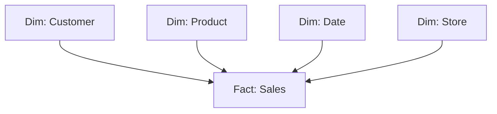

# Вопросы на собеседовании: `Data Warehousing`

Data warehouse — централизованное хранилище для **аналитики и BI**. Оптимизировано под **OLAP** (агрегации, joins, отчёты), не для transactional нагрузки. Современные DWH: **Snowflake**, **BigQuery**, **Redshift**, **Databricks**. На интервью спрашивают: dimensional modeling (Kimball), columnar storage, MPP, slowly changing dimensions.

## Полезные ссылки

### Официальная документация и авторитетные источники

- [Kimball Group Data Warehouse Design](https://www.kimballgroup.com/data-warehouse-business-intelligence-resources/)
- [Snowflake Documentation](https://docs.snowflake.com/)
- [BigQuery Documentation](https://cloud.google.com/bigquery/docs)
- [Amazon Redshift Documentation](https://docs.aws.amazon.com/redshift/)
- [Databricks Lakehouse](https://www.databricks.com/glossary/data-lakehouse)
- [The Data Warehouse Toolkit (Kimball book)](https://www.kimballgroup.com/data-warehouse-business-intelligence-resources/books/data-warehouse-dw-toolkit/)

## Содержание

- [Полезные ссылки](#полезные-ссылки)
- [See also](#see-also)

**Базовые понятия**
- [Q1. (!) Что такое data warehouse?](#q1--что-такое-data-warehouse)
- [Q2. (!) OLTP vs OLAP — разница?](#q2--oltp-vs-olap--разница)
- [Q3. (!) Зачем отдельный DWH, а не использовать OLTP БД?](#q3--зачем-отдельный-dwh-а-не-использовать-oltp-бд)

**Архитектура**
- [Q4. (!) Что такое MPP?](#q4--что-такое-mpp)
- [Q5. (!) Columnar storage — что и зачем?](#q5--columnar-storage--что-и-зачем)
- [Q6. Compression в DWH?](#q6-compression-в-dwh)
- [Q7. Vectorized execution?](#q7-vectorized-execution)

**Modeling — Kimball**
- [Q8. (!) Что такое dimensional modeling?](#q8--что-такое-dimensional-modeling)
- [Q9. (!) Star schema vs Snowflake schema?](#q9--star-schema-vs-snowflake-schema)
- [Q10. (!) Fact table — типы?](#q10--fact-table--типы)
- [Q11. (!) Dimension table — что и зачем?](#q11--dimension-table--что-и-зачем)
- [Q12. (!) Slowly Changing Dimensions (SCD) — типы?](#q12--slowly-changing-dimensions-scd--типы)

**Modeling — другие подходы**
- [Q13. Inmon (3NF) vs Kimball подход?](#q13-inmon-3nf-vs-kimball-подход)
- [Q14. Data Vault?](#q14-data-vault)
- [Q15. (!) One Big Table (OBT) и денормализация?](#q15--one-big-table-obt-и-денормализация)

**Современные DWH (cloud)**
- [Q16. (!) Snowflake — что особенного?](#q16--snowflake--что-особенного)
- [Q17. (!) BigQuery — особенности?](#q17--bigquery--особенности)
- [Q18. Redshift?](#q18-redshift)
- [Q19. Databricks SQL?](#q19-databricks-sql)
- [Q20. (!) ClickHouse — где применяется?](#q20--clickhouse--где-применяется)

**Loading данных (ETL/ELT)**
- [Q21. (!) ETL vs ELT?](#q21--etl-vs-elt)
- [Q22. CDC (Change Data Capture)?](#q22-cdc-change-data-capture)
- [Q23. Tools для loading (Fivetran, Airbyte, Stitch)?](#q23-tools-для-loading-fivetran-airbyte-stitch)

**Performance**
- [Q24. (!) Partitioning и clustering?](#q24--partitioning-и-clustering)
- [Q25. Materialized views?](#q25-materialized-views)
- [Q26. (!) Cost optimization в cloud DWH?](#q26--cost-optimization-в-cloud-dwh)

**BI и аналитика**
- [Q27. (!) Какие BI-инструменты используются?](#q27--какие-bi-инструменты-используются)
- [Q28. Semantic layer — что это?](#q28-semantic-layer--что-это)

**Эволюция**
- [Q29. (!) Modern Data Stack — что это?](#q29--modern-data-stack--что-это)
- [Q30. Data Warehouse vs Data Lake vs Lakehouse?](#q30-data-warehouse-vs-data-lake-vs-lakehouse)

## Q1. (!) Что такое data warehouse?

`Data warehouse (DWH)` — централизованная БД для **аналитики и репортинга**. Хранит **исторические** данные из разных источников, оптимизирована под сложные queries.

**Характеристики:**
- **Subject-oriented** (предметно-ориентированное) — организовано по бизнес-доменам (продажи, клиенты)
- **Integrated** (интегрированное) — данные из разных источников приведены к единому виду
- **Time-variant** (привязанное ко времени) — историчность (снимки во времени)
- **Non-volatile** (неизменяемое) — данные не меняются после записи (только добавление)

**Применения:** business intelligence (BI), дашборды для руководства, ad-hoc-анализ, feature engineering для ML.

## Q2. (!) OLTP vs OLAP — разница?

| Критерий | OLTP (transactional) | OLAP (analytical) |
|----------|---------------------|-------------------|
| Назначение | Обслуживать бизнес-операции | Анализировать бизнес |
| Операции | INSERT/UPDATE/DELETE отдельных строк | SELECT с агрегациями миллионов строк |
| Схема | Сильно нормализована (3NF) | Денормализована (star schema) |
| Хранение | Построчное (row-oriented) | Поколоночное (column-oriented) |
| Задержка | Миллисекунды | Секунды-минуты |
| Одновременных пользователей | Тысячи | Десятки-сотни |
| Размер | GB-TB | TB-PB |
| Примеры | PostgreSQL, MySQL, Oracle | Snowflake, BigQuery, Redshift |

**Почему разделяют:** одна БД не может хорошо делать оба — конфликт между пропускной способностью на запись (write throughput) и производительностью запросов.

## Q3. (!) Зачем отдельный DWH, а не использовать OLTP БД?

1. **Производительность** — OLTP не оптимизирован для агрегаций по миллиардам строк
2. **Не мешать production** — тяжёлые запросы на OLTP замедлят транзакции
3. **Историчность** — OLTP часто хранит текущее состояние, DWH — все изменения
4. **Интеграция** — DWH объединяет данные из 10+ источников
5. **Разные схемы** — OLTP нормализован, DWH денормализован
6. **Разные паттерны доступа** — у OLTP агрегации реже, у DWH чаще
7. **Разделение compute и storage** — cloud DWH масштабируется независимо от хранилища

## Q4. (!) Что такое MPP?

**MPP (Massively Parallel Processing)** — архитектура, где запросы распределяются на **много nodes**, работающих параллельно.

```
Query → Coordinator → splits into pieces → 100 worker nodes
                                              ↓
                                     каждый processes свою часть
                                              ↓
                                  Results aggregated → Result
```

**MPP-системы:** Redshift, Snowflake, BigQuery, Greenplum, Vertica, Teradata.

**Преимущества:**
- Линейное масштабирование (добавил узлы — запросы быстрее)
- Огромные объёмы данных (петабайты)
- Параллельные сканирования, joins, агрегации

**Контраст:** обычная БД (PostgreSQL, MySQL) обрабатывает запрос **на одном CPU** (или нескольких через parallel queries, но ограниченно).

## Q5. (!) Columnar storage — что и зачем?

**Построчное хранение (row-oriented, OLTP):**
```
Row 1: [id=1, name=Alice, age=30, country=US]
Row 2: [id=2, name=Bob,   age=25, country=DE]
```

**Поколоночное хранение (column-oriented, OLAP):**
```
Column id:      [1, 2, 3, ...]
Column name:    [Alice, Bob, ...]
Column age:     [30, 25, ...]
Column country: [US, DE, ...]
```

**Преимущества columnar:**
- **Сжатие в 10 раз лучше** (одинаковые типы лежат рядом)
- **Читаются только нужные колонки** (вместо целых строк)
- **Векторизованная обработка** — операции над колонками используют SIMD
- **Пропуск блоков** — метаданные min/max позволяют пропускать нерелевантные блоки

**Минусы:**
- Медленно для запросов по **одной строке** (нужно читать все колонки)
- Медленные обновления (нужно переписывать колонки)

**Используется:** файлы Parquet, ORC; Snowflake, BigQuery, Redshift, ClickHouse.

## Q6. Compression в DWH?

Колончатые форматы дают отличную компрессию:

- **Run-length encoding** — `AAAA → A×4`
- **Dictionary encoding** — словарь уникальных значений
- **Bit packing** — для чисел с малым range
- **Delta encoding** — для отсортированных чисел

В Parquet — **2-10x** меньше CSV. В ClickHouse — **10-50x**.

**Trade-off:** компрессия = CPU при чтении/записи. На modern hardware — оправдано.

## Q7. Vectorized execution?

Обработка **батчами** (1000+ строк за раз) вместо построчной обработки (row-by-row).

```
Row-by-row (slow):
  for each row:
    compute(row)

Vectorized (fast):
  for batch in batches:
    compute_batch(batch)  // SIMD-friendly, cache-friendly
```

**Преимущества:**
- Лучше использует кэши CPU
- Инструкции SIMD
- Минимизирует накладные расходы на интерпретацию

**Реализуют:** ClickHouse, DuckDB, Arrow, Snowflake, BigQuery.

## Q8. (!) Что такое dimensional modeling?

**Dimensional modeling** (Ralph Kimball) — подход к проектированию DWH, оптимизированный под **аналитические queries**.

**Идея:**
- **Fact tables** — числовые **измерения** бизнеса (продажи, клики, транзакции)
- **Dimension tables** — **контекст** (клиент, продукт, время, локация)



Это **star schema** — fact в центре, dimensions вокруг.

## Q9. (!) Star schema vs Snowflake schema?

**Star schema:**
- Fact в центре
- Dimensions вокруг
- Dimensions **денормализованы** (одна таблица на сущность)

**Snowflake schema:**
- То же, но dimensions **нормализованы** (разделены на иерархии)

```
Star:                       Snowflake:
Sales → Product             Sales → Product → Category
                                    Product → Brand
```

**Star** проще, быстрее queries (меньше joins).
**Snowflake** экономит место, но больше joins.

В **современных DWH** доминирует **star schema** (storage дешёвый, query speed важнее).

## Q10. (!) Fact table — типы?

| Тип | Описание | Пример |
|-----|----------|--------|
| **Transactional** | Одна строка на событие | Каждая продажа |
| **Periodic snapshot** | Снимок через регулярный интервал | Дневной баланс счёта |
| **Accumulating snapshot** | Отслеживает жизненный цикл | Заявка от подачи до закрытия |
| **Factless** | Только foreign keys (события без measures) | Студент посетил лекцию |

```sql
CREATE TABLE fact_sales (
    sale_id BIGINT,            -- degenerate dim
    customer_key INT,           -- FK to dim_customer
    product_key INT,            -- FK to dim_product
    date_key INT,               -- FK to dim_date
    store_key INT,              -- FK to dim_store
    quantity INT,               -- measure
    amount DECIMAL(10,2),       -- measure
    discount DECIMAL(10,2)      -- measure
);
```

## Q11. (!) Dimension table — что и зачем?

**Dimension** — таблица с **описательным контекстом**: атрибуты для группировки и фильтрации.

```sql
CREATE TABLE dim_customer (
    customer_key INT PRIMARY KEY,    -- surrogate key
    customer_id VARCHAR,              -- natural key
    name VARCHAR,
    email VARCHAR,
    country VARCHAR,
    age_group VARCHAR,
    valid_from DATE,
    valid_to DATE,
    is_current BOOLEAN
);
```

**Surrogate key** — синтетический PK (1, 2, 3, ...). Natural key использовать не стоит — он может меняться.

**Date dimension** — отдельная таблица с днями, месяцами, кварталами для удобной агрегации:

```sql
CREATE TABLE dim_date (
    date_key INT,
    date DATE,
    year INT,
    month INT,
    quarter INT,
    day_of_week INT,
    is_weekend BOOLEAN,
    fiscal_year INT,
    is_holiday BOOLEAN
);
```

## Q12. (!) Slowly Changing Dimensions (SCD) — типы?

**SCD** — стратегия обработки изменений в dimension:

| Тип | Что делает | Пример |
|-----|-----------|--------|
| **Type 0** | Не меняется (immutable) | Дата рождения |
| **Type 1** | Перезаписывает (без истории) | Исправление email |
| **Type 2** | Новая строка с valid_from/valid_to | Клиент переехал в другой город |
| **Type 3** | Дополнительные колонки (текущее + предыдущее) | Смена отдела |
| **Type 4** | Гибрид: dimension + таблица истории | — |
| **Type 6** | Комбинация 1+2+3 | Сложные случаи |

**Type 2 — самый частый**, сохраняет историю:

```
customer_key | customer_id | city    | valid_from | valid_to  | is_current
1            | C001        | London  | 2020-01-01 | 2023-06-01| false
2            | C001        | Berlin  | 2023-06-01 | NULL      | true
```

Для запроса текущего состояния — `WHERE is_current = true`. Историческая выборка — `WHERE valid_from <= '2022-01-01' AND (valid_to IS NULL OR valid_to > '2022-01-01')`.

dbt **`snapshot`** — реализация SCD Type 2.

## Q13. Inmon (3NF) vs Kimball подход?

**Bill Inmon (1990-е):**
- DWH в **3NF** (сильно нормализован)
- Сверху вниз (top-down): сначала enterprise DWH, потом data marts для отделов
- Сложно строить, легко расширять

**Ralph Kimball (1996):**
- DWH в **dimensional model** (star schema)
- Снизу вверх (bottom-up): data marts → conformed dimensions
- Легко строить, но может быть сложно поддерживать конформность

В **2024** доминирует Kimball. Inmon-стиль чаще встречается в **финансовом секторе** и legacy-инсталляциях.

## Q14. Data Vault?

**Data Vault (Dan Linstedt)** — гибридный подход:

- **Hub** — бизнес-ключи (customer_id, product_id)
- **Link** — связи между hubs (отношения)
- **Satellite** — атрибуты с историей

```
HUB_CUSTOMER (customer_id)
LINK_ORDER (customer_id, product_id)
SAT_CUSTOMER (customer_id, name, address, valid_from, valid_to)
SAT_ORDER (order_id, amount, date, ...)
```

**Преимущества:**
- Аудируемость (полная история)
- Гибкость к изменениям
- Хорошо подходит для compliance (GDPR, банкинг)

**Недостатки:**
- Много joins при запросах
- Сложнее писать
- Обычно нужен ещё один слой (Kimball marts) для BI

В **крупных enterprise** иногда используется как **слой enterprise DWH**, поверх которого — Kimball marts.

## Q15. (!) One Big Table (OBT) и денормализация?

С современными DWH (где storage дешёвый) появился тренд **One Big Table**:

- Одна **широкая** таблица со всеми атрибутами
- Нет joins при запросе
- Огромное сжатие (columnar storage)

```sql
CREATE TABLE fact_sales_wide AS
SELECT
    s.*,                  -- все факты
    c.name AS customer_name,
    c.country AS customer_country,
    p.name AS product_name,
    p.category AS product_category,
    ...
FROM fact_sales s
JOIN dim_customer c ON ...
JOIN dim_product p ON ...
```

**Преимущества:**
- Простые запросы (нет joins)
- Быстрее (один scan)
- BI-инструменты проще конфигурировать

**Минусы:**
- Хранилище больше (но дёшево)
- ETL сложнее (нужно поддерживать денормализацию)
- Сложно обновлять историю

В **2024** OBT популярен для BI-слоя (последний слой dbt marts).

## Q16. (!) Snowflake — что особенного?

**Snowflake** (2012) — облачный DWH с уникальной архитектурой:

- **Разделение storage и compute** — масштабируются независимо
- **Multi-cluster compute** — параллельные warehouses на одних данных
- **Auto-scaling, auto-suspend** — платишь только за фактическое использование
- **Time Travel** — запросы к прошлым версиям данных
- **Zero-copy cloning** — мгновенные копии для dev/test
- **Multi-cloud** (AWS, Azure, GCP)
- **Нативная поддержка semi-structured данных** (JSON, Avro, XML, Parquet)

```sql
-- Time travel
SELECT * FROM users AT (TIMESTAMP => '2025-04-15 10:00:00');

-- Zero-copy clone
CREATE TABLE users_dev CLONE users;

-- Auto-suspend warehouse через 5 минут idle
ALTER WAREHOUSE my_wh SET AUTO_SUSPEND = 300;
```

В **2024** — рыночный лидер среди cloud DWH.

## Q17. (!) BigQuery — особенности?

**BigQuery** (2010) от Google:

- **Serverless** — нет warehouses, которыми надо управлять
- **Pay per query** (по объёму сканированных байт) или flat-rate
- **Petabyte scale** — терабайты/петабайты естественны
- **Встроенный ML** (BigQuery ML) — `CREATE MODEL ...` прямо в SQL
- **Архитектура Dremel** — параллельное выполнение
- **Тесно интегрирован** с GCP (Cloud Storage, Pub/Sub, ...)

```sql
-- Train ML модель прямо в SQL
CREATE MODEL `my_dataset.my_model`
OPTIONS(model_type='linear_reg') AS
SELECT label, feature1, feature2 FROM training_data;
```

**Подвох:** оплата за сканированные байты (pay-per-byte-scanned). Без partitioning/clustering можно случайно «сжечь» $1000 на одном запросе. Используй `LIMIT`, `--dry-run`.

## Q18. Redshift?

**Amazon Redshift** (2013) — старейший cloud DWH (от Amazon).

**Особенности:**
- **MPP** (параллельная обработка на узлах кластера)
- Provisioned (нужно выбрать размер узла)
- **Redshift Serverless** (с 2022) — оплата по факту использования
- Тесно связан с экосистемой AWS (S3, Glue, EMR, ...)
- Хорошо подходит для legacy-архитектур, завязанных на AWS

В **2024** Redshift теряет долю в пользу Snowflake/BigQuery. Redshift Serverless — попытка догнать.

## Q19. Databricks SQL?

**Databricks** — изначально Spark-платформа, выросла в концепт **lakehouse**.

**Databricks SQL:**
- DWH-нагрузка поверх **Delta Lake** (на S3/ADLS)
- Движок **Photon** (векторизованное выполнение на C++)
- Unity Catalog для governance
- ML + SQL в одной платформе

Лучше всех закрывает **lakehouse** (DWH + Data Lake вместе).

## Q20. (!) ClickHouse — где применяется?

**ClickHouse** — open-source поколоночный DWH от Yandex.

**Особенности:**
- **Очень быстрый** для аналитических запросов (особенно агрегаций по одной таблице)
- Self-hosted или managed (ClickHouse Cloud)
- **Не cloud-native** в традиционном смысле (нет разделения storage/compute)
- Огромное сжатие и vectorized execution

**Применения:**
- **Real-time-аналитика** на потоках событий (clickstream, IoT)
- **Time-series** (логи, метрики, observability)
- **Маркетинговая аналитика** (быстрые ad-hoc запросы)

**Не подходит для:** сложных joins (хуже Snowflake), частых обновлений, транзакций.

В **2024** ClickHouse — ультрабыстрый для read-heavy аналитических нагрузок.

## Q21. (!) ETL vs ELT?

| Подход | Где трансформация | Когда |
|--------|---------------|-------|
| **ETL** | Внешний инструмент (Spark, Informatica) | Legacy, дорогие warehouses |
| **ELT** | Внутри warehouse (SQL) | Современные cloud DWH (дешёвый compute) |

```
ETL: Source → Transform → Warehouse
ELT: Source → Warehouse → Transform (внутри)
```

**ELT** доминирует с появлением Snowflake/BigQuery — compute дешёвый, нет смысла платить за него отдельно.

dbt — символ эпохи ELT.

## Q22. CDC (Change Data Capture)?

**CDC** — захват изменений в OLTP-базе и репликация в DWH.

**Подходы:**
- **Trigger-based** (на триггерах) — медленно
- **Log-based** (по логу) — читает WAL/binlog (logical replication в PostgreSQL, binlog в MySQL) — лучший вариант
- **Polling** (опрос) — `WHERE updated_at > last_sync` — простой, но не ловит удаления

**Инструменты:**
- Debezium (open-source)
- Fivetran (managed)
- Airbyte
- Striim
- AWS DMS

CDC даёт **near-real-time** репликацию — задержка в секундах, а не в часах.

## Q23. Tools для loading (Fivetran, Airbyte, Stitch)?

**Managed:**
- **Fivetran** — самый популярный, дорогой, простая настройка
- **Stitch** (Talend) — классика
- **Airbyte** — open-source-альтернатива (есть managed-версия)
- **Hevo, Matillion** — прочие

**Open-source:**
- **Airbyte** — самый активный
- **Meltano** (от GitLab)
- **Singer** taps/targets

**Поток данных:**
```
Source (Salesforce, Stripe, Postgres, ...)
    ↓ Fivetran/Airbyte
Warehouse (Snowflake, BigQuery, ...)
    ↓ dbt
Marts → BI tools
```

В **modern data stack** связка fivetran/airbyte → dbt — стандартная.

## Q24. (!) Partitioning и clustering?

**Partitioning** — разделение таблицы на физические части по колонке (обычно по дате).

```sql
-- BigQuery
CREATE TABLE sales
PARTITION BY DATE(sale_date)
AS SELECT * FROM source;

-- Snowflake auto-partitions через micro-partitions
```

**Clustering / Sort key** — порядок строк внутри partition для оптимизации сканирования.

```sql
CREATE TABLE sales
PARTITION BY DATE(sale_date)
CLUSTER BY (customer_id, product_id)
AS ...
```

**Эффект:**
- **Partition pruning** — сканирование только нужных partition (1 день вместо года)
- **Clustering** — данные внутри partition отсортированы → range-запросы быстрее

Без partitioning запросы могут стоить **в 100 раз дороже**.

## Q25. Materialized views?

**Materialized view** — заранее вычисленный результат запроса, хранится как таблица.

```sql
CREATE MATERIALIZED VIEW daily_revenue AS
SELECT date_trunc('day', order_date) AS day,
       SUM(amount) AS revenue
FROM orders
GROUP BY 1;
```

**Плюсы:**
- Быстрое чтение (всё вычислено заранее)
- Автоматическое обновление при изменениях в source

**Минусы:**
- Затраты на хранение
- Задержка обновления (обычно асинхронное)
- Не все запросы поддерживаются для MV (ограничения у каждого warehouse)

В **Snowflake/BigQuery** — MV с авто-обновлением. В **Redshift** — обновление вручную.

## Q26. (!) Cost optimization в cloud DWH?

1. **Partitioning + clustering** — запрашивать только нужные данные
2. **Auto-suspend** warehouses (Snowflake) — не платить за простой
3. **Right-sizing** — не использовать XL-warehouse для мелких запросов
4. **Оптимизация запросов** — `LIMIT`, без `SELECT *`, фильтры как можно раньше
5. **Материализовать часто используемое** — вместо пересчёта каждый раз
6. **Result cache** — Snowflake/BQ кэшируют идентичные запросы бесплатно
7. **Reserved capacity** vs on-demand (для предсказуемой нагрузки)
8. **Cluster keys** — оптимизировать под частые паттерны
9. **Compression** — подбирать оптимальные codecs
10. **Мониторинг** — `QUERY_HISTORY`, выявление дорогих запросов

Ошибка в `WHERE` → может стоить **$10K за один запрос** в pay-per-byte BigQuery.

## Q27. (!) Какие BI-инструменты используются?

**Современные BI:**
- **Looker** (Google) — semantic layer на LookML
- **Tableau** (Salesforce) — самый популярный
- **Power BI** (Microsoft) — для стека Microsoft
- **Metabase** — open-source
- **Superset** (Apache) — open-source, мощный
- **Mode, Hex, Sigma** — современные, SQL-first
- **Lightdash** — open-source с интеграцией dbt

**dbt + Looker / Lightdash** — частый стек для analytics engineering.

## Q28. Semantic layer — что это?

**Semantic layer** — **единый источник истины** для метрик. Определяешь один раз — используется во всех BI-инструментах.

```yaml
metric:
  name: monthly_revenue
  type: simple
  measure: sum(orders.amount)
  filter: orders.status = 'paid'
```

Без semantic layer каждый BI-дашборд может считать «revenue» по-своему → конфликты в отчётах.

**Реализации:**
- **dbt Semantic Layer** (с 2023)
- **Looker LookML** (классика)
- **Cube.js**
- **MetricFlow** (приобретён dbt)

## Q29. (!) Modern Data Stack — что это?

**Modern Data Stack** (с 2018) — современный набор инструментов:

```
Source → Loader (Fivetran/Airbyte) → Warehouse (Snowflake/BQ)
                                              ↓
                            Transformer (dbt) — semantic layer
                                              ↓
                                     BI (Looker/Tableau/Lightdash)
                                              ↓
                                     Reverse ETL (Hightouch/Census)
                                              ↓
                                     Operational tools (Salesforce, ...)
```

**Принципы:**
- **Cloud-native** — managed-сервисы
- **ELT** вместо ETL
- **SQL-first** — минимум Python
- **Composable** — лучшие-в-классе инструменты, а не одна мега-платформа

## Q30. Data Warehouse vs Data Lake vs Lakehouse?

Подробнее — в [Data Lake / Lakehouse](data-lake-lakehouse-interview.md).

**Кратко:**
- **DWH** — структурированные данные, schema-on-write, дорогое хранилище, быстрые запросы
- **Data Lake** — сырые данные, schema-on-read, дешёвое хранилище, медленные запросы
- **Lakehouse** — возможности Lake + DWH (Delta, Iceberg, Hudi)

В **2024** — конвергенция. Snowflake может работать с external tables (S3), Databricks Lakehouse объединяет оба подхода.

---

## See also

- [Data Lake / Lakehouse](data-lake-lakehouse-interview.md) — alternative storage
- [dbt](dbt-interview.md) — главный transformation tool для DWH
- [Apache Spark](apache-spark-interview.md) — для ETL и processing
- [Apache Airflow](apache-airflow-interview.md) — orchestration
- [PostgreSQL](../databases/postgresql-interview.md) — пример OLTP
- [SQL](../databases/sql-interview.md) — основа DWH
- [Database Architecture](../databases/database-architecture-interview.md) — концепции
- [Stream Processing](stream-processing-interview.md) — vs batch DWH
- [Микросервисы](../architecture/microservices-interview.md) — operational vs analytical
- [Caching](../architecture/caching-strategies-interview.md) — для acceleration BI
