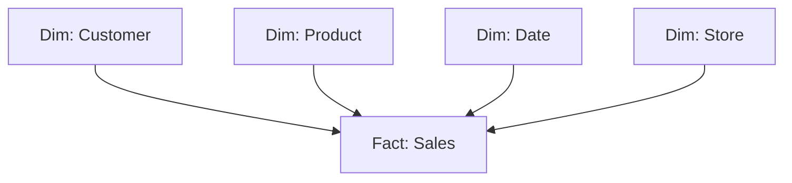

# Вопросы на собеседовании: `Data Warehousing`

Data warehouse — централизованное хранилище для **аналитики и BI**. Оптимизировано под **OLAP** (агрегации, joins, отчёты), не для transactional нагрузки. Современные DWH: **Snowflake**, **BigQuery**, **Redshift**, **Databricks**. На интервью спрашивают: dimensional modeling (Kimball), columnar storage, MPP, slowly changing dimensions.

Дата последнего обновления: 2026-04-18

## Полезные ссылки

### Официальная документация и авторитетные источники

- [Kimball Group Data Warehouse Design](https://www.kimballgroup.com/data-warehouse-business-intelligence-resources/)
- [Snowflake Documentation](https://docs.snowflake.com/)
- [BigQuery Documentation](https://cloud.google.com/bigquery/docs)
- [Amazon Redshift Documentation](https://docs.aws.amazon.com/redshift/)
- [Databricks Lakehouse](https://www.databricks.com/glossary/data-lakehouse)
- [The Data Warehouse Toolkit (Kimball book)](https://www.kimballgroup.com/data-warehouse-business-intelligence-resources/books/data-warehouse-dw-toolkit/)

## Содержание

- [Полезные ссылки](#полезные-ссылки)
- [See also](#see-also)

**Базовые понятия**
- [Q1. (!) Что такое data warehouse?](#q1--что-такое-data-warehouse)
- [Q2. (!) OLTP vs OLAP — разница?](#q2--oltp-vs-olap--разница)
- [Q3. (!) Зачем отдельный DWH, а не использовать OLTP БД?](#q3--зачем-отдельный-dwh-а-не-использовать-oltp-бд)

**Архитектура**
- [Q4. (!) Что такое MPP?](#q4--что-такое-mpp)
- [Q5. (!) Columnar storage — что и зачем?](#q5--columnar-storage--что-и-зачем)
- [Q6. Compression в DWH?](#q6-compression-в-dwh)
- [Q7. Vectorized execution?](#q7-vectorized-execution)

**Modeling — Kimball**
- [Q8. (!) Что такое dimensional modeling?](#q8--что-такое-dimensional-modeling)
- [Q9. (!) Star schema vs Snowflake schema?](#q9--star-schema-vs-snowflake-schema)
- [Q10. (!) Fact table — типы?](#q10--fact-table--типы)
- [Q11. (!) Dimension table — что и зачем?](#q11--dimension-table--что-и-зачем)
- [Q12. (!) Slowly Changing Dimensions (SCD) — типы?](#q12--slowly-changing-dimensions-scd--типы)

**Modeling — другие подходы**
- [Q13. Inmon (3NF) vs Kimball подход?](#q13-inmon-3nf-vs-kimball-подход)
- [Q14. Data Vault?](#q14-data-vault)
- [Q15. (!) One Big Table (OBT) и денормализация?](#q15--one-big-table-obt-и-денормализация)

**Современные DWH (cloud)**
- [Q16. (!) Snowflake — что особенного?](#q16--snowflake--что-особенного)
- [Q17. (!) BigQuery — особенности?](#q17--bigquery--особенности)
- [Q18. Redshift?](#q18-redshift)
- [Q19. Databricks SQL?](#q19-databricks-sql)
- [Q20. (!) ClickHouse — где применяется?](#q20--clickhouse--где-применяется)

**Loading данных (ETL/ELT)**
- [Q21. (!) ETL vs ELT?](#q21--etl-vs-elt)
- [Q22. CDC (Change Data Capture)?](#q22-cdc-change-data-capture)
- [Q23. Tools для loading (Fivetran, Airbyte, Stitch)?](#q23-tools-для-loading-fivetran-airbyte-stitch)

**Performance**
- [Q24. (!) Partitioning и clustering?](#q24--partitioning-и-clustering)
- [Q25. Materialized views?](#q25-materialized-views)
- [Q26. (!) Cost optimization в cloud DWH?](#q26--cost-optimization-в-cloud-dwh)

**BI и аналитика**
- [Q27. (!) Какие BI-инструменты используются?](#q27--какие-bi-инструменты-используются)
- [Q28. Semantic layer — что это?](#q28-semantic-layer--что-это)

**Эволюция**
- [Q29. (!) Modern Data Stack — что это?](#q29--modern-data-stack--что-это)
- [Q30. Data Warehouse vs Data Lake vs Lakehouse?](#q30-data-warehouse-vs-data-lake-vs-lakehouse)

## Q1. (!) Что такое data warehouse?

`Data warehouse (DWH)` — централизованная БД для **аналитики и репортинга**. Хранит **исторические** данные из разных источников, оптимизирована под сложные queries.

**Характеристики:**
- **Subject-oriented** — организовано по бизнес-доменам (sales, customers)
- **Integrated** — данные из разных источников приведены к единому виду
- **Time-variant** — историчность (снапшоты во времени)
- **Non-volatile** — данные не меняются после записи (only append)

**Применения:** business intelligence (BI), executive dashboards, ad-hoc analysis, ML feature engineering.

## Q2. (!) OLTP vs OLAP — разница?

| Критерий | OLTP (transactional) | OLAP (analytical) |
|----------|---------------------|-------------------|
| Назначение | Run the business | Analyze the business |
| Operations | INSERT/UPDATE/DELETE single rows | SELECT с агрегациями миллионов строк |
| Schema | Highly normalized (3NF) | Denormalized (star schema) |
| Storage | Row-oriented | Column-oriented |
| Latency | Milliseconds | Seconds-minutes |
| Concurrent users | Тысячи | Десятки-сотни |
| Размер | GB-TB | TB-PB |
| Examples | PostgreSQL, MySQL, Oracle | Snowflake, BigQuery, Redshift |

**Почему разделяют:** одна БД не может хорошо делать оба — конфликт между write throughput и query performance.

## Q3. (!) Зачем отдельный DWH, а не использовать OLTP БД?

1. **Performance** — OLTP не оптимизирован для агрегаций по миллиардам строк
2. **Не мешать production** — heavy queries на OLTP замедлят transactions
3. **Историчность** — OLTP часто хранит current state, DWH — все изменения
4. **Integration** — DWH объединяет данные из 10+ источников
5. **Different schemas** — OLTP normalized, DWH denormalized
6. **Different access patterns** — OLTP реже агрегаций, DWH чаще
7. **Compute separation** — cloud DWH масштабируется независимо от storage

## Q4. (!) Что такое MPP?

**MPP (Massively Parallel Processing)** — архитектура, где запросы распределяются на **много nodes**, работающих параллельно.

```
Query → Coordinator → splits into pieces → 100 worker nodes
                                              ↓
                                     каждый processes свою часть
                                              ↓
                                  Results aggregated → Result
```

**MPP-системы:** Redshift, Snowflake, BigQuery, Greenplum, Vertica, Teradata.

**Преимущества:**
- Linear scaling (добавил nodes — быстрее запросы)
- Огромные данные (PBs)
- Параллельные scans, joins, aggregations

**Контраст:** обычная БД (PostgreSQL, MySQL) обрабатывает запрос **на одном CPU** (или нескольких через parallel queries, но ограниченно).

## Q5. (!) Columnar storage — что и зачем?

**Row-oriented (OLTP):**
```
Row 1: [id=1, name=Alice, age=30, country=US]
Row 2: [id=2, name=Bob,   age=25, country=DE]
```

**Column-oriented (OLAP):**
```
Column id:      [1, 2, 3, ...]
Column name:    [Alice, Bob, ...]
Column age:     [30, 25, ...]
Column country: [US, DE, ...]
```

**Преимущества columnar:**
- **Compression в 10x лучше** (одинаковые типы рядом)
- **Reads только нужных колонок** (вместо целых rows)
- **Vectorized processing** — операции на колоннах используют SIMD
- **Skip blocks** — min/max metadata позволяет пропускать irrelevant blocks

**Минусы:**
- Slow для **single row** queries (нужно читать все columns)
- Slow updates (нужно переписывать columns)

**Используется:** Parquet, ORC файлы; Snowflake, BigQuery, Redshift, ClickHouse.

## Q6. Compression в DWH?

Колончатые форматы дают отличную компрессию:

- **Run-length encoding** — `AAAA → A×4`
- **Dictionary encoding** — словарь уникальных значений
- **Bit packing** — для чисел с малым range
- **Delta encoding** — для отсортированных чисел

В Parquet — **2-10x** меньше CSV. В ClickHouse — **10-50x**.

**Trade-off:** компрессия = CPU при чтении/записи. На modern hardware — оправдано.

## Q7. Vectorized execution?

Обработка **batches** (1000+) строк за раз, вместо row-by-row.

```
Row-by-row (slow):
  for each row:
    compute(row)

Vectorized (fast):
  for batch in batches:
    compute_batch(batch)  // SIMD-friendly, cache-friendly
```

**Преимущества:**
- Лучше использует CPU caches
- SIMD instructions
- Минимизирует overhead интерпретации

**Реализуют:** ClickHouse, DuckDB, Arrow, Snowflake, BigQuery.

## Q8. (!) Что такое dimensional modeling?

**Dimensional modeling** (Ralph Kimball) — подход к проектированию DWH, оптимизированный под **аналитические queries**.

**Идея:**
- **Fact tables** — числовые **measurements** бизнеса (sales, clicks, transactions)
- **Dimension tables** — **контекст** (customer, product, time, location)



Это **star schema** — fact в центре, dimensions вокруг.

## Q9. (!) Star schema vs Snowflake schema?

**Star schema:**
- Fact в центре
- Dimensions вокруг
- Dimensions **денормализованы** (одна table per concept)

**Snowflake schema:**
- То же, но dimensions **нормализованы** (разделены на иерархии)

```
Star:                       Snowflake:
Sales → Product             Sales → Product → Category
                                    Product → Brand
```

**Star** проще, быстрее queries (меньше joins).
**Snowflake** экономит место, но больше joins.

В **современных DWH** доминирует **star schema** (storage дешёвый, query speed важнее).

## Q10. (!) Fact table — типы?

| Тип | Описание | Пример |
|-----|----------|--------|
| **Transactional** | Одна строка на event | Каждая продажа |
| **Periodic snapshot** | Snapshot на регулярный интервал | Дневной баланс счёта |
| **Accumulating snapshot** | Track lifecycle | Заявка от подачи до закрытия |
| **Factless** | Только foreign keys (события без measures) | Студент посетил лекцию |

```sql
CREATE TABLE fact_sales (
    sale_id BIGINT,            -- degenerate dim
    customer_key INT,           -- FK to dim_customer
    product_key INT,            -- FK to dim_product
    date_key INT,               -- FK to dim_date
    store_key INT,              -- FK to dim_store
    quantity INT,               -- measure
    amount DECIMAL(10,2),       -- measure
    discount DECIMAL(10,2)      -- measure
);
```

## Q11. (!) Dimension table — что и зачем?

**Dimension** — таблица с **descriptive context**: атрибуты для группировки и фильтрации.

```sql
CREATE TABLE dim_customer (
    customer_key INT PRIMARY KEY,    -- surrogate key
    customer_id VARCHAR,              -- natural key
    name VARCHAR,
    email VARCHAR,
    country VARCHAR,
    age_group VARCHAR,
    valid_from DATE,
    valid_to DATE,
    is_current BOOLEAN
);
```

**Surrogate key** — синтетический PK (1, 2, 3, ...). Не использовать natural key — может меняться.

**Date dimension** — отдельная таблица с днями, месяцами, кварталами для удобной агрегации:

```sql
CREATE TABLE dim_date (
    date_key INT,
    date DATE,
    year INT,
    month INT,
    quarter INT,
    day_of_week INT,
    is_weekend BOOLEAN,
    fiscal_year INT,
    is_holiday BOOLEAN
);
```

## Q12. (!) Slowly Changing Dimensions (SCD) — типы?

**SCD** — стратегия обработки изменений в dimension:

| Тип | Что делает | Пример |
|-----|-----------|--------|
| **Type 0** | Не меняется (immutable) | Birth date |
| **Type 1** | Перезаписывает (no history) | Email correction |
| **Type 2** | Новая строка с valid_from/valid_to | Customer переехал в другой city |
| **Type 3** | Дополнительные columns (current + previous) | Department change |
| **Type 4** | Hybrid: dimension + history table | — |
| **Type 6** | Combination of 1+2+3 | Advanced cases |

**Type 2 — самый частый**, сохраняет историю:

```
customer_key | customer_id | city    | valid_from | valid_to  | is_current
1            | C001        | London  | 2020-01-01 | 2023-06-01| false
2            | C001        | Berlin  | 2023-06-01 | NULL      | true
```

При запросе current — `WHERE is_current = true`. Историческая выборка — `WHERE valid_from <= '2022-01-01' AND (valid_to IS NULL OR valid_to > '2022-01-01')`.

dbt **`snapshot`** — реализация SCD Type 2.

## Q13. Inmon (3NF) vs Kimball подход?

**Bill Inmon (1990s):**
- DWH в **3NF** (highly normalized)
- Top-down: сначала enterprise DWH, потом data marts для отделов
- Сложно строить, легко расширять

**Ralph Kimball (1996):**
- DWH в **dimensional model** (star schema)
- Bottom-up: data marts → conformed dimensions
- Легко строить, может быть сложно поддерживать конформность

В **2024** Kimball доминирует. Inmon-стиль чаще встречается в **financial services** и legacy installations.

## Q14. Data Vault?

**Data Vault (Dan Linstedt)** — гибридный подход:

- **Hub** — business keys (customer_id, product_id)
- **Link** — связи между hubs (relationships)
- **Satellite** — атрибуты с историей

```
HUB_CUSTOMER (customer_id)
LINK_ORDER (customer_id, product_id)
SAT_CUSTOMER (customer_id, name, address, valid_from, valid_to)
SAT_ORDER (order_id, amount, date, ...)
```

**Преимущества:**
- Auditable (full history)
- Гибкое к изменениям
- Хорошо для compliance (GDPR, banking)

**Недостатки:**
- Много joins для queries
- Сложнее писать
- Обычно нужен ещё один слой (Kimball marts) для BI

В **enterprises** иногда используется как **enterprise DWH layer**, поверх — Kimball marts.

## Q15. (!) One Big Table (OBT) и денормализация?

С modern DWH (где storage дешёвый) — тренд **One Big Table**:

- Одна **широкая** таблица со всеми атрибутами
- Нет joins при query
- Огромная компрессия (columnar storage)

```sql
CREATE TABLE fact_sales_wide AS
SELECT
    s.*,                  -- все факты
    c.name AS customer_name,
    c.country AS customer_country,
    p.name AS product_name,
    p.category AS product_category,
    ...
FROM fact_sales s
JOIN dim_customer c ON ...
JOIN dim_product p ON ...
```

**Преимущества:**
- Простые queries (нет joins)
- Быстрее (один scan)
- BI tools проще конфигурировать

**Минусы:**
- Storage больше (но cheap)
- ETL сложнее (нужно поддерживать денормализацию)
- Update history complex

В **2024** OBT популярен для BI слоя (последний слой dbt marts).

## Q16. (!) Snowflake — что особенного?

**Snowflake** (2012) — облачный DWH с уникальной архитектурой:

- **Decoupled storage and compute** — масштабируются независимо
- **Multi-cluster compute** — параллельные warehouses на одних данных
- **Auto-scaling, auto-suspend** — платишь только за usage
- **Time Travel** — query прошлые версии данных
- **Zero-copy cloning** — мгновенные копии для dev/test
- **Multi-cloud** (AWS, Azure, GCP)
- **Native semi-structured** (JSON, Avro, XML, Parquet)

```sql
-- Time travel
SELECT * FROM users AT (TIMESTAMP => '2025-04-15 10:00:00');

-- Zero-copy clone
CREATE TABLE users_dev CLONE users;

-- Auto-suspend warehouse через 5 минут idle
ALTER WAREHOUSE my_wh SET AUTO_SUSPEND = 300;
```

В **2024** — рыночный лидер cloud DWH.

## Q17. (!) BigQuery — особенности?

**BigQuery** (2010) от Google:

- **Serverless** — нет warehouses to manage
- **Pay per query** (по сканированным bytes) или flat-rate
- **Petabyte scale** — terra/peta-bytes естественно
- **Built-in ML** (BigQuery ML) — `CREATE MODEL ...` SQL
- **Dremel architecture** — параллельное выполнение
- **Тесно интегрирован** с GCP (Cloud Storage, Pub/Sub, ...)

```sql
-- Train ML модель прямо в SQL
CREATE MODEL `my_dataset.my_model`
OPTIONS(model_type='linear_reg') AS
SELECT label, feature1, feature2 FROM training_data;
```

**Подвох:** pay-per-byte-scanned. Без partitioning/clustering можно случайно "сжечь" $1000 на одном запросе. Используй `LIMIT`, `--dry-run`.

## Q18. Redshift?

**Amazon Redshift** (2013) — старейший cloud DWH (от Amazon).

**Особенности:**
- **MPP** (parallel processing на cluster nodes)
- Provisioned (нужно выбрать node size)
- **Redshift Serverless** (с 2022) — pay-per-use
- Тесно с AWS экосистемой (S3, Glue, EMR, ...)
- Хорошо для legacy AWS-центрированных архитектур

В **2024** Redshift теряет долю Snowflake/BigQuery. Redshift Serverless — попытка догнать.

## Q19. Databricks SQL?

**Databricks** — изначально Spark платформа, расширилась в **lakehouse** концепт.

**Databricks SQL:**
- DWH workload поверх **Delta Lake** (на S3/ADLS)
- **Photon** engine (vectorized C++ execution)
- Unity Catalog для governance
- ML + SQL в одной платформе

Лучше всех закрывает **lakehouse** (DWH + Data Lake вместе).

## Q20. (!) ClickHouse — где применяется?

**ClickHouse** — open-source columnar DWH от Yandex.

**Особенности:**
- **Очень быстрый** для analytical queries (особенно single-table aggregations)
- Self-hosted или managed (ClickHouse Cloud)
- **Не cloud-native** в традиционном смысле (нет separated storage/compute)
- Огромная компрессия и vectorized execution

**Применения:**
- **Real-time analytics** на event streams (clickstream, IoT)
- **Time-series** (logging, metrics, observability)
- **Marketing analytics** (быстрые ad-hoc queries)

**Не для:** complex joins (хуже Snowflake), частые updates, transactions.

В **2024** ClickHouse — ультра-быстрый для read-heavy analytical workloads.

## Q21. (!) ETL vs ELT?

| Подход | Где transform | Когда |
|--------|---------------|-------|
| **ETL** | Внешний tool (Spark, Informatica) | Legacy, expensive warehouses |
| **ELT** | Внутри warehouse (SQL) | Modern cloud DWH (cheap compute) |

```
ETL: Source → Transform → Warehouse
ELT: Source → Warehouse → Transform (внутри)
```

**ELT** доминирует с появлением Snowflake/BigQuery — compute дешёвый, нет смысла платить отдельно.

dbt — символ ELT эры.

## Q22. CDC (Change Data Capture)?

**CDC** — захват изменений в OLTP БД и реплика в DWH.

**Подходы:**
- **Trigger-based** — медленно
- **Log-based** — читает WAL/binlog (PostgreSQL logical replication, MySQL binlog) — лучше всего
- **Polling** — `WHERE updated_at > last_sync` — простой, но не ловит deletes

**Tools:**
- Debezium (open-source)
- Fivetran (managed)
- Airbyte
- Striim
- AWS DMS

CDC даёт **near-real-time** репликацию — задержка секунды, не часы.

## Q23. Tools для loading (Fivetran, Airbyte, Stitch)?

**Managed:**
- **Fivetran** — самый популярный, дорогой, simple setup
- **Stitch** (Talend) — классика
- **Airbyte** — open-source альтернатива (есть managed версия)
- **Hevo, Matillion** — другие

**Open-source:**
- **Airbyte** — самый активный
- **Meltano** (от GitLab)
- **Singer** taps/targets

**Workflow:**
```
Source (Salesforce, Stripe, Postgres, ...)
    ↓ Fivetran/Airbyte
Warehouse (Snowflake, BigQuery, ...)
    ↓ dbt
Marts → BI tools
```

В **modern data stack** — fivetran/airbyte → dbt — стандартная связка.

## Q24. (!) Partitioning и clustering?

**Partitioning** — разделение таблицы на физические parts по column (обычно date).

```sql
-- BigQuery
CREATE TABLE sales
PARTITION BY DATE(sale_date)
AS SELECT * FROM source;

-- Snowflake auto-partitions через micro-partitions
```

**Clustering / Sort key** — порядок строк внутри partition для оптимизации скана.

```sql
CREATE TABLE sales
PARTITION BY DATE(sale_date)
CLUSTER BY (customer_id, product_id)
AS ...
```

**Эффект:**
- **Partition pruning** — скан только нужных partition (1 день вместо года)
- **Clustering** — внутри partition data сортируется → range queries быстрее

Без partitioning queries могут стоить **в 100x больше**.

## Q25. Materialized views?

**Materialized view** — pre-computed result query, хранится как таблица.

```sql
CREATE MATERIALIZED VIEW daily_revenue AS
SELECT date_trunc('day', order_date) AS day,
       SUM(amount) AS revenue
FROM orders
GROUP BY 1;
```

**Плюсы:**
- Быстрые reads (заранее вычислено)
- Автоматическое обновление при изменениях source

**Минусы:**
- Storage cost
- Latency обновления (обычно asynchronous)
- Не все queries поддерживаются для MV (limitations per warehouse)

В **Snowflake/BigQuery** — auto-refreshing MVs. В **Redshift** — manual refresh.

## Q26. (!) Cost optimization в cloud DWH?

1. **Partitioning + clustering** — query только нужные данные
2. **Auto-suspend** warehouses (Snowflake) — не платить за idle
3. **Right-sizing** — не использовать XL warehouse для маленьких queries
4. **Query optimization** — `LIMIT`, не `SELECT *`, фильтры рано
5. **Materialize часто-используемое** — vs пересчёт каждый раз
6. **Result cache** — Snowflake/BQ кэшируют идентичные queries бесплатно
7. **Reserved capacity** vs on-demand (для предсказуемого usage)
8. **Cluster keys** — оптимизировать для частых паттернов
9. **Compression** — выбирать оптимальные codecs
10. **Monitoring** — `QUERY_HISTORY`, идентификация expensive queries

Ошибка в `WHERE` clause → может стоить **$10K за один запрос** в pay-per-byte BigQuery.

## Q27. (!) Какие BI-инструменты используются?

**Modern BI:**
- **Looker** (Google) — LookML semantic layer
- **Tableau** (Salesforce) — самый популярный
- **Power BI** (Microsoft) — для MS-стека
- **Metabase** — open-source
- **Superset** (Apache) — open-source, мощный
- **Mode, Hex, Sigma** — modern, SQL-first
- **Lightdash** — open-source с dbt integration

**dbt + Looker / Lightdash** — частый стек для analytics engineering.

## Q28. Semantic layer — что это?

**Semantic layer** — **single source of truth** для метрик. Определяешь раз — используется во всех BI tools.

```yaml
metric:
  name: monthly_revenue
  type: simple
  measure: sum(orders.amount)
  filter: orders.status = 'paid'
```

Без semantic layer — каждый BI dashboard может считать "revenue" по-своему → конфликты в отчётах.

**Реализации:**
- **dbt Semantic Layer** (с 2023)
- **Looker LookML** (классика)
- **Cube.js**
- **MetricFlow** (acquired by dbt)

## Q29. (!) Modern Data Stack — что это?

**Modern Data Stack** (с 2018) — современный набор tools:

```
Source → Loader (Fivetran/Airbyte) → Warehouse (Snowflake/BQ)
                                              ↓
                            Transformer (dbt) — semantic layer
                                              ↓
                                     BI (Looker/Tableau/Lightdash)
                                              ↓
                                     Reverse ETL (Hightouch/Census)
                                              ↓
                                     Operational tools (Salesforce, ...)
```

**Принципы:**
- **Cloud-native** — managed services
- **ELT** instead of ETL
- **SQL-first** — minimal Python
- **Composable** — best-in-class tools, не one mega-platform

## Q30. Data Warehouse vs Data Lake vs Lakehouse?

Подробнее — в [Data Lake / Lakehouse](data-lake-lakehouse-interview.md).

**Краткое:**
- **DWH** — structured, schema-on-write, expensive storage, fast queries
- **Data Lake** — raw, schema-on-read, cheap storage, slow queries
- **Lakehouse** — Lake + DWH features (Delta, Iceberg, Hudi)

В **2024** — конвергенция. Snowflake может работать с external tables (S3), Databricks Lakehouse объединяет оба подхода.

---

## See also

- [Data Lake / Lakehouse](data-lake-lakehouse-interview.md) — alternative storage
- [dbt](dbt-interview.md) — главный transformation tool для DWH
- [Apache Spark](apache-spark-interview.md) — для ETL и processing
- [Apache Airflow](apache-airflow-interview.md) — orchestration
- [PostgreSQL](../databases/postgresql-interview.md) — пример OLTP
- [SQL](../databases/sql-interview.md) — основа DWH
- [Database Architecture](../databases/database-architecture-interview.md) — концепции
- [Stream Processing](stream-processing-interview.md) — vs batch DWH
- [Микросервисы](../architecture/microservices-interview.md) — operational vs analytical
- [Caching](../architecture/caching-strategies-interview.md) — для acceleration BI

- [[apache-airflow-interview|Apache Airflow]]
- [[apache-flink-interview|Apache Flink]]
- [[apache-spark-interview|Apache Spark]]
- [[data-lake-lakehouse-interview|Data Lake и Lakehouse]]
- [[dbt-interview|dbt]]
- [[kafka-streams-interview|Kafka Streams]]
