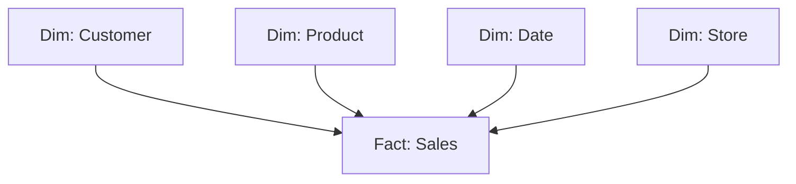

# Вопросы на собеседовании: `Data Warehousing`

Data warehouse — централизованное хранилище для **аналитики и BI**. Оптимизировано под **OLAP** (агрегации, joins, отчёты), не для transactional нагрузки. Современные DWH: **Snowflake**, **BigQuery**, **Redshift**, **Databricks**. На интервью спрашивают: dimensional modeling (Kimball), columnar storage, MPP, slowly changing dimensions.

## Полезные ссылки

### Официальная документация и авторитетные источники

- [Kimball Group Data Warehouse Design](https://www.kimballgroup.com/data-warehouse-business-intelligence-resources/)
- [Snowflake Documentation](https://docs.snowflake.com/)
- [BigQuery Documentation](https://cloud.google.com/bigquery/docs)
- [Amazon Redshift Documentation](https://docs.aws.amazon.com/redshift/)
- [Databricks Lakehouse](https://www.databricks.com/glossary/data-lakehouse)
- [The Data Warehouse Toolkit (Kimball book)](https://www.kimballgroup.com/data-warehouse-business-intelligence-resources/books/data-warehouse-dw-toolkit/)

## Содержание

- [Полезные ссылки](#полезные-ссылки)
- [See also](#see-also)

**Базовые понятия**
- [Q1. (!) Что такое data warehouse?](#q1--что-такое-data-warehouse)
- [Q2. (!) OLTP vs OLAP — разница?](#q2--oltp-vs-olap--разница)
- [Q3. (!) Зачем отдельный DWH, а не использовать OLTP БД?](#q3--зачем-отдельный-dwh-а-не-использовать-oltp-бд)

**Архитектура**
- [Q4. (!) Что такое MPP?](#q4--что-такое-mpp)
- [Q5. (!) Columnar storage — что и зачем?](#q5--columnar-storage--что-и-зачем)
- [Q6. Compression в DWH?](#q6-compression-в-dwh)
- [Q7. Vectorized execution?](#q7-vectorized-execution)

**Modeling — Kimball**
- [Q8. (!) Что такое dimensional modeling?](#q8--что-такое-dimensional-modeling)
- [Q9. (!) Star schema vs Snowflake schema?](#q9--star-schema-vs-snowflake-schema)
- [Q10. (!) Fact table — типы?](#q10--fact-table--типы)
- [Q11. (!) Dimension table — что и зачем?](#q11--dimension-table--что-и-зачем)
- [Q12. (!) Slowly Changing Dimensions (SCD) — типы?](#q12--slowly-changing-dimensions-scd--типы)

**Modeling — другие подходы**
- [Q13. Inmon (3NF) vs Kimball подход?](#q13-inmon-3nf-vs-kimball-подход)
- [Q14. Data Vault?](#q14-data-vault)
- [Q15. (!) One Big Table (OBT) и денормализация?](#q15--one-big-table-obt-и-денормализация)

**Современные DWH (cloud)**
- [Q16. (!) Snowflake — что особенного?](#q16--snowflake--что-особенного)
- [Q17. (!) BigQuery — особенности?](#q17--bigquery--особенности)
- [Q18. Redshift?](#q18-redshift)
- [Q19. Databricks SQL?](#q19-databricks-sql)
- [Q20. (!) ClickHouse — где применяется?](#q20--clickhouse--где-применяется)

**Loading данных (ETL/ELT)**
- [Q21. (!) ETL vs ELT?](#q21--etl-vs-elt)
- [Q22. CDC (Change Data Capture)?](#q22-cdc-change-data-capture)
- [Q23. Tools для loading (Fivetran, Airbyte, Stitch)?](#q23-tools-для-loading-fivetran-airbyte-stitch)

**Performance**
- [Q24. (!) Partitioning и clustering?](#q24--partitioning-и-clustering)
- [Q25. Materialized views?](#q25-materialized-views)
- [Q26. (!) Cost optimization в cloud DWH?](#q26--cost-optimization-в-cloud-dwh)

**BI и аналитика**
- [Q27. (!) Какие BI-инструменты используются?](#q27--какие-bi-инструменты-используются)
- [Q28. Semantic layer — что это?](#q28-semantic-layer--что-это)

**Эволюция**
- [Q29. (!) Modern Data Stack — что это?](#q29--modern-data-stack--что-это)
- [Q30. Data Warehouse vs Data Lake vs Lakehouse?](#q30-data-warehouse-vs-data-lake-vs-lakehouse)

## Q1. (!) Что такое data warehouse?

`Data warehouse (DWH)` — централизованная БД для **аналитики и репортинга**. Хранит **исторические** данные из разных источников, оптимизирована под сложные queries.

**Характеристики:**
- **Subject-oriented** — организовано по бизнес-доменам (sales, customers)
- **Integrated** — данные из разных источников приведены к единому виду
- **Time-variant** — историчность (снапшоты во времени)
- **Non-volatile** — данные не меняются после записи (only append)

**Применения:** business intelligence (BI), executive dashboards, ad-hoc analysis, ML feature engineering.


> [!mcq]
> - [ ] DWH хранит current state и поддерживает high-throughput INSERT/UPDATE | ❌ ПОСЛЕДСТВИЕ: это описание OLTP; DWH non-volatile (append-only) и оптимизирован под analytical SELECT
> - [x] DWH = subject-oriented, integrated, time-variant, non-volatile хранилище для BI/analytics; column storage + аггрегаты на миллиардах строк | ✓ ПРИМЕНЯТЬ: BI, exec dashboards, ad-hoc analysis, ML feature engineering 📋 ПРАВИЛО: DWH = analytical store, не transactional 🔗 См. Q2
> - [ ] DWH = real-time replication production БД с тем же schema | ❌ ПОСЛЕДСТВИЕ: это пассивная реплика; DWH integrates 10+ источников и денормализует под analytics
> - [ ] DWH = data lake на S3 — синонимы | ❌ ПОСЛЕДСТВИЕ: lake — schema-on-read raw данные, DWH — schema-on-write structured tables

## Q2. (!) OLTP vs OLAP — разница?

| Критерий | OLTP (transactional) | OLAP (analytical) |
|----------|---------------------|-------------------|
| Назначение | Run the business | Analyze the business |
| Operations | INSERT/UPDATE/DELETE single rows | SELECT с агрегациями миллионов строк |
| Schema | Highly normalized (3NF) | Denormalized (star schema) |
| Storage | Row-oriented | Column-oriented |
| Latency | Milliseconds | Seconds-minutes |
| Concurrent users | Тысячи | Десятки-сотни |
| Размер | GB-TB | TB-PB |
| Examples | PostgreSQL, MySQL, Oracle | Snowflake, BigQuery, Redshift |

**Почему разделяют:** одна БД не может хорошо делать оба — конфликт между write throughput и query performance.


> [!mcq]
> - [ ] OLTP = column-oriented, OLAP = row-oriented | ❌ ПОСЛЕДСТВИЕ: наоборот; OLTP row для быстрого single-row INSERT/UPDATE, OLAP column для агрегатов
> - [ ] OLTP и OLAP — синонимы | ❌ ПОСЛЕДСТВИЕ: разные нагрузки, разные оптимизации; одна БД не может хорошо обслуживать оба
> - [x] OLTP = INSERT/UPDATE single rows на 3NF schema row-store с ms latency; OLAP = aggregations на denormalized star schema column-store с sec-min latency на TB-PB | ✓ ПРИМЕНЯТЬ: понимать что Postgres для transactions, Snowflake для analytics 📋 ПРАВИЛО: OLTP = run the business, OLAP = analyze the business 🔗 См. Q3
> - [ ] OLAP отличается только размером данных | ❌ ПОСЛЕДСТВИЕ: ещё schema (denorm), storage (columnar), concurrency, latency — все по-разному

## Q3. (!) Зачем отдельный DWH, а не использовать OLTP БД?

1. **Performance** — OLTP не оптимизирован для агрегаций по миллиардам строк
2. **Не мешать production** — heavy queries на OLTP замедлят transactions
3. **Историчность** — OLTP часто хранит current state, DWH — все изменения
4. **Integration** — DWH объединяет данные из 10+ источников
5. **Different schemas** — OLTP normalized, DWH denormalized
6. **Different access patterns** — OLTP реже агрегаций, DWH чаще
7. **Compute separation** — cloud DWH масштабируется независимо от storage


> [!mcq]
> - [ ] Отдельный DWH не нужен — read replicas Postgres хватит | ❌ ПОСЛЕДСТВИЕ: read replica всё ещё row-store без денорма; агрегаты на миллиардах строк будут медленные, плюс integration 10+ источников не решается
> - [x] Отдельный DWH = performance (column store), не мешает prod, история (vs current state в OLTP), integration 10+ sources, denormalization, independent compute scaling | ✓ ПРИМЕНЯТЬ: когда analytical queries замедляют prod или нужна история 📋 ПРАВИЛО: отдельный DWH = разделение write-heavy OLTP и read-heavy OLAP 🔗 См. Q4
> - [ ] Heavy queries на prod БД не влияют на latency transactions | ❌ ПОСЛЕДСТВИЕ: shared buffer cache, IO, CPU — analytical scans убивают p99 OLTP
> - [ ] DWH хранит только current snapshot как OLTP | ❌ ПОСЛЕДСТВИЕ: DWH time-variant, хранит история (SCD Type 2), что и даёт ценность анализа изменений

## Q4. (!) Что такое MPP?

**MPP (Massively Parallel Processing)** — архитектура, где запросы распределяются на **много nodes**, работающих параллельно.

```
Query → Coordinator → splits into pieces → 100 worker nodes
                                              ↓
                                     каждый processes свою часть
                                              ↓
                                  Results aggregated → Result
```

**MPP-системы:** Redshift, Snowflake, BigQuery, Greenplum, Vertica, Teradata.

**Преимущества:**
- Linear scaling (добавил nodes — быстрее запросы)
- Огромные данные (PBs)
- Параллельные scans, joins, aggregations

**Контраст:** обычная БД (PostgreSQL, MySQL) обрабатывает запрос **на одном CPU** (или нескольких через parallel queries, но ограниченно).


> [!mcq]
> - [x] MPP = coordinator splits query на 100+ worker nodes, каждый обрабатывает свою partition параллельно, results aggregated; linear scaling по nodes на PB-данных | ✓ ПРИМЕНЯТЬ: aggregations/joins/scans на огромных datasets 📋 ПРАВИЛО: MPP = shared-nothing parallel + coordinator 🔗 См. Q5
> - [ ] MPP = одна большая SMP машина с 256 cores | ❌ ПОСЛЕДСТВИЕ: MPP = shared-nothing distributed, не SMP; масштабируется горизонтально, не вертикально
> - [ ] Postgres = MPP | ❌ ПОСЛЕДСТВИЕ: Postgres обрабатывает запрос на 1 CPU (с ограниченным parallel query); MPP — это Redshift, Snowflake, BigQuery, Greenplum
> - [ ] MPP плохо масштабируется на больших данных | ❌ ПОСЛЕДСТВИЕ: ровно наоборот — main use case MPP именно PB-scale; linear scaling

## Q5. (!) Columnar storage — что и зачем?

**Row-oriented (OLTP):**
```
Row 1: [id=1, name=Alice, age=30, country=US]
Row 2: [id=2, name=Bob,   age=25, country=DE]
```

**Column-oriented (OLAP):**
```
Column id:      [1, 2, 3, ...]
Column name:    [Alice, Bob, ...]
Column age:     [30, 25, ...]
Column country: [US, DE, ...]
```

**Преимущества columnar:**
- **Compression в 10x лучше** (одинаковые типы рядом)
- **Reads только нужных колонок** (вместо целых rows)
- **Vectorized processing** — операции на колоннах используют SIMD
- **Skip blocks** — min/max metadata позволяет пропускать irrelevant blocks

**Минусы:**
- Slow для **single row** queries (нужно читать все columns)
- Slow updates (нужно переписывать columns)

**Используется:** Parquet, ORC файлы; Snowflake, BigQuery, Redshift, ClickHouse.


> [!mcq]
> - [ ] Columnar быстрее row-store для SELECT * WHERE id=5 | ❌ ПОСЛЕДСТВИЕ: single-row queries медленнее в column store (нужно читать все columns); row-store с index быстрее
> - [ ] Columnar = просто другое расширение Parquet файла | ❌ ПОСЛЕДСТВИЕ: column storage — фундаментальная организация данных на диске, не format detail
> - [x] Column storage = значения одной колонки рядом → compression 10x, vectorized SIMD на batches, чтение только нужных columns, min/max skip blocks | ✓ ПРИМЕНЯТЬ: analytical aggregations на 5-10 columns из 200 широкой таблицы 📋 ПРАВИЛО: column store = aggregate-friendly, slow на single-row 🔗 См. Q6
> - [ ] Updates в column store такие же быстрые как в row store | ❌ ПОСЛЕДСТВИЕ: column updates требуют переписывания всей колонки — это намеренный trade-off

## Q6. Compression в DWH?

Колончатые форматы дают отличную компрессию:

- **Run-length encoding** — `AAAA → A×4`
- **Dictionary encoding** — словарь уникальных значений
- **Bit packing** — для чисел с малым range
- **Delta encoding** — для отсортированных чисел

В Parquet — **2-10x** меньше CSV. В ClickHouse — **10-50x**.

**Trade-off:** компрессия = CPU при чтении/записи. На modern hardware — оправдано.


> [!mcq]
> - [ ] Compression в DWH замедляет queries — лучше не использовать | ❌ ПОСЛЕДСТВИЕ: меньше IO компенсирует CPU; на современном железе compression ускоряет queries
> - [x] DWH compression: RLE (AAAA→A×4), dictionary, bit-packing, delta encoding на column store; Parquet 2-10x меньше CSV, ClickHouse 10-50x | ✓ ПРИМЕНЯТЬ: всегда включать compression в DWH — IO саviings >> CPU overhead 📋 ПРАВИЛО: column store + compression идут вместе 🔗 См. Q7
> - [ ] gzip — лучший выбор для analytical DWH | ❌ ПОСЛЕДСТВИЕ: gzip не columnar-aware; нужны RLE/dictionary/bit-packing per column для лучшего ratio
> - [ ] Compression равна 2x во всех системах | ❌ ПОСЛЕДСТВИЕ: ratio зависит от cardinality, distribution; на repetitive data можно 50x

## Q7. Vectorized execution?

Обработка **batches** (1000+) строк за раз, вместо row-by-row.

```
Row-by-row (slow):
  for each row:
    compute(row)

Vectorized (fast):
  for batch in batches:
    compute_batch(batch)  // SIMD-friendly, cache-friendly
```

**Преимущества:**
- Лучше использует CPU caches
- SIMD instructions
- Минимизирует overhead интерпретации

**Реализуют:** ClickHouse, DuckDB, Arrow, Snowflake, BigQuery.


> [!mcq]
> - [ ] Vectorized = row-by-row но через async loop | ❌ ПОСЛЕДСТВИЕ: смысл наоборот — обрабатывать batches за итерацию, не row
> - [ ] Vectorized работает только на GPU | ❌ ПОСЛЕДСТВИЕ: SIMD на CPU (AVX2/AVX-512) — основной target; ClickHouse/DuckDB вообще CPU-only
> - [x] Vectorized execution = обработка batches 1000+ rows за раз с SIMD, cache-friendly доступ; ClickHouse, DuckDB, Arrow, Snowflake, BigQuery | ✓ ПРИМЕНЯТЬ: основной execution paradigm в современных OLAP engines 📋 ПРАВИЛО: vectorized = SIMD на batch колоночных данных 🔗 См. Q8
> - [ ] Vectorized и columnar — синонимы | ❌ ПОСЛЕДСТВИЕ: разные концепты; columnar — storage layout, vectorized — execution model (хотя они сильно усиливают друг друга)

## Q8. (!) Что такое dimensional modeling?

**Dimensional modeling** (Ralph Kimball) — подход к проектированию DWH, оптимизированный под **аналитические queries**.

**Идея:**
- **Fact tables** — числовые **measurements** бизнеса (sales, clicks, transactions)
- **Dimension tables** — **контекст** (customer, product, time, location)



Это **star schema** — fact в центре, dimensions вокруг.


> [!mcq]
> - [ ] Dimensional modeling = 3NF normalized как в OLTP | ❌ ПОСЛЕДСТВИЕ: это Inmon подход, не Kimball; dimensional model — денормализация в star schema
> - [x] Dimensional model (Kimball) = facts (numeric business measurements) + dimensions (descriptive context); star schema с fact в центре — оптимизирован под analytical queries | ✓ ПРИМЕНЯТЬ: design нового DWH под BI 📋 ПРАВИЛО: facts = что измеряем, dimensions = в каком контексте 🔗 См. Q9
> - [ ] Fact tables хранят атрибуты, dimensions — числовые measurements | ❌ ПОСЛЕДСТВИЕ: наоборот; fact = measurement (sales amount), dim = context (customer, product, date)
> - [ ] Star schema требует normalization | ❌ ПОСЛЕДСТВИЕ: star = денормализованные dimensions; нормализованный вариант — snowflake schema

## Q9. (!) Star schema vs Snowflake schema?

**Star schema:**
- Fact в центре
- Dimensions вокруг
- Dimensions **денормализованы** (одна table per concept)

**Snowflake schema:**
- То же, но dimensions **нормализованы** (разделены на иерархии)

```
Star:                       Snowflake:
Sales → Product             Sales → Product → Category
                                    Product → Brand
```

**Star** проще, быстрее queries (меньше joins).
**Snowflake** экономит место, но больше joins.

В **современных DWH** доминирует **star schema** (storage дешёвый, query speed важнее).


> [!mcq]
> - [x] Star = денормализованные dims (одна таблица per concept, меньше joins, быстрее); Snowflake = нормализованные dims (Product→Category→Brand, больше joins, экономия места) — в 2024 star доминирует | ✓ ПРИМЕНЯТЬ: star по умолчанию; snowflake только если storage дорого ИЛИ deep hierarchies 📋 ПРАВИЛО: star = query speed > storage 🔗 См. Q10
> - [ ] Snowflake schema = быстрее queries чем star | ❌ ПОСЛЕДСТВИЕ: наоборот; больше joins → медленнее
> - [ ] Star schema требует Snowflake DWH (vendor) | ❌ ПОСЛЕДСТВИЕ: schema design vs vendor; Snowflake schema никак не связана с Snowflake Inc.
> - [ ] В обоих случаях fact table нормализована | ❌ ПОСЛЕДСТВИЕ: fact таблица одинакова; разница только в normalization dimensions

## Q10. (!) Fact table — типы?

| Тип | Описание | Пример |
|-----|----------|--------|
| **Transactional** | Одна строка на event | Каждая продажа |
| **Periodic snapshot** | Snapshot на регулярный интервал | Дневной баланс счёта |
| **Accumulating snapshot** | Track lifecycle | Заявка от подачи до закрытия |
| **Factless** | Только foreign keys (события без measures) | Студент посетил лекцию |

```sql
CREATE TABLE fact_sales (
    sale_id BIGINT,            -- degenerate dim
    customer_key INT,           -- FK to dim_customer
    product_key INT,            -- FK to dim_product
    date_key INT,               -- FK to dim_date
    store_key INT,              -- FK to dim_store
    quantity INT,               -- measure
    amount DECIMAL(10,2),       -- measure
    discount DECIMAL(10,2)      -- measure
);
```


> [!mcq]
> - [ ] Все fact tables одинаковы — нет типов | ❌ ПОСЛЕДСТВИЕ: 4 типа (transactional, periodic snapshot, accumulating snapshot, factless) под разные patterns
> - [ ] Factless fact table — это просто dimension table | ❌ ПОСЛЕДСТВИЕ: factless хранит события без measures (студент посетил лекцию) — для tracking occurrences
> - [x] Fact table типы: transactional (1 row per event, sales), periodic snapshot (regular interval, daily balance), accumulating snapshot (lifecycle tracking, application progress), factless (только FKs, occurrences) | ✓ ПРИМЕНЯТЬ: выбор по характеру измеряемого процесса 📋 ПРАВИЛО: события=transactional, состояние=snapshot, lifecycle=accumulating 🔗 См. Q11
> - [ ] Periodic snapshot fact хранит только последний период | ❌ ПОСЛЕДСТВИЕ: наоборот, snapshot за каждый период (день, месяц) для исторического анализа

## Q11. (!) Dimension table — что и зачем?

**Dimension** — таблица с **descriptive context**: атрибуты для группировки и фильтрации.

```sql
CREATE TABLE dim_customer (
    customer_key INT PRIMARY KEY,    -- surrogate key
    customer_id VARCHAR,              -- natural key
    name VARCHAR,
    email VARCHAR,
    country VARCHAR,
    age_group VARCHAR,
    valid_from DATE,
    valid_to DATE,
    is_current BOOLEAN
);
```

**Surrogate key** — синтетический PK (1, 2, 3, ...). Не использовать natural key — может меняться.

**Date dimension** — отдельная таблица с днями, месяцами, кварталами для удобной агрегации:

```sql
CREATE TABLE dim_date (
    date_key INT,
    date DATE,
    year INT,
    month INT,
    quarter INT,
    day_of_week INT,
    is_weekend BOOLEAN,
    fiscal_year INT,
    is_holiday BOOLEAN
);
```


> [!mcq]
> - [ ] Natural key (customer_id из source) — рекомендуемый PK для dimensions | ❌ ПОСЛЕДСТВИЕ: natural keys могут меняться (rename, merge); surrogate key (synthetic auto-increment) стабилен и быстрее JOIN
> - [x] Dimension = descriptive context (customer, product, date) с surrogate PK + natural key; date dimension отдельная таблица с year/month/quarter/is_weekend для удобной агрегации | ✓ ПРИМЕНЯТЬ: фильтрация и группировка в analytical queries 📋 ПРАВИЛО: surrogate PK + valid_from/valid_to для SCD Type 2 🔗 См. Q12
> - [ ] Date dimension избыточна — можно использовать DATE column напрямую | ❌ ПОСЛЕДСТВИЕ: каждый раз вычислять EXTRACT(YEAR), is_weekend через CASE — медленно и многословно; pre-computed dim быстрее
> - [ ] Dimension таблицы должны быть в 3NF | ❌ ПОСЛЕДСТВИЕ: денормализация — основа Kimball; нормализация только в snowflake schema

## Q12. (!) Slowly Changing Dimensions (SCD) — типы?

**SCD** — стратегия обработки изменений в dimension:

| Тип | Что делает | Пример |
|-----|-----------|--------|
| **Type 0** | Не меняется (immutable) | Birth date |
| **Type 1** | Перезаписывает (no history) | Email correction |
| **Type 2** | Новая строка с valid_from/valid_to | Customer переехал в другой city |
| **Type 3** | Дополнительные columns (current + previous) | Department change |
| **Type 4** | Hybrid: dimension + history table | — |
| **Type 6** | Combination of 1+2+3 | Advanced cases |

**Type 2 — самый частый**, сохраняет историю:

```
customer_key | customer_id | city    | valid_from | valid_to  | is_current
1            | C001        | London  | 2020-01-01 | 2023-06-01| false
2            | C001        | Berlin  | 2023-06-01 | NULL      | true
```

При запросе current — `WHERE is_current = true`. Историческая выборка — `WHERE valid_from <= '2022-01-01' AND (valid_to IS NULL OR valid_to > '2022-01-01')`.

dbt **`snapshot`** — реализация SCD Type 2.


> [!mcq]
> - [ ] SCD Type 1 сохраняет историю изменений | ❌ ПОСЛЕДСТВИЕ: Type 1 перезаписывает (overwrites) — теряет историю; для истории нужен Type 2
> - [x] SCD Type 2 (самый частый) = новая строка при изменении с valid_from/valid_to/is_current; история сохраняется, dbt snapshot реализует это | ✓ ПРИМЕНЯТЬ: customer переехал, нужна история для исторического анализа продаж 📋 ПРАВИЛО: Type 2 = новая row при изменении, поиск по is_current ИЛИ временному окну 🔗 См. Q13
> - [ ] Type 2 хранит только current state | ❌ ПОСЛЕДСТВИЕ: Type 1 хранит only current; Type 2 хранит ВСЕ версии с valid_from/valid_to
> - [ ] SCD Type 0 удаляет старые dimensions | ❌ ПОСЛЕДСТВИЕ: Type 0 = immutable (никогда не меняется), пример birth date

## Q13. Inmon (3NF) vs Kimball подход?

**Bill Inmon (1990s):**
- DWH в **3NF** (highly normalized)
- Top-down: сначала enterprise DWH, потом data marts для отделов
- Сложно строить, легко расширять

**Ralph Kimball (1996):**
- DWH в **dimensional model** (star schema)
- Bottom-up: data marts → conformed dimensions
- Легко строить, может быть сложно поддерживать конформность

В **2024** Kimball доминирует. Inmon-стиль чаще встречается в **financial services** и legacy installations.


> [!mcq]
> - [ ] Kimball — top-down 3NF, Inmon — bottom-up star schema | ❌ ПОСЛЕДСТВИЕ: ровно наоборот; Kimball = bottom-up dimensional, Inmon = top-down 3NF
> - [x] Inmon = top-down 3NF Enterprise DWH → marts; Kimball = bottom-up star data marts → conformed dims; в 2024 Kimball доминирует (Inmon чаще в legacy и financial) | ✓ ПРИМЕНЯТЬ: новый DWH → Kimball; refactor legacy → может остаться Inmon 📋 ПРАВИЛО: Inmon=3NF top-down, Kimball=star bottom-up 🔗 См. Q14
> - [ ] Kimball запрещает normalization где-либо | ❌ ПОСЛЕДСТВИЕ: fact tables всё ещё normalized по FK; только dimensions денормализованы
> - [ ] Inmon быстрее для analytical queries | ❌ ПОСЛЕДСТВИЕ: больше joins в 3NF = медленнее queries; именно поэтому Kimball выигрывает на BI

## Q14. Data Vault?

**Data Vault (Dan Linstedt)** — гибридный подход:

- **Hub** — business keys (customer_id, product_id)
- **Link** — связи между hubs (relationships)
- **Satellite** — атрибуты с историей

```
HUB_CUSTOMER (customer_id)
LINK_ORDER (customer_id, product_id)
SAT_CUSTOMER (customer_id, name, address, valid_from, valid_to)
SAT_ORDER (order_id, amount, date, ...)
```

**Преимущества:**
- Auditable (full history)
- Гибкое к изменениям
- Хорошо для compliance (GDPR, banking)

**Недостатки:**
- Много joins для queries
- Сложнее писать
- Обычно нужен ещё один слой (Kimball marts) для BI

В **enterprises** иногда используется как **enterprise DWH layer**, поверх — Kimball marts.


> [!mcq]
> - [x] Data Vault = Hub (business keys) + Link (relationships) + Satellite (attributes + history); auditable, гибкое, compliance-friendly; чаще как enterprise layer под Kimball marts | ✓ ПРИМЕНЯТЬ: GDPR/banking где full history и flexibility критичны 📋 ПРАВИЛО: Hub-Link-Satellite + поверх Kimball для BI 🔗 См. Q15
> - [ ] Data Vault = ровно то же что star schema | ❌ ПОСЛЕДСТВИЕ: разные концепции; DV — гибрид с Hubs/Links/Satellites, не star
> - [ ] Data Vault простой для query без joins | ❌ ПОСЛЕДСТВИЕ: ровно наоборот — много joins (Hub+Link+Satellite), почему обычно строят Kimball marts поверх
> - [ ] Data Vault заменяет потребность в Kimball marts | ❌ ПОСЛЕДСТВИЕ: DV — enterprise layer для compliance; BI tools требуют denormalized star — поверх часто строят Kimball marts

## Q15. (!) One Big Table (OBT) и денормализация?

С modern DWH (где storage дешёвый) — тренд **One Big Table**:

- Одна **широкая** таблица со всеми атрибутами
- Нет joins при query
- Огромная компрессия (columnar storage)

```sql
CREATE TABLE fact_sales_wide AS
SELECT
    s.*,                  -- все факты
    c.name AS customer_name,
    c.country AS customer_country,
    p.name AS product_name,
    p.category AS product_category,
    ...
FROM fact_sales s
JOIN dim_customer c ON ...
JOIN dim_product p ON ...
```

**Преимущества:**
- Простые queries (нет joins)
- Быстрее (один scan)
- BI tools проще конфигурировать

**Минусы:**
- Storage больше (но cheap)
- ETL сложнее (нужно поддерживать денормализацию)
- Update history complex

В **2024** OBT популярен для BI слоя (последний слой dbt marts).


> [!mcq]
> - [ ] OBT противоречит modern DWH best practices | ❌ ПОСЛЕДСТВИЕ: ровно наоборот — в 2024 OBT популярен в BI слое dbt marts, столбцовая компрессия компенсирует storage
> - [ ] OBT требует много joins при query | ❌ ПОСЛЕДСТВИЕ: вся суть OBT — нет joins; одна wide table со всеми атрибутами
> - [x] One Big Table = денормализованная wide таблица со всеми атрибутами; нет joins, быстрее queries, проще BI; trade-off — storage больше + ETL сложнее | ✓ ПРИМЕНЯТЬ: marts слой dbt, готовый под BI инструменты 📋 ПРАВИЛО: cheap storage + columnar compression → OBT для BI 🔗 См. Q16
> - [ ] OBT экономит storage по сравнению со star schema | ❌ ПОСЛЕДСТВИЕ: storage больше (дублирование атрибутов dim); экономия в query simplicity + BI tooling

## Q16. (!) Snowflake — что особенного?

**Snowflake** (2012) — облачный DWH с уникальной архитектурой:

- **Decoupled storage and compute** — масштабируются независимо
- **Multi-cluster compute** — параллельные warehouses на одних данных
- **Auto-scaling, auto-suspend** — платишь только за usage
- **Time Travel** — query прошлые версии данных
- **Zero-copy cloning** — мгновенные копии для dev/test
- **Multi-cloud** (AWS, Azure, GCP)
- **Native semi-structured** (JSON, Avro, XML, Parquet)

```sql
-- Time travel
SELECT * FROM users AT (TIMESTAMP => '2025-04-15 10:00:00');

-- Zero-copy clone
CREATE TABLE users_dev CLONE users;

-- Auto-suspend warehouse через 5 минут idle
ALTER WAREHOUSE my_wh SET AUTO_SUSPEND = 300;
```

В **2024** — рыночный лидер cloud DWH.


> [!mcq]
> - [ ] Snowflake = tightly coupled storage и compute | ❌ ПОСЛЕДСТВИЕ: главная инновация Snowflake — decoupling: масштабируй compute независимо от storage
> - [x] Snowflake (2012) = decoupled storage+compute, multi-cluster compute, auto-suspend, time travel, zero-copy clone, multi-cloud, native JSON/Avro/Parquet; рыночный лидер cloud DWH | ✓ ПРИМЕНЯТЬ: общий cloud DWH с pay-per-use 📋 ПРАВИЛО: Snowflake = decoupled + auto-scale + time travel 🔗 См. Q17
> - [ ] Zero-copy clone требует двойного storage | ❌ ПОСЛЕДСТВИЕ: clone использует metadata pointers — экономит storage до изменений (copy-on-write)
> - [ ] Snowflake работает только на AWS | ❌ ПОСЛЕДСТВИЕ: multi-cloud (AWS+Azure+GCP), что отличает от Redshift и BigQuery

## Q17. (!) BigQuery — особенности?

**BigQuery** (2010) от Google:

- **Serverless** — нет warehouses to manage
- **Pay per query** (по сканированным bytes) или flat-rate
- **Petabyte scale** — terra/peta-bytes естественно
- **Built-in ML** (BigQuery ML) — `CREATE MODEL ...` SQL
- **Dremel architecture** — параллельное выполнение
- **Тесно интегрирован** с GCP (Cloud Storage, Pub/Sub, ...)

```sql
-- Train ML модель прямо в SQL
CREATE MODEL `my_dataset.my_model`
OPTIONS(model_type='linear_reg') AS
SELECT label, feature1, feature2 FROM training_data;
```

**Подвох:** pay-per-byte-scanned. Без partitioning/clustering можно случайно "сжечь" $1000 на одном запросе. Используй `LIMIT`, `--dry-run`.


> [!mcq]
> - [ ] BigQuery требует provisioning warehouses перед query | ❌ ПОСЛЕДСТВИЕ: BigQuery serverless — нет warehouses; pay per scanned bytes ИЛИ flat-rate slots
> - [x] BigQuery = serverless, pay-per-scanned-bytes (или flat-rate slots), petabyte scale, built-in ML (CREATE MODEL SQL), Dremel architecture, GCP-native | ✓ ПРИМЕНЯТЬ: GCP стек + petabyte BI + ad-hoc; всегда partitioning/clustering чтобы не сжечь budget 📋 ПРАВИЛО: BigQuery = serverless + scan-based pricing 🔗 См. Q18
> - [ ] BigQuery ML требует экспорта в Vertex AI | ❌ ПОСЛЕДСТВИЕ: BQ ML работает прямо в SQL без экспорта; обучение и inference на месте
> - [ ] SELECT * FROM huge_table — безопасно, всё равно flat fee | ❌ ПОСЛЕДСТВИЕ: при pay-per-byte одна `SELECT *` без partition filter может сжечь $1000+

## Q18. Redshift?

**Amazon Redshift** (2013) — старейший cloud DWH (от Amazon).

**Особенности:**
- **MPP** (parallel processing на cluster nodes)
- Provisioned (нужно выбрать node size)
- **Redshift Serverless** (с 2022) — pay-per-use
- Тесно с AWS экосистемой (S3, Glue, EMR, ...)
- Хорошо для legacy AWS-центрированных архитектур

В **2024** Redshift теряет долю Snowflake/BigQuery. Redshift Serverless — попытка догнать.


> [!mcq]
> - [x] Redshift (2013) = старейший cloud DWH, MPP на nodes, provisioned (выбор размера) или Redshift Serverless (с 2022), AWS-native; теряет долю Snowflake/BigQuery в 2024 | ✓ ПРИМЕНЯТЬ: AWS-центрированный legacy стек, S3+Glue+EMR интеграция 📋 ПРАВИЛО: Redshift = AWS native MPP DWH 🔗 См. Q19
> - [ ] Redshift всегда serverless | ❌ ПОСЛЕДСТВИЕ: classic Redshift — provisioned cluster; Redshift Serverless — отдельный продукт с 2022
> - [ ] Redshift = multi-cloud (AWS+Azure+GCP) | ❌ ПОСЛЕДСТВИЕ: AWS-only; multi-cloud только у Snowflake
> - [ ] Redshift растёт по market share быстрее Snowflake | ❌ ПОСЛЕДСТВИЕ: ровно наоборот; Snowflake обгоняет, Redshift пытается догнать через Serverless

## Q19. Databricks SQL?

**Databricks** — изначально Spark платформа, расширилась в **lakehouse** концепт.

**Databricks SQL:**
- DWH workload поверх **Delta Lake** (на S3/ADLS)
- **Photon** engine (vectorized C++ execution)
- Unity Catalog для governance
- ML + SQL в одной платформе

Лучше всех закрывает **lakehouse** (DWH + Data Lake вместе).


> [!mcq]
> - [ ] Databricks SQL — обычный Spark SQL, ничего нового | ❌ ПОСЛЕДСТВИЕ: Databricks SQL = Photon engine (vectorized C++) поверх Delta Lake + Unity Catalog — оптимизирован под DWH workload
> - [x] Databricks SQL = DWH workload на Delta Lake (S3/ADLS) с Photon engine + Unity Catalog + ML/SQL в одной платформе — lakehouse paradigm (DWH+Lake) | ✓ ПРИМЕНЯТЬ: когда нужен и ML и BI на одной платформе с открытыми форматами 📋 ПРАВИЛО: Databricks = lakehouse (Delta+Photon+Unity) 🔗 См. Q20
> - [ ] Photon engine использует Python | ❌ ПОСЛЕДСТВИЕ: Photon — native C++ vectorized engine, не Python; именно поэтому быстрый
> - [ ] Databricks SQL хранит данные в Snowflake | ❌ ПОСЛЕДСТВИЕ: хранение в Delta Lake на S3/ADLS — собственная инфраструктура, не Snowflake

## Q20. (!) ClickHouse — где применяется?

**ClickHouse** — open-source columnar DWH от Yandex.

**Особенности:**
- **Очень быстрый** для analytical queries (особенно single-table aggregations)
- Self-hosted или managed (ClickHouse Cloud)
- **Не cloud-native** в традиционном смысле (нет separated storage/compute)
- Огромная компрессия и vectorized execution

**Применения:**
- **Real-time analytics** на event streams (clickstream, IoT)
- **Time-series** (logging, metrics, observability)
- **Marketing analytics** (быстрые ad-hoc queries)

**Не для:** complex joins (хуже Snowflake), частые updates, transactions.

В **2024** ClickHouse — ультра-быстрый для read-heavy analytical workloads.


> [!mcq]
> - [ ] ClickHouse — лучший выбор для transactional workloads | ❌ ПОСЛЕДСТВИЕ: ClickHouse оптимизирован под read-heavy analytical; transactions/частые updates — антипаттерн
> - [x] ClickHouse = open-source columnar DWH от Yandex, ультра-быстрый на single-table aggregations с огромной компрессией; идеален для real-time analytics, time-series, observability | ✓ ПРИМЕНЯТЬ: clickstream/IoT, logs/metrics, marketing analytics 📋 ПРАВИЛО: ClickHouse = read-heavy analytical, не для joins и transactions 🔗 См. Q21
> - [ ] ClickHouse быстрее Snowflake на сложных joins | ❌ ПОСЛЕДСТВИЕ: наоборот; ClickHouse слабее на complex joins, сильнее на single-table agg
> - [ ] ClickHouse требует separate storage и compute | ❌ ПОСЛЕДСТВИЕ: ClickHouse — НЕ cloud-native архитектура; storage+compute сцеплены (тренд меняется в Cloud версии)

## Q21. (!) ETL vs ELT?

| Подход | Где transform | Когда |
|--------|---------------|-------|
| **ETL** | Внешний tool (Spark, Informatica) | Legacy, expensive warehouses |
| **ELT** | Внутри warehouse (SQL) | Modern cloud DWH (cheap compute) |

```
ETL: Source → Transform → Warehouse
ELT: Source → Warehouse → Transform (внутри)
```

**ELT** доминирует с появлением Snowflake/BigQuery — compute дешёвый, нет смысла платить отдельно.

dbt — символ ELT эры.


> [!mcq]
> - [ ] ETL быстрее ELT в modern cloud DWH | ❌ ПОСЛЕДСТВИЕ: наоборот; ELT использует cheap warehouse compute, не платит за external Spark cluster
> - [x] ETL = transform до warehouse (Spark/Informatica, legacy); ELT = transform внутри warehouse SQL (Snowflake/BigQuery, modern); dbt — символ ELT-эры | ✓ ПРИМЕНЯТЬ: ELT по умолчанию в modern stack; ETL только если warehouse compute дорогой 📋 ПРАВИЛО: cheap warehouse compute → ELT 🔗 См. Q22
> - [ ] dbt — это ETL инструмент | ❌ ПОСЛЕДСТВИЕ: dbt = T в ELT (transform внутри warehouse через SQL), не extracts данные
> - [ ] ELT требует extra ETL platform | ❌ ПОСЛЕДСТВИЕ: ELT использует warehouse как compute engine — Spark/Informatica не нужен для transform

## Q22. CDC (Change Data Capture)?

**CDC** — захват изменений в OLTP БД и реплика в DWH.

**Подходы:**
- **Trigger-based** — медленно
- **Log-based** — читает WAL/binlog (PostgreSQL logical replication, MySQL binlog) — лучше всего
- **Polling** — `WHERE updated_at > last_sync` — простой, но не ловит deletes

**Tools:**
- Debezium (open-source)
- Fivetran (managed)
- Airbyte
- Striim
- AWS DMS

CDC даёт **near-real-time** репликацию — задержка секунды, не часы.


> [!mcq]
> - [x] CDC = захват изменений в OLTP через log-based (WAL/binlog), реплика в DWH near-real-time; Debezium open-source, Fivetran/Airbyte managed; даёт latency секунды, не часы | ✓ ПРИМЕНЯТЬ: real-time replication Postgres/MySQL в Snowflake/BigQuery без bulk full-loads 📋 ПРАВИЛО: log-based CDC > polling > triggers 🔗 См. Q23
> - [ ] Polling `WHERE updated_at > last_sync` — best practice CDC | ❌ ПОСЛЕДСТВИЕ: polling не ловит deletes, нагружает source, лагает; log-based лучше
> - [ ] CDC через triggers — самый быстрый подход | ❌ ПОСЛЕДСТВИЕ: triggers замедляют OLTP writes; log-based читает WAL вне критического пути
> - [ ] CDC всегда даёт hours latency как batch ETL | ❌ ПОСЛЕДСТВИЕ: log-based CDC обеспечивает секунды; ради этого его и применяют

## Q23. Tools для loading (Fivetran, Airbyte, Stitch)?

**Managed:**
- **Fivetran** — самый популярный, дорогой, simple setup
- **Stitch** (Talend) — классика
- **Airbyte** — open-source альтернатива (есть managed версия)
- **Hevo, Matillion** — другие

**Open-source:**
- **Airbyte** — самый активный
- **Meltano** (от GitLab)
- **Singer** taps/targets

**Workflow:**
```
Source (Salesforce, Stripe, Postgres, ...)
    ↓ Fivetran/Airbyte
Warehouse (Snowflake, BigQuery, ...)
    ↓ dbt
Marts → BI tools
```

В **modern data stack** — fivetran/airbyte → dbt — стандартная связка.


> [!mcq]
> - [ ] Fivetran и Airbyte — это transformation tools | ❌ ПОСЛЕДСТВИЕ: это ingestion (Extract+Load); transformation делает dbt
> - [x] Modern data stack ingestion: Fivetran (managed, дорогой, простой) / Stitch (классика) / Airbyte (open-source) → warehouse → dbt → marts → BI | ✓ ПРИМЕНЯТЬ: Salesforce/Stripe/Postgres → Snowflake/BQ через Fivetran/Airbyte 📋 ПРАВИЛО: ingestion tool → warehouse → dbt → BI 🔗 См. Q24
> - [ ] Airbyte только managed, нет open-source версии | ❌ ПОСЛЕДСТВИЕ: Airbyte open-source с managed cloud версией; альтернатива Fivetran
> - [ ] Fivetran нужно писать custom коннекторы для каждого источника | ❌ ПОСЛЕДСТВИЕ: Fivetran предоставляет 300+ pre-built connectors; настройка — UI clicks

## Q24. (!) Partitioning и clustering?

**Partitioning** — разделение таблицы на физические parts по column (обычно date).

```sql
-- BigQuery
CREATE TABLE sales
PARTITION BY DATE(sale_date)
AS SELECT * FROM source;

-- Snowflake auto-partitions через micro-partitions
```

**Clustering / Sort key** — порядок строк внутри partition для оптимизации скана.

```sql
CREATE TABLE sales
PARTITION BY DATE(sale_date)
CLUSTER BY (customer_id, product_id)
AS ...
```

**Эффект:**
- **Partition pruning** — скан только нужных partition (1 день вместо года)
- **Clustering** — внутри partition data сортируется → range queries быстрее

Без partitioning queries могут стоить **в 100x больше**.


> [!mcq]
> - [ ] Partitioning и clustering — одно и то же | ❌ ПОСЛЕДСТВИЕ: разные оптимизации; partitioning = физическое разделение по column (date), clustering = порядок строк внутри partition
> - [x] Partitioning (BY DATE) + clustering (BY customer_id) даёт partition pruning (скан 1 дня вместо года) и data skipping внутри partition; без них query цены в 100x | ✓ ПРИМЕНЯТЬ: всегда partition по date в больших fact tables; cluster по часто-фильтруемым columns 📋 ПРАВИЛО: partition = WHERE column, cluster = secondary filter 🔗 См. Q25
> - [ ] Partition по customer_id (миллионы значений) — лучшая практика | ❌ ПОСЛЕДСТВИЕ: high-cardinality partition создаст millions мелких partitions = поломка метаданных; partition по low-cardinality (date)
> - [ ] Без partitioning queries стоят так же | ❌ ПОСЛЕДСТВИЕ: full scan vs partition pruning может быть x100 разницы в стоимости в pay-per-byte BigQuery

## Q25. Materialized views?

**Materialized view** — pre-computed result query, хранится как таблица.

```sql
CREATE MATERIALIZED VIEW daily_revenue AS
SELECT date_trunc('day', order_date) AS day,
       SUM(amount) AS revenue
FROM orders
GROUP BY 1;
```

**Плюсы:**
- Быстрые reads (заранее вычислено)
- Автоматическое обновление при изменениях source

**Минусы:**
- Storage cost
- Latency обновления (обычно asynchronous)
- Не все queries поддерживаются для MV (limitations per warehouse)

В **Snowflake/BigQuery** — auto-refreshing MVs. В **Redshift** — manual refresh.


> [!mcq]
> - [ ] Materialized view — то же что обычный VIEW | ❌ ПОСЛЕДСТВИЕ: VIEW = stored query (пересчёт каждый раз); MV = stored result (заранее вычислено)
> - [x] Materialized view = pre-computed query result хранится как таблица; ускоряет читаемые часто aggregations; trade-off — storage + refresh latency; Snowflake/BQ auto-refresh, Redshift manual | ✓ ПРИМЕНЯТЬ: дорогие повторяющиеся aggregate queries (daily revenue) 📋 ПРАВИЛО: MV = trade storage за query speed 🔗 См. Q26
> - [ ] MV полезен для часто-меняющихся single-row queries | ❌ ПОСЛЕДСТВИЕ: MV оптимизирован под aggregate queries; для single-row index в OLTP лучше
> - [ ] Все queries можно положить в MV | ❌ ПОСЛЕДСТВИЕ: каждый warehouse имеет limitations (no joins, no UDFs etc); check vendor docs

## Q26. (!) Cost optimization в cloud DWH?

1. **Partitioning + clustering** — query только нужные данные
2. **Auto-suspend** warehouses (Snowflake) — не платить за idle
3. **Right-sizing** — не использовать XL warehouse для маленьких queries
4. **Query optimization** — `LIMIT`, не `SELECT *`, фильтры рано
5. **Materialize часто-используемое** — vs пересчёт каждый раз
6. **Result cache** — Snowflake/BQ кэшируют идентичные queries бесплатно
7. **Reserved capacity** vs on-demand (для предсказуемого usage)
8. **Cluster keys** — оптимизировать для частых паттернов
9. **Compression** — выбирать оптимальные codecs
10. **Monitoring** — `QUERY_HISTORY`, идентификация expensive queries

Ошибка в `WHERE` clause → может стоить **$10K за один запрос** в pay-per-byte BigQuery.


> [!mcq]
> - [ ] SELECT * FROM huge_table — нормально, кэш спасёт | ❌ ПОСЛЕДСТВИЕ: в pay-per-byte BigQuery одна `SELECT *` может стоить $10K; result cache работает только на идентичные queries
> - [x] Cost optimization: partitioning+clustering, auto-suspend warehouses, right-sizing, query optimization (фильтры рано, не SELECT *), materialize часто-используемое, result cache, reserved capacity, мониторинг QUERY_HISTORY | ✓ ПРИМЕНЯТЬ: ежемесячно ревьюить top-cost queries в QUERY_HISTORY 📋 ПРАВИЛО: partition+cluster+suspend+cache = 80% экономии 🔗 См. Q27
> - [ ] Auto-suspend warehouses не влияет на cost | ❌ ПОСЛЕДСТВИЕ: idle warehouse платит как активный; auto-suspend через 5 мин экономит до 70% на нерегулярных нагрузках
> - [ ] XL warehouse всегда лучше — быстрее значит дешевле | ❌ ПОСЛЕДСТВИЕ: XL стоит x16 от XS; для маленьких queries time savings не компенсируют price; right-sizing критично

## Q27. (!) Какие BI-инструменты используются?

**Modern BI:**
- **Looker** (Google) — LookML semantic layer
- **Tableau** (Salesforce) — самый популярный
- **Power BI** (Microsoft) — для MS-стека
- **Metabase** — open-source
- **Superset** (Apache) — open-source, мощный
- **Mode, Hex, Sigma** — modern, SQL-first
- **Lightdash** — open-source с dbt integration

**dbt + Looker / Lightdash** — частый стек для analytics engineering.


> [!mcq]
> - [x] Modern BI: Looker (LookML), Tableau (топ), Power BI (MS-стек), Metabase/Superset (open-source), Mode/Hex/Sigma (SQL-first), Lightdash (dbt-native); типичный стек — dbt + Looker/Lightdash | ✓ ПРИМЕНЯТЬ: выбор по экосистеме (Salesforce→Tableau, GCP→Looker, MS→Power BI) 📋 ПРАВИЛО: BI tool по экосистеме, semantic layer = dbt/LookML 🔗 См. Q28
> - [ ] Tableau — open-source | ❌ ПОСЛЕДСТВИЕ: Tableau от Salesforce, commercial; open-source альтернативы — Metabase, Superset
> - [ ] Looker не имеет semantic layer | ❌ ПОСЛЕДСТВИЕ: LookML — родоначальник semantic layer в BI; основная фича Looker
> - [ ] Power BI — единственный BI с SQL support | ❌ ПОСЛЕДСТВИЕ: все modern BI поддерживают SQL; Mode, Hex, Sigma — SQL-first

## Q28. Semantic layer — что это?

**Semantic layer** — **single source of truth** для метрик. Определяешь раз — используется во всех BI tools.

```yaml
metric:
  name: monthly_revenue
  type: simple
  measure: sum(orders.amount)
  filter: orders.status = 'paid'
```

Без semantic layer — каждый BI dashboard может считать "revenue" по-своему → конфликты в отчётах.

**Реализации:**
- **dbt Semantic Layer** (с 2023)
- **Looker LookML** (классика)
- **Cube.js**
- **MetricFlow** (acquired by dbt)


> [!mcq]
> - [ ] Semantic layer избыточен — каждый BI dashboard считает метрики сам | ❌ ПОСЛЕДСТВИЕ: разные дашборды дают разный "revenue" → конфликты в отчётах executive board
> - [x] Semantic layer = single source of truth для метрик (revenue, MAU); определяется раз, используется во всех BI; реализации — dbt Semantic Layer, LookML, Cube.js, MetricFlow | ✓ ПРИМЕНЯТЬ: устранить конфликты определений между Looker и Tableau на одной БД 📋 ПРАВИЛО: metric defined once + used everywhere 🔗 См. Q29
> - [ ] LookML работает только в Looker | ❌ ПОСЛЕДСТВИЕ: исторически да, но dbt Semantic Layer и Cube.js — vendor-neutral альтернативы
> - [ ] Semantic layer = то же что database view | ❌ ПОСЛЕДСТВИЕ: view = SQL query; semantic layer = декларативные метрики + dimensions с metadata для BI tools

## Q29. (!) Modern Data Stack — что это?

**Modern Data Stack** (с 2018) — современный набор tools:

```
Source → Loader (Fivetran/Airbyte) → Warehouse (Snowflake/BQ)
                                              ↓
                            Transformer (dbt) — semantic layer
                                              ↓
                                     BI (Looker/Tableau/Lightdash)
                                              ↓
                                     Reverse ETL (Hightouch/Census)
                                              ↓
                                     Operational tools (Salesforce, ...)
```

**Принципы:**
- **Cloud-native** — managed services
- **ELT** instead of ETL
- **SQL-first** — minimal Python
- **Composable** — best-in-class tools, не one mega-platform


> [!mcq]
> - [x] Modern Data Stack (с 2018): Source → Loader (Fivetran/Airbyte) → Warehouse (Snowflake/BQ) → Transformer (dbt) → BI (Looker/Tableau) → Reverse ETL (Hightouch/Census); cloud-native, ELT, SQL-first, composable | ✓ ПРИМЕНЯТЬ: новый analytics stack без legacy ETL платформ 📋 ПРАВИЛО: best-of-breed cloud tools вместо мега-платформы 🔗 См. Q30
> - [ ] Modern Data Stack = одна платформа (Informatica) | ❌ ПОСЛЕДСТВИЕ: ровно наоборот — composable best-in-class tools, не one mega-platform
> - [ ] Modern Data Stack использует ETL не ELT | ❌ ПОСЛЕДСТВИЕ: ELT — фундамент MDS; transformation внутри warehouse через dbt
> - [ ] Reverse ETL — это classic ETL обратно в DWH | ❌ ПОСЛЕДСТВИЕ: Reverse ETL = warehouse → operational tools (Salesforce, HubSpot); Hightouch/Census закрывают активацию данных

## Q30. Data Warehouse vs Data Lake vs Lakehouse?

Подробнее — в [Data Lake / Lakehouse](data-lake-lakehouse-interview.md).

**Краткое:**
- **DWH** — structured, schema-on-write, expensive storage, fast queries
- **Data Lake** — raw, schema-on-read, cheap storage, slow queries
- **Lakehouse** — Lake + DWH features (Delta, Iceberg, Hudi)

В **2024** — конвергенция. Snowflake может работать с external tables (S3), Databricks Lakehouse объединяет оба подхода.


> [!mcq]
> - [ ] DWH = Data Lake — синонимы | ❌ ПОСЛЕДСТВИЕ: DWH structured+schema-on-write+expensive+fast; Lake raw+schema-on-read+cheap+slow
> - [ ] Lakehouse = просто Data Lake без новых фич | ❌ ПОСЛЕДСТВИЕ: Lakehouse добавляет ACID, time travel, schema enforcement через Delta/Iceberg/Hudi — это DWH-фичи
> - [x] DWH (structured, schema-on-write, fast queries) vs Lake (raw, schema-on-read, cheap) vs Lakehouse (Lake+DWH features через Delta/Iceberg/Hudi); в 2024 конвергенция — Snowflake external tables, Databricks Lakehouse | ✓ ПРИМЕНЯТЬ: выбор архитектуры под workload mix 📋 ПРАВИЛО: Lakehouse = best of both worlds 🔗 См. See also
> - [ ] Lake поддерживает schema-on-write | ❌ ПОСЛЕДСТВИЕ: ключевое отличие — schema-on-read; запись любого формата без enforcement

---

## See also

- [Data Lake / Lakehouse](data-lake-lakehouse-interview.md) — alternative storage
- [dbt](dbt-interview.md) — главный transformation tool для DWH
- [Apache Spark](apache-spark-interview.md) — для ETL и processing
- [Apache Airflow](apache-airflow-interview.md) — orchestration
- [PostgreSQL](../databases/postgresql-interview.md) — пример OLTP
- [SQL](../databases/sql-interview.md) — основа DWH
- [Database Architecture](../databases/database-architecture-interview.md) — концепции
- [Stream Processing](stream-processing-interview.md) — vs batch DWH
- [Микросервисы](../architecture/microservices-interview.md) — operational vs analytical
- [Caching](../architecture/caching-strategies-interview.md) — для acceleration BI
