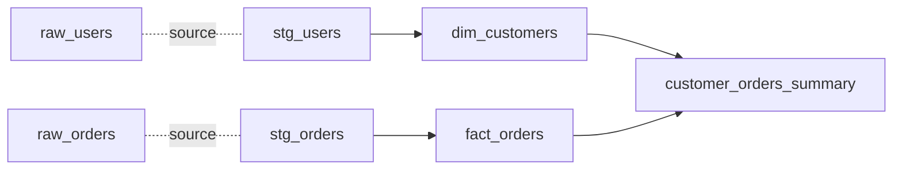

# Вопросы на собеседовании: `dbt`

`dbt (data build tool)` — инструмент для **transformations внутри data warehouse**. Использует **SQL + Jinja templates**, добавляет тесты, документацию, lineage. Революционизировал ELT-подход в data engineering. Создан **dbt Labs** (Fishtown Analytics, 2016).

## Полезные ссылки

### Официальная документация и авторитетные источники

- [dbt Documentation](https://docs.getdbt.com/)
- [dbt Best Practices](https://docs.getdbt.com/best-practices)
- [dbt vs Airflow Comparison](https://www.getdbt.com/blog/dbt-airflow-comparison)
- [Data Engineering with dbt — Books](https://www.packtpub.com/product/data-engineering-with-dbt/9781803246284)
- [dbt Discourse](https://discourse.getdbt.com/)

## Содержание

- [Полезные ссылки](#полезные-ссылки)
- [See also](#see-also)

**Базовые понятия**
- [Q1. (!) Что такое dbt?](#q1--что-такое-dbt)
- [Q2. (!) ETL vs ELT — какой подход у dbt?](#q2--etl-vs-elt--какой-подход-у-dbt)
- [Q3. (!) Чем dbt отличается от Airflow?](#q3--чем-dbt-отличается-от-airflow)
- [Q4. Чем отличаются dbt Core и dbt Cloud?](#q4-чем-отличаются-dbt-core-и-dbt-cloud)

**Models**
- [Q5. (!) Что такое model в dbt?](#q5--что-такое-model-в-dbt)
- [Q6. (!) ref() и source() — что и зачем?](#q6--ref-и-source--что-и-зачем)
- [Q7. (!) Способы материализации: table, view, incremental, ephemeral?](#q7--способы-материализации-table-view-incremental-ephemeral)
- [Q8. Snapshot — что это?](#q8-snapshot--что-это)

**Конфигурация**
- [Q9. (!) Что задаётся в dbt_project.yml?](#q9--что-задаётся-в-dbt_projectyml)
- [Q10. profiles.yml — как описываются подключения к хранилищу?](#q10-profilesyml--как-описываются-подключения-к-хранилищу)
- [Q11. Какие БД поддерживаются (adapters)?](#q11-какие-бд-поддерживаются-adapters)

**Тесты**
- [Q12. (!) Какие тесты встроены в dbt?](#q12--какие-тесты-встроены-в-dbt)
- [Q13. Как написать собственный тест данных?](#q13-как-написать-собственный-тест-данных)
- [Q14. Что даёт пакет dbt-utils?](#q14-что-даёт-пакет-dbt-utils)

**Macros и Jinja**
- [Q15. (!) Macros — что это?](#q15--macros--что-это)
- [Q16. Как работает шаблонизация Jinja в dbt?](#q16-как-работает-шаблонизация-jinja-в-dbt)
- [Q17. Что такое hooks (on-run-start, post-hook)?](#q17-что-такое-hooks-on-run-start-post-hook)

**Документация и lineage**
- [Q18. (!) dbt docs — что генерирует?](#q18--dbt-docs--что-генерирует)
- [Q19. (!) Что такое data lineage в dbt?](#q19--что-такое-data-lineage-в-dbt)

**Команды и workflow**
- [Q20. (!) Основные dbt команды?](#q20--основные-dbt-команды)
- [Q21. (!) Чем dbt run отличается от dbt build?](#q21--чем-dbt-run-отличается-от-dbt-build)
- [Q22. Selectors — как выбирать, какие модели запускать?](#q22-selectors--как-выбирать-какие-модели-запускать)

**Best practices**
- [Q23. (!) Слоистая архитектура: staging, intermediate, marts?](#q23--слоистая-архитектура-staging-intermediate-marts)
- [Q24. (!) Incremental models — в чём особенности?](#q24--incremental-models--в-чём-особенности)
- [Q25. Что такое семантический слой (Semantic Layer)?](#q25-что-такое-семантический-слой-semantic-layer)

**Production**
- [Q26. (!) Как развернуть dbt в production?](#q26--как-развернуть-dbt-в-production)
- [Q27. (!) Как интегрируют dbt с Airflow?](#q27--как-интегрируют-dbt-с-airflow)
- [Q28. Какие минусы dbt?](#q28-какие-минусы-dbt)

## Q1. (!) Что такое dbt?

`dbt (data build tool)` — фреймворк, который превращает SQL-запросы в управляемые, тестируемые, документированные трансформации прямо внутри хранилища данных. Вы описываете модели обычным `SELECT`-ом, а dbt сам компилирует их, разбирается в зависимостях и выполняет в правильном порядке.

Главная идея: трансформации — это код, и к нему применимы те же практики, что и к обычному софту (версионирование, тесты, ревью, CI). dbt не хранит и не двигает данные сам — он генерирует и отправляет SQL в ваше хранилище.

**Что даёт dbt поверх голого SQL:**
- **SQL как основной язык** — не Python и не Java; писать модели может и аналитик.
- **Jinja-шаблоны** — макросы, циклы и условия делают SQL динамическим.
- **Тесты** — встроенные (`unique`, `not_null`, `accepted_values`) плюс собственные.
- **Документация** — генерируется автоматически из кода и описаний.
- **DAG и lineage** — граф зависимостей строится сам из ссылок `ref()`.
- **Materializations** — модель можно материализовать как view, table, incremental или ephemeral.

**Где применяют:** трансформации в Snowflake, BigQuery, Redshift, Databricks, PostgreSQL, ClickHouse.

## Q2. (!) ETL vs ELT — какой подход у dbt?

dbt — это **ELT**: сырые данные сначала загружают в хранилище как есть, а трансформируют уже внутри него, на SQL. Ключевое отличие от классического ETL — в том, **где** происходит шаг Transform.

| Подход | Где трансформация | Кто пишет |
|--------|---------------|----------|
| **ETL** | Во внешнем инструменте (Spark, Informatica) | Дата-инженеры |
| **ELT** | Внутри хранилища, на SQL | Analytics engineers, аналитики |

```
ETL: Source → Transform (Spark) → Warehouse
ELT: Source → Warehouse (raw) → Transform (dbt SQL) → Marts
```

В ETL преобразования делают по пути в хранилище отдельным движком. В ELT — сначала грузят «грязные» данные, а потом чистят и собирают витрины запросами уже внутри warehouse. dbt отвечает именно за этот последний шаг.

**Почему ELT с dbt выигрывает:**
- Задействуется вычислительная мощность современных хранилищ (Snowflake, BigQuery, Databricks) — масштабировать Spark-кластер отдельно не нужно.
- Аналитики пишут трансформации сами на знакомом им SQL, не дёргая инженеров.
- Меньше кастомного кода вне хранилища — меньше точек отказа и багов.

## Q3. (!) Чем dbt отличается от Airflow?

Это инструменты из разных слоёв, а не конкуренты: **dbt трансформирует данные, Airflow оркестрирует пайплайны**. dbt отвечает на вопрос «как преобразовать данные», Airflow — «когда и в каком порядке запустить шаги».

| Критерий | dbt | Airflow |
|----------|-----|---------|
| Назначение | Трансформации | Оркестрация |
| Язык | SQL + Jinja | Python |
| Где исполняется | Внутри хранилища | На своих воркерах |
| Двигает данные | Нет (всё в хранилище) | Да |
| Расписание | Нет (запуск извне) | Да, встроенное |
| Тесты | Встроены | Через сторонние (Great Expectations) |

**На практике их используют вместе.** Airflow дирижирует всем пайплайном, а внутри одного из шагов вызывает dbt для трансформаций:

```
Airflow DAG:
  1. Extract (Python/Singer)
  2. Load в warehouse (S3/Snowpipe)
  3. dbt run (transform)
  4. dbt test
  5. Send to BI tool
```

## Q4. Чем отличаются dbt Core и dbt Cloud?

Это два способа запускать один и тот же движок. **dbt Core** — бесплатная open-source CLI-утилита, которую вы сами разворачиваете и оркеструете. **dbt Cloud** — платный SaaS поверх Core, который добавляет управляемую инфраструктуру вокруг.

| Редакция | Описание |
|--------|----------|
| **dbt Core** | Open-source CLI-утилита. Бесплатно. |
| **dbt Cloud** | SaaS от dbt Labs: веб-IDE, планировщик, хостинг документации, CI/CD. Платный. |

```bash
# Core — установка через pip
pip install dbt-snowflake  # или dbt-bigquery, dbt-postgres, ...
dbt run
```

Поверх Core dbt Cloud даёт:
- веб-IDE для редактирования прямо в браузере;
- встроенный планировщик запусков (Airflow не нужен);
- хостинг сайта с документацией;
- интеграцию с Git и готовый CI/CD;
- уведомления в Slack;
- Semantic Layer.

**Когда брать Core:** когда нужен self-hosted и интеграция со своим стеком оркестрации (Airflow, CI). **Когда Cloud:** когда команда не хочет содержать инфраструктуру и платит за готовое решение.

## Q5. (!) Что такое model в dbt?

**Модель — это просто SQL-файл с `SELECT` в каталоге `models/`.** Один файл превращается в одну таблицу или представление в хранилище: имя файла становится именем объекта, а тело запроса — его содержимым.

```sql
-- models/marts/customer_orders.sql

SELECT
    c.customer_id,
    c.name,
    COUNT(o.order_id) AS order_count,
    SUM(o.amount) AS total_spent
FROM {{ ref('stg_customers') }} c
LEFT JOIN {{ ref('stg_orders') }} o ON c.customer_id = o.customer_id
GROUP BY c.customer_id, c.name
```

При `dbt run` dbt по каждой модели:
1. разбирает SQL и шаблоны Jinja;
2. подставляет вместо `{{ ref(...) }}` реальные имена таблиц с учётом окружения;
3. оборачивает результат в `CREATE TABLE` или `CREATE VIEW` и выполняет в хранилище.

Вы пишете только `SELECT` — всю обвязку с DDL и порядком выполнения dbt берёт на себя.

## Q6. (!) ref() и source() — что и зачем?

Это два способа сослаться на данные так, чтобы dbt сам понимал зависимости. **`ref()`** указывает на другую dbt-модель, **`source()`** — на сырую таблицу, которую загрузил не dbt. Прямые имена таблиц в SQL писать не нужно — иначе dbt не увидит связь и не построит DAG.

**`ref('model_name')`** — ссылка на другую модель dbt.

```sql
SELECT * FROM {{ ref('stg_users') }}
```

**`source('schema', 'table')`** — ссылка на сырую таблицу в хранилище, загруженную внешним процессом, а не dbt.

```yaml
# models/sources.yml
version: 2
sources:
  - name: raw
    schema: raw_data
    tables:
      - name: events
      - name: users
```

```sql
SELECT * FROM {{ source('raw', 'events') }}
```

**Зачем это нужно:**
- dbt автоматически строит **DAG** зависимостей из этих ссылок и сам выбирает порядок запуска моделей.
- При переименовании или переносе таблиц правка нужна только в одном месте — в определении источника, а не в десятках запросов.
- На этапе компиляции dbt проверяет, что все ссылки разрешимы, и ловит «битые» зависимости заранее.

## Q7. (!) Способы материализации: table, view, incremental, ephemeral?

**Materialization** — это стратегия того, как dbt физически воплотит модель в хранилище. От выбора зависят скорость и стоимость: представление дёшево строить, но дорого читать; таблицу дорого собирать, но быстро читать. Конфигурируется одной строкой:

```sql
{{ config(materialized='table') }}    -- CREATE TABLE
{{ config(materialized='view') }}      -- CREATE VIEW
{{ config(materialized='incremental') }} -- INSERT ... WHERE new
{{ config(materialized='ephemeral') }}   -- CTE inline в downstream
```

| Способ | Когда выбирать |
|----------------|-------|
| `view` | Лёгкие, простые трансформации; результат пересчитывается при каждом чтении |
| `table` | Дорогие join'ы и частые чтения — платим за построение один раз |
| `incremental` | Большие fact-таблицы, где перестраивать всё каждый раз бессмысленно |
| `ephemeral` | Промежуточные CTE — встраиваются в зависимые модели и не материализуются |

```sql
{{ config(
    materialized='incremental',
    unique_key='id',
    incremental_strategy='merge'
) }}

SELECT * FROM {{ source('raw', 'events') }}

    WHERE event_time > (SELECT MAX(event_time) FROM {{ this }})

```

Здесь `is_incremental()` истинен только при дозагрузке (таблица уже существует и запуск без `--full-refresh`): тогда блок `WHERE` отсекает уже обработанные строки, и dbt добавляет лишь новые. `{{ this }}` — ссылка на саму строящуюся модель.

## Q8. Snapshot — что это?

**Snapshot фиксирует историю изменений строки** — это способ реализовать медленно меняющиеся измерения (slowly changing dimensions, SCD) Type 2. Источник часто хранит только текущее состояние записи; snapshot периодически сравнивает его с предыдущим срезом и, если что-то поменялось, сохраняет новую версию, не затирая старую.

```sql

{{
    config(
        target_schema='snapshots',
        unique_key='user_id',
        strategy='timestamp',
        updated_at='updated_at'
    )
}}

SELECT * FROM {{ source('raw', 'users') }}


```

В результате dbt создаёт таблицу с колонками `dbt_valid_from` и `dbt_valid_to` — границами интервала, в течение которого версия записи была актуальна. У текущей версии `dbt_valid_to` пустой. Так по таблице можно восстановить, как выглядела запись на любую дату в прошлом.

## Q9. (!) Что задаётся в dbt_project.yml?

`dbt_project.yml` — корневой конфиг проекта: его наличие и говорит dbt, что это dbt-проект. Здесь задают имя проекта, привязку к профилю подключения, пути к каталогам и дефолтные настройки моделей (например, материализацию и схему по папкам).

```yaml
name: 'my_project'
version: '1.0.0'
profile: 'my_warehouse'

model-paths: ["models"]
seed-paths: ["seeds"]
snapshot-paths: ["snapshots"]
test-paths: ["tests"]

models:
  my_project:
    staging:
      +materialized: view
      +schema: staging
    marts:
      +materialized: table
      +schema: marts

vars:
  start_date: '2020-01-01'
```

Префикс `+` помечает настройку, которая каскадно применяется ко всем моделям в этой папке (и вложенных), пока модель не переопределит её у себя. Так дефолты задают один раз на уровне слоя, а не в каждом файле.

## Q10. profiles.yml — как описываются подключения к хранилищу?

`profiles.yml` хранит реквизиты подключения к хранилищу — тип адаптера, хост, креды, базу и схему. Его держат отдельно от кода проекта (по умолчанию в `~/.dbt/profiles.yml`), чтобы секреты не попадали в репозиторий. Один профиль может содержать несколько окружений (`dev`, `prod`), а проект ссылается на профиль по имени из `dbt_project.yml`.

В `~/.dbt/profiles.yml`:

```yaml
my_warehouse:
  target: dev
  outputs:
    dev:
      type: snowflake
      account: myorg-account
      user: dbt_user
      password: "{{ env_var('SNOWFLAKE_PASSWORD') }}"
      role: TRANSFORMER
      database: ANALYTICS_DEV
      warehouse: COMPUTE_WH
      schema: dbt_alice
    prod:
      type: snowflake
      account: myorg-account
      ...
      schema: prod
```

`target: dev` задаёт, какое окружение используется по умолчанию. Чтобы прогнать модели против другого, передают флаг явно: `dbt run --target prod`. Пароль здесь не хардкодят, а подтягивают из переменной окружения через `env_var(...)`.

## Q11. Какие БД поддерживаются (adapters)?

С хранилищем dbt работает через адаптер — плагин, который знает диалект SQL и API конкретной СУБД. Адаптер ставится отдельным пакетом, поэтому ядро dbt не привязано к одной базе.

**Официальные адаптеры (от dbt Labs):**
- Snowflake (`dbt-snowflake`)
- BigQuery (`dbt-bigquery`)
- Redshift (`dbt-redshift`)
- PostgreSQL (`dbt-postgres`)

**Адаптеры от сообщества и вендоров:**
- Databricks
- Spark
- ClickHouse
- DuckDB
- Trino / Starburst
- Athena
- и многие другие

```bash
pip install dbt-snowflake
pip install dbt-bigquery
pip install dbt-clickhouse
```

## Q12. (!) Какие тесты встроены в dbt?

Тесты в dbt — это проверки качества данных, которые объявляют в YAML рядом с моделью. Каждый тест под капотом превращается в SQL-запрос, который ищет «плохие» строки; если такие нашлись — тест падает. Из коробки доступны четыре самых частых проверки.

```yaml
# models/marts/customers.yml
version: 2
models:
  - name: customers
    columns:
      - name: customer_id
        tests:
          - unique
          - not_null
      - name: status
        tests:
          - accepted_values:
              values: ['active', 'inactive', 'churned']
      - name: region_id
        tests:
          - relationships:
              to: ref('regions')
              field: region_id
```

**Четыре встроенных теста:**
- `unique` — все значения в колонке уникальны;
- `not_null` — нет пустых значений;
- `accepted_values` — встречаются только значения из заданного списка;
- `relationships` — ссылочная целостность: каждое значение есть в колонке другой таблицы.

```bash
dbt test
# Запускает все тесты, выводит results
```

## Q13. Как написать собственный тест данных?

Когда встроенных проверок мало, пишут собственный тест — обычный SQL-файл в каталоге `tests/`, который выбирает «нарушающие» строки. Логика та же, что у встроенных тестов: запрос должен находить только проблемные записи.

```sql
-- tests/assert_total_orders_positive.sql

SELECT order_id
FROM {{ ref('orders') }}
WHERE total < 0
```

Тест считается пройденным, если **запрос вернул 0 строк** — то есть нарушений не нашлось. Любая возвращённая строка означает провал.

```bash
dbt test --select assert_total_orders_positive
```

## Q14. Что даёт пакет dbt-utils?

`dbt-utils` — самый популярный сторонний пакет от dbt Labs. Он расширяет арсенал проверок за пределы четырёх встроенных и добавляет готовые тесты бизнес-смысла — например, что значение лежит в диапазоне или удовлетворяет произвольному выражению:

```yaml
columns:
  - name: amount
    tests:
      - dbt_utils.expression_is_true:
          expression: ">= 0"
      - dbt_utils.accepted_range:
          min_value: 0
          max_value: 1000
```

Кроме тестов, в пакете есть макросы для частых SQL-паттернов — `pivot`, дедупликация, генерация диапазона дат и прочее, чтобы не переписывать их вручную в каждом проекте.

## Q15. (!) Macros — что это?

**Макрос — это переиспользуемый блок на Jinja, по сути функция для SQL.** В SQL нет нормальных функций для повторного использования кусков логики — макрос закрывает эту брешь: один раз описали, дальше подставляете в любую модель.

```sql
-- macros/cents_to_dollars.sql

    ({{ column_name }} / 100)::numeric(16, {{ scale }})


-- В модели
SELECT
    order_id,
    {{ cents_to_dollars('amount_cents', 2) }} AS amount_dollars
FROM {{ ref('stg_orders') }}
```

Где это удобно:
- вынести повторяющиеся куски SQL в одно место;
- условная логика под конкретное хранилище (разный синтаксис у Snowflake и BigQuery);
- циклы для генерации колонок — когда их десятки и руками писать долго.

## Q16. Как работает шаблонизация Jinja в dbt?

Jinja — это шаблонизатор, который dbt выполняет **до** отправки SQL в хранилище. Он позволяет вставлять в запрос переменные, условия и циклы: на этапе компиляции Jinja разворачивается в обычный статический SQL, который и уходит в базу. Базовые приёмы:

```sql
-- Условия

    SELECT * FROM big_table

    SELECT * FROM big_table LIMIT 1000


-- Циклы
SELECT
    
        SUM(CASE WHEN region = '{{ region }}' THEN amount END) AS {{ region }}_total
        ,
    
FROM orders

-- Variables

SELECT * FROM events WHERE date >= '{{ min_date }}'

-- env_var
SELECT * FROM users WHERE country = '{{ env_var("DEFAULT_COUNTRY") }}'
```

Jinja делает SQL динамическим — это мощно, но усложняет отладку: вы пишете шаблон, а в базу уходит уже развёрнутый код. **Подводный камень:** смотреть стоит не на исходник, а на скомпилированный SQL (`dbt compile` или вкладка compiled). Не злоупотребляйте логикой в шаблонах — её тяжело читать и поддерживать.

## Q17. Что такое hooks (on-run-start, post-hook)?

**Hook — это произвольный SQL, который dbt выполняет в определённый момент жизненного цикла запуска.** Хуки нужны, когда помимо самих моделей надо что-то сделать в базе: создать схему, выдать гранты, обновить статистику. Их объявляют в `dbt_project.yml`:

```yaml
# dbt_project.yml
on-run-start:
  - "CREATE SCHEMA IF NOT EXISTS analytics"

on-run-end:
  - "GRANT SELECT ON ALL TABLES IN SCHEMA analytics TO bi_user"

models:
  my_project:
    +post-hook:
      - "VACUUM {{ this }}"
```

Когда срабатывает каждый хук:
- `on-run-start` — один раз, перед всем запуском `dbt run`;
- `on-run-end` — один раз, после завершения запуска;
- `pre-hook` — перед построением конкретной модели;
- `post-hook` — после построения конкретной модели.

**Сценарии применения:** выдача грантов, `VACUUM`, обновление статистики оптимизатора, создание индексов.

## Q18. (!) dbt docs — что генерирует?

`dbt docs` собирает из кода и YAML-описаний статический сайт документации — единый каталог всех моделей с их связями. Главная ценность в том, что документация генерируется **из того же кода**, поэтому не расходится с реальностью.

```bash
dbt docs generate
dbt docs serve
```

Получается HTML-сайт, где есть:
- описания моделей (из поля `description:` в YAML);
- описания колонок;
- граф lineage — DAG зависимостей между моделями;
- список тестов на каждой модели;
- скомпилированный SQL;
- свежесть источников (source freshness).

```yaml
models:
  - name: customers
    description: "Cleaned customer data, one row per customer"
    columns:
      - name: customer_id
        description: "Primary key"
        tests:
          - unique
```

Документация всегда синхронизирована с кодом — нет риска, что она устареет: при следующей генерации она просто перестроится из актуальных моделей.

## Q19. (!) Что такое data lineage в dbt?

**Lineage — это граф происхождения данных: какая модель из чего собрана и на что влияет.** dbt строит его автоматически, разбирая ссылки `ref()` и `source()` в коде, — отдельно вести схему зависимостей не нужно:



**Зачем это нужно:**
- видно, **на какие данные опирается** каждая модель (зависимости вверх по графу);
- видно, **что зависит** от модели (зависимости вниз);
- анализ влияния: «если поменяю эту таблицу — что сломается ниже по цепочке?».

Команда `dbt docs serve` показывает этот граф интерактивно — можно кликать по узлам и обходить зависимости.

## Q20. (!) Основные dbt команды?

Работа с dbt — это набор CLI-команд, каждая отвечает за свой этап: подтянуть зависимости, загрузить справочники, построить модели, прогнать тесты, собрать документацию. Самые ходовые:

```bash
dbt deps              # установить packages
dbt seed              # загрузить CSV → tables
dbt run               # запустить models (в правильном порядке)
dbt test              # запустить тесты
dbt build             # run + test + seed (все вместе)
dbt snapshot          # обновить snapshots
dbt docs generate     # сгенерировать docs
dbt docs serve        # запустить локальный docs server
dbt compile           # compile SQL без выполнения
dbt source freshness  # проверить актуальность sources
dbt run-operation <macro>  # выполнить macro
```

## Q21. (!) Чем dbt run отличается от dbt build?

`dbt run` строит только модели. `dbt build` запускает всё сразу — модели, тесты, сиды и снапшоты — и, главное, **переплетает построение с проверками**: тесты выполняются прямо в графе, а не в конце.

```bash
dbt run     # только models
dbt test    # только tests
dbt seed    # только seeds
dbt snapshot # только snapshots

dbt build    # ВСЁ + проверка тестов перед downstream
```

`dbt build` рекомендуют для production, потому что он:
- строит модели в порядке DAG;
- сразу после каждой модели прогоняет её тесты;
- если тесты упали — зависимые модели ниже по графу не строит.

Связка `dbt run` + `dbt test` по отдельности менее безопасна: модели уже построены, и битые данные могут просочиться в зависимые витрины до того, как сработают тесты.

## Q22. Selectors — как выбирать, какие модели запускать?

Селекторы — это синтаксис флага `--select`, который говорит dbt, какое подмножество DAG строить. Ключевой приём — знак `+`: он добавляет соседей по графу. `+model` подтягивает всё, от чего модель зависит (upstream), `model+` — всё, что зависит от неё (downstream).

```bash
dbt run --select my_model           # одна модель
dbt run --select +my_model           # модель + все upstream
dbt run --select my_model+           # модель + downstream
dbt run --select +my_model+          # вся цепочка

dbt run --select staging.*           # все в папке staging
dbt run --select tag:critical        # по tag
dbt run --select state:modified      # только изменённые (CI)
dbt run --select my_model --exclude staging.*
```

Селектор `--select state:modified` — основа **slim CI**: в пайплайне dbt сравнивает текущий код с эталонным манифестом и пересобирает только изменённые модели и их зависимые, а не весь warehouse. Это резко ускоряет проверки на pull request.

## Q23. (!) Слоистая архитектура: staging, intermediate, marts?

dbt Labs рекомендует раскладывать модели по трём слоям, чтобы преобразования шли пошагово: сначала аккуратно очистить сырьё, потом собрать бизнес-логику, и только в конце оформить витрины для BI. Чёткое разделение упрощает поддержку и переиспользование моделей.

Рекомендуемая структура каталогов:

```
models/
  ├── staging/        # 1:1 с raw, базовая очистка (rename, types)
  │   ├── stripe/
  │   │   ├── stg_stripe__customers.sql
  │   │   └── stg_stripe__charges.sql
  │   └── ...
  ├── intermediate/    # joins, business logic
  │   └── int_orders_with_customers.sql
  └── marts/          # finals для BI
      ├── core/
      │   ├── dim_customers.sql
      │   └── fact_orders.sql
      └── finance/
          └── monthly_revenue.sql
```

**Назначение слоёв:**
- **Staging** — отображение 1:1 с сырыми таблицами: только переименование колонок, приведение типов, базовая чистка. Обычно материализуют как view.
- **Intermediate** — соединения и бизнес-логика, промежуточные результаты. Материализуют как table или ephemeral.
- **Marts** — финальные модели (измерения и факты), готовые к подключению в BI. Материализуют как table.

## Q24. (!) Incremental models — в чём особенности?

Инкрементальная модель не перестраивается целиком при каждом запуске, а **дозагружает только новые или изменённые строки**. Это спасает на больших fact-таблицах, где полный пересчёт стоил бы часов работы и кучи денег за compute. Внутри модель использует блок `is_incremental()`, чтобы при дозагрузке отсечь уже обработанное:

```sql
{{ config(
    materialized='incremental',
    unique_key='order_id',
    incremental_strategy='merge'
) }}

SELECT * FROM {{ source('raw', 'orders') }}


    WHERE updated_at > (SELECT MAX(updated_at) FROM {{ this }})

```

**Стратегии дозагрузки:**
- `merge` — `MERGE` (или `DELETE` + `INSERT`); подходит, когда строки могут обновляться;
- `append` — только `INSERT`; для неизменяемых событий, которые не правятся;
- `delete+insert` — для хранилищ без поддержки `MERGE`;
- `insert_overwrite` — для секционированных таблиц (BigQuery, Spark): перезаписывает целые партиции.

**Подводный камень:** при самом первом запуске (или после `--full-refresh`) обрабатываются ВСЕ данные — блок `is_incremental()` ещё неактивен. Дозагрузка включается только со второго запуска.

Команда `dbt run --full-refresh` принудительно пересоздаёт таблицу с нуля — нужна, например, если поменялась логика модели и старые строки стали некорректными.

## Q25. Что такое семантический слой (Semantic Layer)?

Semantic Layer (появился в dbt 1.6+, работает на движке MetricFlow) — это слой, где метрики и измерения описываются **один раз** в YAML, а инструменты потом запрашивают их по имени, а не пересчитывают SQL-ом каждый сам. Вы объявляете measures (что агрегировать) и dimensions (в каких разрезах), а поверх — метрики:

```yaml
semantic_models:
  - name: orders
    model: ref('orders')
    measures:
      - name: order_count
        agg: count
      - name: total_revenue
        agg: sum
        expr: amount
    dimensions:
      - name: order_date
        type: time
      - name: customer_id
        type: categorical

metrics:
  - name: monthly_revenue
    type: simple
    type_params:
      measure: total_revenue
```

Запрос к слою идёт через специальный макрос: вы перечисляете нужные метрики и разрезы, а MetricFlow сам генерирует корректный SQL:

```sql
SELECT * FROM {{ semantic_layer.query(
    metrics=['monthly_revenue'],
    group_by=['order_date'],
    where=['customer_segment = \'premium\'']
) }}
```

Главная идея — единый источник правды для метрик. Раньше каждый BI-инструмент считал, скажем, MRR по своей формуле, и цифры расходились. С Semantic Layer определение метрики одно на всех, поэтому отчёты сходятся.

## Q26. (!) Как развернуть dbt в production?

dbt сам ничего не планирует, поэтому в проде ему нужна обвязка — оркестратор или CI, который регулярно запускает `dbt build`. Выбор зависит от того, хотите ли вы платить за managed-сервис или собирать всё на своём стеке.

**Варианты:**

1. **dbt Cloud** — managed: планировщик, IDE и документация из коробки.
2. **Airflow + dbt Core** — оркестратор вызывает `dbt run` как шаг пайплайна.
3. **GitHub Actions / GitLab CI** — на каждый pull request гоняется `dbt build`.
4. **dbt Cloud + GitHub** — комбинация: расписание в Cloud, ревью и CI в Git.

```yaml
# .github/workflows/dbt.yml
- name: Run dbt build
  run: |
    dbt deps
    dbt build --profiles-dir ./profiles
```

**Чек-лист готовности к продакшену:**
- раздельные профили `dev` / `staging` / `prod`;
- тесты в CI (`dbt test`), чтобы битые данные не доезжали до прода;
- slim CI (`--select state:modified`) — пересобирать только изменённое;
- хостинг документации (S3, dbt Cloud);
- уведомления о падениях (например, в Slack);
- сравнение манифестов для анализа влияния изменений.

## Q27. (!) Как интегрируют dbt с Airflow?

Это самая распространённая связка в дата-инженерии: Airflow управляет всем пайплайном, а dbt подключают как один из его шагов. Самый простой способ — вызвать `dbt build` из `BashOperator`, выстроив зависимость «загрузка → трансформация → уведомление»:

```python
# Airflow DAG
@dag(...)
def my_pipeline():
    extract_load = SnowflakePipeOperator(...)  # load raw

    dbt_run = BashOperator(
        task_id='dbt_run',
        bash_command='cd /opt/dbt && dbt build',
    )

    notify = SlackOperator(...)

    extract_load >> dbt_run >> notify
```

Более продвинутый подход — **Astronomer Cosmos**: он автоматически разворачивает dbt-проект в Airflow DAG, где каждая dbt-модель становится отдельной задачей. Это даёт детальную видимость и ретраи на уровне моделей вместо одного «чёрного ящика» `dbt build`.

## Q28. Какие минусы dbt?

Минусы вытекают прямо из его дизайна: dbt — это «SQL внутри хранилища», и всё, что выходит за эти рамки, ему даётся плохо.

1. **Работает только в хранилище** — не для стриминга и не для денормализованных источников вне warehouse.
2. **Только SQL** — сложные преобразования (например, ML-препроцессинг) на нём не выразить.
3. **Тесты слабее**, чем у специализированных инструментов вроде Great Expectations или Soda.
4. **Нет оркестрации** в dbt Core — расписание и зависимости между пайплайнами всё равно нужны извне (Airflow).
5. **Jinja тяжело отлаживать** — просмотр скомпилированного SQL спасает, но не всегда.
6. **Медленно на больших проектах** — разбор манифеста с тысячами моделей занимает время.
7. **Привязка к вендору** — часть фич (Semantic Layer и др.) полноценно работает только в dbt Cloud.
8. **Дрейф схемы** — изменения в источниках не отслеживаются автоматически и могут тихо ломать модели.

На 2024 год dbt — де-факто стандарт для analytics engineering. Из конкурентов стоит упомянуть SQLMesh и Coalesce.

## See also

- [Apache Airflow](apache-airflow-interview.md) — частая пара (orchestration + dbt)
- [Apache Spark](apache-spark-interview.md) — для ETL до dbt в warehouse
- [Data Warehousing](data-warehousing-interview.md) — где работает dbt
- [Data Lake / Lakehouse](data-lake-lakehouse-interview.md) — modern context
- [PostgreSQL](../databases/postgresql-interview.md) — один из targets
- [SQL](../databases/sql-interview.md) — основа dbt models
- [Stream Processing](stream-processing-interview.md) — vs batch dbt
- [Микросервисы](../architecture/microservices-interview.md) — другой паттерн (event-driven)
- [Git](../devops/git-interview.md) — обязательный для dbt projects
- [Unit Testing](../testing/unit-testing-interview.md) — концепции тестов

- [Apache Flink](apache-flink-interview.md)
- [Apache Spark](apache-spark-interview.md)
- [Data Lake и Lakehouse](data-lake-lakehouse-interview.md)
- [Data Warehousing](data-warehousing-interview.md)
- [Kafka Streams](kafka-streams-interview.md)
