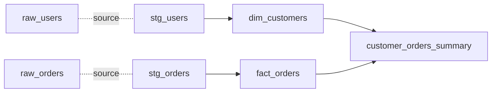

# Вопросы на собеседовании: `dbt`

`dbt (data build tool)` — инструмент для **transformations внутри data warehouse**. Использует **SQL + Jinja templates**, добавляет тесты, документацию, lineage. Революционизировал ELT-подход в data engineering. Создан **dbt Labs** (Fishtown Analytics, 2016).

## Полезные ссылки

### Официальная документация и авторитетные источники

- [dbt Documentation](https://docs.getdbt.com/)
- [dbt Best Practices](https://docs.getdbt.com/best-practices)
- [dbt vs Airflow Comparison](https://www.getdbt.com/blog/dbt-airflow-comparison)
- [Data Engineering with dbt — Books](https://www.packtpub.com/product/data-engineering-with-dbt/9781803246284)
- [dbt Discourse](https://discourse.getdbt.com/)

## Содержание

- [Полезные ссылки](#полезные-ссылки)
- [See also](#see-also)

**Базовые понятия**
- [Q1. (!) Что такое dbt?](#q1--что-такое-dbt)
- [Q2. (!) ETL vs ELT — какой подход у dbt?](#q2--etl-vs-elt--какой-подход-у-dbt)
- [Q3. (!) Чем dbt отличается от Airflow?](#q3--чем-dbt-отличается-от-airflow)
- [Q4. dbt Core vs dbt Cloud?](#q4-dbt-core-vs-dbt-cloud)

**Models**
- [Q5. (!) Что такое model в dbt?](#q5--что-такое-model-в-dbt)
- [Q6. (!) ref() и source() — что и зачем?](#q6--ref-и-source--что-и-зачем)
- [Q7. (!) Materializations: table, view, incremental, ephemeral?](#q7--materializations-table-view-incremental-ephemeral)
- [Q8. Snapshot — что это?](#q8-snapshot--что-это)

**Конфигурация**
- [Q9. (!) dbt_project.yml?](#q9--dbt_projectyml)
- [Q10. profiles.yml — connections к warehouse?](#q10-profilesyml--connections-к-warehouse)
- [Q11. Какие БД поддерживаются (adapters)?](#q11-какие-бд-поддерживаются-adapters)

**Тесты**
- [Q12. (!) Built-in тесты dbt?](#q12--built-in-тесты-dbt)
- [Q13. Custom data tests?](#q13-custom-data-tests)
- [Q14. dbt-utils тесты?](#q14-dbt-utils-тесты)

**Macros и Jinja**
- [Q15. (!) Macros — что это?](#q15--macros--что-это)
- [Q16. Jinja templating в dbt?](#q16-jinja-templating-в-dbt)
- [Q17. Hooks (on-run-start, post-hook)?](#q17-hooks-on-run-start-post-hook)

**Документация и lineage**
- [Q18. (!) dbt docs — что генерирует?](#q18--dbt-docs--что-генерирует)
- [Q19. (!) Data lineage?](#q19--data-lineage)

**Команды и workflow**
- [Q20. (!) Основные dbt команды?](#q20--основные-dbt-команды)
- [Q21. (!) dbt run vs dbt build?](#q21--dbt-run-vs-dbt-build)
- [Q22. Selectors — выбор моделей?](#q22-selectors--выбор-моделей)

**Best practices**
- [Q23. (!) Layered architecture (staging, intermediate, marts)?](#q23--layered-architecture-staging-intermediate-marts)
- [Q24. (!) Incremental models — особенности?](#q24--incremental-models--особенности)
- [Q25. Семантические модели (Semantic Layer)?](#q25-семантические-модели-semantic-layer)

**Production**
- [Q26. (!) Как deploy dbt в production?](#q26--как-deploy-dbt-в-production)
- [Q27. (!) dbt + Airflow интеграция?](#q27--dbt--airflow-интеграция)
- [Q28. Какие минусы dbt?](#q28-какие-минусы-dbt)

## Q1. (!) Что такое dbt?

(!) Что такое dbt?

`dbt (data build tool)` — фреймворк для **transformations внутри data warehouse**. Описываешь модели на **SQL**, dbt компилирует и выполняет их в правильном порядке.

**Ключевые особенности:**
- **SQL как первый язык** — не Python, не Java
- **Jinja templating** — макросы, циклы, условия
- **Tests** — встроенные (unique, not_null, accepted_values) + custom
- **Documentation** — автогенерируется
- **DAG / lineage** — построен из `ref()` ссылок
- **Materializations** — view, table, incremental, ephemeral

**Применение:** transformations в Snowflake, BigQuery, Redshift, Databricks, PostgreSQL, ClickHouse.

## Q2. (!) ETL vs ELT — какой подход у dbt?

| Подход | Где transform | Кто пишет |
|--------|---------------|----------|
| **ETL** | Внешний tool (Spark, Informatica) | Data engineers |
| **ELT** | В warehouse, через SQL | Analytics engineers, аналитики |

```
ETL: Source → Transform (Spark) → Warehouse
ELT: Source → Warehouse (raw) → Transform (dbt SQL) → Marts
```

**dbt — ELT подход.** Загружаем raw данные, потом трансформируем SQL-ом в warehouse.

**Преимущества ELT с dbt:**
- Используем мощность modern warehouses (Snowflake, BQ, Databricks)
- Аналитики пишут transformations сами (через SQL)
- Меньше кастомного кода, меньше bugs

## Q3. (!) Чем dbt отличается от Airflow?

| Критерий | dbt | Airflow |
|----------|-----|---------|
| Тип | Transformation | Orchestration |
| Язык | SQL + Jinja | Python |
| Where runs | Внутри warehouse | На своих workers |
| Data movement | Нет (в warehouse) | Да |
| Schedule | Нет (внешний trigger) | Да |
| Tests | Built-in | Сторонний (Great Expectations) |

**dbt и Airflow — комплементарны.** Airflow оркестрирует, dbt трансформирует:

```
Airflow DAG:
  1. Extract (Python/Singer)
  2. Load в warehouse (S3/Snowpipe)
  3. dbt run (transform)
  4. dbt test
  5. Send to BI tool
```

## Q4. dbt Core vs dbt Cloud?

| Версия | Описание |
|--------|----------|
| **dbt Core** | Open-source CLI tool. Бесплатно. |
| **dbt Cloud** | SaaS от dbt Labs. Web IDE, scheduler, host docs, CI/CD. Платный. |

```bash
# Core — установка через pip
pip install dbt-snowflake  # или dbt-bigquery, dbt-postgres, ...
dbt run
```

dbt Cloud добавляет:
- Web IDE для редактирования
- Встроенный scheduler (без Airflow)
- Hosted docs site
- Git integration, CI/CD
- Slack notifications
- Semantic Layer

**Core** — для тех, кто хочет self-hosted и интеграцию с своим Airflow/CI.

## Q5. (!) Что такое model в dbt?

**Model** = SQL файл в `models/` директории. Каждый файл = одна table/view в warehouse.

```sql
-- models/marts/customer_orders.sql

SELECT
    c.customer_id,
    c.name,
    COUNT(o.order_id) AS order_count,
    SUM(o.amount) AS total_spent
FROM {{ ref('stg_customers') }} c
LEFT JOIN {{ ref('stg_orders') }} o ON c.customer_id = o.customer_id
GROUP BY c.customer_id, c.name
```

При `dbt run` — dbt:
1. Парсит SQL
2. Подставляет `{{ ref(...) }}` → реальные имена tables
3. Создаёт CREATE TABLE / VIEW в warehouse

## Q6. (!) ref() и source() — что и зачем?

**`ref('model_name')`** — ссылка на другую dbt модель.

```sql
SELECT * FROM {{ ref('stg_users') }}
```

**`source('schema', 'table')`** — ссылка на raw table в warehouse (загруженную не dbt'ом).

```yaml
# models/sources.yml
version: 2
sources:
  - name: raw
    schema: raw_data
    tables:
      - name: events
      - name: users
```

```sql
SELECT * FROM {{ source('raw', 'events') }}
```

**Зачем:**
- dbt автоматически строит **DAG** из этих ссылок
- При rename / move таблиц — нужно поменять только в одном месте
- Type checking при компиляции

## Q7. (!) Materializations: table, view, incremental, ephemeral?

```sql
{{ config(materialized='table') }}    -- CREATE TABLE
{{ config(materialized='view') }}      -- CREATE VIEW
{{ config(materialized='incremental') }} -- INSERT ... WHERE new
{{ config(materialized='ephemeral') }}   -- CTE inline в downstream
```

| Materialization | Когда |
|----------------|-------|
| `view` | Маленькие, простые трансформации |
| `table` | Дорогие joins, частые reads |
| `incremental` | Большие fact tables, нет смысла перестраивать всё |
| `ephemeral` | Промежуточные CTE, не нужно материализовать |

```sql
{{ config(
    materialized='incremental',
    unique_key='id',
    incremental_strategy='merge'
) }}

SELECT * FROM {{ source('raw', 'events') }}

    WHERE event_time > (SELECT MAX(event_time) FROM {{ this }})

```

## Q8. Snapshot — что это?

**Snapshot** — track changes в **slowly changing dimensions (SCD)** Type 2.

```sql

{{
    config(
        target_schema='snapshots',
        unique_key='user_id',
        strategy='timestamp',
        updated_at='updated_at'
    )
}}

SELECT * FROM {{ source('raw', 'users') }}


```

Создаёт таблицу с `dbt_valid_from`, `dbt_valid_to` колонками — историческая версия записи.

## Q9. (!) dbt_project.yml?

Главный конфигурационный файл проекта:

```yaml
name: 'my_project'
version: '1.0.0'
profile: 'my_warehouse'

model-paths: ["models"]
seed-paths: ["seeds"]
snapshot-paths: ["snapshots"]
test-paths: ["tests"]

models:
  my_project:
    staging:
      +materialized: view
      +schema: staging
    marts:
      +materialized: table
      +schema: marts

vars:
  start_date: '2020-01-01'
```

`+` префикс — конфигурация, применяемая ко всем моделям в этой папке.

## Q10. profiles.yml — connections к warehouse?

В `~/.dbt/profiles.yml`:

```yaml
my_warehouse:
  target: dev
  outputs:
    dev:
      type: snowflake
      account: myorg-account
      user: dbt_user
      password: "{{ env_var('SNOWFLAKE_PASSWORD') }}"
      role: TRANSFORMER
      database: ANALYTICS_DEV
      warehouse: COMPUTE_WH
      schema: dbt_alice
    prod:
      type: snowflake
      account: myorg-account
      ...
      schema: prod
```

`target: dev` — какой output по умолчанию. Переключение: `dbt run --target prod`.

## Q11. Какие БД поддерживаются (adapters)?

**Official adapters (dbt Labs):**
- Snowflake (`dbt-snowflake`)
- BigQuery (`dbt-bigquery`)
- Redshift (`dbt-redshift`)
- PostgreSQL (`dbt-postgres`)

**Community / Vendor adapters:**
- Databricks
- Spark
- ClickHouse
- DuckDB
- Trino / Starburst
- Athena
- Many more

```bash
pip install dbt-snowflake
pip install dbt-bigquery
pip install dbt-clickhouse
```

## Q12. (!) Built-in тесты dbt?

```yaml
# models/marts/customers.yml
version: 2
models:
  - name: customers
    columns:
      - name: customer_id
        tests:
          - unique
          - not_null
      - name: status
        tests:
          - accepted_values:
              values: ['active', 'inactive', 'churned']
      - name: region_id
        tests:
          - relationships:
              to: ref('regions')
              field: region_id
```

**4 встроенных:**
- `unique` — все значения уникальны
- `not_null`
- `accepted_values` — только перечисленные
- `relationships` — referential integrity

```bash
dbt test
# Запускает все тесты, выводит results
```

## Q13. Custom data tests?

```sql
-- tests/assert_total_orders_positive.sql

SELECT order_id
FROM {{ ref('orders') }}
WHERE total < 0
```

Тест проходит, если **запрос возвращает 0 строк**.

```bash
dbt test --select assert_total_orders_positive
```

## Q14. dbt-utils тесты?

`dbt-utils` — самый популярный package. Расширенные тесты:

```yaml
columns:
  - name: amount
    tests:
      - dbt_utils.expression_is_true:
          expression: ">= 0"
      - dbt_utils.accepted_range:
          min_value: 0
          max_value: 1000
```

И **macros** для частых SQL паттернов (pivot, deduplicate, ...).

## Q15. (!) Macros — что это?

**Macro** — переиспользуемый Jinja блок. Аналог функций в SQL.

```sql
-- macros/cents_to_dollars.sql

    ({{ column_name }} / 100)::numeric(16, {{ scale }})


-- В модели
SELECT
    order_id,
    {{ cents_to_dollars('amount_cents', 2) }} AS amount_dollars
FROM {{ ref('stg_orders') }}
```

Используются для:
- Переиспользуемые SQL fragments
- Условная логика (warehouse-specific)
- Циклы (генерация columns)

## Q16. Jinja templating в dbt?

```sql
-- Условия

    SELECT * FROM big_table

    SELECT * FROM big_table LIMIT 1000


-- Циклы
SELECT
    
        SUM(CASE WHEN region = '{{ region }}' THEN amount END) AS {{ region }}_total
        ,
    
FROM orders

-- Variables

SELECT * FROM events WHERE date >= '{{ min_date }}'

-- env_var
SELECT * FROM users WHERE country = '{{ env_var("DEFAULT_COUNTRY") }}'
```

Jinja делает SQL **dynamic** — мощно, но усложняет debug.

## Q17. Hooks (on-run-start, post-hook)?

```yaml
# dbt_project.yml
on-run-start:
  - "CREATE SCHEMA IF NOT EXISTS analytics"

on-run-end:
  - "GRANT SELECT ON ALL TABLES IN SCHEMA analytics TO bi_user"

models:
  my_project:
    +post-hook:
      - "VACUUM {{ this }}"
```

**Hooks** выполняются:
- `on-run-start` — перед началом dbt run
- `on-run-end` — после конца
- `pre-hook` — перед моделью
- `post-hook` — после моделью

Полезно для **grants, vacuums, statistics updates**.

## Q18. (!) dbt docs — что генерирует?

```bash
dbt docs generate
dbt docs serve
```

Генерирует **HTML-сайт** с:
- Описание моделей (из `description:` в yml)
- Описание columns
- Lineage graph (DAG зависимостей)
- Tests на каждой модели
- Compiled SQL
- Source freshness

```yaml
models:
  - name: customers
    description: "Cleaned customer data, one row per customer"
    columns:
      - name: customer_id
        description: "Primary key"
        tests:
          - unique
```

Документация **синхронизирована** с кодом — нет risk что устарела.

## Q19. (!) Data lineage?

dbt автоматически строит DAG из `ref()` и `source()`:



**Преимущества:**
- Видно **что используется** каждой моделью (forward lineage)
- Видно **что зависит** от каждой модели (backward)
- Impact analysis (изменю эту таблицу → что сломается?)

`dbt docs serve` показывает lineage интерактивно.

## Q20. (!) Основные dbt команды?

```bash
dbt deps              # установить packages
dbt seed              # загрузить CSV → tables
dbt run               # запустить models (в правильном порядке)
dbt test              # запустить тесты
dbt build             # run + test + seed (все вместе)
dbt snapshot          # обновить snapshots
dbt docs generate     # сгенерировать docs
dbt docs serve        # запустить локальный docs server
dbt compile           # compile SQL без выполнения
dbt source freshness  # проверить актуальность sources
dbt run-operation <macro>  # выполнить macro
```

## Q21. (!) dbt run vs dbt build?

```bash
dbt run     # только models
dbt test    # только tests
dbt seed    # только seeds
dbt snapshot # только snapshots

dbt build    # ВСЁ + проверка тестов перед downstream
```

`dbt build` — рекомендуемый для production:
- Запускает models в DAG order
- После каждой модели → тесты
- Если тесты failed → downstream не запускается

`dbt run` + `dbt test` отдельно — менее безопасно (могут попасть bad data в downstream).

## Q22. Selectors — выбор моделей?

```bash
dbt run --select my_model           # одна модель
dbt run --select +my_model           # модель + все upstream
dbt run --select my_model+           # модель + downstream
dbt run --select +my_model+          # вся цепочка

dbt run --select staging.*           # все в папке staging
dbt run --select tag:critical        # по tag
dbt run --select state:modified      # только изменённые (CI)
dbt run --select my_model --exclude staging.*
```

**`--select state:modified`** — для **slim CI** (только изменённое + downstream, не весь warehouse).

## Q23. (!) Layered architecture (staging, intermediate, marts)?

dbt-рекомендуемая структура:

```
models/
  ├── staging/        # 1:1 с raw, базовая очистка (rename, types)
  │   ├── stripe/
  │   │   ├── stg_stripe__customers.sql
  │   │   └── stg_stripe__charges.sql
  │   └── ...
  ├── intermediate/    # joins, business logic
  │   └── int_orders_with_customers.sql
  └── marts/          # finals для BI
      ├── core/
      │   ├── dim_customers.sql
      │   └── fact_orders.sql
      └── finance/
          └── monthly_revenue.sql
```

**Слои:**
- **Staging** — view, минимальные изменения
- **Intermediate** — table или ephemeral, business logic
- **Marts** — table, готово для BI

## Q24. (!) Incremental models — особенности?

```sql
{{ config(
    materialized='incremental',
    unique_key='order_id',
    incremental_strategy='merge'
) }}

SELECT * FROM {{ source('raw', 'orders') }}


    WHERE updated_at > (SELECT MAX(updated_at) FROM {{ this }})

```

**Strategies:**
- `merge` — DELETE + INSERT (или MERGE) — для updates
- `append` — только INSERT — для immutable events
- `delete+insert` — для warehouses без MERGE
- `insert_overwrite` — для partitioned tables (BQ, Spark)

**Подвох:** при первом запуске обрабатываются ВСЕ данные. После — только инкремент.

`dbt run --full-refresh` — пересоздать с нуля.

## Q25. Семантические модели (Semantic Layer)?

С dbt 1.6+ — **dbt Semantic Layer** (ex MetricFlow):

```yaml
semantic_models:
  - name: orders
    model: ref('orders')
    measures:
      - name: order_count
        agg: count
      - name: total_revenue
        agg: sum
        expr: amount
    dimensions:
      - name: order_date
        type: time
      - name: customer_id
        type: categorical

metrics:
  - name: monthly_revenue
    type: simple
    type_params:
      measure: total_revenue
```

**Запросы:**

```sql
SELECT * FROM {{ semantic_layer.query(
    metrics=['monthly_revenue'],
    group_by=['order_date'],
    where=['customer_segment = \'premium\'']
) }}
```

Идея — **single source of truth для метрик**. Раньше каждый BI-tool считал MRR по-своему — с Semantic Layer все используют одинаковую формулу.

## Q26. (!) Как deploy dbt в production?

**Опции:**

1. **dbt Cloud** — managed, scheduler + IDE + docs
2. **Airflow + dbt Core** — orchestrator вызывает `dbt run`
3. **GitHub Actions / GitLab CI** — на pull request → `dbt build`
4. **dbt Cloud + GitHub** — best of both

```yaml
# .github/workflows/dbt.yml
- name: Run dbt build
  run: |
    dbt deps
    dbt build --profiles-dir ./profiles
```

**Production checklist:**
- Separate `dev` / `staging` / `prod` profiles
- Tests на CI (`dbt test`)
- Slim CI (`--select state:modified`)
- Docs hosted (S3, dbt Cloud)
- Notifications (Slack on failure)
- Manifest comparison для impact analysis

## Q27. (!) dbt + Airflow интеграция?

**Самый частый stack:**

```python
# Airflow DAG
@dag(...)
def my_pipeline():
    extract_load = SnowflakePipeOperator(...)  # load raw

    dbt_run = BashOperator(
        task_id='dbt_run',
        bash_command='cd /opt/dbt && dbt build',
    )

    notify = SlackOperator(...)

    extract_load >> dbt_run >> notify
```

**Astronomer Cosmos** — конвертирует dbt project в Airflow DAG автоматически (каждая dbt модель = task).

## Q28. Какие минусы dbt?

1. **Только в warehouse** — не для streaming, не для денормализованных источников
2. **SQL only** — сложные трансформации (ML preprocessing) не подходят
3. **Тесты слабее** Great Expectations / Soda
4. **Нет orchestration** в dbt Core — нужен Airflow
5. **Jinja сложно debug** — preview compiled SQL спасает, но не всегда
6. **Slow на больших проектах** — parsing manifest медленный
7. **Vendor lock-in** к dbt Cloud для feature parity (Semantic Layer, ...)
8. **Без version control моделей** — schema drift неконтролируем

В **2024** dbt — стандарт для analytics engineering. Конкуренты: SQLMesh, Coalesce.

## See also

- [Apache Airflow](apache-airflow-interview.md) — частая пара (orchestration + dbt)
- [Apache Spark](apache-spark-interview.md) — для ETL до dbt в warehouse
- [Data Warehousing](data-warehousing-interview.md) — где работает dbt
- [Data Lake / Lakehouse](data-lake-lakehouse-interview.md) — modern context
- [PostgreSQL](../databases/postgresql-interview.md) — один из targets
- [SQL](../databases/sql-interview.md) — основа dbt models
- [Stream Processing](stream-processing-interview.md) — vs batch dbt
- [Микросервисы](../architecture/microservices-interview.md) — другой паттерн (event-driven)
- [Git](../devops/git-interview.md) — обязательный для dbt projects
- [Unit Testing](../testing/unit-testing-interview.md) — концепции тестов

- [Apache Flink](apache-flink-interview.md)
- [Apache Spark](apache-spark-interview.md)
- [Data Lake и Lakehouse](data-lake-lakehouse-interview.md)
- [Data Warehousing](data-warehousing-interview.md)
- [Kafka Streams](kafka-streams-interview.md)
