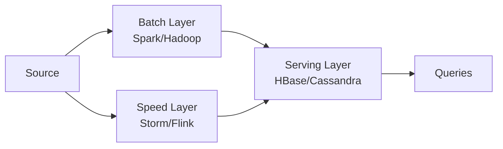
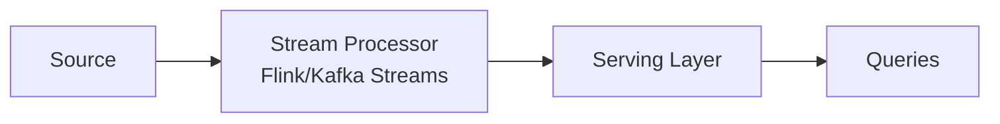

# Вопросы на собеседовании: `Stream Processing`

Stream processing — обработка данных **в реальном времени** (или near-real-time), в виде **непрерывного потока** событий, а не отдельными пакетными задачами (batch jobs). Концепции одинаковы для Flink, Kafka Streams, Spark Structured Streaming. На собеседовании спрашивают: event time vs processing time, watermarks, exactly-once, stateful-обработку, архитектуры lambda vs kappa.

## Полезные ссылки

### Официальная документация и авторитетные источники

- [Streaming Systems book (Tyler Akidau)](https://www.oreilly.com/library/view/streaming-systems/9781491983867/)
- [The world beyond batch — Streaming 101 / 102](https://www.oreilly.com/radar/the-world-beyond-batch-streaming-101/)
- [Designing Data-Intensive Applications (Kleppmann)](https://dataintensive.net/)
- [Lambda Architecture (Nathan Marz)](http://lambda-architecture.net/)
- [Kappa Architecture](https://www.oreilly.com/radar/questioning-the-lambda-architecture/)

## Содержание

- [Полезные ссылки](#полезные-ссылки)
- [See also](#see-also)

**Базовые понятия**
- [Q1. (!) Что такое stream processing?](#q1--что-такое-stream-processing)
- [Q2. (!) Stream vs Batch processing?](#q2--stream-vs-batch-processing)
- [Q3. (!) Bounded vs unbounded streams?](#q3--bounded-vs-unbounded-streams)
- [Q4. Real-time vs Near-real-time?](#q4-real-time-vs-near-real-time)

**Time semantics**
- [Q5. (!) Event time vs Processing time?](#q5--event-time-vs-processing-time)
- [Q6. (!) Watermarks — концепция?](#q6--watermarks--концепция)
- [Q7. Late events — стратегии?](#q7-late-events--стратегии)

**Windowing**
- [Q8. (!) Что такое window?](#q8--что-такое-window)
- [Q9. Tumbling, Sliding, Session, Global windows?](#q9-tumbling-sliding-session-global-windows)
- [Q10. Allowed lateness?](#q10-allowed-lateness)

**State**
- [Q11. (!) Stateful processing — что и зачем?](#q11--stateful-processing--что-и-зачем)
- [Q12. Где хранится state?](#q12-где-хранится-state)
- [Q13. (!) Checkpointing?](#q13--checkpointing)

**Delivery semantics**
- [Q14. (!) At-most-once vs At-least-once vs Exactly-once?](#q14--at-most-once-vs-at-least-once-vs-exactly-once)
- [Q15. (!) Как достичь exactly-once?](#q15--как-достичь-exactly-once)
- [Q16. Idempotent operations?](#q16-idempotent-operations)

**Backpressure и масштабирование**
- [Q17. (!) Backpressure — что это?](#q17--backpressure--что-это)
- [Q18. Как обрабатывать?](#q18-как-обрабатывать)
- [Q19. Parallelism в streaming?](#q19-parallelism-в-streaming)

**Архитектуры**
- [Q20. (!) Lambda Architecture?](#q20--lambda-architecture)
- [Q21. (!) Kappa Architecture?](#q21--kappa-architecture)
- [Q22. (!) Lambda vs Kappa — что выбрать?](#q22--lambda-vs-kappa--что-выбрать)

**Сравнения tools**
- [Q23. (!) Flink vs Spark Streaming vs Kafka Streams?](#q23--flink-vs-spark-streaming-vs-kafka-streams)
- [Q24. Apache Storm — почему deprecated?](#q24-apache-storm--почему-deprecated)
- [Q25. (!) Streaming vs Message Queue (Kafka)?](#q25--streaming-vs-message-queue-kafka)

**Применения**
- [Q26. (!) Где stream processing в production?](#q26--где-stream-processing-в-production)
- [Q27. Real-time ML inference?](#q27-real-time-ml-inference)
- [Q28. (!) Какие частые pitfalls в streaming?](#q28--какие-частые-pitfalls-в-streaming)

## Q1. (!) Что такое stream processing?

(!) Что такое stream processing?

**Stream processing** — модель обработки **непрерывных потоков** данных (событий) в реальном времени, в отличие от **batch processing** (накопить → обработать).

**Основные принципы:**
- Каждое событие обрабатывается **по мере поступления** (или маленькими батчами)
- **Stateful**-обработка — операции помнят предыдущие события
- **Out-of-order**-события — реальные данные приходят не в том порядке, в котором произошли

**Применения:**
- Аналитика в реальном времени (clickstream, IoT)
- Обнаружение мошенничества (fraud detection)
- Рекомендации
- Оповещения и мониторинг
- ETL-пайплайны (в реальном времени)

## Q2. (!) Stream vs Batch processing?

| Критерий | Stream | Batch |
|----------|--------|-------|
| Данные | Непрерывный поток | Ограниченный набор данных |
| Задержка | мс — секунды | минуты — часы |
| Пропускная способность | Высокая, но равномерная | Очень высокая, но всплесками |
| Сложность | Выше (state, время) | Ниже |
| Воспроизводимость | Сложно | Легко (повторный прогон на наборе данных) |
| Примеры | Flink, Kafka Streams, Spark Streaming | Spark, Hive, dbt |

**Тренд:** «**streaming как единая модель**» — batch рассматривается как частный случай streaming (ограниченный поток против бесконечного, bounded vs unbounded).

## Q3. (!) Bounded vs unbounded streams?

**Bounded stream** — конечный, известный заранее (файл, snapshot таблицы). По сути — batch.

**Unbounded stream** — бесконечный (Kafka topic, данные сенсоров, клики). Никогда не «заканчивается».

```
Bounded:    [e1, e2, e3, e4, e5]      ← finite
Unbounded:  [e1, e2, e3, e4, e5, ...] ← never ends
```

Это ключевое разделение. Движки stream processing обрабатывают оба типа, но **unbounded** требует watermarks, windows и управления state.

## Q4. Real-time vs Near-real-time?

| Тип | Задержка | Примеры |
|-----|---------|----------|
| **Hard real-time** | < 1 мс | Трейдинг, робототехника |
| **Real-time** | 1–100 мс | Обнаружение мошенничества, ad bidding |
| **Near-real-time** | секунды | Большинство «streaming»-сценариев |
| **Micro-batch** | секунды-минуты | Spark Structured Streaming |
| **Batch** | минуты-часы | Ежедневный ETL |

В **2024** большинство «streaming»-приложений = **near-real-time** (1–10 сек — нормально). Настоящий real-time нужен реже.

## Q5. (!) Event time vs Processing time?

| Время | Что значит |
|------|------------|
| **Event time** | Когда событие **произошло** в реальности (timestamp в данных) |
| **Processing time** | Когда событие **обрабатывается** в системе |

**Пример (clickstream):**
```
14:00 — пользователь кликнул (event time)
14:05 — данные пришли в Kafka
14:07 — Flink обработал (processing time)
```

**Event time** — корректно, детерминированно, повторяемо. **Processing time** — проще, но не отражает реальность.

**В production** для аналитики почти всегда нужен **event time**.

## Q6. (!) Watermarks — концепция?

**Watermark** — мета-сообщение, заявляющее: «до этого event_time все события **уже обработаны**».

```
events:    e(t=10) e(t=12) e(t=15) e(t=11)
                                          ↓
                                  watermark = 11 — events с t<=11 больше не ждём
```

**Применения:**
- Триггер закрытия window
- Определение «опоздавших» (late) событий
- Освобождать state по истёкшему времени

**Стратегии создания:**
- **Periodic** — добавляем watermark каждые N сек (на основе уже увиденных событий)
- **Punctuated** — на каждом событии (для сильно out-of-order потоков)

```scala
// Flink
WatermarkStrategy.forBoundedOutOfOrderness(Duration.ofSeconds(20))
```

Допустима задержка до 20 сек, после неё события считаются опоздавшими (late).

## Q7. Late events — стратегии?

**Late event** — событие, чей timestamp **раньше** текущего watermark (опоздало).

**Стратегии:**

1. **Drop** (по умолчанию) — игнорировать
2. **Отправить в dead letter queue** — обработать отдельно
3. **Обновить существующую агрегацию** — пересчитать результат window (если watermark с **allowed lateness**)
4. **Side output** — в отдельный поток для отдельной обработки

```scala
val late = new OutputTag[Event]("late")

stream
  .keyBy(_.userId)
  .window(TumblingEventTimeWindows.of(Time.minutes(5)))
  .allowedLateness(Time.minutes(1))
  .sideOutputLateData(late)
  .process(...)
```

## Q8. (!) Что такое window?

**Window** — конечный фрагмент событий из бесконечного потока, к которому применяют агрегацию.

```
infinite stream: e1 e2 e3 e4 e5 e6 e7 ...
windows:        [e1 e2 e3] [e4 e5 e6] [e7 ...]
                  W1         W2         W3
```

Применения:
- Подсчёт по интервалу (событий/мин, ошибок/час)
- Агрегации (avg/sum)
- Выявление паттернов

## Q9. Tumbling, Sliding, Session, Global windows?

**Tumbling** — фиксированные, не перекрывающиеся:
```
| 0-5 | 5-10 | 10-15 |
```

**Sliding** — фиксированные, перекрывающиеся с заданным шагом:
```
| 0-5 |
   | 1-6 |
      | 2-7 |
```

**Session** — на основе пауз (gap), динамической длины:
```
e1 e2 e3 [gap] e4 e5 [gap] e6
[----session 1----] [-session 2-] [s3]
```

**Global** — все события в одном window (с кастомным триггером).

Подробнее по каждому фреймворку:
- [Flink](apache-flink-interview.md)
- [Kafka Streams](kafka-streams-interview.md)
- [Spark](apache-spark-interview.md)

## Q10. Allowed lateness?

```scala
.window(TumblingEventTimeWindows.of(Time.minutes(5)))
.allowedLateness(Time.minutes(2))
```

Window остаётся «открытым» ещё **2 минуты после закрытия** — он может **обновлять** свой результат при поступлении опоздавших (late) событий.

**Trade-off:**
- Больше lateness = больше state (памяти)
- Меньше lateness = больше потерянных событий

**Подвох:** downstream должен уметь обрабатывать **обновления** результата (повторную отправку, re-emit).

## Q11. (!) Stateful processing — что и зачем?

**Stateful** — оператор помнит данные **между событиями**.

Примеры state:
- Счётчик на пользователя
- Последнее увиденное значение
- Агрегации по window
- ML-модель
- Информация о сессии

**Без state:** только преобразования map/filter (stateless).
**Со state:** агрегации, join-ы, разбиение на сессии (sessionization), CEP.

```scala
// Кол-во events per user
keyedStream.process(new KeyedProcessFunction[String, Event, Long] {
    private var count: ValueState[Long] = _
    override def processElement(value: Event, ctx: Context, out: Collector[Long]): Unit = {
        val current = Option(count.value()).getOrElse(0L)
        count.update(current + 1)
        out.collect(current + 1)
    }
})
```

## Q12. Где хранится state?

| Backend | Производительность | Размер |
|---------|-------------------|--------|
| **JVM heap** | Самый быстрый | < 1 ГБ на оператор |
| **RocksDB на диске** | Медленнее (сериализация/десериализация) | терабайты |
| **Внешний** (Redis, Cassandra) | Самый медленный | Любой |

**В Flink:** HashMapStateBackend (heap) или EmbeddedRocksDBStateBackend.
**В Kafka Streams:** RocksDB + changelog topic.
**В Spark:** stateful-операции через checkpoints.

**Выбор:**
- Маленький state → heap
- Большой state → RocksDB
- Очень большой / общий → внешнее хранилище

## Q13. (!) Checkpointing?

**Checkpoint** — периодический snapshot всего state системы.

```scala
env.enableCheckpointing(60000) // every 60 seconds
```

**Зачем:**
- **Отказоустойчивость** — после сбоя восстановиться с последнего checkpoint
- **Exactly-once-семантика** (с правильным sink)

**Где хранить:**
- **HDFS, S3** — распределённое, надёжное хранилище
- Локальный диск — только для dev

**Алгоритм (Chandy-Lamport):**
1. Внедрить **barrier** во входной поток
2. Barrier-ы проходят через операторы
3. Оператор получил barrier-ы → делает snapshot state
4. Когда все операторы сделали snapshot → checkpoint завершён

При **сбое** — рестарт с последнего checkpoint.

## Q14. (!) At-most-once vs At-least-once vs Exactly-once?

| Семантика | Описание | Когда |
|-----------|----------|-------|
| **At-most-once** | Каждое событие обработано 0 или 1 раз | Метрики, где важна низкая задержка, а потеря допустима |
| **At-least-once** | Каждое событие ≥1 раза | Большинство систем (с идемпотентной обработкой) |
| **Exactly-once** | Каждое событие ровно 1 раз | Финансы, биллинг |

**Без гарантий** — события могут теряться или дублироваться при сбоях.

**Trade-off:**
- At-least-once проще и быстрее, но требует идемпотентности
- Exactly-once сложнее и медленнее (транзакции), но строже

## Q15. (!) Как достичь exactly-once?

**End-to-end exactly-once** требует **трёх** компонентов:

1. **Перевоспроизводимый источник** (replayable source) — Kafka, Kinesis (с offsets)
2. **Stream-процессор с checkpointing** — Flink, Kafka Streams, Spark
3. **Транзакционный sink** — Kafka transactions, JDBC 2PC, идемпотентные записи

**Пример:** Kafka → Flink → Kafka (с Kafka transactions):

```scala
KafkaSink.<String>builder()
    .setBootstrapServers("kafka:9092")
    .setRecordSerializer(...)
    .setDeliveryGuarantee(DeliveryGuarantee.EXACTLY_ONCE)
    .setTransactionalIdPrefix("my-app")
    .build();
```

**Цена:** ~5–15% накладных расходов на пропускную способность.

Если sink не транзакционный (Elasticsearch) — нужно делать **идемпотентные записи** (с уникальными ID).

## Q16. Idempotent operations?

**Идемпотентность** — повторное выполнение даёт тот же результат.

```sql
-- Idempotent (PUT/UPSERT)
INSERT INTO users (id, name) VALUES (1, 'Alice')
ON CONFLICT (id) DO UPDATE SET name = EXCLUDED.name;

-- НЕ idempotent
INSERT INTO orders (user_id, amount) VALUES (1, 100); -- каждый раз новая запись!
```

**At-least-once + идемпотентные операции** = фактически exactly-once.

**Стратегии идемпотентности:**
- **Уникальные ID** в записях (UUID)
- **UPSERT/MERGE** в БД
- **Checkpoint** на стороне получателя (receiver)

## Q17. (!) Backpressure — что это?

**Backpressure** — медленный downstream-оператор замедляет upstream через накопление данных в буферах.

```
Source → Op1 → Op2 (SLOW)
                ↓
        Op2 buffer fills → Op1 не может писать → замедляется → Source замедляется
```

**Признаки:**
- Растущий **lag** (Kafka consumer lag, Flink backpressure UI)
- Высокое потребление RAM
- Растёт задержка

**Данные не теряются**, но пропускная способность падает до уровня самого медленного оператора.

## Q18. Как обрабатывать?

1. **Профилирование** — найти медленный оператор (Flink Web UI, Spark UI)
2. **Масштабирование** — больше parallelism
3. **Оптимизация кода** — оптимизировать UDF, аккуратнее с join-ами
4. **Увеличение ресурсов** — больше CPU/RAM
5. **Сброс сообщений** — если это допустимо (перейти к source с offset LATEST)
6. **Буферизация** — увеличить network buffers (временное решение)

В **Kafka Streams** — добавить больше инстансов (ребаланс consumer group).
В **Flink** — увеличить parallelism медленного оператора.

## Q19. Parallelism в streaming?

**Parallelism** — сколько параллельных subtasks обрабатывают поток.

**В Flink:**
```scala
env.setParallelism(8)
stream.map(...).setParallelism(4) // override per operator
```

**Партиционирование:**
- **Round-robin** — равномерно (для stateless)
- **По ключу** (`keyBy`) — по hash от ключа (для stateful)
- **Broadcast** — каждое событие во все subtasks

**В Kafka Streams** — parallelism = число партиций Kafka topic.

**Best practice:**
- Parallelism source-а = числу партиций
- Parallelism sink-а может быть меньше (группировка вывода)
- Stateful-операторы параллелим по ключу

## Q20. (!) Lambda Architecture?

**Lambda Architecture** (Nathan Marz, 2011) — параллельные слои **batch** и **speed**.



**Идея:**
- **Batch layer** — точный, но медленный (часовой ETL)
- **Speed layer** — быстрое приближение для недавних событий
- **Serving layer** — объединяет оба для запросов

**Преимущества:**
- Batch гарантирует точность
- Speed даёт низкую задержку

**Недостатки:**
- **Сложно поддерживать** — две кодовые базы (одна и та же логика дважды!)
- Сложно рассуждать о консистентности

В **2024** — устаревший подход, вытесняется Kappa.

## Q21. (!) Kappa Architecture?

**Kappa Architecture** (Jay Kreps, 2014) — **только** speed layer, без batch-слоя.



**Идея:** обрабатывать всё как поток. Если нужен **повторный прогон** (reprocessing) — перематываем Kafka offset назад и делаем replay.

**Преимущества:**
- **Одна кодовая база** (только streaming)
- Простота эксплуатации
- Streaming-движки умеют работать в режиме batch (на ограниченных потоках, bounded streams)

**Условия:**
- Источник должен быть **replayable** (Kafka)
- Stream-движок должен одинаково обрабатывать bounded и unbounded потоки

В **2024** Kappa хорошо сочетается с **Flink** (единый batch + streaming) и **Lakehouse** (Delta/Iceberg). Вытесняет Lambda.

## Q22. (!) Lambda vs Kappa — что выбрать?

**Kappa**, если:
- Источник = Kafka (replayable)
- Stream-движок умеет обрабатывать bounded streams (Flink, Spark Structured Streaming)
- Хочется **простоты** (одна кодовая база)

**Lambda**, если:
- Источник — не replayable
- Уже есть инфраструктура Hadoop
- Тяжёлые batch-задачи невыразимы как поток

В **2024** в новых проектах доминирует **Kappa**. **Lambda** остаётся в legacy.

## Q23. (!) Flink vs Spark Streaming vs Kafka Streams?

| Критерий | Flink | Spark Structured Streaming | Kafka Streams |
|----------|-------|---------------------------|---------------|
| Модель | True streaming | Micro-batch | True streaming (читает из Kafka) |
| Задержка | < 100 мс (часто < 10 мс) | сек | 10–100 мс |
| State | Богатый | Есть поддержка stateful | RocksDB + changelog |
| Источники | Любые | Любые | Только Kafka |
| Деплой | Кластер | Кластер | Библиотека (как микросервис) |
| Эксплуатация | Сложная | Сложная | Простая |

**Выбор:**
- **Kafka Streams** — если источник Kafka и хочется простоты
- **Flink** — если нужен true streaming с низкой задержкой и сложным state
- **Spark Streaming** — если в команде уже есть Spark и задержка от 1 сек допустима

## Q24. Apache Storm — почему deprecated?

**Apache Storm** (2011) — первый популярный stream processor.

**Особенности:**
- True streaming (запись за записью)
- Низкоуровневый API (spouts, bolts)
- Гарантия at-least-once (exactly-once — через Trident)

**Почему deprecated:**
- Низкоуровневый API
- Нет богатого state API (тут выиграл Flink)
- Нет встроенного SQL
- Сообщество сократилось

В **2024** Storm — legacy. Heron (от Twitter) — преемник, тоже не получил широкого распространения.

## Q25. (!) Streaming vs Message Queue (Kafka)?

| Критерий | Stream Processor | Message Queue (Kafka) |
|----------|-----------------|----------------------|
| Назначение | Обработка | Транспорт сообщений |
| State | Богатый (windows, агрегации) | Минимальный |
| Задержка | Включает processing time | Сетевая задержка |
| API | DSL для преобразований | Producer/Consumer |

**Kafka** — это **транспорт**. **Stream processor** (Flink, Kafka Streams) обрабатывает данные **поверх** Kafka.

```
Producers → Kafka (transport) → Stream Processor (logic) → Sinks
```

Сама Kafka **не делает агрегаций** — только хранит и доставляет сообщения. Подробнее — [Apache Kafka](../messaging/kafka-interview.md).

## Q26. (!) Где stream processing в production?

1. **Обнаружение мошенничества** — банки, платежи (Stripe, банки)
2. **Рекомендации в реальном времени** — Netflix, Amazon
3. **Ad bidding** — решения за < 100 мс
4. **Мониторинг / оповещения** — пайплайны Datadog, Prometheus
5. **Данные IoT-сенсоров** — производство, автопром
6. **Аналитика clickstream** — A/B-тестирование, анализ воронок
7. **ETL-стриминг** — замена batch (CDC → streaming → DWH)
8. **Трейдинг** — высокочастотные системы
9. **Гео-трекинг** — Uber, Lyft
10. **ML-инференс в реальном времени** — онлайн-предсказания

## Q27. Real-time ML inference?

```
events → feature extraction (streaming) → ML model serving → predictions
```

**Паттерны:**
- **Embedded model** — инференс прямо в stream processor
- **Model service** — отдельный микросервис (gRPC), поток обращается к нему
- **Feature store** — Tecton, Feast — заранее вычисленные признаки для инференса

**Инструменты:**
- **TensorFlow Serving / Triton** — обслуживание моделей (model serving)
- **Feast** — feature store
- **Flink ML** — встроенный ML в Flink

## Q28. (!) Какие частые pitfalls в streaming?

1. **Неправильная семантика времени** — processing time там, где нужен event time → неверные агрегации при out-of-order
2. **Слишком агрессивный watermark** — теряем опоздавшие (late) данные
3. **Слишком консервативный watermark** — windows закрываются слишком поздно
4. **State без очистки** — утечка памяти, state растёт бесконечно
5. **Игнорирование backpressure** — растут lag и задержка
6. **Нет тестов с late-событиями** — поведение в production преподносит сюрпризы
7. **Неправильная семантика доставки** — at-most-once там, где нужен exactly-once
8. **Неидемпотентный sink + at-least-once** — дублирование
9. **Последовательное узкое место** — низкий parallelism в одной точке
10. **Не мониторят размер state** — RocksDB разросся → упор в IO

**Streaming в production** требует **намного больше** внимания, чем batch.

## See also

- [Apache Spark](apache-spark-interview.md) — Structured Streaming
- [Apache Flink](apache-flink-interview.md) — true streaming
- [Kafka Streams](kafka-streams-interview.md) — library streaming
- [Apache Kafka](../messaging/kafka-interview.md) — transport для streaming
- [Event-driven паттерны](../architecture/event-driven-patterns-interview.md) — фундамент streaming
- [Apache Airflow](apache-airflow-interview.md) — для batch (vs streaming)
- [Data Warehousing](data-warehousing-interview.md) — обычно destination
- [Data Lake / Lakehouse](data-lake-lakehouse-interview.md) — destination для streaming
- [Микросервисы](../architecture/microservices-interview.md) — event-driven services
- [CAP Theorem](../architecture/cap-theorem-interview.md) — trade-offs distributed
- [Распределённые системы](../architecture/distributed-systems-interview.md) — consistency, replication
- [Saga Pattern](../architecture/saga-pattern-interview.md) — sagas через streaming

- [Apache Flink](apache-flink-interview.md)
- [Apache Spark](apache-spark-interview.md)
- [Data Lake и Lakehouse](data-lake-lakehouse-interview.md)
- [Data Warehousing](data-warehousing-interview.md)
- [dbt](dbt-interview.md)
