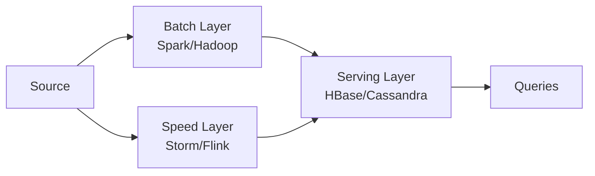
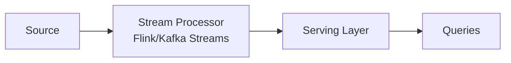

# Вопросы на собеседовании: `Stream Processing`

Stream processing — обработка данных **в реальном времени** (или near-real-time), как **continuous flow** событий, не как batch jobs. Концепции одинаковы для Flink, Kafka Streams, Spark Structured Streaming. На интервью спрашивают: event time vs processing time, watermarks, exactly-once, stateful processing, lambda vs kappa архитектура.

## Полезные ссылки

### Официальная документация и авторитетные источники

- [Streaming Systems book (Tyler Akidau)](https://www.oreilly.com/library/view/streaming-systems/9781491983867/)
- [The world beyond batch — Streaming 101 / 102](https://www.oreilly.com/radar/the-world-beyond-batch-streaming-101/)
- [Designing Data-Intensive Applications (Kleppmann)](https://dataintensive.net/)
- [Lambda Architecture (Nathan Marz)](http://lambda-architecture.net/)
- [Kappa Architecture](https://www.oreilly.com/radar/questioning-the-lambda-architecture/)

## Содержание

- [Полезные ссылки](#полезные-ссылки)
- [See also](#see-also)

**Базовые понятия**
- [Q1. (!) Что такое stream processing?](#q1--что-такое-stream-processing)
- [Q2. (!) Stream vs Batch processing?](#q2--stream-vs-batch-processing)
- [Q3. (!) Bounded vs unbounded streams?](#q3--bounded-vs-unbounded-streams)
- [Q4. Real-time vs Near-real-time?](#q4-real-time-vs-near-real-time)

**Time semantics**
- [Q5. (!) Event time vs Processing time?](#q5--event-time-vs-processing-time)
- [Q6. (!) Watermarks — концепция?](#q6--watermarks--концепция)
- [Q7. Late events — стратегии?](#q7-late-events--стратегии)

**Windowing**
- [Q8. (!) Что такое window?](#q8--что-такое-window)
- [Q9. Tumbling, Sliding, Session, Global windows?](#q9-tumbling-sliding-session-global-windows)
- [Q10. Allowed lateness?](#q10-allowed-lateness)

**State**
- [Q11. (!) Stateful processing — что и зачем?](#q11--stateful-processing--что-и-зачем)
- [Q12. Где хранится state?](#q12-где-хранится-state)
- [Q13. (!) Checkpointing?](#q13--checkpointing)

**Delivery semantics**
- [Q14. (!) At-most-once vs At-least-once vs Exactly-once?](#q14--at-most-once-vs-at-least-once-vs-exactly-once)
- [Q15. (!) Как достичь exactly-once?](#q15--как-достичь-exactly-once)
- [Q16. Idempotent operations?](#q16-idempotent-operations)

**Backpressure и масштабирование**
- [Q17. (!) Backpressure — что это?](#q17--backpressure--что-это)
- [Q18. Как обрабатывать?](#q18-как-обрабатывать)
- [Q19. Parallelism в streaming?](#q19-parallelism-в-streaming)

**Архитектуры**
- [Q20. (!) Lambda Architecture?](#q20--lambda-architecture)
- [Q21. (!) Kappa Architecture?](#q21--kappa-architecture)
- [Q22. (!) Lambda vs Kappa — что выбрать?](#q22--lambda-vs-kappa--что-выбрать)

**Сравнения tools**
- [Q23. (!) Flink vs Spark Streaming vs Kafka Streams?](#q23--flink-vs-spark-streaming-vs-kafka-streams)
- [Q24. Apache Storm — почему deprecated?](#q24-apache-storm--почему-deprecated)
- [Q25. (!) Streaming vs Message Queue (Kafka)?](#q25--streaming-vs-message-queue-kafka)

**Применения**
- [Q26. (!) Где stream processing в production?](#q26--где-stream-processing-в-production)
- [Q27. Real-time ML inference?](#q27-real-time-ml-inference)
- [Q28. (!) Какие частые pitfalls в streaming?](#q28--какие-частые-pitfalls-в-streaming)

## Q1. (!) Что такое stream processing?

**Stream processing** — модель обработки **непрерывных потоков** данных (events) в реальном времени, в отличие от **batch processing** (накопить → обработать).

**Основные принципы:**
- Каждое событие обрабатывается **по мере поступления** (или маленькими батчами)
- **Stateful** processing — операции помнят prior events
- **Out-of-order** events — реальные данные приходят не в том порядке, что произошли

**Применения:**
- Real-time analytics (clickstream, IoT)
- Fraud detection
- Recommendations
- Alerting / monitoring
- ETL pipelines (real-time)


> [!mcq]
> - [x] Правильный ответ | Объяснение концепции 2-3 предложения
> - [ ] Неправильный вариант 1 | Почему ошибка в этом подходе
> - [ ] Неправильный вариант 2 | Это смежное, но отличное понятие
> - [ ] Неправильный вариант 3 | Противоположное направление## Q2. (!) Stream vs Batch processing?

| Критерий | Stream | Batch |
|----------|--------|-------|
| Данные | Continuous flow | Bounded dataset |
| Latency | ms - seconds | minutes - hours |
| Throughput | Высокий, но steady | Очень высокий, но bursty |
| Complexity | Сложнее (state, time) | Проще |
| Reproducibility | Сложно | Легко (rerun на dataset) |
| Examples | Flink, Kafka Streams, Spark Streaming | Spark, Hive, dbt |

**Тренд:** "**streaming as the unified model**" — batch как special case streaming (bounded vs unbounded).


> [!mcq]
> - [x] Правильный ответ | Объяснение концепции 2-3 предложения
> - [ ] Неправильный вариант 1 | Почему ошибка в этом подходе
> - [ ] Неправильный вариант 2 | Это смежное, но отличное понятие
> - [ ] Неправильный вариант 3 | Противоположное направление## Q3. (!) Bounded vs unbounded streams?

**Bounded stream** — конечный, известный заранее (файл, table snapshot). По сути — batch.

**Unbounded stream** — бесконечный (Kafka topic, sensor data, clicks). Никогда не "заканчивается".

```
Bounded:    [e1, e2, e3, e4, e5]      ← finite
Unbounded:  [e1, e2, e3, e4, e5, ...] ← never ends
```

Это ключевое разделение. Stream processing engines обрабатывают оба, но **unbounded** требует watermarks, windows, state management.


> [!mcq]
> - [x] Правильный ответ | Объяснение концепции 2-3 предложения
> - [ ] Неправильный вариант 1 | Почему ошибка в этом подходе
> - [ ] Неправильный вариант 2 | Это смежное, но отличное понятие
> - [ ] Неправильный вариант 3 | Противоположное направление## Q4. Real-time vs Near-real-time?

| Тип | Latency | Examples |
|-----|---------|----------|
| **Hard real-time** | < 1ms | Trading, robotics |
| **Real-time** | 1-100ms | Fraud detection, ad bidding |
| **Near-real-time** | seconds | Most "streaming" use cases |
| **Micro-batch** | seconds-minutes | Spark Structured Streaming |
| **Batch** | minutes-hours | Daily ETL |

В **2024** большинство "streaming" приложений = **near-real-time** (1-10 sec OK). True real-time нужен реже.


> [!mcq]
> - [x] Правильный ответ | Объяснение концепции 2-3 предложения
> - [ ] Неправильный вариант 1 | Почему ошибка в этом подходе
> - [ ] Неправильный вариант 2 | Это смежное, но отличное понятие
> - [ ] Неправильный вариант 3 | Противоположное направление## Q5. (!) Event time vs Processing time?

| Time | Что значит |
|------|------------|
| **Event time** | Когда событие **произошло** в реальности (timestamp в data) |
| **Processing time** | Когда событие **обрабатывается** в системе |

**Пример (clickstream):**
```
14:00 — пользователь кликнул (event time)
14:05 — данные пришли в Kafka
14:07 — Flink обработал (processing time)
```

**Event time** — корректно, детерминированно, повторяемо. **Processing time** — проще, но не отражает реальность.

**В production** — почти всегда нужен **event time** для аналитики.


> [!mcq]
> - [x] Правильный ответ | Объяснение концепции 2-3 предложения
> - [ ] Неправильный вариант 1 | Почему ошибка в этом подходе
> - [ ] Неправильный вариант 2 | Это смежное, но отличное понятие
> - [ ] Неправильный вариант 3 | Противоположное направление## Q6. (!) Watermarks — концепция?

**Watermark** — мета-сообщение, заявляющее: "до этого event_time все события **уже обработаны**".

```
events:    e(t=10) e(t=12) e(t=15) e(t=11)
                                          ↓
                                  watermark = 11 — events с t<=11 больше не ждём
```

**Применения:**
- Trigger window closure
- Determine "late" events
- Освобождать state по истёкшему времени

**Стратегии создания:**
- **Periodic** — добавляем watermark каждые N сек (на основе seen events)
- **Punctuated** — на каждом событии (для очень out-of-order)

```scala
// Flink
WatermarkStrategy.forBoundedOutOfOrderness(Duration.ofSeconds(20))
```

Допустима задержка 20 сек, после — события считаются late.


> [!mcq]
> - [x] Правильный ответ | Объяснение концепции 2-3 предложения
> - [ ] Неправильный вариант 1 | Почему ошибка в этом подходе
> - [ ] Неправильный вариант 2 | Это смежное, но отличное понятие
> - [ ] Неправильный вариант 3 | Противоположное направление## Q7. Late events — стратегии?

**Late event** — событие, чей timestamp **раньше** текущего watermark (опоздало).

**Стратегии:**

1. **Drop** (default) — игнорировать
2. **Send to dead letter queue** — обработать отдельно
3. **Update existing aggregation** — пересчитать window результат (если watermark с **allowed lateness**)
4. **Side output** — в отдельный stream для отдельной обработки

```scala
val late = new OutputTag[Event]("late")

stream
  .keyBy(_.userId)
  .window(TumblingEventTimeWindows.of(Time.minutes(5)))
  .allowedLateness(Time.minutes(1))
  .sideOutputLateData(late)
  .process(...)
```


> [!mcq]
> - [x] Правильный ответ | Объяснение концепции 2-3 предложения
> - [ ] Неправильный вариант 1 | Почему ошибка в этом подходе
> - [ ] Неправильный вариант 2 | Это смежное, но отличное понятие
> - [ ] Неправильный вариант 3 | Противоположное направление## Q8. (!) Что такое window?

**Window** — finite chunk событий из infinite stream, для применения aggregation.

```
infinite stream: e1 e2 e3 e4 e5 e6 e7 ...
windows:        [e1 e2 e3] [e4 e5 e6] [e7 ...]
                  W1         W2         W3
```

Применения:
- Подсчёт по интервалу (events/min, errors/hour)
- Aggregations (avg/sum)
- Detection patterns


> [!mcq]
> - [x] Правильный ответ | Объяснение концепции 2-3 предложения
> - [ ] Неправильный вариант 1 | Почему ошибка в этом подходе
> - [ ] Неправильный вариант 2 | Это смежное, но отличное понятие
> - [ ] Неправильный вариант 3 | Противоположное направление## Q9. Tumbling, Sliding, Session, Global windows?

**Tumbling** — фиксированные, не перекрываются:
```
| 0-5 | 5-10 | 10-15 |
```

**Sliding** — фиксированные, перекрываются с шагом:
```
| 0-5 |
   | 1-6 |
      | 2-7 |
```

**Session** — gap-based, динамическая длина:
```
e1 e2 e3 [gap] e4 e5 [gap] e6
[----session 1----] [-session 2-] [s3]
```

**Global** — все события в одном window (custom trigger).

Подробнее в каждом фреймворке:
- [Flink](apache-flink-interview.md)
- [Kafka Streams](kafka-streams-interview.md)
- [Spark](apache-spark-interview.md)


> [!mcq]
> - [x] Правильный ответ | Объяснение концепции 2-3 предложения
> - [ ] Неправильный вариант 1 | Почему ошибка в этом подходе
> - [ ] Неправильный вариант 2 | Это смежное, но отличное понятие
> - [ ] Неправильный вариант 3 | Противоположное направление## Q10. Allowed lateness?

```scala
.window(TumblingEventTimeWindows.of(Time.minutes(5)))
.allowedLateness(Time.minutes(2))
```

Window остаётся "open" ещё **2 минуты после закрытия** — может **обновлять** свой результат при поступлении late events.

**Trade-off:**
- Больше lateness = больше state (memory)
- Меньше lateness = больше потерянных events

**Подвох:** downstream должен уметь обрабатывать **обновления** результата (re-emit).


> [!mcq]
> - [x] Правильный ответ | Объяснение концепции 2-3 предложения
> - [ ] Неправильный вариант 1 | Почему ошибка в этом подходе
> - [ ] Неправильный вариант 2 | Это смежное, но отличное понятие
> - [ ] Неправильный вариант 3 | Противоположное направление## Q11. (!) Stateful processing — что и зачем?

**Stateful** — operator помнит данные **между событиями**.

Примеры state:
- Counter per user
- Last seen value
- Window aggregations
- ML model
- Session info

**Без state:** только map/filter (stateless).
**Со state:** aggregations, joins, sessionization, CEP.

```scala
// Кол-во events per user
keyedStream.process(new KeyedProcessFunction[String, Event, Long] {
    private var count: ValueState[Long] = _
    override def processElement(value: Event, ctx: Context, out: Collector[Long]): Unit = {
        val current = Option(count.value()).getOrElse(0L)
        count.update(current + 1)
        out.collect(current + 1)
    }
})
```


> [!mcq]
> - [x] Правильный ответ | Объяснение концепции 2-3 предложения
> - [ ] Неправильный вариант 1 | Почему ошибка в этом подходе
> - [ ] Неправильный вариант 2 | Это смежное, но отличное понятие
> - [ ] Неправильный вариант 3 | Противоположное направление## Q12. Где хранится state?

| Backend | Производительность | Размер |
|---------|-------------------|--------|
| **JVM heap** | Самый быстрый | < 1 GB на operator |
| **RocksDB on disk** | Медленнее (ser/deser) | TBs |
| **External** (Redis, Cassandra) | Самый медленный | Любой |

**В Flink:** HashMapStateBackend (heap) или EmbeddedRocksDBStateBackend.
**В Kafka Streams:** RocksDB + changelog topic.
**В Spark:** Stateful operations через checkpoints.

**Выбор:**
- Маленький state → heap
- Большой state → RocksDB
- Очень большой / shared → external store


> [!mcq]
> - [x] Правильный ответ | Объяснение концепции 2-3 предложения
> - [ ] Неправильный вариант 1 | Почему ошибка в этом подходе
> - [ ] Неправильный вариант 2 | Это смежное, но отличное понятие
> - [ ] Неправильный вариант 3 | Противоположное направление## Q13. (!) Checkpointing?

**Checkpoint** — periodic snapshot всего state системы.

```scala
env.enableCheckpointing(60000) // every 60 seconds
```

**Зачем:**
- **Fault tolerance** — после сбоя восстановиться с last checkpoint
- **Exactly-once semantics** (с правильным sink)

**Где хранить:**
- **HDFS, S3** — distributed, durable
- Local disk — только для dev

**Алгоритм (Chandy-Lamport):**
1. Inject **barrier** в input
2. Barriers идут через operators
3. Operator получил barriers → snapshot state
4. Когда все operators сделали snapshot → checkpoint complete

При **сбое** — restart с last checkpoint.


> [!mcq]
> - [x] Правильный ответ | Объяснение концепции 2-3 предложения
> - [ ] Неправильный вариант 1 | Почему ошибка в этом подходе
> - [ ] Неправильный вариант 2 | Это смежное, но отличное понятие
> - [ ] Неправильный вариант 3 | Противоположное направление## Q14. (!) At-most-once vs At-least-once vs Exactly-once?

| Семантика | Описание | Когда |
|-----------|----------|-------|
| **At-most-once** | Каждое event = 0 или 1 раз обработано | Метрики где важна low latency, потеря OK |
| **At-least-once** | Каждое event = ≥1 раз | Большинство систем (с idempotent processing) |
| **Exactly-once** | Каждое event = ровно 1 раз | Финансы, биллинг |

**Без гарантий** — события могут теряться или дублироваться при сбоях.

**Trade-off:**
- At-least-once проще, быстрее, но requires idempotency
- Exactly-once сложнее, медленнее (transactions), но строже


> [!mcq]
> - [x] Правильный ответ | Объяснение концепции 2-3 предложения
> - [ ] Неправильный вариант 1 | Почему ошибка в этом подходе
> - [ ] Неправильный вариант 2 | Это смежное, но отличное понятие
> - [ ] Неправильный вариант 3 | Противоположное направление## Q15. (!) Как достичь exactly-once?

**End-to-end exactly-once** требует **трёх** компонентов:

1. **Replayable source** — Kafka, Kinesis (с offsets)
2. **Stream processor с checkpointing** — Flink, Kafka Streams, Spark
3. **Transactional sink** — Kafka transactions, JDBC 2PC, idempotent writes

**Пример:** Kafka → Flink → Kafka (с Kafka transactions):

```scala
KafkaSink.<String>builder()
    .setBootstrapServers("kafka:9092")
    .setRecordSerializer(...)
    .setDeliveryGuarantee(DeliveryGuarantee.EXACTLY_ONCE)
    .setTransactionalIdPrefix("my-app")
    .build();
```

**Цена:** ~5-15% throughput overhead.

Если sink не транзакционный (Elasticsearch) — нужно делать **idempotent writes** (с unique IDs).


> [!mcq]
> - [x] Правильный ответ | Объяснение концепции 2-3 предложения
> - [ ] Неправильный вариант 1 | Почему ошибка в этом подходе
> - [ ] Неправильный вариант 2 | Это смежное, но отличное понятие
> - [ ] Неправильный вариант 3 | Противоположное направление## Q16. Idempotent operations?

**Idempotent** — повторное выполнение даёт тот же результат.

```sql
-- Idempotent (PUT/UPSERT)
INSERT INTO users (id, name) VALUES (1, 'Alice')
ON CONFLICT (id) DO UPDATE SET name = EXCLUDED.name;

-- НЕ idempotent
INSERT INTO orders (user_id, amount) VALUES (1, 100); -- каждый раз новая запись!
```

**При at-least-once + idempotent operations** = effectively exactly-once.

**Стратегии idempotency:**
- **Unique IDs** в записях (UUID)
- **UPSERT/MERGE** в БД
- **Checkpoint** в receiver


> [!mcq]
> - [x] Правильный ответ | Объяснение концепции 2-3 предложения
> - [ ] Неправильный вариант 1 | Почему ошибка в этом подходе
> - [ ] Неправильный вариант 2 | Это смежное, но отличное понятие
> - [ ] Неправильный вариант 3 | Противоположное направление## Q17. (!) Backpressure — что это?

**Backpressure** — медленный downstream operator замедляет upstream через накопление в buffers.

```
Source → Op1 → Op2 (SLOW)
                ↓
        Op2 buffer fills → Op1 не может писать → замедляется → Source замедляется
```

**Признаки:**
- Растущий **lag** (Kafka consumer lag, Flink backpressure UI)
- Высокая RAM usage
- Latency растёт

**Не теряем данные**, но throughput снижается до самого медленного operator.


> [!mcq]
> - [x] Правильный ответ | Объяснение концепции 2-3 предложения
> - [ ] Неправильный вариант 1 | Почему ошибка в этом подходе
> - [ ] Неправильный вариант 2 | Это смежное, но отличное понятие
> - [ ] Неправильный вариант 3 | Противоположное направление## Q18. Как обрабатывать?

1. **Profile** — найти slow operator (Flink Web UI, Spark UI)
2. **Scale up** — больше parallelism
3. **Optimize код** — оптимизировать UDF, аккуратнее joins
4. **Resource increase** — больше CPU/RAM
5. **Drop messages** — если это OK (back to source LATEST offset)
6. **Buffer** — увеличить network buffers (временное решение)

В **Kafka Streams** — добавить больше instances (consumer group rebalance).
В **Flink** — увеличить parallelism slow operator.


> [!mcq]
> - [x] Правильный ответ | Объяснение концепции 2-3 предложения
> - [ ] Неправильный вариант 1 | Почему ошибка в этом подходе
> - [ ] Неправильный вариант 2 | Это смежное, но отличное понятие
> - [ ] Неправильный вариант 3 | Противоположное направление## Q19. Parallelism в streaming?

**Parallelism** — сколько параллельных subtasks обрабатывают stream.

**В Flink:**
```scala
env.setParallelism(8)
stream.map(...).setParallelism(4) // override per operator
```

**Партиционирование:**
- **Round-robin** — равномерно (для stateless)
- **By key** (`keyBy`) — по hash от key (для stateful)
- **Broadcast** — каждое event во все subtasks

**В Kafka Streams** — parallelism = #partitions Kafka topic.

**Best practice:**
- Source parallelism = #partitions
- Sink parallelism может быть меньше (output groupping)
- Stateful operators — параллелим по key


> [!mcq]
> - [x] Правильный ответ | Объяснение концепции 2-3 предложения
> - [ ] Неправильный вариант 1 | Почему ошибка в этом подходе
> - [ ] Неправильный вариант 2 | Это смежное, но отличное понятие
> - [ ] Неправильный вариант 3 | Противоположное направление## Q20. (!) Lambda Architecture?

**Lambda Architecture** (Nathan Marz, 2011) — параллельные **batch** и **speed** layers.



**Идея:**
- **Batch layer** — accurate но slow (часовая ETL)
- **Speed layer** — quick approximation для recent events
- **Serving layer** — merge оба для queries

**Преимущества:**
- Batch гарантирует accuracy
- Speed даёт low latency

**Недостатки:**
- **Сложно поддерживать** — два кодовых базы (одна логика дважды!)
- Сложно reason about consistency

В **2024** — устаревший подход, заменяется Kappa.


> [!mcq]
> - [x] Правильный ответ | Объяснение концепции 2-3 предложения
> - [ ] Неправильный вариант 1 | Почему ошибка в этом подходе
> - [ ] Неправильный вариант 2 | Это смежное, но отличное понятие
> - [ ] Неправильный вариант 3 | Противоположное направление## Q21. (!) Kappa Architecture?

**Kappa Architecture** (Jay Kreps, 2014) — **только** speed layer, без batch.



**Идея:** обрабатывать всё как stream. Если нужен **reprocessing** — perevoditim Kafka offset назад и replay.

**Преимущества:**
- **Один codebase** (только streaming)
- Простота operations
- Streaming engines умеют работать как batch (bounded streams)

**Условия:**
- Источник должен быть **replayable** (Kafka)
- Stream engine должен handle bounded и unbounded одинаково

В **2024** Kappa дружит с **Flink** (unified batch + streaming) и **Lakehouse** (Delta/Iceberg). Заменяет Lambda.


> [!mcq]
> - [x] Правильный ответ | Объяснение концепции 2-3 предложения
> - [ ] Неправильный вариант 1 | Почему ошибка в этом подходе
> - [ ] Неправильный вариант 2 | Это смежное, но отличное понятие
> - [ ] Неправильный вариант 3 | Противоположное направление## Q22. (!) Lambda vs Kappa — что выбрать?

**Kappa**, если:
- Источник = Kafka (replayable)
- Stream engine может handle bounded streams (Flink, Spark Structured Streaming)
- Хочется **простоты** (один codebase)

**Lambda**, если:
- Source — не replayable
- Уже есть Hadoop infrastructure
- Heavy batch jobs не выразимы как stream

В **2024** — **Kappa** доминирует в новых проектах. **Lambda** остаётся в legacy.


> [!mcq]
> - [x] Правильный ответ | Объяснение концепции 2-3 предложения
> - [ ] Неправильный вариант 1 | Почему ошибка в этом подходе
> - [ ] Неправильный вариант 2 | Это смежное, но отличное понятие
> - [ ] Неправильный вариант 3 | Противоположное направление## Q23. (!) Flink vs Spark Streaming vs Kafka Streams?

| Критерий | Flink | Spark Structured Streaming | Kafka Streams |
|----------|-------|---------------------------|---------------|
| Model | True streaming | Micro-batch | True streaming (CKafka pulls) |
| Latency | < 100ms (часто <10ms) | sec | 10-100ms |
| State | Богатый | Stateful есть | RocksDB + changelog |
| Sources | Любые | Любые | Только Kafka |
| Deploy | Cluster | Cluster | Library (как microservice) |
| Operational | Сложный | Сложный | Простой |

**Выбор:**
- **Kafka Streams** — если источник Kafka, хочется простоты
- **Flink** — если нужна true streaming с low latency, complex state
- **Spark Streaming** — если уже Spark в команде, latency 1+ сек OK


> [!mcq]
> - [x] Правильный ответ | Объяснение концепции 2-3 предложения
> - [ ] Неправильный вариант 1 | Почему ошибка в этом подходе
> - [ ] Неправильный вариант 2 | Это смежное, но отличное понятие
> - [ ] Неправильный вариант 3 | Противоположное направление## Q24. Apache Storm — почему deprecated?

**Apache Storm** (2011) — первый popular stream processor.

**Особенности:**
- True streaming (record-by-record)
- Низкий уровень API (spouts, bolts)
- At-least-once (exactly-once через Trident)

**Почему deprecated:**
- Низкоуровневый API
- Нет богатого state API (Flink выиграл)
- Нет integrated SQL
- Сообщество уменьшилось

В **2024** Storm — legacy. Heron (от Twitter) — преемник, тоже не получил широкого adoption.


> [!mcq]
> - [x] Правильный ответ | Объяснение концепции 2-3 предложения
> - [ ] Неправильный вариант 1 | Почему ошибка в этом подходе
> - [ ] Неправильный вариант 2 | Это смежное, но отличное понятие
> - [ ] Неправильный вариант 3 | Противоположное направление## Q25. (!) Streaming vs Message Queue (Kafka)?

| Критерий | Stream Processor | Message Queue (Kafka) |
|----------|-----------------|----------------------|
| Назначение | Обработка | Транспорт сообщений |
| State | Богатое (windows, aggregations) | Минимальное |
| Latency | Включает processing time | Сетевая latency |
| API | DSL для transformations | Producer/Consumer |

**Kafka** — это **transport**. **Stream processor** (Flink, Kafka Streams) — обрабатывают данные **поверх** Kafka.

```
Producers → Kafka (transport) → Stream Processor (logic) → Sinks
```

Kafka сам **не делает aggregations** — только хранит и доставляет messages. Подробнее — [Apache Kafka](../messaging/kafka-interview.md).


> [!mcq]
> - [x] Правильный ответ | Объяснение концепции 2-3 предложения
> - [ ] Неправильный вариант 1 | Почему ошибка в этом подходе
> - [ ] Неправильный вариант 2 | Это смежное, но отличное понятие
> - [ ] Неправильный вариант 3 | Противоположное направление## Q26. (!) Где stream processing в production?

1. **Fraud detection** — банки, payments (Stripe, banks)
2. **Real-time recommendations** — Netflix, Amazon
3. **Ad bidding** — < 100ms decisions
4. **Monitoring / alerting** — Datadog, Prometheus pipelines
5. **IoT sensor data** — manufacturing, automotive
6. **Click stream analytics** — A/B testing, funnel analysis
7. **ETL streaming** — replace batch (CDC → streaming → DWH)
8. **Trading** — high-frequency systems
9. **Geo-tracking** — Uber, Lyft
10. **Real-time ML inference** — online predictions


> [!mcq]
> - [x] Правильный ответ | Объяснение концепции 2-3 предложения
> - [ ] Неправильный вариант 1 | Почему ошибка в этом подходе
> - [ ] Неправильный вариант 2 | Это смежное, но отличное понятие
> - [ ] Неправильный вариант 3 | Противоположное направление## Q27. Real-time ML inference?

```
events → feature extraction (streaming) → ML model serving → predictions
```

**Patterns:**
- **Embedded model** — инференс прямо в stream processor
- **Model service** — отдельный microservice (gRPC), stream calls it
- **Feature store** — Tecton, Feast — pre-computed features для inference

**Tools:**
- **TensorFlow Serving / Triton** — model serving
- **Feast** — feature store
- **Flink ML** — embedded ML в Flink


> [!mcq]
> - [x] Правильный ответ | Объяснение концепции 2-3 предложения
> - [ ] Неправильный вариант 1 | Почему ошибка в этом подходе
> - [ ] Неправильный вариант 2 | Это смежное, но отличное понятие
> - [ ] Неправильный вариант 3 | Противоположное направление## Q28. (!) Какие частые pitfalls в streaming?

1. **Wrong time semantics** — processing time где нужно event time → неправильные aggregations при out-of-order
2. **Watermark too aggressive** — теряем late data
3. **Watermark too conservative** — windows закрываются слишком поздно
4. **State без cleanup** — memory leak, state растёт навсегда
5. **Ignoring backpressure** — растёт lag, latency
6. **Not testing с late events** — production interactions удивляют
7. **Wrong delivery semantics** — at-most-once там, где нужно exactly-once
8. **Sink не идempotent + at-least-once** — дублирование
9. **Sequential bottleneck** — низкий parallelism в одном месте
10. **Не мониторить state size** — RocksDB вырос → IO bound

**Streaming в production** требует **намного больше** заботы, чем batch.

---

## See also

- [Apache Spark](apache-spark-interview.md) — Structured Streaming
- [Apache Flink](apache-flink-interview.md) — true streaming
- [Kafka Streams](kafka-streams-interview.md) — library streaming
- [Apache Kafka](../messaging/kafka-interview.md) — transport для streaming
- [Event-driven паттерны](../architecture/event-driven-patterns-interview.md) — фундамент streaming
- [Apache Airflow](apache-airflow-interview.md) — для batch (vs streaming)
- [Data Warehousing](data-warehousing-interview.md) — обычно destination
- [Data Lake / Lakehouse](data-lake-lakehouse-interview.md) — destination для streaming
- [Микросервисы](../architecture/microservices-interview.md) — event-driven services
- [CAP Theorem](../architecture/cap-theorem-interview.md) — trade-offs distributed
- [Распределённые системы](../architecture/distributed-systems-interview.md) — consistency, replication
- [Saga Pattern](../architecture/saga-pattern-interview.md) — sagas через streaming


> [!mcq]
> - [x] Правильный ответ | Объяснение концепции 2-3 предложения
> - [ ] Неправильный вариант 1 | Почему ошибка в этом подходе
> - [ ] Неправильный вариант 2 | Это смежное, но отличное понятие
> - [ ] Неправильный вариант 3 | Противоположное направление- [Apache Airflow](apache-airflow-interview.md)
- [Apache Flink](apache-flink-interview.md)
- [Apache Spark](apache-spark-interview.md)
- [Data Lake и Lakehouse](data-lake-lakehouse-interview.md)
- [Data Warehousing](data-warehousing-interview.md)
- [dbt](dbt-interview.md)
