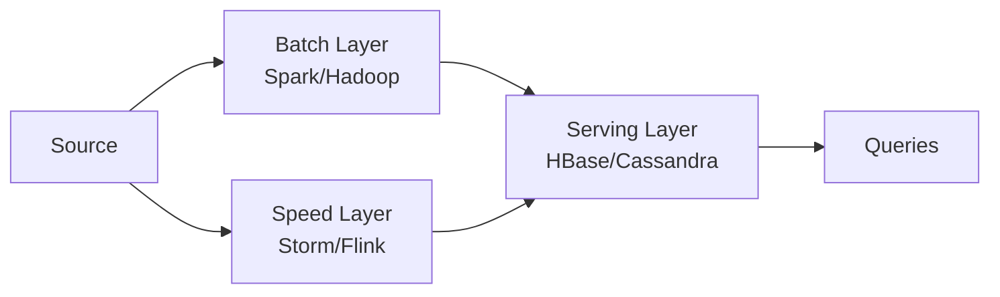
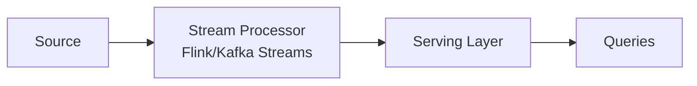

# Вопросы на собеседовании: `Stream Processing`

Stream processing — обработка данных **в реальном времени** (или near-real-time), в виде **непрерывного потока** событий, а не отдельными пакетными задачами (batch jobs). Концепции одинаковы для Flink, Kafka Streams, Spark Structured Streaming. На собеседовании спрашивают: event time vs processing time, watermarks, exactly-once, stateful-обработку, архитектуры lambda vs kappa.

## Полезные ссылки

### Официальная документация и авторитетные источники

- [Streaming Systems book (Tyler Akidau)](https://www.oreilly.com/library/view/streaming-systems/9781491983867/)
- [The world beyond batch — Streaming 101 / 102](https://www.oreilly.com/radar/the-world-beyond-batch-streaming-101/)
- [Designing Data-Intensive Applications (Kleppmann)](https://dataintensive.net/)
- [Lambda Architecture (Nathan Marz)](http://lambda-architecture.net/)
- [Kappa Architecture](https://www.oreilly.com/radar/questioning-the-lambda-architecture/)

## Содержание

- [Полезные ссылки](#полезные-ссылки)
- [See also](#see-also)

**Базовые понятия**
- [Q1. (!) Что такое stream processing?](#q1--что-такое-stream-processing)
- [Q2. (!) Чем stream processing отличается от batch?](#q2--чем-stream-processing-отличается-от-batch)
- [Q3. (!) Чем bounded-поток отличается от unbounded?](#q3--чем-bounded-поток-отличается-от-unbounded)
- [Q4. Чем real-time отличается от near-real-time?](#q4-чем-real-time-отличается-от-near-real-time)

**Time semantics**
- [Q5. (!) Чем event time отличается от processing time?](#q5--чем-event-time-отличается-от-processing-time)
- [Q6. (!) Watermarks — концепция?](#q6--watermarks--концепция)
- [Q7. Как обрабатывать опоздавшие (late) события?](#q7-как-обрабатывать-опоздавшие-late-события)

**Windowing**
- [Q8. (!) Что такое window?](#q8--что-такое-window)
- [Q9. Какие бывают окна: Tumbling, Sliding, Session, Global?](#q9-какие-бывают-окна-tumbling-sliding-session-global)
- [Q10. Что такое allowed lateness?](#q10-что-такое-allowed-lateness)

**State**
- [Q11. (!) Stateful processing — что и зачем?](#q11--stateful-processing--что-и-зачем)
- [Q12. Где хранится state?](#q12-где-хранится-state)
- [Q13. (!) Что такое checkpointing?](#q13--что-такое-checkpointing)

**Delivery semantics**
- [Q14. (!) Чем различаются at-most-once, at-least-once и exactly-once?](#q14--чем-различаются-at-most-once-at-least-once-и-exactly-once)
- [Q15. (!) Как достичь exactly-once?](#q15--как-достичь-exactly-once)
- [Q16. Что такое идемпотентные операции?](#q16-что-такое-идемпотентные-операции)

**Backpressure и масштабирование**
- [Q17. (!) Backpressure — что это?](#q17--backpressure--что-это)
- [Q18. Как бороться с backpressure?](#q18-как-бороться-с-backpressure)
- [Q19. Как устроен parallelism в streaming?](#q19-как-устроен-parallelism-в-streaming)

**Архитектуры**
- [Q20. (!) Что такое Lambda Architecture?](#q20--что-такое-lambda-architecture)
- [Q21. (!) Что такое Kappa Architecture?](#q21--что-такое-kappa-architecture)
- [Q22. (!) Lambda vs Kappa — что выбрать?](#q22--lambda-vs-kappa--что-выбрать)

**Сравнения tools**
- [Q23. (!) Чем различаются Flink, Spark Streaming и Kafka Streams?](#q23--чем-различаются-flink-spark-streaming-и-kafka-streams)
- [Q24. Apache Storm — почему deprecated?](#q24-apache-storm--почему-deprecated)
- [Q25. (!) Чем stream processor отличается от message queue (Kafka)?](#q25--чем-stream-processor-отличается-от-message-queue-kafka)

**Применения**
- [Q26. (!) Где stream processing в production?](#q26--где-stream-processing-в-production)
- [Q27. Как устроен ML-инференс в реальном времени?](#q27-как-устроен-ml-инференс-в-реальном-времени)
- [Q28. (!) Какие частые pitfalls в streaming?](#q28--какие-частые-pitfalls-в-streaming)

## Q1. (!) Что такое stream processing?

**Stream processing** — модель обработки данных, где события обрабатываются **по мере поступления**, в виде непрерывного потока, а не накапливаются и считаются разом, как в **batch processing** (накопить → обработать). Главная идея: результат обновляется сразу, а не раз в час или раз в сутки.

**Чем определяется модель:**
- **Обработка по мере поступления** — каждое событие (или маленький батч) идёт в работу сразу, без ожидания, пока «накопится партия».
- **Stateful-обработка** — операторы помнят предыдущие события (счётчики, агрегаты, сессии), а не обрабатывают каждое событие в вакууме. Это то, что отличает streaming от простого «прокинуть сообщение дальше».
- **Out-of-order-события** — реальные данные приходят не в том порядке, в котором произошли (сетевые задержки, ретраи), и движок должен это учитывать. Именно отсюда растут watermarks и event time.

**Где применяют** (везде, где задержка в часы недопустима):
- Аналитика в реальном времени (clickstream, IoT)
- Обнаружение мошенничества (fraud detection) — решение нужно до того, как платёж пройдёт
- Рекомендации
- Оповещения и мониторинг
- ETL-пайплайны в реальном времени (вместо ночного batch)

## Q2. (!) Чем stream processing отличается от batch?

Коротко: **batch** копит данные и считает их разом по расписанию, **stream** обрабатывает события непрерывно и отдаёт результат сразу. Разница не только в задержке — она тянет за собой разную сложность, потому что в streaming приходится явно управлять временем и состоянием.

| Критерий | Stream | Batch |
|----------|--------|-------|
| Данные | Непрерывный поток | Ограниченный набор данных |
| Задержка | мс — секунды | минуты — часы |
| Пропускная способность | Высокая, но равномерная | Очень высокая, но всплесками |
| Сложность | Выше (state, время) | Ниже |
| Воспроизводимость | Сложно | Легко (повторный прогон на наборе данных) |
| Примеры | Flink, Kafka Streams, Spark Streaming | Spark, Hive, dbt |

**Почему streaming сложнее.** В batch весь набор данных есть на руках сразу: можно отсортировать, пересчитать, повторить прогон. В streaming данные приходят бесконечно и не по порядку, поэтому появляются понятия времени события (event time), watermarks и состояния (state) — всего того, что в batch не нужно.

**Тренд:** «**streaming как единая модель**» — batch рассматривают как частный случай streaming (ограниченный поток против бесконечного, bounded vs unbounded). Один и тот же движок (Flink, Spark) умеет и то, и другое, что снимает необходимость дублировать логику.

## Q3. (!) Чем bounded-поток отличается от unbounded?

Это разделение по тому, **есть ли у потока конец**. От него зависит, нужны ли watermarks и windows вообще.

- **Bounded stream** — конечный, известный заранее (файл, snapshot таблицы). Имеет начало и конец, поэтому по сути это batch.
- **Unbounded stream** — бесконечный (Kafka topic, данные сенсоров, клики). Никогда не «заканчивается», ждать «все данные» бессмысленно.

```
Bounded:    [e1, e2, e3, e4, e5]      ← finite
Unbounded:  [e1, e2, e3, e4, e5, ...] ← never ends
```

**Почему это важно.** Современные движки обрабатывают оба типа, но **unbounded** заставляет отвечать на вопросы, которых в batch нет: когда считать результат «готовым», если данные никогда не кончатся? Отсюда и нужны watermarks (когда закрыть окно), windows (на каком куске считать) и управление state (что хранить между событиями).

## Q4. Чем real-time отличается от near-real-time?

«Real-time» — растяжимый термин: для трейдинга это микросекунды, для дашборда — пара секунд. Полезно держать в голове шкалу допустимой задержки, потому что от неё напрямую зависит выбор движка и стоимость решения.

| Тип | Задержка | Примеры |
|-----|---------|----------|
| **Hard real-time** | < 1 мс | Трейдинг, робототехника |
| **Real-time** | 1–100 мс | Обнаружение мошенничества, ad bidding |
| **Near-real-time** | секунды | Большинство «streaming»-сценариев |
| **Micro-batch** | секунды-минуты | Spark Structured Streaming |
| **Batch** | минуты-часы | Ежедневный ETL |

**Главное на собеседовании:** большинство задач, которые называют «streaming», на деле **near-real-time** — задержка 1–10 сек вполне приемлема. Настоящий real-time (десятки мс и меньше) нужен реже и стоит существенно дороже, поэтому не стоит проектировать под него «на всякий случай».

## Q5. (!) Чем event time отличается от processing time?

Это два разных «времени» одного и того же события, и путать их — источник самых частых багов в streaming.

| Время | Что значит |
|------|------------|
| **Event time** | Когда событие **произошло** в реальности (timestamp в данных) |
| **Processing time** | Когда событие **обрабатывается** в системе |

**Пример (clickstream):**
```
14:00 — пользователь кликнул (event time)
14:05 — данные пришли в Kafka
14:07 — Flink обработал (processing time)
```

Разрыв между ними (тут 7 минут) — это и есть задержка доставки, и она непостоянна: сеть, ретраи, оффлайн-устройства. Если считать «клики за 14:00–14:05» по processing time, событие из примера попадёт не в то окно.

**Компромисс:**
- **Event time** — корректно, детерминированно, повторяемо: тот же вход даёт тот же результат. Но требует watermarks, чтобы понимать, когда «все за интервал уже пришли».
- **Processing time** — проще (часы машины и есть время), но не отражает реальность и ломается при опоздавших событиях.

**Вывод:** для аналитики в production почти всегда нужен **event time**. Processing time оправдан только там, где важна не точность по времени события, а скорость реакции (например, «сколько запросов в секунду прямо сейчас»).

## Q6. (!) Watermarks — концепция?

**Watermark** — это служебная метка в потоке, которая утверждает: «события с event_time меньше этого значения уже пришли, больше их не ждём». По сути это ответ движка на вопрос «насколько мы продвинулись во времени событий» в условиях, когда данные приходят не по порядку.

```
events:    e(t=10) e(t=12) e(t=15) e(t=11)
                                          ↓
                                  watermark = 11 — events с t<=11 больше не ждём
```

**Зачем нужен** (без watermark по event time нельзя ничего «закрыть»):
- **Триггер закрытия window** — окно считается готовым, когда watermark прошёл его конец.
- **Определение опоздавших (late) событий** — всё, что пришло с timestamp меньше watermark.
- **Очистка state** — можно освободить память по уже «закрытому» времени.

**Стратегии генерации:**
- **Periodic** — watermark выдаётся каждые N мс на основе максимального увиденного timestamp; дешевле, подходит большинству.
- **Punctuated** — watermark на каждом событии; точнее для сильно out-of-order потоков, но дороже.

```scala
// Flink
WatermarkStrategy.forBoundedOutOfOrderness(Duration.ofSeconds(20))
```

Здесь watermark отстаёт от максимального timestamp на 20 сек — это «бюджет» на опоздание. Чем он больше, тем меньше теряем опоздавших, но тем позже закрываются окна и больше держится state. Это прямой компромисс между полнотой данных и задержкой результата.

## Q7. Как обрабатывать опоздавшие (late) события?

**Late event** — событие, чей timestamp оказался **раньше** текущего watermark, то есть пришло после того, как движок решил «за это время всё уже собрано». Окно, в которое оно должно было попасть, уже могло закрыться.

Что с ним делать — зависит от того, насколько критична полнота данных:

1. **Drop** (по умолчанию) — просто игнорировать. Допустимо, если редкие потери не искажают картину.
2. **Dead letter queue** — отложить в отдельную очередь и разобрать позже (или вручную).
3. **Обновить агрегацию** — пересчитать результат окна и переотправить его. Работает, только если окно ещё «живо» благодаря **allowed lateness** (см. Q10).
4. **Side output** — направить опоздавшие в отдельный поток и обработать собственной логикой, не трогая основной результат.

**Рекомендация:** drop по умолчанию опасен — данные тихо теряются. Если опоздания возможны, явно выбирайте side output или allowed lateness, а не полагайтесь на поведение по умолчанию.

```scala
val late = new OutputTag[Event]("late")

stream
  .keyBy(_.userId)
  .window(TumblingEventTimeWindows.of(Time.minutes(5)))
  .allowedLateness(Time.minutes(1))
  .sideOutputLateData(late)
  .process(...)
```

## Q8. (!) Что такое window?

**Window** (окно) — способ нарезать бесконечный поток на конечные куски, чтобы к ним можно было применить агрегацию. Без окна вопрос «сколько событий?» бессмысленен — поток бесконечен; вопрос обретает смысл только в форме «сколько событий **за интервал**».

```
infinite stream: e1 e2 e3 e4 e5 e6 e7 ...
windows:        [e1 e2 e3] [e4 e5 e6] [e7 ...]
                  W1         W2         W3
```

**Зачем нужно:**
- Подсчёт по интервалу (событий/мин, ошибок/час)
- Агрегации (avg/sum) на ограниченном наборе
- Выявление паттернов внутри временного отрезка

Окна бывают разной формы (tumbling, sliding, session — см. Q9), но суть одна: превратить «бесконечно» в «за период».

## Q9. Какие бывают окна: Tumbling, Sliding, Session, Global?

Четыре базовых типа окон. Различаются тем, как они нарезают поток: по фиксированной сетке, со сдвигом, по активности или вообще без границ.

**Tumbling** — фиксированные, не перекрывающиеся. Каждое событие попадает ровно в одно окно. Для регулярной статистики «раз в N минут».
```
| 0-5 | 5-10 | 10-15 |
```

**Sliding** — фиксированной длины, но перекрывающиеся с заданным шагом. Одно событие попадает в несколько окон. Для «скользящих» метрик вроде «среднее за последние 5 минут, обновляется каждую минуту».
```
| 0-5 |
   | 1-6 |
      | 2-7 |
```

**Session** — границы определяются паузами (gap), длина динамическая. Окно «закрывается», когда активность прекратилась дольше заданного gap. Естественно ложится на пользовательские сессии.
```
e1 e2 e3 [gap] e4 e5 [gap] e6
[----session 1----] [-session 2-] [s3]
```

**Global** — все события в одном окне без временных границ; результат отдаётся только по кастомному триггеру (например, по числу событий).

Подробнее по каждому фреймворку:
- [Flink](apache-flink-interview.md)
- [Kafka Streams](kafka-streams-interview.md)
- [Spark](apache-spark-interview.md)

## Q10. Что такое allowed lateness?

**Allowed lateness** — дополнительный «льготный период» после закрытия окна, в течение которого окно ещё принимает опоздавшие события и **пересчитывает** свой результат. Это компромисс между «закрыть окно вовремя» и «не потерять опоздавших».

```scala
.window(TumblingEventTimeWindows.of(Time.minutes(5)))
.allowedLateness(Time.minutes(2))
```

Здесь окно держится открытым ещё **2 минуты после своего закрытия** по watermark: пришло опоздавшее событие — результат обновляется и переотправляется.

**Компромисс:**
- Больше lateness → дольше живёт state → больше памяти
- Меньше lateness → больше потерянных событий

**Подводный камень:** окно отдаёт результат повторно (re-emit), поэтому downstream обязан уметь обрабатывать **обновления** уже отправленного результата — иначе получите дубли или рассинхрон. Простой «append» здесь не подойдёт, нужен upsert по ключу окна.

## Q11. (!) Stateful processing — что и зачем?

**Stateful-обработка** — это когда оператор помнит данные **между событиями**, а не обрабатывает каждое в изоляции. Состояние (state) — то, что движок хранит и восстанавливает после сбоя; именно оно делает streaming мощным и одновременно сложным.

Что обычно лежит в state:
- Счётчик на пользователя
- Последнее увиденное значение
- Промежуточные агрегации по window
- ML-модель
- Информация о сессии

**Граница:**
- **Без state (stateless)** — только независимые преобразования: map, filter. Каждое событие самодостаточно, ничего помнить не нужно.
- **Со state (stateful)** — агрегации, join-ы, разбиение на сессии (sessionization), CEP. Всё, где результат зависит от истории.

Платой за state становятся checkpointing (Q13) и очистка по времени (иначе утечка памяти — см. Q28).

```scala
// Кол-во events per user
keyedStream.process(new KeyedProcessFunction[String, Event, Long] {
    private var count: ValueState[Long] = _
    override def processElement(value: Event, ctx: Context, out: Collector[Long]): Unit = {
        val current = Option(count.value()).getOrElse(0L)
        count.update(current + 1)
        out.collect(current + 1)
    }
})
```

## Q12. Где хранится state?

State можно держать в памяти, на локальном диске или во внешнем хранилище. Выбор — это компромисс между скоростью доступа и тем, насколько большой state вы можете себе позволить.

| Backend | Производительность | Размер |
|---------|-------------------|--------|
| **JVM heap** | Самый быстрый | < 1 ГБ на оператор |
| **RocksDB на диске** | Медленнее (сериализация/десериализация) | терабайты |
| **Внешний** (Redis, Cassandra) | Самый медленный | Любой |

Heap быстрее всего, потому что объекты лежат в памяти как есть; RocksDB медленнее из-за сериализации на диск, но снимает ограничение по размеру; внешнее хранилище добавляет сетевой round-trip, зато state переживает рестарт и доступен другим сервисам.

**Как реализовано в движках:**
- **Flink** — HashMapStateBackend (heap) или EmbeddedRocksDBStateBackend.
- **Kafka Streams** — RocksDB локально + changelog topic в Kafka для восстановления.
- **Spark** — stateful-операции через checkpoints.

**Правило выбора:**
- Маленький state → heap (быстро и просто)
- Большой state → RocksDB (не упираемся в RAM)
- Очень большой или общий между сервисами → внешнее хранилище

## Q13. (!) Что такое checkpointing?

**Checkpoint** — периодический согласованный snapshot всего state системы, сохранённый в надёжное хранилище. Это механизм, который позволяет stateful-стримингу переживать сбои: после падения движок не начинает с нуля, а восстанавливается с последнего checkpoint.

```scala
env.enableCheckpointing(60000) // every 60 seconds
```

**Зачем нужно:**
- **Отказоустойчивость** — после сбоя восстановиться с последнего checkpoint, не потеряв накопленное состояние.
- **Exactly-once-семантика** — checkpoint в связке с транзакционным sink гарантирует, что после восстановления результат не задвоится (см. Q15).

**Где хранить:**
- **HDFS, S3** — распределённое надёжное хранилище (snapshot переживёт падение узла).
- Локальный диск — только для dev: при потере узла потеряется и checkpoint.

**Как делается согласованный snapshot (алгоритм Chandy-Lamport):** проблема в том, что операторы работают параллельно, и нельзя просто «остановить всё и сфотографировать». Решение — пустить во входной поток специальный маркер.
1. Во входной поток внедряется **barrier** (маркер между событиями).
2. Barrier-ы текут через операторы вместе с данными.
3. Получив barrier по всем входам, оператор делает snapshot своего state.
4. Когда все операторы отметились — checkpoint завершён и считается согласованным.

При сбое движок откатывает все операторы к последнему завершённому checkpoint и переигрывает поток с соответствующих offset.

## Q14. (!) Чем различаются at-most-once, at-least-once и exactly-once?

Это три уровня гарантии доставки — обещание, **сколько раз** каждое событие будет обработано при сбоях. Чем строже гарантия, тем дороже она обходится по производительности.

| Семантика | Описание | Когда |
|-----------|----------|-------|
| **At-most-once** | Каждое событие обработано 0 или 1 раз | Метрики, где важна низкая задержка, а потеря допустима |
| **At-least-once** | Каждое событие ≥1 раза | Большинство систем (с идемпотентной обработкой) |
| **Exactly-once** | Каждое событие ровно 1 раз | Финансы, биллинг |

Логика проста: at-most-once может **потерять** событие (но не задвоит), at-least-once может **задвоить** (но не потеряет), exactly-once — ни то, ни другое. Без гарантий вообще события могут и теряться, и дублироваться при сбоях.

**Компромисс:**
- **At-least-once** проще и быстрее, но требует идемпотентной обработки на приёмнике, иначе дубли исказят результат.
- **Exactly-once** строже всего, но достигается через транзакции и потому медленнее.

На практике большинство систем выбирают at-least-once + идемпотентность — это даёт эффект exactly-once дешевле (см. Q16).

## Q15. (!) Как достичь exactly-once?

Главная мысль: exactly-once — это свойство **всей цепочки**, а не одного компонента. Достаточно одного слабого звена, и гарантия теряется. Нужны три части, каждая со своей ролью:

1. **Перевоспроизводимый источник (replayable source)** — Kafka, Kinesis с offsets. После сбоя можно перечитать поток с того же места, иначе нечего восстанавливать.
2. **Stream-процессор с checkpointing** — Flink, Kafka Streams, Spark. Согласованный snapshot state, чтобы при откате не потерять и не задвоить накопленное.
3. **Транзакционный sink** — Kafka transactions, JDBC 2PC или идемпотентные записи. Без него процессор может «откатиться», а уже записанные результаты во внешней системе — нет.

**Пример:** Kafka → Flink → Kafka (с Kafka transactions):

```scala
KafkaSink.<String>builder()
    .setBootstrapServers("kafka:9092")
    .setRecordSerializer(...)
    .setDeliveryGuarantee(DeliveryGuarantee.EXACTLY_ONCE)
    .setTransactionalIdPrefix("my-app")
    .build();
```

**Цена:** ~5–15% накладных расходов на пропускную способность — плата за транзакции и двухфазную фиксацию.

Если sink не транзакционный (например, Elasticsearch), exactly-once добивают **идемпотентными записями**: каждому результату присваивают уникальный ID, и повторная запись с тем же ID не создаёт дубль, а перезаписывает существующую.

## Q16. Что такое идемпотентные операции?

**Идемпотентность** — свойство операции, при котором её повторное выполнение даёт тот же результат, что и однократное. В streaming это ключевой приём: если операция идемпотентна, дубликат от at-least-once безвреден.

```sql
-- Idempotent (PUT/UPSERT)
INSERT INTO users (id, name) VALUES (1, 'Alice')
ON CONFLICT (id) DO UPDATE SET name = EXCLUDED.name;

-- НЕ idempotent
INSERT INTO orders (user_id, amount) VALUES (1, 100); -- каждый раз новая запись!
```

Разница на примере: UPSERT по `id` при повторе просто перезапишет ту же строку — состояние не изменится. А обычный INSERT при каждом повторе создаёт новую запись, поэтому дубль от ретрая превращается в лишний заказ.

**Главный вывод:** at-least-once + идемпотентные операции = фактически exactly-once, но дешевле, чем полноценные транзакции.

**Как сделать запись идемпотентной:**
- **Уникальные ID** в записях (UUID) — дубль с тем же ID распознаётся и отбрасывается.
- **UPSERT / MERGE** в БД — повтор перезаписывает, а не добавляет.
- **Checkpoint на стороне получателя (receiver)** — приёмник помнит, что уже обработал.

## Q17. (!) Backpressure — что это?

**Backpressure** — ситуация, когда медленный downstream-оператор «придавливает» upstream: его буферы заполняются, и тот, кто пишет в них, вынужден замедлиться. Сигнал о перегрузке распространяется по конвейеру назад, вплоть до источника.

```
Source → Op1 → Op2 (SLOW)
                ↓
        Op2 buffer fills → Op1 не может писать → замедляется → Source замедляется
```

**По чему распознать:**
- Растущий **lag** (Kafka consumer lag, индикатор backpressure во Flink UI)
- Высокое потребление RAM (буферы переполнены)
- Растёт сквозная задержка

**Важно:** при backpressure **данные не теряются** — это не сбой, а механизм саморегуляции. Но пропускная способность всей системы падает до уровня самого медленного оператора, поэтому его и нужно искать в первую очередь (см. Q18).

## Q18. Как бороться с backpressure?

Порядок действий — от диагностики к лечению. Сначала найти узкое место, и только потом «лить» ресурсы, иначе масштабировать будете не то.

1. **Профилирование** — найти самый медленный оператор (Flink Web UI, Spark UI). Это всегда первый шаг.
2. **Масштабирование** — поднять parallelism именно на узком операторе.
3. **Оптимизация кода** — ускорить UDF, аккуратнее с join-ами (частая причина — тяжёлая логика на событие).
4. **Увеличение ресурсов** — больше CPU/RAM, если упёрлись в железо.
5. **Сброс сообщений** — если потеря допустима (перейти к source с offset LATEST), чтобы догнать поток.
6. **Буферизация** — увеличить network buffers; временное решение, проблему не лечит, лишь оттягивает.

**По движкам:**
- **Kafka Streams** — добавить инстансы (вызовет ребаланс consumer group и перераспределит партиции).
- **Flink** — увеличить parallelism медленного оператора.

## Q19. Как устроен parallelism в streaming?

**Parallelism** — на сколько параллельных subtasks разбит каждый оператор. Это главный рычаг масштабирования: больше subtasks — больше пропускная способность, но только если данные между ними распределяются равномерно.

**В Flink:**
```scala
env.setParallelism(8)
stream.map(...).setParallelism(4) // override per operator
```

**Как раскидываются данные по subtasks (партиционирование):**
- **Round-robin** — равномерно по кругу; годится для stateless-операций, где порядок и ключ не важны.
- **По ключу (`keyBy`)** — по hash от ключа; обязательно для stateful, чтобы все события одного ключа попадали в один subtask (иначе state «размажется»).
- **Broadcast** — каждое событие во все subtasks; для рассылки конфигурации/правил.

**В Kafka Streams** parallelism жёстко привязан к числу партиций topic: больше партиций — больше параллелизма, и наоборот.

**Рекомендация:**
- Parallelism source-а ставят равным числу партиций.
- Parallelism sink-а можно сделать меньше (группировка вывода).
- Stateful-операторы параллелят по ключу — иначе теряется локальность state.

## Q20. (!) Что такое Lambda Architecture?

**Lambda Architecture** (Nathan Marz, 2011) — подход, где данные обрабатываются **двумя параллельными слоями** сразу: медленным точным batch и быстрым приближённым speed. Идея в том, чтобы получить и точность, и низкую задержку, объединяя результаты обоих.



**Роль каждого слоя:**
- **Batch layer** — пересчитывает всё точно, но медленно (например, часовой ETL).
- **Speed layer** — даёт быстрое приближение по недавним событиям, пока batch ещё не досчитал.
- **Serving layer** — склеивает оба результата при запросе: свежее берёт из speed, остальное — из batch.

**Плюсы:**
- Batch гарантирует итоговую точность.
- Speed даёт низкую задержку для свежих данных.

**Минусы:**
- **Сложно поддерживать** — одна и та же бизнес-логика живёт в двух кодовых базах (batch и speed), их легко рассинхронизировать.
- Тяжело рассуждать о консистентности на стыке двух результатов.

Именно дублирование логики — главная боль Lambda, из-за которой подход считается устаревшим и вытесняется Kappa.

## Q21. (!) Что такое Kappa Architecture?

**Kappa Architecture** (Jay Kreps, 2014) — ответ на сложность Lambda: оставить **только** speed layer и убрать batch-слой совсем. Всё, включая исторический пересчёт, делается одним streaming-конвейером.



**Идея:** обрабатывать всё как поток. Нужно пересчитать историю (reprocessing) — перематываем Kafka offset назад и проигрываем поток заново тем же кодом. Отдельный batch-слой становится не нужен.

**Плюсы:**
- **Одна кодовая база** — только streaming, нет дублирования логики, как в Lambda.
- Проще в эксплуатации (один конвейер вместо двух).
- Streaming-движки умеют работать и в batch-режиме (на ограниченных потоках, bounded streams), поэтому исторический пересчёт им по силам.

**Что для этого нужно:**
- Источник должен быть **replayable** (Kafka) — иначе нечего перематывать.
- Stream-движок должен одинаково обрабатывать bounded и unbounded потоки.

Kappa хорошо ложится на **Flink** (единый batch + streaming) и **Lakehouse** (Delta/Iceberg) и постепенно вытесняет Lambda в новых проектах.

## Q22. (!) Lambda vs Kappa — что выбрать?

Выбор сводится к одному вопросу: можно ли переиграть источник и выразить всю логику как поток? Если да — Kappa проще. Если нет — Lambda неизбежна.

**Берите Kappa, если:**
- Источник = Kafka или другой **replayable** (есть откуда перематывать).
- Stream-движок умеет обрабатывать bounded streams (Flink, Spark Structured Streaming).
- Важна **простота** — одна кодовая база вместо двух.

**Берите Lambda, если:**
- Источник не replayable (нечего проиграть заново).
- Уже есть инфраструктура Hadoop, и переписывать её дорого.
- Тяжёлые batch-задачи не выражаются как поток.

В новых проектах по умолчанию выбирают **Kappa**; **Lambda** остаётся в основном в legacy-системах.

## Q23. (!) Чем различаются Flink, Spark Streaming и Kafka Streams?

Три самых популярных движка, и различаются они по двум осям: модель обработки (настоящий streaming или micro-batch) и способ деплоя (отдельный кластер или библиотека внутри сервиса).

| Критерий | Flink | Spark Structured Streaming | Kafka Streams |
|----------|-------|---------------------------|---------------|
| Модель | True streaming | Micro-batch | True streaming (читает из Kafka) |
| Задержка | < 100 мс (часто < 10 мс) | сек | 10–100 мс |
| State | Богатый | Есть поддержка stateful | RocksDB + changelog |
| Источники | Любые | Любые | Только Kafka |
| Деплой | Кластер | Кластер | Библиотека (как микросервис) |
| Эксплуатация | Сложная | Сложная | Простая |

Ключевое отличие в модели: Spark складывает события в микробатчи (отсюда задержка в секунды), а Flink и Kafka Streams обрабатывают по событию (отсюда миллисекунды). Kafka Streams при этом не кластер, а библиотека — встраивается прямо в ваш сервис, поэтому проще в эксплуатации, но завязан на Kafka.

**Как выбрать:**
- **Kafka Streams** — источник Kafka и нужна простота (не хочется отдельного кластера).
- **Flink** — нужен true streaming с низкой задержкой и богатым state.
- **Spark Streaming** — в команде уже есть Spark, а задержка от 1 секунды приемлема.

## Q24. Apache Storm — почему deprecated?

**Apache Storm** (2011) — первый широко популярный stream processor; он задал моду на streaming, но проиграл следующему поколению.

**Что он умел:**
- True streaming (обработка запись за записью).
- Низкоуровневый API из примитивов spouts и bolts.
- Гарантия at-least-once (exactly-once — только через надстройку Trident).

**Почему устарел.** Storm проиграл там, где Flink предложил больше при меньшей сложности:
- Слишком низкоуровневый API — много ручной работы по сравнению с DSL у Flink/Kafka Streams.
- Нет богатого state API — именно на этом Flink выиграл для stateful-задач.
- Нет встроенного SQL.
- Как следствие — сообщество и поддержка сократились.

Сегодня Storm — legacy. Heron (преемник от Twitter) пытался его заменить, но тоже не получил широкого распространения.

## Q25. (!) Чем stream processor отличается от message queue (Kafka)?

Это частая путаница: Kafka и stream processor — не конкуренты, а звенья одной цепи. Kafka **перевозит** данные, stream processor их **обрабатывает**.

| Критерий | Stream Processor | Message Queue (Kafka) |
|----------|-----------------|----------------------|
| Назначение | Обработка | Транспорт сообщений |
| State | Богатый (windows, агрегации) | Минимальный |
| Задержка | Включает processing time | Сетевая задержка |
| API | DSL для преобразований | Producer/Consumer |

Kafka хранит и доставляет сообщения, но сама **не делает агрегаций, windows и join-ов**. Всю логику добавляет stream processor (Flink, Kafka Streams), который читает данные **поверх** Kafka:

```
Producers → Kafka (transport) → Stream Processor (logic) → Sinks
```

Поэтому на собеседовании на вопрос «можно ли посчитать агрегат в Kafka?» правильный ответ — нет, для этого нужен слой обработки сверху. Подробнее — [Apache Kafka](../messaging/kafka-interview.md).

## Q26. (!) Где stream processing в production?

Общий знаменатель всех сценариев ниже — реагировать нужно сейчас, а не после ночного batch. Если ценность ответа падает с задержкой, это кандидат на streaming.

1. **Обнаружение мошенничества** — банки, платежи (Stripe, банки): решение нужно до подтверждения транзакции.
2. **Рекомендации в реальном времени** — Netflix, Amazon: подстройка под текущую сессию.
3. **Ad bidding** — решение за < 100 мс, иначе показ уйдёт конкуренту.
4. **Мониторинг / оповещения** — пайплайны Datadog, Prometheus.
5. **Данные IoT-сенсоров** — производство, автопром.
6. **Аналитика clickstream** — A/B-тестирование, анализ воронок.
7. **ETL-стриминг** — замена batch (CDC → streaming → DWH).
8. **Трейдинг** — высокочастотные системы.
9. **Гео-трекинг** — Uber, Lyft.
10. **ML-инференс в реальном времени** — онлайн-предсказания (см. Q27).

## Q27. Как устроен ML-инференс в реальном времени?

Суть — встроить предсказание модели прямо в поток: из событий на лету собираются признаки, по ним модель выдаёт прогноз.

```
events → feature extraction (streaming) → ML model serving → predictions
```

**Паттерны (где живёт модель):**
- **Embedded model** — инференс прямо внутри stream processor. Минимальная задержка, но обновлять модель сложнее (нужен передеплой пайплайна).
- **Model service** — модель в отдельном микросервисе (gRPC), поток дёргает его по сети. Гибче (модель деплоится независимо), но добавляет сетевой round-trip.
- **Feature store** (Tecton, Feast) — заранее вычисленные признаки, чтобы не считать тяжёлые фичи на каждом событии.

**Инструменты:**
- **TensorFlow Serving / Triton** — обслуживание моделей (model serving).
- **Feast** — feature store.
- **Flink ML** — встроенный ML прямо в Flink.

## Q28. (!) Какие частые pitfalls в streaming?

Большинство граблей в streaming сводятся к трём темам: неверная работа со временем, нечищеный state и проигнорированный backpressure. Каждая тихо портит результат, а не падает с ошибкой — потому так опасна.

**Время и watermarks:**
1. **Неправильная семантика времени** — processing time там, где нужен event time → неверные агрегации при out-of-order.
2. **Слишком агрессивный watermark** — теряем опоздавшие (late) данные.
3. **Слишком консервативный watermark** — windows закрываются слишком поздно, результат запаздывает.

**State:**
4. **State без очистки** — утечка памяти, state растёт бесконечно.
10. **Не мониторят размер state** — RocksDB разросся → упор в IO.

**Доставка и идемпотентность:**
7. **Неправильная семантика доставки** — at-most-once там, где нужен exactly-once.
8. **Неидемпотентный sink + at-least-once** — дублирование результатов.

**Производительность:**
5. **Игнорирование backpressure** — растут lag и задержка.
9. **Последовательное узкое место** — низкий parallelism в одной точке тормозит весь конвейер.

**Тестирование:**
6. **Нет тестов с late-событиями** — поведение в production преподносит сюрпризы.

Вывод: **streaming в production требует намного больше внимания, чем batch**, — именно из-за времени, state и доставки, которых в batch попросту нет.

## See also

- [Apache Spark](apache-spark-interview.md) — Structured Streaming
- [Apache Flink](apache-flink-interview.md) — true streaming
- [Kafka Streams](kafka-streams-interview.md) — library streaming
- [Apache Kafka](../messaging/kafka-interview.md) — transport для streaming
- [Event-driven паттерны](../architecture/event-driven-patterns-interview.md) — фундамент streaming
- [Apache Airflow](apache-airflow-interview.md) — для batch (vs streaming)
- [Data Warehousing](data-warehousing-interview.md) — обычно destination
- [Data Lake / Lakehouse](data-lake-lakehouse-interview.md) — destination для streaming
- [Микросервисы](../architecture/microservices-interview.md) — event-driven services
- [CAP Theorem](../architecture/cap-theorem-interview.md) — trade-offs distributed
- [Распределённые системы](../architecture/distributed-systems-interview.md) — consistency, replication
- [Saga Pattern](../architecture/saga-pattern-interview.md) — sagas через streaming

- [Apache Flink](apache-flink-interview.md)
- [Apache Spark](apache-spark-interview.md)
- [Data Lake и Lakehouse](data-lake-lakehouse-interview.md)
- [Data Warehousing](data-warehousing-interview.md)
- [dbt](dbt-interview.md)
