# Вопросы на собеседовании: `Apache Cassandra`

Вопросы и ответы по `Apache Cassandra`: архитектура кластера, модель данных, `CQL`, `Primary Key`, репликация, уровни консистентности, `LWT`, стратегии компакции, `Spring Data Cassandra`, `Java Driver`.

**Apache Cassandra** — распределённая `NoSQL` БД с линейной масштабируемостью и высокой доступностью, спроектированная для обработки больших объёмов данных на множестве серверов без единой точки отказа. На собеседованиях спрашивают про архитектуру кластера, моделирование данных под запросы, `CQL`, уровни консистентности и сценарии использования.

## Полезные ссылки

### Официальная документация

- [Apache Cassandra Documentation](https://cassandra.apache.org/doc/latest/) — официальная документация
- [DataStax Java Driver](https://docs.datastax.com/en/developer/java-driver/) — драйвер для Java
- [Spring Data Cassandra Reference](https://docs.spring.io/spring-data/cassandra/docs/current/reference/html/) — Spring Data Cassandra

### Статьи Baeldung

- [Introduction to Spring Data Cassandra](https://www.baeldung.com/spring-data-cassandra-tutorial) — настройка и базовые операции
- [A Guide to Cassandra with Java](https://www.baeldung.com/cassandra-with-java) — работа через Java Driver
- [Cassandra Batch in CQL and Java](https://www.baeldung.com/java-cql-cassandra-batch) — пакетные операции
- [Cassandra Query Cheat Sheet](https://www.baeldung.com/cassandra-query-cheat-sheet) — справочник по CQL
- [Spring Data with Reactive Cassandra](https://www.baeldung.com/spring-data-cassandra-reactive) — реактивный стек
- [Secondary Indexes in Cassandra](https://www.baeldung.com/cassandra-secondary-indexes) — вторичные индексы
- [Data Modeling in Cassandra](https://www.baeldung.com/cassandra-data-modeling) — моделирование данных под запросы
- [Consistency Levels in Cassandra](https://www.baeldung.com/cassandra-consistency-levels) — уровни консистентности
- [Cassandra Partition Key, Composite Key, and Clustering Key](https://www.baeldung.com/cassandra-keys) — устройство ключей

## Содержание

- [Полезные ссылки](#полезные-ссылки)
- [See also](#see-also)

**Архитектура и основные концепции**
- [Q1. (!) Что такое Apache Cassandra и когда её выбирать?](#q1--что-такое-apache-cassandra-и-когда-её-выбирать)
- [Q2. (!) Какова архитектура кластера Cassandra?](#q2--какова-архитектура-кластера-cassandra)
- [Q3. (!) Что такое Gossip-протокол?](#q3--что-такое-gossip-протокол)
- [Q4. Что такое Snitch и какие типы существуют?](#q4-что-такое-snitch-и-какие-типы-существуют)
- [Q5. Как работает Consistent Hashing в Cassandra?](#q5-как-работает-consistent-hashing-в-cassandra)
- [Q6. Что такое Virtual Nodes (vnodes)?](#q6-что-такое-virtual-nodes-vnodes)

**Модель данных и Primary Key**
- [Q7. (!) Какую модель данных использует Cassandra?](#q7--какую-модель-данных-использует-cassandra)
- [Q8. (!) Что такое Primary Key, Partition Key и Clustering Key?](#q8--что-такое-primary-key-partition-key-и-clustering-key)
- [Q9. (!) Как правильно моделировать данные в Cassandra?](#q9--как-правильно-моделировать-данные-в-cassandra)
- [Q10. Какие факторы влияют на равномерное распределение данных?](#q10-какие-факторы-влияют-на-равномерное-распределение-данных)
- [Q11. Что такое Wide Rows и какие ограничения на размер партиции?](#q11-что-такое-wide-rows-и-какие-ограничения-на-размер-партиции)

**CQL и работа с данными**
- [Q12. (!) Основные команды CQL](#q12--основные-команды-cql)
- [Q13. Что такое Secondary Index и когда его использовать?](#q13-что-такое-secondary-index-и-когда-его-использовать)
- [Q14. Что такое Materialized Views?](#q14-что-такое-materialized-views)
- [Q15. Как выполнять агрегации и аналитические запросы?](#q15-как-выполнять-агрегации-и-аналитические-запросы)

**Запись и чтение данных**
- [Q16. (!) Как работает путь записи (Write Path)?](#q16--как-работает-путь-записи-write-path)
- [Q17. (!) Как работает путь чтения (Read Path)?](#q17--как-работает-путь-чтения-read-path)
- [Q18. Что такое Tombstone и как они влияют на производительность?](#q18-что-такое-tombstone-и-как-они-влияют-на-производительность)
- [Q19. Как работает механизм сжатия данных (Compression)?](#q19-как-работает-механизм-сжатия-данных-compression)

**Репликация и консистентность**
- [Q20. (!) Что такое Replication и какие стратегии существуют?](#q20--что-такое-replication-и-какие-стратегии-существуют)
- [Q21. (!) Какие уровни консистентности (Consistency Levels) существуют?](#q21--какие-уровни-консистентности-consistency-levels-существуют)
- [Q22. (!) Что означает формула R + W > N?](#q22--что-означает-формула-r--w--n)
- [Q23. Что такое Hinted Handoff?](#q23-что-такое-hinted-handoff)
- [Q24. Что такое Read Repair?](#q24-что-такое-read-repair)
- [Q25. (!) Что такое Anti-Entropy Repair и зачем он нужен?](#q25--что-такое-anti-entropy-repair-и-зачем-он-нужен)

**Компакция и TTL**
- [Q26. (!) Какие стратегии компакции (Compaction) существуют?](#q26--какие-стратегии-компакции-compaction-существуют)
- [Q27. Как управлять жизненным циклом данных через TTL?](#q27-как-управлять-жизненным-циклом-данных-через-ttl)

**Транзакции и Batch**
- [Q28. (!) Что такое Lightweight Transactions (LWT)?](#q28--что-такое-lightweight-transactions-lwt)
- [Q29. Что такое Batch и какие ограничения у Batch?](#q29-что-такое-batch-и-какие-ограничения-у-batch)
- [Q30. Как в Cassandra реализовать счётчики (Counters)?](#q30-как-в-cassandra-реализовать-счётчики-counters)

**Spring Data Cassandra и Java Driver**
- [Q31. (!) Как подключить Spring Data Cassandra к проекту?](#q31--как-подключить-spring-data-cassandra-к-проекту)
- [Q32. Как определить Entity и Repository в Spring Data Cassandra?](#q32-как-определить-entity-и-repository-в-spring-data-cassandra)
- [Q33. Как Cassandra Java Driver работает с кластером?](#q33-как-cassandra-java-driver-работает-с-кластером)
- [Q34. Как выполнять миграции схемы в Cassandra?](#q34-как-выполнять-миграции-схемы-в-cassandra)

**Операционные вопросы**
- [Q35. Как обеспечить безопасность кластера Cassandra?](#q35-как-обеспечить-безопасность-кластера-cassandra)
- [Q36. Какие метрики мониторить в production?](#q36-какие-метрики-мониторить-в-production)
- [Q37. Как масштабировать кластер Cassandra?](#q37-как-масштабировать-кластер-cassandra)
- [Q38. Cassandra vs другие NoSQL базы данных](#q38-cassandra-vs-другие-nosql-базы-данных)

**Анти-паттерны и лучшие практики**
- [Q39. Какие основные анти-паттерны при работе с Cassandra?](#q39-какие-основные-анти-паттерны-при-работе-с-cassandra)
- [Q40. (!) Как правильно обрабатывать коллекции в CQL?](#q40--как-правильно-обрабатывать-коллекции-в-cql)
- [Q41. Как реализовать pagination в Cassandra?](#q41-как-реализовать-pagination-в-cassandra)
- [Q42. (!) Что такое Token-aware routing и почему он важен?](#q42--что-такое-token-aware-routing-и-почему-он-важен)
- [Q43. Как выполнять агрегации и аналитику поверх Cassandra?](#q43-как-выполнять-агрегации-и-аналитику-поверх-cassandra)
- [Q44. Что такое CDC (Change Data Capture) в Cassandra?](#q44-что-такое-cdc-change-data-capture-в-cassandra)

---

## Q1. (!) Что такое `Apache Cassandra` и когда её выбирать?

**Apache Cassandra** — распределённая `NoSQL` база данных, спроектированная для обработки больших объёмов данных с высокой доступностью и линейной горизонтальной масштабируемостью. Не имеет единой точки отказа (masterless architecture).

**Ключевые характеристики:**
- **Peer-to-peer** архитектура — все узлы равноправны
- **Линейная масштабируемость** — удвоение узлов удваивает пропускную способность
- **Tunable consistency** — настраиваемый уровень консистентности per-query
- **AP-система** в терминах [CAP-теоремы](../architecture/cap-theorem-interview.md) (Availability + Partition tolerance)
- Оптимизирована для **записи** (write-optimized, `LSM-tree`)

**Когда выбирать Cassandra:**
- Высокая интенсивность записи (IoT, логи, метрики, активность пользователей)
- Требуется горизонтальное масштабирование до петабайт
- Мульти-датацентровая репликация
- Доступность важнее строгой консистентности
- Паттерн доступа: запись >> чтение, чтение по ключу

**Когда НЕ выбирать:**
- Нужны сложные JOIN-запросы и ad-hoc аналитика
- Требуются ACID-транзакции на множестве записей
- Маленький объём данных (< 100 GB) — overhead кластера не оправдан
- Часто меняющиеся паттерны запросов


> [!mcq]
> - [ ] Cassandra идеальна для системы банковских переводов между счетами | ACID-транзакции на двух партициях невозможны: lightweight transactions (LWT) работают только в пределах одной партиции через Paxos, а cross-partition атомарность отсутствует. ❌ ПОСЛЕДСТВИЕ: команда строит платежи на Cassandra, при сбое получает orphaned debit без credit; финансовые расхождения требуют ручной reconciliation.
> - [x] Cassandra выбирают при write-heavy workload (IoT, метрики, логи) с RF≥3 и lookup по известному partition key | AP-система с LSM-tree даёт линейный horizontal scale записи и multi-DC репликацию; чтение оптимально через partition key, ad-hoc сканы дороги. ✓ ПРИМЕНЯТЬ: телеметрия 100k events/sec, аудит-лог финопераций, time-series метрик; multi-region active-active с `NetworkTopologyStrategy`. 📋 ПРАВИЛО: «Cassandra = write-many, read-by-key, AP, multi-DC». 🔗 См. Q1.
> - [ ] Cassandra хороша как замена аналитической БД для ad-hoc SQL-запросов с JOIN и GROUP BY | CQL не поддерживает JOIN и full-table aggregations; для аналитики используют Spark поверх Cassandra или выгрузку в OLAP (ClickHouse, BigQuery). ❌ ПОСЛЕДСТВИЕ: BI-команда пишет ad-hoc запросы с `ALLOW FILTERING`, кластер уходит в read amplification на 50+ узлах, координатор OOM при сборе результатов.
> - [ ] Cassandra оптимальна для small-data сценариев < 100 GB как single-node замена SQLite | Cluster overhead (gossip, hinted handoff, repair, compaction) не оправдан на малых объёмах; single-node deployment теряет ключевое преимущество — отказоустойчивость. ❌ ПОСЛЕДСТВИЕ: стартап ставит 1-node Cassandra под 50 GB, операционные сложности (compaction, GC tuning) превышают выгоду; миграция на Postgres через год.

> [!mcq]
> - [x] Cassandra оптимизирована под запись благодаря LSM-tree: данные сначала идут в Commit Log + Memtable (in-memory), затем sequential flush в immutable SSTables | Запись = sequential I/O без random seek; обновление = новая версия с timestamp; удаление = tombstone. ✓ ПРИМЕНЯТЬ: write-heavy workloads (IoT телеметрия, time-series, event log, audit trail); запись 100k+ ops/sec на узел; tunable durability через `commitlog_sync` (periodic vs batch). 📋 ПРАВИЛО: «Cassandra = LSM write-optimized; чтение требует merge SSTables». 🔗 См. Q16 (write path), Q17 (read path), Q18 (compaction).
> - [ ] Cassandra оптимизирована под чтение благодаря B-tree индексам как в PostgreSQL — write требует random I/O для обновления страниц | B-tree — это RDBMS подход (Postgres, MySQL); Cassandra использует LSM-tree (sequential write) и SSTables (read merges). ❌ ПОСЛЕДСТВИЕ: команда выбирает Cassandra ожидая Postgres-like read latency, видит p99 чтений в десятки ms из-за SSTable merge + bloom filter checks. Misalignment с workload.
> - [ ] Cassandra обновляет SSTable in-place при UPDATE — поэтому запись быстрая | SSTable immutable, никогда не модифицируется; UPDATE = новая запись с большим timestamp в новой SSTable, старые версии удаляются compaction'ом. ❌ ПОСЛЕДСТВИЕ: разработчик ожидает Postgres-style UPDATE behavior, не понимает зачем нужна compaction, не настраивает strategy — disk usage растёт, read amplification ухудшается.
> - [ ] Cassandra хранит все данные in-memory как Redis — durability обеспечивается репликацией | Cassandra пишет на диск (Commit Log + SSTables); in-memory только Memtable как write buffer; durability per-write через Commit Log fsync, не только репликация. ❌ ПОСЛЕДСТВИЕ: путаница с Redis ведёт к неправильному capacity planning — sizing по RAM вместо disk, OOM при больших партициях, недооценка disk I/O.

## Q2. (!) Какова архитектура кластера `Cassandra`?

`Cassandra` использует **peer-to-peer** (masterless) архитектуру — в отличие от `MongoDB` или `HBase`, здесь нет master-узла. Все узлы равноправны и могут принимать запросы на чтение и запись.

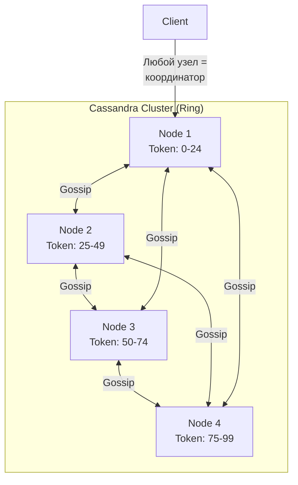

**Основные компоненты кластера:**


> [!mcq]
> - [ ] Координатор всегда совпадает с узлом-владельцем primary replica для запрашиваемой партиции | Координатор — это просто узел, к которому подключился клиент; он может не хранить данные запрашиваемой партиции и пересылает запрос реплика-узлам. ❌ ПОСЛЕДСТВИЕ: разработчик настраивает driver на «sticky» подключение к одному узлу думая что он primary, теряет TokenAware load-balancing — лишний hop добавляет 1-3ms latency на каждый запрос.
> - [ ] Master-узел в Cassandra принимает все writes и реплицирует на slaves через async replication | Cassandra masterless: любой узел принимает write, координатор рассылает на N реплик параллельно по `Consistency Level`. ❌ ПОСЛЕДСТВИЕ: команда строит DR-план как для PostgreSQL primary/replica, при отказе «master» паникует, хотя кластер продолжает работать через любой другой узел.
> - [x] Любой узел может стать координатором запроса; TokenAware-драйвер выбирает координатором владельца партиции для минимизации hop'ов | Masterless P2P архитектура: client отправляет запрос на любой узел, координатор по `partition key` определяет реплики и собирает кворум согласно CL. ✓ ПРИМЕНЯТЬ: DataStax driver с `TokenAwarePolicy` поверх `DCAwareRoundRobinPolicy`; `nodetool status` для проверки UN/DN; настройка `listen_address` + `rpc_address` для гетерогенных сетей. 📋 ПРАВИЛО: «Любой узел = координатор; TokenAware режет один hop». 🔗 См. Q2.
> - [ ] Координатор кэширует результаты SELECT для последующих запросов от других клиентов | Cassandra не кэширует результаты на координаторе; есть row cache и key cache на уровне локального чтения SSTable, но не shared cross-query кеш. ❌ ПОСЛЕДСТВИЕ: команда ожидает Redis-like response time на повторные запросы, видит latency идентичный первому запросу — недоумевает, неправильно настраивает row_cache_size.
| Компонент | Описание |
|-----------|----------|
| `Node` | Один экземпляр Cassandra, хранящий часть данных |
| `Rack` | Логическая группа узлов (обычно — стойка в ДЦ) |
| `Data Center` | Набор rack-ов, обычно соответствует физическому ДЦ |
| `Cluster` | Полный набор узлов, реплицирующих данные |
| `Coordinator` | Узел, принявший запрос клиента и координирующий ответ |

**Роль координатора:** любой узел может быть координатором. Клиент отправляет запрос на любой узел, тот определяет, какие узлы хранят нужные данные (по `partition key`), пересылает запрос и собирает ответы в соответствии с заданным `Consistency Level`.

> [!mcq]
> - [x] Каждому узлу назначается множество диапазонов токенов (vnodes), по умолчанию `num_tokens=256` — distribution данных по hash ring через Murmur3(partition_key) | vnodes автоматически балансируют ring; добавление узла перераспределяет только часть токенов, а не весь ring. ✓ ПРИМЕНЯТЬ: `num_tokens=16` для нового deployment (Cassandra 4.0+ recommendation), `num_tokens=256` для legacy 3.x; разные `num_tokens` для heterogeneous hardware (мощный узел = больше токенов); `nodetool ring` для просмотра распределения. 📋 ПРАВИЛО: «vnodes = автоматический ring rebalance + heterogeneous nodes». 🔗 См. Q5 (consistent hashing), Q6 (virtual nodes), Q10 (data distribution).
> - [ ] Каждому узлу назначается ровно один token range — для добавления узла нужно вручную пересчитать токены через `nodetool move` | Single-token подход (legacy, до vnodes) требует ручного управления; vnodes (default since 1.2) автоматизируют это. ❌ ПОСЛЕДСТВИЕ: команда мигрирует с старого Cassandra 1.1 без vnodes на новый, забывает выставить `num_tokens`, получает unbalanced cluster — некоторые узлы overloaded.
> - [ ] Master-узел распределяет токены между slave-узлами через ZooKeeper coordinator | Cassandra masterless: нет master, нет ZooKeeper; топология управляется через Gossip, токены назначаются автоматически при join'е через autobootstrap. ❌ ПОСЛЕДСТВИЕ: разработчик ищет ZK config в Cassandra deployment, тратит время на несуществующие настройки. Путаница с HBase/Kafka архитектурой.
> - [ ] Token range фиксируется на консистентном hashing без replication — данные хранятся только на одном узле | Cassandra пишет реплики на N узлов (RF=replication factor) по ring'у; token range определяет primary replica, последующие N-1 узлов хранят реплики. ❌ ПОСЛЕДСТВИЕ: непонимание replication ведёт к data loss при отказе узла; команда настраивает RF=1 в production, теряет данные.

## Q3. (!) Что такое `Gossip`-протокол?


> [!mcq]
> - [ ] Gossip требует central registry-сервиса (типа ZooKeeper) для регистрации узлов и обмена состоянием | Gossip — полностью децентрализованный peer-to-peer протокол; узлы знакомятся через `seeds` config и далее обмениваются напрямую без registry. ❌ ПОСЛЕДСТВИЕ: команда деплоит ZooKeeper рядом с Cassandra «для надёжности», тратит ресурсы на лишний компонент, который не используется.
> - [ ] Gossip обеспечивает синхронную консистентность состояния — все узлы всегда имеют идентичную карту кластера в реальном времени | Gossip eventually consistent: расхождение состояний может длиться несколько секунд (3log(N) рауNDов до конвергенции), это ОК для membership/heartbeat, но не для real-time. ❌ ПОСЛЕДСТВИЕ: разработчик ожидает мгновенное `nodetool status` отражение DOWN после kill узла, видит «UN» в течение 5-10 секунд, ошибочно считает протокол сломанным.
> - [ ] Gossip-сообщения отправляются через Kafka или RabbitMQ как event bus | Cassandra использует собственный TCP-протокол на порту 7000 (или 7001 SSL) для gossip, никаких внешних брокеров. ❌ ПОСЛЕДСТВИЕ: при настройке firewall'а админ открывает только клиентские 9042/9160, забывает 7000 — узлы видят друг друга как DOWN, кластер разваливается на split-brain.
> - [x] Gossip — peer-to-peer протокол: каждую секунду узел шлёт SYN-ACK-ACK2 трём случайным узлам с состоянием membership через TCP:7000 | Распространение state через эпидемический алгоритм; конвергенция за O(log N) раундов; передаются heartbeat, load, schema version, token ranges. ✓ ПРИМЕНЯТЬ: открыть 7000/7001 между всеми узлами включая DC; `seeds` в `cassandra.yaml` = 2-3 узла для bootstrap; `nodetool gossipinfo` для отладки. 📋 ПРАВИЛО: «Gossip = TCP:7000, 1 раз/сек, 3 случайных пира, eventual». 🔗 См. Q3.
**Gossip** — это peer-to-peer протокол обмена состоянием между узлами кластера `Cassandra`. Каждую секунду каждый узел обменивается информацией о себе и других известных ему узлах с 1-3 случайно выбранными узлами.

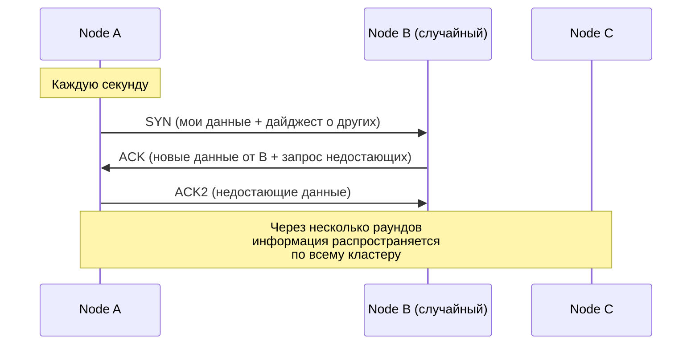

> [!mcq]
> - [ ] Failure detection основан на простом таймауте: если heartbeat не пришёл за 5 секунд, узел DOWN | Cassandra использует Phi Accrual Failure Detector — вычисляет вероятность отказа по distribution интервалов heartbeat, а не fixed timeout; адаптируется к сетевым задержкам. ❌ ПОСЛЕДСТВИЕ: команда полагается на fixed-timeout логику, не понимает почему `phi_convict_threshold` настраивается; в нестабильной сети узлы flapping UN/DN, repair не может завершиться.
> - [x] Phi Accrual Failure Detector вычисляет вероятность отказа по истории heartbeat'ов, порог `phi_convict_threshold=8` (по умолчанию) | Алгоритм адаптируется к сетевым условиям: для cloud/cross-DC поднимают threshold до 10-12, чтобы не получать false-positive при сетевых hiccup'ах. ✓ ПРИМЕНЯТЬ: `phi_convict_threshold: 12` для multi-DC (cross-region latency); `nodetool failuredetector` для просмотра текущих phi-значений; не понижать ниже 8 — false-positive растут. 📋 ПРАВИЛО: «Phi=8 default, 10-12 для cross-DC; Phi-detection ≠ fixed timeout». 🔗 См. Q3.
> - [ ] При обнаружении DOWN узла координатор немедленно перезапускает его через systemd | Cassandra не делает auto-restart других узлов; DOWN-узел маркируется в gossip, hinted handoff собирает writes для него, restart — ответственность ops/orchestrator (k8s, systemd). ❌ ПОСЛЕДСТВИЕ: команда ждёт самовосстановления, не настраивает Kubernetes liveness probe или systemd Restart=on-failure, узел остаётся DOWN до ручного вмешательства.
> - [ ] Phi-детектор использует только последний heartbeat для решения о DOWN-узле | Phi считается по sliding window последних N heartbeat-интервалов (history sample); single-heartbeat решение давало бы массу false-positive. ❌ ПОСЛЕДСТВИЕ: разработчик при тюнинге думает что один lost packet = DOWN, агрессивно понижает `phi_convict_threshold`, получает flapping nodes под нагрузкой.

**Что передаётся через Gossip:**
- Состояние узла (UP / DOWN)
- Нагрузка на узел (load)
- Схема данных (schema version)
- Token ranges
- Информация о датацентре и rack

**Failure Detection:** Cassandra использует `Phi Accrual Failure Detector`, который на основании истории heartbeat-ов вычисляет вероятность отказа узла. Порог настраивается через `phi_convict_threshold` в `cassandra.yaml`.

## Q4. Что такое `Snitch` и какие типы существуют?


> [!mcq]
> - [ ] Snitch — это компонент сетевой безопасности, фильтрующий внешний трафик к Cassandra | Snitch не имеет отношения к security; это map-функция узел → DC/rack для размещения реплик и routing'а. ❌ ПОСЛЕДСТВИЕ: команда отключает Snitch ожидая что firewall ослабит, ломает replication strategy — `NetworkTopologyStrategy` начинает класть все реплики в один DC.
> - [ ] Snitch управляет network bandwidth между узлами (throttling) | Bandwidth control делается через `inter_dc_stream_throughput_outbound_megabits_per_sec` и `stream_throughput_outbound_megabits_per_sec`, не через Snitch. ❌ ПОСЛЕДСТВИЕ: при перегрузке cross-DC репликации админ меняет Snitch, не получает эффекта; реальный throttling остаётся не настроен.
> - [x] Snitch — топология-провайдер, который сообщает Cassandra DC и rack каждого узла, чтобы `NetworkTopologyStrategy` правильно распределяла реплики | Snitch отвечает на вопросы «в каком DC узел X?» и «в каком rack узел Y?»; влияет на placement реплик и routing координатором. ✓ ПРИМЕНЯТЬ: `GossipingPropertyFileSnitch` в production (cassandra-rackdc.properties локально на каждом узле); `Ec2Snitch`/`GoogleCloudSnitch` в облаке; никогда `SimpleSnitch` в multi-DC. 📋 ПРАВИЛО: «Snitch = топологическая карта; меняй только rolling restart с repair». 🔗 См. Q4.
> - [ ] Snitch шифрует gossip-трафик между узлами | Шифрование gossip настраивается через `server_encryption_options` (TLS), это отдельная подсистема от Snitch. ❌ ПОСЛЕДСТВИЕ: при требовании security-аудита команда пытается включить шифрование меняя Snitch, аудит проваливается — реальные параметры TLS не настроены.
**Snitch** определяет, к какому датацентру и rack-у принадлежит каждый узел. Эта информация используется для оптимизации маршрутизации запросов и размещения реплик.


> [!mcq]
> - [ ] `SimpleSnitch` рекомендован в production multi-DC, потому что не требует конфигурации | SimpleSnitch только для single-DC dev; placement-агностик (DC=datacenter1, rack=rack1 для всех), `NetworkTopologyStrategy` не сможет балансировать реплики. ❌ ПОСЛЕДСТВИЕ: команда оставляет SimpleSnitch при миграции в multi-region prod, все реплики идут в один DC, при отказе региона теряется доступность.
> - [ ] `PropertyFileSnitch` лучше `GossipingPropertyFileSnitch` потому что использует один централизованный файл | PFSnitch требует sync `cassandra-topology.properties` на всех узлах — рассинхронизация ломает кластер; GPFSnitch хранит локально и распространяет через gossip — proof against drift. ❌ ПОСЛЕДСТВИЕ: при добавлении узла админ забывает обновить `cassandra-topology.properties` на старых узлах, новый узел получает неправильный rack, реплики кладутся не туда.
> - [ ] `Ec2Snitch` использует AZ как DC, а region как rack | Наоборот: для AWS `region = DC`, `availability zone = rack` — это даёт устойчивость к падению AZ при RF=3 (по одной реплике в каждой AZ). ❌ ПОСЛЕДСТВИЕ: при неправильном понимании реплики кладутся все в один регион, при падении региона теряется доступность; cross-region replication не работает как ожидается.
> - [x] `GossipingPropertyFileSnitch` — стандарт для production: каждый узел читает локальный `cassandra-rackdc.properties`, распространение через gossip | Локальная конфигурация на каждом узле + автоматическое распространение исключает drift; работает в любой инфраструктуре (bare-metal, cloud, k8s). ✓ ПРИМЕНЯТЬ: `endpoint_snitch: GossipingPropertyFileSnitch`; в `cassandra-rackdc.properties` указать `dc=<region>` и `rack=<az>`; для AWS можно `Ec2Snitch` но GPFS гибче. 📋 ПРАВИЛО: «GPFSnitch + NetworkTopologyStrategy = production multi-DC default». 🔗 См. Q4.
**Основные типы:**

| Snitch | Описание |
|--------|----------|
| `SimpleSnitch` | Один ДЦ, один rack — для разработки |
| `GossipingPropertyFileSnitch` | Читает ДЦ/rack из `cassandra-rackdc.properties`, рекомендуется для production |
| `PropertyFileSnitch` | Читает топологию из файла `cassandra-topology.properties` |
| `Ec2Snitch` | Для AWS: region = DC, availability zone = rack |
| `GoogleCloudSnitch` | Для GCP: project = DC, zone = rack |

Пример `cassandra-rackdc.properties`:

```properties
dc=dc-moscow
rack=rack1
```

## Q5. Как работает `Consistent Hashing` в `Cassandra`?

`Consistent Hashing` — механизм распределения данных по узлам кластера. Каждому узлу назначается один или несколько **token** (токенов) на кольце хэшей (диапазон: -2^63 до 2^63-1).


> [!mcq]
> - [ ] При добавлении узла Cassandra пересчитывает hash для всех ключей и переносит данные с каждого старого узла | Consistent hashing нужен ровно для того, чтобы НЕ перешафливать всё; при добавлении узла мигрирует только часть данных, попадающая в его новый token range. ❌ ПОСЛЕДСТВИЕ: команда боится добавлять узлы в час пик ожидая full reshuffle, scaling задерживается до maintenance window, кластер захлёбывается под нагрузкой.
> - [x] `Murmur3Partitioner` хеширует partition key в int64; ключ ложится на узел, владеющий следующим по часовой стрелке токеном на ring'е | Хеш-функция non-cryptographic, но равномерная; range -2^63..2^63-1; `nodetool ring` показывает распределение. ✓ ПРИМЕНЯТЬ: оставлять default `Murmur3Partitioner` (RandomPartitioner и ByteOrderedPartitioner deprecated/legacy); `SELECT token(user_id) FROM users` для отладки распределения; для bucketing использовать suffix в partition key. 📋 ПРАВИЛО: «Murmur3 = default; ByteOrdered = data skew, не использовать». 🔗 См. Q5.
> - [ ] `ByteOrderedPartitioner` рекомендуется для лучшего распределения и range-сканов | BOP даёт sorted-by-key распределение, но создаёт серьёзные hot spots (lexicographic skew) и рекомендуется только для очень специфичных случаев; default Murmur3 равномернее. ❌ ПОСЛЕДСТВИЕ: команда выбирает BOP «для range queries», получает 80% записей на одном узле когда partition key — timestamp/sequential ID, кластер деградирует.
> - [ ] Hash-функция консистентного хеширования — SHA-256 для криптостойкости | Cassandra использует Murmur3 — non-cryptographic hash, оптимизированный по скорости; криптостойкость не нужна для распределения, скорость критична. ❌ ПОСЛЕДСТВИЕ: разработчик при отладке распределения пытается воспроизвести SHA-256 hash в Java/Python, не понимает почему результаты не сходятся с фактическим узлом-владельцем.
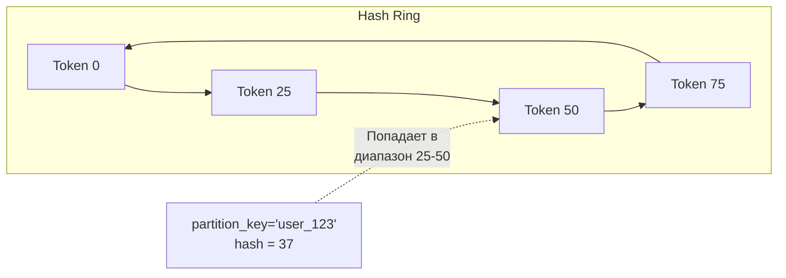

**Алгоритм:**
1. Значение `partition_key` хэшируется функцией `Murmur3` (по умолчанию)
2. Полученный хэш определяет позицию на кольце
3. Данные записываются на узел, ответственный за следующий по часовой стрелке токен
4. Реплики размещаются на следующих узлах по кольцу (по стратегии репликации)

**Преимущество:** при добавлении/удалении узла перераспределяется только часть данных, а не все.

## Q6. Что такое `Virtual Nodes` (vnodes)?

**Vnodes** — механизм, при котором каждый физический узел отвечает за множество небольших диапазонов токенов вместо одного большого. По умолчанию `num_tokens = 256` (настраивается в `cassandra.yaml`).


> [!mcq]
> - [ ] `num_tokens=256` — оптимальное значение для всех сценариев включая Cassandra 4.x | Cassandra 4.0+ рекомендует `num_tokens=16` (с `allocate_tokens_for_local_replication_factor`) — меньше vnodes ускоряет range queries, repair и streaming; 256 — legacy default 3.x. ❌ ПОСЛЕДСТВИЕ: команда апгрейдит на 4.x но оставляет 256, repair'ы занимают часы вместо минут, streaming при bootstrap новых узлов в разы дольше.
> - [ ] Vnodes требуют ручного `nodetool move` для балансировки при добавлении узла | Vnodes автоматически балансируют ring при join'е; ручная балансировка нужна для single-token (legacy) кластеров. ❌ ПОСЛЕДСТВИЕ: админ запускает `nodetool move` на vnode-кластере, получает ошибку или ломает balanced state, восстановление через `removenode` + повторный join.
> - [x] Vnodes дают автоматическую балансировку при scale-out и поддерживают heterogeneous hardware через разное `num_tokens` per node | Узел с 2x CPU/disk может получить `num_tokens=32` против `num_tokens=16` у обычных — берёт пропорционально больше данных. ✓ ПРИМЕНЯТЬ: новый кластер 4.x → `num_tokens=16` + `allocate_tokens_for_local_replication_factor=3`; смешанный hardware → разные `num_tokens`; миграция со 256 на 16 — replace-node стратегия. 📋 ПРАВИЛО: «4.x = num_tokens 16; legacy = 256; heterogeneous = разные значения». 🔗 См. Q6.
> - [ ] При увеличении `num_tokens` репликация становится строго консистентной | `num_tokens` влияет только на распределение данных, не на consistency level; consistency настраивается per-query через CL (ONE, QUORUM, ALL). ❌ ПОСЛЕДСТВИЕ: разработчик пытается «улучшить consistency» крутя num_tokens, тратит время и downtime, реальная консистентность не меняется.
**Преимущества vnodes:**
- Более равномерное распределение данных
- Быстрое перераспределение при добавлении/удалении узлов
- Ребалансировка происходит автоматически
- Узлы с разной мощностью могут получить разное число токенов

**Без vnodes:** при добавлении узла нужно вручную рассчитывать токены и выполнять `nodetool move`.

## Q7. (!) Какую модель данных использует `Cassandra`?

`Cassandra` использует модель **wide-column store** (хранилище широких столбцов). Данные организованы в виде таблиц с строками и столбцами, но в отличие от реляционных БД:

- Каждая строка может иметь **разный набор столбцов**
- Строки группируются в **партиции** по `partition key`
- Внутри партиции строки упорядочены по `clustering key`
- Нет JOIN, нет referential integrity
- Схема гибкая — столбцы можно добавлять без миграции существующих данных

**Иерархия структур данных:**

```
Cluster
  └── Keyspace (аналог schema/database)
       └── Table (аналог таблицы)
            └── Partition (группа строк с одним partition key)
                 └── Row (одна строка, определяется clustering key)
                      └── Column (пара name:value с timestamp)
```

**Пример создания keyspace и таблицы:**


> [!mcq]
> - [ ] Все строки одной таблицы должны иметь одинаковый набор столбцов как в RDBMS | Wide-column model: разные строки одной таблицы могут иметь разные столбцы (sparse representation), отсутствующие столбцы не занимают место. ❌ ПОСЛЕДСТВИЕ: разработчик из SQL-мира всегда заполняет все столбцы NULL, тратит storage и read overhead на bloom filters/indexes для пустых значений.
> - [ ] Keyspace эквивалентен таблице, а Table — это партиция внутри keyspace | Иерархия: Cluster → Keyspace (≈ database/schema) → Table → Partition (group of rows by partition key) → Row → Column. ❌ ПОСЛЕДСТВИЕ: путаница в терминологии приводит к неверным CREATE-командам, разработчик пытается сделать `CREATE TABLE keyspace.partition`, получает синтаксические ошибки.
> - [ ] Cassandra поддерживает referential integrity через FOREIGN KEY между таблицами | FK constraints не существуют в Cassandra; целостность ссылок — ответственность приложения; cascade-delete делается batch'ем в коде. ❌ ПОСЛЕДСТВИЕ: при удалении user не удаляются orphaned orders в `orders_by_user`, со временем накапливаются битые ссылки, приложение возвращает stale references на removed entities.
> - [x] Wide-column store: иерархия Cluster→Keyspace→Table→Partition→Row→Column; строки одной таблицы могут иметь разный набор столбцов (sparse) | Каждая колонка хранит value+timestamp+TTL независимо; null-колонки не занимают place; динамические колонки возможны через map/set/list. ✓ ПРИМЕНЯТЬ: `cqlsh DESCRIBE TABLE` для просмотра схемы; sparse-friendly дизайн (опциональные столбцы реально опциональны); collection types (`map<text,text>`) для расширяемых атрибутов. 📋 ПРАВИЛО: «Wide-column = sparse rows + per-column timestamp; не RDBMS». 🔗 См. Q7.
```cql
CREATE KEYSPACE IF NOT EXISTS ecommerce
  WITH replication = {
    'class': 'NetworkTopologyStrategy',
    'dc-moscow': 3,
    'dc-spb': 2
  };

CREATE TABLE ecommerce.orders (
    user_id    UUID,
    order_date TIMESTAMP,
    order_id   UUID,
    total      DECIMAL,
    status     TEXT,
    PRIMARY KEY ((user_id), order_date, order_id)
) WITH CLUSTERING ORDER BY (order_date DESC, order_id ASC);
```

> [!mcq]
> - [x] Cassandra проектируется query-first: одна таблица под один запрос, денормализация и дублирование данных нормальны — JOIN'ов нет | Модель данных строится от запросов, а не от сущностей; одни и те же данные могут храниться в нескольких таблицах для разных view. ✓ ПРИМЕНЯТЬ: `orders_by_user` + `orders_by_status` + `orders_by_date` — три таблицы для одних orders; обновления через batch (logged batch для multi-table consistency); Materialized Views (eventual consistency, не строгая) для автоматической денормализации. 📋 ПРАВИЛО: «Cassandra schema = одна таблица per query pattern; денормализация over JOIN». 🔗 См. Q8 (primary key), Q9 (data modeling), Q14 (materialized views).
> - [ ] Cassandra использует normalized 3NF schema как RDBMS — JOIN выполняется через CQL JOIN clause | CQL не поддерживает JOIN; normalized schema приводит к множественным запросам и проблемам с производительностью; правильный подход — денормализация. ❌ ПОСЛЕДСТВИЕ: разработчик из мира SQL пишет normalized schema, делает множественные SELECT'ы вместо одного на денормализованной таблице — latency и нагрузка взлетают, application работает в 10x медленнее.
> - [ ] Materialized Views в Cassandra обеспечивают строгую (strong) консистентность с base table | MV в Cassandra eventual consistency: write в base table propagates to MV асинхронно через async replication; lag до секунд. ❌ ПОСЛЕДСТВИЕ: команда полагается на MV для real-time consistent reads, видит stale data; bug reports «orders not appearing» при чтении сразу после write.
> - [ ] Foreign keys и cascade delete поддерживаются между keyspace'ами через `ON DELETE CASCADE` | FK constraints не существуют в Cassandra; referential integrity = ответственность приложения; cascade delete делается приложением через batch. ❌ ПОСЛЕДСТВИЕ: разработчик ожидает RDBMS-style FK behavior, оставляет orphaned данные в связанных таблицах после delete; data inconsistency, требуется audit cleanup job.

## Q8. (!) Что такое `Primary Key`, `Partition Key` и `Clustering Key`?

`Primary Key` в `Cassandra` состоит из двух частей и определяет как уникальность строки, так и физическое размещение данных.


> [!mcq]
> - [ ] Primary Key и Partition Key — синонимы, обе определяют уникальность строки | Partition Key — часть Primary Key, определяет узел; PK = Partition Key + Clustering Key, обе части вместе дают уникальность. ❌ ПОСЛЕДСТВИЕ: разработчик пишет `PRIMARY KEY (user_id, order_date)` ожидая что обе колонки распределяют данные, но узел определяется только по `user_id`, hot-spot на популярных пользователях.
> - [x] PK = Partition Key (выбор узла, обязательная часть) + Clustering Key (порядок строк внутри партиции, опциональная) | Скобки в `PRIMARY KEY ((a, b), c, d)` группируют composite Partition Key (a,b); c,d — clustering колонки с ORDER BY. ✓ ПРИМЕНЯТЬ: для time-series `PRIMARY KEY ((sensor_id), reading_time)` + `WITH CLUSTERING ORDER BY (reading_time DESC)`; для bucketing `((user_id, day_bucket), event_time)`. 📋 ПРАВИЛО: «Двойные скобки = composite Partition Key; без них — только первая колонка». 🔗 См. Q8.
> - [ ] Любой Primary Key автоматически создаёт secondary index для быстрых WHERE-запросов | Secondary index — отдельная сущность (`CREATE INDEX`), создаётся вручную и имеет известные ограничения; PK сам по себе обеспечивает быстрый поиск только по partition key (+ clustering). ❌ ПОСЛЕДСТВИЕ: разработчик ожидает SQL-like behaviour для WHERE по non-PK колонке, получает `ALLOW FILTERING required` ошибку, в production включает её и вешает кластер.
> - [ ] Partition Key всегда состоит ровно из одной колонки, нескольких колонок не бывает | Composite Partition Key с несколькими колонками валиден и часто нужен для bucketing/распределения; синтаксис `PRIMARY KEY ((col1, col2), ...)`. ❌ ПОСЛЕДСТВИЕ: команда не использует composite PK при необходимости bucketing'а, получает hot partitions при низкокардинальном single-column PK.
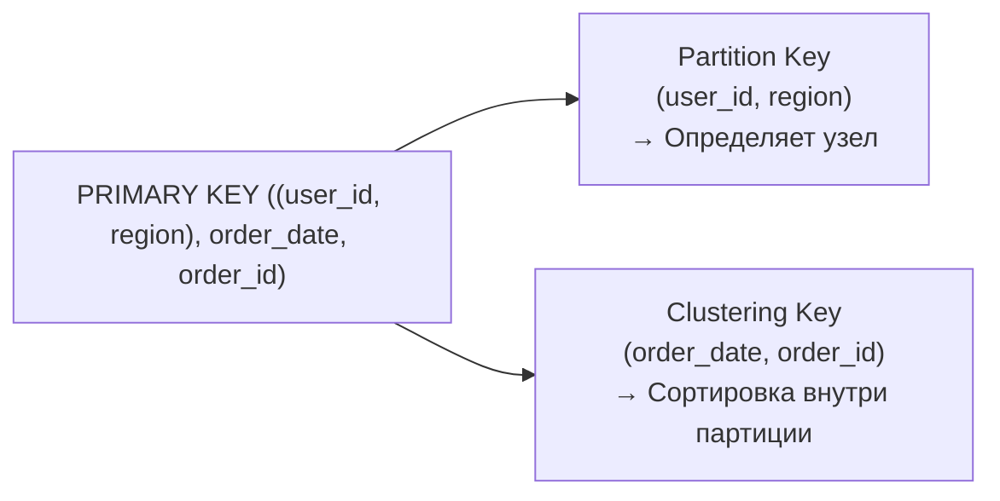


> [!mcq]
> - [ ] Размер партиции до 10 GB и до 10 млн строк — норма для production | DataStax рекомендует <100 MB и <100k rows на партицию; крупнее — медленные чтения, GC pauses, проблемы compaction. ❌ ПОСЛЕДСТВИЕ: команда хранит весь history активности юзера в одной партиции `(user_id)`, через год получает 5 GB партиции, p99 чтений уходит в секунды, координатор OOM при scan'е.
> - [ ] Низкокардинальный partition key (status, country) даёт лучшее распределение чем UUID | Низкая cardinality = мало уникальных значений = меньше партиций = hot spots; нужна высокая cardinality для равномерности. ❌ ПОСЛЕДСТВИЕ: `PRIMARY KEY ((country_code), event_time)` с 10 странами кладёт 80% записей в партицию `RU`, узлы с этой партицией перегружены, остальные простаивают.
> - [x] Правила: высокая cardinality partition key (UUID, user_id), партиция <100 MB и <100k rows, bucketing для естественно растущих данных | Composite PK для bucket'а (`((user_id, day_bucket), event_time)`); `nodetool tablehistograms` для мониторинга partition size; `cassandra.diag` для warnings. ✓ ПРИМЕНЯТЬ: time-series → bucket по дню/часу; per-user history → bucket по месяцу; counter-таблицы → bucket по неделе. 📋 ПРАВИЛО: «100 MB / 100k rows / high cardinality + bucket для роста». 🔗 См. Q8, Q11.
> - [ ] Чем больше колонок в Partition Key, тем выше уникальность и тем равномернее распределение | Cardinality зависит от сочетания значений, а не от количества колонок; добавление redundant колонки не повышает cardinality. ❌ ПОСЛЕДСТВИЕ: разработчик добавляет `(user_id, user_email)` думая улучшить распределение, реально partition key уникальность та же что у user_id, дизайн усложняется без выгоды.
| Понятие | Назначение | Пример |
|---------|-----------|--------|
| `Partition Key` | Определяет, на каком узле хранятся данные (хэшируется через `Murmur3`) | `(user_id)` или `(user_id, region)` |
| `Clustering Key` | Определяет порядок строк внутри партиции | `order_date DESC` |
| `Primary Key` | `Partition Key` + `Clustering Key` — уникально идентифицирует строку | `((user_id), order_date, order_id)` |

**Варианты Primary Key:**

```cql
-- 1. Простой PK (одна колонка = partition key, нет clustering)
PRIMARY KEY (user_id)

-- 2. Составной PK (partition key + clustering key)
PRIMARY KEY (user_id, created_at)

-- 3. Composite Partition Key (несколько колонок в partition key)
PRIMARY KEY ((user_id, region), created_at, event_id)
```

**Правила выбора Partition Key:**
- Высокая кардинальность (много уникальных значений)
- Равномерное распределение запросов
- Размер партиции < 100 MB (рекомендация) и < 100 000 строк

## Q9. (!) Как правильно моделировать данные в `Cassandra`?


> [!mcq]
> - [ ] Сначала проектируется ER-диаграмма с сущностями и связями, затем под неё пишутся CQL-запросы | Entity-first подход — RDBMS-стиль; в Cassandra ведёт к normalized schema с множественными запросами и `ALLOW FILTERING`. ❌ ПОСЛЕДСТВИЕ: команда применяет 3NF, получает 5+ запросов на одну операцию ленты заказов, latency 200ms+ вместо ожидаемых 5ms.
> - [ ] Сначала минимизируется дублирование (нормализация), затем добавляются secondary indexes для всех WHERE-полей | Cassandra не оптимизирована для secondary index по высоко-cardinality колонкам; индексы дают неравномерную производительность и проблемы при scan'е. ❌ ПОСЛЕДСТВИЕ: команда ставит SECONDARY INDEX на user_email, при поиске координатор делает scatter-gather на все узлы, p99 в десятки раз хуже партиционного запроса.
> - [ ] Cassandra сама строит query plan, поэтому моделирование такое же как в Postgres | Нет query optimizer как в RDBMS; CQL не делает JOIN/GROUP BY, schema должна точно соответствовать паттернам запросов; план = тот, который явно описан в PK. ❌ ПОСЛЕДСТВИЕ: разработчики пишут запросы «как в Postgres», получают `Cannot execute this query as it might involve data filtering`, в панике включают `ALLOW FILTERING` в production.
> - [x] Query-first design: сначала список запросов приложения, затем под каждый — отдельная таблица с PK = WHERE-условие; денормализация и дублирование = норма | Одни данные могут лежать в 3-5 таблицах для разных view; обновление через atomic batch (logged batch) или MV. ✓ ПРИМЕНЯТЬ: список Q1..QN перед DDL; одна таблица per query; batch для multi-table update; CQL-комментарий с описанием query над таблицей. 📋 ПРАВИЛО: «Queries first → tables; денормализация over JOIN». 🔗 См. Q9.
В отличие от реляционных БД, моделирование в `Cassandra` идёт **от запросов, а не от сущностей** (query-driven design). Сначала определяются запросы приложения, затем под них проектируются таблицы. Подробнее о проектировании распределённых систем — в [вопросах по распределённым системам](../architecture/distributed-systems-interview.md).

**Принципы моделирования:**

1. **Одна таблица — один запрос** (денормализация)
2. **Partition Key** соответствует WHERE-условию запроса
3. **Clustering Key** определяет сортировку результата
4. Дублирование данных — норма, а не проблема
5. Избегать больших партиций (> 100 MB)

**Пример: пользователь и его заказы**


> [!mcq]
> - [ ] Дублирование данных в нескольких таблицах — антипаттерн, нужно использовать Materialized Views для всех view | MV в Cassandra eventual consistency и имеют операционные ограничения (не поддерживают TTL, slow rebuild при schema change); explicit denormalization через batch предсказуемее. ❌ ПОСЛЕДСТВИЕ: команда строит 5 MV поверх одной таблицы, при rebuild MV кластер деградирует, eventual consistency вызывает баги «order not visible».
> - [x] Под каждый паттерн запроса — своя таблица: `orders_by_user(PK=user_id, CK=order_date DESC)` для ленты пользователя; запись через batch в N таблиц | Одни и те же orders дублируются в `orders_by_user`, `orders_by_status`, `orders_by_date`; logged batch гарантирует atomicity multi-table writes. ✓ ПРИМЕНЯТЬ: `BEGIN BATCH ... APPLY BATCH` для критичных multi-table updates; idempotent insert (UPSERT semantics); `WITH CLUSTERING ORDER BY (order_date DESC)` для свежих первыми. 📋 ПРАВИЛО: «Per-query table + logged batch для atomic multi-write». 🔗 См. Q9.
> - [ ] Достаточно одной таблицы `orders(PK=order_id)`, остальные view получаются через JOIN с user-таблицей | CQL не поддерживает JOIN; одна таблица обслуживает только один паттерн доступа (по order_id), для других нужны отдельные таблицы. ❌ ПОСЛЕДСТВИЕ: разработчик пишет цикл «get all order_ids of user → fetch each», N+1 проблема в распределённой системе, latency O(N) hops, при N=100 запрос >500ms.
> - [ ] Bucketing по дню/часу не нужен если использовать UUID в partition key | Bucket нужен когда данные partition'а растут со временем (history, time-series) — даже high-cardinality user_id даст unbounded partition при достаточно длинной истории. ❌ ПОСЛЕДСТВИЕ: `orders_by_user (PK=user_id)` без bucket'а через 5 лет у активных юзеров 50k+ orders в одной партиции — read latency и compaction деградируют.
```cql
-- Запрос: "Показать последние 20 заказов пользователя"
CREATE TABLE orders_by_user (
    user_id    UUID,
    order_date TIMESTAMP,
    order_id   UUID,
    total      DECIMAL,
    items      LIST<FROZEN<order_item>>,
    PRIMARY KEY ((user_id), order_date)
) WITH CLUSTERING ORDER BY (order_date DESC);
```

> [!mcq]
> - [ ] `orders_by_status (PK=status, CK=order_date)` идеален потому что низкая cardinality status экономит партиции | Низкая cardinality status (5-10 значений) = очень мало партиций; статусы типа `PROCESSING`/`SHIPPED` собирают миллионы строк в одной партиции, hot partition + > 100MB. ❌ ПОСЛЕДСТВИЕ: партиция `status=PROCESSING` достигает 5 GB за месяц, чтения деградируют до секунд, compaction stuck, узлы owner'ы партиции overloaded.
> - [ ] Правильный дизайн: `orders_by_status (PK=order_id, CK=status, order_date)` | Partition key должен соответствовать WHERE-условию запроса «orders by status»; здесь WHERE по order_id == точечный поиск, не listing-by-status. ❌ ПОСЛЕДСТВИЕ: запрос «дай все PENDING orders за день» становится full-table scan с `ALLOW FILTERING`, координатор скатывает результаты со всех узлов, 30+ секунд latency.
> - [x] `orders_by_status ((status, day_bucket), order_date, order_id)` — composite PK с bucket по дню решает hot-partition при низкой cardinality status | Bucket ограничивает рост партиции; запрос по WHERE status=? AND day_bucket=? попадает в одну партицию, range по order_date работает на clustering. ✓ ПРИМЕНЯТЬ: `((status, '2025-05-03'), order_date DESC)`; на стороне приложения ходить по нескольким day_bucket для range > 1 дня; SASI/SAI индексы только если кардинальность > 100. 📋 ПРАВИЛО: «Low-cardinality column в PK = всегда добавь bucket». 🔗 См. Q9, Q10.
> - [ ] Нужно создать SECONDARY INDEX на колонке status в одной таблице orders | Secondary index по low-cardinality колонке делает scatter-gather по всем узлам, latency и нагрузка растут линейно с размером кластера. ❌ ПОСЛЕДСТВИЕ: на 20-узловом кластере SI по status даёт p99 запросов 500ms+, координатор в OOM при больших offset'ах, рекомендуется только cardinality между 100-10000.

```cql
-- Запрос: "Показать заказы по статусу за период"
CREATE TABLE orders_by_status (
    status     TEXT,
    order_date TIMESTAMP,
    order_id   UUID,
    user_id    UUID,
    total      DECIMAL,
    PRIMARY KEY ((status), order_date, order_id)
) WITH CLUSTERING ORDER BY (order_date DESC);
```


> [!mcq]
> - [ ] `ALLOW FILTERING` — рекомендованный способ выполнения ad-hoc WHERE-запросов в production | ALLOW FILTERING заставляет координатор сканировать партиции на всех узлах кластера, latency и cluster load растут линейно с размером данных; правильно — добавить таблицу под нужный паттерн. ❌ ПОСЛЕДСТВИЕ: dashboard-эндпоинт с `WHERE status=? ALLOW FILTERING` на 50-узловом кластере с 1 TB данных делает full scan, p99 = 30+ секунд, при росте RPS координаторы OOM.
> - [ ] Хранение всех версий одной сущности в одной партиции через append-only — антипаттерн, надо удалять старые | Append-only с TTL — нормальный паттерн для time-series; проблема не в множестве версий, а в неограниченном росте партиции без bucket'а. ❌ ПОСЛЕДСТВИЕ: команда удаляет старые версии через DELETE, создаёт миллионы tombstones, чтения попадают в `Scanned over 100000 tombstones` warning, latency взлетает.
> - [ ] Bucket по timestamp в partition key замедляет запросы и не нужен | Bucket — ключевой механизм против unbounded partition growth; без него time-series таблицы деградируют за месяцы; cost — приложение читает несколько партиций для range query > bucket'а. ❌ ПОСЛЕДСТВИЕ: `orders ((user_id), order_date)` без bucket'а у активных юзеров через год упирается в >100MB partition, каждое чтение списка orders медленное.
> - [x] Анти-паттерны: `ALLOW FILTERING`, low-cardinality partition key, partition >100 MB, нормализация как в RDBMS, secondary index по low-cardinality | Каждый из них даёт деградацию latency пропорциональную размеру кластера/данных; вместо них — query-first design + bucket + denormalization + batch. ✓ ПРИМЕНЯТЬ: при появлении ALLOW FILTERING — создать новую таблицу под query; `nodetool tablehistograms` для детекта больших партиций; ban list в code review на slow patterns. 📋 ПРАВИЛО: «ALLOW FILTERING + low-card PK + big partition = тройка смерти». 🔗 См. Q9, Q10, Q11.
**Анти-паттерны:**
- Использование `ALLOW FILTERING` — полное сканирование кластера
- Слишком маленький `partition key` (все данные на одном узле)
- Слишком большие партиции (hot spots, OOM)
- Моделирование "как в PostgreSQL" с нормализацией

## Q10. Какие факторы влияют на равномерное распределение данных?

Для равномерного распределения данных по узлам кластера необходимо учитывать:

1. **Кардинальность Partition Key** — значения должны быть высококардинальными (UUID, user_id), а не низкокардинальными (статус, страна)
2. **Размер партиции** — рекомендуется < 100 MB и < 100 000 строк
3. **Partitioner** — `Murmur3Partitioner` (по умолчанию) даёт равномерное распределение
4. **Vnodes** — включённые vnodes улучшают балансировку
5. **Паттерн запросов** — если 90% запросов идут к 10% ключей, возникают hot spots

**Пример hot spot:** если `partition_key = country_code`, то партиция `RU` будет в разы больше партиции `KZ`. Решение — добавить `bucket` (например, день или hash):

```cql
-- Плохо: hot spot на популярных странах
PRIMARY KEY (country_code, event_time)


> [!mcq]
> - [ ] Hot spot лечится сменой `Murmur3Partitioner` на `RandomPartitioner` — последний даёт более равномерную хэш-функцию | Murmur3 уже даёт равномерное распределение хэшей; проблема hot spot — в **низкой кардинальности** ключа (`country_code`), а не в partitioner. ❌ ПОСЛЕДСТВИЕ: команда меняет partitioner на проде через rolling upgrade, токены пересчитываются, repair бьётся часами, а партиция `RU` всё равно остаётся в 50× больше `KZ`.
> - [ ] Чтобы избежать hot spots, нужно увеличить `num_tokens` (vnodes) с 16 до 256 — больше vnodes лучше балансируют нагрузку | Vnodes балансируют **token range по узлам**, но не размер партиции внутри одного ключа; одна горячая партиция остаётся на одном узле независимо от количества vnodes. ❌ ПОСЛЕДСТВИЕ: ops увеличивает num_tokens, ждёт улучшения, но узел с партицией `RU` всё равно держит 80% read-трафика; bootstrap новых нод стал в 16× медленнее (256 vnodes vs 16).
> - [x] Hot spot возникает из-за низкокардинального `partition_key` (`country_code`); лечение — добавить bucket в составной partition key (`(country_code, event_day)`), чтобы дробить большую партицию на много мелких | Composite partition key распределяет данные по разным token range; UUID/user_id сразу высококардинален, а country/status требуют bucketing по времени или хэшу. ✓ ПРИМЕНЯТЬ: events по странам — `((country_code, day), event_ts)`; сообщения Discord по каналу — `((channel_id, bucket), msg_id)`; IoT-метрики — `((device_id, hour), ts)`. 📋 ПРАВИЛО: «Низкая кардинальность → добавь bucket в partition key». 🔗 См. Q8, Q11.
> - [ ] Достаточно настроить `LoadBalancingPolicy` на стороне драйвера — клиент сам распределит запросы равномерно | Драйвер выбирает координатора, но **сам ключ маппится на одну реплику** через consistent hashing; никакая клиентская политика не сделает партицию `RU` меньше. ❌ ПОСЛЕДСТВИЕ: разработчик включает `RoundRobinPolicy` вместо `TokenAwarePolicy`, добавляет лишний hop через случайного координатора, latency растёт на 30%, hot spot никуда не делся.
-- Хорошо: bucket по дню для распределения
PRIMARY KEY ((country_code, event_day), event_time)
```

## Q11. Что такое `Wide Rows` и какие ограничения на размер партиции?

**Wide Row** (широкая строка) — партиция с большим количеством строк (по clustering key). В `Cassandra` все строки одной партиции хранятся вместе на диске.

**Ограничения:**
- Теоретический лимит: **2 млрд** столбцов на партицию
- Практический лимит: **100 MB** на партицию (рекомендация DataStax)
- Большие партиции вызывают: медленные чтения, GC pressure, проблемы при компакции

**Борьба с большими партициями — bucketing:**

```cql
-- Вместо одной партиции на user_id навсегда:
PRIMARY KEY ((user_id), event_time)

-- Разбиваем по месяцу:
PRIMARY KEY ((user_id, month), event_time)
```

> [!mcq]
> - [ ] Партиция в `Cassandra` теоретически может содержать до 2 млрд столбцов и практически — до нескольких ГБ без проблем с производительностью | Теоретический лимит 2 млрд верен, но практический лимит DataStax — около 100 МБ; ГБ-партиции деградируют в чтении. ❌ ПОСЛЕДСТВИЕ: партиция `user_events` растёт до 5 ГБ — read latency p99 спайки до 30 сек, GC pauses, при компакции node OOM.
> - [ ] Wide Row — это одна строка с большим количеством колонок-атрибутов (имя, email, адрес и т.д.), и ограничения на её размер нет | Wide Row — это партиция с большим количеством `clustering`-строк, а не одна строка с множеством атрибутов. ❌ ПОСЛЕДСТВИЕ: разработчик путает терминологию, не использует `bucketing`, упирается в реальный лимит партиции через полгода продакшна.
> - [x] Wide Row — это партиция с большим количеством строк по `clustering key`; практический лимит DataStax ≈ 100 МБ или 100 тыс. строк, а лечится `bucketing`-ом партиционного ключа | Все строки одной партиции хранятся вместе, поэтому большие партиции бьют по чтению, GC и компакции; `bucketing` (`(user_id, month)`) дробит её. ✓ ПРИМЕНЯТЬ: time-series события пользователя — ключ `((user_id, yyyymm), event_ts)`; IoT-метрики — `((sensor_id, day), ts)`; Discord использует bucketing по дню для сообщений каналов. 📋 ПРАВИЛО: «Партиция ≤ 100 МБ — добавляй bucket». 🔗 См. Q8 (Primary Key), Q10 (распределение).
> - [ ] Чтобы избежать wide-партиций, нужно создавать `Secondary Index` на `clustering`-колонках для дробления данных | `Secondary Index` не разбивает партицию на части, а наоборот — добавляет дополнительные структуры, и сам страдает от wide-партиций. ❌ ПОСЛЕДСТВИЕ: команда вешает SI на `event_ts`, размер партиции не меняется, а на координаторе появляется ещё и `index_query` overhead — read latency растёт ещё на 50%.

## Q12. (!) Основные команды `CQL`


> [!mcq]
> - [ ] `CQL` — это полная реализация ANSI SQL поверх Cassandra: поддерживаются JOIN, подзапросы, оконные функции и foreign keys | `CQL` — **SQL-подобный**, но без JOIN, подзапросов, оконных функций и FK; модель денормализованная. ❌ ПОСЛЕДСТВИЕ: разработчик пишет `SELECT o.*, u.name FROM orders o JOIN users u ...` — `SyntaxException: no viable alternative`, неделя на переписывание под query-driven design.
> - [ ] `CREATE KEYSPACE` без указания `replication` создаёт keyspace с RF=1 по умолчанию — оптимально для prod | `CREATE KEYSPACE` **обязательно** требует `replication`-секцию; без неё CQL падает с `ConfigurationException`. И RF=1 в prod = одна нода вниз → данные потеряны. ❌ ПОСЛЕДСТВИЕ: команда копирует пример из туториала с RF=1, в проде потеря одной ноды = data loss, recovery невозможен без backup.
> - [ ] `CREATE INDEX ON shop.products (name)` создаёт глобальный B-tree индекс как в RDBMS, ускоряя любые `WHERE name=?` запросы | `Secondary Index` в Cassandra — **локальный** на каждой реплике, без `partition key` запрос делает scatter-gather по всем нодам кластера. ❌ ПОСЛЕДСТВИЕ: команда полагается на SI как на B-tree, p99 на `WHERE name=?` растёт линейно с числом нод (10 нод = 10 RPC), при росте кластера latency только ухудшается.
> - [x] `CQL` — SQL-подобный язык без JOIN/подзапросов; `CREATE KEYSPACE` требует явный `replication` (`NetworkTopologyStrategy` + RF на каждый DC), `CREATE TABLE` обязан определить `PRIMARY KEY` с partition key, `ALTER TABLE` поддерживает `ADD/DROP/RENAME` колонок | DDL ориентирована на denormalized data model: keyspace задаёт репликацию, таблица — partition+clustering ключи; нет реляционных JOIN — query-driven schema. ✓ ПРИМЕНЯТЬ: production-keyspace `WITH replication = {'class':'NetworkTopologyStrategy','dc1':3}`; e-commerce `CREATE TABLE products (...) PRIMARY KEY ((category), product_id)`; эволюция через `ALTER TABLE ADD column`. 📋 ПРАВИЛО: «CQL = SQL минус JOIN/subquery; keyspace всегда с RF, таблица всегда с PK». 🔗 См. Q9, Q20.
`CQL` (`Cassandra Query Language`) — SQL-подобный язык запросов. Основные отличия от SQL: нет JOIN, нет подзапросов, WHERE ограничен по ключам.

**DDL:**

```cql
-- Keyspace
CREATE KEYSPACE shop WITH replication = {
  'class': 'NetworkTopologyStrategy', 'dc1': 3
};

-- Таблица
CREATE TABLE shop.products (
    category TEXT,
    product_id UUID,
    name TEXT,
    price DECIMAL,
    tags SET<TEXT>,
    PRIMARY KEY ((category), product_id)
);

-- Индекс
CREATE INDEX ON shop.products (name);

-- Изменение таблицы
ALTER TABLE shop.products ADD description TEXT;

-- Удаление
DROP TABLE IF EXISTS shop.products;
```

**DML:**


> [!mcq]
> - [ ] `INSERT` в Cassandra падает с `DuplicateKeyException`, если строка с таким `PRIMARY KEY` уже существует — точно как в RDBMS | В Cassandra **`INSERT` и `UPDATE` эквивалентны** — это upsert: новая запись с большим timestamp перезаписывает старую без ошибок. ❌ ПОСЛЕДСТВИЕ: код полагается на дедупликацию через "INSERT only if missing"; данные молча перезаписываются, аудит ломается, для уникальности нужен `INSERT ... IF NOT EXISTS` (LWT).
> - [ ] `DELETE FROM ... WHERE pk=?` мгновенно удаляет данные с диска и освобождает место | `DELETE` создаёт **tombstone** — маркер удаления; реальное удаление произойдёт только после компакции через `gc_grace_seconds` (10 дней default). ❌ ПОСЛЕДСТВИЕ: команда чистит таблицу через массовый `DELETE`, ожидает падения disk usage, но он наоборот растёт на размер tombstones; при 100k+ tombstones чтение упирается в `TombstoneOverwhelmingException`.
> - [x] `INSERT` и `UPDATE` — это **один и тот же upsert** (запись с timestamp); `DELETE` создаёт tombstone (не удаляет сразу); `WHERE` обязан содержать `partition key`, иначе нужен `ALLOW FILTERING` (анти-паттерн) | Cassandra пишет всё через timestamped writes; чтение мерджит версии по timestamp; модель «append-only с надгробиями». ✓ ПРИМЕНЯТЬ: `INSERT USING TTL 3600` для сессий (упрощает cleanup); `UPDATE SET tags = tags + {'sale'}` для мутации collection; `DELETE` с тщательным расчётом tombstone overhead. 📋 ПРАВИЛО: «INSERT = UPDATE = upsert; DELETE = tombstone; WHERE без PK = боль». 🔗 См. Q18, Q28.
> - [ ] `USING TTL 86400` устанавливает TTL на partition key — вся партиция исчезнет через 24 часа | TTL применяется **только к обычным колонкам**, не к partition/clustering keys; партиция остаётся, исчезают значения колонок. ❌ ПОСЛЕДСТВИЕ: разработчик надеется, что TTL почистит «всю строку», но в таблице остаются «призраки» — partition key с null-колонками; `SELECT count(*)` возвращает старое число, индексы не очищаются.
```cql
-- Вставка (INSERT = UPSERT в Cassandra)
INSERT INTO shop.products (category, product_id, name, price, tags)
VALUES ('electronics', uuid(), 'Laptop', 999.99, {'new', 'sale'})
USING TTL 86400;

-- Чтение
SELECT * FROM shop.products
WHERE category = 'electronics'
AND product_id = some_uuid;

-- Обновление
UPDATE shop.products
SET price = 899.99, tags = tags + {'discount'}
WHERE category = 'electronics' AND product_id = some_uuid;

-- Удаление
DELETE FROM shop.products
WHERE category = 'electronics' AND product_id = some_uuid;


> [!mcq]
> - [ ] `BEGIN BATCH ... APPLY BATCH` в Cassandra работает как RDBMS-транзакция: ACID, изоляция, rollback при ошибке | Cassandra-batch даёт только **атомарность для LOGGED** (не изоляцию и не rollback); читатель может увидеть промежуточное состояние; UNLOGGED не даёт даже атомарности. ❌ ПОСЛЕДСТВИЕ: разработчик переносит логику банковского перевода в `BATCH`, считая её транзакционной; concurrent reader видит «полу-применённый» перевод (списано, не зачислено) — отчёт фрод-системы выдаёт ложный алерт.
> - [x] `BEGIN BATCH` группирует CQL-операции в один RPC; `LOGGED` (default) даёт атомарность через batch-log на 2 нодах (медленно, для разных партиций); `UNLOGGED BATCH` — только для одной партиции (быстро, без atomicity overhead) | Batch-log пишется до применения операций для гарантии atomicity, что дорого; UNLOGGED пропускает batch-log, превращаясь в один RPC к одной партиции. ✓ ПРИМЕНЯТЬ: `UNLOGGED BATCH` для денормализации в одну партицию (запись в `users_by_id` + индекс-таблицу с тем же partition key); `LOGGED` только когда явно нужна atomicity нескольких партиций. 📋 ПРАВИЛО: «BATCH ≠ транзакция; LOGGED = atomicity overhead, UNLOGGED = одна партиция». 🔗 См. Q29.
> - [ ] `BATCH` — оптимальный путь для bulk import: тысячи строк в одном `LOGGED BATCH` грузятся быстрее, чем по одной | `LOGGED BATCH` пишет batch-log на 2 ноды до применения операций, координатор становится bottleneck; для bulk правильный путь — `executeAsync` параллельные одиночные записи. ❌ ПОСЛЕДСТВИЕ: ETL-импорт 1М строк через `LOGGED BATCH` на 100k идёт 6 часов вместо 5 минут (через async singles); координатор OOM-ится, в логах `Batch of size 12MB exceeds threshold`.
> - [ ] `UNLOGGED BATCH` гарантирует, что все операции применятся атомарно даже если они касаются разных партиций | `UNLOGGED` явно отказывается от atomicity — если координатор упадёт посреди batch, часть операций применится, часть нет. ❌ ПОСЛЕДСТВИЕ: команда использует UNLOGGED для денормализации в 3 разные таблицы (3 партиции), при сетевом сбое одна из таблиц расходится с остальными — данные гниют незамеченно неделями.
-- Пакетная операция
BEGIN BATCH
  INSERT INTO shop.products (...) VALUES (...);
  INSERT INTO shop.products (...) VALUES (...);
APPLY BATCH;
```

**Важные особенности:**
- `INSERT` и `UPDATE` — по сути одно и то же (upsert)
- `DELETE` создаёт tombstone, а не сразу удаляет
- `WHERE` может содержать только ключевые колонки (partition key обязателен)
- `ALLOW FILTERING` — позволяет запросы без ключа, но **крайне неэффективно** в production

## Q13. Что такое `Secondary Index` и когда его использовать?

**Secondary Index** (SI) позволяет выполнять запросы по не-ключевым колонкам без `ALLOW FILTERING`.

```cql
CREATE INDEX idx_email ON users (email);

SELECT * FROM users WHERE email = 'user@example.com';
```

**Когда использовать:**
- Низкая кардинальность (статусы, типы) — хорошо
- Фильтрация уже в рамках партиции
- Не для основного паттерна доступа

**Когда НЕ использовать:**
- Высокая кардинальность (email, UUID) — scatter-gather по всем узлам
- High-throughput запросы — каждый запрос проходит по всем узлам
- Как замена правильному моделированию данных


> [!mcq]
> - [ ] `Secondary Index` нужно создавать на колонках с **высокой кардинальностью** (UUID, email) — это даёт максимально точный поиск | Высококардинальный SI требует scatter-gather по **всем нодам** кластера; на 10 нодах p99 деградирует в разы; SI оптимален для **низкой** кардинальности в рамках партиции. ❌ ПОСЛЕДСТВИЕ: команда вешает SI на `email`, на проде кластер из 12 нод, каждый `WHERE email=?` идёт ко всем 12 → координатор OOM-ится, p99 1+ сек, трафик на 30% уходит в ошибки.
> - [x] `Secondary Index` хорош только для **низкой кардинальности** (статус, тип) и фильтрации **в рамках партиции**; для high-cardinality (email, UUID) и основного паттерна доступа — отдельная denormalized таблица; в Cassandra 4.0+ предпочтителен `SAI` (Storage Attached Index) | SI — локальный индекс на каждой реплике; запрос без `partition key` делает scatter-gather; отдельная таблица с правильным partition key даёт O(1) routing через token-aware. ✓ ПРИМЕНЯТЬ: `WHERE user_id=? AND status=?` (фильтр по статусу внутри партиции пользователя); миграция с SI → SAI в 4.0+; для основного паттерна — denormalized table. 📋 ПРАВИЛО: «SI = низкая кардинальность + внутри партиции; high-cardinality = отдельная таблица». 🔗 См. Q9, Q14.
> - [ ] `SI` можно использовать как замену правильному моделированию данных — это упрощает схему и ускоряет разработку | SI **скрывает** проблемы моделирования и создаёт scatter-gather; правильный путь — query-driven design с denormalized таблицами под каждый паттерн. ❌ ПОСЛЕДСТВИЕ: команда экономит время на дизайне через SI на каждой колонке, через полгода миграция на корректную модель + перенос 2 ТБ данных через `COPY` за 3 недели downtime.
> - [ ] `SI` гарантирует strong consistency на любых запросах — индекс автоматически синхронизируется со всеми репликами через Paxos | SI — eventual consistency: индекс обновляется async с основной таблицей; рассинхрон возможен. И никакого Paxos в SI нет. ❌ ПОСЛЕДСТВИЕ: разработчик считает, что после `INSERT` запрос через SI сразу найдёт строку; в нагрузочном тесте 5% запросов «не находят» только что вставленные данные → ложные репорты в QA.
**Альтернативы:**
- **SASI** (`SSTable Attached Secondary Index`) — более эффективен для text search
- **SAI** (`Storage Attached Index`, Cassandra 4.0+) — рекомендуемый подход
- Отдельная таблица с нужным partition key (предпочтительно)

## Q14. Что такое `Materialized Views`?

**Materialized View** — автоматически обновляемая таблица-проекция с другим Primary Key.

```cql
CREATE MATERIALIZED VIEW orders_by_status AS
    SELECT * FROM orders
    WHERE status IS NOT NULL AND order_id IS NOT NULL
    PRIMARY KEY (status, order_id);
```

**Преимущества:** автоматическая синхронизация, без дублирования логики в приложении.


> [!mcq]
> - [ ] `Materialized View` — это аналог view в RDBMS: вычисляется лениво при чтении, без overhead на запись | MV в Cassandra — **физическая таблица**, обновляемая синхронно при write на базовую таблицу; это write amplification, а не lazy view. ❌ ПОСЛЕДСТВИЕ: разработчик создаёт 5 MV на горячую таблицу `orders`, write throughput падает в 6× (1 + 5 MV writes), p99 на запись растёт с 10 мс до 80 мс.
> - [ ] `MV` гарантирует **strong consistency** между базовой таблицей и view: чтение из MV всегда возвращает актуальные данные | MV — eventual consistency, async replication; есть окно рассинхрона; в некоторых версиях баги приводили к **потере данных** в MV. ❌ ПОСЛЕДСТВИЕ: команда использует MV `orders_by_status` для биллинга, чтение `WHERE status='paid'` пропускает свежие платежи на 1–2 секунды, биллинговый отчёт расходится с основной таблицей.
> - [ ] `MV` поддерживает произвольный `WHERE` на любых колонках базовой таблицы — это полноценная замена SQL VIEW | MV требует, чтобы все колонки `PRIMARY KEY` базовой таблицы были в PRIMARY KEY view (плюс одна дополнительная); произвольная фильтрация невозможна. ❌ ПОСЛЕДСТВИЕ: попытка `CREATE MATERIALIZED VIEW orders_paid AS ... WHERE status='paid'` (фильтр по значению) падает на CQL parser; разработчик теряет день на «починку синтаксиса», который в принципе невозможен.
> - [x] `MV` — автоматически обновляемая denormalized **таблица-проекция** с другим Primary Key: упрощает синхронизацию, но даёт write amplification, eventual consistency и известные баги; **DataStax рекомендует избегать MV в production** | MV пишется синхронно с базовой таблицей через batch-log на координаторе, что замедляет запись; альтернатива — денормализованные таблицы с записью из приложения. ✓ ПРИМЕНЯТЬ: только в low-write read-heavy сценариях, где допустима eventual consistency и не критична надёжность; для prod — отдельные таблицы + dual-write из приложения. 📋 ПРАВИЛО: «MV = удобство ценой write amp и багов; в проде — denormalized tables, не MV». 🔗 См. Q9, Q13.
**Проблемы:**
- Задержка синхронизации (eventual consistency)
- Дополнительная нагрузка на запись
- Известные баги в некоторых версиях (вплоть до потери данных)
- **DataStax рекомендует избегать MV** в production — лучше денормализованные таблицы + запись из приложения


> [!mcq]
> - [ ] При высокой write-нагрузке MV «догоняют» базовую таблицу за миллисекунды — задержка незаметна | Реально окно рассинхрона может достигать **секунд** при пиковом трафике, плюс при отказе ноды есть риск потери записи MV (баги CASSANDRA-12519, -13818). ❌ ПОСЛЕДСТВИЕ: дашборд «активные заказы» из MV отстаёт на 3–5 сек от основной таблицы, support отвечает клиенту «у вас нет заказа», хотя заказ уже создан.
> - [ ] Дополнительная нагрузка на запись от MV пренебрежимо мала: ≤ 5% overhead | Каждый MV на таблицу удваивает write path (запись через batch-log на координаторе); 5 MV = 6× writes; throughput падает кратно. ❌ ПОСЛЕДСТВИЕ: команда добавляет 4 MV на таблицу заказов, throughput падает с 50k → 8k writes/s, on-call ловит timeout-шторм в Black Friday.
> - [x] Известные **проблемы MV в production**: задержка синхронизации (eventual consistency), доп. нагрузка на запись (×N от числа MV), баги в некоторых версиях вплоть до **потери данных**; DataStax официально рекомендует избегать MV — лучше денормализованные таблицы + запись из приложения | MV завязан на координаторе, batch-log overhead и сложную логику ремонта; разработчики Cassandra сами признают MV «experimental» в 4.x. ✓ ПРИМЕНЯТЬ: вместо MV — две таблицы `orders_by_user` + `orders_by_status`, dual-write через `BATCH UNLOGGED` (если одна партиция) или async retry в приложении. 📋 ПРАВИЛО: «MV — экспериментальная фича; prod = denormalized tables + app-level dual-write». 🔗 См. Q9, Q14, Q26.
> - [ ] `gc_grace_seconds` для MV можно ставить 0, потому что MV всегда синхронизируется с базой | `gc_grace_seconds=0` рискован для **любой** таблицы (tombstone resurrection при простое реплики); MV ещё и зависит от base table — рассинхрон при repair гарантирован. ❌ ПОСЛЕДСТВИЕ: команда ставит `gc_grace_seconds=0` ради «экономии диска», после простоя одной ноды на час удалённые из base записи «воскресают» в MV — отчёты показывают давно отменённые заказы.
## Q15. Как выполнять агрегации и аналитические запросы?

`Cassandra` — **не OLAP** система. Встроенные агрегатные функции (`COUNT`, `SUM`, `AVG`, `MIN`, `MAX`) работают только в рамках одной партиции и не масштабируются.

**Подходы к аналитике:**


> [!mcq]
> - [ ] `SELECT COUNT(*) FROM orders` без `WHERE` корректно работает на больших таблицах — Cassandra оптимизирует full scan через MapReduce | `SELECT COUNT(*)` без partition key делает **полный скан кластера**, упирается в `read_request_timeout_in_ms` (5 сек), результат: timeout или OOM координатора. ❌ ПОСЛЕДСТВИЕ: dev запускает `SELECT COUNT(*) FROM events` на 1 ТБ таблице, координатор падает с OOM, кластер ловит cascading timeout, on-call просыпается в 3 ночи.
> - [ ] Встроенные `SUM`, `AVG`, `COUNT` работают на любых данных — Cassandra сама шардит вычисление по нодам | Встроенные агрегаты работают **только в рамках одной партиции** (`WHERE partition_key=?`); cross-partition агрегации не масштабируются и упираются в координатор. ❌ ПОСЛЕДСТВИЕ: разработчик пишет `SELECT SUM(amount) FROM transactions` для дневного оборота, получает либо timeout, либо некорректные значения (если стоит LIMIT), отчёт уезжает с неправильными цифрами.
> - [x] Cassandra — **не OLAP**: подходы для аналитики — pre-aggregation в отдельных таблицах при записи, Apache Spark + `spark-cassandra-connector` для batch/streaming, или `CDC → Kafka → ClickHouse/Elasticsearch` для near-real-time analytics | OLTP-движок не оптимизирован под scan-heavy запросы; для аналитики выносят данные в OLAP-системы или агрегируют на write-time. ✓ ПРИМЕНЯТЬ: счётчик заказов на user — отдельная counter-таблица, обновляемая при INSERT; дневная аналитика — Spark job; real-time — CDC → Kafka → ClickHouse. 📋 ПРАВИЛО: «Cassandra = OLTP; аналитика = pre-agg / Spark / CDC, не SELECT». 🔗 См. Q30, Q43, Q44.
> - [ ] `User-Defined Aggregates` (UDA) можно использовать для производственной аналитики на больших данных без проблем | UDA выполняются на координаторе после сбора всех данных с реплик; для cross-partition агрегаций координатор всё равно собирает весь датасет в память. ❌ ПОСЛЕДСТВИЕ: команда пишет `UDA percentile_p99` для дашборда метрик, на 100 ГБ данных координатор OOM-ится, fallback на Spark не настроен, дашборд лежит сутки.
1. **Предварительная агрегация** — отдельные таблицы со счётчиками, обновляемые при записи
2. **Apache Spark + Cassandra Connector** — batch/streaming аналитика
3. **DSE Analytics** (коммерческая версия) — встроенный Spark
4. **CDC (Change Data Capture)** → `Kafka` → аналитическая БД (`ClickHouse`, `Elasticsearch`)

```cql
-- Встроенная агрегация (только внутри партиции!)
SELECT COUNT(*), AVG(price) FROM orders
WHERE user_id = some_uuid;

-- User-Defined Aggregate (UDA) для кастомной логики
CREATE FUNCTION avg_state(state tuple<int, double>, val double)
  CALLED ON NULL INPUT RETURNS tuple<int, double>
  LANGUAGE java AS 'return state;';
```

## Q16. (!) Как работает путь записи (`Write Path`)?

Путь записи — критически важная тема для собеседований. `Cassandra` оптимизирована для записи благодаря `LSM-tree` архитектуре.

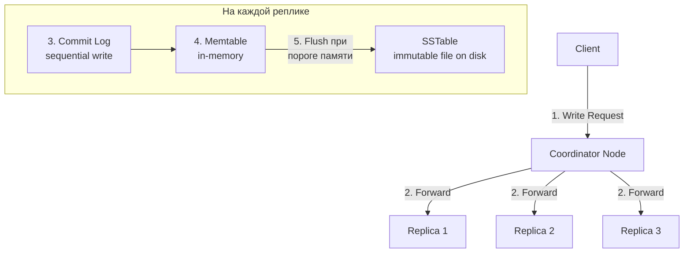


> [!mcq]
> - [ ] Cassandra сначала пишет в SSTable на диск, и только потом обновляет Memtable в памяти — это даёт durability | Порядок обратный: запись идёт в `Commit Log` (sequential WAL) **и** `Memtable` (RAM) синхронно; SSTable создаётся только при flush из Memtable, асинхронно. ❌ ПОСЛЕДСТВИЕ: junior, опираясь на эту модель, неверно объясняет интервьюеру write path; в реальном проекте strangely конфигурирует `commitlog_sync: batch` с huge interval, теряя данные при сбое.
> - [ ] Координатор пишет данные **только** в Commit Log на одной ноде — репликация происходит лениво в background через gossip | Координатор отправляет запрос на **все реплики синхронно** (по числу `RF`), ждёт подтверждений согласно `Consistency Level`; gossip отвечает за state, не за репликацию данных. ❌ ПОСЛЕДСТВИЕ: разработчик считает, что после `INSERT` данные мгновенно есть только на одной ноде; полагается на repair для распространения; теряет данные при простое write-ноды до того, как gossip «довезёт».
> - [x] Write path: координатор → реплики (параллельно по `RF`); на каждой реплике — `Commit Log` (sequential WAL для durability) + `Memtable` (RAM); при заполнении Memtable — flush в **immutable SSTable**; координатор отвечает после получения ack от `CL` реплик. Updates = новые записи с timestamp; deletes = tombstones | LSM-tree архитектура: всё append-only, sequential I/O — поэтому запись быстрая; обновления и удаления откладываются до compaction. ✓ ПРИМЕНЯТЬ: time-series ingestion (Discord 5М msg/s); event sourcing с append-only моделью; high-throughput logging — Cassandra обгоняет PostgreSQL в 10× на write. 📋 ПРАВИЛО: «Append-only LSM: Commit Log + Memtable → SSTable; updates = new timestamp». 🔗 См. Q17, Q18, Q26.
> - [ ] `Commit Log` — это случайные записи (random I/O) на диск; именно поэтому Cassandra медленна на запись на HDD | `Commit Log` — **строго sequential write** (append-only file); это даёт высокую write throughput даже на HDD; именно поэтому Cassandra оптимизирована под HDD-эпоху и ещё быстрее на SSD. ❌ ПОСЛЕДСТВИЕ: команда покупает дорогие NVMe «потому что Cassandra делает random I/O», переплачивает 5× за инфраструктуру, не получая ожидаемого ускорения (узкое место — не диск).
**Шаги записи:**
1. Клиент отправляет запрос на **координатор**
2. Координатор определяет реплики и отправляет запрос
3. На каждой реплике запись идёт в **Commit Log** (WAL, sequential I/O — быстро)
4. Данные записываются в **Memtable** (in-memory)
5. Когда Memtable заполняется — **flush** на диск в **SSTable** (immutable)
6. Координатор отвечает клиенту после получения подтверждений от нужного числа реплик (по `Consistency Level`)

**Ключевые свойства:**
- Запись **всегда sequential I/O** — поэтому Cassandra быстра на запись
- SSTables **immutable** — никогда не модифицируются
- Обновление = новая запись с большим timestamp
- Удаление = запись tombstone

> [!mcq]
> - [x] Compaction объединяет несколько SSTables в одну, удаляя tombstones и устаревшие версии — выбор strategy (STCS/LCS/TWCS) критически влияет на read amplification и disk I/O | Без compaction данные размазаны по множеству SSTables, чтение требует merge'а N файлов; правильная strategy уменьшает read amp и ускоряет чтение. ✓ ПРИМЕНЯТЬ: STCS (Size Tiered) default — write-heavy workloads, низкая write amp; LCS (Leveled) — read-heavy, низкая read amp (~1-2 SSTables per read), но высокая write amp; TWCS (Time Window) — time-series данные с TTL (sensor data, metrics), полностью удаляет старые windows без overhead. 📋 ПРАВИЛО: «STCS=writes, LCS=reads, TWCS=time-series». 🔗 См. Q17 (read path), Q18 (compaction), Q11 (wide rows).
> - [ ] Compaction блокирует запись в таблицу до завершения процесса — поэтому compaction запускается только в maintenance window | Compaction работает в background concurrent с reads/writes; использует throttling через `compaction_throughput_mb_per_sec`; не блокирует workload. ❌ ПОСЛЕДСТВИЕ: команда планирует maintenance windows для compaction, излишне усложняет ops; либо боится включать compaction вообще, накапливает SSTables, read latency деградирует.
> - [ ] Read amplification одинакова для всех compaction strategies — она зависит только от размера данных | Read amp сильно различается: STCS = O(log N) SSTables per read, LCS = ~1-2 SSTables, TWCS = SSTables в одном time window. Правильный выбор strategy критичен. ❌ ПОСЛЕДСТВИЕ: команда оставляет default STCS на read-heavy workload, видит p99 read latency 100ms+ из-за множественных SSTable merges; должны были LCS.
> - [ ] LCS (Leveled Compaction) рекомендуется для time-series данных с TTL — она автоматически удаляет старые данные | LCS не оптимизирована для TTL; для time-series правильный выбор — TWCS, которая группирует данные по time windows и drop'ает целые old windows без overhead на per-row tombstones. ❌ ПОСЛЕДСТВИЕ: команда выбирает LCS для metrics с TTL, страдает от высокого write amplification и tombstone overhead; должны были TWCS — disk usage растёт без необходимости.

## Q17. (!) Как работает путь чтения (`Read Path`)?

Чтение в `Cassandra` сложнее записи, так как данные могут быть разбросаны по нескольким `SSTable` и `Memtable`.


> [!mcq]
> - [ ] Read path в Cassandra проще write path: координатор обращается к одной реплике, читает SSTable и возвращает результат | Read path сложнее write: координатор опрашивает несколько реплик (по `CL`), на каждой реплике мердж Memtable + N SSTables по timestamp, плюс `Bloom Filter`, `Key Cache`, опционально `Read Repair`. ❌ ПОСЛЕДСТВИЕ: на собеседовании кандидат упрощает read path, не упоминает Bloom filter и merge — fail; в проде неверно тюнит `read_request_timeout`, не понимая, откуда задержка.
> - [x] Read path: координатор → запрос полных данных к **ближайшей** реплике + digest к остальным; на реплике — `Bloom Filter` (отсев SSTables без ключа) → `Key Cache` → чтение SSTable + Memtable → merge по timestamp; при digest mismatch — `Read Repair` | Bloom filter снижает disk I/O за счёт быстрого отсева; key cache держит позиции; merge по timestamp даёт latest-wins семантику. ✓ ПРИМЕНЯТЬ: tuning `bloom_filter_fp_chance=0.01` для read-heavy таблиц; `key_cache_size_in_mb` для горячих ключей; `row_cache_size_in_mb` только для очень hot row. 📋 ПРАВИЛО: «Read = digest + merge по timestamp; Bloom + Key Cache = первая защита от диска». 🔗 См. Q16, Q24, Q26.
> - [ ] `Row Cache` нужно включать на всех таблицах для максимального ускорения чтения | `Row Cache` потребляет много RAM, инвалидируется при любом write на partition; полезен только для **hot rows с редкими updates** (конфиги, словари); на write-heavy убивает производительность. ❌ ПОСЛЕДСТВИЕ: команда ставит `row_cache_size=8GB` на write-heavy events table, при каждом write кэш инвалидируется → cache hit rate <1%, RAM потрачена впустую, GC pauses из-за large cache evictions.
> - [ ] При `CL=ONE` координатор всё равно ждёт ответа всех реплик для безопасности | `CL=ONE` означает, что координатор отвечает после **первой** реплики; остальные опрашиваются только для digest при `read_repair_chance > 0` (в фоне). ❌ ПОСЛЕДСТВИЕ: тюнинг тимлид считает, что `CL=ONE` всё равно ждёт всех — оставляет `CL=QUORUM` «для надёжности», cross-DC latency растёт на 100мс, throughput читалки падает в 3×.
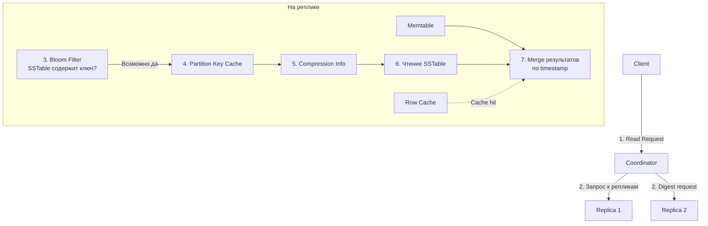


> [!mcq]
> - [ ] `Bloom Filter` гарантирует точный ответ «есть/нет ключ в SSTable» — false positive отсутствуют | Bloom filter — **вероятностная** структура: false positive существуют (default `bloom_filter_fp_chance=0.01` = 1%); false negative отсутствуют (если фильтр сказал «нет» — ключа точно нет). ❌ ПОСЛЕДСТВИЕ: senior на собеседовании путает свойства Bloom filter, тюнит `fp_chance=0.001` (10× больше памяти на фильтры), heap съеден, GC pauses растут.
> - [x] Read path шаги: 1) координатор определяет реплики; 2) ближайшей — full data, остальным — digest; 3) на реплике Bloom filter отсеивает SSTables без ключа; 4) Key Cache даёт offset; 5) Memtable + найденные SSTables мерджатся по timestamp; 6) при расхождении digest запускается Read Repair | Каждый шаг сокращает disk I/O или гарантирует latest version; Read Repair работает в background или blocking в зависимости от CL. ✓ ПРИМЕНЯТЬ: для оптимизации p99 — мониторить `KeyCacheHitRate` (>90%), `BloomFilterFalsePositives` (<1%), `SSTablesPerReadHistogram` (≤2 для LCS). 📋 ПРАВИЛО: «Read = Bloom → Cache → SSTable+Memtable merge по ts; mismatch = Read Repair». 🔗 См. Q16, Q24, Q26.
> - [ ] `Read Repair` всегда выполняется blocking (блокирует ответ клиенту до синхронизации реплик) | Тип Read Repair зависит от `CL` и настроек: blocking при `CL > ONE` (с digest mismatch), background для `read_repair_chance` (legacy, удалён в 4.0+). ❌ ПОСЛЕДСТВИЕ: тимлид считает Read Repair всегда blocking, отключает его для p99 latency, теряет один из механизмов eventual consistency, накапливаются stale-данные между repair-ами.
> - [ ] Координатор всегда обращается ко **всем** репликам, независимо от Consistency Level | Координатор отправляет запрос только нужному числу реплик согласно CL: `CL=ONE` → 1 реплика, `CL=QUORUM` → ⌊RF/2⌋+1; обращение ко всем ≠ CL=ALL. ❌ ПОСЛЕДСТВИЕ: разработчик считает, что `CL=ONE` всё равно нагружает все ноды, оставляет `LOCAL_QUORUM` "потому что разницы нет"; cross-DC latency на read растёт на 30 мс, можно было использовать `LOCAL_ONE` для каталога.
**Шаги чтения:**
1. Координатор определяет реплики и отправляет запросы
2. Полный запрос — к ближайшей реплике, digest — к остальным (для сверки)
3. **Bloom Filter** — вероятностная структура, быстро исключает SSTables, не содержащие ключ
4. **Partition Key Cache** — кэш смещений ключей на диске
5. Чтение из **SSTable** + **Memtable** + merge по timestamp (latest wins)
6. При расхождении digest — **Read Repair**

**Оптимизации:**
- **Key Cache** — кэш позиций ключей в SSTable
- **Row Cache** — кэш целых строк (для hot data)
- **Bloom Filter** — false positive rate настраивается (`bloom_filter_fp_chance`)

## Q18. Что такое `Tombstone` и как они влияют на производительность?

**Tombstone** — специальный маркер удаления в `Cassandra`. Поскольку `SSTables` immutable, удалённые данные не могут быть сразу удалены с диска.

```cql
-- Эта операция создаёт tombstone
DELETE FROM orders WHERE user_id = ? AND order_id = ?;

-- TTL-expired данные тоже становятся tombstones
INSERT INTO events (...) VALUES (...) USING TTL 3600;
```


> [!mcq]
> - [ ] `DELETE` мгновенно удаляет данные с диска и из всех SSTables — это атомарная физическая операция | SSTables **immutable**; `DELETE` создаёт `tombstone` — маркер с timestamp; реальное удаление произойдёт только при компакции после `gc_grace_seconds`. ❌ ПОСЛЕДСТВИЕ: команда чистит таблицу через массовый `DELETE` для освобождения 500 ГБ диска, диск не освобождается, ещё и read latency растёт из-за tombstone overhead, paging команда ловит `TombstoneOverwhelmingException`.
> - [ ] `Tombstone` — это исключительно результат `DELETE`-операции; `TTL`-expired данные удаляются другим способом | TTL-expired данные **тоже становятся tombstones**; механизм один — append timestamped marker, удаление в compaction. ❌ ПОСЛЕДСТВИЕ: разработчик считает, что массовый `INSERT ... USING TTL 3600` не создаёт tombstone overhead; ставит TTL=1ч на горячую таблицу, через сутки read p99 деградирует на 10× из-за миллионов TTL-tombstones.
> - [x] Tombstone — маркер удаления с timestamp; жизненный цикл: `DELETE`/`TTL-expire` → tombstone → реплицируется на все реплики → удаляется при компакции после `gc_grace_seconds` (default 10 дней); накопление tombstones замедляет чтение, ограничение `tombstone_failure_threshold=100k` бросает `TombstoneOverwhelmingException` | gc_grace_seconds — окно для `nodetool repair`, чтобы tombstone дошёл до всех реплик; иначе удалённые данные могут «воскреснуть». ✓ ПРИМЕНЯТЬ: time-series с TWCS (выбрасывает целые окна без tombstone overhead); минимум DELETE в дизайне — лучше партиции с TTL; мониторить `TombstoneScannedHistogram` в JMX. 📋 ПРАВИЛО: «Tombstone = маркер на gc_grace дней; >100k = exception; TWCS вместо DELETE». 🔗 См. Q19, Q26, Q27.
> - [ ] `gc_grace_seconds` можно безопасно ставить в 0 для ускорения cleanup tombstones | `gc_grace_seconds=0` приводит к **tombstone resurrection**: если реплика была offline, она не получила tombstone до его удаления, после возвращения «воскрешает» удалённую запись. ❌ ПОСЛЕДСТВИЕ: команда ставит `gc_grace=0` на single-DC проде ради экономии диска, узел падает на 6 часов, после возврата 2% удалённых заказов «воскресают» в выдаче — клиенты видят давно отменённые товары.
**Жизненный цикл tombstone:**
1. `DELETE` → создаётся tombstone с timestamp
2. Tombstone реплицируется на все реплики
3. По прошествии `gc_grace_seconds` (по умолчанию 10 дней) tombstone может быть удалён при компакции

**Проблемы:**
- Накопление tombstones замедляет чтение (надо сканировать все)
- `TombstoneOverwhelmingException` при > 100 000 tombstones на запрос
- Частые DELETE + INSERT на один ключ — анти-паттерн


> [!mcq]
> - [ ] Главное решение проблемы tombstones — увеличить `tombstone_failure_threshold` до 1М, чтобы exception не возникал | `tombstone_failure_threshold` — защитный механизм; повышение лишь маскирует проблему: чтение N тыс. tombstones всё равно медленное (минуты на запрос), GC pauses растут. ❌ ПОСЛЕДСТВИЕ: команда поднимает threshold до 1М ради избавления от exception, p99 чтений вырастает с 50 мс до 8 сек, координатор OOM-ится при попытке скана 800k tombstones, ситуация хуже, чем до «фикса».
> - [ ] Уменьшить `gc_grace_seconds` до 1 часа — tombstones будут быстро очищаться, проблема решена | gc_grace_seconds — **окно для repair**, чтобы tombstone дошёл до всех реплик до удаления; уменьшение ниже периода repair → tombstone resurrection. ❌ ПОСЛЕДСТВИЕ: ops уменьшает `gc_grace_seconds=3600` без согласования с repair schedule, удалённые админами заказы «воскресают» через сутки, клиенты видят отменённые товары как активные.
> - [x] Правильные решения: моделировать данные с минимумом DELETE (партиции с TTL вместо явного удаления, immutable history), использовать `TWCS` для time-series с TTL (выбрасывает целые окна без tombstone overhead), регулярный `nodetool repair` в пределах `gc_grace_seconds`; мониторить `TombstoneScannedHistogram` | Tombstone — следствие модели данных и compaction; устранять причины (DELETE-ы, неподходящая стратегия), а не симптомы (threshold). ✓ ПРИМЕНЯТЬ: события пользователя — append-only с `TTL=90d` + TWCS (drop windows); сессии — `default_time_to_live` на таблицу; сообщения — bucketing + TTL вместо DELETE. 📋 ПРАВИЛО: «Минимум DELETE; TWCS для TTL-таблиц; repair < gc_grace; мониторить tombstones». 🔗 См. Q26, Q27.
> - [ ] Достаточно отключить tombstones через `cassandra.yaml: tombstones_enabled=false` — Cassandra будет сразу удалять | Такого параметра не существует; tombstones — фундаментальная часть LSM-tree модели Cassandra (eventual consistency, immutable SSTables). ❌ ПОСЛЕДСТВИЕ: junior копирует «решение» из StackOverflow, кладёт несуществующий параметр в `cassandra.yaml`, нода не стартует с `Configuration error: unrecognized property tombstones_enabled`, downtime на час.
**Решения:**
- Моделировать данные так, чтобы минимизировать DELETE
- Использовать TTL вместо явного DELETE
- Настроить `gc_grace_seconds` под нагрузку (но не слишком маленьким — иначе воскреснут удалённые данные)

## Q19. Как работает механизм сжатия данных (`Compression`)?

`Cassandra` поддерживает прозрачное сжатие данных на уровне `SSTable`.

```cql
CREATE TABLE logs (...)
WITH compression = {
  'class': 'LZ4Compressor',    -- алгоритм
  'chunk_length_in_kb': 64      -- размер блока
};
```

**Поддерживаемые алгоритмы:**


> [!mcq]
> - [ ] Compression в Cassandra работает на уровне всей SSTable: чтобы прочитать одну строку, нужно распаковать весь файл целиком | Compression работает на уровне **блоков** (default `chunk_length_in_kb=64`); чтение одного значения распаковывает только один блок (~64 KB), не всю SSTable. ❌ ПОСЛЕДСТВИЕ: тимлид считает compression «дорогим из-за full-file decompression», отключает его (`NoopCompressor`), disk usage растёт в 3–5×, IO bandwidth тоже растёт, перформанс хуже, чем с LZ4.
> - [x] Cassandra сжимает SSTables блоками (`chunk_length_in_kb=64` default); алгоритмы: `LZ4` (default — быстрый, ~2× ratio), `Snappy` (чуть лучше ratio, скорость ~равна), `Deflate` (медленнее, лучше ratio), `Zstd` (4.0+, баланс), `NoopCompressor` (без сжатия) | Сжатие снижает disk I/O ценой CPU; для SSD блок 64KB оптимален; LZ4 — sweet spot для большинства workloads. ✓ ПРИМЕНЯТЬ: OLTP с SSD → `LZ4` (default); cold storage с архивами → `Zstd` или `Deflate` (лучшее сжатие ценой CPU); read-heavy с большими row → уменьшить `chunk_length_in_kb` до 16 для меньшего decompression overhead. 📋 ПРАВИЛО: «LZ4 = default; Zstd = архив; chunk_length под размер row». 🔗 См. Q16, Q17.
> - [ ] `DeflateCompressor` — лучший выбор по умолчанию для production: максимальное сжатие экономит больше всего диска | Deflate **в 3–5× медленнее** LZ4 на decompression, что критично на read-heavy workloads; ratio выше всего на ~20%, что не оправдывает CPU overhead. ❌ ПОСЛЕДСТВИЕ: команда переключает с LZ4 на Deflate ради «экономии диска», CPU usage скачет с 30% до 80%, p99 read растёт с 10 мс до 50 мс, экономия диска 15% не оправдывает деградации.
> - [ ] Compression нужно отключать (`NoopCompressor`) на всех таблицах для максимальной производительности | LZ4-decompression стоит ~10ns на блок, что **дешевле** disk I/O на distance в 100×; отключение compression увеличивает I/O в 3× и забивает page cache. ❌ ПОСЛЕДСТВИЕ: discovery-мифа «без compression быстрее», команда ставит `NoopCompressor` на горячую таблицу 1ТБ, disk usage 5ТБ, page cache hit rate падает с 95% до 60%, p99 read деградирует в 2×.
| Алгоритм | Характеристика |
|----------|---------------|
| `LZ4Compressor` | Быстрый, умеренное сжатие (по умолчанию) |
| `SnappyCompressor` | Быстрый, немного лучше сжатие |
| `DeflateCompressor` | Медленнее, лучшее сжатие |
| `ZstdCompressor` | Хорошее сжатие + скорость (Cassandra 4.0+) |
| `NoopCompressor` | Без сжатия |

Данные сжимаются блоками (по умолчанию 64 KB) — чтение одного значения требует распаковки только одного блока. Сжатие снижает I/O за счёт CPU. Для SSD-дисков часто предпочтительнее `LZ4` из-за минимальной латентности.

## Q20. (!) Что такое `Replication` и какие стратегии существуют?

**Репликация** — автоматическое создание копий данных на нескольких узлах для обеспечения отказоустойчивости и доступности. Фактор репликации (`RF`) задаётся при создании keyspace.


> [!mcq]
> - [ ] `SimpleStrategy` — оптимальная стратегия для production multi-DC кластеров благодаря простоте | `SimpleStrategy` **не учитывает rack/DC топологию**: реплики кладёт на следующих по кольцу нодах, что в multi-DC может скомпоновать все RF копий в одном DC → потеря DC = потеря данных. ❌ ПОСЛЕДСТВИЕ: команда поднимает 6 нод в Москве и СПб с `SimpleStrategy` RF=3, при падении ДЦ Москва теряют данные в keyspace, который случайно реплицировался только туда; cross-DC failover невозможен.
> - [x] `NetworkTopologyStrategy` — production-стандарт: RF задаётся **per-DC** (`'dc-moscow': 3, 'dc-spb': 2`), учитывает rack-awareness (реплики на разных rack); `SimpleStrategy` — только для dev/single-DC, игнорирует топологию | NetworkTopologyStrategy получает информацию о DC/rack от snitch (`GossipingPropertyFileSnitch`); каждая реплика идёт на разные rack для отказоустойчивости. ✓ ПРИМЕНЯТЬ: всегда `NetworkTopologyStrategy` в проде; RF=3 на DC + `LOCAL_QUORUM` — работает при потере одной ноды; multi-region — Москва/Алматы по 3 реплики. 📋 ПРАВИЛО: «Prod = NetworkTopologyStrategy + RF=3/DC; SimpleStrategy = только dev». 🔗 См. Q4, Q21, Q22.
> - [ ] `RF=1` достаточно для production, потому что реплики занимают слишком много места и compaction страдает | RF=1 = **single point of failure**: потеря одной ноды = потеря данных, нет места для repair, `QUORUM` не работает. ❌ ПОСЛЕДСТВИЕ: команда экономит на storage (RF=1 на 100 ТБ), при отказе одного диска теряют 1/N данных, recovery невозможен без backup, бизнес теряет 6 часов на full restore.
> - [ ] `RF` можно изменить на лету через `ALTER KEYSPACE`, и Cassandra автоматически перебалансирует данные | `ALTER KEYSPACE` меняет только метаданные RF; для распространения данных на новые реплики **обязателен `nodetool repair`** на каждой ноде, иначе чтение с CL>RF старого вернёт null. ❌ ПОСЛЕДСТВИЕ: ops увеличивает RF с 2 до 3 без последующего repair, чтения с `LOCAL_QUORUM` начинают возвращать null с третьей реплики (она пустая), 30% запросов фейлятся, пока не догонит repair (часы-сутки).
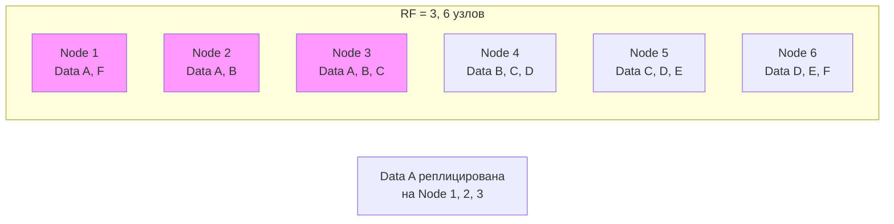

**Стратегии репликации:**

| Стратегия | Описание | Использование |
|-----------|----------|---------------|
| `SimpleStrategy` | Реплики на следующих по кольцу узлах | Только для одного ДЦ, разработки |
| `NetworkTopologyStrategy` | RF задаётся per-DC, учитывает rack-и | **Production**, multi-DC |

```cql
-- SimpleStrategy (НЕ для production)
CREATE KEYSPACE dev_keyspace WITH replication = {
  'class': 'SimpleStrategy',
  'replication_factor': 3
};

-- NetworkTopologyStrategy (рекомендуется)
CREATE KEYSPACE prod_keyspace WITH replication = {
  'class': 'NetworkTopologyStrategy',
  'dc-moscow': 3,
  'dc-spb': 2
};
```

**Рекомендация:** RF = 3 на датацентр — позволяет пережить потерю одного узла при `QUORUM` чтении/записи.

## Q21. (!) Какие уровни консистентности (`Consistency Levels`) существуют?

`Consistency Level` (CL) определяет, сколько реплик должны подтвердить операцию чтения/записи, чтобы она считалась успешной. Это механизм **tunable consistency** — подробнее в [CAP-теореме](../architecture/cap-theorem-interview.md).


> [!mcq]
> - [ ] `Consistency Level` фиксируется на уровне keyspace и применяется ко всем операциям одинаково | CL — **per-request** свойство (через `setConsistencyLevel(...)` на драйвере или CQL `CONSISTENCY` команду в cqlsh); разные запросы могут иметь разные CL. ❌ ПОСЛЕДСТВИЕ: разработчик пытается «зафиксировать CL=QUORUM на keyspace», не находит такой опции, в итоге половина запросов идёт с default `LOCAL_ONE`, eventual consistency проявляется как «гонка» в кэше — отчёты расходятся.
> - [ ] `CL=ALL` — оптимальный production выбор: максимальная безопасность, write/read подтверждается всеми репликами | `CL=ALL` означает, что любой downtime одной ноды (ребут, сеть) → operation fails с `UnavailableException`; на проде это убивает доступность. ❌ ПОСЛЕДСТВИЕ: команда ставит `CL=ALL` ради «надёжности», при rolling-апдейте каждые 2 минуты падают записи (одна нода всегда вне сети), сервис на 100% недоступен на time of upgrade.
> - [x] CL — per-request свойство, определяющее число реплик для подтверждения; ключевые: `LOCAL_QUORUM` (⌊RF/2⌋+1 в локальном DC, **prod-стандарт multi-DC**), `QUORUM` (по всему кластеру — добавляет cross-DC latency), `LOCAL_ONE` (быстро, eventual), `EACH_QUORUM` (cross-DC sync), `ALL` (макс. consistency, мин. доступность) | Strong consistency требует `R+W>N`; для multi-DC `LOCAL_QUORUM` достаточен на запись и чтение в локальном DC, удалённый DC синхронизируется async. ✓ ПРИМЕНЯТЬ: OLTP заказов (Москва+СПб, RF=3 на DC) — `LOCAL_QUORUM` writes/reads; каталог продуктов — `LOCAL_ONE` (eventual ок); финансовый баланс — `LOCAL_QUORUM` + LWT для проверки инвариантов. 📋 ПРАВИЛО: «Multi-DC prod = LOCAL_QUORUM; каталог = LOCAL_ONE; cross-DC sync = EACH_QUORUM». 🔗 См. Q22, Q28.
> - [ ] `CL=ANY` гарантирует, что запись попадёт на все реплики до завершения операции | `CL=ANY` — самый слабый уровень: достаточно, чтобы координатор принял запись как **hint** (для недоступной реплики); реплики могут вообще не получить данные, hint истекает через 3 часа. ❌ ПОСЛЕДСТВИЕ: критичные данные пишутся с `CL=ANY` ради «производительности», координатор падает до доставки hint, клиент получил «success», в БД ничего нет, потеря данных без следа.
| CL | Запись: сколько подтверждений | Чтение: сколько ответов | Когда использовать |
|----|------------------------------|------------------------|--------------------|
| `ANY` | 1 (включая hinted handoff) | — | Максимальная доступность записи |
| `ONE` | 1 реплика | 1 реплика | Низкая латентность, eventual consistency |
| `TWO` | 2 реплики | 2 реплики | Компромисс |
| `QUORUM` | ⌊RF/2⌋ + 1 | ⌊RF/2⌋ + 1 | Strong consistency при R+W > N |
| `LOCAL_QUORUM` | Кворум в локальном ДЦ | Кворум в локальном ДЦ | **Production multi-DC** |
| `EACH_QUORUM` | Кворум в каждом ДЦ | — | Строгая консистентность cross-DC |
| `ALL` | Все реплики | Все реплики | Максимальная консистентность, минимальная доступность |

**Типичная production-конфигурация:** `LOCAL_QUORUM` для чтения и записи с RF = 3.

> [!mcq]
> - [ ] В multi-DC кластере для production-нагрузки нужно использовать `QUORUM`, чтобы охватить все датацентры | `QUORUM` считает кворум по **всему кластеру**: при двух DC координатор ждёт ответы из удалённого DC, что добавляет 50–200 мс cross-DC latency. ❌ ПОСЛЕДСТВИЕ: при штатной работе p99 на запись растёт с 5 до 150 мс, при сетевом сбое между DC сервис ложится целиком, хотя локальный DC живой.
> - [ ] `EACH_QUORUM` — оптимальный выбор для multi-DC, потому что это «локальный кворум в каждом DC» | `EACH_QUORUM` требует кворум **в каждом** DC — при падении удалённого DC запись блокируется и фейлится с `UnavailableException`. ❌ ПОСЛЕДСТВИЕ: одна сетевая партиция между датацентрами останавливает запись на обоих DC, хотя локальный кворум доступен — доступность падает до уровня монолитной БД.
> - [x] В multi-DC production стандарт — `LOCAL_QUORUM` для чтения и записи с RF=3 в каждом DC: кворум считается **только в локальном DC**, репликация в удалённый DC идёт асинхронно | Запрос подтверждается двумя репликами в локальном DC, а в удалённый DC данные доставляются через async replication; cross-DC latency не входит в путь запроса. ✓ ПРИМЕНЯТЬ: гео-распределённый сервис заказов (Москва+Алматы), мульти-региональная Netflix-инсталляция, банковский OLTP с DR-датацентром. 📋 ПРАВИЛО: «multi-DC = `LOCAL_QUORUM`; cross-DC синхронность — только когда бизнес явно платит за неё». 🔗 См. Q22, Q42.
> - [ ] `CL=ANY` даёт strong consistency, потому что любая запись подтверждается хотя бы одной репликой | `ANY` считает запись успешной даже если её принял только координатор как `hint` — реплика могла её ещё не получить; это **самый слабый** уровень, не строгий. ❌ ПОСЛЕДСТВИЕ: чтение `CL=ONE` сразу после записи `CL=ANY` возвращает «не найдено», hint истекает через 3 часа — данные молча теряются.

## Q22. (!) Что означает формула `R + W > N`?

Это формула **strong consistency** (линеаризуемости чтения) в распределённых системах:
- **R** — число реплик для чтения
- **W** — число реплик для записи
- **N** — фактор репликации

```
RF = 3
QUORUM = ⌊3/2⌋ + 1 = 2

Write QUORUM (W=2) + Read QUORUM (R=2) = 4 > 3 (N)
→ Гарантия: хотя бы одна реплика содержит latest данные
```

**Примеры:**


> [!mcq]
> - [ ] Формула `R+W>N` гарантирует, что **все** реплики содержат latest данные после записи | Гарантия слабее: хотя бы **одна** реплика из read-set содержит latest данные (пересечение write-set и read-set ≥ 1); merge по timestamp на координаторе вернёт latest. ❌ ПОСЛЕДСТВИЕ: junior на собеседовании говорит «все реплики», интервьюер ловит на неточности; в проде неверно объясняет команде, почему read-repair всё равно нужен (для остальных N-1 реплик).
> - [ ] При `R+W>N` все реплики уже синхронизированы — `nodetool repair` больше не нужен | `R+W>N` гарантирует **read-time consistency**, но не background синхронизацию; реплики, не попавшие в read-set, остаются устаревшими; tombstone resurrection возможен без repair. ❌ ПОСЛЕДСТВИЕ: команда отключает плановый repair «потому что R+W>N», через 11 дней (gc_grace=10d) удалённые данные «воскресают» на отстающих репликах, баг данных в проде.
> - [ ] При RF=3 единственный способ получить strong consistency — `W=ALL, R=ALL` | `W=ALL R=ALL` даёт R+W=6>3, но **избыточно** и убивает доступность; достаточно `W=QUORUM (2) + R=QUORUM (2) = 4 > 3`; работают и `W=ALL R=ONE`, `W=ONE R=ALL`. ❌ ПОСЛЕДСТВИЕ: тимлид требует «W=ALL+R=ALL для strong consistency», система не переживает падение одной ноды, доступность 99% вместо 99.99%, бизнес теряет SLA.
> - [x] `R+W>N` — формула strong consistency через пересечение наборов реплик: при RF=3 `QUORUM=2`, `W=QUORUM(2) + R=QUORUM(2) = 4 > 3` — гарантия, что хотя бы одна реплика в read-set содержит latest write; альтернативы `W=ALL R=ONE` и `W=ONE R=ALL` тоже дают strong consistency, но с разной availability tradeoff'ой | Quorum-based linearizability: пересечение write quorum и read quorum непустое, значит latest write попадает в read; merge по timestamp выбирает свежайшее. ✓ ПРИМЕНЯТЬ: balanced strong consistency для OLTP — `W=QUORUM + R=QUORUM`; write-heavy + редкие чтения — `W=ONE + R=ALL` (если важна read consistency); read-heavy + редкие writes — `W=ALL + R=ONE`. 📋 ПРАВИЛО: «R+W>N = strong; W=R=QUORUM = balanced default». 🔗 См. Q21, Q24, Q25.
| Конфигурация | R + W > N? | Консистентность |
|--------------|-----------|-----------------|
| W=QUORUM, R=QUORUM | 2+2=4 > 3 | Strong |
| W=ALL, R=ONE | 3+1=4 > 3 | Strong |
| W=ONE, R=ONE | 1+1=2 < 3 | Eventual |
| W=ONE, R=ALL | 1+3=4 > 3 | Strong |

## Q23. Что такое `Hinted Handoff`?

**Hinted Handoff** — механизм временного хранения записей, предназначенных для недоступной реплики.

**Как работает:**
1. Координатор пытается записать данные на реплику, но она недоступна
2. Координатор сохраняет **hint** (подсказку) локально
3. Когда реплика восстанавливается, координатор передаёт накопленные hints
4. Hint хранится ограниченное время (`max_hint_window` = 3 часа по умолчанию)

**Ограничения:**
- Не заменяет полноценный `repair`
- При длительном простое реплики hints истекают и данные теряются
- CL = `ANY` позволяет считать hint подтверждением записи (опасно)


> [!mcq]
> - [ ] `hinted_handoff_enabled: false` — рекомендованная prod-настройка для предотвращения потери данных | Отключение hinted handoff означает, что записи на недоступную реплику **сразу теряются** (если `CL` достижим без неё); восстановление возможно только через `nodetool repair`. ❌ ПОСЛЕДСТВИЕ: ops-команда отключает hints «для надёжности», при коротком network blip (5 минут) расхождение реплик растёт, repair удлиняется в разы, eventual consistency заметна на read-уровне.
> - [x] Hint config: `hinted_handoff_enabled: true` (default), `max_hint_window_in_ms: 10800000` (3ч default — после этого hints выбрасываются), `hinted_handoff_throttle_in_kb: 1024` (rate limit при доставке); **обязательно дополнять `nodetool repair` в пределах `gc_grace_seconds`** | Hints закрывают окно `max_hint_window`, всё что дольше — обязанность repair; throttle защищает реплику от шторма после восстановления. ✓ ПРИМЕНЯТЬ: rolling restart кластера (узлы по 5–10 минут offline); короткие network blips; плановое обновление JVM — hints спасают; `Reaper` от DataStax для автоматизации repair. 📋 ПРАВИЛО: «Hints = 3ч страховка; repair < gc_grace_seconds — обязательно». 🔗 См. Q24, Q25.
> - [ ] `max_hint_window_in_ms: 86400000` (24 часа) безопасно для длительных простоев — Cassandra хранит hints столько, сколько нужно | Большой `max_hint_window` накапливает гигабайты hints на координаторах, заполняя disk; при доставке провоцирует сетевой шторм; правильный путь после длительного простоя — repair, не hints. ❌ ПОСЛЕДСТВИЕ: ops ставит 24ч ради «надёжности», при двухдневном даунтайме координаторы накапливают 50 ГБ hints, диски на координаторах забиваются, после восстановления реплики hint storm вешает кластер на 4 часа.
> - [ ] При `CL=ANY` запись надёжна: координатор гарантирует, что hint обязательно дойдёт до реплики | `CL=ANY` означает «координатор принял запись как hint», но если **сам координатор упадёт** до доставки — данные теряются без следа; это **самый слабый** CL. ❌ ПОСЛЕДСТВИЕ: финансовый сервис пишет с `CL=ANY` ради latency, координатор падает (OOM), пользователь получил OK, данных нет; обнаруживается через дни через расхождение reconciliation.
**Настройка в `cassandra.yaml`:**
```yaml
hinted_handoff_enabled: true
max_hint_window_in_ms: 10800000  # 3 часа
```

> [!mcq]
> - [ ] `Hinted Handoff` полностью заменяет `nodetool repair` — пока он включён, anti-entropy repair можно не запускать | Hints живут только до `max_hint_window` (3 часа по умолчанию); при простое реплики дольше — hints выбрасываются и реплика остаётся с устаревшими данными, repair всё равно нужен. ❌ ПОСЛЕДСТВИЕ: команда отключает регулярный `nodetool repair`, узел падает на сутки, hints истекают; после `gc_grace_seconds` удалённые данные «воскресают» — баг данных в проде.
> - [ ] `hinted_handoff_throttle_in_kb` лучше выставить максимально высоким (`unlimited`), чтобы hints доставлялись быстрее после восстановления реплики | После долгого простоя у координаторов накапливаются гигабайты hints; разблокированная доставка съедает сетевой канал и CPU реплики, которая ещё прогревает кэш — провоцирует cascading failure. ❌ ПОСЛЕДСТВИЕ: восстановившаяся реплика ловит шторм hints на 1 Гбит/с, p99 чтений в кластере взлетает с 10 до 500 мс, ops-команда вынуждена снова её выводить.
> - [ ] При записи с `CL=ANY` координатор гарантирует, что запись не потеряется даже если все реплики упали | `CL=ANY` означает «координатор принял запись как hint и считает её успешной»; если координатор сам упадёт до доставки hint — запись теряется без следа. ❌ ПОСЛЕДСТВИЕ: финансовая транзакция логируется с `CL=ANY`, координатор падает до доставки hint всем репликам — клиент получил «success», но данных в БД нет.
> - [x] `Hinted Handoff` — это краткосрочная оптимизация (default `max_hint_window_in_ms = 3 часа`), которую нужно тюнить по `hinted_handoff_throttle_in_kb` (1024 KB/s по умолчанию) и обязательно дополнять регулярным `nodetool repair` | Hints спасают от **коротких** простоев реплик; для долгих простоев и tombstone-resurrection нужен полноценный repair раз в `gc_grace_seconds`. ✓ ПРИМЕНЯТЬ: rolling restart кластера (узлы по 5–10 минут вне сети), краткие network blips, плановое обновление — hints закрывают эти окна без read repair-шторма. 📋 ПРАВИЛО: «hints — пластырь на 3 часа, repair — лечение». 🔗 См. Q24, Q25.

## Q24. Что такое `Read Repair`?

**Read Repair** — механизм восстановления согласованности данных при чтении.

**Как работает:**
1. Координатор запрашивает данные у нескольких реплик
2. Сравнивает ответы (digest или полные данные)
3. Если ответы расходятся — отправляет актуальную версию (по timestamp) на отстающие реплики


> [!mcq]
> - [ ] `Read Repair` запускается отдельным процессом на cron, не во время чтения | Read Repair срабатывает **во время чтения** при digest mismatch (blocking, до ответа клиенту при `CL>ONE`) или на проценте запросов в фоне (legacy `read_repair_chance`, удалён в 4.0+). ❌ ПОСЛЕДСТВИЕ: оps настраивает «cron для read-repair», ничего не происходит, удивляется, ищет проблему днями; в реальности RR работает сам, нужен только `nodetool repair` для anti-entropy.
> - [ ] `Read Repair` полностью заменяет `nodetool repair` — отдельный repair не нужен | RR работает только для **читаемых** данных; нечитаемые партиции расходятся месяцами; для tombstone resurrection нужен полноценный anti-entropy repair в пределах `gc_grace_seconds`. ❌ ПОСЛЕДСТВИЕ: команда отключает плановый `nodetool repair` «потому что есть RR», через 11 дней удалённые данные «воскресают» в редко читаемых таблицах, баг данных в проде.
> - [x] Read Repair бывает двух типов: **Blocking RR** — координатор ждёт исправления реплик перед ответом клиенту (срабатывает при `CL > ONE` и digest mismatch); **Background RR** — починка после ответа (управлялась `read_repair_chance`, удалена в Cassandra 4.0+, заменена на blocking) | Blocking RR гарантирует monotonic read consistency для следующих запросов; legacy background RR давал eventual cleanup, но был непредсказуем. ✓ ПРИМЕНЯТЬ: для критичных читалок ставить `CL=LOCAL_QUORUM` (всегда blocking RR при mismatch); мониторить `ReadRepairStage` в JMX; в 4.0+ полагаться только на blocking + anti-entropy. 📋 ПРАВИЛО: «Blocking RR при CL>ONE; в 4.0+ background RR удалён; nodetool repair всё равно нужен». 🔗 См. Q21, Q23, Q25.
> - [ ] `Read Repair` гарантирует, что после чтения **все** реплики будут синхронизированы | RR синхронизирует **только опрошенные** реплики (по `CL`); остальные остаются устаревшими до следующего чтения или repair. ❌ ПОСЛЕДСТВИЕ: разработчик считает, что один SELECT с RR починит весь кластер, не запускает repair, через месяц при сбое одной из «нечиненных» реплик читалка с `CL=ONE` возвращает stale-данные неопределённо долго.
**Типы:**
- **Blocking Read Repair** — координатор ждёт исправления перед ответом клиенту (при CL > ONE)
- **Background Read Repair** — исправление после ответа клиенту (настраивается `read_repair_chance`, в Cassandra 4.0+ убран)

## Q25. (!) Что такое `Anti-Entropy Repair` и зачем он нужен?

**Repair** (`nodetool repair`) — процесс полной синхронизации данных между репликами. Это основной механизм обеспечения eventual consistency.


> [!mcq]
> - [ ] `nodetool repair` — операция, которую можно запустить раз в год: Cassandra сама поддерживает консистентность через hints и read repair | Hints живут только 3 часа, RR работает только для читаемых данных; **обязательно** запускать repair минимум раз в `gc_grace_seconds` (10 дней), иначе tombstone resurrection. ❌ ПОСЛЕДСТВИЕ: команда запускает repair раз в полгода «когда вспомнят», после простоя ноды на сутки удалённые данные «воскресают», 1% записей в проде — невалидные.
> - [x] Anti-Entropy Repair (`nodetool repair`) — full sync реплик через `Merkle Tree` сравнение; нужен потому что: hints покрывают только 3 часа, RR — только читаемые данные, а после `gc_grace_seconds` tombstones удаляются (без repair могут «воскреснуть» удалённые данные); типы: full / incremental / subrange | Merkle tree даёт O(log N) сравнение партиций между репликами; incremental пропускает уже отремонтированные SSTables. ✓ ПРИМЕНЯТЬ: автоматизация через `Cassandra Reaper` от DataStax; запуск в low-traffic окно; subrange для больших таблиц (по token range); регулярность ≤ gc_grace_seconds. 📋 ПРАВИЛО: «Repair каждые ≤ gc_grace дней; Reaper — must для prod; tombstone resurrection — главная угроза без repair». 🔗 См. Q18, Q23, Q24.
> - [ ] `Incremental repair` всегда лучше `full repair`: быстрее и не требует дополнительных проверок | Incremental repair имел известные баги (CASSANDRA-9143) до 4.0; в multi-DC может приводить к over-streaming; полный repair raз в N инкрементальных всё равно нужен для consistency invariants. ❌ ПОСЛЕДСТВИЕ: команда полагается на incremental repair после каждого простоя, не делает периодический full, через 2 месяца обнаруживает рассинхрон между DC, который не лечится incremental.
> - [ ] `nodetool repair` блокирует все writes на кластере на время выполнения | Repair работает **в фоне** concurrent с reads и writes; есть только I/O и CPU нагрузка, но не блокировка операций. ❌ ПОСЛЕДСТВИЕ: ops боится запускать repair «потому что заблокирует прод», откладывает на годы, кластер уезжает в неконсистентное состояние, требуется полный rebuild.
**Зачем нужен:**
- Hinted handoff может не покрыть длительные простои
- Read Repair работает только для читаемых данных
- Без регулярного repair — риск чтения устаревших данных
- После `gc_grace_seconds` tombstones удаляются — без repair могут «воскреснуть» удалённые данные

**Типы repair:**
- **Full repair** — сравнивает все данные через `Merkle Tree`
- **Incremental repair** — только данные, изменённые с последнего repair
- **Subrange repair** — repair части token range

**Рекомендации:**
- Запускать repair минимум раз в `gc_grace_seconds` (по умолчанию 10 дней)
- Использовать инструменты автоматизации: `Reaper` (от DataStax)
- Планировать repair в периоды низкой нагрузки


> [!mcq]
> - [ ] `nodetool repair -pr ecommerce` ремонтирует **все** реплики во всём кластере одновременно — оптимально по времени | Флаг `-pr` (`--partitioner-range`) ремонтирует **только primary range** этой ноды; для полного покрытия нужно запустить `repair -pr` **на каждой ноде последовательно**. ❌ ПОСЛЕДСТВИЕ: ops запускает `repair -pr` на одной ноде и считает, что весь кластер починен; на самом деле primary ranges остальных нод не тронуты, расхождение остаётся, через 11 дней tombstone resurrection.
> - [ ] `nodetool repair -inc` — это инкрементальный repair, который безопасно использовать вместо full repair всегда | Incremental repair (default в 4.0+) имеет известные ограничения: после `nodetool decommission`/`bootstrap` нужен full; в multi-DC сценариях фрагментация SSTables. ❌ ПОСЛЕДСТВИЕ: команда заменяет full на incremental без оглядки на ограничения, после bootstrap новой ноды incremental не покрывает её данные → миграция тянет stale-данные на новую ноду.
> - [x] Команды: `nodetool repair <keyspace>` — full на всех keyspaces ноды; `nodetool repair -inc <keyspace>` — incremental; `nodetool repair <keyspace> <table>` — конкретная таблица; `-pr` — только primary range (запускать на каждой ноде); production — автоматизация через `Reaper` | Полный repair дорог по I/O и времени; incremental пропускает уже синхронизированные SSTables; Reaper (от DataStax) скейлит и расписание. ✓ ПРИМЕНЯТЬ: расписание repair каждые 7 дней в low-traffic окно через Reaper; subrange repair для таблиц >100ГБ (по token range); полный repair после `decommission`/`bootstrap`. 📋 ПРАВИЛО: «Reaper для prod; -pr — на каждой ноде; full после bootstrap». 🔗 См. Q23, Q25.
> - [ ] Параметр `-j` (`--job-threads`) в `nodetool repair` нужно ставить максимально высоким (например, 64) для скорости | Высокий `-j` (default 1) насыщает диск и CPU параллельной валидацией Merkle tree; на проде это вызывает throttling реальных запросов; рекомендация — `-j 2`–`-j 4` с осторожным мониторингом. ❌ ПОСЛЕДСТВИЕ: ops ставит `-j 64`, во время repair p99 на чтение деградирует с 10 мс до 2 сек, пользователи видят таймауты, repair останавливают, цикл начинается заново.
```bash
# Full repair keyspace
nodetool repair ecommerce

# Incremental repair
nodetool repair -inc ecommerce

# Repair конкретной таблицы
nodetool repair ecommerce orders
```

## Q26. (!) Какие стратегии компакции (`Compaction`) существуют?

**Compaction** — процесс слияния `SSTable` для удаления устаревших данных, tombstones и оптимизации чтения.

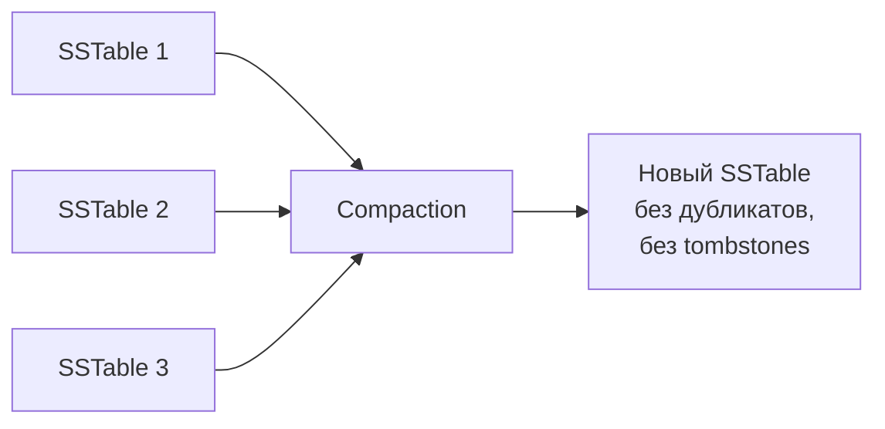


> [!mcq]
> - [ ] `STCS` — универсальный выбор для любой таблицы; LCS и TWCS — устаревшие альтернативы | STCS оптимизирована **только под write-heavy**: на read-heavy даёт высокую read amplification (10+ SSTables per read); на time-series TTL — накапливает мёртвые данные. ❌ ПОСЛЕДСТВИЕ: команда оставляет default STCS на read-heavy таблице профилей пользователей, p99 read деградирует, диагностика «too many SSTables per read», должны были LCS.
> - [ ] `LCS` всегда лучше `STCS`: меньше SSTables на чтение, значит везде лучше | LCS даёт **высокий write amplification** (10×+ overhead): данные перезаписываются между уровнями; на write-heavy убивает throughput и SSD endurance. ❌ ПОСЛЕДСТВИЕ: команда переключает write-heavy event log с STCS на LCS «для лучшего read p99», write throughput падает в 5×, SSD начинают изнашиваться в 10× быстрее, через год замена дисков.
> - [x] Compaction strategies — компромисс write vs read amplification: `STCS` (Size Tiered) для **write-heavy** (default, низкая write amp, высокая read amp); `LCS` (Leveled) для **read-heavy** (1–2 SSTables на чтение, высокая write amp); `TWCS` (Time Window) для **time-series с TTL** (group by time window, drop целых окон); `UCS` (4.0+) — auto-adaptive | Каждая стратегия оптимизирует одну фазу ценой другой; правильный выбор по характеру нагрузки. ✓ ПРИМЕНЯТЬ: event log → STCS; user profiles read-heavy → LCS; sensor metrics с TTL=30d → TWCS с `compaction_window_size=1 DAY`. 📋 ПРАВИЛО: «Write-heavy=STCS; Read-heavy=LCS; Time-series TTL=TWCS». 🔗 См. Q16, Q17, Q18.
> - [ ] `TWCS` подходит для любой time-series таблицы, даже без TTL | Без TTL `TWCS` накапливает старые окна навечно (нет триггера для drop); out-of-order записи (запись в прошлое) попадают в чужие окна, ломая модель immutable windows. ❌ ПОСЛЕДСТВИЕ: команда ставит TWCS без TTL для исторических данных, бэкфилл прошлых записей через `INSERT ... USING TIMESTAMP <past>` запускает компакцию старых окон, write amp скачет, в логах WARN `TWCS unexpected SSTable in window`.
| Стратегия | Когда использовать | Характеристика |
|-----------|-------------------|----------------|
| `STCS` (SizeTiered) | **Write-heavy** нагрузка | Сливает SSTable похожего размера; может временно удвоить дисковое пространство |
| `LCS` (Leveled) | **Read-heavy** нагрузка | SSTable организованы по уровням; 90% чтений — 1 SSTable; больше I/O при записи |
| `TWCS` (TimeWindow) | **Time-series** данные | Группирует SSTable по временным окнам; эффективен с TTL |
| `UCS` (Unified, 4.0+) | Универсальная | Объединяет идеи STCS и LCS, автоадаптация |

```cql
-- Задание стратегии при создании таблицы
CREATE TABLE sensor_data (...)
WITH compaction = {
  'class': 'TimeWindowCompactionStrategy',
  'compaction_window_unit': 'DAYS',
  'compaction_window_size': 1
};

-- Изменение стратегии
ALTER TABLE orders WITH compaction = {
  'class': 'LeveledCompactionStrategy',
  'sstable_size_in_mb': 160
};
```

> [!mcq]
> - [ ] Для time-series IoT-метрик с `TTL=30 дней` оптимальна `LCS` (`LeveledCompactionStrategy`), потому что она минимизирует количество SSTable при чтении | `LCS` непрерывно перезаписывает SSTable между уровнями — для time-series с TTL это значит, что данные, которые скоро истекут, тратят CPU/диск на бесконечную ре-компакцию. ❌ ПОСЛЕДСТВИЕ: write amplification растёт в 10–20×, диск перегревается, истёкшие записи всё равно пересобираются между уровнями; правильный выбор — `TWCS`, который выбрасывает целое окно вместе с истёкшим TTL.
> - [ ] `STCS` (`SizeTieredCompactionStrategy`) — лучший выбор для read-heavy таблицы, потому что она объединяет SSTable в более крупные | `STCS` объединяет SSTable **похожего размера**, поэтому актуальные данные размазаны по многим уровням; на чтение поднимается до 10+ SSTable, p99 latency страдает; для read-heavy нужен `LCS` (90% чтений из 1 SSTable). ❌ ПОСЛЕДСТВИЕ: read p99 в read-heavy профиле остаётся высоким, bloom filter не помогает, диагностика указывает на «слишком много SSTable per read».
> - [x] Выбор стратегии — это компромисс «write vs read amplification»: `STCS` для write-heavy (минимум I/O при записи, дублирование при чтении), `LCS` для read-heavy (1 SSTable на чтение, но 10× write amplification), `TWCS` для time-series с TTL (выбрасывает целые окна) | Каждая стратегия оптимизирует свою фазу: `STCS` экономит на компакции, `LCS` — на чтении, `TWCS` — на удалении устаревших данных целыми сегментами. ✓ ПРИМЕНЯТЬ: write-heavy event-log → `STCS`; read-heavy профиль пользователя → `LCS`; sensor metrics 90 дней → `TWCS` с `compaction_window_size=1 DAY`. 📋 ПРАВИЛО: «Write-heavy → STCS, Read-heavy → LCS, Time-series → TWCS». 🔗 См. Q18, Q27.
> - [ ] `TWCS` (`TimeWindowCompactionStrategy`) можно безопасно использовать для любой таблицы с timestamp в clustering key — даже без TTL | Без TTL `TWCS` накапливает старые окна навечно; out-of-order записи (запись «в прошлое») попадают в чужие окна и ломают ассумпцию, что окно immutable. ❌ ПОСЛЕДСТВИЕ: backfill исторических данных через `INSERT ... USING TIMESTAMP <past>` запускает компакцию в старых окнах, write amplification скачет, диагностика «`TWCS unexpected SSTable in window`» в логах.

## Q27. Как управлять жизненным циклом данных через `TTL`?

**TTL** (`Time To Live`) — время жизни данных в секундах. По истечении TTL данные становятся tombstone и удаляются при компакции.

```cql
-- TTL на уровне записи
INSERT INTO sessions (session_id, user_id, data)
VALUES (uuid(), some_uuid, 'payload')
USING TTL 3600;  -- 1 час

-- TTL на уровне обновления
UPDATE sessions USING TTL 7200
SET data = 'updated'
WHERE session_id = some_uuid;

-- Проверить оставшийся TTL
SELECT TTL(data) FROM sessions WHERE session_id = some_uuid;

-- TTL по умолчанию для таблицы
CREATE TABLE temp_data (...)
WITH default_time_to_live = 86400;  -- 1 день
```

**Важно:**
- TTL = 0 означает "без TTL" (данные живут вечно)
- TTL нельзя задать для ключевых колонок (partition/clustering key)
- Expired TTL данные = tombstones → планируйте компакцию
- Для time-series с TTL рекомендуется `TWCS`

> [!mcq]
> - [ ] `TTL` мгновенно удаляет запись с диска по истечении срока, освобождая место сразу | Истёкший `TTL` лишь помечает запись как `tombstone` — реальное удаление происходит только во время компакции. ❌ ПОСЛЕДСТВИЕ: команда ставит TTL=1 час и ждёт мгновенного освобождения диска; через сутки disk usage не падает, а read latency растёт из-за tombstones, скан которых упирается в `tombstone_failure_threshold = 100k`.
> - [ ] `TTL` можно задать для любой колонки, включая `partition key` и `clustering key` | TTL применяется только к обычным колонкам; для ключевых колонок он запрещён, поскольку нарушил бы целостность строки. ❌ ПОСЛЕДСТВИЕ: разработчик пытается `INSERT ... USING TTL` рассчитывая, что весь `clustering`-ключ исчезнет, но `Cassandra` бросает `InvalidQueryException` ещё на этапе CQL.
> - [x] `TTL` — время жизни в секундах, после которого запись становится `tombstone` и удаляется только при следующей компакции; для time-series с TTL рекомендуется `TWCS` | `TTL` задаётся на запись или на таблицу через `default_time_to_live`, истёкшие данные превращаются в надгробия и удаляются в фазе компакции. ✓ ПРИМЕНЯТЬ: HTTP-сессии (`USING TTL 3600`); токены OTP (`TTL 300`); IoT-метрики с retention 30 дней (`default_time_to_live=2592000` + `TWCS`); Netflix viewing history с автозачисткой устаревших записей. 📋 ПРАВИЛО: «TTL = tombstone, не моментальное удаление; для TTL-таблиц — TWCS». 🔗 См. Q18 (Tombstones), Q26 (Compaction).
> - [ ] `TTL = 0` означает "удалить немедленно, на следующей записи" | `TTL = 0` в `Cassandra` означает "без TTL" — данные живут вечно; для немедленного удаления нужно `DELETE`. ❌ ПОСЛЕДСТВИЕ: разработчик думает, что обнуление TTL очистит таблицу, выполняет массовый `UPDATE ... USING TTL 0` — записи остаются, а нагрузка на компакцию вырастает в разы.

## Q28. (!) Что такое `Lightweight Transactions` (`LWT`)?


> [!mcq]
> - [ ] `LWT` — это обычная транзакция в стиле RDBMS (BEGIN / COMMIT / ROLLBACK) для нескольких партиций | LWT — это **условная запись** в одной партиции через Paxos; нет BEGIN/COMMIT/ROLLBACK, нет multi-partition атомарности; cross-partition транзакций в Cassandra нет. ❌ ПОСЛЕДСТВИЕ: разработчик пытается использовать LWT для перевода между двумя счетами (две партиции), баланс расходится при сбое посередине, требуется ручной reconciliation, доверие к системе подорвано.
> - [x] LWT (Lightweight Transaction) — условная запись через Paxos-консенсус: `IF NOT EXISTS`, `IF column = ?`; даёт linearizable consistency **в рамках одной партиции**; стоимость — 4 round-trip между координатором и репликами вместо 1 (latency × 4–6); только для редких уникальных операций | Paxos фазы: Prepare → Promise → Propose → Accept → Commit; каждая требует кворума, отсюда 4× round-trip. ✓ ПРИМЕНЯТЬ: уникальный email при регистрации (`INSERT ... IF NOT EXISTS`); оптимистичная блокировка (`UPDATE ... IF version = ?`); идемпотентный leader election; счётчики **не для денег**. 📋 ПРАВИЛО: «LWT = Paxos × 4 RT; одна партиция; редкие уникальные операции». 🔗 См. Q21, Q22, Q30.
> - [ ] `LWT` имеет ту же латентность, что обычный `INSERT` с `CL=QUORUM` | Paxos требует 4 round-trip (Prepare/Promise/Propose/Accept/Commit, каждый с кворумом); это в **4–6× дороже** обычной QUORUM-записи; нагружать LWT критичные пути нельзя. ❌ ПОСЛЕДСТВИЕ: `IF NOT EXISTS` на горячем регистрационном эндпоинте даёт p99 200мс вместо 30мс, в пиковый трафик timeout-шторм, баг признают «лагом», переписывают через distributed lock в Redis.
> - [ ] Можно безопасно смешивать `LWT` и обычные `INSERT/UPDATE` на одной строке — Cassandra сама разрешит конфликты через timestamp | LWT и обычные writes используют **разные пути координации** (Paxos vs обычный write path); их timestamp могут конфликтовать, обычная запись «обгонит» LWT, аннулируя проверку условия. ❌ ПОСЛЕДСТВИЕ: критический инвариант (`balance >= 0`) проверяется через `LWT IF balance >= ?`, параллельно идёт обычный `UPDATE balance = ?` без `IF` — race condition с потерей условия, баланс уходит в минус.
**LWT** — механизм условной записи с проверкой через `Paxos`-консенсус, обеспечивающий linearizable consistency для одной партиции.

```cql
-- Вставка только если записи нет (регистрация пользователя)
INSERT INTO users (user_id, email, name)
VALUES (uuid(), 'user@mail.ru', 'Иван')
IF NOT EXISTS;

-- Обновление с проверкой условия (оптимистичная блокировка)
UPDATE accounts
SET balance = 900
WHERE account_id = ?
IF balance = 1000;
```

**Результат операции LWT:**
```
 [applied] | balance
-----------+---------
     False |     500   -- условие не выполнено, текущее значение = 500
```

**Как работает LWT (Paxos):**

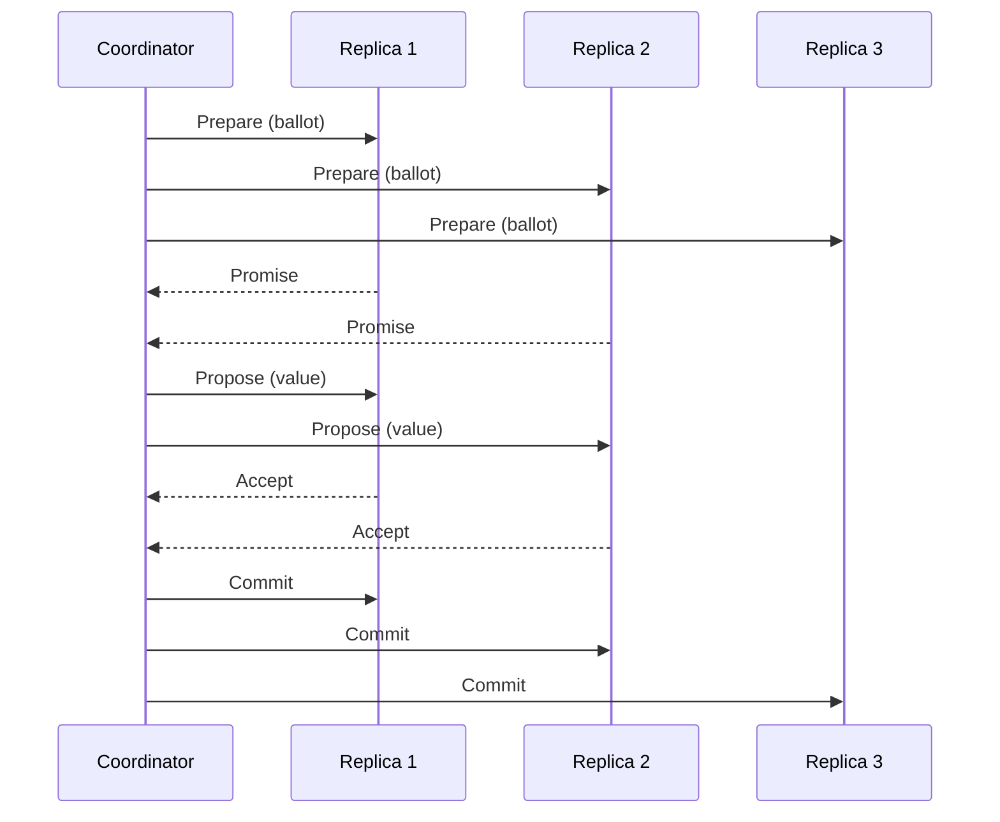

**Ограничения LWT:**
- Латентность в **4-6 раз выше** обычной записи (4 round-trips вместо 1)
- Работает только в рамках **одной партиции**
- Не использовать в горячих путях и массовых операциях
- Не смешивать LWT и обычные записи на одних данных — race condition

> [!mcq]
> - [ ] `LWT` имеет ту же латентность, что обычная запись с `CL=QUORUM` — Paxos лишь немного добавляет overhead | Paxos выполняет **4 round-trip** между координатором и репликами (`Prepare → Promise → Propose → Accept`, плюс `Commit`); каждая стадия требует кворума → латентность растёт **в 4–6×** относительно обычной записи. ❌ ПОСЛЕДСТВИЕ: `IF NOT EXISTS` на горячем эндпоинте регистрации даёт p99 200 мс вместо 30 мс, очередь запросов растёт, при пике трафика — timeout-шторм.
> - [ ] `LWT` можно безопасно использовать для **межпартиционных** транзакций (например, перевод денег с одного счёта на другой) | `LWT` гарантирует linearizability только в рамках **одной партиции**; cross-partition атомарности нет — две `LWT` в разных партициях могут частично примениться. ❌ ПОСЛЕДСТВИЕ: банковский перевод между двумя `account_id` падает посредине: списали с одного счёта, не зачислили на другой → расхождение баланса, требуется ручной reconciliation.
> - [x] `LWT` использует Paxos-протокол с 4 round-trip между координатором и репликами, что даёт линеаризуемость в рамках **одной партиции**, но платой служит латентность в 4–6× выше обычной записи и потеря throughput | Paxos обеспечивает консенсус (`Prepare/Promise/Propose/Accept/Commit`), отсюда множественные round-trip; стоимость оправдана только для редких уникальных операций. ✓ ПРИМЕНЯТЬ: `INSERT ... IF NOT EXISTS` для уникального email при регистрации; `UPDATE ... IF version = ?` для оптимистичной блокировки агрегата; идемпотентный leader election. 📋 ПРАВИЛО: «`LWT` — Paxos × 4 round-trip; только для редких уникальных операций в одной партиции». 🔗 См. Q21, Q30.
> - [ ] Можно безопасно смешивать `LWT` и обычные `INSERT/UPDATE` на одной строке — Cassandra сама разрулит конфликты по timestamp | `LWT` и обычные записи используют **разные пути координации**: первая идёт через Paxos, вторая — через обычный write path; их timestamp могут конфликтовать, и обычная запись «обгонит» LWT, аннулируя проверку условия. ❌ ПОСЛЕДСТВИЕ: критический инвариант (`balance >= 0` через `IF balance >= ?`) нарушается, потому что параллельный `UPDATE balance = ?` без `IF` проскакивает мимо Paxos — race condition с потерянным условием.

## Q29. Что такое `Batch` и какие ограничения у `Batch`?

**Batch** — группировка нескольких CQL-операций в один запрос.


> [!mcq]
> - [ ] Все типы `BATCH` дают одинаковую atomicity и performance — выбор типа влияет только на синтаксис | Типы кардинально разные: `LOGGED` — atomicity через batch-log (медленно); `UNLOGGED` — без atomicity, но быстро на одной партиции; `COUNTER` — только counter-операции. ❌ ПОСЛЕДСТВИЕ: разработчик использует `LOGGED` для bulk import 100k записей, координатор задыхается на batch-log, throughput 1k/s вместо 50k/s (через async singles); должен был UNLOGGED или async singles.
> - [x] Типы BATCH: `LOGGED` (default) — atomicity через batch-log на 2 нодах (для разных партиций, медленно); `UNLOGGED` — без atomicity, оптимизирован для одной партиции (один RPC); `COUNTER` — только для counter-таблиц; **не транзакция в RDBMS-смысле** (нет изоляции); для bulk load — async singles, не batch | Atomicity ≠ isolation: LOGGED batch гарантирует «все или ничего», но во время выполнения reader видит промежуточное состояние; UNLOGGED на одной партиции эквивалентен одной row-write. ✓ ПРИМЕНЯТЬ: `UNLOGGED BATCH` для денормализации в одну партицию (запись row + index с тем же partition key); `LOGGED BATCH` редко — только когда нужна atomicity нескольких таблиц/партиций; counter — отдельный counter table. 📋 ПРАВИЛО: «UNLOGGED = одна партиция (быстро); LOGGED = atomicity через batch-log (дорого); bulk = async singles». 🔗 См. Q12, Q30.
> - [ ] `LOGGED BATCH` гарантирует isolation: concurrent читатели не видят промежуточное состояние | LOGGED даёт **только atomicity** (все или ничего); isolation отсутствует — reader между этапами batch видит частично применённые операции. ❌ ПОСЛЕДСТВИЕ: разработчик ожидает SQL-семантику, два concurrent batch на одних данных пересекаются, читатели получают «полу-обновлённый» агрегат, бизнес-логика ломается на «то-есть-то-нет».
> - [ ] Размер `BATCH` неограничен — Cassandra сама разобьёт большой batch на куски | Размер ограничен `batch_size_warn_threshold_in_kb` (5KB) и `batch_size_fail_threshold_in_kb` (50KB по умолчанию); превышение — WARN или **отказ операции**. ❌ ПОСЛЕДСТВИЕ: разработчик отправляет batch на 10MB, рассчитывая на «авто-разбиение», координатор отбрасывает с `BatchSizeException`, либо WARN-ы заваливают лог, либо OOM при попытке буферизировать batch.
| Тип | Гарантия | Использование |
|-----|----------|---------------|
| `LOGGED` (по умолчанию) | Атомарность (все или ничего) | Операции в **разных** партициях (с overhead) |
| `UNLOGGED` | Нет атомарности | Операции в **одной** партиции (оптимально) |
| `COUNTER` | Для counter-таблиц | Только counter-операции |

```cql
-- UNLOGGED batch для одной партиции (рекомендуется)
BEGIN UNLOGGED BATCH
  INSERT INTO user_events (user_id, event_time, type)
  VALUES ('user1', now(), 'login');
  INSERT INTO user_events (user_id, event_time, type)
  VALUES ('user1', now(), 'page_view');
APPLY BATCH;
```

**Ограничения и анти-паттерны:**
- Размер batch: **~5 MB** по умолчанию
- LOGGED batch на разных партициях = **координатор становится bottleneck**
- Batch — **не транзакция** в RDBMS-смысле (нет изоляции)
- Для массовой загрузки: **асинхронные одиночные записи** с пулом, а не batch

> [!mcq]
> - [ ] `BATCH` в Cassandra — это аналог транзакции в RDBMS: гарантирует изоляцию и атомарность всех операций | Cassandra-batch гарантирует **только атомарность для `LOGGED`** (все или ничего), но **не изоляцию**: чтение между этапами batch может увидеть промежуточное состояние; в RDBMS-смысле это не транзакция. ❌ ПОСЛЕДСТВИЕ: разработчик ожидает ACID-семантику, два concurrent `BATCH` пересекаются — читатель видит «полу-обновлённый» агрегат, бизнес-логика сбоит на консистентности.
> - [ ] `LOGGED BATCH` — оптимальный способ массовой загрузки данных, потому что атомарность защищает от частичной потери | `LOGGED BATCH` пишет batch-log на 2 разных узла **до** применения операций → координатор становится bottleneck, throughput падает в разы; для массовой загрузки правильный путь — **async parallel single-statement writes** через `executeAsync`. ❌ ПОСЛЕДСТВИЕ: ETL-загрузка 100k строк через `LOGGED BATCH` упирается в координатор, throughput ≤ 1k/sec вместо 50k/sec; в логах `BATCH of size N exceeds threshold`.
> - [x] `LOGGED BATCH` даёт атомарность через batch-log на двух репликах (медленно, для **разных партиций**), а `UNLOGGED BATCH` — это просто способ объединить операции **в одну партицию** в один RPC без атомарности | `LOGGED` платит за атомарность batch-log оверхедом; `UNLOGGED` на одной партиции эквивалентен одной записи (атомарность строки гарантирует партиция). ✓ ПРИМЕНЯТЬ: `UNLOGGED` для денормализации в одну партицию (вставка строки + counter + index); `LOGGED` только когда нужна атомарность нескольких таблиц/партиций (редко); НИКОГДА не использовать batch для массовой загрузки. 📋 ПРАВИЛО: «`UNLOGGED` = одна партиция (быстро); `LOGGED` = атомарность через batch-log (дорого); bulk load = async singles, не batch». 🔗 См. Q9, Q28.
> - [ ] Размер batch неограничен — Cassandra сама разобьёт большой batch на куски | Размер batch ограничен `batch_size_warn_threshold_in_kb` (5 KB) и `batch_size_fail_threshold_in_kb` (50 KB по умолчанию); превышение — **WARN в логах** или **отказ операции**. ❌ ПОСЛЕДСТВИЕ: разработчик отправляет batch на 10 MB рассчитывая на «авто-разбиение» → координатор отбрасывает с `BatchSizeException`, либо WARN-ы заваливают лог, либо координатор OOM-ится при попытке запомнить весь batch.

## Q30. Как в `Cassandra` реализовать счётчики (`Counters`)?

**Counter** — специальный тип колонки для атомарного инкремента/декремента.

```cql
CREATE TABLE page_views (
    page_url TEXT,
    date     DATE,
    views    COUNTER,
    PRIMARY KEY ((page_url), date)
);

-- Инкремент
UPDATE page_views SET views = views + 1
WHERE page_url = '/home' AND date = '2026-04-12';

-- Декремент
UPDATE page_views SET views = views - 5
WHERE page_url = '/home' AND date = '2026-04-12';
```


> [!mcq]
> - [ ] `COUNTER` — обычная числовая колонка, к ней применимы стандартные операции `INSERT`, `UPDATE` с `=`, и `TTL` | Counter — **специальный тип** с особым write path: только `UPDATE col = col +/- N`, нет `INSERT`, нет TTL, нельзя смешивать с regular columns в одной таблице. ❌ ПОСЛЕДСТВИЕ: разработчик пишет `INSERT INTO views (page, count) VALUES ('/home', 1)` для счётчика, получает `InvalidQueryException: INSERT statements are not allowed on counter tables`.
> - [x] `COUNTER` — специальный тип для атомарного inc/dec; ограничения: только counter-колонки + ключи в таблице, нет INSERT (только UPDATE), нет TTL, **не идемпотентен на retry** (может дать +2 при ретрае), eventual consistency на concurrent updates; **не для финансовых расчётов** — используйте LWT или RDBMS | Counter использует read-before-write для синхронизации, что несовместимо с idempotency и TTL; оптимизирован под throughput-метрики с допуском ±1 на retry. ✓ ПРИМЕНЯТЬ: page views, likes, online users, IoT-счётчик импульсов; **НЕ применять**: balance, stock, rate-limit с строгими лимитами. 📋 ПРАВИЛО: «Counter = метрики ±1 на retry; деньги = LWT или RDBMS». 🔗 См. Q28, Q29.
> - [ ] Counter-колонки можно смешивать с обычными в одной таблице — Cassandra разрулит специфику | Cassandra **запрещает** смешивать counter и regular columns в одной таблице: при `CREATE TABLE` падает с ошибкой; counter имеет отдельный write path несовместимый с regular. ❌ ПОСЛЕДСТВИЕ: попытка `ALTER TABLE counters ADD last_updated TIMESTAMP` падает с `Cannot add a non counter column to a table with counters`, требуется отдельная таблица.
> - [ ] Counter-операции **идемпотентны**: безопасный retry клиента при таймаутах не приводит к двойному инкременту | Counter `UPDATE` НЕ идемпотентен: при таймауте клиент не знает, применилась операция или нет; повторный `views = views + 1` инкрементит дважды. ❌ ПОСЛЕДСТВИЕ: при сетевом blip retry-логика драйвера дважды инкрементит счётчик просмотров, отчёты завышены на 5–15%, A/B-тесты искажены, бизнес-метрики недостоверны.
**Ограничения counter-таблиц:**
- Таблица может содержать **только counter и ключевые** колонки
- Нет `INSERT`, только `UPDATE` (инкремент/декремент)
- Нет TTL для counter-колонок
- Eventual consistency — при concurrent обновлениях возможна временная рассогласованность
- Не использовать для финансовых расчётов — используйте LWT или внешнюю БД

> [!mcq]
> - [ ] `Counter`-операции **идемпотентны**: безопасный retry клиента при таймаутах не приводит к двойному инкременту | `Counter UPDATE` не идемпотентен: при таймауте клиент не знает, применилась операция или нет; повторный `views = views + 1` инкрементит счётчик дважды. ❌ ПОСЛЕДСТВИЕ: при сетевом blip retry-логика драйвера дважды инкрементит счётчик просмотров, отчёты завышены на 5–15%, A/B-тесты искажены, бизнес-метрики недостоверны.
> - [ ] Можно смешивать `counter`-колонки и обычные колонки в одной таблице — Cassandra сама разрулит специфику counter-write path | Cassandra **запрещает** смешивать counter и обычные колонки: таблица должна содержать **только counter + ключевые** колонки, иначе `CREATE TABLE` падает с ошибкой; counter имеет отдельный write path с read-before-write. ❌ ПОСЛЕДСТВИЕ: попытка добавить колонку `last_updated TIMESTAMP` к counter-таблице падает на `ALTER TABLE`: «`Cannot add a non counter column to a table with counters`», требуется отдельная таблица.
> - [ ] `TTL` можно задать для counter-колонок — это удобно для временных счётчиков | `TTL` запрещён для counter-колонок: counter имеет особый write path (read-before-write через cache), который несовместим с TTL-семантикой. ❌ ПОСЛЕДСТВИЕ: попытка `UPDATE ... USING TTL 3600 SET views = views + 1` падает с `InvalidQueryException: Cannot provide TTL on counter column`; разработчик вынужден переделывать схему на отдельную таблицу с TTL и regular column.
> - [x] `Counter` использует read-before-write и **не идемпотентен** на retry; для финансовых расчётов нужен `LWT` (`UPDATE balance = ? IF balance = ?`) или внешняя БД с ACID, а не counter | Counter оптимизирован под throughput-метрики (счёт показов, лайков) с допуском eventual consistency и ±1 на retry; для денег нужна линеаризуемость через `LWT` или транзакционная БД. ✓ ПРИМЕНЯТЬ: page views, likes, online users, IoT-счётчик импульсов; НЕ применять для balance, stock, rate-limit с строгими лимитами. 📋 ПРАВИЛО: «counter — для метрик с допуском ±1 на retry; деньги — `LWT` или RDBMS». 🔗 См. Q28, Q29.

## Q31. (!) Как подключить `Spring Data Cassandra` к проекту?

**Spring Data Cassandra** — модуль Spring Data для работы с `Cassandra` через репозитории и `CassandraTemplate`. Подробнее о Spring Data — в [вопросах по Spring Data JPA](../frameworks/spring/spring-data-jpa-interview.md) (общие концепции репозиториев).

**Зависимость (Gradle):**

```groovy
implementation 'org.springframework.boot:spring-boot-starter-data-cassandra'
```

**Конфигурация `application.yml`:**

```yaml
spring:
  cassandra:
    keyspace-name: ecommerce
    contact-points: cassandra-node1,cassandra-node2,cassandra-node3
    port: 9042
    local-datacenter: dc-moscow
    schema-action: create_if_not_exists  # none для production
    request:
      timeout: 5s
      consistency: LOCAL_QUORUM
```

**Конфигурация через Java (для тонкой настройки):**

```java
@Configuration
@EnableCassandraRepositories
public class CassandraConfig extends AbstractCassandraConfiguration {

    @Override
    protected String getKeyspaceName() {
        return "ecommerce";
    }

    @Override
    protected String getContactPoints() {
        return "cassandra-node1";
    }

    @Override
    public SchemaAction getSchemaAction() {
        return SchemaAction.CREATE_IF_NOT_EXISTS;
    }
}
```

> [!mcq]
> - [ ] Для подключения `Spring Data Cassandra` достаточно стартера `spring-boot-starter-data-jpa` и URL вида `jdbc:cassandra://...` | `Cassandra` не работает по `JDBC`-протоколу: нужен отдельный стартер `spring-boot-starter-data-cassandra` поверх `DataStax Java Driver`. ❌ ПОСЛЕДСТВИЕ: проект падает с `ClassNotFoundException: CqlSession` или `Driver not found` на старте; разработчик неделю добавляет случайные зависимости, пока не находит правильный стартер.
> - [ ] `schema-action: create_if_not_exists` следует включать на проде, чтобы приложение само поднимало схему после деплоя | На production миграциями должен заниматься отдельный инструмент (`cassandra-migration`, `cqlmigrate`); автоматическое создание схемы скрывает изменения и мешает rollback. ❌ ПОСЛЕДСТВИЕ: при rolling-апдейте разные инстансы пытаются создать таблицу одновременно, ловят `SchemaDisagreement`, кластер уходит в нестабильное состояние на 5–10 минут.
> - [ ] `local-datacenter` — необязательная настройка; драйвер сам определит ближайший ДЦ через broadcast | `DataStax Driver v4` требует явный `local-datacenter`; без него `CqlSession` не стартует с `IllegalStateException`. ❌ ПОСЛЕДСТВИЕ: приложение не поднимается на стенде, в логах `You provided explicit contact points... but no local datacenter`, выкат блокируется.
> - [x] Подключают `spring-boot-starter-data-cassandra`, в `application.yml` задают `keyspace-name`, `contact-points`, `local-datacenter` и `consistency: LOCAL_QUORUM`; на проде `schema-action: none` | Стартер тянет `DataStax Driver v4` и `Spring Data Cassandra`; явные `local-datacenter` и `LOCAL_QUORUM` обязательны для мульти-ДЦ продакшна. ✓ ПРИМЕНЯТЬ: e-commerce заказы в Cassandra (`LOCAL_QUORUM` для записи, `LOCAL_ONE` для чтения каталога); Apple iCloud metadata; миграции через `cqlmigrate` отдельным джобом до старта приложения. 📋 ПРАВИЛО: «Стартер + явный local-DC + schema-action=none на проде». 🔗 См. Q21 (Consistency Levels), Q33 (Java Driver), Q34 (миграции).

## Q32. Как определить `Entity` и `Repository` в `Spring Data Cassandra`?

**Entity (модель):**

```java
@Table("orders")
public class Order {


> [!mcq]
> - [ ] В Spring Data Cassandra используется JPA-аннотация `@Id` для partition key — стандартная для всех Spring Data модулей | Spring Data Cassandra не использует JPA `@Id`; вместо этого `@PrimaryKey`/`@PrimaryKeyColumn` (с `PrimaryKeyType.PARTITIONED` или `CLUSTERED`) и `ordinal` для порядка. ❌ ПОСЛЕДСТВИЕ: разработчик копирует `@Id` из JPA entity, маппинг работает «странно» — partition key не определён, Cassandra не понимает запросы, runtime-ошибки только при первом save.
> - [x] Spring Data Cassandra entity: `@Table("orders")` на классе; для composite primary key — `@PrimaryKeyColumn(type=PARTITIONED, ordinal=0)` для partition key и `@PrimaryKeyColumn(type=CLUSTERED, ordinal=1, ordering=DESCENDING)` для clustering columns; обычные колонки — `@Column("name")` | Аннотации отражают модель Cassandra: composite PK с разделением partition vs clustering и порядком сортировки. ✓ ПРИМЕНЯТЬ: `@Table("orders") class Order { @PrimaryKeyColumn(type=PARTITIONED) UUID userId; @PrimaryKeyColumn(type=CLUSTERED, ordering=DESCENDING) Instant orderDate; }` — события в обратном хронологическом порядке без `ORDER BY`. 📋 ПРАВИЛО: «`@Table` + `@PrimaryKeyColumn` (PARTITIONED/CLUSTERED + ordinal); `@Column` для остального». 🔗 См. Q8, Q31, Q33.
> - [ ] `@PrimaryKeyColumn` с `type=PARTITIONED` можно ставить на несколько полей — Cassandra сама объединит их в composite partition key | Cassandra **умеет** composite partition key (`PRIMARY KEY ((a, b), c)`), но в Spring Data это делается через `@PrimaryKeyClass` (отдельный класс с двумя `@PrimaryKeyColumn(PARTITIONED)`); просто две аннотации на разных полях entity дадут две **разные** партиции. ❌ ПОСЛЕДСТВИЕ: разработчик ставит `PARTITIONED` на два поля entity, ожидает composite partition key, на самом деле каждое поле — отдельный partition key (что невозможно), маппинг ломается, exception на старте.
> - [ ] `ordering = Ordering.DESCENDING` влияет только на сортировку результатов в приложении после выборки | `ordering` хранится в **CQL DDL** (`WITH CLUSTERING ORDER BY (...)`) и определяет физический порядок данных на диске; влияет на on-disk layout, не на app-level сортировку. ❌ ПОСЛЕДСТВИЕ: разработчик добавляет `Ordering.DESCENDING` после создания таблицы, schema action не меняет существующий CLUSTERING ORDER, сортировка не работает; нужна миграция на новую таблицу.
    @PrimaryKeyColumn(name = "user_id", ordinal = 0,
                       type = PrimaryKeyType.PARTITIONED)
    private UUID userId;

    @PrimaryKeyColumn(name = "order_date", ordinal = 1,
                       type = PrimaryKeyType.CLUSTERED,
                       ordering = Ordering.DESCENDING)
    private Instant orderDate;

    @PrimaryKeyColumn(name = "order_id", ordinal = 2,
                       type = PrimaryKeyType.CLUSTERED)
    private UUID orderId;

    @Column("total")
    private BigDecimal total;

    @Column("status")
    private String status;

    // getters, setters
}
```

**Repository:**

```java
public interface OrderRepository
        extends CassandraRepository<Order, UUID> {

    // Spring Data автоматически генерирует CQL
    List<Order> findByUserId(UUID userId);

    @Query("SELECT * FROM orders WHERE user_id = ?0 AND order_date > ?1")
    List<Order> findRecentOrders(UUID userId, Instant since);
}
```

**CassandraTemplate (для сложных запросов):**

```java
@Service
@RequiredArgsConstructor
public class OrderService {

    private final CassandraTemplate cassandraTemplate;

    public List<Order> findByUser(UUID userId) {
        return cassandraTemplate.select(
            Query.query(Criteria.where("user_id").is(userId))
                 .limit(20),
            Order.class
        );
    }

    public void saveWithTtl(Order order, int ttlSeconds) {
        InsertOptions options = InsertOptions.builder()
            .ttl(Duration.ofSeconds(ttlSeconds))
            .build();
        cassandraTemplate.insert(order, options);
    }
}
```


> [!mcq]
> - [ ] `CassandraRepository` поддерживает **все** методы JPA Repository, включая JPQL-запросы, Criteria API и пагинацию через `Pageable` | `CassandraRepository` ограничен Cassandra-семантикой: нет JPQL (только CQL через `@Query`), нет Criteria API, `Pageable` ограничен (нет offset, только paging-state). ❌ ПОСЛЕДСТВИЕ: разработчик копирует `Pageable.of(50, 10)` из JPA-проекта, Cassandra игнорирует offset, всегда возвращает первые 10 записей — пагинация UI ломается.
> - [x] `CassandraRepository<T, ID>` даёт CRUD-методы (save, findById, findAll), производные `findByXxx()` для прямых ключевых запросов, `@Query("CQL...")` для кастомных; для сложных запросов используют `CassandraTemplate` с `Query.query(Criteria.where(...))`; пагинация — через `Slice` и `pagingState`, не через `offset` | Cassandra не поддерживает offset-пагинацию (нет `LIMIT N OFFSET M`), только token-based paging через `pagingState` continuation; CassandraTemplate — низкоуровневый API. ✓ ПРИМЕНЯТЬ: простые findByPartitionKey — repository; кастомные с TTL/options — `CassandraTemplate.insert(entity, InsertOptions.builder().ttl(...).build())`; пагинация — Slice+pagingState. 📋 ПРАВИЛО: «Repository = простые CRUD; Template = TTL/options/сложные; пагинация = pagingState». 🔗 См. Q31, Q41.
> - [ ] `findByUserId(UUID userId)` в `CassandraRepository` автоматически делает full table scan, если `userId` не первый partition key | Spring Data **транслирует** имена методов в CQL `WHERE user_id=?`; если `user_id` — partition key, запрос идёт через token-aware к одной реплике (быстро); иначе CQL потребует `ALLOW FILTERING` (медленно, scatter-gather). ❌ ПОСЛЕДСТВИЕ: разработчик пишет `findByEmail()` где email — обычная колонка без индекса, runtime exception `Cannot execute this query as it might involve data filtering`, нужен SI или denormalized table.
> - [ ] `CassandraTemplate` не нужен — все сценарии покрываются `CassandraRepository` | Template нужен для: TTL на запись (`InsertOptions.ttl()`), batch операций (`batchOps`), token-range запросов, асинхронных операций (`AsyncCassandraTemplate`); repository слишком высокоуровневый. ❌ ПОСЛЕДСТВИЕ: разработчик пытается реализовать TTL через repository (`save(entity)` без TTL), все записи живут вечно, через год disk usage растёт неконтролируемо, требуется миграция на template.
## Q33. Как `Cassandra Java Driver` работает с кластером?

**DataStax Java Driver** (v4.x) — основной драйвер для взаимодействия с `Cassandra` из Java.

**Ключевые компоненты:**

| Компонент | Описание |
|-----------|----------|
| `CqlSession` | Основной объект, пул соединений, **singleton** на приложение |
| `PreparedStatement` | Подготовленный запрос, кэшируется на узлах |
| `Load Balancing Policy` | Выбор координатора (`DCAwareRoundRobinPolicy`) |
| `Retry Policy` | Стратегия повтора при сбоях |
| `Reconnection Policy` | Стратегия переподключения |

**Пример использования:**

```java
// Создание сессии (один раз на приложение)
CqlSession session = CqlSession.builder()
    .addContactPoint(new InetSocketAddress("cassandra-host", 9042))
    .withLocalDatacenter("dc-moscow")
    .withKeyspace("ecommerce")
    .build();

// Prepared Statement (подготовить один раз, использовать много)
PreparedStatement ps = session.prepare(
    "INSERT INTO orders (user_id, order_date, order_id, total) " +
    "VALUES (?, ?, ?, ?)"
);

// Bind и выполнение
BoundStatement bs = ps.bind(userId, Instant.now(), orderId, total)
    .setConsistencyLevel(ConsistencyLevel.LOCAL_QUORUM);
session.execute(bs);

// Асинхронное выполнение
CompletionStage<AsyncResultSet> future = session.executeAsync(bs);
```

**Настройка в `application.conf`:**

```hocon
datastax-java-driver {
  basic {
    contact-points = ["cassandra-node1:9042", "cassandra-node2:9042"]
    load-balancing-policy.local-datacenter = "dc-moscow"
    request.timeout = 5 seconds
    request.consistency = LOCAL_QUORUM
  }
  advanced {
    connection.pool.local.size = 3
    retry-policy.class = DefaultRetryPolicy
    reconnection-policy {
      class = ExponentialReconnectionPolicy
      base-delay = 1 second
      max-delay = 60 seconds
    }
  }
}
```

> [!mcq]
> - [ ] `CqlSession` нужно создавать на каждый HTTP-запрос — иначе соединения переиспользуются и появляются race condition'ы | `CqlSession` — потокобезопасный singleton с пулом соединений и кэшем prepared statements; создавать её на запрос — катастрофа по производительности. ❌ ПОСЛЕДСТВИЕ: на пике 1000 RPS приложение открывает 1000 сессий/сек, исчерпывает file descriptors, p99 растёт с 10 мс до 5 сек, ноды Cassandra ловят `Too many open connections`.
> - [x] `CqlSession` — singleton на приложение, держит пул соединений и кэш `PreparedStatement`-ов; для запросов используют `prepare` + `bind`, а маршрутизация идёт через `TokenAwarePolicy` | Драйвер v4 включает `TokenAwarePolicy` по умолчанию и сам считает токен из биндов prepared-стейтмента, отправляя запрос напрямую на нужную реплику. ✓ ПРИМЕНЯТЬ: один `CqlSession` бин в Spring (`@Bean CqlSession`), все DAO используют его; prepare-стейтменты создаются один раз и переиспользуются — так делают Discord, Netflix, Apple. 📋 ПРАВИЛО: «Session = singleton, statements = prepared once». 🔗 См. Q31 (Spring config), Q42 (Token-aware routing).
> - [ ] `PreparedStatement` нужно готовить на каждый запрос, иначе кэш на узлах переполняется и драйвер бросит `PreparedQueryNotFoundException` | `Prepare`-вызов нужно делать один раз: id запроса кэшируется на узлах, повторный `prepare` лишь возвращает тот же id; драйвер сам обрабатывает re-prepare при перезагрузке узла. ❌ ПОСЛЕДСТВИЕ: каждый запрос делает дополнительный round-trip на `PREPARE`, throughput падает в 2–3 раза, координаторы захлёбываются от `prepared_statements`-таблицы.
> - [ ] `LOCAL_QUORUM` и `TokenAwarePolicy` — взаимоисключающие настройки: при `LOCAL_QUORUM` маршрутизация всегда идёт через ближайший узел, не через token-aware | `TokenAwarePolicy` работает на любом `Consistency Level` — она лишь выбирает первого координатора (одну из реплик), а consistency определяет число подтверждений. ❌ ПОСЛЕДСТВИЕ: команда отключает token-aware "ради LOCAL_QUORUM", получает лишний сетевой хоп на каждом запросе, latency растёт на 30–50% на ровном месте.

## Q34. Как выполнять миграции схемы в `Cassandra`?

`Cassandra` не имеет встроенного механизма миграций (как `Flyway` для RDBMS). Подходы:

**1. Скрипты CQL + таблица версий:**

```cql
-- Таблица для отслеживания миграций
CREATE TABLE IF NOT EXISTS schema_migrations (
    version INT PRIMARY KEY,
    description TEXT,
    applied_at TIMESTAMP
);

-- V001__create_orders.cql
CREATE TABLE IF NOT EXISTS orders (
    user_id UUID,
    order_date TIMESTAMP,
    order_id UUID,
    total DECIMAL,
    PRIMARY KEY ((user_id), order_date, order_id)
);

-- V002__add_status_column.cql
ALTER TABLE orders ADD status TEXT;
```


> [!mcq]
> - [ ] `Flyway` — стандартный инструмент миграций для Cassandra, как и для PostgreSQL/MySQL | Flyway не поддерживает Cassandra нативно (только JDBC); для Cassandra существуют отдельные инструменты: `cassandra-migration` (Java lib), `cqlmigrate` (Sky UK), `liquibase-cassandra` (extension). ❌ ПОСЛЕДСТВИЕ: команда добавляет `org.flywaydb:flyway-core` в проект, миграции не работают — `Flyway` пытается читать `flyway_schema_history` через JDBC, которого у Cassandra нет; неделя на смену инструмента.
> - [x] У Cassandra нет встроенных миграций; подходы: 1) скрипты CQL + таблица `schema_migrations` (`version, description, applied_at`) с собственным runner; 2) `cassandra-migration` (Java) или `cqlmigrate` (Sky UK); миграции должны быть **идемпотентными** (`CREATE TABLE IF NOT EXISTS`, `ALTER TABLE ADD ...`); изменение partition key невозможно без новой таблицы + миграция данных | Идемпотентность важна для re-run при rolling deploy; партиционный ключ — часть on-disk layout, поэтому не меняется. ✓ ПРИМЕНЯТЬ: `cqlmigrate` в Jenkins джобе перед деплоем приложения; имена `V001__create_orders.cql`, `V002__add_status.cql`; для смены partition key — создать новую таблицу + Spark/COPY job для миграции данных. 📋 ПРАВИЛО: «Идемпотентные CQL-скрипты; cqlmigrate/cassandra-migration; partition key не меняется». 🔗 См. Q9, Q31.
> - [ ] Достаточно использовать `schema-action: create_if_not_exists` в Spring Data — приложение само создаст и обновит схему на проде | `create_if_not_exists` создаёт **только новые** таблицы, не делает `ALTER` существующих; при rolling deploy разные инстансы могут одновременно создавать таблицу → `SchemaDisagreement`. ❌ ПОСЛЕДСТВИЕ: команда полагается на schema-action на проде, при добавлении колонки приложение её не создаёт, выдаёт runtime-ошибку «column not found»; rolling deploy ловит SchemaDisagreement, кластер в нестабильном состоянии 5–10 минут.
> - [ ] Миграции в Cassandra **не нужны** — schema-less природа NoSQL позволяет менять структуру на лету | Cassandra **schema-aware** (есть DDL, типы колонок, primary key); изменения схемы требуют `ALTER TABLE` или новой таблицы; нельзя «просто писать новые поля». ❌ ПОСЛЕДСТВИЕ: разработчик пытается записать новое поле без `ALTER TABLE ADD`, получает `Unknown identifier`; путает с MongoDB-семантикой, теряет день на отладку очевидной DDL-проблемы.
**2. Инструменты:**
- **cassandra-migration** (библиотека для Java)
- **cqlmigrate** (Sky UK)
- Собственный скрипт при деплое, читающий `schema_migrations` и применяющий новые

**Важно:**
- Миграции должны быть **идемпотентными** (`CREATE TABLE IF NOT EXISTS`, `ALTER TABLE ... ADD ...`)
- Изменение `partition key` невозможно без создания новой таблицы + перенос данных
- Тестировать миграции на копии кластера перед production

## Q35. Как обеспечить безопасность кластера `Cassandra`?

**Аутентификация и авторизация:**

```yaml
# cassandra.yaml
authenticator: PasswordAuthenticator
authorizer: CassandraAuthorizer
```

```cql
-- Создание пользователя
CREATE ROLE app_user WITH PASSWORD = 'strong_password'
    AND LOGIN = true;

-- Назначение прав
GRANT SELECT ON KEYSPACE ecommerce TO app_user;
GRANT MODIFY ON TABLE ecommerce.orders TO app_user;
```

**Шифрование:**

```yaml
# cassandra.yaml — шифрование между узлами
server_encryption_options:
  internode_encryption: all
  keystore: /path/to/keystore.jks
  keystore_password: changeit

# Шифрование клиент-узел
client_encryption_options:
  enabled: true
  keystore: /path/to/keystore.jks
  keystore_password: changeit
```

**Рекомендации:**
- Отдельные учётные записи для каждого приложения (least privilege)
- Регулярная ротация паролей
- `TLS` для межузлового и клиентского трафика
- Аудит доступа (в enterprise-версиях)

> [!mcq]
> - [ ] По умолчанию `Cassandra` отключает аутентификацию — это безопасно, потому что порт 9042 закрыт ОС-уровневым firewall | Дефолтный `authenticator: AllowAllAuthenticator` отключает любые проверки; полагаться на firewall как единственный рубеж — нарушение defense-in-depth и провал любого аудита. ❌ ПОСЛЕДСТВИЕ: разработчик случайно открывает 9042 на NodePort/LoadBalancer для дебага — за час кластер находят сканеры и вычитывают всю клиентскую базу.
> - [x] Включают `PasswordAuthenticator` + `CassandraAuthorizer`, заводят отдельную роль на приложение через `CREATE ROLE ... WITH LOGIN` и `GRANT`, а трафик internode и client защищают TLS через `*_encryption_options` | Это базовый production-набор: аутентификация, RBAC, шифрование на сети; роль на приложение даёт least privilege и трассируемость. ✓ ПРИМЕНЯТЬ: backend-сервис ходит под ролью `app_orders` с `GRANT SELECT, MODIFY` на конкретный `keyspace`; админский доступ под отдельной ролью с `superuser`; ротация паролей через Vault раз в 90 дней. 📋 ПРАВИЛО: «Auth + RBAC + TLS + role-per-service». 🔗 См. Q31 (Spring config), Q36 (мониторинг).
> - [ ] `GRANT ALL PERMISSIONS ON KEYSPACE` сервисной роли — стандартная практика, чтобы избежать `Unauthorized` ошибок при добавлении новых таблиц | `GRANT ALL` нарушает least privilege и даёт возможность `DROP TABLE`/`TRUNCATE` со стороны приложения; правильнее выдавать `SELECT`/`MODIFY` адресно. ❌ ПОСЛЕДСТВИЕ: баг в коде с динамическим CQL вызывает `DROP TABLE orders` под сервисной ролью — теряются данные за смену, восстановление из снапшотов 4 часа.
> - [ ] TLS на internode-трафике замедляет gossip и не нужен, если кластер находится в одной приватной сети ДЦ | Внутренний трафик содержит данные, hints и repair-стримы; в compliance (PCI DSS, ФЗ-152) шифрование между узлами обязательно даже в приватной сети. ❌ ПОСЛЕДСТВИЕ: аудитор PCI отклоняет систему, релиз платёжного сервиса откладывается на квартал из-за отсутствия `internode_encryption: all`.

## Q36. Какие метрики мониторить в production?

**Ключевые метрики `Cassandra` (доступны через JMX, `Prometheus` exporter):**

| Категория | Метрика | Что смотреть |
|-----------|---------|-------------|
| Латентность | `ReadLatency`, `WriteLatency` | p99 < целевого SLA |
| Throughput | `ReadThroughput`, `WriteThroughput` | Тренды роста |
| Ошибки | `Timeouts`, `Unavailables`, `Failures` | Всплески |
| Compaction | `PendingCompactions` | Не должно расти постоянно |
| Memory | `HeapUsage`, `OffHeapUsage` | GC pressure |
| Disk | `LiveDiskSpaceUsed`, `TotalDiskSpaceUsed` | Планирование ёмкости |
| Thread Pools | `PendingTasks` по пулам | Blocked/Dropped — проблема |
| SSTable | `SSTableCount` per table | Рост = нужна компакция |
| Tombstones | `TombstoneScannedHistogram` | Много = проблема моделирования |

**Инструменты:**
- `nodetool status/tablestats/tpstats` — CLI
- `Prometheus` + `Grafana` (через JMX exporter или Metrics reporter)
- `DataStax OpsCenter` (коммерческий)

> [!mcq]
> - [ ] Главное — следить за CPU и сетью узлов; внутренние метрики `Cassandra` дублируют OS-метрики и в проде не нужны | OS-метрики не показывают `PendingCompactions`, `TombstoneScannedHistogram`, `Dropped Mutations` и `HintsInProgress` — без них нельзя поймать проблемы моделирования и репликации. ❌ ПОСЛЕДСТВИЕ: команда видит 60% CPU и считает, что всё ок, а параллельно `PendingCompactions` копится до 5000 — через сутки p99 чтения 10 сек, инцидент.
> - [ ] `nodetool tpstats` показывает только Java thread dump и не годится для мониторинга в проде | `tpstats` показывает thread pools `ReadStage`, `MutationStage`, `Pending`/`Blocked`/`Dropped` — это ключевой источник данных о бэкпрешере координаторов и компакции. ❌ ПОСЛЕДСТВИЕ: команда не настраивает алерт на `Dropped Mutations` — записи теряются молча, hinted handoff не успевает, через неделю ловят дрейф данных и ручной `nodetool repair`.
> - [x] Минимум: `Read/Write Latency p99`, `PendingCompactions`, `Dropped Mutations`, `TombstoneScannedHistogram`, `Pending` по thread pools, `HintsInProgress` и `HeapUsage`; экспорт через JMX exporter в `Prometheus` + `Grafana` | Этот набор покрывает SLA-латентность, бэкпрешер компакции, проблемы моделирования (tombstones), потери записей и GC pressure. ✓ ПРИМЕНЯТЬ: алерт `PendingCompactions > 100` (расходимся с записями), `TombstoneScanned p99 > 1000` (плохое моделирование), `Dropped > 0` (перегруз); Discord/Apple отслеживают эти же метрики через JMX → Prometheus. 📋 ПРАВИЛО: «Latency p99 + Pending/Dropped + Tombstones + Heap — обязательный quartet». 🔗 См. Q18 (Tombstones), Q26 (Compaction), Q23 (Hinted Handoff).
> - [ ] Достаточно проверять `nodetool status` раз в день — все остальные метрики избыточны и мешают разработчикам | `nodetool status` показывает только UP/DOWN и owned %, но не latency, не tombstones и не дропы; ежедневный ручной обход — это не мониторинг. ❌ ПОСЛЕДСТВИЕ: ночью узел деградирует по latency, оставаясь UP; по утру обнаруживают только когда пользователи жалуются — простой 8 часов.

## Q37. Как масштабировать кластер `Cassandra`?

**Горизонтальное масштабирование (добавление узлов):**

1. Установить `Cassandra` на новый сервер с той же конфигурацией
2. Указать seed-ноды кластера в `cassandra.yaml`
3. Запустить — узел автоматически присоединяется (bootstrap)
4. `nodetool status` — проверить статус
5. `nodetool cleanup` на существующих узлах (удалить данные, перемещённые на новый узел)

```bash
# Проверка статуса кластера
nodetool status

# Декомиссия узла (корректное удаление)
nodetool decommission

# Перемещение данных после изменения топологии
nodetool cleanup
```

**Масштабирование без vnodes:** ручной расчёт токенов и `nodetool move`.
**С vnodes (рекомендуется):** автоматическая ребалансировка.

**Вертикальное масштабирование:**
- Увеличение RAM (больше данных в page cache)
- SSD вместо HDD (ускорение чтения)
- Больше CPU (компакция, сжатие)

> [!mcq]
> - [x] Узлы добавляют по одному: ставят `Cassandra` на новый сервер, прописывают seed-ноды и `local-datacenter`, после bootstrap'а на остальных узлах запускают `nodetool cleanup`; с `vnodes` ребалансировка автоматическая | Это штатная процедура `Cassandra`: новый узел вытягивает свои token-ranges по `vnodes`, а `cleanup` удаляет данные, которые перестали ему принадлежать. ✓ ПРИМЕНЯТЬ: рост 10→12 узлов в Discord-кластере сообщений; добавление узлов в Apple iCloud metadata по мере роста пользователей; постепенный апгрейд по одному узлу за раз, чтобы не перегрузить сеть. 📋 ПРАВИЛО: «Один узел за раз → bootstrap → cleanup на остальных». 🔗 См. Q5 (Consistent Hashing), Q6 (vnodes).
> - [ ] Проще всего добавить сразу 5 узлов параллельно через `auto_bootstrap: true` — Cassandra сама распределит нагрузку | Параллельный bootstrap нескольких узлов вызывает конфликты owner'ов token-ranges и запрещён конфигом по умолчанию (`consistent_range_movement`); добавлять можно только по одному. ❌ ПОСЛЕДСТВИЕ: bootstrap-ы конфликтуют, два узла претендуют на одни и те же ranges, кластер уходит в split-brain по схеме, ручное восстановление 6 часов.
> - [ ] Для уменьшения кластера используют `nodetool removenode` на работающем узле — это корректный способ декомиссии | На работающем узле используют `nodetool decommission`, который заранее переносит данные; `removenode` — для уже мёртвого узла, его данные восстанавливаются через repair. ❌ ПОСЛЕДСТВИЕ: команда выполняет `removenode` на живом узле, теряет реплику-1 на partition'ах с `RF=3`; до окончания repair кластер не выдерживает `QUORUM`-чтений.
> - [ ] После добавления узла нужно выполнить `nodetool repair` на новом узле, иначе данные не появятся | Bootstrap уже стримит данные с владеющих узлов; `repair` на новом узле сразу после bootstrap избыточен — нужен `cleanup` на старых узлах для освобождения места. ❌ ПОСЛЕДСТВИЕ: операция `repair` запускается на 10 узлах одновременно, грузит сеть и диски, latency деградирует на сутки, при этом дисковое место на старых узлах не освобождается.

## Q38. `Cassandra` vs другие `NoSQL` базы данных

| Критерий | `Cassandra` | `MongoDB` | `Redis` | `HBase` |
|----------|-------------|-----------|---------|---------|
| Модель данных | Wide-column | Document | Key-Value | Wide-column |
| Архитектура | Masterless (P2P) | Replica Set (Primary-Secondary) | Master-Replica | Master (HMaster) |
| CAP | AP | CP | CP/AP | CP |
| Запись | Очень быстрая (LSM) | Быстрая | Очень быстрая (in-memory) | Быстрая (LSM) |
| Чтение | Быстрая по ключу | Гибкие запросы | Очень быстрая | Быстрая по ключу |
| Консистентность | Tunable | Strong (по умолчанию) | Eventual (replicas) | Strong |
| Multi-DC | Нативная | Ограниченная | Ограниченная | Через HDFS |
| Аналитика | Через Spark | Aggregation Pipeline | Нет | Через MapReduce/Spark |
| Сценарий | IoT, логи, time-series | CRUD, каталоги | Кэш, сессии | Большие таблицы на HDFS |

Подробнее о [MongoDB](mongodb-interview.md) и [Redis](redis-interview.md) — в соответствующих разделах.

> [!mcq]
> - [ ] НЕВЕРНО 1 | `Cassandra` и `MongoDB` имеют одинаковую модель консистентности — обе по умолчанию `Strong`. ❌ ПОСЛЕДСТВИЕ: ожидание strong-чтений в `Cassandra` приводит к чтению устаревших данных и багам в логике.
> - [x] ВЕРНО | `Cassandra` — `AP`-система с masterless P2P архитектурой и tunable consistency, `MongoDB` — `CP` с Replica Set (Primary-Secondary). ✓ ПРИМЕНЯТЬ: выбор `Cassandra` для high-write workload (IoT, time-series), `MongoDB` для CRUD с гибкими запросами. 📋 ПРАВИЛО: «`Cassandra` = AP+masterless, `MongoDB` = CP+primary». 🔗 См. Q1, Q21.
> - [ ] НЕВЕРНО 2 | `Cassandra` поддерживает aggregation pipeline аналогично `MongoDB` для аналитики на стороне БД. ❌ ПОСЛЕДСТВИЕ: попытка делать аналитику внутри `Cassandra` без `Spark`/`Trino` упирается в отсутствие JOIN/GROUP BY и `ALLOW FILTERING`.
> - [ ] НЕВЕРНО 3 | `HBase` имеет masterless архитектуру как `Cassandra`. ❌ ПОСЛЕДСТВИЕ: проектирование без учёта SPOF в `HMaster` приводит к простою при отказе мастера.

## Q39. Какие основные анти-паттерны при работе с `Cassandra`?

На собеседовании важно продемонстрировать понимание ограничений Cassandra и умение их избегать.

**1. `ALLOW FILTERING` — антипаттерн №1**

```cql
-- ПЛОХО: полное сканирование всех партиций кластера
SELECT * FROM orders WHERE status = 'PENDING' ALLOW FILTERING;

-- ХОРОШО: создать отдельную таблицу под этот запрос
CREATE TABLE orders_by_status (
    status     TEXT,
    created_at TIMESTAMP,
    order_id   UUID,
    PRIMARY KEY ((status), created_at, order_id)
) WITH CLUSTERING ORDER BY (created_at DESC);
```

**2. Неограниченные широкие партиции (Unbounded Wide Partitions)**

```cql
-- ПЛОХО: все события пользователя за всё время — партиция растёт вечно
CREATE TABLE user_events (
    user_id  UUID,
    event_ts TIMESTAMP,
    data     TEXT,
    PRIMARY KEY ((user_id), event_ts)
);

-- ХОРОШО: bucketing по месяцу
CREATE TABLE user_events (
    user_id  UUID,
    month    TEXT,      -- '2026-04'
    event_ts TIMESTAMP,
    data     TEXT,
    PRIMARY KEY ((user_id, month), event_ts)
) WITH CLUSTERING ORDER BY (event_ts DESC);
```

**3. Использование Cassandra как реляционной БД**
- Нормализация данных → JOIN не существует → неэффективные multiple roundtrips
- Решение: денормализация, дублирование данных, моделирование под запросы

**4. Большое количество `Tombstone`**
- Частые DELETE + низкий `gc_grace_seconds` → накопление tombstone → degraded reads
- Решение: TTL вместо DELETE там, где применимо; регулярный repair; мониторинг tombstone

**5. Hot Spots из-за неудачного Partition Key**

```cql
-- ПЛОХО: status='ACTIVE' — 95% данных, один узел перегружен
PRIMARY KEY ((status), user_id)

-- ХОРОШО: добавить bucket для распределения
PRIMARY KEY ((status, shard), user_id)
-- shard = user_id % 10 (вычисляется на стороне приложения)
```

**6. Синхронный `LWT` везде**
- `IF NOT EXISTS` / `IF` условия — Paxos-консенсус → в 5-10 раз медленнее обычной записи
- Использовать только там, где действительно нужна compare-and-set семантика

**7. Unbounded IN clause**

```cql
-- ПЛОХО: IN с сотнями значений — запросы ко многим партициям
SELECT * FROM products WHERE category_id IN (1, 2, 3, ..., 500);

-- ХОРОШО: параллельные отдельные запросы через executeAsync
```

> [!mcq]
> - [ ] НЕВЕРНО 1 | `ALLOW FILTERING` безопасен, если запрос редкий и партиций мало — `Cassandra` оптимизирует его как индекс. ❌ ПОСЛЕДСТВИЕ: на масштабе кластер делает full-scan по всем узлам, latency растёт линейно с размером данных, координатор OOM.
> - [ ] НЕВЕРНО 2 | `LWT` (`IF NOT EXISTS`) можно использовать как обычный INSERT — overhead незначительный. ❌ ПОСЛЕДСТВИЕ: Paxos-консенсус в 5-10 раз медленнее обычной записи, при массовом применении узлы захлёбываются.
> - [x] ВЕРНО | Анти-паттерны: `ALLOW FILTERING`, unbounded wide partitions, частые DELETE без TTL (тонны tombstone), hot spots из-за неудачного PK, синхронный `LWT` везде, IN с сотнями значений. ✓ ПРИМЕНЯТЬ: моделирование под запросы, bucketing по времени, TTL вместо DELETE, `executeAsync` вместо больших IN. 📋 ПРАВИЛО: «query-driven design + bounded partitions + TTL > DELETE». 🔗 См. Q9, Q11, Q18.
> - [ ] НЕВЕРНО 3 | Денормализация в `Cassandra` — анти-паттерн, нужно нормализовать как в реляционных БД. ❌ ПОСЛЕДСТВИЕ: попытка эмулировать JOIN через множественные roundtrips убивает производительность; правильный путь — дублирование данных под каждый запрос.

## Q40. (!) Как правильно обрабатывать коллекции в `CQL`?

`Cassandra` поддерживает три типа коллекций как тип колонки: `LIST`, `SET`, `MAP`. Также есть `FROZEN`-обёртка и пользовательские типы (`UDT`).

**Основные типы коллекций:**

```cql
CREATE TABLE user_profile (
    user_id  UUID PRIMARY KEY,
    emails   SET<TEXT>,          -- уникальные значения, неупорядоченные
    tags     LIST<TEXT>,         -- упорядоченные, дубли допустимы
    metadata MAP<TEXT, TEXT>,    -- ключ-значение
    address  FROZEN<address_type> -- UDT как атомарный тип
);

-- Пользовательский тип
CREATE TYPE address_type (
    street TEXT,
    city   TEXT,
    zip    TEXT
);
```

**Операции с коллекциями:**

```cql
-- SET: добавление/удаление элементов
UPDATE user_profile SET emails = emails + {'new@example.com'} WHERE user_id = ?;
UPDATE user_profile SET emails = emails - {'old@example.com'} WHERE user_id = ?;

-- LIST: append/prepend/удаление по индексу
UPDATE user_profile SET tags = tags + ['kotlin'] WHERE user_id = ?;
UPDATE user_profile SET tags[0] = 'java' WHERE user_id = ?;  -- по индексу

-- MAP: добавление/обновление/удаление ключей
UPDATE user_profile SET metadata['key'] = 'value' WHERE user_id = ?;
DELETE metadata['old_key'] FROM user_profile WHERE user_id = ?;
```

**Ограничения и рекомендации:**
- Коллекции **читаются целиком** — нельзя прочитать один элемент без всей коллекции
- Максимальный размер коллекции: **65 535** элементов (рекомендуется < 100)
- `FROZEN` — коллекция сериализуется как blob, изменения заменяют весь объект целиком
- Если нужны частые обновления отдельных элементов большой коллекции — лучше отдельная таблица
- `SET` предпочтительнее `LIST` (нет проблем с дублированием при partial failures)

**Когда использовать FROZEN:**

```cql
-- FROZEN нужен для вложенных коллекций и UDT как part of PRIMARY KEY
CREATE TABLE orders (
    order_id UUID PRIMARY KEY,
    items    LIST<FROZEN<order_item>>,  -- список UDT
    tags     FROZEN<SET<TEXT>>          -- frozen set как часть PK или для компакности
);
```

> [!mcq]
> - [x] ВЕРНО | Коллекции читаются целиком, лимит ~65 535 элементов (рекомендуется < 100), `FROZEN` сериализует коллекцию как blob (любое изменение = замена целиком), `FROZEN` обязателен для вложенных коллекций и UDT в составе PK. ✓ ПРИМЕНЯТЬ: маленькие коллекции под профиль, `SET` вместо `LIST` (нет дублей при retry), большие/часто-обновляемые элементы выносить в отдельную таблицу. 📋 ПРАВИЛО: «коллекция < 100 элементов или отдельная таблица». 🔗 См. Q11.
> - [ ] НЕВЕРНО 1 | Из коллекции `LIST<TEXT>` можно прочитать один элемент по индексу, не загружая остальные. ❌ ПОСЛЕДСТВИЕ: разработчик ожидает point-read, а драйвер тащит всю коллекцию каждый раз — рост latency и сетевого трафика.
> - [ ] НЕВЕРНО 2 | `FROZEN<SET<TEXT>>` поддерживает частичные обновления (`SET tags = tags + {'x'}`) так же как обычный `SET<TEXT>`. ❌ ПОСЛЕДСТВИЕ: попытка инкрементального апдейта frozen-коллекции падает с ошибкой; данные перезаписываются целиком, теряются параллельные изменения.
> - [ ] НЕВЕРНО 3 | Максимальный размер коллекции в `Cassandra` — несколько миллионов элементов, ограничений нет. ❌ ПОСЛЕДСТВИЕ: при превышении 65 535 запись отвергается, чтение больших коллекций приводит к таймаутам и OOM на координаторе.

## Q41. Как реализовать `pagination` в `Cassandra`?

Из-за отсутствия `OFFSET` стандартный SQL-пейджинг неприменим. В `Cassandra` используется **cursor-based pagination** через `paging state`.

**Автоматический пейджинг через Java Driver:**

```java
// Driver автоматически разбивает результаты на страницы
SimpleStatement stmt = SimpleStatement.newInstance(
    "SELECT * FROM events WHERE user_id = ?", userId)
    .setPageSize(100);  // размер страницы

ResultSet rs = session.execute(stmt);

// Итерация — driver запрашивает следующую страницу автоматически
for (Row row : rs) {
    processRow(row);
}
```

**Ручной пейджинг (для REST API):**

```java
// Первая страница
SimpleStatement stmt = SimpleStatement.newInstance(
    "SELECT * FROM events WHERE user_id = ?", userId)
    .setPageSize(20);

ResultSet rs = session.execute(stmt);
List<Row> page1 = rs.currentPage();

// Сохраняем paging state для следующей страницы
ByteBuffer pagingState = rs.getExecutionInfo().getPagingState();
String token = Base64.getEncoder().encodeToString(pagingState.array());

// API отдаёт: {"data": [...], "nextPageToken": "abc123=="}

// Следующая страница по токену
ByteBuffer savedState = ByteBuffer.wrap(Base64.getDecoder().decode(token));
SimpleStatement stmt2 = stmt.copy().setPagingState(savedState);
ResultSet rs2 = session.execute(stmt2);
```

**Пейджинг по clustering key (Token-based):**

```cql
-- Для time-series: используем clustering key как cursor
SELECT * FROM events WHERE user_id = ? AND event_ts < ? ORDER BY event_ts DESC LIMIT 20;
-- event_ts = значение последнего элемента предыдущей страницы
```

**Ограничения paging state:**
- `PagingState` привязан к конкретному запросу и кластеру
- Нельзя перейти сразу на страницу N (только последовательно)
- Состояние может устареть при изменении схемы или данных

> [!mcq]
> - [ ] НЕВЕРНО 1 | В `Cassandra` есть `OFFSET` как в SQL — можно прыгать на страницу N через `LIMIT 20 OFFSET 1000`. ❌ ПОСЛЕДСТВИЕ: попытка использовать `OFFSET` падает синтаксически; если эмулировать через приложение — full-scan по партициям, latency O(N).
> - [ ] НЕВЕРНО 2 | `PagingState` универсален между разными запросами и кластерами — можно сохранить токен в БД и передавать клиентам годами. ❌ ПОСЛЕДСТВИЕ: токен ломается при изменении схемы/перешардинге, клиенты получают ошибки или некорректные данные.
> - [x] ВЕРНО | Используется cursor-based pagination через `PagingState` (автоматический в драйвере) или через clustering key как cursor (`event_ts < ?`); прыгнуть на страницу N нельзя — только последовательно. ✓ ПРИМЕНЯТЬ: REST API → отдавать `nextPageToken` (Base64 от `PagingState`) или последний clustering key. 📋 ПРАВИЛО: «cursor, не OFFSET». 🔗 См. Q8, Q12.
> - [ ] НЕВЕРНО 3 | Token-based pagination по clustering key (`WHERE event_ts < ?`) работает между разными партициями автоматически. ❌ ПОСЛЕДСТВИЕ: clustering order гарантирован только внутри одной партиции — между партициями данные смешаются, страницы поедут.

## Q42. (!) Что такое `Token-aware routing` и почему он важен?

**Token-aware routing** — политика выбора координатора, при которой Java Driver отправляет запрос **напрямую на узел**, хранящий нужную партицию, минуя лишние сетевые хопы.

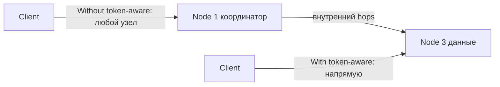

**Настройка в Java Driver v4:**

```java
CqlSession session = CqlSession.builder()
    .addContactPoint(new InetSocketAddress("cassandra-host", 9042))
    .withLocalDatacenter("dc1")
    // TokenAwarePolicy включён по умолчанию в Driver v4
    // Дополнительно: DC-aware для мульти-датацентровых кластеров
    .withConfigLoader(DriverConfigLoader.fromClasspath("application.conf"))
    .build();
```

**application.conf (Typesafe Config):**

```hocon
datastax-java-driver {
  basic.load-balancing-policy {
    class = DefaultLoadBalancingPolicy
    local-datacenter = dc1
  }
  advanced.load-balancing-policy {
    # Token-awareness включена по умолчанию
    # Fallback при недоступности: другой реплика в том же DC
  }
}
```

**Почему важен:**
- Снижает задержку на 1 сетевой хоп (с ~5 мс до ~1 мс в одном датацентре)
- Уменьшает нагрузку на координирующие узлы
- При `CL=ONE` запрос обрабатывается без координации — максимальная скорость
- Требует корректного расчёта `routing key` (partition key в prepared statement)

**Пример с Prepared Statement (обязателен для token-awareness):**

```java
// Prepared statement — driver знает binding variables и вычисляет token
PreparedStatement prepared = session.prepare(
    "SELECT * FROM orders WHERE user_id = ? AND order_date > ?");

BoundStatement bound = prepared.bind(userId, fromDate);
// Driver автоматически вычисляет token(userId) и маршрутизирует к нужному узлу
ResultSet rs = session.execute(bound);
```

> [!mcq]
> - [ ] НЕВЕРНО 1 | Token-aware routing работает с обычными `SimpleStatement` со строковой конкатенацией параметров. ❌ ПОСЛЕДСТВИЕ: драйвер не знает routing key, выбирает случайный координатор → лишний хоп, рост latency, нагрузка на координирующие узлы.
> - [x] ВЕРНО | Драйвер по `PreparedStatement` вычисляет `token(partition_key)` и шлёт запрос напрямую на узел-владельца реплики, минуя лишний хоп через координатор; включён по умолчанию в Java Driver v4. ✓ ПРИМЕНЯТЬ: всегда `PreparedStatement` + `LocalDcAwareLoadBalancingPolicy` в multi-DC; снижает p99 на ~5 мс. 📋 ПРАВИЛО: «`PreparedStatement` = token-aware, `SimpleStatement` = random coordinator». 🔗 См. Q5, Q21.
> - [ ] НЕВЕРНО 2 | Token-aware routing увеличивает нагрузку на координирующие узлы и нужен только для multi-DC. ❌ ПОСЛЕДСТВИЕ: отключение token-awareness → весь трафик через несколько координаторов, hot spots в кластере.
> - [ ] НЕВЕРНО 3 | При `CL=ALL` token-aware routing бесполезен, потому что всё равно нужно опросить все реплики. ❌ ПОСЛЕДСТВИЕ: упускается оптимизация — даже при `CL=ALL` прямой контакт с replica owner экономит 1 hop координации.

> [!mcq]
> - [x] В multi-DC кластере **обязательно** задавать `local-datacenter` через `withLocalDatacenter("dc1")` — Java Driver v4 без этого либо падает на старте с `IllegalStateException`, либо шлёт запросы в случайный DC и платит cross-DC latency | Driver v4 ужесточил multi-DC-семантику: локальный DC должен быть указан явно, чтобы `LocalDcAwareLoadBalancingPolicy` знала, какие узлы считать «местными». ✓ ПРИМЕНЯТЬ: `CqlSession.builder().withLocalDatacenter("dc-msk")` для приложений в Москве; в Astra/cloud — параметр обязателен. 📋 ПРАВИЛО: «multi-DC = обязательный `local-datacenter` + `LOCAL_QUORUM`, иначе cross-DC хоп съест latency». 🔗 См. Q21, Q33.
> - [ ] При использовании `BatchStatement` driver никогда не может вычислить routing key, поэтому token-awareness отключается для любого batch | Для `UNLOGGED` batch с одной партицией driver **берёт routing key из первого statement** (если все statement имеют одинаковый partition key) и сохраняет token-awareness; `LOGGED` cross-partition batch — да, координатор случайный. ❌ ПОСЛЕДСТВИЕ: разработчик отказывается от `UNLOGGED BATCH` в одну партицию из-за мифа о потере token-awareness, теряет throughput-оптимизацию для денормализации.
> - [ ] Token-awareness считается клиентом по `hashCode()` первого аргумента prepared statement, без знания схемы таблицы | Driver вытягивает метаданные через `system_schema` (какие колонки входят в partition key, partitioner — `Murmur3Partitioner`) и считает токен по реальному partition key, а не по позиции аргумента. ❌ ПОСЛЕДСТВИЕ: попытка вручную «переставить аргументы для маршрутизации» ничего не меняет — driver продолжает считать token по схеме, разработчик считает, что управляет hop'ами, а на деле нет.
> - [ ] Token-aware routing — это серверная фича координатора, клиент-драйвер тут ни при чём | Token-awareness реализован **в клиентском драйвере**: координатор не знает, что клиент уже выбрал «правильный» узел; именно драйвер избавляет от лишнего хопа, отправляя запрос сразу владельцу реплики. ❌ ПОСЛЕДСТВИЕ: команда обновляет только Cassandra-кластер (3.x → 4.x), оставляя driver v3 со старой policy → ожидаемого выигрыша по latency не получает, потому что фича всегда жила в драйвере.

## Q43. Как выполнять агрегации и аналитику поверх `Cassandra`?

`Cassandra` намеренно ограничивает аналитические возможности (нет JOIN, GROUP BY, HAVING). Для аналитики используются внешние инструменты.

**Встроенные агрегаты CQL (ограниченно):**

```cql
-- Только по одной партиции, не по кластеру
SELECT COUNT(*), SUM(amount), AVG(amount), MIN(amount), MAX(amount)
FROM orders
WHERE user_id = 'd7c5db80-cf5e-4df1-8523-ebe9a8aa0b81';

-- User-defined aggregate (UDA) для кастомной логики
CREATE FUNCTION state_add(state DOUBLE, val DOUBLE)
    CALLED ON NULL INPUT RETURNS DOUBLE
    LANGUAGE java AS 'return state + val;';
```

**Apache Spark + Cassandra (основной подход):**

```scala
// Spark Cassandra Connector
val sc = new SparkContext(conf)
val ordersRDD = sc.cassandraTable("shop", "orders")

// Аналитика поверх всего кластера
val revenueByCategory = ordersRDD
  .filter(_.getDouble("amount") > 0)
  .keyBy(_.getString("category"))
  .aggregateByKey(0.0)(
    (acc, row) => acc + row.getDouble("amount"),
    _ + _
  )
  .collect()
```

**Apache Flink для stream аналитики:**

```java
// Flink Cassandra Sink — запись результатов обратно в Cassandra
CassandraSink.addSink(stream)
    .setQuery("INSERT INTO analytics.category_stats (category, total) VALUES (?, ?)")
    .setClusterBuilder(clusterBuilder)
    .build();
```

**Materialized Views vs Отдельные таблицы:**

```cql
-- Materialized View (осторожно — experimental feature, лучше избегать в prod)
CREATE MATERIALIZED VIEW orders_by_status AS
    SELECT * FROM orders WHERE status IS NOT NULL AND order_id IS NOT NULL
    PRIMARY KEY ((status), created_at, order_id);

-- Лучше: явная денормализация через приложение или Kafka streams
```

**Рекомендации:**
- `Spark` + `Cassandra Connector` — для batch-аналитики, ETL
- `Apache Flink` / `Kafka Streams` — для real-time агрегаций
- `Presto` / `Trino` — для SQL-запросов ad-hoc поверх Cassandra
- Избегать `ALLOW FILTERING` и cross-partition запросов в prod

> [!mcq]
> - [ ] НЕВЕРНО 1 | Встроенные `COUNT`/`SUM` в `Cassandra` работают эффективно по всему кластеру — можно делать `SELECT COUNT(*) FROM orders` в проде. ❌ ПОСЛЕДСТВИЕ: full-scan по всем узлам с координацией → таймауты, OOM, деградация production-нагрузки.
> - [ ] НЕВЕРНО 2 | `Materialized Views` в `Cassandra` — production-ready решение для аналитики, гарантируют strong consistency с базовой таблицей. ❌ ПОСЛЕДСТВИЕ: MV — eventually consistent и имеют известные баги (CASSANDRA-13066), могут расходиться с base table; в проде лучше явная денормализация через приложение/Kafka.
> - [x] ВЕРНО | Встроенные агрегаты в CQL работают только в рамках одной партиции; для cluster-wide аналитики используют `Spark` + Cassandra Connector (batch), `Flink`/`Kafka Streams` (real-time) или `Trino` (ad-hoc SQL). ✓ ПРИМЕНЯТЬ: денормализация под запросы + внешние engines, не `ALLOW FILTERING`. 📋 ПРАВИЛО: «агрегаты — внутри партиции; cluster-wide — внешний engine». 🔗 См. Q8, Q15.
> - [ ] НЕВЕРНО 3 | `Cassandra` поддерживает JOIN между таблицами через CQL, нужно лишь правильный синтаксис. ❌ ПОСЛЕДСТВИЕ: попытка JOIN падает синтаксически; проектирование схемы с расчётом на JOIN заводит в тупик при дизайне.

## Q44. Что такое `CDC` (`Change Data Capture`) в `Cassandra`?

**CDC** (`Change Data Capture`) — механизм захвата изменений данных в реальном времени. Позволяет отслеживать INSERT/UPDATE/DELETE и публиковать их в другие системы (Kafka, Elasticsearch).

**Как работает CDC в Cassandra:**

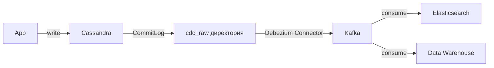

**Включение CDC для таблицы:**

```cql
-- Включить CDC при создании таблицы
CREATE TABLE orders (
    order_id UUID PRIMARY KEY,
    status   TEXT,
    amount   DECIMAL
) WITH cdc = true;

-- Включить для существующей таблицы
ALTER TABLE orders WITH cdc = true;
```

**cassandra.yaml настройки:**

```yaml
cdc_enabled: true
cdc_raw_directory: /var/lib/cassandra/cdc_raw
cdc_total_space_in_mb: 4096    # максимум места под CDC logs
cdc_free_space_check_interval_ms: 250
```

**Debezium Connector для Cassandra (популярное решение):**

```json
{
  "name": "cassandra-cdc-connector",
  "config": {
    "connector.class": "io.debezium.connector.cassandra.CassandraConnector",
    "cassandra.config": "/etc/cassandra/cassandra.yaml",
    "cassandra.hosts": "cassandra-host",
    "kafka.producer.bootstrap.servers": "kafka:9092",
    "topic.prefix": "cassandra",
    "snapshot.mode": "initial"
  }
}
```

**Сценарии использования CDC:**
- Синхронизация Cassandra → Elasticsearch для поиска
- Построение event-driven архитектуры (Cassandra как event store)
- Репликация данных между кластерами
- Аудит изменений
- Cache invalidation при изменении данных

**Ограничения:**
- CDC только для мутаций — не захватывает TTL-удаления и compaction
- Нагрузка на диск (`cdc_raw` нужно мониторить)
- Нет встроенного гарантированного порядка между партициями

> [!mcq]
> - [ ] НЕВЕРНО 1 | `CDC` в `Cassandra` гарантирует строгий глобальный порядок событий между партициями, как Kafka в одной партиции. ❌ ПОСЛЕДСТВИЕ: построение event-sourcing с расчётом на глобальный порядок ломается; consumer видит события не в том порядке, как они происходили на разных узлах.
> - [ ] НЕВЕРНО 2 | `CDC` захватывает все изменения, включая TTL-expiration и compaction-удаления. ❌ ПОСЛЕДСТВИЕ: downstream-системы (Elasticsearch, DW) расходятся с `Cassandra` — данные удалены по TTL, но в зеркале остались.
> - [ ] НЕВЕРНО 3 | `cdc_raw` директория управляется автоматически, мониторить её не нужно. ❌ ПОСЛЕДСТВИЕ: при остановленном/медленном Debezium файлы накапливаются → диск заполняется → запись в таблицу с `cdc=true` блокируется (back-pressure).
> - [x] ВЕРНО | `CDC` пишет мутации из commitlog в `cdc_raw`, читается коннектором (Debezium) и публикуется в Kafka; включается per-table (`WITH cdc = true`); только мутации, не TTL/compaction; порядок гарантирован только в пределах партиции. ✓ ПРИМЕНЯТЬ: `Cassandra` → Kafka → ES/DW, аудит, cache invalidation. 📋 ПРАВИЛО: «CDC = мутации + per-partition order + мониторинг `cdc_raw`». 🔗 См. Q16.

---

## See also

- [MongoDB](mongodb-interview.md) — другая NoSQL БД, документная модель
- [Redis](redis-interview.md) — in-memory хранилище, часто используется вместе с Cassandra как кэш
- [Распределённые системы](../architecture/distributed-systems-interview.md) — фундаментальные концепции, на которых построена Cassandra
- [CAP-теорема](../architecture/cap-theorem-interview.md) — Cassandra как AP-система
- [Архитектура баз данных](database-architecture-interview.md) — сравнение подходов к хранению данных
- [Apache Kafka](../messaging/kafka-interview.md) — интеграция через Kafka Connect для CDC и потоковой обработки
- [Elasticsearch](elasticsearch-interview.md) — часто используется вместе с Cassandra для полнотекстового поиска

- [ClickHouse](clickhouse-interview.md)
- [CockroachDB](cockroachdb-interview.md)
- [Database Architecture](database-architecture-interview.md)
- [Транзакции и уровни изоляции](database-transactions-interview.md)
- [DynamoDB](dynamodb-interview.md)
- [Elasticsearch](elasticsearch-interview.md)
