# Вопросы на собеседовании: `Apache Cassandra`

Вопросы и ответы по `Apache Cassandra`: архитектура кластера, модель данных, `CQL`, `Primary Key`, репликация, уровни консистентности, `LWT`, стратегии компакции, `Spring Data Cassandra`, `Java Driver`.

**Apache Cassandra** — распределённая `NoSQL` БД с линейной масштабируемостью и высокой доступностью, спроектированная для обработки больших объёмов данных на множестве серверов без единой точки отказа. На собеседованиях спрашивают про архитектуру кластера, моделирование данных под запросы, `CQL`, уровни консистентности и сценарии использования.

## Полезные ссылки

### Официальная документация

- [Apache Cassandra Documentation](https://cassandra.apache.org/doc/latest/) — официальная документация
- [DataStax Java Driver](https://docs.datastax.com/en/developer/java-driver/) — драйвер для Java
- [Spring Data Cassandra Reference](https://docs.spring.io/spring-data/cassandra/docs/current/reference/html/) — Spring Data Cassandra

### Статьи Baeldung

- [Introduction to Spring Data Cassandra](https://www.baeldung.com/spring-data-cassandra-tutorial) — настройка и базовые операции
- [A Guide to Cassandra with Java](https://www.baeldung.com/cassandra-with-java) — работа через Java Driver
- [Cassandra Batch in CQL and Java](https://www.baeldung.com/java-cql-cassandra-batch) — пакетные операции
- [Cassandra Query Cheat Sheet](https://www.baeldung.com/cassandra-query-cheat-sheet) — справочник по CQL
- [Spring Data with Reactive Cassandra](https://www.baeldung.com/spring-data-cassandra-reactive) — реактивный стек
- [Secondary Indexes in Cassandra](https://www.baeldung.com/cassandra-secondary-indexes) — вторичные индексы
- [Data Modeling in Cassandra](https://www.baeldung.com/cassandra-data-modeling) — моделирование данных под запросы
- [Consistency Levels in Cassandra](https://www.baeldung.com/cassandra-consistency-levels) — уровни консистентности
- [Cassandra Partition Key, Composite Key, and Clustering Key](https://www.baeldung.com/cassandra-keys) — устройство ключей

## Содержание

- [Полезные ссылки](#полезные-ссылки)
- [See also](#see-also)

**Архитектура и основные концепции**
- [Q1. (!) Что такое `Apache Cassandra` и когда её выбирать?](#q1--что-такое-apache-cassandra-и-когда-её-выбирать)
- [Q2. (!) Какова архитектура кластера `Cassandra`?](#q2--какова-архитектура-кластера-cassandra)
- [Q3. (!) Что такое `Gossip`-протокол?](#q3--что-такое-gossip-протокол)
- [Q4. Что такое `Snitch` и какие типы существуют?](#q4-что-такое-snitch-и-какие-типы-существуют)
- [Q5. Как работает `Consistent Hashing` в `Cassandra`?](#q5-как-работает-consistent-hashing-в-cassandra)
- [Q6. Что такое `Virtual Nodes` (vnodes)?](#q6-что-такое-virtual-nodes-vnodes)

**Модель данных и Primary Key**
- [Q7. (!) Какую модель данных использует `Cassandra`?](#q7--какую-модель-данных-использует-cassandra)
- [Q8. (!) Что такое `Primary Key`, `Partition Key` и `Clustering Key`?](#q8--что-такое-primary-key-partition-key-и-clustering-key)
- [Q9. (!) Как правильно моделировать данные в `Cassandra`?](#q9--как-правильно-моделировать-данные-в-cassandra)
- [Q10. Какие факторы влияют на равномерное распределение данных?](#q10-какие-факторы-влияют-на-равномерное-распределение-данных)
- [Q11. Что такое `Wide Rows` и какие ограничения на размер партиции?](#q11-что-такое-wide-rows-и-какие-ограничения-на-размер-партиции)

**CQL и работа с данными**
- [Q12. (!) Основные команды `CQL`](#q12--основные-команды-cql)
- [Q13. Что такое `Secondary Index` и когда его использовать?](#q13-что-такое-secondary-index-и-когда-его-использовать)
- [Q14. Что такое `Materialized Views`?](#q14-что-такое-materialized-views)
- [Q15. Как выполнять агрегации и аналитические запросы?](#q15-как-выполнять-агрегации-и-аналитические-запросы)

**Запись и чтение данных**
- [Q16. (!) Как работает путь записи (`Write Path`)?](#q16--как-работает-путь-записи-write-path)
- [Q17. (!) Как работает путь чтения (`Read Path`)?](#q17--как-работает-путь-чтения-read-path)
- [Q18. Что такое `Tombstone` и как они влияют на производительность?](#q18-что-такое-tombstone-и-как-они-влияют-на-производительность)
- [Q19. Как работает механизм сжатия данных (`Compression`)?](#q19-как-работает-механизм-сжатия-данных-compression)

**Репликация и консистентность**
- [Q20. (!) Что такое `Replication` и какие стратегии существуют?](#q20--что-такое-replication-и-какие-стратегии-существуют)
- [Q21. (!) Какие уровни консистентности (`Consistency Levels`) существуют?](#q21--какие-уровни-консистентности-consistency-levels-существуют)
- [Q22. (!) Что означает формула `R + W > N`?](#q22--что-означает-формула-r--w--n)
- [Q23. Что такое `Hinted Handoff`?](#q23-что-такое-hinted-handoff)
- [Q24. Что такое `Read Repair`?](#q24-что-такое-read-repair)
- [Q25. (!) Что такое `Anti-Entropy Repair` и зачем он нужен?](#q25--что-такое-anti-entropy-repair-и-зачем-он-нужен)

**Компакция и TTL**
- [Q26. (!) Какие стратегии компакции (`Compaction`) существуют?](#q26--какие-стратегии-компакции-compaction-существуют)
- [Q27. Как управлять жизненным циклом данных через `TTL`?](#q27-как-управлять-жизненным-циклом-данных-через-ttl)

**Транзакции и Batch**
- [Q28. (!) Что такое `Lightweight Transactions` (`LWT`)?](#q28--что-такое-lightweight-transactions-lwt)
- [Q29. Что такое `Batch` и какие ограничения у `Batch`?](#q29-что-такое-batch-и-какие-ограничения-у-batch)
- [Q30. Как в `Cassandra` реализовать счётчики (`Counters`)?](#q30-как-в-cassandra-реализовать-счётчики-counters)

**Spring Data Cassandra и Java Driver**
- [Q31. (!) Как подключить `Spring Data Cassandra` к проекту?](#q31--как-подключить-spring-data-cassandra-к-проекту)
- [Q32. Как определить `Entity` и `Repository` в `Spring Data Cassandra`?](#q32-как-определить-entity-и-repository-в-spring-data-cassandra)
- [Q33. Как `Cassandra Java Driver` работает с кластером?](#q33-как-cassandra-java-driver-работает-с-кластером)
- [Q34. Как выполнять миграции схемы в `Cassandra`?](#q34-как-выполнять-миграции-схемы-в-cassandra)

**Операционные вопросы**
- [Q35. Как обеспечить безопасность кластера `Cassandra`?](#q35-как-обеспечить-безопасность-кластера-cassandra)
- [Q36. Какие метрики мониторить в production?](#q36-какие-метрики-мониторить-в-production)
- [Q37. Как масштабировать кластер `Cassandra`?](#q37-как-масштабировать-кластер-cassandra)
- [Q38. `Cassandra` vs другие `NoSQL` базы данных](#q38-cassandra-vs-другие-nosql-базы-данных)

**Анти-паттерны и лучшие практики**
- [Q39. Какие основные анти-паттерны при работе с `Cassandra`?](#q39-какие-основные-анти-паттерны-при-работе-с-cassandra)
- [Q40. (!) Как правильно обрабатывать коллекции в `CQL`?](#q40--как-правильно-обрабатывать-коллекции-в-cql)
- [Q41. Как реализовать `pagination` в `Cassandra`?](#q41-как-реализовать-pagination-в-cassandra)
- [Q42. (!) Что такое `Token-aware routing` и почему он важен?](#q42--что-такое-token-aware-routing-и-почему-он-важен)
- [Q43. Как выполнять агрегации и аналитику поверх `Cassandra`?](#q43-как-выполнять-агрегации-и-аналитику-поверх-cassandra)
- [Q44. Что такое `CDC` (`Change Data Capture`) в `Cassandra`?](#q44-что-такое-cdc-change-data-capture-в-cassandra)

---

## Q1. (!) Что такое `Apache Cassandra` и когда её выбирать?

**Apache Cassandra** — распределённая `NoSQL`-база данных для огромных объёмов данных с упором на высокую доступность и линейное горизонтальное масштабирование. Главная идея — отсутствие единой точки отказа: нет master-узла (masterless), все узлы равноправны, поэтому отказ любого из них не останавливает кластер.

**Ключевые характеристики:**
- **Peer-to-peer**: все узлы равноправны, любой может принять запрос — нет ведущего, чей отказ кладёт систему.
- **Линейная масштабируемость**: удвоение числа узлов примерно удваивает пропускную способность — мощность растёт пропорционально железу.
- **Tunable consistency**: уровень консистентности задаётся для каждого запроса отдельно, можно менять баланс «скорость ↔ согласованность» под конкретную операцию.
- **AP-система** в терминах [CAP-теоремы](../architecture/cap-theorem-interview.md): при сетевом разделении выбирает доступность (Availability), а не строгую согласованность.
- **Оптимизирована под запись** благодаря `LSM-tree`: запись идёт последовательно в лог и память, а не точечной правкой на диске — поэтому запись очень быстрая.

**Когда выбирать Cassandra:**
- Высокая интенсивность записи: IoT, логи, метрики, поток событий активности — то, на что заточен LSM-движок.
- Нужно горизонтальное масштабирование до петабайт, и данные не помещаются в одну машину.
- Требуется репликация между несколькими датацентрами «из коробки».
- Доступность важнее строгой согласованности — лучше отдать чуть устаревшие данные, чем отказать в ответе.
- Паттерн доступа: запись ≫ чтения, а чтения идут по известному ключу.

**Когда НЕ выбирать:**
- Нужны сложные JOIN и ad-hoc аналитика — их в Cassandra нет, придётся выносить наружу (Spark и т.п.).
- Нужны ACID-транзакции на множестве строк/таблиц — Cassandra даёт лишь условные операции в пределах одной партиции.
- Объём данных маленький (< 100 GB) — накладные расходы кластера не окупаются, проще реляционная БД.
- Паттерны запросов часто меняются: схема проектируется под конкретные запросы, и каждый новый запрос обычно требует новой таблицы.

## Q2. (!) Какова архитектура кластера `Cassandra`?

`Cassandra` использует **peer-to-peer** (masterless) архитектуру: в отличие от `MongoDB` или `HBase`, здесь нет выделенного master-узла. Все узлы равноправны и любой из них может принять запрос на чтение или запись. Это и обеспечивает отсутствие единой точки отказа: падение одного узла не выводит из строя ни запись, ни чтение.

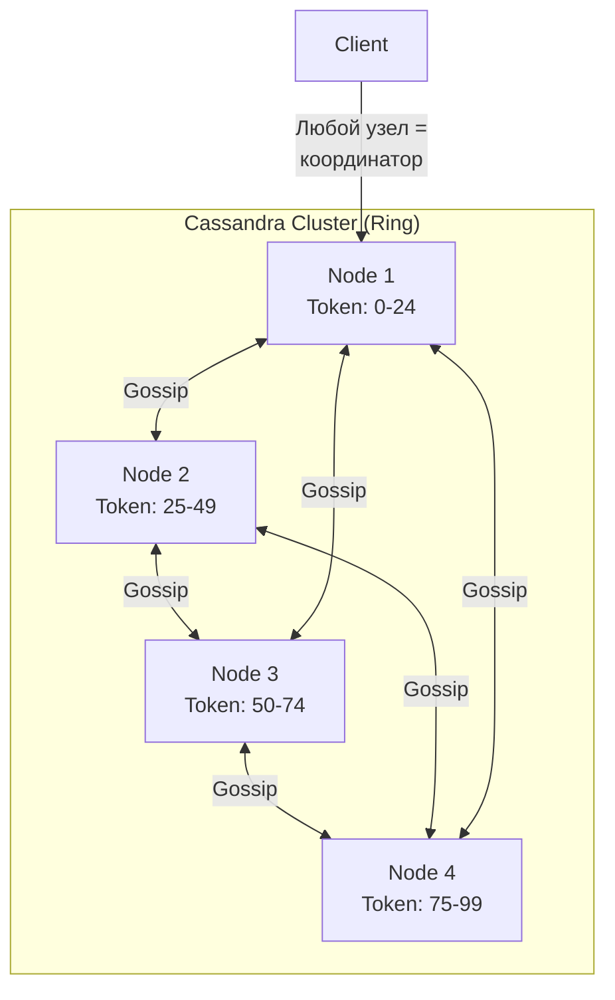

Кольцо узлов и Gossip-связи (любой узел = координатор):

```
                        Cassandra Cluster (Ring)

                       ┌──────────────────┐
                       │ Node 1           │
        Client ──────▶ │ Token: 0-24      │ ◀── "Любой узел =
       (запрос на         └──┬────────────┬──┘      координатор"
        любой узел)          │            │
                    Gossip   │            │   Gossip
                       ┌─────┴──┐      ┌──┴─────┐
                       │ Node 2 │◀────▶│ Node 4 │
                       │ 25-49  │Gossip│ 75-99  │
                       └────┬───┘      └───┬────┘
                            │   Gossip     │
                       ┌────┴───┐          │
                       │ Node 3 │◀─────────┘
                       │ 50-74  │  Gossip (накрест N1↔N3)
                       └────────┘

  Кольцо: N1 ◀──Gossip──▶ N2 ◀──▶ N3 ◀──▶ N4 ◀──▶ N1
  Накрест: N1 ◀──▶ N3,  N2 ◀──▶ N4
```

**Основные компоненты кластера:**

| Компонент | Описание |
|-----------|----------|
| `Node` | Один экземпляр Cassandra, хранящий часть данных |
| `Rack` | Логическая группа узлов (обычно — стойка в ДЦ) |
| `Data Center` | Набор rack-ов, обычно соответствует физическому ДЦ |
| `Cluster` | Полный набор узлов, реплицирующих данные |
| `Coordinator` | Узел, принявший запрос клиента и координирующий ответ |

**Роль координатора.** Координатором становится тот узел, на который клиент прислал запрос — выделенной роли тут нет. Он по `partition key` вычисляет, какие узлы хранят нужные данные, пересылает запрос этим репликам и собирает их ответы. Сколько ответов ждать перед тем, как ответить клиенту, диктует заданный `Consistency Level`.

## Q3. (!) Что такое `Gossip`-протокол?

**Gossip** — peer-to-peer протокол, которым узлы кластера `Cassandra` распространяют друг о друге информацию о состоянии. Раз в секунду каждый узел выбирает 1–3 случайных соседа и обменивается с ними тем, что знает о себе и об остальных. За счёт случайного выбора и эпидемического распространения сведения о любом изменении доходят до всего кластера за логарифмическое число раундов — без центрального реестра узлов.

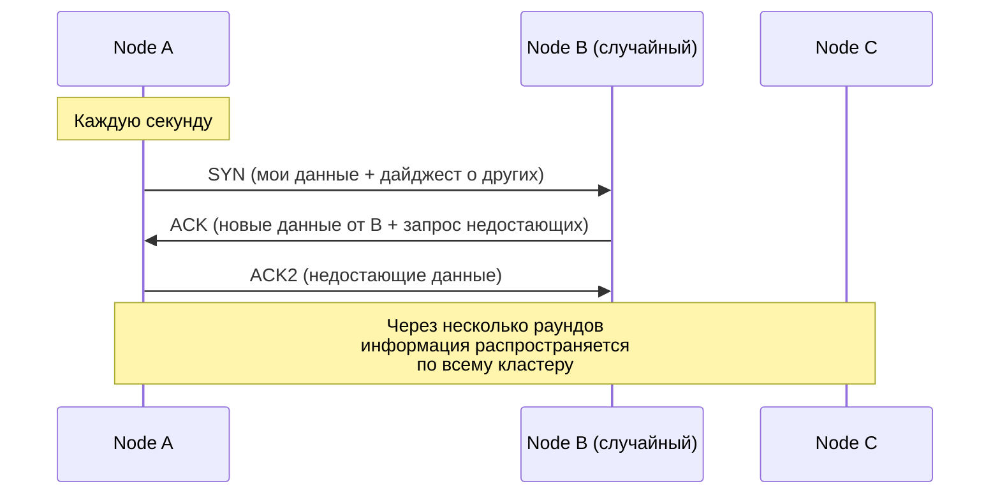

Обмен дайджестами (три рукопожатия SYN/ACK/ACK2):

```
   Node A          Node B (случайный)        Node C
     │                    │                    │
     │  ── каждую секунду ──                   │
     │  SYN (мои данные + ──────▶│             │
     │  дайджест о других)       │             │
     │             ◀──────── ACK │             │
     │     (новые данные от B +  │             │
     │      запрос недостающих)  │             │
     │  ACK2 ───────────────────▶│             │
     │  (недостающие данные)     │             │
     │                    │                    │
     └─ через несколько раундов информация ────┘
        распространяется по всему кластеру
```

**Что передаётся через Gossip:**
- Состояние узла (UP / DOWN)
- Нагрузка на узел (load)
- Схема данных (schema version)
- Token ranges
- Информация о датацентре и rack

**Обнаружение отказов.** Cassandra не считает узел мёртвым по факту одного пропущенного heartbeat. Вместо этого `Phi Accrual Failure Detector` анализирует историю интервалов между heartbeat-ами и выдаёт не «да/нет», а непрерывную меру подозрения φ — чем дольше нет вестей относительно обычного ритма, тем выше φ. Узел признаётся отказавшим, когда φ превышает порог `phi_convict_threshold` (в `cassandra.yaml`). Такой подход адаптируется к нестабильной сети и реже даёт ложные срабатывания, чем фиксированный таймаут.

## Q4. Что такое `Snitch` и какие типы существуют?

**Snitch** сообщает Cassandra топологию кластера — к какому датацентру и rack-у относится каждый узел. Зачем это нужно: зная топологию, Cassandra раскладывает реплики по разным rack-ам (чтобы отказ одной стойки не унёс сразу все копии данных) и направляет запросы к ближайшим узлам (меньше задержка). Без правильного snitch реплики могут оказаться на одной стойке, а запросы — ходить через полкластера.

**Основные типы:**

| Snitch | Описание |
|--------|----------|
| `SimpleSnitch` | Один ДЦ, один rack — для разработки |
| `GossipingPropertyFileSnitch` | Читает ДЦ/rack из `cassandra-rackdc.properties`, рекомендуется для production |
| `PropertyFileSnitch` | Читает топологию из файла `cassandra-topology.properties` |
| `Ec2Snitch` | Для AWS: region = DC, availability zone = rack |
| `GoogleCloudSnitch` | Для GCP: project = DC, zone = rack |

Пример `cassandra-rackdc.properties`:

```properties
dc=dc-moscow
rack=rack1
```

## Q5. Как работает `Consistent Hashing` в `Cassandra`?

`Consistent Hashing` — механизм, который решает, на каком узле лежит каждая партиция, и при этом минимизирует переезд данных при изменении состава кластера. Хэш-пространство представляется в виде кольца (диапазон от -2^63 до 2^63-1), и каждому узлу назначается один или несколько **token** — позиций на этом кольце.

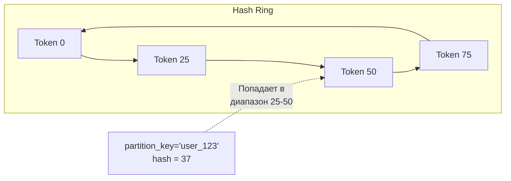

Кольцо токенов и попадание ключа в диапазон:

```
   Hash Ring (замкнутое кольцо)

   ┌─ Token 0 ──▶ Token 25 ──▶ Token 50 ──▶ Token 75 ─┐
   │                                                  │
   └──────────────────◀───────────────────────────────┘

        partition_key='user_123'
        hash = 37
              │
              ▼  попадает в диапазон 25-50
           Token 50   ◀── отвечает за ключ
```

**Алгоритм:**
1. Значение `partition_key` хэшируется функцией `Murmur3` (по умолчанию)
2. Полученный хэш определяет позицию на кольце
3. Данные записываются на узел, ответственный за следующий по часовой стрелке токен
4. Реплики размещаются на следующих узлах по кольцу (по стратегии репликации)

**Зачем именно так.** При добавлении или удалении узла «переезжает» только тот диапазон токенов, за который теперь отвечает новый сосед, — а не все ключи кластера, как было бы при обычном `hash(key) % N`. Поэтому масштабирование обходится дёшево: перемещается лишь небольшая доля данных.

## Q6. Что такое `Virtual Nodes` (vnodes)?

**Vnodes** — механизм, при котором один физический узел отвечает не за один большой диапазон кольца, а за множество мелких, разбросанных по кольцу. По умолчанию `num_tokens = 256` (настраивается в `cassandra.yaml`).

**Зачем это нужно:**
- **Равномернее распределение данных.** Один большой диапазон легко получается «толстым» и создаёт перекос; много мелких диапазонов усредняют нагрузку.
- **Быстрее ребалансировка.** Когда новый узел забирает по кусочку у многих соседей сразу, поток данных идёт параллельно от множества источников, а не от двух соседей по кольцу.
- **Ребалансировка автоматическая** — не нужно вручную пересчитывать границы токенов.
- **Учёт разной мощности узлов:** более мощному узлу можно дать больше токенов, и он возьмёт пропорционально больше данных.

**Без vnodes** при добавлении узла токены приходится рассчитывать вручную и двигать командой `nodetool move` — медленно и чревато ошибками.

## Q7. (!) Какую модель данных использует `Cassandra`?

`Cassandra` использует модель **wide-column store** (хранилище широких столбцов). Внешне это таблицы со строками и столбцами, но устроены они под распределённое хранение, поэтому отличаются от реляционных БД:

- Каждая строка может иметь **свой набор столбцов** — отсутствующие просто не хранятся (это не `NULL`-ячейка).
- Строки группируются в **партиции** по `partition key`, и партиция — это единица размещения: вся она целиком живёт на одном наборе реплик.
- Внутри партиции строки физически упорядочены по `clustering key` — отсюда дешёвые диапазонные выборки и сортировка по этому ключу.
- Нет JOIN и нет ссылочной целостности (referential integrity) — связи и согласованность обеспечивает приложение.
- Схема гибкая: добавление столбца не требует переписывать существующие строки.

**Иерархия структур данных:**

```
Cluster
  └── Keyspace (аналог schema/database)
       └── Table (аналог таблицы)
            └── Partition (группа строк с одним partition key)
                 └── Row (одна строка, определяется clustering key)
                      └── Column (пара name:value с timestamp)
```

**Пример создания keyspace и таблицы:**

```cql
CREATE KEYSPACE IF NOT EXISTS ecommerce
  WITH replication = {
    'class': 'NetworkTopologyStrategy',
    'dc-moscow': 3,
    'dc-spb': 2
  };

CREATE TABLE ecommerce.orders (
    user_id    UUID,
    order_date TIMESTAMP,
    order_id   UUID,
    total      DECIMAL,
    status     TEXT,
    PRIMARY KEY ((user_id), order_date, order_id)
) WITH CLUSTERING ORDER BY (order_date DESC, order_id ASC);
```

## Q8. (!) Что такое `Primary Key`, `Partition Key` и `Clustering Key`?

`Primary Key` в `Cassandra` делает сразу два дела: гарантирует уникальность строки и определяет, **где** и **как** данные лежат физически. Он состоит из двух частей — `Partition Key` (на каком узле) и `Clustering Key` (в каком порядке внутри партиции). Понимание этого разделения — ключ к правильному моделированию.

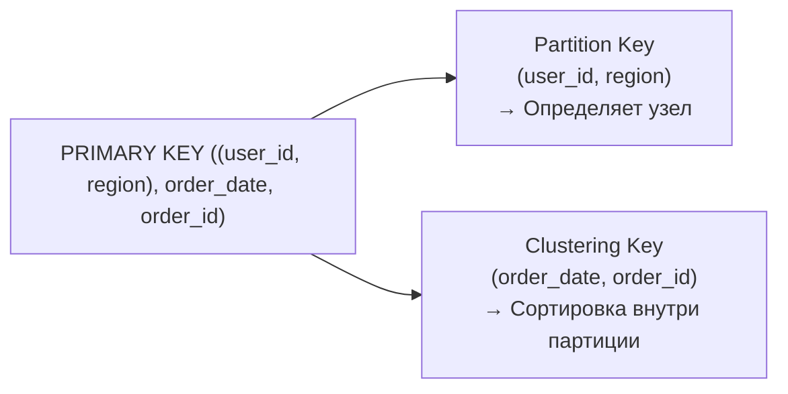

Как Primary Key распадается на две роли:

```
   ┌──────────────────────────────────────────────────────┐
   │ PRIMARY KEY ((user_id, region), order_date, order_id) │
   └───────────────────────┬──────────────────────────────┘
                ┌──────────┴──────────┐
                ▼                     ▼
   ┌────────────────────┐  ┌────────────────────────┐
   │ Partition Key      │  │ Clustering Key         │
   │ (user_id, region)  │  │ (order_date, order_id) │
   │ → Определяет узел   │  │ → Сортировка внутри    │
   │                    │  │   партиции             │
   └────────────────────┘  └────────────────────────┘
```

| Понятие | Назначение | Пример |
|---------|-----------|--------|
| `Partition Key` | Определяет, на каком узле хранятся данные (хэшируется через `Murmur3`) | `(user_id)` или `(user_id, region)` |
| `Clustering Key` | Определяет порядок строк внутри партиции | `order_date DESC` |
| `Primary Key` | `Partition Key` + `Clustering Key` — уникально идентифицирует строку | `((user_id), order_date, order_id)` |

**Варианты Primary Key:**

```cql
-- 1. Простой PK (одна колонка = partition key, нет clustering)
PRIMARY KEY (user_id)

-- 2. Составной PK (partition key + clustering key)
PRIMARY KEY (user_id, created_at)

-- 3. Composite Partition Key (несколько колонок в partition key)
PRIMARY KEY ((user_id, region), created_at, event_id)
```

**Правила выбора Partition Key:**
- **Высокая кардинальность** (много уникальных значений) — иначе данные собьются в несколько огромных партиций на немногих узлах.
- **Равномерное распределение запросов** — чтобы не возникало горячих партиций, к которым идёт непропорционально много трафика.
- **Размер партиции** держать < 100 MB и < 100 000 строк (рекомендация) — большие партиции тормозят чтение и создают давление на GC.

## Q9. (!) Как правильно моделировать данные в `Cassandra`?

Главное правило: в `Cassandra` моделируют **от запросов, а не от сущностей** (query-driven design). В реляционной БД сначала нормализуют сущности, а запросы пишут потом; здесь наоборот — сначала выписывают все запросы приложения, а затем под каждый проектируют отдельную таблицу. Причина в том, что эффективно читать можно только по ключу партиции, поэтому структура таблицы обязана повторять форму запроса. Подробнее о проектировании распределённых систем — в [вопросах по распределённым системам](../architecture/distributed-systems-interview.md).

**Принципы моделирования:**

1. **Одна таблица — один запрос** (денормализация)
2. **Partition Key** соответствует WHERE-условию запроса
3. **Clustering Key** определяет сортировку результата
4. Дублирование данных — норма, а не проблема
5. Избегать больших партиций (> 100 MB)

**Пример: пользователь и его заказы**

```cql
-- Запрос: "Показать последние 20 заказов пользователя"
CREATE TABLE orders_by_user (
    user_id    UUID,
    order_date TIMESTAMP,
    order_id   UUID,
    total      DECIMAL,
    items      LIST<FROZEN<order_item>>,
    PRIMARY KEY ((user_id), order_date)
) WITH CLUSTERING ORDER BY (order_date DESC);
```

```cql
-- Запрос: "Показать заказы по статусу за период"
CREATE TABLE orders_by_status (
    status     TEXT,
    order_date TIMESTAMP,
    order_id   UUID,
    user_id    UUID,
    total      DECIMAL,
    PRIMARY KEY ((status), order_date, order_id)
) WITH CLUSTERING ORDER BY (order_date DESC);
```

**Подводные камни:**
- `ALLOW FILTERING` — заставляет сканировать партиции по всему кластеру; в production почти всегда сигнал о неправильной модели.
- Слишком низкокардинальный `partition key` — все данные оседают на одном-двух узлах, остальной кластер простаивает.
- Слишком большие партиции — горячие точки (hot spots) и риск `OutOfMemory` при чтении/компакции.
- Моделирование «как в PostgreSQL» с нормализацией — без JOIN это вырождается в множество последовательных запросов.

## Q10. Какие факторы влияют на равномерное распределение данных?

Равномерность распределения определяется в первую очередь выбором ключа партиции, но не только им. На что смотреть:

1. **Кардинальность Partition Key.** Берите высококардинальные значения (`UUID`, `user_id`), а не низкокардинальные (статус, страна): мало уникальных значений → мало партиций → перекос по узлам.
2. **Размер партиции** — < 100 MB и < 100 000 строк: даже при хорошем ключе одна растущая партиция превращается в горячую точку.
3. **Partitioner** — `Murmur3Partitioner` (по умолчанию) равномерно «размазывает» хэши ключей по кольцу.
4. **Vnodes** — много мелких диапазонов на узел сглаживают неравномерность распределения токенов.
5. **Паттерн запросов** — равномерные данные ещё не гарантируют равномерную нагрузку: если 90% трафика бьёт в 10% ключей, эти партиции станут горячими.

**Пример hot spot:** если `partition_key = country_code`, то партиция `RU` будет в разы больше партиции `KZ`. Решение — добавить `bucket` (например, день или hash):

```cql
-- Плохо: hot spot на популярных странах
PRIMARY KEY (country_code, event_time)

-- Хорошо: bucket по дню для распределения
PRIMARY KEY ((country_code, event_day), event_time)
```

## Q11. Что такое `Wide Rows` и какие ограничения на размер партиции?

**Wide Row** (широкая строка) — партиция, содержащая много строк (различающихся по clustering key). Все строки одной партиции хранятся на диске рядом, на одном наборе реплик — именно поэтому диапазонное чтение внутри партиции дешёвое, но и именно поэтому слишком толстая партиция опасна.

**Ограничения:**
- **Теоретический лимит** — ~2 млрд ячеек на партицию.
- **Практический лимит** — около **100 MB** на партицию (рекомендация DataStax); это ориентир, при котором операции остаются предсказуемо быстрыми.
- **Чем грозит превышение:** медленные чтения (нужно поднять с диска всю партицию целиком), давление на GC и тяжёлая компакция, потому что партиция не дробится между узлами.

**Борьба с большими партициями — bucketing:**

```cql
-- Вместо одной партиции на user_id навсегда:
PRIMARY KEY ((user_id), event_time)

-- Разбиваем по месяцу:
PRIMARY KEY ((user_id, month), event_time)
```

## Q12. (!) Основные команды `CQL`

`CQL` (`Cassandra Query Language`) — SQL-подобный язык запросов. Основные отличия от SQL: нет JOIN, нет подзапросов, WHERE ограничен по ключам.

**DDL:**

```cql
-- Keyspace
CREATE KEYSPACE shop WITH replication = {
  'class': 'NetworkTopologyStrategy', 'dc1': 3
};

-- Таблица
CREATE TABLE shop.products (
    category TEXT,
    product_id UUID,
    name TEXT,
    price DECIMAL,
    tags SET<TEXT>,
    PRIMARY KEY ((category), product_id)
);

-- Индекс
CREATE INDEX ON shop.products (name);

-- Изменение таблицы
ALTER TABLE shop.products ADD description TEXT;

-- Удаление
DROP TABLE IF EXISTS shop.products;
```

**DML:**

```cql
-- Вставка (INSERT = UPSERT в Cassandra)
INSERT INTO shop.products (category, product_id, name, price, tags)
VALUES ('electronics', uuid(), 'Laptop', 999.99, {'new', 'sale'})
USING TTL 86400;

-- Чтение
SELECT * FROM shop.products
WHERE category = 'electronics'
AND product_id = some_uuid;

-- Обновление
UPDATE shop.products
SET price = 899.99, tags = tags + {'discount'}
WHERE category = 'electronics' AND product_id = some_uuid;

-- Удаление
DELETE FROM shop.products
WHERE category = 'electronics' AND product_id = some_uuid;

-- Пакетная операция
BEGIN BATCH
  INSERT INTO shop.products (...) VALUES (...);
  INSERT INTO shop.products (...) VALUES (...);
APPLY BATCH;
```

**Важные особенности:**
- `INSERT` и `UPDATE` — по сути одно и то же (upsert)
- `DELETE` создаёт tombstone, а не сразу удаляет
- `WHERE` может содержать только ключевые колонки (partition key обязателен)
- `ALLOW FILTERING` — позволяет запросы без ключа, но **крайне неэффективно** в production

## Q13. Что такое `Secondary Index` и когда его использовать?

**Secondary Index** (SI) позволяет фильтровать по не-ключевой колонке без `ALLOW FILTERING`. Важно понимать его природу: индекс локальный — он строится на каждом узле для его собственных данных, поэтому запрос по SI без ограничения партиции вынужден опросить все узлы (scatter-gather). Отсюда и его сильные и слабые стороны.

```cql
CREATE INDEX idx_email ON users (email);

SELECT * FROM users WHERE email = 'user@example.com';
```

**Когда подходит:**
- Колонка низкой кардинальности (статусы, типы) — индекс остаётся компактным.
- Фильтрация уже сужена партицией (`WHERE partition_key = ? AND indexed_col = ?`) — тогда scatter-gather не нужен.
- Это вторичный, редкий путь доступа, а не основной.

**Когда не подходит:**
- Высокая кардинальность (`email`, `UUID`) — запрос превращается в scatter-gather по всему кластеру.
- High-throughput запросы — каждый такой запрос дёргает все узлы, latency растёт под нагрузкой.
- Как подмена правильному моделированию — индекс не спасёт плохую схему.

**Альтернативы:**
- **SASI** (`SSTable Attached Secondary Index`) — эффективнее для текстового поиска.
- **SAI** (`Storage Attached Index`, Cassandra 4.0+) — современный рекомендуемый индекс.
- **Отдельная таблица** с нужным partition key — предпочтительный вариант: это и есть «индекс по запросу», вписанный в модель данных.

## Q14. Что такое `Materialized Views`?

**Materialized View** (MV) — производная таблица, которую Cassandra сама поддерживает в актуальном состоянии: те же данные, что в базовой таблице, но с другим Primary Key. Идея — получить второй путь доступа к данным, не дублируя логику записи в приложении.

```cql
CREATE MATERIALIZED VIEW orders_by_status AS
    SELECT * FROM orders
    WHERE status IS NOT NULL AND order_id IS NOT NULL
    PRIMARY KEY (status, order_id);
```

**Плюсы:** синхронизация автоматическая, приложению не нужно дублировать запись в две таблицы.

**Минусы:**
- Задержка синхронизации — MV обновляется не мгновенно (eventual consistency).
- Дополнительная нагрузка на запись: каждое изменение базовой таблицы тянет за собой обновление вью.
- В ряде версий есть известные баги вплоть до потери данных.

**Рекомендация:** DataStax советует **избегать MV в production**; надёжнее завести денормализованную таблицу и писать в неё из приложения — медленнее в разработке, но предсказуемо.

## Q15. Как выполнять агрегации и аналитические запросы?

Коротко: `Cassandra` — **не OLAP-система**. Встроенные агрегаты (`COUNT`, `SUM`, `AVG`, `MIN`, `MAX`) считаются на координаторе и осмысленны только в пределах одной партиции; запрос «посчитай по всему кластеру» либо невозможен, либо упрётся в полное сканирование. Аналитику выносят наружу.

**Подходы к аналитике:**

1. **Предварительная агрегация** — заранее заведённые таблицы-счётчики, которые обновляются в момент записи; на чтении считать уже нечего.
2. **Apache Spark + Cassandra Connector** — batch- и streaming-аналитика поверх всего кластера.
3. **DSE Analytics** (коммерческая версия) — Spark, встроенный в дистрибутив.
4. **CDC (Change Data Capture)** → `Kafka` → аналитическая БД (`ClickHouse`, `Elasticsearch`): поток изменений уходит туда, где аналитика — родной сценарий.

```cql
-- Встроенная агрегация (только внутри партиции!)
SELECT COUNT(*), AVG(price) FROM orders
WHERE user_id = some_uuid;

-- User-Defined Aggregate (UDA) для кастомной логики
CREATE FUNCTION avg_state(state tuple<int, double>, val double)
  CALLED ON NULL INPUT RETURNS tuple<int, double>
  LANGUAGE java AS 'return state;';
```

## Q16. (!) Как работает путь записи (`Write Path`)?

Кратко: запись никогда не идёт точечной правкой данных на диске — она всегда дописывается последовательно (в лог и в память), а упорядочивание происходит позже. Это и есть `LSM-tree`, благодаря которому Cassandra так быстра на запись. Тема — одна из любимых на собеседованиях, поэтому важно знать цепочку шагов.

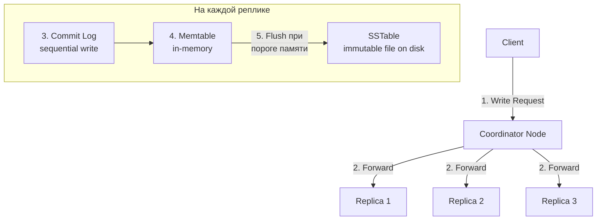

Схема пути записи:

```
   Client
     │ 1. Write Request
     ▼
   Coordinator Node
     │ 2. Forward
     ├──────────▶ Replica 1
     ├──────────▶ Replica 2
     └──────────▶ Replica 3

   На каждой реплике:
     3. Commit Log        4. Memtable          SSTable
     (sequential write) ──▶ (in-memory) ──────▶ (immutable file
                            5. flush при           on disk)
                            пороге памяти
```

**Шаги записи:**
1. Клиент отправляет запрос на **координатор**
2. Координатор определяет реплики и отправляет запрос
3. На каждой реплике запись идёт в **Commit Log** (WAL, sequential I/O — быстро)
4. Данные записываются в **Memtable** (in-memory)
5. Когда Memtable заполняется — **flush** на диск в **SSTable** (immutable)
6. Координатор отвечает клиенту после получения подтверждений от нужного числа реплик (по `Consistency Level`)

**Ключевые свойства (и почему они связаны):**
- Запись — **всегда последовательный I/O** (Commit Log + Memtable), без случайного доступа к диску; отсюда высокая скорость.
- SSTable **неизменяемы** (immutable): однажды записанный файл больше не правится.
- Поэтому **обновление** — это не правка на месте, а новая запись с бо́льшим timestamp; актуальная версия выбирается при чтении.
- А **удаление** — это тоже запись, но особого маркера-tombstone; физически данные исчезнут только при компакции.

## Q17. (!) Как работает путь чтения (`Read Path`)?

Чтение в `Cassandra` дороже записи, и причина прямо вытекает из пути записи: одна и та же строка может быть размазана по нескольким `SSTable` плюс свежая версия в `Memtable`. Чтобы вернуть актуальное значение, движок должен найти все её фрагменты и слить их по timestamp — а чтобы не сканировать лишние файлы, на каждом шаге работают фильтры и кэши.

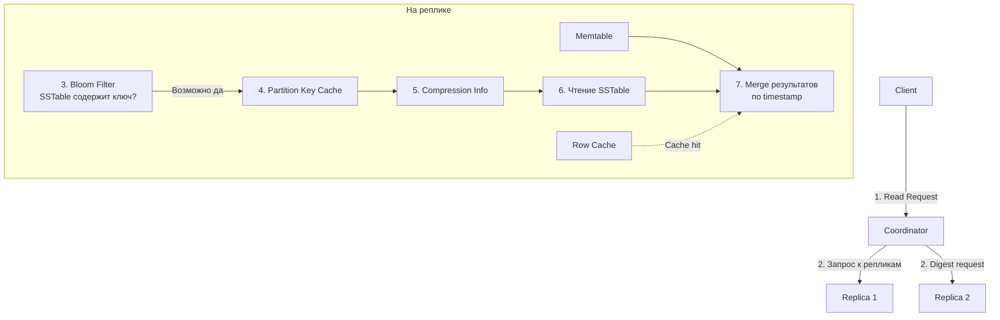

Схема пути чтения:

```
   Client
     │ 1. Read Request
     ▼
   Coordinator
     ├─ 2. запрос к репликам ──▶ Replica 1
     └─ 2. digest request ─────▶ Replica 2

   На реплике:
     3. Bloom Filter ──"возможно да"──▶ 4. Partition Key Cache
        (SSTable содержит ключ?)              │
                                              ▼
                                       5. Compression Info
                                              │
                                              ▼
                                       6. Чтение SSTable ──┐
                                                           ▼
     Memtable ───────────────────────────▶ 7. Merge результатов
     Row Cache ··"cache hit"·············▶    по timestamp
```

**Шаги чтения:**
1. Координатор определяет реплики и отправляет запросы
2. Полный запрос — к ближайшей реплике, digest — к остальным (для сверки)
3. **Bloom Filter** — вероятностная структура, быстро исключает SSTables, не содержащие ключ
4. **Partition Key Cache** — кэш смещений ключей на диске
5. Чтение из **SSTable** + **Memtable** + merge по timestamp (latest wins)
6. При расхождении digest — **Read Repair**

**Оптимизации:**
- **Key Cache** — кэш позиций ключей в SSTable
- **Row Cache** — кэш целых строк (для hot data)
- **Bloom Filter** — false positive rate настраивается (`bloom_filter_fp_chance`)

## Q18. Что такое `Tombstone` и как они влияют на производительность?

**Tombstone** («надгробие») — маркер, которым Cassandra помечает удаление. Прямого удаления здесь быть не может: SSTable неизменяемы, поэтому «стереть» строку нельзя — вместо этого пишется tombstone, который при чтении перекрывает старое значение. Физически и строка, и сам tombstone исчезают только при компакции.

```cql
-- Эта операция создаёт tombstone
DELETE FROM orders WHERE user_id = ? AND order_id = ?;

-- TTL-expired данные тоже становятся tombstones
INSERT INTO events (...) VALUES (...) USING TTL 3600;
```

**Жизненный цикл tombstone:**
1. `DELETE` → создаётся tombstone с timestamp
2. Tombstone реплицируется на все реплики
3. По прошествии `gc_grace_seconds` (по умолчанию 10 дней) tombstone может быть удалён при компакции

**Подводные камни:**
- Накопившиеся tombstone замедляют чтение: чтобы понять, что строка удалена, движок всё равно должен просканировать эти маркеры.
- При > 100 000 tombstone, просмотренных за один запрос, прилетает `TombstoneOverwhelmingException` — запрос падает.
- Частые `DELETE` + `INSERT` по одному ключу — классический анти-паттерн: tombstone копятся быстрее, чем компакция их убирает.

**Что делать:**
- Проектировать модель так, чтобы `DELETE` было как можно меньше.
- Где возможно — заменять явный `DELETE` на `TTL` (данные истекают сами).
- Аккуратно настраивать `gc_grace_seconds`: слишком маленький — и удалённые данные могут «воскреснуть», если до их зачистки не прошёл repair.

## Q19. Как работает механизм сжатия данных (`Compression`)?

`Cassandra` поддерживает прозрачное сжатие данных на уровне `SSTable`.

```cql
CREATE TABLE logs (...)
WITH compression = {
  'class': 'LZ4Compressor',    -- алгоритм
  'chunk_length_in_kb': 64      -- размер блока
};
```

**Поддерживаемые алгоритмы:**

| Алгоритм | Характеристика |
|----------|---------------|
| `LZ4Compressor` | Быстрый, умеренное сжатие (по умолчанию) |
| `SnappyCompressor` | Быстрый, немного лучше сжатие |
| `DeflateCompressor` | Медленнее, лучшее сжатие |
| `ZstdCompressor` | Хорошее сжатие + скорость (Cassandra 4.0+) |
| `NoopCompressor` | Без сжатия |

Данные сжимаются блоками (по умолчанию 64 KB) — чтение одного значения требует распаковки только одного блока. Сжатие снижает I/O за счёт CPU. Для SSD-дисков часто предпочтительнее `LZ4` из-за минимальной латентности.

## Q20. (!) Что такое `Replication` и какие стратегии существуют?

**Репликация** — это сколько копий каждой записи Cassandra держит на разных узлах. Чем больше копий, тем выше отказоустойчивость и доступность: данные переживают падение узлов и остаются читаемыми. Число копий задаёт фактор репликации (`RF`) на уровне keyspace, а **стратегия** решает, на какие именно узлы эти копии лягут.

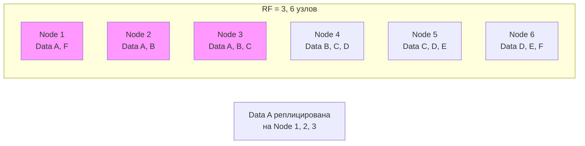

Раскладка реплик по кольцу (RF = 3, 6 узлов):

```
   RF = 3, 6 узлов — каждый кусок данных лежит на 3 узлах подряд

   ┌────────────┐  ┌────────────┐  ┌────────────┐
   │ Node 1     │  │ Node 2     │  │ Node 3     │
   │ Data A, F  │  │ Data A, B  │  │ Data A,B,C │
   └────────────┘  └────────────┘  └────────────┘
   ┌────────────┐  ┌────────────┐  ┌────────────┐
   │ Node 4     │  │ Node 5     │  │ Node 6     │
   │ Data B,C,D │  │ Data C,D,E │  │ Data D,E,F │
   └────────────┘  └────────────┘  └────────────┘

   Data A реплицирована на Node 1, 2, 3
```

**Стратегии репликации:**

| Стратегия | Описание | Использование |
|-----------|----------|---------------|
| `SimpleStrategy` | Реплики на следующих по кольцу узлах | Только для одного ДЦ, разработки |
| `NetworkTopologyStrategy` | RF задаётся per-DC, учитывает rack-и | **Production**, multi-DC |

```cql
-- SimpleStrategy (НЕ для production)
CREATE KEYSPACE dev_keyspace WITH replication = {
  'class': 'SimpleStrategy',
  'replication_factor': 3
};

-- NetworkTopologyStrategy (рекомендуется)
CREATE KEYSPACE prod_keyspace WITH replication = {
  'class': 'NetworkTopologyStrategy',
  'dc-moscow': 3,
  'dc-spb': 2
};
```

**Рекомендация:** RF = 3 на датацентр — позволяет пережить потерю одного узла при `QUORUM` чтении/записи.

## Q21. (!) Какие уровни консистентности (`Consistency Levels`) существуют?

`Consistency Level` (CL) задаёт, сколько реплик должны подтвердить операцию, чтобы она считалась успешной. По сути это ручка баланса: больше реплик в ответе — выше согласованность, но выше задержка и ниже доступность (достаточно потерять чуть больше узлов, и кворум не собрать). В этом и суть **tunable consistency** — крутить ручку можно для каждого запроса (подробнее в [CAP-теореме](../architecture/cap-theorem-interview.md)).

| CL | Запись: сколько подтверждений | Чтение: сколько ответов | Когда использовать |
|----|------------------------------|------------------------|--------------------|
| `ANY` | 1 (включая hinted handoff) | — | Максимальная доступность записи |
| `ONE` | 1 реплика | 1 реплика | Низкая латентность, eventual consistency |
| `TWO` | 2 реплики | 2 реплики | Компромисс |
| `QUORUM` | ⌊RF/2⌋ + 1 | ⌊RF/2⌋ + 1 | Strong consistency при R+W > N |
| `LOCAL_QUORUM` | Кворум в локальном ДЦ | Кворум в локальном ДЦ | **Production multi-DC** |
| `EACH_QUORUM` | Кворум в каждом ДЦ | — | Строгая консистентность cross-DC |
| `ALL` | Все реплики | Все реплики | Максимальная консистентность, минимальная доступность |

**Типичная production-конфигурация:** `LOCAL_QUORUM` для чтения и записи с RF = 3.

## Q22. (!) Что означает формула `R + W > N`?

Это условие, при котором чтение гарантированно увидит последнюю запись (strong consistency). Логика простая: если множество реплик, подтвердивших запись (W), и множество реплик, опрошенных при чтении (R), вместе превышают общее число копий (N), то эти множества обязаны пересечься хотя бы на одной реплике — а значит, чтение наткнётся на самую свежую версию.

- **R** — сколько реплик опрашивается при чтении;
- **W** — сколько реплик подтверждает запись;
- **N** — фактор репликации (всего копий).

```
RF = 3
QUORUM = ⌊3/2⌋ + 1 = 2

Write QUORUM (W=2) + Read QUORUM (R=2) = 4 > 3 (N)
→ Гарантия: хотя бы одна реплика содержит latest данные
```

**Примеры:**

| Конфигурация | R + W > N? | Консистентность |
|--------------|-----------|-----------------|
| W=QUORUM, R=QUORUM | 2+2=4 > 3 | Strong |
| W=ALL, R=ONE | 3+1=4 > 3 | Strong |
| W=ONE, R=ONE | 1+1=2 < 3 | Eventual |
| W=ONE, R=ALL | 1+3=4 > 3 | Strong |

## Q23. Что такое `Hinted Handoff`?

**Hinted Handoff** — способ не потерять запись, когда одна из реплик временно недоступна. Координатор откладывает «подсказку» (hint) для упавшего узла и доставляет её, как только тот вернётся, чтобы реплика быстро догнала остальных без полного repair.

**Как работает:**
1. Координатор пытается записать данные на реплику, но она недоступна
2. Координатор сохраняет **hint** (подсказку) локально
3. Когда реплика восстанавливается, координатор передаёт накопленные hints
4. Hint хранится ограниченное время (`max_hint_window` = 3 часа по умолчанию)

**Подводные камни:**
- Не заменяет полноценный `repair` — это лишь страховка на короткие простои.
- При долгом простое реплики hints истекают по `max_hint_window`, и тогда наверстать пропущенное сможет только repair.
- CL = `ANY` позволяет засчитать сам факт записи hint как подтверждение записи — опасно: данных ещё нет ни на одной реплике, и при потере координатора они исчезнут.

**Настройка в `cassandra.yaml`:**
```yaml
hinted_handoff_enabled: true
max_hint_window_in_ms: 10800000  # 3 часа
```

## Q24. Что такое `Read Repair`?

**Read Repair** — попутное лечение рассогласований: раз уж координатор всё равно опрашивает несколько реплик при чтении, он заодно сверяет их ответы и подтягивает отстающие до актуальной версии. То есть данные чинятся в тот момент, когда их читают.

**Как работает:**
1. Координатор запрашивает данные у нескольких реплик
2. Сравнивает ответы (digest или полные данные)
3. Если ответы расходятся — отправляет актуальную версию (по timestamp) на отстающие реплики

**Типы:**
- **Blocking Read Repair** — координатор ждёт исправления перед ответом клиенту (при CL > ONE)
- **Background Read Repair** — исправление после ответа клиенту (настраивается `read_repair_chance`, в Cassandra 4.0+ убран)

## Q25. (!) Что такое `Anti-Entropy Repair` и зачем он нужен?

**Repair** (`nodetool repair`) — плановая полная сверка и синхронизация данных между репликами. Это «капитальный ремонт» согласованности, который закрывает дыры, оставленные более лёгкими механизмами.

**Зачем нужен** (он чинит то, что не покрывают остальные):
- Hinted handoff страхует только короткие простои — после долгого падения узла подсказки истекают.
- Read Repair лечит лишь те данные, которые кто-то читает; холодные данные так и останутся рассогласованными.
- Без регулярного repair накапливается риск отдать устаревшую версию.
- Критично с tombstone: по истечении `gc_grace_seconds` их удаляют, и если до этого repair не разнёс факт удаления по всем репликам, удалённые данные могут «воскреснуть».

**Типы repair:**
- **Full repair** — сравнивает все данные через `Merkle Tree`
- **Incremental repair** — только данные, изменённые с последнего repair
- **Subrange repair** — repair части token range

**Рекомендации:**
- Запускать repair минимум раз в `gc_grace_seconds` (по умолчанию 10 дней)
- Использовать инструменты автоматизации: `Reaper` (от DataStax)
- Планировать repair в периоды низкой нагрузки

```bash
# Full repair keyspace
nodetool repair ecommerce

# Incremental repair
nodetool repair -inc ecommerce

# Repair конкретной таблицы
nodetool repair ecommerce orders
```

## Q26. (!) Какие стратегии компакции (`Compaction`) существуют?

**Compaction** — фоновое слияние нескольких `SSTable` в один: оно выкидывает перекрытые старые версии и просроченные tombstone и тем самым ускоряет чтение (меньше файлов придётся объединять). Это плата за то, что запись неизменяема и плодит всё новые SSTable. Стратегия компакции выбирается под профиль нагрузки — это её и спрашивают на собеседовании.

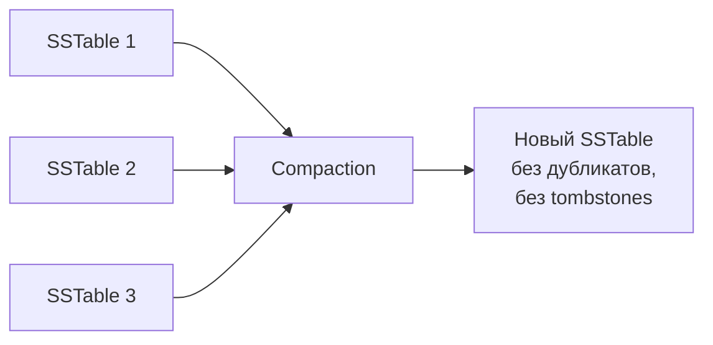

```
   SSTable 1 ──┐
   SSTable 2 ──┼──▶ Compaction ──▶ Новый SSTable
   SSTable 3 ──┘                   (без дубликатов,
                                    без tombstones)
```

| Стратегия | Когда использовать | Характеристика |
|-----------|-------------------|----------------|
| `STCS` (SizeTiered) | **Write-heavy** нагрузка | Сливает SSTable похожего размера; может временно удвоить дисковое пространство |
| `LCS` (Leveled) | **Read-heavy** нагрузка | SSTable организованы по уровням; 90% чтений — 1 SSTable; больше I/O при записи |
| `TWCS` (TimeWindow) | **Time-series** данные | Группирует SSTable по временным окнам; эффективен с TTL |
| `UCS` (Unified, 4.0+) | Универсальная | Объединяет идеи STCS и LCS, автоадаптация |

```cql
-- Задание стратегии при создании таблицы
CREATE TABLE sensor_data (...)
WITH compaction = {
  'class': 'TimeWindowCompactionStrategy',
  'compaction_window_unit': 'DAYS',
  'compaction_window_size': 1
};

-- Изменение стратегии
ALTER TABLE orders WITH compaction = {
  'class': 'LeveledCompactionStrategy',
  'sstable_size_in_mb': 160
};
```

## Q27. Как управлять жизненным циклом данных через `TTL`?

**TTL** (`Time To Live`) — время жизни данных в секундах. По истечении TTL данные становятся tombstone и удаляются при компакции.

```cql
-- TTL на уровне записи
INSERT INTO sessions (session_id, user_id, data)
VALUES (uuid(), some_uuid, 'payload')
USING TTL 3600;  -- 1 час

-- TTL на уровне обновления
UPDATE sessions USING TTL 7200
SET data = 'updated'
WHERE session_id = some_uuid;

-- Проверить оставшийся TTL
SELECT TTL(data) FROM sessions WHERE session_id = some_uuid;

-- TTL по умолчанию для таблицы
CREATE TABLE temp_data (...)
WITH default_time_to_live = 86400;  -- 1 день
```

**Важно:**
- TTL = 0 означает "без TTL" (данные живут вечно)
- TTL нельзя задать для ключевых колонок (partition/clustering key)
- Expired TTL данные = tombstones → планируйте компакцию
- Для time-series с TTL рекомендуется `TWCS`

## Q28. (!) Что такое `Lightweight Transactions` (`LWT`)?

**LWT** (Lightweight Transactions) — условная запись с семантикой «прочитай-проверь-запиши» как единой атомарной операции (`compare-and-set`). Чтобы несколько узлов договорились о результате при конкурентных попытках, под капотом работает консенсус `Paxos`; это даёт линеаризуемость, но **только в пределах одной партиции** и ценой нескольких сетевых раундов.

```cql
-- Вставка только если записи нет (регистрация пользователя)
INSERT INTO users (user_id, email, name)
VALUES (uuid(), 'user@mail.ru', 'Иван')
IF NOT EXISTS;

-- Обновление с проверкой условия (оптимистичная блокировка)
UPDATE accounts
SET balance = 900
WHERE account_id = ?
IF balance = 1000;
```

**Результат операции LWT:**
```
 [applied] | balance
-----------+---------
     False |     500   -- условие не выполнено, текущее значение = 500
```

**Как работает LWT (Paxos):**

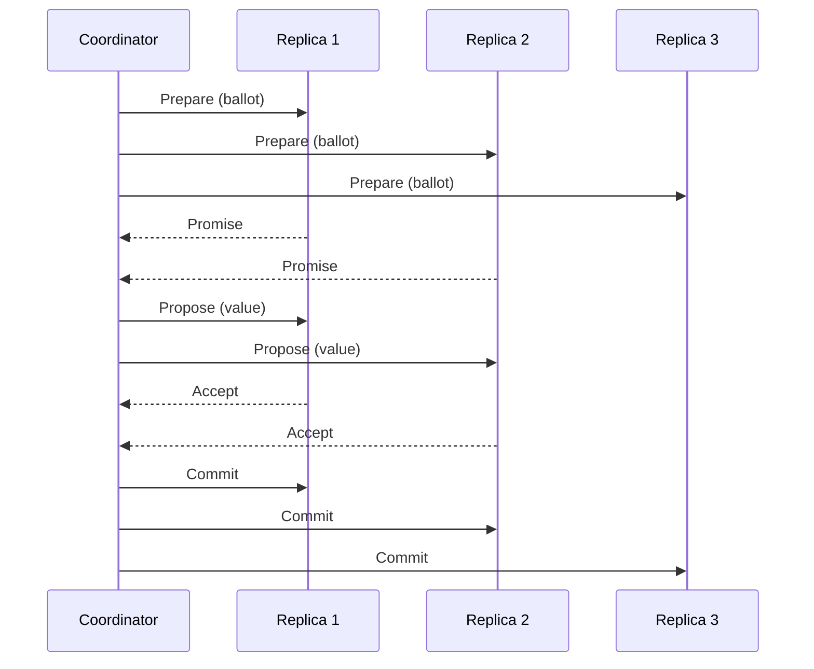

Обмен сообщениями Paxos:

```
 Coordinator      Replica 1     Replica 2     Replica 3
     │                │             │             │
     │ Prepare(ballot)│             │             │
     ├───────────────▶│             │             │
     ├──────────────────────────────▶             │
     ├────────────────────────────────────────────▶
     │       Promise  │             │             │
     │◀───────────────┤             │             │
     │◀─────────────────────────────┤             │
     │ Propose(value) │             │             │
     ├───────────────▶│             │             │
     ├──────────────────────────────▶             │
     │        Accept  │             │             │
     │◀───────────────┤             │             │
     │◀─────────────────────────────┤             │
     │ Commit         │             │             │
     ├───────────────▶│             │             │
     ├──────────────────────────────▶             │
     ├────────────────────────────────────────────▶
     │                │             │             │
```

**Подводные камни LWT:**
- Латентность в **4–6 раз выше** обычной записи — Paxos требует ~4 сетевых раунда вместо одного.
- Работает только в пределах **одной партиции** — распределённой транзакции на несколько партиций тут нет.
- Не место в горячих путях и массовых операциях — иначе кластер «встанет» на консенсусе.
- Нельзя смешивать LWT и обычные записи по одним и тем же данным: обычная запись идёт мимо Paxos, и возникает гонка (race condition).

## Q29. Что такое `Batch` и какие ограничения у `Batch`?

**Batch** — группировка нескольких CQL-операций в один запрос. Главное, что важно понимать на собеседовании: batch в Cassandra — **не про производительность и не транзакция в смысле RDBMS**. Он нужен ради атомарности группы операций; ускорения массовой записи он, наоборот, чаще вредит.

| Тип | Гарантия | Использование |
|-----|----------|---------------|
| `LOGGED` (по умолчанию) | Атомарность (все или ничего) | Операции в **разных** партициях (с overhead) |
| `UNLOGGED` | Нет атомарности | Операции в **одной** партиции (оптимально) |
| `COUNTER` | Для counter-таблиц | Только counter-операции |

```cql
-- UNLOGGED batch для одной партиции (рекомендуется)
BEGIN UNLOGGED BATCH
  INSERT INTO user_events (user_id, event_time, type)
  VALUES ('user1', now(), 'login');
  INSERT INTO user_events (user_id, event_time, type)
  VALUES ('user1', now(), 'page_view');
APPLY BATCH;
```

**Ограничения и анти-паттерны:**
- Размер batch ограничен (**~5 MB** по умолчанию) — большой batch отклоняется.
- LOGGED batch по разным партициям превращает координатор в **узкое место**: он один пишет batchlog и рассылает операции по всем затронутым узлам.
- Batch — **не транзакция** RDBMS: изоляции нет, промежуточные состояния могут быть видны другим читателям.
- Для массовой загрузки используйте **асинхронные одиночные записи** через пул (`executeAsync`), а не batch — так нагрузка равномерно распределится по координаторам.

## Q30. Как в `Cassandra` реализовать счётчики (`Counters`)?

**Counter** — особый тип колонки для атомарного инкремента и декремента. Он нужен потому, что обычная запись — это «перезаписать значение целиком», и при конкурентных `+1` от разных клиентов часть инкрементов терялась бы. Counter же передаёт серверу дельту, а не итог, поэтому параллельные приращения складываются корректно. За это приходится платить рядом жёстких ограничений.

```cql
CREATE TABLE page_views (
    page_url TEXT,
    date     DATE,
    views    COUNTER,
    PRIMARY KEY ((page_url), date)
);

-- Инкремент
UPDATE page_views SET views = views + 1
WHERE page_url = '/home' AND date = '2026-04-12';

-- Декремент
UPDATE page_views SET views = views - 5
WHERE page_url = '/home' AND date = '2026-04-12';
```

**Ограничения counter-таблиц:**
- В таблице допустимы **только counter-колонки и колонки ключа** — смешивать со обычными нельзя.
- Нет `INSERT` — только `UPDATE` с инкрементом/декрементом (счётчик стартует с нуля).
- Для counter-колонок недоступен TTL.
- Гарантия — eventual consistency: при конкурентных обновлениях возможна временная рассогласованность реплик.
- **Не для денег.** Counter не даёт строгой согласованности и идемпотентности повторов, поэтому для финансов используйте LWT или внешнюю транзакционную БД.

## Q31. (!) Как подключить `Spring Data Cassandra` к проекту?

**Spring Data Cassandra** — модуль Spring Data для работы с `Cassandra` через репозитории и `CassandraTemplate`. Подробнее о Spring Data — в [вопросах по Spring Data JPA](../frameworks/spring/spring-data-jpa-interview.md) (общие концепции репозиториев).

**Зависимость (Gradle):**

```groovy
implementation 'org.springframework.boot:spring-boot-starter-data-cassandra'
```

**Конфигурация `application.yml`:**

```yaml
spring:
  cassandra:
    keyspace-name: ecommerce
    contact-points: cassandra-node1,cassandra-node2,cassandra-node3
    port: 9042
    local-datacenter: dc-moscow
    schema-action: create_if_not_exists  # none для production
    request:
      timeout: 5s
      consistency: LOCAL_QUORUM
```

**Конфигурация через Java (для тонкой настройки):**

```java
@Configuration
@EnableCassandraRepositories
public class CassandraConfig extends AbstractCassandraConfiguration {

    @Override
    protected String getKeyspaceName() {
        return "ecommerce";
    }

    @Override
    protected String getContactPoints() {
        return "cassandra-node1";
    }

    @Override
    public SchemaAction getSchemaAction() {
        return SchemaAction.CREATE_IF_NOT_EXISTS;
    }
}
```

## Q32. Как определить `Entity` и `Repository` в `Spring Data Cassandra`?

**Entity (модель):**

```java
@Table("orders")
public class Order {

    @PrimaryKeyColumn(name = "user_id", ordinal = 0,
                       type = PrimaryKeyType.PARTITIONED)
    private UUID userId;

    @PrimaryKeyColumn(name = "order_date", ordinal = 1,
                       type = PrimaryKeyType.CLUSTERED,
                       ordering = Ordering.DESCENDING)
    private Instant orderDate;

    @PrimaryKeyColumn(name = "order_id", ordinal = 2,
                       type = PrimaryKeyType.CLUSTERED)
    private UUID orderId;

    @Column("total")
    private BigDecimal total;

    @Column("status")
    private String status;

    // getters, setters
}
```

**Repository:**

```java
public interface OrderRepository
        extends CassandraRepository<Order, UUID> {

    // Spring Data автоматически генерирует CQL
    List<Order> findByUserId(UUID userId);

    @Query("SELECT * FROM orders WHERE user_id = ?0 AND order_date > ?1")
    List<Order> findRecentOrders(UUID userId, Instant since);
}
```

**CassandraTemplate (для сложных запросов):**

```java
@Service
@RequiredArgsConstructor
public class OrderService {

    private final CassandraTemplate cassandraTemplate;

    public List<Order> findByUser(UUID userId) {
        return cassandraTemplate.select(
            Query.query(Criteria.where("user_id").is(userId))
                 .limit(20),
            Order.class
        );
    }

    public void saveWithTtl(Order order, int ttlSeconds) {
        InsertOptions options = InsertOptions.builder()
            .ttl(Duration.ofSeconds(ttlSeconds))
            .build();
        cassandraTemplate.insert(order, options);
    }
}
```

## Q33. Как `Cassandra Java Driver` работает с кластером?

**DataStax Java Driver** (v4.x) — основной драйвер для взаимодействия с `Cassandra` из Java.

**Ключевые компоненты:**

| Компонент | Описание |
|-----------|----------|
| `CqlSession` | Основной объект, пул соединений, **singleton** на приложение |
| `PreparedStatement` | Подготовленный запрос, кэшируется на узлах |
| `Load Balancing Policy` | Выбор координатора (`DCAwareRoundRobinPolicy`) |
| `Retry Policy` | Стратегия повтора при сбоях |
| `Reconnection Policy` | Стратегия переподключения |

**Пример использования:**

```java
// Создание сессии (один раз на приложение)
CqlSession session = CqlSession.builder()
    .addContactPoint(new InetSocketAddress("cassandra-host", 9042))
    .withLocalDatacenter("dc-moscow")
    .withKeyspace("ecommerce")
    .build();

// Prepared Statement (подготовить один раз, использовать много)
PreparedStatement ps = session.prepare(
    "INSERT INTO orders (user_id, order_date, order_id, total) " +
    "VALUES (?, ?, ?, ?)"
);

// Bind и выполнение
BoundStatement bs = ps.bind(userId, Instant.now(), orderId, total)
    .setConsistencyLevel(ConsistencyLevel.LOCAL_QUORUM);
session.execute(bs);

// Асинхронное выполнение
CompletionStage<AsyncResultSet> future = session.executeAsync(bs);
```

**Настройка в `application.conf`:**

```hocon
datastax-java-driver {
  basic {
    contact-points = ["cassandra-node1:9042", "cassandra-node2:9042"]
    load-balancing-policy.local-datacenter = "dc-moscow"
    request.timeout = 5 seconds
    request.consistency = LOCAL_QUORUM
  }
  advanced {
    connection.pool.local.size = 3
    retry-policy.class = DefaultRetryPolicy
    reconnection-policy {
      class = ExponentialReconnectionPolicy
      base-delay = 1 second
      max-delay = 60 seconds
    }
  }
}
```

## Q34. Как выполнять миграции схемы в `Cassandra`?

У `Cassandra` нет встроенного механизма версионирования схемы вроде `Flyway`, поэтому миграции выстраивают вручную: храните номер применённой версии в служебной таблице и накатывайте только новые скрипты. Подходы:

**1. Скрипты CQL + таблица версий:**

```cql
-- Таблица для отслеживания миграций
CREATE TABLE IF NOT EXISTS schema_migrations (
    version INT PRIMARY KEY,
    description TEXT,
    applied_at TIMESTAMP
);

-- V001__create_orders.cql
CREATE TABLE IF NOT EXISTS orders (
    user_id UUID,
    order_date TIMESTAMP,
    order_id UUID,
    total DECIMAL,
    PRIMARY KEY ((user_id), order_date, order_id)
);

-- V002__add_status_column.cql
ALTER TABLE orders ADD status TEXT;
```

**2. Инструменты:**
- **cassandra-migration** (библиотека для Java)
- **cqlmigrate** (Sky UK)
- Собственный скрипт при деплое, читающий `schema_migrations` и применяющий новые

**Важно:**
- Миграции должны быть **идемпотентными** (`CREATE TABLE IF NOT EXISTS`, `ALTER TABLE ... ADD ...`)
- Изменение `partition key` невозможно без создания новой таблицы + перенос данных
- Тестировать миграции на копии кластера перед production

## Q35. Как обеспечить безопасность кластера `Cassandra`?

Безопасность кластера строится по трём осям: кто подключается (аутентификация), что ему разрешено (авторизация) и защита трафика (шифрование). По умолчанию Cassandra пускает всех — для production это нужно явно включить.

**Аутентификация и авторизация:**

```yaml
# cassandra.yaml
authenticator: PasswordAuthenticator
authorizer: CassandraAuthorizer
```

```cql
-- Создание пользователя
CREATE ROLE app_user WITH PASSWORD = 'strong_password'
    AND LOGIN = true;

-- Назначение прав
GRANT SELECT ON KEYSPACE ecommerce TO app_user;
GRANT MODIFY ON TABLE ecommerce.orders TO app_user;
```

**Шифрование:**

```yaml
# cassandra.yaml — шифрование между узлами
server_encryption_options:
  internode_encryption: all
  keystore: /path/to/keystore.jks
  keystore_password: changeit

# Шифрование клиент-узел
client_encryption_options:
  enabled: true
  keystore: /path/to/keystore.jks
  keystore_password: changeit
```

**Рекомендации:**
- Отдельные учётные записи для каждого приложения (least privilege)
- Регулярная ротация паролей
- `TLS` для межузлового и клиентского трафика
- Аудит доступа (в enterprise-версиях)

## Q36. Какие метрики мониторить в production?

**Ключевые метрики `Cassandra` (доступны через JMX, `Prometheus` exporter):**

| Категория | Метрика | Что смотреть |
|-----------|---------|-------------|
| Латентность | `ReadLatency`, `WriteLatency` | p99 < целевого SLA |
| Throughput | `ReadThroughput`, `WriteThroughput` | Тренды роста |
| Ошибки | `Timeouts`, `Unavailables`, `Failures` | Всплески |
| Compaction | `PendingCompactions` | Не должно расти постоянно |
| Memory | `HeapUsage`, `OffHeapUsage` | GC pressure |
| Disk | `LiveDiskSpaceUsed`, `TotalDiskSpaceUsed` | Планирование ёмкости |
| Thread Pools | `PendingTasks` по пулам | Blocked/Dropped — проблема |
| SSTable | `SSTableCount` per table | Рост = нужна компакция |
| Tombstones | `TombstoneScannedHistogram` | Много = проблема моделирования |

**Инструменты:**
- `nodetool status/tablestats/tpstats` — CLI
- `Prometheus` + `Grafana` (через JMX exporter или Metrics reporter)
- `DataStax OpsCenter` (коммерческий)

## Q37. Как масштабировать кластер `Cassandra`?

Cassandra масштабируется в первую очередь горизонтально — добавлением узлов, и делает это онлайн, без остановки кластера. Новый узел через consistent hashing и vnodes автоматически забирает свою долю данных.

**Горизонтальное масштабирование (добавление узлов):**

1. Установить `Cassandra` на новый сервер с той же конфигурацией
2. Указать seed-ноды кластера в `cassandra.yaml`
3. Запустить — узел автоматически присоединяется (bootstrap)
4. `nodetool status` — проверить статус
5. `nodetool cleanup` на существующих узлах (удалить данные, перемещённые на новый узел)

```bash
# Проверка статуса кластера
nodetool status

# Декомиссия узла (корректное удаление)
nodetool decommission

# Перемещение данных после изменения топологии
nodetool cleanup
```

**Масштабирование без vnodes:** ручной расчёт токенов и `nodetool move`.
**С vnodes (рекомендуется):** автоматическая ребалансировка.

**Вертикальное масштабирование:**
- Увеличение RAM (больше данных в page cache)
- SSD вместо HDD (ускорение чтения)
- Больше CPU (компакция, сжатие)

## Q38. `Cassandra` vs другие `NoSQL` базы данных

| Критерий | `Cassandra` | `MongoDB` | `Redis` | `HBase` |
|----------|-------------|-----------|---------|---------|
| Модель данных | Wide-column | Document | Key-Value | Wide-column |
| Архитектура | Masterless (P2P) | Replica Set (Primary-Secondary) | Master-Replica | Master (HMaster) |
| CAP | AP | CP | CP/AP | CP |
| Запись | Очень быстрая (LSM) | Быстрая | Очень быстрая (in-memory) | Быстрая (LSM) |
| Чтение | Быстрая по ключу | Гибкие запросы | Очень быстрая | Быстрая по ключу |
| Консистентность | Tunable | Strong (по умолчанию) | Eventual (replicas) | Strong |
| Multi-DC | Нативная | Ограниченная | Ограниченная | Через HDFS |
| Аналитика | Через Spark | Aggregation Pipeline | Нет | Через MapReduce/Spark |
| Сценарий | IoT, логи, time-series | CRUD, каталоги | Кэш, сессии | Большие таблицы на HDFS |

Подробнее о [MongoDB](mongodb-interview.md) и [Redis](redis-interview.md) — в соответствующих разделах.

## Q39. Какие основные анти-паттерны при работе с `Cassandra`?

На собеседовании важно продемонстрировать понимание ограничений Cassandra и умение их избегать.

**1. `ALLOW FILTERING` — антипаттерн №1**

```cql
-- ПЛОХО: полное сканирование всех партиций кластера
SELECT * FROM orders WHERE status = 'PENDING' ALLOW FILTERING;

-- ХОРОШО: создать отдельную таблицу под этот запрос
CREATE TABLE orders_by_status (
    status     TEXT,
    created_at TIMESTAMP,
    order_id   UUID,
    PRIMARY KEY ((status), created_at, order_id)
) WITH CLUSTERING ORDER BY (created_at DESC);
```

**2. Неограниченные широкие партиции (Unbounded Wide Partitions)**

```cql
-- ПЛОХО: все события пользователя за всё время — партиция растёт вечно
CREATE TABLE user_events (
    user_id  UUID,
    event_ts TIMESTAMP,
    data     TEXT,
    PRIMARY KEY ((user_id), event_ts)
);

-- ХОРОШО: bucketing по месяцу
CREATE TABLE user_events (
    user_id  UUID,
    month    TEXT,      -- '2026-04'
    event_ts TIMESTAMP,
    data     TEXT,
    PRIMARY KEY ((user_id, month), event_ts)
) WITH CLUSTERING ORDER BY (event_ts DESC);
```

**3. Использование Cassandra как реляционной БД**
- Нормализация данных → JOIN не существует → неэффективные multiple roundtrips
- Решение: денормализация, дублирование данных, моделирование под запросы

**4. Большое количество `Tombstone`**
- Частые DELETE + низкий `gc_grace_seconds` → накопление tombstone → degraded reads
- Решение: TTL вместо DELETE там, где применимо; регулярный repair; мониторинг tombstone

**5. Hot Spots из-за неудачного Partition Key**

```cql
-- ПЛОХО: status='ACTIVE' — 95% данных, один узел перегружен
PRIMARY KEY ((status), user_id)

-- ХОРОШО: добавить bucket для распределения
PRIMARY KEY ((status, shard), user_id)
-- shard = user_id % 10 (вычисляется на стороне приложения)
```

**6. Синхронный `LWT` везде**
- `IF NOT EXISTS` / `IF` условия — Paxos-консенсус → в 5-10 раз медленнее обычной записи
- Использовать только там, где действительно нужна compare-and-set семантика

**7. Unbounded IN clause**

```cql
-- ПЛОХО: IN с сотнями значений — запросы ко многим партициям
SELECT * FROM products WHERE category_id IN (1, 2, 3, ..., 500);

-- ХОРОШО: параллельные отдельные запросы через executeAsync
```

## Q40. (!) Как правильно обрабатывать коллекции в `CQL`?

`Cassandra` поддерживает три типа коллекций в качестве типа колонки — `LIST`, `SET`, `MAP` — плюс `FROZEN`-обёртку и пользовательские типы (`UDT`). Коллекции удобны для небольших наборов значений «при строке», но не заменяют отдельную таблицу: они читаются целиком и плохо переносят большой размер.

**Основные типы коллекций:**

```cql
CREATE TABLE user_profile (
    user_id  UUID PRIMARY KEY,
    emails   SET<TEXT>,          -- уникальные значения, неупорядоченные
    tags     LIST<TEXT>,         -- упорядоченные, дубли допустимы
    metadata MAP<TEXT, TEXT>,    -- ключ-значение
    address  FROZEN<address_type> -- UDT как атомарный тип
);

-- Пользовательский тип
CREATE TYPE address_type (
    street TEXT,
    city   TEXT,
    zip    TEXT
);
```

**Операции с коллекциями:**

```cql
-- SET: добавление/удаление элементов
UPDATE user_profile SET emails = emails + {'new@example.com'} WHERE user_id = ?;
UPDATE user_profile SET emails = emails - {'old@example.com'} WHERE user_id = ?;

-- LIST: append/prepend/удаление по индексу
UPDATE user_profile SET tags = tags + ['kotlin'] WHERE user_id = ?;
UPDATE user_profile SET tags[0] = 'java' WHERE user_id = ?;  -- по индексу

-- MAP: добавление/обновление/удаление ключей
UPDATE user_profile SET metadata['key'] = 'value' WHERE user_id = ?;
DELETE metadata['old_key'] FROM user_profile WHERE user_id = ?;
```

**Ограничения и рекомендации:**
- Коллекция **читается целиком** — достать один элемент, не подняв всю коллекцию, нельзя; поэтому большие коллекции бьют по производительности.
- Технический потолок — **65 535** элементов, но на практике держите < 100.
- `FROZEN` сериализует коллекцию как один blob: любое изменение перезаписывает её целиком (зато её можно использовать как часть ключа).
- Нужны частые точечные правки элементов большого набора — это сигнал вынести их в **отдельную таблицу** (строка = элемент).
- `SET` предпочтительнее `LIST`: у списка при частичных сбоях возможны дубли и неоднозначность операций по индексу.

**Когда использовать FROZEN:**

```cql
-- FROZEN нужен для вложенных коллекций и UDT как part of PRIMARY KEY
CREATE TABLE orders (
    order_id UUID PRIMARY KEY,
    items    LIST<FROZEN<order_item>>,  -- список UDT
    tags     FROZEN<SET<TEXT>>          -- frozen set как часть PK или для компакности
);
```

## Q41. Как реализовать `pagination` в `Cassandra`?

В `Cassandra` нет `OFFSET`, поэтому классический «пропусти N, возьми M» невозможен — и это сознательно: пропуск N строк потребовал бы их прочитать и выбросить. Вместо этого пейджинг **курсорный**: драйвер запоминает позицию (`paging state`) и продолжает с неё. Поэтому листать можно только вперёд и только последовательно.

**Автоматический пейджинг через Java Driver:**

```java
// Driver автоматически разбивает результаты на страницы
SimpleStatement stmt = SimpleStatement.newInstance(
    "SELECT * FROM events WHERE user_id = ?", userId)
    .setPageSize(100);  // размер страницы

ResultSet rs = session.execute(stmt);

// Итерация — driver запрашивает следующую страницу автоматически
for (Row row : rs) {
    processRow(row);
}
```

**Ручной пейджинг (для REST API):**

```java
// Первая страница
SimpleStatement stmt = SimpleStatement.newInstance(
    "SELECT * FROM events WHERE user_id = ?", userId)
    .setPageSize(20);

ResultSet rs = session.execute(stmt);
List<Row> page1 = rs.currentPage();

// Сохраняем paging state для следующей страницы
ByteBuffer pagingState = rs.getExecutionInfo().getPagingState();
String token = Base64.getEncoder().encodeToString(pagingState.array());

// API отдаёт: {"data": [...], "nextPageToken": "abc123=="}

// Следующая страница по токену
ByteBuffer savedState = ByteBuffer.wrap(Base64.getDecoder().decode(token));
SimpleStatement stmt2 = stmt.copy().setPagingState(savedState);
ResultSet rs2 = session.execute(stmt2);
```

**Пейджинг по clustering key (Token-based):**

```cql
-- Для time-series: используем clustering key как cursor
SELECT * FROM events WHERE user_id = ? AND event_ts < ? ORDER BY event_ts DESC LIMIT 20;
-- event_ts = значение последнего элемента предыдущей страницы
```

**Ограничения paging state:**
- `PagingState` привязан к конкретному запросу и кластеру
- Нельзя перейти сразу на страницу N (только последовательно)
- Состояние может устареть при изменении схемы или данных

## Q42. (!) Что такое `Token-aware routing` и почему он важен?

**Token-aware routing** — политика выбора координатора, при которой драйвер сам вычисляет токен партиции и шлёт запрос **сразу на узел, который её хранит**. Это убирает лишний сетевой хоп: иначе случайный координатор был бы вынужден переслать запрос «правильному» узлу и дождаться его ответа. Координатор перестаёт быть посредником и становится исполнителем.

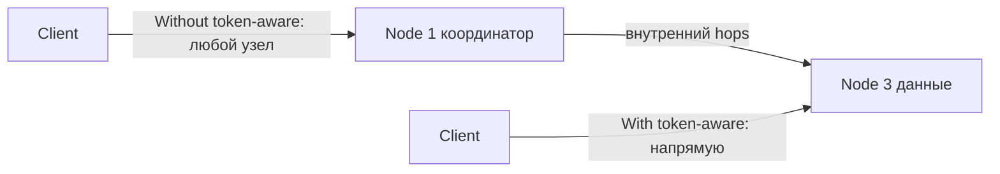

Сравнение маршрутов запроса:

```
   Without token-aware (лишний хоп):
     Client ──"любой узел"──▶ Node 1 (координатор)
                                │ внутренний hop
                                ▼
                             Node 3 (данные)

   With token-aware (напрямую):
     Client ──"напрямую"──────────────▶ Node 3 (данные)
```

**Настройка в Java Driver v4:**

```java
CqlSession session = CqlSession.builder()
    .addContactPoint(new InetSocketAddress("cassandra-host", 9042))
    .withLocalDatacenter("dc1")
    // TokenAwarePolicy включён по умолчанию в Driver v4
    // Дополнительно: DC-aware для мульти-датацентровых кластеров
    .withConfigLoader(DriverConfigLoader.fromClasspath("application.conf"))
    .build();
```

**application.conf (Typesafe Config):**

```hocon
datastax-java-driver {
  basic.load-balancing-policy {
    class = DefaultLoadBalancingPolicy
    local-datacenter = dc1
  }
  advanced.load-balancing-policy {
    # Token-awareness включена по умолчанию
    # Fallback при недоступности: другой реплика в том же DC
  }
}
```

**Почему важен:**
- Снижает задержку на 1 сетевой хоп (с ~5 мс до ~1 мс в одном датацентре)
- Уменьшает нагрузку на координирующие узлы
- При `CL=ONE` запрос обрабатывается без координации — максимальная скорость
- Требует корректного расчёта `routing key` (partition key в prepared statement)

**Пример с Prepared Statement (обязателен для token-awareness):**

```java
// Prepared statement — driver знает binding variables и вычисляет token
PreparedStatement prepared = session.prepare(
    "SELECT * FROM orders WHERE user_id = ? AND order_date > ?");

BoundStatement bound = prepared.bind(userId, fromDate);
// Driver автоматически вычисляет token(userId) и маршрутизирует к нужному узлу
ResultSet rs = session.execute(bound);
```

## Q43. Как выполнять агрегации и аналитику поверх `Cassandra`?

`Cassandra` намеренно ограничивает аналитические возможности (нет JOIN, GROUP BY, HAVING). Для аналитики используются внешние инструменты.

**Встроенные агрегаты CQL (ограниченно):**

```cql
-- Только по одной партиции, не по кластеру
SELECT COUNT(*), SUM(amount), AVG(amount), MIN(amount), MAX(amount)
FROM orders
WHERE user_id = 'd7c5db80-cf5e-4df1-8523-ebe9a8aa0b81';

-- User-defined aggregate (UDA) для кастомной логики
CREATE FUNCTION state_add(state DOUBLE, val DOUBLE)
    CALLED ON NULL INPUT RETURNS DOUBLE
    LANGUAGE java AS 'return state + val;';
```

**Apache Spark + Cassandra (основной подход):**

```scala
// Spark Cassandra Connector
val sc = new SparkContext(conf)
val ordersRDD = sc.cassandraTable("shop", "orders")

// Аналитика поверх всего кластера
val revenueByCategory = ordersRDD
  .filter(_.getDouble("amount") > 0)
  .keyBy(_.getString("category"))
  .aggregateByKey(0.0)(
    (acc, row) => acc + row.getDouble("amount"),
    _ + _
  )
  .collect()
```

**Apache Flink для stream аналитики:**

```java
// Flink Cassandra Sink — запись результатов обратно в Cassandra
CassandraSink.addSink(stream)
    .setQuery("INSERT INTO analytics.category_stats (category, total) VALUES (?, ?)")
    .setClusterBuilder(clusterBuilder)
    .build();
```

**Materialized Views vs Отдельные таблицы:**

```cql
-- Materialized View (осторожно — experimental feature, лучше избегать в prod)
CREATE MATERIALIZED VIEW orders_by_status AS
    SELECT * FROM orders WHERE status IS NOT NULL AND order_id IS NOT NULL
    PRIMARY KEY ((status), created_at, order_id);

-- Лучше: явная денормализация через приложение или Kafka streams
```

**Рекомендации:**
- `Spark` + `Cassandra Connector` — для batch-аналитики, ETL
- `Apache Flink` / `Kafka Streams` — для real-time агрегаций
- `Presto` / `Trino` — для SQL-запросов ad-hoc поверх Cassandra
- Избегать `ALLOW FILTERING` и cross-partition запросов в prod

## Q44. Что такое `CDC` (`Change Data Capture`) в `Cassandra`?

**CDC** (`Change Data Capture`) — захват потока изменений данных, чтобы реагировать на них вне Cassandra. Технически Cassandra просто сохраняет мутации из Commit Log в отдельную директорию `cdc_raw`, откуда их забирает внешний коннектор (обычно Debezium) и публикует в `Kafka`, а уже оттуда они расходятся по потребителям. Это типичный мост от Cassandra к поиску, аналитике и event-driven архитектуре.

**Как работает CDC в Cassandra:**

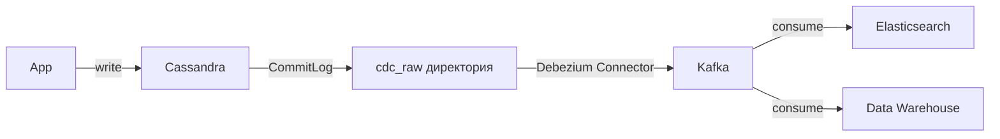

Цепочка захвата изменений:

```
   App ──write──▶ Cassandra ──CommitLog──▶ cdc_raw директория
                                                  │
                                          Debezium Connector
                                                  │
                                                  ▼
                                                Kafka
                                          consume │ consume
                                      ┌───────────┴───────────┐
                                      ▼                       ▼
                                Elasticsearch          Data Warehouse
```

**Включение CDC для таблицы:**

```cql
-- Включить CDC при создании таблицы
CREATE TABLE orders (
    order_id UUID PRIMARY KEY,
    status   TEXT,
    amount   DECIMAL
) WITH cdc = true;

-- Включить для существующей таблицы
ALTER TABLE orders WITH cdc = true;
```

**cassandra.yaml настройки:**

```yaml
cdc_enabled: true
cdc_raw_directory: /var/lib/cassandra/cdc_raw
cdc_total_space_in_mb: 4096    # максимум места под CDC logs
cdc_free_space_check_interval_ms: 250
```

**Debezium Connector для Cassandra (популярное решение):**

```json
{
  "name": "cassandra-cdc-connector",
  "config": {
    "connector.class": "io.debezium.connector.cassandra.CassandraConnector",
    "cassandra.config": "/etc/cassandra/cassandra.yaml",
    "cassandra.hosts": "cassandra-host",
    "kafka.producer.bootstrap.servers": "kafka:9092",
    "topic.prefix": "cassandra",
    "snapshot.mode": "initial"
  }
}
```

**Сценарии использования CDC:**
- Синхронизация Cassandra → Elasticsearch для поиска
- Построение event-driven архитектуры (Cassandra как event store)
- Репликация данных между кластерами
- Аудит изменений
- Cache invalidation при изменении данных

**Подводные камни:**
- CDC видит только явные мутации записи — TTL-истечения и события компакции в поток не попадают.
- Растёт нагрузка на диск: директорию `cdc_raw` нужно мониторить, иначе при заполнении записи начнут отклоняться.
- Гарантируется порядок изменений в пределах партиции, но не между разными партициями.

---

## See also

- [MongoDB](mongodb-interview.md) — другая NoSQL БД, документная модель
- [Redis](redis-interview.md) — in-memory хранилище, часто используется вместе с Cassandra как кэш
- [Распределённые системы](../architecture/distributed-systems-interview.md) — фундаментальные концепции, на которых построена Cassandra
- [CAP-теорема](../architecture/cap-theorem-interview.md) — Cassandra как AP-система
- [Архитектура баз данных](database-architecture-interview.md) — сравнение подходов к хранению данных
- [Apache Kafka](../messaging/kafka-interview.md) — интеграция через Kafka Connect для CDC и потоковой обработки
- [Elasticsearch](elasticsearch-interview.md) — часто используется вместе с Cassandra для полнотекстового поиска

- [ClickHouse](clickhouse-interview.md)
- [CockroachDB](cockroachdb-interview.md)
- [Database Architecture](database-architecture-interview.md)
- [Транзакции и уровни изоляции](database-transactions-interview.md)
- [DynamoDB](dynamodb-interview.md)
- [Elasticsearch](elasticsearch-interview.md)
