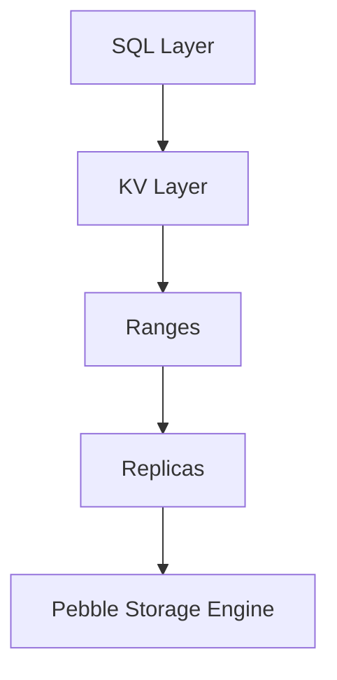

# Вопросы на собеседовании: `CockroachDB`

`CockroachDB` (Cockroach Labs, с 2015) — distributed SQL database inspired Google Spanner. **PostgreSQL wire protocol compatible**, ACID transactions across multiple nodes, multi-region capable. Open-source (BSL license). Конкуренты: Spanner, Aurora, YugabyteDB, TiDB.

## Полезные ссылки

### Официальная документация и авторитетные источники

- [CockroachDB Documentation](https://www.cockroachlabs.com/docs/)
- [CockroachDB Architecture](https://www.cockroachlabs.com/docs/stable/architecture/overview.html)
- [Spanner Paper](https://research.google/pubs/pub39966/) — original inspiration
- [DistSQL — Cockroach Architecture](https://www.cockroachlabs.com/blog/distributed-sql-key-features/)
- [YugabyteDB vs CockroachDB](https://www.yugabyte.com/yugabytedb-vs-cockroachdb/)

## Содержание

- [Полезные ссылки](#полезные-ссылки)
- [See also](#see-also)

**Базовые понятия**
- [Q1. (!) Что такое CockroachDB?](#q1--что-такое-cockroachdb)
- [Q2. (!) NewSQL — что это?](#q2--newsql--что-это)
- [Q3. (!) Inspired by Google Spanner — что значит?](#q3--inspired-by-google-spanner--что-значит)

**Архитектура**
- [Q4. (!) Architecture: ranges, replicas, leases?](#q4--architecture-ranges-replicas-leases)
- [Q5. Raft consensus?](#q5-raft-consensus)
- [Q6. (!) Range splitting?](#q6--range-splitting)
- [Q7. Hybrid Logical Clocks (HLC)?](#q7-hybrid-logical-clocks-hlc)

**Distribution**
- [Q8. (!) Multi-region deployments?](#q8--multi-region-deployments)
- [Q9. (!) Region survival vs zone survival?](#q9--region-survival-vs-zone-survival)
- [Q10. Locality settings?](#q10-locality-settings)
- [Q11. Geo-partitioning (data locality)?](#q11-geo-partitioning-data-locality)

**SQL и compatibility**
- [Q12. (!) PostgreSQL compatibility?](#q12--postgresql-compatibility)
- [Q13. ACID transactions?](#q13-acid-transactions)
- [Q14. Isolation levels (Serializable default)?](#q14-isolation-levels-serializable-default)

**Performance**
- [Q15. (!) Sharding strategy?](#q15--sharding-strategy)
- [Q16. Index types?](#q16-index-types)
- [Q17. (!) Limitations vs PostgreSQL?](#q17--limitations-vs-postgresql)

**Сравнения**
- [Q18. (!) CockroachDB vs Spanner?](#q18--cockroachdb-vs-spanner)
- [Q19. (!) CockroachDB vs Aurora?](#q19--cockroachdb-vs-aurora)
- [Q20. CockroachDB vs YugabyteDB?](#q20-cockroachdb-vs-yugabytedb)
- [Q21. CockroachDB vs TiDB?](#q21-cockroachdb-vs-tidb)

**Production**
- [Q22. (!) Когда выбрать CockroachDB?](#q22--когда-выбрать-cockroachdb)
- [Q23. License (BSL) — что значит?](#q23-license-bsl--что-значит)
- [Q24. Какие частые проблемы?](#q24-какие-частые-проблемы)

## Q1. (!) Что такое CockroachDB?

**CockroachDB** — distributed SQL database, designed для:
- **Horizontal scaling** (add nodes для capacity)
- **High availability** (no single point of failure)
- **Strong consistency** (ACID, Serializable)
- **PostgreSQL compatibility** (wire protocol)
- **Multi-region** (geo-distributed)

**Создан** ex-Googlers (working on Spanner, F1) в 2015.

**Применения:**
- Global apps требующие consistency
- Financial systems (bank ledgers, payment platforms)
- Multi-region SaaS
- Apps outgrowing single PostgreSQL

## Q2. (!) NewSQL — что это?

**NewSQL** — class databases combining:
- **SQL interface + ACID** (как traditional RDBMS)
- **Horizontal scalability** (как NoSQL)

**Examples:**
- Google Spanner
- CockroachDB
- YugabyteDB
- TiDB
- VoltDB

**Vs traditional SQL:** scales beyond single machine.
**Vs NoSQL:** keeps SQL, ACID, joins.

**Trade-off:** more complex internals, sometimes slower на single-node workloads.

## Q3. (!) Inspired by Google Spanner — что значит?

**Spanner** (Google, 2012) — first globally-distributed SQL DB.

**Key Spanner concepts:**
- **TrueTime** — atomic clocks для globally consistent timestamps
- **Paxos consensus**
- **Multi-region writes**
- **External consistency**

**CockroachDB** реализует похожие концепции **без atomic clocks**:
- **Hybrid Logical Clocks (HLC)** вместо TrueTime
- **Raft consensus** вместо Paxos
- **Open-source** (Spanner — managed only)

В **2025** — CockroachDB main open-source distributed SQL.

## Q4. (!) Architecture: ranges, replicas, leases?



**Range** — contiguous chunk данных (default 512 MB).
- Identified by start/end keys
- Each range is **independently replicated**

**Replica** — copy range на ноде. Default **3 replicas**.

**Lease** — каждый range имеет **leaseholder** (одна replica). Coordinates reads/writes to range.

**Raft group** — все replicas range form Raft group, lease leader = Raft leader (usually).

## Q5. Raft consensus?

**Raft** — distributed consensus algorithm. CockroachDB uses **Raft per range**.

**Process:**
1. Leader (lease holder) accepts write
2. Replicates to followers
3. Once **majority** (quorum) ack → commit
4. Apply к state machine

**3 replicas:** quorum = 2. Tolerate 1 failure.
**5 replicas:** quorum = 3. Tolerate 2 failures.

**Leader election:** Raft auto-elects на failures.

## Q6. (!) Range splitting?

**Auto-splitting** на ~512 MB.

```
Range 1: keys A-K (512 MB)
  ↓ growing к 1 GB
Split into:
  Range 1a: keys A-G (256 MB)
  Range 1b: keys G-K (256 MB)
```

**Distribution:** new ranges placed на underutilized nodes.

**Manual split** для performance:
```sql
ALTER TABLE orders SPLIT AT VALUES (100), (200), (300);
```

Useful **before bulk import** для distributed write performance.

## Q7. Hybrid Logical Clocks (HLC)?

**HLC** — combines **physical time** (NTP) + **logical counter** для globally ordered timestamps.

**Format:** `(physical_time, logical_counter)`

**vs Spanner TrueTime:**
- Spanner: hardware atomic clocks → tiny uncertainty (~7ms)
- CockroachDB: NTP + HLC → larger uncertainty (~250ms-1s)

**Effect для CockroachDB:**
- May need to **wait out clock uncertainty** for some operations
- Uses retries для resolve conflicts
- Slightly higher write latency

В практике — sufficient для majority workloads.

## Q8. (!) Multi-region deployments?

CockroachDB supports **deploy across multiple regions**.

```
us-east (3 replicas)
us-west (3 replicas)
eu-west (3 replicas)
```

**Replication strategies:**
- **Region survival** — survive region failure
- **Zone survival** — survive zone failure (cheaper)

**Reads:** can be local (closest replica).
**Writes:** require quorum across regions → higher latency.

## Q9. (!) Region survival vs zone survival?

**Zone survival:**
- Replicas в multiple zones одного region
- Survives zone outage
- **Lower latency** (zones close)
- Cheaper (one region)

**Region survival:**
- Replicas в multiple regions
- Survives entire region failure
- **Higher latency** (cross-region quorum для writes)
- More expensive

```sql
ALTER DATABASE my_db SURVIVE REGION FAILURE;
```

**Best practice:**
- **Zone survival** обычно достаточно
- **Region survival** для compliance / critical apps

## Q10. Locality settings?

**Each node** announces its locality:
```bash
cockroach start --locality=region=us-east-1,zone=us-east-1a
```

**CockroachDB uses locality** для:
- Place replicas в разных zones/regions (failure isolation)
- **Lease holder placement** (closer к user)
- **Follower reads** (read local replica)

## Q11. Geo-partitioning (data locality)?

**Partition table by region** для data locality (compliance, latency).

```sql
ALTER TABLE customers
PARTITION BY LIST (region) (
    PARTITION europe VALUES IN ('FR', 'DE'),
    PARTITION us VALUES IN ('US')
);

ALTER PARTITION europe OF TABLE customers
CONFIGURE ZONE USING constraints = '[+region=eu-west]';

ALTER PARTITION us OF TABLE customers
CONFIGURE ZONE USING constraints = '[+region=us-east]';
```

**Effect:**
- European customers → data в EU (GDPR compliance)
- US customers → data в US
- Local reads / writes (low latency)

Аналог Spanner regional placement.

## Q12. (!) PostgreSQL compatibility?

CockroachDB — **PostgreSQL wire protocol** compatible. Most apps work без changes.

**Compatible:**
- Standard SQL (most)
- pgBouncer, pgwire clients
- ORMs (Hibernate, ActiveRecord, Sequelize)
- Migration tools

**Not compatible:**
- PostgreSQL-specific extensions (PostGIS, hstore, etc. — limited)
- Some functions
- Triggers (limited support)
- Stored procedures (limited)

**Migration path** PostgreSQL → CockroachDB обычно smooth, но **test thoroughly**.

## Q13. ACID transactions?

**Full ACID** — даже distributed.

```sql
BEGIN;
INSERT INTO orders (...) VALUES (...);
UPDATE inventory SET qty = qty - 1 WHERE id = 5;
COMMIT;
```

**Distributed transaction:**
- Coordinator nodes (TxnCoordSender)
- Two-phase commit (2PC) protocol
- Automatic retries при contention

**Slow** для high-conflict workloads (retries). Best for **isolated** transactions.

## Q14. Isolation levels (Serializable default)?

**Default: SERIALIZABLE** (strongest isolation).

PostgreSQL default — **READ COMMITTED**. CockroachDB**different by default**.

**Serializable** — guarantees ACID, no anomalies. **Cost:** more retries, slower writes.

С **CockroachDB v23+** — добавили **READ COMMITTED** option (для PostgreSQL compatibility).

```sql
BEGIN ISOLATION LEVEL READ COMMITTED;
```

**Best practice:** Serializable для correctness-critical, READ COMMITTED для legacy migrations.

## Q15. (!) Sharding strategy?

**Auto-sharding** — нет manual setup.

CockroachDB **splits data в ranges** automatically:
- By **primary key** (default — by hash)
- Range size ~512 MB
- Auto-rebalance к new nodes

**Manual control:**
- `PARTITION BY` — geo-partitioning
- `SPLIT AT` — manual range splits
- `INDEX (col) USING HASH` — hash-sharded index (избежать hot ranges)

**Hot range problem** — sequential PK (timestamp, sequence) → all writes к один range. Use **UUID** or **hash-sharded index**.

## Q16. Index types?

**Standard B-tree indexes:**
```sql
CREATE INDEX ON orders (customer_id);
CREATE INDEX ON orders (customer_id, created_at);
```

**Hash-sharded indexes** (распределяют hot ranges):
```sql
CREATE INDEX ON events (timestamp) USING HASH WITH BUCKET_COUNT = 8;
```

**Partial indexes:**
```sql
CREATE INDEX active_users ON users (last_login) WHERE active = true;
```

**Inverted indexes** (для JSONB):
```sql
CREATE INVERTED INDEX ON orders (data);
```

**Spatial indexes** — limited PostGIS support.

## Q17. (!) Limitations vs PostgreSQL?

**CockroachDB не поддерживает (или limited):**
- Stored procedures (limited)
- Triggers (limited)
- Materialized views (newer support)
- Full-text search (limited)
- PostGIS (limited)
- Some JSONB operators
- `LISTEN/NOTIFY`
- Foreign data wrappers (FDW)
- `XML` type
- Custom types (limited)
- `LATERAL` joins (some)

**Production:** test тщательно migration legacy PostgreSQL apps.

## Q18. (!) CockroachDB vs Spanner?

| Critterion | CockroachDB | Spanner |
|-----------|-------------|---------|
| Hosting | Self-host or CockroachCloud | GCP managed only |
| Open source | BSL (mostly free) | No (proprietary) |
| Time | HLC (NTP-based) | TrueTime (atomic clocks) |
| Consistency | Serializable | External Consistency (stronger) |
| SQL | PostgreSQL wire | Custom GoogleSQL |
| Multi-region writes | Yes | Yes |
| Cost | Cheaper | $$$$ |
| Ecosystem | Growing | GCP-tied |

**Spanner** — gold standard distributed SQL, но GCP-only and expensive.
**CockroachDB** — democratizes Spanner concepts, open-source.

## Q19. (!) CockroachDB vs Aurora?

| Critterion | CockroachDB | Aurora PostgreSQL |
|-----------|-------------|-------------------|
| Type | Distributed SQL | Distributed storage, single writer |
| Writes | Multi-master (any node) | Single master |
| Multi-region | Yes (multi-master) | Read replicas only (or Global DB single writer) |
| Consistency | Serializable always | PostgreSQL defaults |
| Compatibility | PostgreSQL wire | Full PostgreSQL |

**Aurora** — proven, PostgreSQL drop-in, faster для standard workloads.
**CockroachDB** — actually distributed, multi-region writes, slower единичный node.

В **2025** Aurora **default** для AWS shops. CockroachDB — для multi-region, multi-cloud.

## Q20. CockroachDB vs YugabyteDB?

**YugabyteDB** — main конкурент CockroachDB.

| Critterion | CockroachDB | YugabyteDB |
|-----------|-------------|------------|
| Origin | Cockroach Labs (ex-Google) | Yugabyte (ex-Facebook) |
| Architecture | Single SQL layer | Two-tier (YSQL + YCQL) |
| PostgreSQL compat | Wire protocol | **Full PostgreSQL** (forked PG code) |
| Cassandra compat | No | **Yes (YCQL)** |
| Open source | BSL | Apache 2.0 (more free) |
| Performance | — | Often faster |

**YugabyteDB** имеет **closer PostgreSQL compatibility** (более features supported).

В **2025** — close competition. Both viable choices.

## Q21. CockroachDB vs TiDB?

**TiDB** (PingCAP, China) — другой distributed SQL.

| Critterion | CockroachDB | TiDB |
|-----------|-------------|------|
| Compatibility | PostgreSQL | **MySQL** |
| Architecture | Monolithic | Separate compute (TiDB) + storage (TiKV) |
| HTAP (analytics) | Limited | **Strong** (TiFlash для columnar) |
| Open source | BSL | Apache 2.0 |
| Adoption | West (US, EU) | China (PingCAP) + global |

**TiDB** — для MySQL-compatible workloads + HTAP scenarios.
**CockroachDB** — для PostgreSQL-compatible + multi-region.

## Q22. (!) Когда выбрать CockroachDB?

**Выбирай когда:**
- **Multi-region writes** (low write latency globally)
- **Outgrowing PostgreSQL** (scale issues)
- **Strong consistency** required (financial, regulated)
- **Multi-cloud** (avoid vendor lock-in)
- **Geo-partitioning** для compliance (GDPR)
- Open-source preferred (vs Spanner)

**Не выбирай когда:**
- Single-region — Aurora / RDS быстрее, проще
- Need full PostgreSQL features (extensions, etc.)
- Read-heavy с few writes (read replicas достаточно)
- Cost-sensitive (CockroachDB nodes expensive, Cloud version $$$)
- Real-time analytics (не для OLAP)

## Q23. License (BSL) — что значит?

**Business Source License (BSL)** — license CockroachDB с 2019.

**Restrictions:**
- **Cannot offer** CockroachDB **as a service** к third parties (без commercial license)
- Otherwise — free для self-host, modify, etc.

**BSL converts к Apache 2.0 после 3 years** (so older versions become fully open).

**Похоже на** Elastic License (изначально был Apache → SSPL).

**Effect:** AWS / Google не могут offer "CockroachDB as a Service". Cockroach Labs sells managed CockroachCloud.

## Q24. Какие частые проблемы?

1. **Hot ranges** — sequential PK overload single range. Use UUID or hash-shard.
2. **High write latency** — multi-region quorum slow.
3. **Transaction retries** — Serializable + contention → many retries.
4. **Mistakes from PostgreSQL** — compatibility imperfect, test thoroughly.
5. **Large transactions** — slow, lock issues.
6. **Insufficient nodes** — quorum impossible after node failures.
7. **Wrong locality config** — replicas в одном zone (single zone failure → outage).
8. **Cost surprises** — managed CockroachCloud expensive at scale.
9. **No proper backup strategy** — built-in backups need correct config.
10. **OLAP queries** — not designed for; use ClickHouse / Snowflake separately.

В **2025** CockroachDB — mature option для distributed SQL, но требует **expertise to operate well**.

---

## See also

- [PostgreSQL](postgresql-interview.md) — main compatibility target
- [ScyllaDB](scylladb-interview.md) — distributed wide-column (for сравнения)
- [Cassandra](cassandra-interview.md) — wide-column NoSQL
- [MongoDB](mongodb-interview.md) — document
- [DynamoDB](dynamodb-interview.md) — managed NoSQL
- [Database Architecture](database-architecture-interview.md) — distributed SQL context
- [Распределённые системы](../architecture/distributed-systems-interview.md) — Raft, consensus
- [CAP Theorem](../architecture/cap-theorem-interview.md) — consistency vs availability
- [Микросервисы](../architecture/microservices-interview.md) — где CockroachDB fits
- [Scalability Patterns](../architecture/scalability-patterns-interview.md) — horizontal scaling
- [Паттерны согласованности](../architecture/consistency-patterns-interview.md) — strong consistency
- [GCP](../cloud/gcp-interview.md) — Spanner alternative
- [AWS](../cloud/aws-interview.md) — Aurora alternative

- [Apache Cassandra](cassandra-interview.md)
- [ClickHouse](clickhouse-interview.md)
- [Database Architecture](database-architecture-interview.md)
- [Транзакции и уровни изоляции](database-transactions-interview.md)
- [DynamoDB](dynamodb-interview.md)
- [Elasticsearch](elasticsearch-interview.md)
