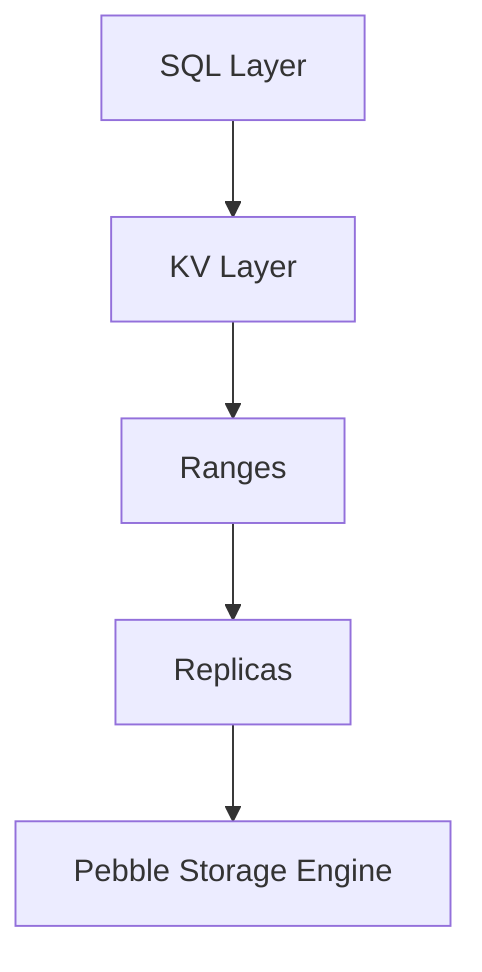

# Вопросы на собеседовании: `CockroachDB`

`CockroachDB` (Cockroach Labs, с 2015) — distributed SQL database inspired Google Spanner. **PostgreSQL wire protocol compatible**, ACID transactions across multiple nodes, multi-region capable. Open-source (BSL license). Конкуренты: Spanner, Aurora, YugabyteDB, TiDB.

## Полезные ссылки

### Официальная документация и авторитетные источники

- [CockroachDB Documentation](https://www.cockroachlabs.com/docs/)
- [CockroachDB Architecture](https://www.cockroachlabs.com/docs/stable/architecture/overview.html)
- [Spanner Paper](https://research.google/pubs/pub39966/) — original inspiration
- [DistSQL — Cockroach Architecture](https://www.cockroachlabs.com/blog/distributed-sql-key-features/)
- [YugabyteDB vs CockroachDB](https://www.yugabyte.com/yugabytedb-vs-cockroachdb/)

## Содержание

- [Полезные ссылки](#полезные-ссылки)
- [See also](#see-also)

**Базовые понятия**
- [Q1. (!) Что такое CockroachDB?](#q1--что-такое-cockroachdb)
- [Q2. (!) NewSQL — что это?](#q2--newsql--что-это)
- [Q3. (!) Inspired by Google Spanner — что значит?](#q3--inspired-by-google-spanner--что-значит)

**Архитектура**
- [Q4. (!) Architecture: ranges, replicas, leases?](#q4--architecture-ranges-replicas-leases)
- [Q5. Raft consensus?](#q5-raft-consensus)
- [Q6. (!) Range splitting?](#q6--range-splitting)
- [Q7. Hybrid Logical Clocks (HLC)?](#q7-hybrid-logical-clocks-hlc)

**Distribution**
- [Q8. (!) Multi-region deployments?](#q8--multi-region-deployments)
- [Q9. (!) Region survival vs zone survival?](#q9--region-survival-vs-zone-survival)
- [Q10. Locality settings?](#q10-locality-settings)
- [Q11. Geo-partitioning (data locality)?](#q11-geo-partitioning-data-locality)

**SQL и compatibility**
- [Q12. (!) PostgreSQL compatibility?](#q12--postgresql-compatibility)
- [Q13. ACID transactions?](#q13-acid-transactions)
- [Q14. Isolation levels (Serializable default)?](#q14-isolation-levels-serializable-default)

**Performance**
- [Q15. (!) Sharding strategy?](#q15--sharding-strategy)
- [Q16. Index types?](#q16-index-types)
- [Q17. (!) Limitations vs PostgreSQL?](#q17--limitations-vs-postgresql)

**Сравнения**
- [Q18. (!) CockroachDB vs Spanner?](#q18--cockroachdb-vs-spanner)
- [Q19. (!) CockroachDB vs Aurora?](#q19--cockroachdb-vs-aurora)
- [Q20. CockroachDB vs YugabyteDB?](#q20-cockroachdb-vs-yugabytedb)
- [Q21. CockroachDB vs TiDB?](#q21-cockroachdb-vs-tidb)

**Production**
- [Q22. (!) Когда выбрать CockroachDB?](#q22--когда-выбрать-cockroachdb)
- [Q23. License (BSL) — что значит?](#q23-license-bsl--что-значит)
- [Q24. Какие частые проблемы?](#q24-какие-частые-проблемы)

## Q1. (!) Что такое CockroachDB?

**CockroachDB** — distributed SQL database, designed для:
- **Horizontal scaling** (add nodes для capacity)
- **High availability** (no single point of failure)
- **Strong consistency** (ACID, Serializable)
- **PostgreSQL compatibility** (wire protocol)
- **Multi-region** (geo-distributed)

**Создан** ex-Googlers (working on Spanner, F1) в 2015.

**Применения:**
- Global apps требующие consistency
- Financial systems (bank ledgers, payment platforms)
- Multi-region SaaS
- Apps outgrowing single PostgreSQL

> [!mcq]
> - [ ] `CockroachDB` — это NoSQL document store с MongoDB-compatible API и BSON под капотом | Путает с document database; CRDB — relational SQL, не document. ❌ ПОСЛЕДСТВИЕ: команда строит eventual-consistent сервис вместо ACID — теряет транзакционные гарантии в банковском ledger.
> - [ ] `CockroachDB` — это in-memory cache с persistence на диск (как Redis Enterprise) | Путает с in-memory store; CRDB — disk-based через Pebble engine, не cache. ❌ ПОСЛЕДСТВИЕ: ожидание sub-ms latency не оправдывается, под нагрузкой p99 100ms+ — UI тормозит, customers жалуются.
> - [x] Distributed SQL DB с PostgreSQL wire protocol, ACID + horizontal scaling, Raft per range | Корректное определение NewSQL-системы, inspired by Spanner. ✓ ПРИМЕНЯТЬ: financial systems, multi-region SaaS, apps outgrowing single-node PostgreSQL. 📋 ПРАВИЛО: «Distributed PostgreSQL with Spanner-style consensus». 🔗 См. Q2.
> - [ ] CRDB — это PostgreSQL fork с патчами для streaming replication между регионами | Путает с PostgreSQL streaming repl; CRDB — независимый код на Go, не fork PG. ❌ ПОСЛЕДСТВИЕ: команда ищет master/slave failover скрипты, упускает auto-rebalance ranges — дублируют встроенный механизм.

> [!mcq]
> - [ ] CRDB говорит и на PostgreSQL wire, и на MySQL wire — драйвер любой подходит | Только pg-wire; MySQL wire — это TiDB. ❌ ПОСЛЕДСТВИЕ: подключают MySQL JDBC driver, ловят handshake error на старте, теряют смену на «отладку connection» зря.
> - [ ] PostgreSQL-compatible — это 100% совместимость SQL и всех extensions (PostGIS, hstore) | Compat только на уровне wire; extensions/FDW/LISTEN не работают. ❌ ПОСЛЕДСТВИЕ: миграция Postgres-сервиса с PostGIS падает на geo-запросах в проде.
> - [x] CRDB говорит на **PostgreSQL wire protocol** — pgJDBC, psql, pgBouncer, ORMs работают как с Postgres; SQL-диалект близок | Природа compat. ✓ ПРИМЕНЯТЬ: переиспользовать pgJDBC/Hibernate/pgBouncer без замены; фичи проверять отдельно. 📋 ПРАВИЛО: «pg-wire ≠ pg-feature: коннект работает, фичи — нет». 🔗 См. Q12, Q17.
> - [ ] Pg-wire можно выключить и ходить в CRDB через REST API на порту 8080 как в Elasticsearch | Только pg-wire (port 26257); REST API нет, 8080 — Admin UI HTTP. ❌ ПОСЛЕДСТВИЕ: ищут несуществующий REST endpoint, пишут самописный HTTP-proxy на сутки впустую — фича отваливается.

## Q2. (!) NewSQL — что это?

**NewSQL** — class databases combining:
- **SQL interface + ACID** (как traditional RDBMS)
- **Horizontal scalability** (как NoSQL)

**Examples:**
- Google Spanner
- CockroachDB
- YugabyteDB
- TiDB
- VoltDB

**Vs traditional SQL:** scales beyond single machine.
**Vs NoSQL:** keeps SQL, ACID, joins.

**Trade-off:** more complex internals, sometimes slower на single-node workloads.

> [!mcq]
> - [ ] `NewSQL` = NoSQL + SQL query language поверх eventual consistency на distributed log | Подменяет ACID на eventual: NewSQL = ACID + scale-out, не eventual. ❌ ПОСЛЕДСТВИЕ: банковский ledger теряет транзакции при partition, audit fails — fine от регулятора.
> - [ ] `NewSQL` — синоним PostgreSQL 16+ с встроенным declarative partitioning по диапазонам | Путает встроенный partitioning одной ноды с distributed SQL через consensus. ❌ ПОСЛЕДСТВИЕ: команда думает что pg_partman = NewSQL, не получает horizontal scale, упирается в потолок RDS.
> - [ ] `NewSQL` — это OLAP columnar store (ClickHouse, Snowflake) для аналитики | Путает класс OLTP-NewSQL с analytics columnar engines. ❌ ПОСЛЕДСТВИЕ: пытаются класть OLTP-нагрузку в ClickHouse, latency на point-lookups взлетает с 5ms до 500ms — UI тормозит.
> - [x] Класс БД: SQL + ACID как RDBMS, но horizontal scaling как NoSQL (Spanner, CockroachDB, YugabyteDB, TiDB) | Точное определение через сочетание свойств. ✓ ПРИМЕНЯТЬ: когда нужна транзакционность через 100+ узлов и регионов — fintech, global SaaS. 📋 ПРАВИЛО: «ACID + scale-out — без trade-off на изоляцию». 🔗 См. Q1, Q20.

> [!mcq]
> - [ ] CockroachDB и Spanner идентичны под капотом — оба используют TrueTime atomic clocks | Spanner=TrueTime (GPS+atomic hardware), CRDB=HLC (NTP-based, без специального hardware). ❌ ПОСЛЕДСТВИЕ: команда планирует ставить atomic clocks в свои DC, тратит $50K бюджет — CRDB их не использует.
> - [ ] Spanner быстрее CRDB потому что использует Paxos, а CRDB — медленный Raft consensus | Raft и Paxos сопоставимы по latency; разница в clock uncertainty (TrueTime ~7ms vs HLC ~250ms), не в consensus. ❌ ПОСЛЕДСТВИЕ: команда винит Raft в latency-проблемах, не смотрит на NTP drift — реальная причина.
> - [x] CRDB отличается от Spanner: **HLC вместо TrueTime** (без atomic hardware), Raft вместо Paxos, open-source vs GCP-only; clock uncertainty выше | Точное архитектурное различие. ✓ ПРИМЕНЯТЬ: учитывать clock uncertainty при сравнении NewSQL — CRDB требует строгий NTP. 📋 ПРАВИЛО: «No atomic clocks → HLC + retries — цена open-source NewSQL». 🔗 См. Q3, Q7, Q18.
> - [ ] Все NewSQL-системы (CRDB, Spanner, Yugabyte, TiDB) используют один и тот же consensus protocol | Spanner=Paxos, CRDB/Yugabyte/TiDB=Raft per shard — разные алгоритмы. ❌ ПОСЛЕДСТВИЕ: ищут универсальные tunables consensus, документация противоречит — debugging тратит дни.

## Q3. (!) Inspired by Google Spanner — что значит?

**Spanner** (Google, 2012) — first globally-distributed SQL DB.

**Key Spanner concepts:**
- **TrueTime** — atomic clocks для globally consistent timestamps
- **Paxos consensus**
- **Multi-region writes**
- **External consistency**

**CockroachDB** реализует похожие концепции **без atomic clocks**:
- **Hybrid Logical Clocks (HLC)** вместо TrueTime
- **Raft consensus** вместо Paxos
- **Open-source** (Spanner — managed only)

В **2025** — CockroachDB main open-source distributed SQL.

> [!mcq]
> - [ ] `CockroachDB` — это форк исходников Spanner с патчами от Google | Spanner closed-source и proprietary, форкнуть нельзя; CRDB написан с нуля на Go. ❌ ПОСЛЕДСТВИЕ: команда ждёт что фичи Spanner (interleaved tables, change streams) появятся автоматически — не появятся.
> - [x] CRDB реализует Spanner-концепции (multi-region writes, external consistency) на open-source стеке: HLC вместо TrueTime, Raft вместо Paxos | Architectural inspiration без shared code. ✓ ПРИМЕНЯТЬ: когда нужны Spanner-свойства, но недопустим vendor lock-in GCP — например multi-cloud SaaS. 📋 ПРАВИЛО: «Inspired ≠ forked: концепции, не код». 🔗 См. Q7, Q18.
> - [ ] CRDB — это Google-managed сервис на GCP в категории BigTable/Spanner | Это не GCP-сервис; CockroachCloud — managed от Cockroach Labs (на AWS/GCP/Azure). ❌ ПОСЛЕДСТВИЕ: ищут CockroachDB в GCP console, не находят и теряют день на «отладку доступа».
> - [ ] Spanner и CockroachDB одинаковы по latency на cross-region writes — оба около 10ms p99 | TrueTime vs HLC дают разный clock uncertainty (~7ms vs ~250ms), commit-wait отличается. ❌ ПОСЛЕДСТВИЕ: SLA-budget на p99 50ms нарушен — реальная latency CRDB на cross-region writes выше планируемой в 5 раз.

> [!mcq]
> - [ ] CockroachDB использует Google TrueTime через публичный GCP-API на каждой ноде | TrueTime — proprietary Spanner-only, недоступен извне; CRDB использует HLC через NTP. ❌ ПОСЛЕДСТВИЕ: команда настраивает GCP credentials для TrueTime в CRDB конфиге, не находит API, теряет смену.
> - [x] CRDB заменяет TrueTime (atomic clocks + GPS hardware) на **Hybrid Logical Clock**: NTP physical time + logical counter; не требует hardware, но uncertainty ~250ms vs ~7ms у Spanner | Точная техническая замена. ✓ ПРИМЕНЯТЬ: жёстко держать NTP sync (`--max-offset=500ms` default); ноды с большим drift автоматически shutdown. 📋 ПРАВИЛО: «No GPS hardware → HLC через NTP → strict NTP discipline». 🔗 См. Q7.
> - [ ] HLC эквивалентен чистому Lamport timestamp без physical time компоненты | HLC = пара `(physical_NTP, logical)`; чистый Lamport не использует physical time, это разные алгоритмы. ❌ ПОСЛЕДСТВИЕ: команда отключает chronyd считая «NTP не нужен для logical clocks», cluster ломается на drift проверке.
> - [ ] Можно подключить atomic clock к CRDB-ноде, и она будет использовать его как TrueTime | Архитектура CRDB не имеет TrueTime API; даже с atomic clock используется HLC через стандартный NTP. ❌ ПОСЛЕДСТВИЕ: компания закупает atomic clocks за $$$, никакого improvement в uncertainty — деньги в пустую.

## Q4. (!) Architecture: ranges, replicas, leases?



**Range** — contiguous chunk данных (default 512 MB).
- Identified by start/end keys
- Each range is **independently replicated**

**Replica** — copy range на ноде. Default **3 replicas**.

**Lease** — каждый range имеет **leaseholder** (одна replica). Coordinates reads/writes to range.

**Raft group** — все replicas range form Raft group, lease leader = Raft leader (usually).

> [!mcq]
> - [ ] Range — это шард всей таблицы, lease — это row-level transaction lock | Range — 512MB chunk по key-range, не вся таблица; lease — координационный механизм, не lock. ❌ ПОСЛЕДСТВИЕ: команда ждёт `SELECT FOR UPDATE` стиля блокировок, не понимает почему получает `40001` retries вместо waits.
> - [ ] Replica — это read-replica только для чтения, все writes идут в primary node | CRDB multi-master: любая replica может стать leaseholder и принимать writes; нет primary-replica. ❌ ПОСЛЕДСТВИЕ: ищут «single writer», не понимают multi-master writes — проектируют двойной layer балансировки впустую.
> - [ ] Каждая нода имеет один общий Raft group на всю БД для всех данных | `Raft per range` — групп **тысячи**, по одной на каждый 512MB range. ❌ ПОСЛЕДСТВИЕ: ожидают bottleneck на одном raft-leader, неверно проектируют capacity — over-provisioning compute впустую.
> - [x] Range — 512MB chunk по key-order, реплицируется на 3 ноды через Raft, leaseholder координирует reads/writes | Точная иерархия SQL→KV→Range→Replica→Pebble. ✓ ПРИМЕНЯТЬ: понимать почему hot ranges возникают на sequential PK. 📋 ПРАВИЛО: «Range = unit of replication, lease = unit of coordination». 🔗 См. Q5, Q6, Q15.

> [!mcq]
> - [ ] Lease навсегда привязан к ноде, на которой создан range — перенос между replicas невозможен | Lease transfer работает динамически: load-based + locality-aware migration. ❌ ПОСЛЕДСТВИЕ: команда вручную пересоздаёт ranges через `EXPORT/IMPORT` чтобы перенести leaseholder — downtime минуты, сложность растёт.
> - [x] Lease автоматически **transferred** между replicas: rebalancing на underutilized nodes, locality-aware placement ближе к юзеру, при decommission старого узла | Точная динамика lease management. ✓ ПРИМЕНЯТЬ: multi-region — `kv.allocator.load_based_lease_rebalancing.enabled=true`, leaseholder мигрирует в регион с наибольшей нагрузкой. 📋 ПРАВИЛО: «Leaseholder follows the load — не статичен». 🔗 См. Q10.
> - [ ] Lease transfer требует ручного `ALTER RANGE ... CONFIGURE ZONE` каждый раз для каждого range | Auto-balancer (`replicate_queue`) делает это сам в фоне без DDL. ❌ ПОСЛЕДСТВИЕ: DBA пишет cron-скрипт для rebalancing, дублирует встроенный механизм и попутно ломает auto-balancer конфликтами.
> - [ ] Только Raft leader может быть leaseholder, эти роли всегда совпадают и неразделимы | Обычно совпадают (co-location), но могут расходиться при transfer; роли независимы. ❌ ПОСЛЕДСТВИЕ: команда отлаживая raft-логи не понимает почему lease на другой реплике, тратит часы на «несуществующую» рассинхронизацию.

## Q5. Raft consensus?

**Raft** — distributed consensus algorithm. CockroachDB uses **Raft per range**.

**Process:**
1. Leader (lease holder) accepts write
2. Replicates to followers
3. Once **majority** (quorum) ack → commit
4. Apply к state machine

**3 replicas:** quorum = 2. Tolerate 1 failure.
**5 replicas:** quorum = 3. Tolerate 2 failures.

**Leader election:** Raft auto-elects на failures.

> [!mcq]
> - [ ] Все 3 реплики должны ack write до commit (full sync replication, не quorum) | Это `quorum=N` (sync to all), а не `quorum=majority`; CRDB использует majority-quorum. ❌ ПОСЛЕДСТВИЕ: одна нода тормозит на GC pause → весь cluster встаёт ждать ack, p99 latency взлетает с 10ms до секунд.
> - [x] Leader реплицирует write на followers, после ack от **majority (quorum)** — commit; 3 replicas → quorum=2, tolerate 1 failure | Точная Raft-механика per range. ✓ ПРИМЕНЯТЬ: planning replica count для desired availability (5 replicas → tolerate 2). 📋 ПРАВИЛО: «Quorum = floor(N/2)+1, не all». 🔗 См. Q4, Q9.
> - [ ] CRDB использует Paxos consensus как Spanner — те же primitives и алгоритмы | CRDB использует **Raft per range**, не Paxos; разные алгоритмы. ❌ ПОСЛЕДСТВИЕ: невозможно отлаживать по Raft-логам, ищут несуществующие Paxos-primitives в коде, debug-окно растягивается на дни.
> - [ ] Failover при падении leader делается вручную через `cockroach node decommission` | Raft **auto-elects** новый leader при failure через election timeout (~3s). ❌ ПОСЛЕДСТВИЕ: PagerDuty alert ночью на «ручной failover», DBA встаёт впустую — Raft уже избрал нового leader.

## Q6. (!) Range splitting?

**Auto-splitting** на ~512 MB.

```
Range 1: keys A-K (512 MB)
  ↓ growing к 1 GB
Split into:
  Range 1a: keys A-G (256 MB)
  Range 1b: keys G-K (256 MB)
```

**Distribution:** new ranges placed на underutilized nodes.

**Manual split** для performance:
```sql
ALTER TABLE orders SPLIT AT VALUES (100), (200), (300);
```

Useful **before bulk import** для distributed write performance.

> [!mcq]
> - [ ] Splits должны делаться вручную через `ALTER TABLE SPLIT AT` для каждой растущей таблицы | Auto-split срабатывает на ~512MB без ручного вмешательства; manual нужен только для bulk import. ❌ ПОСЛЕДСТВИЕ: DBA тратит часы на cron-скрипт для manual splits, дублирует встроенную логику и попутно ломает auto-balancer.
> - [ ] Range split = full table copy в фоне (как PostgreSQL `pg_repack` для дефрагментации) | Это metadata operation, не data copy; data остаётся на диске, обновляются range descriptors. ❌ ПОСЛЕДСТВИЕ: ожидают downtime/disk-IO на split, планируют maintenance window — паника при росте таблицы зря.
> - [x] Auto-split при ~512MB на key-boundaries; `SPLIT AT` для pre-split перед bulk import + redistribute на underutilized nodes | Точная механика split. ✓ ПРИМЕНЯТЬ: `ALTER TABLE orders SPLIT AT` перед `IMPORT INTO` чтобы избежать hot range на single node. 📋 ПРАВИЛО: «Pre-split перед bulk load — обязательно». 🔗 См. Q4, Q15.
> - [ ] Range size зашит на 512MB, изменить нельзя — это hardcoded в Pebble engine | Можно через `range_min_bytes`/`range_max_bytes` в zone config: `ALTER ... CONFIGURE ZONE USING range_max_bytes=128MB`. ❌ ПОСЛЕДСТВИЕ: time-series с маленькими rows работают на default → too many ranges, overhead на gossip и raft heartbeats.

> [!mcq]
> - [ ] Split point всегда выбирается посередине key-range (median key) для равномерности | Реально используется load-based split: точка с равномерным разделением **QPS**, не байтов. ❌ ПОСЛЕДСТВИЕ: hot range остаётся hot после median-split — все запросы идут в одну половину, throughput не растёт.
> - [ ] Splits происходят только при превышении size threshold (`range_max_bytes` = 512MB) | Также по load-based триггеру (QPS hot range) и manual `SPLIT AT` — три источника. ❌ ПОСЛЕДСТВИЕ: команда не понимает почему range на 100MB разделился, игнорирует load-based splits в отладке — debug-окно тратит впустую.
> - [x] CRDB выбирает split point через **load-based splitter**: анализирует sampled keys по QPS и находит точку, балансирующую нагрузку между половинами | Механизм борьбы с hot ranges. ✓ ПРИМЕНЯТЬ: включён по умолчанию (`kv.range_split.load_qps_threshold=2500`); проверять через `crdb_internal.ranges`. 📋 ПРАВИЛО: «Split by load, not by median — QPS balance важнее размера». 🔗 См. Q15.
> - [ ] Merge ranges (объединение) недоступен — обратной операции к split нет, надо пересоздавать | CRDB автоматически мержит маленькие ranges через `kv.range_merge.queue_enabled` (default true). ❌ ПОСЛЕДСТВИЕ: команда после массовых deletes ожидает накопление пустых ranges, не понимает что merge их сам убирает.

## Q7. Hybrid Logical Clocks (HLC)?

**HLC** — combines **physical time** (NTP) + **logical counter** для globally ordered timestamps.

**Format:** `(physical_time, logical_counter)`

**vs Spanner TrueTime:**
- Spanner: hardware atomic clocks → tiny uncertainty (~7ms)
- CockroachDB: NTP + HLC → larger uncertainty (~250ms-1s)

**Effect для CockroachDB:**
- May need to **wait out clock uncertainty** for some operations
- Uses retries для resolve conflicts
- Slightly higher write latency

В практике — sufficient для majority workloads.

> [!mcq]
> - [ ] HLC под капотом использует atomic clocks как Spanner TrueTime — uncertainty ~7ms | Spanner=atomic + GPS hardware, CRDB=NTP-based, uncertainty ~250ms. ❌ ПОСЛЕДСТВИЕ: SLA-budget на p99 30ms нарушен сразу — реальная commit-wait выше планируемой в 30 раз.
> - [ ] HLC — это чистый Lamport timestamp без physical time, NTP не нужен | HLC = пара `(physical_NTP, logical)`; physical-компонент обязателен. ❌ ПОСЛЕДСТВИЕ: команда отключает chronyd на нодах, drift растёт, transaction ordering ломается под нагрузкой.
> - [x] HLC = `(physical_time NTP, logical_counter)` — globally ordered timestamps без atomic clocks, uncertainty ~250ms | Точное определение Hybrid Logical Clock. ✓ ПРИМЕНЯТЬ: жёстко держать NTP (`--max-offset=500ms` default); ноды с большим drift сами выключаются. 📋 ПРАВИЛО: «NTP sync — критическая зависимость HLC». 🔗 См. Q3, Q18.
> - [ ] Если NTP drift превышает `--max-offset`, нода продолжает работать и пишет warning в лог | Нода вызывает `log.Fatal` и **shutdowns** немедленно при detected drift > max-offset. ❌ ПОСЛЕДСТВИЕ: ожидают graceful degradation, реально пол-кластера падает после NTP-инцидента, RTO часы.

> [!mcq]
> - [ ] `AS OF SYSTEM TIME '-10s'` использует тот же transaction timestamp, что и обычные SELECT | Это time-travel query на исторический HLC timestamp в прошлом, не текущий txn-ts. ❌ ПОСЛЕДСТВИЕ: команда ожидает свежие данные, получает stale snapshot 10s давности, баги в reporting и dashboards.
> - [x] HLC позволяет **follower reads** через `AS OF SYSTEM TIME` с bounded staleness: чтение с любой replica (не только leaseholder), нулевой cross-region traffic | Killer-feature multi-region для analytics. ✓ ПРИМЕНЯТЬ: `SELECT ... AS OF SYSTEM TIME follower_read_timestamp()` для dashboards/reports без cross-region penalty. 📋 ПРАВИЛО: «Follower reads = local-region latency через HLC time-travel». 🔗 См. Q8, Q10.
> - [ ] Follower reads доступны только в commercial Enterprise edition с отдельной лицензией | С v21.1 follower reads доступны в core OSS бесплатно через `follower_read_timestamp()`. ❌ ПОСЛЕДСТВИЕ: команда покупает Enterprise license за $$$, хотя feature уже бесплатна — sales-департамент молчит.
> - [ ] `AS OF SYSTEM TIME '-7d'` может смотреть на любое прошлое время вплоть до создания cluster | Ограничен `gc.ttlseconds` (default 25h) — данные старше уже vacuum-нуты. ❌ ПОСЛЕДСТВИЕ: попытка восстановить состояние недельной давности через AOST возвращает «batch timestamp must be after replica GC threshold».

## Q8. (!) Multi-region deployments?

CockroachDB supports **deploy across multiple regions**.

```
us-east (3 replicas)
us-west (3 replicas)
eu-west (3 replicas)
```

**Replication strategies:**
- **Region survival** — survive region failure
- **Zone survival** — survive zone failure (cheaper)

**Reads:** can be local (closest replica).
**Writes:** require quorum across regions → higher latency.

> [!mcq]
> - [x] Multi-region: replicas в разных регионах, writes требуют cross-region quorum (latency 100-300ms), reads могут быть local через follower reads | Корректная trade-off картина. ✓ ПРИМЕНЯТЬ: Lush.com EU/US, DoorDash payments — низкая read latency, write latency допустимая. 📋 ПРАВИЛО: «Cross-region writes = quorum RTT, локальные reads — через follower». 🔗 См. Q9, Q10.
> - [ ] Multi-region в CRDB работает как Aurora Global DB: один writer в primary region, остальные read-only | Aurora — single writer cross-region; CRDB — multi-master, любая нода принимает writes. ❌ ПОСЛЕДСТВИЕ: ожидают writer-failover процедур, упускают active-active capabilities — EU writes гонят через US с 150ms latency.
> - [ ] Каждый регион — отдельный cluster, синхронизация между регионами через replication slots | Это **один** cluster со spanned ranges и unified gossip; replication slots не используются. ❌ ПОСЛЕДСТВИЕ: команда строит cross-cluster ETL tooling, дублирует встроенный механизм и ловит race-conditions.
> - [ ] Все writes всегда идут в primary region (us-east), а eu-west — read-only follower | Любая нода в любом регионе принимает writes; primary region — это понятие из Aurora. ❌ ПОСЛЕДСТВИЕ: EU customers получают 150ms+ write latency вместо 10ms к local replica — UX деградирует, conversion падает.

> [!mcq]
> - [ ] Достаточно 3 replicas разнесённых по 3 регионам без явной настройки `SURVIVE REGION FAILURE` | По умолчанию zone survival — region failure роняет cluster, разнесение по регионам не помогает само по себе. ❌ ПОСЛЕДСТВИЕ: AWS us-east-1 outage кладёт CRDB, паника DBA, RTO часы вместо минут.
> - [ ] Reads всегда идут к leaseholder, follower reads недоступны без коммерческой лицензии | Follower reads доступны в OSS с v21.1 через `AS OF SYSTEM TIME follower_read_timestamp()`. ❌ ПОСЛЕДСТВИЕ: пишут собственное routing к leaseholder, latency растёт, дублируют встроенный механизм.
> - [x] `SURVIVE REGION FAILURE` требует ≥3 регионов с replicas (default 5 для region survival), повышает write latency но защищает от региональных outages | Корректная конфигурация. ✓ ПРИМЕНЯТЬ: financial/regulated apps где допустима write latency, но недопустим region downtime. 📋 ПРАВИЛО: «Region survival ≥ 3 regions, zone survival ≥ 3 zones». 🔗 См. Q9.
> - [ ] Geo-partitioning автоматически работает без `PARTITION BY` или `REGIONAL BY ROW` clause | Требует явного DDL + zone configs или multi-region database setup. ❌ ПОСЛЕДСТВИЕ: GDPR данные EU клиентов физически лежат в US region, compliance fail, fine от Data Protection Authority.

## Q9. (!) Region survival vs zone survival?

**Zone survival:**
- Replicas в multiple zones одного region
- Survives zone outage
- **Lower latency** (zones close)
- Cheaper (one region)

**Region survival:**
- Replicas в multiple regions
- Survives entire region failure
- **Higher latency** (cross-region quorum для writes)
- More expensive

```sql
ALTER DATABASE my_db SURVIVE REGION FAILURE;
```

**Best practice:**
- **Zone survival** обычно достаточно
- **Region survival** для compliance / critical apps

> [!mcq]
> - [ ] Zone survival означает выживание cluster после падения **всех** зон в регионе | Zone survival = выживание потери **ОДНОЙ** зоны; падение всех зон = падение региона. ❌ ПОСЛЕДСТВИЕ: команда полагается на «zone survival = надёжно», реально один AZ-выход кладёт quorum, cluster встаёт.
> - [ ] Region survival и zone survival эквивалентны по cost и latency — выбор косметический | Region survival дороже (≥3 регионов) и выше latency (cross-region quorum 50-300ms). ❌ ПОСЛЕДСТВИЕ: бюджет на инфру вырастает 3x неожиданно после переключения, write p99 деградирует с 10ms до 200ms.
> - [ ] Region survival использует async replication между регионами для скорости writes | CRDB использует **synchronous Raft quorum**, не async; writes ждут cross-region ack. ❌ ПОСЛЕДСТВИЕ: ожидают eventual consistency и пишут защитный код против stale reads, реально writes блокируют — оба «решения» бесполезны.
> - [x] Zone survival: replicas в zone-ах одного региона, low latency, для regional outage; Region survival: replicas в разных регионах, выше latency, для cross-region disaster | Точное различие двух режимов. ✓ ПРИМЕНЯТЬ: zone — для обычных apps; region — для regulated/critical (banking, healthcare). 📋 ПРАВИЛО: «Region survival стоит latency, плати только за critical». 🔗 См. Q8, Q11.

> [!mcq]
> - [ ] `SURVIVE REGION FAILURE` корректно работает с 2 регионами (replicas 3+3) | Требует **≥3 регионов**: при падении одного нужен quorum в двух оставшихся. С 2 регионами quorum невозможен. ❌ ПОСЛЕДСТВИЕ: us-east+eu-west, при выходе us-east весь cluster встаёт — нет quorum, downtime часы.
> - [ ] Region survival бесплатен по latency — те же 10ms p99 что и zone survival | Cross-region Raft-quorum требует RTT 50-300ms на каждый commit. ❌ ПОСЛЕДСТВИЕ: write p99 деградирует с 10ms до 200ms+ после переключения на region survival, checkout API упирается в SLA — gateway timeouts.
> - [x] `ALTER DATABASE ... SURVIVE REGION FAILURE` требует **≥3 регионов** (default 5 replicas/3 regions); writes платят cross-region quorum RTT (50-300ms); reads local через follower | Точные требования и trade-off. ✓ ПРИМЕНЯТЬ: regulated apps (банки, healthcare); для обычных apps — zone survival. 📋 ПРАВИЛО: «Region survival = ≥3 regions + cross-region write latency». 🔗 См. Q8, Q11.
> - [ ] Region survival автоматически включается, если разнести ноды по разным регионам через `--locality` | Default — zone survival; нужен явный `ALTER DATABASE ... SURVIVE REGION FAILURE`. ❌ ПОСЛЕДСТВИЕ: ноды в 3 регионах, команда уверена что переживёт region outage — реально cluster падает при потере одного региона, repeated post-mortem.

## Q10. Locality settings?

**Each node** announces its locality:
```bash
cockroach start --locality=region=us-east-1,zone=us-east-1a
```

**CockroachDB uses locality** для:
- Place replicas в разных zones/regions (failure isolation)
- **Lease holder placement** (closer к user)
- **Follower reads** (read local replica)

> [!mcq]
> - [ ] Флаг `--locality` нужен только для UI отображения в Admin Console, на placement не влияет | Влияет напрямую на replica placement (failure isolation), lease holders, follower reads. ❌ ПОСЛЕДСТВИЕ: реплики кучкуются в одной zone из-за отсутствия tags → single-zone outage кладёт cluster, RTO часы.
> - [x] `--locality=region=...,zone=...` управляет replica placement (failure isolation), lease holder placement (latency), follower reads (local) | Точная роль locality. ✓ ПРИМЕНЯТЬ: `cockroach start --locality=cloud=aws,region=us-east-1,zone=us-east-1a` — иерархическая разметка. 📋 ПРАВИЛО: «Locality — основа всех multi-region решений CRDB». 🔗 См. Q8, Q11.
> - [ ] Locality задаётся только через `ALTER DATABASE ... CONFIGURE ZONE`, не через CLI флаги | Это **node startup flag**, задаётся на момент `cockroach start`, не через DDL. ❌ ПОСЛЕДСТВИЕ: команда не может настроить placement через SQL, ноды стартуют без locality tags — все в одной зоне.
> - [ ] CRDB автоматически определяет регион ноды через AWS/GCP cloud metadata service | Нет автодетекта вообще; нужен явный `--locality`, иначе нода считается без локалити. ❌ ПОСЛЕДСТВИЕ: ноды в разных AZ считаются одной локалити, replica placement broken — потеря AZ кладёт quorum.

## Q11. Geo-partitioning (data locality)?

**Partition table by region** для data locality (compliance, latency).

```sql
ALTER TABLE customers
PARTITION BY LIST (region) (
    PARTITION europe VALUES IN ('FR', 'DE'),
    PARTITION us VALUES IN ('US')
);

ALTER PARTITION europe OF TABLE customers
CONFIGURE ZONE USING constraints = '[+region=eu-west]';

ALTER PARTITION us OF TABLE customers
CONFIGURE ZONE USING constraints = '[+region=us-east]';
```

**Effect:**
- European customers → data в EU (GDPR compliance)
- US customers → data в US
- Local reads / writes (low latency)

Аналог Spanner regional placement.

> [!mcq]
> - [ ] `PARTITION BY LIST (region)` сам по себе перемещает данные в нужный регион физически | Только логически разбивает данные; physical placement задаётся через `CONFIGURE ZONE constraints`. ❌ ПОСЛЕДСТВИЕ: data всё ещё на default placement в US, GDPR fail для EU customers — fine от регулятора.
> - [ ] Geo-partitioning доступен только в коммерческом CockroachCloud, в OSS его нет | Был enterprise-only до v22.2, теперь в core OSS — `REGIONAL BY ROW` бесплатен. ❌ ПОСЛЕДСТВИЕ: команда покупает enterprise license за $$$, хотя могла использовать `REGIONAL BY ROW` бесплатно.
> - [x] `PARTITION BY` + `CONFIGURE ZONE constraints='[+region=eu-west]'` пинит данные к региону → GDPR compliance + local low-latency reads/writes | Корректная пара DDL + zone config. ✓ ПРИМЕНЯТЬ: GDPR (EU customers → EU storage), data residency Russia/China. 📋 ПРАВИЛО: «Partition + zone constraint = compliant placement». 🔗 См. Q9, Q10.
> - [ ] Партиционирование работает только по integer columns (RANGE), не по string region codes | LIST поддерживает любые типы (string, enum, integer); RANGE — отдельный вариант. ❌ ПОСЛЕДСТВИЕ: команда добавляет surrogate integer column для country mapping, усложняет схему — лишний join на каждый запрос.

> [!mcq]
> - [ ] `REGIONAL BY ROW` и `REGIONAL BY TABLE` — синонимы одной фичи, выбор не важен | Это разные стратегии: row-level home region vs table-level home region. ❌ ПОСЛЕДСТВИЕ: multi-tenant SaaS выбирает `BY TABLE`, EU-клиенты живут в US-region, GDPR fail для EU subset, fine от Data Protection Authority.
> - [x] `REGIONAL BY ROW` = `crdb_region` per row (per-tenant); `REGIONAL BY TABLE` = вся таблица в одном регионе; `GLOBAL` = read-mostly данные с consistent reads везде | Три стратегии multi-region table. ✓ ПРИМЕНЯТЬ: `users` per-tenant → `BY ROW`; `app_config` read-mostly → `GLOBAL`; `eu_only_data` → `BY TABLE IN 'eu-west'`. 📋 ПРАВИЛО: «BY ROW для tenant-data, GLOBAL для shared lookup, BY TABLE для region-lock». 🔗 См. Q9, Q22.
> - [ ] `GLOBAL` таблица = реплика в каждом регионе с async replication поверх | `GLOBAL` использует non-voting replicas + closed timestamps для **consistent** local reads, не async. ❌ ПОСЛЕДСТВИЕ: ожидают eventual consistency и пишут защитный код против stale reads, удивлены что чтения строго consistent.
> - [ ] `REGIONAL BY ROW` требует указания `crdb_region` руками в каждом INSERT | Default `crdb_region` выводится автоматически из gateway-региона ноды при INSERT. ❌ ПОСЛЕДСТВИЕ: команда переписывает все INSERT-ы добавляя `crdb_region` вручную — недели лишней работы и ошибки в значениях.

## Q12. (!) PostgreSQL compatibility?

CockroachDB — **PostgreSQL wire protocol** compatible. Most apps work без changes.

**Compatible:**
- Standard SQL (most)
- pgBouncer, pgwire clients
- ORMs (Hibernate, ActiveRecord, Sequelize)
- Migration tools

**Not compatible:**
- PostgreSQL-specific extensions (PostGIS, hstore, etc. — limited)
- Some functions
- Triggers (limited support)
- Stored procedures (limited)

**Migration path** PostgreSQL → CockroachDB обычно smooth, но **test thoroughly**.

> [!mcq]
> - [ ] CRDB полностью совместим с PostgreSQL — все extensions (PostGIS, hstore, pg_partman) работают | Extensions не поддерживаются; нет `CREATE EXTENSION postgis` в CRDB. ❌ ПОСЛЕДСТВИЕ: миграция приложения с PostGIS падает на geo-queries в проде, спатиальные индексы не строятся, фича отваливается.
> - [x] Совместим на уровне wire protocol (psql, JDBC, ORMs работают), стандартный SQL — но extensions, triggers, stored procedures, LISTEN/NOTIFY ограничены | Точная картина compat. ✓ ПРИМЕНЯТЬ: тестировать каждое приложение перед миграцией; не полагаться на drop-in. 📋 ПРАВИЛО: «Wire-compatible ≠ feature-compatible». 🔗 См. Q17.
> - [ ] CRDB использует proprietary protocol типа GoogleSQL у Spanner — нужен специальный driver | PostgreSQL wire protocol — главная фишка; pgJDBC работает out-of-the-box. ❌ ПОСЛЕДСТВИЕ: команда ищет специальные CRDB drivers, упускает что pgJDBC из maven просто работает — теряет день.
> - [ ] Foreign data wrappers (FDW) поддерживаются, можно делать `IMPORT FROM postgres_fdw` напрямую | FDW не поддержан вообще; импорт только через `IMPORT INTO` из CSV/Avro/Parquet. ❌ ПОСЛЕДСТВИЕ: planning ETL pipeline через FDW проваливается — переписывать на dump+restore через S3.

> [!mcq]
> - [ ] `pg_*` системные таблицы (pg_stat_activity, pg_class, pg_extension) работают как в PostgreSQL | Большинство `pg_*` views эмулированы partial; родные таблицы CRDB — `crdb_internal.*`. ❌ ПОСЛЕДСТВИЕ: monitoring queries из pgAdmin/Datadog возвращают пустоту или ошибки, dashboards ломаются — мониторинг слепой.
> - [ ] CRDB поддерживает `LISTEN/NOTIFY` через Raft-broadcast как pub/sub механизм | Не поддерживается совсем; для pub/sub используются CDC changefeeds в Kafka. ❌ ПОСЛЕДСТВИЕ: миграция Postgres-приложения с notification-driven логикой ломается тихо, события теряются — заказы не обрабатываются.
> - [x] Postgres-app в CRDB ловит разницы: нет `OID`, нет `LISTEN/NOTIFY`, нет `pg_*` extensions, нет FDW; `40001` retries обязательны в коде; default isolation = `SERIALIZABLE` (не RC) | Точный список несовместимостей. ✓ ПРИМЕНЯТЬ: pre-migration аудит на эти фичи; завернуть все транзакции в retry-loop на `40001`. 📋 ПРАВИЛО: «Wire compat — drop-in connection, not drop-in features». 🔗 См. Q14, Q17, Q24.
> - [ ] `40001 SERIALIZATION_FAILURE` — баг CRDB, в Postgres такой ошибки в принципе нет | В Postgres тоже есть на Serializable, но default RC её скрывает; в CRDB Serializable default → часто. ❌ ПОСЛЕДСТВИЕ: команда без retry-wrapper, 5% транзакций случайно фейлятся под пиком, customers видят errors.

## Q13. ACID transactions?

**Full ACID** — даже distributed.

```sql
BEGIN;
INSERT INTO orders (...) VALUES (...);
UPDATE inventory SET qty = qty - 1 WHERE id = 5;
COMMIT;
```

**Distributed transaction:**
- Coordinator nodes (TxnCoordSender)
- Two-phase commit (2PC) protocol
- Automatic retries при contention

**Slow** для high-conflict workloads (retries). Best for **isolated** transactions.

> [!mcq]
> - [ ] CRDB транзакции — eventually consistent через async replication (как Cassandra LWT) | Это full ACID + 2PC + Raft, не eventual; consistency strict. ❌ ПОСЛЕДСТВИЕ: команда строит compensating transactions защищаясь от inconsistencies которых нет, complexity++ зря — лишний код в проде.
> - [ ] Distributed транзакции работают только в пределах одного range, cross-range нельзя | Coordinator (TxnCoordSender) собирает write intents через 2PC поверх многих ranges. ❌ ПОСЛЕДСТВИЕ: схему дробят по 1 таблице на range искусственно, теряют JOIN'ы и FK — relational модель ломается.
> - [x] Full ACID даже distributed: Coordinator + 2PC поверх Raft groups, automatic retries при contention; high-conflict workloads — медленные из-за retry storm | Точная механика транзакций. ✓ ПРИМЕНЯТЬ: DoorDash payments — strict ACID на distributed ledger. 📋 ПРАВИЛО: «ACID per cluster, не per node — но retries обязательны в коде». 🔗 См. Q14, Q24.
> - [ ] При конфликте CRDB сам ретраит транзакцию прозрачно для приложения, всегда | App видит `40001 retry error` если txn не fits в single batch — должен retry в коде. ❌ ПОСЛЕДСТВИЕ: транзакции случайно фейлятся под нагрузкой 5%, customers видят errors на checkout.

## Q14. Isolation levels (Serializable default)?

**Default: SERIALIZABLE** (strongest isolation).

PostgreSQL default — **READ COMMITTED**. CockroachDB**different by default**.

**Serializable** — guarantees ACID, no anomalies. **Cost:** more retries, slower writes.

С **CockroachDB v23+** — добавили **READ COMMITTED** option (для PostgreSQL compatibility).

```sql
BEGIN ISOLATION LEVEL READ COMMITTED;
```

**Best practice:** Serializable для correctness-critical, READ COMMITTED для legacy migrations.

> [!mcq]
> - [ ] Default isolation в CRDB — `READ COMMITTED` как в PostgreSQL по умолчанию | CRDB default = `SERIALIZABLE`, отличается от Postgres RC. ❌ ПОСЛЕДСТВИЕ: миграция с Postgres → 5-10x retries `40001` на write-heavy load, latency spikes — приложение без retry-loop падает.
> - [x] Default `SERIALIZABLE` (strongest, no anomalies, но retries); с v23+ есть `READ COMMITTED` для PostgreSQL legacy compatibility | Точная картина изоляции. ✓ ПРИМЕНЯТЬ: financial/banking — Serializable; UI dashboards/read-heavy — `BEGIN ISOLATION LEVEL READ COMMITTED`. 📋 ПРАВИЛО: «Serializable — default; RC — opt-in для legacy». 🔗 См. Q13, Q24.
> - [ ] Есть поддержка `REPEATABLE READ` уровня изоляции (как в MySQL InnoDB) | CRDB не имеет RR, только Serializable и READ COMMITTED (с v23). ❌ ПОСЛЕДСТВИЕ: команда ставит `SET ISOLATION LEVEL REPEATABLE READ`, получает silently SERIALIZABLE — поведение отличается от ожиданий.
> - [ ] Snapshot Isolation = Serializable в CRDB — это синонимы одного уровня | Это разные уровни; CRDB убрал чистый SI в v2.1, использует SSI (Serializable Snapshot Isolation). ❌ ПОСЛЕДСТВИЕ: ожидают write skew anomalies из SI, реально SSI их предотвращает — лишний код проверок впустую.

> [!mcq]
> - [ ] `40001` retry — это connection error, лечится reconnect к другой ноде через pool | `40001` (`SQLSTATE 40001`) — Serializable conflict, не connection-уровень; reconnect ничего не меняет. ❌ ПОСЛЕДСТВИЕ: HikariCP делает reconnect, ошибка повторяется, бесконечный loop, customer видит errors на checkout.
> - [ ] При `40001` достаточно повторить только последний failed statement в той же транзакции | Нужно повторить **всю транзакцию** с `BEGIN`, потому что timestamp pushed и SAVEPOINT в old-state. ❌ ПОСЛЕДСТВИЕ: partial retry → inconsistent state, дубликаты записей в orders, balance уходит в minus.
> - [x] При `SQLSTATE 40001` (restart transaction) приложение должно retry **всю транзакцию** в loop с exponential backoff + jitter; либо savepoint `cockroach_restart` для server-side retry | Точная обработка contention. ✓ ПРИМЕНЯТЬ: Java — Spring `@Retryable(retryFor=SerializationFailureException)` с backoff; pgJDBC сам не retry. 📋 ПРАВИЛО: «40001 = retry whole txn from BEGIN, не statement». 🔗 См. Q13, Q24.
> - [ ] CRDB сам прозрачно retry все транзакции на сервере, приложение никогда не видит `40001` | Server-side retry работает только если whole txn fits в один batch; большие/multi-statement txn — client должен retry сам. ❌ ПОСЛЕДСТВИЕ: ожидают transparent retry, в продакшне 5% транзакций получают неретраенные `40001` под нагрузкой.

## Q15. (!) Sharding strategy?

**Auto-sharding** — нет manual setup.

CockroachDB **splits data в ranges** automatically:
- By **primary key** (default — by hash)
- Range size ~512 MB
- Auto-rebalance к new nodes

**Manual control:**
- `PARTITION BY` — geo-partitioning
- `SPLIT AT` — manual range splits
- `INDEX (col) USING HASH` — hash-sharded index (избежать hot ranges)

**Hot range problem** — sequential PK (timestamp, sequence) → all writes к один range. Use **UUID** or **hash-sharded index**.

> [!mcq]
> - [ ] Sharding конфигурируется явно через `CREATE TABLE ... DISTRIBUTED BY HASH(id)` как в Citus | CRDB auto-shards без какого-либо DDL для distribution; такой синтаксис вызывает parse error. ❌ ПОСЛЕДСТВИЕ: команда пишет distribution clauses из мануалов Citus, миграции падают на CI, релиз откатывается.
> - [x] Auto-sharding по PK (range-based), 512MB ranges, auto-rebalance; sequential PK → hot range, fix через UUID или `HASH SHARDED INDEX WITH BUCKET_COUNT=8` | Точное описание sharding и antipattern. ✓ ПРИМЕНЯТЬ: для timestamp/sequence-PK таблиц использовать `USING HASH WITH BUCKET_COUNT=8` либо `gen_random_uuid()`. 📋 ПРАВИЛО: «Sequential PK = hot range — UUID или HASH SHARDED». 🔗 См. Q4, Q6, Q16.
> - [ ] Hot range на high-write таблице чинится увеличением `num_replicas` до 5 | Replicas не лечат write hotspot — все writes всё равно идут в одного leaseholder. ❌ ПОСЛЕДСТВИЕ: добавляют ноды и replicas, write throughput не растёт, leaseholder одной ноды залит CPU 100%, latency деградирует.
> - [ ] Тип `SERIAL` безопасен для PK как в PostgreSQL — равномерно распределяет ключи | `SERIAL` в CRDB генерирует `unique_rowid()` с timestamp-prefix → последовательные ключи → hot range. ❌ ПОСЛЕДСТВИЕ: миграция из Postgres сохраняет SERIAL, write throughput упирается в потолок одного leaseholder, p99 растёт.

> [!mcq]
> - [ ] Composite PK `(tenant_id, id)` сам по себе решает hot range без UUID/HASH SHARDED | Помогает только если tenant_id равномерно распределён; при доминантном `tenant_id=1` ключи всё ещё кластеризуются. ❌ ПОСЛЕДСТВИЕ: multi-tenant SaaS с whale-tenant (80% трафика) имеет hot range на его partition, throughput упирается.
> - [ ] `RANDOM()` в `DEFAULT` для PK-колонки так же эффективен как UUID | `RANDOM()` возвращает float, не uniform для key-ordering, плюс не уникален. ❌ ПОСЛЕДСТВИЕ: write hotspot не уходит, появляются duplicate-key ошибки, debugging сложнее (нечитаемые ключи).
> - [ ] Bucket count `WITH BUCKET_COUNT=1000` всегда лучше — больше distribution = меньше hotspot | Слишком много buckets → много мелких ranges, overhead на range tracking, scans стоят дороже. ❌ ПОСЛЕДСТВИЕ: `bucket_count=10000` создаёт 10K маленьких ranges, gossip-нагрузка взлетает, latency на point-lookup растёт.
> - [x] Anti-hot-range tools: **UUIDv4 PK** (best, естественно случайный); `USING HASH WITH BUCKET_COUNT=8-16` для range-friendly cols; composite `(hash, ts)` для time-series; bucket = ~num_nodes×2-4 | Иерархия решений. ✓ ПРИМЕНЯТЬ: `events.ts` → `CREATE INDEX (ts) USING HASH WITH BUCKET_COUNT=16`; `orders.id` → `UUID DEFAULT gen_random_uuid()`. 📋 ПРАВИЛО: «UUID для PK, HASH SHARDED для range scans, bucket=2-4×nodes». 🔗 См. Q16.

## Q16. Index types?

**Standard B-tree indexes:**
```sql
CREATE INDEX ON orders (customer_id);
CREATE INDEX ON orders (customer_id, created_at);
```

**Hash-sharded indexes** (распределяют hot ranges):
```sql
CREATE INDEX ON events (timestamp) USING HASH WITH BUCKET_COUNT = 8;
```

**Partial indexes:**
```sql
CREATE INDEX active_users ON users (last_login) WHERE active = true;
```

**Inverted indexes** (для JSONB):
```sql
CREATE INVERTED INDEX ON orders (data);
```

**Spatial indexes** — limited PostGIS support.

> [!mcq]
> - [ ] В CRDB только B-tree индексы, остальные типы нужно реализовывать вручную через триггеры | Есть hash-sharded, partial, inverted, spatial — все встроены. ❌ ПОСЛЕДСТВИЕ: команда строит свой sharding-layer над B-tree, дублирует нативную фичу — недели работы впустую.
> - [ ] `CREATE INDEX USING HASH WITH BUCKET_COUNT=8` распределяет hot range самой таблицы | Это hash-sharded **index**, не distribution таблицы; данные таблицы остаются на default key-order. ❌ ПОСЛЕДСТВИЕ: ожидают что таблица перестанет иметь hot range, но writes hot пишутся в саму таблицу — фикс не работает.
> - [x] B-tree (default) + hash-sharded (`USING HASH WITH BUCKET_COUNT`), partial (`WHERE`), inverted (JSONB), spatial (limited PostGIS) | Полный список типов индексов. ✓ ПРИМЕНЯТЬ: `inverted` для JSONB-поиска, `partial` для фильтрованных запросов (`WHERE active=true`). 📋 ПРАВИЛО: «Hash-sharded index = anti-hot-range tool». 🔗 См. Q15.
> - [ ] Inverted indexes в CRDB работают только на text-колонках для full-text search (FTS) | Inverted — для JSONB и arrays, не FTS; tsvector-поиск ограничен в CRDB. ❌ ПОСЛЕДСТВИЕ: команда ждёт `tsvector` поиск как в Postgres, реально получает JSONB path-traversal — фича FTS отваливается.

## Q17. (!) Limitations vs PostgreSQL?

**CockroachDB не поддерживает (или limited):**
- Stored procedures (limited)
- Triggers (limited)
- Materialized views (newer support)
- Full-text search (limited)
- PostGIS (limited)
- Some JSONB operators
- `LISTEN/NOTIFY`
- Foreign data wrappers (FDW)
- `XML` type
- Custom types (limited)
- `LATERAL` joins (some)

**Production:** test тщательно migration legacy PostgreSQL apps.

> [!mcq]
> - [x] Limited/нет в CRDB: stored procedures, triggers, FDW, `LISTEN/NOTIFY`, PostGIS, hstore, XML, custom types, часть JSONB-операторов | Полный список несовместимостей с PostgreSQL. ✓ ПРИМЕНЯТЬ: pre-migration аудит на использование этих фич; `LISTEN/NOTIFY` → переписать на CDC changefeeds в Kafka. 📋 ПРАВИЛО: «Wire-compat ≠ feature-compat — проверять каждое расширение». 🔗 См. Q12.
> - [ ] CRDB поддерживает все PostgreSQL extensions кроме `pg_cron` (через `CREATE EXTENSION`) | Большинство extensions недоступны: PostGIS, hstore, FDW, pg_partman — всё нет. ❌ ПОСЛЕДСТВИЕ: команда полагается на pg_partman для time-партиций, миграция падает на DDL — релиз откатывается.
> - [ ] `LISTEN/NOTIFY` работает через Raft-broadcast как механизм рассылки событий | Не поддерживается совсем; для pub/sub используются changefeeds в Kafka. ❌ ПОСЛЕДСТВИЕ: pub/sub приложение из Postgres ломается тихо — события не приходят, downstream-сервисы зависают.
> - [ ] Triggers и stored procedures полностью совместимы с PL/pgSQL — drop-in миграция | Limited support; PL/pgSQL партиально, многие конструкции (cursors, EXCEPTION blocks) не работают. ❌ ПОСЛЕДСТВИЕ: legacy миграция с trigger-heavy схемой требует переписать бизнес-логику в app layer — недели работы.

## Q18. (!) CockroachDB vs Spanner?

| Critterion | CockroachDB | Spanner |
|-----------|-------------|---------|
| Hosting | Self-host or CockroachCloud | GCP managed only |
| Open source | BSL (mostly free) | No (proprietary) |
| Time | HLC (NTP-based) | TrueTime (atomic clocks) |
| Consistency | Serializable | External Consistency (stronger) |
| SQL | PostgreSQL wire | Custom GoogleSQL |
| Multi-region writes | Yes | Yes |
| Cost | Cheaper | $$$$ |
| Ecosystem | Growing | GCP-tied |

**Spanner** — gold standard distributed SQL, но GCP-only and expensive.
**CockroachDB** — democratizes Spanner concepts, open-source.

> [!mcq]
> - [ ] Spanner и CRDB одинаково open-source: оба под Apache 2.0, исходники доступны | Spanner — полностью proprietary GCP-сервис; CRDB — BSL (исходники открыты, но restrictions на DBaaS). ❌ ПОСЛЕДСТВИЕ: команда планирует self-host Spanner после стажировки, обнаруживает что Google не отдаёт исходники — план разваливается.
> - [ ] CRDB под капотом ходит в GCP TrueTime API через сетевой вызов | TrueTime — Spanner-only proprietary API; CRDB использует HLC через NTP, нет cross-cloud зависимостей. ❌ ПОСЛЕДСТВИЕ: ищут `truetime.api` configs в CRDB docs часами, копают не туда — debug-окно растягивается.
> - [ ] Оба говорят на GoogleSQL диалекте — синтаксис идентичен | Spanner=GoogleSQL (свой диалект), CRDB=PostgreSQL wire+SQL. ❌ ПОСЛЕДСТВИЕ: команда переписывает Spanner-запросы в CRDB дословно, ловит parse errors на каждом `STRUCT<...>` и `ARRAY_AGG`.
> - [x] Spanner: GCP-only, proprietary, TrueTime atomic clocks, GoogleSQL; CRDB: self-host или cloud, BSL, HLC NTP-based, pg-wire — democratizes Spanner | Точная картина различий. ✓ ПРИМЕНЯТЬ: CRDB при нежелании vendor lock-in GCP; Spanner при уже встроенной GCP-экосистеме и бюджете. 📋 ПРАВИЛО: «Spanner — Cadillac, CRDB — open Toyota». 🔗 См. Q3, Q7.

## Q19. (!) CockroachDB vs Aurora?

| Critterion | CockroachDB | Aurora PostgreSQL |
|-----------|-------------|-------------------|
| Type | Distributed SQL | Distributed storage, single writer |
| Writes | Multi-master (any node) | Single master |
| Multi-region | Yes (multi-master) | Read replicas only (or Global DB single writer) |
| Consistency | Serializable always | PostgreSQL defaults |
| Compatibility | PostgreSQL wire | Full PostgreSQL |

**Aurora** — proven, PostgreSQL drop-in, faster для standard workloads.
**CockroachDB** — actually distributed, multi-region writes, slower единичный node.

В **2025** Aurora **default** для AWS shops. CockroachDB — для multi-region, multi-cloud.

> [!mcq]
> - [ ] Aurora multi-master эквивалентен CRDB multi-master — функционально одно и то же | Aurora — single writer (Global DB) либо legacy multi-master single-region с conflict resolution; CRDB — настоящий multi-region multi-master через Raft. ❌ ПОСЛЕДСТВИЕ: команда ждёт от Aurora cross-region writes без latency penalty, по факту EU writes идут в US writer 150ms.
> - [x] Aurora: single writer + read replicas, distributed storage, full PostgreSQL compat; CRDB: multi-master writes, distributed compute+storage, pg-wire only — реально distributed | Корректное различие архитектур. ✓ ПРИМЕНЯТЬ: AWS single-region OLTP → Aurora; multi-region writes / multi-cloud → CRDB. 📋 ПРАВИЛО: «Aurora — distributed storage; CRDB — distributed everything». 🔗 См. Q8, Q22.
> - [ ] Aurora имеет cross-region multi-master writes из коробки через Global Database | Global Database = single primary writer + cross-region read replicas; cross-region writes только через failover. ❌ ПОСЛЕДСТВИЕ: проектируют active-active топологию на Aurora, упираются в writer bottleneck — релиз отменяется.
> - [ ] CRDB всегда быстрее Aurora на single-node OLTP workloads — современнее storage | Aurora обычно быстрее на single-region из-за меньшего consensus overhead и оптимизированного storage layer. ❌ ПОСЛЕДСТВИЕ: бенчмарки разочаровывают, latency p99 хуже на простых point-lookup запросах в 2-3x.

## Q20. CockroachDB vs YugabyteDB?

**YugabyteDB** — main конкурент CockroachDB.

| Critterion | CockroachDB | YugabyteDB |
|-----------|-------------|------------|
| Origin | Cockroach Labs (ex-Google) | Yugabyte (ex-Facebook) |
| Architecture | Single SQL layer | Two-tier (YSQL + YCQL) |
| PostgreSQL compat | Wire protocol | **Full PostgreSQL** (forked PG code) |
| Cassandra compat | No | **Yes (YCQL)** |
| Open source | BSL | Apache 2.0 (more free) |
| Performance | — | Often faster |

**YugabyteDB** имеет **closer PostgreSQL compatibility** (более features supported).

В **2025** — close competition. Both viable choices.

> [!mcq]
> - [ ] YugabyteDB — это fork CockroachDB с заменой license на MIT | Совершенно отдельный проект (ex-Facebook), не fork CRDB; кодовая база независимая. ❌ ПОСЛЕДСТВИЕ: ожидают совместимость дампов и storage layout, миграция через `cockroach dump → ysqlsh` не работает.
> - [ ] CRDB и Yugabyte одинаково ведут себя с PostgreSQL extensions (PostGIS, pg_partman) | Yugabyte использует **forked PG-код** → больше extensions работает; CRDB переписал SQL layer с нуля. ❌ ПОСЛЕДСТВИЕ: команда выбирает CRDB ради Postgres-compat, на проде обнаруживает что PostGIS не работает.
> - [x] Yugabyte: **forked PostgreSQL код** (более полный compat) + YCQL Cassandra-layer, Apache 2.0; CRDB: pg-wire only (без forked code), single SQL layer, BSL | Точная архитектурная разница. ✓ ПРИМЕНЯТЬ: Yugabyte при нужде в Cassandra-API или extensions; CRDB при Spanner-style multi-region и зрелой экосистеме. 📋 ПРАВИЛО: «Yugabyte = forked PG; CRDB = wire-compat». 🔗 См. Q12, Q23.
> - [ ] Yugabyte использует Raft per shard, а CRDB — устаревший Paxos | Оба используют **Raft** per shard/range; Paxos применяет Spanner. ❌ ПОСЛЕДСТВИЕ: команда ищет несуществующие Paxos-tunables в CRDB конфиге, копает не туда — debug-окно растягивается.

## Q21. CockroachDB vs TiDB?

**TiDB** (PingCAP, China) — другой distributed SQL.

| Critterion | CockroachDB | TiDB |
|-----------|-------------|------|
| Compatibility | PostgreSQL | **MySQL** |
| Architecture | Monolithic | Separate compute (TiDB) + storage (TiKV) |
| HTAP (analytics) | Limited | **Strong** (TiFlash для columnar) |
| Open source | BSL | Apache 2.0 |
| Adoption | West (US, EU) | China (PingCAP) + global |

**TiDB** — для MySQL-compatible workloads + HTAP scenarios.
**CockroachDB** — для PostgreSQL-compatible + multi-region.

> [!mcq]
> - [ ] TiDB совместим с PostgreSQL wire protocol как CRDB — те же драйверы | TiDB говорит на **MySQL** wire protocol, не PostgreSQL; нужен mysql-connector. ❌ ПОСЛЕДСТВИЕ: команда планирует миграцию Postgres apps на TiDB через pgJDBC, обнаруживает на CI что нужен mysql-driver — релиз откладывается.
> - [x] TiDB: MySQL-compat, separate compute (TiDB) + storage (TiKV) + columnar (TiFlash) — strong HTAP; CRDB: PostgreSQL-compat, monolithic, OLTP-focused | Точные архитектурные различия. ✓ ПРИМЕНЯТЬ: TiDB если нужны OLTP+OLAP в одной системе (HTAP); CRDB если pure OLTP с multi-region. 📋 ПРАВИЛО: «TiDB = HTAP MySQL; CRDB = OLTP Postgres». 🔗 См. Q22.
> - [ ] Оба имеют сильный HTAP через columnar storage из коробки | Только TiDB (TiFlash columnar replica); CRDB не имеет columnar engine, всё row-based. ❌ ПОСЛЕДСТВИЕ: пытаются гонять analytics на CRDB рядом с OLTP, p99 запросов взлетает до минут — отчёты опаздывают.
> - [ ] TiDB — monolithic архитектура как CRDB, один бинарник | TiDB — **disaggregated**: TiDB (SQL/compute), TiKV (storage), PD (metadata) — три типа узлов. ❌ ПОСЛЕДСТВИЕ: capacity planning путается, не понимают как масштабировать TiKV отдельно от TiDB — over-provisioning compute, under на storage.

## Q22. (!) Когда выбрать CockroachDB?

**Выбирай когда:**
- **Multi-region writes** (low write latency globally)
- **Outgrowing PostgreSQL** (scale issues)
- **Strong consistency** required (financial, regulated)
- **Multi-cloud** (avoid vendor lock-in)
- **Geo-partitioning** для compliance (GDPR)
- Open-source preferred (vs Spanner)

**Не выбирай когда:**
- Single-region — Aurora / RDS быстрее, проще
- Need full PostgreSQL features (extensions, etc.)
- Read-heavy с few writes (read replicas достаточно)
- Cost-sensitive (CockroachDB nodes expensive, Cloud version $$$)
- Real-time analytics (не для OLAP)

> [!mcq]
> - [ ] CRDB всегда лучше PostgreSQL для любого продакшна — drop-in замена | Single-region OLTP с RDS/Aurora быстрее и проще; CRDB — для multi-region/scale-out. ❌ ПОСЛЕДСТВИЕ: переходят с RDS на CRDB ради хайпа, latency p99 ухудшается с 5ms до 50ms, cost растёт втрое.
> - [ ] CRDB подходит для real-time analytics вместо ClickHouse — те же queries | CRDB — OLTP-оптимизирован, не OLAP; для analytics нужен ClickHouse/Snowflake. ❌ ПОСЛЕДСТВИЕ: BI-dashboards тормозят минутами вместо секунд, ETL jobs не закрываются за окно — отчёты опаздывают.
> - [x] Выбирай CRDB: multi-region writes, GDPR geo-partitioning, outgrowing Postgres по capacity, multi-cloud, strong consistency для финансов; не выбирай для single-region OLTP, OLAP, read-heavy | Корректная decision-матрица. ✓ ПРИМЕНЯТЬ: DoorDash payments (multi-region OLTP), банковский ledger; не для Lush.com analytics. 📋 ПРАВИЛО: «CRDB — multi-region OLTP, не серебряная пуля». 🔗 См. Q19, Q20, Q24.
> - [ ] Cost-sensitive стартапы должны выбирать managed CockroachCloud для экономии на DevOps | Managed CRDB — самый **дорогой** вариант ($$$$); cheap-tier RDS/Aurora обычно сильно дешевле. ❌ ПОСЛЕДСТВИЕ: бюджет выгорает за квартал, команда мигрирует обратно на RDS — двойная работа.

## Q23. License (BSL) — что значит?

**Business Source License (BSL)** — license CockroachDB с 2019.

**Restrictions:**
- **Cannot offer** CockroachDB **as a service** к third parties (без commercial license)
- Otherwise — free для self-host, modify, etc.

**BSL converts к Apache 2.0 после 3 years** (so older versions become fully open).

**Похоже на** Elastic License (изначально был Apache → SSPL).

**Effect:** AWS / Google не могут offer "CockroachDB as a Service". Cockroach Labs sells managed CockroachCloud.

> [!mcq]
> - [ ] BSL — это Apache 2.0 с самого начала проекта, ничего не менялось | Cockroach Labs перешли с Apache 2.0 на BSL в 2019, до этого был полный open-source. ❌ ПОСЛЕДСТВИЕ: legal team ссылается на устаревшую страницу license, неправильно оценивает права на distribution.
> - [ ] BSL запрещает любой self-host для коммерческого использования внутри компании | Self-host для собственных нужд разрешён; запрещён только DBaaS-reselling третьим лицам без commercial license. ❌ ПОСЛЕДСТВИЕ: команда покупает enterprise license за $$$ вместо free self-host — лишний бюджет на пустом месте.
> - [x] BSL: запрещает offering CRDB **as a service** третьим лицам без commercial license; self-host/modify свободно; через 3 года конвертируется в Apache 2.0 | Точные ограничения. ✓ ПРИМЕНЯТЬ: внутренний self-host — безопасен; публичный SaaS поверх CRDB — требует commercial license. 📋 ПРАВИЛО: «BSL = anti-AWS-resell, не anti-self-host». 🔗 См. Q1, Q20.
> - [ ] BSL никогда не конвертируется в полноценный open-source — это permanent restriction | Конвертируется в Apache 2.0 через 3 года (time-delayed open) для каждой major-версии. ❌ ПОСЛЕДСТВИЕ: команда отказывается от CRDB опасаясь permanent lock-in, упускает eventual openness — выбирают TiDB зря.

## Q24. Какие частые проблемы?

1. **Hot ranges** — sequential PK overload single range. Use UUID or hash-shard.
2. **High write latency** — multi-region quorum slow.
3. **Transaction retries** — Serializable + contention → many retries.
4. **Mistakes from PostgreSQL** — compatibility imperfect, test thoroughly.
5. **Large transactions** — slow, lock issues.
6. **Insufficient nodes** — quorum impossible after node failures.
7. **Wrong locality config** — replicas в одном zone (single zone failure → outage).
8. **Cost surprises** — managed CockroachCloud expensive at scale.
9. **No proper backup strategy** — built-in backups need correct config.
10. **OLAP queries** — not designed for; use ClickHouse / Snowflake separately.

В **2025** CockroachDB — mature option для distributed SQL, но требует **expertise to operate well**.

> [!mcq]
> - [ ] Hot ranges на high-write таблице решаются увеличением `range_max_bytes` до 4GB | Это маскирует симптом, не решает: один большой range всё равно через одного leaseholder. ❌ ПОСЛЕДСТВИЕ: write throughput упирается в потолок одной ноды, p99 поднимается с 50ms до 5s после rolling deploy под нагрузкой.
> - [ ] `40001` retry errors — баг CRDB, нужно открывать issue в GitHub и ждать фикса | Это **нормальная** Serializable contention; приложение обязано делать retry в коде. ❌ ПОСЛЕДСТВИЕ: команда тратит недели на «починку», 5% транзакций под пиком случайно фейлятся, customers видят errors.
> - [x] Главные грабли: hot ranges (sequential PK), 40001 retries (Serializable contention), wrong locality (single zone), large transactions, no OLAP, expensive cloud, no backup config | Полный список production-issues. ✓ ПРИМЕНЯТЬ: pre-prod checklist — UUID PK, retry-wrapper, locality 3+ zones, SST backup schedule, no cross-cluster joins. 📋 ПРАВИЛО: «CRDB requires expertise — не drop-in для DBA». 🔗 См. Q15, Q13, Q14, Q22.
> - [ ] Backup в CRDB делается автоматически без настройки — встроенный scheduler работает по умолчанию | Нужно явно настроить `BACKUP INTO 's3://...' WITH SCHEDULE` + storage credentials + retention. ❌ ПОСЛЕДСТВИЕ: data loss при disaster, RTO/RPO не выполняются — recovery невозможен, репутационный ущерб.

> [!mcq]
> - [ ] Online schema changes блокирующие — таблица locked на время `ALTER TABLE ADD COLUMN` | CRDB делает schema changes online через versioned descriptors, без table lock. ❌ ПОСЛЕДСТВИЕ: команда планирует ночной maintenance window для миграции, теряет SLA впустую — простой не нужен был вовсе.
> - [ ] Schema change всегда мгновенный — добавление `NOT NULL DEFAULT` колонки занимает миллисекунды | `NOT NULL DEFAULT` с backfill требует фоновой работы минуты-часы; статус виден в `SHOW JOBS`. ❌ ПОСЛЕДСТВИЕ: ожидают мгновенную миграцию, удивляются что backfill длится 6 часов на 100M-таблице, релиз застревает.
> - [x] Schema changes online через versioned descriptors (2-version invariant): фазы `DELETE_ONLY` → `DELETE_AND_WRITE_ONLY` → `PUBLIC` без блокировки; `SHOW JOBS` для статуса; rollback через `CANCEL JOB` | Точная механика online DDL. ✓ ПРИМЕНЯТЬ: production-миграции без window; мониторить `SHOW JOBS WHERE job_type='SCHEMA CHANGE'`. 📋 ПРАВИЛО: «Schema change = background job, не synchronous DDL». 🔗 См. Q12, Q17.
> - [ ] При неудачной schema change cluster нужно откатить через `ROLLBACK` в той же транзакции | `CANCEL JOB <id>` + automatic cleanup; transaction-level ROLLBACK не работает для async DDL. ❌ ПОСЛЕДСТВИЕ: команда пытается `ROLLBACK`, descriptor остаётся в неконсистентном состоянии — нужен manual cleanup через support.

---

## See also

- [PostgreSQL](postgresql-interview.md) — main compatibility target
- [ScyllaDB](scylladb-interview.md) — distributed wide-column (for сравнения)
- [Cassandra](cassandra-interview.md) — wide-column NoSQL
- [MongoDB](mongodb-interview.md) — document
- [DynamoDB](dynamodb-interview.md) — managed NoSQL
- [Database Architecture](database-architecture-interview.md) — distributed SQL context
- [Распределённые системы](../architecture/distributed-systems-interview.md) — Raft, consensus
- [CAP Theorem](../architecture/cap-theorem-interview.md) — consistency vs availability
- [Микросервисы](../architecture/microservices-interview.md) — где CockroachDB fits
- [Scalability Patterns](../architecture/scalability-patterns-interview.md) — horizontal scaling
- [Паттерны согласованности](../architecture/consistency-patterns-interview.md) — strong consistency
- [GCP](../cloud/gcp-interview.md) — Spanner alternative
- [AWS](../cloud/aws-interview.md) — Aurora alternative

- [Apache Cassandra](cassandra-interview.md)
- [ClickHouse](clickhouse-interview.md)
- [Database Architecture](database-architecture-interview.md)
- [Транзакции и уровни изоляции](database-transactions-interview.md)
- [DynamoDB](dynamodb-interview.md)
- [Elasticsearch](elasticsearch-interview.md)
