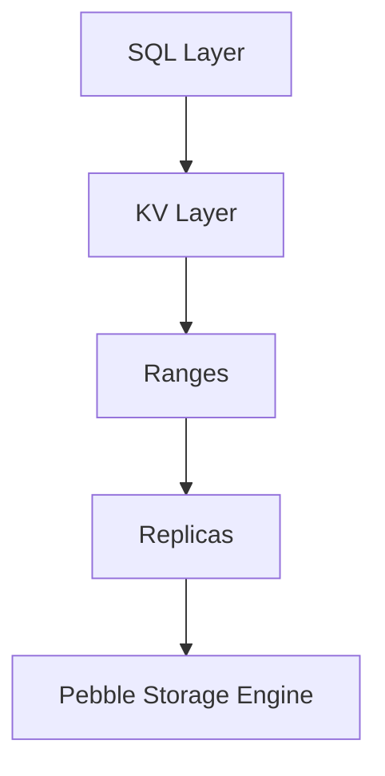

# Вопросы на собеседовании: `CockroachDB`

`CockroachDB` (Cockroach Labs, с 2015) — распределённая SQL-база данных, вдохновлённая Google Spanner. **Совместима с wire-протоколом PostgreSQL**, ACID-транзакции через множество узлов, поддержка multi-region. Open-source (лицензия BSL). Конкуренты: Spanner, Aurora, YugabyteDB, TiDB.

## Полезные ссылки

### Официальная документация и авторитетные источники

- [CockroachDB Documentation](https://www.cockroachlabs.com/docs/)
- [CockroachDB Architecture](https://www.cockroachlabs.com/docs/stable/architecture/overview.html)
- [Spanner Paper](https://research.google/pubs/pub39966/) — original inspiration
- [DistSQL — Cockroach Architecture](https://www.cockroachlabs.com/blog/distributed-sql-key-features/)
- [YugabyteDB vs CockroachDB](https://www.yugabyte.com/yugabytedb-vs-cockroachdb/)

## Содержание

- [Полезные ссылки](#полезные-ссылки)
- [See also](#see-also)

**Базовые понятия**
- [Q1. (!) Что такое CockroachDB?](#q1--что-такое-cockroachdb)
- [Q2. (!) NewSQL — что это?](#q2--newsql--что-это)
- [Q3. (!) Что значит «вдохновлена Google Spanner»?](#q3--что-значит-вдохновлена-google-spanner)

**Архитектура**
- [Q4. (!) Как устроена архитектура: ranges, replicas, leases?](#q4--как-устроена-архитектура-ranges-replicas-leases)
- [Q5. Как работает консенсус Raft?](#q5-как-работает-консенсус-raft)
- [Q6. (!) Как работает разбиение range-ов (range splitting)?](#q6--как-работает-разбиение-range-ов-range-splitting)
- [Q7. Что такое Hybrid Logical Clocks (HLC)?](#q7-что-такое-hybrid-logical-clocks-hlc)

**Распределённость**
- [Q8. (!) Как работают multi-region развёртывания?](#q8--как-работают-multi-region-развёртывания)
- [Q9. (!) Чем region survival отличается от zone survival?](#q9--чем-region-survival-отличается-от-zone-survival)
- [Q10. Что такое locality-настройки и зачем они нужны?](#q10-что-такое-locality-настройки-и-зачем-они-нужны)
- [Q11. Как работает гео-партиционирование (geo-partitioning, data locality)?](#q11-как-работает-гео-партиционирование-geo-partitioning-data-locality)

**SQL и совместимость**
- [Q12. (!) Насколько CockroachDB совместима с PostgreSQL?](#q12--насколько-cockroachdb-совместима-с-postgresql)
- [Q13. Как реализованы ACID-транзакции?](#q13-как-реализованы-acid-транзакции)
- [Q14. Какие уровни изоляции есть (по умолчанию Serializable)?](#q14-какие-уровни-изоляции-есть-по-умолчанию-serializable)

**Производительность**
- [Q15. (!) Как устроена стратегия шардирования (sharding)?](#q15--как-устроена-стратегия-шардирования-sharding)
- [Q16. Какие типы индексов поддерживаются?](#q16-какие-типы-индексов-поддерживаются)
- [Q17. (!) Какие ограничения у CockroachDB по сравнению с PostgreSQL?](#q17--какие-ограничения-у-cockroachdb-по-сравнению-с-postgresql)

**Сравнения**
- [Q18. (!) Чем CockroachDB отличается от Spanner?](#q18--чем-cockroachdb-отличается-от-spanner)
- [Q19. (!) Чем CockroachDB отличается от Aurora?](#q19--чем-cockroachdb-отличается-от-aurora)
- [Q20. Чем CockroachDB отличается от YugabyteDB?](#q20-чем-cockroachdb-отличается-от-yugabytedb)
- [Q21. Чем CockroachDB отличается от TiDB?](#q21-чем-cockroachdb-отличается-от-tidb)

**Прод**
- [Q22. (!) Когда выбрать CockroachDB?](#q22--когда-выбрать-cockroachdb)
- [Q23. Что означает лицензия BSL?](#q23-что-означает-лицензия-bsl)
- [Q24. Какие частые проблемы?](#q24-какие-частые-проблемы)

## Q1. (!) Что такое CockroachDB?

**CockroachDB** — распределённая SQL-база данных, которая ведёт себя как один PostgreSQL, но физически размазана по множеству узлов и переживает отказы без потери данных и без ручного шардирования.

Ключевая идея: взять привычный SQL и ACID, но дать им горизонтальное масштабирование и отказоустойчивость уровня NoSQL. За это отвечают четыре свойства, и они связаны:

- **Горизонтальное масштабирование** — добавляешь узел, ёмкость и пропускная способность растут; данные перебалансируются автоматически.
- **Высокая доступность** — нет единой точки отказа: каждый кусок данных реплицирован, потеря узла не роняет кластер.
- **Строгая согласованность** — ACID и изоляция Serializable даже при записи через несколько узлов; приложение не видит «грязных» промежуточных состояний.
- **Совместимость с PostgreSQL** — говорит по wire-протоколу PG, поэтому драйверы, ORM и инструменты PostgreSQL работают почти без переделок.
- **Multi-region** — кластер можно растянуть на несколько географических регионов с контролем, где лежат данные.

**Происхождение:** создана в 2015 году бывшими инженерами Google, работавшими над Spanner и F1, — отсюда и архитектурное родство со Spanner.

**Сценарии применения:**
- Глобальные приложения, которым одновременно нужны масштаб и сильная согласованность.
- Финансовые системы — банковские реестры, платёжные платформы, где аномалии недопустимы.
- Multi-region SaaS с пользователями в разных частях света.
- Приложения, переросшие одиночный PostgreSQL и упёршиеся в его вертикальный потолок.

## Q2. (!) NewSQL — что это?

**NewSQL** — это класс баз данных, который пытается получить лучшее сразу из двух миров: SQL-интерфейс и ACID-гарантии классических РСУБД плюс горизонтальную масштабируемость NoSQL. Раньше приходилось выбирать одно из двух; NewSQL отказывается от этого выбора.

Откуда взялся: традиционный SQL не масштабировался за пределы одной машины, а NoSQL ради масштаба пожертвовал транзакциями, join-ами и сильной согласованностью. NewSQL закрывает этот разрыв.

**Что он даёт по сравнению с каждым полюсом:**
- **Против традиционного SQL** — выходит за пределы одной машины: данные и нагрузка распределяются по узлам.
- **Против NoSQL** — сохраняет полноценный SQL, ACID-транзакции и join-ы, а не «eventual consistency» и денормализацию.

**Представители:** Google Spanner, CockroachDB, YugabyteDB, TiDB, VoltDB.

**Компромисс:** за это платят более сложным внутренним устройством (распределённый консенсус, координация транзакций), и на нагрузке, помещающейся в один узел, NewSQL нередко медленнее обычного PostgreSQL — накладные расходы распределённости окупаются только на масштабе.

## Q3. (!) Что значит «вдохновлена Google Spanner»?

CockroachDB переносит архитектурные идеи Spanner в open-source-мир, но реализует их так, чтобы работать на обычном железе — без атомных часов, доступных только Google.

**Spanner** (Google, 2012) — первая в мире глобально-распределённая SQL-БД. На чём он держится:

- **TrueTime** — API над атомными часами и GPS, дающий глобально согласованные метки времени с маленькой погрешностью.
- **Консенсус Paxos** — для согласованной репликации между узлами.
- **Multi-region записи** — запись в нескольких регионах с сохранением согласованности.
- **External consistency** — сильнейшая гарантия: порядок транзакций совпадает с порядком в реальном времени.

**CockroachDB повторяет эти концепции на доступном железе, заменяя ключевые компоненты:**

- **Hybrid Logical Clocks (HLC)** вместо TrueTime — потому что у обычных дата-центров нет атомных часов, и приходится сочетать NTP-время с логическим счётчиком.
- **Консенсус Raft** вместо Paxos — проще в реализации и понимании при тех же гарантиях.
- **Open-source** — Spanner доступен только как managed-сервис в GCP, CockroachDB можно развернуть где угодно.

Итог: к **2025** CockroachDB — основная open-source распределённая SQL-база, делающая идеи Spanner доступными вне Google.

## Q4. (!) Как устроена архитектура: ranges, replicas, leases?



CockroachDB не хранит таблицы целиком на узлах: он разбивает всё пространство ключей на непрерывные куски (ranges), реплицирует каждый кусок отдельно и для каждого выбирает «главную» реплику, через которую идут запросы. Эти три понятия — range, replica, lease — и составляют ядро архитектуры.

**Range** — непрерывный фрагмент пространства ключей (по умолчанию до 512 MB).
- Идентифицируется парой граничных ключей (начальный/конечный).
- Каждый range реплицируется и масштабируется **независимо** от остальных — это и даёт горизонтальное масштабирование.

**Replica** — физическая копия range на конкретном узле. По умолчанию у каждого range **3 реплики**, разнесённые по разным узлам ради отказоустойчивости.

**Lease (leaseholder)** — одна из реплик range назначается leaseholder и становится единственной точкой, которая координирует чтения и записи в этот range. Это нужно, чтобы не запускать дорогой консенсус на каждое чтение: leaseholder может обслуживать чтения локально.

**Raft-группа** — все реплики одного range образуют свою Raft-группу и согласуют записи через консенсус. Как правило leaseholder одновременно является и лидером Raft, поэтому запись и её репликация координируются из одного места.

## Q5. Как работает консенсус Raft?

**Raft** — это алгоритм, который позволяет группе реплик договориться о едином порядке записей, даже если часть узлов отказала. Запись считается зафиксированной, только когда её подтвердило большинство реплик, — поэтому ни один отдельный сбой не приводит к потере или расхождению данных. Важная деталь: CockroachDB запускает **отдельную Raft-группу на каждый range**, а не один консенсус на весь кластер, — это и позволяет масштабироваться.

**Как проходит запись:**
1. Лидер группы (он же leaseholder) принимает запись.
2. Реплицирует её на followers (остальные реплики).
3. Как только запись подтвердило **большинство** реплик (кворум) — она считается закоммиченной.
4. Запись применяется к state machine на каждой реплике.

**Почему кворум = «большинство»:** так гарантируется, что любые два кворума пересекаются хотя бы в одной реплике, и закоммиченная запись не может «потеряться» при последующих выборах.

- **3 реплики:** кворум = 2, кластер переживает отказ 1 реплики.
- **5 реплик:** кворум = 3, переживает отказ 2 реплик.

**Отказ лидера:** если лидер пропал, оставшиеся реплики по таймауту автоматически переизбирают нового — ручное вмешательство не требуется.

## Q6. (!) Как работает разбиение range-ов (range splitting)?

Когда range вырастает за порог (~512 MB), CockroachDB **сам** делит его пополам на два range, которые дальше живут и реплицируются независимо. Это автоматический механизм — администратору не нужно вручную решать, как нарезать данные.

```
Range 1: keys A-K (512 MB)
  ↓ growing к 1 GB
Split into:
  Range 1a: keys A-G (256 MB)
  Range 1b: keys G-K (256 MB)
```

**Зачем это нужно:** после разбиения новые range-ы можно разнести по узлам, и нагрузка распределяется. Новые range-ы система размещает на недозагруженных узлах — так выравнивается и объём данных, и пропускная способность.

**Ручное разбиение** доступно, когда нужно подготовить таблицу заранее:
```sql
ALTER TABLE orders SPLIT AT VALUES (100), (200), (300);
```

**Сценарий применения:** перед массовым импортом (bulk import) — заранее нарезанные range-ы дают параллельную запись на много узлов сразу, вместо того чтобы упереться в один range, пока авто-разбиение будет догонять.

## Q7. Что такое Hybrid Logical Clocks (HLC)?

**HLC** — это способ присваивать событиям глобально упорядоченные метки времени без атомных часов: к физическому времени (NTP) добавляется логический счётчик, который доупорядочивает события, происходящие «почти одновременно».

**Формат метки:** `(physical_time, logical_counter)`. Физическая часть берётся из NTP-времени, а логический счётчик инкрементируется, когда два события приходят в один и тот же физический такт, — так получается строгий порядок даже при неточных часах.

**Почему не TrueTime:** у Spanner есть аппаратные атомные часы, у обычного дата-центра — нет. Отсюда разная погрешность:
- Spanner: атомные часы → крошечная неопределённость (~7 мс).
- CockroachDB: NTP + HLC → бо́льшая неопределённость (~250 мс — 1 с).

**Чем за это платит CockroachDB:** раз часы менее точны, при некоторых операциях нельзя сразу сказать, какое событие произошло раньше, и приходится:
- иногда **переждать окно неопределённости часов (clock uncertainty)**, прежде чем отдать результат;
- использовать повторные попытки (retries) для разрешения возникающих конфликтов;
- мириться с чуть более высокой латентностью записи.

На практике точности NTP+HLC хватает для подавляющего большинства нагрузок.

## Q8. (!) Как работают multi-region развёртывания?

Один кластер CockroachDB можно растянуть на несколько географических регионов и при этом контролировать, где физически лежат реплики каждого куска данных. Это позволяет одновременно держать данные ближе к пользователям и переживать отказ целого региона.

```
us-east (3 replicas)
us-west (3 replicas)
eu-west (3 replicas)
```

**Две стратегии устойчивости** (задаются на уровне БД):
- **Region survival** — кластер переживает отказ целого региона.
- **Zone survival** — переживает отказ зоны внутри региона; дешевле и быстрее, но не спасает от падения всего региона.

**Ключевой компромисс — чтения против записей:**
- **Чтения** могут обслуживаться локально ближайшей репликой → низкая латентность.
- **Записи** должны собрать кворум, а при region survival реплики разнесены по регионам, поэтому подтверждение идёт через континенты → латентность записи выше. Это фундаментальная цена кросс-региональной согласованности.

## Q9. (!) Чем region survival отличается от zone survival?

Разница — в том, отказ какого масштаба кластер должен пережить без простоя, и эта разница напрямую определяет латентность записи. Чем шире разнесены реплики, тем больше отказов переживёшь, но тем дальше ехать кворуму.

**Zone survival** — реплики разнесены по зонам внутри одного региона:
- переживает отказ зоны (но не всего региона);
- **ниже латентность** записи — зоны рядом, кворум собирается быстро;
- дешевле — трафик и реплики в пределах одного региона.

**Region survival** — реплики разнесены по нескольким регионам:
- переживает отказ целого региона;
- **выше латентность** записи — кворум нужно собрать через регионы;
- дороже — кросс-региональный трафик и больше инфраструктуры.

```sql
ALTER DATABASE my_db SURVIVE REGION FAILURE;
```

**Рекомендация:**
- **Zone survival** покрывает большинство случаев — отказ зоны куда вероятнее, чем падение целого региона.
- **Region survival** берут, когда этого требует комплаенс или приложение действительно критично и должно работать даже при потере региона — сознательно платя латентностью записи.

## Q10. Что такое locality-настройки и зачем они нужны?

Locality — это метки, которыми каждый узел при старте сообщает кластеру, где он физически находится (регион, зона). Без этих меток CockroachDB не знает топологию и не может разумно размещать реплики — он будет считать все узлы равноудалёнными.

```bash
cockroach start --locality=region=us-east-1,zone=us-east-1a
```

**Зная locality, CockroachDB может:**
- разносить реплики одного range по разным зонам/регионам — изоляция отказов (две реплики не лягут вместе при падении одной зоны);
- размещать **leaseholder** ближе к пользователю — чтения и записи идут к близкой реплике, латентность падает;
- выполнять **follower reads** — отдавать чтение из локальной (не-лидерской) реплики, не гоняя запрос в другой регион.

## Q11. Как работает гео-партиционирование (geo-partitioning, data locality)?

Гео-партиционирование — это привязка строк таблицы к конкретному региону по значению колонки. Строки с разными значениями (например, страной клиента) физически хранятся в разных регионах. Решает сразу две задачи: соответствие законам о хранении данных (GDPR) и низкую латентность для локальных пользователей.

```sql
ALTER TABLE customers
PARTITION BY LIST (region) (
    PARTITION europe VALUES IN ('FR', 'DE'),
    PARTITION us VALUES IN ('US')
);

ALTER PARTITION europe OF TABLE customers
CONFIGURE ZONE USING constraints = '[+region=eu-west]';

ALTER PARTITION us OF TABLE customers
CONFIGURE ZONE USING constraints = '[+region=us-east]';
```

**Что это даёт:**
- Европейские клиенты → данные физически в EU (соответствие GDPR — данные не покидают регион).
- Клиенты из США → данные в US.
- Локальные чтения и записи для каждого региона → низкая латентность.

Это аналог regional placement у Spanner.

## Q12. (!) Насколько CockroachDB совместима с PostgreSQL?

Совместимость идёт на уровне **wire-протокола PostgreSQL**, а не форка кодовой базы PG. Это важное различие: драйверы и инструменты подключаются как к настоящему PostgreSQL и большинство приложений работают без изменений, но набор поддерживаемых SQL-фич — собственный, и совпадает с PG не на 100%.

**Работает без переделок:**
- стандартный SQL (большая его часть);
- pgBouncer и любые pgwire-клиенты/драйверы;
- ORM (Hibernate, ActiveRecord, Sequelize) — они общаются по тому же протоколу;
- инструменты миграции.

**Не работает или поддерживается ограниченно:**
- специфичные для PostgreSQL расширения (PostGIS, hstore и т.п.);
- часть встроенных функций;
- триггеры;
- хранимые процедуры.

**Подводный камень:** именно потому, что совместимость протокольная, а не «кодовая», миграция PostgreSQL → CockroachDB обычно проходит гладко, но именно поэтому её нужно **тщательно тестировать** — приложение может опираться на фичу, которой в CockroachDB нет.

## Q13. Как реализованы ACID-транзакции?

CockroachDB даёт **полный ACID даже тогда, когда строки транзакции лежат на разных узлах** — это и есть его главная фишка по сравнению с шардированными решениями, где распределённых транзакций обычно нет.

```sql
BEGIN;
INSERT INTO orders (...) VALUES (...);
UPDATE inventory SET qty = qty - 1 WHERE id = 5;
COMMIT;
```

**Как это устроено под капотом:**
- транзакцию ведёт координатор на узле, принявшем запрос (TxnCoordSender);
- атомарность через несколько range-ов обеспечивается протоколом two-phase commit (2PC) — либо применяются все изменения, либо ни одного;
- при конкуренции за одни и те же строки (contention) транзакции автоматически перезапускаются.

**Подводный камень:** автоматические retries делают транзакции медленными на нагрузке с высокой конкуренцией — много транзакций бьётся за одни строки и постоянно перезапускается. Поэтому CockroachDB лучше всего раскрывается на **слабо конфликтующих** транзакциях, затрагивающих разные данные.

## Q14. Какие уровни изоляции есть (по умолчанию Serializable)?

По умолчанию CockroachDB работает на **SERIALIZABLE** — сильнейшем уровне изоляции, при котором результат конкурентных транзакций всегда эквивалентен какому-то их последовательному выполнению, без аномалий.

**Важное отличие от PostgreSQL:** у PG по умолчанию — **READ COMMITTED**, который допускает ряд аномалий. CockroachDB сознательно выбрал более строгий дефолт, чтобы распределённые транзакции были корректны «из коробки».

**Цена Serializable:** ради этих гарантий конкурирующие транзакции чаще перезапускаются, а записи идут медленнее — приложение должно быть готово к retry-ошибкам.

Начиная с **CockroachDB v23+** добавили опциональный **READ COMMITTED** — в первую очередь ради совместимости с поведением PostgreSQL:

```sql
BEGIN ISOLATION LEVEL READ COMMITTED;
```

**Рекомендация:** Serializable — для логики, критичной к корректности (финансы, инвентарь); READ COMMITTED — когда мигрируешь legacy-приложение, заточенное под поведение PostgreSQL, и переписывать его под retries дороже, чем смириться с более слабой изоляцией.

## Q15. (!) Как устроена стратегия шардирования (sharding)?

В CockroachDB шардирование **автоматическое** — в отличие от MongoDB или ручного шардирования PostgreSQL, разработчику не нужно заранее выбирать shard key и руками раскидывать данные.

**Как это работает:**
- данные нарезаются на range-ы по **первичному ключу** (по умолчанию — по хешу);
- при росте range делится (~512 MB) и разносится по узлам;
- при добавлении узлов кластер сам ребалансирует range-ы — выравнивает нагрузку.

**Ручные рычаги, если автоматики мало:**
- `PARTITION BY` — гео-партиционирование (привязка строк к регионам);
- `SPLIT AT` — ручное разбиение range-ов (например, перед bulk import);
- `INDEX (col) USING HASH` — hash-sharded индекс, чтобы разнести нагрузку и избежать hot ranges.

**Главный подводный камень — hot range.** Поскольку range-ы нарезаются по диапазону PK, монотонно растущий первичный ключ (timestamp, sequence) направляет все новые записи в один и тот же «последний» range — и весь его трафик ложится на один leaseholder, сводя на нет распределённость. Лечится **UUID** (случайный ключ распределяет записи) или **hash-sharded индексом**.

## Q16. Какие типы индексов поддерживаются?

Набор близок к PostgreSQL, но с одним специфичным для распределённой БД дополнением — hash-sharded индексами.

**Стандартные B-tree индексы** — обычные одиночные и составные:
```sql
CREATE INDEX ON orders (customer_id);
CREATE INDEX ON orders (customer_id, created_at);
```

**Hash-sharded индексы** — уникальны для CockroachDB: префиксуют ключ хешем, чтобы «размазать» монотонно растущие значения по нескольким range-ам и убрать hot range:
```sql
CREATE INDEX ON events (timestamp) USING HASH WITH BUCKET_COUNT = 8;
```

**Частичные индексы (partial indexes)** — индексируют только подмножество строк, экономя место и ускоряя запросы по этому подмножеству:
```sql
CREATE INDEX active_users ON users (last_login) WHERE active = true;
```

**Инвертированные индексы (inverted indexes)** — для поиска внутри JSONB:
```sql
CREATE INVERTED INDEX ON orders (data);
```

**Пространственные индексы (spatial indexes)** — есть, но с ограниченной поддержкой PostGIS.

## Q17. (!) Какие ограничения у CockroachDB по сравнению с PostgreSQL?

Поскольку CockroachDB совместим с PostgreSQL по протоколу, а не является его форком, часть привычных по PG возможностей отсутствует или урезана. Это и есть главный риск при миграции — приложение может тихо зависеть от такой фичи.

**Отсутствует или поддерживается ограниченно:**
- хранимые процедуры (ограниченно);
- триггеры (ограниченно);
- материализованные представления (поддержка появилась позже);
- полнотекстовый поиск (ограниченно);
- PostGIS (ограниченно);
- часть JSONB-операторов;
- `LISTEN/NOTIFY`;
- foreign data wrappers (FDW);
- тип `XML`;
- пользовательские типы (ограниченно);
- `LATERAL` join-ы (частично).

**Подводный камень:** перед переездом legacy PostgreSQL-приложения этот список нужно сверить с тем, что реально использует код, и тщательно протестировать миграцию — иначе несовместимость всплывёт уже в проде.

## Q18. (!) Чем CockroachDB отличается от Spanner?

Идеи общие (обе — распределённый SQL по мотивам одной архитектуры), но Spanner — закрытый managed-сервис Google с атомными часами, а CockroachDB переносит ту же модель на обычное железо и в open-source.

| Критерий | CockroachDB | Spanner |
|-----------|-------------|---------|
| Хостинг | Self-host или CockroachCloud | Только managed в GCP |
| Open source | BSL (в основном бесплатно) | Нет (проприетарная) |
| Время | HLC (на базе NTP) | TrueTime (атомные часы) |
| Согласованность | Serializable | External Consistency (сильнее) |
| SQL | wire-протокол PostgreSQL | Собственный GoogleSQL |
| Multi-region записи | Да | Да |
| Стоимость | Дешевле | $$$$ |
| Экосистема | Растёт | Завязана на GCP |

**Вывод:** Spanner — золотой стандарт распределённого SQL и даёт более сильную гарантию (external consistency за счёт атомных часов), но живёт только в GCP и стоит дорого. CockroachDB делает те же концепции доступными — open-source, на любом облаке, дешевле, ценой чуть более слабой модели согласованности.

## Q19. (!) Чем CockroachDB отличается от Aurora?

Главное отличие — модель записи. Aurora распределяет хранилище, но пишет через **один master**; CockroachDB по-настоящему распределён и принимает записи на **любом узле**. Отсюда расходятся и multi-region, и латентность.

| Критерий | CockroachDB | Aurora PostgreSQL |
|-----------|-------------|-------------------|
| Тип | Распределённый SQL | Распределённое хранилище, один writer |
| Записи | Multi-master (любой узел) | Один master |
| Multi-region | Да (multi-master) | Только read-реплики (или Global DB с одним writer) |
| Согласованность | Всегда Serializable | Дефолты PostgreSQL |
| Совместимость | wire-протокол PostgreSQL | Полный PostgreSQL |

**Вывод:** Aurora — зрелая, по сути drop-in замена PostgreSQL и быстрее на обычных нагрузках в одном регионе, но multi-region у неё ограничен read-репликами либо одним writer-ом. CockroachDB действительно распределён и умеет multi-region записи, но на одиночном узле медленнее из-за накладных расходов координации.

К **2025** для команд на AWS Aurora — **выбор по умолчанию**; CockroachDB берут именно ради multi-region и multi-cloud, где Aurora упирается в свою single-writer-модель.

## Q20. Чем CockroachDB отличается от YugabyteDB?

**YugabyteDB** — ближайший прямой конкурент: тоже распределённый SQL по мотивам Spanner. Различия не в самой идее, а в деталях совместимости и устройства слоёв.

| Критерий | CockroachDB | YugabyteDB |
|-----------|-------------|------------|
| Происхождение | Cockroach Labs (ex-Google) | Yugabyte (ex-Facebook) |
| Архитектура | Единый SQL-слой | Двухуровневая (YSQL + YCQL) |
| Совместимость с PostgreSQL | wire-протокол | **Полный PostgreSQL** (форк кода PG) |
| Совместимость с Cassandra | Нет | **Да (YCQL)** |
| Open source | BSL | Apache 2.0 (свободнее) |
| Производительность | — | Часто быстрее |

**Ключевое различие:** YugabyteDB переиспользует код самого PostgreSQL (форк его SQL-слоя), поэтому поддерживает больше PG-фич «из коробки» — совместимость теснее. Плюс у него есть Cassandra-совместимый интерфейс (YCQL), которого нет у CockroachDB. Лицензия Apache 2.0 свободнее, чем BSL.

К **2025** конкуренция плотная, и оба варианта жизнеспособны — выбор чаще диктуется требованиями к совместимости и лицензии, а не «кто лучше вообще».

## Q21. Чем CockroachDB отличается от TiDB?

**TiDB** (PingCAP, Китай) — ещё один распределённый SQL, но из MySQL-мира и с упором на аналитику. Это и определяет его нишу: MySQL-совместимость плюс HTAP (транзакции и аналитика в одной системе).

| Критерий | CockroachDB | TiDB |
|-----------|-------------|------|
| Совместимость | PostgreSQL | **MySQL** |
| Архитектура | Монолитная | Раздельные compute (TiDB) + storage (TiKV) |
| HTAP (аналитика) | Ограниченно | **Сильно** (TiFlash для колоночного хранения) |
| Open source | BSL | Apache 2.0 |
| Распространение | Запад (US, EU) | Китай (PingCAP) + глобально |

**Вывод:** TiDB выбирают под MySQL-совместимые нагрузки и HTAP-сценарии (благодаря раздельным compute/storage и колоночному TiFlash он сильнее в аналитике). CockroachDB — под PostgreSQL-совместимые нагрузки и multi-region.

## Q22. (!) Когда выбрать CockroachDB?

Короткий ответ: CockroachDB оправдан там, где одновременно нужны масштаб/гео-распределённость и сильная согласованность, — и проигрывает, когда хватает одного PostgreSQL в одном регионе. Сильные стороны (multi-region записи, авто-шардирование) на простых сценариях превращаются в лишние накладные расходы.

**Выбирай, когда:**
- нужны **multi-region записи** — низкая латентность записи для пользователей по всему миру;
- **перерастаешь PostgreSQL** — упёрся в вертикальный потолок одного инстанса;
- нужна **строгая согласованность** — финансы, регулируемые отрасли;
- хочешь **multi-cloud** и уход от vendor lock-in;
- нужно **гео-партиционирование** ради комплаенса (GDPR);
- принципиален open-source (в противовес проприетарному Spanner).

**Не выбирай, когда:**
- всё в одном регионе — Aurora/RDS быстрее и проще, распределённость не нужна;
- нужны все возможности PostgreSQL (расширения и т.п.) — часть из них не поддержана;
- нагрузка почти на чтение при редких записях — хватит read-реплик обычного PG;
- критична стоимость — узлы CockroachDB дорогие, а managed Cloud-версия тем более;
- нужна аналитика в реальном времени — это OLTP-, а не OLAP-система.

## Q23. Что означает лицензия BSL?

**Business Source License (BSL)** — это «почти open-source» лицензия, под которой CockroachDB распространяется с 2019 года. Она открывает код для большинства применений, но закрывает ровно один сценарий — перепродажу продукта как managed-сервиса.

**Что разрешено и что нет:**
- **запрещено** предлагать CockroachDB **как сервис** третьим лицам без коммерческой лицензии;
- **разрешено** всё остальное — self-host, изменение кода, использование в своих продуктах — бесплатно.

**Временной механизм:** через 3 года каждая версия автоматически становится **Apache 2.0**, то есть старые релизы превращаются в полноценный open-source.

**Зачем так сделали:** цель — не дать AWS/Google запустить «CockroachDB as a Service» и тем самым подорвать бизнес Cockroach Labs, которая сама продаёт managed-сервис CockroachCloud. По духу это похоже на путь Elastic (которая ушла с Apache на SSPL по той же причине).

## Q24. Какие частые проблемы?

Большинство граблей в продакшене — это обратная сторона распределённости: то, что даёт масштаб и согласованность, при неправильной настройке оборачивается hot range-ами, лишними retries и кросс-региональной латентностью.

1. **Hot ranges** — монотонный PK перегружает один range; лечится UUID или hash-sharded индексом.
2. **Высокая латентность записи** — при region survival кворум собирается через регионы и записи медленные.
3. **Повторы транзакций** — Serializable + contention дают шквал retries; приложение должно их корректно обрабатывать.
4. **Ошибки при переходе с PostgreSQL** — совместимость неполная, поэтому миграцию нужно тщательно тестировать.
5. **Крупные транзакции** — медленные, с проблемами блокировок; лучше дробить.
6. **Недостаточно узлов** — после отказов кворум становится недостижим, и range встаёт.
7. **Неверная locality** — если реплики оказались в одной зоне, отказ этой зоны кладёт данные; смысл репликации теряется.
8. **Сюрпризы по стоимости** — managed CockroachCloud на масштабе дорогой.
9. **Слабая стратегия бэкапов** — встроенные бэкапы работают, но требуют правильной настройки.
10. **OLAP-запросы** — система не для аналитики; тяжёлые отчёты выноси в ClickHouse/Snowflake.

Итог: к **2025** CockroachDB — зрелый выбор для распределённого SQL, но грамотная эксплуатация требует **экспертизы** — настроить locality, разложить ключи и научить приложение жить с retries.

---

## See also

- [PostgreSQL](postgresql-interview.md) — main compatibility target
- [ScyllaDB](scylladb-interview.md) — distributed wide-column (for сравнения)
- [Cassandra](cassandra-interview.md) — wide-column NoSQL
- [MongoDB](mongodb-interview.md) — document
- [DynamoDB](dynamodb-interview.md) — managed NoSQL
- [Database Architecture](database-architecture-interview.md) — distributed SQL context
- [Распределённые системы](../architecture/distributed-systems-interview.md) — Raft, consensus
- [CAP Theorem](../architecture/cap-theorem-interview.md) — consistency vs availability
- [Микросервисы](../architecture/microservices-interview.md) — где CockroachDB fits
- [Scalability Patterns](../architecture/scalability-patterns-interview.md) — horizontal scaling
- [Паттерны согласованности](../architecture/consistency-patterns-interview.md) — strong consistency
- [GCP](../cloud/gcp-interview.md) — Spanner alternative
- [AWS](../cloud/aws-interview.md) — Aurora alternative

- [Apache Cassandra](cassandra-interview.md)
- [ClickHouse](clickhouse-interview.md)
- [Database Architecture](database-architecture-interview.md)
- [Транзакции и уровни изоляции](database-transactions-interview.md)
- [DynamoDB](dynamodb-interview.md)
- [Elasticsearch](elasticsearch-interview.md)
