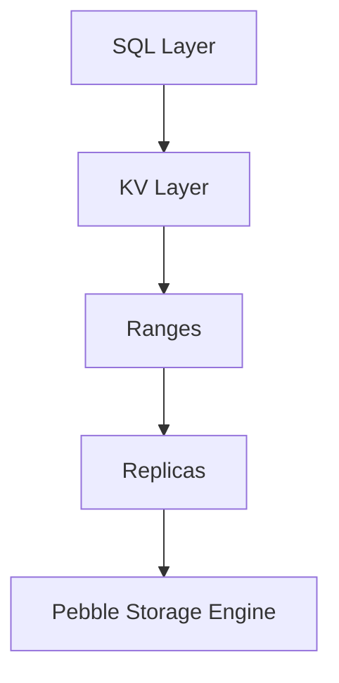

# Вопросы на собеседовании: `CockroachDB`

`CockroachDB` (Cockroach Labs, с 2015) — распределённая SQL-база данных, вдохновлённая Google Spanner. **Совместима с wire-протоколом PostgreSQL**, ACID-транзакции через множество узлов, поддержка multi-region. Open-source (лицензия BSL). Конкуренты: Spanner, Aurora, YugabyteDB, TiDB.

## Полезные ссылки

### Официальная документация и авторитетные источники

- [CockroachDB Documentation](https://www.cockroachlabs.com/docs/)
- [CockroachDB Architecture](https://www.cockroachlabs.com/docs/stable/architecture/overview.html)
- [Spanner Paper](https://research.google/pubs/pub39966/) — original inspiration
- [DistSQL — Cockroach Architecture](https://www.cockroachlabs.com/blog/distributed-sql-key-features/)
- [YugabyteDB vs CockroachDB](https://www.yugabyte.com/yugabytedb-vs-cockroachdb/)

## Содержание

- [Полезные ссылки](#полезные-ссылки)
- [See also](#see-also)

**Базовые понятия**
- [Q1. (!) Что такое CockroachDB?](#q1--что-такое-cockroachdb)
- [Q2. (!) NewSQL — что это?](#q2--newsql--что-это)
- [Q3. (!) Inspired by Google Spanner — что значит?](#q3--inspired-by-google-spanner--что-значит)

**Архитектура**
- [Q4. (!) Architecture: ranges, replicas, leases?](#q4--architecture-ranges-replicas-leases)
- [Q5. Raft consensus?](#q5-raft-consensus)
- [Q6. (!) Range splitting?](#q6--range-splitting)
- [Q7. Hybrid Logical Clocks (HLC)?](#q7-hybrid-logical-clocks-hlc)

**Distribution**
- [Q8. (!) Multi-region deployments?](#q8--multi-region-deployments)
- [Q9. (!) Region survival vs zone survival?](#q9--region-survival-vs-zone-survival)
- [Q10. Locality settings?](#q10-locality-settings)
- [Q11. Geo-partitioning (data locality)?](#q11-geo-partitioning-data-locality)

**SQL и compatibility**
- [Q12. (!) PostgreSQL compatibility?](#q12--postgresql-compatibility)
- [Q13. ACID transactions?](#q13-acid-transactions)
- [Q14. Isolation levels (Serializable default)?](#q14-isolation-levels-serializable-default)

**Performance**
- [Q15. (!) Sharding strategy?](#q15--sharding-strategy)
- [Q16. Index types?](#q16-index-types)
- [Q17. (!) Limitations vs PostgreSQL?](#q17--limitations-vs-postgresql)

**Сравнения**
- [Q18. (!) CockroachDB vs Spanner?](#q18--cockroachdb-vs-spanner)
- [Q19. (!) CockroachDB vs Aurora?](#q19--cockroachdb-vs-aurora)
- [Q20. CockroachDB vs YugabyteDB?](#q20-cockroachdb-vs-yugabytedb)
- [Q21. CockroachDB vs TiDB?](#q21-cockroachdb-vs-tidb)

**Production**
- [Q22. (!) Когда выбрать CockroachDB?](#q22--когда-выбрать-cockroachdb)
- [Q23. License (BSL) — что значит?](#q23-license-bsl--что-значит)
- [Q24. Какие частые проблемы?](#q24-какие-частые-проблемы)

## Q1. (!) Что такое CockroachDB?

**CockroachDB** — распределённая SQL-база данных, спроектированная под:
- **Горизонтальное масштабирование** (добавляешь узлы — растёт ёмкость)
- **Высокую доступность** (нет единой точки отказа)
- **Строгую согласованность** (ACID, Serializable)
- **Совместимость с PostgreSQL** (wire-протокол)
- **Multi-region** (гео-распределённость)

**Создана** бывшими сотрудниками Google (работавшими над Spanner, F1) в 2015 году.

**Применения:**
- Глобальные приложения, которым нужна согласованность
- Финансовые системы (банковские реестры, платёжные платформы)
- Multi-region SaaS
- Приложения, переросшие одиночный PostgreSQL

## Q2. (!) NewSQL — что это?

**NewSQL** — класс баз данных, сочетающих:
- **SQL-интерфейс + ACID** (как у традиционных RDBMS)
- **Горизонтальную масштабируемость** (как у NoSQL)

**Примеры:**
- Google Spanner
- CockroachDB
- YugabyteDB
- TiDB
- VoltDB

**В сравнении с традиционным SQL:** масштабируется за пределы одной машины.
**В сравнении с NoSQL:** сохраняет SQL, ACID и join-ы.

**Компромисс:** более сложное внутреннее устройство, иногда медленнее на single-node нагрузках.

## Q3. (!) Inspired by Google Spanner — что значит?

**Spanner** (Google, 2012) — первая глобально-распределённая SQL-БД.

**Ключевые концепции Spanner:**
- **TrueTime** — атомные часы для глобально согласованных меток времени
- **Консенсус Paxos**
- **Multi-region записи**
- **External consistency** (внешняя согласованность)

**CockroachDB** реализует похожие концепции **без атомных часов**:
- **Hybrid Logical Clocks (HLC)** вместо TrueTime
- **Консенсус Raft** вместо Paxos
- **Open-source** (Spanner — только managed)

В **2025** CockroachDB — основная open-source распределённая SQL.

## Q4. (!) Architecture: ranges, replicas, leases?



**Range** — непрерывный фрагмент данных (по умолчанию 512 MB).
- Идентифицируется начальным/конечным ключами
- Каждый range реплицируется **независимо**

**Replica** — копия range на узле. По умолчанию **3 реплики**.

**Lease** — у каждого range есть **leaseholder** (одна реплика). Он координирует чтения и записи в этот range.

**Raft-группа** — все реплики range образуют Raft-группу, leaseholder = лидер Raft (как правило).

## Q5. Raft consensus?

**Raft** — алгоритм распределённого консенсуса. CockroachDB использует **отдельный Raft на каждый range**.

**Процесс:**
1. Лидер (leaseholder) принимает запись
2. Реплицирует её на followers
3. Как только **большинство** (кворум) подтвердило → commit
4. Применяется к state machine

**3 реплики:** кворум = 2. Переживает 1 отказ.
**5 реплик:** кворум = 3. Переживает 2 отказа.

**Выбор лидера:** Raft автоматически переизбирает лидера при отказах.

## Q6. (!) Range splitting?

**Автоматическое разбиение (auto-splitting)** на ~512 MB.

```
Range 1: keys A-K (512 MB)
  ↓ growing к 1 GB
Split into:
  Range 1a: keys A-G (256 MB)
  Range 1b: keys G-K (256 MB)
```

**Распределение:** новые range-ы размещаются на недозагруженных узлах.

**Ручное разбиение (manual split)** ради производительности:
```sql
ALTER TABLE orders SPLIT AT VALUES (100), (200), (300);
```

Полезно **перед массовым импортом (bulk import)** — для распределённой производительности записи.

## Q7. Hybrid Logical Clocks (HLC)?

**HLC** объединяет **физическое время** (NTP) + **логический счётчик** для глобально упорядоченных меток времени.

**Формат:** `(physical_time, logical_counter)`

**В сравнении с TrueTime у Spanner:**
- Spanner: аппаратные атомные часы → крошечная неопределённость (~7 мс)
- CockroachDB: NTP + HLC → бо́льшая неопределённость (~250 мс — 1 с)

**Последствия для CockroachDB:**
- Иногда нужно **переждать неопределённость часов (clock uncertainty)** для части операций
- Использует повторные попытки (retries) для разрешения конфликтов
- Чуть более высокая латентность записи

На практике этого достаточно для большинства нагрузок.

## Q8. (!) Multi-region deployments?

CockroachDB поддерживает **развёртывание сразу в нескольких регионах**.

```
us-east (3 replicas)
us-west (3 replicas)
eu-west (3 replicas)
```

**Стратегии репликации:**
- **Region survival** — переживание отказа целого региона
- **Zone survival** — переживание отказа зоны (дешевле)

**Чтения:** могут быть локальными (ближайшая реплика).
**Записи:** требуют кворума через регионы → выше латентность.

## Q9. (!) Region survival vs zone survival?

**Zone survival:**
- Реплики в нескольких зонах одного региона
- Переживает отказ зоны
- **Ниже латентность** (зоны рядом)
- Дешевле (один регион)

**Region survival:**
- Реплики в нескольких регионах
- Переживает отказ целого региона
- **Выше латентность** (кросс-региональный кворум для записей)
- Дороже

```sql
ALTER DATABASE my_db SURVIVE REGION FAILURE;
```

**Рекомендация:**
- **Zone survival** обычно достаточно
- **Region survival** — для требований комплаенса / критичных приложений

## Q10. Locality settings?

**Каждый узел** объявляет свою locality (привязку к региону/зоне):
```bash
cockroach start --locality=region=us-east-1,zone=us-east-1a
```

**CockroachDB использует locality** для того, чтобы:
- Размещать реплики в разных зонах/регионах (изоляция отказов)
- **Размещать leaseholder** ближе к пользователю
- Делать **follower reads** (чтение из локальной реплики)

## Q11. Geo-partitioning (data locality)?

**Партиционирование таблицы по региону** ради локальности данных (комплаенс, латентность).

```sql
ALTER TABLE customers
PARTITION BY LIST (region) (
    PARTITION europe VALUES IN ('FR', 'DE'),
    PARTITION us VALUES IN ('US')
);

ALTER PARTITION europe OF TABLE customers
CONFIGURE ZONE USING constraints = '[+region=eu-west]';

ALTER PARTITION us OF TABLE customers
CONFIGURE ZONE USING constraints = '[+region=us-east]';
```

**Эффект:**
- Европейские клиенты → данные в EU (соответствие GDPR)
- Клиенты из США → данные в US
- Локальные чтения/записи (низкая латентность)

Аналог regional placement у Spanner.

## Q12. (!) PostgreSQL compatibility?

CockroachDB совместима с **wire-протоколом PostgreSQL**. Большинство приложений работают без изменений.

**Совместимо:**
- Стандартный SQL (большая часть)
- pgBouncer, pgwire-клиенты
- ORM-ы (Hibernate, ActiveRecord, Sequelize)
- Инструменты миграции

**Не совместимо:**
- Специфичные для PostgreSQL расширения (PostGIS, hstore и т.п. — ограниченно)
- Часть функций
- Триггеры (ограниченная поддержка)
- Хранимые процедуры (ограниченно)

**Путь миграции** PostgreSQL → CockroachDB обычно гладкий, но **тщательно тестируй**.

## Q13. ACID transactions?

**Полный ACID** — даже в распределённом режиме.

```sql
BEGIN;
INSERT INTO orders (...) VALUES (...);
UPDATE inventory SET qty = qty - 1 WHERE id = 5;
COMMIT;
```

**Распределённая транзакция:**
- Узлы-координаторы (TxnCoordSender)
- Протокол two-phase commit (2PC)
- Автоматические повторные попытки при конкуренции (contention)

**Медленно** для нагрузок с высоким уровнем конфликтов (из-за retries). Лучше всего подходит для **изолированных** транзакций.

## Q14. Isolation levels (Serializable default)?

**По умолчанию: SERIALIZABLE** (сильнейшая изоляция).

У PostgreSQL по умолчанию — **READ COMMITTED**. У CockroachDB **по умолчанию иначе**.

**Serializable** — гарантирует ACID, без аномалий. **Цена:** больше retries, медленнее записи.

С **CockroachDB v23+** добавили опцию **READ COMMITTED** (для совместимости с PostgreSQL).

```sql
BEGIN ISOLATION LEVEL READ COMMITTED;
```

**Рекомендация:** Serializable для критичной к корректности логики, READ COMMITTED — для миграций legacy-систем.

## Q15. (!) Sharding strategy?

**Авто-шардирование** — без ручной настройки.

CockroachDB **разбивает данные на range-ы** автоматически:
- По **первичному ключу** (по умолчанию — по хешу)
- Размер range ~512 MB
- Автоматическая ребалансировка на новые узлы

**Ручное управление:**
- `PARTITION BY` — гео-партиционирование
- `SPLIT AT` — ручное разбиение range-ов
- `INDEX (col) USING HASH` — hash-sharded индекс (чтобы избежать hot ranges)

**Проблема hot range** — последовательный PK (timestamp, sequence) → все записи идут в один range. Используй **UUID** или **hash-sharded индекс**.

## Q16. Index types?

**Стандартные B-tree индексы:**
```sql
CREATE INDEX ON orders (customer_id);
CREATE INDEX ON orders (customer_id, created_at);
```

**Hash-sharded индексы** (распределяют hot ranges):
```sql
CREATE INDEX ON events (timestamp) USING HASH WITH BUCKET_COUNT = 8;
```

**Частичные индексы (partial indexes):**
```sql
CREATE INDEX active_users ON users (last_login) WHERE active = true;
```

**Инвертированные индексы (inverted indexes)** (для JSONB):
```sql
CREATE INVERTED INDEX ON orders (data);
```

**Пространственные индексы (spatial indexes)** — ограниченная поддержка PostGIS.

## Q17. (!) Limitations vs PostgreSQL?

**CockroachDB не поддерживает (или поддерживает ограниченно):**
- Хранимые процедуры (ограниченно)
- Триггеры (ограниченно)
- Материализованные представления (поддержка появилась позже)
- Полнотекстовый поиск (ограниченно)
- PostGIS (ограниченно)
- Часть JSONB-операторов
- `LISTEN/NOTIFY`
- Foreign data wrappers (FDW)
- Тип `XML`
- Пользовательские типы (ограниченно)
- `LATERAL` join-ы (частично)

**Production:** тщательно тестируй миграцию legacy PostgreSQL-приложений.

## Q18. (!) CockroachDB vs Spanner?

| Критерий | CockroachDB | Spanner |
|-----------|-------------|---------|
| Хостинг | Self-host или CockroachCloud | Только managed в GCP |
| Open source | BSL (в основном бесплатно) | Нет (проприетарная) |
| Время | HLC (на базе NTP) | TrueTime (атомные часы) |
| Согласованность | Serializable | External Consistency (сильнее) |
| SQL | wire-протокол PostgreSQL | Собственный GoogleSQL |
| Multi-region записи | Да | Да |
| Стоимость | Дешевле | $$$$ |
| Экосистема | Растёт | Завязана на GCP |

**Spanner** — золотой стандарт распределённого SQL, но только в GCP и дорого.
**CockroachDB** — делает концепции Spanner доступными, open-source.

## Q19. (!) CockroachDB vs Aurora?

| Критерий | CockroachDB | Aurora PostgreSQL |
|-----------|-------------|-------------------|
| Тип | Распределённый SQL | Распределённое хранилище, один writer |
| Записи | Multi-master (любой узел) | Один master |
| Multi-region | Да (multi-master) | Только read-реплики (или Global DB с одним writer) |
| Согласованность | Всегда Serializable | Дефолты PostgreSQL |
| Совместимость | wire-протокол PostgreSQL | Полный PostgreSQL |

**Aurora** — проверена, drop-in замена PostgreSQL, быстрее на стандартных нагрузках.
**CockroachDB** — действительно распределённая, multi-region записи, медленнее на одиночном узле.

В **2025** Aurora — **выбор по умолчанию** для команд на AWS. CockroachDB — для multi-region, multi-cloud.

## Q20. CockroachDB vs YugabyteDB?

**YugabyteDB** — главный конкурент CockroachDB.

| Критерий | CockroachDB | YugabyteDB |
|-----------|-------------|------------|
| Происхождение | Cockroach Labs (ex-Google) | Yugabyte (ex-Facebook) |
| Архитектура | Единый SQL-слой | Двухуровневая (YSQL + YCQL) |
| Совместимость с PostgreSQL | wire-протокол | **Полный PostgreSQL** (форк кода PG) |
| Совместимость с Cassandra | Нет | **Да (YCQL)** |
| Open source | BSL | Apache 2.0 (свободнее) |
| Производительность | — | Часто быстрее |

У **YugabyteDB** **более тесная совместимость с PostgreSQL** (поддерживается больше возможностей).

В **2025** — плотная конкуренция. Оба варианта жизнеспособны.

## Q21. CockroachDB vs TiDB?

**TiDB** (PingCAP, Китай) — ещё одна распределённая SQL.

| Критерий | CockroachDB | TiDB |
|-----------|-------------|------|
| Совместимость | PostgreSQL | **MySQL** |
| Архитектура | Монолитная | Раздельные compute (TiDB) + storage (TiKV) |
| HTAP (аналитика) | Ограниченно | **Сильно** (TiFlash для колоночного хранения) |
| Open source | BSL | Apache 2.0 |
| Распространение | Запад (US, EU) | Китай (PingCAP) + глобально |

**TiDB** — для MySQL-совместимых нагрузок + HTAP-сценариев.
**CockroachDB** — для PostgreSQL-совместимых + multi-region.

## Q22. (!) Когда выбрать CockroachDB?

**Выбирай когда:**
- Нужны **multi-region записи** (низкая латентность записи по всему миру)
- **Перерастаешь PostgreSQL** (упёрся в масштабирование)
- Требуется **строгая согласованность** (финансы, регулируемые отрасли)
- **Multi-cloud** (уйти от vendor lock-in)
- **Гео-партиционирование** ради комплаенса (GDPR)
- Предпочтителен open-source (в противовес Spanner)

**Не выбирай когда:**
- Один регион — Aurora / RDS быстрее и проще
- Нужны все возможности PostgreSQL (расширения и т.п.)
- Преобладают чтения при малом числе записей (хватит read-реплик)
- Чувствителен к стоимости (узлы CockroachDB дорогие, Cloud-версия $$$)
- Аналитика в реальном времени (не для OLAP)

## Q23. License (BSL) — что значит?

**Business Source License (BSL)** — лицензия CockroachDB с 2019 года.

**Ограничения:**
- **Нельзя предлагать** CockroachDB **как сервис** третьим лицам (без коммерческой лицензии)
- В остальном — бесплатно для self-host, изменения и т.д.

**BSL превращается в Apache 2.0 через 3 года** (то есть старые версии становятся полностью открытыми).

**Похоже на** Elastic License (изначально была Apache → SSPL).

**Эффект:** AWS / Google не могут предлагать «CockroachDB as a Service». Cockroach Labs продаёт managed-сервис CockroachCloud.

## Q24. Какие частые проблемы?

1. **Hot ranges** — последовательный PK перегружает один range. Используй UUID или hash-shard.
2. **Высокая латентность записи** — кросс-региональный кворум медленный.
3. **Повторы транзакций** — Serializable + contention → много retries.
4. **Ошибки при переходе с PostgreSQL** — совместимость неидеальна, тестируй тщательно.
5. **Крупные транзакции** — медленные, проблемы с блокировками.
6. **Недостаточно узлов** — после отказов узлов кворум недостижим.
7. **Неверная конфигурация locality** — реплики в одной зоне (отказ единственной зоны → простой).
8. **Сюрпризы по стоимости** — managed CockroachCloud дорог на масштабе.
9. **Нет нормальной стратегии бэкапов** — встроенные бэкапы требуют правильной настройки.
10. **OLAP-запросы** — не предназначена для них; используй ClickHouse / Snowflake отдельно.

В **2025** CockroachDB — зрелый вариант для распределённого SQL, но требует **экспертизы для грамотной эксплуатации**.

---

## See also

- [PostgreSQL](postgresql-interview.md) — main compatibility target
- [ScyllaDB](scylladb-interview.md) — distributed wide-column (for сравнения)
- [Cassandra](cassandra-interview.md) — wide-column NoSQL
- [MongoDB](mongodb-interview.md) — document
- [DynamoDB](dynamodb-interview.md) — managed NoSQL
- [Database Architecture](database-architecture-interview.md) — distributed SQL context
- [Распределённые системы](../architecture/distributed-systems-interview.md) — Raft, consensus
- [CAP Theorem](../architecture/cap-theorem-interview.md) — consistency vs availability
- [Микросервисы](../architecture/microservices-interview.md) — где CockroachDB fits
- [Scalability Patterns](../architecture/scalability-patterns-interview.md) — horizontal scaling
- [Паттерны согласованности](../architecture/consistency-patterns-interview.md) — strong consistency
- [GCP](../cloud/gcp-interview.md) — Spanner alternative
- [AWS](../cloud/aws-interview.md) — Aurora alternative

- [Apache Cassandra](cassandra-interview.md)
- [ClickHouse](clickhouse-interview.md)
- [Database Architecture](database-architecture-interview.md)
- [Транзакции и уровни изоляции](database-transactions-interview.md)
- [DynamoDB](dynamodb-interview.md)
- [Elasticsearch](elasticsearch-interview.md)
