# Вопросы на собеседовании: `Database Architecture`

Краткие ответы по архитектуре БД: нормализация, `ACID / BASE`, индексы, `SQL / NoSQL`, `MVCC`, `WAL`, репликация, шардирование, партиционирование.

**Архитектура БД** — репликация, шардирование, `CAP`, внутреннее устройство `PostgreSQL` и выбор хранилищ — часто обсуждается на собеседованиях по бэкенду и системному дизайну. Раздел охватывает как теоретические основы, так и практические аспекты: `EXPLAIN ANALYZE`, настройки конфигурации, стратегии партиционирования.

## Полезные ссылки

### Официальная документация

- [PostgreSQL Documentation](https://www.postgresql.org/docs/current/) — официальная документация PostgreSQL
- [PostgreSQL Internals](https://www.interdb.jp/pg/) — бесплатная книга о внутреннем устройстве PostgreSQL
- [Use The Index, Luke](https://use-the-index-luke.com/) — подробное руководство по индексам в SQL
- [CAP Theorem](https://en.wikipedia.org/wiki/CAP_theorem) — теорема CAP
- [MySQL Documentation](https://dev.mysql.com/doc/) — официальная документация MySQL

### Статьи Baeldung

- [What Is a Relational Database?](https://www.baeldung.com/cs/relational-database) — основы реляционных БД и нормализации
- [Database Sharding vs. Partitioning](https://www.baeldung.com/cs/database-sharding-vs-partitioning) — сравнение шардирования и партиционирования
- [Explanation of BASE Terminology](https://www.baeldung.com/cs/db-base-meaning-cap) — BASE vs ACID, CAP-теорема
- [Introduction to Transactions](https://www.baeldung.com/cs/transactions-intro) — введение в транзакции и ACID

## Содержание

- [Полезные ссылки](#полезные-ссылки)
- [See also](#see-also)

**Нормализация и транзакции (ACID, BASE)**
- [Q1. (!) Что такое нормализация?](#q1--что-такое-нормализация)
- [Q2. (!) Что такое BASE?](#q2--что-такое-base)
- [Q3. (!) Что такое ACID?](#q3--что-такое-acid)
- [Q4. (!) В чём разница ACID от BASE?](#q4--в-чём-разница-acid-от-base)
- [Q5. (!) Какие есть типы изоляции транзакций?](#q5--какие-есть-типы-изоляции-транзакций)
- [Q6. (!) Какие проблемы при одновременном доступе несколькими транзакциями?](#q6--какие-проблемы-при-одновременном-доступе-несколькими-транзакциями)
- [Q7. В чем разница между блокировкой строки и таблицы?](#q7-в-чем-разница-между-блокировкой-строки-и-таблицы)

**Внутреннее устройство PostgreSQL**
- [Q8. (!) Что такое MVCC и как он работает в PostgreSQL?](#q8--что-такое-mvcc-и-как-он-работает-в-postgresql)
- [Q9. (!) Что такое WAL (Write-Ahead Log)?](#q9--что-такое-wal-write-ahead-log)
- [Q10. (!) Как работает VACUUM в PostgreSQL?](#q10--как-работает-vacuum-в-postgresql)
- [Q11. Что такое checkpoint в PostgreSQL?](#q11-что-такое-checkpoint-в-postgresql)

**Индексы**
- [Q12. (!) Что такое индекс и какие типы индексов существуют?](#q12--что-такое-индекс-и-какие-типы-индексов-существуют)
- [Q13. Что будет если два одинаковых индекса в БД?](#q13-что-будет-если-два-одинаковых-индекса-в-бд)
- [Q14. (!) Что такое кластерный и некластерные индексы?](#q14--что-такое-кластерный-и-некластерные-индексы)
- [Q15. (!) Как БД определяет какой индекс использовать?](#q15--как-бд-определяет-какой-индекс-использовать)
- [Q16. (!) Что такое EXPLAIN ANALYZE и как читать план запроса?](#q16--что-такое-explain-analyze-и-как-читать-план-запроса)
- [Q17. (!) Какое значение имеет статистика в работе с индексами?](#q17--какое-значение-имеет-статистика-в-работе-с-индексами)
- [Q18. (!) Что такое проблема фрагментации индексов?](#q18--что-такое-проблема-фрагментации-индексов)
- [Q19. (!) Как решить проблему фрагментации индексов в PostgreSQL?](#q19--как-решить-проблему-фрагментации-индексов-в-postgresql)
- [Q20. (!) Подходы для повышения производительности запросов с индексами?](#q20--подходы-для-повышения-производительности-запросов-с-индексами)

**Партиционирование**
- [Q21. (!) Что такое партиционирование таблиц?](#q21--что-такое-партиционирование-таблиц)

**Репликация и шардирование**
- [Q22. (!) Что такое репликация БД и какие виды бывают?](#q22--что-такое-репликация-бд-и-какие-виды-бывают)
- [Q23. (!) Что такое шардирование и как выбрать ключ шардирования?](#q23--что-такое-шардирование-и-как-выбрать-ключ-шардирования)

**Connection Pooling**
- [Q24. (!) Что такое connection pooling и зачем он нужен?](#q24--что-такое-connection-pooling-и-зачем-он-нужен)

**SQL vs NoSQL**
- [Q25. (!) Чем SQL база данных отличается от NoSQL?](#q25--чем-sql-база-данных-отличается-от-nosql)
- [Q26. (!) Какие есть типы NoSQL баз данных?](#q26--какие-есть-типы-nosql-баз-данных)
- [Q27. Можно ли использовать SQL язык запросов с NoSQL?](#q27-можно-ли-использовать-sql-язык-запросов-с-nosql)
- [Q28. (!) Преимущества и недостатки SQL в сравнении с NoSQL?](#q28--преимущества-и-недостатки-sql-в-сравнении-с-nosql)
- [Q29. (!) Критерии выбора между SQL и NoSQL для проекта?](#q29--критерии-выбора-между-sql-и-nosql-для-проекта)
- [Q30. (!) Что такое горизонтальное и вертикальное масштабирование БД?](#q30--что-такое-горизонтальное-и-вертикальное-масштабирование-бд)
- [Q31. Какие виды индексов поддерживаются SQL и NoSQL?](#q31-какие-виды-индексов-поддерживаются-sql-и-nosql)
- [Q32. (!) Обработка транзакций в SQL и NoSQL?](#q32--обработка-транзакций-в-sql-и-nosql)
- [Q33. (!) Разница между PostgreSQL, MongoDB, Elasticsearch, Redis и Cassandra?](#q33--разница-между-postgresql-mongodb-elasticsearch-redis-и-cassandra)

**Конфигурация и мониторинг**
- [Q34. (!) Какие ключевые параметры конфигурации PostgreSQL влияют на производительность?](#q34--какие-ключевые-параметры-конфигурации-postgresql-влияют-на-производительность)
- [Q35. (!) Как мониторить производительность PostgreSQL?](#q35--как-мониторить-производительность-postgresql)

**Современные паттерны и архитектуры**
- [Q36. (!) Что такое HTAP и как совместить OLTP и OLAP?](#q36--что-такое-htap-и-как-совместить-oltp-и-olap)
- [Q37. (!) Что такое NewSQL (CockroachDB, Google Spanner)?](#q37--что-такое-newsql-cockroachdb-google-spanner)
- [Q38. Что такое Polyglot Persistence и Database Federation?](#q38-что-такое-polyglot-persistence-и-database-federation)
- [Q39. (!) Как работает HikariCP и что важно настроить?](#q39--как-работает-hikaricp-и-что-важно-настроить)
- [Q40. (!) Как использовать Read Replicas для масштабирования чтения?](#q40--как-использовать-read-replicas-для-масштабирования-чтения)
- [Q41. Что такое Database Federation и горизонтальное партиционирование на уровне приложения?](#q41-что-такое-database-federation-и-горизонтальное-партиционирование-на-уровне-приложения)

## Q1. (!) Что такое нормализация?

Нормализация — процесс организации БД для устранения избыточности и аномалий при вставке/обновлении/удалении; минимизация дублирования данных и улучшение целостности.

Существует несколько форм нормализации:

| Форма | Суть | Нарушение |
|-------|------|-----------|
| **1NF** | Каждое поле содержит одно атомарное значение | Повторяющиеся группы, множество значений в одном поле |
| **2NF** | Устранены зависимости неключевых атрибутов от части составного ключа | Частичная зависимость от составного ключа |
| **3NF** | Устранены транзитивные зависимости между неключевыми атрибутами | Неключевой атрибут зависит от другого неключевого |
| **BCNF** | Каждая нетривиальная зависимость определяется суперключом | Детерминант не является суперключом |
| **4NF** | Устранены многозначные зависимости | Многозначные зависимости между атрибутами |
| **5NF** | Устранены зависимости соединения | Зависимости через несколько таблиц |

Пример нормализации до 3NF:

```sql
-- Ненормализованная таблица (нарушение 1NF — несколько телефонов в одном поле)
CREATE TABLE employees_raw (
    id       INT PRIMARY KEY,
    name     VARCHAR(100),
    phones   VARCHAR(255),          -- "123,456,789"
    dept_name VARCHAR(100),
    dept_city VARCHAR(100)
);

-- 1NF: атомарные значения, вынесли телефоны в отдельную таблицу
CREATE TABLE employees (
    id   INT PRIMARY KEY,
    name VARCHAR(100),
    dept_id INT REFERENCES departments(id)
);

CREATE TABLE employee_phones (
    employee_id INT REFERENCES employees(id),
    phone       VARCHAR(20),
    PRIMARY KEY (employee_id, phone)
);

-- 2NF + 3NF: устранили транзитивную зависимость dept_city → dept_name
CREATE TABLE departments (
    id   INT PRIMARY KEY,
    name VARCHAR(100),
    city VARCHAR(100)
);
```

На практике чаще всего достаточно 3NF. Денормализация (осознанное нарушение NF) применяется для повышения скорости чтения — например, хранение `total_amount` в таблице заказов вместо пересчёта из позиций. Подробнее про SQL — в [вопросах по SQL](sql-interview.md).

## Q2. (!) Что такое BASE?

`BASE` — акроним, описывающий принципы `NoSQL` баз данных. Альтернатива `ACID` для распределённых систем.

| Принцип | Описание |
|---------|----------|
| **Basically Available** | Система обеспечивает доступность даже при частичных сбоях |
| **Soft-state** | Состояние системы может меняться со временем, даже без новых входных данных |
| **Eventually Consistent** | Данные в конечном итоге станут согласованными во всех узлах |

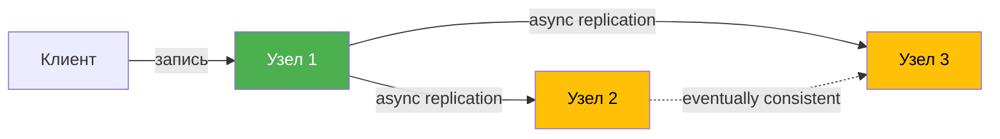

Основная идея — `NoSQL` базы жертвуют строгой согласованностью ради доступности и производительности. Это ключевой trade-off, описанный в [CAP-теореме](../architecture/cap-theorem-interview.md).

## Q3. (!) Что такое ACID?

`ACID` — набор свойств, гарантирующих надёжность транзакций в реляционных БД:

| Свойство | Описание | Механизм в PostgreSQL |
|----------|----------|-----------------------|
| **Atomicity** | Транзакция выполняется целиком или не выполняется вообще | `WAL`, `ROLLBACK` |
| **Consistency** | БД остаётся в валидном состоянии после транзакции | Constraints, triggers |
| **Isolation** | Параллельные транзакции не влияют друг на друга | `MVCC`, блокировки |
| **Durability** | Результат зафиксированной транзакции сохраняется при сбое | `WAL`, `fsync` |

```sql
-- Пример ACID-транзакции: перевод денег между счетами
BEGIN;

UPDATE accounts SET balance = balance - 1000 WHERE id = 1;
UPDATE accounts SET balance = balance + 1000 WHERE id = 2;

-- Если любая операция упала — весь блок откатывается (Atomicity)
-- Constraints проверяются (balance >= 0) — Consistency
-- Другие транзакции не видят промежуточное состояние — Isolation
COMMIT;
-- После COMMIT данные на диске даже при crash — Durability
```

## Q4. (!) В чём разница ACID от BASE?

| Характеристика | ACID | BASE |
|----------------|------|------|
| Согласованность | Строгая, немедленная | Конечная (eventually) |
| Доступность | Может блокировать при конфликтах | Высокая, даже при сбоях |
| Масштабирование | Преимущественно вертикальное | Горизонтальное |
| Подходит для | Банковские системы, `OLTP` | Соц. сети, IoT, аналитика |
| Примеры БД | `PostgreSQL`, `MySQL`, `Oracle` | `Cassandra`, `DynamoDB`, `CouchDB` |

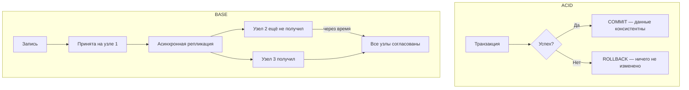

Выбор зависит от требований: если критична сохранность каждой записи (финансы, бухгалтерия) — `ACID`. Если важнее доступность и масштабирование на миллионы пользователей — `BASE`. Подробнее о паттернах — [Паттерны согласованности](../architecture/consistency-patterns-interview.md).

## Q5. (!) Какие есть типы изоляции транзакций?

В SQL определены четыре уровня изоляции транзакций:

| Уровень | Dirty Read | Non-Repeatable Read | Phantom Read | Производительность |
|---------|:----------:|:-------------------:|:------------:|:------------------:|
| `READ UNCOMMITTED` | Да | Да | Да | Максимальная |
| `READ COMMITTED` | Нет | Да | Да | Высокая |
| `REPEATABLE READ` | Нет | Нет | Да* | Средняя |
| `SERIALIZABLE` | Нет | Нет | Нет | Низкая |

*В `PostgreSQL` `REPEATABLE READ` также предотвращает phantom read благодаря реализации через `SSI` (Serializable Snapshot Isolation).

```sql
-- Установка уровня изоляции для транзакции
BEGIN TRANSACTION ISOLATION LEVEL REPEATABLE READ;

SELECT balance FROM accounts WHERE id = 1;
-- Другая транзакция не может изменить эту строку до нашего COMMIT

UPDATE accounts SET balance = balance - 100 WHERE id = 1;
COMMIT;

-- Установка уровня по умолчанию для сессии
SET default_transaction_isolation = 'read committed';
```

В `PostgreSQL` уровень по умолчанию — `READ COMMITTED`. Для критичных операций (финансы, инвентарь) лучше использовать `SERIALIZABLE`, но с готовностью обрабатывать ошибки сериализации и делать retry.

## Q6. (!) Какие проблемы при одновременном доступе несколькими транзакциями?

При одновременном доступе к данным несколькими транзакциями возникают:

1. **Lost Update** — две транзакции читают одно значение и обе обновляют его; последняя перезаписывает результат первой
2. **Dirty Read** — транзакция читает незафиксированные данные другой транзакции
3. **Non-Repeatable Read** — повторное чтение одной строки даёт разные результаты
4. **Phantom Read** — повторное выполнение запроса возвращает новые строки, вставленные другой транзакцией

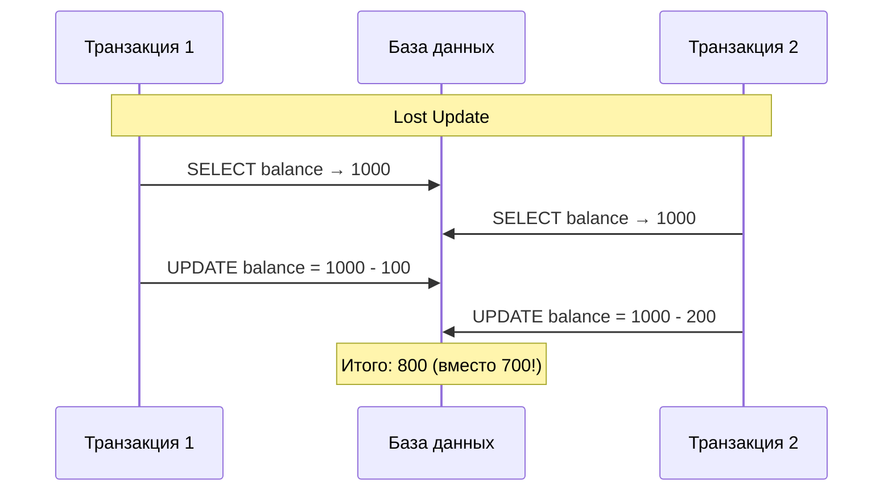

Основные механизмы защиты:

| Механизм | Как работает | Когда использовать |
|----------|-------------|-------------------|
| **Pessimistic Locking** | `SELECT ... FOR UPDATE` — блокирует строки | Высокая конкуренция за одни данные |
| **Optimistic Locking** | Проверка версии при `UPDATE` (`WHERE version = N`) | Редкие конфликты, высокая нагрузка |
| **MVCC** | Каждая транзакция видит свой snapshot | Стандарт в PostgreSQL |

```sql
-- Pessimistic locking: явная блокировка строки
BEGIN;
SELECT * FROM products WHERE id = 42 FOR UPDATE;
-- Строка заблокирована для других транзакций
UPDATE products SET stock = stock - 1 WHERE id = 42;
COMMIT;

-- Optimistic locking: через версию
UPDATE products
SET stock = stock - 1, version = version + 1
WHERE id = 42 AND version = 5;
-- Если affected rows = 0, значит кто-то обновил раньше → retry
```

## Q7. В чем разница между блокировкой строки и таблицы?

| Характеристика | Row-Level Lock | Table-Level Lock |
|----------------|---------------|-----------------|
| Гранулярность | Одна строка | Вся таблица |
| Конкурентность | Высокая | Низкая |
| Overhead | Больше (метаданные на каждую строку) | Минимальный |
| Deadlock риск | Выше | Ниже |
| Использование | `OLTP`, `SELECT FOR UPDATE` | DDL, массовые операции |

```sql
-- Row-level lock (PostgreSQL)
SELECT * FROM orders WHERE id = 100 FOR UPDATE;

-- Table-level locks (PostgreSQL)
LOCK TABLE orders IN ACCESS EXCLUSIVE MODE;  -- полная блокировка
LOCK TABLE orders IN SHARE MODE;              -- разрешает чтение, запрещает запись
```

В `PostgreSQL` обычный `UPDATE`/`DELETE` автоматически берёт row-level lock. Table-level lock нужен для DDL-операций (`ALTER TABLE`, `DROP TABLE`) или массовой загрузки данных. В высоконагруженных системах предпочтительна блокировка на уровне строк.

## Q8. (!) Что такое MVCC и как он работает в PostgreSQL?

**MVCC** (Multi-Version Concurrency Control) — механизм, при котором каждая транзакция видит собственный snapshot данных. Читатели не блокируют писателей, и наоборот — это основа высокой конкурентности `PostgreSQL`.

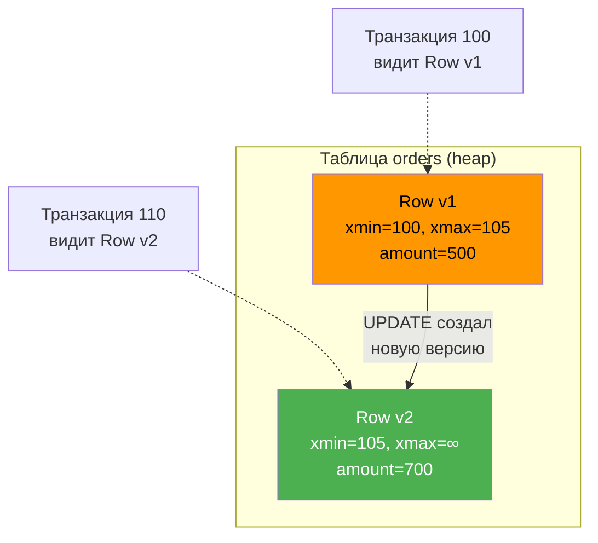

Как работает MVCC в `PostgreSQL`:

1. Каждая строка имеет скрытые поля `xmin` (ID транзакции, создавшей строку) и `xmax` (ID транзакции, удалившей/обновившей строку)
2. `UPDATE` не изменяет строку in-place, а создаёт новую версию и помечает старую через `xmax`
3. Каждая транзакция при старте получает snapshot — список активных транзакций
4. При чтении транзакция видит только те версии строк, которые были зафиксированы до начала её snapshot

```sql
-- Пример: две параллельные транзакции
-- Сессия 1:
BEGIN TRANSACTION ISOLATION LEVEL REPEATABLE READ;
SELECT amount FROM orders WHERE id = 1;  -- видит 500

-- Сессия 2:
BEGIN;
UPDATE orders SET amount = 700 WHERE id = 1;
COMMIT;

-- Сессия 1 (продолжение):
SELECT amount FROM orders WHERE id = 1;  -- всё ещё видит 500 (свой snapshot!)
COMMIT;
```

Побочный эффект MVCC — накопление «мёртвых» версий строк (dead tuples), которые нужно убирать через `VACUUM`. Подробнее — вопрос [Q10](#q10-как-работает-vacuum-в-postgresql).

## Q9. (!) Что такое WAL (Write-Ahead Log)?

**WAL** (Write-Ahead Log) — журнал упреждающей записи. Ключевой принцип: изменения сначала записываются в журнал на диск, и только потом применяются к самим данным. Это обеспечивает `Durability` из `ACID`.

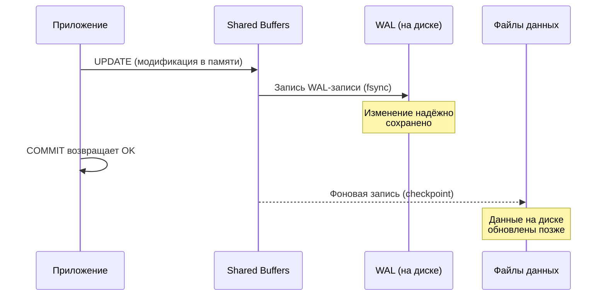

Зачем нужен WAL:

1. **Crash recovery** — после сбоя PostgreSQL «проигрывает» WAL вперёд (redo), восстанавливая все зафиксированные транзакции
2. **Репликация** — streaming replication передаёт WAL-записи на реплики
3. **Point-in-Time Recovery (PITR)** — возможность восстановить БД на любой момент времени

```sql
-- Просмотр текущей позиции WAL
SELECT pg_current_wal_lsn();

-- Размер WAL, сгенерированного за последние 5 минут
SELECT pg_wal_lsn_diff(pg_current_wal_lsn(), '0/0') AS total_wal_bytes;

-- Настройки WAL в postgresql.conf
-- wal_level = replica          -- минимум для репликации
-- max_wal_size = 1GB           -- порог для checkpoint
-- min_wal_size = 80MB
-- wal_compression = on         -- сжатие WAL для экономии диска
```

Ключевые параметры WAL:

| Параметр | Описание | Рекомендация |
|----------|----------|-------------|
| `wal_level` | Уровень детализации: `minimal`, `replica`, `logical` | `replica` для стандартной репликации |
| `max_wal_size` | Макс. размер WAL до checkpoint | 1–4 GB для OLTP |
| `synchronous_commit` | Ждать ли fsync WAL при COMMIT | `on` для надёжности, `off` для скорости |

## Q10. (!) Как работает VACUUM в PostgreSQL?

`VACUUM` — процесс очистки «мёртвых» (dead) версий строк, которые накапливаются из-за [MVCC](#q8-что-такое-mvcc-и-как-он-работает-в-postgresql).

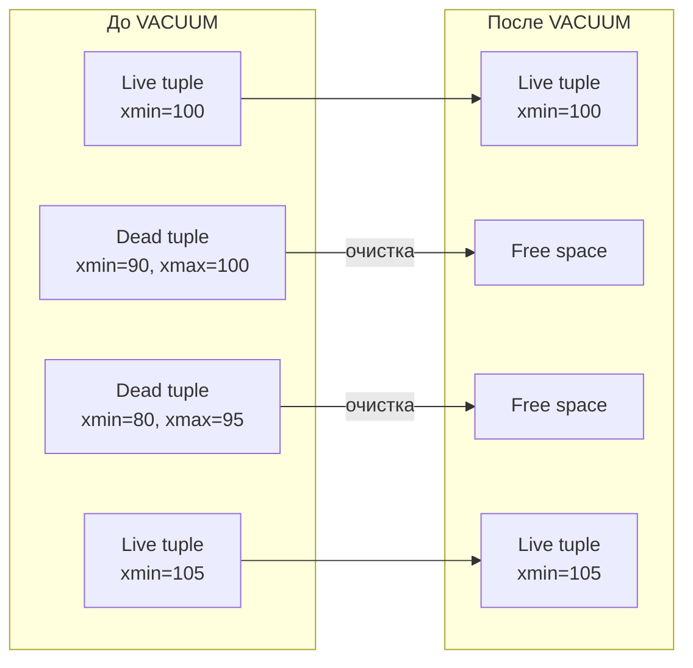

Виды VACUUM:

| Команда | Что делает | Блокировка |
|---------|-----------|-----------|
| `VACUUM` | Помечает dead tuples как свободное место | Не блокирует чтение/запись |
| `VACUUM FULL` | Переписывает таблицу, освобождает место на диск | `ACCESS EXCLUSIVE` — полная блокировка |
| `VACUUM ANALYZE` | VACUUM + обновление статистики | Не блокирует |
| `autovacuum` | Фоновый процесс, запускается автоматически | Не блокирует |

```sql
-- Ручной VACUUM с анализом
VACUUM ANALYZE orders;

-- Проверка состояния dead tuples
SELECT relname, n_dead_tup, n_live_tup,
       round(n_dead_tup::numeric / NULLIF(n_live_tup, 0) * 100, 2) AS dead_ratio_pct,
       last_vacuum, last_autovacuum
FROM pg_stat_user_tables
ORDER BY n_dead_tup DESC
LIMIT 10;

-- Настройки autovacuum в postgresql.conf
-- autovacuum = on
-- autovacuum_vacuum_threshold = 50        -- мин. число dead tuples для запуска
-- autovacuum_vacuum_scale_factor = 0.2    -- доля таблицы с dead tuples
-- autovacuum_naptime = 60                 -- интервал проверки (секунды)
```

На практике проблемы с VACUUM — одна из самых частых причин деградации `PostgreSQL`. Если autovacuum не успевает (например, из-за длинных транзакций, удерживающих snapshot), таблица «раздувается» (table bloat), и запросы замедляются.

## Q11. Что такое checkpoint в PostgreSQL?

**Checkpoint** — момент, когда `PostgreSQL` гарантированно записывает все «грязные» страницы из shared buffers на диск. После checkpoint можно безопасно удалить старые [WAL](#q9-что-такое-wal-write-ahead-log)-файлы, т.к. все изменения уже на диске.

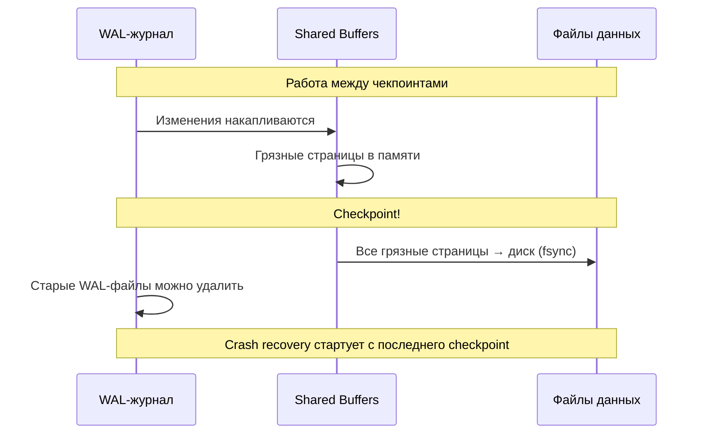

```sql
-- Принудительный checkpoint
CHECKPOINT;

-- Мониторинг checkpoint
SELECT checkpoints_timed, checkpoints_req,
       checkpoint_write_time, checkpoint_sync_time
FROM pg_stat_bgwriter;
```

Ключевые параметры: `max_wal_size` (порог WAL для автоматического checkpoint), `checkpoint_completion_target` (растянуть запись по времени, чтобы не создавать пики I/O — рекомендуется `0.9`).

## Q12. (!) Что такое индекс и какие типы индексов существуют?

Индекс — структура данных, ускоряющая поиск, сортировку и фильтрацию в БД. Создаётся на столбцах таблицы и содержит отсортированные значения с указателями на строки.

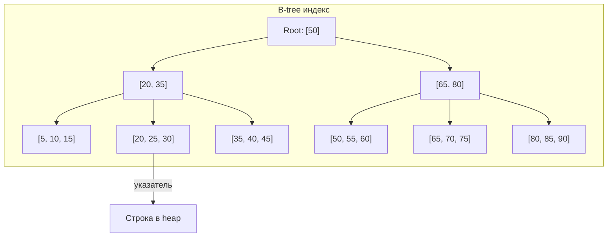

Типы индексов в `PostgreSQL`:

| Тип | Структура | Операции | Когда использовать |
|-----|-----------|----------|-------------------|
| **B-tree** | Сбалансированное дерево | `=`, `<`, `>`, `BETWEEN`, `ORDER BY` | По умолчанию, 90% случаев |
| **Hash** | Хеш-таблица | Только `=` | Точечный поиск (редко лучше B-tree) |
| **GiST** | Обобщённое дерево поиска | Пространственные, полнотекстовые | Геоданные (`PostGIS`), `tsvector` |
| **GIN** | Инвертированный индекс | `@>`, `&&`, полнотекст | Массивы, `JSONB`, `tsvector` |
| **BRIN** | Блочный диапазонный | `<`, `>`, `BETWEEN` | Огромные таблицы с естественным порядком |
| **SP-GiST** | Пространственное разбиение | Диапазоны, точки | Неравномерно распределённые данные |

```sql
-- B-tree (по умолчанию)
CREATE INDEX idx_orders_customer ON orders (customer_id);

-- Составной индекс (порядок столбцов важен!)
CREATE INDEX idx_orders_status_date ON orders (status, created_at DESC);

-- Частичный индекс (только активные заказы)
CREATE INDEX idx_orders_active ON orders (customer_id)
WHERE status = 'ACTIVE';

-- GIN для JSONB
CREATE INDEX idx_products_attrs ON products USING GIN (attributes);

-- BRIN для временных рядов (огромная таблица, данные добавляются по порядку)
CREATE INDEX idx_logs_created ON logs USING BRIN (created_at);

-- Покрывающий индекс (INCLUDE — данные хранятся в индексе, нет heap access)
CREATE INDEX idx_orders_covering ON orders (customer_id)
INCLUDE (status, total_amount);
```

Подробнее про оптимизацию запросов с индексами — [вопросы по SQL](sql-interview.md).

## Q13. Что будет если два одинаковых индекса в БД?

Дублирующиеся индексы — распространённая проблема, которая:

1. **Удваивает затраты на запись** — при каждом `INSERT`/`UPDATE`/`DELETE` обновляются оба индекса
2. **Занимает лишнее место** на диске и в `shared_buffers`
3. **Не даёт прироста при чтении** — оптимизатор выберет только один

```sql
-- Поиск дублирующихся индексов в PostgreSQL
SELECT pg_size_pretty(sum(pg_relation_size(idx))::bigint) AS size,
       (array_agg(idx))[1] AS idx1,
       (array_agg(idx))[2] AS idx2,
       indrelid::regclass AS table_name,
       indkey AS column_ids
FROM (
    SELECT indexrelid::regclass AS idx,
           indrelid, indkey
    FROM pg_index
) sub
GROUP BY indrelid, indkey
HAVING count(*) > 1;
```

Рекомендуется регулярно проверять неиспользуемые индексы:

```sql
-- Индексы, которые не использовались ни разу с момента сброса статистики
SELECT schemaname, relname, indexrelname,
       pg_size_pretty(pg_relation_size(indexrelid)) AS index_size,
       idx_scan
FROM pg_stat_user_indexes
WHERE idx_scan = 0
ORDER BY pg_relation_size(indexrelid) DESC;
```

## Q14. (!) Что такое кластерный и некластерные индексы?

**Кластерный индекс** определяет физический порядок хранения строк таблицы. **Некластерный индекс** хранит отдельную структуру со ссылками на строки.

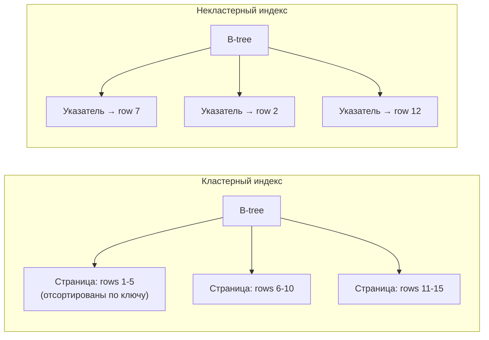

| Характеристика | Кластерный | Некластерный |
|----------------|-----------|-------------|
| Физ. порядок данных | Определяет | Не влияет |
| Количество на таблицу | 1 (в `InnoDB` — по PK) | Много |
| Скорость `range scan` | Высокая (данные рядом) | Ниже (random I/O) |
| Скорость `INSERT` | Медленнее (поддержка порядка) | Быстрее |

В `PostgreSQL` таблица — heap (неупорядоченная); команда `CLUSTER` физически переупорядочивает строки по индексу, но не поддерживает порядок при последующих вставках. В `MySQL InnoDB` кластерный индекс по primary key создаётся автоматически.

```sql
-- PostgreSQL: кластеризация таблицы по индексу
CLUSTER orders USING idx_orders_created_at;
-- ВНИМАНИЕ: берёт ACCESS EXCLUSIVE LOCK на таблицу!
```

## Q15. (!) Как БД определяет какой индекс использовать?

Оптимизатор запросов (`Query Planner`) выбирает индекс на основе **стоимостной модели** (cost-based optimization):

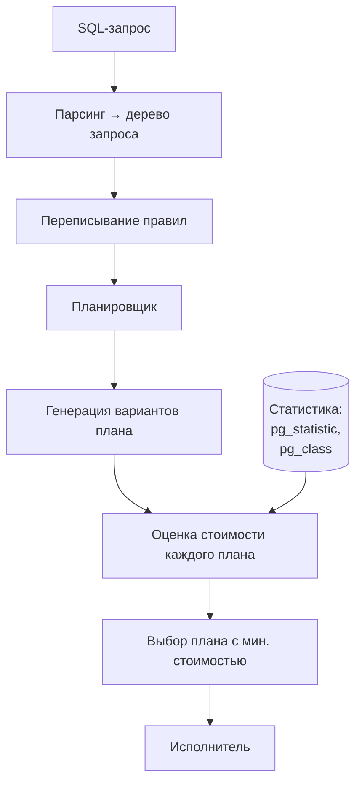

Факторы, влияющие на выбор:

1. **Селективность** — какую долю строк отфильтрует условие (из `pg_statistic`)
2. **Стоимость I/O** — sequential scan дешевле random I/O (параметры `seq_page_cost`, `random_page_cost`)
3. **Размер таблицы** — для маленьких таблиц `Seq Scan` часто дешевле `Index Scan`
4. **Корреляция** — насколько физический порядок данных совпадает с порядком индекса

```sql
-- Посмотреть, как планировщик оценивает запрос
EXPLAIN SELECT * FROM orders WHERE customer_id = 42;
-- Index Scan using idx_orders_customer on orders
--   Index Cond: (customer_id = 42)

-- Принудительно отключить Seq Scan (для диагностики)
SET enable_seqscan = off;
EXPLAIN SELECT * FROM orders WHERE status = 'ACTIVE';
SET enable_seqscan = on;
```

## Q16. (!) Что такое EXPLAIN ANALYZE и как читать план запроса?

`EXPLAIN ANALYZE` — инструмент, который показывает **реальный** план выполнения запроса с замерами времени. Обязательный навык для оптимизации SQL.

```sql
EXPLAIN (ANALYZE, BUFFERS, FORMAT TEXT)
SELECT o.id, o.total_amount, c.name
FROM orders o
JOIN customers c ON c.id = o.customer_id
WHERE o.status = 'SHIPPED'
  AND o.created_at > '2026-01-01'
ORDER BY o.created_at DESC
LIMIT 20;
```

Пример вывода и как его читать:

```
Limit  (cost=0.56..42.35 rows=20 width=52) (actual time=0.089..0.234 rows=20 loops=1)
  ->  Nested Loop  (cost=0.56..8234.12 rows=3942 width=52) (actual time=0.087..0.228 rows=20 loops=1)
        ->  Index Scan Backward using idx_orders_status_date on orders o
              (cost=0.29..412.50 rows=3942 width=36) (actual time=0.051..0.098 rows=20 loops=1)
              Index Cond: ((status = 'SHIPPED') AND (created_at > '2026-01-01'))
        ->  Index Scan using customers_pkey on customers c
              (cost=0.27..1.98 rows=1 width=24) (actual time=0.005..0.005 rows=1 loops=20)
              Index Cond: (id = o.customer_id)
Planning Time: 0.245 ms
Execution Time: 0.287 ms
Buffers: shared hit=68
```

Ключевые поля:

| Поле | Описание |
|------|----------|
| `cost=start..total` | Оценка стоимости (в условных единицах) |
| `rows` | Оценочное количество строк |
| `actual time` | Реальное время (мс) |
| `loops` | Сколько раз узел выполнялся |
| `Buffers: shared hit` | Страницы из кэша (hit) vs с диска (read) |

Красные флаги в плане:

- `Seq Scan` на большой таблице с фильтром → нужен индекс
- `rows=1000` (estimated) vs `actual rows=100000` → устаревшая статистика → `ANALYZE`
- `Buffers: shared read` >> `shared hit` → данные не в кэше, мало `shared_buffers`
- `Sort Method: external merge Disk` → не хватает `work_mem`

## Q17. (!) Какое значение имеет статистика в работе с индексами?

Статистика — основа для принятия решений оптимизатором. Без актуальной статистики планировщик может выбрать неэффективный план.

Что хранит `PostgreSQL`:

- **`pg_class`** — количество строк (`reltuples`), количество страниц (`relpages`)
- **`pg_statistic`** (view: `pg_stats`) — гистограммы, most common values, null fraction, correlation

```sql
-- Просмотр статистики столбца
SELECT attname, n_distinct, most_common_vals, most_common_freqs, correlation
FROM pg_stats
WHERE tablename = 'orders' AND attname = 'status';

-- Обновление статистики вручную
ANALYZE orders;

-- Увеличение детализации статистики для конкретного столбца
ALTER TABLE orders ALTER COLUMN customer_id SET STATISTICS 1000;
-- По умолчанию 100; увеличение полезно для столбцов с неравномерным распределением
ANALYZE orders;
```

Когда статистика устарела:
- Оптимизатор думает, что в таблице 100 строк, а их 10 млн → выбирает `Seq Scan` вместо `Index Scan`
- `autovacuum` обычно обновляет статистику автоматически, но после массовой загрузки данных необходим ручной `ANALYZE`

## Q18. (!) Что такое проблема фрагментации индексов?

Фрагментация индексов возникает, когда страницы индекса разбросаны по диску и содержат много пустого места из-за удалений и обновлений.

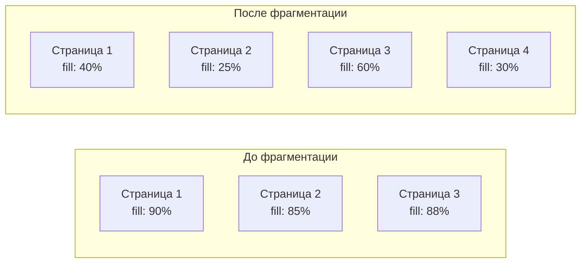

Последствия:
- Больше страниц → больше I/O при сканировании индекса
- Увеличение размера индекса на диске
- Деградация производительности `Index Scan`

```sql
-- Оценка bloat индекса через расширение pgstattuple
CREATE EXTENSION IF NOT EXISTS pgstattuple;

SELECT * FROM pgstatindex('idx_orders_customer');
-- avg_leaf_density: если < 50%, индекс сильно фрагментирован

-- Альтернативная оценка: сравнение реального и ожидаемого размера
SELECT
    indexrelname,
    pg_size_pretty(pg_relation_size(indexrelid)) AS actual_size,
    idx_scan AS times_used
FROM pg_stat_user_indexes
WHERE relname = 'orders';
```

## Q19. (!) Как решить проблему фрагментации индексов в PostgreSQL?

`PostgreSQL` предлагает несколько подходов:

| Метод | Блокировка | Описание |
|-------|-----------|----------|
| `REINDEX` | `ACCESS EXCLUSIVE` | Перестраивает индекс, блокирует таблицу |
| `REINDEX CONCURRENTLY` | Минимальная | Перестраивает без блокировки (с PostgreSQL 12) |
| `VACUUM` | Нет | Освобождает страницы индекса от dead tuples |
| `CLUSTER` | `ACCESS EXCLUSIVE` | Переупорядочивает данные по индексу |
| `pg_repack` | Минимальная | Расширение для перестройки без блокировки |

```sql
-- Перестройка индекса без простоя (PostgreSQL 12+)
REINDEX INDEX CONCURRENTLY idx_orders_customer;

-- Перестройка всех индексов таблицы
REINDEX TABLE CONCURRENTLY orders;

-- Автоматическое обслуживание через pg_cron
CREATE EXTENSION pg_cron;
SELECT cron.schedule('reindex-orders', '0 3 * * 0',
    $$REINDEX INDEX CONCURRENTLY idx_orders_customer$$);
```

`autovacuum` автоматически очищает dead tuples в индексах, но не перестраивает их структуру. Для критичных таблиц с высоким update/delete rate рекомендуется периодический `REINDEX CONCURRENTLY`.

## Q20. (!) Подходы для повышения производительности запросов с индексами?

Ключевые подходы:

1. **Составные индексы** — порядок столбцов критичен: первый столбец = самое селективное условие в `WHERE`
2. **Покрывающие индексы** (`INCLUDE`) — избегают обращения к heap
3. **Частичные индексы** — индексируют только нужное подмножество строк
4. **Индексы для сортировки** — `ORDER BY` + `LIMIT` работает быстро с подходящим индексом

```sql
-- ❌ Плохо: индекс не используется при функции над столбцом
SELECT * FROM orders WHERE LOWER(email) = 'test@example.com';

-- ✅ Хорошо: функциональный индекс
CREATE INDEX idx_orders_email_lower ON orders (LOWER(email));

-- ❌ Плохо: составной индекс, но запрос по второму столбцу
CREATE INDEX idx_a_b ON t (a, b);
SELECT * FROM t WHERE b = 5;  -- индекс НЕ используется

-- ✅ Хорошо: отдельный индекс или правильный порядок
CREATE INDEX idx_b ON t (b);

-- Покрывающий индекс — Index Only Scan (нет heap access)
CREATE INDEX idx_covering ON orders (customer_id)
INCLUDE (status, total_amount);

EXPLAIN SELECT status, total_amount
FROM orders WHERE customer_id = 42;
-- Index Only Scan using idx_covering on orders
```

Анти-паттерны:
- Индекс на столбце с 2-3 уникальными значениями (низкая селективность) → `Seq Scan` будет быстрее
- Слишком много индексов → замедляет `INSERT`/`UPDATE`
- Забытый `ANALYZE` после массовой загрузки данных

## Q21. (!) Что такое партиционирование таблиц?

**Партиционирование** — разделение большой таблицы на меньшие физические части (partitions), прозрачное для приложения. Ускоряет запросы и упрощает обслуживание.

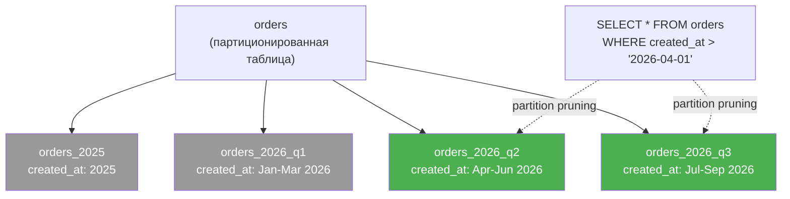

Типы партиционирования в `PostgreSQL`:

| Тип | Описание | Пример |
|-----|----------|--------|
| **RANGE** | По диапазону значений | По дате: помесячно, поквартально |
| **LIST** | По списку значений | По региону: `RU`, `KZ`, `BY` |
| **HASH** | По хешу значения | Равномерное распределение по N партициям |

```sql
-- Range-партиционирование по дате
CREATE TABLE orders (
    id          BIGSERIAL,
    customer_id BIGINT NOT NULL,
    total_amount DECIMAL(12,2),
    status      VARCHAR(20),
    created_at  TIMESTAMPTZ NOT NULL
) PARTITION BY RANGE (created_at);

-- Создание партиций
CREATE TABLE orders_2026_q1 PARTITION OF orders
    FOR VALUES FROM ('2026-01-01') TO ('2026-04-01');

CREATE TABLE orders_2026_q2 PARTITION OF orders
    FOR VALUES FROM ('2026-04-01') TO ('2026-07-01');

-- Индексы создаются на каждой партиции отдельно (или на родителе — с PG11)
CREATE INDEX idx_orders_customer ON orders (customer_id);

-- List-партиционирование по региону
CREATE TABLE sales (
    id     BIGSERIAL,
    region VARCHAR(5),
    amount DECIMAL(12,2)
) PARTITION BY LIST (region);

CREATE TABLE sales_ru PARTITION OF sales FOR VALUES IN ('RU');
CREATE TABLE sales_kz PARTITION OF sales FOR VALUES IN ('KZ');

-- Удаление старых данных — мгновенно (vs DELETE который сканирует таблицу)
DROP TABLE orders_2025_q1;
-- Или отсоединение без удаления:
ALTER TABLE orders DETACH PARTITION orders_2025_q1;
```

Когда партиционировать: таблица > 10-50 GB, запросы фильтруют по partition key, нужно быстрое удаление старых данных. Не стоит партиционировать маленькие таблицы — overhead от планировщика.

## Q22. (!) Что такое репликация БД и какие виды бывают?

**Репликация** — автоматическое копирование данных с одного сервера (primary/master) на другие (replica/standby). Цели: отказоустойчивость, масштабирование чтения, geo-distribution.

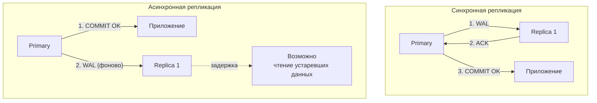

Виды репликации в `PostgreSQL`:

| Вид | Механизм | Задержка | Потеря данных |
|-----|----------|----------|---------------|
| **Streaming (async)** | WAL по сети | Миллисекунды | Возможна (последние транзакции) |
| **Streaming (sync)** | WAL + ACK от реплики | Десятки мс | Нет |
| **Logical** | Публикация/подписка, построчная | Секунды | Зависит от конфигурации |

```sql
-- Настройка Streaming Replication (primary — postgresql.conf)
-- wal_level = replica
-- max_wal_senders = 5
-- synchronous_standby_names = 'replica1'  -- для синхронной

-- Настройка на реплике (standby.signal + postgresql.conf)
-- primary_conninfo = 'host=primary port=5432 user=replicator'
-- hot_standby = on  -- разрешить SELECT на реплике

-- Мониторинг отставания реплики (на primary)
SELECT client_addr, state, sent_lsn, write_lsn, flush_lsn, replay_lsn,
       pg_wal_lsn_diff(sent_lsn, replay_lsn) AS replay_lag_bytes
FROM pg_stat_replication;

-- Logical Replication: публикация (на primary)
CREATE PUBLICATION my_pub FOR TABLE orders, customers;

-- Logical Replication: подписка (на другом сервере)
CREATE SUBSCRIPTION my_sub
    CONNECTION 'host=primary port=5432 dbname=mydb'
    PUBLICATION my_pub;
```

Паттерны использования:
- **Read replicas** — направляем `SELECT` на реплики, `INSERT/UPDATE/DELETE` на primary
- **Hot standby** — реплика готова стать primary при failover
- **Delayed replica** — реплика с задержкой N часов — защита от человеческих ошибок (`DROP TABLE`)

Подробнее о распределённых системах — [вопросы по распределённым системам](../architecture/distributed-systems-interview.md).

## Q23. (!) Что такое шардирование и как выбрать ключ шардирования?

**Шардирование** (sharding) — горизонтальное разделение данных между несколькими независимыми серверами БД. Каждый шард хранит подмножество данных.

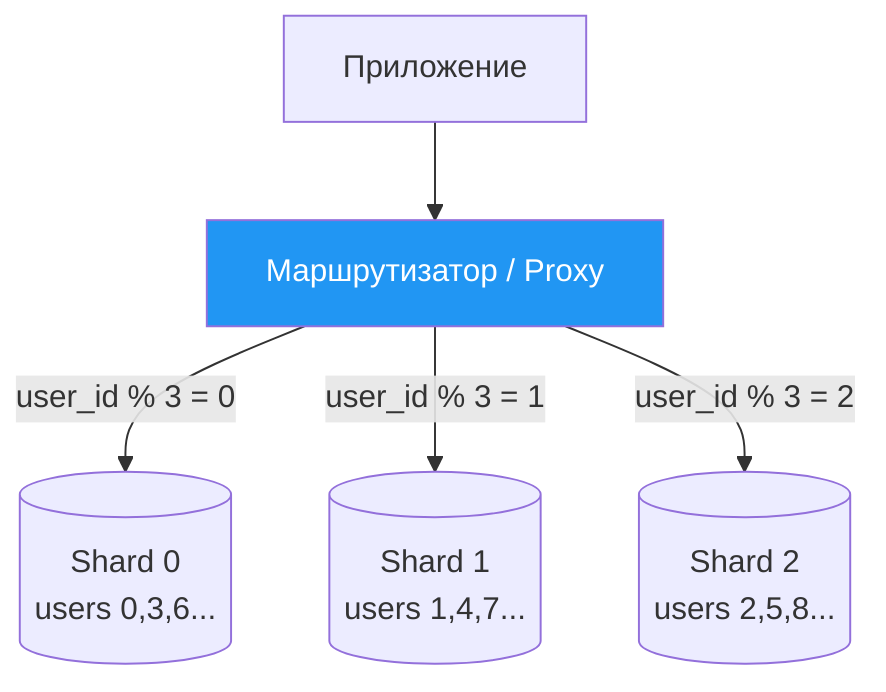

Стратегии выбора шарда:

| Стратегия | Описание | Плюсы | Минусы |
|-----------|----------|-------|--------|
| **Hash** | `shard = hash(key) % N` | Равномерное распределение | Сложный resharding |
| **Range** | По диапазону ключа | Простые range-запросы | Hotspots |
| **Directory** | Lookup-таблица `key → shard` | Гибкость | Bottleneck на directory |
| **Consistent Hashing** | Кольцо хешей | Минимальный resharding | Сложнее реализация |

Критерии выбора shard key:

1. **Высокая кардинальность** — много уникальных значений (не `status` с 3 вариантами)
2. **Равномерное распределение** — нет hotspot'ов (один шард не перегружен)
3. **Запросы по ключу** — большинство запросов содержат shard key → single-shard query
4. **Неизменяемость** — ключ не должен меняться (иначе надо мигрировать строку)

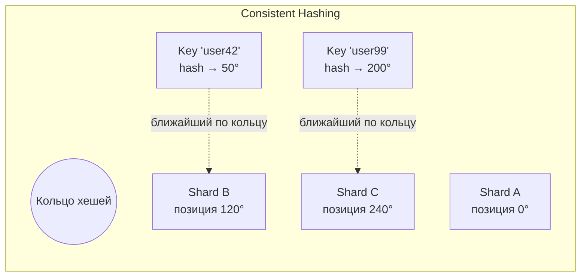

Проблемы шардирования:
- **Cross-shard queries** — `JOIN` между шардами дорогой → денормализация или application-level join
- **Resharding** — добавление шарда требует миграции данных
- **Распределённые транзакции** — 2PC или Saga паттерн

Подробнее — [паттерны масштабирования](../architecture/scalability-patterns-interview.md).

## Q24. (!) Что такое connection pooling и зачем он нужен?

**Connection pooling** — пул предустановленных соединений к БД, которые переиспользуются между запросами. Каждое соединение `PostgreSQL` — отдельный процесс (~5-10 MB RAM), поэтому без пула сотни одновременных клиентов «съедают» всю память.

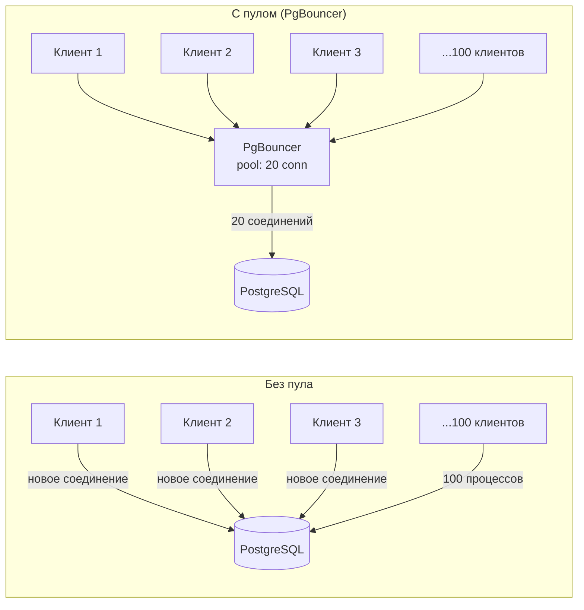

Режимы `PgBouncer`:

| Режим | Переключение соединения | Совместимость | Производительность |
|-------|------------------------|---------------|-------------------|
| **Session** | После закрытия сессии | Полная | Минимальный эффект |
| **Transaction** | После `COMMIT`/`ROLLBACK` | Нельзя `PREPARE`, session vars | Хорошая |
| **Statement** | После каждого запроса | Нельзя транзакции | Максимальная |

```ini
# pgbouncer.ini
[databases]
mydb = host=127.0.0.1 port=5432 dbname=mydb

[pgbouncer]
pool_mode = transaction
max_client_conn = 1000
default_pool_size = 20
reserve_pool_size = 5
reserve_pool_timeout = 3
```

В Spring Boot пул соединений управляется `HikariCP`:

```yaml
# application.yml
spring:
  datasource:
    hikari:
      maximum-pool-size: 20
      minimum-idle: 5
      connection-timeout: 30000    # ms
      idle-timeout: 600000         # ms
      max-lifetime: 1800000        # ms
```

Рекомендация для `PostgreSQL`: `max_connections` = 100-300, перед БД ставить `PgBouncer` в режиме `transaction`.

## Q25. (!) Чем SQL база данных отличается от NoSQL?

| Характеристика | SQL (реляционные) | NoSQL |
|----------------|-------------------|-------|
| Модель данных | Таблицы, строгая схема | Документы, KV, графы, wide-column |
| Схема | Фиксированная (DDL) | Гибкая / schema-less |
| Язык запросов | `SQL` | Специфичный для каждой БД |
| Транзакции | `ACID` | Обычно `BASE` (есть исключения) |
| Масштабирование | Преимущественно вертикальное | Горизонтальное из коробки |
| `JOIN` | Мощные, оптимизированные | Ограниченные или отсутствуют |
| Примеры | `PostgreSQL`, `MySQL`, `Oracle` | `MongoDB`, [Redis](redis-interview.md), [Cassandra](cassandra-interview.md) |

На собеседовании важно показать, что выбор — не «SQL лучше» или «NoSQL лучше», а зависит от конкретного use case: характера данных, паттернов доступа, требований к согласованности и масштабированию.

## Q26. (!) Какие есть типы NoSQL баз данных?

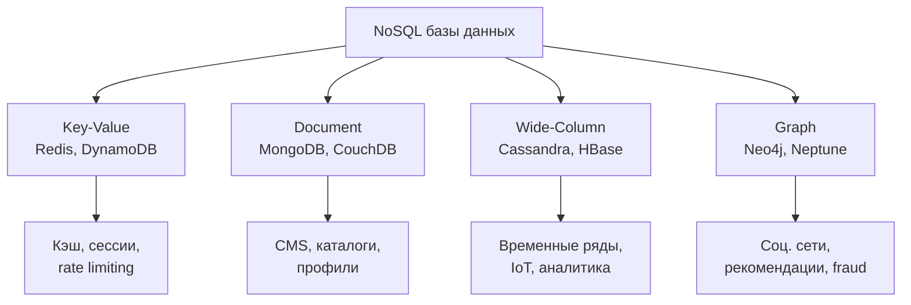

| Тип | Модель данных | Когда использовать | Примеры |
|-----|--------------|-------------------|---------|
| **Key-Value** | Пара ключ-значение | Кэш, сессии, очереди | [Redis](redis-interview.md), `DynamoDB`, `Riak` |
| **Document** | JSON/BSON документы | Каталоги, CMS, гибкие схемы | [MongoDB](mongodb-interview.md), `CouchDB` |
| **Wide-Column** | Семейства столбцов | Временные ряды, IoT, логи | [Cassandra](cassandra-interview.md), `HBase`, `ScyllaDB` |
| **Graph** | Узлы + рёбра | Социальные графы, рекомендации | `Neo4j`, `Amazon Neptune` |
| **Search** | Инвертированный индекс | Полнотекстовый поиск, логи | [Elasticsearch](elasticsearch-interview.md), `OpenSearch` |

## Q27. Можно ли использовать SQL язык запросов с NoSQL?

Да, многие NoSQL-решения предоставляют SQL-подобные языки:

| БД | Язык запросов | Похожесть на SQL |
|----|--------------|-----------------|
| `Cassandra` | `CQL` (Cassandra Query Language) | Синтаксис похож, но нет `JOIN`, `GROUP BY` ограничен |
| `MongoDB` | `MQL` + Aggregation Framework | Своя JSON-нотация, но есть `$lookup` (аналог JOIN) |
| `HBase` | `Apache Phoenix` | Полный SQL поверх HBase |
| `DynamoDB` | `PartiQL` | SQL-подобный для KV-операций |
| `Elasticsearch` | `SQL API` (с 6.3) | SELECT, WHERE, GROUP BY поверх поискового движка |

Важно понимать: SQL-подобный синтаксис не делает NoSQL реляционной — внутренние ограничения модели данных остаются.

## Q28. (!) Преимущества и недостатки SQL в сравнении с NoSQL?

| Аспект | SQL | NoSQL |
|--------|-----|-------|
| **Целостность данных** | Строгие constraints, FK, `ACID` | Ответственность на приложении |
| **Гибкость схемы** | Миграции (`ALTER TABLE`) | Изменения на лету |
| **Сложные запросы** | Мощный `JOIN`, подзапросы, CTE | Ограничены, денормализация |
| **Масштабирование записи** | Сложно горизонтально | Встроенное |
| **Экосистема** | Зрелая, много инструментов | Быстро развивается |
| **Обучение** | SQL — единый стандарт | Разные API для каждой БД |

На практике часто используют **polyglot persistence** — несколько БД для разных задач:
- `PostgreSQL` — основные бизнес-данные (заказы, пользователи)
- [Redis](redis-interview.md) — кэш, сессии
- [Elasticsearch](elasticsearch-interview.md) — поиск, логи
- [Cassandra](cassandra-interview.md) — временные ряды, IoT

## Q29. (!) Критерии выбора между SQL и NoSQL для проекта?

Практический чек-лист:

| Критерий | Выбирай SQL | Выбирай NoSQL |
|----------|-------------|---------------|
| Структура данных | Фиксированная, нормализованная | Динамическая, вложенная |
| Транзакции | Критичны (`ACID`) | Допустима eventual consistency |
| Запросы | Сложные JOIN, агрегации | Простые CRUD по ключу |
| Масштаб записи | < 10K writes/sec | > 100K writes/sec |
| Схема | Стабильная, меняется редко | Часто эволюционирует |
| Команда | Знает SQL | Знает конкретную NoSQL |

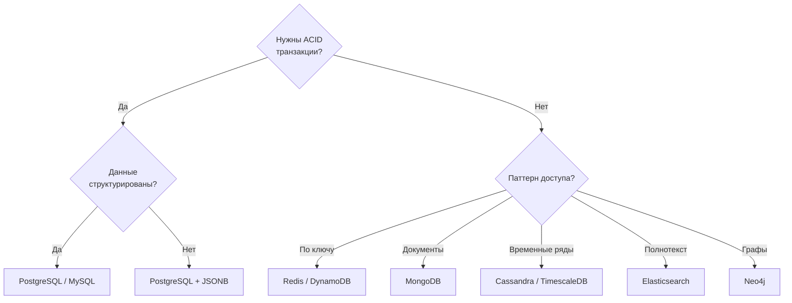

## Q30. (!) Что такое горизонтальное и вертикальное масштабирование БД?

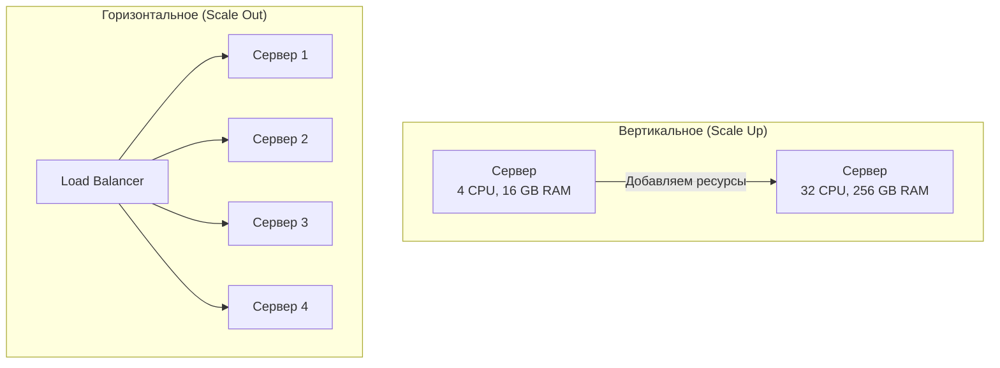

| Характеристика | Вертикальное | Горизонтальное |
|----------------|-------------|---------------|
| Суть | Больше ресурсов одному серверу | Больше серверов |
| Предел | Ограничен железом | Почти неограничен |
| Сложность | Простое | Требует шардирования |
| Downtime | При апгрейде | Нет (при правильной архитектуре) |
| Стоимость | Растёт экспоненциально | Линейно |
| Подходит для | `PostgreSQL`, `MySQL` | `Cassandra`, `MongoDB`, `CockroachDB` |

Подробнее — [паттерны масштабирования](../architecture/scalability-patterns-interview.md).

## Q31. Какие виды индексов поддерживаются SQL и NoSQL?

| БД | Типы индексов | Особенности |
|----|--------------|-------------|
| **PostgreSQL** | B-tree, Hash, GiST, GIN, BRIN, SP-GiST | Частичные, функциональные, покрывающие |
| **MySQL** | B-tree, Hash (MEMORY), Fulltext, Spatial | Кластерный индекс по PK (InnoDB) |
| **MongoDB** | B-tree, Hashed, Text, 2dsphere, Wildcard | Compound, TTL, Partial |
| **Cassandra** | Первичный ключ (partition + clustering) | Вторичные индексы — ограниченные, `SASI`, `SAI` |
| **Elasticsearch** | Инвертированный индекс (`Lucene`) | Все поля индексируются по умолчанию |
| **Redis** | Нет классических индексов | Sorted Sets, RediSearch module |

Выбор типа индекса определяется моделью данных и паттерном запросов — подробнее в [вопросах по SQL](sql-interview.md).

## Q32. (!) Обработка транзакций в SQL и NoSQL?

| Аспект | SQL (PostgreSQL) | MongoDB | Cassandra | Redis |
|--------|-------------------|---------|-----------|-------|
| Транзакции | `ACID`, `BEGIN..COMMIT` | Multi-doc `ACID` (4.0+) | Нет (Lightweight Transactions) | `MULTI/EXEC` (без rollback) |
| Изоляция | `READ COMMITTED` — `SERIALIZABLE` | Snapshot isolation | Eventual / Tunable | Последовательное выполнение |
| Rollback | Полный | Полный | Нет | Нет (атомарная очередь) |

Для микросервисной архитектуры, где данные распределены по нескольким БД:

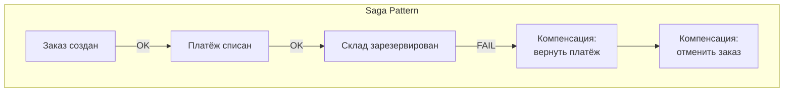

Подробнее — [распределённые системы](../architecture/distributed-systems-interview.md) и [паттерны согласованности](../architecture/consistency-patterns-interview.md).

## Q33. (!) Разница между PostgreSQL, MongoDB, Elasticsearch, Redis и Cassandra?

| Критерий | PostgreSQL | MongoDB | Elasticsearch | Redis | Cassandra |
|----------|-----------|---------|--------------|-------|-----------|
| **Тип** | RDBMS | Document | Search Engine | KV Store | Wide-Column |
| **Модель** | Таблицы | JSON/BSON | JSON + инв. индекс | Структуры данных | Column families |
| **Транзакции** | `ACID` | `ACID` (4.0+) | Нет | `MULTI/EXEC` | Нет |
| **Масштабирование** | Вертикальное + реплики | Шардирование | Кластер | Cluster (16K шардов) | Линейное |
| **Запросы** | SQL | MQL, Aggregation | Query DSL, SQL | Команды | CQL |
| **Сценарий** | OLTP, аналитика | Каталоги, CMS | Поиск, логи | Кэш, очереди | Временные ряды, IoT |

На собеседовании важно не просто перечислить различия, а показать, как выбор подтверждается измерениями: `EXPLAIN ANALYZE`, профиль нагрузки, latency p95/p99.

Подробнее про каждую БД — [Redis](redis-interview.md), [MongoDB](mongodb-interview.md), [Cassandra](cassandra-interview.md), [Elasticsearch](elasticsearch-interview.md).

## Q34. (!) Какие ключевые параметры конфигурации PostgreSQL влияют на производительность?

| Параметр | Описание | Рекомендация |
|----------|----------|-------------|
| `shared_buffers` | Кэш страниц данных в памяти | 25% RAM (до 8-16 GB) |
| `effective_cache_size` | Оценка доступного кэша ОС + shared_buffers | 50-75% RAM |
| `work_mem` | Память для сортировок и хешей в одном запросе | 64-256 MB (× кол-во соединений!) |
| `maintenance_work_mem` | Память для VACUUM, CREATE INDEX | 512 MB — 2 GB |
| `max_connections` | Макс. число соединений | 100-300 (PgBouncer перед БД) |
| `random_page_cost` | Стоимость random I/O для планировщика | 1.1 для SSD (вместо 4.0 по умолчанию) |
| `effective_io_concurrency` | Параллельные I/O запросы | 200 для SSD |
| `wal_buffers` | Буфер WAL в памяти | 64 MB |
| `checkpoint_completion_target` | Растянуть checkpoint по времени | 0.9 |

```ini
# postgresql.conf — пример для сервера 64 GB RAM, SSD
shared_buffers = 16GB
effective_cache_size = 48GB
work_mem = 128MB
maintenance_work_mem = 2GB
max_connections = 200
random_page_cost = 1.1
effective_io_concurrency = 200
wal_buffers = 64MB
checkpoint_completion_target = 0.9
max_wal_size = 4GB
min_wal_size = 1GB

# Autovacuum tuning
autovacuum_max_workers = 4
autovacuum_vacuum_cost_limit = 2000
```

Важно: `work_mem` умножается на количество параллельных запросов и сортировок в каждом. При `work_mem = 256MB` и 100 соединениях теоретическое потребление — до 25 GB только на сортировки.

## Q35. (!) Как мониторить производительность PostgreSQL?

Ключевые системные view для мониторинга:

```sql
-- Самые медленные запросы (требует pg_stat_statements)
CREATE EXTENSION IF NOT EXISTS pg_stat_statements;

SELECT query,
       calls,
       round(total_exec_time::numeric, 2) AS total_time_ms,
       round(mean_exec_time::numeric, 2) AS avg_time_ms,
       rows
FROM pg_stat_statements
ORDER BY total_exec_time DESC
LIMIT 10;

-- Текущие активные запросы и блокировки
SELECT pid, now() - query_start AS duration, state, query
FROM pg_stat_activity
WHERE state != 'idle'
ORDER BY duration DESC;

-- Блокировки
SELECT blocked_locks.pid AS blocked_pid,
       blocking_locks.pid AS blocking_pid,
       blocked_activity.query AS blocked_query,
       blocking_activity.query AS blocking_query
FROM pg_catalog.pg_locks blocked_locks
JOIN pg_catalog.pg_locks blocking_locks
    ON blocking_locks.locktype = blocked_locks.locktype
    AND blocking_locks.database IS NOT DISTINCT FROM blocked_locks.database
    AND blocking_locks.relation IS NOT DISTINCT FROM blocked_locks.relation
    AND blocking_locks.pid != blocked_locks.pid
JOIN pg_stat_activity blocked_activity ON blocked_activity.pid = blocked_locks.pid
JOIN pg_stat_activity blocking_activity ON blocking_activity.pid = blocking_locks.pid
WHERE NOT blocked_locks.granted;

-- Cache hit ratio (должен быть > 99%)
SELECT round(
    sum(blks_hit) * 100.0 / sum(blks_hit + blks_read), 2
) AS cache_hit_ratio
FROM pg_stat_database;

-- Index usage ratio (должен быть > 95%)
SELECT relname,
       round(idx_scan::numeric / (idx_scan + seq_scan) * 100, 2) AS idx_usage_pct
FROM pg_stat_user_tables
WHERE (idx_scan + seq_scan) > 0
ORDER BY idx_usage_pct ASC;
```

Чек-лист для мониторинга:

| Метрика | Целевое значение | Где смотреть |
|---------|-----------------|-------------|
| Cache hit ratio | > 99% | `pg_stat_database` |
| Index usage | > 95% | `pg_stat_user_tables` |
| Dead tuples ratio | < 10% | `pg_stat_user_tables` |
| Replication lag | < 1 sec | `pg_stat_replication` |
| Connections | < 80% от max | `pg_stat_activity` |
| Long queries | < 5 min | `pg_stat_activity` |

## Q36. (!) Что такое `HTAP` и как совместить `OLTP` и `OLAP`?

**HTAP** (`Hybrid Transactional/Analytical Processing`) — архитектурный подход, позволяющий выполнять транзакционные (`OLTP`) и аналитические (`OLAP`) запросы на одной системе или в единой платформе без задержки репликации.

**Проблема традиционного подхода:**

```mermaid
graph LR
    App["Приложение"] -->|"OLTP"| OLTPdb["PostgreSQL / MySQL\n(строчные данные)"]
    OLTPdb -->|"ETL ночью"| DWH["Data Warehouse\n(ClickHouse / Redshift)"]
    BI["BI / Аналитика"] --> DWH
```
Задержка между событием и аналитикой — часы/сутки.

**HTAP-подход:**

| Система | Механизм |
|---------|----------|
| `TiDB` | Отдельные движки: TiKV (row-based OLTP) + TiFlash (column-based OLAP) |
| `SingleStore` | In-memory row store + disk column store в одной БД |
| `PostgreSQL + Citus` | Расширение для distributed SQL + columnar storage |
| `Oracle HeatWave` | MySQL с in-memory columnar acceleration |

**PostgreSQL как основа HTAP:**

```sql
-- Партиционирование + pg_partman для горячих/холодных данных
CREATE TABLE events (
    id BIGSERIAL,
    ts TIMESTAMPTZ NOT NULL,
    type TEXT,
    payload JSONB
) PARTITION BY RANGE (ts);

-- Горячий партиция — строчное хранение (OLTP)
CREATE TABLE events_2026_04 PARTITION OF events
    FOR VALUES FROM ('2026-04-01') TO ('2026-05-01');

-- Для аналитики — Columnar Extension (Hydra / pg_mooncake)
-- или репликация в ClickHouse через Kafka CDC
```

**На практике для Java-бэкенда:**
- Рабочие нагрузки разделять на primary OLTP БД (PostgreSQL) и read replica / DWH (ClickHouse)
- `Kafka CDC` → `ClickHouse` для near-real-time аналитики с задержкой < 1 минуты
- `Debezium` + `Kafka Connect` для CDC без изменений приложения

## Q37. (!) Что такое `NewSQL` (`CockroachDB`, `Google Spanner`)?

**NewSQL** — класс реляционных систем управления БД, обеспечивающих масштабируемость `NoSQL` при сохранении `ACID`-семантики и `SQL`-интерфейса.

**Проблема, которую решает NewSQL:**

| Система | Масштабирование | ACID | SQL |
|---------|----------------|------|-----|
| PostgreSQL (classic) | Вертикальное | Да | Да |
| MySQL Cluster | Ограниченное горизонтальное | Да | Да |
| Cassandra, DynamoDB | Горизонтальное | Нет (eventual) | Нет |
| **NewSQL** | **Горизонтальное** | **Да** | **Да** |

**CockroachDB:**

- Distributed SQL, совместим с PostgreSQL-протоколом
- Данные шардированы на "ranges" (~64 MB), каждый реплицирован через `Raft`
- Serializable Snapshot Isolation (`SSI`) из коробки
- Multi-region: данные пинятся к ближайшему региону

```sql
-- PostgreSQL-совместимый синтаксис
CREATE TABLE orders (
    id UUID DEFAULT gen_random_uuid() PRIMARY KEY,
    user_id INT,
    total DECIMAL,
    region STRING AS (crdb_internal_locality_to_string('region')) STORED
);

-- Geo-partitioning: данные EU → EU-узлы
ALTER TABLE orders PARTITION BY LIST (region) (
    PARTITION eu VALUES IN ('eu-west-1'),
    PARTITION us VALUES IN ('us-east-1')
);
```

**Google Spanner:**

- Глобально распределённая РСУБД Google (публично доступна через Cloud Spanner)
- `TrueTime API` — атомарные часы + GPS для глобального упорядочивания транзакций
- Внешняя согласованность — сильнее `Serializable`
- Поддерживает ANSI SQL и JDBC

**Когда использовать NewSQL:**
- Глобально распределённые приложения с требованием `ACID` через регионы
- Горизонтальное масштабирование реляционных данных без ручного шардирования
- Compliance-требования к согласованности данных в мультирегиональных деплоях

**Компромиссы:** более высокая латентность на запись (consensus round-trips), сложнее в операционном управлении, дороже чем managed PostgreSQL.

## Q38. Что такое `Polyglot Persistence` и `Database Federation`?

**Polyglot Persistence** — архитектурный паттерн, при котором разные части приложения используют разные типы хранилищ, оптимальные для конкретной задачи.

```mermaid
graph TD
    App["Приложение / Микросервисы"]
    App -->|"Пользователи, заказы"| PG["PostgreSQL\n(реляционные данные)"]
    App -->|"Сессии, кэш"| Redis["Redis\n(in-memory)"]
    App -->|"Каталог товаров"| Mongo["MongoDB\n(документы)"]
    App -->|"Поиск"| ES["Elasticsearch\n(полнотекстовый поиск)"]
    App -->|"Метрики"| CH["ClickHouse\n(аналитика)"]
    App -->|"Граф связей"| Neo4j["Neo4j\n(графовая БД)"]
```

**Принципы выбора хранилища:**

| Задача | Хранилище | Причина |
|--------|-----------|---------|
| Транзакционные данные | PostgreSQL | ACID, JOIN |
| Кэш, сессии | Redis | Sub-ms latency |
| Контент с гибкой схемой | MongoDB | Документы, шардирование |
| Полнотекстовый поиск | Elasticsearch | Inverted index, фасеты |
| Временные ряды / метрики | ClickHouse / InfluxDB | Columnar, компрессия |
| Граф зависимостей | Neo4j / Amazon Neptune | Обход графов |

**Database Federation:**

Федерация — использование единого слоя доступа к данным поверх нескольких физических БД. Клиент работает с одним API, слой федерации маршрутизирует запросы.

```
Federated Layer (Presto / Trino / Apache Drill)
├── PostgreSQL (transactional data)
├── S3 / Parquet files (historical data)
├── Elasticsearch (search)
└── Redis (realtime counters)
```

**Trino — пример федеративного запроса:**

```sql
-- Запрос к данным из разных источников в одном SQL
SELECT u.name, o.total, p.name as product
FROM postgresql.mydb.users u
JOIN mongodb.mydb.orders o ON u.id = o.user_id
JOIN elasticsearch.mydb.products p ON o.product_id = p.id
WHERE o.created_at > DATE '2026-01-01'
```

**Сложности Polyglot Persistence:**
- Поддержание согласованности между хранилищами (eventual consistency)
- Транзакции spanning multiple stores требуют Saga/2PC
- Операционная сложность — несколько систем для мониторинга и обслуживания

## Q39. (!) Как работает `HikariCP` и что важно настроить?

`HikariCP` — де-факто стандартный пул соединений для Java/Spring Boot. Назван за скорость (hikari — "свет" по-японски). Spring Boot автоматически использует `HikariCP` при наличии в classpath.

**Как работает пул соединений:**

```mermaid
sequenceDiagram
    participant App as Приложение
    participant Pool as HikariCP Pool
    participant DB as PostgreSQL

    App->>Pool: getConnection()
    Pool->>Pool: Проверить пул (idle connections)
    alt Есть свободное соединение
        Pool-->>App: existing connection
    else Пул не заполнен
        Pool->>DB: Новое TCP-соединение
        DB-->>Pool: connection established
        Pool-->>App: new connection
    else Пул заполнен (maximumPoolSize)
        Pool->>Pool: Ждать connectionTimeout мс
        Pool-->>App: timeout exception
    end
    App->>DB: SQL query
    App->>Pool: connection.close()
    Pool->>Pool: Вернуть в пул (не закрывать!)
```

**Ключевые параметры:**

```yaml
spring:
  datasource:
    hikari:
      maximum-pool-size: 10         # Макс. соединений (default: 10)
      minimum-idle: 5               # Мин. idle-соединений
      connection-timeout: 30000     # Мс ожидания получения соединения
      idle-timeout: 600000          # Мс до закрытия idle-соединения
      max-lifetime: 1800000         # Мс макс. жизни соединения (30 мин)
      keepalive-time: 60000         # Пинг idle-соединений каждые N мс
      validation-timeout: 5000      # Мс на проверку соединения
      pool-name: "MyHikariPool"
      # Для PostgreSQL
      connection-test-query: "SELECT 1"
      data-source-properties:
        cachePrepStmts: true
        prepStmtCacheSize: 250
        prepStmtCacheSqlLimit: 2048
```

**Формула maximum-pool-size:**

По рекомендации HikariCP и исследованиям PostgreSQL:

```
pool_size = Tn × (Cm - 1) + 1
где:
  Tn = кол-во потоков приложения
  Cm = количество одновременных запросов на поток
```

Практическое правило: **`pool_size = (cores * 2) + effective_spindle_count`**. Для большинства приложений: 10–20 соединений достаточно даже при высокой нагрузке.

**Типичные проблемы:**
- `Connection timeout` — пул заполнен, `maximum-pool-size` слишком мал или есть утечки соединений
- `max-lifetime` должен быть меньше `wait_timeout` PostgreSQL/MySQL (иначе "broken pipe")
- Не устанавливайте `minimum-idle = maximum-pool-size` без необходимости — всегда держать максимум соединений расточительно

## Q40. (!) Как использовать `Read Replicas` для масштабирования чтения?

`Read Replicas` (реплики чтения) — один из главных инструментов масштабирования РСУБД без шардирования. Primary обрабатывает запись, реплики — чтение.

**Архитектура с репликами:**

```mermaid
graph LR
    App["Приложение"] -->|"запись"| Primary["PostgreSQL Primary"]
    App -->|"чтение"| LB["Load Balancer / PgBouncer"]
    Primary -->|"streaming replication"| R1["Replica 1"]
    Primary -->|"streaming replication"| R2["Replica 2"]
    Primary -->|"streaming replication"| R3["Replica 3 (analytics)"]
    LB --> R1
    LB --> R2
```

**Spring Boot — маршрутизация на уровне DataSource:**

```java
@Configuration
public class DataSourceConfig {

    @Bean
    @Primary
    public DataSource primaryDataSource() {
        return DataSourceBuilder.create()
            .url("jdbc:postgresql://primary:5432/mydb")
            .build();
    }

    @Bean("readReplicaDataSource")
    public DataSource readReplicaDataSource() {
        return DataSourceBuilder.create()
            .url("jdbc:postgresql://replica:5432/mydb")
            .build();
    }

    @Bean
    public DataSource routingDataSource(
        @Qualifier("readReplicaDataSource") DataSource replica
    ) {
        AbstractRoutingDataSource routing = new AbstractRoutingDataSource() {
            @Override
            protected Object determineCurrentLookupKey() {
                // Читаем с реплики для @Transactional(readOnly = true)
                return TransactionSynchronizationManager.isCurrentTransactionReadOnly()
                    ? "replica" : "primary";
            }
        };
        routing.setDefaultTargetDataSource(primaryDataSource());
        routing.setTargetDataSources(Map.of("replica", replica));
        return routing;
    }
}
```

```java
@Service
public class ReportService {

    @Transactional(readOnly = true)  // → пойдёт на реплику
    public List<OrderReport> getMonthlyReport() {
        return orderRepository.findByMonthReport();
    }

    @Transactional  // → пойдёт на primary
    public Order createOrder(OrderDto dto) {
        return orderRepository.save(new Order(dto));
    }
}
```

**Задержка репликации (replication lag):**
- Asynchronous streaming replication: обычно < 100 мс, но может вырасти при пиковой нагрузке
- Читать с реплики можно только данные, для которых eventual consistency приемлема
- Для `read-your-writes` — читать с primary или использовать Synchronous replication (с overhead)

**Мониторинг:**

```sql
-- На primary: состояние реплик
SELECT client_addr, state, sent_lsn, write_lsn, flush_lsn, replay_lsn,
       (sent_lsn - replay_lsn) AS replication_lag_bytes
FROM pg_stat_replication;

-- Задержка в секундах на реплике
SELECT now() - pg_last_xact_replay_timestamp() AS replication_delay;
```

## Q41. Что такое `Database Federation` и горизонтальное партиционирование на уровне приложения?

`Database Federation` (в узком смысле) — разделение одной логической БД на несколько физических серверов по функциональному признаку (вертикальное разделение) или по данным (горизонтальное).

**Вертикальная федерация (по функциональному признаку):**

```
Монолит → Микросервисы с изолированными БД

users-service    → PostgreSQL (users DB)
orders-service   → PostgreSQL (orders DB)
catalog-service  → MongoDB (catalog DB)
search-service   → Elasticsearch (search index)
```

Каждый сервис владеет своей схемой — нет разделяемых таблиц. `JOIN`-запросы через API, а не SQL.

**Горизонтальная федерация на уровне приложения (App-level sharding):**

```java
// Пример: выбор DataSource по user_id (mod-sharding)
@Component
public class ShardRoutingDataSource extends AbstractRoutingDataSource {

    private static final int SHARD_COUNT = 4;

    @Override
    protected Object determineCurrentLookupKey() {
        Long userId = ShardContext.getCurrentUserId();
        if (userId == null) return "shard0"; // default
        return "shard" + (userId % SHARD_COUNT);
    }
}

// В сервисе
@Service
public class UserService {
    public User findUser(Long userId) {
        ShardContext.setCurrentUserId(userId);
        try {
            return userRepository.findById(userId).orElseThrow();
        } finally {
            ShardContext.clear();
        }
    }
}
```

**Сравнение подходов федерации:**

| Подход | Преимущества | Сложности |
|--------|-------------|-----------|
| Вертикальная (по домену) | Изоляция, независимый деплой | Нет cross-service JOIN |
| Горизонтальная (шардирование) | Масштабирование по данным | Выбор shard key, cross-shard запросы |
| Федеративный SQL (Trino) | Единый интерфейс для аналитики | Только read, высокая latency |

**Практическое правило:** начинайте с вертикальной федерации (domain per service), горизонтальное шардирование добавляйте только при реальных bottlenecks (> 100M строк в таблице или > нескольких тысяч write QPS).

---

## See also

- [SQL](sql-interview.md) — язык запросов, DDL/DML, индексы, оптимизация
- [Hibernate](hibernate-interview.md) — ORM-фреймворк, маппинг, кэширование
- [Redis](redis-interview.md) — in-memory хранилище, кэширование
- [MongoDB](mongodb-interview.md) — документоориентированная NoSQL БД
- [Cassandra](cassandra-interview.md) — распределённая NoSQL БД, AP-система
- [Elasticsearch](elasticsearch-interview.md) — поиск и аналитика
- [CAP-теорема](../architecture/cap-theorem-interview.md) — теоретическая основа распределённых БД
- [Распределённые системы](../architecture/distributed-systems-interview.md) — консистентность, репликация, консенсус
- [Паттерны согласованности](../architecture/consistency-patterns-interview.md) — eventual consistency, strong consistency
- [Паттерны масштабирования](../architecture/scalability-patterns-interview.md) — горизонтальное и вертикальное масштабирование

- [Apache Cassandra](cassandra-interview.md)
- [ClickHouse](clickhouse-interview.md)
- [CockroachDB](cockroachdb-interview.md)
- [Транзакции и уровни изоляции](database-transactions-interview.md)
- [DynamoDB](dynamodb-interview.md)
- [Elasticsearch](elasticsearch-interview.md)
