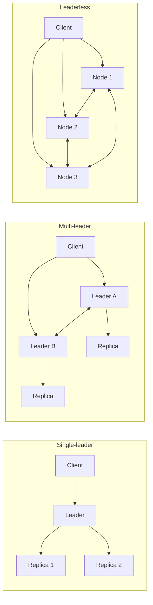
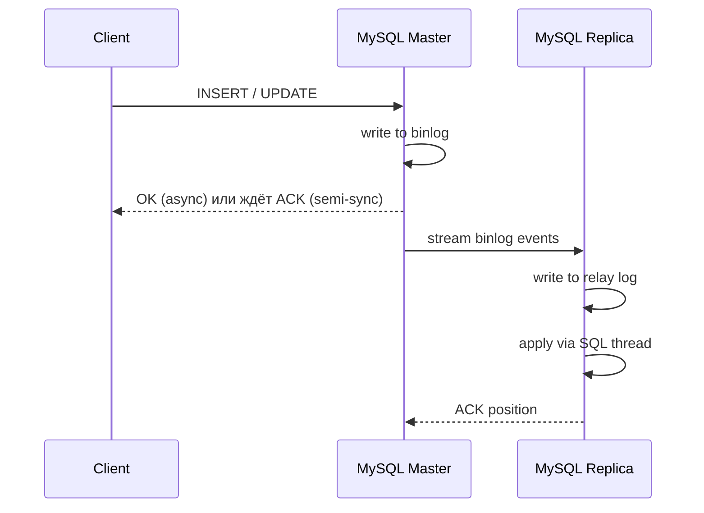

# Вопросы на собеседовании: `Database Replication`

Репликация БД: `single-leader` (`primary-replica`), `multi-leader`, `leaderless`; `sync` vs `async`; `logical` vs `physical`; конкретика по `MySQL`, `PostgreSQL`, `Cassandra`, `MongoDB`; failover, split-brain, conflict resolution, CDC.

**Database Replication** — это поддержание копий одних и тех же данных на нескольких узлах. Цели: высокая доступность (`HA`), масштабирование чтений (`read scaling`), географическое распределение (`geo-distribution`), disaster recovery, разгрузка аналитики. На собеседованиях спрашивают про модели репликации, trade-off `sync` vs `async`, обработку конфликтов, реплик-лаг, failover и split-brain.

## Полезные ссылки

### Книги и теория

- [Designing Data-Intensive Applications, ch. 5 (Replication)](https://dataintensive.net/) — Martin Kleppmann, базовая глава
- [Database Internals, ch. 11-12](https://www.databass.dev/) — Alex Petrov

### Официальная документация

- [PostgreSQL: High Availability, Load Balancing, and Replication](https://www.postgresql.org/docs/current/high-availability.html)
- [PostgreSQL: Streaming Replication Protocol](https://www.postgresql.org/docs/current/protocol-replication.html)
- [PostgreSQL: Logical Replication](https://www.postgresql.org/docs/current/logical-replication.html)
- [MySQL: Replication Overview](https://dev.mysql.com/doc/refman/8.0/en/replication.html)
- [MySQL: GTID-Based Replication](https://dev.mysql.com/doc/refman/8.0/en/replication-gtids.html)
- [MySQL: Semisynchronous Replication](https://dev.mysql.com/doc/refman/8.0/en/replication-semisync.html)
- [MongoDB: Replica Sets](https://www.mongodb.com/docs/manual/replication/)
- [Cassandra: Data Replication](https://cassandra.apache.org/doc/latest/cassandra/architecture/dynamo.html)

### Инструменты и CDC

- [Debezium Documentation](https://debezium.io/documentation/) — CDC через replication log
- [Patroni — PostgreSQL HA](https://patroni.readthedocs.io/)
- [Orchestrator — MySQL HA](https://github.com/openark/orchestrator)
- [AWS RDS Read Replicas](https://docs.aws.amazon.com/AmazonRDS/latest/UserGuide/USER_ReadRepl.html)

## Содержание

- [Полезные ссылки](#полезные-ссылки)
- [See also](#see-also)

**Основы**
- [Q1. (!) Зачем нужна репликация и какие задачи она решает?](#q1--зачем-нужна-репликация-и-какие-задачи-она-решает)
- [Q2. (!) Какие модели репликации существуют?](#q2--какие-модели-репликации-существуют)
- [Q3. (!) Sync vs Async vs Semi-sync репликация — в чём разница?](#q3--sync-vs-async-vs-semi-sync-репликация--в-чём-разница)
- [Q4. (!) Logical vs Physical репликация — отличия и применимость](#q4--logical-vs-physical-репликация--отличия-и-применимость)
- [Q5. Replication vs Backup — в чём разница?](#q5-replication-vs-backup--в-чём-разница)

**Single-leader (master-slave / primary-replica)**
- [Q6. (!) Как устроена single-leader репликация?](#q6--как-устроена-single-leader-репликация)
- [Q7. Что такое replication lag и как его измерять?](#q7-что-такое-replication-lag-и-как-его-измерять)
- [Q8. Read-your-writes и monotonic reads consistency](#q8-read-your-writes-и-monotonic-reads-consistency)
- [Q9. Какие проблемы у async репликации?](#q9-какие-проблемы-у-async-репликации)

**Multi-leader**
- [Q10. (!) Когда оправдан multi-leader (master-master)?](#q10--когда-оправдан-multi-leader-master-master)
- [Q11. (!) Как разрешать конфликты: LWW, version vectors, CRDT?](#q11--как-разрешать-конфликты-lww-version-vectors-crdt)

**Leaderless**
- [Q12. (!) Как работает leaderless репликация (Cassandra, Dynamo)?](#q12--как-работает-leaderless-репликация-cassandra-dynamo)
- [Q13. Что такое quorum (R + W > N) и зачем он нужен?](#q13-что-такое-quorum-r--w--n-и-зачем-он-нужен)
- [Q14. Hinted handoff и anti-entropy repair](#q14-hinted-handoff-и-anti-entropy-repair)

**MySQL specifics**
- [Q15. (!) Как устроена репликация в MySQL?](#q15--как-устроена-репликация-в-mysql)
- [Q16. Чем различаются форматы binlog: statement-based, row-based, mixed?](#q16-чем-различаются-форматы-binlog-statement-based-row-based-mixed)
- [Q17. Что такое GTID и зачем он нужен?](#q17-что-такое-gtid-и-зачем-он-нужен)
- [Q18. Semi-sync replication в MySQL — как настроить?](#q18-semi-sync-replication-в-mysql--как-настроить)

**PostgreSQL specifics**
- [Q19. (!) Как устроена streaming replication в PostgreSQL?](#q19--как-устроена-streaming-replication-в-postgresql)
- [Q20. Replication slots — зачем нужны?](#q20-replication-slots--зачем-нужны)
- [Q21. Logical replication через publications/subscriptions](#q21-logical-replication-через-publicationssubscriptions)
- [Q22. Synchronous_commit и synchronous_standby_names](#q22-synchronous_commit-и-synchronous_standby_names)

**MongoDB и Cassandra**
- [Q23. Как устроен replica set в MongoDB?](#q23-как-устроен-replica-set-в-mongodb)
- [Q24. Replication factor и snitches в Cassandra](#q24-replication-factor-и-snitches-в-cassandra)

**Failover и Split-brain**
- [Q25. (!) Как работает автоматический failover?](#q25--как-работает-автоматический-failover)
- [Q26. (!) Что такое split-brain и как его избегать?](#q26--что-такое-split-brain-и-как-его-избегать)
- [Q27. Read replicas в облаке: RDS, Aurora, Cloud SQL](#q27-read-replicas-в-облаке-rds-aurora-cloud-sql)

**CDC и Cross-region**
- [Q28. (!) Что такое Change Data Capture (CDC)?](#q28--что-такое-change-data-capture-cdc)
- [Q29. Репликация через Kafka и Debezium](#q29-репликация-через-kafka-и-debezium)
- [Q30. Cross-region репликация: trade-off и подводные камни](#q30-cross-region-репликация-trade-off-и-подводные-камни)
- [Q31. Anti-patterns репликации](#q31-anti-patterns-репликации)

---

## Q1. (!) Зачем нужна репликация и какие задачи она решает?

**Репликация** — это поддержание нескольких копий одних и тех же данных на разных узлах. Одна копия (или несколько) служит источником истины, остальные синхронно или асинхронно её догоняют. Решает сразу пять задач: доступность, масштабирование чтений, гео-распределение, disaster recovery и разгрузку аналитики.

**Основные цели:**

| Цель | Что даёт | Пример |
|---|---|---|
| **High Availability** | работа при падении узла | replica становится primary при отказе |
| **Read scaling** | разгрузка чтений | аналитика читает с replica, OLTP пишет в primary |
| **Geo-distribution** | низкая латентность для пользователей | replica в каждом регионе |
| **Disaster recovery** | RPO/RTO для катастроф | replica в другом ДЦ |
| **Analytics offload** | тяжёлые запросы не блокируют OLTP | BI-отчёты с read-replica |
| **Rolling upgrades** | апгрейд без даунтайма | по очереди обновляем реплики |

**Что НЕ решает репликация** (частая ловушка на собесе):
- **Не заменяет backup.** Логическая ошибка вроде `DROP TABLE` тут же реплицируется на все копии — терять данные будете синхронно во всех ДЦ.
- **Не масштабирует записи** в single-leader: все writes всё равно идут в один узел.
- **Не даёт strong consistency сама по себе** — для неё нужны отдельные механизмы (sync-репликация, кворумы, causal-токены).

**Метрики, которыми меряют качество репликации:**
- `RPO` (Recovery Point Objective) — сколько данных допустимо потерять при катастрофе (в секундах/транзакциях).
- `RTO` (Recovery Time Objective) — за сколько система должна восстановиться.
- `Replication lag` — текущее отставание реплики от primary.

---

## Q2. (!) Какие модели репликации существуют?

Существуют три фундаментальные модели, и различаются они одним вопросом — **кто имеет право принимать запись**: один узел, несколько или вообще любой.



Те же три топологии визуально (стрелки — направление потока изменений):

```
Single-leader                  Multi-leader                       Leaderless
─────────────                  ────────────                       ──────────

   Client                         Client                            Client
     │                          ┌───┴───┐                       ┌─────┼─────┐
     ▼ write                    ▼ write ▼ write                 ▼      ▼      ▼
 ┌────────┐               ┌────────┐   ┌────────┐          ┌──────┐┌──────┐┌──────┐
 │ Leader │               │Leader A│◀─▶│Leader B│          │Node 1││Node 2││Node 3│
 └───┬────┘               └───┬────┘   └───┬────┘          └──────┘└──────┘└──────┘
   ┌─┴──┐                     │            │                полная сетка (узлы
   ▼    ▼                     ▼            ▼                синхронизируются друг
┌──────┐┌──────┐         ┌────────┐   ┌────────┐           с другом в обе стороны):
│Repl 1││Repl 2│         │Replica │   │Replica │           Node1 ◀─▶ Node2
└──────┘└──────┘         └────────┘   └────────┘           Node2 ◀─▶ Node3
                                                           Node1 ◀─▶ Node3
```

| Модель | Writes | Reads | Примеры | Конфликты |
|---|---|---|---|---|
| **Single-leader** | только primary | primary + replicas | `PostgreSQL`, `MySQL`, `MongoDB` (replica set) | нет |
| **Multi-leader** | любой leader | любой узел | `MySQL Group Replication`, `PostgreSQL BDR`, `CouchDB` | да, нужен resolution |
| **Leaderless** | любой узел (через клиент/координатор) | любой узел | `Cassandra`, `DynamoDB`, `Riak` | да, через quorum + version vectors |

**Логика выбора:** чем больше узлов могут писать, тем выше доступность и ниже латентность записи — но тем сложнее консистентность и неизбежнее конфликты. Поэтому:
- `Single-leader` — дефолт для OLTP: один писатель означает отсутствие конфликтов и простую модель консистентности.
- `Multi-leader` — когда нужны записи в нескольких регионах с локальной латентностью, и вы готовы платить за разрешение конфликтов.
- `Leaderless` — когда важнее всего доступность и пропускная способность на запись, а eventual consistency приемлема.

---

## Q3. (!) Sync vs Async vs Semi-sync репликация — в чём разница?

Разница в одном: **ждёт ли primary подтверждения от реплик, прежде чем ответить клиенту `OK`**. Это прямой **компромисс между durability и latency** — чем дольше ждём, тем меньше шанс потерять данные при сбое, но тем выше задержка записи.

| Режим | Поведение | Durability | Latency | Доступность |
|---|---|---|---|---|
| **Sync** | primary ждёт `ACK` от всех реплик | максимальная | высокая | падает при отказе реплики |
| **Async** | primary не ждёт реплик | низкая (возможна потеря) | минимальная | высокая |
| **Semi-sync** | primary ждёт `ACK` от ≥1 реплики | средняя | средняя | средняя |

**Sync replication:**
- Все реплики подтвердили запись → клиент получает `OK`.
- Гарантирует zero data loss при failover.
- Если хоть одна реплика тормозит — тормозит всё.
- Редко используется в чистом виде на > 2 узлах.

**Async replication:**
- Primary пишет в свой WAL и сразу отвечает клиенту.
- Реплики догоняют асинхронно.
- При падении primary можно потерять последние транзакции.
- Дефолт в `MySQL`, `PostgreSQL` (можно включить sync).

**Semi-sync (компромисс):**
- Primary ждёт `ACK` от **минимум одной** реплики (не всех).
- Реализован в `MySQL` (`rpl_semi_sync_master_enabled`).
- В `PostgreSQL` через `synchronous_commit = on` + `synchronous_standby_names = 'ANY 1 (replica1, replica2)'`.
- Если ни одна реплика не отвечает за `rpl_semi_sync_master_timeout` — деградирует до `async`.

**Эмпирическое правило:** один sync replica + N async replicas — типовая боевая конфигурация. Sync-реплика гарантирует zero data loss, async-реплики дают read scaling, не замедляя primary.

---

## Q4. (!) Logical vs Physical репликация — отличия и применимость

Разница в **уровне абстракции того, что передаётся**. Physical копирует низкоуровневые изменения хранилища (байты страниц / WAL-записи) — реплика становится бит-в-бит копией. Logical передаёт сами операции (`INSERT`/`UPDATE`/`DELETE`) — реплика применяет их по-своему. Отсюда вытекают все остальные отличия.

| Аспект | Physical | Logical |
|---|---|---|
| **Что передаётся** | байты страниц / WAL-записи | логические операции (`INSERT`/`UPDATE`/`DELETE`) |
| **Версии** | требуется одинаковая major-версия | можно реплицировать между разными версиями |
| **Архитектура** | одинаковая (x86 vs ARM) | любая |
| **Гранулярность** | вся БД | таблицы/схемы выборочно |
| **Реплика writable** | read-only | writable |
| **Производительность** | быстрее | медленнее (overhead на decode) |
| **Применимость** | HA, hot standby | upgrade, миграция, ETL, CDC |

**Physical (PostgreSQL streaming):**
- WAL передаётся побайтово через `pg_basebackup` + streaming.
- Replica — бит-в-бит копия primary.
- Не работает между разными PG-версиями.
- Read-only, но позволяет hot standby queries.

**Logical (PostgreSQL publications):**
- `pg_logical_decoding` парсит WAL в логические события.
- Реплика хранит данные в своих файлах, может иметь свои индексы.
- Поддерживает selective replication (только нужные таблицы).
- Не реплицирует `DDL` (нужны hooks или `event triggers`).

**MySQL:** репликация по умолчанию **logical** (binlog), но row-based binlog (`RBR`) приближается к физическому копированию изменённых строк.

---

## Q5. Replication vs Backup — в чём разница?

Это **разные инструменты против разных угроз**, и одно не заменяет другое. Репликация защищает от отказа железа (узел/диск/сеть умер — есть живая копия). Backup защищает от логических катастроф (кто-то удалил данные, ransomware зашифровал, баг в коде испортил таблицу) — то, против чего репликация бессильна, потому что честно копирует ошибку на все узлы.

| Аспект | Replication | Backup |
|---|---|---|
| **Что защищает** | сбой железа / сети / узла | логические ошибки, ransomware, человеческий фактор |
| **Real-time** | да | нет (точки во времени) |
| **Восстановление** | failover за секунды/минуты | restore за часы |
| **Защищает от `DROP TABLE`** | нет (ошибка реплицируется) | да |
| **Хранение** | online, дорогое | offline/cold storage, дешёвое |
| **Тестирование** | в составе HA-тестов | отдельные restore-drill |

**Эмпирическое правило:** реплики **не заменяют** бэкапы. Если разработчик сделает `DELETE FROM users` без `WHERE` — DELETE улетит на все реплики за миллисекунды, и откатиться будет неоткуда.

**Скучно, но обязательно:**
- `PostgreSQL`: `pg_basebackup` + WAL archiving + `pg_dump` для логических.
- `MySQL`: `mysqldump`/`mysqlpump`/`Xtrabackup` + binlog для PITR.
- Тестировать восстановление **регулярно** (не реже раза в квартал).

---

## Q6. (!) Как устроена single-leader репликация?

**Single-leader (primary-replica, master-slave)** — один узел принимает все записи и транслирует их остальным через журнал изменений. Это самая распространённая модель: её используют PostgreSQL, MySQL, MongoDB по умолчанию.

**Как это работает по шагам:**

1. Клиенты пишут **только в primary** (leader) — единственный источник истины.
2. Primary логирует каждое изменение в **replication log** (WAL в PG, binlog в MySQL, oplog в MongoDB).
3. Replicas (followers) забирают этот лог и применяют изменения у себя в том же порядке.
4. Чтения могут идти как на primary, так и на replicas — отсюда read scaling.

**Поток данных:**

```
Client → Primary → [write to WAL] → [send to replicas] → Replicas apply
                                                       ↓
                                                  ACK to client (sync only)
```

**Ключевые свойства** (и почему они такие):
- **Нет конфликтов** — раз пишет только один узел, два конкурентных изменения одной строки невозможны.
- **Простая консистентность** — все реплики применяют один и тот же поток изменений в одном порядке.
- **Primary — узкое место для записей** — масштабировать writes этой моделью нельзя.
- **При отказе primary нужен failover** — пока новый лидер не выбран, записи невозможны.

**Как реплика помнит, где остановилась** (stateful-компоненты):
- Позиция в журнале: `pg_lsn` (`0/3000060`) в PG, `binlog file:position` или `GTID` в MySQL.
- Replication slots (PG) — гарантируют, что primary не удалит WAL, пока реплика его не применила.

**Типичные топологии:**
- 1 primary + 2 replicas (HA + read scaling).
- 1 primary + 1 sync replica + N async replicas.
- Cascade replication: replica → replica (снижает нагрузку на primary).

---

## Q7. Что такое replication lag и как его измерять?

**Replication lag** — задержка между моментом, когда транзакция закоммичена на primary, и моментом, когда то же изменение применено на replica. Именно из-за лага async-реплика может вернуть устаревшие данные.

**Откуда берётся лаг:**
- Большие транзакции (long-running `UPDATE`/`DELETE`).
- Slow network между ДЦ.
- Слабое железо replica (IOPS, CPU).
- Single-threaded apply (исторически в MySQL до multi-thread replication).
- Lock contention на replica при read queries.
- Тяжёлые DDL на primary.

**Как мерить:**

`PostgreSQL`:
```sql
-- На primary:
SELECT client_addr, state, sent_lsn, write_lsn, flush_lsn, replay_lsn,
       pg_wal_lsn_diff(sent_lsn, replay_lsn) AS bytes_behind
FROM pg_stat_replication;

-- На replica:
SELECT now() - pg_last_xact_replay_timestamp() AS lag;
```

`MySQL`:
```sql
SHOW REPLICA STATUS\G
-- Seconds_Behind_Source: 0
-- Replica_IO_Running: Yes
-- Replica_SQL_Running: Yes
```

`MongoDB`:
```javascript
rs.printSecondaryReplicationInfo()
// или
db.getReplicationInfo()
```

**Как лечить:**
- Дробить большие транзакции на батчи, чтобы apply шёл мелкими порциями.
- Включить multi-threaded apply (`replica_parallel_workers` в MySQL 8, `max_parallel_apply_workers_per_subscription` в PG 16).
- Вынести тяжёлую аналитику на отдельную replica, которой допустимо отставать.
- Завести алерт на `lag > X seconds`.

**Подводный камень:** строить логику «прочитать сразу после записи» с replica, не проверив lag — почти гарантированно получите устаревшее значение.

---

## Q8. Read-your-writes и monotonic reads consistency

Это две гарантии, которые async-репликация **не** даёт по умолчанию, но которые часто нужны для нормального UX. Обе решают разные симптомы одной болезни — реплика отстаёт.

**Read-your-writes consistency** — клиент **всегда видит хотя бы свои собственные** записи. Без неё происходит классика: пользователь сохранил профиль, тут же читает его с отставшей реплики и видит старые данные («где мои изменения?»).

**Как обеспечить:**
- **Sticky sessions** — направлять чтения пользователя на тот же узел, куда он писал.
- **Read-after-write на primary** — первые X секунд после записи читать только с primary.
- **LSN tracking** — клиент хранит `last_write_lsn`, а реплика ждёт, пока её `replay_lsn >= last_write_lsn`, прежде чем ответить.
  - PostgreSQL: `pg_wal_replay_wait` (PG 18) или то же на уровне приложения.
- **Causal consistency tokens** (`MongoDB`):
  ```javascript
  const session = client.startSession({ causalConsistency: true });
  ```

**Monotonic reads consistency** — пользователь не видит «откат во времени»: если он раз увидел значение, при следующем чтении оно не должно исчезнуть. Нарушается, когда два последовательных запроса попали на реплики с разным лагом (первая свежее второй).

**Как обеспечить:**
- Привязать пользователя к одной реплике: hash(user_id) → конкретный узел (`consistent hashing`).
- Версионирование на клиенте, чтобы отбрасывать «более старые» ответы.

**Подводный камень:**
```java
userRepo.save(user);              // primary
User u = userRepo.findById(id);   // replica — может вернуть старое!
return u;
```
**Решение:** форсить primary для чтения сразу после save, либо использовать causal consistency token.

---

## Q9. Какие проблемы у async репликации?

Async-репликация быстра и доступна, но платит за это тем, что primary отвечает клиенту **до** того, как данные доехали до реплик. Все её проблемы — следствие этого зазора.

**1. Потеря данных при failover.**
Если primary упал, не успев отреплицировать последние транзакции, — они **потеряны навсегда** (либо застряли как «ghost data» на старом primary и при его возврате конфликтуют с новым).

**2. Несогласованность из-за replication lag.**
- Клиент пишет → читает с реплики → видит старое значение.
- Особенно болезненно для UI: dashboard показал «save successful», но после F5 на экране снова старые данные.

**3. Сложности каскадного failover.**
- Новым primary выбирают реплику с **минимальным** lag (она ближе всего к состоянию упавшего primary).
- Реплики с бо́льшим lag разошлись с новым primary — их надо «перематывать» (`pg_rewind`, `mysqlbinlog`) или пересоздавать с нуля.

**4. Split-brain после неудачного failover.**
- Старый primary поднимается, считает себя лидером и принимает writes.
- Новый primary тоже принимает writes.
- Две истории разошлись — автоматически их уже не слить.

**5. Длинные транзакции «душат» реплики.**
- Долгий `VACUUM`/`UPDATE` на primary блокирует apply на репликах → lag растёт.

**Чем закрываются эти риски:**
- Мониторинг lag и алерты — чтобы видеть проблему до инцидента.
- Semi-sync для критичных данных — чтобы не терять последние транзакции.
- Fencing/STONITH старого primary при failover — чтобы не словить split-brain.
- Идемпотентные операции с дедупликацией на стороне приложения — чтобы повтор не ломал данные.

---

## Q10. (!) Когда оправдан multi-leader (master-master)?

**Multi-leader** — несколько узлов одновременно принимают writes и обмениваются изменениями между собой. Это снимает узкое место одного писателя и позволяет писать локально в каждом регионе, но взамен приносит конфликты — два лидера могут изменить одну строку одновременно. Поэтому оправдан он только там, где выигрыш от локальной записи перевешивает цену разрешения конфликтов.

**Когда оправдан:**

| Сценарий применения | Причина |
|---|---|
| **Multi-region writes** | пользователи в разных регионах пишут локально с низкой латентностью |
| **Offline-first apps** | мобильные клиенты пишут локально, синхронизируются позже (CouchDB/PouchDB) |
| **Collaborative editing** | Google Docs, Figma — одновременные правки разных пользователей |
| **HA с возможностью писать в любую ноду** | при отказе одного leader-а writes идут в другой |

**Когда НЕ оправдан:**
- Простой OLTP с одним ДЦ — добавляет сложность conflict resolution без выгоды.
- Финансовые транзакции с strong consistency — конфликты опасны.
- Если нет понятной стратегии разрешения конфликтов.

**Реализации:**
- `MySQL Group Replication` + ProxySQL.
- `PostgreSQL BDR` (Bi-Directional Replication, EDB).
- `pglogical` для PG.
- `CouchDB` (изначально multi-master).
- `Galera Cluster` для MySQL/MariaDB (sync multi-master).

**Главная сложность — конфликты:** когда два leader одновременно меняют одну строку, нужна стратегия разрешения (см. Q11). Без неё multi-leader превращается в источник тихой потери данных.

---

## Q11. (!) Как разрешать конфликты: LWW, version vectors, CRDT?

Как только запись принимают несколько узлов (multi-leader или leaderless), конфликты неизбежны: два узла независимо меняют одно значение, а потом эти версии встречаются. Стратегии отличаются тем, **жертвуют ли они данными ради простоты или сохраняют всё ценой сложности**.

| Стратегия | Как работает | Плюсы | Минусы |
|---|---|---|---|
| **Last-Write-Wins (LWW)** | побеждает запись с большим timestamp | просто | потеря данных при clock skew |
| **Version vectors** | каждый узел инкрементит свой счётчик | детектирует concurrent updates | сложнее, нужно application merge |
| **CRDT** | структуры данных, у которых merge всегда работает | автоматический merge | ограниченный набор операций |
| **Application-level merge** | приложение решает | гибко | сложно, ошибочно |
| **Reject conflicts** | вторая запись отклоняется | строго | плохой UX |

**LWW (Last-Write-Wins)** — побеждает запись с бо́льшим timestamp:
- Дефолт в Cassandra и DynamoDB.
- Главная опасность — часы узлов расходятся (NTP может ошибиться на сотни мс), и тогда «более новой» окажется не та запись.
- При двух конкурентных записях одна **тихо теряется** — никто не получит ошибку.

**Version vectors** — отслеживают причинно-следственную связь версий:
- Каждый узел A, B, C ведёт счётчик: `{A:3, B:5, C:2}`.
- При write узел инкрементит свой компонент.
- Если вектор `V1` ≤ `V2` поэлементно → `V2` точно новее, конфликта нет.
- Если векторы несравнимы (`V1={A:3,B:5}`, `V2={A:5,B:3}`) → записи **конкурентны**, и систему нельзя оставить решать самой — нужен merge на уровне приложения.

**CRDT (Conflict-free Replicated Data Types)** — структуры данных, для которых merge математически всегда сходится к одному результату:
- Convergence гарантирована свойствами самой структуры, поэтому ручное разрешение не нужно.
- Примеры: G-Counter, OR-Set, LWW-Element-Set, RGA (для текста).
- Применяются в Redis Enterprise (CRDB), Riak, Yjs/Automerge для совместного редактирования.
- Цена — ограниченный набор операций: не любую бизнес-логику можно выразить как CRDT.

```java
// G-Counter (grow-only counter)
class GCounter {
    Map<String, Long> nodeCounts = new HashMap<>();
    void increment(String nodeId) { nodeCounts.merge(nodeId, 1L, Long::sum); }
    long value() { return nodeCounts.values().stream().mapToLong(Long::longValue).sum(); }
    void merge(GCounter other) {
        other.nodeCounts.forEach((k, v) -> nodeCounts.merge(k, v, Math::max));
    }
}
```

---

## Q12. (!) Как работает leaderless репликация (Cassandra, Dynamo)?

**Leaderless (Dynamo-style)** — лидера нет вообще: любой узел принимает и чтения, и записи. Раз нет единого писателя, нет и единой точки отказа — отсюда экстремальная доступность. Платой становится отсутствие гарантированного порядка: согласованность достигается не лидером, а **кворумами плюс фоновыми механизмами лечения расхождений**.

**Ключевые концепции:**
- **Replication factor (RF)** — сколько копий каждого ключа (`RF=3` стандарт).
- **Consistent hashing** — ключ маппится на токен в ring, копии на следующих узлах.
- **Quorum reads/writes** — клиент ждёт `W` подтверждений на write, `R` ответов на read.
- **Hinted handoff** — если узел недоступен, его сосед хранит «подсказку» и доставит позже.
- **Read repair** — при чтении расхождения координатор пишет актуальную версию.
- **Anti-entropy repair** — периодический фоновой `nodetool repair` сверяет реплики через Merkle trees.

**Поток write:**
```
Client → Coordinator (любой узел) → forward to RF=3 replicas
                                  ← W ACKs (например, W=2)
        ← OK to client
```

**Поток read:**
```
Client → Coordinator → query R=2 replicas
                    ← responses (возможно, с разными версиями)
                    → return latest (по timestamp) + async read repair
```

**Примеры:**
- `Apache Cassandra` — Dynamo-inspired.
- `Amazon DynamoDB` — оригинал Dynamo paper.
- `Riak` — также Dynamo-style.
- `ScyllaDB` — Cassandra-compatible.

---

## Q13. Что такое quorum (R + W > N) и зачем он нужен?

**Quorum** — это механизм, который даёт сильную согласованность в leaderless-системе **без лидера**: вместо того чтобы спрашивать один авторитетный узел, клиент опрашивает достаточное большинство копий.

**Параметры:**
- `N` — replication factor (сколько копий каждого ключа хранится).
- `W` — сколько узлов должны подтвердить запись, чтобы она считалась успешной.
- `R` — сколько узлов должны ответить на чтение.

**Правило строгой согласованности:** `R + W > N`.

**Почему это работает:** если `W` узлов подтвердили запись и `R` узлов участвуют в чтении, то при `R + W > N` множества читающих и писавших **обязательно пересекутся** хотя бы в одном узле. А значит, чтение зацепит хотя бы одну копию со свежим значением — клиент его увидит.

**Типовые настройки для N=3:**

| W | R | Свойства |
|---|---|---|
| 3 | 1 | sync writes, fast reads (R=ONE, W=ALL) |
| 1 | 3 | fast writes, sync reads |
| **2** | **2** | **баланс (QUORUM)** |
| 1 | 1 | eventual consistency, max throughput |
| 3 | 3 | максимальная strong consistency, нет fault tolerance |

**Cassandra consistency levels:**
- `ONE`, `TWO`, `THREE` — N узлов.
- `QUORUM` — `floor(RF/2) + 1`.
- `LOCAL_QUORUM` — quorum в локальном ДЦ.
- `EACH_QUORUM` — quorum в каждом ДЦ.
- `ALL` — все реплики.

**Strict vs sloppy quorum:**
- **Strict quorum** — запись принимается только на «правильные» узлы (владельцы данного ключа по hash-ring), иначе fail. Гарантия согласованности соблюдается строго.
- **Sloppy quorum** — если часть «правильных» узлов недоступна (записали W=2, но один умер до подтверждения), запись уходит на любые живые узлы, а данные потом доедут до владельцев через hinted handoff (см. Q14). Это повышает доступность записи ценой временного нарушения гарантии `R + W > N`.

---

## Q14. Hinted handoff и anti-entropy repair

Это три механизма, которыми leaderless-система **самостоятельно сводит расхождения** между репликами. Они работают на разных горизонтах: hinted handoff — в момент сбоя, read repair — в момент чтения, anti-entropy — фоном по расписанию.

**Hinted handoff** — спасает запись, когда узел-получатель временно недоступен:
- Узел A пишет, координатор должен реплицировать на B, но B лежит.
- Координатор сохраняет «подсказку» (hint) у себя: «когда B вернётся — отдай ему этот write».
- B возвращается → hints доезжают до него → B применяет пропущенные записи.
- В Cassandra окно хранения: `max_hint_window_in_ms = 3 hours` (по умолчанию).
- **Если B отсутствует дольше hint window — hints удаляются**, и реплика остаётся устаревшей (это уже задача anti-entropy repair).

**Read repair** — лечит расхождение в момент чтения:
- При read с `R=QUORUM` координатор получает от реплик разные версии.
- Возвращает клиенту самую свежую.
- Асинхронно дописывает эту свежую версию на отставшие реплики — попутно, без отдельного запуска.

**Anti-entropy repair (`nodetool repair`)** — фоновая полная сверка реплик:
- Сравнение идёт через **Merkle trees**: каждый узел строит хеш-дерево своих данных, узлы сверяют деревья и передают только различающиеся диапазоны (а не все данные).
- Запускать **обязательно раз в `gc_grace_seconds`** (по умолчанию 10 дней).
- Если пропустить: tombstones (маркеры удаления) будут вычищены сборщиком, но устаревшая реплика про удаление так и не узнает — и удалённые данные «воскреснут».

**Подводный камень:** забыть про `nodetool repair` → zombie data: удалённые записи возвращаются.

---

## Q15. (!) Как устроена репликация в MySQL?

Репликация MySQL построена на **binary log** и двух потоках на стороне реплики: один тянет журнал, другой его применяет. Такое разделение позволяет реплике принимать события быстро, даже если применяет их медленнее.

**Три компонента:**
- **Binary log (binlog)** на master — последовательный журнал всех изменений данных.
- **IO thread** на replica — читает binlog с master и складывает его в локальный **relay log**.
- **SQL thread** (или несколько workers) на replica — применяет relay log к данным.



Тот же обмен как диаграмма последовательности (время идёт сверху вниз, дорожки — участники):

```
   Client              MySQL Master                MySQL Replica
     │                       │                           │
     │  INSERT / UPDATE      │                           │
     │──────────────────────▶│                           │
     │                       │ write to binlog           │
     │                       │──┐                         │
     │                       │◀─┘                         │
     │   OK (async) /        │                           │
     │   ждёт ACK (semi-sync)│                           │
     │◀──────────────────────│                           │
     │                       │  stream binlog events     │
     │                       │──────────────────────────▶│
     │                       │                           │ write to relay log
     │                       │                           │──┐
     │                       │                           │◀─┘
     │                       │                           │ apply via SQL thread
     │                       │                           │──┐
     │                       │                           │◀─┘
     │                       │        ACK position       │
     │                       │◀──────────────────────────│
     │                       │                           │
```

**Конфиг master (`my.cnf`):**
```ini
[mysqld]
server-id = 1
log-bin = mysql-bin
binlog-format = ROW
binlog-row-image = MINIMAL
sync-binlog = 1
innodb-flush-log-at-trx-commit = 1
gtid-mode = ON
enforce-gtid-consistency = ON
```

**Конфиг replica:**
```ini
[mysqld]
server-id = 2
relay-log = relay-bin
read-only = 1
super-read-only = 1
gtid-mode = ON
enforce-gtid-consistency = ON
log-bin = mysql-bin      # обязательно для chain replication
log-slave-updates = ON
```

**Запуск репликации:**
```sql
CHANGE REPLICATION SOURCE TO
  SOURCE_HOST='master.example.com',
  SOURCE_USER='repl',
  SOURCE_PASSWORD='secret',
  SOURCE_AUTO_POSITION=1;  -- использовать GTID
START REPLICA;
SHOW REPLICA STATUS\G
```

**Multi-threaded apply** (MySQL 8):
```sql
SET GLOBAL replica_parallel_workers = 8;
SET GLOBAL replica_parallel_type = 'LOGICAL_CLOCK';
```

---

## Q16. Чем различаются форматы binlog: statement-based, row-based, mixed?

Форматы различаются тем, **что именно** master пишет в binlog: текст SQL-запроса, конкретные изменённые строки или их смесь. Это напрямую влияет на детерминизм репликации — выполнит ли реплика ровно то же, что и master.

**Три формата:**

| Формат | Что пишется | Плюсы | Минусы |
|---|---|---|---|
| **STATEMENT (SBR)** | SQL-стейтменты целиком | компактный, читаемый | unsafe для `NOW()`, `UUID()`, `LIMIT` без `ORDER BY` |
| **ROW (RBR)** | измененные строки | детерминированный, безопасный | объёмный, сложно читать |
| **MIXED** | автоматический выбор | компромисс | сложнее дебажить |

**Statement-based (SBR):**
```sql
-- В binlog:
UPDATE users SET last_login = NOW() WHERE id = 42;
```
- Replica выполнит `NOW()` со своим временем → разные значения!
- Unsafe для non-deterministic функций.

**Row-based (RBR, default с MySQL 5.7):**
```
-- В binlog (бинарный, упрощённо):
UPDATE users
  WHERE id = 42 AND last_login = '2026-05-01 10:00:00'
  SET last_login = '2026-05-21 14:32:11';
```
- Записывает конкретные значения «до» и «после».
- Детерминированно, безопасно.
- Больше объём (особенно для bulk-операций).
- Используй `binlog_row_image = MINIMAL` для уменьшения.

**Mixed:**
- По умолчанию пишет как SBR, но автоматически переключается на RBR для unsafe-стейтментов.
- Сложнее для CDC-инструментов (Debezium, Maxwell) — формат события заранее неизвестен.

**Рекомендация для production:** `binlog-format = ROW` всегда. Безопасность и предсказуемость важнее экономии места, а лишний объём гасится через `binlog_row_image = MINIMAL`.

---

## Q17. Что такое GTID и зачем он нужен?

**GTID (Global Transaction Identifier)** — глобально уникальный идентификатор транзакции, который сопровождает её на всех узлах кластера MySQL. Главная ценность: реплика отслеживает прогресс не по хрупкой паре «файл + смещение», а по набору применённых GTID — и это радикально упрощает failover.

**Формат:** `SERVER_UUID:TRANSACTION_NUMBER`
```
3E11FA47-71CA-11E1-9E33-C80AA9429562:23
```

**До GTID** позиция задавалась как `binlog file + position`, и это создавало проблемы:
- При failover приходилось вручную искать, «где остановилась replica», через `SHOW SLAVE STATUS`.
- При смене master позицию надо было пересчитывать заново — координаты в его binlog другие.
- Ошибка в расчётах оборачивалась потерей или дублированием транзакций.

**С GTID всё это снимается:**
- Реплика точно знает, какие GTID она уже применила, и не применит их повторно.
- `CHANGE REPLICATION SOURCE TO ... SOURCE_AUTO_POSITION = 1` — реплика сама находит, с чего продолжить.
- Failover становится тривиальным: новый master продолжает с первого ещё не применённого GTID.
- На этом строятся инструменты автофейловера (`Orchestrator`, `MHA`).

**Включение:**
```ini
gtid-mode = ON
enforce-gtid-consistency = ON
```

**Проверка:**
```sql
SELECT @@gtid_executed;       -- какие GTID применены
SELECT @@gtid_purged;         -- какие GTID удалены из binlog
SHOW REPLICA STATUS\G         -- Retrieved_Gtid_Set, Executed_Gtid_Set
```

**Ограничения:**
- Некоторые операции запрещены при `enforce-gtid-consistency = ON`: `CREATE TABLE ... SELECT`, non-transactional updates внутри transactions.

---

## Q18. Semi-sync replication в MySQL — как настроить?

**Semi-sync** — компромисс между async и full-sync: master перед возвратом клиенту дожидается `ACK` хотя бы от одной реплики (а не от всех). Так гарантируется, что закоммиченная транзакция уже есть как минимум на двух узлах — то есть при падении master её не потеряют, но при этом не приходится ждать самую медленную реплику.

**Установка плагина:**
```sql
-- На master:
INSTALL PLUGIN rpl_semi_sync_source SONAME 'semisync_source.so';

-- На replica:
INSTALL PLUGIN rpl_semi_sync_replica SONAME 'semisync_replica.so';
```

**Конфиг master:**
```ini
[mysqld]
rpl_semi_sync_source_enabled = 1
rpl_semi_sync_source_timeout = 10000           # 10 секунд
rpl_semi_sync_source_wait_for_replica_count = 1
rpl_semi_sync_source_wait_point = AFTER_SYNC   # после flush в binlog
```

**Конфиг replica:**
```ini
[mysqld]
rpl_semi_sync_replica_enabled = 1
```
Перезапустить IO thread на replica: `STOP REPLICA IO_THREAD; START REPLICA IO_THREAD;`

**Поведение:**
- Master ждёт `ACK` от реплики, прежде чем вернуть клиенту `OK`.
- Если ни одна реплика не ответила за `rpl_semi_sync_source_timeout` → master **деградирует до async**, чтобы не зависнуть навсегда (транзакция применена, но без подтверждения реплики — это важно помнить: гарантия durability в этот момент теряется).
- Как только реплика снова отвечает — режим автоматически возвращается к semi-sync.

**Мониторинг:**
```sql
SHOW STATUS LIKE 'Rpl_semi_sync_source%';
-- Rpl_semi_sync_source_status: ON
-- Rpl_semi_sync_source_clients: 2
-- Rpl_semi_sync_source_tx_avg_wait_time: 1234 (мкс)
```

**Альтернатива — Group Replication** (MySQL InnoDB Cluster): синхронный multi-primary через Paxos-like consensus.

---

## Q19. (!) Как устроена streaming replication в PostgreSQL?

Streaming replication передаёт реплике поток WAL — того же журнала, которым PostgreSQL обеспечивает crash recovery. Реплика просто «проигрывает» этот журнал, как будто восстанавливается после сбоя, и поэтому получается бит-в-бит копией primary.

**Четыре действующих лица:**
- **WAL (Write-Ahead Log)** на primary — последовательный журнал изменений страниц.
- **walsender** на primary — отправляет WAL по сети реплике.
- **walreceiver** на replica — принимает WAL и пишет на диск.
- **startup process** на replica — применяет (replays) WAL к страницам данных.

```
Primary:
  Backend → WAL buffer → fsync → walsender → network
                                            ↓
Replica:
  walreceiver → WAL on disk → startup process replays → pages
```

**Создание replica:**
```bash
# 1. На primary в pg_hba.conf:
# host replication repl_user replica.ip/32 scram-sha-256

# 2. На primary в postgresql.conf:
wal_level = replica            # или 'logical' для logical replication
max_wal_senders = 10
max_replication_slots = 10
wal_keep_size = 1GB            # сохранять WAL для отставших реплик

# 3. На replica — pg_basebackup:
pg_basebackup -h primary -U repl_user -D /var/lib/postgresql/data \
              -X stream -R -C -S replica1_slot

# pg_basebackup создаст standby.signal и пропишет primary_conninfo
```

**postgresql.conf на replica:**
```ini
hot_standby = on                  # позволяет read queries
hot_standby_feedback = on         # предотвращает recovery conflicts
max_standby_streaming_delay = 30s # сколько ждать long queries
primary_conninfo = 'host=primary user=repl_user application_name=replica1'
primary_slot_name = 'replica1_slot'
```

**Cascade replication:** replica → replica → replica (снимает нагрузку с primary).

**Проверка:**
```sql
-- На primary:
SELECT * FROM pg_stat_replication;
-- pid | state | sent_lsn | write_lsn | flush_lsn | replay_lsn

-- На replica:
SELECT pg_is_in_recovery();        -- true
SELECT pg_last_wal_replay_lsn();
```

---

## Q20. Replication slots — зачем нужны?

**Replication slot** решает одну конкретную проблему: не дать primary удалить WAL, который ещё нужен отставшей реплике.

**Проблема без slots:** primary вычищает старый WAL по `wal_keep_size` или после checkpoint, не зная, докуда дочитали реплики. Если реплика отстала сильнее, чем сохранённый объём, — нужного WAL уже нет, и реплику приходится пересоздавать с нуля.

**Со slot:** primary помнит позицию каждого потребителя и **не удаляет WAL, пока тот его не применил**. Это надёжно, но и опасно — см. ниже про застрявший consumer.

**Типы:**

| Тип | Применение |
|---|---|
| **Physical** | для streaming replication |
| **Logical** | для logical decoding (Debezium, pglogical) |

**Создание physical slot:**
```sql
SELECT pg_create_physical_replication_slot('replica1_slot');
SELECT * FROM pg_replication_slots;
```

**На replica указать слот:**
```ini
primary_slot_name = 'replica1_slot'
```

**Создание logical slot:**
```sql
SELECT pg_create_logical_replication_slot('debezium_slot', 'pgoutput');
-- или 'wal2json', 'test_decoding'
```

**Главная опасность slots — обратная сторона их гарантии:** если consumer **остановился** (например, упал Debezium или реплика выключена), slot честно держит WAL **бесконечно** → диск primary заполняется → primary падает. То есть забытый inactive slot способен положить мастер.

**Чем это закрывают:**
- `max_slot_wal_keep_size` (PG 13+) — жёсткий лимит, сколько WAL слоту разрешено удерживать (после него слот инвалидируется, но мастер выживает).
- Мониторинг `pg_replication_slots.confirmed_flush_lsn` и объёма удерживаемого WAL.
- Алерт на отстающие/inactive слоты.

```sql
-- Размер удерживаемого WAL по слотам:
SELECT slot_name, active,
       pg_size_pretty(pg_wal_lsn_diff(pg_current_wal_lsn(), restart_lsn)) AS retained
FROM pg_replication_slots;
```

---

## Q21. Logical replication через publications/subscriptions

**Logical replication** в PostgreSQL передаёт не байты WAL, а **логические события** (`INSERT`/`UPDATE`/`DELETE`), и делает это выборочно по таблицам. Модель «издатель — подписчик»: publisher объявляет набор таблиц через `PUBLICATION`, subscriber подписывается через `SUBSCRIPTION`. Именно логическая природа даёт то, чего не может physical: реплицировать между разными версиями PG, только часть таблиц и в writable-реплику.

**Зачем используют:**
- Upgrade между major versions без даунтайма.
- Миграция данных между разными PG-инстансами.
- Реплика подмножества таблиц (multi-tenant).
- ETL в DWH (через Debezium → Kafka).
- Multi-master с pglogical/BDR.

**Настройка:**

На **publisher** (источник):
```ini
wal_level = logical
max_replication_slots = 10
max_wal_senders = 10
```

```sql
CREATE PUBLICATION my_pub FOR TABLE users, orders;
-- или для всех таблиц:
CREATE PUBLICATION all_pub FOR ALL TABLES;
-- с фильтром (PG 15+):
CREATE PUBLICATION ru_pub FOR TABLE users WHERE (country = 'RU');
```

На **subscriber** (получатель):
```sql
CREATE SUBSCRIPTION my_sub
  CONNECTION 'host=publisher.example.com user=repl_user dbname=app'
  PUBLICATION my_pub;
```

**Ограничения logical replication** (о них любят спрашивать — это типичные грабли миграций):
- Не реплицирует `DDL` (`CREATE TABLE`, `ALTER`) — схему на subscriber нужно поддерживать вручную.
- Не реплицирует `TRUNCATE` до PG 11.
- Не реплицирует `sequences` вообще (актуально для PG 16/17/18) — после переключения счётчики надо выставлять руками через `setval()`.
- Не реплицирует large objects.
- Таблица на subscriber должна существовать заранее (DDL не приедет сам).
- У каждой таблицы должен быть PK или `REPLICA IDENTITY FULL`, иначе `UPDATE`/`DELETE` не смогут найти строку на subscriber.

**Мониторинг:**
```sql
SELECT * FROM pg_stat_subscription;
SELECT * FROM pg_stat_replication;        -- на publisher
```

---

## Q22. Synchronous_commit и synchronous_standby_names

Эти два параметра вместе определяют, **насколько прочно** PostgreSQL фиксирует транзакцию перед ответом клиенту. `synchronous_commit` задаёт уровень гарантии (от «не ждать диск» до «дождаться применения на реплике»), а `synchronous_standby_names` — какие именно реплики считаются синхронными.

**Параметр `synchronous_commit`** (уровни durability по нарастающей):

| Значение | Поведение | Durability |
|---|---|---|
| `off` | commit возвращается до fsync | можно потерять последние < 200ms |
| `local` | wait local WAL flush | crash-safe на этом узле |
| `remote_write` | wait WAL flushed на replica | crash-safe + replica file system buffer |
| `remote_apply` | wait WAL applied на replica | read-your-write через replica |
| `on` (default) | wait local + sync standbys | максимальная durability |

**`synchronous_standby_names`** — определяет sync replicas:

```ini
# Одна конкретная replica:
synchronous_standby_names = 'replica1'

# ANY N из списка (semi-sync style):
synchronous_standby_names = 'ANY 1 (replica1, replica2, replica3)'

# FIRST N (приоритетный порядок):
synchronous_standby_names = 'FIRST 2 (replica1, replica2, replica3)'

# Кворум:
synchronous_standby_names = 'ANY 2 (r1, r2, r3, r4)'
```

**Application name** на replica должен совпадать:
```ini
primary_conninfo = 'host=primary application_name=replica1 ...'
```

**Опасность:** если все sync-реплики упали, primary **зависнет на commit** — он обязан дождаться подтверждения, которого никто не даст, и клиенты получат таймаут. Sync-репликация обменивает доступность на durability, и здесь это проявляется в полный рост.

**Чем это смягчают:**
- `ANY 1 (...)` вместо `FIRST 1` — подойдёт любая из нескольких реплик, отказ одной не блокирует commit.
- Мониторинг с алертом «нет синхронных реплик».
- Готовность временно переключить на `synchronous_commit = local`, чтобы разморозить запись на время инцидента (ценой риска потери последних транзакций).

---

## Q23. Как устроен replica set в MongoDB?

**Replica set** — это single-leader-реализация MongoDB: группа инстансов с одинаковым набором данных, где один узел — primary, остальные за ним повторяют. Особенность MongoDB в том, что выборы нового primary и failover встроены прямо в кластер, без внешних инструментов.

**Состав:**
- **Primary** — единственный узел, принимающий writes.
- **Secondaries** — реплицируют primary и могут обслуживать чтения (опционально).
- **Arbiter** — голосует на выборах, но данных не хранит; нужен только чтобы добрать нечётное число голосующих и не держать лишнюю копию данных.

**Oplog (operations log)** — механизм, через который secondaries догоняют primary:
- Это capped-коллекция в служебной БД `local` (`local.oplog.rs`).
- Каждая операция primary пишется в oplog, secondaries читают его и применяют у себя.
- Размер по умолчанию ~5% от диска — он же определяет, насколько глубоко может отстать реплика, не выпав из репликации.

**Инициализация:**
```javascript
rs.initiate({
  _id: "rs0",
  members: [
    { _id: 0, host: "node1:27017", priority: 2 },
    { _id: 1, host: "node2:27017", priority: 1 },
    { _id: 2, host: "node3:27017", priority: 1 }
  ]
})
rs.status()
rs.conf()
```

**Primary election** — как выбирается новый лидер:
- Через Raft-подобный протокол консенсуса.
- Если secondaries не видят primary дольше `electionTimeoutMillis` (по умолчанию 10s) — они запускают выборы.
- Побеждает узел с самым свежим oplog и бо́льшим `priority`.
- Для решения нужен **majority** голосующих — это и защищает от split-brain (меньшинство не может выбрать своего primary).

**Read preferences:**
```javascript
db.users.find().readPref("secondary")
// primary | primaryPreferred | secondary | secondaryPreferred | nearest
```

**Write concerns:**
```javascript
db.users.insertOne({ name: "Alice" }, {
  writeConcern: { w: "majority", wtimeout: 5000, j: true }
})
// w: 1 | majority | N — сколько узлов подтвердило
// j: true — wait journal flush
```

**Causal consistency** (read-your-writes через session):
```javascript
const session = client.startSession({ causalConsistency: true });
```

---

## Q24. Replication factor и snitches в Cassandra

В Cassandra репликация настраивается на уровне **keyspace**, и два понятия определяют её поведение: **replication factor** (сколько копий каждого ключа) и **snitch** (как кластер понимает, какой узел в каком ДЦ и rack). Snitch нужен, чтобы реплики раскладывались по разным rack/ДЦ — иначе отказ одной стойки унёс бы все копии.

**Replication strategies:**

```cql
-- Для разработки (single DC):
CREATE KEYSPACE app WITH replication = {
  'class': 'SimpleStrategy',
  'replication_factor': 3
};

-- Для production (multi-DC):
CREATE KEYSPACE app WITH replication = {
  'class': 'NetworkTopologyStrategy',
  'dc_east': 3,
  'dc_west': 3
};
```

**Snitches** — определяют топологию кластера (какой узел в каком ДЦ/rack).

| Snitch | Применение |
|---|---|
| `SimpleSnitch` | single datacenter, dev |
| `GossipingPropertyFileSnitch` | production, конфиг в `cassandra-rackdc.properties` |
| `Ec2Snitch` | AWS single region |
| `Ec2MultiRegionSnitch` | AWS multi region |
| `GoogleCloudSnitch` | GCP |
| `RackInferringSnitch` | по октетам IP |

**Конфиг `cassandra-rackdc.properties`:**
```properties
dc=dc_east
rack=rack1
```

**Replica placement:** Cassandra размещает реплики **в разные racks** в пределах ДЦ — это обеспечивает доступность при отказе целого rack.

**Consistency levels:**
- `LOCAL_QUORUM` — quorum только в локальном ДЦ (быстрее, без cross-DC latency).
- `EACH_QUORUM` — quorum в каждом ДЦ (надёжнее, медленнее).
- `LOCAL_ONE` — один узел в локальном ДЦ (eventual consistency).

**Эмпирическое правило:** для multi-DC использовать `LOCAL_QUORUM` для большинства запросов.

---

## Q25. (!) Как работает автоматический failover?

**Автоматический failover** — переключение на нового primary при отказе старого, без участия человека. Идея проста, но дьявол в двух местах: правильно **обнаружить** отказ (не приняв за него сетевой глюк) и надёжно **изолировать** старый primary, чтобы он не продолжил принимать записи.

**Пять шагов:**
1. **Detection** — обнаружить, что primary недоступен (health checks, таймауты).
2. **Election** — выбрать новый primary из реплик (обычно ту, что меньше отстала).
3. **Promotion** — повысить выбранную реплику до primary.
4. **Reconfiguration** — переключить клиентов и оставшиеся реплики на нового primary.
5. **Fencing** — изолировать старый primary, если он жив, но был недоступен по сети (иначе split-brain).

**Инструменты по системам:**

| СУБД | Инструмент |
|---|---|
| **PostgreSQL** | `Patroni` + `etcd`/`Consul`/`ZooKeeper` |
| **MySQL** | `Orchestrator`, `MHA`, `MySQL Router` + Group Replication |
| **MongoDB** | встроенный election в replica set |
| **Cassandra** | не нужен — leaderless |
| **AWS RDS** | Multi-AZ, автоматический failover |

**Patroni (PostgreSQL HA):**
- Хранит state кластера в `etcd`/`Consul`.
- Каждый узел держит «leader lock» с TTL.
- Если primary не обновил lock → начинаются выборы.
- Promote через `pg_promote()` или `pg_ctl promote`.
- Запускает `pg_rewind` на старом primary при возврате.

**Конфиг Patroni (выдержка):**
```yaml
scope: postgres-cluster
namespace: /service/
name: pg-01

restapi:
  listen: 0.0.0.0:8008

etcd:
  hosts: etcd1:2379,etcd2:2379,etcd3:2379

bootstrap:
  dcs:
    ttl: 30
    loop_wait: 10
    retry_timeout: 10
    maximum_lag_on_failover: 1048576  # 1 MB
    synchronous_mode: true
```

**Подводные камни — почему failover тонкая штука:**
- Слишком чувствительный health check → ложные failover на каждый сетевой всплеск.
- Слишком терпимый → долгий downtime, пока система «решается» переключиться.
- Без fencing → split-brain, когда старый primary возвращается и тоже принимает writes.

---

## Q26. (!) Что такое split-brain и как его избегать?

**Split-brain** — ситуация, когда два узла одновременно считают себя primary и оба принимают writes. Это худший исход неудачного failover: вместо одной согласованной истории получаются две расходящиеся, и слить их автоматически уже невозможно.

**Как возникает** (классический сценарий с network partition):
1. Сеть между primary и репликами «расщепилась» (network partition).
2. Реплики не видят primary и решают, что он умер → выбирают нового.
3. Но старый primary жив и продолжает принимать writes от клиентов своего сегмента сети.
4. Итог — два узла пишут параллельно → потеря данных, конфликты и боль при ручном merge.

**Как избегать** (все приёмы крутятся вокруг одной идеи — записывать может только тот, у кого есть большинство):

**1. Quorum (majority voting).**
- Failover происходит только если **большинство** узлов согласны.
- Кластер из 3 узлов: нужно 2 для решения.
- При partition узел в меньшинстве сам себя «отключает» (step down).

**2. Fencing / STONITH (Shoot The Other Node In The Head).**
- Перед promote — физически или сетево отключить старый primary.
- В AWS: revoke security group, detach EBS.
- На bare-metal: IPMI/iLO для power off.
- Patroni: `watchdog` (linux kernel watchdog убивает узел при потере lock).

**3. External consensus store.**
- `etcd`/`ZooKeeper`/`Consul` хранят «кто primary».
- Они сами используют Raft/Paxos для consistency.
- Узел перед write проверяет: «я ещё leader?».

**4. Нечётное число узлов.**
- 3 или 5 узлов вместо 2 или 4.
- При partition (2-1) большинство имеет 2 узла.
- При (1-1-1) нет primary — но это лучше, чем split-brain.

**5. Read-only при потере quorum.**
- Если узел не видит большинство → переходит в read-only.
- В MongoDB: secondary остаётся secondary, primary step down.

**Если split-brain уже случился** (крайняя мера):
- Автоматики нет — придётся мёржить руками либо выбрать «победивший» ДЦ и отбросить расхождения второго. Это честный, но болезненный downtime с возможной потерей части данных.

---

## Q27. Read replicas в облаке: RDS, Aurora, Cloud SQL

Облачные провайдеры превращают репликацию в управляемую кнопку, но детали важны — особенно различие между классической репликацией (RDS) и storage-level (Aurora), и между read-replica и standby. Ниже — что предлагает каждый.

**AWS RDS Read Replicas:**
- Async streaming replication.
- До 15 read replicas (для PostgreSQL/MySQL).
- Можно cross-region.
- Multi-AZ — это **standby** (не используется для reads), failover автоматический.
- Read replica можно promote в standalone (для blue-green deploy).

**AWS Aurora:**
- Shared storage между primary и replicas (не WAL streaming).
- Latency репликации **< 10 ms** (storage-level).
- До 15 Aurora Replicas + 1 writer.
- Aurora Global Database — cross-region <1s lag.
- Aurora Serverless v2 — autoscaling read replicas.

**Google Cloud SQL Read Replicas:**
- Похоже на RDS: async streaming.
- Cross-region replica.
- Cascading replication поддерживается.

**Azure Database for PostgreSQL:**
- Hyperscale (Citus) — multi-node + read replicas.
- Single Server: до 5 read replicas.

**Anti-patterns в облаке:**
- Использовать `db.t3.micro` для read replica при write-heavy primary → постоянный lag.
- Запускать heavy analytics (`SELECT *`) без `hot_standby_feedback` → recovery conflicts.
- Промоутить read replica и забыть обновить connection strings → split-brain или потеря writes.

**Failover при Multi-AZ:**
- RDS делает DNS-флип на standby (60-120 секунд).
- Aurora — порядка 30 секунд (новый writer из replicas).
- Клиенты должны переподключиться и retry.

---

## Q28. (!) Что такое Change Data Capture (CDC)?

**CDC (Change Data Capture)** — паттерн, который превращает изменения данных в БД в поток событий, на который могут подписаться другие системы. По сути это «репликация наружу»: вместо догоняющей реплики поток изменений потребляют search-индекс, DWH, кэш или микросервисы.

**Зачем используют:**
- Real-time синхронизация с search index (Elasticsearch).
- Заполнение DWH/data lake (Snowflake, BigQuery).
- Event-driven architecture (микросервисы реагируют на изменения).
- Cache invalidation.
- Audit log.
- Outbox pattern.

**Подходы:**

| Подход | Как работает | Плюсы | Минусы |
|---|---|---|---|
| **Query-based** | поллим `updated_at > last_check` | просто | пропускает deletes, нагружает БД |
| **Trigger-based** | `AFTER INSERT/UPDATE` → пишем в audit-таблицу | работает везде | overhead на каждом write |
| **Log-based** | читаем binlog/WAL | низкий overhead, real-time, ничего не теряет | сложнее настроить |

**Log-based — стандарт де-факто.** Он читает тот же binlog/WAL, что и обычная репликация, поэтому даёт минимальный overhead, работает в реальном времени и не пропускает ни одного изменения (включая deletes) — в отличие от query-based и trigger-based.

**Инструменты:**
- **Debezium** — open-source CDC платформа на Kafka Connect.
- **Maxwell** — MySQL → Kafka.
- **Airbyte** — ELT, поддерживает CDC.
- **AWS DMS** — managed CDC.
- **Striim**, **HVR** — commercial.

**Outbox pattern** — как надёжно публиковать события, не теряя их при сбое. Бизнес-запись и запись в таблицу `outbox` делаются в одной транзакции (атомарно), а CDC уже забирает событие из outbox. Так событие гарантированно появится тогда и только тогда, когда зафиксирована основная запись:
```sql
BEGIN;
  INSERT INTO orders (...) VALUES (...);
  INSERT INTO outbox (event_type, payload) VALUES ('OrderCreated', '{...}');
COMMIT;
-- Debezium ловит изменения в outbox → публикует в Kafka
```

---

## Q29. Репликация через Kafka и Debezium

**Debezium** — open-source CDC-платформа поверх Kafka Connect. Она подключается к replication-логу БД, превращает каждое изменение строки в сообщение Kafka и тем самым делает Kafka шиной для распространения изменений по всем потребителям (поиск, аналитика, сервисы).

**Архитектура:**
```
PostgreSQL/MySQL/MongoDB ←─ Debezium Connector ─→ Kafka topics
                                                       ↓
                                          Consumers: Elasticsearch, ClickHouse, services
```

**Как работает:**
1. Connector подключается к replication log БД.
2. Для PostgreSQL — создаёт logical replication slot + publication.
3. Для MySQL — читает binlog с GTID.
4. Для MongoDB — читает oplog или change streams.
5. Каждое изменение → message в Kafka topic (`db.schema.table`).
6. Snapshot при первом запуске + incremental updates.

**Конфиг Debezium для PostgreSQL:**
```json
{
  "name": "postgres-connector",
  "config": {
    "connector.class": "io.debezium.connector.postgresql.PostgresConnector",
    "database.hostname": "postgres.example.com",
    "database.port": "5432",
    "database.user": "debezium",
    "database.password": "***",
    "database.dbname": "app",
    "topic.prefix": "app",
    "plugin.name": "pgoutput",
    "publication.name": "debezium_pub",
    "slot.name": "debezium_slot",
    "snapshot.mode": "initial",
    "table.include.list": "public.users,public.orders"
  }
}
```

**Структура события (Debezium):**
```json
{
  "before": { "id": 42, "name": "Alice", "email": "a@x.com" },
  "after":  { "id": 42, "name": "Alice", "email": "alice@x.com" },
  "source": { "version": "2.4.0", "ts_ms": 1716285600000, "lsn": "0/30000A0" },
  "op": "u",
  "ts_ms": 1716285600100
}
```

**Подводные камни:**
- Logical slot удерживает WAL: если Debezium упал на сутки, slot не отпускает журнал и диск primary заполняется (та же ловушка, что в Q20).
- Изменения схемы (`ALTER TABLE`) ломают потребителей без Schema Registry или явной обработки эволюции схемы.
- Порядок событий гарантирован только внутри одной partition; между partition его нет — это надо учитывать при выборе ключа партиционирования.

---

## Q30. Cross-region репликация: trade-off и подводные камни

**Cross-region replication** — реплики в географически удалённых ДЦ. Главный фактор, меняющий все расчёты по сравнению с одним регионом, — это физика: межрегиональная сеть добавляет десятки-сотни миллисекунд задержки, поэтому sync-репликация становится практически нереальной, а трафик между регионами ещё и стоит денег.

**Зачем нужна:**
- Disaster recovery (целый регион упал).
- Низкая латентность для глобальных пользователей.
- Регуляторные требования (data residency).

**Компромиссы:**

| Аспект | Single-region | Cross-region |
|---|---|---|
| **Latency replication** | < 10 ms | 50-300 ms |
| **Sync replication** | возможна | практически нет |
| **Cost** | трафик внутри AZ дёшев | inter-region трафик дорог ($) |
| **RPO** | < 1 second | секунды-минуты |
| **Read latency для global users** | плохая | хорошая (local replica) |
| **Consistency** | strong возможна | обычно eventual |

**Подводные камни:**

**1. Latency = wagging tail.**
- Sync cross-region = commit может ждать 300 ms.
- Async cross-region = data loss при региональной катастрофе.

**2. Cost.**
- AWS: data transfer между регионами ~ $0.02/GB.
- 1 TB/day = $600/month только за трафик.

**3. Regulatory.**
- GDPR: персональные данные граждан ЕС не должны покидать ЕС.
- Россия: 152-ФЗ требует обработки на территории РФ.

**4. Schema/version drift.**
- Сложно одновременно делать `ALTER TABLE` во всех регионах.

**5. Conflict resolution в multi-region multi-master.**
- DynamoDB Global Tables — LWW (последний коннектор по timestamp).
- Spanner / CockroachDB — TrueTime / HLC для consistency.
- Aurora Global Database — read-only replicas в других регионах (single writer).

**Паттерны:**
- **Active-passive cross-region** — primary в одном регионе, DR в другом.
- **Active-active с partitioning** — пользователи EU → EU primary, US → US primary.
- **Global tables (DynamoDB)** — multi-region multi-master с LWW.

---

## Q31. Anti-patterns репликации

Большинство аварий с репликацией — это не экзотика, а несколько типовых ошибок. Вот они с объяснением, почему каждая стреляет.

**1. Writes на replica «just because».**
- Replica работает в read-only режиме → write fails.
- В leaderless системах это работает, но в primary-replica — нет.

**2. Использование replica для critical reads без проверки lag.**
- «Сохранил → прочитал → не вижу» — классика.
- Fix: read after write идёт на primary, или ждём lag = 0, или causal consistency.

**3. Игнорирование lag в мониторинге.**
- Replica отстаёт на час → аналитика показывает старые цифры → принимаются неправильные решения.

**4. Забытая read-replica после failover.**
- Promote replica1 → primary, а replica2 продолжает реплицироваться со **старого** primary (если ему сделали restart).
- Нужно `CHANGE REPLICATION SOURCE` всех replicas на новый primary.

**5. Replication = backup.**
- `DROP TABLE` на primary улетит на все replicas за миллисекунды.
- Делайте бэкапы отдельно.

**6. Один sync replica = SPOF.**
- Если есть только один sync standby и он умер → primary зависнет на commit.
- Используйте `ANY 1 (replica1, replica2, replica3)`.

**7. Включить `wal_level = logical` без logical consumers.**
- Лишний оверхед на write throughput без пользы.

**8. Не мониторить replication slots.**
- Inactive slot → удерживает WAL → диск primary заполняется → primary падает.

**9. Failover без fencing.**
- Старый primary поднимается, принимает writes → split-brain.

**10. Race с clocks при LWW.**
- NTP может ошибиться на сотни мс.
- В Cassandra: использовать монотонный `now()` или client-side TimeUUID.

**11. Тяжёлая аналитика на single replica.**
- Долгий `SELECT *` на replica с `hot_standby_feedback = on` → primary не может вакуумить → bloat.

**12. «Я просто промоучу replica и поправлю потом».**
- Промотированная replica имеет свой timeline.
- Без `pg_rewind` старого primary к новой — невозможно вернуть его как replica.

**13. Игнорировать `gc_grace_seconds` в Cassandra.**
- Не делать `nodetool repair` каждые 10 дней → zombie data (удалённые записи возвращаются).

**14. CDC без outbox для критичных событий.**
- Прямой CDC может пропустить события при сбое consumer.
- Outbox pattern — гарантия at-least-once.

---

## See also

- [PostgreSQL](postgresql-interview.md) — встроенные механизмы репликации PostgreSQL: WAL, streaming, replication slots
- [MongoDB](mongodb-interview.md) — replica set, election, oplog, read preferences и write concerns
- [Cassandra](cassandra-interview.md) — leaderless, replication factor, consistency levels, snitches, anti-entropy repair
- [Архитектура БД](database-architecture-interview.md) — где репликация вписывается в общую архитектуру БД и распределённых систем
- [Транзакции БД](database-transactions-interview.md) — связка с репликацией: visibility и durability при sync/async commit
- [Распределённые системы](../architecture/distributed-systems-interview.md) — consensus, failure detection, причины split-brain
- [CAP-теорема](../architecture/cap-theorem-interview.md) — теоретическая база trade-off между consistency и availability при репликации
- [Паттерны согласованности](../architecture/consistency-patterns-interview.md) — read-your-writes, monotonic reads, causal consistency
- [Kafka](../messaging/kafka-interview.md) — Debezium → Kafka как стандартный паттерн CDC
- [System Design](../system-design/system-design-interview.md) — как выбирать модель репликации под нагрузку в system design интервью
