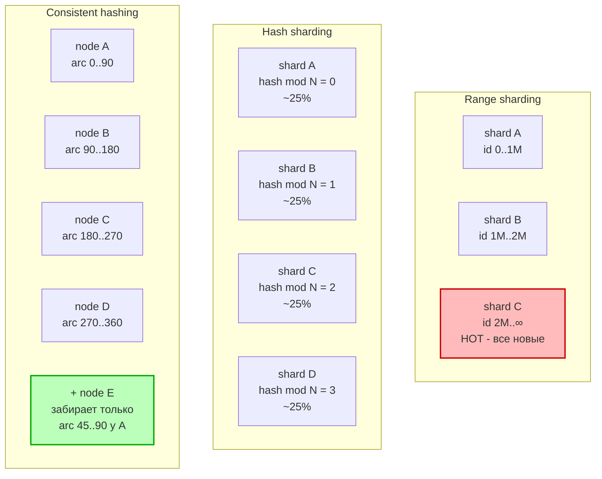
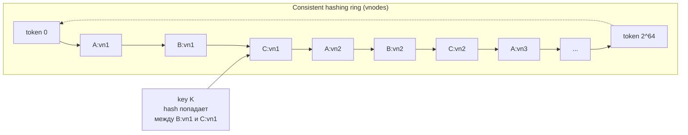

# Вопросы на собеседовании: `Database Sharding`

`Database Sharding` — horizontal partitioning: разрезание одной логической таблицы/БД на N независимых физических подмножеств (shards), каждое на своём узле. Зачем: storage > RAM/диска одного сервера, write throughput > одного master, latency через локальность данных. Цена: cross-shard queries дорогие, joins ломаются, distributed transactions сложны, resharding — отдельная инженерная задача.

## Полезные ссылки

### Официальная документация и авторитетные источники

- [MongoDB Sharding](https://www.mongodb.com/docs/manual/sharding/)
- [Vitess Documentation](https://vitess.io/docs/)
- [Citus Documentation](https://docs.citusdata.com/)
- [Cassandra — Data distribution & replication](https://cassandra.apache.org/doc/latest/cassandra/architecture/dynamo.html)
- [CockroachDB — Distribution Layer](https://www.cockroachlabs.com/docs/stable/architecture/distribution-layer.html)
- [DynamoDB Partitions and data distribution](https://docs.aws.amazon.com/amazondynamodb/latest/developerguide/HowItWorks.Partitions.html)
- [Karger et al. — Consistent Hashing (1997)](https://www.cs.princeton.edu/courses/archive/fall09/cos518/papers/chash.pdf)
- [DDIA — Chapter 6: Partitioning](https://www.oreilly.com/library/view/designing-data-intensive-applications/9781491903063/) — М. Клеппманн

## Содержание

- [Полезные ссылки](#полезные-ссылки)
- [See also](#see-also)

**Основы**
- [Q1. (!) Что такое sharding и чем отличается от репликации?](#q1--что-такое-sharding-и-чем-отличается-от-репликации)
- [Q2. (!) Чем horizontal partitioning отличается от vertical?](#q2--чем-horizontal-partitioning-отличается-от-vertical)
- [Q3. Зачем шардировать: storage / write throughput / latency](#q3-зачем-шардировать-storage--write-throughput--latency)
- [Q4. Цена шардирования: что ломается](#q4-цена-шардирования-что-ломается)
- [Q5. Когда НЕ нужно шардировать](#q5-когда-не-нужно-шардировать)

**Стратегии шардирования**
- [Q6. (!) Range-based sharding: плюсы, минусы, hot spots](#q6--range-based-sharding-плюсы-минусы-hot-spots)
- [Q7. (!) Как работает hash-based sharding?](#q7--как-работает-hash-based-sharding)
- [Q8. (!) Consistent hashing: зачем и как работает](#q8--consistent-hashing-зачем-и-как-работает)
- [Q9. Virtual nodes (vnodes) в consistent hashing](#q9-virtual-nodes-vnodes-в-consistent-hashing)
- [Q10. Как устроен directory-based sharding (lookup table)?](#q10-как-устроен-directory-based-sharding-lookup-table)
- [Q11. Как работает geo-based sharding?](#q11-как-работает-geo-based-sharding)
- [Q12. Сравнение стратегий: одна таблица](#q12-сравнение-стратегий-одна-таблица)

**Shard key и hot spots**
- [Q13. (!) Как выбрать shard key](#q13--как-выбрать-shard-key)
- [Q14. Какие бывают анти-паттерны выбора shard key?](#q14-какие-бывают-анти-паттерны-выбора-shard-key)
- [Q15. (!) Hot shard: причины, диагностика, лечение](#q15--hot-shard-причины-диагностика-лечение)
- [Q16. Compound shard key и salting](#q16-compound-shard-key-и-salting)

**Cross-shard queries и distributed transactions**
- [Q17. (!) Scatter-gather queries: почему дорого](#q17--scatter-gather-queries-почему-дорого)
- [Q18. Joins across shards: денормализация, broadcast tables](#q18-joins-across-shards-денормализация-broadcast-tables)
- [Q19. Как делать распределённые транзакции: 2PC vs Saga vs outbox?](#q19-как-делать-распределённые-транзакции-2pc-vs-saga-vs-outbox)
- [Q20. Как сделать global secondary index поверх shards?](#q20-как-сделать-global-secondary-index-поверх-shards)

**Resharding и migration**
- [Q21. (!) Resharding: причины и стратегии](#q21--resharding-причины-и-стратегии)
- [Q22. Как провести live-миграцию: dual-write + backfill + cutover?](#q22-как-провести-live-миграцию-dual-write--backfill--cutover)
- [Q23. Sharding + replication: каждый shard со своими репликами](#q23-sharding--replication-каждый-shard-со-своими-репликами)

**Реальные системы**
- [Q24. Как устроен sharding в MongoDB: mongos, config servers, chunks, balancer?](#q24-как-устроен-sharding-в-mongodb-mongos-config-servers-chunks-balancer)
- [Q25. Как устроен sharding в Cassandra: token ranges, vnodes, partition key vs clustering key?](#q25-как-устроен-sharding-в-cassandra-token-ranges-vnodes-partition-key-vs-clustering-key)
- [Q26. (!) Как устроен Vitess: VTGate, VTTablet, vindex?](#q26--как-устроен-vitess-vtgate-vttablet-vindex)
- [Q27. Как устроен Citus: distributed tables, reference tables, co-located joins?](#q27-как-устроен-citus-distributed-tables-reference-tables-co-located-joins)
- [Q28. Как работает range-based auto-sharding в CockroachDB?](#q28-как-работает-range-based-auto-sharding-в-cockroachdb)
- [Q29. Как устроен sharding в DynamoDB: hash key + sort key, partition splitting?](#q29-как-устроен-sharding-в-dynamodb-hash-key--sort-key-partition-splitting)
- [Q30. Sharding в app layer: ProxySQL, Mycat, ручная логика](#q30-sharding-в-app-layer-proxysql-mycat-ручная-логика)
- [Q31. Какие бывают tenancy-паттерны: per-tenant shard vs pool model?](#q31-какие-бывают-tenancy-паттерны-per-tenant-shard-vs-pool-model)

**Anti-patterns**
- [Q32. Anti-pattern: shard по дате](#q32-anti-pattern-shard-по-дате)
- [Q33. Anti-pattern: забытая reference table](#q33-anti-pattern-забытая-reference-table)
- [Q34. (!) Чек-лист перед шардированием](#q34--чек-лист-перед-шардированием)

---

## Основы

## Q1. (!) Что такое sharding и чем отличается от репликации?

Коротко: **sharding делит данные, репликация их копирует**. Это решения для разных проблем, и часто их применяют вместе.

**Sharding** — горизонтальное разрезание набора данных по `shard key`: каждая строка лежит ровно на одном shard (плюс реплики этого shard). Цель — масштабировать **запись и объём**: добавляя shards, мы получаем больше независимых мастеров и больше дисков, между которыми распределена нагрузка.

**Репликация** — копирование одного и того же набора данных на несколько узлов. Цель — масштабировать **чтение и доступность**: реплики разгружают мастер от чтений и подхватывают трафик при его падении. Но саму запись это не ускоряет — в single-leader моделях она всё ещё упирается в один master.

Ключевая мысль: репликация не помогает write-heavy нагрузке (все записи идут в один мастер), а sharding не повышает отказоустойчивость сам по себе (упал shard без реплик — часть данных недоступна). Поэтому они **ортогональны** и комбинируются: 8 shards × 3 replicas = 24 узла. См. Q23.

| Свойство | Sharding | Replication |
|---|---|---|
| Данные на узле | подмножество | полная копия |
| Масштабирует | write throughput + storage | read throughput + availability |
| Failover узла | shard недоступен, если нет реплик | другая реплика принимает чтения |
| Сложность | высокая (key, routing, cross-shard) | средняя (lag, конфликты) |

## Q2. (!) Чем horizontal partitioning отличается от vertical?

Разница в том, **что именно разрезается**: horizontal режет таблицу по строкам, vertical — по колонкам.

**Horizontal partitioning** (= sharding в широком смысле) — строки одной таблицы разделены по узлам, **схема одинаковая на всех shards**:
- shard A: `user_id 1..1M`
- shard B: `user_id 1M..2M`

Каждый узел хранит свой набор строк целиком. Так растёт и объём, и пропускная способность записи.

**Vertical partitioning** — колонки одной таблицы разделены по разным таблицам/узлам, **схемы разные**, связаны по PK:
- таблица `users_hot` (id, email, login) — частые поля
- таблица `users_profile` (id, bio, avatar_url, prefs_json) — редко читаемые

Смысл vertical — отделить «горячие» часто читаемые поля от тяжёлого редко используемого балласта, чтобы горячий набор помещался в кэш и страницы были плотнее.

**Порядок применения:** vertical обычно делают ДО sharding — он дешевле и часто снимает проблему, уменьшая hot data set. Sharding в production почти всегда означает именно horizontal.

## Q3. Зачем шардировать: storage / write throughput / latency

Шардирование решает три независимые проблемы, и важно понимать, какая из них ваша — от этого зависит выбор стратегии и shard key.

1. **Storage** — таблица не помещается на один диск или превышает разумный размер (1–2 ТБ для OLTP), после которого `vacuum` и rebuild индексов становятся болезненными. Sharding распределяет объём по N дискам.
2. **Write throughput** — single-leader не справляется с RPS на запись. Read replicas тут бесполезны (они масштабируют только чтение). Шардируя по `tenant_id` или `user_id`, получаем N параллельных мастеров, каждый принимает свою долю записей.
3. **Latency через локальность** — geo-sharding: EU-данные держим в EU дата-центре, US — в US. Запрос идёт в ближайший ДЦ, и latency для локальных юзеров падает (5 ms вместо 150 ms через океан).

**На собеседовании** полезно сразу назвать свой драйвер: «у нас упёрлись в write throughput» — это сужает разговор к hash/consistent hashing и выбору равномерного ключа, а не к geo.

## Q4. Цена шардирования: что ломается

Главная мысль: данные перестают жить в одном месте, поэтому всё, что раньше СУБД делала за вас в одном узле (joins, FK, транзакции, уникальные ID), теперь становится распределённой задачей.

- **Joins across shards** — между таблицами на разных узлах БД больше не сделает JOIN сама; превращается в scatter-gather с merge в приложении.
- **Foreign keys** — DB-уровневые FK работают только внутри одного shard; целостность между shards приходится держать в коде.
- **Транзакции через несколько shards** — нет общего лога, нужен 2PC или Saga (Q19).
- **Auto-increment ID** — глобальная уникальность ломается (два shard выдадут один и тот же id=1), нужны UUID/Snowflake.
- **Global secondary indexes** — поиск по не-shard-key требует отдельной инфраструктуры (Q20).
- **Аналитические запросы** (`COUNT`, `GROUP BY` по всей таблице) — должны обойти все shards и собрать частичные результаты, поэтому медленные.
- **Операционная сложность** — backups, migrations, monitoring умножаются на N shards.

**Вывод:** шардирование — это не «ещё немного железа», а смена модели данных. Поэтому Q5 — про то, как этого избежать.

## Q5. Когда НЕ нужно шардировать

Правило: **шардируйте как можно позже**. Это самое дорогое и трудно обратимое решение в эволюции БД, поэтому сначала исчерпайте всё, что дешевле.

**Эмпирическое правило** — пока выполняется всё это (для OLTP на хорошем железе), шардирование преждевременно:
- < 1–2 ТБ данных,
- < 10 000 RPS на запись,
- нет geo-требований по локальности.

**Дешёвые шаги, которые делают раньше sharding** (примерно в порядке цены/эффекта):
1. Vertical scaling — больше CPU/RAM/NVMe. Часто выигрывает год-два без единой строки кода.
2. Read replicas — если нагрузка read-heavy, чтения уходят на реплики.
3. Caching (Redis) для горячих ключей — снимает нагрузку с БД до неё.
4. Архивирование старых данных в cold storage + partitioning **внутри одной БД** через `PARTITION BY RANGE` — уменьшает рабочий набор без распределённости.
5. Vertical partitioning (Q2) — отделить горячие поля от балласта.

**Почему именно последний шаг:** sharding необратим без боли. Откатить его обратно к одному узлу — это та же live-миграция (Q22), только в обратную сторону. Поэтому, если перечисленное выше ещё не пройдено, на собеседовании правильный ответ — «сначала сделал бы это, а не шардировал».

---

## Стратегии шардирования

## Q6. (!) Range-based sharding: плюсы, минусы, hot spots

Суть: каждый shard отвечает за **непрерывный диапазон** значений shard key. Соседние по значению ключи лежат рядом — это даёт и главный плюс, и главный минус.

- shard A: `user_id ∈ [0, 1_000_000)`
- shard B: `user_id ∈ [1_000_000, 2_000_000)`
- shard C: `user_id ∈ [2_000_000, +∞)`

**Плюсы:**
- `range queries` эффективны: `WHERE user_id BETWEEN 500_000 AND 700_000` попадает в один shard, не нужно опрашивать остальные.
- Простая логика роутинга — достаточно знать границы диапазонов.
- Локальность: соседние ключи рядом, диапазонное сканирование дёшево.

**Минусы — hot spots** (обратная сторона локальности):
- Если `shard key` монотонный (timestamp, auto-increment id), все **новые** записи идут в **последний** shard — он перегружен, а остальные простаивают. Локальность работает против вас: «свежие» данные всегда соседние.
- Перекос (skew) при неравномерном распределении: один большой tenant забивает свой диапазон.

**Когда выбирать:** когда доступ реально диапазонный (time-series, последовательное чтение) И ключ не монотонный, либо есть механизм авто-разрезания горячего диапазона.

Используется в: HBase, MongoDB (ranged sharding), Bigtable, CockroachDB.

## Q7. (!) Как работает hash-based sharding?

Идея: вычисляем `shard_id = hash(shard_key) mod N` (N — число shards). Хеш «размазывает» соседние значения ключа по всему пространству — это зеркальный компромисс к range-based.

**Плюсы:**
- Равномерное распределение при хорошей hash-функции (MurmurHash, xxHash) — каждый shard получает примерно равную долю.
- Нет hot spots от monotonic IDs: даже если id растёт последовательно, hash «перемешивает» его, и новые записи равномерно ложатся на все shards.

**Минусы** (прямое следствие перемешивания):
- **Range queries ломаются:** соседние по значению ключи теперь на разных shards, поэтому `WHERE created_at BETWEEN ...` превращается в scatter-gather по всем shards.
- **Resharding катастрофический:** при изменении `N` (с 4 на 5) формула `hash mod N` меняет результат для **почти всех** ключей — нужно переместить ~`(N-1)/N` данных. Именно эту проблему решает consistent hashing (Q8).

```text
hash("user_42") = 0xA3F7...  ->  mod 4 = 3  ->  shard #3
```

## Q8. (!) Consistent hashing: зачем и как работает

**Зачем:** в обычном `hash mod N` добавление узла перемещает почти все ключи (Q7). Consistent hashing (Karger, 1997) убирает зависимость от `N`: при добавлении/удалении узла переезжает только `~K/N` ключей (K — число ключей, N — число узлов), остальные не двигаются.

**Как работает** — ключевая идея в том, что и узлы, и ключи живут на одном кольце:
1. Hash space сворачивается в **кольцо** (например, `[0, 2^32)`).
2. Каждый узел получает позицию на кольце через `hash(node_id)`.
3. Каждый ключ получает позицию `hash(key)`.
4. Ключ принадлежит **первому узлу по часовой стрелке** от своей позиции.

**Почему rebalancing минимален.** Добавление узла N+1 — это просто новая точка на кольце. Она «перехватывает» только те ключи, что лежат **между новым узлом и его предшественником на кольце**; все остальные ключи как принадлежали своим узлам, так и принадлежат. Удаление узла симметрично: его ключи достаются единственному соседу справа, остальное кольцо не трогается. В `hash mod N` так не выходит, потому что там позиция ключа зависит от N для всех ключей сразу.



**Применение:** Cassandra, ScyllaDB, DynamoDB, Riak, memcached client libs (ketama).

## Q9. Virtual nodes (vnodes) в consistent hashing

**Проблема, которую решают vnodes.** У «голого» consistent hashing при малом числе узлов их позиции на кольце случайны: один узел может занять 40% дуги, другой — 10%. Получается перекос нагрузки и объёма.

**Идея решения:** каждый физический узел представляется на кольце не одной точкой, а **многими токенами** (виртуальными позициями). Чем больше точек, тем ближе суммарная доля каждого узла к среднему — по закону больших чисел случайности усредняются. Cassandra по умолчанию даёт `num_tokens=256` на узел: при 10 узлах на кольце 2560 точек, и распределение получается почти равномерным.

```
Без vnodes:                С vnodes (256 per node):
node A: 0..30  (30%)       node A: суммарно ~33% (256 случайных арк)
node B: 30..50 (20%)       node B: суммарно ~33%
node C: 50..100 (50%)      node C: суммарно ~33%
```

**Бонус при отказе.** Когда узел выпадает, его токены разбросаны по всему кольцу, поэтому осиротевшие диапазоны достаются **многим разным соседям**, а не одному. Нагрузка упавшего узла размазывается по кластеру, и ребилд идёт параллельно — без «голых» vnodes весь его сегмент свалился бы на единственного соседа справа.



## Q10. Как устроен directory-based sharding (lookup table)?

Суть: вместо формулы (`hash mod N` или диапазона) маппинг `shard_key → shard_id` хранится **явно** в отдельной таблице/сервисе. Где лежит ключ — решает не математика, а запись в справочнике, и её можно поменять.

```sql
CREATE TABLE shard_directory (
    tenant_id BIGINT PRIMARY KEY,
    shard_id  INT NOT NULL
);
```

При запросе клиент сначала идёт в directory, узнаёт shard, потом в сам shard.

**Плюсы** (всё растёт из того, что маппинг произвольный, а не вычисляемый):
- Максимальная гибкость: можно вручную положить конкретного крупного tenant на выделенный shard.
- Resharding — это обновление одной строки в directory плюс миграция данных, без пересчёта всего пространства ключей.
- Tenant можно мигрировать между shards онлайн: перевозим данные, затем переключаем строку в справочнике.

**Минусы** (плата за лишний уровень косвенности):
- Directory сам становится bottleneck — поэтому его агрессивно кэшируют (Redis, in-process LRU).
- Directory — единая точка отказа: упал он → роутинг невозможен → весь кластер недоступен.
- Дополнительный hop добавляет latency на каждый запрос (кэш его в основном скрывает).

Используют: Slack, Figma, многие SaaS с tenant-моделью — там как раз нужна возможность вручную выделять крупных клиентов.

## Q11. Как работает geo-based sharding?

Суть: shard key — это регион (`shard_key = region`, обычно из `tenant.region`), и каждый shard физически живёт в дата-центре своего региона. Здесь шардирование решает не объём, а **географию**: близость данных к пользователю и юридические требования.

**Плюсы:**
- Latency: EU-юзер пишет в EU-shard в своём ДЦ — 5 ms вместо 150 ms через океан.
- **Соответствие законодательству:** GDPR и аналоги требуют, чтобы данные резидентов не покидали юрисдикцию. Geo-shard физически держит их в нужном регионе.
- Изоляция сбоев: падение US-shard не затрагивает EU — регионы независимы.

**Минусы:**
- Global queries (поиск по всем регионам) — scatter-gather, да ещё и через WAN с высоким RTT.
- Миграция юзера между регионами (переехал из EU в US) — отдельная нетривиальная операция.
- Справочные данные приходится дублировать в каждом регионе (см. broadcast tables, Q18), иначе JOIN с ними станет кросс-региональным.

## Q12. Сравнение стратегий: одна таблица

Сводка по четырём осям, по которым стратегии реально различаются на собеседовании: эффективность range-запросов, склонность к hot spots, цена ребаланса и типичный сценарий.

| Стратегия | Range queries | Hot spots | Rebalancing | Сценарий применения |
|---|---|---|---|---|
| **Range** | отлично | да (monotonic key) | дорого | time-series, последовательный доступ (HBase, MongoDB ranged) |
| **Hash mod N** | scatter-gather | нет | катастрофическое | простые workloads, фиксированное N |
| **Consistent hashing** | scatter-gather | редко (vnodes) | минимальное | динамический кластер (Cassandra, Dynamo) |
| **Directory** | гибко | контролируемо | онлайн | multi-tenant SaaS, неоднородные tenants |
| **Geo** | внутри региона ок | возможны (большой регион) | редко | global apps, GDPR |

---

## Shard key и hot spots

## Q13. (!) Как выбрать shard key

Выбор shard key — самое важное и самое необратимое решение при шардировании: поменять ключ позже = полный resharding (Q21). Хороший ключ одновременно удовлетворяет трём критериям, и провал по любому из них убивает всю схему.

1. **Высокая cardinality** — много уникальных значений, чтобы было что распределять. `user_id` (миллионы) — ок; `country_code` (200) — мало, shards упрутся в число значений.
2. **Равномерное распределение** — значения должны раскладываться ровно по shards. Если 80% трафика бьёт в 1% значений, получите hot shard независимо от стратегии.
3. **Совпадение с access pattern** — ключ должен быть в `WHERE` у 90%+ запросов. Иначе роутер не знает, куда идти, и каждый запрос превращается в scatter-gather (Q17).

Третий критерий — самый коварный: ключ может быть идеален по cardinality и распределению, но если приложение почти не запрашивает по нему, выигрыша не будет.

**Пример хорошего ключа:** `tenant_id` для SaaS — он есть во всех запросах (критерий 3), миллионы значений (1), распределён более-менее ровно (2); для немногих топ-tenants держат отдельную стратегию.

**Пример плохого ключа:** `country` для глобального приложения — низкая cardinality (200 значений, критерий 1 провален) и сильный перекос (US/CN перевешивают всё остальное, критерий 2 провален).

## Q14. Какие бывают анти-паттерны выбора shard key?

Каждый из этих анти-паттернов — это нарушение одного из критериев Q13. Полезно уметь назвать не только симптом, но и какой именно критерий нарушен.

- **Монотонный shard key** (timestamp, auto-increment id) с range-based стратегией → все новые записи в последний shard (hot spot записи).
- **Низкая cardinality** (`status`, `category`, `country`) → нарушен критерий cardinality: значений мало, данные не размазываются, упираемся в hot shards.
- **Перекошенное распределение** (`user_id`, когда 5 топ-юзеров дают 50% трафика) → нарушен критерий равномерности: их shards в огне, остальные простаивают.
- **Изменяемый shard key** — если значение ключа меняется, строку придётся физически перевезти на другой shard. Это дорого и опасно (теряется атомарность), поэтому многие системы (MongoDB до 4.2) запрещают менять shard key вообще.
- **Составной ключ, но запросы по части** — при shard key `(tenant_id, user_id)` запрос `WHERE user_id = ?` без `tenant_id` не даёт роутеру префикс → scatter-gather. Нарушен критерий совпадения с access pattern.

## Q15. (!) Hot shard: причины, диагностика, лечение

Hot shard — это shard, на который приходится непропорционально много данных или трафика. Разбираем по схеме «откуда → как увидеть → чем лечить», и важно различать перекос **объёма** и перекос **трафика**: лечатся они по-разному.

**Причины:**
- Перекос **данных** (один tenant держит 50% объёма) — упираемся в storage и vacuum.
- Перекос **трафика** (celebrity user, виральный контент) — упираемся в CPU/IOPS, при том что объём может быть нормальным.
- Монотонный shard key — весь поток записи в один shard.

**Диагностика** (без метрик лечить нельзя — сначала найти горячий shard и горячий ключ):
- Метрики per-shard: CPU, write IOPS, latency p99, queue depth — покажут, какой shard горит.
- Топ shard key по числу запросов (sampling в proxy/router) — покажет, кто именно греет.
- В MongoDB: `db.collection.getShardDistribution()`; в Cassandra: `nodetool status` + `tablestats`.

**Лечение** (от лёгких мер к тяжёлым):
1. **Кэширование** перед DB (Redis) — самое дешёвое для перекоса *трафика на чтение*: горячие чтения не доходят до shard.
2. **Соль (salt)** в shard key: вместо `user_id` → `user_id + (request_time % 16)`. Один hot user размазывается по 16 «виртуальным» — лечит перекос *записи*, но чтение по этому юзеру становится 16× scatter-gather. Это осознанный компромисс.
3. **Составной ключ** с дополнительной размерностью: `(user_id, day)` — разрезает горячего юзера по дням.
4. **Ручная ребалансировка** через directory (Q10): перевести hot tenant на выделенный shard.
5. **Разрезание chunk/range** (MongoDB balancer, Vitess reshard): разбить горячий диапазон на два меньших и развести по shards.

## Q16. Compound shard key и salting

Оба приёма добавляют в ключ вторую размерность, чтобы разнести то, что иначе скучковалось бы в одном месте. Разница в том, что compound key упорядочен и сохраняет локальность по префиксу, а salt намеренно случаен и локальность ломает.

**Compound shard key** (составной): `(tenant_id, item_id)`. Запросы по `tenant_id` попадают в один shard (удобно для list-операций тенанта), а данные одного крупного tenant при этом распределены внутри по `item_id` — это снижает риск, что один tenant раздует одну партицию.

**Salting** (добавление случайной соли) — когда даже одного значения ключа слишком много для одного shard:

```text
Бывший ключ: user_id = 42 (один пользователь — один shard, hot)
Salted ключ: shard_key = (user_id, salt), salt = user_id_hash % 16
            -> данные user=42 размазаны по 16 «корзинам»
            -> запись разгружена, но чтение должно опросить все 16
```

Используется в time-series (`device_id + time_bucket`) и в Cassandra/DynamoDB при write-heavy workloads.

---

## Cross-shard queries и distributed transactions

## Q17. (!) Scatter-gather queries: почему дорого

Scatter-gather возникает, когда в `WHERE` нет shard key: роутер не может определить нужный shard, поэтому **рассылает запрос на все**, ждёт ответы и мерджит их (scatter → gather). Это анти-цель шардирования — мы делили данные, чтобы ходить в один shard, а такой запрос обходит все.

**Почему дорого:**
- **Tail latency amplification:** общая latency = max по всем shards. Даже один подтормозивший shard замедляет весь запрос — а чем больше shards, тем выше шанс зацепить «хвост».
- **Network:** вместо одного запроса — N, плюс N ответов на coordinator.
- **Память coordinator:** он буферизует ответы всех shards, чтобы сделать merge/sort/limit.
- **Агрегация в два этапа:** `SUM`/`COUNT`/`AVG` считаются как частичные агрегаты на каждом shard и финальная редукция на coordinator.

**Пример и как чинить:** `SELECT * FROM orders WHERE order_id = ?` при shard key `user_id` не содержит ключа → опрос всех 100 shards вместо одного → 100× нагрузка. Решения:
- global secondary index по `order_id` (Q20);
- доп. таблица-маппинг `order_id → user_id`, чтобы сначала узнать shard;
- закодировать `user_id` внутрь самого `order_id` (composite encoding) — тогда shard key восстанавливается из id без лишнего запроса.

## Q18. Joins across shards: денормализация, broadcast tables

**Проблема:** `JOIN` двух шардированных таблиц, разрезанных по *разным* ключам, означает, что нужные строки лежат на разных узлах. БД не может соединить их локально — приходится тянуть данные между shards, и стоимость взрывается.

Все четыре решения сводятся к одной идее: **сделать так, чтобы соединяемые данные оказались на одном узле** — либо разрезав таблицы одинаково, либо продублировав одну из них.

1. **Co-located sharding** — обе таблицы шардированы по одному ключу (`tenant_id`), поэтому строки одного тенанта из обеих таблиц лежат на одном shard, и JOIN остаётся локальным. Citus делает это автоматически через `co-located distribution column`. Это лучший вариант, если он применим.
2. **Денормализация** — копируем нужные колонки таблицы `B` прямо в `A`, чтобы JOIN был не нужен. Цена — дублирование данных и их синхронизация при изменениях.
3. **Broadcast tables (reference tables)** — небольшие справочники (страны, категории, валюты) целиком реплицируются **на каждый shard**, поэтому JOIN с ними всегда локален. Так называется в Vitess и Citus (`reference table`); в Cassandra аналог — материализованные view или просто дублирование.
4. **App-level join** — делаем два запроса и мёржим результат в коде. Годится для небольших результатов, где сетевой overhead приемлем.

## Q19. Как делать распределённые транзакции: 2PC vs Saga vs outbox?

Задача: атомарно изменить данные на 2+ shards, у которых нет общего лога транзакций. Главный водораздел — **строгая атомарность через блокировки (2PC) против eventual consistency без блокировок (Saga, outbox)**.

**2PC (two-phase commit)** — настоящая распределённая атомарность:
- Coordinator: фаза prepare → если все ответили «yes», то commit, иначе abort.
- **Блокирующий:** если coordinator упал между prepare и commit, участники остаются с залоченными ресурсами и ждут — это его главный недостаток.
- Цена: каждая транзакция = 2 round-trips + удержание локов на всё время.
- Где встречается: XA-транзакции, Spanner (внутренне, опираясь на TrueTime).

**Saga** — последовательность локальных транзакций с откатом через компенсации:
- Транзакция разбита на N шагов, каждый коммитится локально в своём shard.
- Если шаг K упал — compensating transactions откатывают уже выполненные шаги 1..K-1 (бизнес-откат, а не rollback).
- Eventually consistent, не атомарно — между шагами система видна в промежуточном состоянии.
- Сложность переезжает в код: нужно писать компенсации и делать шаги идемпотентными.

**Outbox + локальные транзакции** — атомарность «запись + факт события», доставка асинхронная:
- Каждый shard в одной локальной транзакции коммитит данные И запись в таблицу `outbox`.
- Воркер вычитывает `outbox` и публикует в Kafka; другие shards/сервисы консьюмят и применяют у себя.
- Eventually consistent, но без распределённого 2PC и без его блокировок.

**Практика:** в реальных шардированных системах 2PC избегают из-за блокирующего характера и просадки latency — выбирают Saga или outbox с идемпотентностью.

## Q20. Как сделать global secondary index поверх shards?

Сначала о разнице. **Локальный индекс** строится на каждом shard отдельно и помогает, только если запрос уже пришёл на нужный shard. Но если мы ищем по колонке, которая не shard key (например, по `email`, когда шардируем по `user_id`), мы не знаем, на каком shard искать — локальные индексы не спасают. Нужен **global secondary index (GSI)** — индекс, охватывающий все shards и сам шардированный по индексируемой колонке.

**Подходы:**

1. **Async-индекс в отдельной таблице/системе:**
   - `email → user_id` хранится в Redis или отдельной таблице.
   - Запись: транзакция в shard + асинхронное обновление индекса → eventually consistent.
2. **DynamoDB GSI** — встроенный механизм: GSI шардирован по своему ключу и реплицируется асинхронно, поэтому eventually consistent.
3. **Elasticsearch** как внешний поисковый индекс — основная БД льёт изменения через CDC в ES, а поисковые запросы идут в ES.
4. **Vitess vindex (lookup)** — таблица-маппинг `lookup_key → keyspace_id` живёт в отдельном keyspace.

**Компромисс:** GSI почти всегда eventually consistent — индекс обновляется отдельно от основной записи. Строго консистентный GSI потребовал бы распределённой транзакции на каждую запись (Q19), а это дорого, поэтому в продакшене обычно мирятся с небольшим лагом индекса.

---

## Resharding и migration

## Q21. (!) Resharding: причины и стратегии

Resharding — это перераспределение данных по другому числу shards или другому ключу. Сложность в том, что делать это нужно **на живой системе**, без простоя, поэтому хорошие стратегии сводятся к тому, чтобы переезжало как можно меньше данных.

**Причины:**
- Объём вырос, shards переполнены — нужно больше узлов.
- Hot shard — нужно разрезать его на меньшие и развести.
- Исходный shard key оказался неудачным — меняем ключ (самый тяжёлый случай).
- Смена архитектуры — миграция Range → Hash или наоборот.

**Стратегии** (от «спланировать заранее» к «мигрировать вживую»):

1. **Pre-split с самого начала** — заводим сразу много «логических» shards (например, 1024) на небольшом числе физических узлов (16). Рост = переезд логических shards на новые узлы, без пересчёта ключей. Так делают Vitess (keyranges), MongoDB (chunks), Foursquare classic. Самый дешёвый путь — если предусмотреть заранее.
2. **Consistent hashing** — само устройство (Q8) гарантирует, что добавление узла двигает только `K/N` ключей; для динамических кластеров resharding почти бесплатный.
3. **Live migration (dual-write)** — общий способ для любого изменения схемы, в т.ч. смены ключа; детально в Q22.
4. **Vitess vReplication** — встроенная MySQL-binlog-based миграция: новые shards подписываются на binlog старых, догоняют их, затем cutover.

## Q22. Как провести live-миграцию: dual-write + backfill + cutover?

Цель — переехать на новый sharding без простоя и без потери данных. Логика 4 фаз такая: сначала перестаём отставать (новые записи идут в обе системы), потом догоняем историю, потом убеждаемся в равенстве данных и только затем переключаемся.

1. **Dual-write:** приложение пишет одновременно в старую и новую систему (через transactional outbox или CDC). Чтения пока из старой — новая ещё неполная.
2. **Backfill:** фоновый job копирует исторические данные из старой в новую. Обязательно идемпотентный и с чек-поинтами, чтобы можно было перезапустить с места обрыва.
3. **Verification:** shadow-reads — читаем из обеих систем, сравниваем, логируем расхождения и чиним их причины. Это подтверждает, что новая система готова.
4. **Cutover:** переключаем чтения на новую систему. Старая ещё какое-то время принимает dual-writes — как страховка для мгновенного отката. Затем её отключают.

**Подводные камни:**
- **Гонки между dual-write и backfill:** свежая запись из dual-write может быть затёрта старой версией, которую backfill дописывает позже. Лечится версионированием — timestamp/version на строку, и backfill не перезаписывает более свежее.
- **Schema drift** — старая и новая схемы со временем расходятся, если их меняют параллельно; нужен заморозить расхождения на время миграции.
- **Откат** должен быть возможен в любой фазе до cutover — поэтому старую систему не выключают сразу.

Так мигрировали: Slack (shardification 2022), Figma (Vitess), Pinterest (MySQL sharding), Notion (Postgres → 480 logical shards).

## Q23. Sharding + replication: каждый shard со своими репликами

Это ответ на вопрос «sharding или replication?» — на масштабе нужно и то, и другое (вспомни Q1: разные проблемы). Sharding даёт write-масштаб и объём, replication внутри каждого shard — отказоустойчивость и read-масштаб. Они перемножаются:

```text
Cluster = N shards × R replicas

shard 1: primary + 2 replicas
shard 2: primary + 2 replicas
...
shard N: primary + 2 replicas
```

**Аварийное переключение на уровне shard** (важно: failover локален — падение одного primary не трогает остальные shards):
- Primary упал → одна из его replicas промоутится (через Raft/Paxos consensus либо внешний orchestrator: MHA, Orchestrator, sentinel).
- Router (mongos, VTGate) узнаёт нового primary и направляет запись туда.
- Время недоступности — от секунд (Raft) до десятков секунд (внешний orchestrator).

**Чтение с replicas** допустимо для read-heavy workload, если приложение терпит слегка устаревшие данные (репликационный lag).

Примеры: в MongoDB shard — это replica set (обычно 3 узла). В Cassandra `replication_factor=3` означает, что каждая партиция лежит на 3 соседних узлах кольца.

---

## Реальные системы

## Q24. Как устроен sharding в MongoDB: mongos, config servers, chunks, balancer?

Модель MongoDB — это разделение ответственности: клиент не знает о shards, за маршрутизацию отвечает stateless-роутер, а за распределение данных — фоновый балансировщик. Достаточно понять роль каждого из четырёх компонентов.

**Компоненты:**
- **`mongos`** — stateless router, точка входа для клиента. Принимает запрос, смотрит метаданные и отправляет на нужный shard. Stateless, поэтому масштабируется горизонтально (ставят N штук).
- **Config servers** — replica set из 3 узлов, хранит метаданные кластера: какой диапазон chunks на каком shard.
- **Shard** — replica set (обычно 3 узла), хранит свою часть данных.
- **Chunk** — диапазон значений shard key и **единица перемещения** при балансировке. Default chunk size — 128 MB.
- **Balancer** — фоновый процесс на config servers: следит за равномерностью распределения chunks и при перекосе перемещает их (split + migrate).

```javascript
// Включить sharding для БД
sh.enableSharding("mydb")

// Шардировать коллекцию по hashed shard key
sh.shardCollection("mydb.orders", { user_id: "hashed" })

// Range-based
sh.shardCollection("mydb.events", { created_at: 1 })

// Compound key
sh.shardCollection("mydb.events", { tenant_id: 1, event_id: 1 })
```

**Hashed vs ranged** в MongoDB — это прямое отражение Q6/Q7:
- `"hashed"` — встроенный hash на shard key (MD5-based): равномерное распределение, но range queries разбегаются по shards.
- `1` (asc) — range-based: быстрые range queries, но риск hot shard на монотонном ключе.

Эволюция возможностей:
- MongoDB 4.4 — **compound hashed shard key** (`{ tenant_id: 1, _id: "hashed" }`): группировка по tenant + размазывание внутри.
- MongoDB 5.0 — **online resharding** через `reshardCollection`, то есть смена shard key без полного ручного переезда.

## Q25. Как устроен sharding в Cassandra: token ranges, vnodes, partition key vs clustering key?

Cassandra — каноничный пример **consistent hashing + vnodes** (Q8, Q9) в проде, плюс важное различие двух частей ключа. Главная особенность: нет ни master, ни отдельного роутера — все узлы равноправны.

**Архитектура:**
- Кольцо токенов `[-2^63, 2^63)` (Murmur3 partitioner).
- Каждый узел владеет `num_tokens` (default 256) диапазонами кольца — это и есть vnodes.
- `replication_factor=3` → каждая строка реплицируется на 3 соседних по кольцу узла.
- Координатором запроса может быть любой узел; token-aware клиент сразу идёт к узлу, владеющему нужным токеном, без лишнего hop.

**Primary key = partition key + clustering key:**

```sql
CREATE TABLE events (
    user_id    UUID,         -- partition key (определяет shard/node)
    event_time TIMESTAMP,    -- clustering key (порядок внутри партиции)
    payload    TEXT,
    PRIMARY KEY ((user_id), event_time)
) WITH CLUSTERING ORDER BY (event_time DESC);
```

Ключевое различие — какая часть ключа за что отвечает:
- **Partition key** определяет, на каком узле живёт строка: `hash(partition_key)` → token → node. Это и есть shard key Cassandra.
- **Clustering key** упорядочивает строки **внутри одной партиции** и делает дешёвыми range queries в её пределах (но только внутри партиции, не между ними).
- Compound partition key: `PRIMARY KEY ((user_id, day), event_time)` разрезает горячего юзера по дням — приём из Q16.

**Anti-pattern: unbounded partition** — партиция, растущая без ограничения. Например `PRIMARY KEY ((user_id), event_time)` для активного юзера за 10 лет раздувается до гигабайтов; чтения такой партиции деградируют. Поэтому в partition key добавляют ограничивающую размерность (как `day` выше).

## Q26. (!) Как устроен Vitess: VTGate, VTTablet, vindex?

Vitess — sharding-слой поверх MySQL (разработан в YouTube; используют Slack, GitHub, Square). Ключевая идея: приложение продолжает говорить обычным MySQL-протоколом, а Vitess прозрачно превращает один логический keyspace в множество физических shards. Понять надо два уровня — компоненты (кто куда маршрутизирует) и vindex (как колонка отображается в shard).

**Архитектура:**
- **VTGate** — stateless router (роль как у mongos). Клиент подключается обычным MySQL-протоколом и не знает о шардировании.
- **VTTablet** — sidecar к каждому MySQL-инстансу: прокси с connection pooling, throttling и streaming.
- **Topology service** (etcd/Zookeeper) — хранит метаданные кластера.
- **Keyspace** — логическая БД; может быть шардированной (`sharded: true`) или нет (`unsharded`).
- **Shard** — диапазон keyspace IDs: `-80`, `80-` или мельче `-40`, `40-80`, `80-c0`, `c0-`. Такая запись диапазонами и позволяет дробить shards при resharding.

**Vindex** — это функция отображения колонки в `keyspace_id`, то есть «как из значения колонки понять shard»:

| Vindex type | Описание |
|---|---|
| `hash` | hash(value) → keyspace_id. Простой и дефолтный. |
| `lookup` | Отдельная таблица value → keyspace_id (как directory). Для secondary lookup. |
| `numeric` | Identity-функция, для числовых ID. |
| `consistent_lookup` | Lookup с прозрачным управлением консистентностью. |
| `xxhash` | xxHash вместо MD5 (быстрее). |

```json
// VSchema (упрощённо)
{
  "sharded": true,
  "vindexes": {
    "hash": { "type": "hash" },
    "user_email_lookup": {
      "type": "lookup",
      "params": { "table": "user_email_lookup", "from": "email", "to": "keyspace_id" },
      "owner": "users"
    }
  },
  "tables": {
    "users": {
      "column_vindexes": [
        { "column": "user_id", "name": "hash" },
        { "column": "email", "name": "user_email_lookup" }
      ]
    }
  }
}
```

Идея в том, что у одной таблицы может быть несколько vindex: primary (`hash` по основному ключу) определяет, куда писать, а secondary (`lookup` по `email`) — это встроенный аналог GSI из Q20, чтобы искать по не-shard-key без scatter-gather.

**vReplication** — MySQL-binlog-based механизм миграций: resharding, materialize, online schema changes. Именно он делает онлайн-resharding из Q21 практичным.

## Q27. Как устроен Citus: distributed tables, reference tables, co-located joins?

Citus — extension для PostgreSQL, превращающая один PG в distributed DB без смены SQL-диалекта. Главная идея, которую он формализует, — три типа таблиц под три разные роли данных, и co-location как способ сохранить локальные JOIN-ы (Q18).

**Типы таблиц:**
- **Distributed table** — горизонтально шардирована по `distribution column`.
  ```sql
  SELECT create_distributed_table('orders', 'tenant_id');
  ```
- **Reference table** — реплицируется целиком на каждый worker (broadcast). Для маленьких справочников.
  ```sql
  SELECT create_reference_table('countries');
  ```
- **Local table** — обычная PG-таблица, живёт только на coordinator (метаданные, мелкие служебные данные).

**Co-located joins** — за счёт чего Citus вообще быстр: если две distributed таблицы шардированы по одной колонке (`tenant_id`), строки одного тенанта из обеих таблиц физически лежат на одном worker. Тогда JOIN выполняется локально на каждом worker без cross-shard трафика — это прямое применение co-located sharding из Q18.

```sql
-- Обе таблицы co-located по tenant_id
SELECT create_distributed_table('orders',     'tenant_id');
SELECT create_distributed_table('order_items','tenant_id', colocate_with => 'orders');

-- JOIN работает локально на каждом shard
SELECT o.id, oi.product_id
FROM orders o JOIN order_items oi ON o.id = oi.order_id
WHERE o.tenant_id = 42;
```

**Архитектура:** Coordinator (планирует запросы) + Workers (хранят shards). Coordinator знает метаданные распределения.

## Q28. Как работает range-based auto-sharding в CockroachDB?

Отличие CockroachDB от MongoDB/Vitess в том, что шардирование **полностью автоматическое**: в DDL нет понятия «shard key», движок сам режет данные и балансирует их. Разработчик не выбирает стратегию — но обязан помнить про hot spots от монотонных ключей, потому что под капотом это range-based.

- Все данные — KV-пары (key = `tablePrefix + PK + columnFamily`).
- Keyspace разбит на **ranges** (~64-512 MB) — это автоматические shards.
- Каждый range — отдельная Raft group, реплицируется на 3+ узла (sharding + replication как в Q23, но на уровне range).
- Range перерос порог → **auto-split** на два меньших.
- Узел перегружен → **auto-rebalance**: ranges переезжают на менее загруженные.

**Hot spots:** так как основа range-based, `INSERT` с монотонным PK (sequence/timestamp) гонит весь трафик в последний range — та же проблема, что в Q6. Решение:
- `UUID` PK или `unique_rowid()` (snowflake-like, бьёт по узлам).
- `hash sharded indexes`:
  ```sql
  CREATE TABLE events (
      ts TIMESTAMP,
      payload STRING,
      PRIMARY KEY (ts, payload)
  ) USING HASH WITH (bucket_count = 16);
  ```

Похожая модель: TiDB (ranges + Raft), Spanner (splits + Paxos), YugabyteDB.

## Q29. Как устроен sharding в DynamoDB: hash key + sort key, partition splitting?

DynamoDB — это hash-based sharding (Q7) как managed-сервис: модель та же, что в Cassandra (partition key + sort key), но AWS прячет узлы и сам разрезает партиции. Понять надо две вещи: как ключ отображается в партицию и что происходит при перекосе.

Primary key — это `partition key` либо `(partition key, sort key)`:
- **Partition key** — hash определяет partition. Это и есть shard key.
- **Sort key** (опционально) — упорядочивает items внутри партиции; аналог clustering key в Cassandra.

**Partitions** скрыты — AWS не показывает их явно. Таблица стартует с 1 partition и **splits** при росте storage (> 10 GB) или throughput (> 3000 RCU / 1000 WCU на партицию).

**Hot partition problem:** если 70% трафика бьёт в один `partition key`, его RCU/WCU тротлятся, хотя у таблицы суммарно лимита хватает. Решения (те же приёмы, что в Q15):
- Salting (`partition_key = user_id + (request_id % 10)`) — размазать запись.
- Adaptive capacity — AWS сам перебрасывает throughput на горячую партицию.
- Кэширование через DAX — снять горячие чтения.

**GSI** (Global Secondary Index) — отдельная «таблица» с другим partition/sort key, реплицируется асинхронно, eventually consistent (как в Q20).

## Q30. Sharding в app layer: ProxySQL, Mycat, ручная логика

До зрелых решений (Vitess, Citus) sharding собирали вручную. Варианты идут по нарастанию: от логики прямо в коде приложения, через прокси-слой, до middleware с частичной поддержкой распределённых фич. Общий минус всех — чем больше логики руками, тем дороже resharding и cross-shard запросы.

- **App-level routing**: код приложения сам вычисляет shard и выбирает datasource.
  ```java
  int shardId = userId % SHARD_COUNT;
  DataSource ds = shardPool.get(shardId);
  ```
  Просто, но число shards захардкожено в коде, а resharding превращается в переписывание приложения. Подходит лишь как временное решение.

- **ProxySQL** — MySQL proxy, роутит по правилам (hash от `user_id` → backend). Не умеет split queries (scatter-gather), но базовый routing закрывает.

- **Mycat** (китайский MySQL middleware) — sharding + read replicas + простые агрегации. Применялся в Alibaba/Tencent на ранних этапах.

- **ShardingSphere (Apache)** — работает на уровне JDBC и как proxy: правила шардирования, распределённые транзакции (Saga/XA), маскирование данных. Самый «зрелый» из самописных слоёв.

**Рекомендация:** на новых проектах брать Vitess (MySQL) или Citus (PostgreSQL) вместо ручного слоя — они закрывают resharding, cross-shard запросы и failover, которые в самописе приходится делать руками.

## Q31. Какие бывают tenancy-паттерны: per-tenant shard vs pool model?

В multi-tenant SaaS вопрос «как разложить tenants по хранилищу» сводится к компромиссу между плотностью (много мелких клиентов на узел) и изоляцией (отдельная БД на клиента). Три классические модели — это точки на этой шкале.

| Модель | Описание | Сценарий применения |
|---|---|---|
| **Pool model (shared schema)** | Все tenants в одной таблице, `tenant_id` в каждой строке + RLS / WHERE-фильтр. Шардируется по `tenant_id`. | Много мелких tenants (B2C SaaS). |
| **Bridge model (schema-per-tenant)** | Одна БД, разные PG schemas. | Средние tenants, нужна изоляция миграций. |
| **Silo model (DB-per-tenant)** | Каждый tenant — своя БД (или своя группа shards). | Enterprise, строгие compliance, очень большие tenants. |

**Что выбирают на практике:** обычно **гибрид**, потому что клиенты неоднородны. Топ-10 enterprise (с compliance и большим объёмом) → silo, по выделенному shard каждому. Остальные тысячи мелких → pool, шардированный по `tenant_id`. А чтобы такая неоднородность вообще работала, нужен directory-based роутинг (Q10): именно он помнит, какой tenant в каком shard, и позволяет переводить выросшего клиента из pool в silo.

---

## Анти-паттерны

## Q32. Anti-pattern: shard по дате

**Соблазн:** «логи же всё равно запрашиваются по дате — давайте и шардировать по `created_at`». Логика кажется правильной, но `created_at` монотонно растёт, а это нарушает критерий равномерности (Q13).

**Что произойдёт:**
- Все новые INSERT падают в shard «сегодня» → hot shard на запись, ровно как в Q6.
- Вчерашние shards простаивают, но продолжают занимать железо.
- Запросы по `user_id` без даты не содержат shard key → scatter-gather по всем shards (Q17).

**Как правильно** — разделить роли: шардировать по тому, что есть в запросах, а дату использовать для локального разбиения.
- Sharding — по `user_id`/`tenant_id`, а **partitioning внутри shard** по дате (PG `PARTITION BY RANGE`): диапазонные запросы по дате остаются быстрыми, но без hot shard.
- Time-series системы (TimescaleDB, ClickHouse) шардируют по composite-ключу `(device_id, time_bucket)` — размазывают по устройствам, время оставляют для бакетинга.

## Q33. Anti-pattern: забытая reference table

**Ситуация:** маленький справочник (`countries`, `categories`, `currencies`) по инерции шардируют тем же ключом `tenant_id`, что и всё остальное. Но у `countries` нет `tenant_id` — его строки разбросаны по shards произвольно.

**Что произойдёт:**
- Любой JOIN с этим справочником становится cross-shard: нужные строки лежат не на том shard, что основная таблица.
- Каждый такой запрос превращается в scatter-gather (Q17) — и это самые частые запросы, ведь со справочниками джойнятся почти все.

**Как правильно** — не шардировать справочник, а реплицировать его целиком на каждый shard (broadcast table из Q18), тогда JOIN всегда локален:
- В Citus — `create_reference_table('countries')`.
- В Vitess — пометить как `reference table` в VSchema, она будет реплицирована на все shards.
- В MongoDB — `db.runCommand({ shardCollection: ..., key: { _id: "hashed" } })` с маленьким chunk size, либо не шардировать и хранить целиком на каждом приложении (кэш).

## Q34. (!) Чек-лист перед шардированием

Хороший ответ на собеседовании — не «знаю стратегии», а «знаю, что проверить перед тем, как шардировать». Этот чек-лист собирает весь файл воедино: пока на каждый пункт нет внятного ответа, шардирование преждевременно.

1. **Точно ли это нужно?** Пройдены ли vertical scaling, read replicas, кэш, архив старых данных? (Q5)
2. **Выбран shard key?** Высокая cardinality, равномерное распределение, присутствует в 90%+ запросов. (Q13)
3. **Стратегия выбрана?** Range / Hash / Consistent hashing / Directory / Geo — обоснована под реальную нагрузку. (Q6–Q12)
4. **Известны cross-shard запросы?** Список, оценка стоимости, план денормализации/broadcast tables. (Q17–Q18)
5. **Распределённые транзакции?** Будут ли? Если да — Saga или outbox, не 2PC. (Q19)
6. **Global secondary indexes?** Какие нужны, какие стораджи. (Q20)
7. **План resharding?** Pre-split, consistent hashing, стратегия dual-write. (Q21–Q22)
8. **Replication внутри shard?** RF и failover механизм. (Q23)
9. **Monitoring per-shard?** Hot shard алертинг, метрики распределения данных. (Q15)
10. **Операционный план?** Backup × N shards, schema migrations × N, deploy × N.

Если хотя бы по одному из пунктов нет ответа — sharding пока не готов. Проще отложить и решить оставшиеся проблемы другими средствами.

---

## See also

- [database-architecture-interview](database-architecture-interview.md) — общая архитектура БД, partitioning, replication patterns
- [database-transactions-interview](database-transactions-interview.md) — ACID, изоляция, распределённые транзакции
- [database-replication-interview](database-replication-interview.md) — master-slave, multi-master, sync vs async
- [postgresql-interview](postgresql-interview.md) — PG-нативные partitioning + Citus
- [mongodb-interview](mongodb-interview.md) — mongos, config servers, chunks, balancer (детали)
- [cassandra-interview](cassandra-interview.md) — consistent hashing, vnodes, partition key
- [dynamodb-interview](dynamodb-interview.md) — partition key + sort key, GSI
- [../architecture/distributed-systems-interview](../architecture/distributed-systems-interview.md) — CAP, consensus, partition tolerance
- [../architecture/scalability-patterns-interview](../architecture/scalability-patterns-interview.md) — vertical/horizontal scaling, шардирование как паттерн
- [../architecture/consistency-patterns-interview](../architecture/consistency-patterns-interview.md) — eventual / strong consistency, quorum
- [../system-design/system-design-interview](../system-design/system-design-interview.md) — sharding в system design интервью

