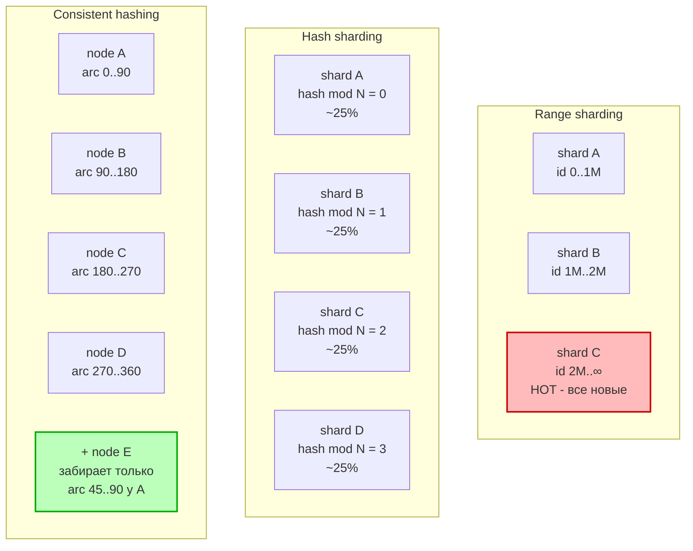
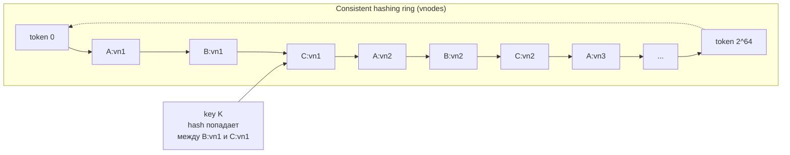

# Вопросы на собеседовании: `Database Sharding`

`Database Sharding` — horizontal partitioning: разрезание одной логической таблицы/БД на N независимых физических подмножеств (shards), каждое на своём узле. Зачем: storage > RAM/диска одного сервера, write throughput > одного master, latency через локальность данных. Цена: cross-shard queries дорогие, joins ломаются, distributed transactions сложны, resharding — отдельная инженерная задача.

## Полезные ссылки

### Официальная документация и авторитетные источники

- [MongoDB Sharding](https://www.mongodb.com/docs/manual/sharding/)
- [Vitess Documentation](https://vitess.io/docs/)
- [Citus Documentation](https://docs.citusdata.com/)
- [Cassandra — Data distribution & replication](https://cassandra.apache.org/doc/latest/cassandra/architecture/dynamo.html)
- [CockroachDB — Distribution Layer](https://www.cockroachlabs.com/docs/stable/architecture/distribution-layer.html)
- [DynamoDB Partitions and data distribution](https://docs.aws.amazon.com/amazondynamodb/latest/developerguide/HowItWorks.Partitions.html)
- [Karger et al. — Consistent Hashing (1997)](https://www.cs.princeton.edu/courses/archive/fall09/cos518/papers/chash.pdf)
- [DDIA — Chapter 6: Partitioning](https://www.oreilly.com/library/view/designing-data-intensive-applications/9781491903063/) — М. Клеппманн

## Содержание

- [Полезные ссылки](#полезные-ссылки)
- [See also](#see-also)

**Основы**
- [Q1. (!) Что такое sharding и чем отличается от репликации?](#q1--что-такое-sharding-и-чем-отличается-от-репликации)
- [Q2. (!) Horizontal vs vertical partitioning](#q2--horizontal-vs-vertical-partitioning)
- [Q3. Зачем шардировать: storage / write throughput / latency](#q3-зачем-шардировать-storage--write-throughput--latency)
- [Q4. Цена шардирования: что ломается](#q4-цена-шардирования-что-ломается)
- [Q5. Когда НЕ нужно шардировать](#q5-когда-не-нужно-шардировать)

**Стратегии шардирования**
- [Q6. (!) Range-based sharding: плюсы, минусы, hot spots](#q6--range-based-sharding-плюсы-минусы-hot-spots)
- [Q7. (!) Hash-based sharding](#q7--hash-based-sharding)
- [Q8. (!) Consistent hashing: зачем и как работает](#q8--consistent-hashing-зачем-и-как-работает)
- [Q9. Virtual nodes (vnodes) в consistent hashing](#q9-virtual-nodes-vnodes-в-consistent-hashing)
- [Q10. Directory-based sharding (lookup table)](#q10-directory-based-sharding-lookup-table)
- [Q11. Geo-based sharding](#q11-geo-based-sharding)
- [Q12. Сравнение стратегий: одна таблица](#q12-сравнение-стратегий-одна-таблица)

**Shard key и hot spots**
- [Q13. (!) Как выбрать shard key](#q13--как-выбрать-shard-key)
- [Q14. Anti-patterns shard key](#q14-anti-patterns-shard-key)
- [Q15. (!) Hot shard: причины, диагностика, лечение](#q15--hot-shard-причины-диагностика-лечение)
- [Q16. Compound shard key и salting](#q16-compound-shard-key-и-salting)

**Cross-shard queries и distributed transactions**
- [Q17. (!) Scatter-gather queries: почему дорого](#q17--scatter-gather-queries-почему-дорого)
- [Q18. Joins across shards: денормализация, broadcast tables](#q18-joins-across-shards-денормализация-broadcast-tables)
- [Q19. Distributed transactions: 2PC vs Saga vs outbox](#q19-distributed-transactions-2pc-vs-saga-vs-outbox)
- [Q20. Global secondary index across shards](#q20-global-secondary-index-across-shards)

**Resharding и migration**
- [Q21. (!) Resharding: причины и стратегии](#q21--resharding-причины-и-стратегии)
- [Q22. Live migration: dual-write + backfill + cutover](#q22-live-migration-dual-write--backfill--cutover)
- [Q23. Sharding + replication: каждый shard со своими репликами](#q23-sharding--replication-каждый-shard-со-своими-репликами)

**Реальные системы**
- [Q24. MongoDB sharding: mongos, config servers, chunks, balancer](#q24-mongodb-sharding-mongos-config-servers-chunks-balancer)
- [Q25. Cassandra: token ranges, vnodes, partition key vs clustering key](#q25-cassandra-token-ranges-vnodes-partition-key-vs-clustering-key)
- [Q26. (!) Vitess: VTGate, VTTablet, vindex](#q26--vitess-vtgate-vttablet-vindex)
- [Q27. Citus: distributed tables, reference tables, co-located joins](#q27-citus-distributed-tables-reference-tables-co-located-joins)
- [Q28. CockroachDB: range-based auto-sharding](#q28-cockroachdb-range-based-auto-sharding)
- [Q29. DynamoDB: hash key + sort key, partition splitting](#q29-dynamodb-hash-key--sort-key-partition-splitting)
- [Q30. Sharding в app layer: ProxySQL, Mycat, ручная логика](#q30-sharding-в-app-layer-proxysql-mycat-ручная-логика)
- [Q31. Tenancy patterns: per-tenant shard vs pool model](#q31-tenancy-patterns-per-tenant-shard-vs-pool-model)

**Anti-patterns**
- [Q32. Anti-pattern: shard по дате](#q32-anti-pattern-shard-по-дате)
- [Q33. Anti-pattern: забытая reference table](#q33-anti-pattern-забытая-reference-table)
- [Q34. (!) Чек-лист перед шардированием](#q34--чек-лист-перед-шардированием)

---

## Основы

## Q1. (!) Что такое sharding и чем отличается от репликации?

**Sharding** — горизонтальное разрезание набора данных по `shard key`: каждая строка лежит ровно на одном shard (плюс реплики этого shard). Цель — масштабировать **запись и объём**.

**Репликация** — копирование одного и того же набора данных на несколько узлов. Цель — масштабировать **чтение и доступность**, но запись всё ещё ограничена одним master (в single-leader моделях).

Они **ортогональны** и комбинируются: 8 shards × 3 replicas = 24 узла. См. Q23.

| Свойство | Sharding | Replication |
|---|---|---|
| Данные на узле | подмножество | полная копия |
| Масштабирует | write throughput + storage | read throughput + availability |
| Failover узла | shard недоступен, если нет реплик | другая реплика принимает чтения |
| Сложность | высокая (key, routing, cross-shard) | средняя (lag, конфликты) |

## Q2. (!) Horizontal vs vertical partitioning

**Horizontal partitioning** (= sharding в широком смысле) — строки одной таблицы разделены по узлам:
- shard A: `user_id 1..1M`
- shard B: `user_id 1M..2M`
- схема таблицы одинаковая на всех shards.

**Vertical partitioning** — колонки одной таблицы разделены по таблицам/узлам:
- таблица `users_hot` (id, email, login) — частые поля
- таблица `users_profile` (id, bio, avatar_url, prefs_json) — редко читаемые
- разные схемы, joins по PK.

Vertical обычно применяется ДО sharding, чтобы уменьшить hot data set. Sharding в production почти всегда означает horizontal.

## Q3. Зачем шардировать: storage / write throughput / latency

Три независимых драйвера:

1. **Storage** — таблица не помещается на один диск (или превышает разумный размер: 1–2 ТБ для OLTP, дальше vacuum/index rebuild болезненны).
2. **Write throughput** — single-leader не справляется с RPS на запись. Read replicas не помогают. Шардируя по `tenant_id` или `user_id`, получаем N параллельных мастеров.
3. **Latency через локальность** — geo-sharding: EU-данные в EU дата-центре, US — в US. Latency для local-юзеров падает.

## Q4. Цена шардирования: что ломается

- **Joins across shards** — становятся scatter-gather + merge в приложении.
- **Foreign keys** — DB-уровневые FK работают только внутри одного shard.
- **Транзакции через несколько shards** — нужен 2PC или Saga.
- **Auto-increment ID** — глобальная уникальность ломается, нужны UUID/Snowflake.
- **Global secondary indexes** — отдельная инфраструктура (см. Q20).
- **Аналитические запросы** (`COUNT`, `GROUP BY` по всей таблице) — медленные.
- **Operational complexity** — backups, migrations, monitoring × N.

## Q5. Когда НЕ нужно шардировать

Эмпирический порог (для OLTP на хорошем железе):
- < 1–2 ТБ данных,
- < 10 000 RPS на запись,
- нет geo-требований по локальности.

Сначала пройти все «дешёвые» шаги:
1. Vertical scaling (больше CPU/RAM/NVMe).
2. Read replicas для read-heavy workload.
3. Caching (Redis) для горячих ключей.
4. Архивирование старых данных (cold storage, partitioning **внутри одной БД** через `PARTITION BY RANGE`).
5. Vertical partitioning (Q2).

Sharding — последний шаг, и он необратим без боли.

---

## Стратегии шардирования

## Q6. (!) Range-based sharding: плюсы, минусы, hot spots

Каждый shard отвечает за **непрерывный диапазон** значений shard key:
- shard A: `user_id ∈ [0, 1_000_000)`
- shard B: `user_id ∈ [1_000_000, 2_000_000)`
- shard C: `user_id ∈ [2_000_000, +∞)`

**Плюсы:**
- `range queries` эффективны: `WHERE user_id BETWEEN 500_000 AND 700_000` → один shard.
- Простая логика роутинга.
- Локальность для соседних ключей.

**Минусы — hot spots:**
- Если `shard key` = monotonic (timestamp, auto-increment id), все **новые** записи идут в **последний** shard. Остальные simply неактивны.
- Перекос (skew) если распределение неравномерное (топовые tenants).

Используется в: HBase, MongoDB (ranged sharding), Bigtable, CockroachDB.

## Q7. (!) Hash-based sharding

`shard_id = hash(shard_key) mod N`, где `N` — число shards.

**Плюсы:**
- Равномерное распределение (при хорошей hash function: MurmurHash, xxHash).
- Нет hot spots от monotonic IDs (hash «размазывает» соседние ключи по всему пространству).

**Минусы:**
- **Range queries ломаются:** `WHERE created_at BETWEEN ...` → scatter-gather по всем shards.
- **Resharding катастрофический:** при изменении `N` (с 4 на 5) меняется `hash mod N` для **почти всех** ключей → нужно перемещать ~`(N-1)/N` данных. Решение → consistent hashing (Q8).

```text
hash("user_42") = 0xA3F7...  ->  mod 4 = 3  ->  shard #3
```

## Q8. (!) Consistent hashing: зачем и как работает

Проблема hash-mod: при добавлении узла перемещается почти всё. Consistent hashing (Karger, 1997) минимизирует rebalancing до `~K/N` (K — кол-во ключей, N — кол-во узлов).

**Идея:**
1. Hash space — кольцо (например, `[0, 2^32)`).
2. Каждый узел получает позицию на кольце через `hash(node_id)`.
3. Каждый ключ получает позицию `hash(key)`.
4. Ключ принадлежит **первому узлу по часовой стрелке** от своей позиции.

**Добавление узла N+1:** на кольце появляется новая точка. Перемещаются только ключи, которые попадают в диапазон **между новым узлом и его предшественником на кольце**. Все остальные ключи остаются на своих местах.



**Применение:** Cassandra, ScyllaDB, DynamoDB, Riak, memcached client libs (ketama).

## Q9. Virtual nodes (vnodes) в consistent hashing

Проблема «голого» consistent hashing: при малом числе узлов их положение на кольце случайное → один может получить 40% арки, другой 10%. Перекос.

**Решение — virtual nodes:** каждый физический узел получает **много токенов** (= позиций на кольце). Cassandra по умолчанию использует `num_tokens=256` per узел. При 10 узлах на кольце 2560 точек → распределение почти равномерное.

```
Без vnodes:                С vnodes (256 per node):
node A: 0..30  (30%)       node A: суммарно ~33% (256 случайных арк)
node B: 30..50 (20%)       node B: суммарно ~33%
node C: 50..100 (50%)      node C: суммарно ~33%
```

Бонус: при failover/удалении узла его vnodes равномерно распределяются по всем оставшимся узлам, а не сваливаются на одного соседа.



## Q10. Directory-based sharding (lookup table)

Отдельный сервис/таблица хранит маппинг `shard_key → shard_id`.

```sql
CREATE TABLE shard_directory (
    tenant_id BIGINT PRIMARY KEY,
    shard_id  INT NOT NULL
);
```

При запросе клиент сначала идёт в directory, потом в нужный shard.

**Плюсы:**
- Максимальная гибкость: можно класть конкретного крупного tenant на отдельный shard.
- Resharding — просто обновление одной строки в directory + миграция данных.
- Можно мигрировать tenant между shards онлайн.

**Минусы:**
- Сам directory становится bottleneck → кэшируем агрессивно (Redis, in-process LRU).
- Если directory упал → весь кластер недоступен.
- Дополнительный hop (latency).

Используют: Slack, Figma, многие SaaS с tenant-моделью.

## Q11. Geo-based sharding

`shard_key = region` (или вычисляется из `tenant.region`). Каждый shard живёт в дата-центре своего региона.

**Плюсы:**
- Latency: EU-юзер пишет в EU-shard (5 ms вместо 150 ms через океан).
- **Compliance:** GDPR требует, чтобы данные EU-резидентов не покидали EU. Geo-shard это решает.
- Изолированные сбои: падение US-shard не трогает EU.

**Минусы:**
- Global queries (search across regions) — scatter-gather через WAN.
- Миграция юзера между регионами — отдельная операция.
- Reference data дублируется по регионам (см. broadcast tables, Q18).

## Q12. Сравнение стратегий: одна таблица

| Стратегия | Range queries | Hot spots | Rebalancing | Use case |
|---|---|---|---|---|
| **Range** | отлично | да (monotonic key) | дорого | time-series, последовательный доступ (HBase, MongoDB ranged) |
| **Hash mod N** | scatter-gather | нет | катастрофическое | простые workloads, фиксированное N |
| **Consistent hashing** | scatter-gather | редко (vnodes) | минимальное | динамический кластер (Cassandra, Dynamo) |
| **Directory** | гибко | контролируемо | онлайн | multi-tenant SaaS, неоднородные tenants |
| **Geo** | внутри региона ок | возможны (большой регион) | редко | global apps, GDPR |

---

## Shard key и hot spots

## Q13. (!) Как выбрать shard key

Три критерия:

1. **High cardinality** — много уникальных значений. `user_id` (миллионы) — ок, `country_code` (200) — мало.
2. **Even distribution** — равномерное распределение значений. Если 80% запросов идут на 1% значений — перекос.
3. **Match access pattern** — ключ должен присутствовать в 90%+ запросов, иначе все запросы становятся scatter-gather.

**Пример хорошего ключа:** `tenant_id` для SaaS — присутствует во всех запросах, миллионы значений, более-менее равномерно (плюс отдельная стратегия для топ-tenants).

**Пример плохого ключа:** `country` для глобального приложения — низкая cardinality (200 значений), сильный перекос (US/CN > всех остальных).

## Q14. Anti-patterns shard key

- **Monotonic shard key** (timestamp, auto-increment id) с range-based стратегией → все новые записи в последний shard.
- **Низкая cardinality** (`status`, `category`, `country`) → данные не размазываются, hot shards.
- **Skewed distribution** (`user_id`, если 5 топ-юзеров генерят 50% трафика) → их shards в огне.
- **Mutable shard key** (значение меняется) — при изменении строку нужно физически переместить на другой shard. Очень дорого. Большинство систем (MongoDB до 4.2) вообще запрещают.
- **Composite, но запросы по части** — если `(tenant_id, user_id)` shard key, а запрос `WHERE user_id = ?` без tenant_id → scatter-gather.

## Q15. (!) Hot shard: причины, диагностика, лечение

**Причины:**
- Перекос данных (один tenant — 50% объёма).
- Перекос трафика (celebrity user, viral content).
- Monotonic shard key.

**Диагностика:**
- Метрики per-shard: CPU, write IOPS, latency p99, queue depth.
- Топ shard key по количеству запросов (sampling в proxy/router).
- В MongoDB: `db.collection.getShardDistribution()`, в Cassandra: `nodetool status` + `tablestats`.

**Лечение:**
1. **Salt** shard key: вместо `user_id` → `user_id + (request_time % 16)`. Один hot user размазывается по 16 «виртуальным» user-ам. Но чтение становится 16× scatter-gather.
2. **Composite key** с дополнительной размерностью: `(user_id, day)`.
3. **Manual rebalancing** через directory: перевести hot tenant на dedicated shard.
4. **Caching** перед DB (Redis): хот-чтения не доходят до shard.
5. **Split chunk/range** (MongoDB balancer, Vitess reshard): разрезать hot range на два меньших.

## Q16. Compound shard key и salting

**Compound shard key** (составной): `(tenant_id, item_id)`. Запросы по tenant_id попадают в один shard (хорошо для list-операций тенанта), а данные одного hot tenant дополнительно размазаны внутри shard по item_id.

**Salting** (добавление случайной соли):

```text
Бывший ключ: user_id = 42 (один пользователь — один shard, hot)
Salted ключ: shard_key = (user_id, salt), salt = user_id_hash % 16
            -> данные user=42 размазаны по 16 «корзинам»
            -> запись разгружена, но чтение должно опросить все 16
```

Используется в time-series (`device_id + time_bucket`) и в Cassandra/DynamoDB при write-heavy workloads.

---

## Cross-shard queries и distributed transactions

## Q17. (!) Scatter-gather queries: почему дорого

Запрос без `shard_key` в `WHERE` → router рассылает на **все** shards, ждёт ответы, мерджит.

**Стоимость:**
- Latency = max(latency всех shards) — медленный shard замедляет весь запрос (tail latency amplification).
- Network: N запросов вместо одного.
- Coordinator memory: должен буферизовать ответы для merge/sort/limit.
- Aggregation (`SUM`, `COUNT`, `AVG`) требует partial aggregates от shards + финальная редукция на coordinator.

**Пример:**
- `SELECT * FROM orders WHERE order_id = ?` без shard key (user_id) → опрос всех 100 shards → 100× нагрузка.
- Решение: либо global secondary index (Q20), либо доп. таблица-маппинг `order_id → user_id`, либо включить `order_id` так, чтобы он содержал `user_id` (composite encoding).

## Q18. Joins across shards: денормализация, broadcast tables

**Проблема:** `JOIN` между двумя шардированными таблицами, разрезанными по разным ключам, → cross-shard join, экспоненциально дорого.

**Решения:**

1. **Co-located sharding** — обе таблицы шардированы по одному и тому же ключу (`tenant_id`). JOIN работает локально на каждом shard. Citus это умеет автоматически (`co-located distribution column`).
2. **Денормализация** — копируем нужные колонки `B` в таблицу `A`, чтобы JOIN не требовался. Цена — duplication и sync при изменениях.
3. **Broadcast tables (reference tables)** — небольшие справочники (страны, категории, currencies) реплицируются **на каждый shard** целиком. JOIN с ними локальный. Vitess называет это `reference table`, Citus — `reference table`, Cassandra — материализованные views или просто duplication.
4. **App-level join** — два запроса в код, мерж в приложении. Подходит для маленьких результатов.

## Q19. Distributed transactions: 2PC vs Saga vs outbox

ACID-транзакция, затрагивающая 2+ shards.

**2PC (two-phase commit):**
- Coordinator: prepare → все «yes»? → commit. Иначе abort.
- Блокирующий: если coordinator упал между prepare и commit, участники заблокированы.
- Производительность: каждая транзакция = 2 round-trips + локи на всё время.
- Используют: XA-транзакции, Spanner (внутренне, с TrueTime).

**Saga:**
- Транзакция разбита на N локальных шагов, каждый коммитится в своём shard.
- Если шаг K провалился — compensating transactions откатывают шаги 1..K-1.
- Eventually consistent, не атомарно.
- Сложность: писать compensations, идемпотентность.

**Outbox + локальные транзакции:**
- Каждый shard коммитит локально + пишет событие в `outbox` table в той же транзакции.
- Воркер вычитывает outbox и публикует в Kafka. Другие shards/сервисы консьюмят и применяют изменения.
- Eventually consistent, но без распределённого 2PC.

**Практика:** в реальных шардированных системах 2PC избегают, используют Saga или outbox + idempotency.

## Q20. Global secondary index across shards

Локальный индекс — на каждом shard свой, по любым колонкам, ищется только если запрос идёт в этот shard. Если ищем по non-shard-key — нужен **global secondary index (GSI)**.

**Подходы:**

1. **Async-индекс в отдельной таблице/системе:**
   - `email → user_id` хранится в Redis/отдельной таблице.
   - Запись: транзакция в shard + асинхронное обновление индекса → eventually consistent.
2. **DynamoDB GSI** — встроенный механизм: GSI шардирован по своему ключу, реплицируется асинхронно, eventually consistent.
3. **Elasticsearch** как внешний поисковый индекс — основная БД пишет CDC в ES, поисковые запросы идут в ES.
4. **Vitess vindex (lookup)** — таблица-маппинг `lookup_key → keyspace_id` живёт в отдельном keyspace.

**Trade-off:** GSI почти всегда eventually consistent. Если нужен strong-consistent GSI — это распределённая транзакция при каждой записи.

---

## Resharding и migration

## Q21. (!) Resharding: причины и стратегии

**Причины:**
- Объём вырос, shards переполнены.
- Перекос (hot shard), нужно разрезать на меньшие.
- Меняется shard key (исходный был неудачный).
- Изменение архитектуры (миграция Range → Hash или наоборот).

**Стратегии:**

1. **Pre-split с самого начала** — создаём 1024 «логических» shards сразу, физических узлов 16. По мере роста — перевозим логические shards на новые физические узлы. Так делает Vitess (keyranges), MongoDB (chunks), Foursquare classic.
2. **Consistent hashing** — добавление узла перемещает только `K/N` ключей, остальные не двигаются.
3. **Live migration (dual-write)** — см. Q22.
4. **Vitess vReplication** — встроенный механизм MySQL-binlog-based миграции: новые shards подписываются на binlog старых, догоняют, потом cutover.

## Q22. Live migration: dual-write + backfill + cutover

Классическая 4-фазная схема онлайн-миграции на новый sharding:

1. **Dual-write phase:** приложение пишет одновременно в старую и новую систему (обычно через transactional outbox или CDC). Чтения — из старой.
2. **Backfill:** фоновый job копирует исторические данные из старой в новую систему. Идемпотентно, с чек-поинтами.
3. **Verification:** shadow-reads — читаем из обеих, сравниваем, логируем расхождения. Чиним.
4. **Cutover:** переключаем чтения на новую систему. Какое-то время старая продолжает принимать dual-writes для отката. Потом старая отключается.

Ключевые риски:
- **Race conditions** между dual-write и backfill (новая запись «перезаписывается» старой версией из backfill) → нужен timestamp/version per row.
- **Schema drift** — старая и новая схемы могут разойтись.
- **Откат** — должен быть возможен в любой фазе до cutover.

Так мигрировали: Slack (shardification 2022), Figma (Vitess), Pinterest (MySQL sharding), Notion (Postgres → 480 logical shards).

## Q23. Sharding + replication: каждый shard со своими репликами

Sharding и replication ортогональны и комбинируются:

```text
Cluster = N shards × R replicas

shard 1: primary + 2 replicas
shard 2: primary + 2 replicas
...
shard N: primary + 2 replicas
```

**Failover на уровне shard:**
- Primary упал → одна из replicas промоутится (Raft/Paxos consensus или внешний orchestrator: MHA, Orchestrator, sentinel).
- Router (mongos, VTGate) видит новый primary и направляет запись туда.
- Время недоступности — секунды (Raft) до десятков секунд (внешний orchestrator).

**Чтение с replicas** допустимо для read-heavy workload с tolerable stale reads (репликационный lag).

В MongoDB shard = replica set (3 узла обычно). В Cassandra `replication_factor=3` означает каждая партиция лежит на 3 узлах кольца.

---

## Реальные системы

## Q24. MongoDB sharding: mongos, config servers, chunks, balancer

**Компоненты:**
- **`mongos`** — stateless router, к нему подключается клиент. Принимает запрос, смотрит метаданные, отправляет на нужный shard. Можно ставить N штук.
- **Config servers** — replica set из 3 узлов, хранит метаданные кластера (диапазоны chunks → shards).
- **Shard** — replica set (3 узла обычно), хранит часть данных.
- **Chunk** — диапазон значений shard key, единица перемещения. Default chunk size — 128 MB.
- **Balancer** — фоновый процесс на config servers: следит за распределением chunks между shards, перемещает chunks (split + migrate) при перекосе.

```javascript
// Включить sharding для БД
sh.enableSharding("mydb")

// Шардировать коллекцию по hashed shard key
sh.shardCollection("mydb.orders", { user_id: "hashed" })

// Range-based
sh.shardCollection("mydb.events", { created_at: 1 })

// Compound key
sh.shardCollection("mydb.events", { tenant_id: 1, event_id: 1 })
```

**Hashed vs ranged** в MongoDB:
- `"hashed"` — встроенный hash на shard key (MD5-based), равномерное распределение.
- `1` (asc) — range-based, быстрые range queries.

С MongoDB 4.4: **compound hashed shard key** (`{ tenant_id: 1, _id: "hashed" }`).
С MongoDB 5.0: **resharding online** — `reshardCollection`.

## Q25. Cassandra: token ranges, vnodes, partition key vs clustering key

Cassandra использует **consistent hashing + vnodes**.

**Архитектура:**
- Кольцо токенов `[-2^63, 2^63)` (Murmur3 partitioner).
- Каждый узел владеет `num_tokens` (default 256) диапазонами на кольце.
- `replication_factor=3` → каждый row реплицируется на 3 соседних узла по кольцу.
- Нет master/router — координатор любой узел (token-aware client идёт сразу к нужному).

**Primary key = partition key + clustering key:**

```sql
CREATE TABLE events (
    user_id    UUID,         -- partition key (определяет shard/node)
    event_time TIMESTAMP,    -- clustering key (порядок внутри партиции)
    payload    TEXT,
    PRIMARY KEY ((user_id), event_time)
) WITH CLUSTERING ORDER BY (event_time DESC);
```

- **Partition key** — определяет, на каком узле живёт row. `hash(partition_key)` → token → node.
- **Clustering key** — упорядочивает строки **внутри одной партиции**. Дёшев для range queries в пределах партиции.
- Compound partition key: `PRIMARY KEY ((user_id, day), event_time)` — разрезает hot user на дни.

**Anti-pattern:** unbounded partition — партиция, которая растёт неограниченно (`PRIMARY KEY ((user_id), event_time)` для активного юзера на 10 лет → партиция в гигабайтах, чтения деградируют).

## Q26. (!) Vitess: VTGate, VTTablet, vindex

Vitess — sharding-слой над MySQL, разработан в YouTube, используется Slack, GitHub, Square.

**Архитектура:**
- **VTGate** — stateless router (как mongos). Клиент подключается обычным MySQL протоколом.
- **VTTablet** — sidecar к каждому MySQL-инстансу, прокси с pooling/throttling/streaming.
- **Topology service** (etcd/Zookeeper) — хранит метаданные.
- **Keyspace** — логическая БД, может быть шардирован (`sharded: true`) или нет (`unsharded`).
- **Shard** — `-80`, `80-` (range of keyspace IDs) или более тонко `-40`, `40-80`, `80-c0`, `c0-`.

**Vindex** — это про маппинг колонки → keyspace_id:

| Vindex type | Описание |
|---|---|
| `hash` | hash(value) → keyspace_id. Простой и дефолтный. |
| `lookup` | Отдельная таблица value → keyspace_id (как directory). Для secondary lookup. |
| `numeric` | Identity-функция, для числовых ID. |
| `consistent_lookup` | Lookup с прозрачным управлением консистентностью. |
| `xxhash` | xxHash вместо MD5 (быстрее). |

```json
// VSchema (упрощённо)
{
  "sharded": true,
  "vindexes": {
    "hash": { "type": "hash" },
    "user_email_lookup": {
      "type": "lookup",
      "params": { "table": "user_email_lookup", "from": "email", "to": "keyspace_id" },
      "owner": "users"
    }
  },
  "tables": {
    "users": {
      "column_vindexes": [
        { "column": "user_id", "name": "hash" },
        { "column": "email", "name": "user_email_lookup" }
      ]
    }
  }
}
```

**vReplication** — MySQL-binlog-based миграции (resharding, materialize, online schema changes).

## Q27. Citus: distributed tables, reference tables, co-located joins

Citus — extension для PostgreSQL, превращает PG в distributed DB.

**Типы таблиц:**
- **Distributed table** — горизонтально шардирована по `distribution column`.
  ```sql
  SELECT create_distributed_table('orders', 'tenant_id');
  ```
- **Reference table** — реплицируется целиком на каждый worker (broadcast). Для маленьких справочников.
  ```sql
  SELECT create_reference_table('countries');
  ```
- **Local table** — обычная PG-таблица только на coordinator.

**Co-located joins:** если две distributed таблицы шардированы по одной и той же колонке (`tenant_id`), JOIN работает локально на каждом worker, без cross-shard трафика.

```sql
-- Обе таблицы co-located по tenant_id
SELECT create_distributed_table('orders',     'tenant_id');
SELECT create_distributed_table('order_items','tenant_id', colocate_with => 'orders');

-- JOIN работает локально на каждом shard
SELECT o.id, oi.product_id
FROM orders o JOIN order_items oi ON o.id = oi.order_id
WHERE o.tenant_id = 42;
```

**Архитектура:** Coordinator (планирует запросы) + Workers (хранят shards). Coordinator знает метаданные распределения.

## Q28. CockroachDB: range-based auto-sharding

CockroachDB шардирует **автоматически** — нет понятия «shard key» в DDL.

- Все данные хранятся как KV-пары (key = `tablePrefix + PK + columnFamily`).
- Keyspace разбит на **ranges** (~64-512 MB).
- Каждый range — Raft group, реплицируется на 3+ узла.
- Когда range вырастает за порог — **auto-split** на два меньших.
- **Auto-rebalance:** если узел перегружен — ranges переезжают на менее загруженных.

**Hot spots:** `INSERT` в таблицу с monotonic PK (sequence/timestamp) → весь трафик идёт в последний range. Решение:
- `UUID` PK или `unique_rowid()` (snowflake-like, бьёт по узлам).
- `hash sharded indexes`:
  ```sql
  CREATE TABLE events (
      ts TIMESTAMP,
      payload STRING,
      PRIMARY KEY (ts, payload)
  ) USING HASH WITH (bucket_count = 16);
  ```

Похожая модель: TiDB (ranges + Raft), Spanner (splits + Paxos), YugabyteDB.

## Q29. DynamoDB: hash key + sort key, partition splitting

Primary key в DynamoDB — это `partition key` либо `(partition key, sort key)`:
- **Partition key** — hash → определяет partition. Аналог shard key.
- **Sort key** (опционально) — упорядочивает items внутри одной партиции, аналог clustering key Cassandra.

**Partitions** — внутренние, AWS не показывает их явно. Стартует с 1 partition, при росте storage (> 10 GB) или throughput (> 3000 RCU/1000 WCU per partition) — partition **splits**.

**Hot partition problem:** если 70% трафика идёт на один `partition key` — RCU/WCU тротлятся. Решение:
- Salting (`partition_key = user_id + (request_id % 10)`).
- Adaptive capacity (AWS сам перераспределяет throughput).
- Кэширование через DAX.

**GSI** (Global Secondary Index) — отдельная «таблица» с другим partition/sort key, async-реплицируется, eventually consistent.

## Q30. Sharding в app layer: ProxySQL, Mycat, ручная логика

До зрелых решений (Vitess, Citus) sharding делали вручную на app-уровне:

- **App-level routing**: код приложения вычисляет shard и выбирает datasource.
  ```java
  int shardId = userId % SHARD_COUNT;
  DataSource ds = shardPool.get(shardId);
  ```
  Просто, но шарды захардкожены, resharding — переписывать код.

- **ProxySQL** — MySQL proxy, может роутить по правилам (hash от user_id → backend). Не умеет split queries, но базовое sharding закрывает.

- **Mycat** (китайский MySQL middleware) — sharding + read replicas + simple aggregations. Использовался в Alibaba/Tencent на ранних этапах.

- **ShardingSphere (Apache)** — JDBC-level + proxy. Sharding rules, distributed transactions (Saga/XA), data masking.

Современная рекомендация: использовать Vitess (MySQL) или Citus (PostgreSQL) вместо самописа.

## Q31. Tenancy patterns: per-tenant shard vs pool model

В multi-tenant SaaS — три модели:

| Модель | Описание | Use case |
|---|---|---|
| **Pool model (shared schema)** | Все tenants в одной таблице, `tenant_id` в каждой строке + RLS / WHERE-фильтр. Шардируется по `tenant_id`. | Много мелких tenants (B2C SaaS). |
| **Bridge model (schema-per-tenant)** | Одна БД, разные PG schemas. | Средние tenants, нужна изоляция миграций. |
| **Silo model (DB-per-tenant)** | Каждый tenant — своя БД (или своя группа shards). | Enterprise, строгие compliance, очень большие tenants. |

Реально на масштабе SaaS: **гибрид**. Топ-10 enterprise клиентов → silo (выделенный shard каждому). Остальные тысячи → pool, шардированный по `tenant_id`. Directory-based роутинг (Q10) знает, какой tenant в каком shard.

---

## Anti-patterns

## Q32. Anti-pattern: shard по дате

Соблазн: «логи же по дате запрашиваются, давайте шардировать по `created_at`».

**Что произойдёт:**
- Все новые INSERT идут в shard «сегодня» → hot shard.
- Старые shards простаивают, но занимают железо.
- Запросы по `user_id` без даты → scatter-gather по всем shards.

**Правильно:**
- Использовать **partitioning внутри shard** по дате (PG `PARTITION BY RANGE`), а sharding — по `user_id`/`tenant_id`.
- Time-series системы (TimescaleDB, ClickHouse) шардируют по `(device_id, time_bucket)` — composite key.

## Q33. Anti-pattern: забытая reference table

Маленькая справочная таблица (`countries`, `categories`, `currencies`) шардирована вместе со всем остальным по `tenant_id`.

**Что произойдёт:**
- JOIN с этой таблицей в любом запросе → cross-shard (потому что у `countries` нет `tenant_id`).
- Каждый запрос становится scatter-gather.

**Правильно:**
- В Citus — `create_reference_table('countries')`.
- В Vitess — пометить как `reference table` в VSchema, она будет реплицирована на все shards.
- В MongoDB — `db.runCommand({ shardCollection: ..., key: { _id: "hashed" } })` с маленьким chunk size, либо не шардировать и хранить целиком на каждом приложении (кэш).

## Q34. (!) Чек-лист перед шардированием

Перед тем как закатить sharding в прод:

1. **Точно ли это нужно?** Прошли ли vertical scaling, read replicas, кэш, архив старых данных? (Q5)
2. **Выбран shard key?** Высокая cardinality, равномерное распределение, присутствует в 90%+ запросов. (Q13)
3. **Стратегия выбрана?** Range / Hash / Consistent hashing / Directory / Geo — обоснована under workload. (Q6–Q12)
4. **Известны cross-shard запросы?** Список, оценка стоимости, план денормализации/broadcast tables. (Q17–Q18)
5. **Распределённые транзакции?** Будут ли? Если да — Saga или outbox, не 2PC. (Q19)
6. **Global secondary indexes?** Какие нужны, какие стораджи. (Q20)
7. **Resharding plan?** Pre-split, consistent hashing, dual-write strategy. (Q21–Q22)
8. **Replication внутри shard?** RF и failover механизм. (Q23)
9. **Monitoring per-shard?** Hot shard алертинг, метрики распределения данных. (Q15)
10. **Operational plan?** Backup × N shards, schema migrations × N, deploy × N.

Если хотя бы по одному из пунктов нет ответа — sharding пока не готов. Проще отложить и решить оставшиеся проблемы другими средствами.

---

## See also

- [database-architecture-interview](database-architecture-interview.md) — общая архитектура БД, partitioning, replication patterns
- [database-transactions-interview](database-transactions-interview.md) — ACID, изоляция, распределённые транзакции
- [database-replication-interview](database-replication-interview.md) — master-slave, multi-master, sync vs async
- [postgresql-interview](postgresql-interview.md) — PG-нативные partitioning + Citus
- [mongodb-interview](mongodb-interview.md) — mongos, config servers, chunks, balancer (детали)
- [cassandra-interview](cassandra-interview.md) — consistent hashing, vnodes, partition key
- [dynamodb-interview](dynamodb-interview.md) — partition key + sort key, GSI
- [../architecture/distributed-systems-interview](../architecture/distributed-systems-interview.md) — CAP, consensus, partition tolerance
- [../architecture/scalability-patterns-interview](../architecture/scalability-patterns-interview.md) — vertical/horizontal scaling, шардирование как паттерн
- [../architecture/consistency-patterns-interview](../architecture/consistency-patterns-interview.md) — eventual / strong consistency, quorum
- [../system-design/system-design-interview](../system-design/system-design-interview.md) — sharding в system design интервью

