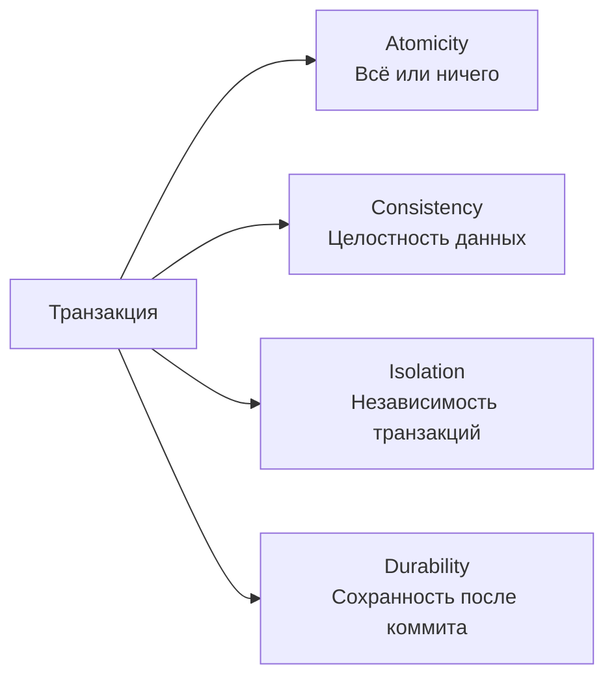
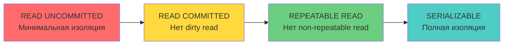
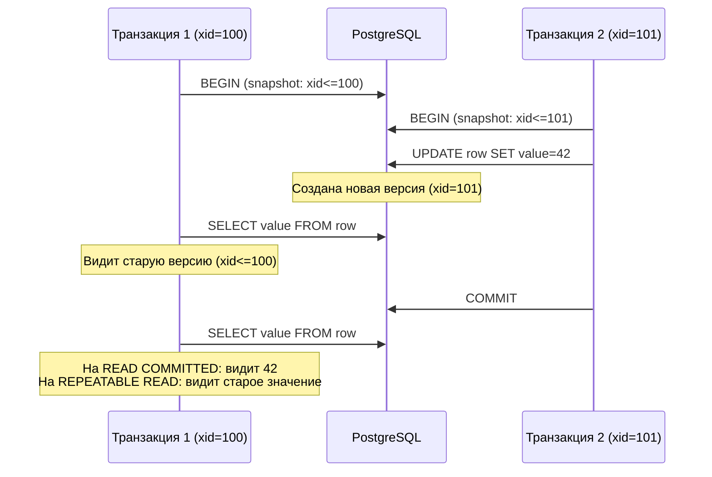
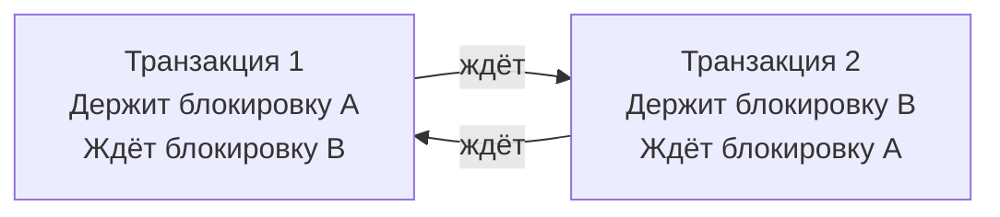
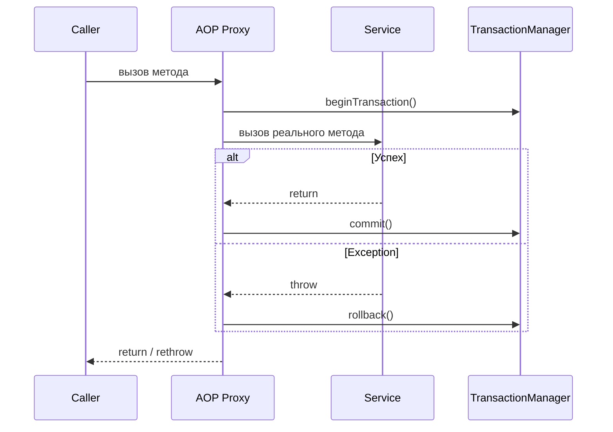
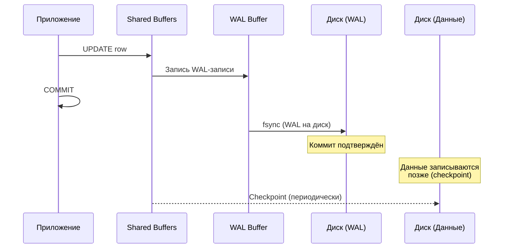
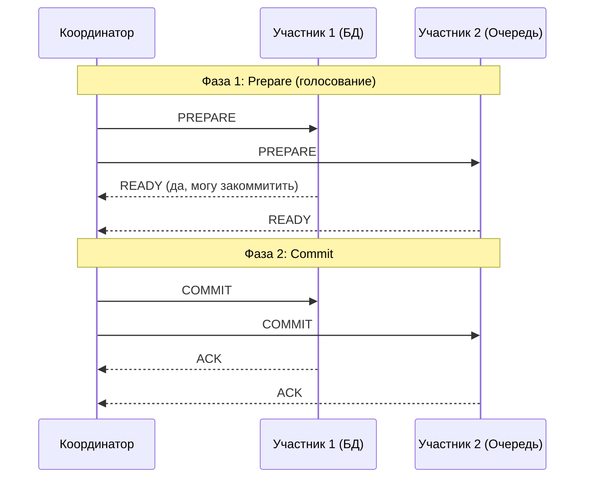
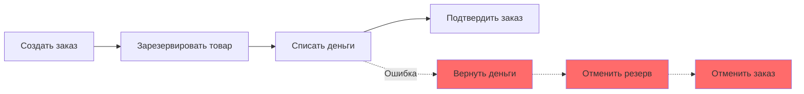

# Вопросы на собеседовании: `Транзакции и уровни изоляции`

Полный набор вопросов по транзакциям в реляционных БД: свойства `ACID`, уровни изоляции, аномалии параллельного доступа, механизмы блокировок, `MVCC`, `Spring @Transactional`, распределённые транзакции и специфика `PostgreSQL`.

**Транзакции** -- фундаментальный механизм обеспечения целостности данных в СУБД. На собеседовании проверяют понимание свойств `ACID`, умение выбрать правильный уровень изоляции, знание аномалий параллельного доступа (`dirty read`, `phantom read`, `lost update`), а также практические навыки работы с `Spring @Transactional`, программным управлением транзакциями и распределёнными транзакциями в микросервисной архитектуре.

## Полезные ссылки

### Официальная документация

- [PostgreSQL: Transaction Isolation](https://www.postgresql.org/docs/current/transaction-iso.html) — уровни изоляции в PostgreSQL
- [PostgreSQL: Write-Ahead Logging (WAL)](https://www.postgresql.org/docs/current/wal-intro.html) — механизм WAL
- [PostgreSQL: MVCC Introduction](https://www.postgresql.org/docs/current/mvcc-intro.html) — многоверсионное управление параллельным доступом
- [Jakarta Persistence Specification](https://jakarta.ee/specifications/persistence/) — спецификация JPA

### Статьи Baeldung

- [Transaction Propagation and Isolation in Spring @Transactional](https://www.baeldung.com/spring-transactional-propagation-isolation) — Spring транзакции: propagation и isolation
- [Programmatic Transaction Management in Spring](https://www.baeldung.com/spring-programmatic-transaction-management) — программное управление транзакциями
- [Optimistic Locking in JPA](https://www.baeldung.com/jpa-optimistic-locking) — оптимистическая блокировка
- [Pessimistic Locking in JPA](https://www.baeldung.com/jpa-pessimistic-locking) — пессимистическая блокировка
- [Transactions Across Microservices](https://www.baeldung.com/transactions-across-microservices) — распределённые транзакции
- [Saga Pattern in Microservices](https://www.baeldung.com/cs/saga-pattern-microservices) — паттерн Saga

## Содержание

- [Полезные ссылки](#полезные-ссылки)
- [See also](#see-also)

**Свойства ACID**
- [Q1. (!) Что такое ACID и зачем эти свойства нужны?](#q1--что-такое-acid-и-зачем-эти-свойства-нужны)
- [Q2. Как обеспечивается атомарность транзакции на уровне СУБД?](#q2-как-обеспечивается-атомарность-транзакции-на-уровне-субд)
- [Q3. Что означает консистентность в контексте ACID?](#q3-что-означает-консистентность-в-контексте-acid)
- [Q4. (!) Чем изоляция отличается от консистентности?](#q4--чем-изоляция-отличается-от-консистентности)
- [Q5. Как СУБД обеспечивает долговечность (Durability)?](#q5-как-субд-обеспечивает-долговечность-durability)

**Уровни изоляции**
- [Q6. (!) Какие уровни изоляции определяет стандарт SQL?](#q6--какие-уровни-изоляции-определяет-стандарт-sql)
- [Q7. (!) Что такое dirty read, non-repeatable read и phantom read?](#q7--что-такое-dirty-read-non-repeatable-read-и-phantom-read)
- [Q8. Что такое lost update и на каком уровне изоляции он возможен?](#q8-что-такое-lost-update-и-на-каком-уровне-изоляции-он-возможен)
- [Q9. (!) Какой уровень изоляции по умолчанию в PostgreSQL и MySQL?](#q9--какой-уровень-изоляции-по-умолчанию-в-postgresql-и-mysql)
- [Q10. Как выбрать уровень изоляции для конкретной задачи?](#q10-как-выбрать-уровень-изоляции-для-конкретной-задачи)

**MVCC**
- [Q11. (!) Что такое MVCC и как он работает?](#q11--что-такое-mvcc-и-как-он-работает)
- [Q12. Как MVCC реализован в PostgreSQL?](#q12-как-mvcc-реализован-в-postgresql)
- [Q13. Что такое VACUUM и зачем он нужен?](#q13-что-такое-vacuum-и-зачем-он-нужен)

**Блокировки и конкурентный доступ**
- [Q14. (!) В чём разница между оптимистической и пессимистической блокировкой?](#q14--в-чём-разница-между-оптимистической-и-пессимистической-блокировкой)
- [Q15. Как реализовать оптимистическую блокировку в JPA?](#q15-как-реализовать-оптимистическую-блокировку-в-jpa)
- [Q16. Как реализовать пессимистическую блокировку в JPA?](#q16-как-реализовать-пессимистическую-блокировку-в-jpa)
- [Q17. (!) Что такое deadlock и как его предотвратить?](#q17--что-такое-deadlock-и-как-его-предотвратить)
- [Q18. Какие типы блокировок существуют в PostgreSQL?](#q18-какие-типы-блокировок-существуют-в-postgresql)

**Spring @Transactional**
- [Q19. (!) Как работает аннотация @Transactional в Spring?](#q19--как-работает-аннотация-transactional-в-spring)
- [Q20. (!) Какие типы propagation существуют и когда их использовать?](#q20--какие-типы-propagation-существуют-и-когда-их-использовать)
- [Q21. Как задать уровень изоляции в @Transactional?](#q21-как-задать-уровень-изоляции-в-transactional)
- [Q22. (!) Как работает rollbackFor и noRollbackFor?](#q22--как-работает-rollbackfor-и-norollbackfor)
- [Q23. Почему @Transactional не работает на private методах?](#q23-почему-transactional-не-работает-на-private-методах)
- [Q24. Что такое self-invocation problem в Spring транзакциях?](#q24-что-такое-self-invocation-problem-в-spring-транзакциях)
- [Q25. (!) Как использовать @Transactional в read-only сценариях?](#q25--как-использовать-transactional-в-read-only-сценариях)

**Программное управление транзакциями**
- [Q26. Как управлять транзакциями программно через TransactionTemplate?](#q26-как-управлять-транзакциями-программно-через-transactiontemplate)
- [Q27. Когда программное управление предпочтительнее декларативного?](#q27-когда-программное-управление-предпочтительнее-декларативного)

**WAL и Savepoints**
- [Q28. (!) Что такое WAL (Write-Ahead Log) и какую роль он играет?](#q28--что-такое-wal-write-ahead-log-и-какую-роль-он-играет)
- [Q29. Что такое savepoint и как его использовать?](#q29-что-такое-savepoint-и-как-его-использовать)

**Распределённые транзакции**
- [Q30. (!) Что такое двухфазный коммит (2PC)?](#q30--что-такое-двухфазный-коммит-2pc)
- [Q31. Что такое XA-транзакции?](#q31-что-такое-xa-транзакции)
- [Q32. (!) Что такое паттерн Saga и чем он отличается от 2PC?](#q32--что-такое-паттерн-saga-и-чем-он-отличается-от-2pc)

**Connection Pooling и транзакции**
- [Q33. Как connection pool взаимодействует с транзакциями?](#q33-как-connection-pool-взаимодействует-с-транзакциями)
- [Q34. Какие проблемы возникают при неправильном управлении соединениями в транзакциях?](#q34-какие-проблемы-возникают-при-неправильном-управлении-соединениями-в-транзакциях)

**PostgreSQL и продвинутые темы**
- [Q35. MVCC в PostgreSQL — vacuum, dead tuples, bloat](#q35-mvcc-в-postgresql--vacuum-dead-tuples-bloat)
- [Q36. Savepoints в транзакциях — SAVEPOINT / ROLLBACK TO](#q36-savepoints-в-транзакциях--savepoint--rollback-to)
- [Q37. Advisory Locks в PostgreSQL — pg_try_advisory_lock](#q37-advisory-locks-в-postgresql--pg_try_advisory_lock)
- [Q38. Distributed transactions: 2PC, XA в Java (Atomikos, Narayana)](#q38-distributed-transactions-2pc-xa-в-java-atomikos-narayana)
- [Q39. Saga: Choreography vs Orchestration — детальное сравнение](#q39-saga-choreography-vs-orchestration--детальное-сравнение)
- [Q40. Optimistic vs Pessimistic Locking в Hibernate — аннотации, примеры](#q40-optimistic-vs-pessimistic-locking-в-hibernate--аннотации-примеры)
- [Q41. Read-your-writes consistency — механизмы обеспечения](#q41-read-your-writes-consistency--механизмы-обеспечения)
- [Q42. Transaction Log (WAL) — для чего используется](#q42-transaction-log-wal--для-чего-используется)

---

## Q1. (!) Что такое ACID и зачем эти свойства нужны?

**ACID** -- набор из четырёх свойств, гарантирующих надёжную обработку транзакций в СУБД:

| Свойство | Описание |
|----------|----------|
| **Atomicity** (атомарность) | Транзакция выполняется целиком или не выполняется вовсе. Частичное применение изменений невозможно |
| **Consistency** (консистентность) | Транзакция переводит БД из одного согласованного состояния в другое. Все ограничения (`constraints`, `triggers`) соблюдаются |
| **Isolation** (изоляция) | Параллельные транзакции не влияют друг на друга так, как если бы они выполнялись последовательно |
| **Durability** (долговечность) | После коммита данные сохраняются даже при сбое системы |



На практике полное соблюдение всех свойств `ACID` стоит дорого с точки зрения производительности, поэтому СУБД предлагают разные **уровни изоляции**, позволяя разработчику выбирать баланс между строгостью и скоростью.

## Q2. Как обеспечивается атомарность транзакции на уровне СУБД?

Атомарность («всё или ничего») обеспечивается **журналом транзакций** (`WAL` / `redo log` / `undo log`): СУБД фиксирует намерение изменить данные раньше, чем меняет их, поэтому любое незавершённое изменение всегда можно откатить.

Механизм по шагам:

1. **Перед изменением данных** СУБД записывает в журнал, что именно будет изменено -- чтобы при сбое было откуда взять информацию для отката или повтора
2. **При коммите** -- помечает транзакцию как завершённую в журнале; только после этого изменения считаются окончательными
3. **При откате** (`ROLLBACK`) -- читает журнал и отменяет все изменения транзакции, возвращая БД в состояние до её начала

В `PostgreSQL` атомарность достигается комбинацией двух механизмов: `WAL` отвечает за redo (повтор изменений после сбоя), а `MVCC` -- за undo: старые версии строк не перезаписываются, а сохраняются, поэтому откат сводится к тому, чтобы продолжать видеть прежнюю версию.

```sql
BEGIN;
UPDATE accounts SET balance = balance - 100 WHERE id = 1;
UPDATE accounts SET balance = balance + 100 WHERE id = 2;
-- Если здесь произойдёт ошибка, оба UPDATE будут отменены
COMMIT;
```

## Q3. Что означает консистентность в контексте ACID?

**Консистентность** означает, что транзакция переводит БД из одного **валидного состояния** в другое: если до неё все правила соблюдались, после её фиксации они тоже будут соблюдаться. На практике «валидное состояние» складывается из трёх слоёв:

- Все ограничения целостности (`NOT NULL`, `UNIQUE`, `FOREIGN KEY`, `CHECK`) соблюдены после завершения транзакции
- Все триггеры и каскадные правила отработали корректно
- Бизнес-инварианты не нарушены (например, при переводе денег суммарный баланс на счетах не изменился)

Ключевой нюанс для собеседования: консистентность -- это **ответственность приложения и схемы БД**, а не только СУБД. СУБД проверяет лишь те ограничения, которые вы объявили. Если бизнес-правило не выражено через `constraint` или триггер, СУБД о нём не знает и защитить его не сможет -- следить за инвариантом придётся коду приложения.

## Q4. (!) Чем изоляция отличается от консистентности?

| Аспект | Consistency | Isolation |
|--------|------------|-----------|
| **О чём** | Корректность данных | Видимость изменений между транзакциями |
| **Кто обеспечивает** | Схема БД + приложение | СУБД (уровни изоляции) |
| **Что нарушается** | Ограничения целостности | Возникают аномалии чтения |
| **Настраивается** | Через `constraints` | Через `SET TRANSACTION ISOLATION LEVEL` |

Проще всего развести их двумя вопросами:

- **Консистентность** отвечает: «Данные корректны сами по себе?» -- то есть не нарушены ли ограничения и инварианты.
- **Изоляция** отвечает: «Что видит параллельная транзакция?» -- то есть как соседние транзакции влияют на видимость данных.

Связь между ними прямая: изоляция -- это инструмент, который помогает удержать консистентность в многопользовательском окружении. Без изоляции две корректные по отдельности транзакции, выполняясь одновременно, могут оставить БД в несогласованном состоянии (типичный пример -- lost update).

## Q5. Как СУБД обеспечивает долговечность (Durability)?

Долговечность гарантирует, что после успешного коммита данные не пропадут даже при сбое питания или падении процесса. Достигается это тем, что коммит подтверждается клиенту только после надёжной записи на энергонезависимый носитель. Механизмы:

1. **Write-Ahead Logging (WAL)** -- перед изменением данных на диске запись о нём фиксируется в журнале; при сбое СУБД восстанавливает изменения из журнала, даже если они не успели попасть в основные файлы данных
2. **`fsync`** -- принудительный сброс буферов ОС на физический диск при коммите, чтобы запись не «зависла» в кэше и не потерялась при отключении питания
3. **Контрольные точки (`checkpoints`)** -- периодическое сохранение «грязных» (изменённых, но ещё не записанных) страниц из памяти на диск; ограничивают объём WAL, который придётся проигрывать при восстановлении
4. **Репликация** -- копирование данных на другие серверы как дополнительный уровень защиты от потери целого узла

В `PostgreSQL` коммит считается завершённым только после того, как `WAL`-запись сброшена на диск через `fsync` -- именно поэтому durability держится на WAL, а не на основных файлах данных. Параметр `synchronous_commit` позволяет ослабить эту гарантию ради скорости: коммит подтверждается, не дожидаясь `fsync`, но при внезапном сбое можно потерять несколько последних транзакций.

## Q6. (!) Какие уровни изоляции определяет стандарт SQL?

Стандарт SQL определяет четыре уровня изоляции. Их смысл -- задать, какие **аномалии параллельного чтения** допустимы: чем выше уровень, тем меньше аномалий, но тем дороже он обходится по конкурентности. Уровни от наименее строгого к наиболее строгому:

| Уровень | Dirty Read | Non-Repeatable Read | Phantom Read |
|---------|------------|--------------------:|-------------:|
| `READ UNCOMMITTED` | Возможен | Возможен | Возможен |
| `READ COMMITTED` | Невозможен | Возможен | Возможен |
| `REPEATABLE READ` | Невозможен | Невозможен | Возможен |
| `SERIALIZABLE` | Невозможен | Невозможен | Невозможен |



Шкала строгости (каждый шаг вправо снимает ещё одну аномалию ценой конкурентности):

```
 слабее изоляция, выше конкурентность ───────────▶ строже, меньше аномалий

 READ UNCOMMITTED ──▶ READ COMMITTED ──▶ REPEATABLE READ ──▶ SERIALIZABLE
   всё допустимо        нет dirty           нет non-repeat       нет аномалий
```

Две детали про `PostgreSQL`, на которых ловят на собеседовании:

- `PostgreSQL` вообще не реализует `READ UNCOMMITTED` -- при его запросе молча используется `READ COMMITTED`, потому что благодаря `MVCC` грязное чтение невозможно в принципе.
- `REPEATABLE READ` в `PostgreSQL` защищает ещё и от `phantom read` (за счёт снимка данных в `MVCC`), то есть он строже, чем требует стандарт. По таблице фантомы там «возможны», а на практике -- нет.

## Q7. (!) Что такое dirty read, non-repeatable read и phantom read?

Это три аномалии параллельного чтения, по нарастанию «тонкости». Главное отличие: грязное чтение -- про **незакоммиченные** данные, а два остальных -- про уже **закоммиченные** изменения соседней транзакции, которые «просочились» внутрь вашей. Non-repeatable read касается **одной строки** (изменилось значение), phantom read -- **набора строк** (появились или исчезли строки под условие `WHERE`).

### Dirty Read (грязное чтение)

Транзакция читает данные, изменённые другой **незакоммиченной** транзакцией. Если та откатится, прочитанные данные окажутся невалидными -- вы прочитали то, чего на самом деле в БД нет.

```
Транзакция A:  UPDATE accounts SET balance = 500 WHERE id = 1;  (не коммитит)
Транзакция B:  SELECT balance FROM accounts WHERE id = 1;  -- читает 500 (dirty read!)
Транзакция A:  ROLLBACK;  -- баланс возвращается к исходному
```

### Non-Repeatable Read (неповторяемое чтение)

Транзакция повторно читает ту же строку и получает **другое значение**, потому что другая транзакция закоммитила изменение между двумя чтениями.

```
Транзакция A:  SELECT balance FROM accounts WHERE id = 1;  -- 1000
Транзакция B:  UPDATE accounts SET balance = 500 WHERE id = 1; COMMIT;
Транзакция A:  SELECT balance FROM accounts WHERE id = 1;  -- 500 (non-repeatable read!)
```

### Phantom Read (фантомное чтение)

Транзакция повторно выполняет запрос с условием `WHERE` и получает **другой набор строк**, потому что другая транзакция вставила или удалила строки, подходящие под условие.

```
Транзакция A:  SELECT COUNT(*) FROM orders WHERE status = 'NEW';  -- 5
Транзакция B:  INSERT INTO orders (status) VALUES ('NEW'); COMMIT;
Транзакция A:  SELECT COUNT(*) FROM orders WHERE status = 'NEW';  -- 6 (phantom read!)
```

## Q8. Что такое lost update и на каком уровне изоляции он возможен?

**Lost update** (потерянное обновление) -- две транзакции читают одно и то же значение, каждая считает на его основе новое и записывает обратно; та, что записывает второй, затирает результат первой, и одно из изменений бесследно исчезает. Это аномалия не чтения, а конкурентной записи по схеме «прочитал -- посчитал -- записал».

```
Транзакция A:  SELECT balance FROM accounts WHERE id = 1;  -- 1000
Транзакция B:  SELECT balance FROM accounts WHERE id = 1;  -- 1000
Транзакция A:  UPDATE accounts SET balance = 1000 + 100 WHERE id = 1; COMMIT;  -- 1100
Транзакция B:  UPDATE accounts SET balance = 1000 - 200 WHERE id = 1; COMMIT;  -- 800
-- Ожидали 900, получили 800. Обновление A потеряно!
```

`Lost update` возможен на уровнях `READ UNCOMMITTED` и `READ COMMITTED`. Начиная с `REPEATABLE READ` (в `PostgreSQL`) защита уже есть: транзакция B при попытке записать поверх изменённой строки получит ошибку сериализации и должна будет повторить операцию на свежих данных.

**Как защититься** (от простого к строгому):

- **Атомарное обновление** -- считать новое значение прямо в SQL, не вынося чтение в приложение: `UPDATE accounts SET balance = balance + 100`. Тогда «прочитал -- посчитал -- записал» происходит в одной операции под блокировкой строки, и терять нечего.
- **Оптимистическая блокировка** с `@Version` -- запись проходит только если версия не менялась; иначе исключение и retry. Хороша при редких конфликтах.
- **Пессимистическая блокировка** -- `SELECT ... FOR UPDATE` заранее блокирует строку, чтобы второй читатель ждал. Хороша при частых конфликтах.
- **Повышение уровня изоляции** до `REPEATABLE READ` или `SERIALIZABLE` -- БД сама обнаружит конфликт и отвергнет одну из транзакций.

## Q9. (!) Какой уровень изоляции по умолчанию в PostgreSQL и MySQL?

Коротко: у большинства СУБД дефолт -- `READ COMMITTED`, а MySQL (InnoDB) выделяется тем, что по умолчанию ставит `REPEATABLE READ`.

| СУБД | Уровень по умолчанию | Особенности |
|------|---------------------|-------------|
| `PostgreSQL` | `READ COMMITTED` | `MVCC`-реализация; `READ UNCOMMITTED` фактически = `READ COMMITTED`; `REPEATABLE READ` защищает от phantom read |
| `MySQL` (InnoDB) | `REPEATABLE READ` | Использует `MVCC` + `next-key locking`; phantom read частично предотвращён через gap locks |
| `Oracle` | `READ COMMITTED` | `MVCC` через undo segments; поддерживает только `READ COMMITTED` и `SERIALIZABLE` |
| `SQL Server` | `READ COMMITTED` | По умолчанию использует блокировки, но можно включить `READ_COMMITTED_SNAPSHOT` для `MVCC` |

Установка уровня изоляции в SQL:

```sql
-- Для текущей транзакции
SET TRANSACTION ISOLATION LEVEL REPEATABLE READ;
BEGIN;
-- ...
COMMIT;

-- Для всей сессии (PostgreSQL)
SET SESSION CHARACTERISTICS AS TRANSACTION ISOLATION LEVEL SERIALIZABLE;
```

## Q10. Как выбрать уровень изоляции для конкретной задачи?

| Сценарий | Рекомендация | Обоснование |
|----------|-------------|-------------|
| Аналитические отчёты | `REPEATABLE READ` | Консистентный снимок данных на время отчёта |
| OLTP, высокая нагрузка | `READ COMMITTED` | Баланс между изоляцией и производительностью |
| Финансовые операции | `SERIALIZABLE` или `REPEATABLE READ` + явные блокировки | Недопустимы аномалии |
| Чтение справочников | `READ COMMITTED` | Данные редко меняются, строгая изоляция не нужна |
| Массовый импорт | `READ COMMITTED` | Минимум блокировок, максимум throughput |

**Эмпирическое правило:** начинайте с `READ COMMITTED` (default в `PostgreSQL`) и повышайте уровень точечно -- только там, где конкретная аномалия реально ломает бизнес-логику. Более строгий уровень не бесплатен: больше конфликтов сериализации, больше retry на стороне приложения, ниже throughput. Поэтому выбор уровня -- это всегда компромисс между корректностью при конкуренции и пропускной способностью.

## Q11. (!) Что такое MVCC и как он работает?

**MVCC** (`Multi-Version Concurrency Control`) -- механизм параллельного доступа, при котором СУБД хранит **несколько версий одной строки**, и каждая транзакция работает со **снимком (snapshot)** данных на момент своего старта. Главная идея: вместо того чтобы блокировать данные на время чтения, дать читателю стабильную старую версию, пока писатель готовит новую.

Отсюда вытекают ключевые свойства:

- **Читатели не блокируют писателей, а писатели -- читателей.** Это снимает основной источник конкурентных простоев: `SELECT` никогда не ждёт `UPDATE` и наоборот.
- При `UPDATE` создаётся **новая версия строки**, а старая остаётся жить, пока её ещё может видеть хотя бы одна активная транзакция.
- `DELETE` не стирает строку физически, а помечает её невидимой для новых транзакций -- старые транзакции продолжают её видеть.
- У каждой транзакции есть свой `xid` (transaction ID), и она видит только те версии строк, что созданы транзакциями, попадающими в её снимок. Так разные транзакции одновременно видят разные согласованные «срезы» одних и тех же данных.



То же во времени (диаграмма обмена), где видно, как читатель не блокирует писателя:

```
 T1 (xid=100)             PostgreSQL              T2 (xid=101)
     │                        │                        │
     │── BEGIN ──────────────▶│ снимок: xid ≤ 100       │
     │                        │◀─────────────── BEGIN ──│ снимок: xid ≤ 101
     │                        │◀────── UPDATE val=42 ───│
     │                        │ → новая версия (xid=101)│
     │── SELECT val ─────────▶│                         │
     │      T1 видит старую версию (xid ≤ 100)          │
     │                        │◀──────── COMMIT ────────│
     │── SELECT val ─────────▶│                         │
     │      RC → 42   │   RR → старое значение           │
```

## Q12. Как MVCC реализован в PostgreSQL?

`PostgreSQL` хранит **все версии строк** (tuples) прямо в самой таблице, не вынося старые версии в отдельное хранилище. Видимость каждой версии определяется двумя системными столбцами `xmin`/`xmax`, которые есть у каждой строки:

| Столбец | Описание |
|---------|----------|
| `xmin` | ID транзакции, создавшей эту версию |
| `xmax` | ID транзакции, удалившей/обновившей эту версию (0, если строка актуальна) |
| `ctid` | Физическое расположение строки на диске |

Правило видимости по этим столбцам:

- Версия **видима** транзакции, если её `xmin` уже закоммичен и попадает в снимок, а `xmax` равен 0 (строку никто не удалял/менял) либо принадлежит ещё не закоммиченной транзакции.
- При `UPDATE` старая версия получает `xmax` = текущий `xid` (помечена как устаревшая с этого момента), а рядом создаётся новая версия с `xmin` = текущий `xid`.
- При `DELETE` строка просто получает `xmax` = текущий `xid` -- физически она остаётся на месте.

```sql
-- Посмотреть системные столбцы
SELECT xmin, xmax, ctid, * FROM accounts WHERE id = 1;
```

Плата за такую схему: в отличие от `Oracle`/`MySQL`, которые держат undo-данные отдельно, `PostgreSQL` накапливает старые версии прямо в таблице (in-place). Поэтому ему нужен `VACUUM` -- иначе мёртвые версии копятся и раздувают таблицу.

## Q13. Что такое VACUUM и зачем он нужен?

`VACUUM` -- процесс очистки мёртвых (dead) версий строк, которые уже не видны ни одной активной транзакции. Он нужен именно потому, что `MVCC` в PostgreSQL не удаляет старые версии сразу, а копит их в таблице (см. Q12).

**Зачем нужен:**

- Освобождает место, занятое мёртвыми tuple-ами, и помечает его доступным для новых строк
- Предотвращает `bloat` (раздувание) таблиц и индексов, из-за которого замедляется сканирование
- Обновляет статистику для планировщика запросов, чтобы он строил адекватные планы
- Предотвращает `transaction ID wraparound` -- критическую проблему переполнения счётчика `xid` (2^31 транзакций), при которой старые строки могут «исчезнуть» из видимости

**Виды:**

| Вид | Описание |
|-----|----------|
| `VACUUM` | Помечает мёртвые tuple как доступные для повторного использования, но не возвращает место ОС |
| `VACUUM FULL` | Полностью перестраивает таблицу, возвращает место ОС. Требует эксклюзивную блокировку! |
| `VACUUM ANALYZE` | `VACUUM` + обновление статистики |
| `autovacuum` | Фоновый процесс, автоматически запускает `VACUUM` для таблиц с большим количеством изменений |

```sql
-- Ручной запуск
VACUUM VERBOSE accounts;

-- Проверка состояния autovacuum
SELECT relname, n_dead_tup, last_autovacuum 
FROM pg_stat_user_tables 
WHERE n_dead_tup > 1000;
```

## Q14. (!) В чём разница между оптимистической и пессимистической блокировкой?

Разница -- в моменте, когда обнаруживается конфликт. Оптимистическая исходит из того, что конфликты редки, и проверяет их **в конце**, при записи (по принципу «лучше извиниться, чем спрашивать»). Пессимистическая исходит из того, что конфликты часты, и предотвращает их **в начале**, блокируя данные при чтении («сначала спрошу»).

| Аспект | Оптимистическая | Пессимистическая |
|--------|----------------|-----------------|
| **Принцип** | Конфликты редки -- проверяем при записи | Конфликты часты -- блокируем при чтении |
| **Механизм** | Версионирование (`@Version`) | `SELECT ... FOR UPDATE` |
| **Блокировка БД** | Нет (на уровне приложения) | Да (row-level lock) |
| **Deadlock** | Невозможен | Возможен |
| **Производительность** | Лучше при малом количестве конфликтов | Лучше при частых конфликтах |
| **При конфликте** | `OptimisticLockException` -- retry | Транзакция ждёт снятия блокировки |

**Когда использовать оптимистическую:**
- Чтение преобладает над записью
- Конфликты редки (< 5% операций)
- Короткие транзакции

**Когда использовать пессимистическую:**
- Частые конфликты записи
- Критические данные (финансы, инвентарь)
- Длинные транзакции с обязательным завершением

## Q15. Как реализовать оптимистическую блокировку в JPA?

Оптимистическая блокировка в `JPA` реализуется через поле с аннотацией `@Version`:

```java
@Entity
public class Account {
    @Id
    private Long id;
    
    @Version
    private Long version;
    
    private BigDecimal balance;
}
```

При каждом `UPDATE` `JPA` автоматически добавляет проверку версии:

```sql
UPDATE account SET balance = ?, version = version + 1 
WHERE id = ? AND version = ?
```

Если `WHERE version = ?` не находит строку (значит, версию уже поднял кто-то другой), `UPDATE` затронет 0 строк, и Hibernate выбросит `OptimisticLockException`. Конфликт обнаружен -- но данные не испорчены, и операцию можно безопасно повторить.

Поэтому оптимистическую блокировку почти всегда сочетают с retry:

```java
@Service
public class AccountService {
    
    @Retryable(value = OptimisticLockException.class, maxAttempts = 3)
    @Transactional
    public void transfer(Long fromId, Long toId, BigDecimal amount) {
        Account from = accountRepository.findById(fromId).orElseThrow();
        Account to = accountRepository.findById(toId).orElseThrow();
        from.setBalance(from.getBalance().subtract(amount));
        to.setBalance(to.getBalance().add(amount));
        // При конфликте версий -- автоматический retry
    }
}
```

Типы `LockModeType` для оптимистической блокировки:
- `OPTIMISTIC` (= `READ`) -- проверка версии при коммите
- `OPTIMISTIC_FORCE_INCREMENT` (= `WRITE`) -- инкремент версии даже при чтении

## Q16. Как реализовать пессимистическую блокировку в JPA?

Пессимистическая блокировка в `JPA` задаётся через `LockModeType` при загрузке сущности. Идея простая: при чтении сразу взять блокировку строки в БД (`SELECT ... FOR UPDATE`), чтобы конкурент не смог её изменить, пока вы не завершите транзакцию.

```java
// Через EntityManager
Account account = em.find(Account.class, id, LockModeType.PESSIMISTIC_WRITE);

// Через Spring Data JPA
@Lock(LockModeType.PESSIMISTIC_WRITE)
@Query("SELECT a FROM Account a WHERE a.id = :id")
Optional<Account> findByIdForUpdate(@Param("id") Long id);
```

Генерируемый SQL:

```sql
SELECT * FROM account WHERE id = ? FOR UPDATE;
```

Типы пессимистической блокировки:

| LockModeType | SQL | Описание |
|-------------|-----|----------|
| `PESSIMISTIC_READ` | `FOR SHARE` | Разрешает параллельное чтение, блокирует запись |
| `PESSIMISTIC_WRITE` | `FOR UPDATE` | Блокирует и чтение, и запись |
| `PESSIMISTIC_FORCE_INCREMENT` | `FOR UPDATE` + version++ | Блокировка + инкремент версии |

**Рекомендация:** всегда задавайте таймаут блокировки. Иначе транзакция, ожидающая занятую строку, может зависнуть надолго и удерживать соединение из пула:

```java
@QueryHints({@QueryHint(name = "jakarta.persistence.lock.timeout", value = "3000")})
@Lock(LockModeType.PESSIMISTIC_WRITE)
Optional<Account> findByIdForUpdate(Long id);
```

## Q17. (!) Что такое deadlock и как его предотвратить?

**Deadlock** (взаимная блокировка) -- две или более транзакций ждут друг друга по кругу: каждая держит ресурс, нужный соседу, и ждёт ресурс, который держит сосед. Ни одна не может продвинуться, и без вмешательства они зависли бы навсегда. Поэтому СУБД не «лечит» deadlock, а разрывает его, принудительно откатывая одну из транзакций.



```
        держит A, ждёт B            держит B, ждёт A
      ┌───────────────────┐      ┌───────────────────┐
      │   Транзакция 1    │      │   Транзакция 2    │
      └───────────────────┘      └───────────────────┘
            │      ▲                    │      ▲
            │      └──── ждёт A ────────┘      │
            └──────────── ждёт B ──────────────┘
                  (цикл ожидания → deadlock)
```

**Пример:**

```sql
-- Транзакция 1
BEGIN;
UPDATE accounts SET balance = balance - 100 WHERE id = 1;  -- блокирует строку 1
UPDATE accounts SET balance = balance + 100 WHERE id = 2;  -- ждёт строку 2

-- Транзакция 2
BEGIN;
UPDATE accounts SET balance = balance - 50 WHERE id = 2;   -- блокирует строку 2
UPDATE accounts SET balance = balance + 50 WHERE id = 1;   -- ждёт строку 1 → DEADLOCK!
```

**Способы предотвращения** (самый действенный -- первый):

1. **Единый порядок блокировки** -- всегда захватывать ресурсы в одном и том же порядке (например, по возрастанию `id`). Тогда цикл ожидания в принципе не сможет замкнуться -- это устраняет причину deadlock, а не симптом.
2. **Короткие транзакции** -- чем меньше время удержания блокировок, тем уже окно для пересечения.
3. **Таймауты** -- `lock_timeout` в PostgreSQL, `@QueryHint(lock.timeout)` в JPA: лучше быстро упасть с ошибкой, чем висеть.
4. **Оптимистическая блокировка** вместо пессимистической, где это допустимо -- она не держит блокировок БД, поэтому deadlock на ней невозможен.
5. **`NOWAIT`** -- `SELECT ... FOR UPDATE NOWAIT` сразу возвращает ошибку, если строка занята, вместо ожидания.

`PostgreSQL` сам обнаруживает deadlock: если транзакция ждёт блокировку дольше `deadlock_timeout` (по умолчанию 1 секунда), запускается поиск цикла, и одна из транзакций откатывается с ошибкой. То есть приложение обязано быть готово к ретраю такой транзакции.

## Q18. Какие типы блокировок существуют в PostgreSQL?

`PostgreSQL` различает блокировки по гранулярности -- от целой таблицы до отдельной строки. Чем мельче объект блокировки, тем выше конкурентность. Сами блокировки группируются по тому, с какими другими режимами они конфликтуют: две неконфликтующие блокировки могут сосуществовать, конфликтующие -- нет.

**Table-level locks (блокировки таблиц):**

| Режим | Конфликтует с | Типичная операция |
|-------|---------------|-------------------|
| `ACCESS SHARE` | `ACCESS EXCLUSIVE` | `SELECT` |
| `ROW SHARE` | `EXCLUSIVE`, `ACCESS EXCLUSIVE` | `SELECT FOR UPDATE` |
| `ROW EXCLUSIVE` | `SHARE`, `SHARE ROW EXCLUSIVE`, `EXCLUSIVE`, `ACCESS EXCLUSIVE` | `UPDATE`, `DELETE`, `INSERT` |
| `SHARE` | `ROW EXCLUSIVE`, `SHARE UPDATE EXCLUSIVE`, `SHARE ROW EXCLUSIVE`, `EXCLUSIVE`, `ACCESS EXCLUSIVE` | `CREATE INDEX` |
| `ACCESS EXCLUSIVE` | Все | `ALTER TABLE`, `DROP TABLE`, `VACUUM FULL` |

**Row-level locks (блокировки строк):**

| Режим | SQL | Описание |
|-------|-----|----------|
| `FOR UPDATE` | `SELECT ... FOR UPDATE` | Эксклюзивная блокировка строки |
| `FOR NO KEY UPDATE` | `SELECT ... FOR NO KEY UPDATE` | Блокировка без блокирования FK-ссылок |
| `FOR SHARE` | `SELECT ... FOR SHARE` | Разделяемая блокировка |
| `FOR KEY SHARE` | `SELECT ... FOR KEY SHARE` | Разделяемая блокировка только ключа |

```sql
-- Просмотр текущих блокировок
SELECT pid, locktype, relation::regclass, mode, granted
FROM pg_locks
WHERE NOT granted;
```

## Q19. (!) Как работает аннотация @Transactional в Spring?

`@Transactional` -- это декларативное управление транзакциями через **AOP-прокси**: Spring оборачивает бин прокси-объектом, который открывает транзакцию перед вызовом метода и коммитит/откатывает её после. Сам метод про транзакцию ничего не знает -- всю работу делает обёртка вокруг него. Именно из этой прокси-модели вытекают почти все «подводные камни» аннотации (self-invocation, private-методы, поведение при checked-исключениях).



Тот же поток как обмен сообщениями (видно, что транзакцией управляет обёртка, а не сам метод):

```
 Caller        AOP Proxy        Service        TransactionManager
   │               │               │                  │
   │── вызов ─────▶│               │                  │
   │               │── beginTransaction() ───────────▶│
   │               │── вызов метода ▶│                 │
   │               │               │                  │
   │        ┌──────┴── успех: return ──────────────┐  │
   │        │      │◀── return ─────│               │  │
   │        │      │── commit() ─────────────────────▶│
   │        └──────┴── ошибка: throw ───────────────┐  │
   │               │◀── throw ──────│                  │
   │               │── rollback() ───────────────────▶│
   │◀── return / rethrow ──│        │                  │
```

Ключевые атрибуты `@Transactional`:

```java
@Transactional(
    propagation = Propagation.REQUIRED,      // поведение вложенных транзакций
    isolation = Isolation.DEFAULT,            // уровень изоляции
    timeout = 30,                             // таймаут в секундах
    readOnly = false,                         // оптимизация для read-only
    rollbackFor = Exception.class,            // откат при checked exceptions
    noRollbackFor = BusinessException.class   // не откатывать при этих исключениях
)
public void performOperation() { ... }
```

Что важно помнить (прямые следствия прокси-модели):

- Транзакция применяется только при **внешнем вызове** через бин -- вызов `this.method()` идёт мимо прокси и игнорирует `@Transactional` (см. Q24).
- По умолчанию откат происходит только при **unchecked exceptions** (`RuntimeException`, `Error`); checked-исключения коммитят транзакцию, если не указан `rollbackFor` (см. Q22).
- Под капотом -- `JDK Dynamic Proxy` (когда бин реализует интерфейс) или `CGLIB` (когда нет); CGLIB создаёт подкласс, поэтому метод должен быть переопределяемым (`public`/`protected`, не `final`).

## Q20. (!) Какие типы propagation существуют и когда их использовать?

`Propagation` определяет, что делать, когда транзакционный метод вызывается **внутри уже идущей транзакции**: присоединиться к ней, открыть новую, приостановить текущую или потребовать/запретить её наличие. Это самый частый источник тонких багов в Spring-транзакциях, потому что от выбора зависит, что именно откатится при ошибке.

| Propagation | Описание | Типичный сценарий |
|-------------|----------|-------------------|
| `REQUIRED` | Использует текущую транзакцию или создаёт новую | По умолчанию. Большинство бизнес-методов |
| `REQUIRES_NEW` | Всегда создаёт новую транзакцию, текущую приостанавливает | Аудит-лог, который должен сохраниться даже при откате основной транзакции |
| `NESTED` | Создаёт вложенную транзакцию (`SAVEPOINT`) | Частичный откат в рамках основной транзакции |
| `SUPPORTS` | Использует текущую транзакцию, если есть; иначе работает без транзакции | Методы чтения, которые могут работать и без транзакции |
| `NOT_SUPPORTED` | Приостанавливает текущую транзакцию и работает без неё | Вызов внешнего API, который не должен быть в транзакции |
| `MANDATORY` | Требует наличия текущей транзакции, иначе выбрасывает исключение | Методы, которые нельзя вызывать вне транзакции |
| `NEVER` | Выбрасывает исключение, если транзакция существует | Операции, несовместимые с транзакциями |

```java
@Service
public class OrderService {

    @Transactional(propagation = Propagation.REQUIRED)
    public void createOrder(Order order) {
        orderRepository.save(order);
        // Аудит сохранится даже если createOrder откатится
        auditService.log("Order created: " + order.getId());
    }
}

@Service
public class AuditService {

    @Transactional(propagation = Propagation.REQUIRES_NEW)
    public void log(String message) {
        auditRepository.save(new AuditEntry(message));
    }
}
```

В примере `log()` объявлен с `REQUIRES_NEW`, поэтому аудит-запись пишется в **отдельной** транзакции и фиксируется независимо. Если основной `createOrder` откатится, запись аудита всё равно останется -- это и есть типичный сценарий для `REQUIRES_NEW`. Обратите внимание: эффект достигается только потому, что `log()` вызывается у другого бина (`auditService`) через прокси; при self-invocation `REQUIRES_NEW` был бы проигнорирован.

## Q21. Как задать уровень изоляции в @Transactional?

```java
@Transactional(isolation = Isolation.REPEATABLE_READ)
public BigDecimal calculateTotalBalance(Long userId) {
    // Гарантируется консистентный снимок данных
    List<Account> accounts = accountRepository.findByUserId(userId);
    return accounts.stream()
        .map(Account::getBalance)
        .reduce(BigDecimal.ZERO, BigDecimal::add);
}
```

Доступные значения `Isolation`:

| Значение | Описание |
|----------|----------|
| `Isolation.DEFAULT` | Уровень изоляции СУБД по умолчанию |
| `Isolation.READ_UNCOMMITTED` | Допускает dirty read |
| `Isolation.READ_COMMITTED` | Только закоммиченные данные |
| `Isolation.REPEATABLE_READ` | Повторяемое чтение |
| `Isolation.SERIALIZABLE` | Полная сериализация |

Важный нюанс: при использовании `REQUIRES_NEW` можно задать **разные** уровни изоляции для основной и вложенной транзакций. При `REQUIRED` уровень изоляции **наследуется** от уже существующей транзакции, и попытка задать другой уровень будет проигнорирована (или выбросит исключение в зависимости от реализации `TransactionManager`).

## Q22. (!) Как работает rollbackFor и noRollbackFor?

По умолчанию `Spring @Transactional` откатывает транзакцию **только при unchecked exceptions** (`RuntimeException` и `Error`). Checked-исключения (наследники `Exception`, но не `RuntimeException`) откат **не вызывают** -- транзакция при них коммитится. Это историческое поведение из EJB, и оно часто удивляет. Управляют им два атрибута: `rollbackFor` добавляет типы, при которых откатывать (расширяет правило), а `noRollbackFor` -- типы, при которых не откатывать (сужает).

```java
// Откат при любом Exception (включая checked)
@Transactional(rollbackFor = Exception.class)
public void riskyOperation() throws IOException {
    // IOException -- checked, но транзакция откатится благодаря rollbackFor
    Files.write(path, data);
    repository.save(entity);
}

// Не откатывать при бизнес-исключении
@Transactional(
    rollbackFor = Exception.class,
    noRollbackFor = InsufficientFundsException.class
)
public void transfer(Long from, Long to, BigDecimal amount) {
    // При InsufficientFundsException транзакция закоммитится
    // При любом другом Exception -- откатится
}
```

Типичная ошибка -- забыть про `rollbackFor`:

```java
@Transactional  // rollbackFor не указан!
public void processFile() throws IOException {
    repository.save(entity);
    externalService.upload(file);  // бросает IOException
    // Транзакция НЕ откатится! Entity сохранится в БД
}
```

**Рекомендация:** в проектах, где бросаются checked-исключения, по умолчанию ставьте `rollbackFor = Exception.class` -- так поведение становится интуитивным: «любая ошибка -- откат». Затем точечно добавляйте `noRollbackFor` для тех бизнес-исключений, которые означают штатный, а не аварийный исход и не должны рушить транзакцию.

## Q23. Почему @Transactional не работает на private методах?

Потому что транзакцию навешивает **прокси**, а прокси физически не может перехватить `private` метод -- его нельзя ни выставить в интерфейсе, ни переопределить в подклассе:

- **JDK Dynamic Proxy** реализует интерфейс бина и видит только его `public` методы.
- **CGLIB Proxy** создаёт подкласс и переопределяет методы, но `private` (а также `final` и `static`) переопределить нельзя -- транзакционная обёртка для них просто не создаётся.

```java
@Service
public class PaymentService {
    
    @Transactional  // Работает: вызывается через прокси
    public void processPayment(Payment payment) {
        // ...
        updateBalance(payment);  // НЕ работает: self-invocation
    }
    
    @Transactional(propagation = Propagation.REQUIRES_NEW)
    private void updateBalance(Payment payment) {  // ОШИБКА: private + @Transactional
        // Транзакция НЕ будет создана
    }
}
```

Правила:
- `@Transactional` работает только на `public` методах (или `protected` для CGLIB)
- Метод должен вызываться **извне бина** (через DI), а не через `this`

## Q24. Что такое self-invocation problem в Spring транзакциях?

**Self-invocation** -- вызов `@Transactional` метода **из того же класса** через `this`. Прокси оборачивает только ссылку на бин, которую раздаёт контейнер; внутри объекта `this` указывает на сам экземпляр, а не на прокси. Поэтому внутренний вызов идёт напрямую, минуя обёртку, и аннотация на целевом методе просто не срабатывает -- ни новая транзакция, ни смена propagation/isolation не применяются.

```java
@Service
public class OrderService {
    
    public void processOrder(Order order) {
        // self-invocation: вызов через this, прокси не участвует!
        this.saveOrder(order);  // @Transactional НЕ сработает
    }
    
    @Transactional
    public void saveOrder(Order order) {
        orderRepository.save(order);
    }
}
```

**Решения:**

1. **Вынести в отдельный сервис** (рекомендуемый способ):

```java
@Service
@RequiredArgsConstructor
public class OrderService {
    private final OrderPersistenceService persistenceService;
    
    public void processOrder(Order order) {
        persistenceService.saveOrder(order);  // через прокси
    }
}
```

2. **Внедрить self-reference:**

```java
@Service
public class OrderService {
    @Lazy @Autowired
    private OrderService self;
    
    public void processOrder(Order order) {
        self.saveOrder(order);  // через прокси
    }
}
```

3. **Использовать `TransactionTemplate`** (программный подход)

## Q25. (!) Как использовать @Transactional в read-only сценариях?

Флаг `readOnly = true` помечает транзакцию как «только для чтения». Это не запрет на запись на уровне Spring, а подсказка, которая включает оптимизации на нескольких слоях стека -- от Hibernate до драйвера и пула соединений.

```java
@Transactional(readOnly = true)
public List<Account> findAllActive() {
    return accountRepository.findByActiveTrue();
}
```

Что конкретно даёт `readOnly = true` на каждом уровне:

| Уровень | Эффект |
|---------|--------|
| **Spring / JPA** | Hibernate устанавливает `FlushMode.MANUAL` -- не выполняет dirty checking, не делает `flush`. Экономия CPU |
| **JDBC / Connection** | `connection.setReadOnly(true)` -- драйвер может отправить запросы на read-replica |
| **PostgreSQL** | `SET TRANSACTION READ ONLY` -- БД отклонит `INSERT`/`UPDATE`/`DELETE`, дополнительная защита |
| **Connection Pool** | HikariCP может маршрутизировать на read-only пул (если настроено) |

**Рекомендации:**

- Ставьте `@Transactional(readOnly = true)` на **все** методы сервисов, которые только читают -- это бесплатная экономия CPU (Hibernate пропускает dirty checking) и возможность увести нагрузку на реплики.
- Удобно объявить класс read-only по умолчанию, а на изменяющих методах переопределить флаг:

```java
@Service
@Transactional(readOnly = true)  // default для класса
public class ReportService {
    
    public List<Report> findAll() { ... }  // readOnly = true (от класса)
    
    @Transactional  // readOnly = false (переопределение)
    public void generateReport() { ... }
}
```

## Q26. Как управлять транзакциями программно через TransactionTemplate?

`TransactionTemplate` -- обёртка над `PlatformTransactionManager`, позволяющая управлять транзакцией **в коде**, а не через аннотацию. Вы оборачиваете нужный участок в лямбду `execute(...)`: всё внутри неё выполняется в одной транзакции, при нормальном выходе -- коммит, при исключении или `status.setRollbackOnly()` -- откат. Главное преимущество перед `@Transactional` -- явный контроль границ транзакции и условного отката, причём без прокси (поэтому работает и при self-invocation).

```java
@Service
@RequiredArgsConstructor
public class PaymentService {
    private final TransactionTemplate transactionTemplate;
    private final PlatformTransactionManager txManager;
    
    // Вариант 1: TransactionTemplate (рекомендуемый)
    public void processPayment(Payment payment) {
        transactionTemplate.execute(status -> {
            accountRepository.debit(payment.getFrom(), payment.getAmount());
            accountRepository.credit(payment.getTo(), payment.getAmount());
            return null;
        });
    }
    
    // Вариант 2: TransactionTemplate с настройками
    public void processWithCustomIsolation(Payment payment) {
        TransactionTemplate tmpl = new TransactionTemplate(txManager);
        tmpl.setIsolationLevel(TransactionDefinition.ISOLATION_SERIALIZABLE);
        tmpl.setPropagationBehavior(TransactionDefinition.PROPAGATION_REQUIRES_NEW);
        tmpl.setTimeout(10);
        
        tmpl.execute(status -> {
            // бизнес-логика
            return null;
        });
    }
    
    // Вариант 3: Программный rollback
    public void processWithManualRollback(Payment payment) {
        transactionTemplate.execute(status -> {
            try {
                accountRepository.debit(payment.getFrom(), payment.getAmount());
                externalService.notify(payment);
            } catch (ExternalServiceException e) {
                status.setRollbackOnly();  // ручной откат
            }
            return null;
        });
    }
}
```

## Q27. Когда программное управление предпочтительнее декларативного?

| Сценарий | Подход | Причина |
|----------|--------|---------|
| Стандартный CRUD | `@Transactional` | Просто и читаемо |
| Условная транзакция (commit/rollback зависит от логики) | `TransactionTemplate` | Декларативный подход не поддерживает условный откат |
| Несколько транзакций в одном методе | `TransactionTemplate` | Одна аннотация = одна транзакция |
| Транзакция внутри лямбды или callback | `TransactionTemplate` | `@Transactional` не работает без прокси |
| Тонкая настройка (timeout, isolation) для части метода | `TransactionTemplate` | Гранулярный контроль |
| Тесты с программным управлением транзакциями | `TestTransaction` | Явный commit/rollback в тестах |

**Эмпирическое правило:** 90% случаев покрывается `@Transactional` -- он лаконичнее и читаемее. Берите `TransactionTemplate`, только когда нужен контроль, которого аннотация не даёт: условный откат по бизнес-логике, несколько отдельных транзакций в одном методе, транзакция внутри лямбды/callback или вызов транзакционного кода там, где прокси не работает.

## Q28. (!) Что такое WAL (Write-Ahead Log) и какую роль он играет?

**WAL** (`Write-Ahead Log`) -- журнал предварительной записи. Центральный принцип -- «сначала журнал, потом данные»: каждое изменение сперва дописывается в WAL и сбрасывается на диск, и только потом (возможно, гораздо позже) попадает в основные файлы данных. Это позволяет подтверждать коммит быстро -- достаточно надёжно записать компактную WAL-запись, а не разбросанные по диску страницы данных.



«Сначала журнал, потом данные» во времени:

```
 Приложение     Shared Buffers     WAL Buffer      Диск(WAL)     Диск(Данные)
     │               │                 │               │              │
     │── UPDATE ─────▶│                 │               │              │
     │               │── WAL-запись ───▶│               │              │
     │── COMMIT ──────────────────────── │── fsync ─────▶│             │
     │               │                 │      ✔ коммит подтверждён     │
     │               │                 │               │              │
     │               │═══ checkpoint (позже, периодически) ═══════════▶│
```

**Зачем нужен WAL:**

1. **Durability** -- после коммита данные гарантированно можно восстановить из WAL
2. **Производительность** -- последовательная запись в WAL быстрее, чем случайная запись в файлы данных
3. **Crash recovery** -- при сбое СУБД читает WAL и доигрывает незаписанные изменения (REDO)
4. **Репликация** -- WAL-записи передаются на реплики (`streaming replication`)
5. **Point-in-Time Recovery** -- можно восстановить БД на любой момент времени, проигрывая WAL

```sql
-- Текущая позиция WAL (PostgreSQL)
SELECT pg_current_wal_lsn();

-- Размер WAL-файлов
SELECT pg_size_pretty(sum(size)) FROM pg_ls_waldir();
```

## Q29. Что такое savepoint и как его использовать?

**Savepoint** -- именованная точка внутри транзакции, к которой можно частично откатиться (`ROLLBACK TO`), сохранив всё, что было сделано до неё. Это «частичный undo»: вы отменяете только последние шаги, а не всю работу с начала транзакции, и можете попробовать их заново.

```sql
BEGIN;
INSERT INTO orders (id, status) VALUES (1, 'NEW');

SAVEPOINT sp1;
INSERT INTO order_items (order_id, product_id) VALUES (1, 100);
-- Ошибка! Откатываем только вставку item, но не order
ROLLBACK TO SAVEPOINT sp1;

INSERT INTO order_items (order_id, product_id) VALUES (1, 200);  -- другой товар
COMMIT;  -- order и item с product_id=200 сохранены
```

В Spring savepoint используется автоматически при `Propagation.NESTED`:

```java
@Transactional
public void processOrder(Order order) {
    orderRepository.save(order);
    
    try {
        // NESTED создаёт SAVEPOINT
        bonusService.applyBonus(order);  // Propagation.NESTED
    } catch (BonusException e) {
        // Откат только бонуса, order сохранён
        log.warn("Bonus failed, continuing without bonus");
    }
}
```

Ограничения:
- Не все СУБД поддерживают savepoints (поддерживаются в `PostgreSQL`, `MySQL`, `Oracle`)
- `JPA` поддерживает `NESTED` не для всех реализаций (Hibernate + JDBC -- да, JTA -- нет)

## Q30. (!) Что такое двухфазный коммит (2PC)?

**2PC** (`Two-Phase Commit`) -- протокол, обеспечивающий атомарность распределённой транзакции, которая затрагивает несколько независимых ресурсов (две БД, БД + очередь сообщений и т.д.). Идея в том, чтобы развести решение на две фазы: сперва спросить всех участников «готовы ли вы зафиксировать?», и только если **все** ответили «да», скомандовать им фиксацию. Так гарантируется, что либо коммитят все, либо никто.



```
            Координатор          Участник 1 (БД)     Участник 2 (Очередь)
                 │                     │                     │
 Фаза 1:         │── PREPARE ─────────▶│                     │
 голосование     │── PREPARE ───────────────────────────────▶│
                 │◀──── READY ─────────│                     │
                 │◀──── READY ───────────────────────────────│
                 │   (все ответили READY?)                    
 Фаза 2:         │── COMMIT ──────────▶│                     │
 фиксация        │── COMMIT ────────────────────────────────▶│
                 │◀──── ACK ───────────│                     │
                 │◀──── ACK ─────────────────────────────────│
```

**Фаза 1 (Prepare/Vote):**
- Координатор просит всех участников подготовиться к коммиту
- Каждый участник записывает изменения в журнал и отвечает READY/ABORT

**Фаза 2 (Commit/Abort):**
- Если **все** ответили READY -- координатор отправляет COMMIT
- Если **хотя бы один** ответил ABORT -- координатор отправляет ROLLBACK всем

**Недостатки 2PC** (все вытекают из того, что участники не могут решать сами и ждут координатора):

- **Блокирующий протокол** -- ответив `READY`, участник держит блокировки до команды координатора и не может ни закоммитить, ни откатиться по своей воле.
- **Единая точка отказа** -- если координатор падает между фазами (после `PREPARE`, но до `COMMIT`), участники «зависают» в неопределённости с удержанными блокировками.
- **Низкая доступность** -- транзакцию нельзя завершить, пока недоступен хотя бы один участник или координатор.
- **Плохая масштабируемость** -- задержка коммита растёт с числом участников, ведь координатор ждёт ответа от каждого.

## Q31. Что такое XA-транзакции?

**XA** (`eXtended Architecture`) -- стандарт распределённых транзакций от X/Open (позже The Open Group), который описывает, как `Transaction Manager` (координатор) общается с `Resource Manager` (участником). По сути XA -- это формализованный интерфейс для 2PC: он определяет команды `prepare`/`commit`/`rollback`, которые координатор шлёт каждому ресурсу. Если 2PC -- это протокол, то XA -- стандартный API для его реализации в Java.

Компоненты XA:

| Компонент | Роль | Пример |
|-----------|------|--------|
| `Application` | Бизнес-логика | Spring-приложение |
| `Transaction Manager` (TM) | Координатор 2PC | Atomikos, Narayana, Bitronix |
| `Resource Manager` (RM) | Участник транзакции | PostgreSQL, ActiveMQ |

В Java XA реализуется через `JTA` (`Java Transaction API`):

```java
// Конфигурация XA DataSource (Atomikos)
@Bean
public DataSource dataSource() {
    AtomikosDataSourceBean ds = new AtomikosDataSourceBean();
    ds.setXaDataSourceClassName("org.postgresql.xa.PGXADataSource");
    ds.setUniqueResourceName("postgresDS");
    ds.setXaProperties(pgProperties());
    return ds;
}

// Использование -- обычный @Transactional
@Transactional
public void transferBetweenDatabases(Long fromId, Long toId, BigDecimal amount) {
    // JTA Transaction Manager координирует обе БД
    sourceRepository.debit(fromId, amount);   // БД 1
    targetRepository.credit(toId, amount);    // БД 2
    // 2PC коммит обеих БД
}
```

**Компромисс:** XA даёт строгую атомарность «из коробки» -- разработчик пишет обычный `@Transactional`, а JTA сам прогоняет 2PC. Но в микросервисах XA применяют редко: он наследует все недостатки 2PC (блокировки, синхронность, единый координатор) и требует, чтобы все участники поддерживали XA. Поэтому в распределённых системах чаще выбирают паттерн `Saga`, который меняет строгую консистентность на доступность и масштабируемость (см. Q32).

## Q32. (!) Что такое паттерн Saga и чем он отличается от 2PC?

**Saga** -- паттерн управления распределёнными транзакциями через цепочку **локальных транзакций**, каждая из которых фиксируется в своём сервисе сразу. Глобального коммита нет, поэтому и глобального отката быть не может: вместо него у каждого шага заранее заготовлена **компенсирующая операция**, которая семантически «отменяет» уже сделанное (например, возврат денег вместо неосуществлённого списания). Если шаг падает, Saga запускает компенсации в обратном порядке для всех завершённых шагов.



```
 прямой ход:
   Создать заказ ──▶ Зарезервировать ──▶ Списать деньги ──▶ Подтвердить заказ
                                              │ ✗ ошибка
                                              ▼
 компенсации (обратный порядок):
   Отменить заказ ◀── Отменить резерв ◀── Вернуть деньги
```

**Два подхода к реализации:**

| Подход | Описание | Плюсы | Минусы |
|--------|----------|-------|--------|
| **Choreography** | Сервисы слушают события друг друга | Простота, слабая связанность | Сложно отслеживать, циклические зависимости |
| **Orchestration** | Центральный оркестратор управляет шагами | Ясная логика, легко тестировать | Единая точка отказа, дополнительный сервис |

**Сравнение Saga и 2PC:**

| Аспект | 2PC | Saga |
|--------|-----|------|
| **Консистентность** | Строгая (strong) | Eventual consistency |
| **Блокировки** | Глобальные, на время всей транзакции | Локальные, на время каждого шага |
| **Изоляция** | Полная | Отсутствует (нужны дополнительные меры) |
| **Масштабируемость** | Низкая | Высокая |
| **Сложность** | Протокол простой, инфраструктура сложная | Протокол сложный (компенсации), инфраструктура простая |
| **Применимость** | Монолит, 2-3 ресурса | Микросервисы, много участников |

Saga применяется, когда строгая консистентность не обязательна или когда участники не поддерживают XA (например, `NoSQL` базы, внешние API). Подробнее в [вопросах по распределённым системам](../architecture/distributed-systems-interview.md).

## Q33. Как connection pool взаимодействует с транзакциями?

**Connection pool** (например, `HikariCP`) переиспользует ограниченный набор соединений к БД вместо того, чтобы открывать новое на каждый запрос. С транзакциями его связывает то, что **транзакция занимает соединение на всё своё время** -- а соединений в пуле конечное число:

1. **Одна транзакция = одно соединение.** Spring на время транзакции привязывает `Connection` к текущему потоку через `ThreadLocal`, чтобы все запросы внутри неё шли через одно и то же соединение.
2. **Соединение возвращается в пул** только после `commit`/`rollback` -- пока транзакция открыта, оно занято и недоступно другим потокам.
3. **Длинные транзакции -- главный враг пула:** долго держат соединение, и при нагрузке пул быстро исчерпывается, а новые потоки начинают ждать соединение по таймауту.

```java
// HikariCP конфигурация
spring:
  datasource:
    hikari:
      maximum-pool-size: 10        # максимум соединений
      minimum-idle: 5              # минимум свободных
      connection-timeout: 30000    # таймаут ожидания соединения из пула (мс)
      idle-timeout: 600000         # время простоя перед закрытием
      max-lifetime: 1800000        # максимальное время жизни соединения
      leak-detection-threshold: 60000  # детектирование утечек (мс)
```

**Проблема `REQUIRES_NEW`:** каждая вложенная транзакция с `REQUIRES_NEW` берёт **новое** соединение из пула. При глубокой вложенности можно исчерпать пул:

```java
@Transactional  // соединение 1
public void process() {
    innerService.step1();  // REQUIRES_NEW -> соединение 2
    innerService.step2();  // REQUIRES_NEW -> соединение 3 (соединение 1 всё ещё занято!)
}
```

## Q34. Какие проблемы возникают при неправильном управлении соединениями в транзакциях?

Большинство проблем сводятся к одному корню: соединение либо не возвращается в пул вовремя, либо возвращается в «грязном» состоянии. На практике это проявляется четырьмя типичными способами.

**1. Connection leak (утечка соединений)**

Транзакция не закрывается (нет `commit`/`rollback`), и соединение навсегда остаётся занятым -- в пул оно не возвращается:

```java
// ПЛОХО: исключение до commit -- connection leak
public void badExample() {
    Connection conn = dataSource.getConnection();
    conn.setAutoCommit(false);
    // ... операции ...
    // если тут исключение -- соединение утекло!
    conn.commit();
    conn.close();
}

// ХОРОШО: try-with-resources
public void goodExample() {
    try (Connection conn = dataSource.getConnection()) {
        conn.setAutoCommit(false);
        try {
            // ... операции ...
            conn.commit();
        } catch (Exception e) {
            conn.rollback();
            throw e;
        }
    }
}
```

**2. Pool exhaustion (исчерпание пула)**

Причины: длинные транзакции, `N+1` запросы внутри транзакции, вызовы внешних сервисов внутри транзакции.

**3. Connection in wrong state**

Соединение, возвращённое в пул с незакоммиченной транзакцией. `HikariCP` автоматически откатывает транзакцию при возврате.

**4. Mixed autocommit**

Использование `autocommit = true` и `false` на одном соединении без явного управления:

```java
// ПЛОХО: непредсказуемое поведение
@Transactional
public void mixedAutocommit() {
    jdbcTemplate.execute("INSERT ...");  // в транзакции
    
    // Прямой доступ к connection с autocommit=true
    DataSourceUtils.getConnection(dataSource).setAutoCommit(true);
    jdbcTemplate.execute("INSERT ...");  // уже вне транзакции!
}
```

**Рекомендация:** всегда используйте `@Transactional` или `TransactionTemplate` вместо ручного управления соединениями. Настройте `leak-detection-threshold` в `HikariCP` для обнаружения утечек.

---

## Q35. MVCC в PostgreSQL — vacuum, dead tuples, bloat

Этот вопрос связывает в одну причинно-следственную цепочку три понятия: MVCC порождает dead tuples, dead tuples приводят к bloat, а VACUUM эту проблему лечит.

**MVCC (Multi-Version Concurrency Control)** в PostgreSQL: при каждом UPDATE строка не перезаписывается — создаётся новая версия строки (tuple) с новым `xmin`, а старая версия помечается устаревшей через `xmax`. Читатели видят ту версию, которая была актуальна на начало их транзакции. Цена этого подхода — старые версии остаются физически лежать в таблице.

**Dead tuples** — это и есть те устаревшие версии строк: они уже не нужны ни одной активной транзакции, но всё ещё занимают место на диске.

**Table bloat** — следствие накопления dead tuples: таблица и индексы разрастаются, а сканирование замедляется, потому что приходится читать с диска много «мусорных» версий.

**VACUUM** разрывает эту цепочку: помечает место dead tuples свободным для повторного использования, обновляет карту видимости (visibility map) и статистику в `pg_stat_user_tables`.

```sql
-- Просмотр dead tuples и bloat
SELECT relname, n_live_tup, n_dead_tup,
       round(100.0 * n_dead_tup / NULLIF(n_live_tup + n_dead_tup, 0), 2) AS dead_pct,
       last_autovacuum
FROM pg_stat_user_tables
ORDER BY n_dead_tup DESC;

-- Ручной VACUUM (без FULL — не блокирует таблицу)
VACUUM ANALYZE orders;

-- VACUUM FULL — перезаписывает таблицу, блокирует, возвращает место ОС
VACUUM FULL orders;  -- использовать в окно обслуживания!

-- Проверить, не застряла ли старая транзакция (мешает VACUUM)
SELECT pid, now() - xact_start AS duration, query
FROM pg_stat_activity
WHERE state = 'idle in transaction'
ORDER BY duration DESC;
```

**Autovacuum настройка** (для высоконагруженных таблиц):
```sql
ALTER TABLE orders SET (
    autovacuum_vacuum_scale_factor = 0.01,  -- 1% dead tuples → запуск
    autovacuum_analyze_scale_factor = 0.005
);
```

**Признаки bloat-проблемы:** pg_relation_size растёт, сканирование таблицы замедляется, pgstattuple показывает `dead_tuple_percent > 20%`.

---

## Q36. Savepoints в транзакциях — SAVEPOINT / ROLLBACK TO

**Savepoint** — промежуточная точка сохранения внутри транзакции. `ROLLBACK TO SAVEPOINT` откатывает только изменения, сделанные **после** этой точки, а всё, что было до неё, остаётся и продолжает работать в той же транзакции. Это даёт «частичный откат»: можно отменить неудавшийся шаг и попробовать другой, не теряя уже выполненную работу.

```sql
BEGIN;
  INSERT INTO orders (id, status) VALUES (1, 'PENDING');

  SAVEPOINT after_order;   -- создаём точку

  INSERT INTO payments (order_id, amount) VALUES (1, 100);
  -- Что-то пошло не так с payment
  ROLLBACK TO SAVEPOINT after_order;  -- откатываем только payment

  -- Order всё ещё существует! Продолжаем...
  INSERT INTO payments (order_id, amount) VALUES (1, 90);  -- повторная попытка
COMMIT;

-- Освобождение savepoint (не обязательно)
RELEASE SAVEPOINT after_order;
```

**Savepoints в Spring / Hibernate:**

```java
@Transactional
public void processOrderWithRetry(Long orderId) {
    TransactionStatus status = TransactionAspectSupport.currentTransactionStatus();
    Object savepoint = status.createSavepoint();

    try {
        paymentService.charge(orderId);
    } catch (PaymentException e) {
        status.rollbackToSavepoint(savepoint);
        // Попробовать альтернативный способ оплаты
        paymentService.chargeAlternative(orderId);
    } finally {
        status.releaseSavepoint(savepoint);
    }
}
```

**Когда использовать:** сложная бизнес-логика с частичными откатами; nested транзакции (`PROPAGATION_NESTED` в Spring использует savepoints); batch-обработка с частичной устойчивостью к ошибкам.

**Ограничения:** savepoints работают только внутри одной транзакции; не работают в XA / распределённых транзакциях; не все СУБД поддерживают (MySQL — да, H2 — да, некоторые NoSQL — нет).

---

## Q37. Advisory Locks в PostgreSQL — pg_try_advisory_lock

**Advisory Locks** — пользовательские блокировки PostgreSQL по произвольному числовому ключу, не привязанные ни к какой строке или таблице. БД лишь следит, чтобы один и тот же ключ не был захвачен дважды; что этот ключ означает — решает приложение. Фактически это встроенный в БД распределённый мьютекс: координироваться через него могут все процессы, подключённые к одной базе.

**Сценарии применения:** distributed mutex (гарантировать, что задачу выполняет только один экземпляр сервиса), блокировка на уровне бизнес-объекта (например, «обработка заказа #123»), координация между несколькими нодами одного приложения.

```sql
-- Попытка захватить блокировку (не ждёт, возвращает true/false)
SELECT pg_try_advisory_lock(12345);   -- глобальная блокировка на ключ 12345

-- Освободить
SELECT pg_advisory_unlock(12345);

-- Блокировка на уровне транзакции (автоматически освобождается при COMMIT/ROLLBACK)
SELECT pg_try_advisory_xact_lock(12345);

-- Блокировка по двум int4 (для пространства имён: тип + id)
SELECT pg_try_advisory_lock(1, 12345);  -- type=1, id=12345
```

**Spring/Java интеграция через JDBC:**

```java
@Service
@RequiredArgsConstructor
public class DistributedLockService {
    private final JdbcTemplate jdbcTemplate;

    public boolean tryLock(long lockKey) {
        return Boolean.TRUE.equals(
            jdbcTemplate.queryForObject(
                "SELECT pg_try_advisory_lock(?)", Boolean.class, lockKey
            )
        );
    }

    public void unlock(long lockKey) {
        jdbcTemplate.queryForObject(
            "SELECT pg_advisory_unlock(?)", Boolean.class, lockKey
        );
    }
}

// Использование в Scheduler (один instance обрабатывает задачу)
@Scheduled(fixedDelay = 60_000)
@Transactional
public void processScheduledTask() {
    long lockKey = "scheduled-cleanup".hashCode();
    if (!lockService.tryLock(lockKey)) {
        return;  // другой instance уже выполняет
    }
    try {
        doCleanup();
    } finally {
        lockService.unlock(lockKey);
    }
}
```

**Преимущества перед Redis locks:** не нужен отдельный инфраструктурный компонент; transactional (xact locks освобождаются автоматически); встроены в PostgreSQL.

---

## Q38. Distributed transactions: 2PC, XA в Java (Atomikos, Narayana)

**XA (eXtended Architecture)** — стандарт X/Open для распределённых транзакций; в Java он реализует 2PC через интерфейс `javax.transaction.xa.XAResource`. Практический смысл: один JTA Transaction Manager может атомарно зафиксировать сразу несколько ресурсов (две БД, БД + брокер сообщений), а вы продолжаете писать привычный `@Transactional` — координацию 2PC берёт на себя TM.

**Участники:** Transaction Manager (TM) координирует фиксацию; Resource Managers (RM) — конкретные ресурсы (БД, брокеры сообщений), каждый из которых должен реализовывать `XAResource`.

```java
// Spring Boot 3.x + Atomikos (JTA)
// spring-boot-starter-jta-atomikos удалён в Spring Boot 3.0;
// используйте стартер самого Atomikos: com.atomikos:transactions-spring-boot3-starter
// (префикс свойств — atomikos.*, а не spring.jta.atomikos.*)

// XA DataSource настраивается бином AtomikosDataSourceBean
// с xaDataSourceClassName = org.postgresql.xa.PGXADataSource
// (для JMS — аналогичный AtomikosConnectionFactoryBean с ActiveMQXAConnectionFactory)

@Service
public class OrderSagaService {
    @Transactional  // JTA-транзакция: атомарно DB + MQ
    public void placeOrder(OrderRequest request) {
        Order order = orderRepository.save(new Order(request));
        // Atomikos гарантирует: либо оба, либо ничего
        messagingTemplate.convertAndSend("order.created", order.getId());
    }
}
```

**Narayana** (Red Hat) — используется в WildFly/Quarkus. Конфиг аналогичен Atomikos.

**Проблемы XA/2PC:**
- **Блокирующий протокол:** в фазе 2 coordinatror может упасть → ресурсы заблокированы.
- **Производительность:** 2 round-trip вместо 1; длинные блокировки.
- **Не все СУБД поддерживают:** например, MySQL XA — ненадёжна; PostgreSQL — надёжна.
- **Масштабирование:** XA плохо работает с горизонтальным масштабированием.

**Альтернативы:** паттерн Saga (Choreography/Orchestration), Outbox Pattern, Idempotency Keys.

**Когда использовать XA:** legacy enterprise-приложения; один сервис, но несколько БД + JMS в одной транзакции; регуляторные требования к строгой атомарности.

---

## Q39. Saga: Choreography vs Orchestration — детальное сравнение

**Saga** — способ управления распределёнными транзакциями без 2PC: последовательность локальных транзакций, каждая фиксируется сразу и публикует событие; при сбое выполняются компенсирующие транзакции. Главный вопрос реализации — **кто решает, какой шаг следующий**. Два ответа на него и дают два подхода: хореографию (решают сами сервисы) и оркестрацию (решает центральный координатор).

**Choreography (хореография)** — централизованного управляющего нет: каждый сервис реагирует на событие предыдущего и сам публикует своё. Логика Saga «размазана» по сервисам.

```
OrderService → [OrderCreated event] → PaymentService → [PaymentProcessed] → InventoryService
                                                ↓ сбой
                                       [PaymentFailed] → OrderService (компенсация: cancel order)
```

```java
// Каждый сервис слушает события и публикует следующие
@KafkaListener(topics = "order.created")
public void onOrderCreated(OrderCreatedEvent event) {
    try {
        paymentService.charge(event.getOrderId(), event.getAmount());
        kafkaTemplate.send("payment.processed", new PaymentProcessedEvent(event.getOrderId()));
    } catch (PaymentException e) {
        kafkaTemplate.send("payment.failed", new PaymentFailedEvent(event.getOrderId()));
    }
}
```

**Orchestration (оркестрация)** — есть центральный оркестратор, который явно знает все шаги, рассылает команды сервисам и при сбое запускает компенсации. Логика Saga собрана в одном месте.

```
                    ┌── Saga Orchestrator ──┐
OrderService ──→    │ 1. charge payment     │ ──→ PaymentService
                    │ 2. reserve inventory  │ ──→ InventoryService
                    │ 3. confirm order      │ ──→ OrderService
                    │ на сбое: compensate   │
                    └───────────────────────┘
```

```java
// Axon Framework / Eventuate Tram — Saga orchestrator
@Saga
public class OrderSaga {
    @StartSaga
    @SagaEventHandler(associationProperty = "orderId")
    public void on(OrderCreatedEvent event) {
        SagaLifecycle.associateWith("orderId", event.getOrderId());
        commandGateway.send(new ChargePaymentCommand(event.getOrderId(), event.getAmount()));
    }

    @SagaEventHandler(associationProperty = "orderId")
    public void on(PaymentFailedEvent event) {
        commandGateway.send(new CancelOrderCommand(event.getOrderId()));  // компенсация
        SagaLifecycle.end();
    }
}
```

| Критерий | Choreography | Orchestration |
|---|---|---|
| Централизация | Нет | Есть (оркестратор) |
| Сложность | Высокая при большом числе сервисов | Выше для оркестратора, проще для сервисов |
| Отлаживаемость | Сложно — логика разбросана | Проще — весь flow виден |
| Связанность | Слабее | Оркестратор знает о всех сервисах |
| Подходит | 3-4 сервиса, простые flow | Много шагов, complex error handling |

---

## Q40. Optimistic vs Pessimistic Locking в Hibernate — аннотации, примеры

Оба механизма защищают от lost update, но по-разному выбирают момент проверки конфликта.

**Оптимистическая блокировка** — конфликт обнаруживается поздно, при записи, через поле версии. БД при этом не блокируется: транзакции работают параллельно, а проигравший просто получает исключение и повторяет операцию.

```java
@Entity
public class Product {
    @Id
    private Long id;
    private String name;
    private int stock;

    @Version  // Hibernate управляет версией автоматически
    private Long version;
}

// При конфликте — OptimisticLockException
@Transactional
public void decreaseStock(Long productId, int qty) {
    Product product = productRepo.findById(productId).orElseThrow();
    if (product.getStock() < qty) throw new InsufficientStockException();
    product.setStock(product.getStock() - qty);
    // Hibernate: UPDATE product SET stock=?, version=version+1 WHERE id=? AND version=?
    // Если version изменилась другой транзакцией → OptimisticLockException
}

// Retry при конфликте
@Retryable(value = OptimisticLockException.class, maxAttempts = 3)
@Transactional
public void decreaseStockWithRetry(Long productId, int qty) {
    decreaseStock(productId, qty);
}
```

**Пессимистическая блокировка** — конфликт предотвращается рано: строка блокируется на уровне БД при чтении (`SELECT ... FOR UPDATE`), и конкурент ждёт, пока транзакция завершится. Retry не нужен, но падает конкурентность и появляется риск deadlock.

```java
// Spring Data JPA
public interface ProductRepository extends JpaRepository<Product, Long> {
    @Lock(LockModeType.PESSIMISTIC_WRITE)
    @Query("SELECT p FROM Product p WHERE p.id = :id")
    Optional<Product> findByIdWithLock(@Param("id") Long id);
}

// JPA напрямую
entityManager.find(Product.class, id, LockModeType.PESSIMISTIC_WRITE);
// SQL: SELECT ... FROM product WHERE id=? FOR UPDATE

// С таймаутом (PostgreSQL: ждать не более 2 секунд)
Map<String, Object> hints = Map.of("javax.persistence.lock.timeout", 2000);
entityManager.find(Product.class, id, LockModeType.PESSIMISTIC_WRITE, hints);
```

| Критерий | Optimistic | Pessimistic |
|---|---|---|
| Блокировка БД | Нет | Да (`FOR UPDATE`) |
| Конфликты | При коммите (retry) | Предотвращены |
| Производительность | Лучше при низкой конкуренции | Лучше при высокой конкуренции |
| Deadlock | Нет | Возможен |
| Подходит | Читающие сценарии, low-contention | Финансовые операции, high-contention |

---

## Q41. Read-your-writes consistency — механизмы обеспечения

**Read-your-writes (RYW)** — гарантия того, что пользователь, сделав запись, в следующем же чтении увидит свои собственные изменения, даже если чтения обслуживаются репликами. Это слабая консистентность, но именно её ждёт пользователь от интерфейса: «я сохранил профиль — я должен видеть новый профиль».

**Почему её приходится обеспечивать отдельно:** при read-replica топологии запись уходит на primary, а чтение — на реплику, которая отстаёт на время репликации. Поэтому сразу после записи чтение может вернуть старые данные:
```
User → Write (primary) → ack
User → Read (replica) → старые данные!  ← replication lag 50-500ms
```

**Механизмы обеспечения:**

**1. Sticky sessions — читать с primary после записи:**
```java
// После write — форсировать чтение с primary
@Transactional(readOnly = false)
public void updateProfile(Long userId, ProfileDto dto) {
    userRepo.save(mapper.toEntity(dto));
    // Установить флаг в session/thread-local
    ReadPreferenceContext.setPrimary(userId, Duration.ofSeconds(5));
}

@Transactional(readOnly = true)
public ProfileDto getProfile(Long userId) {
    if (ReadPreferenceContext.isPrimary(userId)) {
        return primaryUserRepo.findById(userId).map(mapper::toDto).orElseThrow();
    }
    return replicaUserRepo.findById(userId).map(mapper::toDto).orElseThrow();
}
```

**2. Monotonic reads — использовать LSN (Log Sequence Number):**
```sql
-- PostgreSQL: получить LSN после записи
SELECT pg_current_wal_lsn();  -- вернуть клиенту

-- При чтении с реплики — ждать, пока реплика догонит
SELECT pg_wal_replay_pause();  -- или использовать synchronous_commit
```

**3. Write + Read в одной транзакции:**
```java
@Transactional  // и write, и read — в одной транзакции
public UserDto updateAndReturn(Long userId, UserDto dto) {
    User user = userRepo.findById(userId).orElseThrow();
    user.update(dto);
    userRepo.save(user);
    return mapper.toDto(user);  // читаем из той же транзакции
}
```

**4. Синхронная репликация (`synchronous_commit = on`):**
```sql
-- PostgreSQL: транзакция не завершается до синхронизации с репликой
SET synchronous_commit = on;  -- дороже, но RYW гарантирован
```

**5. Версионность в ответе API:**
```json
// Ответ на POST/PUT возвращает полный обновлённый объект
// Клиент не делает GET сразу после — использует ответ от mutation
```

---

## Q42. Transaction Log (WAL) — для чего используется

**WAL (Write-Ahead Log)** — журнал изменений, в который PostgreSQL записывает все изменения данных ДО того, как они применяются к файлам данных. Принцип: «сначала журнал, потом данные». Один и тот же поток WAL-записей решает сразу несколько задач — от долговечности до репликации и аудита, поэтому WAL называют «сердцем» PostgreSQL.

**Зачем нужен WAL (пять ролей одного журнала):**

**1. Durability (D в ACID):**
```
COMMIT → WAL запись на диск → ack клиенту
       → (асинхронно) данные применяются к heap files
При crash → replay WAL при старте → данные не потеряны
```

**2. Atomicity — откат незавершённых транзакций:**
```
При crash в середине транзакции → WAL не содержит COMMIT record
→ при recovery: undo операций → транзакция откатывается
```

**3. Репликация (Streaming Replication):**
```
Primary → отправляет WAL records → Standby → применяет → догоняет primary
Replication lag = задержка применения WAL на реплике
```

**4. Point-in-Time Recovery (PITR):**
```bash
# Восстановление на точный момент времени
# base backup + WAL segments → replay до нужного LSN
recovery_target_time = '2026-04-13 14:30:00'
```

**5. Logical Replication / CDC (Change Data Capture):**
```sql
-- Логическая репликация: WAL декодируется в SQL-события
-- Debezium читает WAL через PostgreSQL replication slot
SELECT * FROM pg_replication_slots;
-- Используется для: Kafka CDC, репликация в ElasticSearch, аудит-лог
```

**Мониторинг WAL:**
```sql
-- Текущий LSN
SELECT pg_current_wal_lsn();

-- Размер WAL-лага реплики
SELECT client_addr, state,
       pg_wal_lsn_diff(pg_current_wal_lsn(), sent_lsn) AS send_lag_bytes,
       pg_wal_lsn_diff(sent_lsn, replay_lsn) AS replay_lag_bytes
FROM pg_stat_replication;

-- Размер WAL-сегментов
SELECT pg_size_pretty(sum(size)) FROM pg_ls_waldir();
```

**Настройки WAL в PostgreSQL:**
```
wal_level = replica        # minimal / replica / logical
synchronous_commit = on    # on/off/remote_write/remote_apply
checkpoint_completion_target = 0.9  # растянуть checkpoint
max_wal_size = 1GB         # максимальный размер WAL перед checkpoint
```

---

## See also

- [SQL](sql-interview.md) — основы SQL, DDL/DML, оптимизация запросов
- [Hibernate](hibernate-interview.md) — ORM, кэширование, маппинг сущностей, JPA-транзакции
- [Spring Data JPA](../frameworks/spring/spring-data-jpa-interview.md) — репозитории, query methods, спецификации
- [Database Architecture](database-architecture-interview.md) — архитектура БД, индексы, репликация, ACID на уровне движка
- [Flyway и Liquibase](flyway-liquibase-interview.md) — миграции БД и их связь с транзакционным контекстом
- [Распределённые системы](../architecture/distributed-systems-interview.md) — CAP, консистентность, распределённые алгоритмы

- [Apache Cassandra](cassandra-interview.md)
- [ClickHouse](clickhouse-interview.md)
- [CockroachDB](cockroachdb-interview.md)
- [Database Architecture](database-architecture-interview.md)
- [DynamoDB](dynamodb-interview.md)
- [Elasticsearch](elasticsearch-interview.md)
