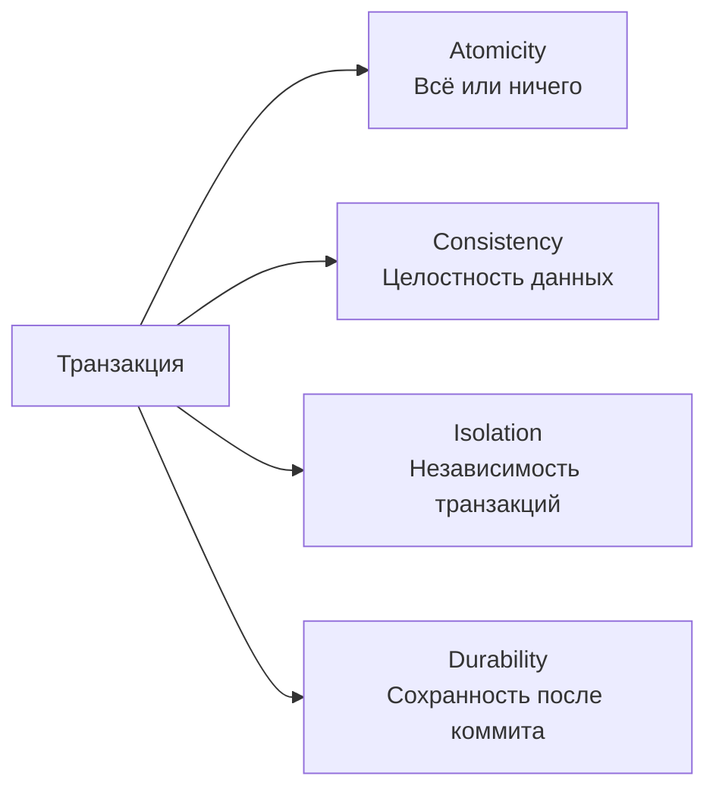
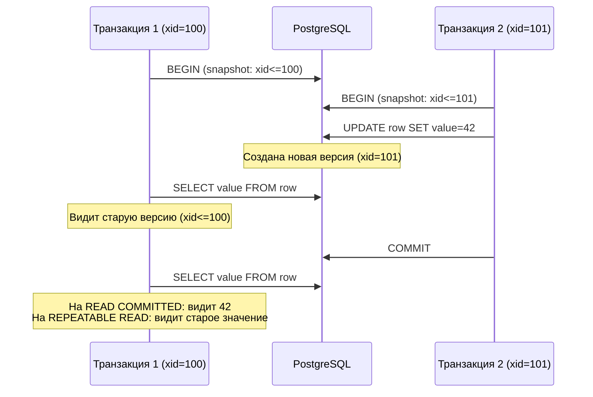
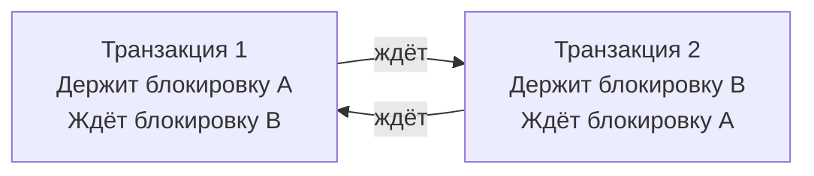
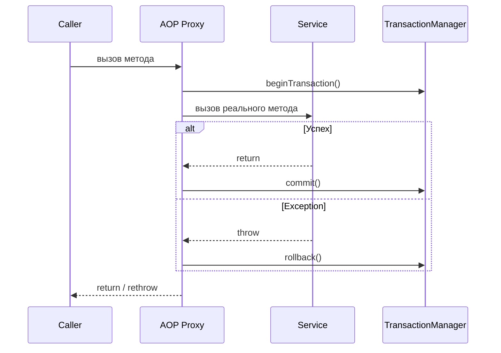
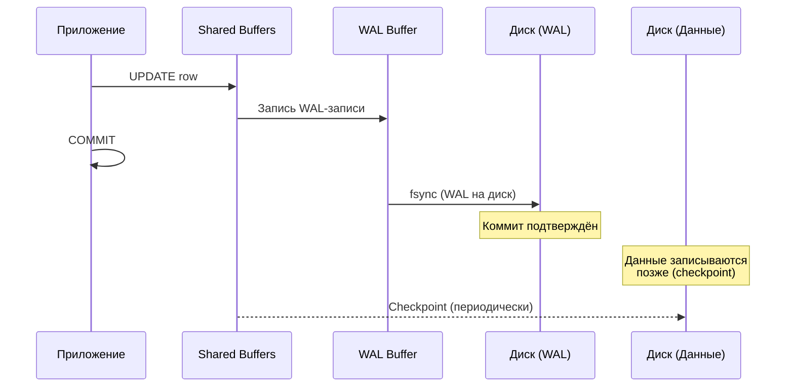
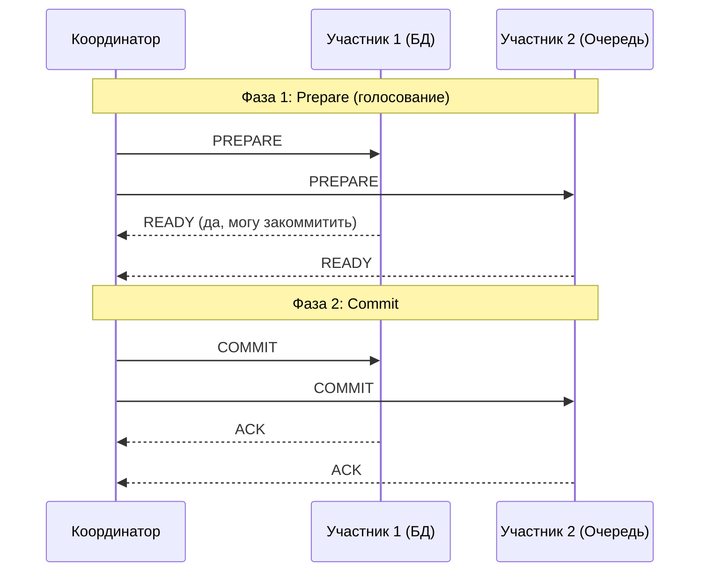
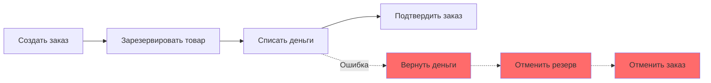

# Вопросы на собеседовании: `Транзакции и уровни изоляции`

Полный набор вопросов по транзакциям в реляционных БД: свойства `ACID`, уровни изоляции, аномалии параллельного доступа, механизмы блокировок, `MVCC`, `Spring @Transactional`, распределённые транзакции и специфика `PostgreSQL`.

**Транзакции** -- фундаментальный механизм обеспечения целостности данных в СУБД. На собеседовании проверяют понимание свойств `ACID`, умение выбрать правильный уровень изоляции, знание аномалий параллельного доступа (`dirty read`, `phantom read`, `lost update`), а также практические навыки работы с `Spring @Transactional`, программным управлением транзакциями и распределёнными транзакциями в микросервисной архитектуре.

## Полезные ссылки

### Официальная документация

- [PostgreSQL: Transaction Isolation](https://www.postgresql.org/docs/current/transaction-iso.html) — уровни изоляции в PostgreSQL
- [PostgreSQL: Write-Ahead Logging (WAL)](https://www.postgresql.org/docs/current/wal-intro.html) — механизм WAL
- [PostgreSQL: MVCC Introduction](https://www.postgresql.org/docs/current/mvcc-intro.html) — многоверсионное управление параллельным доступом
- [Jakarta Persistence Specification](https://jakarta.ee/specifications/persistence/) — спецификация JPA

### Статьи Baeldung

- [Transaction Propagation and Isolation in Spring @Transactional](https://www.baeldung.com/spring-transactional-propagation-isolation) — Spring транзакции: propagation и isolation
- [Programmatic Transaction Management in Spring](https://www.baeldung.com/spring-programmatic-transaction-management) — программное управление транзакциями
- [Optimistic Locking in JPA](https://www.baeldung.com/jpa-optimistic-locking) — оптимистическая блокировка
- [Pessimistic Locking in JPA](https://www.baeldung.com/jpa-pessimistic-locking) — пессимистическая блокировка
- [Transactions Across Microservices](https://www.baeldung.com/transactions-across-microservices) — распределённые транзакции
- [Saga Pattern in Microservices](https://www.baeldung.com/cs/saga-pattern-microservices) — паттерн Saga

## Содержание

- [Полезные ссылки](#полезные-ссылки)
- [See also](#see-also)

**Свойства ACID**
- [Q1. (!) Что такое ACID и зачем эти свойства нужны?](#q1--что-такое-acid-и-зачем-эти-свойства-нужны)
- [Q2. Как обеспечивается атомарность транзакции на уровне СУБД?](#q2-как-обеспечивается-атомарность-транзакции-на-уровне-субд)
- [Q3. Что означает консистентность в контексте ACID?](#q3-что-означает-консистентность-в-контексте-acid)
- [Q4. (!) Чем изоляция отличается от консистентности?](#q4--чем-изоляция-отличается-от-консистентности)
- [Q5. Как СУБД обеспечивает долговечность (Durability)?](#q5-как-субд-обеспечивает-долговечность-durability)

**Уровни изоляции**
- [Q6. (!) Какие уровни изоляции определяет стандарт SQL?](#q6--какие-уровни-изоляции-определяет-стандарт-sql)
- [Q7. (!) Что такое dirty read, non-repeatable read и phantom read?](#q7--что-такое-dirty-read-non-repeatable-read-и-phantom-read)
- [Q8. Что такое lost update и на каком уровне изоляции он возможен?](#q8-что-такое-lost-update-и-на-каком-уровне-изоляции-он-возможен)
- [Q9. (!) Какой уровень изоляции по умолчанию в PostgreSQL и MySQL?](#q9--какой-уровень-изоляции-по-умолчанию-в-postgresql-и-mysql)
- [Q10. Как выбрать уровень изоляции для конкретной задачи?](#q10-как-выбрать-уровень-изоляции-для-конкретной-задачи)

**MVCC**
- [Q11. (!) Что такое MVCC и как он работает?](#q11--что-такое-mvcc-и-как-он-работает)
- [Q12. Как MVCC реализован в PostgreSQL?](#q12-как-mvcc-реализован-в-postgresql)
- [Q13. Что такое VACUUM и зачем он нужен?](#q13-что-такое-vacuum-и-зачем-он-нужен)

**Блокировки и конкурентный доступ**
- [Q14. (!) В чём разница между оптимистической и пессимистической блокировкой?](#q14--в-чём-разница-между-оптимистической-и-пессимистической-блокировкой)
- [Q15. Как реализовать оптимистическую блокировку в JPA?](#q15-как-реализовать-оптимистическую-блокировку-в-jpa)
- [Q16. Как реализовать пессимистическую блокировку в JPA?](#q16-как-реализовать-пессимистическую-блокировку-в-jpa)
- [Q17. (!) Что такое deadlock и как его предотвратить?](#q17--что-такое-deadlock-и-как-его-предотвратить)
- [Q18. Какие типы блокировок существуют в PostgreSQL?](#q18-какие-типы-блокировок-существуют-в-postgresql)

**Spring @Transactional**
- [Q19. (!) Как работает аннотация @Transactional в Spring?](#q19--как-работает-аннотация-transactional-в-spring)
- [Q20. (!) Какие типы propagation существуют и когда их использовать?](#q20--какие-типы-propagation-существуют-и-когда-их-использовать)
- [Q21. Как задать уровень изоляции в @Transactional?](#q21-как-задать-уровень-изоляции-в-transactional)
- [Q22. (!) Как работает rollbackFor и noRollbackFor?](#q22--как-работает-rollbackfor-и-norollbackfor)
- [Q23. Почему @Transactional не работает на private методах?](#q23-почему-transactional-не-работает-на-private-методах)
- [Q24. Что такое self-invocation problem в Spring транзакциях?](#q24-что-такое-self-invocation-problem-в-spring-транзакциях)
- [Q25. (!) Как использовать @Transactional в read-only сценариях?](#q25--как-использовать-transactional-в-read-only-сценариях)

**Программное управление транзакциями**
- [Q26. Как управлять транзакциями программно через TransactionTemplate?](#q26-как-управлять-транзакциями-программно-через-transactiontemplate)
- [Q27. Когда программное управление предпочтительнее декларативного?](#q27-когда-программное-управление-предпочтительнее-декларативного)

**WAL и Savepoints**
- [Q28. (!) Что такое WAL (Write-Ahead Log) и какую роль он играет?](#q28--что-такое-wal-write-ahead-log-и-какую-роль-он-играет)
- [Q29. Что такое savepoint и как его использовать?](#q29-что-такое-savepoint-и-как-его-использовать)

**Распределённые транзакции**
- [Q30. (!) Что такое двухфазный коммит (2PC)?](#q30--что-такое-двухфазный-коммит-2pc)
- [Q31. Что такое XA-транзакции?](#q31-что-такое-xa-транзакции)
- [Q32. (!) Что такое паттерн Saga и чем он отличается от 2PC?](#q32--что-такое-паттерн-saga-и-чем-он-отличается-от-2pc)

**Connection Pooling и транзакции**
- [Q33. Как connection pool взаимодействует с транзакциями?](#q33-как-connection-pool-взаимодействует-с-транзакциями)
- [Q34. Какие проблемы возникают при неправильном управлении соединениями в транзакциях?](#q34-какие-проблемы-возникают-при-неправильном-управлении-соединениями-в-транзакциях)

**PostgreSQL и продвинутые темы**
- [Q35. MVCC в PostgreSQL — vacuum, dead tuples, bloat](#q35-mvcc-в-postgresql--vacuum-dead-tuples-bloat)
- [Q36. Savepoints в транзакциях — SAVEPOINT / ROLLBACK TO](#q36-savepoints-в-транзакциях--savepoint--rollback-to)
- [Q37. Advisory Locks в PostgreSQL — pg_try_advisory_lock](#q37-advisory-locks-в-postgresql--pg_try_advisory_lock)
- [Q38. Distributed transactions: 2PC, XA в Java (Atomikos, Narayana)](#q38-distributed-transactions-2pc-xa-в-java-atomikos-narayana)
- [Q39. Saga: Choreography vs Orchestration — детальное сравнение](#q39-saga-choreography-vs-orchestration--детальное-сравнение)
- [Q40. Optimistic vs Pessimistic Locking в Hibernate — аннотации, примеры](#q40-optimistic-vs-pessimistic-locking-в-hibernate--аннотации-примеры)
- [Q41. Read-your-writes consistency — механизмы обеспечения](#q41-read-your-writes-consistency--механизмы-обеспечения)
- [Q42. Transaction Log (WAL) — для чего используется](#q42-transaction-log-wal--для-чего-используется)

---

## Q1. (!) Что такое ACID и зачем эти свойства нужны?

**ACID** -- набор из четырёх свойств, гарантирующих надёжную обработку транзакций в СУБД:

| Свойство | Описание |
|----------|----------|
| **Atomicity** (атомарность) | Транзакция выполняется целиком или не выполняется вовсе. Частичное применение изменений невозможно |
| **Consistency** (консистентность) | Транзакция переводит БД из одного согласованного состояния в другое. Все ограничения (`constraints`, `triggers`) соблюдаются |
| **Isolation** (изоляция) | Параллельные транзакции не влияют друг на друга так, как если бы они выполнялись последовательно |
| **Durability** (долговечность) | После коммита данные сохраняются даже при сбое системы |



На практике полное соблюдение всех свойств `ACID` стоит дорого с точки зрения производительности, поэтому СУБД предлагают разные **уровни изоляции**, позволяя разработчику выбирать баланс между строгостью и скоростью.

> [!mcq]
> - [x] `ACID` означает `Atomicity`, `Consistency`, `Isolation`, `Durability` — свойства транзакции. | Это классическая расшифровка из учебников по СУБД: четыре гарантии, обеспечивающие надёжную обработку транзакций.
> - [ ] `ACID` означает `Availability`, `Consistency`, `Integrity`, `Durability` — свойства хранилища. | `Availability` относится к теореме `CAP`, а не к транзакциям. `Integrity` не входит в стандарт `ACID`.
> - [ ] `ACID` означает `Atomicity`, `Concurrency`, `Isolation`, `Determinism` — свойства параллелизма. | `Concurrency` и `Determinism` не входят в `ACID`. Concurrency описывает параллельный доступ, но не даёт гарантий сохранности.
> - [ ] `ACID` означает `Atomicity`, `Consistency`, `Indexing`, `Durability` — свойства производительности. | `Indexing` — механизм ускорения поиска, никак не связан с транзакционными гарантиями.

## Q2. Как обеспечивается атомарность транзакции на уровне СУБД?

СУБД использует журнал транзакций (`WAL` / `redo log` / `undo log`) для обеспечения атомарности:

1. **Перед изменением данных** СУБД записывает в журнал, что именно будет изменено
2. **При коммите** -- помечает транзакцию как завершённую в журнале
3. **При откате** (`ROLLBACK`) -- читает журнал и отменяет все изменения транзакции

В `PostgreSQL` используется комбинация `WAL` (для redo) и механизма `MVCC` (старые версии строк сохраняются вместо перезаписи, что по сути является undo).

```sql
BEGIN;
UPDATE accounts SET balance = balance - 100 WHERE id = 1;
UPDATE accounts SET balance = balance + 100 WHERE id = 2;
-- Если здесь произойдёт ошибка, оба UPDATE будут отменены
COMMIT;
```

> [!mcq]
> - [ ] Атомарность обеспечивается сбросом всех грязных страниц на диск при каждом `INSERT`/`UPDATE`. | Немедленный сброс страниц касается `Durability`, а не `Atomicity`. Более того, такое поведение убивало бы производительность.
> - [x] Атомарность обеспечивается журналом транзакций (`WAL`/`undo log`), из которого `ROLLBACK` отменяет изменения. | Запись в журнал до применения даёт СУБД возможность откатить частичные изменения при сбое или явном `ROLLBACK`.
> - [ ] Атомарность обеспечивается блокировками уровня таблицы на время всей транзакции. | Блокировки относятся к изоляции; они не помогают отменить изменения после сбоя.
> - [ ] Атомарность обеспечивается репликацией изменений на standby-узел до коммита. | Репликация повышает долговечность и доступность, но не гарантирует «всё или ничего» внутри одной транзакции.

## Q3. Что означает консистентность в контексте ACID?

**Консистентность** гарантирует, что транзакция переводит БД из одного **валидного состояния** в другое. Это означает:

- Все ограничения целостности (`NOT NULL`, `UNIQUE`, `FOREIGN KEY`, `CHECK`) соблюдены после завершения транзакции
- Все триггеры и каскадные правила отработали корректно
- Бизнес-инварианты не нарушены (например, сумма на счетах не изменилась при переводе)

Важно: консистентность -- это **ответственность приложения и схемы БД**, а не только СУБД. СУБД лишь проверяет объявленные ограничения. Если бизнес-правило не выражено через `constraint`, СУБД не сможет его защитить.

> [!mcq]
> - [ ] Консистентность гарантирует, что параллельные транзакции не видят промежуточные изменения друг друга. | Это описание изоляции, а не консистентности. Изоляция регулирует видимость между транзакциями.
> - [ ] Консистентность гарантирует, что данные выживут после сбоя сервера. | Это описание долговечности (`Durability`), обеспечиваемое `WAL` и `fsync`.
> - [x] Консистентность гарантирует, что транзакция переводит БД из одного валидного состояния в другое с учётом `constraints`. | Это ответственность схемы и приложения: СУБД проверяет объявленные `NOT NULL`, `CHECK`, `FK`; бизнес-инварианты поддерживает код.
> - [ ] Консистентность гарантирует, что все узлы кластера в один момент видят одинаковые данные. | Это `strong consistency` из теоремы `CAP`, относящаяся к распределённым системам, а не к `C` в `ACID`.

## Q4. (!) Чем изоляция отличается от консистентности?

| Аспект | Consistency | Isolation |
|--------|------------|-----------|
| **О чём** | Корректность данных | Видимость изменений между транзакциями |
| **Кто обеспечивает** | Схема БД + приложение | СУБД (уровни изоляции) |
| **Что нарушается** | Ограничения целостности | Возникают аномалии чтения |
| **Настраивается** | Через `constraints` | Через `SET TRANSACTION ISOLATION LEVEL` |

**Консистентность** отвечает на вопрос: «Данные корректны?»
**Изоляция** отвечает на вопрос: «Что видит параллельная транзакция?»

Изоляция -- это инструмент, помогающий обеспечить консистентность в многопользовательском окружении.

> [!mcq]
> - [ ] Консистентность — про видимость чужих изменений, изоляция — про соблюдение `constraints`. | Роли перепутаны: `constraints` обеспечивает консистентность, видимость — изоляция.
> - [ ] Консистентность настраивается через `SET TRANSACTION ISOLATION LEVEL`, изоляция — через `CHECK`/`FK`. | Снова перепутано: уровни изоляции меняют видимость, а `CHECK`/`FK` — инструмент консистентности.
> - [ ] Консистентность и изоляция — синонимы, различие только в учебной терминологии. | Это принципиально разные свойства. Можно иметь строгие `constraints` и слабую изоляцию (и наоборот).
> - [x] Консистентность — про корректность данных (`constraints`, инварианты), изоляция — про видимость изменений между параллельными транзакциями. | Консистентность отвечает на «данные валидны?», изоляция — «что видит другая транзакция?». Изоляция помогает сохранить консистентность при конкурентности.

## Q5. Как СУБД обеспечивает долговечность (Durability)?

Основные механизмы:

1. **Write-Ahead Logging (WAL)** -- перед изменением данных на диске запись фиксируется в журнале. При сбое СУБД восстанавливает данные из журнала
2. **`fsync`** -- принудительная запись буферов на физический диск при коммите
3. **Контрольные точки (`checkpoints`)** -- периодическое сохранение "грязных" страниц из памяти на диск
4. **Репликация** -- копирование данных на другие серверы (дополнительный уровень защиты)

В `PostgreSQL` коммит считается завершённым только после того, как `WAL`-запись записана на диск через `fsync`. Параметр `synchronous_commit` позволяет ослабить эту гарантию ради производительности (с риском потери последних транзакций при сбое).

> [!mcq]
> - [x] Коммит считается завершённым после `fsync` `WAL`-записи на диск; при сбое данные восстанавливаются из журнала. | Классический механизм `Write-Ahead Logging`: сначала журнал на диск, затем `ACK` клиенту. При крэше СУБД проигрывает незаписанные изменения из `WAL`.
> - [ ] Коммит считается завершённым после записи изменений в `shared_buffers` и синхронизации всех реплик. | `shared_buffers` — оперативная память, её содержимое теряется при сбое. Репликация — дополнительный уровень защиты, но не основа `Durability`.
> - [ ] Коммит считается завершённым после того, как autovacuum удалит старые версии строк. | `autovacuum` занимается очисткой dead tuples и не имеет отношения к подтверждению коммита.
> - [ ] Коммит считается завершённым после сброса всех грязных страниц `heap` на физический диск. | Страницы данных сбрасываются при checkpoint, а не при коммите. Коммит подтверждается раньше по записи `WAL`.

## Q6. (!) Какие уровни изоляции определяет стандарт SQL?

Стандарт SQL определяет четыре уровня изоляции, от наименее строгого к наиболее строгому:

| Уровень | Dirty Read | Non-Repeatable Read | Phantom Read |
|---------|------------|--------------------:|-------------:|
| `READ UNCOMMITTED` | Возможен | Возможен | Возможен |
| `READ COMMITTED` | Невозможен | Возможен | Возможен |
| `REPEATABLE READ` | Невозможен | Невозможен | Возможен |
| `SERIALIZABLE` | Невозможен | Невозможен | Невозможен |


Важная деталь: `PostgreSQL` не реализует `READ UNCOMMITTED` -- при его установке фактически используется `READ COMMITTED`. Также `REPEATABLE READ` в `PostgreSQL` защищает и от `phantom read` (благодаря `MVCC`), что строже стандарта.

> [!mcq]
> - [ ] `READ UNCOMMITTED`, `READ COMMITTED`, `SNAPSHOT`, `SERIALIZABLE`. | `SNAPSHOT` — уровень из `SQL Server`/`Oracle`, не входит в стандарт SQL-92.
> - [x] `READ UNCOMMITTED`, `READ COMMITTED`, `REPEATABLE READ`, `SERIALIZABLE`. | Это канонический список из SQL-92: от минимальной к максимальной изоляции, каждый следующий уровень устраняет одну аномалию.
> - [ ] `READ COMMITTED`, `REPEATABLE READ`, `SNAPSHOT`, `STRICT SERIALIZABLE`. | `STRICT SERIALIZABLE` и `SNAPSHOT` — расширения из распределённых СУБД, их нет в SQL-стандарте.
> - [ ] `NO ISOLATION`, `READ COMMITTED`, `SNAPSHOT`, `LINEARIZABLE`. | `NO ISOLATION` и `LINEARIZABLE` не определены стандартом SQL; `LINEARIZABLE` — термин распределённых систем.

## Q7. (!) Что такое dirty read, non-repeatable read и phantom read?

### Dirty Read (грязное чтение)

Транзакция читает данные, изменённые другой **незакоммиченной** транзакцией. Если та откатится, прочитанные данные окажутся невалидными.

```
Транзакция A:  UPDATE accounts SET balance = 500 WHERE id = 1;  (не коммитит)
Транзакция B:  SELECT balance FROM accounts WHERE id = 1;  -- читает 500 (dirty read!)
Транзакция A:  ROLLBACK;  -- баланс возвращается к исходному
```

### Non-Repeatable Read (неповторяемое чтение)

Транзакция повторно читает ту же строку и получает **другое значение**, потому что другая транзакция закоммитила изменение между двумя чтениями.

```
Транзакция A:  SELECT balance FROM accounts WHERE id = 1;  -- 1000
Транзакция B:  UPDATE accounts SET balance = 500 WHERE id = 1; COMMIT;
Транзакция A:  SELECT balance FROM accounts WHERE id = 1;  -- 500 (non-repeatable read!)
```

### Phantom Read (фантомное чтение)

Транзакция повторно выполняет запрос с условием `WHERE` и получает **другой набор строк**, потому что другая транзакция вставила или удалила строки, подходящие под условие.

```
Транзакция A:  SELECT COUNT(*) FROM orders WHERE status = 'NEW';  -- 5
Транзакция B:  INSERT INTO orders (status) VALUES ('NEW'); COMMIT;
Транзакция A:  SELECT COUNT(*) FROM orders WHERE status = 'NEW';  -- 6 (phantom read!)
```

> [!mcq]
> - [ ] `Dirty read` — это чтение одного и того же ряда с разными значениями внутри транзакции. | Это описание `non-repeatable read`. `Dirty read` — чтение незакоммиченных данных.
> - [ ] `Dirty read` — это появление новых строк в результате повторного запроса с `WHERE`. | Это описание `phantom read`. При `dirty read` читаются именно изменённые, но не закоммиченные значения.
> - [x] `Dirty read` — это чтение данных, изменённых другой транзакцией, которая ещё не закоммичена и может откатиться. | Классическое определение: читатель видит «грязные» данные, которые могут исчезнуть после `ROLLBACK`. Возможен только на уровне `READ UNCOMMITTED`.
> - [ ] `Dirty read` — это чтение устаревшей версии строки из `MVCC`-снимка. | Чтение старой версии в `MVCC` — это нормальная работа изоляции, а не аномалия. Строка при этом всегда закоммичена.

> [!mcq]
> - [ ] `Non-repeatable read` предотвращается на уровне `READ COMMITTED`. | На `READ COMMITTED` другая транзакция может закоммитить изменение между двумя чтениями. Нужен минимум `REPEATABLE READ`.
> - [ ] `Phantom read` предотвращается на уровне `READ COMMITTED`. | На `READ COMMITTED` новые строки от других транзакций видны при повторном `SELECT`. Нужен `SERIALIZABLE` (или `REPEATABLE READ` в `PostgreSQL`).
> - [ ] `Phantom read` — это чтение удалённой строки, которая уже не существует в БД. | Это не phantom. Phantom — появление или исчезновение строк в наборе результата по условию `WHERE` при повторном запросе.
> - [x] `Phantom read` возникает, когда повторный запрос с `WHERE` возвращает другой набор строк из-за `INSERT`/`DELETE` в другой транзакции. | Ключевое отличие от `non-repeatable read`: меняется не значение в уже прочитанной строке, а сам набор строк. Стандарт SQL допускает phantom на `REPEATABLE READ`.

## Q8. Что такое lost update и на каком уровне изоляции он возможен?

**Lost update** (потерянное обновление) -- ситуация, когда две транзакции читают одно значение, обе его модифицируют и записывают обратно, при этом изменение одной из транзакций теряется.

```
Транзакция A:  SELECT balance FROM accounts WHERE id = 1;  -- 1000
Транзакция B:  SELECT balance FROM accounts WHERE id = 1;  -- 1000
Транзакция A:  UPDATE accounts SET balance = 1000 + 100 WHERE id = 1; COMMIT;  -- 1100
Транзакция B:  UPDATE accounts SET balance = 1000 - 200 WHERE id = 1; COMMIT;  -- 800
-- Ожидали 900, получили 800. Обновление A потеряно!
```

`Lost update` возможен на уровнях `READ UNCOMMITTED` и `READ COMMITTED`. Начиная с `REPEATABLE READ` (в `PostgreSQL`) -- транзакция B получит ошибку сериализации и должна будет повторить операцию.

**Решения:**
- Использовать `REPEATABLE READ` или `SERIALIZABLE`
- Атомарное обновление: `UPDATE accounts SET balance = balance + 100`
- Оптимистическая блокировка с `@Version`
- Пессимистическая блокировка: `SELECT ... FOR UPDATE`

> [!mcq]
> - [x] `Lost update` возникает, когда две транзакции читают одно значение, обе его модифицируют и записывают обратно — изменение одной теряется. | Классическая аномалия «read-modify-write race». На `READ COMMITTED` возможна; устраняется через `REPEATABLE READ`+retry, `FOR UPDATE` или атомарный `UPDATE ... SET col = col + ?`.
> - [ ] `Lost update` возникает, когда транзакция читает данные, которые другая транзакция ещё не закоммитила. | Это описание `dirty read`, а не потерянного обновления.
> - [ ] `Lost update` возникает только на уровне `SERIALIZABLE` при конкурентных `INSERT`. | На `SERIALIZABLE` потерянные обновления невозможны — такие конфликты вызовут ошибку сериализации.
> - [ ] `Lost update` возникает при откате транзакции после коммита соседней транзакции. | `ROLLBACK` после `COMMIT` соседа не приводит к потере обновления — каждая транзакция работает с изолированным снимком до коммита.

## Q9. (!) Какой уровень изоляции по умолчанию в PostgreSQL и MySQL?

| СУБД | Уровень по умолчанию | Особенности |
|------|---------------------|-------------|
| `PostgreSQL` | `READ COMMITTED` | `MVCC`-реализация; `READ UNCOMMITTED` фактически = `READ COMMITTED`; `REPEATABLE READ` защищает от phantom read |
| `MySQL` (InnoDB) | `REPEATABLE READ` | Использует `MVCC` + `next-key locking`; phantom read частично предотвращён через gap locks |
| `Oracle` | `READ COMMITTED` | `MVCC` через undo segments; поддерживает только `READ COMMITTED` и `SERIALIZABLE` |
| `SQL Server` | `READ COMMITTED` | По умолчанию использует блокировки, но можно включить `READ_COMMITTED_SNAPSHOT` для `MVCC` |

Установка уровня изоляции в SQL:

```sql
-- Для текущей транзакции
SET TRANSACTION ISOLATION LEVEL REPEATABLE READ;
BEGIN;
-- ...
COMMIT;

-- Для всей сессии (PostgreSQL)
SET SESSION CHARACTERISTICS AS TRANSACTION ISOLATION LEVEL SERIALIZABLE;
```

> [!mcq]
> - [ ] `PostgreSQL` по умолчанию `SERIALIZABLE`, `MySQL` по умолчанию `READ COMMITTED`. | Перепутаны: `SERIALIZABLE` нигде не default по умолчанию из-за стоимости; `MySQL` InnoDB использует `REPEATABLE READ`.
> - [x] `PostgreSQL` по умолчанию `READ COMMITTED`, `MySQL` (InnoDB) по умолчанию `REPEATABLE READ`. | Это факт: PostgreSQL выбирает баланс производительности (`READ COMMITTED`), MySQL исторически ставит более строгий `REPEATABLE READ` с `next-key locking`.
> - [ ] Оба используют `READ UNCOMMITTED` как default для максимальной производительности. | `READ UNCOMMITTED` никогда не default — допускает `dirty read`, что почти всегда нежелательно.
> - [ ] `PostgreSQL` использует `REPEATABLE READ`, `MySQL` — `SERIALIZABLE` для финансовых приложений. | У обеих СУБД default выбран универсально, а не под финансовый контекст. В PostgreSQL default именно `READ COMMITTED`.

## Q10. Как выбрать уровень изоляции для конкретной задачи?

| Сценарий | Рекомендация | Обоснование |
|----------|-------------|-------------|
| Аналитические отчёты | `REPEATABLE READ` | Консистентный снимок данных на время отчёта |
| OLTP, высокая нагрузка | `READ COMMITTED` | Баланс между изоляцией и производительностью |
| Финансовые операции | `SERIALIZABLE` или `REPEATABLE READ` + явные блокировки | Недопустимы аномалии |
| Чтение справочников | `READ COMMITTED` | Данные редко меняются, строгая изоляция не нужна |
| Массовый импорт | `READ COMMITTED` | Минимум блокировок, максимум throughput |

Правило: начинайте с `READ COMMITTED` (default в `PostgreSQL`) и повышайте уровень только там, где это действительно необходимо. Более строгий уровень = больше конфликтов, больше retry, ниже throughput.

> [!mcq]
> - [ ] Всегда выбирать `SERIALIZABLE` — он безопаснее всех и не требует дополнительных проверок. | `SERIALIZABLE` в PostgreSQL даёт ошибки сериализации, требующие retry, и снижает throughput. Универсально его не ставят.
> - [ ] Всегда выбирать `READ UNCOMMITTED` — он самый быстрый на OLTP. | В PostgreSQL он эквивалентен `READ COMMITTED`, а в других СУБД допускает `dirty read` — неприемлемо почти везде.
> - [x] Начинать с `READ COMMITTED` как дефолта и повышать уровень только на участках, где критичны аномалии (аналитика, финансы). | Это практическое правило: `READ COMMITTED` даёт лучший баланс; более строгие уровни включаются точечно для конкретных кейсов.
> - [ ] Выбирать уровень автоматически по количеству параллельных подключений в пуле. | Уровень изоляции определяется семантикой бизнес-операции, а не размером пула. Автоматика здесь неуместна.

## Q11. (!) Что такое MVCC и как он работает?

**MVCC** (`Multi-Version Concurrency Control`) -- механизм управления параллельным доступом, при котором каждая транзакция видит **снимок (snapshot)** данных на определённый момент времени.

Ключевые принципы:
- **Читатели не блокируют писателей**, писатели не блокируют читателей
- При `UPDATE` создаётся **новая версия строки**, старая остаётся до тех пор, пока к ней обращаются другие транзакции
- `DELETE` не удаляет строку физически, а помечает её как невидимую для новых транзакций
- Каждая транзакция имеет свой `xid` (transaction ID) и видит только строки, созданные транзакциями с `xid` <= своего снимка



> [!mcq]
> - [ ] `MVCC` — это механизм, при котором все транзакции блокируют одни и те же строки через `row lock`. | Это описание locking-based concurrency control, противоположного `MVCC`. В MVCC блокировок на чтение нет.
> - [ ] `MVCC` — это автоматическая шардинг данных по версиям для параллельных запросов. | Шардинг и MVCC — разные вещи. MVCC — версионирование строк внутри одной таблицы/узла, а не распределение данных.
> - [ ] `MVCC` — это механизм сжатия старых версий строк в отдельный архив на холодном хранилище. | MVCC не перемещает данные на холодное хранилище; старые версии удаляются через `VACUUM`.
> - [x] `MVCC` — это механизм, при котором каждая транзакция видит снимок данных на момент её старта; читатели не блокируют писателей и наоборот. | Ключевое свойство: параллельные транзакции работают с разными версиями одной строки, что устраняет блокировки на чтение.

## Q12. Как MVCC реализован в PostgreSQL?

`PostgreSQL` хранит **все версии строк** (tuples) в одной таблице. Каждая версия имеет системные столбцы:

| Столбец | Описание |
|---------|----------|
| `xmin` | ID транзакции, создавшей эту версию |
| `xmax` | ID транзакции, удалившей/обновившей эту версию (0, если строка актуальна) |
| `ctid` | Физическое расположение строки на диске |

Как работает видимость:
- Строка **видима**, если `xmin` закоммичена и < текущего снимка, а `xmax` = 0 или не закоммичена
- При `UPDATE` старая строка получает `xmax` = текущий `xid`, создаётся новая строка с `xmin` = текущий `xid`
- При `DELETE` строка получает `xmax` = текущий `xid`

```sql
-- Посмотреть системные столбцы
SELECT xmin, xmax, ctid, * FROM accounts WHERE id = 1;
```

Особенности: в отличие от `Oracle`/`MySQL`, которые хранят undo-данные отдельно, `PostgreSQL` хранит все версии in-place, что приводит к необходимости `VACUUM`.

> [!mcq]
> - [x] В PostgreSQL каждая версия строки хранится в таблице с системными полями `xmin`/`xmax`, определяющими видимость; старые версии очищает `VACUUM`. | In-place versioning — принципиальная особенность PostgreSQL. `xmin` — id создавшей транзакции, `xmax` — id удалившей; видимость считается по активному снимку.
> - [ ] В PostgreSQL старые версии хранятся в отдельном `undo tablespace`, и их удаляет специальный процесс `undo_writer`. | Это модель Oracle и MySQL InnoDB. PostgreSQL отличается тем, что версии хранятся прямо в heap-файле таблицы.
> - [ ] В PostgreSQL MVCC реализован через rollback-сегменты, индексируемые по `transaction_id`. | Rollback-сегменты — терминология Oracle. PostgreSQL не использует rollback segments.
> - [ ] В PostgreSQL MVCC реализован через теневые копии таблицы (`shadow paging`), которые активируются при коммите. | Shadow paging — устаревшая техника, не используемая в PostgreSQL. В PG используется MVCC + WAL.

## Q13. Что такое VACUUM и зачем он нужен?

`VACUUM` -- процесс очистки мёртвых (dead) версий строк, которые больше не видны ни одной транзакции.

**Зачем нужен:**
- Освобождение места, занятого мёртвыми tuple-ами
- Предотвращение "bloat" (раздувания) таблиц и индексов
- Обновление статистики для планировщика запросов
- Предотвращение `transaction ID wraparound` -- критической проблемы, при которой `xid` переполняется (2^31 транзакций)

**Виды:**

| Вид | Описание |
|-----|----------|
| `VACUUM` | Помечает мёртвые tuple как доступные для повторного использования, но не возвращает место ОС |
| `VACUUM FULL` | Полностью перестраивает таблицу, возвращает место ОС. Требует эксклюзивную блокировку! |
| `VACUUM ANALYZE` | `VACUUM` + обновление статистики |
| `autovacuum` | Фоновый процесс, автоматически запускает `VACUUM` для таблиц с большим количеством изменений |

```sql
-- Ручной запуск
VACUUM VERBOSE accounts;

-- Проверка состояния autovacuum
SELECT relname, n_dead_tup, last_autovacuum 
FROM pg_stat_user_tables 
WHERE n_dead_tup > 1000;
```

> [!mcq]
> - [ ] `VACUUM` создаёт полную резервную копию таблицы для point-in-time recovery. | Резервные копии — задача `pg_basebackup` и PITR через `WAL`. `VACUUM` очищает мёртвые tuples, но не создаёт backup.
> - [x] `VACUUM` очищает мёртвые версии строк, предотвращает bloat и `transaction ID wraparound`, обновляет статистику. | Это точный набор функций: освобождение места, защита от переполнения xid, поддержание планировщика в актуальном состоянии.
> - [ ] `VACUUM` ребилдит индексы и сбрасывает кеш `shared_buffers`. | Ребилд индексов делает `REINDEX`, а сброс кеша — это не функция `VACUUM`. `VACUUM` работает с heap и visibility map.
> - [ ] `VACUUM` выполняет `fsync` `WAL`-журнала перед подтверждением коммита. | `fsync` `WAL` — часть процесса коммита, а не задача `VACUUM`. Эти подсистемы не пересекаются.

## Q14. (!) В чём разница между оптимистической и пессимистической блокировкой?

| Аспект | Оптимистическая | Пессимистическая |
|--------|----------------|-----------------|
| **Принцип** | Конфликты редки -- проверяем при записи | Конфликты часты -- блокируем при чтении |
| **Механизм** | Версионирование (`@Version`) | `SELECT ... FOR UPDATE` |
| **Блокировка БД** | Нет (на уровне приложения) | Да (row-level lock) |
| **Deadlock** | Невозможен | Возможен |
| **Производительность** | Лучше при малом количестве конфликтов | Лучше при частых конфликтах |
| **При конфликте** | `OptimisticLockException` -- retry | Транзакция ждёт снятия блокировки |

**Когда использовать оптимистическую:**
- Чтение преобладает над записью
- Конфликты редки (< 5% операций)
- Короткие транзакции

**Когда использовать пессимистическую:**
- Частые конфликты записи
- Критические данные (финансы, инвентарь)
- Длинные транзакции с обязательным завершением

> [!mcq]
> - [ ] Оптимистическая блокировка использует `SELECT ... FOR UPDATE`, пессимистическая — поле `@Version`. | Всё наоборот: `@Version` — это оптимистика, `FOR UPDATE` — пессимистика.
> - [ ] Обе блокировки работают идентично, но оптимистическая дешевле на уровне CPU. | У них принципиально разное поведение: одна проверяет версию на коммите, другая удерживает row lock в БД.
> - [x] Оптимистическая проверяет версию при коммите (без row lock в БД), пессимистическая удерживает row lock через `SELECT ... FOR UPDATE` с момента чтения. | Ключевое различие: когда и как фиксируется конфликт. Оптимистика бросает `OptimisticLockException` на коммите; пессимистика заставляет соседа ждать.
> - [ ] Оптимистическая блокировка возможна только в NoSQL, пессимистическая — только в реляционных БД. | Обе доступны в реляционных БД через JPA. Многие NoSQL (например, Cassandra) поддерживают оптимистические CAS-операции.

## Q15. Как реализовать оптимистическую блокировку в JPA?

Оптимистическая блокировка в `JPA` реализуется через поле с аннотацией `@Version`:

```java
@Entity
public class Account {
    @Id
    private Long id;
    
    @Version
    private Long version;
    
    private BigDecimal balance;
}
```

При каждом `UPDATE` `JPA` автоматически добавляет проверку версии:

```sql
UPDATE account SET balance = ?, version = version + 1 
WHERE id = ? AND version = ?
```

Если версия не совпадает (строку изменила другая транзакция), выбрасывается `OptimisticLockException`.

Обработка конфликта:

```java
@Service
public class AccountService {
    
    @Retryable(value = OptimisticLockException.class, maxAttempts = 3)
    @Transactional
    public void transfer(Long fromId, Long toId, BigDecimal amount) {
        Account from = accountRepository.findById(fromId).orElseThrow();
        Account to = accountRepository.findById(toId).orElseThrow();
        from.setBalance(from.getBalance().subtract(amount));
        to.setBalance(to.getBalance().add(amount));
        // При конфликте версий -- автоматический retry
    }
}
```

Типы `LockModeType` для оптимистической блокировки:
- `OPTIMISTIC` (= `READ`) -- проверка версии при коммите
- `OPTIMISTIC_FORCE_INCREMENT` (= `WRITE`) -- инкремент версии даже при чтении

> [!mcq]
> - [ ] Добавить поле с `@Lock(LockModeType.PESSIMISTIC_WRITE)` в сущность — JPA будет сравнивать lock mode при коммите. | `@Lock` — это аннотация на методе репозитория/запросе, а не на поле. И она относится к пессимистической блокировке.
> - [ ] Добавить `@Column(unique = true)` на нужное поле — JPA использует его как ключ оптимистической блокировки. | `unique = true` — это уникальный индекс, а не механизм версионирования. Оптимистика нуждается в монотонно растущем поле.
> - [ ] Вручную вызывать `entityManager.lock(entity, LockModeType.OPTIMISTIC)` перед каждым `persist`. | Это возможно, но нужно только для особых кейсов. Базовая реализация требует лишь поля `@Version` — Hibernate сам генерирует проверку.
> - [x] Добавить поле с аннотацией `@Version` — Hibernate автоматически добавит `WHERE version = ?` в `UPDATE` и инкремент версии. | Это стандартный способ в JPA: одно поле `@Version` (`Long`/`Integer`/`Timestamp`), и при конфликте бросается `OptimisticLockException`.

## Q16. Как реализовать пессимистическую блокировку в JPA?

Пессимистическая блокировка в `JPA` использует `LockModeType`:

```java
// Через EntityManager
Account account = em.find(Account.class, id, LockModeType.PESSIMISTIC_WRITE);

// Через Spring Data JPA
@Lock(LockModeType.PESSIMISTIC_WRITE)
@Query("SELECT a FROM Account a WHERE a.id = :id")
Optional<Account> findByIdForUpdate(@Param("id") Long id);
```

Генерируемый SQL:

```sql
SELECT * FROM account WHERE id = ? FOR UPDATE;
```

Типы пессимистической блокировки:

| LockModeType | SQL | Описание |
|-------------|-----|----------|
| `PESSIMISTIC_READ` | `FOR SHARE` | Разрешает параллельное чтение, блокирует запись |
| `PESSIMISTIC_WRITE` | `FOR UPDATE` | Блокирует и чтение, и запись |
| `PESSIMISTIC_FORCE_INCREMENT` | `FOR UPDATE` + version++ | Блокировка + инкремент версии |

Рекомендуется устанавливать таймаут блокировки:

```java
@QueryHints({@QueryHint(name = "jakarta.persistence.lock.timeout", value = "3000")})
@Lock(LockModeType.PESSIMISTIC_WRITE)
Optional<Account> findByIdForUpdate(Long id);
```

> [!mcq]
> - [x] `@Lock(LockModeType.PESSIMISTIC_WRITE)` на методе репозитория/запросе генерирует `SELECT ... FOR UPDATE`. | Это стандартный способ в Spring Data JPA: аннотация транслируется Hibernate в row lock на уровне БД.
> - [ ] `@Version` в сущности и `save()` с ручной проверкой в коде приложения. | Это оптимистическая блокировка: row lock в БД не создаётся, конфликт ловится только на коммите.
> - [ ] `@Transactional(isolation = SERIALIZABLE)` автоматически превращает любой `SELECT` в пессимистический. | `SERIALIZABLE` не добавляет `FOR UPDATE` к простым `SELECT`; он меняет правила видимости и детекции конфликтов.
> - [ ] `synchronized` на методе сервиса — JVM транслирует его в пессимистическую блокировку БД. | `synchronized` — это lock на уровне JVM, не связанный с БД. Он не работает между разными нодами приложения.

## Q17. (!) Что такое deadlock и как его предотвратить?

**Deadlock** (взаимная блокировка) -- ситуация, когда две или более транзакций ожидают освобождения ресурсов, заблокированных друг другом, и ни одна не может продолжить выполнение.



**Пример:**

```sql
-- Транзакция 1
BEGIN;
UPDATE accounts SET balance = balance - 100 WHERE id = 1;  -- блокирует строку 1
UPDATE accounts SET balance = balance + 100 WHERE id = 2;  -- ждёт строку 2

-- Транзакция 2
BEGIN;
UPDATE accounts SET balance = balance - 50 WHERE id = 2;   -- блокирует строку 2
UPDATE accounts SET balance = balance + 50 WHERE id = 1;   -- ждёт строку 1 → DEADLOCK!
```

**Способы предотвращения:**

1. **Единый порядок блокировки** -- всегда блокировать ресурсы в одном порядке (например, по возрастанию `id`)
2. **Короткие транзакции** -- минимизировать время удержания блокировок
3. **Таймауты** -- `lock_timeout` в PostgreSQL, `@QueryHint(lock.timeout)` в JPA
4. **Оптимистическая блокировка** -- вместо пессимистической, где это допустимо
5. **`NOWAIT`** -- `SELECT ... FOR UPDATE NOWAIT` -- немедленная ошибка вместо ожидания

`PostgreSQL` автоматически обнаруживает deadlock (через `deadlock_timeout`, по умолчанию 1 секунда) и откатывает одну из транзакций с ошибкой.

> [!mcq]
> - [ ] Предотвращать deadlock нужно отключением всех блокировок в транзакциях через `LOCK TIMEOUT = 0`. | `LOCK TIMEOUT = 0` означает бесконечное ожидание, что, наоборот, усугубляет проблему. Блокировки нельзя просто «выключить».
> - [x] Предотвращать deadlock нужно единым порядком захвата блокировок, короткими транзакциями и использованием `lock_timeout`/`NOWAIT`. | Это практический набор мер: упорядоченный захват ресурсов исключает цикл ожидания, таймауты ограничивают время зависания.
> - [ ] Deadlock полностью предотвращается использованием уровня изоляции `REPEATABLE READ` вместо `READ COMMITTED`. | Уровень изоляции не защищает от deadlock; он регулирует видимость данных, а не порядок блокировок.
> - [ ] Deadlock надо игнорировать, так как PostgreSQL сам перезапускает откатанные транзакции. | PostgreSQL откатывает одну транзакцию, но retry — ответственность клиента. Приложение обязано обработать ошибку и повторить.

## Q18. Какие типы блокировок существуют в PostgreSQL?

`PostgreSQL` поддерживает несколько уровней блокировок:

**Table-level locks (блокировки таблиц):**

| Режим | Конфликтует с | Типичная операция |
|-------|---------------|-------------------|
| `ACCESS SHARE` | `ACCESS EXCLUSIVE` | `SELECT` |
| `ROW SHARE` | `EXCLUSIVE`, `ACCESS EXCLUSIVE` | `SELECT FOR UPDATE` |
| `ROW EXCLUSIVE` | `SHARE`, `SHARE ROW EXCLUSIVE`, `EXCLUSIVE`, `ACCESS EXCLUSIVE` | `UPDATE`, `DELETE`, `INSERT` |
| `SHARE` | `ROW EXCLUSIVE`, `SHARE UPDATE EXCLUSIVE`, `SHARE ROW EXCLUSIVE`, `EXCLUSIVE`, `ACCESS EXCLUSIVE` | `CREATE INDEX` |
| `ACCESS EXCLUSIVE` | Все | `ALTER TABLE`, `DROP TABLE`, `VACUUM FULL` |

**Row-level locks (блокировки строк):**

| Режим | SQL | Описание |
|-------|-----|----------|
| `FOR UPDATE` | `SELECT ... FOR UPDATE` | Эксклюзивная блокировка строки |
| `FOR NO KEY UPDATE` | `SELECT ... FOR NO KEY UPDATE` | Блокировка без блокирования FK-ссылок |
| `FOR SHARE` | `SELECT ... FOR SHARE` | Разделяемая блокировка |
| `FOR KEY SHARE` | `SELECT ... FOR KEY SHARE` | Разделяемая блокировка только ключа |

```sql
-- Просмотр текущих блокировок
SELECT pid, locktype, relation::regclass, mode, granted
FROM pg_locks
WHERE NOT granted;
```

> [!mcq]
> - [ ] `SELECT` в PostgreSQL захватывает режим `ACCESS EXCLUSIVE` на всю таблицу. | `ACCESS EXCLUSIVE` берут `ALTER TABLE`/`DROP TABLE`/`VACUUM FULL`. Простой `SELECT` берёт `ACCESS SHARE`.
> - [ ] `UPDATE` в PostgreSQL захватывает режим `SHARE` на таблицу. | `UPDATE`/`DELETE`/`INSERT` используют `ROW EXCLUSIVE`. Режим `SHARE` берёт `CREATE INDEX`.
> - [x] В PostgreSQL есть table-level locks (от `ACCESS SHARE` до `ACCESS EXCLUSIVE`) и row-level locks (`FOR UPDATE`, `FOR SHARE`, `FOR NO KEY UPDATE`, `FOR KEY SHARE`). | Иерархия двухуровневая: таблицы и строки. Просматривать активные блокировки можно в `pg_locks`.
> - [ ] Row-level locks выдаются только через явный `LOCK TABLE ... IN ROW EXCLUSIVE MODE`. | Row-level locks выдаются автоматически при `UPDATE`/`DELETE`/`SELECT FOR UPDATE`. `LOCK TABLE` захватывает именно table-level lock.

## Q19. (!) Как работает аннотация @Transactional в Spring?

`@Transactional` использует **AOP-прокси** для управления транзакциями. Spring создаёт прокси-обёртку вокруг бина, которая перехватывает вызовы методов:



Ключевые атрибуты `@Transactional`:

```java
@Transactional(
    propagation = Propagation.REQUIRED,      // поведение вложенных транзакций
    isolation = Isolation.DEFAULT,            // уровень изоляции
    timeout = 30,                             // таймаут в секундах
    readOnly = false,                         // оптимизация для read-only
    rollbackFor = Exception.class,            // откат при checked exceptions
    noRollbackFor = BusinessException.class   // не откатывать при этих исключениях
)
public void performOperation() { ... }
```

Важно помнить:
- Прокси работает только при **внешних вызовах** (через бин, а не `this.method()`)
- По умолчанию откат происходит только при **unchecked exceptions** (`RuntimeException`, `Error`)
- Используется `JDK Dynamic Proxy` (интерфейс) или `CGLIB` (класс)

> [!mcq]
> - [ ] `@Transactional` переписывает байткод класса при компиляции, добавляя `begin`/`commit` напрямую в метод. | Это AspectJ compile-time weaving, который по умолчанию Spring не использует. Стандартная модель — runtime AOP-прокси.
> - [ ] `@Transactional` создаёт отдельный поток для выполнения метода и коммитит в отдельной транзакции. | Это не про транзакции, а про асинхронность (`@Async`). `@Transactional` работает в том же потоке через ThreadLocal.
> - [ ] `@Transactional` напрямую обращается к JDBC-драйверу, минуя пул соединений. | Менеджер транзакций берёт соединение именно из пула через `DataSource` — пул — критичная часть архитектуры.
> - [x] `@Transactional` работает через AOP-прокси (`JDK Dynamic Proxy` или `CGLIB`): прокси открывает транзакцию перед методом и коммитит/откатывает после. | Классическая модель Spring AOP: прокси-обёртка перехватывает вызов извне, делегирует менеджеру транзакций. Self-invocation не работает именно из-за этого.

## Q20. (!) Какие типы propagation существуют и когда их использовать?

| Propagation | Описание | Типичный сценарий |
|-------------|----------|-------------------|
| `REQUIRED` | Использует текущую транзакцию или создаёт новую | По умолчанию. Большинство бизнес-методов |
| `REQUIRES_NEW` | Всегда создаёт новую транзакцию, текущую приостанавливает | Аудит-лог, который должен сохраниться даже при откате основной транзакции |
| `NESTED` | Создаёт вложенную транзакцию (`SAVEPOINT`) | Частичный откат в рамках основной транзакции |
| `SUPPORTS` | Использует текущую транзакцию, если есть; иначе работает без транзакции | Методы чтения, которые могут работать и без транзакции |
| `NOT_SUPPORTED` | Приостанавливает текущую транзакцию и работает без неё | Вызов внешнего API, который не должен быть в транзакции |
| `MANDATORY` | Требует наличия текущей транзакции, иначе выбрасывает исключение | Методы, которые нельзя вызывать вне транзакции |
| `NEVER` | Выбрасывает исключение, если транзакция существует | Операции, несовместимые с транзакциями |

```java
@Service
public class OrderService {

    @Transactional(propagation = Propagation.REQUIRED)
    public void createOrder(Order order) {
        orderRepository.save(order);
        // Аудит сохранится даже если createOrder откатится
        auditService.log("Order created: " + order.getId());
    }
}

@Service
public class AuditService {

    @Transactional(propagation = Propagation.REQUIRES_NEW)
    public void log(String message) {
        auditRepository.save(new AuditEntry(message));
    }
}
```

> [!mcq]
> - [x] `REQUIRED` использует текущую транзакцию, если она есть, иначе создаёт новую; это дефолт для большинства бизнес-методов. | Это поведение по умолчанию и самое распространённое. Оно позволяет методам безопасно вызывать друг друга в рамках одной транзакции.
> - [ ] `REQUIRED` всегда создаёт новую транзакцию, приостанавливая текущую. | Это поведение `REQUIRES_NEW`, а не `REQUIRED`. `REQUIRED` не приостанавливает существующую транзакцию.
> - [ ] `REQUIRED` выбрасывает исключение, если транзакция уже открыта. | Это поведение `NEVER`. `REQUIRED` присоединяется к существующей транзакции, а не отвергает её.
> - [ ] `REQUIRED` работает только без существующей транзакции и выбрасывает исключение, если её нет. | Это комбинация `NEVER` + `MANDATORY`, что семантически бессмысленно. `REQUIRED` — самый гибкий тип.

> [!mcq]
> - [ ] `REQUIRES_NEW` создаёт вложенную транзакцию через `SAVEPOINT`, чтобы можно было откатить только её часть. | Это поведение `NESTED`. `REQUIRES_NEW` использует отдельную физическую транзакцию и соединение.
> - [x] `REQUIRES_NEW` приостанавливает текущую транзакцию, создаёт физически отдельную с собственным соединением и коммитит её независимо. | Это точное поведение. Типично для аудита: лог сохранится, даже если внешняя транзакция откатится.
> - [ ] `REQUIRES_NEW` использует тот же `Connection`, что и внешняя транзакция, для эффективности. | `REQUIRES_NEW` требует отдельного `Connection` из пула. При глубокой вложенности это может исчерпать пул.
> - [ ] `REQUIRES_NEW` эквивалентен `SUPPORTS` с флагом `isolation = SERIALIZABLE`. | Это разные типы propagation, не связанные между собой. `SUPPORTS` не создаёт новую транзакцию.

## Q21. Как задать уровень изоляции в @Transactional?

```java
@Transactional(isolation = Isolation.REPEATABLE_READ)
public BigDecimal calculateTotalBalance(Long userId) {
    // Гарантируется консистентный снимок данных
    List<Account> accounts = accountRepository.findByUserId(userId);
    return accounts.stream()
        .map(Account::getBalance)
        .reduce(BigDecimal.ZERO, BigDecimal::add);
}
```

Доступные значения `Isolation`:

| Значение | Описание |
|----------|----------|
| `Isolation.DEFAULT` | Уровень изоляции СУБД по умолчанию |
| `Isolation.READ_UNCOMMITTED` | Допускает dirty read |
| `Isolation.READ_COMMITTED` | Только закоммиченные данные |
| `Isolation.REPEATABLE_READ` | Повторяемое чтение |
| `Isolation.SERIALIZABLE` | Полная сериализация |

Важный нюанс: при использовании `REQUIRES_NEW` можно задать **разные** уровни изоляции для основной и вложенной транзакций. При `REQUIRED` уровень изоляции **наследуется** от уже существующей транзакции, и попытка задать другой уровень будет проигнорирована (или выбросит исключение в зависимости от реализации `TransactionManager`).

> [!mcq]
> - [ ] Параметром `lockMode` в аннотации `@Transactional`. | `lockMode` не существует в `@Transactional`; для блокировок используется `@Lock` из Spring Data JPA.
> - [ ] Через `@IsolationLevel(Isolation.SERIALIZABLE)` — отдельную аннотацию рядом с `@Transactional`. | Отдельной аннотации `@IsolationLevel` нет. Уровень задаётся параметром `isolation` внутри `@Transactional`.
> - [x] Через параметр `isolation = Isolation.REPEATABLE_READ` внутри аннотации `@Transactional`. | Это стандартный способ: `Isolation` — enum из Spring, мэппится на `TRANSACTION_*` уровни JDBC.
> - [ ] Вызовом `connection.setTransactionIsolation(...)` вручную после `@Transactional`. | Это работает, но антипаттерн: ломает декларативную модель и может конфликтовать с менеджером транзакций.

## Q22. (!) Как работает rollbackFor и noRollbackFor?

По умолчанию `Spring @Transactional` откатывает транзакцию **только при unchecked exceptions** (`RuntimeException` и `Error`). Checked exceptions (`Exception`) **не вызывают откат**.

```java
// Откат при любом Exception (включая checked)
@Transactional(rollbackFor = Exception.class)
public void riskyOperation() throws IOException {
    // IOException -- checked, но транзакция откатится благодаря rollbackFor
    Files.write(path, data);
    repository.save(entity);
}

// Не откатывать при бизнес-исключении
@Transactional(
    rollbackFor = Exception.class,
    noRollbackFor = InsufficientFundsException.class
)
public void transfer(Long from, Long to, BigDecimal amount) {
    // При InsufficientFundsException транзакция закоммитится
    // При любом другом Exception -- откатится
}
```

Типичная ошибка -- забыть про `rollbackFor`:

```java
@Transactional  // rollbackFor не указан!
public void processFile() throws IOException {
    repository.save(entity);
    externalService.upload(file);  // бросает IOException
    // Транзакция НЕ откатится! Entity сохранится в БД
}
```

Рекомендация: в проектах с checked exceptions всегда указывайте `rollbackFor = Exception.class`.

> [!mcq]
> - [ ] По умолчанию `@Transactional` откатывает транзакцию при любом `Throwable`, включая `checked` исключения. | Default-поведение откатывает только unchecked (`RuntimeException` и `Error`). Именно поэтому нужен `rollbackFor = Exception.class`.
> - [ ] `rollbackFor` запрещает выбрасывать указанное исключение из метода. | Параметр не запрещает бросать исключение, он переопределяет правило отката. Исключение пробрасывается наружу как обычно.
> - [ ] `noRollbackFor` полностью подавляет указанное исключение — оно не пробрасывается вызывающему коду. | Исключение всё равно пробрасывается. `noRollbackFor` только отменяет откат транзакции для этого типа.
> - [x] По умолчанию откат идёт только при unchecked (`RuntimeException`/`Error`); `rollbackFor` расширяет список (`Exception.class`), `noRollbackFor` — исключает типы из отката. | Это точная модель Spring: нужно явно указать `rollbackFor = Exception.class` для checked-исключений и `noRollbackFor` — для бизнес-исключений, не требующих отката.

## Q23. Почему @Transactional не работает на private методах?

`@Transactional` на `private` методах **не работает**, потому что Spring использует **AOP-прокси** для перехвата вызовов:

- **JDK Dynamic Proxy** -- работает через интерфейсы, видит только `public` методы интерфейса
- **CGLIB Proxy** -- создаёт подкласс, но `private` методы нельзя переопределить

```java
@Service
public class PaymentService {
    
    @Transactional  // Работает: вызывается через прокси
    public void processPayment(Payment payment) {
        // ...
        updateBalance(payment);  // НЕ работает: self-invocation
    }
    
    @Transactional(propagation = Propagation.REQUIRES_NEW)
    private void updateBalance(Payment payment) {  // ОШИБКА: private + @Transactional
        // Транзакция НЕ будет создана
    }
}
```

Правила:
- `@Transactional` работает только на `public` методах (или `protected` для CGLIB)
- Метод должен вызываться **извне бина** (через DI), а не через `this`

> [!mcq]
> - [x] AOP-прокси перехватывает вызовы только `public` (или `protected` для CGLIB) методов; `private` нельзя переопределить в подклассе-прокси. | Это точная причина: JDK proxy работает через интерфейс, CGLIB — через subclass; `private` не виден в обоих случаях.
> - [ ] Spring компилятор намеренно пропускает `private` методы, чтобы избежать циклических зависимостей. | Никакого compile-time решения здесь нет. Причина лежит в реализации AOP-прокси, а не в компиляторе.
> - [ ] Потому что `private` методы не могут иметь своего `Connection` — это ограничение JDBC. | JDBC ничего не знает о модификаторах Java. Проблема именно в AOP-прокси, а не в JDBC.
> - [ ] Потому что `@Transactional` требует наличия интерфейса, а `private` методы не могут быть в интерфейсе. | У CGLIB-прокси интерфейс не нужен, но `private` всё равно не работает — ограничение в наследовании, а не в интерфейсах.

## Q24. Что такое self-invocation problem в Spring транзакциях?

**Self-invocation** -- вызов `@Transactional` метода **из того же класса** через `this`. В этом случае вызов идёт напрямую, минуя прокси, и транзакционное поведение не применяется.

```java
@Service
public class OrderService {
    
    public void processOrder(Order order) {
        // self-invocation: вызов через this, прокси не участвует!
        this.saveOrder(order);  // @Transactional НЕ сработает
    }
    
    @Transactional
    public void saveOrder(Order order) {
        orderRepository.save(order);
    }
}
```

**Решения:**

1. **Вынести в отдельный сервис** (рекомендуемый способ):

```java
@Service
@RequiredArgsConstructor
public class OrderService {
    private final OrderPersistenceService persistenceService;
    
    public void processOrder(Order order) {
        persistenceService.saveOrder(order);  // через прокси
    }
}
```

2. **Внедрить self-reference:**

```java
@Service
public class OrderService {
    @Lazy @Autowired
    private OrderService self;
    
    public void processOrder(Order order) {
        self.saveOrder(order);  // через прокси
    }
}
```

3. **Использовать `TransactionTemplate`** (программный подход)

> [!mcq]
> - [ ] Self-invocation — это вызов `@Transactional` метода из `static` контекста, который обходит прокси. | `static` методы вообще не могут быть `@Transactional`, и вопрос не в них. Self-invocation — это `this.method()` из того же бина.
> - [x] Self-invocation — это вызов `@Transactional` метода через `this` внутри того же бина; вызов идёт напрямую, минуя прокси, и транзакция не открывается. | Точное определение: прокси-обёртка перехватывает только внешние вызовы. `this.saveOrder(...)` идёт в обход, поэтому `@Transactional` игнорируется.
> - [ ] Self-invocation — это рекурсивный вызов одного и того же `@Transactional` метода, приводящий к `StackOverflowError`. | Рекурсия возможна, но проблема self-invocation — про обход прокси, а не про глубину стека.
> - [ ] Self-invocation — это ошибка JPA, возникающая при повторном `persist` той же сущности. | Это другая проблема (duplicate entity). К `@Transactional` и AOP-прокси она не относится.

## Q25. (!) Как использовать @Transactional в read-only сценариях?

```java
@Transactional(readOnly = true)
public List<Account> findAllActive() {
    return accountRepository.findByActiveTrue();
}
```

Что даёт `readOnly = true`:

| Уровень | Эффект |
|---------|--------|
| **Spring / JPA** | Hibernate устанавливает `FlushMode.MANUAL` -- не выполняет dirty checking, не делает `flush`. Экономия CPU |
| **JDBC / Connection** | `connection.setReadOnly(true)` -- драйвер может отправить запросы на read-replica |
| **PostgreSQL** | `SET TRANSACTION READ ONLY` -- БД отклонит `INSERT`/`UPDATE`/`DELETE`, дополнительная защита |
| **Connection Pool** | HikariCP может маршрутизировать на read-only пул (если настроено) |

Рекомендации:
- Ставьте `@Transactional(readOnly = true)` на **все** read-only методы сервисов
- Можно комбинировать на уровне класса и метода:

```java
@Service
@Transactional(readOnly = true)  // default для класса
public class ReportService {
    
    public List<Report> findAll() { ... }  // readOnly = true (от класса)
    
    @Transactional  // readOnly = false (переопределение)
    public void generateReport() { ... }
}
```

## Q26. Как управлять транзакциями программно через TransactionTemplate?

`TransactionTemplate` -- обёртка над `PlatformTransactionManager` для программного управления транзакциями:

```java
@Service
@RequiredArgsConstructor
public class PaymentService {
    private final TransactionTemplate transactionTemplate;
    private final PlatformTransactionManager txManager;
    
    // Вариант 1: TransactionTemplate (рекомендуемый)
    public void processPayment(Payment payment) {
        transactionTemplate.execute(status -> {
            accountRepository.debit(payment.getFrom(), payment.getAmount());
            accountRepository.credit(payment.getTo(), payment.getAmount());
            return null;
        });
    }
    
    // Вариант 2: TransactionTemplate с настройками
    public void processWithCustomIsolation(Payment payment) {
        TransactionTemplate tmpl = new TransactionTemplate(txManager);
        tmpl.setIsolationLevel(TransactionDefinition.ISOLATION_SERIALIZABLE);
        tmpl.setPropagationBehavior(TransactionDefinition.PROPAGATION_REQUIRES_NEW);
        tmpl.setTimeout(10);
        
        tmpl.execute(status -> {
            // бизнес-логика
            return null;
        });
    }
    
    // Вариант 3: Программный rollback
    public void processWithManualRollback(Payment payment) {
        transactionTemplate.execute(status -> {
            try {
                accountRepository.debit(payment.getFrom(), payment.getAmount());
                externalService.notify(payment);
            } catch (ExternalServiceException e) {
                status.setRollbackOnly();  // ручной откат
            }
            return null;
        });
    }
}
```

## Q27. Когда программное управление предпочтительнее декларативного?

| Сценарий | Подход | Причина |
|----------|--------|---------|
| Стандартный CRUD | `@Transactional` | Просто и читаемо |
| Условная транзакция (commit/rollback зависит от логики) | `TransactionTemplate` | Декларативный подход не поддерживает условный откат |
| Несколько транзакций в одном методе | `TransactionTemplate` | Одна аннотация = одна транзакция |
| Транзакция внутри лямбды или callback | `TransactionTemplate` | `@Transactional` не работает без прокси |
| Тонкая настройка (timeout, isolation) для части метода | `TransactionTemplate` | Гранулярный контроль |
| Тесты с программным управлением транзакциями | `TestTransaction` | Явный commit/rollback в тестах |

Рекомендация: 90% случаев покрывается `@Transactional`. Используйте `TransactionTemplate` только когда декларативного подхода недостаточно.

## Q28. (!) Что такое WAL (Write-Ahead Log) и какую роль он играет?

**WAL** (`Write-Ahead Log`) -- журнал предварительной записи. Центральный принцип: **изменения данных записываются в журнал ДО того, как будут применены к файлам данных**.



**Зачем нужен WAL:**

1. **Durability** -- после коммита данные гарантированно можно восстановить из WAL
2. **Производительность** -- последовательная запись в WAL быстрее, чем случайная запись в файлы данных
3. **Crash recovery** -- при сбое СУБД читает WAL и доигрывает незаписанные изменения (REDO)
4. **Репликация** -- WAL-записи передаются на реплики (`streaming replication`)
5. **Point-in-Time Recovery** -- можно восстановить БД на любой момент времени, проигрывая WAL

```sql
-- Текущая позиция WAL (PostgreSQL)
SELECT pg_current_wal_lsn();

-- Размер WAL-файлов
SELECT pg_size_pretty(sum(size)) FROM pg_ls_waldir();
```

## Q29. Что такое savepoint и как его использовать?

**Savepoint** -- именованная точка внутри транзакции, к которой можно откатиться, не отменяя всю транзакцию.

```sql
BEGIN;
INSERT INTO orders (id, status) VALUES (1, 'NEW');

SAVEPOINT sp1;
INSERT INTO order_items (order_id, product_id) VALUES (1, 100);
-- Ошибка! Откатываем только вставку item, но не order
ROLLBACK TO SAVEPOINT sp1;

INSERT INTO order_items (order_id, product_id) VALUES (1, 200);  -- другой товар
COMMIT;  -- order и item с product_id=200 сохранены
```

В Spring savepoint используется автоматически при `Propagation.NESTED`:

```java
@Transactional
public void processOrder(Order order) {
    orderRepository.save(order);
    
    try {
        // NESTED создаёт SAVEPOINT
        bonusService.applyBonus(order);  // Propagation.NESTED
    } catch (BonusException e) {
        // Откат только бонуса, order сохранён
        log.warn("Bonus failed, continuing without bonus");
    }
}
```

Ограничения:
- Не все СУБД поддерживают savepoints (поддерживаются в `PostgreSQL`, `MySQL`, `Oracle`)
- `JPA` поддерживает `NESTED` не для всех реализаций (Hibernate + JDBC -- да, JTA -- нет)

## Q30. (!) Что такое двухфазный коммит (2PC)?

**2PC** (`Two-Phase Commit`) -- протокол для обеспечения атомарности распределённой транзакции, затрагивающей несколько ресурсов (БД, очереди сообщений и т.д.).



**Фаза 1 (Prepare/Vote):**
- Координатор просит всех участников подготовиться к коммиту
- Каждый участник записывает изменения в журнал и отвечает READY/ABORT

**Фаза 2 (Commit/Abort):**
- Если **все** ответили READY -- координатор отправляет COMMIT
- Если **хотя бы один** ответил ABORT -- координатор отправляет ROLLBACK всем

**Недостатки 2PC:**
- **Блокирующий протокол** -- участники держат блокировки до получения решения от координатора
- **Единая точка отказа** -- если координатор падает после Prepare, участники зависают
- **Низкая доступность** -- невозможность завершить транзакцию при недоступности любого участника
- **Плохая масштабируемость** -- latency растёт с количеством участников

## Q31. Что такое XA-транзакции?

**XA** (`eXtended Architecture`) -- стандарт распределённых транзакций, определённый X/Open (позже The Open Group). Описывает интерфейс взаимодействия между `Transaction Manager` и `Resource Manager`.

Компоненты XA:

| Компонент | Роль | Пример |
|-----------|------|--------|
| `Application` | Бизнес-логика | Spring-приложение |
| `Transaction Manager` (TM) | Координатор 2PC | Atomikos, Narayana, Bitronix |
| `Resource Manager` (RM) | Участник транзакции | PostgreSQL, ActiveMQ |

В Java XA реализуется через `JTA` (`Java Transaction API`):

```java
// Конфигурация XA DataSource (Atomikos)
@Bean
public DataSource dataSource() {
    AtomikosDataSourceBean ds = new AtomikosDataSourceBean();
    ds.setXaDataSourceClassName("org.postgresql.xa.PGXADataSource");
    ds.setUniqueResourceName("postgresDS");
    ds.setXaProperties(pgProperties());
    return ds;
}

// Использование -- обычный @Transactional
@Transactional
public void transferBetweenDatabases(Long fromId, Long toId, BigDecimal amount) {
    // JTA Transaction Manager координирует обе БД
    sourceRepository.debit(fromId, amount);   // БД 1
    targetRepository.credit(toId, amount);    // БД 2
    // 2PC коммит обеих БД
}
```

XA-транзакции используются редко в микросервисной архитектуре из-за жёсткой связанности и проблем с производительностью. Предпочтение отдаётся паттерну `Saga`.

## Q32. (!) Что такое паттерн Saga и чем он отличается от 2PC?

**Saga** -- паттерн управления распределёнными транзакциями через последовательность **локальных транзакций**, каждая из которых имеет **компенсирующую операцию** для отката.



**Два подхода к реализации:**

| Подход | Описание | Плюсы | Минусы |
|--------|----------|-------|--------|
| **Choreography** | Сервисы слушают события друг друга | Простота, слабая связанность | Сложно отслеживать, циклические зависимости |
| **Orchestration** | Центральный оркестратор управляет шагами | Ясная логика, легко тестировать | Единая точка отказа, дополнительный сервис |

**Сравнение Saga и 2PC:**

| Аспект | 2PC | Saga |
|--------|-----|------|
| **Консистентность** | Строгая (strong) | Eventual consistency |
| **Блокировки** | Глобальные, на время всей транзакции | Локальные, на время каждого шага |
| **Изоляция** | Полная | Отсутствует (нужны дополнительные меры) |
| **Масштабируемость** | Низкая | Высокая |
| **Сложность** | Протокол простой, инфраструктура сложная | Протокол сложный (компенсации), инфраструктура простая |
| **Применимость** | Монолит, 2-3 ресурса | Микросервисы, много участников |

Saga применяется, когда строгая консистентность не обязательна или когда участники не поддерживают XA (например, `NoSQL` базы, внешние API). Подробнее в [вопросах по распределённым системам](../architecture/distributed-systems-interview.md).

## Q33. Как connection pool взаимодействует с транзакциями?

**Connection pool** (например, `HikariCP`) управляет пулом соединений к БД. Связь с транзакциями критически важна:

1. **Одна транзакция = одно соединение.** Spring привязывает `Connection` к текущему потоку через `ThreadLocal` на время транзакции
2. **Соединение возвращается в пул** только после `commit`/`rollback`
3. **Длинные транзакции** = долгое удержание соединения = исчерпание пула

```java
// HikariCP конфигурация
spring:
  datasource:
    hikari:
      maximum-pool-size: 10        # максимум соединений
      minimum-idle: 5              # минимум свободных
      connection-timeout: 30000    # таймаут ожидания соединения из пула (мс)
      idle-timeout: 600000         # время простоя перед закрытием
      max-lifetime: 1800000        # максимальное время жизни соединения
      leak-detection-threshold: 60000  # детектирование утечек (мс)
```

**Проблема `REQUIRES_NEW`:** каждая вложенная транзакция с `REQUIRES_NEW` берёт **новое** соединение из пула. При глубокой вложенности можно исчерпать пул:

```java
@Transactional  // соединение 1
public void process() {
    innerService.step1();  // REQUIRES_NEW -> соединение 2
    innerService.step2();  // REQUIRES_NEW -> соединение 3 (соединение 1 всё ещё занято!)
}
```

## Q34. Какие проблемы возникают при неправильном управлении соединениями в транзакциях?

**1. Connection leak (утечка соединений)**

Транзакция не закрывается (нет `commit`/`rollback`), соединение не возвращается в пул:

```java
// ПЛОХО: исключение до commit -- connection leak
public void badExample() {
    Connection conn = dataSource.getConnection();
    conn.setAutoCommit(false);
    // ... операции ...
    // если тут исключение -- соединение утекло!
    conn.commit();
    conn.close();
}

// ХОРОШО: try-with-resources
public void goodExample() {
    try (Connection conn = dataSource.getConnection()) {
        conn.setAutoCommit(false);
        try {
            // ... операции ...
            conn.commit();
        } catch (Exception e) {
            conn.rollback();
            throw e;
        }
    }
}
```

**2. Pool exhaustion (исчерпание пула)**

Причины: длинные транзакции, `N+1` запросы внутри транзакции, вызовы внешних сервисов внутри транзакции.

**3. Connection in wrong state**

Соединение, возвращённое в пул с незакоммиченной транзакцией. `HikariCP` автоматически откатывает транзакцию при возврате.

**4. Mixed autocommit**

Использование `autocommit = true` и `false` на одном соединении без явного управления:

```java
// ПЛОХО: непредсказуемое поведение
@Transactional
public void mixedAutocommit() {
    jdbcTemplate.execute("INSERT ...");  // в транзакции
    
    // Прямой доступ к connection с autocommit=true
    DataSourceUtils.getConnection(dataSource).setAutoCommit(true);
    jdbcTemplate.execute("INSERT ...");  // уже вне транзакции!
}
```

**Рекомендация:** всегда используйте `@Transactional` или `TransactionTemplate` вместо ручного управления соединениями. Настройте `leak-detection-threshold` в `HikariCP` для обнаружения утечек.

---

## Q35. MVCC в PostgreSQL — vacuum, dead tuples, bloat

**MVCC (Multi-Version Concurrency Control)** в PostgreSQL: при каждом UPDATE строка не перезаписывается — создаётся новая версия строки (tuple) с новым `xmin`, а старая версия помечается устаревшей через `xmax`. Читатели видят ту версию, которая была актуальна на начало их транзакции.

**Dead tuples:** устаревшие версии строк, которые уже не нужны ни одной транзакции, но физически занимают место на диске.

**Table bloat:** накопление dead tuples → таблица разрастается → снижается производительность сканирования.

**VACUUM:** процесс, который освобождает место dead tuples, обновляет карту видимости, обновляет `pg_stat_user_tables`.

```sql
-- Просмотр dead tuples и bloat
SELECT relname, n_live_tup, n_dead_tup,
       round(100.0 * n_dead_tup / NULLIF(n_live_tup + n_dead_tup, 0), 2) AS dead_pct,
       last_autovacuum
FROM pg_stat_user_tables
ORDER BY n_dead_tup DESC;

-- Ручной VACUUM (без FULL — не блокирует таблицу)
VACUUM ANALYZE orders;

-- VACUUM FULL — перезаписывает таблицу, блокирует, возвращает место ОС
VACUUM FULL orders;  -- использовать в окно обслуживания!

-- Проверить, не застряла ли старая транзакция (мешает VACUUM)
SELECT pid, now() - xact_start AS duration, query
FROM pg_stat_activity
WHERE state = 'idle in transaction'
ORDER BY duration DESC;
```

**Autovacuum настройка** (для высоконагруженных таблиц):
```sql
ALTER TABLE orders SET (
    autovacuum_vacuum_scale_factor = 0.01,  -- 1% dead tuples → запуск
    autovacuum_analyze_scale_factor = 0.005
);
```

**Признаки bloat-проблемы:** pg_relation_size растёт, сканирование таблицы замедляется, pgstattuple показывает `dead_tuple_percent > 20%`.

---

## Q36. Savepoints в транзакциях — SAVEPOINT / ROLLBACK TO

**Savepoint** — промежуточная точка сохранения внутри транзакции. Позволяет откатить часть транзакции, не отменяя всю.

```sql
BEGIN;
  INSERT INTO orders (id, status) VALUES (1, 'PENDING');

  SAVEPOINT after_order;   -- создаём точку

  INSERT INTO payments (order_id, amount) VALUES (1, 100);
  -- Что-то пошло не так с payment
  ROLLBACK TO SAVEPOINT after_order;  -- откатываем только payment

  -- Order всё ещё существует! Продолжаем...
  INSERT INTO payments (order_id, amount) VALUES (1, 90);  -- повторная попытка
COMMIT;

-- Освобождение savepoint (не обязательно)
RELEASE SAVEPOINT after_order;
```

**Savepoints в Spring / Hibernate:**

```java
@Transactional
public void processOrderWithRetry(Long orderId) {
    TransactionStatus status = TransactionAspectSupport.currentTransactionStatus();
    Object savepoint = status.createSavepoint();

    try {
        paymentService.charge(orderId);
    } catch (PaymentException e) {
        status.rollbackToSavepoint(savepoint);
        // Попробовать альтернативный способ оплаты
        paymentService.chargeAlternative(orderId);
    } finally {
        status.releaseSavepoint(savepoint);
    }
}
```

**Когда использовать:** сложная бизнес-логика с частичными откатами; nested транзакции (`PROPAGATION_NESTED` в Spring использует savepoints); batch-обработка с частичной устойчивостью к ошибкам.

**Ограничения:** savepoints работают только внутри одной транзакции; не работают в XA / распределённых транзакциях; не все СУБД поддерживают (MySQL — да, H2 — да, некоторые NoSQL — нет).

---

## Q37. Advisory Locks в PostgreSQL — pg_try_advisory_lock

**Advisory Locks** — пользовательские блокировки в PostgreSQL, не связанные с конкретными строками/таблицами. Приложение само управляет смыслом блокировки.

**Сценарии:** distributed mutex (один экземпляр задачи), lock на уровне бизнес-объекта (например, "обработка заказа #123"), координация между несколькими нодами приложения.

```sql
-- Попытка захватить блокировку (не ждёт, возвращает true/false)
SELECT pg_try_advisory_lock(12345);   -- глобальная блокировка на ключ 12345

-- Освободить
SELECT pg_advisory_unlock(12345);

-- Блокировка на уровне транзакции (автоматически освобождается при COMMIT/ROLLBACK)
SELECT pg_try_advisory_xact_lock(12345);

-- Блокировка по двум int4 (для пространства имён: тип + id)
SELECT pg_try_advisory_lock(1, 12345);  -- type=1, id=12345
```

**Spring/Java интеграция через JDBC:**

```java
@Service
@RequiredArgsConstructor
public class DistributedLockService {
    private final JdbcTemplate jdbcTemplate;

    public boolean tryLock(long lockKey) {
        return Boolean.TRUE.equals(
            jdbcTemplate.queryForObject(
                "SELECT pg_try_advisory_lock(?)", Boolean.class, lockKey
            )
        );
    }

    public void unlock(long lockKey) {
        jdbcTemplate.queryForObject(
            "SELECT pg_advisory_unlock(?)", Boolean.class, lockKey
        );
    }
}

// Использование в Scheduler (один instance обрабатывает задачу)
@Scheduled(fixedDelay = 60_000)
@Transactional
public void processScheduledTask() {
    long lockKey = "scheduled-cleanup".hashCode();
    if (!lockService.tryLock(lockKey)) {
        return;  // другой instance уже выполняет
    }
    try {
        doCleanup();
    } finally {
        lockService.unlock(lockKey);
    }
}
```

**Преимущества перед Redis locks:** не нужен отдельный инфраструктурный компонент; transactional (xact locks освобождаются автоматически); встроены в PostgreSQL.

---

## Q38. Distributed transactions: 2PC, XA в Java (Atomikos, Narayana)

**XA (eXtended Architecture)** — стандарт X/Open для распределённых транзакций. Реализует 2PC через `javax.transaction.xa.XAResource`.

**Участники:** Transaction Manager (TM) координирует; Resource Managers (RM) — БД, брокеры сообщений.

```java
// Spring Boot + Atomikos (JTA)
// Зависимость: spring-boot-starter-jta-atomikos

// application.yml
// spring.jta.atomikos.datasource.xa-data-source-class-name: org.postgresql.xa.PGXADataSource
// spring.jta.atomikos.connectionfactory.xa-connection-factory-class-name: ...ActiveMQXAConnectionFactory

@Service
public class OrderSagaService {
    @Transactional  // JTA-транзакция: атомарно DB + MQ
    public void placeOrder(OrderRequest request) {
        Order order = orderRepository.save(new Order(request));
        // Atomikos гарантирует: либо оба, либо ничего
        messagingTemplate.convertAndSend("order.created", order.getId());
    }
}
```

**Narayana** (Red Hat) — используется в WildFly/Quarkus. Конфиг аналогичен Atomikos.

**Проблемы XA/2PC:**
- **Блокирующий протокол:** в фазе 2 coordinatror может упасть → ресурсы заблокированы.
- **Производительность:** 2 round-trip вместо 1; длинные блокировки.
- **Не все СУБД поддерживают:** например, MySQL XA — ненадёжна; PostgreSQL — надёжна.
- **Масштабирование:** XA плохо работает с горизонтальным масштабированием.

**Альтернативы:** паттерн Saga (Choreography/Orchestration), Outbox Pattern, Idempotency Keys.

**Когда использовать XA:** legacy enterprise-приложения; один сервис, но несколько БД + JMS в одной транзакции; регуляторные требования к строгой атомарности.

---

## Q39. Saga: Choreography vs Orchestration — детальное сравнение

**Saga** — способ управления распределёнными транзакциями без 2PC: последовательность локальных транзакций, каждая публикует событие; при сбое выполняются компенсирующие транзакции.

**Choreography (хореография):**

```
OrderService → [OrderCreated event] → PaymentService → [PaymentProcessed] → InventoryService
                                                ↓ сбой
                                       [PaymentFailed] → OrderService (компенсация: cancel order)
```

```java
// Каждый сервис слушает события и публикует следующие
@KafkaListener(topics = "order.created")
public void onOrderCreated(OrderCreatedEvent event) {
    try {
        paymentService.charge(event.getOrderId(), event.getAmount());
        kafkaTemplate.send("payment.processed", new PaymentProcessedEvent(event.getOrderId()));
    } catch (PaymentException e) {
        kafkaTemplate.send("payment.failed", new PaymentFailedEvent(event.getOrderId()));
    }
}
```

**Orchestration (оркестрация):**

```
                    ┌── Saga Orchestrator ──┐
OrderService ──→    │ 1. charge payment     │ ──→ PaymentService
                    │ 2. reserve inventory  │ ──→ InventoryService
                    │ 3. confirm order      │ ──→ OrderService
                    │ на сбое: compensate   │
                    └───────────────────────┘
```

```java
// Axon Framework / Eventuate Tram — Saga orchestrator
@Saga
public class OrderSaga {
    @StartSaga
    @SagaEventHandler(associationProperty = "orderId")
    public void on(OrderCreatedEvent event) {
        SagaLifecycle.associateWith("orderId", event.getOrderId());
        commandGateway.send(new ChargePaymentCommand(event.getOrderId(), event.getAmount()));
    }

    @SagaEventHandler(associationProperty = "orderId")
    public void on(PaymentFailedEvent event) {
        commandGateway.send(new CancelOrderCommand(event.getOrderId()));  // компенсация
        SagaLifecycle.end();
    }
}
```

| Критерий | Choreography | Orchestration |
|---|---|---|
| Централизация | Нет | Есть (оркестратор) |
| Сложность | Высокая при большом числе сервисов | Выше для оркестратора, проще для сервисов |
| Отлаживаемость | Сложно — логика разбросана | Проще — весь flow виден |
| Связанность | Слабее | Оркестратор знает о всех сервисах |
| Подходит | 3-4 сервиса, простые flow | Много шагов, complex error handling |

---

## Q40. Optimistic vs Pessimistic Locking в Hibernate — аннотации, примеры

**Оптимистическая блокировка** — конфликт обнаруживается при коммите. Не блокирует БД.

```java
@Entity
public class Product {
    @Id
    private Long id;
    private String name;
    private int stock;

    @Version  // Hibernate управляет версией автоматически
    private Long version;
}

// При конфликте — OptimisticLockException
@Transactional
public void decreaseStock(Long productId, int qty) {
    Product product = productRepo.findById(productId).orElseThrow();
    if (product.getStock() < qty) throw new InsufficientStockException();
    product.setStock(product.getStock() - qty);
    // Hibernate: UPDATE product SET stock=?, version=version+1 WHERE id=? AND version=?
    // Если version изменилась другой транзакцией → OptimisticLockException
}

// Retry при конфликте
@Retryable(value = OptimisticLockException.class, maxAttempts = 3)
@Transactional
public void decreaseStockWithRetry(Long productId, int qty) {
    decreaseStock(productId, qty);
}
```

**Пессимистическая блокировка** — блокирует строку на уровне БД (`SELECT ... FOR UPDATE`).

```java
// Spring Data JPA
public interface ProductRepository extends JpaRepository<Product, Long> {
    @Lock(LockModeType.PESSIMISTIC_WRITE)
    @Query("SELECT p FROM Product p WHERE p.id = :id")
    Optional<Product> findByIdWithLock(@Param("id") Long id);
}

// JPA напрямую
entityManager.find(Product.class, id, LockModeType.PESSIMISTIC_WRITE);
// SQL: SELECT ... FROM product WHERE id=? FOR UPDATE

// С таймаутом (PostgreSQL: ждать не более 2 секунд)
Map<String, Object> hints = Map.of("javax.persistence.lock.timeout", 2000);
entityManager.find(Product.class, id, LockModeType.PESSIMISTIC_WRITE, hints);
```

| Критерий | Optimistic | Pessimistic |
|---|---|---|
| Блокировка БД | Нет | Да (`FOR UPDATE`) |
| Конфликты | При коммите (retry) | Предотвращены |
| Производительность | Лучше при низкой конкуренции | Лучше при высокой конкуренции |
| Deadlock | Нет | Возможен |
| Подходит | Читающие сценарии, low-contention | Финансовые операции, high-contention |

---

## Q41. Read-your-writes consistency — механизмы обеспечения

**Read-your-writes (RYW)** — гарантия: после записи операции пользователь всегда увидит свои собственные изменения, даже если чтение идёт с реплики.

**Проблема в распределённой системе:**
```
User → Write (primary) → ack
User → Read (replica) → старые данные!  ← replication lag 50-500ms
```

**Механизмы обеспечения:**

**1. Sticky sessions — читать с primary после записи:**
```java
// После write — форсировать чтение с primary
@Transactional(readOnly = false)
public void updateProfile(Long userId, ProfileDto dto) {
    userRepo.save(mapper.toEntity(dto));
    // Установить флаг в session/thread-local
    ReadPreferenceContext.setPrimary(userId, Duration.ofSeconds(5));
}

@Transactional(readOnly = true)
public ProfileDto getProfile(Long userId) {
    if (ReadPreferenceContext.isPrimary(userId)) {
        return primaryUserRepo.findById(userId).map(mapper::toDto).orElseThrow();
    }
    return replicaUserRepo.findById(userId).map(mapper::toDto).orElseThrow();
}
```

**2. Monotonic reads — использовать LSN (Log Sequence Number):**
```sql
-- PostgreSQL: получить LSN после записи
SELECT pg_current_wal_lsn();  -- вернуть клиенту

-- При чтении с реплики — ждать, пока реплика догонит
SELECT pg_wal_replay_pause();  -- или использовать synchronous_commit
```

**3. Write + Read в одной транзакции:**
```java
@Transactional  // и write, и read — в одной транзакции
public UserDto updateAndReturn(Long userId, UserDto dto) {
    User user = userRepo.findById(userId).orElseThrow();
    user.update(dto);
    userRepo.save(user);
    return mapper.toDto(user);  // читаем из той же транзакции
}
```

**4. Синхронная репликация (`synchronous_commit = on`):**
```sql
-- PostgreSQL: транзакция не завершается до синхронизации с репликой
SET synchronous_commit = on;  -- дороже, но RYW гарантирован
```

**5. Версионность в ответе API:**
```json
// Ответ на POST/PUT возвращает полный обновлённый объект
// Клиент не делает GET сразу после — использует ответ от mutation
```

---

## Q42. Transaction Log (WAL) — для чего используется

**WAL (Write-Ahead Log)** — журнал изменений, в который PostgreSQL записывает все изменения данных ДО того, как они применяются к файлам данных. Принцип: «сначала журнал, потом данные».

**Зачем нужен WAL:**

**1. Durability (D в ACID):**
```
COMMIT → WAL запись на диск → ack клиенту
       → (асинхронно) данные применяются к heap files
При crash → replay WAL при старте → данные не потеряны
```

**2. Atomicity — откат незавершённых транзакций:**
```
При crash в середине транзакции → WAL не содержит COMMIT record
→ при recovery: undo операций → транзакция откатывается
```

**3. Репликация (Streaming Replication):**
```
Primary → отправляет WAL records → Standby → применяет → догоняет primary
Replication lag = задержка применения WAL на реплике
```

**4. Point-in-Time Recovery (PITR):**
```bash
# Восстановление на точный момент времени
# base backup + WAL segments → replay до нужного LSN
recovery_target_time = '2026-04-13 14:30:00'
```

**5. Logical Replication / CDC (Change Data Capture):**
```sql
-- Логическая репликация: WAL декодируется в SQL-события
-- Debezium читает WAL через PostgreSQL replication slot
SELECT * FROM pg_replication_slots;
-- Используется для: Kafka CDC, репликация в ElasticSearch, аудит-лог
```

**Мониторинг WAL:**
```sql
-- Текущий LSN
SELECT pg_current_wal_lsn();

-- Размер WAL-лага реплики
SELECT client_addr, state,
       pg_wal_lsn_diff(pg_current_wal_lsn(), sent_lsn) AS send_lag_bytes,
       pg_wal_lsn_diff(sent_lsn, replay_lsn) AS replay_lag_bytes
FROM pg_stat_replication;

-- Размер WAL-сегментов
SELECT pg_size_pretty(sum(size)) FROM pg_ls_waldir();
```

**Настройки WAL в PostgreSQL:**
```
wal_level = replica        # minimal / replica / logical
synchronous_commit = on    # on/off/remote_write/remote_apply
checkpoint_completion_target = 0.9  # растянуть checkpoint
max_wal_size = 1GB         # максимальный размер WAL перед checkpoint
```

---

## See also

- [SQL](sql-interview.md) — основы SQL, DDL/DML, оптимизация запросов
- [Hibernate](hibernate-interview.md) — ORM, кэширование, маппинг сущностей, JPA-транзакции
- [Spring Data JPA](../frameworks/spring/spring-data-jpa-interview.md) — репозитории, query methods, спецификации
- [Database Architecture](database-architecture-interview.md) — архитектура БД, индексы, репликация, ACID на уровне движка
- [Flyway и Liquibase](flyway-liquibase-interview.md) — миграции БД и их связь с транзакционным контекстом
- [Распределённые системы](../architecture/distributed-systems-interview.md) — CAP, консистентность, распределённые алгоритмы

- [Apache Cassandra](cassandra-interview.md)
- [ClickHouse](clickhouse-interview.md)
- [CockroachDB](cockroachdb-interview.md)
- [Database Architecture](database-architecture-interview.md)
- [DynamoDB](dynamodb-interview.md)
- [Elasticsearch](elasticsearch-interview.md)
