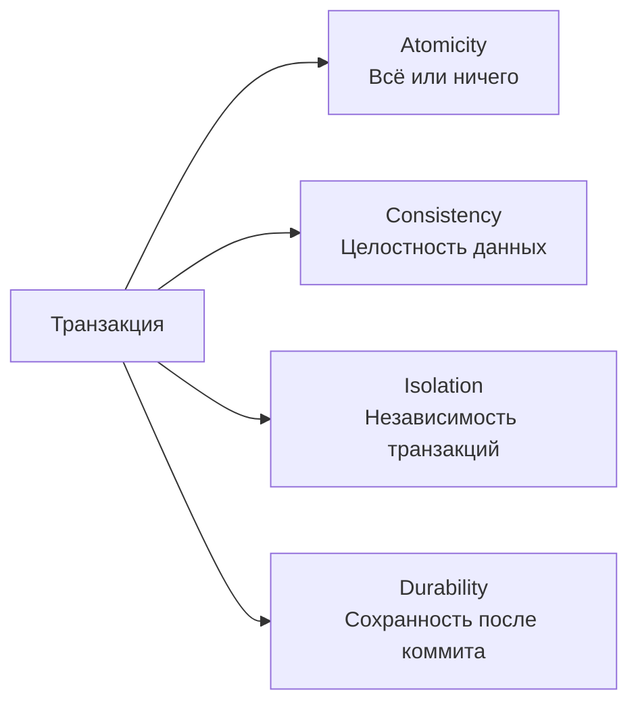
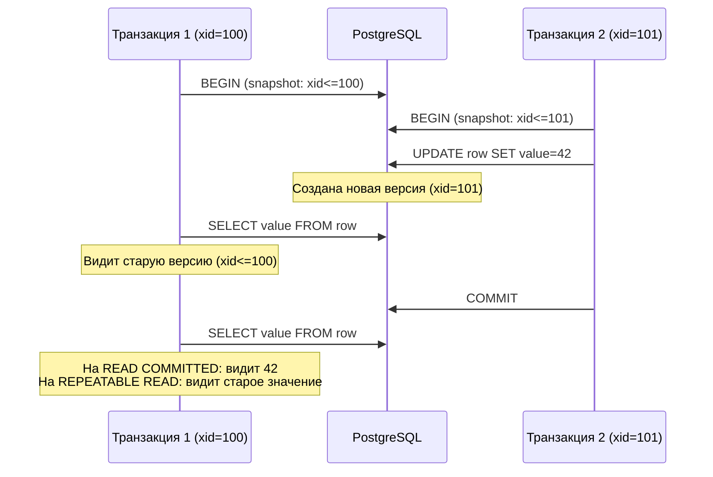
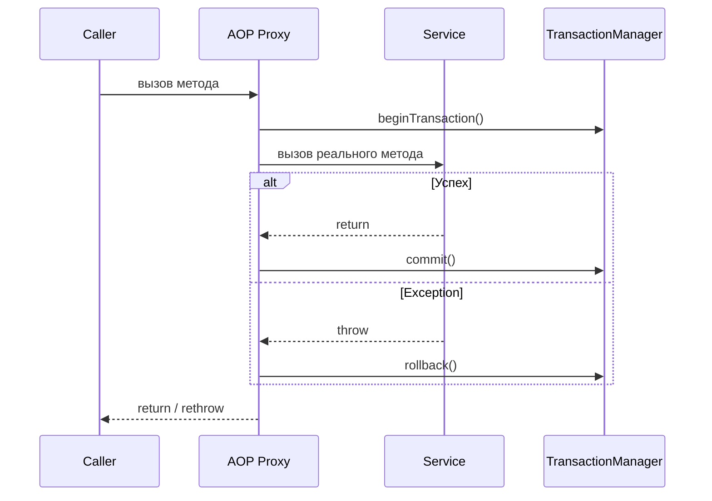
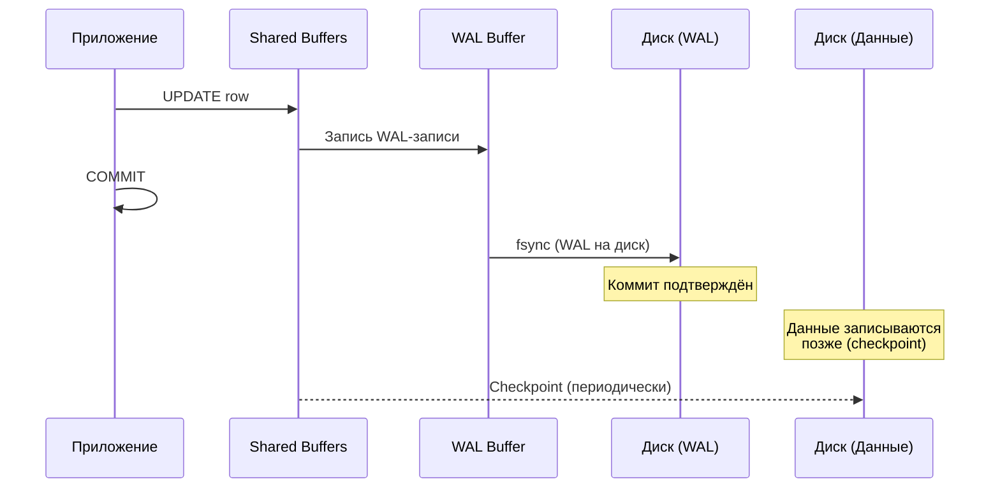
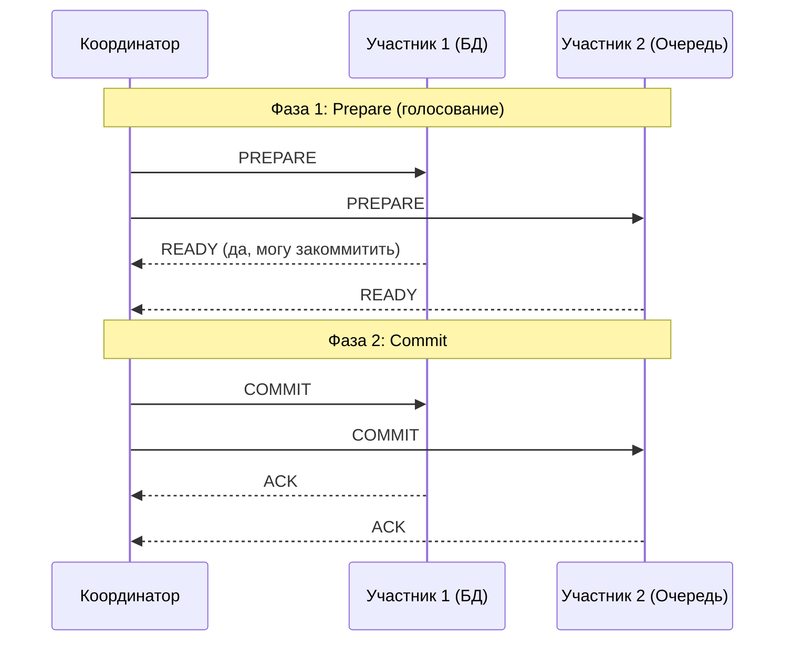

# Вопросы на собеседовании: `Транзакции и уровни изоляции`

Полный набор вопросов по транзакциям в реляционных БД: свойства `ACID`, уровни изоляции, аномалии параллельного доступа, механизмы блокировок, `MVCC`, `Spring @Transactional`, распределённые транзакции и специфика `PostgreSQL`.

**Транзакции** -- фундаментальный механизм обеспечения целостности данных в СУБД. На собеседовании проверяют понимание свойств `ACID`, умение выбрать правильный уровень изоляции, знание аномалий параллельного доступа (`dirty read`, `phantom read`, `lost update`), а также практические навыки работы с `Spring @Transactional`, программным управлением транзакциями и распределёнными транзакциями в микросервисной архитектуре.

## Полезные ссылки

### Официальная документация

- [PostgreSQL: Transaction Isolation](https://www.postgresql.org/docs/current/transaction-iso.html) — уровни изоляции в PostgreSQL
- [PostgreSQL: Write-Ahead Logging (WAL)](https://www.postgresql.org/docs/current/wal-intro.html) — механизм WAL
- [PostgreSQL: MVCC Introduction](https://www.postgresql.org/docs/current/mvcc-intro.html) — многоверсионное управление параллельным доступом
- [Jakarta Persistence Specification](https://jakarta.ee/specifications/persistence/) — спецификация JPA

### Статьи Baeldung

- [Transaction Propagation and Isolation in Spring @Transactional](https://www.baeldung.com/spring-transactional-propagation-isolation) — Spring транзакции: propagation и isolation
- [Programmatic Transaction Management in Spring](https://www.baeldung.com/spring-programmatic-transaction-management) — программное управление транзакциями
- [Optimistic Locking in JPA](https://www.baeldung.com/jpa-optimistic-locking) — оптимистическая блокировка
- [Pessimistic Locking in JPA](https://www.baeldung.com/jpa-pessimistic-locking) — пессимистическая блокировка
- [Transactions Across Microservices](https://www.baeldung.com/transactions-across-microservices) — распределённые транзакции
- [Saga Pattern in Microservices](https://www.baeldung.com/cs/saga-pattern-microservices) — паттерн Saga

## Содержание

- [Полезные ссылки](#полезные-ссылки)
- [See also](#see-also)

**Свойства ACID**
- [Q1. (!) Что такое ACID и зачем эти свойства нужны?](#q1--что-такое-acid-и-зачем-эти-свойства-нужны)
- [Q2. Как обеспечивается атомарность транзакции на уровне СУБД?](#q2-как-обеспечивается-атомарность-транзакции-на-уровне-субд)
- [Q3. Что означает консистентность в контексте ACID?](#q3-что-означает-консистентность-в-контексте-acid)
- [Q4. (!) Чем изоляция отличается от консистентности?](#q4--чем-изоляция-отличается-от-консистентности)
- [Q5. Как СУБД обеспечивает долговечность (Durability)?](#q5-как-субд-обеспечивает-долговечность-durability)

**Уровни изоляции**
- [Q6. (!) Какие уровни изоляции определяет стандарт SQL?](#q6--какие-уровни-изоляции-определяет-стандарт-sql)
- [Q7. (!) Что такое dirty read, non-repeatable read и phantom read?](#q7--что-такое-dirty-read-non-repeatable-read-и-phantom-read)
- [Q8. Что такое lost update и на каком уровне изоляции он возможен?](#q8-что-такое-lost-update-и-на-каком-уровне-изоляции-он-возможен)
- [Q9. (!) Какой уровень изоляции по умолчанию в PostgreSQL и MySQL?](#q9--какой-уровень-изоляции-по-умолчанию-в-postgresql-и-mysql)
- [Q10. Как выбрать уровень изоляции для конкретной задачи?](#q10-как-выбрать-уровень-изоляции-для-конкретной-задачи)

**MVCC**
- [Q11. (!) Что такое MVCC и как он работает?](#q11--что-такое-mvcc-и-как-он-работает)
- [Q12. Как MVCC реализован в PostgreSQL?](#q12-как-mvcc-реализован-в-postgresql)
- [Q13. Что такое VACUUM и зачем он нужен?](#q13-что-такое-vacuum-и-зачем-он-нужен)

**Блокировки и конкурентный доступ**
- [Q14. (!) В чём разница между оптимистической и пессимистической блокировкой?](#q14--в-чём-разница-между-оптимистической-и-пессимистической-блокировкой)
- [Q15. Как реализовать оптимистическую блокировку в JPA?](#q15-как-реализовать-оптимистическую-блокировку-в-jpa)
- [Q16. Как реализовать пессимистическую блокировку в JPA?](#q16-как-реализовать-пессимистическую-блокировку-в-jpa)
- [Q17. (!) Что такое deadlock и как его предотвратить?](#q17--что-такое-deadlock-и-как-его-предотвратить)
- [Q18. Какие типы блокировок существуют в PostgreSQL?](#q18-какие-типы-блокировок-существуют-в-postgresql)

**Spring @Transactional**
- [Q19. (!) Как работает аннотация @Transactional в Spring?](#q19--как-работает-аннотация-transactional-в-spring)
- [Q20. (!) Какие типы propagation существуют и когда их использовать?](#q20--какие-типы-propagation-существуют-и-когда-их-использовать)
- [Q21. Как задать уровень изоляции в @Transactional?](#q21-как-задать-уровень-изоляции-в-transactional)
- [Q22. (!) Как работает rollbackFor и noRollbackFor?](#q22--как-работает-rollbackfor-и-norollbackfor)
- [Q23. Почему @Transactional не работает на private методах?](#q23-почему-transactional-не-работает-на-private-методах)
- [Q24. Что такое self-invocation problem в Spring транзакциях?](#q24-что-такое-self-invocation-problem-в-spring-транзакциях)
- [Q25. (!) Как использовать @Transactional в read-only сценариях?](#q25--как-использовать-transactional-в-read-only-сценариях)

**Программное управление транзакциями**
- [Q26. Как управлять транзакциями программно через TransactionTemplate?](#q26-как-управлять-транзакциями-программно-через-transactiontemplate)
- [Q27. Когда программное управление предпочтительнее декларативного?](#q27-когда-программное-управление-предпочтительнее-декларативного)

**WAL и Savepoints**
- [Q28. (!) Что такое WAL (Write-Ahead Log) и какую роль он играет?](#q28--что-такое-wal-write-ahead-log-и-какую-роль-он-играет)
- [Q29. Что такое savepoint и как его использовать?](#q29-что-такое-savepoint-и-как-его-использовать)

**Распределённые транзакции**
- [Q30. (!) Что такое двухфазный коммит (2PC)?](#q30--что-такое-двухфазный-коммит-2pc)
- [Q31. Что такое XA-транзакции?](#q31-что-такое-xa-транзакции)
- [Q32. (!) Что такое паттерн Saga и чем он отличается от 2PC?](#q32--что-такое-паттерн-saga-и-чем-он-отличается-от-2pc)

**Connection Pooling и транзакции**
- [Q33. Как connection pool взаимодействует с транзакциями?](#q33-как-connection-pool-взаимодействует-с-транзакциями)
- [Q34. Какие проблемы возникают при неправильном управлении соединениями в транзакциях?](#q34-какие-проблемы-возникают-при-неправильном-управлении-соединениями-в-транзакциях)

**PostgreSQL и продвинутые темы**
- [Q35. MVCC в PostgreSQL — vacuum, dead tuples, bloat](#q35-mvcc-в-postgresql--vacuum-dead-tuples-bloat)
- [Q36. Savepoints в транзакциях — SAVEPOINT / ROLLBACK TO](#q36-savepoints-в-транзакциях--savepoint--rollback-to)
- [Q37. Advisory Locks в PostgreSQL — pg_try_advisory_lock](#q37-advisory-locks-в-postgresql--pg_try_advisory_lock)
- [Q38. Distributed transactions: 2PC, XA в Java (Atomikos, Narayana)](#q38-distributed-transactions-2pc-xa-в-java-atomikos-narayana)
- [Q39. Saga: Choreography vs Orchestration — детальное сравнение](#q39-saga-choreography-vs-orchestration--детальное-сравнение)
- [Q40. Optimistic vs Pessimistic Locking в Hibernate — аннотации, примеры](#q40-optimistic-vs-pessimistic-locking-в-hibernate--аннотации-примеры)
- [Q41. Read-your-writes consistency — механизмы обеспечения](#q41-read-your-writes-consistency--механизмы-обеспечения)
- [Q42. Transaction Log (WAL) — для чего используется](#q42-transaction-log-wal--для-чего-используется)

---

## Q1. (!) Что такое ACID и зачем эти свойства нужны?

**ACID** -- набор из четырёх свойств, гарантирующих надёжную обработку транзакций в СУБД:

| Свойство | Описание |
|----------|----------|
| **Atomicity** (атомарность) | Транзакция выполняется целиком или не выполняется вовсе. Частичное применение изменений невозможно |
| **Consistency** (консистентность) | Транзакция переводит БД из одного согласованного состояния в другое. Все ограничения (`constraints`, `triggers`) соблюдаются |
| **Isolation** (изоляция) | Параллельные транзакции не влияют друг на друга так, как если бы они выполнялись последовательно |
| **Durability** (долговечность) | После коммита данные сохраняются даже при сбое системы |



На практике полное соблюдение всех свойств `ACID` стоит дорого с точки зрения производительности, поэтому СУБД предлагают разные **уровни изоляции**, позволяя разработчику выбирать баланс между строгостью и скоростью.

> [!mcq]
> - [ ] `ACID` означает `Availability`, `Consistency`, `Integrity`, `Durability` — свойства хранилища. | `Availability` — про теорему `CAP`, а не про транзакции; `Integrity` в стандарт `ACID` не входит. ❌ ПОСЛЕДСТВИЕ: команда путает CAP-Availability с ACID на архитектурном ревью; пишут DAR с «ACID-Available БД для биллинга», ревьюер заворачивает, спринт потерян.
> - [ ] `ACID` означает `Atomicity`, `Concurrency`, `Isolation`, `Determinism` — свойства параллелизма. | `Concurrency` описывает параллельный доступ, но не даёт гарантии «всё или ничего»; `Determinism` — не из ACID. ❌ ПОСЛЕДСТВИЕ: разработчик считает, что `Concurrency` сама обеспечивает rollback при сбое; не пишет компенсации в Saga, при падении на 3-м шаге деньги списаны, заказ не создан.
> - [x] `ACID` означает `Atomicity`, `Consistency`, `Isolation`, `Durability` — свойства транзакции. | Классическая расшифровка из SQL-92: атомарность (всё или ничего), консистентность (валидное состояние), изоляция (видимость), долговечность (переживание сбоя). ✓ ПРИМЕНЯТЬ: PostgreSQL/MySQL InnoDB/Oracle гарантируют все 4 на уровне локальной транзакции; в распределённых системах через 2PC (Atomikos) или Saga (eventual). 📋 ПРАВИЛО: «`A`tomicity, `C`onsistency, `I`solation, `D`urability — четыре кита транзакции». 🔗 См. Q2, Q3, Q4, Q5.
> - [ ] `ACID` означает `Atomicity`, `Consistency`, `Indexing`, `Durability` — свойства производительности. | `Indexing` — механизм ускорения поиска, не транзакционная гарантия; индекс не защищает от race condition. ❌ ПОСЛЕДСТВИЕ: команда оптимизирует биллинг через индексы, пропуская изоляцию; lost update на конкурентных списаниях, баланс клиента уходит в минус, инцидент с финансовыми потерями.

> [!mcq]
> - [x] `Durability` гарантирует переживание коммита после сбоя, но не сводится к одному `fsync`: PostgreSQL/MySQL используют `group commit` (один `fsync` на пачку транзакций), `synchronous_commit` имеет уровни (`off`/`local`/`remote_write`/`on`/`remote_apply`). | Durability tuning даёт порядки разницы в throughput при сохранении формальной гарантии. ✓ ПРИМЕНЯТЬ: `synchronous_commit = remote_apply` для read-your-writes на replica; `synchronous_commit = off` на staging/тестах; `group commit` через `commit_delay`/`commit_siblings` под высоким QPS. 📋 ПРАВИЛО: «Durability = переживание сбоя, но `fsync per commit` — не единственный способ». 🔗 См. Q5, Q28, Q42.
> - [ ] `Durability` — это синоним `fsync` после каждого `COMMIT`: пока `fsync` не вернулся, данные не долговечны, и обойти это нельзя. | `Durability` — семантическая гарантия «коммит переживёт сбой», но реализаций несколько: `synchronous_commit = off` даёт async-WAL, `group commit` амортизирует `fsync`. ❌ ПОСЛЕДСТВИЕ: команда оценивает throughput биллинга по «`fsync` per commit», списывает PostgreSQL как «медленный»; не настраивают `synchronous_commit = remote_write` и теряют 5× throughput на пустом месте.
> - [ ] `synchronous_commit = off` в PostgreSQL ломает `Durability` и приводит к потере уже закоммиченных транзакций при штатном shutdown. | При штатном shutdown PostgreSQL дофлашивает WAL → транзакции не теряются. Риск только при внезапном крахе ОС/железа на окне `wal_writer_delay` (~200ms). ❌ ПОСЛЕДСТВИЕ: DBA включает `synchronous_commit = off` для скорости, но при power loss теряет 200ms транзакций биллинга; reconciliation с банком занимает 3 дня, financial inconsistency.
> - [ ] `Group commit` нарушает `ACID`, потому что несколько транзакций объединяются в один `fsync`, теряя индивидуальность. | `Group commit` не нарушает ACID: каждая транзакция всё ещё атомарна и изолирована, их WAL-записи лишь флашатся вместе. ❌ ПОСЛЕДСТВИЕ: команда отключает `commit_delay` ради «чистоты ACID»; throughput биллинга падает в 5×, в Black Friday очередь оплат растёт до часа, упущенная выручка.

## Q2. Как обеспечивается атомарность транзакции на уровне СУБД?

СУБД использует журнал транзакций (`WAL` / `redo log` / `undo log`) для обеспечения атомарности:

1. **Перед изменением данных** СУБД записывает в журнал, что именно будет изменено
2. **При коммите** -- помечает транзакцию как завершённую в журнале
3. **При откате** (`ROLLBACK`) -- читает журнал и отменяет все изменения транзакции

В `PostgreSQL` используется комбинация `WAL` (для redo) и механизма `MVCC` (старые версии строк сохраняются вместо перезаписи, что по сути является undo).

```sql
BEGIN;
UPDATE accounts SET balance = balance - 100 WHERE id = 1;
UPDATE accounts SET balance = balance + 100 WHERE id = 2;
-- Если здесь произойдёт ошибка, оба UPDATE будут отменены
COMMIT;
```

> [!mcq]
> - [x] Атомарность обеспечивается журналом транзакций (`WAL`/`undo log`), из которого `ROLLBACK` отменяет изменения. | Запись в журнал до применения даёт СУБД возможность откатить частичные изменения при сбое или явном `ROLLBACK`. ✓ ПРИМЕНЯТЬ: PostgreSQL `WAL` + MVCC (старые версии = undo); MySQL InnoDB `redo log` + `undo log`; при crash recovery PG проигрывает WAL, откатывая незакоммиченные tx. 📋 ПРАВИЛО: «Atomicity через журнал: WAL/undo даёт rollback при сбое». 🔗 См. Q28, Q42.
> - [ ] Атомарность обеспечивается сбросом всех грязных страниц на диск при каждом `INSERT`/`UPDATE`. | Немедленный сброс страниц — про `Durability`, не `Atomicity`; такое поведение убивало бы перформанс из-за random I/O. ❌ ПОСЛЕДСТВИЕ: команда «оптимизирует» биллинг через `synchronous_commit = on` + `full_page_writes`, ждёт атомарности; при сбое в середине двух UPDATE-ов половина данных применилась, баланс клиента уехал.
> - [ ] Атомарность обеспечивается блокировками уровня таблицы на время всей транзакции. | Блокировки — про изоляцию (видимость), а не про откат изменений после сбоя; `LOCK TABLE` не пишет undo. ❌ ПОСЛЕДСТВИЕ: разработчик ставит `LOCK TABLE accounts` ради «атомарности»; при kill-сигнале на pod-е k8s транзакция оборвалась, частичные UPDATE остались в heap, money-loss из-за списания без зачисления.
> - [ ] Атомарность обеспечивается репликацией изменений на standby-узел до коммита. | Репликация повышает долговечность и доступность, но не гарантирует «всё или ничего» внутри одной транзакции; standby получает уже зафиксированный WAL. ❌ ПОСЛЕДСТВИЕ: команда полагается на `synchronous_standby` как на atomicity; при сбое primary в середине двух UPDATE replica получает только первый, обещание «всё или ничего» нарушено, dirty read на failover.

## Q3. Что означает консистентность в контексте ACID?

**Консистентность** гарантирует, что транзакция переводит БД из одного **валидного состояния** в другое. Это означает:

- Все ограничения целостности (`NOT NULL`, `UNIQUE`, `FOREIGN KEY`, `CHECK`) соблюдены после завершения транзакции
- Все триггеры и каскадные правила отработали корректно
- Бизнес-инварианты не нарушены (например, сумма на счетах не изменилась при переводе)

Важно: консистентность -- это **ответственность приложения и схемы БД**, а не только СУБД. СУБД лишь проверяет объявленные ограничения. Если бизнес-правило не выражено через `constraint`, СУБД не сможет его защитить.

> [!mcq]
> - [ ] Консистентность гарантирует, что параллельные транзакции не видят промежуточные изменения друг друга. | Это описание изоляции, а не консистентности; изоляция регулирует видимость между транзакциями через MVCC/locking. ❌ ПОСЛЕДСТВИЕ: команда путает понятия в DAR, ставит `SERIALIZABLE` ради «консистентности», получает каскад `40001 serialization_failure` на проде, retry-storm душит CPU базы.
> - [ ] Консистентность гарантирует, что данные выживут после сбоя сервера. | Это описание долговечности (`Durability`), обеспечиваемой `WAL` и `fsync`; `Consistency` — про корректность, а не про переживание crash. ❌ ПОСЛЕДСТВИЕ: разработчик отключает `CHECK`-constraints для скорости, считая, что «WAL спасёт»; некорректные данные комитятся, отчётность расходится с фактами.
> - [x] Консистентность гарантирует, что транзакция переводит БД из одного валидного состояния в другое с учётом `constraints`. | Ответственность схемы + приложения: СУБД проверяет объявленные `NOT NULL`, `CHECK`, `FK`; бизнес-инварианты поддерживает код. ✓ ПРИМЕНЯТЬ: всегда объявлять `CHECK (balance >= 0)` для финансовых полей, `FK ON DELETE CASCADE` для зависимостей, `UNIQUE` для idempotency keys; что не выражено через constraint — защищать в сервисном слое. 📋 ПРАВИЛО: «Consistency = валидное → валидное; constraints в БД, инварианты в коде». 🔗 См. Q4.
> - [ ] Консистентность гарантирует, что все узлы кластера в один момент видят одинаковые данные. | Это `strong consistency` из теоремы `CAP`, про распределённые системы, а не `C` в `ACID`; ACID-Consistency — про инварианты в одной БД. ❌ ПОСЛЕДСТВИЕ: архитектор путает CAP-C и ACID-C в DAR; команда ставит CockroachDB ради «ACID-Consistency», тратит спринт, latency растёт в 3×, реально нужно было выразить инварианты constraint-ами.

## Q4. (!) Чем изоляция отличается от консистентности?

| Аспект | Consistency | Isolation |
|--------|------------|-----------|
| **О чём** | Корректность данных | Видимость изменений между транзакциями |
| **Кто обеспечивает** | Схема БД + приложение | СУБД (уровни изоляции) |
| **Что нарушается** | Ограничения целостности | Возникают аномалии чтения |
| **Настраивается** | Через `constraints` | Через `SET TRANSACTION ISOLATION LEVEL` |

**Консистентность** отвечает на вопрос: «Данные корректны?»
**Изоляция** отвечает на вопрос: «Что видит параллельная транзакция?»

Изоляция -- это инструмент, помогающий обеспечить консистентность в многопользовательском окружении.

> [!mcq]
> - [ ] Консистентность — про видимость чужих изменений, изоляция — про соблюдение `constraints`. | Роли перепутаны: `constraints` обеспечивают консистентность, видимость — изоляция. ❌ ПОСЛЕДСТВИЕ: разработчик ставит `READ_UNCOMMITTED` ради «видимости constraints»; dirty read на конкурентных списаниях, calculated balance ≠ committed, financial inconsistency.
> - [ ] Консистентность настраивается через `SET TRANSACTION ISOLATION LEVEL`, изоляция — через `CHECK`/`FK`. | Снова перепутано: уровни изоляции меняют видимость, а `CHECK`/`FK` — инструмент консистентности. ❌ ПОСЛЕДСТВИЕ: команда меняет `isolation` ожидая защиту от невалидных данных; невалидные значения проходят (нет `CHECK`), отчёты считают по мусору, инцидент с регулятором.
> - [ ] Консистентность и изоляция — синонимы, различие только в учебной терминологии. | Это разные свойства: можно иметь строгие `constraints` и слабую изоляцию (и наоборот); они независимы. ❌ ПОСЛЕДСТВИЕ: разработчик уверен, что `SERIALIZABLE` гарантирует все инварианты, не пишет `CHECK` на бизнес-правило; невалидные данные коммитятся, исправление занимает миграцию на 100M записях.
> - [x] Консистентность — про корректность данных (`constraints`, инварианты), изоляция — про видимость изменений между параллельными транзакциями. | Консистентность отвечает на «данные валидны?», изоляция — «что видит другая транзакция?»; изоляция помогает сохранить консистентность при конкурентности. ✓ ПРИМЕНЯТЬ: для биллинга — `CHECK (balance >= 0)` (consistency) + `REPEATABLE READ` или `FOR UPDATE` (isolation против lost update); для аналитики — `REPEATABLE READ` для snapshot, без жёстких constraints. 📋 ПРАВИЛО: «`C` про данные, `I` про видимость — независимые оси». 🔗 См. Q3, Q6.

> [!mcq]
> - [x] `Serializability` (изоляция транзакций) допускает любой эквивалентный последовательный порядок; `linearizability` (consistency model в distributed system) требует real-time порядка операций; их сочетание — `strict serializability` (Spanner, CockroachDB). | Serializable БД может вернуть «старые» данные, если порядок транзакций позволяет (snapshot); linearizable хранилище — каждое чтение видит самый свежий коммит. ✓ ПРИМЕНЯТЬ: PostgreSQL `SERIALIZABLE` (SSI) — для локального финансового модуля; Google Spanner/CockroachDB — для глобального банкинга со strict serializability через TrueTime/HLC. 📋 ПРАВИЛО: «Serializability про транзакции, Linearizability про операции; вместе = strict serializable». 🔗 См. Q4, Q6.
> - [ ] `Serializability` и `linearizability` — это синонимы; оба означают «как будто транзакции выполнялись по очереди». | Разные гарантии из разных областей: serializability — про транзакции (есть _какой-то_ эквивалентный порядок), linearizability — про отдельные операции в distributed system (real-time порядок). ❌ ПОСЛЕДСТВИЕ: команда выбирает PostgreSQL `SERIALIZABLE` для распределённого банкинга, ожидая linearizability; чтение с replica возвращает старый баланс, double-spend на конкурентных платежах.
> - [ ] Linearizability — это уровень изоляции в стандарте SQL, более строгий, чем `SERIALIZABLE`. | Linearizability не входит в стандарт SQL и не является уровнем изоляции — это модель консистентности из распределённых систем (Herlihy-Wing 1990), независимая от ACID-изоляции. ❌ ПОСЛЕДСТВИЕ: разработчик ищет «`LINEARIZABLE` в SET TRANSACTION ISOLATION LEVEL»; не находит, объявляет `SERIALIZABLE` достаточным; на распределённой системе чтения с replica возвращают stale данные.
> - [ ] PostgreSQL `SERIALIZABLE` автоматически даёт linearizability на репликах через streaming replication. | Streaming replication в PG асинхронна — реплика отстаёт; чтение со standby может вернуть устаревшие данные → не linearizable; для linearizability нужны кворумные протоколы (Raft/Paxos). ❌ ПОСЛЕДСТВИЕ: команда строит read-after-write на standby с `SERIALIZABLE`; пользователь после редактирования профиля видит старые данные, поток жалоб в саппорт.

## Q5. Как СУБД обеспечивает долговечность (Durability)?

Основные механизмы:

1. **Write-Ahead Logging (WAL)** -- перед изменением данных на диске запись фиксируется в журнале. При сбое СУБД восстанавливает данные из журнала
2. **`fsync`** -- принудительная запись буферов на физический диск при коммите
3. **Контрольные точки (`checkpoints`)** -- периодическое сохранение "грязных" страниц из памяти на диск
4. **Репликация** -- копирование данных на другие серверы (дополнительный уровень защиты)

В `PostgreSQL` коммит считается завершённым только после того, как `WAL`-запись записана на диск через `fsync`. Параметр `synchronous_commit` позволяет ослабить эту гарантию ради производительности (с риском потери последних транзакций при сбое).

> [!mcq]
> - [x] Коммит считается завершённым после `fsync` `WAL`-записи на диск; при сбое данные восстанавливаются из журнала. | Классический механизм Write-Ahead Logging: сначала журнал на диск, затем ACK клиенту; при crash СУБД проигрывает незаписанные изменения из WAL. ✓ ПРИМЕНЯТЬ: PostgreSQL `synchronous_commit = on` (default) — fsync на диск; `remote_apply` для read-your-writes на replica; мониторить `pg_current_wal_lsn()` и `replay_lag`. 📋 ПРАВИЛО: «COMMIT = fsync WAL → ACK; данные на heap позже через checkpoint». 🔗 См. Q28, Q42.
> - [ ] Коммит считается завершённым после записи изменений в `shared_buffers` и синхронизации всех реплик. | `shared_buffers` — оперативная память, её содержимое теряется при сбое; репликация — дополнительный слой, не основа `Durability`. ❌ ПОСЛЕДСТВИЕ: команда полагается на «commit = в shared_buffers»; при power loss теряют коммитнутые транзакции, потому что WAL ещё не fsync; биллинг расходится с банком.
> - [ ] Коммит считается завершённым после того, как autovacuum удалит старые версии строк. | `autovacuum` занимается очисткой dead tuples и не имеет отношения к подтверждению коммита; коммит и vacuum — независимые подсистемы. ❌ ПОСЛЕДСТВИЕ: разработчик ждёт «autovacuum закроет коммит»; latency коммита измеряется в часах, healthcheck падает, k8s рестартует pod, частичный rollback.
> - [ ] Коммит считается завершённым после сброса всех грязных страниц `heap` на физический диск. | Страницы данных сбрасываются при checkpoint, а не при коммите; коммит подтверждается раньше по записи `WAL`. ❌ ПОСЛЕДСТВИЕ: команда увеличивает `checkpoint_timeout` ради «быстрого коммита»; при crash recovery время простоя растёт до 20 минут (replay большого WAL), SLO нарушен.

## Q6. (!) Какие уровни изоляции определяет стандарт SQL?

Стандарт SQL определяет четыре уровня изоляции, от наименее строгого к наиболее строгому:

| Уровень | Dirty Read | Non-Repeatable Read | Phantom Read |
|---------|------------|--------------------:|-------------:|
| `READ UNCOMMITTED` | Возможен | Возможен | Возможен |
| `READ COMMITTED` | Невозможен | Возможен | Возможен |
| `REPEATABLE READ` | Невозможен | Невозможен | Возможен |
| `SERIALIZABLE` | Невозможен | Невозможен | Невозможен |


Важная деталь: `PostgreSQL` не реализует `READ UNCOMMITTED` -- при его установке фактически используется `READ COMMITTED`. Также `REPEATABLE READ` в `PostgreSQL` защищает и от `phantom read` (благодаря `MVCC`), что строже стандарта.

> [!mcq]
> - [x] `READ UNCOMMITTED`, `READ COMMITTED`, `REPEATABLE READ`, `SERIALIZABLE`. | Канонический список из SQL-92: от минимальной к максимальной изоляции; каждый следующий уровень устраняет одну аномалию (dirty/non-repeatable/phantom). ✓ ПРИМЕНЯТЬ: PG default `READ COMMITTED`, MySQL InnoDB default `REPEATABLE READ`; повышать до `SERIALIZABLE` точечно для финансовых операций; `READ UNCOMMITTED` в PG = `READ COMMITTED`. 📋 ПРАВИЛО: «4 уровня SQL-92: RU < RC < RR < S». 🔗 См. Q7, Q9.
> - [ ] `READ UNCOMMITTED`, `READ COMMITTED`, `SNAPSHOT`, `SERIALIZABLE`. | `SNAPSHOT` — уровень из SQL Server/Oracle, не входит в стандарт SQL-92; в стандарте только 4 канонических. ❌ ПОСЛЕДСТВИЕ: разработчик пишет `SET TRANSACTION ISOLATION LEVEL SNAPSHOT` в PostgreSQL; ошибка синтаксиса в проде, миграция падает, восстанавливают вручную.
> - [ ] `READ COMMITTED`, `REPEATABLE READ`, `SNAPSHOT`, `STRICT SERIALIZABLE`. | `STRICT SERIALIZABLE` и `SNAPSHOT` — расширения из распределённых СУБД (Spanner, CockroachDB), их нет в SQL-стандарте. ❌ ПОСЛЕДСТВИЕ: команда пишет интервью-ответ про «STRICT SERIALIZABLE как SQL-уровень», на собеседовании архитектор заворачивает кандидата.
> - [ ] `NO ISOLATION`, `READ COMMITTED`, `SNAPSHOT`, `LINEARIZABLE`. | `NO ISOLATION` и `LINEARIZABLE` не определены стандартом SQL; `LINEARIZABLE` — термин распределённых систем (Herlihy-Wing). ❌ ПОСЛЕДСТВИЕ: разработчик пишет `LINEARIZABLE` в `application.yml` для Spring `isolation`; bean creation падает с `IllegalArgumentException`, деплой откатывают.

> [!mcq]
> - [x] В `PostgreSQL` `READ UNCOMMITTED` физически не реализован — установка этого уровня молча трактуется как `READ COMMITTED`, поэтому dirty read недостижим даже при явном `SET TRANSACTION ISOLATION LEVEL READ UNCOMMITTED`. | `MVCC` в PG не имеет режима «читать незакоммиченные tuple-ы»: видимость определяется через `xmin`/`xmax` относительно snapshot. Документация подтверждает upgrade до `READ COMMITTED`. ✓ ПРИМЕНЯТЬ: не пытаться «ускорить» аналитический запрос через `READ UNCOMMITTED` — в PG это no-op; для read-only снимка использовать `REPEATABLE READ` или `SET TRANSACTION READ ONLY DEFERRABLE`. 📋 ПРАВИЛО: «`READ UNCOMMITTED` в PG = `READ COMMITTED`, dirty read недоступен». 🔗 См. Q6.
> - [ ] В `PostgreSQL` `READ UNCOMMITTED` работает строго по стандарту SQL-92 и допускает dirty read для ускорения аналитики. | PG никогда не отдаёт незакоммиченные tuple-ы из-за устройства `MVCC`; маппинг на `READ COMMITTED` зафиксирован в документации с версии 7.x. ❌ ПОСЛЕДСТВИЕ: команда меняет уровень изоляции «для скорости», бенчмарк не показывает разницы, на код-ревью пропускают как «оптимизацию» — позже выясняется, что dirty read и не нужен был, и не работает.
> - [ ] В `PostgreSQL` `REPEATABLE READ` всё ещё допускает phantom read согласно стандарту SQL-92. | PG строже стандарта: `REPEATABLE READ` в PG = snapshot isolation и защищает от phantom read внутри транзакции. Аномалия write skew остаётся, но phantom — нет. ❌ ПОСЛЕДСТВИЕ: разработчик использует `SERIALIZABLE` «на всякий случай» против фантомов, ловит частые `serialization_failure` под нагрузкой и retry-шторм; на самом деле `REPEATABLE READ` хватало.
> - [ ] В `PostgreSQL` `SERIALIZABLE` реализован через глобальные блокировки таблиц для строгой изоляции. | PG использует `Serializable Snapshot Isolation` (SSI) — оптимистичный механизм без блокировок чтения; конфликты детектируются через граф зависимостей и приводят к `serialization_failure`. ❌ ПОСЛЕДСТВИЕ: команда боится `SERIALIZABLE`, ожидая «table locks», и пишет километры пессимистичных `FOR UPDATE` вручную; в итоге deadlock-ов больше, чем было бы при честном SSI.

## Q7. (!) Что такое dirty read, non-repeatable read и phantom read?

### Dirty Read (грязное чтение)

Транзакция читает данные, изменённые другой **незакоммиченной** транзакцией. Если та откатится, прочитанные данные окажутся невалидными.

```
Транзакция A:  UPDATE accounts SET balance = 500 WHERE id = 1;  (не коммитит)
Транзакция B:  SELECT balance FROM accounts WHERE id = 1;  -- читает 500 (dirty read!)
Транзакция A:  ROLLBACK;  -- баланс возвращается к исходному
```

### Non-Repeatable Read (неповторяемое чтение)

Транзакция повторно читает ту же строку и получает **другое значение**, потому что другая транзакция закоммитила изменение между двумя чтениями.

```
Транзакция A:  SELECT balance FROM accounts WHERE id = 1;  -- 1000
Транзакция B:  UPDATE accounts SET balance = 500 WHERE id = 1; COMMIT;
Транзакция A:  SELECT balance FROM accounts WHERE id = 1;  -- 500 (non-repeatable read!)
```

### Phantom Read (фантомное чтение)

Транзакция повторно выполняет запрос с условием `WHERE` и получает **другой набор строк**, потому что другая транзакция вставила или удалила строки, подходящие под условие.

```
Транзакция A:  SELECT COUNT(*) FROM orders WHERE status = 'NEW';  -- 5
Транзакция B:  INSERT INTO orders (status) VALUES ('NEW'); COMMIT;
Транзакция A:  SELECT COUNT(*) FROM orders WHERE status = 'NEW';  -- 6 (phantom read!)
```

> [!mcq]
> - [ ] `Dirty read` — это чтение одного и того же ряда с разными значениями внутри транзакции. | Это описание `non-repeatable read`; `dirty read` — чтение незакоммиченных данных, не повторное чтение. ❌ ПОСЛЕДСТВИЕ: команда путает понятия в DAR; ставит `REPEATABLE READ` ради защиты от dirty read, но реально dirty read возможен только на `READ UNCOMMITTED` — потеряно время на лишний уровень.
> - [ ] `Dirty read` — это появление новых строк в результате повторного запроса с `WHERE`. | Это описание `phantom read`; при dirty read читаются изменённые, но не закоммиченные значения, а не новые строки. ❌ ПОСЛЕДСТВИЕ: разработчик ставит `SERIALIZABLE` против dirty read «по запросу аналитиков»; на самом деле проблема была в фантомах при отчёте, баг не решён.
> - [x] `Dirty read` — это чтение данных, изменённых другой транзакцией, которая ещё не закоммичена и может откатиться. | Классическое определение: читатель видит «грязные» данные, которые могут исчезнуть после `ROLLBACK`; возможен только на `READ UNCOMMITTED`. ✓ ПРИМЕНЯТЬ: в PostgreSQL dirty read недоступен — `READ UNCOMMITTED` молча превращается в `READ COMMITTED`; MySQL/SQL Server допускают на `READ UNCOMMITTED`, использовать только для approximate counters. 📋 ПРАВИЛО: «Dirty read = чужие незакоммиченные данные, только на RU». 🔗 См. Q6, Q9.
> - [ ] `Dirty read` — это чтение устаревшей версии строки из `MVCC`-снимка. | Чтение старой версии в MVCC — нормальная работа изоляции, а не аномалия; строка при этом всегда закоммичена. ❌ ПОСЛЕДСТВИЕ: команда уверена, что MVCC «всегда грязный», заворачивает все запросы в `SERIALIZABLE`; throughput падает в 5×, а реальной проблемы dirty read и не было.

> [!mcq]
> - [ ] `Non-repeatable read` предотвращается на уровне `READ COMMITTED`. | На `READ COMMITTED` другая транзакция может закоммитить изменение между двумя чтениями; нужен минимум `REPEATABLE READ`. ❌ ПОСЛЕДСТВИЕ: финансовый отчёт делает два SELECT на `READ COMMITTED` — calculated balance ≠ committed; investor relations получает противоречащие цифры в одном PDF.
> - [ ] `Phantom read` предотвращается на уровне `READ COMMITTED`. | На `READ COMMITTED` новые строки от других транзакций видны при повторном `SELECT`; нужен `SERIALIZABLE` (или `REPEATABLE READ` в PG, который защищает от phantom). ❌ ПОСЛЕДСТВИЕ: команда считает `COUNT(*) WHERE status='NEW'` дважды на `READ COMMITTED`, ожидая константу; новые ордера приезжают между запросами, дашборд показывает противоречия, инцидент с продактом.
> - [ ] `Phantom read` — это чтение удалённой строки, которая уже не существует в БД. | Это не phantom; phantom — появление или исчезновение строк в наборе результата по `WHERE` при повторном запросе. ❌ ПОСЛЕДСТВИЕ: разработчик «защищается от phantom» через `WHERE deleted_at IS NULL` без `REPEATABLE READ`; новые INSERT-ы видны, аналитика расходится с фактом.
> - [x] `Phantom read` возникает, когда повторный запрос с `WHERE` возвращает другой набор строк из-за `INSERT`/`DELETE` в другой транзакции. | Ключевое отличие от non-repeatable read: меняется не значение в уже прочитанной строке, а сам набор строк; стандарт SQL допускает phantom на `REPEATABLE READ`. ✓ ПРИМЕНЯТЬ: PostgreSQL `REPEATABLE READ` строже стандарта — защищает от phantom через snapshot; для отчётов на PG достаточно `REPEATABLE READ`, на MySQL нужен `SERIALIZABLE` или `next-key locks`. 📋 ПРАВИЛО: «Phantom = новые/удалённые строки в WHERE; PG RR защищает, стандарт — нет». 🔗 См. Q6, Q9.

## Q8. Что такое lost update и на каком уровне изоляции он возможен?

**Lost update** (потерянное обновление) -- ситуация, когда две транзакции читают одно значение, обе его модифицируют и записывают обратно, при этом изменение одной из транзакций теряется.

```
Транзакция A:  SELECT balance FROM accounts WHERE id = 1;  -- 1000
Транзакция B:  SELECT balance FROM accounts WHERE id = 1;  -- 1000
Транзакция A:  UPDATE accounts SET balance = 1000 + 100 WHERE id = 1; COMMIT;  -- 1100
Транзакция B:  UPDATE accounts SET balance = 1000 - 200 WHERE id = 1; COMMIT;  -- 800
-- Ожидали 900, получили 800. Обновление A потеряно!
```

`Lost update` возможен на уровнях `READ UNCOMMITTED` и `READ COMMITTED`. Начиная с `REPEATABLE READ` (в `PostgreSQL`) -- транзакция B получит ошибку сериализации и должна будет повторить операцию.

**Решения:**
- Использовать `REPEATABLE READ` или `SERIALIZABLE`
- Атомарное обновление: `UPDATE accounts SET balance = balance + 100`
- Оптимистическая блокировка с `@Version`
- Пессимистическая блокировка: `SELECT ... FOR UPDATE`

> [!mcq]
> - [x] `Lost update` возникает, когда две транзакции читают одно значение, обе его модифицируют и записывают обратно — изменение одной теряется. | Классическая аномалия «read-modify-write race»; на `READ COMMITTED` возможна, устраняется через `REPEATABLE READ`+retry, `FOR UPDATE` или атомарный `UPDATE ... SET col = col + ?`. ✓ ПРИМЕНЯТЬ: для счётчиков (likes, stock) — атомарный UPDATE; для бизнес-логики (списание баланса с проверкой) — `@Version` + retry или `SELECT FOR UPDATE`. 📋 ПРАВИЛО: «Lost update = read-modify-write race; лечится `@Version`, `FOR UPDATE` или атомарным UPDATE». 🔗 См. Q14, Q15, Q40.
> - [ ] `Lost update` возникает, когда транзакция читает данные, которые другая транзакция ещё не закоммитила. | Это описание `dirty read`, а не потерянного обновления; в lost update обе транзакции коммитятся, но одна теряется. ❌ ПОСЛЕДСТВИЕ: команда защищает биллинг от dirty read через `READ COMMITTED`; lost update остаётся, баланс уезжает на конкурентных списаниях, money-loss.
> - [ ] `Lost update` возникает только на уровне `SERIALIZABLE` при конкурентных `INSERT`. | На `SERIALIZABLE` потерянные обновления невозможны — такие конфликты вызовут `serialization_failure`; на нижних уровнях lost update реален. ❌ ПОСЛЕДСТВИЕ: разработчик «оптимизирует» с `SERIALIZABLE` на `READ COMMITTED»; lost update появляется на конкурентных UPDATE, корзина теряет товары.
> - [ ] `Lost update` возникает при откате транзакции после коммита соседней транзакции. | `ROLLBACK` после `COMMIT` соседа не приводит к потере обновления — каждая транзакция работает с изолированным снимком до коммита. ❌ ПОСЛЕДСТВИЕ: команда ждёт «lost update только при rollback», не пишет `@Version`; на проде потерянные обновления stocks приводят к oversell, customer support неделю разруливает.

## Q9. (!) Какой уровень изоляции по умолчанию в PostgreSQL и MySQL?

| СУБД | Уровень по умолчанию | Особенности |
|------|---------------------|-------------|
| `PostgreSQL` | `READ COMMITTED` | `MVCC`-реализация; `READ UNCOMMITTED` фактически = `READ COMMITTED`; `REPEATABLE READ` защищает от phantom read |
| `MySQL` (InnoDB) | `REPEATABLE READ` | Использует `MVCC` + `next-key locking`; phantom read частично предотвращён через gap locks |
| `Oracle` | `READ COMMITTED` | `MVCC` через undo segments; поддерживает только `READ COMMITTED` и `SERIALIZABLE` |
| `SQL Server` | `READ COMMITTED` | По умолчанию использует блокировки, но можно включить `READ_COMMITTED_SNAPSHOT` для `MVCC` |

Установка уровня изоляции в SQL:

```sql
-- Для текущей транзакции
SET TRANSACTION ISOLATION LEVEL REPEATABLE READ;
BEGIN;
-- ...
COMMIT;

-- Для всей сессии (PostgreSQL)
SET SESSION CHARACTERISTICS AS TRANSACTION ISOLATION LEVEL SERIALIZABLE;
```

> [!mcq]
> - [x] `PostgreSQL` по умолчанию `READ COMMITTED`, `MySQL` (InnoDB) по умолчанию `REPEATABLE READ`. | PG выбирает баланс производительности (`READ COMMITTED`), MySQL исторически ставит более строгий `REPEATABLE READ` с `next-key locking`. ✓ ПРИМЕНЯТЬ: знать default при миграциях между СУБД; явно указывать `@Transactional(isolation = REPEATABLE_READ)` для отчётов на PG; учитывать что `REPEATABLE READ` в PG защищает от phantom, в MySQL — через `next-key locks`. 📋 ПРАВИЛО: «PG default = RC, MySQL InnoDB = RR; явный `isolation` на отчётах в PG». 🔗 См. Q6, Q21.
> - [ ] `PostgreSQL` по умолчанию `SERIALIZABLE`, `MySQL` по умолчанию `READ COMMITTED`. | Перепутано: `SERIALIZABLE` нигде не default из-за стоимости; MySQL InnoDB использует `REPEATABLE READ`. ❌ ПОСЛЕДСТВИЕ: команда мигрирует логику с MySQL на PG ожидая «то же поведение», получает non-repeatable read в отчётах (PG default = RC, MySQL = RR); calculated balance ≠ committed.
> - [ ] Оба используют `READ UNCOMMITTED` как default для максимальной производительности. | `READ UNCOMMITTED` никогда не default — допускает dirty read, что почти всегда нежелательно. ❌ ПОСЛЕДСТВИЕ: разработчик объясняет тимлиду «PG default = RU», команда пишет код без учёта non-repeatable read; отчёты по балансу противоречат друг другу.
> - [ ] `PostgreSQL` использует `REPEATABLE READ`, `MySQL` — `SERIALIZABLE` для финансовых приложений. | У обеих СУБД default универсален, не под финансовый контекст; в PG default — `READ COMMITTED`. ❌ ПОСЛЕДСТВИЕ: команда не ставит явный `isolation` для биллинга на PG, ждёт `REPEATABLE READ` по умолчанию; на проде `READ COMMITTED` → lost update на конкурентных списаниях, баланс уезжает.

> [!mcq]
> - [ ] Oracle по умолчанию использует `READ UNCOMMITTED`, потому что в нём dirty read невозможен из-за undo segments. | Oracle вообще не поддерживает `READ UNCOMMITTED` — попытка даёт ошибку; Oracle поддерживает только `READ COMMITTED` (default) и `SERIALIZABLE`. ❌ ПОСЛЕДСТВИЕ: команда мигрирует Spring-сервис с PG на Oracle, ставит `isolation = READ_UNCOMMITTED`; on startup `ORA-08177`, prod не запускается, экстренный фикс ночью.
> - [x] Oracle по умолчанию `READ COMMITTED`; Oracle поддерживает только два уровня изоляции: `READ COMMITTED` и `SERIALIZABLE` (плюс read-only). | Частый interview-trap: «Oracle MVCC через undo» → ждут `READ UNCOMMITTED`, но из 4 уровней SQL Oracle реализует только два, `REPEATABLE READ` нет вообще. ✓ ПРИМЕНЯТЬ: на Oracle для read-consistency использовать `SERIALIZABLE` (snapshot isolation) или `SET TRANSACTION READ ONLY`; миграция кода с PG/MySQL — заменить `REPEATABLE READ` на `SERIALIZABLE`. 📋 ПРАВИЛО: «Oracle = только RC и S; нет RU и нет RR». 🔗 См. Q6.
> - [ ] SQL Server по умолчанию использует `SERIALIZABLE` с блокировочной изоляцией для максимальной безопасности. | SQL Server по умолчанию `READ COMMITTED` с блокировками; `READ_COMMITTED_SNAPSHOT` (MVCC) включается опцией; `SERIALIZABLE` нигде не default. ❌ ПОСЛЕДСТВИЕ: команда мигрирует код на SQL Server ожидая `SERIALIZABLE` по умолчанию; lost update проявляется на проде, поверх читают анализ post-mortem два дня.
> - [ ] CockroachDB и Spanner по умолчанию используют `READ COMMITTED`, как и большинство классических СУБД. | CockroachDB и Spanner по умолчанию `SERIALIZABLE` — часть их value proposition (distributed SQL без аномалий); более слабые уровни эмулируются или отсутствуют. ❌ ПОСЛЕДСТВИЕ: команда выбирает CockroachDB ради «горизонтального масштабирования», ждёт `READ COMMITTED` performance; throughput биллинга падает в 5×, нужно было оставить PG.

## Q10. Как выбрать уровень изоляции для конкретной задачи?

| Сценарий | Рекомендация | Обоснование |
|----------|-------------|-------------|
| Аналитические отчёты | `REPEATABLE READ` | Консистентный снимок данных на время отчёта |
| OLTP, высокая нагрузка | `READ COMMITTED` | Баланс между изоляцией и производительностью |
| Финансовые операции | `SERIALIZABLE` или `REPEATABLE READ` + явные блокировки | Недопустимы аномалии |
| Чтение справочников | `READ COMMITTED` | Данные редко меняются, строгая изоляция не нужна |
| Массовый импорт | `READ COMMITTED` | Минимум блокировок, максимум throughput |

Правило: начинайте с `READ COMMITTED` (default в `PostgreSQL`) и повышайте уровень только там, где это действительно необходимо. Более строгий уровень = больше конфликтов, больше retry, ниже throughput.

> [!mcq]
> - [ ] Всегда выбирать `SERIALIZABLE` — он безопаснее всех и не требует дополнительных проверок. | `SERIALIZABLE` в PostgreSQL даёт `serialization_failure`, требующие retry, и снижает throughput; универсально его не ставят. ❌ ПОСЛЕДСТВИЕ: команда ставит `SERIALIZABLE` глобально «для безопасности»; под Black Friday retry-storm от `40001`, throughput падает в 5×, очередь оплат растёт до часа.
> - [ ] Всегда выбирать `READ UNCOMMITTED` — он самый быстрый на OLTP. | В PG эквивалентен `READ COMMITTED`, в других СУБД допускает dirty read — неприемлемо почти везде. ❌ ПОСЛЕДСТВИЕ: разработчик ставит `READ_UNCOMMITTED` на MySQL ради «скорости»; читатели видят откатанные транзакции, баланс показывает деньги, которых нет, customer support неделю разбирает.
> - [x] Начинать с `READ COMMITTED` как дефолта и повышать уровень только на участках, где критичны аномалии (аналитика, финансы). | Практическое правило: `READ COMMITTED` даёт лучший баланс; более строгие уровни включаются точечно. ✓ ПРИМЕНЯТЬ: OLTP-эндпоинты — RC (default); отчёты — `@Transactional(isolation = REPEATABLE_READ)`; финансовые проводки — `SERIALIZABLE` или `FOR UPDATE`; импорты — RC + `ON CONFLICT`. 📋 ПРАВИЛО: «RC по умолчанию, повышай точечно для аналитики и финансов». 🔗 См. Q6, Q9.
> - [ ] Выбирать уровень автоматически по количеству параллельных подключений в пуле. | Уровень изоляции определяется семантикой бизнес-операции, а не размером пула; автоматика здесь неуместна. ❌ ПОСЛЕДСТВИЕ: команда пишет «адаптивный isolation» на основе HikariCP active connections; под нагрузкой переключается в `SERIALIZABLE`, retry-storm душит CPU, healthcheck падает.

## Q11. (!) Что такое MVCC и как он работает?

**MVCC** (`Multi-Version Concurrency Control`) -- механизм управления параллельным доступом, при котором каждая транзакция видит **снимок (snapshot)** данных на определённый момент времени.

Ключевые принципы:
- **Читатели не блокируют писателей**, писатели не блокируют читателей
- При `UPDATE` создаётся **новая версия строки**, старая остаётся до тех пор, пока к ней обращаются другие транзакции
- `DELETE` не удаляет строку физически, а помечает её как невидимую для новых транзакций
- Каждая транзакция имеет свой `xid` (transaction ID) и видит только строки, созданные транзакциями с `xid` <= своего снимка



> [!mcq]
> - [ ] `MVCC` — это механизм, при котором все транзакции блокируют одни и те же строки через `row lock`. | Это описание locking-based concurrency control, противоположного MVCC; в MVCC блокировок на чтение нет. ❌ ПОСЛЕДСТВИЕ: команда переезжает с MySQL MyISAM (table locks) на PG ожидая «то же», добавляет много `SELECT FOR UPDATE`; throughput падает, deadlock-и растут, нужно было довериться MVCC.
> - [ ] `MVCC` — это автоматический шардинг данных по версиям для параллельных запросов. | Шардинг и MVCC — разные вещи: MVCC — версионирование строк внутри одной таблицы/узла, а не распределение данных. ❌ ПОСЛЕДСТВИЕ: архитектор пишет в DAR «MVCC решит масштабирование»; команда не делает шардинг по client_id, через год БД на 5TB упирается в I/O, миграция на сутки.
> - [ ] `MVCC` — это механизм сжатия старых версий строк в отдельный архив на холодном хранилище. | MVCC не перемещает данные на холодное хранилище; старые версии удаляются через `VACUUM` (или `undo segments` в Oracle). ❌ ПОСЛЕДСТВИЕ: команда ждёт «MVCC сожмёт старые версии», не настраивает `autovacuum_vacuum_scale_factor`; bloat растёт до 80%, sequential scan медленный, диск кончается.
> - [x] `MVCC` — это механизм, при котором каждая транзакция видит снимок данных на момент её старта; читатели не блокируют писателей и наоборот. | Параллельные транзакции работают с разными версиями одной строки, что устраняет блокировки на чтение. ✓ ПРИМЕНЯТЬ: PostgreSQL/Oracle/MySQL InnoDB используют MVCC — отчёт на `REPEATABLE READ` не блокирует OLTP; в PG старые версии in-place в heap (нужен VACUUM), в Oracle — undo segments. 📋 ПРАВИЛО: «MVCC = snapshot per tx, readers ⊥ writers». 🔗 См. Q12, Q13, Q35.

> [!mcq]
> - [ ] Долгоживущая read-only транзакция в PostgreSQL безопасна — она не пишет данные, поэтому не влияет на размер таблиц и работу `autovacuum`. | Любая открытая транзакция (включая read-only) удерживает старый `xmin`-горизонт; `VACUUM` не имеет права чистить dead tuple-ы новее этого горизонта, и таблица «пухнет». ❌ ПОСЛЕДСТВИЕ: BI-аналитик оставляет открытый `psql` с `BEGIN; SELECT ...` на ночь; за 8 часов горячая таблица `orders` раздувается с 5 ГБ до 40 ГБ, индексы перестают помещаться в `shared_buffers`, p99 на запись растёт в 5 раз.
> - [ ] `bloat` в PostgreSQL устраняется автоматически при коммите транзакции — dead tuple-ы помечаются и сразу освобождаются. | Dead tuple очищает только `VACUUM` (ручной или autovacuum), и только если ни одна активная транзакция не видит этот tuple. До этого место в heap занято. ❌ ПОСЛЕДСТВИЕ: после массовой `UPDATE` команда не запускает `VACUUM`, ожидая «авто-очистки на коммите»; через сутки таблица в 3 раза больше живых данных, sequential scan медленный, диск кончается.
> - [x] Долгоживущая транзакция (даже read-only) удерживает `xmin`-горизонт, не давая `VACUUM` очистить dead tuple-ы новее этой границы — таблицы и индексы пухнут (`bloat`), производительность деградирует. | `MVCC` обязан хранить все версии, видимые хоть одной активной транзакции. Мониторить через `pg_stat_activity.backend_xmin` и `pg_stat_user_tables.n_dead_tup`. ✓ ПРИМЕНЯТЬ: `idle_in_transaction_session_timeout` для killer-а зависших транзакций, отдельная read-replica для долгих аналитических запросов, alert на `age(backend_xmin) > 10 min`. 📋 ПРАВИЛО: «долгая tx = старый xmin = bloat, режь idle_in_transaction». 🔗 См. Q11.
> - [ ] `MVCC`-снимок транзакции автоматически обновляется при каждом `SELECT`, поэтому горизонт `xmin` всегда движется вперёд. | На уровне `READ COMMITTED` снимок обновляется на каждый запрос, но `backend_xmin` всё равно держится по самому старому активному запросу; на `REPEATABLE READ` снимок фиксирован на всю транзакцию. ❌ ПОСЛЕДСТВИЕ: команда полагается на «само-сбросится», не ставит `idle_in_transaction_session_timeout`; зависший коннект из IDE держит `xmin` неделю, `pg_dump` падает по диску.

## Q12. Как MVCC реализован в PostgreSQL?

`PostgreSQL` хранит **все версии строк** (tuples) в одной таблице. Каждая версия имеет системные столбцы:

| Столбец | Описание |
|---------|----------|
| `xmin` | ID транзакции, создавшей эту версию |
| `xmax` | ID транзакции, удалившей/обновившей эту версию (0, если строка актуальна) |
| `ctid` | Физическое расположение строки на диске |

Как работает видимость:
- Строка **видима**, если `xmin` закоммичена и < текущего снимка, а `xmax` = 0 или не закоммичена
- При `UPDATE` старая строка получает `xmax` = текущий `xid`, создаётся новая строка с `xmin` = текущий `xid`
- При `DELETE` строка получает `xmax` = текущий `xid`

```sql
-- Посмотреть системные столбцы
SELECT xmin, xmax, ctid, * FROM accounts WHERE id = 1;
```

Особенности: в отличие от `Oracle`/`MySQL`, которые хранят undo-данные отдельно, `PostgreSQL` хранит все версии in-place, что приводит к необходимости `VACUUM`.

> [!mcq]
> - [x] В PostgreSQL каждая версия строки хранится в таблице с системными полями `xmin`/`xmax`, определяющими видимость; старые версии очищает `VACUUM`. | In-place versioning — принципиальная особенность PG; `xmin` — id создавшей транзакции, `xmax` — id удалившей; видимость считается по активному снимку. ✓ ПРИМЕНЯТЬ: `SELECT xmin, xmax, ctid, * FROM accounts WHERE id = 1` для отладки видимости; мониторинг bloat через `pg_stat_user_tables.n_dead_tup`; настройка `autovacuum_vacuum_scale_factor` для горячих таблиц. 📋 ПРАВИЛО: «PG MVCC = in-place + xmin/xmax + VACUUM». 🔗 См. Q11, Q13, Q35.
> - [ ] В PostgreSQL старые версии хранятся в отдельном `undo tablespace`, и их удаляет специальный процесс `undo_writer`. | Это модель Oracle и MySQL InnoDB; PostgreSQL хранит версии прямо в heap-файле таблицы. ❌ ПОСЛЕДСТВИЕ: DBA планирует `undo_tablespace_size` в PG ожидая Oracle-подход; на проде места нет, bloat в heap раздувает таблицу до 5×, миграция на 100GB.
> - [ ] В PostgreSQL MVCC реализован через rollback-сегменты, индексируемые по `transaction_id`. | Rollback-сегменты — терминология Oracle; PostgreSQL не использует rollback segments. ❌ ПОСЛЕДСТВИЕ: команда ищет `v$rollstat`-эквивалент в PG, не находит; на код-ревью вместо `VACUUM` пишут «undo cleanup», антипаттерн уезжает в прод.
> - [ ] В PostgreSQL MVCC реализован через теневые копии таблицы (`shadow paging`), которые активируются при коммите. | Shadow paging — устаревшая техника, не используется в PG; в PG — MVCC + WAL. ❌ ПОСЛЕДСТВИЕ: студент на собеседовании путает SQLite shadow-paging с PG MVCC; архитектор заворачивает кандидата на сеньорскую позицию.

## Q13. Что такое VACUUM и зачем он нужен?

`VACUUM` -- процесс очистки мёртвых (dead) версий строк, которые больше не видны ни одной транзакции.

**Зачем нужен:**
- Освобождение места, занятого мёртвыми tuple-ами
- Предотвращение "bloat" (раздувания) таблиц и индексов
- Обновление статистики для планировщика запросов
- Предотвращение `transaction ID wraparound` -- критической проблемы, при которой `xid` переполняется (2^31 транзакций)

**Виды:**

| Вид | Описание |
|-----|----------|
| `VACUUM` | Помечает мёртвые tuple как доступные для повторного использования, но не возвращает место ОС |
| `VACUUM FULL` | Полностью перестраивает таблицу, возвращает место ОС. Требует эксклюзивную блокировку! |
| `VACUUM ANALYZE` | `VACUUM` + обновление статистики |
| `autovacuum` | Фоновый процесс, автоматически запускает `VACUUM` для таблиц с большим количеством изменений |

```sql
-- Ручной запуск
VACUUM VERBOSE accounts;

-- Проверка состояния autovacuum
SELECT relname, n_dead_tup, last_autovacuum 
FROM pg_stat_user_tables 
WHERE n_dead_tup > 1000;
```

> [!mcq]
> - [x] `VACUUM` очищает мёртвые версии строк, предотвращает bloat и `transaction ID wraparound`, обновляет статистику. | Точный набор функций: освобождение места, защита от переполнения xid (2^31), поддержание планировщика в актуальном состоянии. ✓ ПРИМЕНЯТЬ: `VACUUM ANALYZE orders` — рутинно; `autovacuum_vacuum_scale_factor = 0.01` для горячих таблиц; `VACUUM FULL` только в окно обслуживания (AccessExclusiveLock); мониторинг `pg_stat_user_tables.n_dead_tup`. 📋 ПРАВИЛО: «VACUUM = clean dead tuples + prevent xid wraparound + ANALYZE». 🔗 См. Q11, Q12, Q35.
> - [ ] `VACUUM` создаёт полную резервную копию таблицы для point-in-time recovery. | Резервные копии — задача `pg_basebackup` и PITR через WAL; `VACUUM` очищает мёртвые tuples, но не создаёт backup. ❌ ПОСЛЕДСТВИЕ: DBA полагается на `VACUUM` как backup; при сбое диска нет восстановления, теряют 6 месяцев истории, инцидент с регулятором.
> - [ ] `VACUUM` ребилдит индексы и сбрасывает кеш `shared_buffers`. | Ребилд индексов делает `REINDEX`, сброс кеша — не функция `VACUUM`; `VACUUM` работает с heap и visibility map. ❌ ПОСЛЕДСТВИЕ: команда планирует `VACUUM` ради «обновления индексов»; bloat в индексах остаётся, query latency растёт, нужен был `REINDEX CONCURRENTLY`.
> - [ ] `VACUUM` выполняет `fsync` `WAL`-журнала перед подтверждением коммита. | `fsync` WAL — часть процесса коммита, а не задача `VACUUM`; эти подсистемы не пересекаются. ❌ ПОСЛЕДСТВИЕ: разработчик объясняет junior-у архитектуру PG путано; junior внедряет `VACUUM FULL` в hot-path ради «durability», блокирует таблицу на 20 минут, healthcheck падает.

## Q14. (!) В чём разница между оптимистической и пессимистической блокировкой?

| Аспект | Оптимистическая | Пессимистическая |
|--------|----------------|-----------------|
| **Принцип** | Конфликты редки -- проверяем при записи | Конфликты часты -- блокируем при чтении |
| **Механизм** | Версионирование (`@Version`) | `SELECT ... FOR UPDATE` |
| **Блокировка БД** | Нет (на уровне приложения) | Да (row-level lock) |
| **Deadlock** | Невозможен | Возможен |
| **Производительность** | Лучше при малом количестве конфликтов | Лучше при частых конфликтах |
| **При конфликте** | `OptimisticLockException` -- retry | Транзакция ждёт снятия блокировки |

**Когда использовать оптимистическую:**
- Чтение преобладает над записью
- Конфликты редки (< 5% операций)
- Короткие транзакции

**Когда использовать пессимистическую:**
- Частые конфликты записи
- Критические данные (финансы, инвентарь)
- Длинные транзакции с обязательным завершением

> [!mcq]
> - [ ] Оптимистическая блокировка использует `SELECT ... FOR UPDATE`, пессимистическая — поле `@Version`. | Всё наоборот: `@Version` — оптимистика, `FOR UPDATE` — пессимистика. ❌ ПОСЛЕДСТВИЕ: разработчик пишет «оптимистический lock» через `FOR UPDATE`, ставит на hot-path; deadlock-и растут, throughput падает, нужно было `@Version`.
> - [ ] Обе блокировки работают идентично, но оптимистическая дешевле на уровне CPU. | Принципиально разное поведение: одна проверяет версию на коммите, другая удерживает row lock в БД с момента чтения. ❌ ПОСЛЕДСТВИЕ: команда ставит `@Version` на high-contention счётчик ради «дешевизны»; lavина `OptimisticLockException`, retry-storm душит CPU базы, нужно было `FOR UPDATE` или атомарный `UPDATE ... SET col = col + ?`.
> - [x] Оптимистическая проверяет версию при коммите (без row lock в БД), пессимистическая удерживает row lock через `SELECT ... FOR UPDATE` с момента чтения. | Оптимистика бросает `OptimisticLockException` на коммите; пессимистика заставляет соседа ждать. ✓ ПРИМЕНЯТЬ: профиль пользователя (low-contention) — `@Version`; списание со счёта (high-contention) — `@Lock(PESSIMISTIC_WRITE)` или `FOR UPDATE`; очередь задач — `FOR UPDATE SKIP LOCKED`. 📋 ПРАВИЛО: «Optimistic = check at commit; Pessimistic = lock at read». 🔗 См. Q15, Q16, Q40.
> - [ ] Оптимистическая блокировка возможна только в NoSQL, пессимистическая — только в реляционных БД. | Обе доступны в реляционных БД через JPA; многие NoSQL (Cassandra) поддерживают оптимистические CAS. ❌ ПОСЛЕДСТВИЕ: команда исключает PG из выбора СУБД ради «оптимистики», берёт MongoDB; теряет ACID-транзакции на финансовом домене, money-loss на конкурентных операциях.

> [!mcq]
> - [ ] Для очереди задач в БД нужно использовать `@Version` (оптимистику): при гонке `OptimisticLockException` отбросит лишних воркеров, и каждый возьмёт свою задачу. | Оптимистика на queue-таблице даёт лавину `OptimisticLockException`-ов под нагрузкой: N воркеров читают одну строку, делают retry, снова сталкиваются. Это конфликт в каждой итерации, а не редкий случай. ❌ ПОСЛЕДСТВИЕ: 20 воркеров берут «следующую задачу», 19 ловят `OptimisticLockException`, retry-storm душит CPU базы; throughput очереди падает в 10 раз против `SKIP LOCKED`.
> - [x] Для очереди задач в БД использовать пессимистику с `SELECT ... FOR UPDATE SKIP LOCKED` — каждый воркер атомарно захватывает свою строку, заблокированные другими просто пропускаются без ожидания. | `SKIP LOCKED` (PG 9.5+, MySQL 8+) превращает таблицу в эффективную очередь: N воркеров параллельно берут разные строки за один запрос, без deadlock и retry-шторма. ✓ ПРИМЕНЯТЬ: пул воркеров на одной таблице `tasks` с `status='PENDING'`; добавить `LIMIT 1` и индекс по `(status, scheduled_at)`. 📋 ПРАВИЛО: «очередь в БД = `FOR UPDATE SKIP LOCKED`, а не `@Version`». 🔗 См. Q14.
> - [ ] Для очереди задач достаточно `@Transactional(isolation = SERIALIZABLE)` без явных блокировок — БД сама разрулит конкуренцию воркеров. | `SERIALIZABLE` детектирует конфликт post-factum и бросает `serialization_failure`, что для очереди — то же самое, что оптимистика: retry-storm. К тому же воркеры всё равно увидят одну и ту же `PENDING`-строку в снимке. ❌ ПОСЛЕДСТВИЕ: команда ставит `SERIALIZABLE` «для надёжности», получает каскад `40001 serialization_failure` под нагрузкой; половина задач выполняется дважды из-за неидемпотентного retry.
> - [ ] Для очереди задач нужно `synchronized`-блок в Java-коде воркера — JVM гарантирует, что только один поток заберёт задачу. | `synchronized` работает только внутри одной JVM; в кластере из K8s-подов каждая реплика имеет свой монитор, и одна задача обработается N раз. ❌ ПОСЛЕДСТВИЕ: на дев-стенде с одним подом всё работает, после раскатки на 5 реплик одно письмо отправляется 5 раз клиенту; инцидент находят через жалобы в саппорт.

> [!mcq]
> - [ ] При срабатывании `OptimisticLockException` Hibernate автоматически перечитает entity и повторит транзакцию — приложению ничего делать не нужно. | Hibernate не делает retry автоматически: `OptimisticLockException` пробрасывается наружу, транзакция rollback-only; retry — ответственность клиента. ❌ ПОСЛЕДСТВИЕ: команда полагается на «авто-retry», на конкурентных update корзины каждый второй запрос валится с 500-кой, пользователь делает refresh и бросает корзину.
> - [x] `@Version`-поле увеличивается на коммите; при конфликте Hibernate бросает `OptimisticLockException`, и приложение должно перечитать сущность из новой транзакции и повторить операцию (retry pattern). | Канонический pattern: `@Retryable(value = OptimisticLockException.class, maxAttempts = 3)` либо ручной цикл с `findById` в новой транзакции; старая отсоединённая сущность непригодна — версия устарела. ✓ ПРИМЕНЯТЬ: Spring Retry на сервисном методе с `@Transactional` — каждый retry в новой tx; экспоненциальный backoff для high-contention; `RetryTemplate` для гранулярного контроля. 📋 ПРАВИЛО: «`OptimisticLockException` = retry в новой tx с свежим findById». 🔗 См. Q15, Q40.
> - [ ] `@Version` работает только с числовыми типами (`int`/`long`); использование `Timestamp` или `Instant` вызовет ошибку при компиляции. | JPA-спецификация явно допускает `int`/`Integer`/`short`/`Short`/`long`/`Long`/`Timestamp`; `Timestamp` менее предпочтителен из-за clock skew, но компилируется. ❌ ПОСЛЕДСТВИЕ: разработчик «оптимизирует» под distributed-cluster через `Timestamp` поверх Hibernate; clock skew между нодами даёт ложные `OptimisticLockException`, корзина пользователя не сохраняется.
> - [ ] Retry оптимистической блокировки нужно делать внутри той же транзакции через `EntityManager.refresh()` без открытия новой транзакции. | Retry в той же транзакции невозможен: после `OptimisticLockException` транзакция rollback-only; нужна новая (REQUIRES_NEW или внешний цикл). ❌ ПОСЛЕДСТВИЕ: команда пишет retry внутри `@Transactional`, ловит `UnexpectedRollbackException` каждый раз; на проде каждая optimistic-конкуренция приводит к 500-ке, customer support жалуется.

## Q15. Как реализовать оптимистическую блокировку в JPA?

Оптимистическая блокировка в `JPA` реализуется через поле с аннотацией `@Version`:

```java
@Entity
public class Account {
    @Id
    private Long id;
    
    @Version
    private Long version;
    
    private BigDecimal balance;
}
```

При каждом `UPDATE` `JPA` автоматически добавляет проверку версии:

```sql
UPDATE account SET balance = ?, version = version + 1 
WHERE id = ? AND version = ?
```

Если версия не совпадает (строку изменила другая транзакция), выбрасывается `OptimisticLockException`.

Обработка конфликта:

```java
@Service
public class AccountService {
    
    @Retryable(value = OptimisticLockException.class, maxAttempts = 3)
    @Transactional
    public void transfer(Long fromId, Long toId, BigDecimal amount) {
        Account from = accountRepository.findById(fromId).orElseThrow();
        Account to = accountRepository.findById(toId).orElseThrow();
        from.setBalance(from.getBalance().subtract(amount));
        to.setBalance(to.getBalance().add(amount));
        // При конфликте версий -- автоматический retry
    }
}
```

Типы `LockModeType` для оптимистической блокировки:
- `OPTIMISTIC` (= `READ`) -- проверка версии при коммите
- `OPTIMISTIC_FORCE_INCREMENT` (= `WRITE`) -- инкремент версии даже при чтении

> [!mcq]
> - [ ] Добавить поле с `@Lock(LockModeType.PESSIMISTIC_WRITE)` в сущность — JPA будет сравнивать lock mode при коммите. | `@Lock` — аннотация на методе репозитория/запросе, не на поле; и относится к пессимистической блокировке. ❌ ПОСЛЕДСТВИЕ: разработчик ставит `@Lock` на entity-поле, ждёт оптимистики; компилятор не возражает (используется не там), на проде blockchain race — lost update на конкурентных списаниях.
> - [ ] Добавить `@Column(unique = true)` на нужное поле — JPA использует его как ключ оптимистической блокировки. | `unique = true` — уникальный индекс, не механизм версионирования; оптимистика нуждается в монотонно растущем поле. ❌ ПОСЛЕДСТВИЕ: команда «защищает» entity через `unique`, ждёт `OptimisticLockException`; на проде получают `DataIntegrityViolationException` с дублями, конфликт не отлавливается.
> - [ ] Вручную вызывать `entityManager.lock(entity, LockModeType.OPTIMISTIC)` перед каждым `persist`. | Это возможно для особых кейсов (force-version-check без UPDATE), но базово нужно только поле `@Version` — Hibernate сам генерирует проверку. ❌ ПОСЛЕДСТВИЕ: разработчик пишет `em.lock` вручную в каждом сервисном методе; забывает в одном — `OptimisticLockException` не срабатывает, lost update в проде.
> - [x] Добавить поле с аннотацией `@Version` — Hibernate автоматически добавит `WHERE version = ?` в `UPDATE` и инкремент версии. | Стандартный способ в JPA: одно поле `@Version` (Long/Integer/Timestamp), при конфликте бросается `OptimisticLockException`. ✓ ПРИМЕНЯТЬ: `@Version private Long version;` на entity; ловить `ObjectOptimisticLockingFailureException` через Spring Retry; для DTO — `version` в JSON для optimistic-write через REST. 📋 ПРАВИЛО: «`@Version` = поле, Hibernate сам шьёт проверку в UPDATE». 🔗 См. Q14, Q40.

## Q16. Как реализовать пессимистическую блокировку в JPA?

Пессимистическая блокировка в `JPA` использует `LockModeType`:

```java
// Через EntityManager
Account account = em.find(Account.class, id, LockModeType.PESSIMISTIC_WRITE);

// Через Spring Data JPA
@Lock(LockModeType.PESSIMISTIC_WRITE)
@Query("SELECT a FROM Account a WHERE a.id = :id")
Optional<Account> findByIdForUpdate(@Param("id") Long id);
```

Генерируемый SQL:

```sql
SELECT * FROM account WHERE id = ? FOR UPDATE;
```

Типы пессимистической блокировки:

| LockModeType | SQL | Описание |
|-------------|-----|----------|
| `PESSIMISTIC_READ` | `FOR SHARE` | Разрешает параллельное чтение, блокирует запись |
| `PESSIMISTIC_WRITE` | `FOR UPDATE` | Блокирует и чтение, и запись |
| `PESSIMISTIC_FORCE_INCREMENT` | `FOR UPDATE` + version++ | Блокировка + инкремент версии |

Рекомендуется устанавливать таймаут блокировки:

```java
@QueryHints({@QueryHint(name = "jakarta.persistence.lock.timeout", value = "3000")})
@Lock(LockModeType.PESSIMISTIC_WRITE)
Optional<Account> findByIdForUpdate(Long id);
```

> [!mcq]
> - [x] `@Lock(LockModeType.PESSIMISTIC_WRITE)` на методе репозитория/запросе генерирует `SELECT ... FOR UPDATE`. | Стандартный способ в Spring Data JPA: аннотация транслируется Hibernate в row lock на уровне БД. ✓ ПРИМЕНЯТЬ: финансовые проводки — `@Lock(PESSIMISTIC_WRITE)` + `@QueryHints({@QueryHint(name = "jakarta.persistence.lock.timeout", value = "3000")})`; для очереди — `FOR UPDATE SKIP LOCKED` через native query; для реад-консистентности — `PESSIMISTIC_READ`. 📋 ПРАВИЛО: «`@Lock(PESSIMISTIC_WRITE)` = `SELECT FOR UPDATE` row lock». 🔗 См. Q14, Q17, Q40.
> - [ ] `@Version` в сущности и `save()` с ручной проверкой в коде приложения. | Это оптимистическая блокировка: row lock в БД не создаётся, конфликт ловится на коммите; не для high-contention. ❌ ПОСЛЕДСТВИЕ: команда ставит `@Version` на счётчик stock в e-commerce; в Black Friday retry-storm душит CPU базы, oversell на популярных товарах.
> - [ ] `@Transactional(isolation = SERIALIZABLE)` автоматически превращает любой `SELECT` в пессимистический. | `SERIALIZABLE` не добавляет `FOR UPDATE`; он меняет правила видимости и детекции конфликтов через SSI. ❌ ПОСЛЕДСТВИЕ: разработчик ставит `SERIALIZABLE` ради «защиты от lost update»; на проде каскад `40001 serialization_failure`, retry-storm на каждом UPDATE.
> - [ ] `synchronized` на методе сервиса — JVM транслирует его в пессимистическую блокировку БД. | `synchronized` — lock на уровне JVM, не связан с БД, не работает между нодами k8s; в кластере на 5 подов одна задача обработается 5 раз. ❌ ПОСЛЕДСТВИЕ: на дев-стенде с одним подом всё работает; после раскатки на 5 реплик письмо отправляется 5 раз клиенту, инцидент через жалобы.

## Q17. (!) Что такое deadlock и как его предотвратить?

**Deadlock** (взаимная блокировка) -- ситуация, когда две или более транзакций ожидают освобождения ресурсов, заблокированных друг другом, и ни одна не может продолжить выполнение.


**Пример:**

```sql
-- Транзакция 1
BEGIN;
UPDATE accounts SET balance = balance - 100 WHERE id = 1;  -- блокирует строку 1
UPDATE accounts SET balance = balance + 100 WHERE id = 2;  -- ждёт строку 2

-- Транзакция 2
BEGIN;
UPDATE accounts SET balance = balance - 50 WHERE id = 2;   -- блокирует строку 2
UPDATE accounts SET balance = balance + 50 WHERE id = 1;   -- ждёт строку 1 → DEADLOCK!
```

**Способы предотвращения:**

1. **Единый порядок блокировки** -- всегда блокировать ресурсы в одном порядке (например, по возрастанию `id`)
2. **Короткие транзакции** -- минимизировать время удержания блокировок
3. **Таймауты** -- `lock_timeout` в PostgreSQL, `@QueryHint(lock.timeout)` в JPA
4. **Оптимистическая блокировка** -- вместо пессимистической, где это допустимо
5. **`NOWAIT`** -- `SELECT ... FOR UPDATE NOWAIT` -- немедленная ошибка вместо ожидания

`PostgreSQL` автоматически обнаруживает deadlock (через `deadlock_timeout`, по умолчанию 1 секунда) и откатывает одну из транзакций с ошибкой.

> [!mcq]
> - [ ] Предотвращать deadlock нужно отключением всех блокировок в транзакциях через `LOCK TIMEOUT = 0`. | `LOCK TIMEOUT = 0` означает бесконечное ожидание, что наоборот усугубляет проблему; блокировки нельзя «выключить». ❌ ПОСЛЕДСТВИЕ: команда ставит `lock_timeout = 0` ради «отсутствия таймаутов»; первый deadlock зависает на минуты, healthcheck падает, k8s рестартует pod.
> - [ ] Deadlock полностью предотвращается использованием уровня изоляции `REPEATABLE READ` вместо `READ COMMITTED`. | Уровень изоляции не защищает от deadlock; он регулирует видимость данных, а не порядок блокировок. ❌ ПОСЛЕДСТВИЕ: команда поднимает `isolation` ради защиты от deadlock; на проде deadlock-и продолжаются + добавляется `serialization_failure`, throughput падает.
> - [ ] Deadlock надо игнорировать, так как PostgreSQL сам перезапускает откатанные транзакции. | PG откатывает одну транзакцию, но retry — ответственность клиента; приложение обязано обработать ошибку и повторить. ❌ ПОСЛЕДСТВИЕ: команда не обрабатывает `40P01 deadlock_detected`, на проде каждый второй перевод между счетами валится с 500-кой; пользователь делает refresh, money уходит дважды.
> - [x] Предотвращать deadlock нужно единым порядком захвата блокировок, короткими транзакциями и использованием `lock_timeout`/`NOWAIT`. | Упорядоченный захват ресурсов исключает цикл ожидания, таймауты ограничивают время зависания. ✓ ПРИМЕНЯТЬ: для перевода между счетами — всегда блокировать по `id ASC` (`Math.min`/`Math.max` от обоих id); `SET LOCAL lock_timeout = '3s'` в начале транзакции; `SELECT FOR UPDATE NOWAIT` — fail-fast вместо ожидания; короткие tx без external API. 📋 ПРАВИЛО: «Deadlock prevention = lock ordering + short tx + lock_timeout». 🔗 См. Q18, Q33.

> [!mcq]
> - [ ] PostgreSQL и MySQL предотвращают deadlock заранее, не давая транзакциям захватить «опасный» порядок ресурсов. | Это описание prevention-стратегии (`wait-die`/`wound-wait` в распределённых СУБД); PG и InnoDB используют detection: строят wait-for граф и ищут циклы. ❌ ПОСЛЕДСТВИЕ: команда полагается на «PG сам предотвратит deadlock»; не делает lock ordering в коде, при росте нагрузки deadlock-rate растёт, throughput падает.
> - [ ] `wound-wait` и `wait-die` — это алгоритмы внутри InnoDB, выбирающие, какую транзакцию откатить при cycle detection. | `wound-wait`/`wait-die` — prevention-схемы из распределённых СУБД (Spanner, CockroachDB) на timestamp-приоритетах; локальный InnoDB/PG используют detection и эвристику. ❌ ПОСЛЕДСТВИЕ: студент на собеседовании рассказывает про `wait-die` в InnoDB, архитектор просит показать в исходниках; кандидат не находит, заворачивают.
> - [x] PostgreSQL/InnoDB используют deadlock detection — периодически (`deadlock_timeout`) строят wait-for граф и при обнаружении цикла откатывают «жертву»; prevention через lock ordering — ответственность приложения. | Detection реагирует на возникший цикл (дёшево в обычной работе, дорого при срабатывании); prevention избегает циклов структурно (всегда блокировать `id ASC`). ✓ ПРИМЕНЯТЬ: `deadlock_timeout = 1s` (default); в Spring — `@Retryable` на `CannotAcquireLockException`; lock ordering на уровне сервиса (`Math.min(fromId, toId)` для перевода). 📋 ПРАВИЛО: «PG/InnoDB = detection; prevention = lock ordering в коде». 🔗 См. Q17, Q18.
> - [ ] При deadlock PostgreSQL всегда откатывает более старую транзакцию, чтобы новые транзакции имели приоритет. | Жертва выбирается по эвристике (обычно подешевле для отката), не по возрасту; гарантий «старший проигрывает» нет. ❌ ПОСЛЕДСТВИЕ: команда строит fairness-логику ожидая «старшие выигрывают»; в проде фоновые задачи стабильно проигрывают коротким OLTP-tx, batch-импорт не доходит до коммита часами.

## Q18. Какие типы блокировок существуют в PostgreSQL?

`PostgreSQL` поддерживает несколько уровней блокировок:

**Table-level locks (блокировки таблиц):**

| Режим | Конфликтует с | Типичная операция |
|-------|---------------|-------------------|
| `ACCESS SHARE` | `ACCESS EXCLUSIVE` | `SELECT` |
| `ROW SHARE` | `EXCLUSIVE`, `ACCESS EXCLUSIVE` | `SELECT FOR UPDATE` |
| `ROW EXCLUSIVE` | `SHARE`, `SHARE ROW EXCLUSIVE`, `EXCLUSIVE`, `ACCESS EXCLUSIVE` | `UPDATE`, `DELETE`, `INSERT` |
| `SHARE` | `ROW EXCLUSIVE`, `SHARE UPDATE EXCLUSIVE`, `SHARE ROW EXCLUSIVE`, `EXCLUSIVE`, `ACCESS EXCLUSIVE` | `CREATE INDEX` |
| `ACCESS EXCLUSIVE` | Все | `ALTER TABLE`, `DROP TABLE`, `VACUUM FULL` |

**Row-level locks (блокировки строк):**

| Режим | SQL | Описание |
|-------|-----|----------|
| `FOR UPDATE` | `SELECT ... FOR UPDATE` | Эксклюзивная блокировка строки |
| `FOR NO KEY UPDATE` | `SELECT ... FOR NO KEY UPDATE` | Блокировка без блокирования FK-ссылок |
| `FOR SHARE` | `SELECT ... FOR SHARE` | Разделяемая блокировка |
| `FOR KEY SHARE` | `SELECT ... FOR KEY SHARE` | Разделяемая блокировка только ключа |

```sql
-- Просмотр текущих блокировок
SELECT pid, locktype, relation::regclass, mode, granted
FROM pg_locks
WHERE NOT granted;
```

> [!mcq]
> - [ ] `SELECT` в PostgreSQL захватывает режим `ACCESS EXCLUSIVE` на всю таблицу. | `ACCESS EXCLUSIVE` берут `ALTER TABLE`/`DROP TABLE`/`VACUUM FULL`; простой `SELECT` берёт `ACCESS SHARE`, не блокируя других. ❌ ПОСЛЕДСТВИЕ: разработчик пишет в DAR «SELECT блокирует таблицу»; команда строит read-replica для отчётов, реально — не нужно было, нагрузка на primary мизерная.
> - [ ] `UPDATE` в PostgreSQL захватывает режим `SHARE` на таблицу. | `UPDATE`/`DELETE`/`INSERT` используют `ROW EXCLUSIVE`; режим `SHARE` берёт `CREATE INDEX`. ❌ ПОСЛЕДСТВИЕ: DBA планирует `CREATE INDEX` параллельно с пиком UPDATE-ов; `ROW EXCLUSIVE` конфликтует с `SHARE`, build индекса висит часами, deploy откатывают.
> - [x] В PostgreSQL есть table-level locks (от `ACCESS SHARE` до `ACCESS EXCLUSIVE`) и row-level locks (`FOR UPDATE`, `FOR SHARE`, `FOR NO KEY UPDATE`, `FOR KEY SHARE`). | Иерархия двухуровневая: таблицы и строки; активные блокировки можно посмотреть в `pg_locks`. ✓ ПРИМЕНЯТЬ: миграции — `ALTER TABLE` (AccessExclusiveLock) только в окно обслуживания; `CREATE INDEX CONCURRENTLY` — без блокировки UPDATE; диагностика — `SELECT * FROM pg_locks WHERE NOT granted;`. 📋 ПРАВИЛО: «PG locks: 8 table-level + 4 row-level; смотри pg_locks». 🔗 См. Q14, Q16, Q17.
> - [ ] Row-level locks выдаются только через явный `LOCK TABLE ... IN ROW EXCLUSIVE MODE`. | Row-level locks выдаются автоматически при `UPDATE`/`DELETE`/`SELECT FOR UPDATE`; `LOCK TABLE` захватывает именно table-level lock. ❌ ПОСЛЕДСТВИЕ: команда пишет explicit `LOCK TABLE accounts IN ROW EXCLUSIVE` ради «row-level»; реально берёт table lock на всю таблицу, остальные клиенты ждут, throughput биллинга падает.

## Q19. (!) Как работает аннотация @Transactional в Spring?

`@Transactional` использует **AOP-прокси** для управления транзакциями. Spring создаёт прокси-обёртку вокруг бина, которая перехватывает вызовы методов:



Ключевые атрибуты `@Transactional`:

```java
@Transactional(
    propagation = Propagation.REQUIRED,      // поведение вложенных транзакций
    isolation = Isolation.DEFAULT,            // уровень изоляции
    timeout = 30,                             // таймаут в секундах
    readOnly = false,                         // оптимизация для read-only
    rollbackFor = Exception.class,            // откат при checked exceptions
    noRollbackFor = BusinessException.class   // не откатывать при этих исключениях
)
public void performOperation() { ... }
```

Важно помнить:
- Прокси работает только при **внешних вызовах** (через бин, а не `this.method()`)
- По умолчанию откат происходит только при **unchecked exceptions** (`RuntimeException`, `Error`)
- Используется `JDK Dynamic Proxy` (интерфейс) или `CGLIB` (класс)

> [!mcq]
> - [ ] `@Transactional` переписывает байткод класса при компиляции, добавляя `begin`/`commit` напрямую в метод. | Это AspectJ compile-time weaving, по умолчанию Spring его не использует; стандартная модель — runtime AOP-прокси. ❌ ПОСЛЕДСТВИЕ: команда строит профайлинг ожидая bytecode-инструментацию; не находит span-ов транзакций в JFR, тратит спринт на отладку, реально нужно было смотреть call stack прокси.
> - [ ] `@Transactional` создаёт отдельный поток для выполнения метода и коммитит в отдельной транзакции. | Это не про транзакции, а про асинхронность (`@Async`); `@Transactional` работает в том же потоке через ThreadLocal. ❌ ПОСЛЕДСТВИЕ: разработчик ожидает «`@Transactional` = новый поток», ставит на endpoint REST; ловит `LazyInitializationException` потому что transaction уже закрыта в исходном потоке; на проде каждый второй запрос валится.
> - [ ] `@Transactional` напрямую обращается к JDBC-драйверу, минуя пул соединений. | Менеджер транзакций берёт соединение из пула через `DataSource` — HikariCP критичная часть архитектуры; минуя его — нет ограничений и leak detection. ❌ ПОСЛЕДСТВИЕ: команда «оптимизирует» через прямой `DriverManager.getConnection()` минуя HikariCP; connection leak, при росте нагрузки PG отваливается с `too many clients`.
> - [x] `@Transactional` работает через AOP-прокси (`JDK Dynamic Proxy` или `CGLIB`): прокси открывает транзакцию перед методом и коммитит/откатывает после. | Прокси-обёртка перехватывает вызов извне, делегирует менеджеру транзакций; self-invocation (`this.method()`) не работает именно из-за этого. ✓ ПРИМЕНЯТЬ: `@EnableTransactionManagement(proxyTargetClass = true)` для CGLIB; `@EnableAspectJAutoProxy` для AspectJ load-time weaving; диагностика прокси через `AopUtils.isAopProxy(bean)`. 📋 ПРАВИЛО: «`@Transactional` = AOP proxy + ThreadLocal connection». 🔗 См. Q23, Q24.

> [!mcq]
> - [ ] При вызове `this.transactionalMethod()` из соседнего метода того же бина прокси отрабатывает нормально — Spring отслеживает `@Transactional` на уровне ClassLoader-а. | Прокси оборачивает только внешние вызовы через ссылку на бин; `this.method()` идёт напрямую к классу, минуя прокси, и `@Transactional` молча игнорируется. Spring не имеет никаких ClassLoader-хуков для перехвата `this.*`. ❌ ПОСЛЕДСТВИЕ: разработчик вызывает `this.audit()` из `process()`, ожидая `REQUIRES_NEW`; на проде аудит откатывается вместе с основной транзакцией; инцидент с потерей записи о финансовой операции.
> - [x] Self-invocation (`this.method()`) обходит AOP-прокси — `@Transactional` на внутреннем методе игнорируется; решения: вынести в отдельный бин, инжектить self через `@Autowired`/`ApplicationContext`, или использовать `AopContext.currentProxy()`. | Прокси перехватывает только вызовы извне (через `applicationContext.getBean()` или DI). Это структурное ограничение runtime-AOP, не баг. Альтернатива — AspectJ load-time weaving. ✓ ПРИМЕНЯТЬ: вынести `@Transactional`-метод в отдельный сервис, либо `@Autowired private SelfService self;` и звать `self.method()`. 📋 ПРАВИЛО: «`this.tx()` = no proxy = no transaction». 🔗 См. Q19.
> - [ ] Self-invocation работает корректно только при использовании `CGLIB`-прокси, в случае `JDK Dynamic Proxy` `@Transactional` игнорируется. | Тип прокси (CGLIB vs JDK) не влияет на self-invocation: оба работают на уровне ссылки на бин и оба обходятся `this.*`. Различие — только в том, проксируется ли класс или интерфейс. ❌ ПОСЛЕДСТВИЕ: команда переключает `proxyTargetClass=true`, ожидая, что `this.method()` начнёт работать; ничего не меняется, баг остаётся в проде.
> - [ ] Чтобы self-invocation работал, достаточно пометить класс `@Component(proxyMode = ScopedProxyMode.TARGET_CLASS)`. | `proxyMode` относится к scoped-бинам (request/session), не к транзакциям; на self-invocation не влияет. Для решения проблемы нужен self-injection или вынесение метода. ❌ ПОСЛЕДСТВИЕ: ставят `proxyMode = TARGET_CLASS` «как в гайде», self-invocation продолжает молча игнорировать `@Transactional`; код-ревью пропускает, потому что «выглядит правильно».

## Q20. (!) Какие типы propagation существуют и когда их использовать?

| Propagation | Описание | Типичный сценарий |
|-------------|----------|-------------------|
| `REQUIRED` | Использует текущую транзакцию или создаёт новую | По умолчанию. Большинство бизнес-методов |
| `REQUIRES_NEW` | Всегда создаёт новую транзакцию, текущую приостанавливает | Аудит-лог, который должен сохраниться даже при откате основной транзакции |
| `NESTED` | Создаёт вложенную транзакцию (`SAVEPOINT`) | Частичный откат в рамках основной транзакции |
| `SUPPORTS` | Использует текущую транзакцию, если есть; иначе работает без транзакции | Методы чтения, которые могут работать и без транзакции |
| `NOT_SUPPORTED` | Приостанавливает текущую транзакцию и работает без неё | Вызов внешнего API, который не должен быть в транзакции |
| `MANDATORY` | Требует наличия текущей транзакции, иначе выбрасывает исключение | Методы, которые нельзя вызывать вне транзакции |
| `NEVER` | Выбрасывает исключение, если транзакция существует | Операции, несовместимые с транзакциями |

```java
@Service
public class OrderService {

    @Transactional(propagation = Propagation.REQUIRED)
    public void createOrder(Order order) {
        orderRepository.save(order);
        // Аудит сохранится даже если createOrder откатится
        auditService.log("Order created: " + order.getId());
    }
}

@Service
public class AuditService {

    @Transactional(propagation = Propagation.REQUIRES_NEW)
    public void log(String message) {
        auditRepository.save(new AuditEntry(message));
    }
}
```

> [!mcq]
> - [x] `REQUIRED` использует текущую транзакцию, если она есть, иначе создаёт новую; это дефолт для большинства бизнес-методов. | Поведение по умолчанию и самое распространённое: позволяет методам безопасно вызывать друг друга в рамках одной транзакции. ✓ ПРИМЕНЯТЬ: `@Transactional` без указания propagation = `REQUIRED`; для аудита/логов — `REQUIRES_NEW` (своя tx); для savepoint — `NESTED` (только `DataSourceTransactionManager`). 📋 ПРАВИЛО: «`REQUIRED` = join existing or start new; default». 🔗 См. Q19, Q21.
> - [ ] `REQUIRED` всегда создаёт новую транзакцию, приостанавливая текущую. | Это поведение `REQUIRES_NEW`; `REQUIRED` не приостанавливает существующую. ❌ ПОСЛЕДСТВИЕ: команда ждёт «новая tx на каждый сервисный метод»; внутренний rollback откатывает все вызовы, аудит-лог теряется, инцидент с потерей записи о финансовой операции.
> - [ ] `REQUIRED` выбрасывает исключение, если транзакция уже открыта. | Это поведение `NEVER`; `REQUIRED` присоединяется к существующей. ❌ ПОСЛЕДСТВИЕ: разработчик строит код ожидая «единственная tx разрешена»; cascading вызов через 3 сервиса валится с `IllegalTransactionStateException`, нужно было `REQUIRED`.
> - [ ] `REQUIRED` работает только без существующей транзакции и выбрасывает исключение, если её нет. | Это комбинация `NEVER` + `MANDATORY`, семантически бессмысленна; `REQUIRED` — самый гибкий тип. ❌ ПОСЛЕДСТВИЕ: команда пишет тест без `@Transactional`, ловит «нет транзакции», уверенно ставит `REQUIRED` ожидая ошибку; реально она не возникает, тест зелёный, но в проде транзакция вообще не открывается.

> [!mcq]
> - [ ] `REQUIRES_NEW` создаёт вложенную транзакцию через `SAVEPOINT`, чтобы можно было откатить только её часть. | Это поведение `NESTED`; `REQUIRES_NEW` использует отдельную физическую транзакцию и соединение. ❌ ПОСЛЕДСТВИЕ: команда ставит `REQUIRES_NEW` для частичного rollback в одной tx; реально берёт второе соединение, исчерпывает пул при глубокой вложенности, healthcheck падает.
> - [ ] `REQUIRES_NEW` использует тот же `Connection`, что и внешняя транзакция, для эффективности. | `REQUIRES_NEW` требует отдельного Connection из пула; при глубокой вложенности может исчерпать пул. ❌ ПОСЛЕДСТВИЕ: команда ставит `REQUIRES_NEW` в каждом сервисном методе ради «изоляции»; pool-size=10 исчерпан на 5-уровневом вызове, `connection-timeout` сыпется.
> - [ ] `REQUIRES_NEW` эквивалентен `SUPPORTS` с флагом `isolation = SERIALIZABLE`. | Разные типы propagation, не связанные между собой; `SUPPORTS` не создаёт новую транзакцию. ❌ ПОСЛЕДСТВИЕ: разработчик путает propagation в DAR, ставит `SUPPORTS` ожидая поведение `REQUIRES_NEW`; аудит-лог откатывается с основной tx, теряется запись об инциденте.
> - [x] `REQUIRES_NEW` приостанавливает текущую транзакцию, создаёт физически отдельную с собственным соединением и коммитит её независимо. | Точное поведение; типично для аудита: лог сохранится, даже если внешняя транзакция откатится. ✓ ПРИМЕНЯТЬ: `@Transactional(propagation = REQUIRES_NEW)` на методе AuditService — лог независим; учитывать +1 connection из пула на каждый уровень вложенности; для savepoint-семантики использовать `NESTED`. 📋 ПРАВИЛО: «`REQUIRES_NEW` = новая физическая tx + новый connection». 🔗 См. Q20, Q33.

## Q21. Как задать уровень изоляции в @Transactional?

```java
@Transactional(isolation = Isolation.REPEATABLE_READ)
public BigDecimal calculateTotalBalance(Long userId) {
    // Гарантируется консистентный снимок данных
    List<Account> accounts = accountRepository.findByUserId(userId);
    return accounts.stream()
        .map(Account::getBalance)
        .reduce(BigDecimal.ZERO, BigDecimal::add);
}
```

Доступные значения `Isolation`:

| Значение | Описание |
|----------|----------|
| `Isolation.DEFAULT` | Уровень изоляции СУБД по умолчанию |
| `Isolation.READ_UNCOMMITTED` | Допускает dirty read |
| `Isolation.READ_COMMITTED` | Только закоммиченные данные |
| `Isolation.REPEATABLE_READ` | Повторяемое чтение |
| `Isolation.SERIALIZABLE` | Полная сериализация |

Важный нюанс: при использовании `REQUIRES_NEW` можно задать **разные** уровни изоляции для основной и вложенной транзакций. При `REQUIRED` уровень изоляции **наследуется** от уже существующей транзакции, и попытка задать другой уровень будет проигнорирована (или выбросит исключение в зависимости от реализации `TransactionManager`).

> [!mcq]
> - [ ] Параметром `lockMode` в аннотации `@Transactional`. | `lockMode` не существует в `@Transactional`; для блокировок используется `@Lock` из Spring Data JPA. ❌ ПОСЛЕДСТВИЕ: разработчик пишет `@Transactional(lockMode = ...)`, IDE подсветка «не находит атрибут», игнорирует; на проде ставится дефолтное `Isolation.DEFAULT`, lost update проскакивает.
> - [ ] Через `@IsolationLevel(Isolation.SERIALIZABLE)` — отдельную аннотацию рядом с `@Transactional`. | Отдельной аннотации `@IsolationLevel` нет; уровень задаётся параметром `isolation` внутри `@Transactional`. ❌ ПОСЛЕДСТВИЕ: команда копирует код из старого фреймворка с `@IsolationLevel`, не компилируется; теряют час на разбор, реально нужно было `@Transactional(isolation = SERIALIZABLE)`.
> - [x] Через параметр `isolation = Isolation.REPEATABLE_READ` внутри аннотации `@Transactional`. | Стандартный способ: `Isolation` — enum из Spring, мэппится на `TRANSACTION_*` уровни JDBC. ✓ ПРИМЕНЯТЬ: `@Transactional(isolation = REPEATABLE_READ)` на отчётах; `SERIALIZABLE` точечно для финансов; `DEFAULT` — дефолт СУБД (PG=`READ_COMMITTED`); при `REQUIRES_NEW` можно задать разные isolation для inner и outer. 📋 ПРАВИЛО: «`isolation = X` параметр `@Transactional`; не отдельная аннотация». 🔗 См. Q9, Q10, Q19.
> - [ ] Вызовом `connection.setTransactionIsolation(...)` вручную после `@Transactional`. | Это работает, но антипаттерн: ломает декларативную модель и может конфликтовать с менеджером транзакций. ❌ ПОСЛЕДСТВИЕ: команда переопределяет isolation вручную внутри сервиса; Spring не понимает изменения, при `REQUIRES_NEW` берёт старое значение, отчёт по балансу видит non-repeatable read, противоречия в одном PDF.

## Q22. (!) Как работает rollbackFor и noRollbackFor?

По умолчанию `Spring @Transactional` откатывает транзакцию **только при unchecked exceptions** (`RuntimeException` и `Error`). Checked exceptions (`Exception`) **не вызывают откат**.

```java
// Откат при любом Exception (включая checked)
@Transactional(rollbackFor = Exception.class)
public void riskyOperation() throws IOException {
    // IOException -- checked, но транзакция откатится благодаря rollbackFor
    Files.write(path, data);
    repository.save(entity);
}

// Не откатывать при бизнес-исключении
@Transactional(
    rollbackFor = Exception.class,
    noRollbackFor = InsufficientFundsException.class
)
public void transfer(Long from, Long to, BigDecimal amount) {
    // При InsufficientFundsException транзакция закоммитится
    // При любом другом Exception -- откатится
}
```

Типичная ошибка -- забыть про `rollbackFor`:

```java
@Transactional  // rollbackFor не указан!
public void processFile() throws IOException {
    repository.save(entity);
    externalService.upload(file);  // бросает IOException
    // Транзакция НЕ откатится! Entity сохранится в БД
}
```

Рекомендация: в проектах с checked exceptions всегда указывайте `rollbackFor = Exception.class`.

> [!mcq]
> - [ ] По умолчанию `@Transactional` откатывает транзакцию при любом `Throwable`, включая `checked` исключения. | Default-поведение откатывает только unchecked (`RuntimeException`/`Error`); checked exception коммитится с unsightly state. ❌ ПОСЛЕДСТВИЕ: разработчик не указывает `rollbackFor`, бросает `IOException` после `repository.save()`; entity сохранилась в БД, файл не загружен, partial commit, целостность нарушена.
> - [ ] `rollbackFor` запрещает выбрасывать указанное исключение из метода. | Параметр не запрещает бросать; он переопределяет правило отката, исключение пробрасывается наружу. ❌ ПОСЛЕДСТВИЕ: команда ставит `rollbackFor = ValidationException.class` ожидая «исключение не выйдет»; ловят 500-ку, исключение валится в логи, customer support неделю разбирает.
> - [ ] `noRollbackFor` полностью подавляет указанное исключение — оно не пробрасывается вызывающему коду. | Исключение всё равно пробрасывается; `noRollbackFor` только отменяет откат транзакции для этого типа. ❌ ПОСЛЕДСТВИЕ: разработчик ставит `noRollbackFor = InsufficientFundsException.class` ожидая «тихая обработка»; исключение пробрасывается в контроллер, отдаёт 500 пользователю, нужно было try-catch + return.
> - [x] По умолчанию откат идёт только при unchecked (`RuntimeException`/`Error`); `rollbackFor` расширяет список (`Exception.class`), `noRollbackFor` — исключает типы из отката. | Точная модель Spring: явно указывать `rollbackFor = Exception.class` для checked, `noRollbackFor` — для бизнес-исключений без отката. ✓ ПРИМЕНЯТЬ: `@Transactional(rollbackFor = Exception.class)` в проектах с checked exceptions (legacy, IO); `noRollbackFor = InsufficientFundsException.class` для бизнес-проверок без отката основной операции; default достаточно для unchecked-only кода. 📋 ПРАВИЛО: «default rollback = unchecked only; для checked — `rollbackFor`». 🔗 См. Q19.

## Q23. Почему @Transactional не работает на private методах?

`@Transactional` на `private` методах **не работает**, потому что Spring использует **AOP-прокси** для перехвата вызовов:

- **JDK Dynamic Proxy** -- работает через интерфейсы, видит только `public` методы интерфейса
- **CGLIB Proxy** -- создаёт подкласс, но `private` методы нельзя переопределить

```java
@Service
public class PaymentService {
    
    @Transactional  // Работает: вызывается через прокси
    public void processPayment(Payment payment) {
        // ...
        updateBalance(payment);  // НЕ работает: self-invocation
    }
    
    @Transactional(propagation = Propagation.REQUIRES_NEW)
    private void updateBalance(Payment payment) {  // ОШИБКА: private + @Transactional
        // Транзакция НЕ будет создана
    }
}
```

Правила:
- `@Transactional` работает только на `public` методах (или `protected` для CGLIB)
- Метод должен вызываться **извне бина** (через DI), а не через `this`

> [!mcq]
> - [x] AOP-прокси перехватывает вызовы только `public` (или `protected` для CGLIB) методов; `private` нельзя переопределить в подклассе-прокси. | Точная причина: JDK proxy работает через интерфейс, CGLIB — через subclass; `private` не виден в обоих случаях. ✓ ПРИМЕНЯТЬ: `@Transactional` ставить только на public-методы; для приватных частей — вынести в отдельный bean с public методом или через `TransactionTemplate`; для AspectJ load-time weaving — работает на private (но требует -javaagent). 📋 ПРАВИЛО: «`@Transactional` на private = silent no-op (CGLIB/JDK proxy)». 🔗 См. Q19, Q24.
> - [ ] Spring компилятор намеренно пропускает `private` методы, чтобы избежать циклических зависимостей. | Никакого compile-time решения нет; причина в реализации AOP-прокси, а не в компиляторе. ❌ ПОСЛЕДСТВИЕ: разработчик ищет «как настроить компилятор Spring» вместо понимания AOP; на код-ревью ставят `@Transactional` на private методы, на проде silent no-op, partial commit.
> - [ ] Потому что `private` методы не могут иметь своего `Connection` — это ограничение JDBC. | JDBC ничего не знает о модификаторах Java; проблема именно в AOP-прокси, а не в JDBC. ❌ ПОСЛЕДСТВИЕ: команда «фиксит» через прямой `dataSource.getConnection()` в private методе; connection leak, при росте нагрузки HikariCP исчерпан.
> - [ ] Потому что `@Transactional` требует наличия интерфейса, а `private` методы не могут быть в интерфейсе. | CGLIB-прокси не требует интерфейса; `private` не работает из-за невозможности override в subclass, не из-за интерфейса. ❌ ПОСЛЕДСТВИЕ: разработчик добавляет интерфейс ради `@Transactional` на private; ничего не меняется (private всё равно невидим), баг остаётся в проде, audit лог не записывается.

## Q24. Что такое self-invocation problem в Spring транзакциях?

**Self-invocation** -- вызов `@Transactional` метода **из того же класса** через `this`. В этом случае вызов идёт напрямую, минуя прокси, и транзакционное поведение не применяется.

```java
@Service
public class OrderService {
    
    public void processOrder(Order order) {
        // self-invocation: вызов через this, прокси не участвует!
        this.saveOrder(order);  // @Transactional НЕ сработает
    }
    
    @Transactional
    public void saveOrder(Order order) {
        orderRepository.save(order);
    }
}
```

**Решения:**

1. **Вынести в отдельный сервис** (рекомендуемый способ):

```java
@Service
@RequiredArgsConstructor
public class OrderService {
    private final OrderPersistenceService persistenceService;
    
    public void processOrder(Order order) {
        persistenceService.saveOrder(order);  // через прокси
    }
}
```

2. **Внедрить self-reference:**

```java
@Service
public class OrderService {
    @Lazy @Autowired
    private OrderService self;
    
    public void processOrder(Order order) {
        self.saveOrder(order);  // через прокси
    }
}
```

3. **Использовать `TransactionTemplate`** (программный подход)

> [!mcq]
> - [ ] Self-invocation — это вызов `@Transactional` метода из `static` контекста, который обходит прокси. | `static` методы вообще не могут быть `@Transactional`; self-invocation — `this.method()` из того же бина. ❌ ПОСЛЕДСТВИЕ: разработчик ищет «убрать static», переписывает helper class; на проде self-invocation продолжает игнорировать `@Transactional`, partial commit в финансовом сервисе.
> - [x] Self-invocation — это вызов `@Transactional` метода через `this` внутри того же бина; вызов идёт напрямую, минуя прокси, и транзакция не открывается. | Прокси-обёртка перехватывает только внешние вызовы; `this.saveOrder(...)` идёт в обход. ✓ ПРИМЕНЯТЬ: вынести `@Transactional`-метод в отдельный бин (рекомендуется); `@Autowired private SelfService self;` и звать `self.method()`; AspectJ load-time weaving работает на self-invocation. 📋 ПРАВИЛО: «`this.tx()` = no proxy = no transaction; вынести в отдельный bean». 🔗 См. Q19, Q23.
> - [ ] Self-invocation — это рекурсивный вызов одного и того же `@Transactional` метода, приводящий к `StackOverflowError`. | Рекурсия возможна, но проблема self-invocation — про обход прокси, не про глубину стека. ❌ ПОСЛЕДСТВИЕ: команда полагает что «убрать рекурсию = починить self-invocation»; рефактор делается, проблема остаётся, аудит-лог продолжает игнорировать `REQUIRES_NEW`.
> - [ ] Self-invocation — это ошибка JPA, возникающая при повторном `persist` той же сущности. | Это другая проблема (duplicate entity); к `@Transactional` и AOP-прокси не относится. ❌ ПОСЛЕДСТВИЕ: разработчик ищет «как избежать дублей в JPA» вместо «как починить self-invocation»; на проде silent no-op `@Transactional`, аудит-запись теряется.

## Q25. (!) Как использовать @Transactional в read-only сценариях?

```java
@Transactional(readOnly = true)
public List<Account> findAllActive() {
    return accountRepository.findByActiveTrue();
}
```

Что даёт `readOnly = true`:

| Уровень | Эффект |
|---------|--------|
| **Spring / JPA** | Hibernate устанавливает `FlushMode.MANUAL` -- не выполняет dirty checking, не делает `flush`. Экономия CPU |
| **JDBC / Connection** | `connection.setReadOnly(true)` -- драйвер может отправить запросы на read-replica |
| **PostgreSQL** | `SET TRANSACTION READ ONLY` -- БД отклонит `INSERT`/`UPDATE`/`DELETE`, дополнительная защита |
| **Connection Pool** | HikariCP может маршрутизировать на read-only пул (если настроено) |

Рекомендации:
- Ставьте `@Transactional(readOnly = true)` на **все** read-only методы сервисов
- Можно комбинировать на уровне класса и метода:

```java
@Service
@Transactional(readOnly = true)  // default для класса
public class ReportService {
    
    public List<Report> findAll() { ... }  // readOnly = true (от класса)
    
    @Transactional  // readOnly = false (переопределение)
    public void generateReport() { ... }
}
```

> [!mcq]
> - [ ] `@Transactional(readOnly = true)` гарантирует уровень изоляции `READ COMMITTED` и блокирует любые `INSERT`/`UPDATE` в коде Java. | Уровень изоляции задаётся отдельно через `isolation`, флаг `readOnly` его не трогает. Java-блокировки тоже не выставляются — это именно `hint`. ❌ ПОСЛЕДСТВИЕ: команда полагается на флаг для безопасности и убирает code review; внутри readOnly-метода кто-то вызывает `repository.save()` — в PostgreSQL ловит `ERROR: cannot execute INSERT in a read-only transaction` уже на проде.
> - [ ] `readOnly = true` обязательно отправляет запрос на `read-replica`, поэтому метод никогда не нагружает primary. | Маршрутизация на реплику работает только если настроен `routing DataSource` (например, `AbstractRoutingDataSource` или Hikari read-only pool). Без этого `connection.setReadOnly(true)` ничего не меняет. ❌ ПОСЛЕДСТВИЕ: разработчик считает, что нагрузил реплику отчётами; на деле primary деградирует под отчётной нагрузкой, replica idle, p99 OLTP взрывается.
> - [ ] Флаг `readOnly` — это просто метка для логов и не даёт реальных оптимизаций. | На уровне Hibernate он переключает `FlushMode` на `MANUAL` и отключает `dirty checking`, на JDBC выставляет `setReadOnly(true)`. Это реальный perf-выигрыш. ❌ ПОСЛЕДСТВИЕ: команда не ставит `readOnly` на read-методы, Hibernate делает dirty checking + flush на каждый SELECT, CPU app-серверов растёт на 20-30% без причины.
> - [x] `readOnly = true` — это `hint`: Hibernate ставит `FlushMode.MANUAL` (нет dirty checking), JDBC вызывает `connection.setReadOnly(true)`, но изоляцию задаёт отдельный параметр `isolation`. | Это именно подсказка стеку для оптимизации, а не транзакционный контракт; `INSERT` в БД отклонит уже сама СУБД, если действительно установлен `SET TRANSACTION READ ONLY`. ✓ ПРИМЕНЯТЬ: ставить на все read-методы `ReportService`, `SearchService`, `*QueryService`; `@Transactional(readOnly = true)` на классе с переопределением для пишущих методов; в связке с routing DataSource для маршрутизации на replica. 📋 ПРАВИЛО: «`readOnly` = hint для Hibernate/JDBC, не isolation». 🔗 См. Q21.

## Q26. Как управлять транзакциями программно через TransactionTemplate?

`TransactionTemplate` -- обёртка над `PlatformTransactionManager` для программного управления транзакциями:

```java
@Service
@RequiredArgsConstructor
public class PaymentService {
    private final TransactionTemplate transactionTemplate;
    private final PlatformTransactionManager txManager;
    
    // Вариант 1: TransactionTemplate (рекомендуемый)
    public void processPayment(Payment payment) {
        transactionTemplate.execute(status -> {
            accountRepository.debit(payment.getFrom(), payment.getAmount());
            accountRepository.credit(payment.getTo(), payment.getAmount());
            return null;
        });
    }
    
    // Вариант 2: TransactionTemplate с настройками
    public void processWithCustomIsolation(Payment payment) {
        TransactionTemplate tmpl = new TransactionTemplate(txManager);
        tmpl.setIsolationLevel(TransactionDefinition.ISOLATION_SERIALIZABLE);
        tmpl.setPropagationBehavior(TransactionDefinition.PROPAGATION_REQUIRES_NEW);
        tmpl.setTimeout(10);
        
        tmpl.execute(status -> {
            // бизнес-логика
            return null;
        });
    }
    
    // Вариант 3: Программный rollback
    public void processWithManualRollback(Payment payment) {
        transactionTemplate.execute(status -> {
            try {
                accountRepository.debit(payment.getFrom(), payment.getAmount());
                externalService.notify(payment);
            } catch (ExternalServiceException e) {
                status.setRollbackOnly();  // ручной откат
            }
            return null;
        });
    }
}
```

> [!mcq]
> - [ ] `TransactionTemplate.execute()` нельзя использовать в Spring Boot — он deprecated, Spring рекомендует исключительно `@Transactional`. | `TransactionTemplate` не deprecated и активно используется как штатный программный API поверх `PlatformTransactionManager`. ❌ ПОСЛЕДСТВИЕ: команда переписывает рабочий retry-цикл на `@Transactional`, теряет возможность ручного `setRollbackOnly()` для частичных откатов, ловит `UnexpectedRollbackException` в проде при первом же исключении бизнес-валидатора.
> - [ ] Чтобы откатить транзакцию внутри `transactionTemplate.execute(...)`, достаточно вернуть `null` из лямбды. | Возврат `null` ничего не откатывает — нужно явно вызвать `status.setRollbackOnly()` или бросить unchecked-исключение. ❌ ПОСЛЕДСТВИЕ: PaymentService не считает payment успешным и `return null`, но списание уже закоммичено; деньги списаны, но `Order.status` остался `PENDING`, customer support неделю разбирает обращения.
> - [x] `TransactionTemplate` — обёртка над `PlatformTransactionManager`: позволяет программно настроить `isolation`/`propagation`/`timeout` и вызвать `status.setRollbackOnly()` для условного отката. | Программный API нужен, когда декларативного `@Transactional` мало: динамический выбор isolation, условный rollback, несколько транзакций в одном методе. ✓ ПРИМЕНЯТЬ: retry-циклы с `OptimisticLockException` и новой транзакцией на каждой попытке; batch-обработка с коммитом каждых N записей; `setRollbackOnly()` при бизнес-проверке без бросания исключения; тесты, где нужен явный commit/rollback. 📋 ПРАВИЛО: «`TransactionTemplate` = программное управление tx + условный rollback». 🔗 См. Q27.
> - [ ] `TransactionTemplate.execute()` создаёт новую транзакцию даже если внешний метод уже помечен `@Transactional`. | По умолчанию `propagation = REQUIRED`, поэтому шаблон присоединится к существующей транзакции. ❌ ПОСЛЕДСТВИЕ: разработчик ждёт изоляции вложенного блока, а на деле его `setRollbackOnly()` маркирует внешнюю транзакцию — outer `@Transactional` ловит `UnexpectedRollbackException` после возврата.

## Q27. Когда программное управление предпочтительнее декларативного?

| Сценарий | Подход | Причина |
|----------|--------|---------|
| Стандартный CRUD | `@Transactional` | Просто и читаемо |
| Условная транзакция (commit/rollback зависит от логики) | `TransactionTemplate` | Декларативный подход не поддерживает условный откат |
| Несколько транзакций в одном методе | `TransactionTemplate` | Одна аннотация = одна транзакция |
| Транзакция внутри лямбды или callback | `TransactionTemplate` | `@Transactional` не работает без прокси |
| Тонкая настройка (timeout, isolation) для части метода | `TransactionTemplate` | Гранулярный контроль |
| Тесты с программным управлением транзакциями | `TestTransaction` | Явный commit/rollback в тестах |

Рекомендация: 90% случаев покрывается `@Transactional`. Используйте `TransactionTemplate` только когда декларативного подхода недостаточно.

> [!mcq]
> - [ ] Программное управление транзакциями всегда быстрее декларативного, потому что не использует AOP-прокси. | На горячем пути разница незначительна; стоимость прокси-вызова — единицы наносекунд, она тонет в latency БД. Выбор API определяется выразительностью, а не perf. ❌ ПОСЛЕДСТВИЕ: команда переписывает весь сервисный слой на `TransactionTemplate` ради «оптимизации», получает 3000 строк бойлерплейта и 0% ускорения, p99 от БД остаётся прежним.
> - [ ] Декларативный `@Transactional` подходит для случая, когда нужно несколько независимых транзакций в одном методе. | Одна аннотация = одна транзакция; для двух независимых tx в методе нужен `TransactionTemplate` или `REQUIRES_NEW` через отдельный bean. ❌ ПОСЛЕДСТВИЕ: разработчик ставит `@Transactional` на метод, делающий 1000 INSERT-ов; одна транзакция растёт, удерживает соединение HikariCP до конца, пул исчерпан, `connection-timeout` сыпется на остальных запросах.
> - [ ] `@Transactional` работает на private-методах, поэтому декларативный подход универсален и не требует `TransactionTemplate`. | AOP-прокси перехватывает только public-методы, вызванные снаружи bean'а. На private/self-invocation декларативный подход не работает — нужен `TransactionTemplate` или рефакторинг. ❌ ПОСЛЕДСТВИЕ: внутренний вызов `this.process()` идёт мимо прокси, транзакция не открывается, `EntityManager` работает в auto-commit, `LazyInitializationException` или silent commit без атомарности.
> - [x] `TransactionTemplate` уместен при условном rollback'е, batch-чанках с собственными tx, динамическом выборе isolation/propagation и в callback'ах вне Spring-прокси. | Это случаи, когда декларативной модели «один метод = одна tx» не хватает: нужно ручное управление границами или решение принимается в runtime. ✓ ПРИМЕНЯТЬ: импортёр CSV с коммитом каждые 500 строк; payment retry с `setRollbackOnly()` при бизнес-валидации; динамический isolation в зависимости от feature flag; обработка из Kafka listener, где `@Transactional` не работает на старте. 📋 ПРАВИЛО: «`@Transactional` для CRUD, `TransactionTemplate` для batch и условного отката». 🔗 См. Q26.

## Q28. (!) Что такое WAL (Write-Ahead Log) и какую роль он играет?

**WAL** (`Write-Ahead Log`) -- журнал предварительной записи. Центральный принцип: **изменения данных записываются в журнал ДО того, как будут применены к файлам данных**.



**Зачем нужен WAL:**

1. **Durability** -- после коммита данные гарантированно можно восстановить из WAL
2. **Производительность** -- последовательная запись в WAL быстрее, чем случайная запись в файлы данных
3. **Crash recovery** -- при сбое СУБД читает WAL и доигрывает незаписанные изменения (REDO)
4. **Репликация** -- WAL-записи передаются на реплики (`streaming replication`)
5. **Point-in-Time Recovery** -- можно восстановить БД на любой момент времени, проигрывая WAL

```sql
-- Текущая позиция WAL (PostgreSQL)
SELECT pg_current_wal_lsn();

-- Размер WAL-файлов
SELECT pg_size_pretty(sum(size)) FROM pg_ls_waldir();
```

> [!mcq]
> - [ ] WAL пишется ПОСЛЕ применения изменений в data-файлы — для оптимизации последовательной записи. | Принцип ровно обратный: «Write-Ahead» = запись в журнал ДО изменения данных. Иначе при крэше данные могут попасть на диск без журнальной записи и не откатиться. ❌ ПОСЛЕДСТВИЕ: команда «оптимизирует» PostgreSQL, отключая `fsync` и `full_page_writes` ради IOPS; после kernel panic база не запускается — `pg_resetwal` теряет последние транзакции, баланс клиентов расходится с outbox.
> - [ ] WAL нужен только для репликации между primary и standby; при отсутствии реплик его можно отключить через `wal_level = off`. | `wal_level = off` не существует; минимум — `minimal`. WAL обязателен даже на одиночном сервере для crash recovery (REDO незаписанных страниц). ❌ ПОСЛЕДСТВИЕ: DBA пытается «сэкономить диск», ставит `wal_level = minimal` и `archive_mode = off`, при сбое коммитнутые транзакции теряются — checkpoint ещё не успел сбросить буферы, а WAL «обрезан».
> - [x] WAL пишет изменение в журнал ДО изменения файла данных: `COMMIT` ждёт `fsync` WAL → ack клиенту, страницы данных асинхронно сбрасываются `checkpoint`. | Это даёт `Durability` (после ack данные восстановимы), быструю последовательную запись и базу для репликации/PITR. ✓ ПРИМЕНЯТЬ: `streaming replication` через `wal_sender` + `wal_receiver`; `pg_basebackup` + WAL archive для PITR; Debezium CDC через `wal_level = logical` и `replication slots`; мониторинг `pg_current_wal_lsn()` для replication lag. 📋 ПРАВИЛО: «WAL первым на диск, данные потом по checkpoint». 🔗 См. Q42.
> - [ ] При `COMMIT` Postgres ждёт `fsync` data-файлов, а WAL сбрасывается раз в секунду фоном. | Всё наоборот: ack `COMMIT` идёт после `fsync` WAL, data-файлы пишутся отложенно через `bgwriter`/`checkpoint`. ❌ ПОСЛЕДСТВИЕ: разработчик объясняет тимлиду «commit медленный из-за heap fsync», команда тратит спринт на `synchronous_commit = off` и теряет durability коммитов биллинга при первом же фейловере.

## Q29. Что такое savepoint и как его использовать?

**Savepoint** -- именованная точка внутри транзакции, к которой можно откатиться, не отменяя всю транзакцию.

```sql
BEGIN;
INSERT INTO orders (id, status) VALUES (1, 'NEW');

SAVEPOINT sp1;
INSERT INTO order_items (order_id, product_id) VALUES (1, 100);
-- Ошибка! Откатываем только вставку item, но не order
ROLLBACK TO SAVEPOINT sp1;

INSERT INTO order_items (order_id, product_id) VALUES (1, 200);  -- другой товар
COMMIT;  -- order и item с product_id=200 сохранены
```

В Spring savepoint используется автоматически при `Propagation.NESTED`:

```java
@Transactional
public void processOrder(Order order) {
    orderRepository.save(order);
    
    try {
        // NESTED создаёт SAVEPOINT
        bonusService.applyBonus(order);  // Propagation.NESTED
    } catch (BonusException e) {
        // Откат только бонуса, order сохранён
        log.warn("Bonus failed, continuing without bonus");
    }
}
```

Ограничения:
- Не все СУБД поддерживают savepoints (поддерживаются в `PostgreSQL`, `MySQL`, `Oracle`)
- `JPA` поддерживает `NESTED` не для всех реализаций (Hibernate + JDBC -- да, JTA -- нет)

> [!mcq]
> - [ ] `SAVEPOINT` создаёт независимую транзакцию: можно сделать `COMMIT` отдельной её части, не коммитя всю outer-транзакцию. | `SAVEPOINT` — точка отката внутри ОДНОЙ транзакции, отдельный `COMMIT` для savepoint невозможен. Только `ROLLBACK TO SAVEPOINT` или `RELEASE SAVEPOINT`. ❌ ПОСЛЕДСТВИЕ: команда ждёт «частичный commit» при batch-импорте; выясняется, что вся транзакция держит блокировки часами, autovacuum не работает, replication lag растёт.
> - [ ] `Propagation.NESTED` всегда работает в Spring независимо от `DataSource` и `TransactionManager`. | Работает только на `DataSourceTransactionManager` (через JDBC savepoints). На `JpaTransactionManager` поддержка ограничена, на `JtaTransactionManager` — не работает вовсе. ❌ ПОСЛЕДСТВИЕ: миграция монолита на JTA + Atomikos для XA, `NESTED` молча превращается в `REQUIRED`, частичный rollback бонуса откатывает весь заказ — customer теряет корзину.
> - [x] `SAVEPOINT` — именованная точка внутри транзакции; `ROLLBACK TO SAVEPOINT sp1` откатывает изменения после неё, оставляя ранее сделанное в той же транзакции. | Spring `Propagation.NESTED` использует именно savepoints: outer-tx сохраняется, inner-блок может откатиться без падения внешней. ✓ ПРИМЕНЯТЬ: bonus/loyalty-сервис, который не должен откатывать заказ при ошибке начисления; импорт CSV с retry на каждой строке без потери успешных; внешний API-вызов внутри транзакции с fallback на компенсацию. 📋 ПРАВИЛО: «`SAVEPOINT` = частичный rollback внутри одной tx». 🔗 См. Q36.
> - [ ] `RELEASE SAVEPOINT` отменяет все изменения после savepoint, как `ROLLBACK TO`. | `RELEASE SAVEPOINT` лишь освобождает имя savepoint и удерживаемые им ресурсы — изменения остаются. Откат делает только `ROLLBACK TO`. ❌ ПОСЛЕДСТВИЕ: разработчик пишет «cleanup» через `RELEASE` ожидая отката, неверные данные коммитятся, аудит расходится с реальностью, инцидент находят через неделю.

## Q30. (!) Что такое двухфазный коммит (2PC)?

**2PC** (`Two-Phase Commit`) -- протокол для обеспечения атомарности распределённой транзакции, затрагивающей несколько ресурсов (БД, очереди сообщений и т.д.).



**Фаза 1 (Prepare/Vote):**
- Координатор просит всех участников подготовиться к коммиту
- Каждый участник записывает изменения в журнал и отвечает READY/ABORT

**Фаза 2 (Commit/Abort):**
- Если **все** ответили READY -- координатор отправляет COMMIT
- Если **хотя бы один** ответил ABORT -- координатор отправляет ROLLBACK всем

**Недостатки 2PC:**
- **Блокирующий протокол** -- участники держат блокировки до получения решения от координатора
- **Единая точка отказа** -- если координатор падает после Prepare, участники зависают
- **Низкая доступность** -- невозможность завершить транзакцию при недоступности любого участника
- **Плохая масштабируемость** -- latency растёт с количеством участников

> [!mcq]
> - [ ] В фазе `Prepare` участники уже фиксируют изменения и отправляют ACK; фаза `Commit` нужна только для уведомления координатора. | В `Prepare` участники лишь записывают `redo`/`undo` в журнал и удерживают блокировки, но НЕ фиксируют. Финальный `COMMIT` происходит только во второй фазе. ❌ ПОСЛЕДСТВИЕ: разработчик считает, что после `READY` данные «уже сохранены», игнорирует таймаут на координаторе; при падении координатора ресурсы зависают `in-doubt`, DBA вручную разруливает блокировки на проде.
> - [x] `2PC` гарантирует атомарность через `Prepare` (голосование с фиксацией WAL-записи) и `Commit/Abort` (фиксация по решению координатора); это блокирующий протокол с координатором как single point of failure. | На фазе `Prepare` участник пишет `prepared` в свой журнал и держит блокировки; на фазе `Commit` фиксирует. Если координатор упал между фазами — участники застревают в `in-doubt` состоянии. ✓ ПРИМЕНЯТЬ: монолит с 2-3 ресурсами в одной JTA-транзакции (БД + JMS), регуляторные требования к строгой атомарности; НЕ применять в микросервисах. 📋 ПРАВИЛО: «`2PC` = блокирующий протокол, координатор = SPOF». 🔗 См. Q30.
> - [ ] `2PC` неблокирующий: при падении координатора участники самостоятельно решают, коммитить или откатывать по таймауту. | `2PC` именно блокирующий — без координатора участники не могут безопасно решить (риск split-brain). Существует `3PC`, который пытается решить эту проблему за счёт дополнительной фазы. ❌ ПОСЛЕДСТВИЕ: разработчик «оптимизирует» — после таймаута локально коммитит на одном RM, на другом откатывает; деньги списаны, товар не зарезервирован; reconciliation на следующий день.
> - [ ] `2PC` обеспечивает изоляцию между распределёнными транзакциями автоматически, без необходимости настройки уровня изоляции на участниках. | `2PC` решает только атомарность фиксации, не изоляцию. Уровень изоляции настраивается на каждом RM отдельно (`READ_COMMITTED` по умолчанию). ❌ ПОСЛЕДСТВИЕ: считают, что XA защищает от non-repeatable read поверх двух БД; race-condition между двумя XA-транзакциями приводит к double-spend на бонусном балансе.

## Q31. Что такое XA-транзакции?

**XA** (`eXtended Architecture`) -- стандарт распределённых транзакций, определённый X/Open (позже The Open Group). Описывает интерфейс взаимодействия между `Transaction Manager` и `Resource Manager`.

Компоненты XA:

| Компонент | Роль | Пример |
|-----------|------|--------|
| `Application` | Бизнес-логика | Spring-приложение |
| `Transaction Manager` (TM) | Координатор 2PC | Atomikos, Narayana, Bitronix |
| `Resource Manager` (RM) | Участник транзакции | PostgreSQL, ActiveMQ |

В Java XA реализуется через `JTA` (`Java Transaction API`):

```java
// Конфигурация XA DataSource (Atomikos)
@Bean
public DataSource dataSource() {
    AtomikosDataSourceBean ds = new AtomikosDataSourceBean();
    ds.setXaDataSourceClassName("org.postgresql.xa.PGXADataSource");
    ds.setUniqueResourceName("postgresDS");
    ds.setXaProperties(pgProperties());
    return ds;
}

// Использование -- обычный @Transactional
@Transactional
public void transferBetweenDatabases(Long fromId, Long toId, BigDecimal amount) {
    // JTA Transaction Manager координирует обе БД
    sourceRepository.debit(fromId, amount);   // БД 1
    targetRepository.credit(toId, amount);    // БД 2
    // 2PC коммит обеих БД
}
```

XA-транзакции используются редко в микросервисной архитектуре из-за жёсткой связанности и проблем с производительностью. Предпочтение отдаётся паттерну `Saga`.

> [!mcq]
> - [ ] `XA` — это протокол `Saga`, реализованный поверх Kafka; гарантирует eventual consistency без блокирующего координатора. | `XA` — стандарт X/Open для синхронного 2PC через `Transaction Manager` + `Resource Manager`, обеспечивает строгую (strong) консистентность с блокирующим координатором. `Saga` — альтернатива XA для микросервисов через локальные транзакции и компенсации. ❌ ПОСЛЕДСТВИЕ: путают понятия в архитектурном ревью; пишут DAR с «XA-сагой», команда внедряет Atomikos, latency на распределённых операциях вырастает в 3-5 раз.
> - [ ] Драйвер `org.postgresql.Driver` достаточен для `XA`-транзакций — JTA сама поднимет нужный класс. | Для XA нужен отдельный класс `XADataSource` (например, `org.postgresql.xa.PGXADataSource`), реализующий `javax.sql.XADataSource` и возвращающий `XAResource` через `XAConnection.getXAResource()`. Обычный `Driver` интерфейс XA не поддерживает. ❌ ПОСЛЕДСТВИЕ: при первом распределённом коммите `Atomikos` падает с `XAException: not an XA datasource`; деплой откатывают в проде ночью.
> - [x] `XA` (`eXtended Architecture`) — стандарт X/Open для распределённых транзакций; в Java реализован через `JTA` (`Transaction Manager` типа Atomikos/Narayana + `XADataSource` для каждого RM); под капотом — 2PC. | `JTA` — Java-API над XA. `Transaction Manager` координирует фазы Prepare/Commit между несколькими `Resource Manager`-ами (БД, JMS-брокер). В Spring достаточно `@Transactional` — JTA TM подхватит все XA-ресурсы. ✓ ПРИМЕНЯТЬ: legacy enterprise (один сервис, несколько БД + JMS), регуляторные требования; НЕ для микросервисов. 📋 ПРАВИЛО: «`XA` = JTA + XADataSource = 2PC под капотом». 🔗 См. Q31.
> - [ ] `XA`-транзакции в микросервисах — рекомендуемый подход для согласования данных между сервисами через REST API. | XA требует, чтобы все участники реализовывали `XAResource`. REST/HTTP не поддерживает XA, и микросервисы не должны делить транзакционный контекст по сети — это создаёт жёсткую связанность. Для микросервисов используют `Saga`/`Outbox`. ❌ ПОСЛЕДСТВИЕ: пытаются обернуть REST-вызовы в XA; latency умножается на количество сервисов; cascade-failure при падении одного из RM кладёт весь домен.

## Q32. (!) Что такое паттерн Saga и чем он отличается от 2PC?

**Saga** -- паттерн управления распределёнными транзакциями через последовательность **локальных транзакций**, каждая из которых имеет **компенсирующую операцию** для отката.


**Два подхода к реализации:**

| Подход | Описание | Плюсы | Минусы |
|--------|----------|-------|--------|
| **Choreography** | Сервисы слушают события друг друга | Простота, слабая связанность | Сложно отслеживать, циклические зависимости |
| **Orchestration** | Центральный оркестратор управляет шагами | Ясная логика, легко тестировать | Единая точка отказа, дополнительный сервис |

**Сравнение Saga и 2PC:**

| Аспект | 2PC | Saga |
|--------|-----|------|
| **Консистентность** | Строгая (strong) | Eventual consistency |
| **Блокировки** | Глобальные, на время всей транзакции | Локальные, на время каждого шага |
| **Изоляция** | Полная | Отсутствует (нужны дополнительные меры) |
| **Масштабируемость** | Низкая | Высокая |
| **Сложность** | Протокол простой, инфраструктура сложная | Протокол сложный (компенсации), инфраструктура простая |
| **Применимость** | Монолит, 2-3 ресурса | Микросервисы, много участников |

Saga применяется, когда строгая консистентность не обязательна или когда участники не поддерживают XA (например, `NoSQL` базы, внешние API). Подробнее в [вопросах по распределённым системам](../architecture/distributed-systems-interview.md).

> [!mcq]
> - [ ] `Saga` обеспечивает строгую (strong) консистентность за счёт распределённых блокировок на участниках. | `Saga` даёт только `eventual consistency` — между шагами система видна в промежуточных состояниях; глобальных блокировок нет, изоляция отсутствует. Строгую консистентность даёт `2PC`/`XA`, но ценой блокировок и доступности. ❌ ПОСЛЕДСТВИЕ: проектируют saga для финансовой проводки, рассчитывая на atomic-snapshot между шагами; пользователь видит «деньги списаны, товар ещё не зарезервирован» в UI и пишет в саппорт.
> - [x] `Saga` — последовательность локальных транзакций с компенсирующими операциями для отката; даёт `eventual consistency` без глобальных блокировок и без координатора-SPOF (в Choreography). | Каждый шаг — отдельная локальная транзакция. При сбое выполняются компенсации в обратном порядке. Не требует XA-поддержки от участников, работает с любыми БД и внешними API. ✓ ПРИМЕНЯТЬ: микросервисы, NoSQL без XA, внешние API; eventual consistency приемлема. 📋 ПРАВИЛО: «`Saga` = локальные tx + компенсации = eventual». 🔗 См. Q32.
> - [ ] Компенсирующая операция в `Saga` — это автоматический `ROLLBACK`, который СУБД делает при ошибке на следующем шаге. | Компенсация — это бизнес-операция, которую разработчик пишет вручную (например, `cancelPayment`, `releaseInventory`). СУБД ничего не знает о Saga и не откатывает уже закоммиченные локальные транзакции. ❌ ПОСЛЕДСТВИЕ: команда не пишет компенсации, надеясь на «откат СУБД»; при сбое на 3-м шаге первые 2 остаются закоммиченными; деньги списаны, заказ не создан, бонусы начислены — три отдельных инцидента вместо одного rollback.
> - [ ] `2PC` и `Saga` — взаимозаменяемые подходы; выбор зависит только от вкуса команды. | Выбор определяется требованиями: `2PC` — strong consistency, низкая масштабируемость, монолит/2-3 ресурса; `Saga` — eventual consistency, высокая масштабируемость, микросервисы. Это разные классы решений. ❌ ПОСЛЕДСТВИЕ: «по вкусу» выбирают XA в микросервисном продукте; через 6 месяцев под нагрузкой каскадные блокировки на финальной фазе кладут весь биллинг в Black Friday.

## Q33. Как connection pool взаимодействует с транзакциями?

**Connection pool** (например, `HikariCP`) управляет пулом соединений к БД. Связь с транзакциями критически важна:

1. **Одна транзакция = одно соединение.** Spring привязывает `Connection` к текущему потоку через `ThreadLocal` на время транзакции
2. **Соединение возвращается в пул** только после `commit`/`rollback`
3. **Длинные транзакции** = долгое удержание соединения = исчерпание пула

```java
// HikariCP конфигурация
spring:
  datasource:
    hikari:
      maximum-pool-size: 10        # максимум соединений
      minimum-idle: 5              # минимум свободных
      connection-timeout: 30000    # таймаут ожидания соединения из пула (мс)
      idle-timeout: 600000         # время простоя перед закрытием
      max-lifetime: 1800000        # максимальное время жизни соединения
      leak-detection-threshold: 60000  # детектирование утечек (мс)
```

**Проблема `REQUIRES_NEW`:** каждая вложенная транзакция с `REQUIRES_NEW` берёт **новое** соединение из пула. При глубокой вложенности можно исчерпать пул:

```java
@Transactional  // соединение 1
public void process() {
    innerService.step1();  // REQUIRES_NEW -> соединение 2
    innerService.step2();  // REQUIRES_NEW -> соединение 3 (соединение 1 всё ещё занято!)
}
```

> [!mcq]
> - [ ] Spring освобождает соединение сразу после каждого SQL-запроса внутри `@Transactional`-метода и берёт новое из пула при следующем запросе. | Spring привязывает `Connection` к потоку через `ThreadLocal` (`TransactionSynchronizationManager`) на ВСЁ время транзакции. Соединение возвращается в пул ТОЛЬКО после `commit`/`rollback`. ❌ ПОСЛЕДСТВИЕ: разработчик «оптимизирует» под N+1, добавляет `@Transactional` на батч, но ждёт что pool «само переиспользует»; при batch на 10k записей одна транзакция держит соединение 30 мин, остальные 9 потоков ждут `connection-timeout`, healthcheck падает.
> - [x] В Spring одна транзакция = одно соединение, привязанное к потоку через `ThreadLocal`; соединение возвращается в пул только после `commit`/`rollback`; вложенный `Propagation.REQUIRES_NEW` берёт новое соединение, держа исходное активным. | Размер пула должен учитывать вложенные транзакции с `REQUIRES_NEW` — иначе глубокая вложенность исчерпывает пул, новые запросы ждут `connection-timeout`. ✓ ПРИМЕНЯТЬ: при использовании `REQUIRES_NEW` в логировании/аудите — увеличить `maximum-pool-size` минимум на N (глубина вложенности). 📋 ПРАВИЛО: «1 tx = 1 connection до commit; `REQUIRES_NEW` = +1 connection». 🔗 См. Q33.
> - [ ] `HikariCP` автоматически увеличивает `maximum-pool-size` при исчерпании, чтобы не было deadlock на пуле. | `HikariCP` НЕ изменяет размер пула в runtime — это hard-cap. При исчерпании запросы ждут `connection-timeout` (по умолчанию 30 сек), затем получают `SQLException: Connection is not available`. ❌ ПОСЛЕДСТВИЕ: команда полагается на «автомасштабирование пула»; в пиковую нагрузку приложение виснет на 30 секунд, потом отдаёт 500-ки; APM показывает hikaricp_pending_connections растущий до сотен.
> - [ ] `Propagation.REQUIRES_NEW` использует то же соединение, что и внешняя транзакция, но с другим уровнем изоляции. | `REQUIRES_NEW` приостанавливает внешнюю транзакцию (с её соединением) и берёт **новое** соединение из пула для внутренней транзакции. После завершения внутренней — внешняя продолжается на своём соединении. ❌ ПОСЛЕДСТВИЕ: при глубокой вложенности `REQUIRES_NEW` пул быстро исчерпывается; разработчик не понимает почему `pool-size=10` не хватает, добавляет таймауты, но проблема в архитектуре.

## Q34. Какие проблемы возникают при неправильном управлении соединениями в транзакциях?

**1. Connection leak (утечка соединений)**

Транзакция не закрывается (нет `commit`/`rollback`), соединение не возвращается в пул:

```java
// ПЛОХО: исключение до commit -- connection leak
public void badExample() {
    Connection conn = dataSource.getConnection();
    conn.setAutoCommit(false);
    // ... операции ...
    // если тут исключение -- соединение утекло!
    conn.commit();
    conn.close();
}

// ХОРОШО: try-with-resources
public void goodExample() {
    try (Connection conn = dataSource.getConnection()) {
        conn.setAutoCommit(false);
        try {
            // ... операции ...
            conn.commit();
        } catch (Exception e) {
            conn.rollback();
            throw e;
        }
    }
}
```

**2. Pool exhaustion (исчерпание пула)**

Причины: длинные транзакции, `N+1` запросы внутри транзакции, вызовы внешних сервисов внутри транзакции.

**3. Connection in wrong state**

Соединение, возвращённое в пул с незакоммиченной транзакцией. `HikariCP` автоматически откатывает транзакцию при возврате.

**4. Mixed autocommit**

Использование `autocommit = true` и `false` на одном соединении без явного управления:

```java
// ПЛОХО: непредсказуемое поведение
@Transactional
public void mixedAutocommit() {
    jdbcTemplate.execute("INSERT ...");  // в транзакции
    
    // Прямой доступ к connection с autocommit=true
    DataSourceUtils.getConnection(dataSource).setAutoCommit(true);
    jdbcTemplate.execute("INSERT ...");  // уже вне транзакции!
}
```

**Рекомендация:** всегда используйте `@Transactional` или `TransactionTemplate` вместо ручного управления соединениями. Настройте `leak-detection-threshold` в `HikariCP` для обнаружения утечек.

> [!mcq]
> - [ ] Connection leak безопасен, потому что `HikariCP` сам закроет соединение после `idle-timeout`. | `idle-timeout` применяется только к соединениям, ВЕРНУВШИМСЯ в пул. Утёкшее соединение остаётся занятым (in-use) — `HikariCP` не может его освободить, пока приложение не вернёт. Утечка приводит к исчерпанию пула. ❌ ПОСЛЕДСТВИЕ: после релиза с багом по 1 утечке на запрос пул в 20 соединений исчерпывается за 20 запросов; приложение перезапускают каждые 30 минут.
> - [x] Connection leak возникает при ручном `getConnection()` без `try-with-resources` (или без `commit`/`rollback` в catch-блоке); `HikariCP` детектирует утечку через `leak-detection-threshold`, логируя stack trace удерживающего потока. | Решения: использовать `@Transactional`/`TransactionTemplate` (Spring сам управляет lifecycle); при ручном — `try-with-resources` + явный `commit`/`rollback`. ✓ ПРИМЕНЯТЬ: `leak-detection-threshold: 60000` на dev/staging; alert на `HikariPool*Connection leak detection`. 📋 ПРАВИЛО: «leak detection = stack trace удерживающего потока в логе». 🔗 См. Q34.
> - [ ] Длинная транзакция (например, 30 минут на batch-обработку 1M записей) безопасна, если внутри есть `flush()` после каждой 1000 записей. | `flush()` отправляет SQL в БД, но НЕ коммитит и НЕ освобождает соединение. Соединение остаётся занятым все 30 минут; в PostgreSQL долгая транзакция блокирует `VACUUM`, накапливаются dead tuples, table bloat растёт, replica lag увеличивается. ❌ ПОСЛЕДСТВИЕ: ночной батч держит соединение и блокирует `autovacuum` на главной таблице 8 часов; утром prod-запросы тормозят в 10 раз из-за bloat.
> - [ ] При исключении внутри `@Transactional`-метода Spring оставляет соединение в `auto-commit=false` и не возвращает в пул, чтобы можно было «починить» вручную. | Spring при любом исходе (commit или rollback) возвращает соединение в пул через `DataSourceUtils.releaseConnection`. `HikariCP` сам сбрасывает `auto-commit` к default-значению при возврате. ❌ ПОСЛЕДСТВИЕ: разработчик пишет «починку» поверх Spring-управления; двойной `release` приводит к `Connection is closed` в случайных запросах.

---

## Q35. MVCC в PostgreSQL — vacuum, dead tuples, bloat

**MVCC (Multi-Version Concurrency Control)** в PostgreSQL: при каждом UPDATE строка не перезаписывается — создаётся новая версия строки (tuple) с новым `xmin`, а старая версия помечается устаревшей через `xmax`. Читатели видят ту версию, которая была актуальна на начало их транзакции.

**Dead tuples:** устаревшие версии строк, которые уже не нужны ни одной транзакции, но физически занимают место на диске.

**Table bloat:** накопление dead tuples → таблица разрастается → снижается производительность сканирования.

**VACUUM:** процесс, который освобождает место dead tuples, обновляет карту видимости, обновляет `pg_stat_user_tables`.

```sql
-- Просмотр dead tuples и bloat
SELECT relname, n_live_tup, n_dead_tup,
       round(100.0 * n_dead_tup / NULLIF(n_live_tup + n_dead_tup, 0), 2) AS dead_pct,
       last_autovacuum
FROM pg_stat_user_tables
ORDER BY n_dead_tup DESC;

-- Ручной VACUUM (без FULL — не блокирует таблицу)
VACUUM ANALYZE orders;

-- VACUUM FULL — перезаписывает таблицу, блокирует, возвращает место ОС
VACUUM FULL orders;  -- использовать в окно обслуживания!

-- Проверить, не застряла ли старая транзакция (мешает VACUUM)
SELECT pid, now() - xact_start AS duration, query
FROM pg_stat_activity
WHERE state = 'idle in transaction'
ORDER BY duration DESC;
```

**Autovacuum настройка** (для высоконагруженных таблиц):
```sql
ALTER TABLE orders SET (
    autovacuum_vacuum_scale_factor = 0.01,  -- 1% dead tuples → запуск
    autovacuum_analyze_scale_factor = 0.005
);
```

**Признаки bloat-проблемы:** pg_relation_size растёт, сканирование таблицы замедляется, pgstattuple показывает `dead_tuple_percent > 20%`.

> [!mcq]
> - [ ] `VACUUM` физически перезаписывает таблицу и возвращает место операционной системе; блокирует таблицу на время операции. | Это описание `VACUUM FULL`, не обычного `VACUUM`. Обычный `VACUUM` лишь помечает место dead tuples как переиспользуемое внутри файла данных, НЕ блокирует таблицу для чтения/записи и НЕ отдаёт место ОС. ❌ ПОСЛЕДСТВИЕ: DBA планирует ежедневный `VACUUM FULL` на critical-таблице ради «возврата места»; таблица недоступна на 20 минут, приложение валится с `lock timeout`.
> - [x] `VACUUM` помечает место dead tuples как переиспользуемое внутри файла, НЕ блокирует таблицу и НЕ возвращает место ОС; `VACUUM FULL` перезаписывает таблицу с `AccessExclusiveLock` (блокирует всё) и отдаёт место ОС. | Долгие транзакции (`idle in transaction`) удерживают `xmin` horizon — `VACUUM` не может удалить dead tuples, видимые этим snapshot; накапливается bloat. Решение: мониторинг `pg_stat_activity`, kill долгих transactions, `idle_in_transaction_session_timeout`. ✓ ПРИМЕНЯТЬ: `VACUUM ANALYZE` — рутинно; `VACUUM FULL` — только в окно обслуживания. 📋 ПРАВИЛО: «обычный `VACUUM` = переиспользование; `FULL` = перезапись + ОС». 🔗 См. Q35.
> - [ ] Долгая транзакция в режиме `idle in transaction` не влияет на работу `autovacuum` — VACUUM удаляет dead tuples независимо. | `autovacuum` НЕ может удалить dead tuple, если он виден какой-либо открытой транзакции (определяется по `xmin horizon` = минимальный xmin среди активных транзакций). Долгая `idle in transaction` блокирует очистку всех таблиц. ❌ ПОСЛЕДСТВИЕ: разработчик забыл `commit` в скрипте импорта, окно браузера с открытой psql-сессией висит сутки; bloat на orders растёт до 80%, query latency удваивается, никто не понимает причину.
> - [ ] `n_dead_tup > 0` всегда означает проблему — нужен немедленный `VACUUM FULL`. | Dead tuples нормальны при работе MVCC; `autovacuum` обрабатывает их по triggers (`autovacuum_vacuum_scale_factor=0.2` = 20% dead). Проблема — когда `dead_pct > 20-30%` стабильно или растёт. `VACUUM FULL` нужен только для возврата места ОС, не для рутины. ❌ ПОСЛЕДСТВИЕ: cron делает `VACUUM FULL` каждую ночь на 100GB-таблице; приложение лежит 40 минут каждую ночь, SLO нарушен.

---

## Q36. Savepoints в транзакциях — SAVEPOINT / ROLLBACK TO

**Savepoint** — промежуточная точка сохранения внутри транзакции. Позволяет откатить часть транзакции, не отменяя всю.

```sql
BEGIN;
  INSERT INTO orders (id, status) VALUES (1, 'PENDING');

  SAVEPOINT after_order;   -- создаём точку

  INSERT INTO payments (order_id, amount) VALUES (1, 100);
  -- Что-то пошло не так с payment
  ROLLBACK TO SAVEPOINT after_order;  -- откатываем только payment

  -- Order всё ещё существует! Продолжаем...
  INSERT INTO payments (order_id, amount) VALUES (1, 90);  -- повторная попытка
COMMIT;

-- Освобождение savepoint (не обязательно)
RELEASE SAVEPOINT after_order;
```

**Savepoints в Spring / Hibernate:**

```java
@Transactional
public void processOrderWithRetry(Long orderId) {
    TransactionStatus status = TransactionAspectSupport.currentTransactionStatus();
    Object savepoint = status.createSavepoint();

    try {
        paymentService.charge(orderId);
    } catch (PaymentException e) {
        status.rollbackToSavepoint(savepoint);
        // Попробовать альтернативный способ оплаты
        paymentService.chargeAlternative(orderId);
    } finally {
        status.releaseSavepoint(savepoint);
    }
}
```

**Когда использовать:** сложная бизнес-логика с частичными откатами; nested транзакции (`PROPAGATION_NESTED` в Spring использует savepoints); batch-обработка с частичной устойчивостью к ошибкам.

**Ограничения:** savepoints работают только внутри одной транзакции; не работают в XA / распределённых транзакциях; не все СУБД поддерживают (MySQL — да, H2 — да, некоторые NoSQL — нет).

> [!mcq]
> - [ ] `SAVEPOINT` работает в XA-транзакциях так же, как в локальных — Atomikos поддерживает `rollbackToSavepoint` поверх 2PC. | Savepoints работают только внутри ОДНОЙ локальной транзакции в одном RM. В XA / `JtaTransactionManager` они не поддерживаются — `Propagation.NESTED` молча превращается в `REQUIRED` или бросает `NestedTransactionNotSupportedException`. ❌ ПОСЛЕДСТВИЕ: миграция монолита с `DataSourceTransactionManager` на JTA + Atomikos для XA; код с `NESTED` для частичного отката бонусов теперь откатывает весь заказ при ошибке начисления.
> - [x] `SAVEPOINT name` — именованная точка внутри транзакции; `ROLLBACK TO SAVEPOINT name` откатывает изменения после неё, оставляя ранее сделанное; в Spring используется `Propagation.NESTED` (только для `DataSourceTransactionManager`). | После `ROLLBACK TO` транзакция продолжается, можно делать новые операции и `COMMIT` всей транзакции. `RELEASE SAVEPOINT` лишь освобождает имя — изменения остаются. ✓ ПРИМЕНЯТЬ: bonus/loyalty с fallback, batch-импорт CSV с retry на каждой строке, fallback на альтернативный API. 📋 ПРАВИЛО: «`SAVEPOINT` = частичный rollback внутри одной локальной tx». 🔗 См. Q36.
> - [ ] `RELEASE SAVEPOINT` откатывает все изменения, сделанные после savepoint, и удаляет его. | `RELEASE SAVEPOINT` ТОЛЬКО удаляет имя savepoint и освобождает удерживаемые им ресурсы (например, в Oracle — undo space). Изменения после savepoint ОСТАЮТСЯ в транзакции и закоммитятся при `COMMIT`. Откатывает только `ROLLBACK TO`. ❌ ПОСЛЕДСТВИЕ: разработчик пишет «cleanup» через `RELEASE`, ожидая отката; неверные данные коммитятся, аудит расходится с реальным состоянием БД на неделю.
> - [ ] `SAVEPOINT` создаёт независимую sub-транзакцию, которую можно закоммитить отдельно от outer-транзакции. | SQL-стандарт savepoint — это точка ВНУТРИ одной транзакции, отдельный COMMIT для savepoint невозможен. `RELEASE` лишь освобождает ресурсы, реальный коммит — только для всей транзакции. ❌ ПОСЛЕДСТВИЕ: команда ждёт «частичный commit» при batch-импорте; вся транзакция держит блокировки часами, autovacuum не работает, replication lag растёт до критического.

---

## Q37. Advisory Locks в PostgreSQL — pg_try_advisory_lock

**Advisory Locks** — пользовательские блокировки в PostgreSQL, не связанные с конкретными строками/таблицами. Приложение само управляет смыслом блокировки.

**Сценарии:** distributed mutex (один экземпляр задачи), lock на уровне бизнес-объекта (например, "обработка заказа #123"), координация между несколькими нодами приложения.

```sql
-- Попытка захватить блокировку (не ждёт, возвращает true/false)
SELECT pg_try_advisory_lock(12345);   -- глобальная блокировка на ключ 12345

-- Освободить
SELECT pg_advisory_unlock(12345);

-- Блокировка на уровне транзакции (автоматически освобождается при COMMIT/ROLLBACK)
SELECT pg_try_advisory_xact_lock(12345);

-- Блокировка по двум int4 (для пространства имён: тип + id)
SELECT pg_try_advisory_lock(1, 12345);  -- type=1, id=12345
```

**Spring/Java интеграция через JDBC:**

```java
@Service
@RequiredArgsConstructor
public class DistributedLockService {
    private final JdbcTemplate jdbcTemplate;

    public boolean tryLock(long lockKey) {
        return Boolean.TRUE.equals(
            jdbcTemplate.queryForObject(
                "SELECT pg_try_advisory_lock(?)", Boolean.class, lockKey
            )
        );
    }

    public void unlock(long lockKey) {
        jdbcTemplate.queryForObject(
            "SELECT pg_advisory_unlock(?)", Boolean.class, lockKey
        );
    }
}

// Использование в Scheduler (один instance обрабатывает задачу)
@Scheduled(fixedDelay = 60_000)
@Transactional
public void processScheduledTask() {
    long lockKey = "scheduled-cleanup".hashCode();
    if (!lockService.tryLock(lockKey)) {
        return;  // другой instance уже выполняет
    }
    try {
        doCleanup();
    } finally {
        lockService.unlock(lockKey);
    }
}
```

**Преимущества перед Redis locks:** не нужен отдельный инфраструктурный компонент; transactional (xact locks освобождаются автоматически); встроены в PostgreSQL.

> [!mcq]
> - [ ] `pg_advisory_lock(key)` блокирует все строки с `id = key` в таблицах БД до `pg_advisory_unlock`. | Advisory locks НЕ связаны с конкретными строками или таблицами — это пользовательские мьютексы по числовому ключу, смысл которых определяет приложение. Никаких автоматических блокировок строк не происходит. ❌ ПОСЛЕДСТВИЕ: разработчик использует `pg_advisory_lock(orderId)` ожидая блокировки строки `orders WHERE id=orderId`; параллельный поток через ORM спокойно меняет ту же строку — race condition, double-charge.
> - [ ] `pg_advisory_lock` автоматически освобождается при `COMMIT` или `ROLLBACK` транзакции. | Это поведение ТОЛЬКО у `pg_advisory_xact_lock` (transaction-level). Обычный `pg_advisory_lock` (session-level) удерживается до явного `pg_advisory_unlock` или закрытия session. ❌ ПОСЛЕДСТВИЕ: команда забыла `unlock` в `finally`; соединение возвращается в pool с захваченной блокировкой; следующий бизнес-обработчик на этом же соединении работает «под чужой блокировкой», следующий вызов `tryLock` возвращает true в одном инстансе и false в другом.
> - [x] Advisory locks — пользовательские мьютексы по числовому ключу, не связанные со строками; `pg_try_advisory_lock(key)` — non-blocking, возвращает true/false; `pg_advisory_xact_lock` — transaction-level (auto-release на commit/rollback); `pg_advisory_lock` — session-level (до явного unlock или disconnect). | Использование: distributed mutex для scheduled jobs (один инстанс), координация по бизнес-объекту, leader election. ✓ ПРИМЕНЯТЬ: `@Scheduled` задачи в multi-instance деплоях, `pg_try_advisory_xact_lock` для auto-release. 📋 ПРАВИЛО: «`xact_lock` = auto-release на commit; `lock` = до unlock/disconnect». 🔗 См. Q37.
> - [ ] `pg_try_advisory_lock` блокирующий: ждёт освобождения ключа, как `SELECT FOR UPDATE`. | `pg_try_advisory_lock` именно non-blocking: пытается захватить и сразу возвращает `true`/`false`. Блокирующая версия — `pg_advisory_lock` (без `try`). ❌ ПОСЛЕДСТВИЕ: код «if (tryLock(k)) { do(); }» в реальности всегда блокируется на `pg_advisory_lock`; `@Scheduled` задачи зависают, healthcheck падает.

---

## Q38. Distributed transactions: 2PC, XA в Java (Atomikos, Narayana)

**XA (eXtended Architecture)** — стандарт X/Open для распределённых транзакций. Реализует 2PC через `javax.transaction.xa.XAResource`.

**Участники:** Transaction Manager (TM) координирует; Resource Managers (RM) — БД, брокеры сообщений.

```java
// Spring Boot + Atomikos (JTA)
// Зависимость: spring-boot-starter-jta-atomikos

// application.yml
// spring.jta.atomikos.datasource.xa-data-source-class-name: org.postgresql.xa.PGXADataSource
// spring.jta.atomikos.connectionfactory.xa-connection-factory-class-name: ...ActiveMQXAConnectionFactory

@Service
public class OrderSagaService {
    @Transactional  // JTA-транзакция: атомарно DB + MQ
    public void placeOrder(OrderRequest request) {
        Order order = orderRepository.save(new Order(request));
        // Atomikos гарантирует: либо оба, либо ничего
        messagingTemplate.convertAndSend("order.created", order.getId());
    }
}
```

**Narayana** (Red Hat) — используется в WildFly/Quarkus. Конфиг аналогичен Atomikos.

**Проблемы XA/2PC:**
- **Блокирующий протокол:** в фазе 2 coordinatror может упасть → ресурсы заблокированы.
- **Производительность:** 2 round-trip вместо 1; длинные блокировки.
- **Не все СУБД поддерживают:** например, MySQL XA — ненадёжна; PostgreSQL — надёжна.
- **Масштабирование:** XA плохо работает с горизонтальным масштабированием.

**Альтернативы:** паттерн Saga (Choreography/Orchestration), Outbox Pattern, Idempotency Keys.

**Когда использовать XA:** legacy enterprise-приложения; один сервис, но несколько БД + JMS в одной транзакции; регуляторные требования к строгой атомарности.

> [!mcq]
> - [ ] Atomikos и Narayana — это альтернативы Saga-оркестраторам типа Axon/Camunda; работают через события Kafka. | Atomikos и Narayana — JTA Transaction Manager-ы для XA/2PC; координируют синхронные распределённые транзакции через `XAResource`-интерфейс. К Saga и Kafka не имеют отношения. ❌ ПОСЛЕДСТВИЕ: на архитектурном ревью путают Atomikos с saga-оркестратором; в DAR пишут «Atomikos для оркестрации саги в Kafka», команда тратит спринт на интеграцию, потом всё переписывают.
> - [x] `Atomikos` и `Narayana` — JTA `Transaction Manager`-ы для XA/2PC; координируют синхронные распределённые транзакции через `javax.transaction.xa.XAResource`; в Spring подключаются через `spring-boot-starter-jta-atomikos` + `XADataSource`. | Используются для атомарной фиксации `БД + JMS` в одном сервисе. Минусы: блокирующий 2PC, не масштабируется горизонтально, MySQL XA ненадёжен. Альтернативы для микросервисов: `Saga`, `Outbox Pattern`. ✓ ПРИМЕНЯТЬ: legacy enterprise, монолит с БД + JMS, регуляторные требования. 📋 ПРАВИЛО: «`Atomikos`/`Narayana` = JTA TM для XA, не для Saga». 🔗 См. Q38.
> - [ ] `MySQL XA` так же надёжен, как `PostgreSQL XA`, и рекомендуется для распределённых транзакций. | `MySQL XA` исторически имеет известные проблемы: prepared транзакции теряются при рестарте `mysqld` (до 5.7), `XA RECOVER` не всегда корректно работает, replication ломается на XA-транзакциях. PostgreSQL XA — надёжна. ❌ ПОСЛЕДСТВИЕ: команда поднимает Atomikos поверх MySQL для биллинга; после рестарта prepared транзакции теряются, в RM остаются «in-doubt» строки, ручной reconciliation на следующее утро.
> - [ ] При падении JTA Transaction Manager между фазами `Prepare` и `Commit` каждый Resource Manager автоматически решает откатить локальную транзакцию по таймауту. | `2PC` — блокирующий протокол: при падении TM между фазами участники остаются в `prepared`-состоянии и НЕ могут безопасно решить (риск split-brain). Требуется recovery TM с тем же `transactionLogDir`, либо ручной `XA RECOVER` + `XA COMMIT`/`XA ROLLBACK`. ❌ ПОСЛЕДСТВИЕ: TM-инстанс падает, k8s поднимает новый pod без persistent volume для `tx-logs`; recovery невозможен; DBA вручную чистит prepared-транзакции, держа полночные блокировки на проде.

---

## Q39. Saga: Choreography vs Orchestration — детальное сравнение

**Saga** — способ управления распределёнными транзакциями без 2PC: последовательность локальных транзакций, каждая публикует событие; при сбое выполняются компенсирующие транзакции.

**Choreography (хореография):**

```
OrderService → [OrderCreated event] → PaymentService → [PaymentProcessed] → InventoryService
                                                ↓ сбой
                                       [PaymentFailed] → OrderService (компенсация: cancel order)
```

```java
// Каждый сервис слушает события и публикует следующие
@KafkaListener(topics = "order.created")
public void onOrderCreated(OrderCreatedEvent event) {
    try {
        paymentService.charge(event.getOrderId(), event.getAmount());
        kafkaTemplate.send("payment.processed", new PaymentProcessedEvent(event.getOrderId()));
    } catch (PaymentException e) {
        kafkaTemplate.send("payment.failed", new PaymentFailedEvent(event.getOrderId()));
    }
}
```

**Orchestration (оркестрация):**

```
                    ┌── Saga Orchestrator ──┐
OrderService ──→    │ 1. charge payment     │ ──→ PaymentService
                    │ 2. reserve inventory  │ ──→ InventoryService
                    │ 3. confirm order      │ ──→ OrderService
                    │ на сбое: compensate   │
                    └───────────────────────┘
```

```java
// Axon Framework / Eventuate Tram — Saga orchestrator
@Saga
public class OrderSaga {
    @StartSaga
    @SagaEventHandler(associationProperty = "orderId")
    public void on(OrderCreatedEvent event) {
        SagaLifecycle.associateWith("orderId", event.getOrderId());
        commandGateway.send(new ChargePaymentCommand(event.getOrderId(), event.getAmount()));
    }

    @SagaEventHandler(associationProperty = "orderId")
    public void on(PaymentFailedEvent event) {
        commandGateway.send(new CancelOrderCommand(event.getOrderId()));  // компенсация
        SagaLifecycle.end();
    }
}
```

| Критерий | Choreography | Orchestration |
|---|---|---|
| Централизация | Нет | Есть (оркестратор) |
| Сложность | Высокая при большом числе сервисов | Выше для оркестратора, проще для сервисов |
| Отлаживаемость | Сложно — логика разбросана | Проще — весь flow виден |
| Связанность | Слабее | Оркестратор знает о всех сервисах |
| Подходит | 3-4 сервиса, простые flow | Много шагов, complex error handling |

> [!mcq]
> - [ ] В `Choreography` сервисы знают друг о друге через прямой REST-вызов; в `Orchestration` сервисы общаются только через Kafka. | В `Choreography` сервисы общаются исключительно через события (Kafka/RabbitMQ), без прямых вызовов и без знания о следующем шаге. В `Orchestration` оркестратор шлёт команды (через брокер или REST) конкретным сервисам. Транспорт (Kafka vs REST) ортогонален выбору паттерна. ❌ ПОСЛЕДСТВИЕ: команда строит «choreography через REST» — каждый сервис явно вызывает следующий; получают распределённый монолит с цепочкой синхронных HTTP-вызовов; падение одного сервиса валит всю цепочку.
> - [x] `Choreography` — сервисы реагируют на события (без центрального координатора), слабая связанность, но логика разбросана; `Orchestration` — центральный saga-оркестратор шлёт команды и управляет шагами + компенсациями, легче отлаживать, но оркестратор знает обо всех участниках. | Choreography подходит для 3-4 сервисов и простых flow; Orchestration — для сложных workflow с множеством шагов и сценариями ошибок. Оркестратор реализуется через Axon, Eventuate Tram, Camunda, Temporal. ✓ ПРИМЕНЯТЬ: Choreography — простой order flow; Orchestration — сложный booking с десятком шагов. 📋 ПРАВИЛО: «Choreography = events; Orchestration = commands от центра». 🔗 См. Q39.
> - [ ] `Orchestration` обеспечивает строгую атомарность всех шагов саги через распределённую блокировку. | Любая Saga (orchestration или choreography) даёт только `eventual consistency`. Оркестратор не блокирует участников, а лишь шлёт команды и обрабатывает ответы; в промежутке между шагами система видна в неконсистентном состоянии. ❌ ПОСЛЕДСТВИЕ: проектируют orchestration-saga для финансовой проводки, ожидая «atomic» поведения; пользователь видит «деньги списаны, заказ ещё не создан» в UI несколько секунд, появляются дубликаты.
> - [ ] `Choreography` всегда лучше `Orchestration`, потому что устраняет single point of failure. | Choreography убирает оркестратор, но создаёт другие проблемы: сложно отслеживать flow (логика разбросана между N сервисами), сложно отлаживать failures, легко получить циклические зависимости (`A → B → C → A`). При большом количестве шагов orchestration с persistent saga state выигрывает по поддерживаемости. ❌ ПОСЛЕДСТВИЕ: команда строит choreography на 12 шагов; добавление 13-го шага требует правок в 5 сервисах; цикл «order → payment → notify → order» приводит к infinite loop в проде.

---

## Q40. Optimistic vs Pessimistic Locking в Hibernate — аннотации, примеры

**Оптимистическая блокировка** — конфликт обнаруживается при коммите. Не блокирует БД.

```java
@Entity
public class Product {
    @Id
    private Long id;
    private String name;
    private int stock;

    @Version  // Hibernate управляет версией автоматически
    private Long version;
}

// При конфликте — OptimisticLockException
@Transactional
public void decreaseStock(Long productId, int qty) {
    Product product = productRepo.findById(productId).orElseThrow();
    if (product.getStock() < qty) throw new InsufficientStockException();
    product.setStock(product.getStock() - qty);
    // Hibernate: UPDATE product SET stock=?, version=version+1 WHERE id=? AND version=?
    // Если version изменилась другой транзакцией → OptimisticLockException
}

// Retry при конфликте
@Retryable(value = OptimisticLockException.class, maxAttempts = 3)
@Transactional
public void decreaseStockWithRetry(Long productId, int qty) {
    decreaseStock(productId, qty);
}
```

**Пессимистическая блокировка** — блокирует строку на уровне БД (`SELECT ... FOR UPDATE`).

```java
// Spring Data JPA
public interface ProductRepository extends JpaRepository<Product, Long> {
    @Lock(LockModeType.PESSIMISTIC_WRITE)
    @Query("SELECT p FROM Product p WHERE p.id = :id")
    Optional<Product> findByIdWithLock(@Param("id") Long id);
}

// JPA напрямую
entityManager.find(Product.class, id, LockModeType.PESSIMISTIC_WRITE);
// SQL: SELECT ... FROM product WHERE id=? FOR UPDATE

// С таймаутом (PostgreSQL: ждать не более 2 секунд)
Map<String, Object> hints = Map.of("javax.persistence.lock.timeout", 2000);
entityManager.find(Product.class, id, LockModeType.PESSIMISTIC_WRITE, hints);
```

| Критерий | Optimistic | Pessimistic |
|---|---|---|
| Блокировка БД | Нет | Да (`FOR UPDATE`) |
| Конфликты | При коммите (retry) | Предотвращены |
| Производительность | Лучше при низкой конкуренции | Лучше при высокой конкуренции |
| Deadlock | Нет | Возможен |
| Подходит | Читающие сценарии, low-contention | Финансовые операции, high-contention |

> [!mcq]
> - [ ] `@Version` (optimistic locking) предотвращает конфликты записи через `SELECT FOR UPDATE` на уровне БД. | `@Version` НЕ блокирует БД. Hibernate добавляет `WHERE version = :oldVersion` в `UPDATE` и при `0 affected rows` бросает `OptimisticLockException`. Это конфликт-detection при коммите, не предотвращение. `SELECT FOR UPDATE` — это пессимистическая блокировка (`@Lock(PESSIMISTIC_WRITE)`). ❌ ПОСЛЕДСТВИЕ: разработчик смешивает понятия в DAR, пишет «optimistic lock через `FOR UPDATE`»; ревьюер требует переделать; неделя потеряна.
> - [x] Optimistic (`@Version`) — конфликт обнаруживается при коммите (`UPDATE ... WHERE version = ?`); при `0 rows` — `OptimisticLockException` + retry; не блокирует БД. Pessimistic (`@Lock(PESSIMISTIC_WRITE)`) — `SELECT FOR UPDATE` блокирует строку до конца транзакции; конфликты предотвращены, но возможен deadlock. | Optimistic — для low-contention (read-heavy, редкие конкурентные записи). Pessimistic — для high-contention (финансы, складские остатки). С Optimistic — обязателен `@Retryable` на `OptimisticLockException`. ✓ ПРИМЕНЯТЬ: профиль пользователя — optimistic; списание со счёта — pessimistic. 📋 ПРАВИЛО: «Optimistic = detect at commit + retry; Pessimistic = `FOR UPDATE` lock». 🔗 См. Q40.
> - [ ] `@Lock(PESSIMISTIC_WRITE)` использует MVCC и не блокирует БД, в отличие от старых блокировочных подходов. | `@Lock(PESSIMISTIC_WRITE)` транслируется в `SELECT ... FOR UPDATE`, что в PostgreSQL/MySQL ставит row-level lock в БД на время транзакции. MVCC позволяет читателям видеть старую версию, но конкурентные `UPDATE`/`SELECT FOR UPDATE` блокируются. ❌ ПОСЛЕДСТВИЕ: разработчик добавляет `PESSIMISTIC_WRITE` в hot-path считая «MVCC == no blocking»; под нагрузкой queue на блокировке растёт до сотен ждущих транзакций; throughput падает в 10 раз.
> - [ ] При `OptimisticLockException` Hibernate автоматически повторяет UPDATE — retry не нужен в коде приложения. | Hibernate бросает `OptimisticLockException` и НЕ ретраит — это ответственность приложения. Spring Retry (`@Retryable(value = OptimisticLockException.class, maxAttempts = 3)`) или явный retry-loop. Retry должен включать ПОВТОРНОЕ чтение entity (новая версия), иначе exception повторится. ❌ ПОСЛЕДСТВИЕ: команда полагается на «автоматический retry»; в продакшене на конкурентном update корзины каждый второй запрос валится с 500-кой; пользователь делает refresh и пробует снова — UX страдает.

---

## Q41. Read-your-writes consistency — механизмы обеспечения

**Read-your-writes (RYW)** — гарантия: после записи операции пользователь всегда увидит свои собственные изменения, даже если чтение идёт с реплики.

**Проблема в распределённой системе:**
```
User → Write (primary) → ack
User → Read (replica) → старые данные!  ← replication lag 50-500ms
```

**Механизмы обеспечения:**

**1. Sticky sessions — читать с primary после записи:**
```java
// После write — форсировать чтение с primary
@Transactional(readOnly = false)
public void updateProfile(Long userId, ProfileDto dto) {
    userRepo.save(mapper.toEntity(dto));
    // Установить флаг в session/thread-local
    ReadPreferenceContext.setPrimary(userId, Duration.ofSeconds(5));
}

@Transactional(readOnly = true)
public ProfileDto getProfile(Long userId) {
    if (ReadPreferenceContext.isPrimary(userId)) {
        return primaryUserRepo.findById(userId).map(mapper::toDto).orElseThrow();
    }
    return replicaUserRepo.findById(userId).map(mapper::toDto).orElseThrow();
}
```

**2. Monotonic reads — использовать LSN (Log Sequence Number):**
```sql
-- PostgreSQL: получить LSN после записи
SELECT pg_current_wal_lsn();  -- вернуть клиенту

-- При чтении с реплики — ждать, пока реплика догонит
SELECT pg_wal_replay_pause();  -- или использовать synchronous_commit
```

**3. Write + Read в одной транзакции:**
```java
@Transactional  // и write, и read — в одной транзакции
public UserDto updateAndReturn(Long userId, UserDto dto) {
    User user = userRepo.findById(userId).orElseThrow();
    user.update(dto);
    userRepo.save(user);
    return mapper.toDto(user);  // читаем из той же транзакции
}
```

**4. Синхронная репликация (`synchronous_commit = on`):**
```sql
-- PostgreSQL: транзакция не завершается до синхронизации с репликой
SET synchronous_commit = on;  -- дороже, но RYW гарантирован
```

**5. Версионность в ответе API:**
```json
// Ответ на POST/PUT возвращает полный обновлённый объект
// Клиент не делает GET сразу после — использует ответ от mutation
```

> [!mcq]
> - [ ] Read-your-writes автоматически обеспечивается любой реляционной БД с master-replica репликацией. | Если read-нагрузка идёт на replica с асинхронной репликацией, replication lag (50-500ms+) может вернуть устаревшие данные сразу после write. RYW требует явных мер: sticky reads на primary, synchronous replication, LSN-tracking, или read-after-write в одной транзакции. ❌ ПОСЛЕДСТВИЕ: после редактирования профиля пользователь видит старые данные; тикет в саппорт «не сохранилось»; команда долго ищет «баг в save», хотя проблема в read с replica.
> - [x] Read-your-writes — гарантия видеть собственные изменения после write; механизмы: sticky reads на primary после write (TTL 1-5s), tracking LSN (`pg_current_wal_lsn` → ждать до `replay_lsn` на replica), `synchronous_commit = on/remote_apply`, write+read в одной транзакции, возврат полного объекта в ответе на mutation. | Решение зависит от latency-budget и стоимости: synchronous replication даёт строгую гарантию, но удваивает write latency; sticky session — компромисс. ✓ ПРИМЕНЯТЬ: профиль пользователя — sticky read 5s; финансовые балансы — `synchronous_commit = remote_apply`. 📋 ПРАВИЛО: «RYW = sticky/sync/LSN/same-tx, не из коробки». 🔗 См. Q41.
> - [ ] `synchronous_commit = on` в PostgreSQL всегда дешевле, чем `off`, потому что не требует fsync на standby. | `synchronous_commit = on` гарантирует fsync WAL на disk локально (не на standby — это `remote_write`/`remote_apply`); `off` позволяет коммитить без fsync, давая выигрыш по throughput, но рискуя последними транзакциями при crash. `on` ВСЕГДА дороже `off` по latency. ❌ ПОСЛЕДСТВИЕ: команда отключает `synchronous_commit` в проде ради «быстроты»; при power loss теряют последние 2-3 секунды транзакций; биллинг расходится с банком.
> - [ ] Возврат полного обновлённого объекта в ответе на `POST`/`PUT` не помогает с RYW — клиент всё равно должен сделать `GET` после mutation. | Возврат объекта в ответе позволяет UI обновить state БЕЗ повторного `GET`, что устраняет проблему replication lag для конкретного use-case. Это рекомендованный паттерн REST/RPC API для RYW без затрат на synchronous replication. ❌ ПОСЛЕДСТВИЕ: API возвращает только `204 No Content` для PUT; UI делает GET с replica, видит старые данные; чинят через sticky session, хотя достаточно было вернуть объект.

---

## Q42. Transaction Log (WAL) — для чего используется

**WAL (Write-Ahead Log)** — журнал изменений, в который PostgreSQL записывает все изменения данных ДО того, как они применяются к файлам данных. Принцип: «сначала журнал, потом данные».

**Зачем нужен WAL:**

**1. Durability (D в ACID):**
```
COMMIT → WAL запись на диск → ack клиенту
       → (асинхронно) данные применяются к heap files
При crash → replay WAL при старте → данные не потеряны
```

**2. Atomicity — откат незавершённых транзакций:**
```
При crash в середине транзакции → WAL не содержит COMMIT record
→ при recovery: undo операций → транзакция откатывается
```

**3. Репликация (Streaming Replication):**
```
Primary → отправляет WAL records → Standby → применяет → догоняет primary
Replication lag = задержка применения WAL на реплике
```

**4. Point-in-Time Recovery (PITR):**
```bash
# Восстановление на точный момент времени
# base backup + WAL segments → replay до нужного LSN
recovery_target_time = '2026-04-13 14:30:00'
```

**5. Logical Replication / CDC (Change Data Capture):**
```sql
-- Логическая репликация: WAL декодируется в SQL-события
-- Debezium читает WAL через PostgreSQL replication slot
SELECT * FROM pg_replication_slots;
-- Используется для: Kafka CDC, репликация в ElasticSearch, аудит-лог
```

**Мониторинг WAL:**
```sql
-- Текущий LSN
SELECT pg_current_wal_lsn();

-- Размер WAL-лага реплики
SELECT client_addr, state,
       pg_wal_lsn_diff(pg_current_wal_lsn(), sent_lsn) AS send_lag_bytes,
       pg_wal_lsn_diff(sent_lsn, replay_lsn) AS replay_lag_bytes
FROM pg_stat_replication;

-- Размер WAL-сегментов
SELECT pg_size_pretty(sum(size)) FROM pg_ls_waldir();
```

**Настройки WAL в PostgreSQL:**
```
wal_level = replica        # minimal / replica / logical
synchronous_commit = on    # on/off/remote_write/remote_apply
checkpoint_completion_target = 0.9  # растянуть checkpoint
max_wal_size = 1GB         # максимальный размер WAL перед checkpoint
```

> [!mcq]
> - [ ] WAL пишется ПОСЛЕ применения изменений к heap files, чтобы лог содержал гарантированно успешные операции. | Принцип Write-Ahead Logging — обратный: WAL пишется ДО применения к heap files (`сначала журнал, потом данные`). При crash recovery: replay WAL восстанавливает изменения, которые не успели попасть в heap. Если бы WAL писался после, смысл durability терялся. ❌ ПОСЛЕДСТВИЕ: разработчик объясняет junior-у работу WAL «после fsync данных»; junior внедряет конфиг `synchronous_commit=off` ради ускорения «потому что данные уже на диске»; при power loss теряют 5 минут транзакций.
> - [x] WAL пишется ДО применения к heap files (Write-Ahead принцип); используется для: (1) Durability — `COMMIT` = fsync WAL → ack, recovery через replay; (2) Atomicity — undo незавершённых tx при crash; (3) Streaming Replication (primary → standby); (4) PITR (`recovery_target_time`); (5) Logical Replication / CDC через `replication slot` (Debezium). | Мониторинг: `pg_current_wal_lsn`, `pg_stat_replication.replay_lag`, `pg_ls_waldir`. Настройки: `wal_level = replica/logical`, `synchronous_commit`, `max_wal_size`. ✓ ПРИМЕНЯТЬ: `wal_level = logical` для CDC; `synchronous_commit = remote_apply` для RYW на replica. 📋 ПРАВИЛО: «WAL = сначала журнал, потом данные = durability + replication + PITR + CDC». 🔗 См. Q42.
> - [ ] При `synchronous_commit = off` PostgreSQL гарантирует durability — данные не потеряются даже при power loss. | `synchronous_commit = off` означает, что `COMMIT` возвращает ack ДО fsync WAL на disk; при power loss теряются последние транзакции (до 200ms по умолчанию). Durability сохраняется только для уже зафсинканных WAL-записей. Использование `off` — компромисс производительности против durability. ❌ ПОСЛЕДСТВИЕ: DBA включает `off` в проде ради 2× throughput; после внеплановой перезагрузки в data-центре теряют 30 секунд биллинговых транзакций; reconciliation с банком занимает 3 дня.
> - [ ] Logical Replication через WAL передаёт физические страницы файлов данных (block-by-block), что несовместимо между разными версиями PostgreSQL. | Это описание Streaming (Physical) Replication, а не Logical. Logical Replication декодирует WAL в logical changes (INSERT/UPDATE/DELETE per row) через `replication slot` — работает между разными major-версиями PG, разными схемами, и используется Debezium для CDC в Kafka. ❌ ПОСЛЕДСТВИЕ: команда планирует zero-downtime upgrade с PG 13 на PG 16 через streaming replication, упирается в несовместимость WAL между версиями; нужно было использовать logical replication.

---

## See also

- [SQL](sql-interview.md) — основы SQL, DDL/DML, оптимизация запросов
- [Hibernate](hibernate-interview.md) — ORM, кэширование, маппинг сущностей, JPA-транзакции
- [Spring Data JPA](../frameworks/spring/spring-data-jpa-interview.md) — репозитории, query methods, спецификации
- [Database Architecture](database-architecture-interview.md) — архитектура БД, индексы, репликация, ACID на уровне движка
- [Flyway и Liquibase](flyway-liquibase-interview.md) — миграции БД и их связь с транзакционным контекстом
- [Распределённые системы](../architecture/distributed-systems-interview.md) — CAP, консистентность, распределённые алгоритмы

- [Apache Cassandra](cassandra-interview.md)
- [ClickHouse](clickhouse-interview.md)
- [CockroachDB](cockroachdb-interview.md)
- [Database Architecture](database-architecture-interview.md)
- [DynamoDB](dynamodb-interview.md)
- [Elasticsearch](elasticsearch-interview.md)
