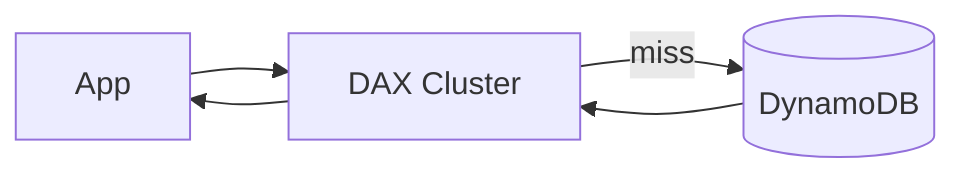

# Вопросы на собеседовании: `DynamoDB`

`AWS DynamoDB` — serverless NoSQL key-value/document store. Single-digit ms latency at any scale. Used by Amazon (Cart, Prime), Netflix, Lyft. На интервью спрашивают: partition keys, indexes (GSI/LSI), single-table design, capacity modes, hot partitions, DynamoDB Streams, transactions, Global Tables.

Дата последнего обновления: 2026-04-19

## Полезные ссылки

### Официальная документация и авторитетные источники

- [DynamoDB Documentation](https://docs.aws.amazon.com/dynamodb/)
- [DynamoDB Best Practices](https://docs.aws.amazon.com/amazondynamodb/latest/developerguide/best-practices.html)
- [The DynamoDB Book — Alex DeBrie](https://www.dynamodbbook.com/) — best resource
- [DynamoDB Guide (Alex DeBrie)](https://www.dynamodbguide.com/)
- [Single-Table Design Tutorial](https://www.alexdebrie.com/posts/dynamodb-single-table/)

## Содержание

- [Полезные ссылки](#полезные-ссылки)
- [See also](#see-also)

**Базовые понятия**
- [Q1. (!) Что такое DynamoDB?](#q1--что-такое-dynamodb)
- [Q2. (!) DynamoDB vs MongoDB / Cassandra?](#q2--dynamodb-vs-mongodb--cassandra)
- [Q3. (!) Когда DynamoDB не подходит?](#q3--когда-dynamodb-не-подходит)

**Data model**
- [Q4. (!) Partition key, sort key — primary key?](#q4--partition-key-sort-key--primary-key)
- [Q5. Item, attribute — что это?](#q5-item-attribute--что-это)
- [Q6. (!) Какие data types?](#q6--какие-data-types)
- [Q7. Item size limit (400 KB)?](#q7-item-size-limit-400-kb)

**Indexes**
- [Q8. (!) GSI (Global Secondary Index) — что и зачем?](#q8--gsi-global-secondary-index--что-и-зачем)
- [Q9. (!) LSI (Local Secondary Index) — отличия от GSI?](#q9--lsi-local-secondary-index--отличия-от-gsi)
- [Q10. Sparse indexes?](#q10-sparse-indexes)

**Single-table design**
- [Q11. (!) Что такое single-table design?](#q11--что-такое-single-table-design)
- [Q12. (!) Access patterns — почему важны?](#q12--access-patterns--почему-важны)
- [Q13. Composite key strategies (PK/SK)?](#q13-composite-key-strategies-pksk)

**Capacity и pricing**
- [Q14. (!) On-demand vs Provisioned capacity?](#q14--on-demand-vs-provisioned-capacity)
- [Q15. RCU и WCU — что это?](#q15-rcu-и-wcu--что-это)
- [Q16. (!) Hot partition problem?](#q16--hot-partition-problem)
- [Q17. Adaptive capacity?](#q17-adaptive-capacity)

**Querying**
- [Q18. (!) GetItem, Query, Scan — отличия?](#q18--getitem-query-scan--отличия)
- [Q19. PartiQL для DynamoDB?](#q19-partiql-для-dynamodb)
- [Q20. Filter expressions?](#q20-filter-expressions)
- [Q21. Pagination в DynamoDB?](#q21-pagination-в-dynamodb)

**Transactions**
- [Q22. (!) DynamoDB Transactions?](#q22--dynamodb-transactions)
- [Q23. Conditional writes?](#q23-conditional-writes)
- [Q24. Optimistic locking?](#q24-optimistic-locking)

**Streams и event-driven**
- [Q25. (!) DynamoDB Streams?](#q25--dynamodb-streams)
- [Q26. Lambda triggers?](#q26-lambda-triggers)

**Performance**
- [Q27. (!) DAX (DynamoDB Accelerator)?](#q27--dax-dynamodb-accelerator)
- [Q28. (!) Global Tables (multi-region)?](#q28--global-tables-multi-region)

**Production**
- [Q29. Backup и PITR?](#q29-backup-и-pitr)
- [Q30. (!) Какие частые ошибки в DynamoDB production?](#q30--какие-частые-ошибки-в-dynamodb-production)

## Q1. (!) Что такое DynamoDB?

**DynamoDB** — fully managed serverless NoSQL key-value/document store от AWS (с 2012).

**Ключевые особенности:**
- **Single-digit ms** latency at any scale
- **Auto-scaling** (или provisioned)
- **Multi-region** через Global Tables
- **Serverless** — no infrastructure management
- **Built-in HA** (3 AZ replication)
- **Pay-per-request** или provisioned

**Built по принципам Amazon Dynamo paper** (2007). Используется внутри Amazon (Cart, Prime, ad tech).

## Q2. (!) DynamoDB vs MongoDB / Cassandra?

| Критерий | DynamoDB | MongoDB | Cassandra |
|----------|----------|---------|-----------|
| Хостинг | AWS only (managed) | Self-host / Atlas | Self-host / Astra |
| Tип | Key-value / Document | Document | Wide-column |
| Schema | Schemaless | Schemaless | Schema (CQL) |
| Joins | No | Limited (`$lookup`) | No |
| Transactions | Yes (limited) | Yes (4.0+) | Limited |
| Latency | Single-digit ms | Variable | Single-digit ms |
| Scaling | Auto | Manual sharding | Manual |
| Vendor lock-in | High | Low | Low |
| Cost | Variable | Variable | Self-host: low |

**Когда DynamoDB:** AWS-native apps, predictable access patterns, want serverless.
**Когда MongoDB:** flexible schema, complex queries, document model.
**Когда Cassandra:** очень большой scale, multi-region, write-heavy.

## Q3. (!) Когда DynamoDB не подходит?

**Не подходит если:**
- **Complex queries** (joins, aggregations) — DynamoDB не для analytics
- **Ad-hoc queries** (unknown access patterns) — DynamoDB требует pre-design
- **Reporting / BI** — use Athena или Redshift
- **Full-text search** — use OpenSearch
- **Multi-region writes** в существующих regions — Global Tables новые tables only
- **Free-form queries** — relational DB лучше

**Подходит когда:**
- Known access patterns
- Need predictable performance at scale
- Serverless-friendly stack
- AWS ecosystem

## Q4. (!) Partition key, sort key — primary key?

**Primary key** — uniquely identifies item.

**Two options:**

**1. Partition key only:**
```
PK: user_id (e.g., "user#123")
```

**2. Composite (partition key + sort key):**
```
PK: user_id        (partition by user)
SK: order_date     (sort within user)
```

**Effect:**
- **Partition key** → hash → which physical partition хранит item
- **Sort key** → ordering within partition
- **Same PK** → same partition → can `Query` efficiently

**Best practices:**
- Choose PK с **high cardinality** (avoid hot partitions)
- Use SK для one-to-many relationships within partition

## Q5. Item, attribute — что это?

**Item** — single record (~ row в SQL).
**Attribute** — field в item (~ column).

```json
{
  "user_id": "user#123",      // PK attribute
  "order_id": "order#456",     // SK attribute
  "amount": 99.99,
  "items": ["A", "B"],
  "created_at": "2025-04-19T10:00:00Z"
}
```

Каждый item — JSON document. **Schema flexibility** — items в одной table могут иметь разные attributes.

## Q6. (!) Какие data types?

**Scalar:**
- `S` — String
- `N` — Number
- `B` — Binary
- `BOOL` — Boolean
- `NULL`

**Document:**
- `M` — Map (nested object)
- `L` — List (array)

**Set:**
- `SS` — String Set
- `NS` — Number Set
- `BS` — Binary Set

```json
{
  "user_id": {"S": "user#123"},
  "age": {"N": "30"},
  "tags": {"SS": ["premium", "verified"]},
  "address": {"M": {"city": {"S": "London"}}}
}
```

## Q7. Item size limit (400 KB)?

**Каждый item** — max **400 KB** (включая attributes names + values).

**Workarounds для больших items:**
- **Compress** before write (gzip)
- **Split** в multiple items (с composite key)
- **Store payload в S3**, save reference в DynamoDB

```python
# Pattern: large body → S3, reference в DynamoDB
{
  "PK": "doc#123",
  "metadata": {...},
  "body_s3_uri": "s3://bucket/docs/123.txt"
}
```

## Q8. (!) GSI (Global Secondary Index) — что и зачем?

**GSI** — alternative key для table. Позволяет query по non-PK attributes.

```
Main table:
  PK: user_id, SK: order_id

GSI 1:
  PK: order_id, SK: created_at
  → Query orders by order_id directly

GSI 2:
  PK: status, SK: created_at
  → Query orders by status, sorted by date
```

**Особенности:**
- **Eventually consistent** (default)
- **Separate provisioned capacity** (или on-demand inherits)
- **Costs additional storage**
- Up to **20 GSIs per table** (default)
- **Sparse** by default — only items с indexed attributes appear

## Q9. (!) LSI (Local Secondary Index) — отличия от GSI?

**LSI** — same partition key как main table, **alternative sort key**.

```
Main table:
  PK: user_id, SK: order_date

LSI:
  PK: user_id (same), SK: amount
  → Query user's orders sorted by amount
```

**Отличия от GSI:**

| Critterion | GSI | LSI |
|-----------|-----|-----|
| Partition key | Different | **Same as main** |
| Created when | Anytime | **Only at table creation** |
| Consistency | Eventually | Strongly consistent option |
| Capacity | Separate | Shared с main table |
| Limit | 20 per table | 5 per table |

**LSI rarely used.** GSI more flexible. Use LSI только если **strong consistency** critical.

## Q10. Sparse indexes?

**Sparse index** — items appear в index только если индексируемый attribute exists.

```python
# Item 1
{"PK": "user#1", "SK": "order#1", "status": "PENDING"}

# Item 2
{"PK": "user#2", "SK": "order#2"}  # no status attribute
```

GSI на `status`:
- Item 1 → in index
- Item 2 → **not in index**

**Use case:** "active items" pattern.

```python
# Add "active" attribute только для active orders
{"PK": "order#1", "active": "Y", ...}  # in active GSI
{"PK": "order#2", ...}                  # closed, not in active GSI
```

Query active orders → small GSI.

## Q11. (!) Что такое single-table design?

**Single-table design** — паттерн в DynamoDB: **all entities** в **одной table**, разделённые через PK/SK patterns.

```
PK              | SK              | type    | data...
user#123        | profile          | USER    | {name, email}
user#123        | order#456        | ORDER   | {amount, date}
user#123        | order#789        | ORDER   | {amount, date}
order#456       | item#a           | ITEM    | {sku, qty}
order#456       | item#b           | ITEM    | {sku, qty}
product#sku-1   | metadata         | PRODUCT | {name, price}
```

**Зачем:**
- **One Query** fetches related items (vs multiple queries / joins)
- **Atomic transactions** within table
- **Cheaper** (one table provisioning)

**Trade-off:**
- **Сложнее проектировать** — нужно знать access patterns заранее
- **Не intuitive** для SQL backgrounds
- Updates / migrations harder

В **2025** — single-table — recommended pattern для DynamoDB experts (Alex DeBrie).

## Q12. (!) Access patterns — почему важны?

**В отличие от SQL** (где модель first, queries after), в DynamoDB:

1. **List access patterns first**:
   - Get user by ID
   - Get user's orders
   - Get order with items
   - Get top 10 popular products
   ...

2. **Design table** для каждого pattern:
   - Choose PK/SK для each query
   - Plan GSIs

3. **Avoid `Scan`** (full table scan, slow + expensive)

**Без upfront design** — DynamoDB performance terrible.

## Q13. Composite key strategies (PK/SK)?

**Common patterns:**

**Hierarchical (one-to-many):**
```
PK: user#123 + SK: profile         → user profile
PK: user#123 + SK: order#456       → user's order
PK: user#123 + SK: order#789       → another order
```
Query `PK="user#123" AND begins_with(SK, "order#")` → all orders.

**Date-based:**
```
PK: user#123 + SK: 2025-04-19#order#456
```
Query orders by date range.

**Inverted index:**
```
GSI: PK = SK, SK = PK
```
Reverse lookup.

## Q14. (!) On-demand vs Provisioned capacity?

**On-demand:**
- Pay per request ($1.25 per million reads, $6.25 per million writes для US East)
- **Auto-scaling** instant
- **No capacity planning**
- Best для: unpredictable traffic, dev/test

**Provisioned:**
- Pre-allocate **RCU/WCU**
- Cheaper для **predictable steady traffic**
- Reserved capacity discount available (до 76%)
- **Auto-scaling** доступен (но reactive, lag)

**Best practice:** **on-demand** для dev / unknown patterns. **Provisioned** для production с predictable load.

## Q15. RCU и WCU — что это?

**RCU (Read Capacity Unit):**
- 1 strongly consistent read of item < 4 KB
- 2 eventually consistent reads of item < 4 KB
- 0.5 transactional reads

**WCU (Write Capacity Unit):**
- 1 write of item < 1 KB
- 2 transactional writes

**Examples:**
- Read 8 KB strongly consistent = 2 RCUs
- Write 2 KB item = 2 WCUs

**Provisioning:**
```
RCU: 1000 = 1000 reads/sec для < 4 KB items
WCU: 500 = 500 writes/sec для < 1 KB items
```

При throttling — `ProvisionedThroughputExceededException`.

## Q16. (!) Hot partition problem?

**Hot partition** — single partition key getting **disproportionate** traffic.

```
Bad PK choice: status = "ACTIVE" → 99% of items
→ All reads hit one partition → throttle
```

DynamoDB partitions data by **PK hash**. If one PK has много traffic → physical partition overloaded.

**Symptoms:**
- Throttling, even though provisioned capacity high
- Уneven request distribution

**Solutions:**
- **Choose high-cardinality PK** (user_id, order_id — not status)
- **Write sharding:** add suffix `(user_id)#1, (user_id)#2, ...` → distribute hot items
- **Read sharding** (cache reads через DAX)
- **Adaptive capacity** (auto, см. ниже)

## Q17. Adaptive capacity?

С 2018 — **adaptive capacity** в DynamoDB. Auto-redistributes capacity к hot partitions.

Если table provisioned 1000 WCU evenly, но 90% traffic on one partition → DynamoDB **temporarily boosts** that partition's capacity.

**Эффект:** smooths out short-term hot partition issues.

**Не fix:** долгосрочные hot partitions всё равно need design fix.

## Q18. (!) GetItem, Query, Scan — отличия?

**GetItem** — fetch single item by full PK (and SK if composite).
- Fastest: O(1)
- Single-digit ms latency

**Query** — fetch multiple items с **same partition key**.
- Specify PK + optional SK condition (=, BETWEEN, BEGINS_WITH, ...)
- Sort by SK (ASC/DESC)
- Pagination support
- Fast: only that partition read

**Scan** — read entire table.
- **Slow + expensive**
- Use only for small tables / migrations
- **Avoid в production** code

```python
# GetItem — fast
table.get_item(Key={"PK": "user#123", "SK": "profile"})

# Query — fast
table.query(
    KeyConditionExpression=Key("PK").eq("user#123") & Key("SK").begins_with("order#")
)

# Scan — slow!
table.scan(FilterExpression=Attr("status").eq("ACTIVE"))
```

## Q19. PartiQL для DynamoDB?

**PartiQL** — SQL-like query language для DynamoDB (с 2020).

```sql
SELECT * FROM "MyTable" WHERE PK = 'user#123' AND begins_with(SK, 'order#');
INSERT INTO "MyTable" VALUE {'PK': 'user#456', 'name': 'Alice'};
UPDATE "MyTable" SET status = 'ACTIVE' WHERE PK = 'user#123';
```

Convenience layer над DynamoDB API. Internally compiles в Query/Scan/PutItem/...

**Не настоящий SQL:** все same constraints (no joins, scans expensive, etc.).

## Q20. Filter expressions?

**Filter** — applied **after** Query/Scan reads items, **before** returning.

```python
table.query(
    KeyConditionExpression=Key("PK").eq("user#123"),
    FilterExpression=Attr("status").eq("ACTIVE")
)
```

**Подвох:** **filter не reduces read capacity**. Items still read, then filtered.

**Best practice:** use **Key conditions** (efficient) over filters when possible. Add new GSI если нужен фильтр часто.

## Q21. Pagination в DynamoDB?

```python
response = table.query(
    KeyConditionExpression=Key("PK").eq("user#123"),
    Limit=20  # max 20 items per page
)

# Pagination token
last_key = response.get("LastEvaluatedKey")

# Next page
response = table.query(
    KeyConditionExpression=...,
    Limit=20,
    ExclusiveStartKey=last_key
)
```

**1 MB max** per response. Если результат больше — pagination needed.

## Q22. (!) DynamoDB Transactions?

**TransactWriteItems** — atomic группа до **100 actions** в одной transaction.

```python
client.transact_write_items(
    TransactItems=[
        {"Put": {"TableName": "Orders", "Item": {...}}},
        {"Update": {"TableName": "Inventory", "Key": {...}, "UpdateExpression": "SET qty = qty - :n"}},
        {"ConditionCheck": {"TableName": "Users", "Key": {...}, "ConditionExpression": "active = :true"}}
    ]
)
```

**TransactGetItems** — atomic read до 100 items.

**Особенности:**
- ACID (within DynamoDB)
- Up to 4 MB / 100 items
- 2x WCU/RCU cost (vs non-transactional)
- Can fail (ConditionalCheckFailed) — retry

## Q23. Conditional writes?

**Atomic conditional updates** без transactions.

```python
table.put_item(
    Item={"PK": "user#123", "name": "Alice"},
    ConditionExpression="attribute_not_exists(PK)"  # Only if doesn't exist
)

table.update_item(
    Key={"PK": "order#123"},
    UpdateExpression="SET #s = :new",
    ConditionExpression="#s = :expected",  # CAS
    ExpressionAttributeNames={"#s": "status"},
    ExpressionAttributeValues={":new": "SHIPPED", ":expected": "PROCESSING"}
)
```

**Use cases:**
- Idempotency (insert if not exists)
- Optimistic locking
- Atomic counters

## Q24. Optimistic locking?

**Pattern:** version attribute + CAS (compare-and-swap).

```python
# Read
item = table.get_item(...)["Item"]
version = item["version"]

# Update в коде
item["amount"] = 200

# Write с CAS
table.update_item(
    Key={"PK": item["PK"]},
    UpdateExpression="SET amount = :new, version = version + 1",
    ConditionExpression="version = :expected",
    ExpressionAttributeValues={":new": 200, ":expected": version}
)
# Если version изменилась → ConditionalCheckFailed → retry
```

DynamoDB Mapper для DynamoDB Java SDK имеет built-in `@DynamoDbVersionAttribute`.

## Q25. (!) DynamoDB Streams?

**DynamoDB Streams** — change data capture (CDC) для DynamoDB.

Каждое INSERT / UPDATE / DELETE → event в stream.

**Stream record:**
```json
{
  "eventName": "INSERT",
  "dynamodb": {
    "Keys": {"PK": {"S": "user#123"}},
    "NewImage": {...},
    "OldImage": {...}
  }
}
```

**Retention:** 24 hours.

**Use cases:**
- Trigger Lambdas on data changes
- Replicate to ElasticSearch / OpenSearch
- Update aggregates / cache
- Send notifications
- Audit log

## Q26. Lambda triggers?

**Lambda trigger** на DynamoDB Streams:

```python
def handler(event, context):
    for record in event["Records"]:
        if record["eventName"] == "INSERT":
            new_item = record["dynamodb"]["NewImage"]
            # Process new order, send email, etc.
```

**Configuration:**
- Batch size (1-10000)
- Batch window (0-5 sec)
- Parallelization factor (1-10)
- Filter expressions (process only matching records)

**Подвох:** Lambda processes batch — partial failure handling требует `ReportBatchItemFailures`.

Подробнее — в [AWS Lambda](../cloud/aws-lambda-interview.md).

## Q27. (!) DAX (DynamoDB Accelerator)?

**DAX** — managed in-memory cache в front DynamoDB. Microsecond latency.



**API-compatible** — drop-in for DynamoDB SDK.

**Caches:**
- **Item cache** — `GetItem` results
- **Query cache** — `Query` results

**Use case:** read-heavy workloads с frequent same-item access.

**Не для:**
- Strong consistency (DAX is eventually consistent)
- Write-heavy (only cache reads)

## Q28. (!) Global Tables (multi-region)?

**Global Tables** — multi-region replication для DynamoDB.

```
Region us-east-1: tables replicates ↔
Region eu-west-1: tables replicates ↔
Region ap-northeast-1: tables replicates
```

**Multi-master:** writes accepted в любом region, replicated к other regions.

**Conflict resolution:** **last writer wins** (по timestamp).

**Use cases:**
- Disaster recovery
- Low latency to multiple regions
- Compliance (data residency)

**Подвох:** **eventual consistency** between regions. Up to seconds delay.

## Q29. Backup и PITR?

**On-demand backups:**
```bash
aws dynamodb create-backup --table-name MyTable --backup-name backup-1
```

**PITR (Point-in-time recovery):**
- Restore до любой секунды last 35 days
- Continuous backups
- ~$0.20/GB/month extra

```bash
aws dynamodb update-continuous-backups \
  --table-name MyTable \
  --point-in-time-recovery-specification PointInTimeRecoveryEnabled=true
```

**Best practice:** PITR enabled для production.

## Q30. (!) Какие частые ошибки в DynamoDB production?

1. **Wrong PK choice** — hot partitions, throttling
2. **`Scan` в production** — slow, expensive
3. **No access patterns design** — relational thinking
4. **Too many GSIs** — duplicate writes overhead, cost
5. **Items > 400 KB** — split or use S3 references
6. **No PITR** — data loss risks
7. **Provisioned capacity wrong** — over (cost) или under (throttle)
8. **Filter vs Key Condition** — реads still consume capacity
9. **Unbounded query results** (no Limit) — load entire partition
10. **Wrong consistency model** — strongly consistent doubles cost

**Best practice:** read [The DynamoDB Book by Alex DeBrie](https://www.dynamodbbook.com/).

---

## See also

- [MongoDB](mongodb-interview.md) — alternative document store
- [Cassandra](cassandra-interview.md) — wide-column NoSQL
- [Redis](redis-interview.md) — for caching
- [AWS](../cloud/aws-interview.md) — context
- [AWS Lambda](../cloud/aws-lambda-interview.md) — Streams triggers
- [Serverless](../cloud/serverless-interview.md) — DynamoDB friendly
- [Database Architecture](database-architecture-interview.md) — NoSQL context
- [Scalability Patterns](../architecture/scalability-patterns-interview.md) — DynamoDB scales
- [Caching Strategies](../architecture/caching-strategies-interview.md) — DAX
- [Микросервисы](../architecture/microservices-interview.md) — DynamoDB per microservice
- [Event-driven](../architecture/event-driven-patterns-interview.md) — Streams
