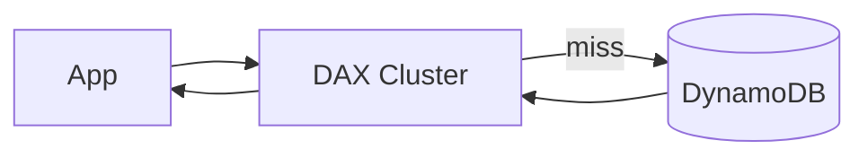

# Вопросы на собеседовании: `DynamoDB`

`AWS DynamoDB` — serverless NoSQL key-value/document-хранилище. Однозначные миллисекунды задержки при любом масштабе. Используют Amazon (Cart, Prime), Netflix, Lyft. На интервью спрашивают: partition keys, индексы (GSI/LSI), single-table design, режимы capacity, hot partitions, DynamoDB Streams, транзакции, Global Tables.

## Полезные ссылки

### Официальная документация и авторитетные источники

- [DynamoDB Documentation](https://docs.aws.amazon.com/dynamodb/)
- [DynamoDB Best Practices](https://docs.aws.amazon.com/amazondynamodb/latest/developerguide/best-practices.html)
- [The DynamoDB Book — Alex DeBrie](https://www.dynamodbbook.com/) — лучший ресурс
- [DynamoDB Guide (Alex DeBrie)](https://www.dynamodbguide.com/)
- [Single-Table Design Tutorial](https://www.alexdebrie.com/posts/dynamodb-single-table/)

## Содержание

- [Полезные ссылки](#полезные-ссылки)
- [See also](#see-also)

**Базовые понятия**
- [Q1. (!) Что такое DynamoDB?](#q1--что-такое-dynamodb)
- [Q2. (!) DynamoDB vs MongoDB / Cassandra?](#q2--dynamodb-vs-mongodb--cassandra)
- [Q3. (!) Когда DynamoDB не подходит?](#q3--когда-dynamodb-не-подходит)

**Data model**
- [Q4. (!) Partition key, sort key — primary key?](#q4--partition-key-sort-key--primary-key)
- [Q5. Item, attribute — что это?](#q5-item-attribute--что-это)
- [Q6. (!) Какие data types?](#q6--какие-data-types)
- [Q7. Item size limit (400 KB)?](#q7-item-size-limit-400-kb)

**Indexes**
- [Q8. (!) GSI (Global Secondary Index) — что и зачем?](#q8--gsi-global-secondary-index--что-и-зачем)
- [Q9. (!) LSI (Local Secondary Index) — отличия от GSI?](#q9--lsi-local-secondary-index--отличия-от-gsi)
- [Q10. Sparse indexes?](#q10-sparse-indexes)

**Single-table design**
- [Q11. (!) Что такое single-table design?](#q11--что-такое-single-table-design)
- [Q12. (!) Access patterns — почему важны?](#q12--access-patterns--почему-важны)
- [Q13. Composite key strategies (PK/SK)?](#q13-composite-key-strategies-pksk)

**Capacity и pricing**
- [Q14. (!) On-demand vs Provisioned capacity?](#q14--on-demand-vs-provisioned-capacity)
- [Q15. RCU и WCU — что это?](#q15-rcu-и-wcu--что-это)
- [Q16. (!) Hot partition problem?](#q16--hot-partition-problem)
- [Q17. Adaptive capacity?](#q17-adaptive-capacity)

**Querying**
- [Q18. (!) GetItem, Query, Scan — отличия?](#q18--getitem-query-scan--отличия)
- [Q19. PartiQL для DynamoDB?](#q19-partiql-для-dynamodb)
- [Q20. Filter expressions?](#q20-filter-expressions)
- [Q21. Pagination в DynamoDB?](#q21-pagination-в-dynamodb)

**Transactions**
- [Q22. (!) DynamoDB Transactions?](#q22--dynamodb-transactions)
- [Q23. Conditional writes?](#q23-conditional-writes)
- [Q24. Optimistic locking?](#q24-optimistic-locking)

**Streams и event-driven**
- [Q25. (!) DynamoDB Streams?](#q25--dynamodb-streams)
- [Q26. Lambda triggers?](#q26-lambda-triggers)

**Performance**
- [Q27. (!) DAX (DynamoDB Accelerator)?](#q27--dax-dynamodb-accelerator)
- [Q28. (!) Global Tables (multi-region)?](#q28--global-tables-multi-region)

**Production**
- [Q29. Backup и PITR?](#q29-backup-и-pitr)
- [Q30. (!) Какие частые ошибки в DynamoDB production?](#q30--какие-частые-ошибки-в-dynamodb-production)

## Q1. (!) Что такое DynamoDB?

**DynamoDB** — полностью управляемое serverless NoSQL key-value/document-хранилище от AWS (с 2012).

**Ключевые особенности:**
- **Однозначные миллисекунды** задержки при любом масштабе
- **Авто-масштабирование** (или provisioned)
- **Multi-region** через Global Tables
- **Serverless** — нет управления инфраструктурой
- **Встроенная HA** (репликация по 3 AZ)
- **Pay-per-request** или provisioned

**Построена на принципах статьи Amazon Dynamo** (2007). Используется внутри Amazon (Cart, Prime, ad tech).

## Q2. (!) DynamoDB vs MongoDB / Cassandra?

| Критерий | DynamoDB | MongoDB | Cassandra |
|----------|----------|---------|-----------|
| Хостинг | Только AWS (managed) | Self-host / Atlas | Self-host / Astra |
| Тип | Key-value / Document | Document | Wide-column |
| Схема | Schemaless | Schemaless | Со схемой (CQL) |
| Joins | Нет | Ограниченно (`$lookup`) | Нет |
| Транзакции | Да (ограниченно) | Да (4.0+) | Ограниченно |
| Задержка | Однозначные мс | Переменная | Однозначные мс |
| Масштабирование | Авто | Ручной шардинг | Ручное |
| Vendor lock-in | Высокий | Низкий | Низкий |
| Стоимость | Переменная | Переменная | Self-host: низкая |

**Когда DynamoDB:** AWS-native приложения, предсказуемые access patterns, нужен serverless.
**Когда MongoDB:** гибкая схема, сложные запросы, документная модель.
**Когда Cassandra:** очень большой масштаб, multi-region, write-heavy нагрузка.

## Q3. (!) Когда DynamoDB не подходит?

**Не подходит если:**
- **Сложные запросы** (joins, агрегации) — DynamoDB не для аналитики
- **Ad-hoc запросы** (заранее неизвестные access patterns) — DynamoDB требует проектирования заранее
- **Отчётность / BI** — используйте Athena или Redshift
- **Полнотекстовый поиск** — используйте OpenSearch
- **Multi-region записи** в существующих регионах — Global Tables только для новых таблиц
- **Произвольные запросы** — реляционная БД лучше

**Подходит когда:**
- Access patterns известны
- Нужна предсказуемая производительность на масштабе
- Стек, дружелюбный к serverless
- Экосистема AWS

## Q4. (!) Partition key, sort key — primary key?

**Primary key** — однозначно идентифицирует item.

**Два варианта:**

**1. Только partition key (ключ партиции):**
```
PK: user_id (e.g., "user#123")
```

**2. Составной (partition key + sort key):**
```
PK: user_id        (partition by user)
SK: order_date     (sort within user)
```

**Эффект:**
- **Partition key** → хеш → определяет, в какой физической партиции хранится item
- **Sort key** → упорядочивание внутри партиции
- **Один и тот же PK** → та же партиция → можно эффективно делать `Query`

**Best practices:**
- Выбирайте PK с **высокой кардинальностью** (избегайте hot partitions)
- Используйте SK для связей one-to-many внутри партиции

## Q5. Item, attribute — что это?

**Item** — отдельная запись (~ строка в SQL).
**Attribute** — поле в item (~ колонка).

```json
{
  "user_id": "user#123",      // PK attribute
  "order_id": "order#456",     // SK attribute
  "amount": 99.99,
  "items": ["A", "B"],
  "created_at": "2025-04-19T10:00:00Z"
}
```

Каждый item — это JSON-документ. **Гибкость схемы** — items в одной таблице могут иметь разные attributes.

## Q6. (!) Какие data types?

**Скалярные:**
- `S` — String
- `N` — Number
- `B` — Binary
- `BOOL` — Boolean
- `NULL`

**Документные:**
- `M` — Map (вложенный объект)
- `L` — List (массив)

**Множества:**
- `SS` — String Set
- `NS` — Number Set
- `BS` — Binary Set

```json
{
  "user_id": {"S": "user#123"},
  "age": {"N": "30"},
  "tags": {"SS": ["premium", "verified"]},
  "address": {"M": {"city": {"S": "London"}}}
}
```

## Q7. Item size limit (400 KB)?

**Каждый item** — максимум **400 KB** (включая имена attributes + значения).

**Обходные пути для больших items:**
- **Сжать** перед записью (gzip)
- **Разбить** на несколько items (через composite key)
- **Хранить payload в S3**, а в DynamoDB сохранять ссылку

```python
# Pattern: large body → S3, reference в DynamoDB
{
  "PK": "doc#123",
  "metadata": {...},
  "body_s3_uri": "s3://bucket/docs/123.txt"
}
```

## Q8. (!) GSI (Global Secondary Index) — что и зачем?

**GSI** — альтернативный ключ для таблицы. Позволяет делать query по attributes, отличным от PK.

```
Main table:
  PK: user_id, SK: order_id

GSI 1:
  PK: order_id, SK: created_at
  → Query orders by order_id directly

GSI 2:
  PK: status, SK: created_at
  → Query orders by status, sorted by date
```

**Особенности:**
- **Eventually consistent** (по умолчанию)
- **Отдельная provisioned capacity** (или наследует on-demand)
- **Требует дополнительного хранилища**
- До **20 GSI на таблицу** (по умолчанию)
- **Sparse** по умолчанию — попадают только items с индексируемыми attributes

## Q9. (!) LSI (Local Secondary Index) — отличия от GSI?

**LSI** — тот же partition key, что у основной таблицы, но **альтернативный sort key**.

```
Main table:
  PK: user_id, SK: order_date

LSI:
  PK: user_id (same), SK: amount
  → Query user's orders sorted by amount
```

**Отличия от GSI:**

| Критерий | GSI | LSI |
|-----------|-----|-----|
| Partition key | Другой | **Такой же, как у основной** |
| Когда создаётся | В любой момент | **Только при создании таблицы** |
| Консистентность | Eventually | Есть опция strongly consistent |
| Capacity | Отдельная | Общая с основной таблицей |
| Лимит | 20 на таблицу | 5 на таблицу |

**LSI используют редко.** GSI гибче. Применяйте LSI только если критична **строгая консистентность**.

## Q10. Sparse indexes?

**Sparse index** — item попадает в индекс только если у него существует индексируемый attribute.

```python
# Item 1
{"PK": "user#1", "SK": "order#1", "status": "PENDING"}

# Item 2
{"PK": "user#2", "SK": "order#2"}  # no status attribute
```

GSI по `status`:
- Item 1 → попадает в индекс
- Item 2 → **не попадает в индекс**

**Сценарий:** паттерн "активные items".

```python
# Add "active" attribute только для active orders
{"PK": "order#1", "active": "Y", ...}  # in active GSI
{"PK": "order#2", ...}                  # closed, not in active GSI
```

Query активных заказов → небольшой GSI.

## Q11. (!) Что такое single-table design?

**Single-table design** — паттерн в DynamoDB: **все сущности** в **одной таблице**, разделённые через паттерны PK/SK.

```
PK              | SK              | type    | data...
user#123        | profile          | USER    | {name, email}
user#123        | order#456        | ORDER   | {amount, date}
user#123        | order#789        | ORDER   | {amount, date}
order#456       | item#a           | ITEM    | {sku, qty}
order#456       | item#b           | ITEM    | {sku, qty}
product#sku-1   | metadata         | PRODUCT | {name, price}
```

**Зачем:**
- **Один Query** достаёт связанные items (вместо нескольких запросов / joins)
- **Атомарные транзакции** внутри таблицы
- **Дешевле** (provisioning одной таблицы)

**Trade-off:**
- **Сложнее проектировать** — нужно знать access patterns заранее
- **Не интуитивно** для тех, кто пришёл из SQL
- Обновления / миграции сложнее

В **2025** single-table — рекомендуемый паттерн у экспертов по DynamoDB (Alex DeBrie).

## Q12. (!) Access patterns — почему важны?

**В отличие от SQL** (где сначала модель, потом запросы), в DynamoDB:

1. **Сначала перечислите access patterns**:
   - Получить пользователя по ID
   - Получить заказы пользователя
   - Получить заказ вместе с items
   - Получить топ-10 популярных продуктов
   ...

2. **Спроектируйте таблицу** под каждый паттерн:
   - Выберите PK/SK под каждый запрос
   - Спланируйте GSI

3. **Избегайте `Scan`** (полный скан таблицы, медленно + дорого)

**Без проектирования заранее** производительность DynamoDB ужасна.

## Q13. Composite key strategies (PK/SK)?

**Частые паттерны:**

**Иерархический (one-to-many):**
```
PK: user#123 + SK: profile         → user profile
PK: user#123 + SK: order#456       → user's order
PK: user#123 + SK: order#789       → another order
```
Query `PK="user#123" AND begins_with(SK, "order#")` → все заказы.

**По дате:**
```
PK: user#123 + SK: 2025-04-19#order#456
```
Query заказов по диапазону дат.

**Инвертированный индекс:**
```
GSI: PK = SK, SK = PK
```
Обратный поиск.

## Q14. (!) On-demand vs Provisioned capacity?

**On-demand:**
- Оплата по запросам ($1.25 за миллион чтений, $6.25 за миллион записей для US East)
- **Авто-масштабирование** мгновенное
- **Не нужно планировать capacity**
- Лучше для: непредсказуемый трафик, dev/test

**Provisioned:**
- Заранее выделяете **RCU/WCU**
- Дешевле при **предсказуемом стабильном трафике**
- Доступна скидка на reserved capacity (до 76%)
- **Авто-масштабирование** доступно (но реактивное, с задержкой)

**Best practice:** **on-demand** для dev / неизвестных паттернов. **Provisioned** для production с предсказуемой нагрузкой.

## Q15. RCU и WCU — что это?

**RCU (Read Capacity Unit):**
- 1 strongly consistent чтение item < 4 KB
- 2 eventually consistent чтения item < 4 KB
- 0.5 транзакционных чтений

**WCU (Write Capacity Unit):**
- 1 запись item < 1 KB
- 2 транзакционных записи

**Примеры:**
- Чтение 8 KB strongly consistent = 2 RCU
- Запись item 2 KB = 2 WCU

**Provisioning:**
```
RCU: 1000 = 1000 reads/sec для < 4 KB items
WCU: 500 = 500 writes/sec для < 1 KB items
```

При throttling — `ProvisionedThroughputExceededException`.

## Q16. (!) Hot partition problem?

**Hot partition** — один partition key получает **непропорционально много** трафика.

```
Bad PK choice: status = "ACTIVE" → 99% of items
→ All reads hit one partition → throttle
```

DynamoDB распределяет данные по **хешу PK**. Если на один PK приходится много трафика → физическая партиция перегружена.

**Симптомы:**
- Throttling, даже при высокой provisioned capacity
- Неравномерное распределение запросов

**Решения:**
- **Выбирайте PK с высокой кардинальностью** (user_id, order_id — не status)
- **Write sharding:** добавить суффикс `(user_id)#1, (user_id)#2, ...` → распределить hot items
- **Read sharding** (кешировать чтения через DAX)
- **Adaptive capacity** (автоматически, см. ниже)

## Q17. Adaptive capacity?

С 2018 в DynamoDB есть **adaptive capacity**. Автоматически перераспределяет capacity к hot partitions.

Если таблице выделено 1000 WCU равномерно, но 90% трафика идёт на одну партицию → DynamoDB **временно повышает** capacity этой партиции.

**Эффект:** сглаживает краткосрочные проблемы с hot partitions.

**Не панацея:** долгосрочные hot partitions всё равно требуют исправления на уровне проектирования.

## Q18. (!) GetItem, Query, Scan — отличия?

**GetItem** — достаёт один item по полному PK (и SK, если ключ составной).
- Самый быстрый: O(1)
- Задержка в однозначные миллисекунды

**Query** — достаёт несколько items с **одним partition key**.
- Указываете PK + опциональное условие по SK (=, BETWEEN, BEGINS_WITH, ...)
- Сортировка по SK (ASC/DESC)
- Поддержка пагинации
- Быстро: читается только эта партиция

**Scan** — читает всю таблицу.
- **Медленно + дорого**
- Используйте только для маленьких таблиц / миграций
- **Избегайте в production**-коде

```python
# GetItem — fast
table.get_item(Key={"PK": "user#123", "SK": "profile"})

# Query — fast
table.query(
    KeyConditionExpression=Key("PK").eq("user#123") & Key("SK").begins_with("order#")
)

# Scan — slow!
table.scan(FilterExpression=Attr("status").eq("ACTIVE"))
```

## Q19. PartiQL для DynamoDB?

**PartiQL** — SQL-подобный язык запросов для DynamoDB (с 2020).

```sql
SELECT * FROM "MyTable" WHERE PK = 'user#123' AND begins_with(SK, 'order#');
INSERT INTO "MyTable" VALUE {'PK': 'user#456', 'name': 'Alice'};
UPDATE "MyTable" SET status = 'ACTIVE' WHERE PK = 'user#123';
```

Удобная обёртка над DynamoDB API. Внутри компилируется в Query/Scan/PutItem/...

**Это не настоящий SQL:** действуют те же ограничения (нет joins, scans дороги и т.д.).

## Q20. Filter expressions?

**Filter** — применяется **после** того, как Query/Scan прочитали items, но **до** их возврата.

```python
table.query(
    KeyConditionExpression=Key("PK").eq("user#123"),
    FilterExpression=Attr("status").eq("ACTIVE")
)
```

**Подвох:** **filter не уменьшает потребление read capacity**. Items всё равно читаются, а затем фильтруются.

**Best practice:** по возможности используйте **Key conditions** (эффективно) вместо фильтров. Добавьте новый GSI, если фильтр нужен часто.

## Q21. Pagination в DynamoDB?

```python
response = table.query(
    KeyConditionExpression=Key("PK").eq("user#123"),
    Limit=20  # max 20 items per page
)

# Pagination token
last_key = response.get("LastEvaluatedKey")

# Next page
response = table.query(
    KeyConditionExpression=...,
    Limit=20,
    ExclusiveStartKey=last_key
)
```

**Максимум 1 MB** на ответ. Если результат больше — нужна пагинация.

## Q22. (!) DynamoDB Transactions?

**TransactWriteItems** — атомарная группа до **100 действий** в одной транзакции.

```python
client.transact_write_items(
    TransactItems=[
        {"Put": {"TableName": "Orders", "Item": {...}}},
        {"Update": {"TableName": "Inventory", "Key": {...}, "UpdateExpression": "SET qty = qty - :n"}},
        {"ConditionCheck": {"TableName": "Users", "Key": {...}, "ConditionExpression": "active = :true"}}
    ]
)
```

**TransactGetItems** — атомарное чтение до 100 items.

**Особенности:**
- ACID (в пределах DynamoDB)
- До 4 MB / 100 items
- Стоимость 2x WCU/RCU (по сравнению с нетранзакционными)
- Может упасть (ConditionalCheckFailed) — нужен retry

## Q23. Conditional writes?

**Атомарные условные обновления** без транзакций.

```python
table.put_item(
    Item={"PK": "user#123", "name": "Alice"},
    ConditionExpression="attribute_not_exists(PK)"  # Only if doesn't exist
)

table.update_item(
    Key={"PK": "order#123"},
    UpdateExpression="SET #s = :new",
    ConditionExpression="#s = :expected",  # CAS
    ExpressionAttributeNames={"#s": "status"},
    ExpressionAttributeValues={":new": "SHIPPED", ":expected": "PROCESSING"}
)
```

**Сценарии:**
- Идемпотентность (вставить, если не существует)
- Оптимистичная блокировка
- Атомарные счётчики

## Q24. Optimistic locking?

**Паттерн:** атрибут version + CAS (compare-and-swap).

```python
# Read
item = table.get_item(...)["Item"]
version = item["version"]

# Update в коде
item["amount"] = 200

# Write с CAS
table.update_item(
    Key={"PK": item["PK"]},
    UpdateExpression="SET amount = :new, version = version + 1",
    ConditionExpression="version = :expected",
    ExpressionAttributeValues={":new": 200, ":expected": version}
)
# Если version изменилась → ConditionalCheckFailed → retry
```

DynamoDB Mapper в DynamoDB Java SDK имеет встроенный `@DynamoDbVersionAttribute`.

## Q25. (!) DynamoDB Streams?

**DynamoDB Streams** — change data capture (CDC) для DynamoDB.

Каждый INSERT / UPDATE / DELETE → событие в stream.

**Запись stream:**
```json
{
  "eventName": "INSERT",
  "dynamodb": {
    "Keys": {"PK": {"S": "user#123"}},
    "NewImage": {...},
    "OldImage": {...}
  }
}
```

**Retention:** 24 часа.

**Сценарии:**
- Запускать Lambda при изменениях данных
- Реплицировать в ElasticSearch / OpenSearch
- Обновлять агрегаты / кеш
- Отправлять уведомления
- Журнал аудита (audit log)

## Q26. Lambda triggers?

**Lambda-триггер** на DynamoDB Streams:

```python
def handler(event, context):
    for record in event["Records"]:
        if record["eventName"] == "INSERT":
            new_item = record["dynamodb"]["NewImage"]
            # Process new order, send email, etc.
```

**Конфигурация:**
- Batch size (1-10000)
- Batch window (0-5 сек)
- Parallelization factor (1-10)
- Filter expressions (обрабатывать только подходящие записи)

**Подвох:** Lambda обрабатывает пакет (batch) — обработка частичных сбоев требует `ReportBatchItemFailures`.

Подробнее — в [AWS Lambda](../cloud/aws-lambda-interview.md).

## Q27. (!) DAX (DynamoDB Accelerator)?

**DAX** — управляемый in-memory кеш перед DynamoDB. Задержка в микросекунды.



**API-совместим** — drop-in замена для DynamoDB SDK.

**Кеширует:**
- **Item cache** — результаты `GetItem`
- **Query cache** — результаты `Query`

**Сценарий:** read-heavy нагрузки с частым обращением к одним и тем же items.

**Не для:**
- Строгой консистентности (DAX eventually consistent)
- Write-heavy нагрузок (кешируются только чтения)

## Q28. (!) Global Tables (multi-region)?

**Global Tables** — multi-region репликация для DynamoDB.

```
Region us-east-1: tables replicates ↔
Region eu-west-1: tables replicates ↔
Region ap-northeast-1: tables replicates
```

**Multi-master:** записи принимаются в любом регионе и реплицируются в остальные.

**Разрешение конфликтов:** **last writer wins** (по timestamp).

**Сценарии:**
- Аварийное восстановление (disaster recovery)
- Низкая задержка для нескольких регионов
- Соответствие требованиям (data residency)

**Подвох:** **eventual consistency** между регионами. Задержка до нескольких секунд.

## Q29. Backup и PITR?

**On-demand бэкапы:**
```bash
aws dynamodb create-backup --table-name MyTable --backup-name backup-1
```

**PITR (Point-in-time recovery):**
- Восстановление до любой секунды за последние 35 дней
- Непрерывные бэкапы
- Дополнительно ~$0.20/GB/месяц

```bash
aws dynamodb update-continuous-backups \
  --table-name MyTable \
  --point-in-time-recovery-specification PointInTimeRecoveryEnabled=true
```

**Best practice:** PITR включён для production.

## Q30. (!) Какие частые ошибки в DynamoDB production?

1. **Неудачный выбор PK** — hot partitions, throttling
2. **`Scan` в production** — медленно, дорого
3. **Нет проектирования access patterns** — реляционное мышление
4. **Слишком много GSI** — накладные расходы на дублирующие записи, стоимость
5. **Items > 400 KB** — разбивать или использовать ссылки на S3
6. **Нет PITR** — риски потери данных
7. **Неверная provisioned capacity** — слишком много (стоимость) или слишком мало (throttle)
8. **Filter вместо Key Condition** — чтения всё равно потребляют capacity
9. **Неограниченные результаты query** (без Limit) — загружается вся партиция
10. **Неверная модель консистентности** — strongly consistent удваивает стоимость

**Best practice:** прочитайте [The DynamoDB Book by Alex DeBrie](https://www.dynamodbbook.com/).

---

## See also

- [MongoDB](mongodb-interview.md) — альтернативное документное хранилище
- [Cassandra](cassandra-interview.md) — wide-column NoSQL
- [Redis](redis-interview.md) — для кеширования
- [AWS](../cloud/aws-interview.md) — контекст
- [AWS Lambda](../cloud/aws-lambda-interview.md) — триггеры на Streams
- [Serverless](../cloud/serverless-interview.md) — хорошо дружит с DynamoDB
- [Database Architecture](database-architecture-interview.md) — контекст NoSQL
- [Scalability Patterns](../architecture/scalability-patterns-interview.md) — как DynamoDB масштабируется
- [Caching Strategies](../architecture/caching-strategies-interview.md) — DAX
- [Микросервисы](../architecture/microservices-interview.md) — DynamoDB на микросервис
- [Event-driven](../architecture/event-driven-patterns-interview.md) — Streams

- [Apache Cassandra](cassandra-interview.md)
- [ClickHouse](clickhouse-interview.md)
- [CockroachDB](cockroachdb-interview.md)
- [Database Architecture](database-architecture-interview.md)
- [Транзакции и уровни изоляции](database-transactions-interview.md)
- [Elasticsearch](elasticsearch-interview.md)
