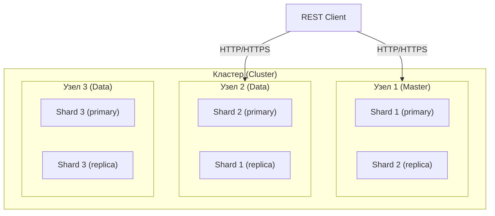
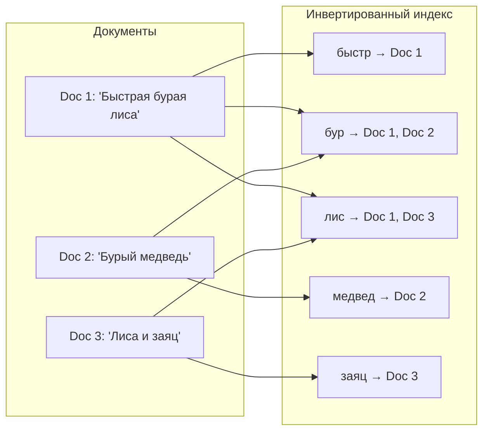
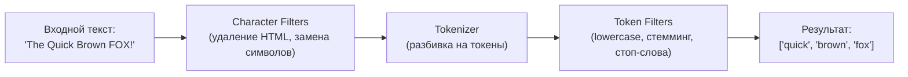
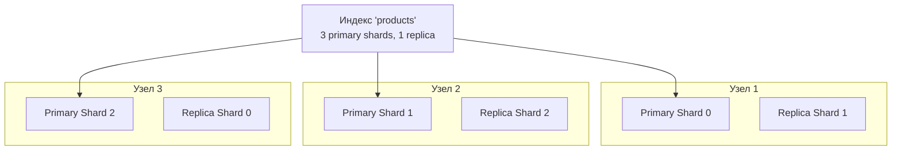
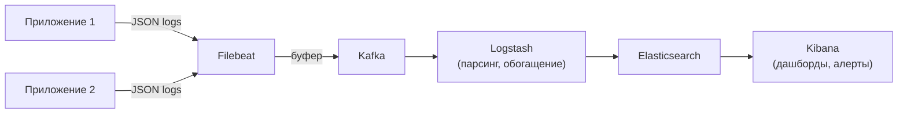

# Вопросы на собеседовании: `Elasticsearch`

Полное руководство по `Elasticsearch` для подготовки к собеседованиям: архитектура кластера, инвертированный индекс, `Query DSL`, агрегации, маппинги, шардирование, интеграция с `Spring Data Elasticsearch`, стек `ELK`, оптимизация производительности.

Дата последнего обновления: 2026-04-13

**`Elasticsearch`** — распределённый поисковый и аналитический движок на базе `Apache Lucene`. На собеседованиях проверяют знание архитектуры кластера, механизмов индексации, типов запросов, агрегаций, стратегий масштабирования и интеграции с `Java`/`Spring`.

## Полезные ссылки

### Официальная документация

- [Elasticsearch Reference](https://www.elastic.co/guide/en/elasticsearch/reference/current/index.html) — основная документация
- [Elasticsearch Java API Client](https://www.elastic.co/guide/en/elasticsearch/client/java-api-client/current/index.html) — официальный Java-клиент
- [Spring Data Elasticsearch Reference](https://docs.spring.io/spring-data/elasticsearch/reference/) — Spring Data интеграция
- [Elastic Stack Overview](https://www.elastic.co/elastic-stack) — обзор Elastic Stack (ELK)

### Статьи Baeldung

- [Introduction to Spring Data Elasticsearch](https://www.baeldung.com/spring-data-elasticsearch-tutorial) — практическое руководство
- [Elasticsearch Queries with Spring Data](https://www.baeldung.com/spring-data-elasticsearch-queries) — типы запросов
- [Guide to Elasticsearch in Java](https://www.baeldung.com/elasticsearch-java) — Java API Client
- [Add an Aggregation to an Elasticsearch Query](https://www.baeldung.com/elasticsearch-aggregation-query) — агрегации в Elasticsearch
- [Difference Between keyword and text in Elasticsearch](https://www.baeldung.com/elasticsearch-keyword-vs-text) — keyword vs text маппинг

## Содержание

- [Полезные ссылки](#полезные-ссылки)
- [See also](#see-also)

**Основы Elasticsearch**
- [Q1. (!) Что такое Elasticsearch и для чего он используется?](#q1--что-такое-elasticsearch-и-для-чего-он-используется)
- [Q2. (!) Какие основные компоненты архитектуры Elasticsearch?](#q2--какие-основные-компоненты-архитектуры-elasticsearch)
- [Q3. В чём разница между Elasticsearch и реляционной БД?](#q3-в-чём-разница-между-elasticsearch-и-реляционной-бд)
- [Q4. В чём разница между Elasticsearch и Apache Lucene?](#q4-в-чём-разница-между-elasticsearch-и-apache-lucene)
- [Q5. Что такое стек ELK/Elastic Stack?](#q5-что-такое-стек-elkelastic-stack)
- [Q6. (!) Какие преимущества и ограничения у Elasticsearch?](#q6--какие-преимущества-и-ограничения-у-elasticsearch)

**Индексы, документы и маппинги**
- [Q7. (!) Что такое Index в Elasticsearch?](#q7--что-такое-index-в-elasticsearch)
- [Q8. (!) Что такое Document?](#q8--что-такое-document)
- [Q9. (!) Что такое Mapping и как его настроить?](#q9--что-такое-mapping-и-как-его-настроить)
- [Q10. (!) В чём разница между типами text и keyword?](#q10--в-чём-разница-между-типами-text-и-keyword)
- [Q11. Какие типы данных поддерживает Elasticsearch?](#q11-какие-типы-данных-поддерживает-elasticsearch)
- [Q12. Что такое Dynamic Mapping и его подводные камни?](#q12-что-такое-dynamic-mapping-и-его-подводные-камни)

**Инвертированный индекс и анализ текста**
- [Q13. (!) Как работает инвертированный индекс?](#q13--как-работает-инвертированный-индекс)
- [Q14. (!) Что такое анализатор и из чего он состоит?](#q14--что-такое-анализатор-и-из-чего-он-состоит)
- [Q15. Что такое refresh и flush в контексте индексации?](#q15-что-такое-refresh-и-flush-в-контексте-индексации)

**Шардирование и репликация**
- [Q16. (!) Как работает Sharding в Elasticsearch?](#q16--как-работает-sharding-в-elasticsearch)
- [Q17. (!) Что такое Replication и зачем она нужна?](#q17--что-такое-replication-и-зачем-она-нужна)
- [Q18. Как масштабировать кластер Elasticsearch?](#q18-как-масштабировать-кластер-elasticsearch)
- [Q19. (!) Какие роли узлов существуют в кластере?](#q19--какие-роли-узлов-существуют-в-кластере)
- [Q20. Что означают статусы кластера green, yellow, red?](#q20-что-означают-статусы-кластера-green-yellow-red)

**Query DSL и поиск**
- [Q21. (!) Какой язык запросов используется в Elasticsearch?](#q21--какой-язык-запросов-используется-в-elasticsearch)
- [Q22. (!) В чём разница между query context и filter context?](#q22--в-чём-разница-между-query-context-и-filter-context)
- [Q23. (!) Как выполнять полнотекстовый поиск?](#q23--как-выполнять-полнотекстовый-поиск)
- [Q24. Как работает Bool Query?](#q24-как-работает-bool-query)
- [Q25. Как работает алгоритм релевантности BM25?](#q25-как-работает-алгоритм-релевантности-bm25)

**Агрегации**
- [Q26. (!) Какие типы агрегаций существуют в Elasticsearch?](#q26--какие-типы-агрегаций-существуют-в-elasticsearch)
- [Q27. Как использовать вложенные агрегации?](#q27-как-использовать-вложенные-агрегации)

**CRUD-операции и Bulk API**
- [Q28. Какие CRUD-операции доступны?](#q28-какие-crud-операции-доступны)
- [Q29. (!) Как работает Bulk API?](#q29--как-работает-bulk-api)
- [Q30. Как работает механизм оптимистической блокировки?](#q30-как-работает-механизм-оптимистической-блокировки)

**Spring Data Elasticsearch**
- [Q31. (!) Как интегрировать Elasticsearch со Spring Boot?](#q31--как-интегрировать-elasticsearch-со-spring-boot)
- [Q32. Как писать запросы через ElasticsearchOperations и NativeQuery?](#q32-как-писать-запросы-через-elasticsearchoperations-и-nativequery)
- [Q33. Как использовать Spring Data Elasticsearch Repository?](#q33-как-использовать-spring-data-elasticsearch-repository)

**Production: ILM, логирование, безопасность, оптимизация**
- [Q34. (!) Как оптимизировать производительность Elasticsearch?](#q34--как-оптимизировать-производительность-elasticsearch)
- [Q35. Что такое Index Lifecycle Management (ILM)?](#q35-что-такое-index-lifecycle-management-ilm)
- [Q36. Как использовать Elasticsearch для логирования?](#q36-как-использовать-elasticsearch-для-логирования)
- [Q37. Как обеспечить безопасность Elasticsearch?](#q37-как-обеспечить-безопасность-elasticsearch)
- [Q38. (!) Что такое Index Alias и зачем он нужен?](#q38--что-такое-index-alias-и-зачем-он-нужен)

**Релевантность, Highlight и продвинутые запросы**
- [Q39. (!) Как управлять релевантностью и ранжированием в Elasticsearch?](#q39--как-управлять-релевантностью-и-ранжированием-в-elasticsearch)
- [Q40. Что такое Highlight API и как его использовать?](#q40-что-такое-highlight-api-и-как-его-использовать)
- [Q41. Как реализовать поиск с пагинацией: from/size, search_after и PIT?](#q41-как-реализовать-поиск-с-пагинацией-fromsize-search_after-и-pit)
- [Q42. (!) Что такое Runtime Fields и когда их использовать?](#q42--что-такое-runtime-fields-и-когда-их-использовать)
- [Q43. Как реализовать автодополнение (Autocomplete) в Elasticsearch?](#q43-как-реализовать-автодополнение-autocomplete-в-elasticsearch)
- [Q44. Что такое Percolate Query?](#q44-что-такое-percolate-query)

## Q1. (!) Что такое `Elasticsearch` и для чего он используется?

`Elasticsearch` — распределённая поисковая и аналитическая система с открытым исходным кодом, построенная поверх `Apache Lucene`. Хранит данные в виде `JSON`-документов и обеспечивает поиск в режиме, близком к реальному времени (near real-time).

Основные сценарии использования:

| Сценарий | Описание |
|----------|----------|
| **Полнотекстовый поиск** | Поиск по товарам, статьям, документам — стемминг, синонимы, fuzzy-поиск |
| **Лог-аналитика** | Индексация и анализ логов приложений (стек `ELK`) |
| **Метрики и мониторинг** | Хранение и визуализация временных рядов (`Kibana`) |
| **Геопоиск** | Поиск объектов по координатам и радиусу |
| **Автодополнение** | Suggest API для подсказок при вводе |
| **Аналитика** | Агрегации по большим объёмам данных в реальном времени |

`Elasticsearch` широко применяется в электронной коммерции, системах мониторинга, CMS и поисковых платформах. Подробнее о распределённых системах в [вопросах по распределённым системам](../architecture/distributed-systems-interview.md).

## Q2. (!) Какие основные компоненты архитектуры `Elasticsearch`?



Основные компоненты:

- **Кластер (`Cluster`)** — группа узлов с общим именем, совместно хранящих данные и обрабатывающих запросы
- **Узел (`Node`)** — один экземпляр `Elasticsearch` на сервере. Узлы бывают разных ролей: `master`, `data`, `ingest`, `coordinating`
- **Индекс (`Index`)** — логическая коллекция документов (аналог таблицы в РСУБД)
- **Документ (`Document`)** — базовая единица хранения, `JSON`-объект с уникальным `_id`
- **Маппинг (`Mapping`)** — схема индекса: типы полей, анализаторы, настройки хранения
- **Шард (`Shard`)** — горизонтальный фрагмент индекса, каждый шард — отдельный экземпляр `Lucene`
- **Реплика (`Replica`)** — копия primary-шарда на другом узле для отказоустойчивости и масштабирования чтения

## Q3. В чём разница между `Elasticsearch` и реляционной БД?

| Характеристика | `Elasticsearch` | Реляционная БД (`PostgreSQL`) |
|---------------|-----------------|-------------------------------|
| Модель данных | Документы (`JSON`) | Таблицы и строки |
| Схема | Гибкая (dynamic mapping) | Жёсткая (DDL) |
| Язык запросов | `Query DSL` (JSON) | `SQL` |
| Связи | Денормализация, nested, parent-child | JOIN, FK |
| Транзакции | Нет полноценных ACID | Полные ACID |
| Поиск | Полнотекстовый, fuzzy, синонимы | `LIKE`, `tsvector/tsquery` |
| Масштабирование | Горизонтальное (шарды) | Вертикальное + read-replicas |
| Основное применение | Поиск, аналитика, логи | OLTP, транзакционные данные |

**Важно на собеседовании:** `Elasticsearch` не заменяет реляционную БД. Типичный паттерн — основное хранилище в [реляционной БД](sql-interview.md), а `ES` используется как вторичный индекс для полнотекстового поиска.

## Q4. В чём разница между `Elasticsearch` и `Apache Lucene`?

`Apache Lucene` — низкоуровневая Java-библиотека для полнотекстового поиска и индексации. `Elasticsearch` — распределённая система, построенная **поверх** `Lucene`.

| Характеристика | `Lucene` | `Elasticsearch` |
|---------------|----------|-----------------|
| Тип | Библиотека (JAR) | Распределённый сервер |
| API | Java API | REST API (HTTP/JSON) |
| Распределённость | Нет | Шардирование, репликация |
| Кластеризация | Нет | Автоматическая |
| Анализ/визуализация | Нет | `Kibana`, агрегации |
| Управление индексами | Ручное | Автоматическое (ILM) |

Каждый шард `Elasticsearch` — это один экземпляр индекса `Lucene`. `ES` добавляет координацию запросов между шардами, балансировку, `REST API`, `DSL` запросов, агрегации и мониторинг.

**Когда использовать `Lucene` напрямую:** встраиваемый поиск в одном JVM-процессе (десктопное приложение). Для распределённого поиска, логов, метрик — `Elasticsearch` или `OpenSearch`.

## Q5. Что такое стек `ELK`/`Elastic Stack`?

`ELK Stack` (сейчас `Elastic Stack`) — набор инструментов для сбора, обработки, хранения и визуализации данных:


| Компонент | Назначение |
|-----------|-----------|
| **`Elasticsearch`** | Хранение и поиск данных |
| **`Logstash`** | Сбор, парсинг и трансформация данных (pipeline: input -> filter -> output) |
| **`Kibana`** | Визуализация: дашборды, графики, `Discover` для просмотра логов |
| **`Beats`** | Лёгкие агенты-шипперы: `Filebeat` (логи), `Metricbeat` (метрики), `Packetbeat` (сеть) |

В современных проектах `Filebeat` часто отправляет логи напрямую в `Elasticsearch`, минуя `Logstash`, если не нужна сложная обработка. Подробнее о паттернах логирования — в [вопросах по Kafka](../messaging/kafka-interview.md), где `Kafka` используется как буфер между приложениями и `ES`.

## Q6. (!) Какие преимущества и ограничения у `Elasticsearch`?

**Преимущества:**

- **Скорость поиска** — инвертированный индекс обеспечивает поиск за миллисекунды даже по миллиардам документов
- **Масштабируемость** — горизонтальное масштабирование добавлением узлов, автоматический rebalancing шардов
- **Полнотекстовый поиск** — стемминг, синонимы, fuzzy-поиск, автодополнение, поиск по фразам
- **Near real-time** — документы доступны для поиска через ~1 секунду после индексации
- **REST API** — простая интеграция с любым языком через HTTP/JSON
- **Экосистема** — `Kibana`, `Logstash`, `Beats`, `APM`

**Ограничения:**

- **Нет ACID-транзакций** — нельзя обновить несколько документов атомарно
- **Eventual consistency** — при репликации возможно чтение устаревших данных
- **Не подходит как primary store** — нет гарантий целостности, нет JOIN
- **Потребление ресурсов** — требует значительного объёма RAM (heap + OS cache для `Lucene`)
- **Размер документа** — ограничение `http.max_content_length` (по умолчанию 100 МБ)
- **Число шардов** — избыточные шарды (oversharding) деградируют производительность

## Q7. (!) Что такое `Index` в `Elasticsearch`?

`Index` — основная логическая единица хранения данных в `Elasticsearch`, аналог таблицы в реляционной БД. Индекс содержит коллекцию документов со схожей структурой.

Создание индекса с настройками:

```json
PUT /products
{
  "settings": {
    "number_of_shards": 3,
    "number_of_replicas": 1,
    "analysis": {
      "analyzer": {
        "russian_analyzer": {
          "type": "custom",
          "tokenizer": "standard",
          "filter": ["lowercase", "russian_stop", "russian_stemmer"]
        }
      },
      "filter": {
        "russian_stop": { "type": "stop", "stopwords": "_russian_" },
        "russian_stemmer": { "type": "stemmer", "language": "russian" }
      }
    }
  },
  "mappings": {
    "properties": {
      "name":        { "type": "text", "analyzer": "russian_analyzer" },
      "category":    { "type": "keyword" },
      "price":       { "type": "float" },
      "created_at":  { "type": "date" },
      "in_stock":    { "type": "boolean" }
    }
  }
}
```

Ключевые моменты:
- `number_of_shards` задаётся **при создании** и не может быть изменён (только через `_reindex` или `_split/_shrink`)
- `number_of_replicas` можно менять динамически: `PUT /products/_settings {"number_of_replicas": 2}`
- Имя индекса — строчные буквы, без пробелов и спецсимволов

## Q8. (!) Что такое `Document`?

`Document` — базовая единица информации в `Elasticsearch`, хранится как `JSON`-объект внутри индекса. Аналог строки в таблице РСУБД.

```json
POST /products/_doc/1
{
  "name": "Смартфон Samsung Galaxy S24",
  "category": "electronics",
  "price": 79990.0,
  "created_at": "2026-01-15",
  "in_stock": true,
  "tags": ["smartphone", "samsung", "5g"]
}
```

Каждый документ имеет метаданные:
- `_index` — в каком индексе хранится
- `_id` — уникальный идентификатор (можно задать явно или сгенерировать автоматически)
- `_source` — оригинальный JSON документа
- `_version` — версия, увеличивается при каждом обновлении
- `_seq_no` и `_primary_term` — используются для оптимистической блокировки

В отличие от РСУБД, документы не требуют строгой схемы: разные документы в одном индексе могут иметь разные поля (хотя на практике лучше использовать единый маппинг).

## Q9. (!) Что такое `Mapping` и как его настроить?

`Mapping` — определение схемы индекса: какие поля содержит документ, какие типы у полей и как они индексируются и анализируются. Аналог `CREATE TABLE` в РСУБД.

```json
PUT /articles/_mapping
{
  "properties": {
    "title":       { "type": "text", "analyzer": "standard", "fields": { "raw": { "type": "keyword" } } },
    "body":        { "type": "text", "analyzer": "russian" },
    "author":      { "type": "keyword" },
    "publish_date": { "type": "date", "format": "yyyy-MM-dd" },
    "views":       { "type": "integer" },
    "location":    { "type": "geo_point" },
    "metadata":    { "type": "object" }
  }
}
```

Два подхода к маппингу:

1. **Explicit mapping** — определяем схему заранее (рекомендуется для production)
2. **Dynamic mapping** — `ES` автоматически определяет типы по первому документу (удобно для прототипов, опасно в production)

**Multi-field mapping** (`fields`) — одно поле индексируется несколькими способами: `title` как `text` для полнотекстового поиска, `title.raw` как `keyword` для точного совпадения и сортировки.

**Важно:** после создания маппинга нельзя изменить тип существующего поля. Можно только добавить новые поля или переиндексировать данные в новый индекс с обновлённым маппингом.

## Q10. (!) В чём разница между типами `text` и `keyword`?

Это один из самых частых вопросов на собеседованиях по `Elasticsearch`:

| Характеристика | `text` | `keyword` |
|---------------|--------|-----------|
| Анализ | Проходит через анализатор (токенизация, нормализация) | Хранится как есть, **без анализа** |
| Поиск | Полнотекстовый (`match`, `match_phrase`) | Точное совпадение (`term`, `terms`) |
| Сортировка | Нельзя сортировать напрямую | Можно сортировать |
| Агрегации | Нельзя агрегировать напрямую | Можно агрегировать |
| Пример значения | "Elasticsearch для начинающих" | "status:active", "user-id-123" |

Пример multi-field маппинга для совмещения обоих подходов:

```json
{
  "properties": {
    "title": {
      "type": "text",
      "analyzer": "russian",
      "fields": {
        "keyword": {
          "type": "keyword",
          "ignore_above": 256
        }
      }
    }
  }
}
```

Теперь `title` — для полнотекстового поиска, `title.keyword` — для точного совпадения, сортировки и агрегаций.

## Q11. Какие типы данных поддерживает `Elasticsearch`?

Основные типы:

| Категория | Типы | Описание |
|-----------|------|----------|
| **Строковые** | `text`, `keyword` | Полнотекстовый поиск / точное совпадение |
| **Числовые** | `integer`, `long`, `float`, `double`, `short`, `byte`, `half_float`, `scaled_float` | Числовые значения |
| **Дата** | `date`, `date_nanos` | Дата и время с поддержкой форматов |
| **Логический** | `boolean` | `true` / `false` |
| **Бинарный** | `binary` | Base64-закодированные данные |
| **Диапазон** | `integer_range`, `date_range`, `ip_range` | Диапазоны значений |
| **Гео** | `geo_point`, `geo_shape` | Координаты и геометрические фигуры |
| **Объекты** | `object`, `nested`, `flattened` | Вложенные структуры |
| **Специальные** | `completion`, `search_as_you_type`, `token_count`, `ip` | Автодополнение, подсчёт токенов, IP-адреса |
| **Вектор** | `dense_vector`, `sparse_vector` | Векторные представления для ML/kNN-поиска |

`nested` vs `object`: тип `object` «разворачивает» вложенные массивы, теряя связь между полями. `nested` хранит каждый элемент массива как отдельный скрытый документ, сохраняя связи.

## Q12. Что такое `Dynamic Mapping` и его подводные камни?

`Dynamic Mapping` — автоматическое определение типов полей при индексации первого документа. `ES` анализирует значения и выбирает тип:

| Значение в JSON | Определённый тип |
|-----------------|-----------------|
| `"hello"` | `text` + `keyword` (multi-field) |
| `123` | `long` |
| `12.5` | `float` |
| `true` | `boolean` |
| `"2026-01-01"` | `date` |
| `{"a": 1}` | `object` |

**Подводные камни:**
- Строка `"123"` будет определена как `text`, а не как `long` — разные типы в разных документах приведут к ошибкам
- Первый документ фиксирует маппинг — изменить тип поля потом нельзя
- Незнакомые поля могут случайно создаться при индексации некорректных данных

**Рекомендация для production:** `"dynamic": "strict"` — запрещает добавление незадекларированных полей:

```json
PUT /orders
{
  "mappings": {
    "dynamic": "strict",
    "properties": {
      "order_id": { "type": "keyword" },
      "amount":   { "type": "float" }
    }
  }
}
```

## Q13. (!) Как работает инвертированный индекс?

Инвертированный индекс — ключевая структура данных `Elasticsearch` (и `Lucene`), обеспечивающая быстрый полнотекстовый поиск.



Процесс построения:
1. **Анализ** — текст проходит через анализатор: токенизация, приведение к нижнему регистру, стемминг
2. **Токены** — каждое слово превращается в терм (основу): "бурая" -> "бур"
3. **Posting list** — для каждого терма хранится список документов, где он встречается, с позициями и частотами

При поиске `ES` ищет термы в инвертированном индексе (O(1) по хэшу), а не сканирует все документы. Это обеспечивает скорость поиска, не зависящую от количества документов.

Дополнительно `Lucene` использует **doc values** (столбцовое хранилище) для сортировки и агрегаций по `keyword`/числовым полям.

## Q14. (!) Что такое анализатор и из чего он состоит?

Анализатор (`Analyzer`) — компонент, преобразующий текст в набор токенов (термов) для инвертированного индекса. Состоит из трёх этапов:



| Этап | Описание | Примеры |
|------|----------|---------|
| **Character Filter** | Предобработка строки целиком | `html_strip`, `mapping`, `pattern_replace` |
| **Tokenizer** | Разбивка на токены | `standard`, `whitespace`, `ngram`, `edge_ngram` |
| **Token Filter** | Трансформация токенов | `lowercase`, `stop`, `stemmer`, `synonym`, `snowball` |

Встроенные анализаторы: `standard`, `simple`, `whitespace`, `keyword`, `russian`, `english`.

Пример кастомного анализатора для русского языка с синонимами:

```json
PUT /my_index
{
  "settings": {
    "analysis": {
      "analyzer": {
        "my_russian": {
          "type": "custom",
          "tokenizer": "standard",
          "filter": ["lowercase", "russian_stop", "russian_stem", "my_synonyms"]
        }
      },
      "filter": {
        "russian_stop": { "type": "stop", "stopwords": "_russian_" },
        "russian_stem": { "type": "stemmer", "language": "russian" },
        "my_synonyms": {
          "type": "synonym",
          "synonyms": ["телефон,смартфон,мобильный", "ноутбук,лэптоп"]
        }
      }
    }
  }
}
```

Проверка работы анализатора через `_analyze` API:

```json
POST /my_index/_analyze
{
  "analyzer": "my_russian",
  "text": "Быстрые красные лисы бегают"
}
```

## Q15. Что такое `refresh` и `flush` в контексте индексации?

`Elasticsearch` не делает документ доступным для поиска сразу после записи — существует два механизма:

| Операция | Что делает | Периодичность | API |
|----------|-----------|--------------|-----|
| **`refresh`** | Переносит данные из in-memory buffer в новый сегмент `Lucene` (доступен для поиска) | Каждую 1 секунду | `POST /index/_refresh` |
| **`flush`** | Записывает сегменты на диск (`fsync`) + очищает transaction log | По таймеру / при нехватке памяти | `POST /index/_flush` |

**Near real-time:** промежуток между записью и `refresh` (~1 с) — это причина, почему `ES` называют «near real-time», а не «real-time».

Для массовой загрузки данных рекомендуется увеличить `refresh_interval`:

```json
PUT /my_index/_settings
{ "index.refresh_interval": "30s" }
```

После загрузки — вернуть обратно: `"index.refresh_interval": "1s"` или вызвать явный `POST /my_index/_refresh`.

## Q16. (!) Как работает `Sharding` в `Elasticsearch`?

Шардирование — механизм горизонтального разделения индекса на несколько частей (`shards`), которые распределяются по узлам кластера. Каждый шард — полноценный экземпляр `Lucene`.



Как `ES` определяет, в какой шард положить документ:

```
shard_number = hash(_routing) % number_of_primary_shards
```

По умолчанию `_routing` = `_id` документа. Поэтому **число primary shards нельзя изменить** после создания индекса (иначе документы окажутся в неправильных шардах).

**Рекомендации по выбору числа шардов:**
- Один шард — 10-50 ГБ данных (оптимальный размер)
- Не более 20 шардов на 1 ГБ heap JVM
- Слишком много мелких шардов (oversharding) — overhead на координацию; слишком мало — невозможность масштабирования

Подробнее о шардировании — в [вопросах по распределённым системам](../architecture/distributed-systems-interview.md).

## Q17. (!) Что такое `Replication` и зачем она нужна?

Репликация — создание копий primary-шардов (`replica shards`) на других узлах кластера. Решает две задачи:

1. **Отказоустойчивость** — если узел с primary-шардом падает, replica промоутится в primary
2. **Масштабирование чтения** — поисковые запросы могут выполняться на реплике, снижая нагрузку

Настройка:

```json
PUT /products/_settings
{
  "number_of_replicas": 2
}
```

Правила:
- Реплика **никогда** не размещается на том же узле, что и её primary-шард
- Для кластера из одного узла реплики будут в статусе `unassigned` (статус кластера — `yellow`)
- Число реплик можно менять динамически, в отличие от числа primary shards

## Q18. Как масштабировать кластер `Elasticsearch`?

Два направления масштабирования:

**Масштабирование записи** — больше primary shards при создании индекса (задаётся один раз):

```json
PUT /logs-2026-04
{
  "settings": {
    "number_of_shards": 6,
    "number_of_replicas": 1
  }
}
```

**Масштабирование чтения** — увеличение числа реплик и добавление узлов.

**Добавление узла:** новый узел автоматически присоединяется к кластеру (по имени кластера или seed hosts), шарды перераспределяются (rebalancing). Мониторинг:

```bash
# Статус кластера
GET _cluster/health

# Распределение шардов по узлам
GET _cat/allocation?v

# Размер индексов
GET _cat/indices?v&h=index,status,pri,rep,docs.count,store.size
```

Для временных данных (логи) — паттерн `rollover`: новый индекс создаётся при достижении размера/возраста, алиас переключается автоматически.

## Q19. (!) Какие роли узлов существуют в кластере?

| Роль | Описание | Рекомендация |
|------|----------|-------------|
| **`master`** | Управление кластером: создание/удаление индексов, отслеживание узлов, распределение шардов | 3 dedicated master nodes (кворум) |
| **`data`** | Хранение данных, выполнение CRUD, поиск, агрегации | Основные рабочие узлы |
| **`data_hot`** | Активные данные (свежие логи) — быстрые SSD | Для ILM hot-фазы |
| **`data_warm`** | Данные для чтения, менее частый доступ | HDD, сжатие |
| **`data_cold`** | Архивные данные | Минимальные ресурсы |
| **`ingest`** | Предобработка документов перед индексацией (pipelines) | Если нужен enrich/grok |
| **`coordinating`** | Только маршрутизация запросов (не хранит данные) | Load balancer перед кластером |
| **`ml`** | Машинное обучение (anomaly detection) | Отдельные узлы |

В production рекомендуется разделять роли: dedicated master nodes не хранят данные и не обрабатывают запросы, что обеспечивает стабильность кластера.

## Q20. Что означают статусы кластера `green`, `yellow`, `red`?

| Статус | Значение |
|--------|----------|
| **`green`** | Все primary и replica shards назначены и работают |
| **`yellow`** | Все primary shards работают, но часть replica shards не назначена (данные доступны, но нет полной отказоустойчивости) |
| **`red`** | Один или несколько primary shards не назначены (часть данных недоступна) |

Частая причина `yellow` — кластер из одного узла: реплики не могут быть размещены на том же узле. Решение: добавить узел или установить `number_of_replicas: 0`.

```bash
# Диагностика
GET _cluster/health
GET _cluster/allocation/explain
GET _cat/shards?v&h=index,shard,prirep,state,unassigned.reason
```

## Q21. (!) Какой язык запросов используется в `Elasticsearch`?

`Elasticsearch` использует `Query DSL` (`Domain Specific Language`) — JSON-based язык запросов. Запросы делятся на две категории:

**Leaf queries** — запросы к конкретному полю:
- `match`, `term`, `range`, `exists`, `prefix`, `wildcard`, `fuzzy`

**Compound queries** — комбинация нескольких запросов:
- `bool`, `dis_max`, `constant_score`, `boosting`, `function_score`

Пример запроса с фильтрацией, сортировкой и пагинацией:

```json
GET /products/_search
{
  "query": {
    "bool": {
      "must": [
        { "match": { "name": "смартфон samsung" } }
      ],
      "filter": [
        { "range": { "price": { "gte": 30000, "lte": 100000 } } },
        { "term": { "in_stock": true } }
      ]
    }
  },
  "sort": [
    { "_score": "desc" },
    { "price": "asc" }
  ],
  "from": 0,
  "size": 20,
  "_source": ["name", "price", "category"]
}
```

## Q22. (!) В чём разница между `query context` и `filter context`?

Это важное различие, которое влияет на производительность:

| Характеристика | Query context | Filter context |
|---------------|---------------|----------------|
| Вычисляет `_score` | Да (релевантность) | Нет |
| Кэшируется | Нет | Да (bitset cache) |
| Производительность | Медленнее | Быстрее |
| Использование | Полнотекстовый поиск | Точная фильтрация |

```json
{
  "query": {
    "bool": {
      "must": [
        { "match": { "title": "elasticsearch" } }
      ],
      "filter": [
        { "term": { "status": "published" } },
        { "range": { "date": { "gte": "2025-01-01" } } }
      ]
    }
  }
}
```

В `must` — влияет на `_score`, в `filter` — только фильтрует, кэшируется. **Правило:** всё, что не требует ранжирования, выносите в `filter` для повышения производительности.

## Q23. (!) Как выполнять полнотекстовый поиск?

Основные типы полнотекстовых запросов:

**`match`** — стандартный полнотекстовый поиск (анализирует запрос тем же анализатором, что и поле):

```json
{ "query": { "match": { "title": "elasticsearch руководство" } } }
```

**`multi_match`** — поиск по нескольким полям с возможностью бустинга:

```json
{
  "query": {
    "multi_match": {
      "query": "spring elasticsearch",
      "fields": ["title^3", "description", "tags^2"],
      "type": "best_fields"
    }
  }
}
```

**`match_phrase`** — поиск точной фразы (токены в указанном порядке):

```json
{ "query": { "match_phrase": { "title": "spring data elasticsearch" } } }
```

**`match_phrase_prefix`** — поиск по фразе с автодополнением последнего слова:

```json
{ "query": { "match_phrase_prefix": { "title": "spring data elast" } } }
```

Типы `multi_match`:
- `best_fields` (default) — score от лучшего совпадения
- `most_fields` — сумма score из всех полей
- `cross_fields` — термы могут быть в разных полях

## Q24. Как работает `Bool Query`?

`Bool Query` — основной инструмент для комбинирования запросов:

| Clause | Описание | Влияет на `_score` |
|--------|----------|-------------------|
| `must` | Документ **должен** соответствовать | Да |
| `should` | Документ **может** соответствовать (повышает score) | Да |
| `must_not` | Документ **не должен** соответствовать | Нет (filter context) |
| `filter` | Документ **должен** соответствовать | Нет (filter context, кэшируется) |

Пример комплексного запроса:

```json
{
  "query": {
    "bool": {
      "must": [
        { "match": { "title": "elasticsearch" } }
      ],
      "should": [
        { "match": { "title": "spring" } },
        { "match": { "title": "java" } }
      ],
      "must_not": [
        { "term": { "status": "draft" } }
      ],
      "filter": [
        { "range": { "publish_date": { "gte": "2025-01-01" } } },
        { "terms": { "category": ["tech", "backend"] } }
      ],
      "minimum_should_match": 1
    }
  }
}
```

`minimum_should_match` — сколько `should`-условий должно выполниться. Если `must` или `filter` присутствуют, по умолчанию `should` необязателен (0); иначе — хотя бы 1.

## Q25. Как работает алгоритм релевантности `BM25`?

С версии 5.0 `Elasticsearch` использует `BM25` (`Best Match 25`) вместо `TF-IDF` по умолчанию для ранжирования результатов. Формула учитывает:

- **TF (Term Frequency)** — как часто терм встречается в документе (с затуханием — частые повторения дают убывающую отдачу)
- **IDF (Inverse Document Frequency)** — насколько редким является терм в коллекции (редкие термы весят больше)
- **Длина документа** — короткие документы ранжируются выше при прочих равных

```
score(D, Q) = Σ IDF(qi) * (tf(qi, D) * (k1 + 1)) / (tf(qi, D) + k1 * (1 - b + b * |D| / avgdl))
```

Параметры: `k1` (по умолчанию 1.2) — насыщение TF; `b` (по умолчанию 0.75) — влияние длины документа.

Для отладки релевантности:

```json
GET /products/_search
{
  "query": { "match": { "name": "samsung" } },
  "explain": true
}
```

`explain: true` покажет детальный расчёт score для каждого документа.

## Q26. (!) Какие типы агрегаций существуют в `Elasticsearch`?

Три основные категории:

| Категория | Примеры | Описание |
|-----------|---------|----------|
| **Metric** | `sum`, `avg`, `min`, `max`, `cardinality`, `stats`, `percentiles` | Вычисления над числовыми полями |
| **Bucket** | `terms`, `histogram`, `date_histogram`, `range`, `filters`, `nested` | Группировка документов по критериям |
| **Pipeline** | `avg_bucket`, `max_bucket`, `derivative`, `cumulative_sum` | Агрегации над результатами других агрегаций |

Пример — статистика продаж по категориям:

```json
GET /orders/_search
{
  "size": 0,
  "aggs": {
    "by_category": {
      "terms": { "field": "category", "size": 10 },
      "aggs": {
        "avg_amount": { "avg": { "field": "amount" } },
        "total_amount": { "sum": { "field": "amount" } },
        "price_percentiles": {
          "percentiles": { "field": "amount", "percents": [50, 90, 99] }
        }
      }
    },
    "total_revenue": {
      "sum": { "field": "amount" }
    }
  }
}
```

`"size": 0` — не возвращать документы, только результаты агрегаций (экономия трафика и памяти).

## Q27. Как использовать вложенные агрегации?

Агрегации можно вкладывать друг в друга: `bucket` -> `metric` или `bucket` -> `bucket` -> `metric`:

```json
GET /orders/_search
{
  "size": 0,
  "aggs": {
    "sales_by_month": {
      "date_histogram": {
        "field": "order_date",
        "calendar_interval": "month"
      },
      "aggs": {
        "by_category": {
          "terms": { "field": "category", "size": 5 },
          "aggs": {
            "revenue": { "sum": { "field": "amount" } }
          }
        },
        "monthly_total": { "sum": { "field": "amount" } }
      }
    }
  }
}
```

Pipeline-агрегация — среднее значение месячных продаж:

```json
{
  "size": 0,
  "aggs": {
    "monthly_sales": {
      "date_histogram": { "field": "date", "calendar_interval": "month" },
      "aggs": { "total": { "sum": { "field": "amount" } } }
    },
    "avg_monthly": {
      "avg_bucket": { "buckets_path": "monthly_sales>total" }
    }
  }
}
```

## Q28. Какие CRUD-операции доступны?

| Операция | HTTP метод | API | Описание |
|----------|-----------|-----|----------|
| Create | `PUT` / `POST` | `PUT /index/_doc/id` | Создание документа с указанным ID |
| Read | `GET` | `GET /index/_doc/id` | Получение документа по ID |
| Update | `POST` | `POST /index/_update/id` | Частичное обновление (merge полей) |
| Delete | `DELETE` | `DELETE /index/_doc/id` | Удаление документа |
| Search | `GET` / `POST` | `GET /index/_search` | Поиск по Query DSL |
| Bulk | `POST` | `POST /index/_bulk` | Пакетные операции |
| Update by query | `POST` | `POST /index/_update_by_query` | Обновление по условию |
| Delete by query | `POST` | `POST /index/_delete_by_query` | Удаление по условию |

**Важно:** обновление в `ES` — это на самом деле **delete + reindex**: старый документ помечается как удалённый, создаётся новый. `Lucene`-сегменты immutable.

## Q29. (!) Как работает `Bulk API`?

`Bulk API` — пакетное выполнение нескольких операций одним HTTP-запросом. Критичен для производительности при массовой загрузке данных.

```json
POST /products/_bulk
{"index": {"_id": "1"}}
{"name": "Смартфон", "price": 49990}
{"index": {"_id": "2"}}
{"name": "Ноутбук", "price": 89990}
{"update": {"_id": "1"}}
{"doc": {"price": 44990}}
{"delete": {"_id": "3"}}
```

Особенности:
- Каждая операция **независима** — если одна упадёт, остальные выполнятся (нет транзакционности)
- Формат NDJSON (каждая строка — отдельный JSON)
- Рекомендуемый размер batch — 5-15 МБ (не число документов, а размер тела запроса)
- Для массовой загрузки отключите `refresh_interval` и `number_of_replicas: 0`, после загрузки верните

**`Elasticsearch` не поддерживает транзакции в смысле ACID.** `Bulk API` — не транзакция: нет rollback при ошибке отдельной операции. Для consistency между `ES` и основной БД используют паттерн [outbox pattern](database-architecture-interview.md) или eventual consistency через очереди сообщений ([Kafka](../messaging/kafka-interview.md)).

## Q30. Как работает механизм оптимистической блокировки?

`Elasticsearch` использует `_seq_no` и `_primary_term` для оптимистической блокировки (concurrency control):

```json
// 1. Получаем документ
GET /products/_doc/1
// Ответ: { "_seq_no": 5, "_primary_term": 1, "_source": { "price": 100 } }

// 2. Обновляем с проверкой версии
POST /products/_update/1?if_seq_no=5&if_primary_term=1
{
  "doc": { "price": 150 }
}

// Если кто-то обновил документ раньше — получим 409 Conflict
```

Старый подход через `_version` deprecated начиная с ES 6.7. Новый подход через `_seq_no` + `_primary_term` корректно работает при failover primary-шарда.

## Q31. (!) Как интегрировать `Elasticsearch` со `Spring Boot`?

Зависимость в `build.gradle`:

```groovy
implementation 'org.springframework.boot:spring-boot-starter-data-elasticsearch'
```

Entity-класс с аннотациями `Spring Data Elasticsearch`:

```java
@Document(indexName = "products")
@Setting(settingPath = "/elasticsearch/settings.json")
public class Product {

    @Id
    private String id;

    @Field(type = FieldType.Text, analyzer = "russian")
    private String name;

    @Field(type = FieldType.Keyword)
    private String category;

    @Field(type = FieldType.Float)
    private Float price;

    @Field(type = FieldType.Date, format = DateFormat.date)
    private LocalDate createdAt;

    @Field(type = FieldType.Boolean)
    private Boolean inStock;

    // getters, setters
}
```

Конфигурация подключения (`application.yml`):

```yaml
spring:
  elasticsearch:
    uris: http://localhost:9200
    username: elastic
    password: changeme
    connection-timeout: 5s
    socket-timeout: 30s
```

Подробнее об интеграции Spring с данными — в [вопросах по Spring Data JPA](../frameworks/spring/spring-data-jpa-interview.md).

## Q32. Как писать запросы через `ElasticsearchOperations` и `NativeQuery`?

`ElasticsearchOperations` — основной интерфейс для программного взаимодействия с `ES`:

```java
@Service
@RequiredArgsConstructor
public class ProductSearchService {

    private final ElasticsearchOperations operations;

    public SearchHits<Product> searchByName(String query) {
        Query searchQuery = NativeQuery.builder()
            .withQuery(q -> q
                .multiMatch(mm -> mm
                    .query(query)
                    .fields("name^3", "category")
                    .type(TextQueryType.BestFields)
                )
            )
            .withFilter(f -> f
                .term(t -> t.field("inStock").value(true))
            )
            .withSort(Sort.by(Sort.Direction.DESC, "_score"))
            .withPageable(PageRequest.of(0, 20))
            .build();

        return operations.search(searchQuery, Product.class);
    }

    public SearchHits<Product> searchWithAggregation(String category) {
        Query query = NativeQuery.builder()
            .withQuery(q -> q
                .term(t -> t.field("category").value(category))
            )
            .withAggregation("avg_price",
                Aggregation.of(a -> a.avg(avg -> avg.field("price"))))
            .withMaxResults(0)
            .build();

        return operations.search(query, Product.class);
    }
}
```

## Q33. Как использовать `Spring Data Elasticsearch Repository`?

`ElasticsearchRepository` предоставляет CRUD и поиск по соглашению имён методов (аналогично `Spring Data JPA`):

```java
public interface ProductRepository extends ElasticsearchRepository<Product, String> {

    // Derived query — поиск по имени
    List<Product> findByName(String name);

    // Поиск по категории и диапазону цен
    List<Product> findByCategoryAndPriceBetween(String category, Float min, Float max);

    // Полнотекстовый поиск с кастомным запросом
    @Query("{\"multi_match\": {\"query\": \"?0\", \"fields\": [\"name\", \"category\"]}}")
    Page<Product> searchByText(String text, Pageable pageable);

    // Поиск по наличию
    List<Product> findByInStockTrue();
}
```

Использование в сервисе:

```java
@Service
@RequiredArgsConstructor
public class ProductService {

    private final ProductRepository repository;

    public Product save(Product product) {
        return repository.save(product);
    }

    public Page<Product> search(String query, Pageable pageable) {
        return repository.searchByText(query, pageable);
    }

    public void bulkIndex(List<Product> products) {
        repository.saveAll(products);
    }
}
```

**Ограничения:** derived queries генерируют `term` запросы, а не `match` — для полнотекстового поиска лучше использовать `@Query` или `NativeQuery` через `ElasticsearchOperations`.

## Q34. (!) Как оптимизировать производительность `Elasticsearch`?

Ключевые стратегии оптимизации:

**Индексация:**
- Использовать `Bulk API` вместо поштучной индексации
- Увеличить `refresh_interval` при массовой загрузке (`30s` или `-1`)
- Отключить реплики на время загрузки (`number_of_replicas: 0`)
- Оптимальный размер шарда: 10-50 ГБ

**Маппинг:**
- Отключить `_source` для полей, которые не нужно возвращать (но осторожно — нельзя будет `reindex`)
- Использовать `keyword` вместо `text` для полей без полнотекстового поиска
- `"index": false` для полей, по которым не нужен поиск
- `"doc_values": false` для `text`-полей, по которым не нужна сортировка/агрегация

**Запросы:**
- Использовать `filter` context вместо `query` context для точных фильтров (кэшируется)
- Ограничивать `_source` fields в ответе: `"_source": ["name", "price"]`
- `"size": 0` для запросов, где нужны только агрегации
- Избегать `wildcard` и `regexp` запросов по `text`-полям
- Использовать `routing` для co-location связанных документов

**JVM и Hardware:**
- Heap: не более 50% RAM и не более 30-32 ГБ (compressed oops)
- Остальная RAM — для OS page cache (`Lucene` файлов)
- SSD для hot-данных

**Мониторинг:**

```bash
GET _nodes/stats
GET _cat/thread_pool?v&h=node_name,name,active,rejected,completed
GET _nodes/hot_threads
```

## Q35. Что такое `Index Lifecycle Management` (`ILM`)?

`ILM` — автоматическое управление жизненным циклом индексов по фазам:


Пример политики для логов:

```json
PUT _ilm/policy/logs_policy
{
  "policy": {
    "phases": {
      "hot": {
        "actions": {
          "rollover": {
            "max_size": "50gb",
            "max_age": "1d"
          }
        }
      },
      "warm": {
        "min_age": "7d",
        "actions": {
          "forcemerge": { "max_num_segments": 1 },
          "shrink": { "number_of_shards": 1 },
          "allocate": { "number_of_replicas": 0 }
        }
      },
      "delete": {
        "min_age": "90d",
        "actions": { "delete": {} }
      }
    }
  }
}
```

Привязка к index template:

```json
PUT _index_template/logs_template
{
  "index_patterns": ["logs-*"],
  "template": {
    "settings": {
      "index.lifecycle.name": "logs_policy",
      "index.lifecycle.rollover_alias": "logs"
    }
  }
}
```

## Q36. Как использовать `Elasticsearch` для логирования?

Типичная архитектура логирования на базе `Elastic Stack`:



Для `Spring Boot` приложений — структурированные логи в JSON:

```xml
<!-- logback-spring.xml -->
<appender name="JSON" class="ch.qos.logback.core.ConsoleAppender">
    <encoder class="net.logstash.logback.encoder.LogstashEncoder">
        <includeMdcKeyName>traceId</includeMdcKeyName>
        <includeMdcKeyName>spanId</includeMdcKeyName>
    </encoder>
</appender>
```

**Рекомендации:**
- Использовать `ILM` для автоматической ротации и удаления старых логов
- `Kafka` как буфер между приложениями и `ES` — защита от потери логов при перегрузке (подробнее — [вопросы по Kafka](../messaging/kafka-interview.md))
- Index per day: `logs-2026.04.12` с rollover
- `Filebeat` вместо прямой отправки из приложения — разделение ответственности

## Q37. Как обеспечить безопасность `Elasticsearch`?

Уровни защиты:

1. **Сетевая изоляция** — кластер не доступен из интернета, только через `API Gateway` или внутреннюю сеть. В `Kubernetes` — отдельный namespace без `Ingress`
2. **TLS** — шифрование transport (между узлами) и HTTP (клиент-кластер)
3. **Аутентификация** — встроенный realm, `LDAP`, `SAML`, `OpenID Connect` (через `X-Pack` или `OpenSearch Security`)
4. **Авторизация (RBAC)** — роли ограничивают доступ к индексам и операциям

```json
// Пример роли — только чтение определённых индексов
POST /_security/role/logs_reader
{
  "indices": [
    {
      "names": ["logs-*"],
      "privileges": ["read", "view_index_metadata"]
    }
  ]
}
```

5. **Audit logging** — запись всех операций для compliance
6. **Field-level и document-level security** — ограничение доступа к отдельным полям или документам

В production: `xpack.security.enabled: true`, TLS для transport и HTTP, секреты из `Vault` или переменных окружения, не в конфигурационных файлах.

## Q38. (!) Что такое `Index Alias` и зачем он нужен?

`Alias` — виртуальное имя, указывающее на один или несколько индексов. Позволяет переключать индексы без изменения клиентского кода.

```json
// Создание алиаса
POST /_aliases
{
  "actions": [
    { "add": { "index": "products_v2", "alias": "products" } },
    { "remove": { "index": "products_v1", "alias": "products" } }
  ]
}
```

Сценарии использования:

| Сценарий | Описание |
|----------|----------|
| **Zero-downtime reindex** | Создаём `products_v2` с новым маппингом, переиндексируем данные, переключаем алиас |
| **Rollover** | `ILM` автоматически создаёт новый индекс и переключает алиас |
| **Filtered alias** | Алиас с фильтром: `"filter": {"term": {"region": "ru"}}` — видит только часть данных |
| **Multi-index search** | Один алиас на несколько индексов: `logs-2026.04.*` |

```json
// Filtered alias — разные команды видят только свои данные
POST /_aliases
{
  "actions": [
    {
      "add": {
        "index": "orders",
        "alias": "orders_ru",
        "filter": { "term": { "region": "ru" } }
      }
    }
  ]
}
```

Алиасы — ключевой инструмент для production-эксплуатации `ES`, обеспечивающий гибкость и zero-downtime миграции.

## Q39. (!) Как управлять релевантностью и ранжированием в `Elasticsearch`?

Релевантность — степень соответствия документа запросу. По умолчанию `ES` использует алгоритм **BM25** (`Best Match 25`). На собеседовании ожидают знание способов тюнинга.

**Как работает BM25:**

```
score = Σ IDF(t) * (tf * (k1 + 1)) / (tf + k1 * (1 - b + b * dl/avgdl))
```

- `IDF` — редкость терма (чем реже в коллекции, тем выше вес)
- `tf` — частота терма в документе
- `k1` (по умолчанию 1.2) — насыщение TF (чем выше, тем сильнее влияние повторений)
- `b` (по умолчанию 0.75) — нормализация по длине документа
- `dl/avgdl` — длина документа / средняя длина

**Способы управления релевантностью:**

**1. Boost на уровне запроса:**

```json
GET /products/_search
{
  "query": {
    "bool": {
      "should": [
        { "match": { "title": { "query": "laptop", "boost": 3.0 }}},
        { "match": { "description": { "query": "laptop", "boost": 1.0 }}}
      ]
    }
  }
}
```

**2. Function Score Query — кастомная формула:**

```json
GET /products/_search
{
  "query": {
    "function_score": {
      "query": { "match": { "title": "laptop" }},
      "functions": [
        {
          "field_value_factor": {
            "field": "popularity_score",
            "modifier": "log1p",
            "factor": 0.5
          }
        },
        {
          "gauss": {
            "created_at": {
              "origin": "now",
              "scale": "30d",
              "decay": 0.5
            }
          }
        }
      ],
      "score_mode": "sum",
      "boost_mode": "multiply"
    }
  }
}
```

**3. Script Score Query — максимальная гибкость:**

```json
GET /products/_search
{
  "query": {
    "script_score": {
      "query": { "match": { "title": "laptop" }},
      "script": {
        "source": "_score * Math.log(1 + doc['sales_count'].value)"
      }
    }
  }
}
```

**4. Index-level similarity настройка:**

```json
PUT /products
{
  "settings": {
    "similarity": {
      "my_bm25": {
        "type": "BM25",
        "k1": 1.5,
        "b": 0.8
      }
    }
  },
  "mappings": {
    "properties": {
      "description": {
        "type": "text",
        "similarity": "my_bm25"
      }
    }
  }
}
```

**5. Rescore API — двухэтапное ранжирование:**

```json
GET /products/_search
{
  "query": { "match": { "title": "laptop" }},
  "rescore": {
    "window_size": 100,
    "query": {
      "rescore_query": {
        "function_score": {
          "script_score": {
            "script": "doc['margin'].value * 0.1"
          }
        }
      },
      "rescore_query_weight": 0.3,
      "query_weight": 0.7
    }
  }
}
```

**Explain API для отладки:**

```json
GET /products/_explain/doc123
{
  "query": { "match": { "title": "laptop" }}
}
// Возвращает подробное объяснение, как был вычислен score
```

## Q40. Что такое `Highlight API` и как его использовать?

`Highlight API` позволяет выделять фрагменты текста, в которых найдены термы поискового запроса. Критично для UX поисковых интерфейсов.

**Базовое использование:**

```json
GET /articles/_search
{
  "query": {
    "match": { "content": "Elasticsearch distributed search" }
  },
  "highlight": {
    "fields": {
      "content": {
        "fragment_size": 150,
        "number_of_fragments": 3,
        "pre_tags": ["<em>"],
        "post_tags": ["</em>"]
      },
      "title": {
        "number_of_fragments": 0
      }
    }
  }
}
```

**Ответ содержит:** `hits[].highlight.content[]` — массив фрагментов с `<em>` тегами вокруг найденных термов.

**Типы highlighter:**

| Тип | Скорость | Точность | Использование |
|-----|----------|----------|---------------|
| `unified` | Быстрый | Высокая | По умолчанию, рекомендуется |
| `plain` | Медленный | Точная | Когда нужно точное совпадение |
| `fvh` (fast vector highlighter) | Очень быстрый | Средняя | Большие поля, `term_vector: with_positions_offsets` |

```json
// FVH требует настройки маппинга
PUT /articles
{
  "mappings": {
    "properties": {
      "content": {
        "type": "text",
        "term_vector": "with_positions_offsets"
      }
    }
  }
}
```

**Highlight с кастомным анализатором:**

```json
"highlight": {
  "fields": {
    "content": {
      "type": "unified",
      "highlight_query": {
        "bool": {
          "should": [
            { "match": { "content": "search" }},
            { "match_phrase": { "content": "distributed systems" }}
          ]
        }
      }
    }
  }
}
```

## Q41. Как реализовать поиск с пагинацией: `from/size`, `search_after` и `PIT`?

**1. from/size — простая пагинация (только для малых наборов):**

```json
GET /products/_search
{
  "from": 20,   // пропустить 20 документов
  "size": 10,   // вернуть 10
  "query": { "match_all": {} },
  "sort": [{ "created_at": "desc" }]
}
```

Ограничение: `from + size <= index.max_result_window` (по умолчанию 10 000). Для больших страниц — deep pagination problem: каждый шард возвращает `from + size` документов, координатор их сортирует. При `from=9990, size=10` — 10 000 документов на каждый шард.

**2. search_after — cursor-based пагинация (рекомендуется):**

```json
// Первая страница
GET /products/_search
{
  "size": 10,
  "sort": [{ "created_at": "desc" }, { "_id": "asc" }],  // уникальная сортировка
  "query": { "match": { "category": "electronics" }}
}

// Следующая страница: передаём sort values последнего документа
GET /products/_search
{
  "size": 10,
  "sort": [{ "created_at": "desc" }, { "_id": "asc" }],
  "search_after": ["2026-04-10T10:00:00", "doc_id_123"],
  "query": { "match": { "category": "electronics" }}
}
```

**Ограничение search_after:** если во время пагинации происходят обновления индекса, результаты могут быть непоследовательными.

**3. Point In Time (PIT) — согласованная пагинация:**

```json
// 1. Открываем PIT — фиксируем snapshot индекса
POST /products/_pit?keep_alive=5m
// Ответ: { "id": "pit_id_abc123" }

// 2. Поиск с PIT
GET /_search
{
  "size": 10,
  "pit": {
    "id": "pit_id_abc123",
    "keep_alive": "1m"
  },
  "sort": [{ "_shard_doc": "asc" }],
  "search_after": [100]
}

// 3. Закрываем PIT когда закончили
DELETE /_pit
{ "id": "pit_id_abc123" }
```

**PIT** гарантирует, что все страницы видят одинаковый снимок данных, даже при параллельных обновлениях индекса.

| Метод | Когда использовать |
|-------|-------------------|
| `from/size` | < 10 000 документов, UI с номерами страниц |
| `search_after` | > 10 000 документов, infinite scroll, без PIT |
| `search_after` + `PIT` | Экспорт данных, согласованная пагинация |
| Scroll API | Устаревший, заменён на PIT (deprecated в 7.x) |

## Q42. (!) Что такое `Runtime Fields` и когда их использовать?

`Runtime Fields` — поля, вычисляемые **при выполнении запроса** из существующих данных, без переиндексации. Появились в ES 7.11.

**Создание runtime field в маппинге:**

```json
PUT /orders
{
  "mappings": {
    "runtime": {
      "total_with_tax": {
        "type": "double",
        "script": {
          "source": "emit(doc['amount'].value * 1.2)"
        }
      },
      "day_of_week": {
        "type": "keyword",
        "script": {
          "source": """
            ZonedDateTime date = doc['created_at'].value;
            emit(date.getDayOfWeek().getDisplayName(TextStyle.FULL, Locale.ENGLISH));
          """
        }
      }
    },
    "properties": {
      "amount":     { "type": "double" },
      "created_at": { "type": "date" }
    }
  }
}
```

**Runtime field в запросе (без изменения маппинга):**

```json
GET /orders/_search
{
  "runtime_mappings": {
    "is_large_order": {
      "type": "boolean",
      "script": {
        "source": "emit(doc['amount'].value > 10000)"
      }
    }
  },
  "query": {
    "term": { "is_large_order": true }
  },
  "fields": ["amount", "is_large_order", "total_with_tax"]
}
```

**Когда использовать Runtime Fields:**
- Добавление вычисляемого поля без переиндексации
- A/B тестирование новых полей перед фиксацией в схеме
- Поиск по производным данным (день недели из timestamp)
- Маскирование/трансформация данных при чтении

**Когда НЕ использовать:**
- Высоконагруженные запросы — runtime fields вычисляются для каждого документа в каждом запросе (медленно)
- Поля, используемые в большинстве запросов — лучше переиндексировать

## Q43. Как реализовать автодополнение (`Autocomplete`) в `Elasticsearch`?

Несколько подходов в зависимости от требований:

**1. `search_as_you_type` — самый простой способ:**

```json
PUT /products
{
  "mappings": {
    "properties": {
      "name": {
        "type": "search_as_you_type"
        // Автоматически создаёт подполя: name, name._2gram, name._3gram, name._index_prefix
      }
    }
  }
}

GET /products/_search
{
  "query": {
    "multi_match": {
      "query": "lapt",
      "type": "bool_prefix",
      "fields": ["name", "name._2gram", "name._3gram"]
    }
  }
}
```

**2. `Completion Suggester` — максимальная скорость (FST в памяти):**

```json
PUT /products
{
  "mappings": {
    "properties": {
      "name_suggest": {
        "type": "completion",
        "analyzer": "simple"
      }
    }
  }
}

// Индексация с весами
POST /products/_doc
{
  "name": "Apple MacBook Pro",
  "name_suggest": {
    "input": ["Apple MacBook Pro", "MacBook Pro", "MacBook"],
    "weight": 100  // популярные товары выше
  }
}

// Запрос автодополнения
GET /products/_search
{
  "suggest": {
    "product-suggest": {
      "prefix": "mac",
      "completion": {
        "field": "name_suggest",
        "size": 10,
        "skip_duplicates": true,
        "fuzzy": { "fuzziness": 1 }
      }
    }
  }
}
```

**3. `Edge NGram` — для поиска по середине слова:**

```json
PUT /products
{
  "settings": {
    "analysis": {
      "analyzer": {
        "autocomplete": {
          "tokenizer": "autocomplete_tokenizer",
          "filter": ["lowercase"]
        }
      },
      "tokenizer": {
        "autocomplete_tokenizer": {
          "type": "edge_ngram",
          "min_gram": 1,
          "max_gram": 20,
          "token_chars": ["letter", "digit"]
        }
      }
    }
  }
}
```

| Подход | Скорость | Fuzzy | Поиск в середине | Когда |
|--------|----------|-------|-------------------|-------|
| `search_as_you_type` | Быстро | Нет | Нет | Простое автодополнение |
| `completion suggester` | Очень быстро (in-memory FST) | Да | Нет | Поисковые подсказки |
| `edge ngram` | Медленнее | Через `match` | Да | Полный prefix-поиск |

## Q44. Что такое `Percolate Query`?

**Percolate Query** — «обратный поиск»: вместо того чтобы искать документы по запросу, мы проверяем, **какие сохранённые запросы соответствуют новому документу**. Незаменим для систем нотификаций и алертинга.

**Типичный сценарий:** пользователи сохраняют поисковые фильтры (например, "уведомить меня о ноутбуках дешевле 50 000 руб."). При появлении нового товара — определяем, чьи фильтры он удовлетворяет.

**Настройка индекса запросов:**

```json
PUT /alerts
{
  "mappings": {
    "properties": {
      "query": {
        "type": "percolator"  // хранит запрос как структуру
      },
      "user_id": { "type": "keyword" },
      "product": {           // структура документа для матчинга
        "properties": {
          "name":     { "type": "text" },
          "price":    { "type": "double" },
          "category": { "type": "keyword" }
        }
      }
    }
  }
}
```

**Сохранение пользовательских запросов:**

```json
POST /alerts/_doc/alert_1
{
  "user_id": "user_123",
  "query": {
    "bool": {
      "must": [
        { "match":  { "product.name": "laptop" }},
        { "range":  { "product.price": { "lte": 50000 }}}
      ]
    }
  }
}
```

**Перколяция нового документа:**

```json
GET /alerts/_search
{
  "query": {
    "percolate": {
      "field": "query",
      "document": {
        "name": "Dell XPS 15 laptop",
        "price": 45000,
        "category": "electronics"
      }
    }
  }
}
// Ответ: список alerts (запросов), которым соответствует документ
```

**Batch percolation для производительности:**

```json
GET /alerts/_search
{
  "query": {
    "percolate": {
      "field": "query",
      "documents": [
        { "name": "Laptop A", "price": 45000 },
        { "name": "Laptop B", "price": 60000 }
      ]
    }
  }
}
```

**Сценарии применения:**
- Push-уведомления при появлении подходящих товаров
- Мониторинг логов: "уведомить если в логах появится паттерн X"
- Новостные агрегаторы: матчинг статей на подписки пользователей
- Систематический алертинг по метрикам

---

## See also

- [MongoDB](mongodb-interview.md) — другая NoSQL БД, документо-ориентированная
- [Архитектура БД](database-architecture-interview.md) — общие принципы проектирования, выбор типа хранилища
- [Redis](redis-interview.md) — кэширование и in-memory хранилище
- [Распределённые системы](../architecture/distributed-systems-interview.md) — консистентность, репликация, шардирование
- [Apache Kafka](../messaging/kafka-interview.md) — потоковая обработка данных, часто используется с ES
- [Cassandra](cassandra-interview.md) — совместное использование для hot/cold данных
- [SQL](sql-interview.md) — сравнение реляционных и поисковых движков
