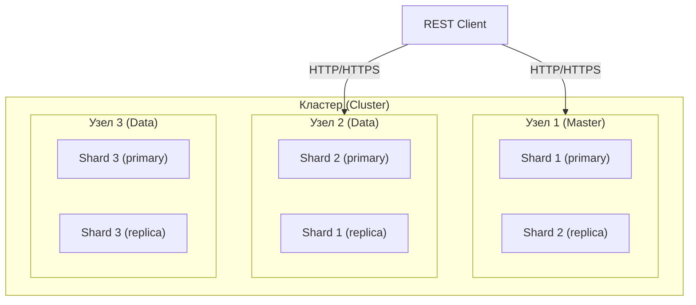
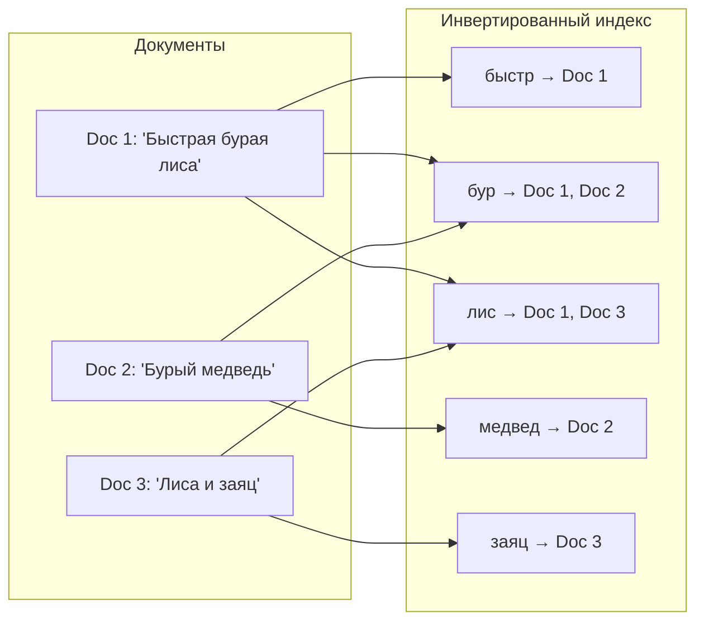
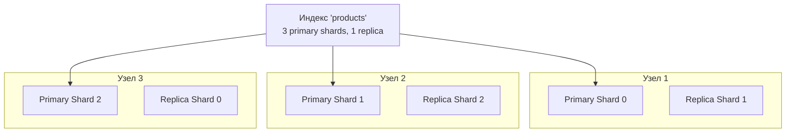

# Вопросы на собеседовании: `Elasticsearch`

Полное руководство по `Elasticsearch` для подготовки к собеседованиям: архитектура кластера, инвертированный индекс, `Query DSL`, агрегации, маппинги, шардирование, интеграция с `Spring Data Elasticsearch`, стек `ELK`, оптимизация производительности.

**`Elasticsearch`** — распределённый поисковый и аналитический движок на базе `Apache Lucene`. На собеседованиях проверяют знание архитектуры кластера, механизмов индексации, типов запросов, агрегаций, стратегий масштабирования и интеграции с `Java`/`Spring`.

## Полезные ссылки

### Официальная документация

- [Elasticsearch Reference](https://www.elastic.co/guide/en/elasticsearch/reference/current/index.html) — основная документация
- [Elasticsearch Java API Client](https://www.elastic.co/guide/en/elasticsearch/client/java-api-client/current/index.html) — официальный Java-клиент
- [Spring Data Elasticsearch Reference](https://docs.spring.io/spring-data/elasticsearch/reference/) — Spring Data интеграция
- [Elastic Stack Overview](https://www.elastic.co/elastic-stack) — обзор Elastic Stack (ELK)

### Статьи Baeldung

- [Introduction to Spring Data Elasticsearch](https://www.baeldung.com/spring-data-elasticsearch-tutorial) — практическое руководство
- [Elasticsearch Queries with Spring Data](https://www.baeldung.com/spring-data-elasticsearch-queries) — типы запросов
- [Guide to Elasticsearch in Java](https://www.baeldung.com/elasticsearch-java) — Java API Client
- [Add an Aggregation to an Elasticsearch Query](https://www.baeldung.com/elasticsearch-aggregation-query) — агрегации в Elasticsearch
- [Difference Between keyword and text in Elasticsearch](https://www.baeldung.com/elasticsearch-keyword-vs-text) — keyword vs text маппинг

## Содержание

- [Полезные ссылки](#полезные-ссылки)
- [See also](#see-also)

**Основы Elasticsearch**
- [Q1. (!) Что такое Elasticsearch и для чего он используется?](#q1--что-такое-elasticsearch-и-для-чего-он-используется)
- [Q2. (!) Какие основные компоненты архитектуры Elasticsearch?](#q2--какие-основные-компоненты-архитектуры-elasticsearch)
- [Q3. В чём разница между Elasticsearch и реляционной БД?](#q3-в-чём-разница-между-elasticsearch-и-реляционной-бд)
- [Q4. В чём разница между Elasticsearch и Apache Lucene?](#q4-в-чём-разница-между-elasticsearch-и-apache-lucene)
- [Q5. Что такое стек ELK/Elastic Stack?](#q5-что-такое-стек-elkelastic-stack)
- [Q6. (!) Какие преимущества и ограничения у Elasticsearch?](#q6--какие-преимущества-и-ограничения-у-elasticsearch)

**Индексы, документы и маппинги**
- [Q7. (!) Что такое Index в Elasticsearch?](#q7--что-такое-index-в-elasticsearch)
- [Q8. (!) Что такое Document?](#q8--что-такое-document)
- [Q9. (!) Что такое Mapping и как его настроить?](#q9--что-такое-mapping-и-как-его-настроить)
- [Q10. (!) В чём разница между типами text и keyword?](#q10--в-чём-разница-между-типами-text-и-keyword)
- [Q11. Какие типы данных поддерживает Elasticsearch?](#q11-какие-типы-данных-поддерживает-elasticsearch)
- [Q12. Что такое Dynamic Mapping и его подводные камни?](#q12-что-такое-dynamic-mapping-и-его-подводные-камни)

**Инвертированный индекс и анализ текста**
- [Q13. (!) Как работает инвертированный индекс?](#q13--как-работает-инвертированный-индекс)
- [Q14. (!) Что такое анализатор и из чего он состоит?](#q14--что-такое-анализатор-и-из-чего-он-состоит)
- [Q15. Что такое refresh и flush в контексте индексации?](#q15-что-такое-refresh-и-flush-в-контексте-индексации)

**Шардирование и репликация**
- [Q16. (!) Как работает Sharding в Elasticsearch?](#q16--как-работает-sharding-в-elasticsearch)
- [Q17. (!) Что такое Replication и зачем она нужна?](#q17--что-такое-replication-и-зачем-она-нужна)
- [Q18. Как масштабировать кластер Elasticsearch?](#q18-как-масштабировать-кластер-elasticsearch)
- [Q19. (!) Какие роли узлов существуют в кластере?](#q19--какие-роли-узлов-существуют-в-кластере)
- [Q20. Что означают статусы кластера green, yellow, red?](#q20-что-означают-статусы-кластера-green-yellow-red)

**Query DSL и поиск**
- [Q21. (!) Какой язык запросов используется в Elasticsearch?](#q21--какой-язык-запросов-используется-в-elasticsearch)
- [Q22. (!) В чём разница между query context и filter context?](#q22--в-чём-разница-между-query-context-и-filter-context)
- [Q23. (!) Как выполнять полнотекстовый поиск?](#q23--как-выполнять-полнотекстовый-поиск)
- [Q24. Как работает Bool Query?](#q24-как-работает-bool-query)
- [Q25. Как работает алгоритм релевантности BM25?](#q25-как-работает-алгоритм-релевантности-bm25)

**Агрегации**
- [Q26. (!) Какие типы агрегаций существуют в Elasticsearch?](#q26--какие-типы-агрегаций-существуют-в-elasticsearch)
- [Q27. Как использовать вложенные агрегации?](#q27-как-использовать-вложенные-агрегации)

**CRUD-операции и Bulk API**
- [Q28. Какие CRUD-операции доступны?](#q28-какие-crud-операции-доступны)
- [Q29. (!) Как работает Bulk API?](#q29--как-работает-bulk-api)
- [Q30. Как работает механизм оптимистической блокировки?](#q30-как-работает-механизм-оптимистической-блокировки)

**Spring Data Elasticsearch**
- [Q31. (!) Как интегрировать Elasticsearch со Spring Boot?](#q31--как-интегрировать-elasticsearch-со-spring-boot)
- [Q32. Как писать запросы через ElasticsearchOperations и NativeQuery?](#q32-как-писать-запросы-через-elasticsearchoperations-и-nativequery)
- [Q33. Как использовать Spring Data Elasticsearch Repository?](#q33-как-использовать-spring-data-elasticsearch-repository)

**Production: ILM, логирование, безопасность, оптимизация**
- [Q34. (!) Как оптимизировать производительность Elasticsearch?](#q34--как-оптимизировать-производительность-elasticsearch)
- [Q35. Что такое Index Lifecycle Management (ILM)?](#q35-что-такое-index-lifecycle-management-ilm)
- [Q36. Как использовать Elasticsearch для логирования?](#q36-как-использовать-elasticsearch-для-логирования)
- [Q37. Как обеспечить безопасность Elasticsearch?](#q37-как-обеспечить-безопасность-elasticsearch)
- [Q38. (!) Что такое Index Alias и зачем он нужен?](#q38--что-такое-index-alias-и-зачем-он-нужен)

**Релевантность, Highlight и продвинутые запросы**
- [Q39. (!) Как управлять релевантностью и ранжированием в Elasticsearch?](#q39--как-управлять-релевантностью-и-ранжированием-в-elasticsearch)
- [Q40. Что такое Highlight API и как его использовать?](#q40-что-такое-highlight-api-и-как-его-использовать)
- [Q41. Как реализовать поиск с пагинацией: from/size, search_after и PIT?](#q41-как-реализовать-поиск-с-пагинацией-fromsize-search_after-и-pit)
- [Q42. (!) Что такое Runtime Fields и когда их использовать?](#q42--что-такое-runtime-fields-и-когда-их-использовать)
- [Q43. Как реализовать автодополнение (Autocomplete) в Elasticsearch?](#q43-как-реализовать-автодополнение-autocomplete-в-elasticsearch)
- [Q44. Что такое Percolate Query?](#q44-что-такое-percolate-query)

## Q1. (!) Что такое `Elasticsearch` и для чего он используется?

`Elasticsearch` — распределённая поисковая и аналитическая система с открытым исходным кодом, построенная поверх `Apache Lucene`. Хранит данные в виде `JSON`-документов и обеспечивает поиск в режиме, близком к реальному времени (near real-time).

Основные сценарии использования:

| Сценарий | Описание |
|----------|----------|
| **Полнотекстовый поиск** | Поиск по товарам, статьям, документам — стемминг, синонимы, fuzzy-поиск |
| **Лог-аналитика** | Индексация и анализ логов приложений (стек `ELK`) |
| **Метрики и мониторинг** | Хранение и визуализация временных рядов (`Kibana`) |
| **Геопоиск** | Поиск объектов по координатам и радиусу |
| **Автодополнение** | Suggest API для подсказок при вводе |
| **Аналитика** | Агрегации по большим объёмам данных в реальном времени |

`Elasticsearch` широко применяется в электронной коммерции, системах мониторинга, CMS и поисковых платформах. Подробнее о распределённых системах в [вопросах по распределённым системам](../architecture/distributed-systems-interview.md).

> [!mcq]
> - [ ] Elasticsearch — это реляционная база данных, хранящая данные в таблицах с поддержкой полнотекстового поиска через индексы. | Elasticsearch не является реляционной БД — он хранит данные как JSON-документы, не в таблицах. Полнотекстовый поиск реализован через инвертированный индекс, а не через SQL-индексы.
> - [ ] Elasticsearch — это in-memory кэш, ускоряющий запросы к реляционным базам данных. | Elasticsearch не является кэшем — он представляет собой самостоятельную поисковую и аналитическую систему, которая хранит данные на диске. Для кэширования используют Redis или Memcached.
> - [x] Elasticsearch — это распределённая поисковая система на базе Apache Lucene, хранящая данные как JSON-документы и обеспечивающая поиск в near real-time. | Именно так: Elasticsearch построен поверх Apache Lucene, хранит данные как JSON-документы в индексах, и делает их доступными для поиска примерно через 1 секунду после индексации (near real-time, NRT).
> - [ ] Elasticsearch — это очередь сообщений, обеспечивающая доставку событий между микросервисами. | Elasticsearch не является очередью сообщений — он не гарантирует упорядоченную доставку событий. Для этого используется Apache Kafka или RabbitMQ. Это антипаттерн или неправильный выбор в production.

## Q2. (!) Какие основные компоненты архитектуры `Elasticsearch`?



Основные компоненты:

- **Кластер (`Cluster`)** — группа узлов с общим именем, совместно хранящих данные и обрабатывающих запросы
- **Узел (`Node`)** — один экземпляр `Elasticsearch` на сервере. Узлы бывают разных ролей: `master`, `data`, `ingest`, `coordinating`
- **Индекс (`Index`)** — логическая коллекция документов (аналог таблицы в РСУБД)
- **Документ (`Document`)** — базовая единица хранения, `JSON`-объект с уникальным `_id`
- **Маппинг (`Mapping`)** — схема индекса: типы полей, анализаторы, настройки хранения
- **Шард (`Shard`)** — горизонтальный фрагмент индекса, каждый шард — отдельный экземпляр `Lucene`
- **Реплика (`Replica`)** — копия primary-шарда на другом узле для отказоустойчивости и масштабирования чтения

> [!mcq]
> - [ ] Шард в Elasticsearch — это логическая единица хранения, аналогичная таблице в реляционной БД, и может находиться только на одном узле. | Шард — не аналог таблицы, это физический фрагмент индекса. Аналог таблицы — индекс (Index). Шарды распределяются по узлам кластера автоматически. Это антипаттерн или неправильный выбор в production.
> - [x] Шард в Elasticsearch — это полноценный экземпляр Apache Lucene, являющийся физическим фрагментом индекса, распределяемым по узлам кластера. | Именно так: каждый шард — самостоятельный индекс Lucene. Индекс Elasticsearch делится на несколько шардов, каждый из которых независимо хранит и обрабатывает часть данных. Full-text search, inverted index, shards + replicas, refresh interval, query DSL.
> - [ ] Реплика в Elasticsearch — это резервная копия всего кластера, создаваемая для восстановления после сбоя. | Реплика — это копия конкретного primary-шарда, а не всего кластера. Реплики размещаются на других узлах и обслуживают поисковые запросы наравне с primary-шардами. Это антипаттерн или неправильный выбор в production.
> - [ ] Маппинг в Elasticsearch создаётся только автоматически при первой индексации документа и не может быть задан вручную. | Маппинг можно задавать вручную (explicit mapping) до индексации документов — именно это рекомендуется в production. Автоматическое определение типов (dynamic mapping) — лишь один из режимов.

## Q3. В чём разница между `Elasticsearch` и реляционной БД?

| Характеристика | `Elasticsearch` | Реляционная БД (`PostgreSQL`) |
|---------------|-----------------|-------------------------------|
| Модель данных | Документы (`JSON`) | Таблицы и строки |
| Схема | Гибкая (dynamic mapping) | Жёсткая (DDL) |
| Язык запросов | `Query DSL` (JSON) | `SQL` |
| Связи | Денормализация, nested, parent-child | JOIN, FK |
| Транзакции | Нет полноценных ACID | Полные ACID |
| Поиск | Полнотекстовый, fuzzy, синонимы | `LIKE`, `tsvector/tsquery` |
| Масштабирование | Горизонтальное (шарды) | Вертикальное + read-replicas |
| Основное применение | Поиск, аналитика, логи | OLTP, транзакционные данные |

**Важно на собеседовании:** `Elasticsearch` не заменяет реляционную БД. Типичный паттерн — основное хранилище в [реляционной БД](sql-interview.md), а `ES` используется как вторичный индекс для полнотекстового поиска.

> [!mcq]
> - [ ] Elasticsearch поддерживает полноценные ACID-транзакции, поэтому его можно использовать как основное хранилище вместо PostgreSQL. | Elasticsearch не поддерживает ACID-транзакции — нет атомарного обновления нескольких документов, нет rollback. Для транзакционных данных необходима реляционная БД. Это антипаттерн или неправильный выбор в production.
> - [x] Elasticsearch использует горизонтальное масштабирование через шарды, тогда как реляционные БД исторически масштабируются вертикально или через read-replicas. | Верно: Elasticsearch изначально проектировался для горизонтального масштабирования — шарды автоматически распределяются по узлам. PostgreSQL масштабируется вертикально (больше RAM/CPU) или через read-replicas.
> - [ ] В Elasticsearch поддерживаются JOIN между индексами, что делает его полным аналогом реляционной БД. | Elasticsearch не поддерживает JOIN в реляционном смысле. Вместо этого используются денормализация, nested-объекты или parent-child связи, что является принципиально другим подходом.
> - [ ] Elasticsearch использует SQL как язык запросов, поэтому миграция с PostgreSQL не требует изменения запросов. | Elasticsearch использует Query DSL — JSON-based язык запросов, принципиально отличающийся от SQL. Хотя существует Elasticsearch SQL, он не эквивалентен полному SQL. Это антипаттерн или неправильный выбор в production.

## Q4. В чём разница между `Elasticsearch` и `Apache Lucene`?

`Apache Lucene` — низкоуровневая Java-библиотека для полнотекстового поиска и индексации. `Elasticsearch` — распределённая система, построенная **поверх** `Lucene`.

| Характеристика | `Lucene` | `Elasticsearch` |
|---------------|----------|-----------------|
| Тип | Библиотека (JAR) | Распределённый сервер |
| API | Java API | REST API (HTTP/JSON) |
| Распределённость | Нет | Шардирование, репликация |
| Кластеризация | Нет | Автоматическая |
| Анализ/визуализация | Нет | `Kibana`, агрегации |
| Управление индексами | Ручное | Автоматическое (ILM) |

Каждый шард `Elasticsearch` — это один экземпляр индекса `Lucene`. `ES` добавляет координацию запросов между шардами, балансировку, `REST API`, `DSL` запросов, агрегации и мониторинг.

**Когда использовать `Lucene` напрямую:** встраиваемый поиск в одном JVM-процессе (десктопное приложение). Для распределённого поиска, логов, метрик — `Elasticsearch` или `OpenSearch`.

> [!mcq]
> - [ ] Apache Lucene — это распределённая система с REST API, которую Elasticsearch использует как внешний сервис. | Lucene — это встраиваемая Java-библиотека (JAR), а не внешний сервис. Elasticsearch запускает Lucene внутри каждого шарда как часть собственного JVM-процесса. Это антипаттерн или неправильный выбор в production.
> - [ ] Elasticsearch и Apache Lucene — полностью независимые проекты с разными алгоритмами индексирования. | Elasticsearch построен поверх Lucene и использует его алгоритмы индексирования напрямую. Каждый шард ES — это экземпляр индекса Lucene. Это антипаттерн или неправильный выбор в production.
> - [ ] Apache Lucene обеспечивает шардирование и репликацию, а Elasticsearch добавляет только REST API поверх него. | Шардирование и репликацию реализует сам Elasticsearch — Lucene ничего не знает о распределённости. Lucene предоставляет только локальный поиск и индексирование. Это антипаттерн или неправильный выбор в production.
> - [x] Apache Lucene — это встраиваемая Java-библиотека для локального полнотекстового поиска, а Elasticsearch добавляет к ней распределённость, REST API и управление кластером. | Верно: Lucene работает в рамках одного JVM-процесса и не знает о сети. Elasticsearch оборачивает Lucene в распределённую систему, добавляя координацию шардов, репликацию, REST API и агрегации.

## Q5. Что такое стек `ELK`/`Elastic Stack`?

`ELK Stack` (сейчас `Elastic Stack`) — набор инструментов для сбора, обработки, хранения и визуализации данных:


| Компонент | Назначение |
|-----------|-----------|
| **`Elasticsearch`** | Хранение и поиск данных |
| **`Logstash`** | Сбор, парсинг и трансформация данных (pipeline: input -> filter -> output) |
| **`Kibana`** | Визуализация: дашборды, графики, `Discover` для просмотра логов |
| **`Beats`** | Лёгкие агенты-шипперы: `Filebeat` (логи), `Metricbeat` (метрики), `Packetbeat` (сеть) |

В современных проектах `Filebeat` часто отправляет логи напрямую в `Elasticsearch`, минуя `Logstash`, если не нужна сложная обработка. Подробнее о паттернах логирования — в [вопросах по Kafka](../messaging/kafka-interview.md), где `Kafka` используется как буфер между приложениями и `ES`.

> [!mcq]
> - [ ] В стеке ELK компонент Kibana отвечает за сбор логов с серверов и их отправку в Elasticsearch. | Kibana — это инструмент визуализации (дашборды, графики), а не сбора данных. Сбором логов занимаются Beats (Filebeat) и Logstash. Это антипаттерн или неправильный выбор в production.
> - [x] В стеке ELK компонент Logstash отвечает за сбор, парсинг и трансформацию данных через pipeline (input → filter → output). | Верно: Logstash — это pipeline-процессор данных. Он принимает данные из разных источников (input), трансформирует их (filter, например grok для парсинга) и отправляет в Elasticsearch (output).
> - [ ] В стеке ELK Filebeat выполняет парсинг и обогащение логов с помощью grok-паттернов перед отправкой в Elasticsearch. | Парсинг через grok-паттерны — функция Logstash, а не Filebeat. Filebeat — лёгкий shipper, который только считывает файлы логов и пересылает их дальше без сложной обработки. Это антипаттерн или неправильный выбор в production.
> - [ ] Компонент Beats в стеке ELK обязателен — без него Filebeat не может отправлять данные напрямую в Elasticsearch. | Filebeat — это и есть часть семейства Beats. Filebeat может отправлять данные напрямую в Elasticsearch без Logstash, если не нужна сложная трансформация. Это антипаттерн или неправильный выбор в production.

## Q6. (!) Какие преимущества и ограничения у `Elasticsearch`?

**Преимущества:**

- **Скорость поиска** — инвертированный индекс обеспечивает поиск за миллисекунды даже по миллиардам документов
- **Масштабируемость** — горизонтальное масштабирование добавлением узлов, автоматический rebalancing шардов
- **Полнотекстовый поиск** — стемминг, синонимы, fuzzy-поиск, автодополнение, поиск по фразам
- **Near real-time** — документы доступны для поиска через ~1 секунду после индексации
- **REST API** — простая интеграция с любым языком через HTTP/JSON
- **Экосистема** — `Kibana`, `Logstash`, `Beats`, `APM`

**Ограничения:**

- **Нет ACID-транзакций** — нельзя обновить несколько документов атомарно
- **Eventual consistency** — при репликации возможно чтение устаревших данных
- **Не подходит как primary store** — нет гарантий целостности, нет JOIN
- **Потребление ресурсов** — требует значительного объёма RAM (heap + OS cache для `Lucene`)
- **Размер документа** — ограничение `http.max_content_length` (по умолчанию 100 МБ)
- **Число шардов** — избыточные шарды (oversharding) деградируют производительность

> [!mcq]
> - [ ] Главное ограничение Elasticsearch — отсутствие REST API, из-за чего интеграция с Java требует специализированных библиотек. | REST API — одно из ключевых преимуществ Elasticsearch, а не ограничение. Он позволяет работать с ES из любого языка через HTTP/JSON. Это антипаттерн или неправильный выбор в production.
> - [ ] Elasticsearch гарантирует строгую консистентность (strong consistency) при репликации, что делает его надёжным хранилищем транзакционных данных. | Elasticsearch использует eventual consistency при репликации — возможно чтение устаревших данных с реплик. Строгой консистентности нет, что делает его непригодным для транзакционных систем.
> - [x] Главное ограничение Elasticsearch — отсутствие ACID-транзакций и eventual consistency при репликации, что исключает его использование как единственного хранилища для транзакционных данных. | Верно: ES не поддерживает атомарные многодокументные операции и не гарантирует мгновенную консистентность реплик. Поэтому его используют как вторичный индекс, а не как primary store.
> - [ ] Основное ограничение Elasticsearch — он не поддерживает горизонтальное масштабирование и работает только на одном узле. | Горизонтальное масштабирование — одно из ключевых преимуществ ES. Добавление узлов и автоматический rebalancing шардов — фундаментальная возможность кластера. Это антипаттерн или неправильный выбор в production.

## Q7. (!) Что такое `Index` в `Elasticsearch`?

`Index` — основная логическая единица хранения данных в `Elasticsearch`, аналог таблицы в реляционной БД. Индекс содержит коллекцию документов со схожей структурой.

Создание индекса с настройками:

```json
PUT /products
{
  "settings": {
    "number_of_shards": 3,
    "number_of_replicas": 1,
    "analysis": {
      "analyzer": {
        "russian_analyzer": {
          "type": "custom",
          "tokenizer": "standard",
          "filter": ["lowercase", "russian_stop", "russian_stemmer"]
        }
      },
      "filter": {
        "russian_stop": { "type": "stop", "stopwords": "_russian_" },
        "russian_stemmer": { "type": "stemmer", "language": "russian" }
      }
    }
  },
  "mappings": {
    "properties": {
      "name":        { "type": "text", "analyzer": "russian_analyzer" },
      "category":    { "type": "keyword" },
      "price":       { "type": "float" },
      "created_at":  { "type": "date" },
      "in_stock":    { "type": "boolean" }
    }
  }
}
```

Ключевые моменты:
- `number_of_shards` задаётся **при создании** и не может быть изменён (только через `_reindex` или `_split/_shrink`)
- `number_of_replicas` можно менять динамически: `PUT /products/_settings {"number_of_replicas": 2}`
- Имя индекса — строчные буквы, без пробелов и спецсимволов

> [!mcq]
> - [ ] Параметр number_of_shards можно изменить в любой момент через PUT /index/_settings без переиндексации данных. | Опасное заблуждение! number_of_shards нельзя изменить после создания индекса. Шард документа вычисляется как `hash(_routing) % number_of_shards`. На production-базах (Netflix, Uber) если попытаться это сделать, получите ошибку. Если действительно нужно изменить число шардов, нужна переиндексация через `_reindex` в новый индекс с нужным числом шардов. На крупных индексах это занимает часы.
> - [x] Параметр number_of_replicas можно изменить динамически в любой момент, тогда как number_of_shards задаётся только при создании индекса. | Верно — это критический trade-off. number_of_replicas — динамическая настройка, изменяемая без переиндексации (за миллисекунды). number_of_shards фиксируется при создании, и от него зависит маршрутизация документов. На production можно увеличить replicas для высокой доступности, но число шардов нельзя менять.
> - [ ] Индекс Elasticsearch — это физическая единица хранения на диске, напрямую соответствующая одному файлу на каждом узле. | Неправильно понимание архитектуры. Индекс — логическая структура, физически разбитая на шарды. Каждый шард — отдельный экземпляр Lucene с набором файлов сегментов (обычно 10-100+ файлов на шард). Один индекс может располагаться на нескольких узлах. На production с 1TB индексом с 10 шардами каждый шард получит ~100GB на своём узле.
> - [ ] В одном индексе Elasticsearch можно хранить документы разных типов данных, используя несколько _type для их разделения. | Архаичный паттерн, удаленный в ES 7.0+. Начиная с ES 7.0, _type удалена, каждый индекс имеет единственный неявный тип. На production старые версии ES 5-6 используют _type, но это считается антипаттерном. Для разных типов данных рекомендуется создавать отдельные индексы (например, `products` и `orders`, не `data` с двумя _type). Это лучше для управления маппингом и производительности.

> [!mcq]
> - [x] Настройки анализатора для индекса задаются в секции settings.analysis при создании индекса и не могут быть применены к уже существующим документам без переиндексации. | Верно — это критический момент production. Анализаторы влияют на то, как текст токенизируется при индексации (каким образом текст разбивается на слова/токены, приводится к нижнему регистру, убираются стоп-слова). Изменение анализатора требует переиндексации через `_reindex`, иначе старые документы будут проиндексированы по одному правилу, новые — по другому, и поиск будет неконсистентным. На production (Google, Yandex) это причина потери данных в поиске.
> - [ ] Анализаторы в Elasticsearch применяются только при поиске и не влияют на то, как данные хранятся в инвертированном индексе. | Противоположно! Анализаторы применяются при индексации (при INSERT/PUT документа) — они определяют, какие термы попадут в инвертированный индекс. При поиске тот же анализатор (или настраиваемый поисковый анализатор) применяется к query, чтобы термы совпадали. На production неправильный анализ документов означает, что поиск не найдёт правильные результаты.
> - [ ] Поле типа keyword в маппинге проходит через анализатор standard, который разбивает его на токены и приводит к нижнему регистру. | Неправильно. Поле типа keyword НЕ проходит через анализатор — оно хранится как есть, целиком, без токенизации и нормализации. На `keyword` полях выполняется точный поиск и агрегации. На production если по ошибке сделать поле `text` вместо `keyword`, поиск будет токенизировать значение и найдёт частичные совпадения, что может быть неправильно.
> - [ ] Маппинг индекса в Elasticsearch создаётся заново при каждом запуске и не сохраняется между перезапусками кластера. | Неправильно. Маппинг сохраняется в состоянии кластера (cluster state, persistent на диск через Lucene segments). Он переживает перезапуск кластера и доступен сразу после восстановления, даже если потеряны все узлы. На production маппинг — это критическая часть инфраструктуры, которая восстанавливается из primary data nodes.

## Q8. (!) Что такое `Document`?

`Document` — базовая единица информации в `Elasticsearch`, хранится как `JSON`-объект внутри индекса. Аналог строки в таблице РСУБД.

```json
POST /products/_doc/1
{
  "name": "Смартфон Samsung Galaxy S24",
  "category": "electronics",
  "price": 79990.0,
  "created_at": "2026-01-15",
  "in_stock": true,
  "tags": ["smartphone", "samsung", "5g"]
}
```

Каждый документ имеет метаданные:
- `_index` — в каком индексе хранится
- `_id` — уникальный идентификатор (можно задать явно или сгенерировать автоматически)
- `_source` — оригинальный JSON документа
- `_version` — версия, увеличивается при каждом обновлении
- `_seq_no` и `_primary_term` — используются для оптимистической блокировки

В отличие от РСУБД, документы не требуют строгой схемы: разные документы в одном индексе могут иметь разные поля (хотя на практике лучше использовать единый маппинг).

> [!mcq]
> - [ ] Поле _id документа всегда генерируется автоматически и не может быть задано пользователем при индексации. | Неправильно. _id можно задать явно при создании документа: `PUT /index/_doc/my-custom-id`. Если не указывать — Elasticsearch сгенерирует UUID автоматически. На production-базах часто используют custom ID (например, user_id, order_id) для идемпотентности: повторный PUT с тем же ID перезапишет документ, а не создаст дубликат.
> - [ ] Поле _source в Elasticsearch хранит только те поля, которые указаны в маппинге, и отбрасывает незадекларированные поля. | Неправильно. _source хранит оригинальный JSON документа целиком, включая незадекларированные поля (если dynamic mapping не установлен в `strict`). Маппинг определяет индексацию (какие поля индексировать), а не хранение _source. На production при изменении маппинга старые документы остаются в _source неизменными.
> - [x] Поля _seq_no и _primary_term используются для оптимистической блокировки при конкурентных обновлениях документа. | Верно. Это механизм Optimistic Concurrency Control для предотвращения race conditions. При обновлении можно передать `if_seq_no` и `if_primary_term` — если документ изменился другим процессом, вернётся ошибка 409 Conflict. На production-базах (Netflix, Uber) это используется для safety при параллельных UPDATE'ах.
> - [ ] Обновление документа в Elasticsearch изменяет его на месте, перезаписывая только изменённые поля в существующем сегменте Lucene. | Противоположно! Lucene-сегменты иммутабельны (immutable). Обновление документа — это фактически удаление старого (пометка как deleted в deleted bitmap) и создание нового документа. Физическое удаление старой версии происходит при merge сегментов (когда несколько сегментов объединяются). На production это означает, что обновление — дорогая операция (требует переиндексации).

## Q9. (!) Что такое `Mapping` и как его настроить?

`Mapping` — определение схемы индекса: какие поля содержит документ, какие типы у полей и как они индексируются и анализируются. Аналог `CREATE TABLE` в РСУБД.

```json
PUT /articles/_mapping
{
  "properties": {
    "title":       { "type": "text", "analyzer": "standard", "fields": { "raw": { "type": "keyword" } } },
    "body":        { "type": "text", "analyzer": "russian" },
    "author":      { "type": "keyword" },
    "publish_date": { "type": "date", "format": "yyyy-MM-dd" },
    "views":       { "type": "integer" },
    "location":    { "type": "geo_point" },
    "metadata":    { "type": "object" }
  }
}
```

Два подхода к маппингу:

1. **Explicit mapping** — определяем схему заранее (рекомендуется для production)
2. **Dynamic mapping** — `ES` автоматически определяет типы по первому документу (удобно для прототипов, опасно в production)

**Multi-field mapping** (`fields`) — одно поле индексируется несколькими способами: `title` как `text` для полнотекстового поиска, `title.raw` как `keyword` для точного совпадения и сортировки.

**Важно:** после создания маппинга нельзя изменить тип существующего поля. Можно только добавить новые поля или переиндексировать данные в новый индекс с обновлённым маппингом.

> [!mcq]
> - [ ] После создания маппинга тип поля можно изменить через PUT /index/_mapping без переиндексации существующих данных. | Изменить тип существующего поля невозможно — только добавить новые поля. Для изменения типа нужно создать новый индекс с обновлённым маппингом и переиндексировать данные через _reindex API.
> - [ ] Multi-field mapping (fields) позволяет хранить одно значение в двух разных колонках физически для экономии места. | Multi-field mapping не дублирует хранение данных физически — _source хранится один раз. Разница в том, что поле индексируется по-разному в инвертированном индексе: как text для поиска и как keyword для агрегаций.
> - [x] Multi-field mapping позволяет индексировать одно поле несколькими способами: как text для полнотекстового поиска и как keyword для точного совпадения и сортировки. | Верно: конструкция "fields" создаёт дополнительные индексы для одного поля. Например, title индексируется как text (с токенизацией), а title.keyword — как keyword (без токенизации), что позволяет использовать оба типа запросов.
> - [ ] Тип geo_point в маппинге Elasticsearch можно использовать для хранения координат, но поиск по радиусу не поддерживается. | geo_point поддерживает геопоисковые запросы, включая geo_distance (поиск в радиусе), geo_bounding_box (прямоугольная область) и geo_polygon. Поиск по радиусу — одна из ключевых возможностей этого типа.

## Q10. (!) В чём разница между типами `text` и `keyword`?

Это один из самых частых вопросов на собеседованиях по `Elasticsearch`:

| Характеристика | `text` | `keyword` |
|---------------|--------|-----------|
| Анализ | Проходит через анализатор (токенизация, нормализация) | Хранится как есть, **без анализа** |
| Поиск | Полнотекстовый (`match`, `match_phrase`) | Точное совпадение (`term`, `terms`) |
| Сортировка | Нельзя сортировать напрямую | Можно сортировать |
| Агрегации | Нельзя агрегировать напрямую | Можно агрегировать |
| Пример значения | "Elasticsearch для начинающих" | "status:active", "user-id-123" |

Пример multi-field маппинга для совмещения обоих подходов:

```json
{
  "properties": {
    "title": {
      "type": "text",
      "analyzer": "russian",
      "fields": {
        "keyword": {
          "type": "keyword",
          "ignore_above": 256
        }
      }
    }
  }
}
```

Теперь `title` — для полнотекстового поиска, `title.keyword` — для точного совпадения, сортировки и агрегаций.

> [!mcq]
> - [x] Тип text проходит через анализатор при индексации и поддерживает полнотекстовый поиск, тогда как keyword хранится без анализа и поддерживает точное совпадение, сортировку и агрегации. | Верно — это фундаментальное различие. text токенизируется анализатором (разбивается на слова, приводится к нижнему регистру, удаляются стоп-слова), поэтому пригоден для match-запросов и полнотекстового поиска (как Google). keyword хранится как единая строка без модификации и используется для term-запросов (точный поиск), сортировки и агрегаций. На production-базах (Wikipedia, Medium) для content используют text, для категорий и ID — keyword.
> - [ ] Тип text поддерживает агрегации и сортировку так же, как и keyword, разница только в том, что text проходит через анализатор. | Опасное заблуждение! text нельзя сортировать или агрегировать напрямую, потому что оно разбивается на токены, и каждый токен становится отдельным значением. На production видели случаи, когда забыли добавить `.keyword` в сортировку и получили странные результаты. Для этих операций нужен keyword или `doc_values: true` на text-поле. Именно для этого используется multi-field mapping: `title: { type: "text" } fields: { keyword: { type: "keyword" } }`.
> - [ ] Тип keyword хранит данные с применением стандартного анализатора, поэтому значение "Status:Active" будет найдено по запросу "status". | Неправильно. keyword хранится полностью без анализа — значение "Status:Active" будет найдено только по точному совпадению "Status:Active" (с учётом регистра и спецсимволов). На production-базах если нужен поиск без регистра на keyword, используется `normalizer: { type: "lowercase" }`. Неправильно выбранный тип приводит к невозможности найти нужные данные.
> - [ ] Разница между text и keyword не влияет на поведение match-запроса, так как match анализирует и запрос, и поле одинаково. | Противоположно! match ведёт себя принципиально по-разному: на поле keyword выполняет точное совпадение (без анализа запроса), тогда как match на text-поле анализирует запрос и ищет по токенам. На production при неправильном выборе типа GET запрос может вернуть результаты, а match query — нет, что приводит к confusion при отладке.

## Q11. Какие типы данных поддерживает `Elasticsearch`?

Основные типы:

| Категория | Типы | Описание |
|-----------|------|----------|
| **Строковые** | `text`, `keyword` | Полнотекстовый поиск / точное совпадение |
| **Числовые** | `integer`, `long`, `float`, `double`, `short`, `byte`, `half_float`, `scaled_float` | Числовые значения |
| **Дата** | `date`, `date_nanos` | Дата и время с поддержкой форматов |
| **Логический** | `boolean` | `true` / `false` |
| **Бинарный** | `binary` | Base64-закодированные данные |
| **Диапазон** | `integer_range`, `date_range`, `ip_range` | Диапазоны значений |
| **Гео** | `geo_point`, `geo_shape` | Координаты и геометрические фигуры |
| **Объекты** | `object`, `nested`, `flattened` | Вложенные структуры |
| **Специальные** | `completion`, `search_as_you_type`, `token_count`, `ip` | Автодополнение, подсчёт токенов, IP-адреса |
| **Вектор** | `dense_vector`, `sparse_vector` | Векторные представления для ML/kNN-поиска |

`nested` vs `object`: тип `object` «разворачивает» вложенные массивы, теряя связь между полями. `nested` хранит каждый элемент массива как отдельный скрытый документ, сохраняя связи.

> [!mcq]
> - [ ] Тип object и тип nested в Elasticsearch ведут себя одинаково при индексации массивов объектов — оба сохраняют связи между полями внутри каждого элемента. | Критическое различие! object и nested поведут себя совершенно по-разному. object «разворачивает» массив, создавая независимые массивы для каждого поля, теряя связи. На production с массивом `[{name: "A", age: 30}, {name: "B", age: 25}]` с object type можно найти по query `name=A AND age=25`, что неправильно (у A возраст 30). nested сохраняет связи и вернёт ошибку для этого query.
> - [x] Тип nested хранит каждый элемент массива как отдельный скрытый документ Lucene, что позволяет сохранять связи между полями внутри объекта при поиске. | Верно. Из-за хранения каждого объекта как отдельного Lucene-документа, nested-запросы работают медленнее (требуют extra work), но корректно фильтруют по комбинациям полей. На production-базах с продуктами и отзывами (Amazon, eBay) используют nested для массива отзывов, чтобы фильтровать `review.rating >= 4 AND review.date > 2024`.
> - [ ] Тип dense_vector в Elasticsearch используется только для хранения изображений в бинарном формате. | Неправильно. dense_vector хранит числовые векторы (embeddings, обычно от ML-моделей), используемые для kNN-поиска (k nearest neighbors). На production-базах (Netflix, Spotify) это основа для семантического поиска и рекомендательных систем: encode текст в вектор, найти k похожих векторов в ES.
> - [ ] Тип scaled_float идентичен типу float, разница только в названии и внутреннем представлении не отличается. | Неправильно. scaled_float хранит значения как long, умноженные на коэффициент масштабирования (scaling_factor). На production-базах с ценами (1.99$) это экономит место и улучшает точность: вместо float хранить как 199 (в центах), потом масштабировать обратно. Имеет значение для больших индексов (Amazon с миллиардами товаров).

## Q12. Что такое `Dynamic Mapping` и его подводные камни?

`Dynamic Mapping` — автоматическое определение типов полей при индексации первого документа. `ES` анализирует значения и выбирает тип:

| Значение в JSON | Определённый тип |
|-----------------|-----------------|
| `"hello"` | `text` + `keyword` (multi-field) |
| `123` | `long` |
| `12.5` | `float` |
| `true` | `boolean` |
| `"2026-01-01"` | `date` |
| `{"a": 1}` | `object` |

**Подводные камни:**
- Строка `"123"` будет определена как `text`, а не как `long` — разные типы в разных документах приведут к ошибкам
- Первый документ фиксирует маппинг — изменить тип поля потом нельзя
- Незнакомые поля могут случайно создаться при индексации некорректных данных

**Рекомендация для production:** `"dynamic": "strict"` — запрещает добавление незадекларированных полей:

```json
PUT /orders
{
  "mappings": {
    "dynamic": "strict",
    "properties": {
      "order_id": { "type": "keyword" },
      "amount":   { "type": "float" }
    }
  }
}
```

> [!mcq]
> - [ ] При dynamic mapping значение "123" (строка) будет автоматически определено как тип long, так как Elasticsearch распознаёт числа в строках. | Elasticsearch определяет тип по JSON-типу значения, а не по содержимому. Строка в кавычках "123" будет определена как text+keyword, а не как long. Только JSON-число 123 (без кавычек) станет long.
> - [ ] Режим dynamic: false полностью запрещает индексацию незадекларированных полей и возвращает ошибку при их появлении. | dynamic: false не выбрасывает ошибку — незадекларированные поля игнорируются при индексации (не попадают в инвертированный индекс), но сохраняются в _source. Ошибку при незадекларированных полях выбрасывает dynamic: strict.
> - [ ] Dynamic mapping не применяется к вложенным объектам — только к полям верхнего уровня документа. | Dynamic mapping применяется рекурсивно ко всем уровням вложенности. Можно задавать разные значения dynamic для разных вложенных объектов, переопределяя унаследованное значение.
> - [x] Режим dynamic: strict запрещает добавление незадекларированных полей и возвращает ошибку при попытке проиндексировать документ с неизвестным полем. | Верно: strict — наиболее строгий режим, при котором любое незадекларированное поле вызывает ошибку индексации. Это защищает от случайного «разбухания» маппинга в production.

## Q13. (!) Как работает инвертированный индекс?

Инвертированный индекс — ключевая структура данных `Elasticsearch` (и `Lucene`), обеспечивающая быстрый полнотекстовый поиск.



Процесс построения:
1. **Анализ** — текст проходит через анализатор: токенизация, приведение к нижнему регистру, стемминг
2. **Токены** — каждое слово превращается в терм (основу): "бурая" -> "бур"
3. **Posting list** — для каждого терма хранится список документов, где он встречается, с позициями и частотами

При поиске `ES` ищет термы в инвертированном индексе (O(1) по хэшу), а не сканирует все документы. Это обеспечивает скорость поиска, не зависящую от количества документов.

Дополнительно `Lucene` использует **doc values** (столбцовое хранилище) для сортировки и агрегаций по `keyword`/числовым полям.

> [!mcq]
> - [ ] Инвертированный индекс в Elasticsearch хранит для каждого документа список всех слов, которые в нём встречаются, аналогично содержанию книги. | Это описание прямого (forward) индекса, а не инвертированного. Инвертированный индекс устроен наоборот: для каждого терма (слова) хранится список документов, в которых он встречается (posting list).
> - [x] Инвертированный индекс хранит для каждого терма posting list — список документов с позициями и частотами вхождений, что обеспечивает поиск за O(1) вместо полного сканирования. | Верно: именно инверсия структуры (от термов к документам, а не от документов к термам) обеспечивает скорость поиска. Lookup по терму выполняется через хэш-таблицу, а пересечение posting lists — через DISI-итераторы Lucene.
> - [ ] Стемминг в контексте инвертированного индекса означает добавление синонимов к каждому терму для расширения поиска. | Стемминг — это приведение слова к его основе (stem): "бурая" → "бур", "бежит" → "бег". Синонимы добавляются отдельным token filter (synonym), это другой механизм.
> - [ ] Doc values в Lucene — это другое название для инвертированного индекса, оптимизированного для агрегаций. | Doc values — отдельная структура данных (столбцовое хранилище), независимая от инвертированного индекса. Инвертированный индекс — строчная структура для поиска, doc values — столбцовая для сортировки и агрегаций.

> [!mcq]
> - [x] Процесс анализа текста при индексации включает последовательное применение character filters, затем tokenizer, затем token filters к входной строке. | Верно: это фиксированный порядок в Elasticsearch. Character filters обрабатывают сырую строку целиком (например, удаляют HTML), tokenizer разбивает её на токены, token filters трансформируют каждый токен (lowercase, stemmer, stop words).
> - [ ] Tokenizer в анализаторе применяется после token filters, так как сначала нужно нормализовать текст перед разбивкой на токены. | Порядок фиксирован: сначала character filters (предобработка строки), затем tokenizer (разбивка на токены), затем token filters (трансформация токенов). Изменить порядок нельзя.
> - [ ] Анализатор keyword является стандартным для всех текстовых полей и разбивает текст на токены по пробелам. | Анализатор keyword не разбивает текст на токены — он возвращает всю строку как единый токен. Стандартный анализатор по умолчанию (standard) разбивает по Unicode word boundaries и приводит к нижнему регистру.
> - [ ] Анализатор применяется только при поиске, чтобы нормализовать поисковый запрос перед сравнением с уже проиндексированными данными. | Анализатор применяется при обоих этапах: при индексации (для построения инвертированного индекса) и при поиске (для нормализации запроса). Именно совпадение анализаторов на обоих этапах гарантирует корректный поиск.

## Q14. (!) Что такое анализатор и из чего он состоит?

Анализатор (`Analyzer`) — компонент, преобразующий текст в набор токенов (термов) для инвертированного индекса. Состоит из трёх этапов:


| Этап | Описание | Примеры |
|------|----------|---------|
| **Character Filter** | Предобработка строки целиком | `html_strip`, `mapping`, `pattern_replace` |
| **Tokenizer** | Разбивка на токены | `standard`, `whitespace`, `ngram`, `edge_ngram` |
| **Token Filter** | Трансформация токенов | `lowercase`, `stop`, `stemmer`, `synonym`, `snowball` |

Встроенные анализаторы: `standard`, `simple`, `whitespace`, `keyword`, `russian`, `english`.

Пример кастомного анализатора для русского языка с синонимами:

```json
PUT /my_index
{
  "settings": {
    "analysis": {
      "analyzer": {
        "my_russian": {
          "type": "custom",
          "tokenizer": "standard",
          "filter": ["lowercase", "russian_stop", "russian_stem", "my_synonyms"]
        }
      },
      "filter": {
        "russian_stop": { "type": "stop", "stopwords": "_russian_" },
        "russian_stem": { "type": "stemmer", "language": "russian" },
        "my_synonyms": {
          "type": "synonym",
          "synonyms": ["телефон,смартфон,мобильный", "ноутбук,лэптоп"]
        }
      }
    }
  }
}
```

Проверка работы анализатора через `_analyze` API:

```json
POST /my_index/_analyze
{
  "analyzer": "my_russian",
  "text": "Быстрые красные лисы бегают"
}
```

> [!mcq]
> - [ ] Для реализации синонимов в Elasticsearch достаточно настроить tokenizer с типом synonym — token filters для этого не нужны. | Синонимы реализуются через token filter типа synonym, а не через tokenizer. Tokenizer только разбивает текст на токены, а расширение синонимами — задача token filter. Это антипаттерн или неправильный выбор в production.
> - [x] Для автодополнения на основе edge ngrams нужно настроить tokenizer с типом edge_ngram, который генерирует префиксы от минимальной до максимальной длины. | Верно: edge_ngram-токенизатор генерирует префиксы слов. Например, "laptop" с min_gram=2, max_gram=5 даёт "la", "lap", "lapt", "lapto". Это позволяет находить документы при вводе начала слова.
> - [ ] Анализатор russian, встроенный в Elasticsearch, требует отдельной установки языкового пакета перед использованием. | Анализатор russian встроен в Elasticsearch и доступен без дополнительной установки. Он включает tokenizer standard, фильтры lowercase, russian_stop и russian_stemmer. Это антипаттерн или неправильный выбор в production.
> - [ ] Проверить работу анализатора можно только при наличии проиндексированных документов в индексе, используя специальный query. | Для проверки анализатора достаточно вызвать POST /index/_analyze с нужным текстом — документы в индексе не нужны. Можно проверить анализатор даже на пустом индексе или даже без указания индекса.

## Q15. Что такое `refresh` и `flush` в контексте индексации?

`Elasticsearch` не делает документ доступным для поиска сразу после записи — существует два механизма:

| Операция | Что делает | Периодичность | API |
|----------|-----------|--------------|-----|
| **`refresh`** | Переносит данные из in-memory buffer в новый сегмент `Lucene` (доступен для поиска) | Каждую 1 секунду | `POST /index/_refresh` |
| **`flush`** | Записывает сегменты на диск (`fsync`) + очищает transaction log | По таймеру / при нехватке памяти | `POST /index/_flush` |

**Near real-time:** промежуток между записью и `refresh` (~1 с) — это причина, почему `ES` называют «near real-time», а не «real-time».

Для массовой загрузки данных рекомендуется увеличить `refresh_interval`:

```json
PUT /my_index/_settings
{ "index.refresh_interval": "30s" }
```

После загрузки — вернуть обратно: `"index.refresh_interval": "1s"` или вызвать явный `POST /my_index/_refresh`.

> [!mcq]
> - [x] Операция refresh переносит данные из in-memory buffer в новый сегмент Lucene, делая документы доступными для поиска, и выполняется по умолчанию каждую секунду. | Верно: именно refresh создаёт «окно» near real-time в Elasticsearch. До refresh документ записан в translog, но недоступен для поиска. После refresh — появляется в новом сегменте и становится видим для поисковых запросов.
> - [ ] Операция flush в Elasticsearch выполняется каждую секунду и делает документы доступными для поиска через обновление in-memory индекса. | Flush — это запись сегментов на диск с fsync и очистка transaction log. Операция, делающая документы видимыми для поиска каждую секунду, — это refresh, а не flush. Это антипаттерн или неправильный выбор в production.
> - [ ] Увеличение refresh_interval до 30s уменьшает задержку между записью документа и его появлением в результатах поиска. | Увеличение refresh_interval увеличивает задержку, а не уменьшает. При refresh_interval=30s документы станут видны для поиска только через 30 секунд после записи. Это оправдано при массовой загрузке данных для ускорения индексации.
> - [ ] Операцию refresh нельзя вызвать вручную — она выполняется только автоматически по таймеру. | Refresh можно вызвать вручную через POST /index/_refresh. Это полезно после batch-загрузки, когда нужно гарантировать видимость данных без ожидания автоматического refresh. Это антипаттерн или неправильный выбор в production.

## Q16. (!) Как работает `Sharding` в `Elasticsearch`?

Шардирование — механизм горизонтального разделения индекса на несколько частей (`shards`), которые распределяются по узлам кластера. Каждый шард — полноценный экземпляр `Lucene`.



Как `ES` определяет, в какой шард положить документ:

```
shard_number = hash(_routing) % number_of_primary_shards
```

По умолчанию `_routing` = `_id` документа. Поэтому **число primary shards нельзя изменить** после создания индекса (иначе документы окажутся в неправильных шардах).

**Рекомендации по выбору числа шардов:**
- Один шард — 10-50 ГБ данных (оптимальный размер)
- Не более 20 шардов на 1 ГБ heap JVM
- Слишком много мелких шардов (oversharding) — overhead на координацию; слишком мало — невозможность масштабирования

Подробнее о шардировании — в [вопросах по распределённым системам](../architecture/distributed-systems-interview.md).

> [!mcq]
> - [ ] Elasticsearch определяет целевой шард документа на основе значения поля _type, поэтому документы одного типа всегда попадают в один шард. | Архаичное непонимание. _type удалён в ES 7.0+. Шард определяется формулой: `shard = hash(_routing) % number_of_primary_shards`. По умолчанию _routing = _id документа. На production старые версии ES 5-6 использовали _type, но это не контролировало маршрутизацию по шардам.
> - [x] Elasticsearch определяет целевой шард документа по формуле hash(_routing) % number_of_primary_shards, где по умолчанию _routing равен _id документа. | Верно — это ключевая формула. Именно она объясняет, почему нельзя изменить number_of_primary_shards после создания индекса: изменение N сделает `hash(...) % N` несовместимым с существующей маршрутизацией, и документы окажутся в неправильных шардах. На production-базах (Netflix с петабайтами данных) это означает, что выбор числа шардов критичен в начале.
> - [ ] Число primary shards можно увеличить в любой момент через API без переиндексации, так как Elasticsearch автоматически перераспределяет документы. | Неправильно. Число primary shards задаётся при создании индекса и не может быть изменено без специальных операций. Для увеличения (только в 2x!) используется `_split` API, для уменьшения — `_shrink` API. На production обе операции требуют переиндексации и занимают часы на больших индексах. Поэтому критично правильно выбрать number_of_shards при создании.
> - [ ] Oversharding (слишком много мелких шардов) увеличивает производительность поиска, так как запрос выполняется параллельно на большем числе шардов. | Противоположно! Oversharding снижает производительность. Каждый шард требует ресурсов JVM, OS buffers, и координация запроса на 100 шардов медленнее, чем на 5. На production-базах (Google, Elasticsearch Inc.) рекомендуют 10-50GB на шард. Oversharding приводит к OOM и latency spikes из-за GC overhead.

> [!mcq]
> - [ ] Для изменения маршрутизации документов по кастомному полю вместо _id нужно пересоздать индекс с другим числом шардов. | Неправильно. Для кастомной маршрутизации достаточно передать параметр _routing при индексации: `PUT /index/_doc/1?routing=user_123`. Число шардов при этом не меняется. На production-базах (Google Maps, Uber) используют custom routing для co-location связанных документов (все документы пользователя в один шард).
> - [ ] Custom routing гарантирует равномерное распределение документов по шардам для оптимальной балансировки нагрузки. | Неправильно. Custom routing может приводить к неравномерному распределению (hot shards), если значения routing не имеют равномерного distribution. На production видели случаи, когда routing по user_id привёл к одному шарду, который получал 10x больше трафика. Преимущество custom routing — co-location и возможность отправить запрос только на один шард, минуя остальные.
> - [x] Custom routing позволяет направить поисковый запрос только на конкретный шард, минуя остальные, что снижает нагрузку и ускоряет выполнение запроса. | Верно. Если при индексации и поиске указан одинаковый routing, ES отправит запрос только на тот шард, где гарантированно находятся нужные документы. На production-базах это паттерн co-location: все заказы пользователя в одном шарде, поиск заказов требует одного шарда вместо всех 10. Performance gain может быть 5-10x.
> - [ ] Rebalancing шардов при добавлении нового узла в кластер требует ручного запуска через API и не происходит автоматически. | Неправильно. Elasticsearch выполняет rebalancing автоматически при изменении состава кластера. Новый узел присоединяется по seed hosts, master-узел начинает перемещать шарды для равномерного распределения. Управление этим можно через `cluster.routing.rebalance.enable`. На production нужно мониторить rebalancing, так как он может потреблять bandwidth.

## Q17. (!) Что такое `Replication` и зачем она нужна?

Репликация — создание копий primary-шардов (`replica shards`) на других узлах кластера. Решает две задачи:

1. **Отказоустойчивость** — если узел с primary-шардом падает, replica промоутится в primary
2. **Масштабирование чтения** — поисковые запросы могут выполняться на реплике, снижая нагрузку

Настройка:

```json
PUT /products/_settings
{
  "number_of_replicas": 2
}
```

Правила:
- Реплика **никогда** не размещается на том же узле, что и её primary-шард
- Для кластера из одного узла реплики будут в статусе `unassigned` (статус кластера — `yellow`)
- Число реплик можно менять динамически, в отличие от числа primary shards

> [!mcq]
> - [ ] Replica shard может быть размещена на том же узле, что и её primary shard, если на других узлах недостаточно места. | Неправильно и нарушает отказоустойчивость! Replica shard никогда не размещается на том же узле — это фундаментальное правило ES для обеспечения отказоустойчивости (иначе при падении узла потеряются оба шарда). Если подходящих узлов нет, реплика остаётся в состоянии unassigned. На production-базах нарушение этого правила означает потерю данных при единственном сбое узла.
> - [x] Replica shard никогда не размещается на том же узле, что и её primary shard, поэтому кластер из одного узла будет в статусе yellow — реплики останутся unassigned. | Верно. ES не может нарушить правило изоляции primary и replica. На single-node кластере реплики не могут быть назначены, статус становится yellow (warning), но данные доступны через primary shards. На production нужна минимум двухузловая архитектура для репликации.
> - [ ] Реплика в Elasticsearch используется только для отказоустойчивости и не участвует в обслуживании поисковых запросов. | Неправильно. Реплики полноценно участвуют в обслуживании поисковых запросов! Координатор распределяет запросы между primary и replica shards для балансировки нагрузки чтения. На production-базах (Wikipedia, Medium) с 3+ репликами это даёт 3-4x масштабирование чтения. Это основной способ scale reads в ES.
> - [ ] Увеличение числа replica shards увеличивает скорость записи, так как данные записываются параллельно на все реплики. | Противоположно! Увеличение числа реплик снижает скорость записи (write latency). Каждая операция записи должна быть реплицирована на все replica shards перед подтверждением клиенту. На production-базах увеличение с 1 реплики на 3 может замедлить write latency на 50-70%. Зато чтение масштабируется с ростом реплик (read throughput растёт линейно).

## Q18. Как масштабировать кластер `Elasticsearch`?

Два направления масштабирования:

**Масштабирование записи** — больше primary shards при создании индекса (задаётся один раз):

```json
PUT /logs-2026-04
{
  "settings": {
    "number_of_shards": 6,
    "number_of_replicas": 1
  }
}
```

**Масштабирование чтения** — увеличение числа реплик и добавление узлов.

**Добавление узла:** новый узел автоматически присоединяется к кластеру (по имени кластера или seed hosts), шарды перераспределяются (rebalancing). Мониторинг:

```bash
# Статус кластера
GET _cluster/health

# Распределение шардов по узлам
GET _cat/allocation?v

# Размер индексов
GET _cat/indices?v&h=index,status,pri,rep,docs.count,store.size
```

Для временных данных (логи) — паттерн `rollover`: новый индекс создаётся при достижении размера/возраста, алиас переключается автоматически.

> [!mcq]
> - [ ] Масштабирование кластера Elasticsearch для увеличения скорости записи достигается увеличением числа replica shards существующего индекса. | Скорость записи масштабируется через увеличение числа primary shards, которое задаётся при создании индекса. Реплики увеличивают пропускную способность чтения, но не записи. Это антипаттерн или неправильный выбор в production.
> - [x] При добавлении нового узла в кластер Elasticsearch автоматически перераспределяет шарды между всеми узлами для балансировки нагрузки. | Верно: процесс rebalancing происходит автоматически. Новый узел присоединяется к кластеру по seed hosts или имени кластера, после чего master-узел начинает перемещать шарды для равномерного распределения.
> - [ ] Паттерн rollover создаёт новый индекс каждую минуту по таймеру независимо от размера текущего индекса. | Rollover срабатывает при выполнении заданных условий: достижение максимального размера (max_size), возраста (max_age) или числа документов (max_docs). Он не работает строго по таймеру.
> - [ ] Масштабирование чтения в Elasticsearch возможно только путём добавления новых узлов, но не изменением числа реплик. | Масштабирование чтения достигается обоими способами: добавлением узлов (больше ресурсов для replica shards) и увеличением числа реплик (больше копий данных для параллельного обслуживания запросов).

## Q19. (!) Какие роли узлов существуют в кластере?

| Роль | Описание | Рекомендация |
|------|----------|-------------|
| **`master`** | Управление кластером: создание/удаление индексов, отслеживание узлов, распределение шардов | 3 dedicated master nodes (кворум) |
| **`data`** | Хранение данных, выполнение CRUD, поиск, агрегации | Основные рабочие узлы |
| **`data_hot`** | Активные данные (свежие логи) — быстрые SSD | Для ILM hot-фазы |
| **`data_warm`** | Данные для чтения, менее частый доступ | HDD, сжатие |
| **`data_cold`** | Архивные данные | Минимальные ресурсы |
| **`ingest`** | Предобработка документов перед индексацией (pipelines) | Если нужен enrich/grok |
| **`coordinating`** | Только маршрутизация запросов (не хранит данные) | Load balancer перед кластером |
| **`ml`** | Машинное обучение (anomaly detection) | Отдельные узлы |

В production рекомендуется разделять роли: dedicated master nodes не хранят данные и не обрабатывают запросы, что обеспечивает стабильность кластера.

> [!mcq]
> - [ ] Coordinating-узел в Elasticsearch хранит данные и выполняет поисковые запросы, а также дополнительно маршрутизирует запросы клиентов. | Coordinating-узел (без ролей data/master) только маршрутизирует запросы и агрегирует результаты с data-узлов. Он не хранит данные и не выполняет локальный поиск. Это антипаттерн или неправильный выбор в production.
> - [ ] Master-узел в Elasticsearch обрабатывает все поисковые запросы клиентов и дополнительно управляет метаданными кластера. | В production master-узел должен быть dedicated и не обрабатывать поисковые запросы — только управлять кластером. Смешивание ролей master+data снижает стабильность кластера при высокой нагрузке.
> - [x] В production рекомендуется использовать три dedicated master-узла для обеспечения кворума и предотвращения split-brain ситуации. | Верно: три master-eligible узла обеспечивают кворум (2 из 3) при выходе из строя одного узла. Нечётное число важно для предотвращения split-brain — ситуации, когда два узла одновременно считают себя master.
> - [ ] Роль data_hot в Elasticsearch означает, что узел обрабатывает только запросы на запись, тогда как data_warm — только на чтение. | data_hot и data_warm — это роли для ILM (Index Lifecycle Management), определяющие горячую и тёплую фазы хранения данных. Оба типа узлов могут выполнять и чтение, и запись в зависимости от фазы.

## Q20. Что означают статусы кластера `green`, `yellow`, `red`?

| Статус | Значение |
|--------|----------|
| **`green`** | Все primary и replica shards назначены и работают |
| **`yellow`** | Все primary shards работают, но часть replica shards не назначена (данные доступны, но нет полной отказоустойчивости) |
| **`red`** | Один или несколько primary shards не назначены (часть данных недоступна) |

Частая причина `yellow` — кластер из одного узла: реплики не могут быть размещены на том же узле. Решение: добавить узел или установить `number_of_replicas: 0`.

```bash
# Диагностика
GET _cluster/health
GET _cluster/allocation/explain
GET _cat/shards?v&h=index,shard,prirep,state,unassigned.reason
```

> [!mcq]
> - [ ] Статус кластера red означает, что все узлы недоступны и кластер полностью отказал. | Red не означает полного отказа — часть primary shards может работать нормально. Red означает, что один или несколько primary shards не назначены (unassigned), и соответствующие данные недоступны.
> - [ ] Статус кластера yellow в production всегда является критической проблемой, требующей немедленного вмешательства. | Yellow — распространённая ситуация в кластерах с одним узлом или при временной недоступности узла. Данные полностью доступны через primary shards. Yellow становится проблемой только если он сохраняется при наличии достаточного числа узлов.
> - [x] Статус yellow означает, что все primary shards работают и данные доступны, но часть replica shards не назначена, что снижает отказоустойчивость. | Верно: yellow — это предупреждение об отсутствии полной отказоустойчивости. Если при yellow статусе упадёт узел с primary shard, данные будут утеряны, так как нет реплик для промоции.
> - [ ] API _cluster/allocation/explain показывает статистику использования памяти на каждом узле кластера. | _cluster/allocation/explain объясняет, почему конкретный шард не может быть назначен на узел. Для статистики памяти и ресурсов используется GET _nodes/stats.

## Q21. (!) Какой язык запросов используется в `Elasticsearch`?

`Elasticsearch` использует `Query DSL` (`Domain Specific Language`) — JSON-based язык запросов. Запросы делятся на две категории:

**Leaf queries** — запросы к конкретному полю:
- `match`, `term`, `range`, `exists`, `prefix`, `wildcard`, `fuzzy`

**Compound queries** — комбинация нескольких запросов:
- `bool`, `dis_max`, `constant_score`, `boosting`, `function_score`

Пример запроса с фильтрацией, сортировкой и пагинацией:

```json
GET /products/_search
{
  "query": {
    "bool": {
      "must": [
        { "match": { "name": "смартфон samsung" } }
      ],
      "filter": [
        { "range": { "price": { "gte": 30000, "lte": 100000 } } },
        { "term": { "in_stock": true } }
      ]
    }
  },
  "sort": [
    { "_score": "desc" },
    { "price": "asc" }
  ],
  "from": 0,
  "size": 20,
  "_source": ["name", "price", "category"]
}
```

> [!mcq]
> - [ ] Query DSL в Elasticsearch использует XML-формат для описания запросов, что обеспечивает совместимость с корпоративными стандартами. | Query DSL использует JSON-формат, а не XML. JSON-запросы отправляются в теле HTTP-запроса к REST API Elasticsearch. Это антипаттерн или неправильный выбор в production.
> - [ ] Leaf queries в Elasticsearch могут комбинировать несколько условий в одном запросе, что делает compound queries избыточными. | Leaf queries обращаются к одному полю с одним условием (term, match, range). Для комбинирования нескольких условий используются compound queries (bool, dis_max и др.). Это антипаттерн или неправильный выбор в production.
> - [ ] Параметр from в запросе Elasticsearch определяет номер страницы результатов, начиная с 1, а size — размер страницы. | from — это смещение от начала (количество документов, которые нужно пропустить), начиная с 0. Первая страница: from=0, size=10; вторая: from=10, size=10. Это антипаттерн или неправильный выбор в production.
> - [x] В Query DSL параметр _source позволяет указать список полей для возврата в ответе, уменьшая объём передаваемых данных без влияния на индексацию. | Верно: _source фильтрует поля в ответе, но не влияет на то, как данные хранятся и индексируются. Это оптимизация трафика: если нужны только name и price, не нужно возвращать весь документ.

> [!mcq]
> - [x] Bool query в Elasticsearch комбинирует несколько условий через секции must, should, must_not и filter, каждая из которых по-разному влияет на релевантность и производительность. | Верно: must влияет на _score и обязательно выполняется; filter — обязательно, но не влияет на score и кэшируется; should — опционально, повышает score; must_not — исключает документы без влияния на score.
> - [ ] Секция filter в bool query вычисляет _score для ранжирования результатов, но выполняется быстрее, чем must, за счёт параллельной обработки. | filter не вычисляет _score — в этом его ключевое преимущество. Результаты filter кэшируются как bitset, что делает повторные запросы значительно быстрее.
> - [ ] Запрос term в Elasticsearch анализирует входное значение анализатором поля перед сравнением с инвертированным индексом. | term — это запрос точного совпадения, который не анализирует значение. Если поле проиндексировано как lowercase, а запрос term содержит заглавные буквы — совпадения не будет. Анализ запроса выполняет match, а не term.
> - [ ] Запрос wildcard в Elasticsearch работает быстрее, чем match, и рекомендуется для поиска по частичному совпадению строк. | Wildcard работает медленнее match — он требует перебора термов в инвертированном индексе. Для частичного поиска лучше использовать match с ngram-анализатором или prefix-запросы. Это антипаттерн или неправильный выбор в production.

## Q22. (!) В чём разница между `query context` и `filter context`?

Это важное различие, которое влияет на производительность:

| Характеристика | Query context | Filter context |
|---------------|---------------|----------------|
| Вычисляет `_score` | Да (релевантность) | Нет |
| Кэшируется | Нет | Да (bitset cache) |
| Производительность | Медленнее | Быстрее |
| Использование | Полнотекстовый поиск | Точная фильтрация |

```json
{
  "query": {
    "bool": {
      "must": [
        { "match": { "title": "elasticsearch" } }
      ],
      "filter": [
        { "term": { "status": "published" } },
        { "range": { "date": { "gte": "2025-01-01" } } }
      ]
    }
  }
}
```

В `must` — влияет на `_score`, в `filter` — только фильтрует, кэшируется. **Правило:** всё, что не требует ранжирования, выносите в `filter` для повышения производительности.

> [!mcq]
> - [ ] Query context и filter context в Elasticsearch дают одинаковые результаты поиска, разница только в скорости выполнения запроса. | Результаты могут отличаться по порядку: query context вычисляет _score и ранжирует по релевантности, filter context возвращает только подходящие документы без ранжирования. Это разные семантики, а не просто скоростное различие.
> - [x] Filter context не вычисляет _score и кэшируется в bitset cache, что делает его быстрее query context для точных условий фильтрации. | Верно: filter context выполняется быстрее по двум причинам: отсутствие вычисления score (дорогая операция) и кэширование результата как bitset. Повторный identical filter-запрос берётся из кэша без пересчёта.
> - [ ] Поисковый запрос match всегда выполняется в filter context и не влияет на релевантность документов. | match выполняется в query context и вычисляет _score на основе BM25. Для выполнения в filter context нужно явно поместить условие в секцию filter bool-запроса.
> - [ ] Кэширование в filter context означает, что Elasticsearch хранит готовые JSON-результаты запроса и возвращает их при повторном обращении. | Кэшируется не JSON-результат, а bitset — компактный битовый массив, где каждый бит соответствует документу. Это позволяет быстро пересекать несколько filter-условий через битовые операции AND/OR.

## Q23. (!) Как выполнять полнотекстовый поиск?

Основные типы полнотекстовых запросов:

**`match`** — стандартный полнотекстовый поиск (анализирует запрос тем же анализатором, что и поле):

```json
{ "query": { "match": { "title": "elasticsearch руководство" } } }
```

**`multi_match`** — поиск по нескольким полям с возможностью бустинга:

```json
{
  "query": {
    "multi_match": {
      "query": "spring elasticsearch",
      "fields": ["title^3", "description", "tags^2"],
      "type": "best_fields"
    }
  }
}
```

**`match_phrase`** — поиск точной фразы (токены в указанном порядке):

```json
{ "query": { "match_phrase": { "title": "spring data elasticsearch" } } }
```

**`match_phrase_prefix`** — поиск по фразе с автодополнением последнего слова:

```json
{ "query": { "match_phrase_prefix": { "title": "spring data elast" } } }
```

Типы `multi_match`:
- `best_fields` (default) — score от лучшего совпадения
- `most_fields` — сумма score из всех полей
- `cross_fields` — термы могут быть в разных полях

> [!mcq]
> - [ ] Запрос match_phrase в Elasticsearch ищет документы, содержащие все слова запроса в любом порядке и с любым расстоянием между ними. | match_phrase требует, чтобы слова запроса присутствовали в документе в том же порядке и без лишних слов между ними (если не задан slop). Для поиска с произвольным расстоянием используется match_phrase с параметром slop.
> - [ ] Запрос multi_match с типом cross_fields суммирует score из всех указанных полей для повышения точности ранжирования. | cross_fields позволяет искать термы в разных полях, рассматривая их как одно большое поле. Он отличается от most_fields тем, как вычисляется IDF — по всем полям вместе, а не по каждому отдельно.
> - [x] Запрос match анализирует поисковый запрос тем же анализатором, что и проиндексированное поле, обеспечивая симметрию между индексацией и поиском. | Верно: match применяет тот же анализатор к запросу, что использовался при индексации. Это гарантирует совпадение термов — если при индексации "лиса" стала "лис", то запрос "лисы" тоже нормализуется до "лис" и найдёт документ.
> - [ ] Параметр boost в multi_match умножает итоговый score документа на указанный коэффициент, независимо от того, в каком поле найдено совпадение. | Boost применяется к score конкретного поля, а не к итоговому score документа. Поле "title^3" означает, что совпадение в title утраивает score именно этого поля перед агрегацией итогового score.

## Q24. Как работает `Bool Query`?

`Bool Query` — основной инструмент для комбинирования запросов:

| Clause | Описание | Влияет на `_score` |
|--------|----------|-------------------|
| `must` | Документ **должен** соответствовать | Да |
| `should` | Документ **может** соответствовать (повышает score) | Да |
| `must_not` | Документ **не должен** соответствовать | Нет (filter context) |
| `filter` | Документ **должен** соответствовать | Нет (filter context, кэшируется) |

Пример комплексного запроса:

```json
{
  "query": {
    "bool": {
      "must": [
        { "match": { "title": "elasticsearch" } }
      ],
      "should": [
        { "match": { "title": "spring" } },
        { "match": { "title": "java" } }
      ],
      "must_not": [
        { "term": { "status": "draft" } }
      ],
      "filter": [
        { "range": { "publish_date": { "gte": "2025-01-01" } } },
        { "terms": { "category": ["tech", "backend"] } }
      ],
      "minimum_should_match": 1
    }
  }
}
```

`minimum_should_match` — сколько `should`-условий должно выполниться. Если `must` или `filter` присутствуют, по умолчанию `should` необязателен (0); иначе — хотя бы 1.

> [!mcq]
> - [ ] Секция must_not в bool query исключает документы и повышает score оставшихся документов как бонус за отсутствие нежелательного условия. | must_not работает в filter context и не влияет на _score. Он только исключает документы, удовлетворяющие условию, без изменения ранжирования оставшихся.
> - [x] Параметр minimum_should_match определяет минимальное число should-условий, которым должен соответствовать документ; при наличии must или filter по умолчанию равен 0. | Верно: если в bool query присутствует must или filter, should-условия становятся необязательными (minimum_should_match=0) и лишь повышают score. Без must/filter минимум равен 1 — хотя бы одно should должно выполниться.
> - [ ] Если в bool query заданы только should-условия без must и filter, документ попадает в результат только если все should-условия выполнены. | При наличии только should без must/filter документ попадает в результат, если выполнено хотя бы одно should (minimum_should_match по умолчанию равен 1). Требовать все условия можно через minimum_should_match: N.
> - [ ] Секция filter в bool query выполняется после секции must — сначала отбираются релевантные документы, затем они фильтруются. | Порядок выполнения в Elasticsearch оптимизируется query planner. Filter обычно применяется первым (он быстрый и использует кэш), что уменьшает набор документов для дорогого вычисления score в must.

## Q25. Как работает алгоритм релевантности `BM25`?

С версии 5.0 `Elasticsearch` использует `BM25` (`Best Match 25`) вместо `TF-IDF` по умолчанию для ранжирования результатов. Формула учитывает:

- **TF (Term Frequency)** — как часто терм встречается в документе (с затуханием — частые повторения дают убывающую отдачу)
- **IDF (Inverse Document Frequency)** — насколько редким является терм в коллекции (редкие термы весят больше)
- **Длина документа** — короткие документы ранжируются выше при прочих равных

```
score(D, Q) = Σ IDF(qi) * (tf(qi, D) * (k1 + 1)) / (tf(qi, D) + k1 * (1 - b + b * |D| / avgdl))
```

Параметры: `k1` (по умолчанию 1.2) — насыщение TF; `b` (по умолчанию 0.75) — влияние длины документа.

Для отладки релевантности:

```json
GET /products/_search
{
  "query": { "match": { "name": "samsung" } },
  "explain": true
}
```

`explain: true` покажет детальный расчёт score для каждого документа.

> [!mcq]
> - [ ] BM25 в Elasticsearch рассчитывает релевантность только на основе TF (частоты термов в документе), игнорируя IDF и длину документа. | BM25 учитывает три фактора: TF (частота термов), IDF (редкость терма в коллекции) и нормализацию по длине документа. Отказ от учёта IDF — характеристика более простых алгоритмов, а не BM25.
> - [x] BM25 использует TF с насыщением (параметр k1) — повторения одного терма дают убывающую отдачу, и нормализацию по длине документа (параметр b). | Верно: в отличие от классического TF-IDF, BM25 ограничивает влияние высокой частоты терма через насыщение (k1). Параметр b регулирует степень влияния длины документа — при b=0 длина не учитывается, при b=1 — полная нормализация.
> - [ ] Для отладки релевантности в Elasticsearch нужно добавить параметр debug: true к запросу, который вернёт пошаговый расчёт score. | Параметр для отладки — explain: true, а не debug: true. Также можно использовать GET /index/_explain/id с конкретным запросом для объяснения score отдельного документа. Это антипаттерн или неправильный выбор в production.
> - [ ] BM25 всегда даёт более высокий score длинным документам, так как в них больше вхождений терма. | BM25 нормализует по длине документа: более длинные документы получают пониженный score при прочих равных. Это делает поиск справедливым — короткий точный ответ не уступает длинному тексту с многократными повторениями.

## Q26. (!) Какие типы агрегаций существуют в `Elasticsearch`?

Три основные категории:

| Категория | Примеры | Описание |
|-----------|---------|----------|
| **Metric** | `sum`, `avg`, `min`, `max`, `cardinality`, `stats`, `percentiles` | Вычисления над числовыми полями |
| **Bucket** | `terms`, `histogram`, `date_histogram`, `range`, `filters`, `nested` | Группировка документов по критериям |
| **Pipeline** | `avg_bucket`, `max_bucket`, `derivative`, `cumulative_sum` | Агрегации над результатами других агрегаций |

Пример — статистика продаж по категориям:

```json
GET /orders/_search
{
  "size": 0,
  "aggs": {
    "by_category": {
      "terms": { "field": "category", "size": 10 },
      "aggs": {
        "avg_amount": { "avg": { "field": "amount" } },
        "total_amount": { "sum": { "field": "amount" } },
        "price_percentiles": {
          "percentiles": { "field": "amount", "percents": [50, 90, 99] }
        }
      }
    },
    "total_revenue": {
      "sum": { "field": "amount" }
    }
  }
}
```

`"size": 0` — не возвращать документы, только результаты агрегаций (экономия трафика и памяти).

> [!mcq]
> - [ ] Metric-агрегации в Elasticsearch группируют документы по значениям поля и возвращают количество документов в каждой группе. | Группировка документов по значениям поля — это задача Bucket-агрегаций (terms, histogram). Metric-агрегации вычисляют числовые показатели: sum, avg, min, max, cardinality. Это антипаттерн или неправильный выбор в production.
> - [x] Bucket-агрегации группируют документы по критериям (значение поля, диапазон, временной интервал), а Metric-агрегации вычисляют числовые показатели внутри каждого bucket. | Верно: terms-агрегация создаёт bucket для каждого уникального значения keyword-поля, date_histogram — bucket для каждого временного интервала. Внутри каждого bucket можно вычислить metrics: avg, sum, percentiles.
> - [ ] Pipeline-агрегации в Elasticsearch применяются к исходным документам до выполнения Bucket и Metric агрегаций. | Pipeline-агрегации применяются к результатам других агрегаций, а не к документам напрямую. Они выполняются последними — после Bucket и Metric агрегаций. Примеры: avg_bucket, derivative, cumulative_sum.
> - [ ] Агрегация cardinality в Elasticsearch даёт точное число уникальных значений поля, аналогично COUNT(DISTINCT ...) в SQL. | cardinality использует алгоритм HyperLogLog++ и даёт приближённый результат с погрешностью около 5%. Точный подсчёт уникальных значений требует значительно больше ресурсов при больших объёмах данных.

> [!mcq]
> - [x] Параметр size: 0 в поисковом запросе с агрегациями позволяет получить только результаты агрегаций без возврата документов, экономя трафик и память. | Верно: size: 0 отключает возврат документов (_hits), возвращая только секцию aggregations. Это стандартная оптимизация для аналитических запросов, где нужны только агрегированные данные.
> - [ ] Агрегация terms в Elasticsearch возвращает все уникальные значения поля с точными частотами, аналогично SELECT field, COUNT(*) GROUP BY в SQL. | terms-агрегация по умолчанию возвращает топ-10 bucket (настраивается через size) и использует приближённый алгоритм. Для точных результатов нужно увеличивать shard_size. Полный аналог GROUP BY с точными данными — дорогостоящая операция.
> - [ ] Вложенные агрегации в Elasticsearch выполняются параллельно на всех шардах, что делает их работу независимой от глубины вложенности. | Вложенные агрегации выполняются иерархически — каждый уровень вычисляется внутри результатов предыдущего. Глубокая вложенность увеличивает потребление памяти и может замедлять запросы.
> - [ ] Агрегация date_histogram требует предварительной группировки документов по дате через отдельный запрос перед выполнением агрегации. | date_histogram работает как единый запрос — группировка по временным интервалам происходит автоматически внутри агрегации. Никакой предобработки или предварительной группировки не требуется.

## Q27. Как использовать вложенные агрегации?

Агрегации можно вкладывать друг в друга: `bucket` -> `metric` или `bucket` -> `bucket` -> `metric`:

```json
GET /orders/_search
{
  "size": 0,
  "aggs": {
    "sales_by_month": {
      "date_histogram": {
        "field": "order_date",
        "calendar_interval": "month"
      },
      "aggs": {
        "by_category": {
          "terms": { "field": "category", "size": 5 },
          "aggs": {
            "revenue": { "sum": { "field": "amount" } }
          }
        },
        "monthly_total": { "sum": { "field": "amount" } }
      }
    }
  }
}
```

Pipeline-агрегация — среднее значение месячных продаж:

```json
{
  "size": 0,
  "aggs": {
    "monthly_sales": {
      "date_histogram": { "field": "date", "calendar_interval": "month" },
      "aggs": { "total": { "sum": { "field": "amount" } } }
    },
    "avg_monthly": {
      "avg_bucket": { "buckets_path": "monthly_sales>total" }
    }
  }
}
```

> [!mcq]
> - [ ] Pipeline-агрегация avg_bucket вычисляет среднее значение метрики по всем документам индекса, игнорируя результаты других агрегаций. | avg_bucket вычисляет среднее по значениям метрики из других bucket-агрегаций. Параметр buckets_path указывает путь к нужной метрике. Она применяется к агрегированным результатам, а не к документам напрямую.
> - [ ] Вложенные агрегации bucket → bucket возможны только до двух уровней вложенности — более глубокая вложенность не поддерживается. | Elasticsearch не ограничивает глубину вложенности агрегаций. Можно создать произвольно глубокую иерархию bucket-агрегаций, хотя очень глубокая вложенность негативно влияет на производительность.
> - [x] Pipeline-агрегации применяются к результатам других агрегаций через параметр buckets_path, который указывает путь к метрике в иерархии агрегаций. | Верно: buckets_path — это «адрес» метрики в дереве агрегаций. Например, "monthly_sales>total" означает метрику total внутри агрегации monthly_sales. Pipeline-агрегации позволяют вычислять производные, скользящие средние и накопленные суммы.
> - [ ] Агрегация date_histogram с calendar_interval: month создаёт bucket для каждого уникального дня в данных, группируя их по месяцу. | calendar_interval: month создаёт bucket для каждого месяца, а не для каждого дня. Дни можно получить с calendar_interval: day или fixed_interval: 1d. Частая ошибка в реальном коде.

## Q28. Какие CRUD-операции доступны?

| Операция | HTTP метод | API | Описание |
|----------|-----------|-----|----------|
| Create | `PUT` / `POST` | `PUT /index/_doc/id` | Создание документа с указанным ID |
| Read | `GET` | `GET /index/_doc/id` | Получение документа по ID |
| Update | `POST` | `POST /index/_update/id` | Частичное обновление (merge полей) |
| Delete | `DELETE` | `DELETE /index/_doc/id` | Удаление документа |
| Search | `GET` / `POST` | `GET /index/_search` | Поиск по Query DSL |
| Bulk | `POST` | `POST /index/_bulk` | Пакетные операции |
| Update by query | `POST` | `POST /index/_update_by_query` | Обновление по условию |
| Delete by query | `POST` | `POST /index/_delete_by_query` | Удаление по условию |

**Важно:** обновление в `ES` — это на самом деле **delete + reindex**: старый документ помечается как удалённый, создаётся новый. `Lucene`-сегменты immutable.

> [!mcq]
> - [ ] Операция DELETE /index/_doc/id в Elasticsearch немедленно освобождает дисковое пространство, занятое документом. | Удалённый документ помечается как deleted в сегменте Lucene, но физически остаётся на диске до следующего merge сегментов. Дисковое пространство освобождается только при merge, который происходит в фоновом режиме.
> - [x] Обновление документа через POST /index/_update/id в Elasticsearch физически выполняется как удаление старого документа и создание нового, поскольку сегменты Lucene иммутабельны. | Верно: Lucene-сегменты нельзя модифицировать после создания. Поэтому обновление — это пометка старого документа как deleted и запись нового документа в новый сегмент. Реальное удаление происходит при merge.
> - [ ] Операция _update_by_query является транзакционной — при ошибке обновления одного документа все остальные обновления откатываются. | _update_by_query не транзакционная операция. Каждый документ обновляется независимо, и ошибка одного не откатывает обновления других. Для отслеживания ошибок нужно проверять поле failures в ответе.
> - [ ] API POST /index/_doc автоматически обновляет документ, если документ с таким _id уже существует в индексе. | POST /index/_doc без указания ID всегда создаёт новый документ с автосгенерированным ID. Для обновления или создания (upsert) по конкретному ID используется PUT /index/_doc/id или POST /index/_update/id.

## Q29. (!) Как работает `Bulk API`?

`Bulk API` — пакетное выполнение нескольких операций одним HTTP-запросом. Критичен для производительности при массовой загрузке данных.

```json
POST /products/_bulk
{"index": {"_id": "1"}}
{"name": "Смартфон", "price": 49990}
{"index": {"_id": "2"}}
{"name": "Ноутбук", "price": 89990}
{"update": {"_id": "1"}}
{"doc": {"price": 44990}}
{"delete": {"_id": "3"}}
```

Особенности:
- Каждая операция **независима** — если одна упадёт, остальные выполнятся (нет транзакционности)
- Формат NDJSON (каждая строка — отдельный JSON)
- Рекомендуемый размер batch — 5-15 МБ (не число документов, а размер тела запроса)
- Для массовой загрузки отключите `refresh_interval` и `number_of_replicas: 0`, после загрузки верните

**`Elasticsearch` не поддерживает транзакции в смысле ACID.** `Bulk API` — не транзакция: нет rollback при ошибке отдельной операции. Для consistency между `ES` и основной БД используют паттерн [outbox pattern](database-architecture-interview.md) или eventual consistency через очереди сообщений ([Kafka](../messaging/kafka-interview.md)).

> [!mcq]
> - [ ] Bulk API в Elasticsearch является транзакционным — при ошибке одной операции все остальные операции в batch откатываются. | Bulk API не транзакционный. Каждая операция в batch выполняется независимо. Ошибка одной операции не влияет на остальные. В ответе есть поле errors и массив items с результатом каждой операции.
> - [x] Bulk API отправляет пакет операций одним HTTP-запросом в формате NDJSON, где каждая операция состоит из строки действия и строки данных. | Верно: NDJSON (Newline Delimited JSON) — формат, где каждая строка является отдельным JSON. Действие (index, update, delete) и данные документа — отдельные строки. Это позволяет ES парсировать запрос потоково, не загружая весь batch в память.
> - [ ] Рекомендуемый размер batch для Bulk API — 1 000 документов, независимо от размера каждого документа. | Рекомендуемый критерий — размер тела запроса (5-15 МБ), а не число документов. Оптимальное число документов зависит от их размера: для маленьких документов это может быть 10 000+, для больших — сотни.
> - [ ] Bulk API поддерживает транзакционную семантику через параметр atomic: true, который гарантирует атомарное выполнение всего batch. | Параметра atomic: true не существует в Bulk API. Elasticsearch принципиально не поддерживает многодокументные транзакции. Для consistency между ES и первичным хранилищем используют outbox pattern или Kafka.

## Q30. Как работает механизм оптимистической блокировки?

`Elasticsearch` использует `_seq_no` и `_primary_term` для оптимистической блокировки (concurrency control):

```json
// 1. Получаем документ
GET /products/_doc/1
// Ответ: { "_seq_no": 5, "_primary_term": 1, "_source": { "price": 100 } }

// 2. Обновляем с проверкой версии
POST /products/_update/1?if_seq_no=5&if_primary_term=1
{
  "doc": { "price": 150 }
}

// Если кто-то обновил документ раньше — получим 409 Conflict
```

Старый подход через `_version` deprecated начиная с ES 6.7. Новый подход через `_seq_no` + `_primary_term` корректно работает при failover primary-шарда.

> [!mcq]
> - [x] Оптимистическая блокировка в Elasticsearch реализуется через _seq_no и _primary_term: при передаче if_seq_no и if_primary_term запрос вернёт 409 Conflict, если документ был изменён. | Верно: _seq_no увеличивается при каждой операции на шарде, _primary_term — при смене primary-шарда. Их комбинация уникально идентифицирует версию документа и корректно работает при failover.
> - [ ] Оптимистическая блокировка в Elasticsearch реализуется через _version и работает так же, как строка VERSION в реляционных БД. | Подход через _version deprecated с ES 6.7 из-за некорректной работы при failover primary-шарда. Новый подход _seq_no + _primary_term корректен даже при смене primary. Это антипаттерн или неправильный выбор в production.
> - [ ] При конкурентном обновлении документа Elasticsearch автоматически мержит изменения, как при git merge, не возвращая ошибку. | Elasticsearch не мержит изменения автоматически. При конфликте версий возвращается 409 Conflict, и приложение должно самостоятельно решить, как обработать конфликт (retry, merge, discard).
> - [ ] Параметр retry_on_conflict в запросах обновления указывает число секунд, в течение которых ES ждёт разрешения конфликта версий. | retry_on_conflict — это число повторных попыток обновления при получении 409 Conflict, а не время ожидания в секундах. ES повторяет операцию с актуальной версией документа до N раз.

## Q31. (!) Как интегрировать `Elasticsearch` со `Spring Boot`?

Зависимость в `build.gradle`:

```groovy
implementation 'org.springframework.boot:spring-boot-starter-data-elasticsearch'
```

Entity-класс с аннотациями `Spring Data Elasticsearch`:

```java
@Document(indexName = "products")
@Setting(settingPath = "/elasticsearch/settings.json")
public class Product {

    @Id
    private String id;

    @Field(type = FieldType.Text, analyzer = "russian")
    private String name;

    @Field(type = FieldType.Keyword)
    private String category;

    @Field(type = FieldType.Float)
    private Float price;

    @Field(type = FieldType.Date, format = DateFormat.date)
    private LocalDate createdAt;

    @Field(type = FieldType.Boolean)
    private Boolean inStock;

    // getters, setters
}
```

Конфигурация подключения (`application.yml`):

```yaml
spring:
  elasticsearch:
    uris: http://localhost:9200
    username: elastic
    password: changeme
    connection-timeout: 5s
    socket-timeout: 30s
```

Подробнее об интеграции Spring с данными — в [вопросах по Spring Data JPA](../frameworks/spring/spring-data-jpa-interview.md).

> [!mcq]
> - [ ] Аннотация @Document в Spring Data Elasticsearch является аналогом @Entity в JPA и автоматически создаёт таблицу в Elasticsearch при запуске приложения. | @Document указывает имя индекса Elasticsearch, но не создаёт его автоматически. Для автоматического создания нужна настройка spring.data.elasticsearch.repositories.enabled=true и @Setting с настройками индекса.
> - [ ] Тип FieldType.Text в аннотации @Field создаёт поле keyword без анализа, подходящее для точного поиска и сортировки. | FieldType.Text создаёт поле с анализом (для полнотекстового поиска). Для точного поиска и сортировки нужен FieldType.Keyword. Это прямое отображение на типы text и keyword в Elasticsearch.
> - [x] Аннотация @Field(type = FieldType.Text, analyzer = "russian") указывает, что поле будет проиндексировано с использованием русского анализатора для полнотекстового поиска. | Верно: аннотация @Field управляет маппингом поля в Elasticsearch. analyzer = "russian" настраивает стемминг и стоп-слова для русского языка, что необходимо для корректного полнотекстового поиска по русскоязычному контенту.
> - [ ] Spring Data Elasticsearch автоматически синхронизирует данные между PostgreSQL и Elasticsearch при использовании @Document совместно с @Entity. | @Document и @Entity — аннотации разных слоёв (ES и JPA). Spring Data Elasticsearch не синхронизирует данные между хранилищами автоматически. Синхронизацию нужно реализовывать вручную через события или Kafka.

## Q32. Как писать запросы через `ElasticsearchOperations` и `NativeQuery`?

`ElasticsearchOperations` — основной интерфейс для программного взаимодействия с `ES`:

```java
@Service
@RequiredArgsConstructor
public class ProductSearchService {

    private final ElasticsearchOperations operations;

    public SearchHits<Product> searchByName(String query) {
        Query searchQuery = NativeQuery.builder()
            .withQuery(q -> q
                .multiMatch(mm -> mm
                    .query(query)
                    .fields("name^3", "category")
                    .type(TextQueryType.BestFields)
                )
            )
            .withFilter(f -> f
                .term(t -> t.field("inStock").value(true))
            )
            .withSort(Sort.by(Sort.Direction.DESC, "_score"))
            .withPageable(PageRequest.of(0, 20))
            .build();

        return operations.search(searchQuery, Product.class);
    }

    public SearchHits<Product> searchWithAggregation(String category) {
        Query query = NativeQuery.builder()
            .withQuery(q -> q
                .term(t -> t.field("category").value(category))
            )
            .withAggregation("avg_price",
                Aggregation.of(a -> a.avg(avg -> avg.field("price"))))
            .withMaxResults(0)
            .build();

        return operations.search(query, Product.class);
    }
}
```

> [!mcq]
> - [ ] ElasticsearchOperations в Spring Data ES используется только для агрегаций, а для обычного поиска нужен ElasticsearchRepository. | ElasticsearchOperations — универсальный интерфейс для всех операций: CRUD, поиск, агрегации, управление индексами. Repository — более высокоуровневая абстракция над Operations. Это антипаттерн или неправильный выбор в production.
> - [x] NativeQuery в Spring Data Elasticsearch позволяет строить запросы с полным Query DSL через fluent builder API, включая вложенные bool-запросы, агрегации и кастомные сортировки. | Верно: NativeQuery даёт доступ к полному Query DSL через Java-builder. Это наиболее гибкий способ — позволяет выразить любой запрос, который возможен через REST API, используя типобезопасный Java API.
> - [ ] Метод operations.search() в Spring Data Elasticsearch возвращает список Document, который нужно вручную преобразовать в доменные объекты. | operations.search() возвращает SearchHits<T>, где T — тип доменного объекта. Десериализация из JSON в объект происходит автоматически. SearchHit содержит и само значение (_source), и метаданные (score, highlight).
> - [ ] withFilter() в NativeQuery применяется в query context и влияет на релевантность (_score) так же, как withQuery(). | withFilter() применяется в filter context — не вычисляет _score и кэшируется. Это прямое отображение на секцию filter в bool-запросе Query DSL, что обеспечивает более высокую производительность для точных фильтров.

## Q33. Как использовать `Spring Data Elasticsearch Repository`?

`ElasticsearchRepository` предоставляет CRUD и поиск по соглашению имён методов (аналогично `Spring Data JPA`):

```java
public interface ProductRepository extends ElasticsearchRepository<Product, String> {

    // Derived query — поиск по имени
    List<Product> findByName(String name);

    // Поиск по категории и диапазону цен
    List<Product> findByCategoryAndPriceBetween(String category, Float min, Float max);

    // Полнотекстовый поиск с кастомным запросом
    @Query("{\"multi_match\": {\"query\": \"?0\", \"fields\": [\"name\", \"category\"]}}")
    Page<Product> searchByText(String text, Pageable pageable);

    // Поиск по наличию
    List<Product> findByInStockTrue();
}
```

Использование в сервисе:

```java
@Service
@RequiredArgsConstructor
public class ProductService {

    private final ProductRepository repository;

    public Product save(Product product) {
        return repository.save(product);
    }

    public Page<Product> search(String query, Pageable pageable) {
        return repository.searchByText(query, pageable);
    }

    public void bulkIndex(List<Product> products) {
        repository.saveAll(products);
    }
}
```

**Ограничения:** derived queries генерируют `term` запросы, а не `match` — для полнотекстового поиска лучше использовать `@Query` или `NativeQuery` через `ElasticsearchOperations`.

> [!mcq]
> - [ ] Метод findByName(String name) в ElasticsearchRepository генерирует match-запрос для полнотекстового поиска по полю name. | findByName генерирует term-запрос (точное совпадение), а не match. Для полнотекстового поиска нужно использовать @Query с явным match-запросом или NativeQuery через ElasticsearchOperations.
> - [ ] Аннотация @Query в Spring Data Elasticsearch принимает JPQL-запросы, которые автоматически конвертируются в Query DSL. | @Query принимает строку в формате Query DSL (JSON), а не JPQL. Параметры передаются через ?0, ?1 и т.д. JPQL — язык запросов для JPA, не для Elasticsearch. Это антипаттерн или неправильный выбор в production.
> - [x] ElasticsearchRepository предоставляет CRUD-операции и derived queries (findBy*), но для полнотекстового поиска derived queries генерируют term-запросы вместо match, что неправильно для text-полей. | Верно: это ключевое ограничение Repository в Spring Data ES. Derived query findByTitle("spring boot") создаст term-запрос, который не найдёт документы на text-поле, проанализированном анализатором. Для полнотекстового поиска нужен @Query или NativeQuery.
> - [ ] Метод repository.saveAll(List<Product>) в Spring Data Elasticsearch выполняет поштучную индексацию через несколько отдельных HTTP-запросов. | saveAll использует Bulk API внутри — все документы отправляются одним запросом. Это эффективно для массовой загрузки данных. Это антипаттерн или неправильный выбор в production.

## Q34. (!) Как оптимизировать производительность `Elasticsearch`?

Ключевые стратегии оптимизации:

**Индексация:**
- Использовать `Bulk API` вместо поштучной индексации
- Увеличить `refresh_interval` при массовой загрузке (`30s` или `-1`)
- Отключить реплики на время загрузки (`number_of_replicas: 0`)
- Оптимальный размер шарда: 10-50 ГБ

**Маппинг:**
- Отключить `_source` для полей, которые не нужно возвращать (но осторожно — нельзя будет `reindex`)
- Использовать `keyword` вместо `text` для полей без полнотекстового поиска
- `"index": false` для полей, по которым не нужен поиск
- `"doc_values": false` для `text`-полей, по которым не нужна сортировка/агрегация

**Запросы:**
- Использовать `filter` context вместо `query` context для точных фильтров (кэшируется)
- Ограничивать `_source` fields в ответе: `"_source": ["name", "price"]`
- `"size": 0` для запросов, где нужны только агрегации
- Избегать `wildcard` и `regexp` запросов по `text`-полям
- Использовать `routing` для co-location связанных документов

**JVM и Hardware:**
- Heap: не более 50% RAM и не более 30-32 ГБ (compressed oops)
- Остальная RAM — для OS page cache (`Lucene` файлов)
- SSD для hot-данных

**Мониторинг:**

```bash
GET _nodes/stats
GET _cat/thread_pool?v&h=node_name,name,active,rejected,completed
GET _nodes/hot_threads
```

> [!mcq]
> - [ ] Для оптимизации производительности Elasticsearch нужно использовать wildcard-запросы вместо match, так как wildcard не требует анализа запроса. | Wildcard-запросы значительно медленнее match — они сканируют все термы в инвертированном индексе. Match с правильно настроенным анализатором (ngram, edge_ngram) предпочтительнее для производительного поиска.
> - [ ] Отключение _source для всех полей индекса увеличивает скорость поиска и безопасно для всех сценариев использования. | Отключение _source имеет серьёзные последствия: невозможность reindex, highlight и update операций. Это допустимо только в специфических случаях, когда все эти функции гарантированно не нужны.
> - [x] Использование filter context вместо query context для точных условий (статус, диапазон дат) ускоряет поиск за счёт кэширования результатов в bitset cache. | Верно: filter context не только быстрее из-за отсутствия вычисления score, но и кэшируется. Повторный идентичный filter-запрос обслуживается из кэша без пересчёта, что критично для высоконагруженных систем.
> - [ ] Heap JVM для Elasticsearch рекомендуется устанавливать равным всей доступной RAM сервера для максимальной производительности кэша. | Heap нужно ограничить 50% RAM (и не более 30-32 ГБ для compressed oops). Оставшаяся RAM необходима для OS page cache — Lucene активно использует mmap для файлов сегментов, и достаточный OS cache критичен для производительности.

> [!mcq]
> - [x] При массовой загрузке данных в Elasticsearch рекомендуется временно увеличить refresh_interval и установить number_of_replicas: 0 для максимальной скорости индексации. | Верно: refresh каждую секунду создаёт новые сегменты Lucene и нагружает систему. Отсутствие реплик убирает overhead на репликацию при записи. После загрузки настройки возвращают к production-значениям и делают явный refresh.
> - [ ] Параметр "index": false в маппинге поля означает, что поле не будет храниться в _source и не будет возвращаться в результатах поиска. | "index": false означает, что поле не индексируется (не добавляется в инвертированный индекс), но по-прежнему хранится в _source и возвращается в ответе. Поиск по такому полю невозможен, но данные доступны.
> - [ ] Оптимальное число primary shards для индекса определяется числом узлов кластера: одному узлу соответствует один шард. | Соотношение 1:1 (узел:шард) неверно. Оптимальное число шардов определяется объёмом данных (10-50 ГБ на шард) и ожидаемым масштабированием. Один узел может обслуживать несколько шардов.
> - [ ] Параметр "doc_values": false улучшает производительность полнотекстового поиска по text-полям, уменьшая объём читаемых данных. | "doc_values": false экономит дисковое место для полей, по которым не нужна сортировка/агрегация (doc_values хранит столбцовые данные). Для полнотекстового поиска по text-полям doc_values и так не используются.

## Q35. Что такое `Index Lifecycle Management` (`ILM`)?

`ILM` — автоматическое управление жизненным циклом индексов по фазам:


Пример политики для логов:

```json
PUT _ilm/policy/logs_policy
{
  "policy": {
    "phases": {
      "hot": {
        "actions": {
          "rollover": {
            "max_size": "50gb",
            "max_age": "1d"
          }
        }
      },
      "warm": {
        "min_age": "7d",
        "actions": {
          "forcemerge": { "max_num_segments": 1 },
          "shrink": { "number_of_shards": 1 },
          "allocate": { "number_of_replicas": 0 }
        }
      },
      "delete": {
        "min_age": "90d",
        "actions": { "delete": {} }
      }
    }
  }
}
```

Привязка к index template:

```json
PUT _index_template/logs_template
{
  "index_patterns": ["logs-*"],
  "template": {
    "settings": {
      "index.lifecycle.name": "logs_policy",
      "index.lifecycle.rollover_alias": "logs"
    }
  }
}
```

> [!mcq]
> - [ ] Действие rollover в hot-фазе ILM создаёт новый индекс строго по расписанию каждый день независимо от размера текущего индекса. | Rollover срабатывает при достижении любого из условий: max_size, max_age или max_docs. Если индекс медленно наполняется, он может жить дольше max_age=1d, только если условия не выполнены. Расписание не используется — только триггеры.
> - [x] Фаза warm в ILM выполняет forcemerge до одного сегмента и опционально уменьшает число шардов через shrink, оптимизируя хранение для read-only данных. | Верно: warm-фаза предполагает, что данные больше не изменяются. Forcemerge до 1 сегмента освобождает место от удалённых документов и ускоряет поиск. Shrink уменьшает число шардов, что экономит ресурсы при редком доступе.
> - [ ] Политика ILM применяется только к существующим индексам и не распространяется на индексы, созданные в будущем по index template. | ILM-политика привязывается к index template через index.lifecycle.name, и все индексы, создаваемые по этому template (включая новые по rollover), автоматически наследуют политику. Это антипаттерн или неправильный выбор в production.
> - [ ] Фаза delete в ILM требует ручного подтверждения администратора перед удалением индекса для предотвращения потери данных. | Удаление в ILM выполняется автоматически при достижении min_age. Никакого ручного подтверждения не требуется — это основное назначение ILM: автоматическое управление жизненным циклом без оператора.

## Q36. Как использовать `Elasticsearch` для логирования?

Типичная архитектура логирования на базе `Elastic Stack`:


Для `Spring Boot` приложений — структурированные логи в JSON:

```xml
<!-- logback-spring.xml -->
<appender name="JSON" class="ch.qos.logback.core.ConsoleAppender">
    <encoder class="net.logstash.logback.encoder.LogstashEncoder">
        <includeMdcKeyName>traceId</includeMdcKeyName>
        <includeMdcKeyName>spanId</includeMdcKeyName>
    </encoder>
</appender>
```

**Рекомендации:**
- Использовать `ILM` для автоматической ротации и удаления старых логов
- `Kafka` как буфер между приложениями и `ES` — защита от потери логов при перегрузке (подробнее — [вопросы по Kafka](../messaging/kafka-interview.md))
- Index per day: `logs-2026.04.12` с rollover
- `Filebeat` вместо прямой отправки из приложения — разделение ответственности

> [!mcq]
> - [ ] Отправка логов напрямую из приложения в Elasticsearch рекомендуется как основной production-паттерн, так как это исключает лишние компоненты в цепочке. | Прямая отправка из приложения нежелательна: при недоступности ES логи теряются, а приложение может заблокироваться. Рекомендуется Filebeat + Kafka как буфер для надёжной доставки. Это антипаттерн или неправильный выбор в production.
> - [x] Использование Kafka как буфера между приложениями и Elasticsearch защищает от потери логов при перегрузке или недоступности ES, обеспечивая асинхронную обработку. | Верно: Kafka держит сообщения до N дней, что даёт время восстановить ES без потерь. Это стандартный паттерн: App → Filebeat → Kafka → Logstash → ES. При пике нагрузки Kafka сглаживает трафик.
> - [ ] Структурированные JSON-логи и plain-text логи обрабатываются Elasticsearch одинаково — разницы в производительности и запросах нет. | JSON-логи парсятся автоматически и каждое поле становится отдельным полем в документе ES — это даёт структурированный поиск по traceId, level, duration и др. Plain-text требует grok-парсинга в Logstash и менее удобен для аналитики.
> - [ ] Index per day с rollover означает, что Filebeat создаёт новый индекс каждый день в полночь независимо от объёма данных. | Rollover срабатывает по условиям (max_size/max_age/max_docs) через ILM, не по часам суток. В имени индекса может фигурировать дата, но физическое переключение делает ILM rollover при наступлении триггера.

## Q37. Как обеспечить безопасность `Elasticsearch`?

Уровни защиты:

1. **Сетевая изоляция** — кластер не доступен из интернета, только через `API Gateway` или внутреннюю сеть. В `Kubernetes` — отдельный namespace без `Ingress`
2. **TLS** — шифрование transport (между узлами) и HTTP (клиент-кластер)
3. **Аутентификация** — встроенный realm, `LDAP`, `SAML`, `OpenID Connect` (через `X-Pack` или `OpenSearch Security`)
4. **Авторизация (RBAC)** — роли ограничивают доступ к индексам и операциям

```json
// Пример роли — только чтение определённых индексов
POST /_security/role/logs_reader
{
  "indices": [
    {
      "names": ["logs-*"],
      "privileges": ["read", "view_index_metadata"]
    }
  ]
}
```

5. **Audit logging** — запись всех операций для compliance
6. **Field-level и document-level security** — ограничение доступа к отдельным полям или документам

В production: `xpack.security.enabled: true`, TLS для transport и HTTP, секреты из `Vault` или переменных окружения, не в конфигурационных файлах.

> [!mcq]
> - [ ] По умолчанию Elasticsearch запускается с включённой аутентификацией и TLS, что делает его безопасным в production без дополнительной настройки. | По умолчанию xpack.security в старых версиях был выключен (в современных ES 8 — включён при auto-configuration, но всё равно требует настройки TLS и паролей). Безопасный production всегда требует явной конфигурации.
> - [x] Field-level security в Elasticsearch позволяет ограничить доступ пользователя к отдельным полям документа, скрывая, например, personally identifiable information (PII). | Верно: FLS задаётся в роли через indices.field_security.grant/except. Пользователь увидит документ, но без запрещённых полей. Это critical-функция для compliance (GDPR, PCI DSS). Full-text search, inverted index, shards + replicas, refresh interval, query DSL.
> - [ ] TLS в Elasticsearch нужен только для HTTP-соединений клиент→кластер; межузловой transport-уровень всегда использует внутреннее шифрование независимо от настроек. | Transport-уровень между узлами не шифруется автоматически — TLS там тоже необходимо настраивать. Без transport-TLS злоумышленник в сети может перехватить межузловой трафик или выдать себя за узел.
> - [ ] Document-level security реализуется через добавление фильтров в клиентские запросы, без поддержки на уровне Elasticsearch. | DLS — встроенная функция (X-Pack Security / OpenSearch Security). В роли задаётся query, который автоматически применяется ко всем запросам пользователя. Клиент не может обойти этот фильтр.

## Q38. (!) Что такое `Index Alias` и зачем он нужен?

`Alias` — виртуальное имя, указывающее на один или несколько индексов. Позволяет переключать индексы без изменения клиентского кода.

```json
// Создание алиаса
POST /_aliases
{
  "actions": [
    { "add": { "index": "products_v2", "alias": "products" } },
    { "remove": { "index": "products_v1", "alias": "products" } }
  ]
}
```

Сценарии использования:

| Сценарий | Описание |
|----------|----------|
| **Zero-downtime reindex** | Создаём `products_v2` с новым маппингом, переиндексируем данные, переключаем алиас |
| **Rollover** | `ILM` автоматически создаёт новый индекс и переключает алиас |
| **Filtered alias** | Алиас с фильтром: `"filter": {"term": {"region": "ru"}}` — видит только часть данных |
| **Multi-index search** | Один алиас на несколько индексов: `logs-2026.04.*` |

```json
// Filtered alias — разные команды видят только свои данные
POST /_aliases
{
  "actions": [
    {
      "add": {
        "index": "orders",
        "alias": "orders_ru",
        "filter": { "term": { "region": "ru" } }
      }
    }
  ]
}
```

Алиасы — ключевой инструмент для production-эксплуатации `ES`, обеспечивающий гибкость и zero-downtime миграции.

> [!mcq]
> - [ ] Index alias в Elasticsearch может указывать только на один индекс одновременно — для объединения нескольких индексов используется multi-search API. | Alias может указывать на несколько индексов одновременно, и поиск по alias выполнится по всем связанным индексам. Это базовый механизм многоиндексного поиска, например для logs-2026.04.* через один alias logs.
> - [x] Алиас позволяет выполнить zero-downtime reindex: создать новый индекс с обновлённым маппингом, переиндексировать данные и атомарно переключить alias с помощью одного _aliases запроса. | Верно: операция в _aliases выполняется атомарно — add и remove применяются одномоментно. Клиент продолжает обращаться к старому имени алиаса, не зная о смене физического индекса. Это стандартный production-паттерн миграции маппинга.
> - [ ] Filtered alias ограничивает запись в индекс теми документами, которые удовлетворяют фильтру; неподходящие документы будут отвергнуты. | Filtered alias ограничивает только чтение — поиск через alias видит лишь документы, удовлетворяющие фильтру. Запись через filtered alias не проверяет фильтр; для контроля записи нужны is_write_index и routing.
> - [ ] Операции на alias всегда медленнее, чем на физическом индексе, из-за дополнительного уровня абстракции при маршрутизации. | Alias — это алиас в metadata кластера, он не добавляет runtime-overhead. Запрос через alias резолвится в имя индекса на координаторе до отправки на шарды, не замедляя выполнение.

## Q39. (!) Как управлять релевантностью и ранжированием в `Elasticsearch`?

Релевантность — степень соответствия документа запросу. По умолчанию `ES` использует алгоритм **BM25** (`Best Match 25`). На собеседовании ожидают знание способов тюнинга.

**Как работает BM25:**

```
score = Σ IDF(t) * (tf * (k1 + 1)) / (tf + k1 * (1 - b + b * dl/avgdl))
```

- `IDF` — редкость терма (чем реже в коллекции, тем выше вес)
- `tf` — частота терма в документе
- `k1` (по умолчанию 1.2) — насыщение TF (чем выше, тем сильнее влияние повторений)
- `b` (по умолчанию 0.75) — нормализация по длине документа
- `dl/avgdl` — длина документа / средняя длина

**Способы управления релевантностью:**

**1. Boost на уровне запроса:**

```json
GET /products/_search
{
  "query": {
    "bool": {
      "should": [
        { "match": { "title": { "query": "laptop", "boost": 3.0 }}},
        { "match": { "description": { "query": "laptop", "boost": 1.0 }}}
      ]
    }
  }
}
```

**2. Function Score Query — кастомная формула:**

```json
GET /products/_search
{
  "query": {
    "function_score": {
      "query": { "match": { "title": "laptop" }},
      "functions": [
        {
          "field_value_factor": {
            "field": "popularity_score",
            "modifier": "log1p",
            "factor": 0.5
          }
        },
        {
          "gauss": {
            "created_at": {
              "origin": "now",
              "scale": "30d",
              "decay": 0.5
            }
          }
        }
      ],
      "score_mode": "sum",
      "boost_mode": "multiply"
    }
  }
}
```

**3. Script Score Query — максимальная гибкость:**

```json
GET /products/_search
{
  "query": {
    "script_score": {
      "query": { "match": { "title": "laptop" }},
      "script": {
        "source": "_score * Math.log(1 + doc['sales_count'].value)"
      }
    }
  }
}
```

**4. Index-level similarity настройка:**

```json
PUT /products
{
  "settings": {
    "similarity": {
      "my_bm25": {
        "type": "BM25",
        "k1": 1.5,
        "b": 0.8
      }
    }
  },
  "mappings": {
    "properties": {
      "description": {
        "type": "text",
        "similarity": "my_bm25"
      }
    }
  }
}
```

**5. Rescore API — двухэтапное ранжирование:**

```json
GET /products/_search
{
  "query": { "match": { "title": "laptop" }},
  "rescore": {
    "window_size": 100,
    "query": {
      "rescore_query": {
        "function_score": {
          "script_score": {
            "script": "doc['margin'].value * 0.1"
          }
        }
      },
      "rescore_query_weight": 0.3,
      "query_weight": 0.7
    }
  }
}
```

**Explain API для отладки:**

```json
GET /products/_explain/doc123
{
  "query": { "match": { "title": "laptop" }}
}
// Возвращает подробное объяснение, как был вычислен score
```

> [!mcq]
> - [ ] Параметр boost в match-запросе прибавляется к итоговому _score документа как константа, что делает его аналогичным численному увеличению релевантности. | Boost не прибавляется, а умножает вклад конкретного sub-запроса в итоговый score. Boost=3.0 означает, что терм этого поля в 3 раза сильнее влияет на score по сравнению с дефолтным boost=1.0.
> - [x] Function Score Query позволяет комбинировать релевантность BM25 с бизнес-факторами (популярность, свежесть) через функции gauss, field_value_factor и script_score с настраиваемыми score_mode и boost_mode. | Верно: function_score — основной инструмент для гибридного ранжирования. gauss даёт decay по дате (свежее → выше), field_value_factor учитывает числовые поля, score_mode задаёт способ комбинирования функций, boost_mode — способ их комбинирования с оригинальным score.
> - [ ] Rescore API перевычисляет score для всех документов, соответствующих запросу, гарантируя точное глобальное ранжирование. | Rescore применяется только к top-N документам (window_size), а не ко всем. Это компромисс: дорогая функция выполняется на ограниченном множестве, что экономит ресурсы при приемлемой точности на топе выдачи.
> - [ ] Параметры k1 и b в BM25 задаются только глобально для всего кластера и не могут быть переопределены на уровне индекса или поля. | k1 и b настраиваются на уровне индекса через settings.similarity или даже на уровне отдельного поля через параметр similarity в маппинге. Это даёт гибкость для полей с разной природой (короткие заголовки vs длинные тексты).

## Q40. Что такое `Highlight API` и как его использовать?

`Highlight API` позволяет выделять фрагменты текста, в которых найдены термы поискового запроса. Критично для UX поисковых интерфейсов.

**Базовое использование:**

```json
GET /articles/_search
{
  "query": {
    "match": { "content": "Elasticsearch distributed search" }
  },
  "highlight": {
    "fields": {
      "content": {
        "fragment_size": 150,
        "number_of_fragments": 3,
        "pre_tags": ["<em>"],
        "post_tags": ["</em>"]
      },
      "title": {
        "number_of_fragments": 0
      }
    }
  }
}
```

**Ответ содержит:** `hits[].highlight.content[]` — массив фрагментов с `<em>` тегами вокруг найденных термов.

**Типы highlighter:**

| Тип | Скорость | Точность | Использование |
|-----|----------|----------|---------------|
| `unified` | Быстрый | Высокая | По умолчанию, рекомендуется |
| `plain` | Медленный | Точная | Когда нужно точное совпадение |
| `fvh` (fast vector highlighter) | Очень быстрый | Средняя | Большие поля, `term_vector: with_positions_offsets` |

```json
// FVH требует настройки маппинга
PUT /articles
{
  "mappings": {
    "properties": {
      "content": {
        "type": "text",
        "term_vector": "with_positions_offsets"
      }
    }
  }
}
```

**Highlight с кастомным анализатором:**

```json
"highlight": {
  "fields": {
    "content": {
      "type": "unified",
      "highlight_query": {
        "bool": {
          "should": [
            { "match": { "content": "search" }},
            { "match_phrase": { "content": "distributed systems" }}
          ]
        }
      }
    }
  }
}
```

> [!mcq]
> - [ ] Highlight API возвращает целиком всё значение поля с выделенными термами, независимо от параметров fragment_size и number_of_fragments. | Highlight по умолчанию возвращает именно фрагменты (snippets) указанного размера, а не всё поле. Чтобы получить поле целиком, задают number_of_fragments: 0 — тогда возвращается всё поле с подсветкой.
> - [x] Fast vector highlighter (fvh) требует настройки term_vector: with_positions_offsets в маппинге, что увеличивает размер индекса, но ускоряет подсветку для больших полей. | Верно: fvh использует предвычисленные term vectors для быстрой локализации совпадений. Это даёт ускорение на длинных полях, но данные о позициях термов хранятся в индексе и занимают дополнительное место на диске.
> - [ ] Highlighter автоматически использует тот же анализатор, что и при индексации поля, и не позволяет переопределить это поведение. | Через highlight_query можно задать произвольный запрос для подсветки (например, расширить набор термов). Также поддерживаются параметры analyzer и matched_fields для тонкой настройки.
> - [ ] Highlight API работает только с полями типа text; на keyword-полях подсветка невозможна. | Highlight работает и на keyword-полях (хотя это менее полезно, так как keyword — единое значение без токенов). На практике highlight применяется к text-полям с анализом, но технического ограничения нет.

## Q41. Как реализовать поиск с пагинацией: `from/size`, `search_after` и `PIT`?

**1. from/size — простая пагинация (только для малых наборов):**

```json
GET /products/_search
{
  "from": 20,   // пропустить 20 документов
  "size": 10,   // вернуть 10
  "query": { "match_all": {} },
  "sort": [{ "created_at": "desc" }]
}
```

Ограничение: `from + size <= index.max_result_window` (по умолчанию 10 000). Для больших страниц — deep pagination problem: каждый шард возвращает `from + size` документов, координатор их сортирует. При `from=9990, size=10` — 10 000 документов на каждый шард.

**2. search_after — cursor-based пагинация (рекомендуется):**

```json
// Первая страница
GET /products/_search
{
  "size": 10,
  "sort": [{ "created_at": "desc" }, { "_id": "asc" }],  // уникальная сортировка
  "query": { "match": { "category": "electronics" }}
}

// Следующая страница: передаём sort values последнего документа
GET /products/_search
{
  "size": 10,
  "sort": [{ "created_at": "desc" }, { "_id": "asc" }],
  "search_after": ["2026-04-10T10:00:00", "doc_id_123"],
  "query": { "match": { "category": "electronics" }}
}
```

**Ограничение search_after:** если во время пагинации происходят обновления индекса, результаты могут быть непоследовательными.

**3. Point In Time (PIT) — согласованная пагинация:**

```json
// 1. Открываем PIT — фиксируем snapshot индекса
POST /products/_pit?keep_alive=5m
// Ответ: { "id": "pit_id_abc123" }

// 2. Поиск с PIT
GET /_search
{
  "size": 10,
  "pit": {
    "id": "pit_id_abc123",
    "keep_alive": "1m"
  },
  "sort": [{ "_shard_doc": "asc" }],
  "search_after": [100]
}

// 3. Закрываем PIT когда закончили
DELETE /_pit
{ "id": "pit_id_abc123" }
```

**PIT** гарантирует, что все страницы видят одинаковый снимок данных, даже при параллельных обновлениях индекса.

| Метод | Когда использовать |
|-------|-------------------|
| `from/size` | < 10 000 документов, UI с номерами страниц |
| `search_after` | > 10 000 документов, infinite scroll, без PIT |
| `search_after` + `PIT` | Экспорт данных, согласованная пагинация |
| Scroll API | Устаревший, заменён на PIT (deprecated в 7.x) |

> [!mcq]
> - [ ] Пагинация через from/size одинаково производительна для любых значений from, потому что Elasticsearch использует эффективные индексы для смещения. | При больших from возникает deep pagination problem: каждый шард должен вернуть (from + size) документов координатору, который их сортирует. При from=100 000 это означает 100 010 документов с каждого шарда — огромный overhead.
> - [x] search_after требует уникальной сортировки (например, комбинация даты и _id) для корректной пагинации, так как идёт «после» sort-значений последнего документа предыдущей страницы. | Верно: если sort не уникален (несколько документов с одинаковыми значениями), можно пропустить или повторить документы на границе страниц. Добавление _id или tiebreaker-поля гарантирует детерминированный порядок.
> - [ ] Point In Time (PIT) гарантирует согласованную пагинацию только в пределах одной секунды — по истечении keep_alive данные становятся неконсистентными. | PIT гарантирует согласованность в течение всего keep_alive (можно задать 5m, 1h и более). Это фиксированный snapshot индекса: пока PIT активен, обновления документов не влияют на результаты поиска через этот PIT.
> - [ ] Scroll API всё ещё рекомендуется для всех сценариев глубокой пагинации как наиболее производительный метод. | Scroll API deprecated и заменён на search_after + PIT. Scroll держит большие ресурсы на сервере (snapshot segment files), плохо масштабируется и не поддерживает параллельные пагинации. PIT решает эти проблемы.

## Q42. (!) Что такое `Runtime Fields` и когда их использовать?

`Runtime Fields` — поля, вычисляемые **при выполнении запроса** из существующих данных, без переиндексации. Появились в ES 7.11.

**Создание runtime field в маппинге:**

```json
PUT /orders
{
  "mappings": {
    "runtime": {
      "total_with_tax": {
        "type": "double",
        "script": {
          "source": "emit(doc['amount'].value * 1.2)"
        }
      },
      "day_of_week": {
        "type": "keyword",
        "script": {
          "source": """
            ZonedDateTime date = doc['created_at'].value;
            emit(date.getDayOfWeek().getDisplayName(TextStyle.FULL, Locale.ENGLISH));
          """
        }
      }
    },
    "properties": {
      "amount":     { "type": "double" },
      "created_at": { "type": "date" }
    }
  }
}
```

**Runtime field в запросе (без изменения маппинга):**

```json
GET /orders/_search
{
  "runtime_mappings": {
    "is_large_order": {
      "type": "boolean",
      "script": {
        "source": "emit(doc['amount'].value > 10000)"
      }
    }
  },
  "query": {
    "term": { "is_large_order": true }
  },
  "fields": ["amount", "is_large_order", "total_with_tax"]
}
```

**Когда использовать Runtime Fields:**
- Добавление вычисляемого поля без переиндексации
- A/B тестирование новых полей перед фиксацией в схеме
- Поиск по производным данным (день недели из timestamp)
- Маскирование/трансформация данных при чтении

**Когда НЕ использовать:**
- Высоконагруженные запросы — runtime fields вычисляются для каждого документа в каждом запросе (медленно)
- Поля, используемые в большинстве запросов — лучше переиндексировать

> [!mcq]
> - [ ] Runtime fields хранятся в инвертированном индексе наравне с обычными полями, что обеспечивает такую же производительность запросов. | Runtime fields не хранятся в индексе — они вычисляются скриптом при каждом запросе. Это делает их медленнее обычных полей, но избавляет от необходимости переиндексации при изменении схемы.
> - [x] Runtime fields вычисляются из _source или doc_values на лету при выполнении запроса, что позволяет добавлять и изменять поля без переиндексации данных. | Верно: runtime field — это painless-скрипт, который вызывается для каждого документа при запросе. Схему можно менять мгновенно (через runtime_mappings даже в запросе), но за это платим скоростью поиска по такому полю.
> - [ ] Runtime fields можно определить только в маппинге индекса — в теле запроса они не поддерживаются. | Runtime fields можно задать прямо в запросе через секцию runtime_mappings без изменения маппинга индекса. Это особенно удобно для ad-hoc исследования данных или A/B тестирования новых полей.
> - [ ] Runtime fields заменяют необходимость в _reindex API для любых сценариев изменения схемы в production. | Runtime fields подходят для редких запросов и A/B тестирования. Для высоконагруженных полей лучше переиндексировать — обычный индекс даёт O(1) по инвертированному индексу, а runtime field — O(N) сканирование документов.

## Q43. Как реализовать автодополнение (`Autocomplete`) в `Elasticsearch`?

Несколько подходов в зависимости от требований:

**1. `search_as_you_type` — самый простой способ:**

```json
PUT /products
{
  "mappings": {
    "properties": {
      "name": {
        "type": "search_as_you_type"
        // Автоматически создаёт подполя: name, name._2gram, name._3gram, name._index_prefix
      }
    }
  }
}

GET /products/_search
{
  "query": {
    "multi_match": {
      "query": "lapt",
      "type": "bool_prefix",
      "fields": ["name", "name._2gram", "name._3gram"]
    }
  }
}
```

**2. `Completion Suggester` — максимальная скорость (FST в памяти):**

```json
PUT /products
{
  "mappings": {
    "properties": {
      "name_suggest": {
        "type": "completion",
        "analyzer": "simple"
      }
    }
  }
}

// Индексация с весами
POST /products/_doc
{
  "name": "Apple MacBook Pro",
  "name_suggest": {
    "input": ["Apple MacBook Pro", "MacBook Pro", "MacBook"],
    "weight": 100  // популярные товары выше
  }
}

// Запрос автодополнения
GET /products/_search
{
  "suggest": {
    "product-suggest": {
      "prefix": "mac",
      "completion": {
        "field": "name_suggest",
        "size": 10,
        "skip_duplicates": true,
        "fuzzy": { "fuzziness": 1 }
      }
    }
  }
}
```

**3. `Edge NGram` — для поиска по середине слова:**

```json
PUT /products
{
  "settings": {
    "analysis": {
      "analyzer": {
        "autocomplete": {
          "tokenizer": "autocomplete_tokenizer",
          "filter": ["lowercase"]
        }
      },
      "tokenizer": {
        "autocomplete_tokenizer": {
          "type": "edge_ngram",
          "min_gram": 1,
          "max_gram": 20,
          "token_chars": ["letter", "digit"]
        }
      }
    }
  }
}
```

| Подход | Скорость | Fuzzy | Поиск в середине | Когда |
|--------|----------|-------|-------------------|-------|
| `search_as_you_type` | Быстро | Нет | Нет | Простое автодополнение |
| `completion suggester` | Очень быстро (in-memory FST) | Да | Нет | Поисковые подсказки |
| `edge ngram` | Медленнее | Через `match` | Да | Полный prefix-поиск |

> [!mcq]
> - [ ] Completion suggester в Elasticsearch ищет совпадения по любой части слова, включая середину и суффикс. | Completion suggester работает только по префиксам — это ограничение FST-структуры, обеспечивающей миллисекундный отклик. Для поиска в середине слова используется edge_ngram или N-gram с tokenizer на суффиксах.
> - [x] Completion suggester хранит структуру FST (Finite State Transducer) в памяти, обеспечивая поиск подсказок за миллисекунды даже при больших объёмах данных. | Верно: FST компактно хранит все входные термы как граф состояний и переходов. Поиск по префиксу — прямой обход графа, O(длина префикса). Платой является дополнительная память и отсутствие поиска в середине слова.
> - [ ] Edge ngram tokenizer с min_gram=3, max_gram=10 создаст для слова "laptop" токены "pto", "ptop", "top" и "op" — то есть все возможные подстроки указанной длины. | Edge ngram создаёт только префиксы начиная с начала слова: "lap", "lapt", "lapto", "laptop". Для произвольных подстрок используется ngram tokenizer (без edge), который даст все возможные n-граммы, включая "pto" и "top".
> - [ ] Параметр weight в completion suggester определяет позицию подсказки в результатах только при равных значениях fuzzy score. | Weight — абсолютный приоритет: подсказка с большим weight всегда идёт выше, независимо от fuzzy-совпадений. Это позволяет поднимать популярные товары в подсказках, даже если пользовательский ввод содержит опечатки.

## Q44. Что такое `Percolate Query`?

**Percolate Query** — «обратный поиск»: вместо того чтобы искать документы по запросу, мы проверяем, **какие сохранённые запросы соответствуют новому документу**. Незаменим для систем нотификаций и алертинга.

**Типичный сценарий:** пользователи сохраняют поисковые фильтры (например, "уведомить меня о ноутбуках дешевле 50 000 руб."). При появлении нового товара — определяем, чьи фильтры он удовлетворяет.

**Настройка индекса запросов:**

```json
PUT /alerts
{
  "mappings": {
    "properties": {
      "query": {
        "type": "percolator"  // хранит запрос как структуру
      },
      "user_id": { "type": "keyword" },
      "product": {           // структура документа для матчинга
        "properties": {
          "name":     { "type": "text" },
          "price":    { "type": "double" },
          "category": { "type": "keyword" }
        }
      }
    }
  }
}
```

**Сохранение пользовательских запросов:**

```json
POST /alerts/_doc/alert_1
{
  "user_id": "user_123",
  "query": {
    "bool": {
      "must": [
        { "match":  { "product.name": "laptop" }},
        { "range":  { "product.price": { "lte": 50000 }}}
      ]
    }
  }
}
```

**Перколяция нового документа:**

```json
GET /alerts/_search
{
  "query": {
    "percolate": {
      "field": "query",
      "document": {
        "name": "Dell XPS 15 laptop",
        "price": 45000,
        "category": "electronics"
      }
    }
  }
}
// Ответ: список alerts (запросов), которым соответствует документ
```

**Batch percolation для производительности:**

```json
GET /alerts/_search
{
  "query": {
    "percolate": {
      "field": "query",
      "documents": [
        { "name": "Laptop A", "price": 45000 },
        { "name": "Laptop B", "price": 60000 }
      ]
    }
  }
}
```

**Сценарии применения:**
- Push-уведомления при появлении подходящих товаров
- Мониторинг логов: "уведомить если в логах появится паттерн X"
- Новостные агрегаторы: матчинг статей на подписки пользователей
- Систематический алертинг по метрикам

> [!mcq]
> - [ ] Percolate Query выполняет обычный поиск документов по запросу, но возвращает только те документы, которые были проиндексированы после указанной даты. | Percolate — это обратный поиск: сохраняются запросы, а затем для нового документа ищутся соответствующие ему запросы. Это принципиально другой паттерн, чем обычный поиск по документам.
> - [x] Percolate Query реализует обратный поиск: хранит сохранённые запросы как документы специального типа percolator и для входящего документа возвращает запросы, которым он удовлетворяет. | Верно: это фундамент pub-sub матчинга. Пользователи подписываются на критерии (сохранённые запросы), при появлении нового товара/события percolate возвращает подписки, которым он соответствует, и им рассылаются уведомления.
> - [ ] Поле типа percolator в маппинге хранит запрос как plain JSON-строку и при percolate выполняет его через runtime-парсинг. | Percolator-поле хранит запрос в предкомпилированной структуре Lucene (не как строку), что позволяет эффективно матчить документы. Предкомпиляция при индексации экономит время при каждой последующей percolate-операции.
> - [ ] Batch percolation через параметр documents ограничен одним документом за запрос, как и обычный percolate. | Параметр documents (множественное число) принимает массив документов — все они матчатся против сохранённых запросов за один запрос. Это критично для производительности при массовом событийном потоке.

---

## See also

- [MongoDB](mongodb-interview.md) — другая NoSQL БД, документо-ориентированная
- [Архитектура БД](database-architecture-interview.md) — общие принципы проектирования, выбор типа хранилища
- [Redis](redis-interview.md) — кэширование и in-memory хранилище
- [Распределённые системы](../architecture/distributed-systems-interview.md) — консистентность, репликация, шардирование
- [Apache Kafka](../messaging/kafka-interview.md) — потоковая обработка данных, часто используется с ES
- [Cassandra](cassandra-interview.md) — совместное использование для hot/cold данных
- [SQL](sql-interview.md) — сравнение реляционных и поисковых движков

- [Apache Cassandra](cassandra-interview.md)
- [ClickHouse](clickhouse-interview.md)
- [CockroachDB](cockroachdb-interview.md)
- [Database Architecture](database-architecture-interview.md)
- [Транзакции и уровни изоляции](database-transactions-interview.md)
- [DynamoDB](dynamodb-interview.md)
