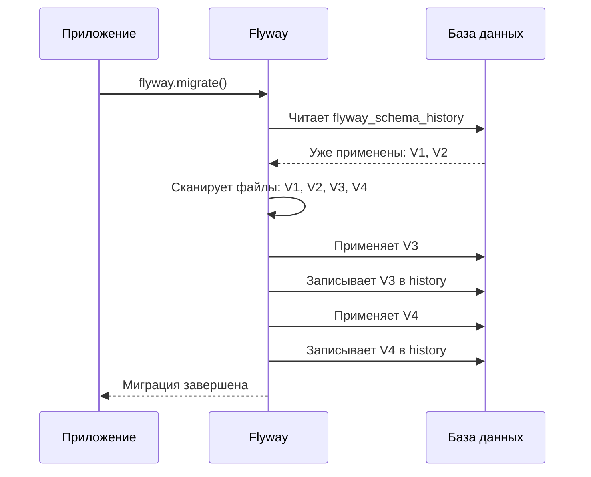
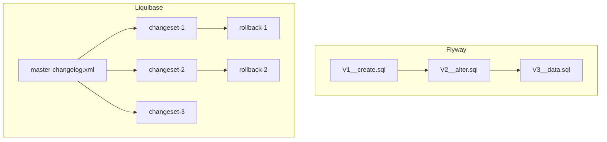
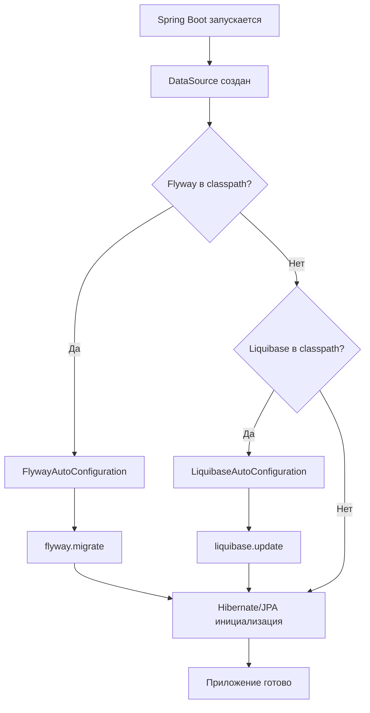
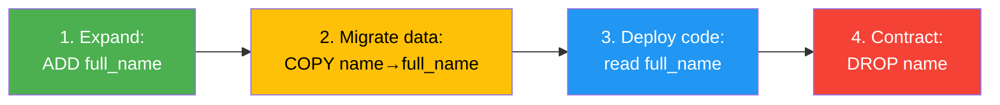

# Вопросы на собеседовании: `Flyway` и `Liquibase`

Полное покрытие инструментов миграции баз данных: `Flyway` (версионные и повторяемые миграции, callbacks, placeholders, baseline, repair, clean) и `Liquibase` (changelog, changeset, rollback, preconditions, contexts, labels, diff). Сравнение подходов, интеграция со `Spring Boot`, стратегии zero-downtime миграций.

Краткое введение: **Миграции баз данных** — это контролируемые, версионируемые изменения схемы и данных БД. Два самых популярных инструмента в Java-экосистеме — `Flyway` и `Liquibase`. На собеседованиях проверяют понимание принципов миграций, умение выбрать подходящий инструмент и знание стратегий безопасного развёртывания. Тема тесно связана с [SQL](sql-interview.md), [архитектурой БД](database-architecture-interview.md) и [Spring Boot](../frameworks/spring/spring-boot-interview.md).

## Полезные ссылки

### Официальная документация

- [Flyway Documentation](https://documentation.red-gate.com/flyway/) — документация Flyway (Redgate)
- [Liquibase Documentation](https://docs.liquibase.com/) — документация Liquibase
- [Spring Boot — Database Initialization](https://docs.spring.io/spring-boot/reference/data/sql.html#howto.data-initialization.migration-tool) — автоконфигурация миграций

### Статьи Baeldung

- [Database Migrations with Flyway](https://www.baeldung.com/database-migrations-with-flyway) — основы Flyway
- [Flyway Callbacks](https://www.baeldung.com/flyway-callbacks) — callbacks в Flyway
- [Flyway Repair with Spring Boot](https://www.baeldung.com/spring-boot-flyway-repair) — команда repair
- [Rolling Back Migrations with Flyway](https://www.baeldung.com/flyway-roll-back) — откат миграций
- [Liquibase to Safely Evolve Your Database Schema](https://www.baeldung.com/liquibase-refactor-schema-of-java-app) — основы Liquibase
- [Introduction to Liquibase Rollback](https://www.baeldung.com/liquibase-rollback) — откат в Liquibase
- [Liquibase vs Flyway](https://www.baeldung.com/liquibase-vs-flyway) — сравнение инструментов

## Содержание

- [Полезные ссылки](#полезные-ссылки)
- [See also](#see-also)

**Зачем нужны миграции БД**
- [Q1. (!) Что такое миграции базы данных и зачем они нужны?](#q1--что-такое-миграции-базы-данных-и-зачем-они-нужны)
- [Q2. Какие проблемы решает инструмент миграций?](#q2-какие-проблемы-решает-инструмент-миграций)

**Flyway — основы**
- [Q3. (!) Что такое Flyway и как он работает?](#q3--что-такое-flyway-и-как-он-работает)
- [Q4. (!) Какие типы миграций поддерживает Flyway?](#q4--какие-типы-миграций-поддерживает-flyway)
- [Q5. (!) Какое соглашение об именовании файлов миграций в Flyway?](#q5--какое-соглашение-об-именовании-файлов-миграций-в-flyway)
- [Q6. Что такое таблица flyway_schema_history?](#q6-что-такое-таблица-flyway_schema_history)
- [Q7. Какие основные команды Flyway существуют?](#q7-какие-основные-команды-flyway-существуют)

**Flyway — продвинутые возможности**
- [Q8. (!) Что такое Flyway Callbacks и для чего они используются?](#q8--что-такое-flyway-callbacks-и-для-чего-они-используются)
- [Q9. Что такое placeholders в Flyway?](#q9-что-такое-placeholders-в-flyway)
- [Q10. Что такое baseline в Flyway?](#q10-что-такое-baseline-в-flyway)
- [Q11. Когда и как используется команда repair?](#q11-когда-и-как-используется-команда-repair)
- [Q12. Что делает команда clean и почему она опасна?](#q12-что-делает-команда-clean-и-почему-она-опасна)

**Liquibase — основы**
- [Q13. (!) Что такое Liquibase и чем он отличается от Flyway?](#q13--что-такое-liquibase-и-чем-он-отличается-от-flyway)
- [Q14. (!) Что такое Changelog и Changeset в Liquibase?](#q14--что-такое-changelog-и-changeset-в-liquibase)
- [Q15. В каких форматах можно описывать миграции в Liquibase?](#q15-в-каких-форматах-можно-описывать-миграции-в-liquibase)
- [Q16. Как Liquibase отслеживает выполненные миграции?](#q16-как-liquibase-отслеживает-выполненные-миграции)

**Liquibase — продвинутые возможности**
- [Q17. (!) Как работает rollback в Liquibase?](#q17--как-работает-rollback-в-liquibase)
- [Q18. Что такое preconditions в Liquibase?](#q18-что-такое-preconditions-в-liquibase)
- [Q19. Что такое contexts и labels в Liquibase?](#q19-что-такое-contexts-и-labels-в-liquibase)
- [Q20. Что делает команда diff в Liquibase?](#q20-что-делает-команда-diff-в-liquibase)

**Сравнение Flyway и Liquibase**
- [Q21. (!) Flyway vs Liquibase: ключевые различия](#q21--flyway-vs-liquibase-ключевые-различия)
- [Q22. Когда выбрать Flyway, а когда Liquibase?](#q22-когда-выбрать-flyway-а-когда-liquibase)

**Spring Boot интеграция**
- [Q23. (!) Как Spring Boot автоконфигурирует Flyway и Liquibase?](#q23--как-spring-boot-автоконфигурирует-flyway-и-liquibase)
- [Q24. Как настроить миграции для нескольких DataSource?](#q24-как-настроить-миграции-для-нескольких-datasource)

**Стратегии и лучшие практики**
- [Q25. (!) Что такое expand-contract pattern для zero-downtime миграций?](#q25--что-такое-expand-contract-pattern-для-zero-downtime-миграций)
- [Q26. Какие правила backward-compatible миграций надо соблюдать?](#q26-какие-правила-backward-compatible-миграций-надо-соблюдать)
- [Q27. Как тестировать миграции?](#q27-как-тестировать-миграции)
- [Q28. Как организовать миграции в multi-tenant приложении?](#q28-как-организовать-миграции-в-multi-tenant-приложении)

**Продвинутые сценарии**
- [Q29. Как Flyway и Liquibase работают в multi-module приложениях?](#q29-как-flyway-и-liquibase-работают-в-multi-module-приложениях)
- [Q30. (!) Как обрабатывать failed migrations и восстанавливаться после сбоя?](#q30--как-обрабатывать-failed-migrations-и-восстанавливаться-после-сбоя)
- [Q31. Что такое Flyway Teams (Enterprise) и его ключевые возможности?](#q31-что-такое-flyway-teams-enterprise-и-его-ключевые-возможности)
- [Q32. Как в Liquibase работает `tagDatabase` и rollback по тегу?](#q32-как-в-liquibase-работает-tagdatabase-и-rollback-по-тегу)

**Лучшие практики**
- [Q33. (!) Лучшие практики именования и структуры миграций](#q33--лучшие-практики-именования-и-структуры-миграций)
- [Q34. Как обеспечить идемпотентность и атомарность миграций?](#q34-как-обеспечить-идемпотентность-и-атомарность-миграций)
- [Q35. Как мигрировать данные (data migration) безопасно?](#q35-как-мигрировать-данные-data-migration-безопасно)

**Kubernetes и продвинутые сценарии**
- [Q36. Как запускать Flyway в Kubernetes — init containers и Job?](#q36-как-запускать-flyway-в-kubernetes--init-containers-и-job)
- [Q37. Что такое Liquibase Hub и Liquibase Pro — чем они расширяют OSS-версию?](#q37-что-такое-liquibase-hub-и-liquibase-pro--чем-они-расширяют-oss-версию)
- [Q38. Как работают Flyway Callbacks — beforeMigrate, afterMigrate и другие хуки?](#q38-как-работают-flyway-callbacks--beforemigrate-aftermigrate-и-другие-хуки)
- [Q39. Expand-contract pattern для zero-downtime миграций — как реализовать?](#q39-expand-contract-pattern-для-zero-downtime-миграций--как-реализовать)
- [Q40. Стратегии rollback в Flyway и Liquibase — undo-скрипты и команда rollback](#q40-стратегии-rollback-в-flyway-и-liquibase--undo-скрипты-и-команда-rollback)
- [Q41. Как использовать Testcontainers для интеграционного тестирования миграций?](#q41-как-использовать-testcontainers-для-интеграционного-тестирования-миграций)
- [Q42. Как безопасно мигрировать большие таблицы — pg_repack, CONCURRENTLY, batching](#q42-как-безопасно-мигрировать-большие-таблицы--pg_repack-concurrently-batching)

---

## Q1. (!) Что такое миграции базы данных и зачем они нужны?

**Миграция базы данных** — это версионируемое, воспроизводимое изменение схемы или данных БД, оформленное в виде скрипта и применяемое автоматически.

Зачем нужны:

- **Версионирование схемы** — схема БД эволюционирует вместе с кодом, каждое изменение отслеживается в VCS
- **Воспроизводимость** — любой разработчик может поднять базу с нуля, последовательно применив все миграции
- **Консистентность окружений** — dev, staging и production гарантированно находятся в одной версии схемы
- **Аудит изменений** — видно кто, когда и какое изменение внёс
- **Автоматизация** — миграции применяются при старте приложения или в CI/CD pipeline, без ручного вмешательства


Без инструмента миграций команды часто прибегают к ручным SQL-скриптам, пересылке дампов или устным договорённостям — всё это приводит к рассинхронизации окружений и сложно отлавливаемым багам.


> [!mcq]
> - [ ] Миграция БД — это разовый дамп схемы (`pg_dump`) для бэкапа перед деплоем; восстанавливается через `pg_restore` | Дамп фиксирует текущее состояние, а миграция — это **версионируемый инкремент** (`V3__add_role.sql`), описывающий *переход* от одной версии схемы к другой. Дампы не дают истории «кто/когда/что менял». ❌ ПОСЛЕДСТВИЕ: команда хранит `pg_dump` в репозитории вместо миграций — при rollback кода невозможно узнать, какая версия схемы соответствует, разработчики на dev получают свежую схему из prod-дампа с продовыми данными.
> - [ ] Миграция БД — это ORM-функция, которая автоматически синхронизирует схему с Java-классами (`Hibernate hbm2ddl=update`) | `hbm2ddl=update` создаёт DDL на лету и **не версионируется**: добавил `@Column` → схема изменится без аудита. Миграции же — явный SQL-скрипт под Git с историей. ❌ ПОСЛЕДСТВИЕ: на prod включён `hbm2ddl=update`, новая версия добавила `nullable=false` на существующее поле → запуск приложения молча уронит таблицу или зависнет на блокировке.
> - [x] Миграция БД — это **версионируемый, идемпотентный SQL-скрипт** (`V<version>__<desc>.sql` или `<changeSet>` в Liquibase), оформленный в Git и применяемый автоматически инструментом (Flyway/Liquibase) ровно один раз с записью в служебную таблицу истории (`flyway_schema_history`) | Это позволяет: версионировать схему параллельно с кодом, воспроизводить любое состояние из нуля, гарантировать что dev/staging/prod находятся на одной версии. ✓ ПРИМЕНЯТЬ: каждое DDL/DML-изменение оформлять отдельным версионированным файлом, коммитить вместе с кодом, который его использует. 📋 ПРАВИЛО: «schema-as-code: один скрипт = один inкремент = один коммит». 🔗 См. Q3, Q6.
> - [ ] Миграция БД — это копирование данных между разными СУБД (например, MySQL → PostgreSQL) через ETL-пайплайны | Это **data migration** (перенос данных), а не **schema migration** (эволюция схемы). Flyway/Liquibase решают вторую задачу — версионирование DDL/DML внутри одной СУБД, а не миграцию между движками. ❌ ПОСЛЕДСТВИЕ: тимлид заводит тикет «настроить Flyway для миграции данных из Oracle в PG» — Flyway такое не делает; нужны pgloader/AWS DMS, время потеряно.
## Q2. Какие проблемы решает инструмент миграций?

Инструмент миграций (такой как `Flyway` или `Liquibase`) решает следующие проблемы:


> [!mcq]
> - [ ] Главная проблема, которую решает Flyway — автоматический rollback любой накатанной миграции одной командой `flyway undo` без подготовки скриптов отката | `flyway undo` — **платная фича** (Teams Edition); Community вообще не поддерживает откат. Liquibase даёт rollback из коробки, но требует чтобы автор миграции сам написал `<rollback>`-блок. ❌ ПОСЛЕДСТВИЕ: команда покупает Flyway Community ради «отката» и обнаруживает на prod-инциденте, что `undo` недоступен, а compensating-миграцию никто не приготовил.
> - [x] Flyway/Liquibase решают: (1) **рассинхронизацию dev/staging/prod** — единый набор скриптов; (2) **отсутствие истории** — `flyway_schema_history`/`DATABASECHANGELOG` хранят что/когда/кем применено; (3) **ручное применение SQL** — миграции запускаются в CI/CD или на старте Spring Boot; (4) **конфликты при параллельной разработке** — версии и блокировки на уровне БД | Эти инструменты НЕ решают: автоматический rollback (нужны compensating-миграции), zero-downtime (нужен expand-contract), синхронизацию с ORM (отдельная задача). ✓ ПРИМЕНЯТЬ: подключать Flyway/Liquibase с первой версии сервиса; каждое изменение схемы — отдельная миграция в Git. 📋 ПРАВИЛО: «миграции = единственный источник правды о схеме». 🔗 См. Q1, Q31 (zero-downtime).
> - [ ] Миграционные инструменты автоматически делают БД совместимой с ORM (`Hibernate`/`JPA`): анализируют entity-классы и генерируют DDL | Flyway и Liquibase **не читают Java-классы**: они применяют SQL/XML, который написал разработчик. За соответствие схемы и `@Entity` отвечает программист. Hibernate `hbm2ddl=validate` может проверить рассогласование на старте, но миграции его не предотвращают. ❌ ПОСЛЕДСТВИЕ: разработчик добавляет поле в `@Entity`, ожидает что Flyway «подтянет» — на старте получает `column does not exist`, миграция написана не была.
> - [ ] Flyway/Liquibase обеспечивают физический бэкап БД перед каждой миграцией и автоматический restore при ошибке | Никакого бэкапа эти инструменты не делают: Flyway просто исполняет SQL в транзакции (если СУБД поддерживает транзакционный DDL — PostgreSQL да, MySQL/Oracle нет). Бэкап — задача DBA/инфраструктуры (`pg_basebackup`, snapshot диска). ❌ ПОСЛЕДСТВИЕ: на MySQL DDL не транзакционен; миграция упала в середине, half-applied state, бэкапа нет — DBA восстанавливает руками 4 часа.
| Проблема | Решение |
|----------|---------|
| «На моей машине работает, а на staging — нет» | Единый набор миграций для всех окружений |
| Ручное применение SQL-скриптов на production | Автоматическое последовательное применение |
| Непонятно, какая версия схемы на сервере | Таблица истории миграций в самой БД |
| Конфликты при параллельной разработке | Версионирование и блокировки |
| Невозможно откатить изменение | Rollback-механизмы (особенно в `Liquibase`) |
| Тестирование схемы | Миграции запускаются в тестах через `Testcontainers` |

Оба инструмента — Java-based, поддерживают CLI, Maven/Gradle плагины, программный API и интеграцию со `Spring Boot`.

## Q3. (!) Что такое Flyway и как он работает?

**`Flyway`** — инструмент миграции баз данных, основанный на принципе **версионных SQL-скриптов**. Развивается компанией Redgate.

Принцип работы:


> [!mcq]
> - [ ] Flyway хранит уже применённые миграции в локальном файле `.flyway-state.json` рядом с jar-ом приложения | История хранится **в самой целевой БД** в служебной таблице `flyway_schema_history` (имя настраивается через `flyway.table`). Это критично: разные инстансы одного приложения видят одну и ту же историю, локальный файл — невозможно. ❌ ПОСЛЕДСТВИЕ: разработчик ищет «где Flyway хранит историю», не находит файл, удаляет таблицу `flyway_schema_history` через `clean` — следующий деплой пытается применить V1 поверх существующей схемы, всё падает на `relation already exists`.
> - [ ] Flyway сравнивает текущую схему БД с целевой схемой из миграций и сам генерирует diff-DDL | Это поведение **`liquibase diffChangeLog`/Hibernate hbm2ddl**, а не Flyway. Flyway не анализирует схему — он просто **последовательно применяет SQL-файлы**, которых ещё нет в `flyway_schema_history`, в порядке версий. ❌ ПОСЛЕДСТВИЕ: разработчик удалил таблицу руками на dev, ожидая что Flyway «увидит расхождение и пересоздаст» — Flyway видит запись о применённой V1 в history, ничего не делает, приложение падает на старте.
> - [x] Flyway: (1) сканирует `classpath:db/migration` (или путь из `flyway.locations`), находит файлы `V<v>__<desc>.sql` / `R__...sql`; (2) читает `flyway_schema_history` в целевой БД; (3) сортирует непримененные миграции по версии; (4) применяет каждую в **отдельной транзакции** (на СУБД с транзакционным DDL); (5) пишет в history `version`, `checksum`, `success`, `execution_time` | Checksum = CRC32 содержимого файла; используется на следующем запуске для `validate`. ✓ ПРИМЕНЯТЬ: класть миграции в `src/main/resources/db/migration`, не редактировать применённые файлы; для исправления — новая миграция. 📋 ПРАВИЛО: «scan → check history → sort → apply in TX → record». 🔗 См. Q6 (history), Q11 (repair).
> - [ ] Flyway применяет миграции параллельно на всех узлах кластера приложения, ускоряя деплой | На каждом инстансе на старте берётся **эксклюзивный lock** через `pg_advisory_lock`/`SELECT FOR UPDATE` на таблице history — параллельный накат запрещён. Это by design: иначе две реплики одновременно применили бы V3, и checksum/order сломался бы. ❌ ПОСЛЕДСТВИЕ: 6 подов стартуют одновременно, ожидаемого «ускорения» нет — 5 ждут на advisory_lock, ещё и health-чек первого пода падает на 60-секундной миграции, K8s рестартует под, lock «висит» до timeout.
1. При запуске `Flyway` сканирует указанную директорию (по умолчанию `db/migration`) на наличие файлов миграций
2. Проверяет таблицу `flyway_schema_history` — какие миграции уже применены
3. Сортирует непримененные миграции по версии
4. Последовательно применяет каждую миграцию в отдельной транзакции
5. Записывает результат (успех/ошибка, checksum, время) в `flyway_schema_history`



Философия `Flyway` — **простота**: пишешь SQL, который уже знаешь, нет дополнительного DSL для изучения.

## Q4. (!) Какие типы миграций поддерживает Flyway?


> [!mcq]
> - [ ] Flyway поддерживает только versioned-миграции (`V<v>__...sql`) — это его философия «один файл = одна версия» | Это упрощённое представление: помимо `V` есть `R` (repeatable) и `U` (undo, платный), плюс Java-based миграции через `JavaMigration`. ❌ ПОСЛЕДСТВИЕ: разработчик не знает про `R__`, оборачивает `CREATE OR REPLACE VIEW` в `V42__update_view.sql`, при следующем изменении создаёт `V43__update_view.sql` с почти тем же содержанием — история раздувается, view дублируется в коде.
> - [x] Flyway различает три префикса: **`V<version>__<desc>.sql`** — versioned, применяются один раз в порядке версий (DDL/DML); **`R__<desc>.sql`** — repeatable, применяются при изменении checksum, без версии, после всех V (views, функции, процедуры); **`U<version>__<desc>.sql`** — undo, откатывают конкретную V (только Teams Edition). Также поддержаны Java-миграции (`JavaMigration` интерфейс) для логики, которую сложно выразить в SQL | ✓ ПРИМЕНЯТЬ: V — для таблиц/индексов/данных; R — для idempotent объектов (view, stored procedures); Java — для миграции данных с парсингом/HTTP-вызовами. 📋 ПРАВИЛО: «V — immutable, R — mutable, U — paid». 🔗 См. Q5 (naming), Q9.
> - [ ] Префикс `R` означает «rollback» — при ошибке Flyway автоматически запускает соответствующий `R__`-файл вместо упавшей `V` | `R` — это **repeatable**, а не rollback. Откат — это `U` (Undo, платно). Путаница приводит к двум несовместимым ментальным моделям. ❌ ПОСЛЕДСТВИЕ: разработчик пишет `R__rollback_v3.sql` ожидая авторестора при ошибке V3 — Flyway применит R после успешного V3 как обычную repeatable, и `DROP TABLE` из rollback-скрипта снесёт только что созданную таблицу.
> - [ ] Repeatable-миграции (`R__`) применяются после каждого деплоя, даже если содержимое файла не менялось | Repeatable исполняется **только когда checksum изменился** — Flyway вычисляет CRC32 от тела файла и сравнивает с записью в `flyway_schema_history`. Без изменений — пропуск. ❌ ПОСЛЕДСТВИЕ: команда верит «R накатываются всегда», использует `R__seed_data.sql` с `INSERT ... ON CONFLICT DO NOTHING` для справочников, после первого деплоя добавляют новую запись прямо в БД руками — на следующем деплое R не выполнится (checksum не менялся), новые env-ы не получат данных.
`Flyway` поддерживает три типа миграций:

### 1. Versioned migrations (версионные)

Самый распространённый тип. Применяются **ровно один раз**, в порядке возрастания версии. Используются для изменения схемы.

```sql
-- V1__create_users_table.sql
CREATE TABLE users (
    id BIGSERIAL PRIMARY KEY,
    email VARCHAR(255) NOT NULL UNIQUE,
    created_at TIMESTAMP DEFAULT CURRENT_TIMESTAMP
);

-- V2__add_user_roles.sql
ALTER TABLE users ADD COLUMN role VARCHAR(50) DEFAULT 'USER';
CREATE INDEX idx_users_role ON users(role);
```

### 2. Repeatable migrations (повторяемые)

Применяются **каждый раз, когда меняется их checksum**. Не имеют версии. Выполняются после всех версионных миграций. Идеальны для представлений, функций, процедур.


> [!mcq]
> - [ ] `R__`-миграции запускаются строго перед `V__`-миграциями при каждом старте Flyway | Порядок обратный: сначала все pending `V` (по версии), затем все `R` (которые changed). Это by design — view/функция могут зависеть от свежесозданной таблицы из V-миграции. ❌ ПОСЛЕДСТВИЕ: разработчик пишет `R__create_users_view.sql` с `SELECT * FROM users`, а в `V5__create_users.sql` создаёт таблицу. Если бы R шли первыми — view бы упал; на самом деле работает, но команда строит ошибочную ментальную модель.
> - [x] `R__<desc>.sql` (repeatable) — миграции **без версии**, применяются после всех `V`, **повторно при изменении CRC32-checksum** содержимого файла. Идеальны для idempotent-объектов: `CREATE OR REPLACE VIEW`, `CREATE OR REPLACE FUNCTION`, materialized views (с REFRESH), stored procedures, seed-данных через `INSERT ... ON CONFLICT DO NOTHING` | Преимущество: один файл хранит «текущую правду» о view, а не цепочку `V42__create`, `V57__alter_view`, `V92__alter_view_again`. ✓ ПРИМЕНЯТЬ: каждая view/функция = один R-файл; меняешь — меняется checksum — Flyway пересоздаёт. 📋 ПРАВИЛО: «R = текущая версия объекта, V = инкремент схемы». 🔗 См. Q4, Q9 (placeholders влияют на checksum R).
> - [ ] Repeatable-миграция выполняется параллельно со всеми остальными repeatable, ускоряя деплой | Flyway выполняет миграции **строго последовательно** в одной транзакции (или в нескольких, если есть `BEGIN`/`COMMIT` внутри). Параллельность невозможна — нет гарантии порядка для view, зависящих друг от друга. ❌ ПОСЛЕДСТВИЕ: разработчик надеется ускорить миграцию 50 view, дробит файлы — на проде это всё равно последовательно, а вот хаотичный порядок имён ломает зависимости (R__view_b ссылается на R__view_a, но `R__view_b` идёт первым по алфавиту).
> - [ ] Если изменить уже применённую `R__view.sql`, Flyway падает с `checksum mismatch`, как для `V__` | Repeatable **специально позволяет менять checksum** — это и есть его смысл. `validate` для R проверяет не «совпадает ли checksum с прошлым», а «нужно ли переисполнить». Checksum mismatch валится только для `V__`-миграций. ❌ ПОСЛЕДСТВИЕ: разработчик запоминает «нельзя править применённые миграции» и для исправления view создаёт `V100__fix_view.sql` с `DROP VIEW + CREATE VIEW` — позже изначальный `R__view.sql` всё равно применится последним и затрёт правки.
```sql
-- R__create_active_users_view.sql
CREATE OR REPLACE VIEW active_users AS
SELECT id, email, role
FROM users
WHERE deleted_at IS NULL;
```

### 3. Undo migrations (платная версия)

Файлы с префиксом `U`, позволяют откатить конкретную версионную миграцию:

```sql
-- U2__add_user_roles.sql
ALTER TABLE users DROP COLUMN role;
DROP INDEX IF EXISTS idx_users_role;
```

> **Важно**: Undo-миграции доступны только в платной версии `Flyway`. В Community Edition откат делается через создание новой версионной миграции.


> [!mcq]
> - [ ] Undo-миграции (`U<version>__...sql`) доступны в Flyway Community Edition и автоматически вызываются при ошибке любой `V`-миграции | `U` — это **Teams Edition (платная)**; в Community нет ни команды `undo`, ни автоматического отката. Даже в Teams `flyway undo` запускается **вручную** оператором, не автоматически. ❌ ПОСЛЕДСТВИЕ: команда пишет `U7__rollback_users.sql` веря в auto-rollback на ошибке V7 — миграция падает в проде, оператор ждёт «Flyway сам откатит», а Flyway просто оставляет `success=false` в history; нужно править руками.
> - [x] В Community Edition вместо undo делают **«compensating migration»** — новую версионированную миграцию, отменяющую эффект предыдущей: вместо `U7__add_role.sql` пишут `V8__remove_role_added_in_v7.sql` с `ALTER TABLE users DROP COLUMN role`. Это идиоматический подход — история линейная, нет ветвлений | Преимущество: производственная схема всегда движется вперёд, можно reproduce из любой точки; недостаток: данные удалённой колонки не вернуть автоматически. ✓ ПРИМЕНЯТЬ: для отката изменения в Community — V<next>-миграция с reverse-операцией; для критичных DDL делать backup схемы до миграции. 📋 ПРАВИЛО: «forward-only migrations: rollback = new migration, не undo». 🔗 См. Q31 (zero-downtime: expand → contract).
> - [ ] Чтобы откатить миграцию в Community, достаточно удалить файл `V7__...sql` и запустить `flyway migrate` — БД вернётся к предыдущей версии | Удаление файла приведёт к **`flyway validate` ошибке**: «Detected applied migration not resolved locally» — Flyway видит запись в history, но файла нет. Сам по себе rollback не выполняется. ❌ ПОСЛЕДСТВИЕ: разработчик удаляет проблемную миграцию из репо, на проде Flyway падает на старте → приложение не поднимается, downtime до hotfix-релиза с восстановлением файла.
> - [ ] Undo-миграции бывают только Java-based (`JavaUndoMigration`), SQL-формат не поддерживается | Undo-миграции бывают и в SQL (`U<version>__...sql`), и в Java (`JavaUndoMigration`). Ограничение — лицензия (Teams), а не язык. ❌ ПОСЛЕДСТВИЕ: команда отказывается от undo считая что нужен Java, потом обнаруживает что и Java, и SQL undo требуют Teams Edition — потерянное время на рефакторинг.
## Q5. (!) Какое соглашение об именовании файлов миграций в Flyway?

`Flyway` использует строгое соглашение об именовании:

```
<Prefix><Version>__<Description>.sql
```


> [!mcq]
> - [ ] Между версией и описанием можно поставить одно подчёркивание: `V1_create_users.sql` — Flyway его примет | Flyway требует **строго два подчёркивания** `__` как разделитель. Файл `V1_create_users.sql` будет проигнорирован сканером — миграция не применится. ❌ ПОСЛЕДСТВИЕ: разработчик скопировал имя из туториала по другому инструменту, сделал `V12_add_index.sql`, запустил `migrate` — Flyway не видит файл, индекс не создан, `EXPLAIN ANALYZE` показывает Seq Scan на проде; bug-hunt полдня.
> - [x] Формат: **`<Prefix><Version>__<Description>.<ext>`** — `V`/`R`/`U` префикс, числовая версия с `.` или `_` как разделителями (`1.2.3`, `1_2`, `20260512`), **ровно два** подчёркивания, описание (подчёркивания в нём = пробелы), расширение `.sql` или `.java`. Версии сравниваются как dotted-numbers: `V1.10` > `V1.9` (а лексикографически было бы наоборот) | ✓ ПРИМЕНЯТЬ: для команды >2 разработчиков использовать timestamp-версии (`V20260512143000__...`) — это исключает конфликты при параллельных PR с одной версией V42. 📋 ПРАВИЛО: «`V<ts>__snake_case_description.sql` — два подчёркивания обязательно». 🔗 См. Q4 (типы), Q15.
> - [ ] Версия миграции сравнивается лексикографически, поэтому нужно дополнять нулями: `V001`, `V002`, `V010` | Flyway парсит версию как **dotted numbers** через `MigrationVersion`: `V1` < `V2` < `V10` корректно (1<2<10 как числа). Padding нулями не требуется. ❌ ПОСЛЕДСТВИЕ: команда вводит конвенцию `V001/V002/...`, дойдя до `V100` всё работает; но кто-то заводит `V1.5` (минорная) — Flyway сравнивает `V001` и `V1.5` как `1` vs `1.5`, всё ок; путаница только в read-friendly листинге.
> - [ ] Имя файла должно начинаться с описания, версия идёт в конце: `create_users_V1.sql` | Flyway требует **prefix первым**: сначала `V`/`R`/`U`, затем версия, затем `__`, затем description. `create_users_V1.sql` будет проигнорирован — нет валидного префикса в начале. ❌ ПОСЛЕДСТВИЕ: разработчик переименовал файл «по-человечески читаемее», commit прошёл, на CI Flyway просто пропустил файл, миграция не применилась, тесты упали с `relation does not exist`.
| Компонент | Значение | Пример |
|-----------|----------|--------|
| Prefix | `V` — версионная, `R` — повторяемая, `U` — undo | `V` |
| Version | Числовая версия (точки или подчёркивания как разделители) | `1.2`, `1_2`, `202604121530` |
| `__` | Два подчёркивания — обязательный разделитель | `__` |
| Description | Описание миграции (подчёркивания = пробелы) | `create_users_table` |
| Suffix | Расширение файла | `.sql` |

Примеры корректных имён:

```
V1__create_users_table.sql
V1.1__add_email_index.sql
V2__add_orders_table.sql
R__refresh_materialized_views.sql
```

Примеры **некорректных** имён:

```
V1_create_users.sql      ← одно подчёркивание вместо двух
create_users_V1.sql      ← нет префикса в начале
V1__Create Users.sql     ← пробелы в имени файла
```

> **Совет для команд**: используйте timestamp-based версии (`V20260412153000__...`) вместо порядковых номеров — это предотвращает конфликты при параллельной разработке.

## Q6. Что такое таблица flyway_schema_history?

`flyway_schema_history` — служебная таблица, которую `Flyway` создаёт автоматически в целевой БД для отслеживания примененных миграций.

Структура таблицы:


> [!mcq]
> - [ ] `flyway_schema_history` хранит полный текст SQL каждой миграции в колонке `script` для возможности «replay» | Колонка `script` хранит только **имя файла** (`V3__add_users.sql`), а не его содержимое. Сам SQL-текст не дублируется в БД — для replay нужен исходный файл из артефакта/репозитория. ❌ ПОСЛЕДСТВИЕ: DBA пытается восстановить старую схему «по одной БД», находит таблицу history, ожидает увидеть SQL — там только имена; без артефактов сборки восстановить невозможно.
> - [x] `flyway_schema_history` содержит: `installed_rank` (порядок), `version` (NULL для R), `description`, `type` (SQL/JDBC/BASELINE), `script` (имя файла), **`checksum`** (CRC32 от тела файла), `installed_by` (пользователь БД), `installed_on`, `execution_time` (мс), `success` (bool). Checksum используется при `validate` для детекции изменения уже применённой миграции | ✓ ПРИМЕНЯТЬ: мониторить `success=false` записи — это failed migrations, требуют `repair`; `version IS NULL AND type='SQL'` = repeatable. 📋 ПРАВИЛО: «history-таблица = source of truth о состоянии схемы; не редактировать руками без `flyway repair`». 🔗 См. Q11 (repair), Q3.
> - [ ] Имя таблицы истории всегда `flyway_schema_history` и его нельзя изменить — это часть протокола Flyway | Имя настраивается через `flyway.table` (default `flyway_schema_history`). Это нужно когда несколько приложений делят одну БД и хотят независимые истории миграций. ❌ ПОСЛЕДСТВИЕ: два микросервиса деплоятся в одну схему `public` — оба пишут в `flyway_schema_history`, чужие миграции ломают `validate` друг друга; правильное решение — `flyway.table=svc_a_history` для одного и `svc_b_history` для другого.
> - [ ] Поле `success=false` в `flyway_schema_history` означает что миграция была отменена через `flyway undo` | `success=false` записывается когда миграция **упала с ошибкой** (на СУБД без транзакционного DDL). `flyway undo` (платная фича) удаляет запись о версии или помечает специальным типом, не ставит `success=false`. ❌ ПОСЛЕДСТВИЕ: разработчик видит `success=false` после прода, думает «кто-то откатил миграцию вручную через undo», теряет время на расследование, тогда как реальная причина — упала миграция и оставила half-applied state.
| Колонка | Назначение |
|---------|------------|
| `installed_rank` | Порядок применения |
| `version` | Версия миграции (`NULL` для repeatable) |
| `description` | Описание из имени файла |
| `type` | `SQL`, `JDBC`, `BASELINE` и т.д. |
| `script` | Имя файла миграции |
| `checksum` | CRC32-хеш содержимого файла |
| `installed_by` | Пользователь БД |
| `installed_on` | Время применения |
| `execution_time` | Время выполнения (мс) |
| `success` | Успешность (`true`/`false`) |

`Flyway` использует `checksum` для обнаружения изменений в уже примененных миграциях — если файл миграции был изменён после применения, `validate` вернёт ошибку.

```sql
SELECT version, description, checksum, success
FROM flyway_schema_history
ORDER BY installed_rank;
```

## Q7. Какие основные команды Flyway существуют?

`Flyway` предоставляет 7 основных команд:


> [!mcq]
> - [ ] `flyway validate` сама исправляет несовпадения checksum в `flyway_schema_history` без участия разработчика | `validate` — **read-only**: он лишь проверяет, что checksum/имена применённых миграций совпадают с файлами, и **бросает ошибку** при расхождении. Исправление расхождений делает `repair` (отдельная команда). ❌ ПОСЛЕДСТВИЕ: разработчик правит уже применённую миграцию и думает «`validate` сам обновит» — на CI получает `Migration checksum mismatch for migration V5`, билд падает; команда теряет час пока понимает что нужен `repair`.
> - [x] Семь основных команд: **`migrate`** (применить pending), **`info`** (статус всех миграций), **`validate`** (проверить checksum/имена применённых vs файлов, read-only), **`baseline`** (пометить существующую БД как стартовую версию для внедрения Flyway в legacy-проект), **`repair`** (починить history: удалить failed-записи, обновить checksum), **`clean`** (DROP всех объектов схемы — опасно, default disabled с 9.x), **`undo`** (откат последней V, только Teams) | ✓ ПРИМЕНЯТЬ: на старте Spring Boot вызывается `migrate`+`validate`; `baseline` — один раз при подключении Flyway к существующей БД; `repair` — для аварийного восстановления history. 📋 ПРАВИЛО: «migrate=apply, validate=check, repair=fix-history, clean=DROP-ALL». 🔗 См. Q10 (baseline), Q11 (repair), Q12 (clean).
> - [ ] Команда `flyway clean` удаляет только записи из `flyway_schema_history`, не трогая таблицы | `clean` делает **`DROP` всех объектов схемы**: таблиц, view, функций, типов и саму `flyway_schema_history`. Полная потеря данных. С Flyway 9+ default `cleanDisabled=true` именно из-за серьёзности эффекта. ❌ ПОСЛЕДСТВИЕ: разработчик «очищает только историю» через `flyway clean` на staging — теряет всю схему и тестовые данные клиента, восстановление из backup +2 часа downtime.
> - [ ] `flyway baseline` создаёт snapshot текущих данных БД для возможности `restore` через одноимённую команду | Никакого `restore` в Flyway нет; `baseline` лишь записывает в `flyway_schema_history` запись с `type=BASELINE` и заданной версией, говоря «миграции до этой версии считаем применёнными». Бэкап данных — задача `pg_dump`, а не Flyway. ❌ ПОСЛЕДСТВИЕ: команда «делает baseline» ожидая что это бэкап, при инциденте обнаруживают что вернуть данные нечем — нужно было настраивать backup-стратегию отдельно.
| Команда | Назначение |
|---------|------------|
| `migrate` | Применяет все непримененные миграции |
| `clean` | **Удаляет все объекты** из схемы (опасно!) |
| `info` | Показывает состояние всех миграций |
| `validate` | Проверяет, что примененные миграции совпадают с файлами |
| `baseline` | Помечает существующую БД как baseline для начала миграций |
| `repair` | Исправляет таблицу history (удаляет неудачные, обновляет checksum) |
| `undo` | Откатывает последнюю миграцию (платная версия) |

Использование через Gradle:

```groovy
plugins {
    id 'org.flywaydb.flyway' version '10.15.0'
}


> [!mcq]
> - [ ] Если в проекте подключён Spring Boot Flyway starter, Gradle-плагин `org.flywaydb.flyway` становится не нужен — Spring сам гоняет миграции в CI | Spring Boot starter автоматически запускает `migrate` **на старте приложения**, но в CI/CD-пайплайне (где приложение не запускается) это не сработает. Gradle/Maven-плагин нужен для standalone задач: `flywayMigrate` в job до деплоя, `flywayInfo` в pre-merge check. ❌ ПОСЛЕДСТВИЕ: команда полагается только на стартовый migrate, в pipeline нет валидации миграций — SQL-ошибка обнаруживается на проде после релиза, rollback кода обязательно но БД уже мигрировала.
> - [x] Gradle-плагин предоставляет таски `flywayMigrate`, `flywayInfo`, `flywayValidate`, `flywayBaseline`, `flywayRepair`, `flywayClean` (и `flywayUndo` в Teams). Конфигурируется блоком `flyway { url=... user=... password=... }`. Полезен для запуска миграций из CI/CD **до** старта приложения, или при работе с БД без Spring (миграции для аналитической БД, схем для bash-скриптов) | ✓ ПРИМЕНЯТЬ: в CI запускать `./gradlew flywayValidate` на pre-merge; `./gradlew flywayMigrate -Pflyway.url=...` в deploy-job. 📋 ПРАВИЛО: «Gradle-plugin = миграции вне приложения; Spring starter = миграции на старте». 🔗 См. Q23, Q24.
> - [ ] Параметры `flyway { url, user, password }` обязательно хранятся в `build.gradle` в plain text — Gradle их шифрует автоматически | Gradle **никак не шифрует** строки в build.gradle. Хранить пароли в VCS — нарушение security-baseline. Корректно: передавать через `-Pflyway.password=$DB_PASSWORD` из env, или использовать `gradle.properties` в `~/.gradle/` (вне репо). ❌ ПОСЛЕДСТВИЕ: команда коммитит `password = 'secret'` в build.gradle, через год пароль утекает в публичный fork; нужна ротация всех учёток БД, на больших проектах — недели работы.
> - [ ] Gradle-плагин Flyway автоматически добавляет `flywayMigrate` в таск `build`, миграции выполняются при каждой сборке | Плагин **не привязывает** `flywayMigrate` к `build`/`assemble` — он создаёт таски, но запускать их нужно явно (`./gradlew flywayMigrate`). Это by design: иначе каждая локальная сборка пыталась бы достучаться до БД. ❌ ПОСЛЕДСТВИЕ: разработчик надеется «миграции применятся при `./gradlew build`» — пишет интеграционный тест против устаревшей схемы, тест зелёный локально, на CI с pre-migrate-step падает.
flyway {
    url = 'jdbc:postgresql://localhost:5432/mydb'
    user = 'postgres'
    password = 'secret'
}
```

```bash
./gradlew flywayMigrate
./gradlew flywayInfo
./gradlew flywayValidate
```

## Q8. (!) Что такое Flyway Callbacks и для чего они используются?

**Callbacks** — это хуки, которые `Flyway` вызывает на определённых этапах жизненного цикла миграции. Позволяют выполнять дополнительную логику до/после миграций.

Основные callback-события:


> [!mcq]
> - [ ] Callbacks — это таблица `flyway_callbacks` в БД, хранящая SQL-триггеры на события миграции | Callbacks — это **SQL-файлы** (`beforeMigrate.sql`, `afterMigrate.sql` в `db/migration/`) или **Java-классы** реализующие интерфейс `Callback`. Никакой служебной таблицы для них нет. ❌ ПОСЛЕДСТВИЕ: разработчик ищет «таблицу callbacks» в БД, не находит, делает вывод «callbacks не работают», переписывает логику на BEFORE-INSERT триггеры в SQL, что усложняет схему.
> - [x] Callbacks — хуки на события lifecycle миграции: **`beforeMigrate`/`afterMigrate`** (до/после всей миграции), **`beforeEachMigrate`/`afterEachMigrate`** (до/после каждого файла), **`afterMigrateError`** (на ошибке), **`beforeValidate`/`afterValidate`**, **`beforeClean`/`afterClean`**. Реализуются: SQL-файлами с именем события (`beforeMigrate.sql`) в той же директории, или Java-классами `implements Callback` (для логики, регистрируются через `flyway.callbacks=`) | ✓ ПРИМЕНЯТЬ: `beforeMigrate.sql` — `CREATE EXTENSION IF NOT EXISTS uuid-ossp`; `afterMigrate.sql` — `ANALYZE` для обновления статистики; `afterMigrateError` — отправка алерта в Slack/PagerDuty. 📋 ПРАВИЛО: «callback ≠ migration: не пишется в history, исполняется каждый раз». 🔗 См. Q3, Q9.
> - [ ] `afterMigrate.sql` исполняется один раз и записывается в `flyway_schema_history` как обычная миграция | Callbacks **не записываются** в history-таблицу — они выполняются **на каждый запуск migrate/clean/validate**, без отслеживания. Это by design: callback — рутинная работа (refresh stats, проверки), а не инкремент схемы. ❌ ПОСЛЕДСТВИЕ: разработчик делает `INSERT INTO config (...) VALUES (...)` в `afterMigrate.sql`, ожидая идемпотентности; при каждом старте приложения дублирует строку, через неделю в config 50 одинаковых записей.
> - [ ] Callbacks выполняются параллельно с миграциями для ускорения | Callbacks выполняются **строго последовательно**: `beforeMigrate` → миграции → `afterMigrate` (или `afterMigrateError`). Никакой параллельности нет; иначе чистка ресурсов могла бы выполниться параллельно с миграцией, ломая её. ❌ ПОСЛЕДСТВИЕ: команда пишет долгий `afterMigrate.sql` (full `VACUUM ANALYZE`), думает «параллельно migrate, не задержит» — на проде startup приложения зависает на 10 минут, K8s liveness probe убивает под.
| Callback | Когда вызывается |
|----------|-----------------|
| `beforeMigrate` | Перед началом миграции |
| `afterMigrate` | После успешной миграции |
| `afterMigrateError` | После ошибки миграции |
| `beforeEachMigrate` | Перед каждым отдельным файлом |
| `afterEachMigrate` | После каждого файла |
| `beforeValidate` | Перед валидацией |
| `beforeClean` / `afterClean` | До/после clean |

### SQL Callback

Создаёте файл с именем callback-события в директории миграций:

```sql
-- beforeMigrate.sql
-- Проверка, что расширение uuid-ossp установлено
CREATE EXTENSION IF NOT EXISTS "uuid-ossp";
```

### Java Callback


> [!mcq]
> - [ ] Java callback регистрируется аннотацией `@FlywayCallback` на классе и подхватывается через component-scan без дополнительной конфигурации | Аннотации `@FlywayCallback` нет; класс должен **реализовать интерфейс `org.flywaydb.core.api.callback.Callback`**. В Spring Boot он подхватится автоматически если объявлен `@Component` (Spring внедряет `Callback`-бины в `Flyway`-конфигурацию через `FlywayConfigurationCustomizer`). ❌ ПОСЛЕДСТВИЕ: разработчик ставит несуществующую аннотацию, билд проходит (нет такой аннотации = просто игнор), callback не работает; пол часа на поиск причины.
> - [x] Java Callback реализует **`Callback`-интерфейс** с тремя методами: `supports(Event, Context)` (на какое событие реагирует), `canHandleInTransaction(Event, Context)` (запускать ли в транзакции миграции), `handle(Event, Context)` (логика). В Spring Boot достаточно `@Component` — стартер сам подхватит. Полезно когда нужна логика на JVM: HTTP-вызовы, доступ к Spring-бинам, чтение конфигов | ✓ ПРИМЕНЯТЬ: для `AFTER_MIGRATE` — публикация события в Kafka/Slack об успешном деплое; для `AFTER_MIGRATE_ERROR` — структурированный алерт с версией миграции и stack trace. 📋 ПРАВИЛО: «Java Callback = логика на JVM; SQL Callback = чистый DDL/DML». 🔗 См. Q8.
> - [ ] `canHandleInTransaction` должен всегда возвращать `true`, иначе callback не выполнится | Если callback делает **не-транзакционные операции** (например, `VACUUM` в PostgreSQL, который запрещён внутри транзакции, или вызов внешнего HTTP-API с retry-логикой), нужно вернуть **`false`** — Flyway выполнит callback вне транзакции миграции. ❌ ПОСЛЕДСТВИЕ: callback с `VACUUM ANALYZE` возвращает `true`, миграция падает с `VACUUM cannot run inside a transaction block`, причина не очевидна — нужно глубоко знать PostgreSQL.
> - [ ] Java Callback не имеет доступа к Spring-бинам — он создаётся Flyway-ядром через рефлексию | В Spring Boot Java Callback **может** использовать Spring-бины: класс с `@Component` создаётся Spring'ом и инжектится в `Flyway` через `FlywayConfigurationCustomizer`. Можно `@Autowired` любой сервис: `KafkaTemplate`, `MeterRegistry`, `RestTemplate`. ❌ ПОСЛЕДСТВИЕ: разработчик копирует логику отправки алертов в callback ручным `new HttpClient()`, дублирует конфиг таймаутов вместо переиспользования `RestTemplate`-бина с retry-interceptors.
```java
@Component
public class FlywayCallbackLogger implements Callback {

    @Override
    public boolean supports(Event event, Context context) {
        return event == Event.AFTER_MIGRATE;
    }

    @Override
    public boolean canHandleInTransaction(Event event, Context context) {
        return true;
    }

    @Override
    public void handle(Event event, Context context) {
        log.info("Миграция завершена. Версия схемы: {}",
            context.getMigrationInfo().getVersion());
    }
}
```

Типичные use-cases: логирование, проверка prerequisites, загрузка справочных данных, установка прав доступа после миграции.

## Q9. Что такое placeholders в Flyway?


> [!mcq]
> - [ ] Placeholders в Flyway — это `?`-параметры PreparedStatement: Flyway подставляет значения через JDBC API безопасно от SQL-injection | Placeholders — это **текстовая подстановка `${name}`** в SQL-файле **до** отправки в БД. PreparedStatement тут ни при чём — миграция идёт через `Statement.execute(text)`. Из-за этого injection-риск реален: значение placeholder может содержать `;`/`--` и сломать SQL. ❌ ПОСЛЕДСТВИЕ: команда передаёт user-controlled-значение через `flyway.placeholders.tenant=<userInput>` для multi-tenant-миграций → tenant-имя `'); DROP TABLE users; --` сломает миграцию или хуже.
> - [x] **Placeholders** — текстовые переменные `${name}`, которые Flyway подставляет в SQL **до** выполнения. Конфигурируются через `spring.flyway.placeholders.<name>=<value>`, env-переменную `FLYWAY_PLACEHOLDERS_<NAME>`, или системные `${flyway:user}`/`${flyway:database}`. Важная деталь: **изменение значения placeholder меняет CRC32-checksum** для repeatable-миграций (`R__`) → они перевыполнятся. Для V-миграций checksum считается **до подстановки** | ✓ ПРИМЕНЯТЬ: для имени схемы (`${schema_name}`), env-маркера (`${environment}`); отключение placeholders — `flyway.placeholderReplacement=false`. 📋 ПРАВИЛО: «placeholder = textual ${name}; меняет checksum только для R». 🔗 См. Q4 (R-миграции), Q6 (checksum).
> - [ ] Placeholders изменяют checksum как для V, так и для R миграций — поэтому изменять конфиг placeholders нельзя после первого деплоя | Для **V-миграций checksum считается до подстановки** placeholder'ов: можно безопасно менять значение `${schema_name}` между средами (dev: `app_dev`, prod: `app_prod`). Для **R-миграций checksum считается после** — поэтому R пересоздаются при изменении placeholder. ❌ ПОСЛЕДСТВИЕ: команда боится менять placeholders, копирует SQL-файлы под каждое окружение → 4 копии одной миграции, синхронизация вручную, расхождения схем dev/prod.
> - [ ] По умолчанию syntax placeholder'ов в Flyway — `:name` (как в JPA/Hibernate `Query`) | Default-синтаксис — **`${name}`** (с `prefix=$` и `suffix=}`). `:name` используется в JPA/JDBC PreparedStatement, но это другой механизм. Flyway позволяет настроить prefix/suffix через `flyway.placeholderPrefix`/`flyway.placeholderSuffix` если `${...}` конфликтует с native SQL (например, в PL/SQL блоках). ❌ ПОСЛЕДСТВИЕ: разработчик пишет `INSERT INTO config VALUES (:env_name)` веря в JPA-синтаксис — Flyway не подставит, в БД попадает буквальная строка `:env_name`.
**Placeholders** — это переменные, которые `Flyway` подставляет в SQL-скрипты миграций на этапе выполнения. По умолчанию используется синтаксис `${name}`.

```sql
-- V3__create_schema.sql
CREATE SCHEMA IF NOT EXISTS ${schema_name};
CREATE TABLE ${schema_name}.config (
    key VARCHAR(100) PRIMARY KEY,
    value TEXT
);
INSERT INTO ${schema_name}.config (key, value)
VALUES ('env', '${environment}');
```

Конфигурация в `application.yml`:

```yaml
spring:
  flyway:
    placeholders:
      schema_name: "app"
      environment: "production"
```

Или в `flyway.conf`:

```properties
flyway.placeholders.schema_name=app
flyway.placeholders.environment=production
```

Встроенные placeholders:

| Placeholder | Значение |
|-------------|----------|
| `${flyway:defaultSchema}` | Схема по умолчанию |
| `${flyway:user}` | Пользователь БД |
| `${flyway:database}` | Имя базы данных |
| `${flyway:timestamp}` | Текущее время |

> **Важно**: изменение значения placeholder вызовет перевыполнение повторяемых (`R__`) миграций, так как изменится итоговый checksum.

## Q10. Что такое baseline в Flyway?

**Baseline** используется для внедрения `Flyway` в проект с **уже существующей базой данных**, которая ранее управлялась без инструмента миграций.


> [!mcq]
> - [ ] `baseline-on-migrate=true` всегда безопасно включать на всех окружениях — это упрощает первый запуск Flyway | На **пустой БД** опция бесполезна (Flyway сам применит все миграции с V1). На **БД с существующими таблицами но без `flyway_schema_history`** опция автоматически создаст baseline-запись с `baselineVersion` (default `1`) — и **все миграции с версиями ≤ baselineVersion будут пропущены навсегда**. Если в репо есть `V1__init.sql` и БД свежая — он не применится! ❌ ПОСЛЕДСТВИЕ: разработчик включает `baseline-on-migrate=true` для безопасности, локально на пустой БД запускает приложение → V1__init.sql пропущен (baseline=1 поставился на пустой схеме), таблиц нет, тесты падают.
> - [x] **Baseline** — операция, добавляющая в `flyway_schema_history` запись с `type=BASELINE` и заданной версией; миграции с **версией ≤ baselineVersion** считаются «уже применёнными» и **никогда не выполняются на этой БД**. Используется при внедрении Flyway в legacy-проект: текущее состояние схемы фиксируется как точка отсчёта, новые миграции (V<baseline+1>...) применяются как обычно. Запуск: вручную `flyway baseline -baselineVersion=42`, или автоматически `spring.flyway.baseline-on-migrate=true` + `baseline-version=42` | ✓ ПРИМЕНЯТЬ: один раз при подключении Flyway к существующей prod-БД, baselineVersion = текущая версия из ручного учёта; в новых проектах НЕ нужен. 📋 ПРАВИЛО: «baseline = граница: всё ≤ X пропускается, всё > X применяется». 🔗 См. Q3, Q15.
> - [ ] `flyway baseline` записывает в БД полный текущий DDL схемы для возможности воссоздания | Baseline записывает **только метаданные** (`installed_rank`, `version=baselineVersion`, `description`, `type=BASELINE`) в `flyway_schema_history`. DDL не дампится — Flyway не умеет в schema-extraction. ❌ ПОСЛЕДСТВИЕ: команда полагается на baseline для «сохранения текущего состояния», при необходимости поднять окружение с нуля обнаруживает что baseline ничего не сохранил, нужен ручной `pg_dump` или скрипт init из старого учёта.
> - [ ] Baseline нельзя выполнить если в БД уже есть таблица `flyway_schema_history` — нужно её сначала удалить | `baseline` **проверяет**, что `flyway_schema_history` либо отсутствует, либо пуста — если в ней уже есть applied-миграции, baseline упадёт с ошибкой `Found non-empty schema(s) ... but no schema history table`. Нужно убрать. Удалять таблицу нельзя — это сбрасывает всю историю. ❌ ПОСЛЕДСТВИЕ: разработчик удаляет `flyway_schema_history` ради baseline, теряет всю историю миграций → следующий `migrate` пытается применить V1...V40 заново на полной БД, валится на первой же миграции с `relation already exists`.
Проблема: у вас есть production-база с десятками таблиц, но без `flyway_schema_history`. Нельзя просто запустить `migrate` — `Flyway` попробует создать все таблицы заново.

Решение:

```bash
# Пометить текущее состояние БД как версию 1
flyway -baselineVersion=1 baseline
```

После этого `Flyway`:
1. Создаёт таблицу `flyway_schema_history`
2. Добавляет запись с типом `BASELINE` и указанной версией
3. Все миграции до `baselineVersion` включительно будут **пропущены**
4. Новые миграции (V2, V3...) будут применяться как обычно

```yaml
# application.yml — автоматический baseline при первом запуске
spring:
  flyway:
    baseline-on-migrate: true
    baseline-version: 1
```

## Q11. Когда и как используется команда repair?

Команда `repair` исправляет таблицу `flyway_schema_history` в двух ситуациях:

### 1. Неудачная миграция (failed migration)

Если миграция упала на БД без транзакционного DDL (например, `MySQL`, `Oracle`), в `flyway_schema_history` остаётся запись с `success=false`. Новый `migrate` не пройдёт, пока эта запись не будет удалена.


> [!mcq]
> - [ ] `flyway repair` автоматически делает rollback частично применённых SQL-команд из упавшей миграции | `repair` **не выполняет SQL** и не откатывает DDL. Он только: (1) удаляет записи с `success=false` из `flyway_schema_history`; (2) обновляет checksum'ы у applied-миграций до текущих значений из файлов. Если на MySQL/Oracle 3 из 5 `ALTER TABLE` успели применить, эти изменения остаются — таблица в half-applied состоянии. ❌ ПОСЛЕДСТВИЕ: на MySQL миграция упала на 4-м `ALTER`, разработчик запускает `repair` ожидая отката → первые 3 `ALTER` остались, при повторном `migrate` получает `Duplicate column name`, тратит час на ручную чистку.
> - [x] **`repair` решает две задачи**: (1) **удаляет записи `success=false`** из history, чтобы повторный `migrate` мог попробовать миграцию заново (на PG с транзакционным DDL это вообще не нужно — упавшая миграция откатывается транзакцией); (2) **обновляет checksum** у applied-миграций до текущих значений из файлов — для случая «правил комментарий в применённой миграции, теперь `validate` орёт checksum mismatch». **`repair` не откатывает SQL** — только метаданные. ✓ ПРИМЕНЯТЬ: после исправления упавшей миграции (`success=false`) перед повторным запуском; после намеренной правки комментария/форматирования в applied-миграции. 📋 ПРАВИЛО: «repair = чистка history, не откат данных». 🔗 См. Q12 (clean), Q6 (history-таблица).
> - [ ] `flyway repair` нужно запускать каждый раз перед `migrate` — это рекомендуемый default | `repair` — **аварийная команда**: исправляет проблемы в history, но если запускать его всегда, он скрывает реальные расхождения checksum (которые часто сигнализируют о случайной правке примененной миграции в Git). Default-флаг `repair-on-migrate=true` опасен в проде. ❌ ПОСЛЕДСТВИЕ: команда включает `repair-on-migrate: true` в `application.yml`, кто-то правит V5__add_index.sql «исправить опечатку» уже после применения на проде → checksum обновился молча, на других стендах та же миграция уже применялась со старым checksum → расхождения непонятно где.
> - [ ] Если миграция упала на PostgreSQL, `repair` не нужен — Postgres сам откатит и удалит запись о неудаче | На **PostgreSQL DDL транзакционен**: упавшая миграция откатывается, но Flyway всё равно **может оставить запись** `success=false` в зависимости от версии (в современных Flyway 9+ на PG без `success=false` записей; на старых — есть). Лучше всегда проверить `flyway info`. ❌ ПОСЛЕДСТВИЕ: разработчик уверен «PG = транзакции, всё чисто», после падения миграции бежит запускать `migrate` → получает `Detected failed migration to version 7`, нужен repair, downtime растягивается.
```bash
# Удалить записи о неудачных миграциях
flyway repair
# Исправить SQL и повторить
flyway migrate
```

### 2. Изменённый checksum

Если файл миграции был отредактирован после применения (например, исправили опечатку в комментарии), `validate` упадёт из-за несовпадения checksum. `repair` обновит checksum в history-таблице.

В `Spring Boot`:

```yaml
spring:
  flyway:
    repair-on-migrate: true  # Автоматический repair перед migrate
```

> **Важно**: `repair` не откатывает SQL, который уже выполнился. Если часть DDL-команд из неудачной миграции успела примениться (на БД без транзакционного DDL), нужно вручную привести БД в консистентное состояние.


> [!mcq]
> - [ ] `repair-on-migrate=true` в `application.yml` — рекомендуемый default для production: автоматически чистит history перед каждым `migrate` | Это **anti-pattern**: автоматический repair маскирует расхождения checksum, которые часто сигнализируют о случайной правке уже применённой миграции в Git. ❌ ПОСЛЕДСТВИЕ: разработчик правит V5__add_index.sql «исправить опечатку» уже после применения на проде → checksum обновился молча на одном стенде, на других та же миграция со старым checksum → расхождение которое уже не отследить.
> - [ ] `flyway repair` синхронизирует прод-БД с dev-БД, копируя записи `flyway_schema_history` между инстансами | `repair` работает **только с одной БД** к которой подключён; никакой синхронизации между инстансами нет. Для копирования состояния используется `flyway baseline` на target + ручной `INSERT` в history. ❌ ПОСЛЕДСТВИЕ: разработчик ожидает что `repair --url=prod` подтянет state с dev → ничего не произошло; команда впустую тратит время на отладку «почему не синхронизируется».
> - [x] `repair` решает две задачи: (1) удаляет записи `success=false` из `flyway_schema_history` для повторного запуска упавшей миграции; (2) обновляет checksum applied-миграций до текущих значений из файлов. **Не выполняет SQL и не откатывает DDL** | На MySQL/Oracle если 3 из 5 `ALTER TABLE` успели применить, `repair` НЕ откатит их — таблица в half-applied состоянии, нужен ручной cleanup. ✓ ПРИМЕНЯТЬ: после исправления упавшей миграции перед повторным `migrate`; после намеренной правки комментария в applied-файле. 📋 ПРАВИЛО: «repair = чистка history, не откат данных». 🔗 См. Q12 (clean), Q6 (history-таблица).
> - [ ] `repair` автоматически генерирует undo-скрипт по применённой миграции и откатывает её — это бесплатный аналог Flyway Teams Undo | `repair` **не имеет** функции генерации undo. Откат применённой миграции в Community Edition делается **только** написанием forward-only fix-миграции (V<N+1>__fix.sql). Undo (`U<version>__`) — фича только Teams Edition. ❌ ПОСЛЕДСТВИЕ: команда планирует rollback prod-миграции через `flyway repair --target=5` → команда не делает ничего полезного, миграция остаётся применённой, downtime растёт пока ищут Teams-лицензию.
## Q12. Что делает команда clean и почему она опасна?

Команда `clean` **полностью удаляет все объекты** из схемы: таблицы, представления, процедуры, функции, триггеры, типы — включая саму `flyway_schema_history`.

```bash
flyway clean    # ⚠️ УДАЛИТ ВСЕ ДАННЫЕ
flyway migrate  # Пересоздаст всё с нуля
```

Когда полезна:
- В **dev/test** — для быстрого сброса БД к чистому состоянию
- В CI — для проверки, что миграции корректно создают схему с нуля

Почему опасна:
- На **production** вызовет полную потерю данных
- `Flyway` по умолчанию **разрешает** `clean` на любой БД

Защита от случайного запуска:

```yaml
spring:
  flyway:
    clean-disabled: true  # Запретить clean (рекомендация для production)
```

Начиная с `Flyway 9+`, `cleanDisabled=true` — **значение по умолчанию**, что значительно снижает риск случайного удаления данных.

> [!mcq]
> - [ ] `flyway clean` удаляет только записи из `flyway_schema_history`, оставляя данные нетронутыми | Clean удаляет ВСЕ объекты схемы — таблицы, view, процедуры, типы И саму `flyway_schema_history`. Данные теряются полностью. ❌ ПОСЛЕДСТВИЕ: разработчик «по аналогии с git clean» запускает `flyway clean` на staging, считая что это безопасно — теряет всю схему и данные тестов; backup за неделю.
> - [x] `flyway clean` удаляет ВСЕ объекты в схеме (таблицы, view, функции, типы и саму `flyway_schema_history`); опасен на prod — полная потеря данных; защита: `cleanDisabled=true` (default с Flyway 9+) | Команда полезна в dev/CI для воспроизводимого старта; в production она должна быть заблокирована конфигурацией. ✓ ПРИМЕНЯТЬ: dev — clean перед миграциями для воспроизводимости; CI — clean+migrate как smoke test полной схемы; prod — `clean-disabled: true` обязательно. 📋 ПРАВИЛО: «clean = drop all in schema; cleanDisabled=true в prod». 🔗 См. Q11 (info), Q34 (атомарность).
> - [ ] `flyway clean` нужно регулярно запускать в production для очистки старых миграций | Это необратимое удаление всех данных; для compaction `flyway_schema_history` существует `repair`, для архивирования старых миграций — backup + удаление файлов миграций (история останется). ❌ ПОСЛЕДСТВИЕ: команда «оптимизирует» БД ежемесячным `clean+migrate`, в один запуск из-за бага в одном из 200 SQL-скриптов миграция падает на середине → schema частично пересоздана, всё потеряно.
> - [ ] Защита от `flyway clean` встроена в Flyway по умолчанию с самой первой версии | До Flyway 9.x `cleanDisabled` имел default `false` — clean разрешён, что и приводило к инцидентам; с 9+ default стал `true`. ❌ ПОСЛЕДСТВИЕ: legacy-проект на Flyway 7 запускает `flyway clean` через CI/CD, разработчик не знает о различии в default'е → потеря данных в pre-prod.

## Q13. (!) Что такое Liquibase и чем он отличается от Flyway?


> [!mcq]
> - [ ] Liquibase — это форк Flyway с тем же SQL-first подходом, отличающийся только наличием платной поддержки Datical | Liquibase разработан **независимо** (Nathan Voxland, 2006) и принципиально отличается философией: **абстрактные change types** вместо raw SQL, **DSL** (XML/YAML/JSON), встроенный **rollback** в Community. ❌ ПОСЛЕДСТВИЕ: команда мигрирует с Flyway на Liquibase ожидая того же синтаксиса, переносит V1__create.sql как `<sql>` без `<rollback>` → теряет ключевое преимущество Liquibase, при этом получает overhead XML-парсинга.
> - [ ] Liquibase обязательно требует MongoDB как backing-store для отслеживания миграций — это его уникальная фича | Liquibase отслеживает миграции в **той же БД, которую мигрирует**, в служебных таблицах `DATABASECHANGELOG` и `DATABASECHANGELOGLOCK` — точно так же как Flyway хранит `flyway_schema_history`. Никакого внешнего хранилища не нужно. ❌ ПОСЛЕДСТВИЕ: архитектор закладывает в DAR Liquibase + MongoDB-кластер для метаданных → ненужная инфраструктура, дополнительные точки отказа, неверный сайзинг.
> - [ ] Rollback в Liquibase Community доступен только через `<sql>` теги, автоматическая генерация — это фича Pro | Авто-rollback **есть в Community** для большинства change types: `createTable`→`dropTable`, `addColumn`→`dropColumn`, `createIndex`→`dropIndex`, `addForeignKeyConstraint`→`dropFK` и т.д. Pro добавляет targeted-rollback и audit, не auto-generation. ❌ ПОСЛЕДСТВИЕ: команда отказывается от Liquibase «потому что rollback платный» → выбирает Flyway Community где rollback вообще нет, проигрывает в обоих направлениях.
> - [x] Liquibase — инструмент миграций с **абстрактным описанием изменений** (change types) в XML/YAML/JSON/SQL; ключевые отличия от Flyway: встроенный **rollback в Community** (auto + manual), **preconditions**, **contexts/labels**, **database-agnostic** (один changelog для PG/MySQL/Oracle), команда **diff**. Цена — более высокий порог входа и DSL-overhead | Подходит когда нужна мультиплатформенность, audit-trail с rollback, conditional execution. ✓ ПРИМЕНЯТЬ: enterprise с несколькими СУБД; проекты где требуется rollback по релизному тегу; миграции с условиями («только если таблица пуста»). 📋 ПРАВИЛО: «Liquibase = abstraction + rollback + preconditions; Flyway = raw SQL + simplicity». 🔗 См. Q14 (changeset), Q17 (rollback), Q21 (сравнение).
**`Liquibase`** — инструмент миграции баз данных, основанный на концепции **абстрактного описания изменений** (change types). В отличие от `Flyway`, который работает напрямую с SQL, `Liquibase` предлагает DSL для описания изменений в формате XML, YAML, JSON или SQL.

Ключевые отличия от `Flyway`:

| Аспект | `Flyway` | `Liquibase` |
|--------|----------|-------------|
| Формат миграций | SQL (+ Java) | XML, YAML, JSON, SQL |
| Единица изменения | Файл миграции | Changeset внутри Changelog |
| Rollback | Платная версия (Undo) | Встроенный (Community) |
| Preconditions | Нет | Да |
| Contexts/Labels | Нет | Да |
| Database diff | Нет | Да |
| Кривая обучения | Низкая | Средняя |
| Философия | SQL-first, простота | Абстракция, гибкость |




> [!mcq]
> - [ ] Когда выбрать Liquibase: **только** при необходимости rollback в Community, в остальных случаях Flyway лучше | Liquibase даёт ещё минимум 4 уникальных преимущества: **database-agnostic XML** (один changelog для разных СУБД), **preconditions** (условное применение), **contexts/labels** (фильтрация по окружениям), **diff** (детекция дрифта). ❌ ПОСЛЕДСТВИЕ: архитектор сводит решение к «нужен ли откат», игнорирует требование «миграции должны работать на PG в проде и H2 в тестах» → выбирает Flyway, переписывает каждую миграцию для двух диалектов.
> - [ ] Flyway имеет встроенный preconditions — это альтернатива Liquibase preconditions через placeholders | У Flyway **нет** preconditions; placeholders (`${schema}`) — это лишь подстановка переменных в SQL, не условное выполнение. Conditional logic в Flyway делается через Java migrations или `IF NOT EXISTS` в самом SQL. ❌ ПОСЛЕДСТВИЕ: команда планирует «применить миграцию только на dev» через Flyway placeholders → не находит механизма, deadline уходит на изобретение workaround вместо переезда на Liquibase contexts.
> - [ ] Liquibase медленнее Flyway на старте на порядок (10x) из-за XML-парсинга, что делает его непригодным для микросервисов | Разница в startup-времени **минимальна** (десятки миллисекунд на typical changelog); главный bottleneck — выполнение SQL в БД, а не парсинг changelog. Микросервисы используют оба инструмента без проблем. ❌ ПОСЛЕДСТВИЕ: команда отказывается от Liquibase ради «быстрого старта», теряет нужный rollback и preconditions, в итоге всё равно платит time на startup из-за SQL-команд.
> - [x] **Changelog** — упорядоченный список всех миграций (master.xml + `<include>` подфайлов); **Changeset** — атомарная единица с уникальным `id + author + filename`. Один changelog содержит много changeset-ов, каждый changeset = одна транзакция (или несколько если `runInTransaction=false`). Атрибуты changeset: `context`, `labels`, `runAlways`, `runOnChange`, `<rollback>`, `<preConditions>` | ✓ ПРИМЕНЯТЬ: master-changelog только с `<include>`, никакой логики в нём; один changeset = одно логическое изменение (не складывать createTable + populate в один — теряется гранулярность rollback). 📋 ПРАВИЛО: «changelog = реестр, changeset = атом миграции с уникальным id+author+filename». 🔗 См. Q15 (форматы), Q17 (rollback), Q19 (contexts).
## Q14. (!) Что такое Changelog и Changeset в Liquibase?

### Changelog

**Changelog** — основной файл (или набор файлов), содержащий упорядоченный список изменений базы данных. Это «реестр» всех миграций.

```xml
<!-- db/changelog/db.changelog-master.xml -->
<databaseChangeLog
    xmlns="http://www.liquibase.org/xml/ns/dbchangelog"
    xmlns:xsi="http://www.w3.org/2001/XMLSchema-instance"
    xsi:schemaLocation="http://www.liquibase.org/xml/ns/dbchangelog
        http://www.liquibase.org/xml/ns/dbchangelog/dbchangelog-latest.xsd">

    <include file="db/changelog/changes/001-create-users.xml"/>
    <include file="db/changelog/changes/002-add-orders.xml"/>
    <includeAll path="db/changelog/changes/"/>
</databaseChangeLog>
```

### Changeset

**Changeset** — атомарная единица изменения. Идентифицируется уникальной комбинацией `id` + `author` + путь к файлу.


> [!mcq]
> - [ ] Идентичность changeset определяется только `id` — `author` и `filename` не учитываются Liquibase | Идентификатор — **тройка** `id + author + filename` (поле `FILENAME` в `DATABASECHANGELOG`). Перенос файла в другую папку = новая идентичность = повторное выполнение. ❌ ПОСЛЕДСТВИЕ: рефакторинг папок: changelog переносят из `db/changelog/` в `db/changelog/2026/` → Liquibase считает их новыми, пытается применить `createTable` снова на проде → `relation already exists`, миграция падает.
> - [ ] Один changeset может содержать только одно изменение (`createTable` ИЛИ `addColumn`, не оба) | Changeset может содержать **множество changes** подряд — все они выполнятся в одной транзакции. Но best practice — **один логический change на changeset** для гранулярного rollback. ❌ ПОСЛЕДСТВИЕ: разработчик уверен в ограничении «один change», создаёт 50 отдельных changeset-ов вместо одной миграции для batch-операции → 50 транзакций вместо одной, каждая с overhead lock acquisition.
> - [x] **Changeset** идентифицируется тройкой `id + author + filename`, выполняется как **одна транзакция** (по умолчанию `runInTransaction=true`), может содержать несколько change types подряд + блок `<rollback>` + `<preConditions>`. После успеха в `DATABASECHANGELOG` сохраняется MD5 от тела changeset; при повторном запуске changeset **не выполняется** если ID совпал | ✓ ПРИМЕНЯТЬ: `id` = последовательный номер или timestamp; `author` = личный логин (НЕ `admin`); 1 changeset = 1 логическое изменение. 📋 ПРАВИЛО: «id+author+filename — вечный composite key; не переименовывать после применения». 🔗 См. Q16 (DATABASECHANGELOG), Q17 (rollback), Q33 (best practices).
> - [ ] `runOnChange="true"` означает что changeset будет применён только один раз при первом изменении файла | `runOnChange="true"` — наоборот: changeset выполняется **при каждом** изменении MD5 (как Flyway repeatable `R__`). Полезно для views/functions. Без атрибута changeset выполняется **ровно один раз** независимо от правок. ❌ ПОСЛЕДСТВИЕ: команда добавляет `runOnChange="true"` к `createTable`, правит описание колонки → Liquibase пытается выполнить `createTable` повторно на проде, падает с «relation already exists».
```xml
<changeSet id="001" author="sergey">
    <createTable tableName="users">
        <column name="id" type="BIGINT" autoIncrement="true">
            <constraints primaryKey="true"/>
        </column>
        <column name="email" type="VARCHAR(255)">
            <constraints nullable="false" unique="true"/>
        </column>
        <column name="created_at" type="TIMESTAMP" defaultValueComputed="CURRENT_TIMESTAMP"/>
    </createTable>
    <rollback>
        <dropTable tableName="users"/>
    </rollback>
</changeSet>
```

Каждый changeset может содержать:
- Одно или несколько **изменений** (change types: `createTable`, `addColumn`, `createIndex`...)
- Блок **rollback** для отката
- **Preconditions** для условного выполнения
- Атрибуты `context`, `labels`, `runAlways`, `runOnChange`

## Q15. В каких форматах можно описывать миграции в Liquibase?

`Liquibase` поддерживает 4 формата описания миграций:

### XML (самый популярный)


> [!mcq]
> - [ ] XML-формат Liquibase — устаревший legacy, в Liquibase 4+ его заменил YAML по умолчанию | XML **остаётся официальным основным** форматом, имеет XSD-схему `dbchangelog-latest.xsd` для IDE-валидации, лучшую документацию и поддержку всех change types первым. YAML/JSON парсятся в ту же XML-модель внутри. ❌ ПОСЛЕДСТВИЕ: команда переписывает работающий XML changelog на YAML «потому что новее», теряет IDE-автокомплит и валидацию, ловит typos в YAML-отступах в проде.
> - [ ] Liquibase поддерживает только XML и SQL форматы; YAML/JSON — это neformat сторонних плагинов | Liquibase **официально** поддерживает 4 формата: XML, YAML, JSON, formatted SQL — все встроены в core, парсятся разными `*Parser` имплементациями. Никаких сторонних плагинов не требуется. ❌ ПОСЛЕДСТВИЕ: архитектор закладывает в DAR «нужен сторонний liquibase-yaml-plugin», команда тратит время на поиск несуществующего артефакта в Maven Central.
> - [x] **XML** — основной формат с XSD-валидацией и лучшей IDE-поддержкой; **YAML** — лаконичнее, удобен в Spring-проектах с уже YAML-конфигами; **JSON** — для генерации из других инструментов (CI/scripts); **formatted SQL** — `--liquibase formatted sql` + `--changeset author:id` комментарии, для команд с Flyway-опытом которым нужны Liquibase-фичи. Все 4 формата эквивалентны функционально | ✓ ПРИМЕНЯТЬ: XML по умолчанию для большинства команд; SQL-формат если команда привыкла к raw SQL и переходит с Flyway. 📋 ПРАВИЛО: «XML = production default; SQL-format = Flyway-refugees; YAML = personal taste». 🔗 См. Q14 (changeset), Q22 (выбор инструмента).
> - [ ] Formatted SQL changelog не поддерживает rollback — для отката нужно мигрировать на XML | Formatted SQL **поддерживает** rollback через `--rollback ALTER TABLE ...` комментарий после changeset. Это полностью равноценно `<rollback>` блоку в XML. ❌ ПОСЛЕДСТВИЕ: команда мигрирует SQL changelog на XML «ради rollback», переписывает 200 миграций без необходимости — простой комментарий `--rollback` решал задачу.
```xml
<changeSet id="001" author="sergey">
    <addColumn tableName="users">
        <column name="phone" type="VARCHAR(20)"/>
    </addColumn>
</changeSet>
```

### YAML

```yaml
databaseChangeLog:
  - changeSet:
      id: 001
      author: sergey
      changes:
        - addColumn:
            tableName: users
            columns:
              - column:
                  name: phone
                  type: VARCHAR(20)
```

### JSON

```json
{
  "databaseChangeLog": [{
    "changeSet": {
      "id": "001",
      "author": "sergey",
      "changes": [{
        "addColumn": {
          "tableName": "users",
          "columns": [{"column": {"name": "phone", "type": "VARCHAR(20)"}}]
        }
      }]
    }
  }]
}
```

### SQL (formatted SQL changelog)

```sql
--liquibase formatted sql

--changeset sergey:001
ALTER TABLE users ADD COLUMN phone VARCHAR(20);

--rollback ALTER TABLE users DROP COLUMN phone;
```


> [!mcq]
> - [ ] Formatted SQL changelog — это просто `.sql` файл, Liquibase автоопределяет его без специальных пометок | Парсер требует **первой строкой** `--liquibase formatted sql` (sentinel-комментарий) для распознавания. Без неё файл будет проигнорирован. ❌ ПОСЛЕДСТВИЕ: разработчик кладёт `001-create.sql` в changelog-папку без sentinel-строки, ожидает что Liquibase подхватит → миграции не применяются, схема пустая, удивление на CI.
> - [ ] Database-agnostic — это свойство **только** XML-формата; YAML и JSON привязаны к конкретной СУБД | Database-agnostic свойство **самих change types** (`<createTable>`, `<addColumn>`), а не формата. YAML/JSON используют те же change types и одинаково генерят SQL под целевую СУБД. Привязан только formatted SQL — там пишется raw SQL вручную. ❌ ПОСЛЕДСТВИЕ: команда отказывается от YAML «ради переносимости», переписывает в XML тот же набор change types — никакой выгоды.
> - [ ] Атрибут `splitStatements="true"` для SQL changeset делит файл на **отдельные** changeset-ы по `;` | `splitStatements` делит на отдельные **JDBC statement** внутри одного changeset (для драйверов которые не понимают multi-statement), но НЕ создаёт новые changeset-ы. Идентификация остаётся одна. ❌ ПОСЛЕДСТВИЕ: разработчик ожидает что 5 SQL-команд через `;` станут 5 changeset-ов с независимым rollback → при падении 4-го `INSERT` весь changeset откатывается включая 3 успешных, теряется атомарность которую планировал.
> - [x] Выбор формата зависит от команды: **XML** даёт XSD-валидацию + лучший IDE-support; **YAML** — лаконичнее на 30%, привычен в Spring-проектах; **JSON** — для машинной генерации (CI tooling); **formatted SQL** — для команд с Flyway-опытом которые хотят raw SQL + Liquibase-фичи. Все форматы парсятся в одну XML-модель внутри Liquibase, функционально эквивалентны | ✓ ПРИМЕНЯТЬ: XML — default для большинства; SQL-format — мигранты с Flyway; YAML — небольшие changeset-ы где XML многословен. 📋 ПРАВИЛО: «формат = вкус команды; функциональность одинаковая». 🔗 См. Q14 (changeset), Q33 (best practices).
> **На практике**: XML остаётся самым распространённым форматом благодаря строгой валидации через XSD-схему и лучшей поддержке IDE. YAML набирает популярность благодаря лаконичности. SQL-формат выбирают команды, предпочитающие `Flyway`-подобный подход, но с фичами `Liquibase`.

## Q16. Как Liquibase отслеживает выполненные миграции?

`Liquibase` создаёт две служебные таблицы:

### DATABASECHANGELOG

Хранит историю примененных changeset-ов:


> [!mcq]
> - [ ] `DATABASECHANGELOGLOCK` — кеш checksum'ов для ускорения validate-команды | `DATABASECHANGELOGLOCK` — таблица **распределённой блокировки** (advisory lock через INSERT/UPDATE), предотвращает параллельный запуск Liquibase из нескольких инстансов одновременно. Checksum'ы хранятся в `DATABASECHANGELOG.MD5SUM`. ❌ ПОСЛЕДСТВИЕ: разработчик при отладке `TRUNCATE DATABASECHANGELOGLOCK` «чтобы пересчитать checksum» → теряет защиту от concurrent-запуска, два пода стартуют одновременно, оба пытаются применить миграции, один падает с deadlock.
> - [ ] Хеш changeset хранится как SHA-256 — это надёжнее MD5 и устойчиво к коллизиям | Liquibase использует **MD5** (поле `MD5SUM`); MD5 для checksum-валидации файла достаточно, коллизии в этом контексте практически невозможны. SHA-256 не используется ни в каком поле служебных таблиц. ❌ ПОСЛЕДСТВИЕ: security-team просит подтвердить что Liquibase использует SHA-256 для compliance, разработчик утверждает «да» по памяти, audit падает при проверке исходников Liquibase.
> - [ ] Поле `EXECTYPE` хранит только два значения: `EXECUTED` и `FAILED`; всё остальное — кастомные расширения | Реальные значения: `EXECUTED`, `FAILED`, `SKIPPED` (precondition не прошёл с `onFail="CONTINUE"`), `RERAN` (для `runOnChange`), `MARK_RAN` (precondition с `onFail="MARK_RAN"` или manual mark). Каждое имеет диагностический смысл. ❌ ПОСЛЕДСТВИЕ: алерт на `EXECTYPE != 'EXECUTED'` будет сыпать false-positive на каждом `MARK_RAN` (precondition пропуск), команда заглушит алерт и пропустит реальный `FAILED`.
> - [x] Liquibase создаёт две служебные таблицы: **`DATABASECHANGELOG`** (история applied changeset-ов: `ID + AUTHOR + FILENAME + DATEEXECUTED + ORDEREXECUTED + EXECTYPE + MD5SUM + DESCRIPTION + TAG`) и **`DATABASECHANGELOGLOCK`** (одна строка с `LOCKED`, `LOCKGRANTED`, `LOCKEDBY` для предотвращения parallel-запусков). При сбое приложения lock может остаться → `liquibase releaseLocks` или `UPDATE DATABASECHANGELOGLOCK SET LOCKED=false WHERE ID=1` | ✓ ПРИМЕНЯТЬ: алерт на `EXECTYPE='FAILED'`; на старте — проверка `LOCKED=false`; backup этих таблиц обязателен. 📋 ПРАВИЛО: «DATABASECHANGELOG = source of truth; LOCK = mutex». 🔗 См. Q17 (rollback по тегу), Q30 (failed migrations).
| Колонка | Назначение |
|---------|------------|
| `ID` | ID changeset |
| `AUTHOR` | Автор |
| `FILENAME` | Путь к changelog-файлу |
| `DATEEXECUTED` | Время выполнения |
| `ORDEREXECUTED` | Порядок выполнения |
| `EXECTYPE` | `EXECUTED`, `FAILED`, `SKIPPED`, `RERAN`, `MARK_RAN` |
| `MD5SUM` | MD5-хеш changeset |
| `DESCRIPTION` | Описание (автоматическое) |
| `TAG` | Тег для rollback по тегу |

### DATABASECHANGELOGLOCK

Таблица блокировок — предотвращает одновременный запуск `Liquibase` с нескольких инстансов:

| Колонка | Назначение |
|---------|------------|
| `ID` | Всегда `1` |
| `LOCKED` | `true`/`false` |
| `LOCKGRANTED` | Когда захвачена |
| `LOCKEDBY` | Кто захватил (hostname + IP) |

> **Проблема на практике**: если приложение упало во время миграции, блокировка может остаться. Нужен ручной `UPDATE DATABASECHANGELOGLOCK SET LOCKED = false` или команда `liquibase releaseLocks`.

## Q17. (!) Как работает rollback в Liquibase?

`Liquibase` предоставляет полноценный rollback-механизм **в Community Edition** — это одно из ключевых преимуществ перед `Flyway`.

### Авто-rollback

Для многих change types `Liquibase` автоматически генерирует rollback-команды:

| Change Type | Автоматический Rollback |
|-------------|------------------------|
| `createTable` | `dropTable` |
| `addColumn` | `dropColumn` |
| `createIndex` | `dropIndex` |
| `addForeignKeyConstraint` | `dropForeignKeyConstraint` |
| `insert` (с `where`) | `delete` |

### Ручной rollback

Для сложных изменений rollback задаётся явно:

```xml
<changeSet id="003" author="sergey">
    <sql>
        UPDATE users SET status = 'ACTIVE' WHERE status IS NULL;
        ALTER TABLE users ALTER COLUMN status SET NOT NULL;
    </sql>
    <rollback>
        ALTER TABLE users ALTER COLUMN status DROP NOT NULL;
    </rollback>
</changeSet>
```

### Команды отката

```bash
# Откатить последние N changeset-ов
liquibase rollbackCount 3


> [!mcq]
> - [ ] `liquibase rollback v2.0.0` откатит все changeset-ы из `DATABASECHANGELOG` независимо от наличия `<rollback>` блока — Liquibase сам сгенерит SQL | Авто-rollback **есть только** для определённых change types (`createTable`→`dropTable`, `addColumn`→`dropColumn` и т.д.). Для `<sql>` или `<update>` без явного `<rollback>` блока команда упадёт с ошибкой «no rollback for changeset X». ❌ ПОСЛЕДСТВИЕ: команда планирует rollback prod-релиза до тега, в середине отката Liquibase встречает `<sql>UPDATE users SET ...</sql>` без `<rollback>` → процесс прерывается, БД в half-rolled-back состоянии, downtime растёт.
> - [ ] `rollbackCount 3` всегда откатит 3 последние миграции в обратном порядке хронологии (по `DATEEXECUTED`) | `rollbackCount` использует `ORDEREXECUTED` (порядок применения), не `DATEEXECUTED`. Это важно при out-of-order-применении: changeset с более ранней датой могут иметь больший ORDEREXECUTED если применялись позже. ❌ ПОСЛЕДСТВИЕ: разработчик ожидает откат «последних 3-х по дате», получает откат другой тройки (применённой последней по факту) → состояние БД отличается от ожидаемого.
> - [ ] `liquibase rollbackSQL <tag>` физически выполняет откат, но дополнительно сохраняет SQL в файл — это полный аналог `rollback` с логированием | `rollbackSQL` — **dry-run**: только генерирует SQL отката, **не выполняет** его в БД. Это инструмент ревью перед реальным rollback. Для выполнения нужна команда `rollback`. ❌ ПОСЛЕДСТВИЕ: команда запускает `rollbackSQL` ожидая отката prod, видит «вроде сработало», деплоит новую версию → схема старая, конфликты, инцидент.
> - [x] Liquibase предоставляет три способа отката: **`rollbackCount N`** (откатить N последних changeset-ов по `ORDEREXECUTED`), **`rollback <tag>`** (до указанного тега `tagDatabase`), **`rollbackToDate <ISO-date>`** (до состояния на дату). Все требуют наличия `<rollback>` блока ИЛИ автогенерации (`createTable`/`addColumn`/`createIndex`). Для `<sql>` без `<rollback>` команда упадёт. **`rollbackSQL`** — dry-run для ревью без выполнения | ✓ ПРИМЕНЯТЬ: для production — `tag` перед каждым релизом + `rollback <tag>` при сбое; перед prod-rollback всегда `rollbackSQL` для review. 📋 ПРАВИЛО: «tag → rollbackSQL (review) → rollback (execute)». 🔗 См. Q32 (tagDatabase), Q40 (стратегии rollback).
# Откатить до указанного тега
liquibase rollback release-1.0

# Откатить до указанной даты
liquibase rollbackToDate 2026-04-01

# Сгенерировать SQL отката (без выполнения) — для ревью
liquibase rollbackCountSQL 3
```

### Тегирование

```bash
liquibase tag release-1.0
```

```xml
<changeSet id="tag-release" author="sergey">
    <tagDatabase tag="release-1.0"/>
</changeSet>
```

## Q18. Что такое preconditions в Liquibase?

**Preconditions** — условия, проверяемые перед выполнением changeset. Позволяют адаптировать миграции к текущему состоянию БД.

```xml
<changeSet id="005" author="sergey">
    <preConditions onFail="MARK_RAN">
        <not>
            <tableExists tableName="audit_log"/>
        </not>
    </preConditions>
    <createTable tableName="audit_log">
        <column name="id" type="BIGINT" autoIncrement="true">
            <constraints primaryKey="true"/>
        </column>
        <column name="action" type="VARCHAR(50)"/>
        <column name="timestamp" type="TIMESTAMP"/>
    </createTable>
</changeSet>
```

Поведение при невыполненном условии (`onFail`):

| Значение | Поведение |
|----------|-----------|
| `HALT` | Остановить выполнение (по умолчанию) |
| `CONTINUE` | Пропустить changeset, не записывать в историю |
| `MARK_RAN` | Пропустить changeset, записать как выполненный |
| `WARN` | Вывести предупреждение, выполнить changeset |


> [!mcq]
> - [ ] `onFail="CONTINUE"` и `onFail="MARK_RAN"` поведенчески эквивалентны — оба пропускают changeset | Различие критическое: **`CONTINUE`** пропускает changeset и **не записывает** его в `DATABASECHANGELOG` (при следующем запуске precondition проверится снова); **`MARK_RAN`** пропускает и **записывает как выполненный** (больше не будет пытаться). ❌ ПОСЛЕДСТВИЕ: команда использует `CONTINUE` для миграции «только PG-only» → на каждом старте приложения precondition проверяет `<dbms type="postgresql">` повторно, тратит время; ожидали что после первого пропуска changeset будет помечен как done.
> - [ ] Preconditions проверяются один раз при первом запуске Liquibase и кешируются — повторно не вычисляются | Preconditions вычисляются **на каждом запуске** перед выполнением changeset. Это нужно потому что состояние БД может меняться. Кеширования нет, потому что precondition отражает realtime-состояние. ❌ ПОСЛЕДСТВИЕ: разработчик закладывает медленный `<sqlCheck>` с full-table scan «один раз посчитается» → на каждом старте сервиса precondition выполняется заново, добавляя 30 секунд к startup времени.
> - [x] **Preconditions** — условия `<preConditions>` проверяемые **перед** выполнением changeset на runtime; поведение при провале задаётся `onFail`: **`HALT`** (default — остановить весь update), **`CONTINUE`** (пропустить changeset, НЕ помечать как выполненный), **`MARK_RAN`** (пропустить и пометить как done), **`WARN`** (warning + всё равно выполнить). Доступны: `tableExists`, `columnExists`, `indexExists`, `viewExists`, `dbms`, `runningAs`, `sqlCheck`, `changeSetExecuted` | ✓ ПРИМЕНЯТЬ: `<dbms type="postgresql">` для PG-only миграций; `<not><tableExists/></not>` + `MARK_RAN` для идемпотентности на legacy-БД где таблица могла быть создана вручную. 📋 ПРАВИЛО: «MARK_RAN = пропустить + забыть; CONTINUE = пропустить + проверять снова». 🔗 См. Q14 (changeset), Q34 (идемпотентность).
> - [ ] Если `<preConditions>` не указан, Liquibase по умолчанию выполняет `<tableExists>` для всех таблиц в changeset | Без явных preconditions changeset выполняется **безусловно**. Никаких неявных проверок нет. Идемпотентность нужно обеспечивать руками: `IF NOT EXISTS` в SQL или `<preConditions onFail="MARK_RAN">`. ❌ ПОСЛЕДСТВИЕ: разработчик полагается на «авто-precondition», запускает Liquibase на legacy-БД где таблица уже есть → `createTable` падает с «relation already exists», CI красный.
Доступные проверки: `tableExists`, `columnExists`, `indexExists`, `viewExists`, `foreignKeyConstraintExists`, `dbms`, `runningAs`, `sqlCheck`, `changeSetExecuted` и другие.

```xml
<!-- Применять только на PostgreSQL -->
<preConditions>
    <dbms type="postgresql"/>
</preConditions>

<!-- Проверить значение в БД -->
<preConditions>
    <sqlCheck expectedResult="0">
        SELECT COUNT(*) FROM users WHERE role = 'ADMIN'
    </sqlCheck>
</preConditions>
```

## Q19. Что такое contexts и labels в Liquibase?

### Contexts

**Contexts** — механизм управления тем, какие changeset-ы выполняются в конкретном окружении.

```xml
<!-- Выполнится только в test-окружении -->
<changeSet id="010" author="sergey" context="test">
    <insert tableName="users">
        <column name="email" value="test@example.com"/>
        <column name="role" value="ADMIN"/>
    </insert>
</changeSet>

<!-- Выполнится в dev и staging -->
<changeSet id="011" author="sergey" context="dev or staging">
    <sql>INSERT INTO config (key, value) VALUES ('debug', 'true');</sql>
</changeSet>
```

Запуск с указанием контекста:

```bash
liquibase --contexts="production" update
```

```yaml
# application.yml
spring:
  liquibase:
    contexts: production
```

### Labels


> [!mcq]
> - [ ] Contexts и labels — синонимы; разница только в синтаксисе атрибута (`context=` vs `labels=`) | Принципиально разная **семантика выражений**: на changeset `context="dev or staging"` (логика на changeset, фильтр на запуске — простая строка), на changeset `labels="feature-123, sprint-42"` (просто список меток, **логика в фильтре** запуска: `--labelFilter="feature-123 and not sprint-42"`). ❌ ПОСЛЕДСТВИЕ: команда смешивает использование, пишет `context="feature-123"` вместо `labels="feature-123"` → теряет возможность сложных фильтров `(feature-A or feature-B) and not deprecated` при запуске.
> - [ ] Если ни `--contexts` ни `--labelFilter` не указан — Liquibase пропустит changeset-ы с любыми значениями `context`/`labels` | Без фильтра при запуске Liquibase **выполнит ВСЕ** changeset-ы независимо от их `context` и `labels` (нет фильтра = ничего не фильтруется). Чтобы пропускать — нужно явно указать `--contexts="@filter-out"` или подобный negative filter. ❌ ПОСЛЕДСТВИЕ: команда добавляет `<changeSet context="test">` для тестовых seed-данных без явного `--contexts=production` на проде → seed-данные с `context="test"` применяются на проде, фейковые users в prod-БД.
> - [ ] Labels могут содержать только одно значение (`labels="feature-123"`); список меток через запятую — это синтаксис contexts | Changeset может иметь **несколько labels** через запятую: `labels="feature-123, sprint-42, hotfix"`. Это даёт мульти-классификацию (одновременно фича + спринт + категория) для гибкой фильтрации. ❌ ПОСЛЕДСТВИЕ: команда создаёт три копии changeset для разных меток вместо одного с `labels="a,b,c"`, миграция дублируется → конфликт уникальных id, ручная правка после копипасты.
> - [x] **Contexts vs Labels**: оба фильтруют changeset при запуске, но семантика разная. **Contexts** — логика на changeset (`context="dev or staging"`), фильтр на CLI — простой список (`--contexts=staging`); типичное применение — окружения. **Labels** — простой список меток на changeset (`labels="feature-123, hotfix"`), логика в фильтре запуска (`--labelFilter="hotfix and not deprecated"`); типичное применение — фичи, спринты, релизы | ✓ ПРИМЕНЯТЬ: contexts → окружения (dev/staging/prod); labels → фичи/спринты/cherry-pick на release-branch. 📋 ПРАВИЛО: «contexts = окружения, логика на changeset; labels = категории, логика на запуске». 🔗 См. Q22 (выбор инструмента), Q28 (multi-tenant).
**Labels** — альтернативный механизм фильтрации. В отличие от contexts, labels задаются **на changeset**, а фильтр — **при запуске**.

```xml
<changeSet id="012" author="sergey" labels="feature-123, sprint-42">
    <addColumn tableName="users">
        <column name="avatar_url" type="VARCHAR(500)"/>
    </addColumn>
</changeSet>
```

```bash
# Применить только changeset-ы с label feature-123
liquibase --labelFilter="feature-123" update
```

| Аспект | Contexts | Labels |
|--------|----------|--------|
| Задаётся на | Changeset | Changeset |
| Фильтруется при | Запуске (`--contexts`) | Запуске (`--labelFilter`) |
| Логические выражения | На changeset (`dev or staging`) | В фильтре при запуске |
| Типичное применение | Окружения (dev, prod) | Фичи, спринты, релизы |

## Q20. Что делает команда diff в Liquibase?

Команда `diff` сравнивает **две базы данных** (или БД с офлайн-снимком) и генерирует отчёт о различиях.


> [!mcq]
> - [ ] `liquibase diff` сравнивает текущий changelog с состоянием БД и автоматически применяет недостающие изменения | `diff` **не модифицирует БД**: только сравнивает две **БД** (reference vs target) и печатает отчёт. Для генерации changelog есть `diffChangeLog`, для применения — `update`. ❌ ПОСЛЕДСТВИЕ: разработчик ожидает что `diff` «синхронизирует» staging с prod автоматически → запускает в CI на проде, видит «нет ошибок», но prod не изменён, релиз не применён, инцидент.
> - [ ] `diffChangeLog` генерирует production-ready миграцию которую можно сразу применить на prod без ревью | Авто-сгенерированный changelog часто требует **ручной правки**: порядок changeset (FK перед таблицами), отсутствует data migration (только schema), некорректный rollback, неправильные типы данных PG vs MySQL. Для prod — только как **starting point**. ❌ ПОСЛЕДСТВИЕ: команда коммитит `diffChangeLog` output напрямую, в проде падает на FK constraint потому что зависимая таблица создаётся раньше → 30 минут downtime на исправление порядка.
> - [ ] `diff` работает только между БД одного типа (PG vs PG); кросс-СУБД сравнение (PG vs MySQL) не поддерживается | `diff` **поддерживает** кросс-СУБД сравнение через абстрактные change types. Полезно при миграции с одной СУБД на другую: можно сравнить структуру старой PG и новой MySQL. Различия в типах будут показаны явно. ❌ ПОСЛЕДСТВИЕ: команда пишет ручной скрипт сравнения PG-prod и MySQL-target вместо использования встроенной фичи, тратит неделю.
> - [x] **`diff`** сравнивает **две БД** (reference vs target) и **печатает отчёт** о различиях (missing/extra tables, columns, indexes, FK, типы, defaults, constraints). **Не изменяет БД**. **`diffChangeLog`** генерирует changelog для приведения target к reference — но **требует ручного ревью** перед применением (порядок, data, rollback). Полезен для **детекции дрифта** (ручных правок на проде), не для генерации production-миграций | ✓ ПРИМЕНЯТЬ: периодический `diff prod-replica vs reference-schema` в CI как drift-detection; `diffChangeLog` для onboarding legacy-БД в Liquibase. 📋 ПРАВИЛО: «diff = детектор дрифта; diffChangeLog = черновик, не финал». 🔗 См. Q10 (baseline), Q33 (best practices).
```bash
# Сравнить reference-БД с target-БД
liquibase diff \
    --referenceUrl=jdbc:postgresql://localhost/reference_db \
    --referenceUsername=postgres \
    --referencePassword=secret \
    --url=jdbc:postgresql://localhost/target_db \
    --username=postgres \
    --password=secret
```

Результат показывает:
- Отсутствующие/лишние таблицы, колонки, индексы, FK, представления, процедуры
- Различия в типах данных, constraints, default values

### diffChangeLog

Генерирует changelog для приведения target-БД к состоянию reference-БД:

```bash
liquibase diffChangeLog \
    --referenceUrl=jdbc:postgresql://localhost/reference_db \
    --changeLogFile=diff-changelog.xml
```

> **Важно**: `diff` полезен для обнаружения «дрифта» (ручных изменений на production), но **не рекомендуется** для генерации production-миграций — автоматически сгенерированные changesets часто требуют ручной доработки (порядок, данные, rollback).

## Q21. (!) Flyway vs Liquibase: ключевые различия


> [!mcq]
> - [ ] Главное отличие Flyway от Liquibase — Flyway быстрее на старте на порядок (10x), что критично для микросервисов | Разница в startup-времени **минимальна** (десятки мс на 100-changeset changelog), bottleneck — выполнение SQL в БД. Главные различия — **философия (raw SQL vs DSL)**, **rollback в Community (нет vs да)**, **preconditions/contexts/labels (нет vs да)**, **diff (нет vs да)**. ❌ ПОСЛЕДСТВИЕ: архитектор аргументирует выбор Flyway «скоростью старта», команда теряет нужные preconditions для условных миграций, добавляет workaround-кода в Java migrations.
> - [ ] Flyway и Liquibase используют одну и ту же service-таблицу (`schema_history`) — можно переключаться между ними без потери истории | Таблицы **полностью разные**: Flyway — `flyway_schema_history` с CRC32-checksum по файлу; Liquibase — `DATABASECHANGELOG` + `DATABASECHANGELOGLOCK` с MD5 по changeset. Переключение требует **миграции метаданных** + ручного `baseline`/`changeLogSync`. ❌ ПОСЛЕДСТВИЕ: команда переключает Flyway → Liquibase «прозрачно», запускает Liquibase в проде → пытается применить ВСЕ changeset-ы заново (DATABASECHANGELOG пуст), `CREATE TABLE` падает.
> - [ ] Лицензия Liquibase Community — Apache 2.0; FSL-лицензия только в Liquibase Pro | Liquibase Core с 2024 переведён на **FSL** (Fair Source License) — он не Apache 2.0; FSL ограничивает коммерческий конкурирующий продукт, через 2 года переходит в Apache 2.0 (DOSP). Flyway Community — **Apache 2.0**. Это влияет на корпоративный compliance. ❌ ПОСЛЕДСТВИЕ: enterprise-команда с строгим OSS-policy выбирает Liquibase «как Apache», после аудита legal department — нужно срочно мигрировать или платить за commercial-лицензию.
> - [x] Ключевые различия: **формат** (Flyway: SQL+Java; Liquibase: XML/YAML/JSON/SQL); **rollback в Community** (Flyway: нет, только Teams `U__`; Liquibase: auto + manual); **preconditions/contexts/labels** (Flyway: нет; Liquibase: да); **database-agnostic** (Flyway: SQL привязан к СУБД; Liquibase: XML change types портируемы); **diff** (Flyway: нет; Liquibase: да); **порядок миграций** (Flyway: версия файла; Liquibase: order in changelog) | ✓ ПРИМЕНЯТЬ: Flyway = простота + raw SQL для одной СУБД; Liquibase = abstraction + rollback + multi-DB enterprise. 📋 ПРАВИЛО: «Flyway = SQL-first/simple; Liquibase = abstraction/featureful». 🔗 См. Q22 (когда выбрать), Q13 (Liquibase intro).
| Критерий | `Flyway` | `Liquibase` |
|----------|----------|-------------|
| **Формат миграций** | SQL + Java | XML, YAML, JSON, SQL |
| **Философия** | «Пиши SQL, который знаешь» | «Описывай изменения абстрактно» |
| **Rollback (бесплатно)** | Нет (только новая миграция) | Да (auto + manual) |
| **Preconditions** | Нет | Да |
| **Contexts/Environments** | Через profiles/placeholders | Встроенные contexts + labels |
| **Database diff** | Нет | Да |
| **Database-agnostic** | Нет (SQL привязан к СУБД) | Да (XML change types) |
| **Кривая обучения** | Очень низкая | Средняя |
| **Spring Boot** | Автоконфигурация из коробки | Автоконфигурация из коробки |
| **Порядок миграций** | По версии файла | По порядку в changelog |
| **Checksum** | CRC32 по содержимому файла | MD5 по changeset |
| **Community** | Очень большое (Redgate) | Большое |
| **Лицензия** | Apache 2.0 (Community) | FSL (Community) |

> **Что спрашивают на собеседовании**: интервьюеры ожидают, что вы знаете оба инструмента, понимаете trade-offs и можете обосновать выбор для конкретного проекта. «Мы используем Flyway, потому что он проще» — слабый ответ. «Мы выбрали Flyway, потому что команда пишет database-specific SQL, rollback нам не нужен (мы используем expand-contract), а низкий порог входа важен для онбординга» — сильный ответ.

## Q22. Когда выбрать Flyway, а когда Liquibase?

### Выбирайте Flyway, если:

- Команда пишет **database-specific SQL** и не планирует менять СУБД
- Важна **простота** и минимальный порог входа
- Rollback реализуется через **forward-only миграции** (новая миграция вместо отката)
- Проект **небольшой-средний** с одной БД
- Используете expand-contract pattern для zero-downtime (см. [стратегии деплоя](../cicd/deployment-strategies-interview.md))

### Выбирайте Liquibase, если:

- Нужна **поддержка нескольких СУБД** одними миграциями (XML change types)
- Требуется встроенный **rollback** без платной лицензии
- Нужны **preconditions** для условного применения миграций
- Сложная **среда с множеством окружений** (contexts + labels)
- Проект **enterprise-уровня** с жёсткими требованиями к аудиту
- Нужен **database diff** для обнаружения дрифта

### На практике


> [!mcq]
> - [ ] Если в проекте 1 СУБД и нужен rollback — однозначно Liquibase, потому что rollback в Flyway невозможен | Большинство production-команд **не используют Liquibase rollback** даже когда он есть: prod-rollback опасен (после rollback `dropColumn` данные потеряны), типичная стратегия — **forward-only через expand-contract**. Если планируется forward-only, Flyway даёт ту же безопасность с меньшей сложностью. ❌ ПОСЛЕДСТВИЕ: команда выбирает Liquibase «ради rollback», за 2 года ни разу не запускает rollback в проде, платит overhead XML-DSL без выгоды.
> - [ ] Liquibase лучше для микросервисов, Flyway — для монолитов; это связано с архитектурными ограничениями инструментов | Никаких архитектурных ограничений у обоих нет — оба прекрасно работают и в микросервисах (один changelog/schema-history per service), и в монолитах. Решение определяется **функциональными требованиями**, не размером проекта. ❌ ПОСЛЕДСТВИЕ: архитектор делит сервисы на «Liquibase для микросервисов, Flyway для монолитов», команда поддерживает **два инструмента** в инфраструктуре, удваивает onboarding и code review.
> - [x] **Flyway**: команда пишет database-specific SQL, **одна СУБД**, простота важнее фич, forward-only/expand-contract подход к rollback, малый-средний проект. **Liquibase**: нужны **несколько СУБД одним changelog**, встроенный **rollback** без Teams-лицензии, **preconditions** для условного применения, мульти-окружения через **contexts+labels**, enterprise с audit-требованиями, нужен **diff** для drift detection | ✓ ПРИМЕНЯТЬ: типичный Spring Boot + один PG → Flyway; ISV с поддержкой PG/MySQL/Oracle одним кодом → Liquibase. 📋 ПРАВИЛО: «Flyway = одна-СУБД-простота; Liquibase = мульти-СУБД-фичи». 🔗 См. Q21 (различия), Q13 (Liquibase intro).
> - [ ] Liquibase — единственно правильный выбор для production; Flyway уместен только для прототипов и pet-проектов | Flyway широко используется в **production** в крупных компаниях: Netflix, Stripe, многие банки. Простота SQL-first подхода — преимущество в команде с фокусом на одной СУБД. Заявление о «непригодности для prod» — миф. ❌ ПОСЛЕДСТВИЕ: архитектор форсирует Liquibase в команде из 3 человек на одной PG, команда тратит недели на изучение DSL и XML-схем вместо доставки фич — выгода нулевая.
В Java-экосистеме `Flyway` используется **чаще** — его простота и SQL-first подход хорошо сочетаются с типичным проектом на `Spring Boot` + `PostgreSQL`. `Liquibase` выбирают в enterprise-проектах с мультиплатформенными требованиями.

## Q23. (!) Как Spring Boot автоконфигурирует Flyway и Liquibase?

`Spring Boot` автоматически настраивает миграции при наличии соответствующей зависимости в classpath.

### Flyway

```groovy
// build.gradle
dependencies {
    implementation 'org.flywaydb:flyway-core'
    // Для PostgreSQL дополнительно:
    implementation 'org.flywaydb:flyway-database-postgresql'
}
```

По умолчанию:
- Миграции ищутся в `classpath:db/migration`
- Используется основной `DataSource`
- Миграции запускаются **до** инициализации `Hibernate`/JPA

```yaml
# application.yml
spring:
  flyway:
    enabled: true                    # default: true
    locations: classpath:db/migration
    baseline-on-migrate: false
    clean-disabled: true             # default с Flyway 9+
    out-of-order: false
    validate-on-migrate: true
```

### Liquibase

```groovy
dependencies {
    implementation 'org.liquibase:liquibase-core'
}
```


> [!mcq]
> - [ ] Если и Flyway и Liquibase в classpath — Spring Boot применяет миграции от обоих параллельно к одной БД | Spring Boot **не запускает оба** одновременно к одной БД (это бы создало конфликт между `flyway_schema_history` и `DATABASECHANGELOG`). При обоих в classpath — приоритет имеет Flyway autoconfig (стартует первым); Liquibase применится если Flyway disabled. ❌ ПОСЛЕДСТВИЕ: команда добавляет обе зависимости «на всякий случай», ожидает что оба отработают → только Flyway применился, Liquibase changelog проигнорирован, фичи Liquibase (rollback) не работают.
> - [ ] `spring.jpa.hibernate.ddl-auto=update` — рекомендуемый default при использовании Flyway/Liquibase для синхронизации схемы | Это **anti-pattern**: `ddl-auto=update` будет **конфликтовать** с миграциями (Hibernate попытается изменить схему параллельно с инструментом). Рекомендация — `none` или `validate` (последнее проверяет что entity-маппинги соответствуют схеме). ❌ ПОСЛЕДСТВИЕ: после Flyway-миграции Hibernate `ddl-auto=update` добавляет колонки которых нет в миграции (по @Column в @Entity) → schema-drift между prod-БД и changelog, очередная миграция падает.
> - [x] Spring Boot autoconfigures Flyway/Liquibase **до** инициализации Hibernate/JPA: при `flyway-core` в classpath — `FlywayAutoConfiguration` создаёт `Flyway` bean и вызывает `migrate()` на старте; при `liquibase-core` — `LiquibaseAutoConfiguration` создаёт `SpringLiquibase`. Default locations: `classpath:db/migration` (Flyway) и `classpath:db/changelog/db.changelog-master.xml` (Liquibase). Ключевое: `spring.jpa.hibernate.ddl-auto=none/validate` — иначе конфликт | ✓ ПРИМЕНЯТЬ: один инструмент в classpath; `ddl-auto=validate` для отлова рассинхрона entity↔схема; `spring.flyway.enabled=false` для отключения в integration-тестах. 📋 ПРАВИЛО: «migrate ПЕРЕД Hibernate; ddl-auto=validate». 🔗 См. Q3, Q24 (multi-DataSource), Q27 (testing).
> - [ ] Spring Boot применяет миграции **после** старта приложения, чтобы избежать downtime при сбое в SQL | Миграции применяются **на старте** приложения, **до** инициализации Hibernate (через `InitializingBean` BeanPostProcessor). Если миграция падает — приложение **не стартует** (это feature, не bug: лучше fail fast чем работать с неконсистентной схемой). ❌ ПОСЛЕДСТВИЕ: разработчик ожидает что Spring «как-нибудь сам разрулит» падающую миграцию, деплоит сломанную V42__... → все поды в k8s падают на startup, deployment в crash-loop.
```yaml
spring:
  liquibase:
    enabled: true
    change-log: classpath:db/changelog/db.changelog-master.xml
    contexts: ${spring.profiles.active}
    default-schema: public
```

### Порядок инициализации



> **Важно**: `spring.jpa.hibernate.ddl-auto` должен быть `none` или `validate` при использовании инструмента миграций. Значение `update` или `create` будет конфликтовать с миграциями.

### Кастомизация через Java

```java
@Configuration
public class FlywayConfig {

    @Bean
    public FlywayMigrationStrategy flywayMigrationStrategy() {
        return flyway -> {
            // Кастомная логика перед миграцией
            flyway.repair();
            flyway.migrate();
        };
    }
}
```

## Q24. Как настроить миграции для нескольких DataSource?

При наличии нескольких баз данных автоконфигурация `Spring Boot` не справляется — нужна ручная настройка.

### Flyway с несколькими DataSource


> [!mcq]
> - [ ] При нескольких DataSource Spring Boot autoconfig применит миграции из `db/migration` ко всем DataSource автоматически | Autoconfig работает **только с primary DataSource**: `FlywayAutoConfiguration`/`LiquibaseAutoConfiguration` создаёт один bean привязанный к `@Primary` DataSource. Остальные DataSource нужно настраивать **вручную** через `@Bean Flyway secondaryFlyway(...)`. ❌ ПОСЛЕДСТВИЕ: команда настраивает primary + reporting DataSource, ожидает что миграции применятся к обоим → reporting-БД остаётся без миграций, на первом запросе аналитики `relation does not exist`.
> - [ ] Можно использовать одну `flyway_schema_history` для нескольких DataSource — Flyway сам разрулит, какие миграции к какой БД относятся | `flyway_schema_history` хранится **в той же БД, которую мигрирует** — у каждой БД своя история. Использовать одну таблицу для нескольких БД технически невозможно (она физически в разных серверах). Для каждой БД нужен **свой Flyway bean со своей history-таблицей**. ❌ ПОСЛЕДСТВИЕ: разработчик пытается «централизовать» отслеживание через указание `--table=shared_history` для двух БД → у каждой БД своя физическая таблица с этим именем, никакого централизованного контроля нет, иллюзия безопасности.
> - [x] Для нескольких DataSource — **ручная конфигурация**: создать `Flyway` bean **на каждый DataSource** с уникальными `locations` (например, `db/migration/primary`, `db/migration/secondary`) + по `FlywayMigrationInitializer` для каждого, чтобы миграции запустились на старте. У каждой БД своя `flyway_schema_history`. Spring Boot autoconfig работает только с **primary** | ✓ ПРИМЕНЯТЬ: `@Qualifier("primaryDataSource")` + отдельные locations + `@DependsOn` чтобы migrate отработал до Hibernate. 📋 ПРАВИЛО: «1 DataSource = 1 Flyway bean = 1 history-таблица». 🔗 См. Q23 (autoconfig), Q28 (multi-tenant).
> - [ ] Достаточно указать `spring.flyway.locations` со всеми путями (`primary,secondary`) — миграции из обоих применятся к primary БД | Это применит миграции **только к primary БД** (autoconfig использует primary DataSource), но смешает миграции для двух разных БД в одну `flyway_schema_history`. Если в `secondary` есть `CREATE TABLE analytics_events` — он создастся в **primary БД**, не в secondary. ❌ ПОСЛЕДСТВИЕ: разработчик добавляет obе папки в один `locations`, structure of primary получает чужие таблицы из secondary, secondary остаётся пустой; диагностика «куда применились миграции» занимает день.
```java
@Configuration
public class MultiDatabaseFlywayConfig {

    @Bean
    public Flyway primaryFlyway(@Qualifier("primaryDataSource") DataSource ds) {
        return Flyway.configure()
            .dataSource(ds)
            .locations("classpath:db/migration/primary")
            .table("flyway_schema_history")
            .load();
    }

    @Bean
    public Flyway secondaryFlyway(@Qualifier("secondaryDataSource") DataSource ds) {
        return Flyway.configure()
            .dataSource(ds)
            .locations("classpath:db/migration/secondary")
            .table("flyway_schema_history")
            .load();
    }

    @Bean
    public FlywayMigrationInitializer primaryFlywayInitializer(
            @Qualifier("primaryFlyway") Flyway flyway) {
        return new FlywayMigrationInitializer(flyway);
    }

    @Bean
    public FlywayMigrationInitializer secondaryFlywayInitializer(
            @Qualifier("secondaryFlyway") Flyway flyway) {
        return new FlywayMigrationInitializer(flyway);
    }
}
```

Структура директорий:


> [!mcq]
> - [ ] Версии в разных DataSource должны быть **уникальны глобально** между папками (`primary/V1`, `secondary/V2` — нельзя обе V1) | Каждый DataSource имеет **независимую** `flyway_schema_history`, поэтому **обе папки могут начинать с `V1__`** — конфликта нет. Глобальная уникальность нужна только в пределах одного locations-набора одного Flyway bean. ❌ ПОСЛЕДСТВИЕ: команда насильно нумерует `primary/V1`, `secondary/V100` «во избежание конфликтов» → потеря локальной семантики версий, V100 в secondary выглядит «после 99 итераций» хотя там одна миграция.
> - [ ] Папки в `db/migration/primary` и `db/migration/secondary` должны иметь префиксы файлов (`V1__primary_create.sql`) для различения | Префиксы внутри файла не нужны — **разделение по папкам** в `locations` уже достаточно. Каждый Flyway bean видит только свою папку, имена файлов могут совпадать. ❌ ПОСЛЕДСТВИЕ: разработчик добавляет префикс «primary_»/«secondary_» в каждое имя, имена становятся длинными и шумными, ошибки при копипасте между папками.
> - [ ] При `database-per-module` структура должна быть плоской (одна папка `db/migration`), а различение БД — через `<dbms>`-precondition (Liquibase) | Это **смесь подходов**: `<dbms>` precondition в Liquibase различает **тип СУБД** (PG vs MySQL), **не разные инстансы**. Для разных инстансов одного типа (primary-PG vs reporting-PG) нужна **physical separation by folder/changelog file**. ❌ ПОСЛЕДСТВИЕ: команда пытается через `<dbms type="postgresql">` различить две PG-инстанса, оба precondition истинны → миграция применяется к обеим БД, неправильная схема в каждой.
> - [x] Структура: `db/migration/primary/V*__*.sql` + `db/migration/secondary/V*__*.sql` (Flyway), либо `db/changelog/primary/master.xml` + `db/changelog/secondary/master.xml` (Liquibase). Каждый Flyway/SpringLiquibase bean — **свой `locations`/`change-log`**, **своя history-таблица в своей БД**. Версии в разных папках **могут совпадать** (V1 в обеих) | ✓ ПРИМЕНЯТЬ: `1 модуль/БД = 1 папка миграций = 1 bean`; единое именование `V<timestamp>__module_action.sql`. 📋 ПРАВИЛО: «папки изолируют миграции по DataSource; история per-DB». 🔗 См. Q24 (multi-DS config), Q29 (multi-module).
```
src/main/resources/
  db/migration/
    primary/
      V1__create_users.sql
      V2__create_orders.sql
    secondary/
      V1__create_analytics.sql
      V2__create_reports.sql
```

### Liquibase с несколькими DataSource

```java
@Bean
public SpringLiquibase primaryLiquibase(
        @Qualifier("primaryDataSource") DataSource ds) {
    SpringLiquibase liquibase = new SpringLiquibase();
    liquibase.setDataSource(ds);
    liquibase.setChangeLog("classpath:db/changelog/primary/master.xml");
    return liquibase;
}
```

## Q25. (!) Что такое expand-contract pattern для zero-downtime миграций?

**Expand-contract** (расширение-сжатие) — паттерн безопасного изменения схемы БД без остановки приложения. Каждое деструктивное изменение разбивается на несколько обратно-совместимых шагов.

### Пример: переименование колонки `name` → `full_name`

**Нельзя** делать одной миграцией:

```sql
-- ❌ Сломает работающее приложение
ALTER TABLE users RENAME COLUMN name TO full_name;
```

**Правильно** — в 4 шага:


> [!mcq]
> - [ ] Expand-contract — это 2 шага: `ALTER TABLE ADD COLUMN new_name` + одновременный код-деплой который читает новую колонку | Минимум **4 шага** в разных релизах: (1) **expand** — добавить новую колонку nullable; (2) **migrate data** — backfill старых данных в новую колонку; (3) **deploy code** — приложение пишет/читает новую; (4) **contract** — после полной раскатки и stabilization — `DROP` старой. Сжать до 2 шагов = race condition между миграцией и деплоем. ❌ ПОСЛЕДСТВИЕ: команда пытается за один деплой добавить колонку и переключить код → старые поды читают старую колонку (NULL после rename), 50% requests fail, инцидент.
> - [ ] Шаг **contract (DROP old_name)** должен идти в той же миграции что и **expand**, чтобы релиз был атомарным | DROP в **отдельной** миграции через **дни/недели** после expand+code deploy. Иначе откат старого кода невозможен (старая колонка уже удалена), zero-downtime теряется. ❌ ПОСЛЕДСТВИЕ: разработчик «упрощает» pattern до одной миграции `ADD + DROP` → во время деплоя старые поды ещё работают со старой схемой, новая миграция удалила колонку → старые поды падают с `column does not exist`.
> - [ ] Между шагами expand и contract не нужны промежуточные деплои кода — БД просто синхронизирует обе колонки автоматически через triggers | БД **не синхронизирует автоматически** — нужны либо явные **triggers** (`BEFORE INSERT/UPDATE` копирует old↔new), либо **код пишет в обе колонки** (dual-write). Без этого данные расходятся. ❌ ПОСЛЕДСТВИЕ: команда добавляет колонку, не настраивает sync, через неделю переключает код на чтение новой колонки → новые записи в новой колонке, старые в старой, half of users без данных в UI.
> - [x] **4 шага** в разных релизах: **(1) Expand** — `ADD COLUMN full_name VARCHAR(255)` (nullable, без DEFAULT для скорости); **(2) Migrate data** — backfill: `UPDATE ... SET full_name = name` (батчами на больших таблицах); **(3) Deploy code** — приложение пишет в обе колонки (dual-write), читает new; **(4) Contract** — через дни/недели после стабилизации: `DROP COLUMN name`. Каждый шаг **обратимый**, любая версия кода работает с любой версией схемы | ✓ ПРИМЕНЯТЬ: rename column, type change, NOT NULL constraint — всегда через 4 шага в разных релизах. 📋 ПРАВИЛО: «expand → migrate → deploy → contract; никогда не сжимать в один релиз». 🔗 См. Q26 (backward-compat), Q35 (data migration), Q39.


```sql
-- Шаг 1 (Expand): добавляем новую колонку — V5
ALTER TABLE users ADD COLUMN full_name VARCHAR(255);

-- Шаг 2 (Migrate): копируем данные — V6
UPDATE users SET full_name = name WHERE full_name IS NULL;

-- >>> Деплой новой версии приложения, которая пишет в оба поля <<<

-- Шаг 3 (Contract): убираем старую колонку — V7 (через несколько дней)
ALTER TABLE users DROP COLUMN name;
```

### Принципы zero-downtime миграций

1. **Никогда** не удаляйте и не переименовывайте колонки в одном релизе с изменением кода
2. **Всегда** добавляйте новые колонки как `NULLABLE` или с `DEFAULT`
3. **Разделяйте** миграцию схемы и деплой кода во времени
4. **Тестируйте** обратную совместимость: старый код должен работать с новой схемой

Подробнее о стратегиях деплоя — в [вопросах по стратегиям деплоя](../cicd/deployment-strategies-interview.md).


> [!mcq]
> - [ ] Добавление `NOT NULL` колонки безопасно если в `ALTER TABLE` указать `DEFAULT` — это zero-downtime операция в любой СУБД | В **PostgreSQL 11+** `ADD COLUMN ... NOT NULL DEFAULT '...'` действительно zero-downtime (default хранится в metadata, не переписывает таблицу). В **MySQL** это **переписывает всю таблицу** под exclusive lock, downtime для 100M-row таблицы — десятки минут. ❌ ПОСЛЕДСТВИЕ: команда применяет приём «PG-style» на MySQL prod-БД 200M строк, AcuLock держится 25 минут, трафик через таблицу падает до 0, инцидент с прод-критичным сервисом.
> - [ ] `CREATE INDEX` всегда блокирует таблицу на write — нужно делать в окне maintenance | В **PostgreSQL** есть `CREATE INDEX CONCURRENTLY` (не блокирует write, только медленнее, не транзакционен — Flyway требует `transactional=false` или вне changeset); **MySQL 5.6+** также имеет online DDL для большинства index types. Полная блокировка только в старых версиях. ❌ ПОСЛЕДСТВИЕ: команда планирует maintenance window для добавления индекса на PG 14, тратит 4 часа простоя — `CREATE INDEX CONCURRENTLY` сделал бы это онлайн без downtime.
> - [ ] Принцип «schema migration отдельно от code deploy» означает что схему меняют через 5 минут после деплоя кода | **Порядок противоположный**: schema migration (только expand-операции — ADD nullable, CREATE TABLE) **до** code deploy. Старый код игнорирует новые колонки, новый код использует их. Code deploy через **минуты-часы-дни**, contract — через дни-недели. ❌ ПОСЛЕДСТВИЕ: команда деплоит код первым, ожидая что миграция придёт следом → новый код пишет в несуществующую колонку, ClassCastException на старте, rollback кода под нагрузкой.
> - [x] Правила zero-downtime: (1) **никогда** не делать destructive change (DROP/RENAME/ALTER TYPE) в одном релизе с code deploy; (2) **всегда** добавлять новые колонки **nullable** или с DEFAULT (но осторожно — на MySQL DEFAULT вызывает rewrite); (3) **разнести во времени** schema migration → code deploy → contract; (4) **тестировать backward-compat**: старая версия кода должна работать с новой схемой; (5) **dual-write** между expand и contract | ✓ ПРИМЕНЯТЬ: применять каждое правило как чек-лист перед prod-миграцией; в CI — тест «old code + new schema». 📋 ПРАВИЛО: «destructive split в 4 релиза; nullable+DEFAULT-aware; backward-compat обязателен». 🔗 См. Q26 (правила), Q39 (expand-contract), Q42 (большие таблицы).
## Q26. Какие правила backward-compatible миграций надо соблюдать?

Backward-compatible (обратно-совместимые) миграции — это миграции, после применения которых **старая версия приложения продолжает работать**.

### Безопасные операции (всегда backward-compatible)

| Операция | Почему безопасна |
|----------|-----------------|
| `ADD COLUMN ... NULL` | Старый код не знает о колонке и не сломается |
| `ADD COLUMN ... DEFAULT` | Аналогично, плюс данные консистентны |
| `CREATE TABLE` | Новая таблица не влияет на старый код |
| `CREATE INDEX CONCURRENTLY` | Не блокирует таблицу (PostgreSQL) |
| `ADD CONSTRAINT ... NOT VALID` | Проверяет только новые строки |

### Опасные операции (требуют expand-contract)

| Операция | Проблема |
|----------|----------|
| `DROP COLUMN` | Старый код упадёт при SELECT * или маппинге |
| `RENAME COLUMN` | Старый код ссылается на старое имя |
| `ALTER COLUMN ... NOT NULL` | Старый код может вставлять NULL |
| `ALTER COLUMN TYPE` | Несовместимость типов |
| `DROP TABLE` | Полная потеря данных |

### Чек-лист перед production-миграцией

1. Миграция идемпотентна? (можно запустить повторно без ошибки)
2. Обратно совместима с текущей версией кода?
3. Не содержит блокирующих DDL-операций на больших таблицах?
4. Есть план отката?
5. Протестирована на копии production-данных?


> [!mcq]
> - [ ] `ALTER TABLE ... ALTER COLUMN ... NOT NULL` — backward-compatible операция: старый код просто перестанет вставлять NULL | **Опасная** операция: (1) старый код может **продолжать пытаться** вставлять NULL — `null value in column "x" violates not-null constraint`; (2) если есть существующие NULL-строки — `ALTER` упадёт сразу без всякого rollout. Безопасный путь: ADD nullable → backfill → код пишет non-NULL в обе версии → `SET NOT NULL`. ❌ ПОСЛЕДСТВИЕ: команда применяет `SET NOT NULL` на колонке `email`, в БД остались legacy-строки с NULL email → миграция падает на проде, deploy откатывается, downtime растёт.
> - [ ] `CREATE INDEX CONCURRENTLY` (PostgreSQL) — **не** backward-compatible, потому что меняет план запросов оптимизатора | `CREATE INDEX CONCURRENTLY` строго backward-compatible: он не блокирует write/read, не меняет схему таблицы, optimizer просто получает новый вариант плана (может стать **быстрее**). Это **рекомендуемый** способ добавления индексов на проде. ❌ ПОСЛЕДСТВИЕ: разработчик переносит `CREATE INDEX CONCURRENTLY` в maintenance window «во избежание плохого плана», теряет zero-downtime и оплачивает плановый простой.
> - [x] **Безопасные операции** (всегда backward-compat): `ADD COLUMN ... NULL`, `ADD COLUMN ... DEFAULT` (на PG 11+ instant; на MySQL — full rewrite, осторожно), `CREATE TABLE`, `CREATE INDEX CONCURRENTLY` (PG), `ADD CONSTRAINT NOT VALID` (PG, проверяет только новые строки). **Опасные** (требуют expand-contract): `DROP COLUMN`, `RENAME COLUMN`, `ALTER COLUMN ... NOT NULL`, `ALTER COLUMN TYPE`, `DROP TABLE`. Чек-лист: идемпотентна? обратно-совместима? без долгих блокировок? есть ли план отката? тест на копии prod | ✓ ПРИМЕНЯТЬ: каждую миграцию проверять по чек-листу до merge в main; для опасных — обязателен expand-contract план. 📋 ПРАВИЛО: «ADD = безопасно (с поправкой на MySQL DEFAULT); DROP/RENAME/ALTER = опасно». 🔗 См. Q25 (expand-contract), Q34 (idempotency), Q42.
> - [ ] Если в `flyway_schema_history` миграция помечена `success=true` — это автоматически означает что она backward-compatible | `success=true` показывает только что **SQL выполнился без ошибки**. Backward-compatibility — свойство **семантики** изменения для старого кода (DROP COLUMN успешен, но ломает старый код, читающий эту колонку). Это разные понятия. ❌ ПОСЛЕДСТВИЕ: команда полагается на `success=true` как proof of safety, не делает code-compat анализ → DROP COLUMN успешно мигрирован, после деплоя половина sapps падают, потому что старые поды ещё в k8s.
## Q27. Как тестировать миграции?

### 1. Testcontainers — golden standard

Запускаем реальную БД в Docker-контейнере и прогоняем все миграции:

```java
@Testcontainers
@SpringBootTest
class MigrationIntegrationTest {

    @Container
    static PostgreSQLContainer<?> postgres = new PostgreSQLContainer<>("postgres:16")
        .withDatabaseName("testdb");

    @DynamicPropertySource
    static void configure(DynamicPropertyRegistry registry) {
        registry.add("spring.datasource.url", postgres::getJdbcUrl);
        registry.add("spring.datasource.username", postgres::getUsername);
        registry.add("spring.datasource.password", postgres::getPassword);
    }

    @Test
    void allMigrationsApplySuccessfully() {
        // Spring Boot + Flyway/Liquibase автоматически применит все миграции
        // Тест пройдёт, если все миграции выполнились без ошибок
    }

    @Autowired
    private JdbcTemplate jdbcTemplate;

    @Test
    void migrationCreatesExpectedSchema() {
        Integer count = jdbcTemplate.queryForObject(
            "SELECT COUNT(*) FROM information_schema.tables WHERE table_name = 'users'",
            Integer.class
        );
        assertThat(count).isEqualTo(1);
    }
}
```

### 2. Flyway validate в CI

```bash
# CI pipeline — проверяет, что миграции консистентны
./gradlew flywayValidate
```

### 3. Liquibase validate + dry-run

```bash
# Проверить changelog без выполнения
liquibase validate

# Сгенерировать SQL для ревью
liquibase updateSQL
```

### 4. Тест на обратную совместимость


> [!mcq]
> - [ ] H2 in-memory с PostgreSQL-режимом совместимости (`MODE=PostgreSQL`) — достаточная замена реальной PG для тестирования миграций | H2 имитация **частична**: не поддерживает PG-specific фичи — `JSONB`, `UUID-ossp`, `CONCURRENTLY`, partial indexes, materialized views, custom types, generated columns с `STORED`. Миграция работает на H2, падает на PG-prod. ❌ ПОСЛЕДСТВИЕ: CI зелёный на H2, миграция с `CREATE EXTENSION uuid-ossp` проходит на staging при первом запуске и падает на prod где extension не разрешён, инцидент.
> - [ ] Тестирование миграций — задача QA, разработчик пишет SQL и коммитит в main без проверки локально | Миграции — это **код в проде**, тестирование на стороне разработчика обязательно: локальный `flyway migrate` на копии БД + integration test через Testcontainers. Иначе ошибки находятся только на staging/prod. ❌ ПОСЛЕДСТВИЕ: разработчик пушит untested миграцию в main, PR merged без CI-теста миграции → на staging-деплое БД падает, блокирует всю команду на час.
> - [ ] Достаточно теста `@Test void migrationsApply()` который просто стартует Spring Boot — он покрывает все аспекты миграций | Это **минимальный smoke test**: проверяет только что миграции не упали. Не покрывает: schema-correctness (правильные ли таблицы), data integrity (правильные ли данные после backfill), rollback-correctness (откатывается ли changeset), backward-compatibility (работает ли старый код). ❌ ПОСЛЕДСТВИЕ: команда полагается на «BootTest проходит — значит ок», в проде после миграции выясняется что колонка создана с неправильным типом (VARCHAR(50) вместо VARCHAR(255)), часть имён обрезается.
> - [x] Стек тестирования миграций: (1) **Testcontainers** с реальной СУБД (PG/MySQL соответствующей версии) — golden standard; (2) **Schema assertion** — проверять `information_schema.tables/columns` после migrate; (3) **Backward-compat test** — старая версия кода должна работать с новой схемой; (4) **Clean+migrate** в CI — гарантирует что миграции создают схему с нуля; (5) **Migrate over prod-dump** — для проверки на реальных данных. **H2 НЕ заменяет PG** | ✓ ПРИМЕНЯТЬ: PostgreSQLContainer с той же версией что в проде; полный cycle clean→migrate→assertSchema. 📋 ПРАВИЛО: «реальная СУБД в Testcontainers + assert схемы + backward-compat». 🔗 См. Q26 (правила), Q41 (Testcontainers).
```java
@Test
void oldCodeWorksWithNewSchema() {
    // Применяем миграцию V(N+1)
    flyway.migrate();
    // Проверяем, что код текущей версии всё ещё работает
    User user = userRepository.findByEmail("test@example.com");
    assertThat(user).isNotNull();
}
```

> **Лучшая практика**: в CI запускайте полный цикл — `clean` → `migrate` → тесты. Это гарантирует, что миграции корректно создают схему с нуля. Дополнительно — тестируйте `migrate` поверх дампа production-схемы для проверки обратной совместимости.

## Q28. Как организовать миграции в multi-tenant приложении?

Multi-tenant архитектура с отдельной схемой (или БД) для каждого арендатора требует особого подхода к миграциям.

### Подход 1: Schema-per-tenant с Flyway

```java
@Component
public class TenantMigrationRunner {

    @Autowired
    private DataSource dataSource;

    @Autowired
    private TenantRegistry tenantRegistry;

    @EventListener(ApplicationReadyEvent.class)
    public void migrateAllTenants() {
        for (String tenantSchema : tenantRegistry.getAllSchemas()) {
            Flyway flyway = Flyway.configure()
                .dataSource(dataSource)
                .schemas(tenantSchema)
                .locations("classpath:db/migration/tenant")
                .load();
            flyway.migrate();
        }
    }
}
```

### Подход 2: Database-per-tenant

```java
public void migrateTenant(String tenantId) {
    DataSource tenantDs = tenantDataSourceProvider.getDataSource(tenantId);
    Flyway.configure()
        .dataSource(tenantDs)
        .locations("classpath:db/migration")
        .load()
        .migrate();
}
```

### Подход 3: Liquibase contexts для общей схемы

```xml
<!-- Общие данные -->
<changeSet id="100" author="sergey">
    <createTable tableName="products">...</createTable>
</changeSet>


> [!mcq]
> - [ ] При schema-per-tenant Flyway автоматически итерирует по всем схемам — достаточно `spring.flyway.schemas=tenant1,tenant2,tenant3` | `spring.flyway.schemas` указывает schemas которые Flyway **видит** (для search_path) и где создаёт `flyway_schema_history`, **не итерирует** миграции по каждой как по отдельной БД. Все миграции применятся к **первой** schema из списка. ❌ ПОСЛЕДСТВИЕ: команда настраивает 50 тенантов через `schemas`, ожидает что миграции применятся ко всем 50 → применяются только к первой, остальные 49 со старой схемой, нагрузка валится с `column does not exist`.
> - [ ] Liquibase contexts в multi-tenant заменяют schema-per-tenant: один общий changelog с `context="tenant-acme"` создаст отдельную БД для acme | Contexts — это **фильтр changeset-ов**, не **создание схем**. Если в changeset нет `<sql>CREATE SCHEMA tenant_acme</sql>` — никакой схемы не появится. Contexts управляют **какие** changeset выполнить в **уже подключённой** БД. ❌ ПОСЛЕДСТВИЕ: архитектор закладывает «Liquibase contexts = multi-tenant» в DAR, разработчик не находит механизма создания схем тенантов автоматически, реализует месяц велосипед на bash-скриптах.
> - [ ] Database-per-tenant миграции применяются параллельно средствами самого Flyway/Liquibase — встроенная фича `parallel` | Ни Flyway ни Liquibase **не имеют** встроенного multi-tenant параллелизма. Параллелизм реализуется руками: `parallelStream()` по списку тенантов, `ExecutorService` с пулом потоков, или внешний оркестратор (Kubernetes Job per tenant). ❌ ПОСЛЕДСТВИЕ: команда ставит галку «параллельно» в конфиге Flyway, ожидает 10x ускорения миграции 1000 тенантов, конфиг игнорируется, миграция занимает 10 часов вместо часа.
> - [x] Multi-tenant подходы: (1) **Schema-per-tenant** — итерировать `Flyway.configure().schemas(tenant)` по списку схем в `@EventListener(ApplicationReadyEvent.class)`; (2) **Database-per-tenant** — отдельный DataSource per tenant + Flyway bean per DS; (3) **Liquibase contexts** — `context="tenant-acme"` для tenant-specific seed data в общей схеме (но не для создания тенантов). Проблемы: скорость (1000 schemas = часы), частичный сбой одного тенанта, мониторинг прогресса | ✓ ПРИМЕНЯТЬ: для <100 тенантов — итерация в одном поде; для 1000+ — параллельные K8s Jobs per tenant с retry. 📋 ПРАВИЛО: «schema-per-tenant = цикл Flyway.configure(); contexts = seeds, не tenants». 🔗 См. Q24 (multi-DataSource), Q19 (contexts/labels).
<!-- Данные конкретного тенанта -->
<changeSet id="101" author="sergey" context="tenant-acme">
    <insert tableName="config">
        <column name="key" value="theme"/>
        <column name="value" value="acme-blue"/>
    </insert>
</changeSet>
```

### Ключевые проблемы multi-tenant миграций

- **Скорость**: миграция 1000 схем может занимать часы — используйте параллельное выполнение
- **Частичный сбой**: один тенант может упасть — нужен механизм retry и мониторинг
- **Версии**: тенанты могут быть на разных версиях схемы — усложняет код приложения
- **Тестирование**: нужно проверять миграцию и на пустой, и на «живой» базе каждого тенанта

## Q29. Как Flyway и Liquibase работают в multi-module приложениях?

В крупных проектах с несколькими модулями (например, `core`, `billing`, `notifications`) каждый модуль может иметь собственные миграции.

### Flyway: несколько locations

```yaml
spring:
  flyway:
    locations:
      - classpath:db/migration/core
      - classpath:db/migration/billing
      - classpath:db/migration/notifications
```


> [!mcq]
> - [ ] Каждый модуль создаёт **свою** `flyway_schema_history` — Flyway автоматически разделяет историю по locations | Flyway пишет в **одну** `flyway_schema_history` (defaults to schema главного DataSource) — миграции из всех locations пишутся в одну историю. Разделение истории требует отдельных Flyway-бинов с `.table()` (как в multi-DataSource). ❌ ПОСЛЕДСТВИЕ: команда ожидает изоляцию между core и billing миграциями через locations, при добавлении новой миграции в одном модуле другой модуль получает `MigrationInfo` мусор; team A видит «чужие» миграции в `flyway info` от team B.
> - [ ] Если два модуля имеют миграции с одинаковой версией (`V5__core.sql` и `V5__billing.sql`) — Flyway применит обе в произвольном порядке | Flyway **запретит** старт с `Found more than one migration with version 5`. Default-конфиг fail-fast: миграции должны иметь **глобально уникальные версии** в пределах одного set of locations. ❌ ПОСЛЕДСТВИЕ: две команды независимо коммитят V42 в свои модули, при merge в main сборка падает с error, deploy блокирован пока не переименуют один из файлов.
> - [ ] При multi-module проще создать **отдельный сервис миграций** который запускает Flyway отдельно от приложения, чтобы избежать конфликтов | Это валидный подход для крупных проектов (Liquibase/Flyway в CI/CD job до старта app), но **не единственный**. Для типичного Spring Boot multi-module — достаточно правильно структурировать locations и версии (timestamp или диапазоны). Отдельный сервис добавляет инфра-сложность. ❌ ПОСЛЕДСТВИЕ: команда из 5 человек создаёт отдельный repo для миграций, дублирует CI, синхронизация версий схемы между migration-service и app становится отдельной болью.
> - [x] Multi-module стратегии: **Flyway** — `spring.flyway.locations: classpath:db/migration/core, classpath:db/migration/billing`, миграции из всех locations отсортированы **глобально по версии** и применены в одну `flyway_schema_history`. Версии в модулях должны быть **глобально уникальны** (диапазоны `V1-V99` core, `V100-V199` billing, или **timestamp-based** `V<unix>__module_action.sql`). **Liquibase** — иерархия `master.xml` с `<include>` на module-changelog'и; уникальность changeset через `id+author+filename` | ✓ ПРИМЕНЯТЬ: timestamp-версии для команд >2 человек; явные диапазоны для строгих контуров ответственности; `<include>` order = explicit control. 📋 ПРАВИЛО: «глобально-уникальные версии или timestamp; одна history-таблица на DataSource». 🔗 См. Q5 (naming), Q24 (multi-DataSource), Q33.
`Flyway` сортирует все найденные файлы из всех locations по версии и применяет глобально. Важно **не допускать конфликтов версий** между модулями.

**Рекомендуемые подходы к версионированию:**

```
# Диапазоны версий по модулям:
core:          V1__   – V99__
billing:       V100__ – V199__
notifications: V200__ – V299__

# Или timestamp-based:
V20260413100000__core_create_users.sql
V20260413100001__billing_create_invoices.sql
```

### Liquibase: иерархия changelog-файлов

```xml
<!-- db/changelog/master.xml — точка входа -->
<databaseChangeLog>
    <include file="db/changelog/modules/core/master.xml"/>
    <include file="db/changelog/modules/billing/master.xml"/>
    <include file="db/changelog/modules/notifications/master.xml"/>
</databaseChangeLog>
```

```xml
<!-- db/changelog/modules/core/master.xml -->
<databaseChangeLog>
    <include file="db/changelog/modules/core/001-create-users.xml"/>
    <include file="db/changelog/modules/core/002-add-roles.xml"/>
</databaseChangeLog>
```

**Ключевой момент**: в Liquibase порядок определяется порядком `include`, а не сортировкой имён файлов, что даёт более явный контроль. Уникальность changeset гарантируется тройкой `id + author + filename`.

## Q30. (!) Как обрабатывать failed migrations и восстанавливаться после сбоя?

Поведение при ошибке миграции различается в зависимости от СУБД и инструмента.

### Transactional DDL (PostgreSQL, SQL Server)


> [!mcq]
> - [ ] PostgreSQL и MySQL одинаково поддерживают transactional DDL — `BEGIN; ALTER ...; COMMIT;` атомарен везде | **MySQL не имеет transactional DDL**: каждый `ALTER TABLE`/`CREATE TABLE` авто-коммитит немедленно (даже внутри `BEGIN...COMMIT` блока). PostgreSQL/SQL Server — поддерживают полноценные DDL transactions. Oracle — частично (некоторые DDL атомарны, некоторые нет). ❌ ПОСЛЕДСТВИЕ: команда мигрирует с PG на MySQL, миграция из 5 `ALTER TABLE` падает на 4-м, ожидают rollback всей транзакции → первые 3 ALTER уже применились, БД в half-state, ручное восстановление через ssh+psql.
> - [ ] При сбое миграции на PG в `flyway_schema_history` остаётся запись `success=false` — нужен `flyway repair` перед повторным запуском | На **PostgreSQL** при сбое DDL вся транзакция откатывается **включая запись в history** (запись делается в той же транзакции что и DDL начиная с Flyway 7+). `repair` обычно не нужен. На MySQL запись остаётся → repair требуется. ❌ ПОСЛЕДСТВИЕ: разработчик настраивает CI runbook «после fail миграции — flyway repair», на PG запускает repair который ничего не находит, тратит время на ложную диагностику.
> - [ ] Для безопасной миграции на MySQL достаточно обернуть несколько `ALTER` в транзакцию через `BEGIN; ... COMMIT;` — это даст атомарность | MySQL **игнорирует** DDL внутри транзакции (auto-commit перед каждым DDL). `BEGIN; ALTER ...; COMMIT;` — `ALTER` всё равно auto-commit'ится, `COMMIT` уже бессмысленен. **Единственный способ** атомарности на MySQL — разбить на отдельные миграции (одна транзакция = один DDL) + scripts для ручного rollback. ❌ ПОСЛЕДСТВИЕ: команда «обеспечивает атомарность» через BEGIN/COMMIT на MySQL, миграция падает на середине, оставляет половину применённой → диагностика «почему транзакция не откатилась» уходит в день.
> - [x] **Поведение при сбое зависит от СУБД**: **PostgreSQL/SQL Server** — transactional DDL, при ошибке вся миграция откатывается включая запись в history (Flyway 7+), `flyway migrate` можно повторно после фикса; **MySQL/MariaDB/Oracle** — не-transactional DDL, часть SQL применяется, в `flyway_schema_history` остаётся `success=false` → нужен `flyway repair` + ручной cleanup применённых DDL + повторный migrate | ✓ ПРИМЕНЯТЬ: на MySQL — каждый `ALTER` в отдельной миграции (один DDL = один файл) для минимизации half-state; alerting на `success=false`. 📋 ПРАВИЛО: «PG = atomic; MySQL = разбивай по одному DDL и готовь rollback вручную». 🔗 См. Q11 (repair), Q34 (atomicity), Q6 (history).
```
PostgreSQL откатывает всю транзакцию при ошибке:
→ Flyway: запись в flyway_schema_history с success=false НЕ остаётся
→ Можно исправить SQL и запустить migrate заново
```

### Non-transactional DDL (MySQL, Oracle, MariaDB)

```
MySQL не откатывает DDL-операции:
→ Часть SQL может быть применена
→ В flyway_schema_history остаётся запись с success=false
→ migrate откажет: "Found resolved migration not applied to database"
```

**Восстановление при Flyway:**

```bash
# Шаг 1: вручную откатить применённые изменения (если нужно)
# ALTER TABLE ... DROP COLUMN ... — вручную через psql/CLI

# Шаг 2: удалить запись о неудачной миграции
flyway repair

# Шаг 3: исправить SQL-файл и применить
flyway migrate
```

**Восстановление при Liquibase:**

```bash
# Если DATABASECHANGELOGLOCK завис (приложение упало во время миграции):
liquibase releaseLocks
# или вручную:
# UPDATE DATABASECHANGELOGLOCK SET LOCKED=false, LOCKGRANTED=null, LOCKEDBY=null WHERE ID=1;


> [!mcq]
> - [ ] `liquibase clearCheckSums` удаляет все записи из `DATABASECHANGELOG` — это полный сброс истории миграций | `clearCheckSums` **не удаляет** записи: только обнуляет колонку `MD5SUM` в `DATABASECHANGELOG`, чтобы при следующем `update` Liquibase пересчитал хеши. Сами миграции по-прежнему помечены как выполненные. ❌ ПОСЛЕДСТВИЕ: разработчик ожидает что `clearCheckSums` «откатит» миграции для повторного применения → миграции не запускаются (записи всё ещё там), теряет час на отладку.
> - [ ] При зависшем `DATABASECHANGELOGLOCK` достаточно перезапустить приложение — Liquibase автоматически снимет stale-lock | Liquibase **не снимает** stale-locks автоматически. После crash приложения lock остаётся, следующий запуск виснет на `Waiting for changelog lock...` → нужно либо `liquibase releaseLocks`, либо `UPDATE DATABASECHANGELOGLOCK SET LOCKED=false WHERE ID=1`. ❌ ПОСЛЕДСТВИЕ: pod упал во время миграции, Kubernetes рестартует под, новый pod виснет на startup ожидая lock → cascade failure, deployment в crash-loop.
> - [x] Восстановление в Liquibase: (1) при зависшем lock — `liquibase releaseLocks` или `UPDATE DATABASECHANGELOGLOCK SET LOCKED=false, LOCKGRANTED=null, LOCKEDBY=null WHERE ID=1`; (2) при checksum-mismatch (правка applied changeset) — `liquibase clearCheckSums` чтобы пересчитать MD5; (3) при failed changeset на не-transactional СУБД — ручной cleanup примененных DDL + удалить FAILED-запись из `DATABASECHANGELOG`. **Профилактика**: алерт на `EXECTYPE='FAILED'`, `IF NOT EXISTS` для идемпотентности | ✓ ПРИМЕНЯТЬ: в k8s liveness/readiness не должны блокировать pod на migrate; release-locks как первая команда в runbook. 📋 ПРАВИЛО: «releaseLocks → clearCheckSums → ручной cleanup; алерт на FAILED». 🔗 См. Q11 (Flyway repair), Q16 (DATABASECHANGELOG), Q17.
> - [ ] Liquibase **автоматически** делает rollback failed changeset при крэше приложения, схема восстанавливается до состояния до миграции | Liquibase **не делает** автоматический rollback failed changeset. Транзакционность зависит от СУБД (PG — да, MySQL — нет). При краше приложения до COMMIT транзакция откатывается СУБД (на PG); на MySQL DDL уже applied. Liquibase rollback (явный `<rollback>`) — только manual через `liquibase rollback` команду. ❌ ПОСЛЕДСТВИЕ: команда полагается на «Liquibase сам откатит», падает changeset на MySQL, ALTER TABLE применился частично, в DATABASECHANGELOG нет записи → следующий запуск пытается применить changeset снова, `column already exists`, deadlock в production.
# Очистить запись о неудачном changeset и повторить:
liquibase clearCheckSums
liquibase update
```

**Профилактика:**
- Всегда тестируйте миграции на staging перед production
- Используйте `IF EXISTS` / `IF NOT EXISTS` для идемпотентных операций
- Для MySQL: оборачивайте DDL в отдельные changeset-ы, чтобы минимизировать область частичного применения
- Настройте alerting на `success=false` в `flyway_schema_history`

## Q31. Что такое Flyway Teams (Enterprise) и его ключевые возможности?

**Flyway Teams** (ранее Flyway Pro/Enterprise) — платная версия Flyway от Redgate, расширяющая Community Edition.

### Ключевые возможности Teams:

| Возможность | Community | Teams |
|-------------|-----------|-------|
| SQL миграции | Да | Да |
| Java миграции | Да | Да |
| Undo migrations (U__) | Нет | **Да** |
| Dry runs | Нет | **Да** |
| Schema model | Нет | **Да** |
| Batching | Нет | **Да** |
| Oracle support | Базовая | Расширенная |
| Cherry-pick миграций | Нет | **Да** |

### Dry runs (пробный запуск)

Генерирует SQL всех pending-миграций **без их выполнения** — для ревью и аудита:


> [!mcq]
> - [ ] Flyway Teams Undo (`U__`) автоматически генерирует SQL отката для `V__` миграции — разработчику достаточно создать пустой `U5__rollback.sql` | Undo **не генерирует** SQL автоматически: разработчик **сам пишет** обратные команды в `U<version>__<desc>.sql`. Файл пары к V5 содержит явный `DROP COLUMN` / `ALTER ... RESTART` / `DELETE FROM ...`. Пустой файл = no-op rollback. ❌ ПОСЛЕДСТВИЕ: команда платит за Teams ради «авто-undo», пишет пустые U-файлы, при необходимости отката `flyway undo` ничего не делает, прод остаётся в новом состоянии, downtime пока пишут SQL руками.
> - [ ] Cherry-pick применит указанные миграции **в любом порядке** — игнорируя версии | `cherryPick("2.0", "2.1", "2.3")` применяет миграции **в порядке версий** (2.0 → 2.1 → 2.3), просто пропуская 2.2. Произвольный порядок невозможен — Flyway требует возрастания версий. ❌ ПОСЛЕДСТВИЕ: разработчик ожидает что `cherryPick("2.3", "2.0")` применит V2.3 первой → Flyway отсортирует и применит V2.0 первой, неожиданное поведение.
> - [ ] Dry run пишет SQL в файл и **одновременно** выполняет миграцию — это «безопасный режим» с логированием | Dry run **только генерирует** SQL в файл, **ничего не выполняет** в БД (`dryRunOutput` отключает реальный execute). Это инструмент **review** перед production-применением, не «безопасный execute». ❌ ПОСЛЕДСТВИЕ: команда запускает dry run в CI/CD pipeline ожидая что миграция применится с записью SQL → файл создан, БД не изменена, deploy успешен но prod-схема старая, на первом запросе `column does not exist`.
> - [x] Flyway Teams (Enterprise, paid) добавляет: **Undo migrations** (`U<version>__` файлы — нужно писать SQL отката вручную), **Dry runs** (`dryRunOutput` — генерация SQL без выполнения для аудита/ревью), **Cherry-pick** (`cherryPick("2.0","2.3")` — пропуск конкретных версий), **Schema model** (генерация changelog из dump), **Batching** (несколько SQL в одной транзакции для скорости), расширенная **поддержка Oracle**. Большинство prod-команд используют **Community + forward-only**, не Teams | ✓ ПРИМЕНЯТЬ: Teams оправдан в банках/healthcare с строгим compliance + аудит SQL до применения; в стартапах — Community + expand-contract. 📋 ПРАВИЛО: «Teams = audit + cherry-pick + dry-run; Community + forward-only достаточно большинству». 🔗 См. Q4 (типы), Q40 (rollback), Q22.
```java
Flyway flyway = Flyway.configure()
    .dataSource(url, user, password)
    .dryRunOutput("/tmp/migration-preview.sql")
    .load();
flyway.migrate();
// Файл содержит все SQL-команды, но ничего не выполнено в БД
```

### Cherry-pick: применить конкретные миграции

```java
Flyway.configure()
    .cherryPick("2.0", "2.1", "2.3")  // пропустить 2.2
    .load()
    .migrate();
```

### Undo migrations

```sql
-- U2__add_user_roles.sql (пара к V2__)
ALTER TABLE users DROP COLUMN role;
DROP INDEX IF EXISTS idx_users_role;
```

```bash
flyway undo  # откатывает последнюю применённую версионную миграцию
```

> **На собеседовании**: если кандидат говорит «Flyway не поддерживает rollback», правильный ответ — «в Community Edition, но не в Teams». На практике большинство проектов используют Community и реализуют откат через forward-only миграции (expand-contract).

## Q32. Как в Liquibase работает `tagDatabase` и rollback по тегу?

**Теги** в Liquibase позволяют зафиксировать точку в истории миграций, чтобы откатиться к ней позже — удобно для релизного процесса.

### Создание тега

**Через changeset** (рекомендуется — тег становится частью истории):

```xml
<!-- Добавляется в конец changelog перед релизом -->
<changeSet id="tag-v2.0.0" author="sergey" runAlways="false">
    <tagDatabase tag="v2.0.0"/>
</changeSet>
```

**Через CLI** (внешняя пометка):

```bash
liquibase tag v2.0.0
# Помечает последний выполненный changeset в DATABASECHANGELOG.TAG
```

### Rollback по тегу

```bash
# Откатить все changeset-ы до тега (не включая тег)
liquibase rollback v2.0.0

# Предварительный просмотр SQL отката без выполнения
liquibase rollbackSQL v2.0.0

# Откатить N последних changeset-ов
liquibase rollbackCount 3

# Откатить до даты
liquibase rollbackToDate 2026-04-01T10:00:00
```

### Типичный релизный workflow

```bash
# 1. Перед деплоем — тег текущего состояния
liquibase tag before-v3.0.0

# 2. Применить миграции
liquibase update

# 3. Если что-то пошло не так — откат к тегу
liquibase rollback before-v3.0.0
```


> [!mcq]
> - [ ] `liquibase tag v2.0.0` **создаёт новый changeset** в `DATABASECHANGELOG` с пометкой `TAG=v2.0.0` | CLI-команда `liquibase tag` **не создаёт** новый changeset: она помечает **последний выполненный** changeset, проставляя значение в колонке `TAG`. Тег **не сохраняется** в Git/changelog — он только в БД. Перенос на другой стенд требует повторения CLI-команды. ❌ ПОСЛЕДСТВИЕ: команда тегирует prod через CLI перед релизом, ожидает что тег попадёт в Git changelog → на staging при rollback `liquibase rollback v2.0.0` не находит тег (он только в prod-БД).
> - [ ] Тег через `<tagDatabase>` changeset работает только в Liquibase Pro — Community поддерживает только CLI-теги | `<tagDatabase>` — **Community feature**: создаётся как обычный changeset в changelog, при `update` в `DATABASECHANGELOG` появляется запись с `TAG`. Это **рекомендуемый** способ — тег фиксируется в Git, переносится между средами. ❌ ПОСЛЕДСТВИЕ: команда платит за Liquibase Pro «ради тегов в changelog», переписывает CLI-теги на `<tagDatabase>`, понимает что фича всегда была в Community → впустую потраченный бюджет.
> - [ ] `liquibase rollback v2.0.0` откатит до тега **включительно** — сам changeset `tagDatabase` тоже откатится | `rollback <tag>` откатывает changeset-ы **после тега, не включая сам тег**. После rollback состояние БД соответствует моменту установки тега. Тег остаётся в `DATABASECHANGELOG`, можно повторно использовать. ❌ ПОСЛЕДСТВИЕ: разработчик в panic откатывает до тега, ожидая что тег тоже снимется → второй rollback к тому же тегу не делает ничего (changeset-ов после тега больше нет), думает что система зависла.
> - [x] **Тегирование** в Liquibase: (1) **CLI** `liquibase tag v2.0.0` помечает последний executed changeset (тег только в БД, не в Git); (2) **`<tagDatabase tag="v2.0.0"/>`** changeset в changelog — тег в Git, переносится между средами (рекомендуется). **Rollback по тегу**: `liquibase rollback v2.0.0` откатывает все changeset-ы **после тега не включая тег** в обратном порядке `ORDEREXECUTED`. Каждый changeset должен иметь `<rollback>` ИЛИ авто-генерируемый. **Workflow**: `<tagDatabase>` перед каждым релизом + `rollbackSQL` для review до выполнения | ✓ ПРИМЕНЯТЬ: тег `before-v3.0.0` через changeset до релизных миграций; `rollback <tag>` для отката failed deploy. 📋 ПРАВИЛО: «<tagDatabase> в Git, не CLI; rollback не включает тег». 🔗 См. Q17 (rollback), Q40 (стратегии).
> **Важно**: rollback работает только для changeset-ов, у которых есть `<rollback>` блок или для которых Liquibase может сгенерировать его автоматически (см. Q17). Для `<sql>` changeset без `<rollback>` откат завершится ошибкой — добавляйте `<rollback>` явно.

## Q33. (!) Лучшие практики именования и структуры миграций

### Именование файлов Flyway

```
# Timestamp-based (рекомендуется для команд)
V20260413_100000__create_users_table.sql
V20260413_100100__add_email_index.sql

# Sequential (риск конфликтов при parallel-разработке)
V001__create_users.sql
V002__add_orders.sql

# Несколько разработчиков одновременно?
# → out-of-order: true в конфиге или timestamp-версии
```

```yaml
spring:
  flyway:
    out-of-order: true  # допустить применение V1.3 после V1.5 (если кто-то опоздал)
```

### Структура директорий

```
src/main/resources/
  db/
    migration/                    # Flyway versioned
      V1__create_schema.sql
      V2__add_indexes.sql
    repeatable/                   # Flyway repeatable (R__)
      R__create_views.sql
    changelog/                    # Liquibase
      db.changelog-master.xml
      changes/
        001-create-users.xml
        002-add-orders.xml
      seed/
        test-data.xml             # только для test-контекста
```

### Принципы хороших миграций

1. **Одна цель** — каждая миграция делает одно логическое изменение
2. **Маленький размер** — меньше риск при откате, легче ревью
3. **Описательное имя** — `V5__add_index_on_users_email.sql`, не `V5__fix.sql`
4. **Без данных приложения в schema-миграциях** — для seed-данных отдельный механизм (Liquibase context=dev или отдельный Flyway location)
5. **Комментарии** — объясняйте «почему», не «что» (SQL и так покажет «что»)
6. **Ревью миграций** — обязательный code review, особенно для production

> [!mcq]
> - [ ] Sequential numbering (`V001__`, `V002__`) — обязательный стандарт для всех команд; timestamp-versioning не работает с Flyway | Flyway поддерживает оба варианта; sequential плох при parallel-разработке: два разработчика создают `V010__` одновременно → конфликт в merge. Timestamp решает это автоматически. ❌ ПОСЛЕДСТВИЕ: команда из 5 разработчиков использует sequential; раз в неделю merge-conflict в номере миграции; кто-то перепутал и переименовал — checksum поломан, prod не накатывается.
> - [x] Timestamp-based именование (`V20260413_100000__`) для команд (избегает конфликтов при parallel-разработке); одна цель на миграцию; маленький размер; описательное имя; seed-данные отдельно от schema; обязательный code review | Эти правила минимизируют merge-конфликты, упрощают review и rollback в случае проблем. ✓ ПРИМЕНЯТЬ: команды 3+ разработчика → timestamp; CI блокирует PR без `V*__description.sql`; PR template требует «зачем» в комментарии. 📋 ПРАВИЛО: «timestamp + одна цель + описательное имя + review». 🔗 См. Q11 (history), Q34 (idempotency), Q39 (zero-downtime).
> - [ ] В одну миграцию следует объединять как можно больше изменений — это уменьшает количество файлов | Большая миграция плохо ревьюится, частично применяется при ошибке (особенно если БД не поддерживает DDL transactions, как MySQL), долго катается. ❌ ПОСЛЕДСТВИЕ: миграция меняет 15 таблиц, на 14-й ALTER падает, на MySQL нет rollback DDL; БД в неконсистентом состоянии, нужна ручная починка с DBA на ночной звонок.
> - [ ] Имена миграций можно делать короткими (`V5__fix.sql`); важна только версия | Короткие имена убивают читаемость лога миграций и code review; через 6 месяцев никто не помнит что значит `V5__fix.sql`. ❌ ПОСЛЕДСТВИЕ: при rollback или incident-расследовании DBA смотрит historу — 50 миграций с именами «fix», «update», «improve»; нужно открывать каждый файл чтобы понять — теряются часы.

## Q34. Как обеспечить идемпотентность и атомарность миграций?

**Идемпотентность** — миграция может быть применена несколько раз без побочных эффектов (важно для repair-сценариев и CI).

```sql
-- ✅ Идемпотентные DDL (PostgreSQL)
CREATE TABLE IF NOT EXISTS users (id BIGSERIAL PRIMARY KEY);
ALTER TABLE users ADD COLUMN IF NOT EXISTS phone VARCHAR(20);
CREATE INDEX IF NOT EXISTS idx_users_email ON users(email);
DROP TABLE IF EXISTS temp_migration;

-- ❌ Не идемпотентно
CREATE TABLE users (...);         -- упадёт при повторном запуске
ALTER TABLE users ADD COLUMN ...;  -- упадёт если колонка уже есть
```

```xml
<!-- Liquibase: precondition делает changeset идемпотентным -->
<changeSet id="add-phone" author="sergey">
    <preConditions onFail="MARK_RAN">
        <not><columnExists tableName="users" columnName="phone"/></not>
    </preConditions>
    <addColumn tableName="users">
        <column name="phone" type="VARCHAR(20)"/>
    </addColumn>
</changeSet>
```

**Атомарность** — либо вся миграция применяется, либо ничего:

```sql
-- Группируйте логически связанные DDL в одну транзакцию (PostgreSQL поддерживает)
BEGIN;
ALTER TABLE orders ADD COLUMN status VARCHAR(50);
UPDATE orders SET status = 'PENDING' WHERE status IS NULL;
ALTER TABLE orders ALTER COLUMN status SET NOT NULL;
COMMIT;

-- Для больших таблиц с LOCK: разбейте на несколько миграций
-- V5__add_status_nullable.sql    ← ADD COLUMN, быстро
-- V6__populate_status.sql        ← UPDATE, медленно, без блокировки записей
-- V7__set_status_not_null.sql    ← NOT NULL constraint
```

> **Правило**: в одной миграции — только те операции, которые должны быть атомарными. Если DDL и DML логически независимы — разделяйте их на отдельные версии.

> [!mcq]
> - [ ] PostgreSQL/Oracle/SQL Server и MySQL одинаково поддерживают transactional DDL — `BEGIN; ALTER ...; COMMIT;` атомарен везде | MySQL не имеет transactional DDL (`ALTER TABLE` авто-коммитит); PostgreSQL/Oracle/SQL Server — поддерживают полноценные DDL transactions. ❌ ПОСЛЕДСТВИЕ: команда мигрирует с PG на MySQL, миграция падает на середине, БД остаётся частично изменённой; нет rollback, требуется ручное восстановление.
> - [x] Идемпотентность через `IF NOT EXISTS`/`IF EXISTS`/Liquibase preconditions; атомарность через transaction (PostgreSQL); большие миграции с LOCK — разбивать на отдельные V-файлы (add nullable → populate → set NOT NULL) | Эти правила позволяют безопасно повторно применять миграции и избегать длительных блокировок production-таблиц. ✓ ПРИМЕНЯТЬ: PG migration: `ALTER ... ADD COLUMN IF NOT EXISTS`; Liquibase `<preConditions onFail="MARK_RAN">`; добавление NOT NULL колонки на 100M-row таблицу — три миграции вместо одной. 📋 ПРАВИЛО: «IF NOT EXISTS + транзакция + разбиение длинных операций». 🔗 См. Q33 (структура), Q35 (data migration), Q42 (большие таблицы).
> - [ ] Add column NOT NULL без default-значения безопасен на любой таблице — БД сама заполнит существующие строки | Это вызывает full table rewrite + блокировку записи (зависит от СУБД); для больших таблиц — multi-second downtime. Безопасный путь: ADD nullable → backfill → SET NOT NULL. ❌ ПОСЛЕДСТВИЕ: миграция блокирует таблицу `orders` на 5 минут на 100M строках; e-commerce stops accepting orders, alerts go off, миграцию rollback'ят на середине → данные частично заполнены.
> - [ ] Идемпотентность миграций обеспечивается checksum в `flyway_schema_history` — Flyway сам не повторит уже применённую миграцию | Checksum защищает от случайного повторного применения, но не делает SQL внутри идемпотентным; при `repair` или повторном запуске на «чистой» базе с тем же скриптом — ошибки. ❌ ПОСЛЕДСТВИЕ: после `flyway repair` или ручного восстановления history миграция запускается повторно — `CREATE TABLE` падает с «already exists», CI ломается на фейле.

## Q35. Как мигрировать данные (data migration) безопасно?

**Data migration** — изменение данных в БД (заполнение новых колонок, трансформация, очистка). Требует особой осторожности.

### Стратегия: schema отдельно от данных

```sql
-- V10__add_full_name_column.sql (schema migration — быстро, без блокировок)
ALTER TABLE users ADD COLUMN full_name VARCHAR(255);


> [!mcq]
> - [ ] Data migration `UPDATE users SET full_name = first_name || last_name` на 100M строк безопасно одним запросом — PG умеет в большие транзакции | Один большой `UPDATE` на 100M строк: (1) **долгая транзакция** удерживает row-locks, блокирует concurrent writes; (2) **WAL-bloat** может заполнить диск; (3) **VACUUM** не работает над активной транзакцией — table-bloat растёт; (4) при failure **полный rollback** = ещё столько же времени. Безопасный путь: батчи по 1000-10000 строк с `pg_sleep` между ними. ❌ ПОСЛЕДСТВИЕ: разработчик запускает single-`UPDATE` 100M-row на проде, в течение 2 часов write-операции висят, OLTP-сервис останавливается, alerts срабатывают, миграцию убивают `pg_terminate_backend()` → 2 часа downtime + ROLLBACK ещё 2 часа.
> - [ ] Schema migration и data migration должны быть **в одной** миграции (`V10__add_and_populate.sql`), чтобы не оставлять схему в полусостоянии | Это **anti-pattern**: schema migration быстрая (мс), data migration долгая (минуты-часы). Объединение блокирует транзакцию на всё время backfill, удерживает schema-locks. **Правильно**: V10 — `ADD COLUMN nullable` (быстро); V11 — backfill батчами; V12 — `SET NOT NULL` (после). ❌ ПОСЛЕДСТВИЕ: команда объединяет ALTER+UPDATE в одну транзакцию, на 100M-row таблице держит ACCESS EXCLUSIVE 30 минут, все queries к таблице висят, прод недоступен.
> - [ ] Идемпотентность data migration обеспечивается checksum файла — Flyway не запустит UPDATE дважды | Checksum защищает от повторного запуска **миграции как файла**, но при `flyway repair` или ручном восстановлении history миграция **может** запуститься заново. Идемпотентность data migration — задача **самого SQL**: `WHERE new_col IS NULL` или `ON CONFLICT DO NOTHING` (PG). ❌ ПОСЛЕДСТВИЕ: после repair миграция запускается повторно, второй `UPDATE users SET counter = counter + 1` дважды инкрементирует счётчики → данные испорчены, нет способа отличить «правильное» состояние от «двойного».
> - [x] Безопасная data migration: (1) **отдельная** миграция от schema (V10 schema, V11 data); (2) **батчирование** по 1000-10000 строк (через `LIMIT/OFFSET` или by `id` ranges) с паузами `pg_sleep(0.1)` между батчами; (3) **идемпотентность через `WHERE new_col IS NULL`** или `ON CONFLICT DO NOTHING`; (4) **тест на dump prod-данных** для оценки времени; (5) **мониторинг прогресса** (логирование batch-counter, метрики); для очень больших таблиц — backfill **вне миграции** (bash-скрипт + флаг готовности) | ✓ ПРИМЕНЯТЬ: PG `DO $$ ... LOOP ... EXIT WHEN rows_updated=0`; для >100M строк — Job вне Flyway. 📋 ПРАВИЛО: «schema отдельно от data; батчируй; идемпотентность через WHERE». 🔗 См. Q25 (expand-contract), Q34 (idempotency), Q42 (большие таблицы).
-- V11__populate_full_name.sql (data migration — может быть долгим)
-- Для больших таблиц: пакетное обновление
DO $$
DECLARE
    batch_size INT := 1000;
    offset_val INT := 0;
    rows_updated INT;
BEGIN
    LOOP
        UPDATE users
        SET full_name = first_name || ' ' || last_name
        WHERE full_name IS NULL
          AND id IN (
              SELECT id FROM users WHERE full_name IS NULL
              ORDER BY id LIMIT batch_size OFFSET offset_val
          );
        GET DIAGNOSTICS rows_updated = ROW_COUNT;
        EXIT WHEN rows_updated = 0;
        PERFORM pg_sleep(0.1); -- небольшая пауза между батчами
    END LOOP;
END $$;
```

### Обеспечение безопасности data-миграций

1. **Батчирование**: не обновляйте миллионы строк в одной транзакции — блокирует таблицу
2. **Идемпотентность**: добавьте `WHERE new_col IS NULL` или аналогичное условие
3. **Тестирование на копии**: прогоните на dump production-данных, измерьте время
4. **Мониторинг**: для долгих миграций — логируйте прогресс
5. **Разделение деплоя**: сначала schema migration + деплой кода, затем data migration

```java
// Java migration в Flyway — для сложной логики (batch с Hibernate/JDBC)
public class V12__MigrateUserData extends BaseJavaMigration {
    @Override
    public void migrate(Context context) throws Exception {
        try (var stmt = context.getConnection().prepareStatement(
                "UPDATE users SET full_name = first_name || ' ' || last_name " +
                "WHERE full_name IS NULL")) {
            stmt.executeLargeUpdate();
        }
    }
}
```

> **Антипаттерн**: data migration, зависящая от бизнес-логики приложения (вызов service-методов из миграции). Миграции должны быть самодостаточными SQL/JDBC-операциями, не зависящими от состояния Spring Context.

---

## Q36. Как запускать Flyway в Kubernetes — init containers и Job?

В Kubernetes миграции базы данных запускают **до** старта основного приложения. Два основных подхода:

### Init Container

```yaml
apiVersion: apps/v1
kind: Deployment
spec:
  template:
    spec:
      initContainers:
        - name: flyway-migrate
          image: flyway/flyway:10-alpine
          args:
            - -url=jdbc:postgresql://postgres:5432/mydb
            - -schemas=public
            - -user=$(DB_USER)
            - -password=$(DB_PASSWORD)
            - migrate
          envFrom:
            - secretRef:
                name: db-credentials
          volumeMounts:
            - name: migrations
              mountPath: /flyway/sql
      containers:
        - name: app
          image: myapp:1.0.0
      volumes:
        - name: migrations
          configMap:
            name: flyway-migrations
```

**Плюсы init container:** простота, миграции всегда запускаются перед приложением.
**Минусы:** при горизонтальном масштабировании (replicas > 1) init container запускается в каждом Pod параллельно → race condition. Flyway защищает от этого advisory lock'ом на БД, но нагрузка на БД возрастает.

### Kubernetes Job (рекомендуется для production)

```yaml
apiVersion: batch/v1
kind: Job
metadata:
  name: flyway-migrate-v1-2-0
spec:
  backoffLimit: 3
  template:
    spec:
      restartPolicy: OnFailure
      containers:
        - name: flyway
          image: flyway/flyway:10-alpine
          args: ["-url=jdbc:postgresql://postgres:5432/mydb", "migrate"]
          envFrom:
            - secretRef:
                name: db-credentials
```

Job запускается один раз, мигрирует базу, и деплой приложения начинается только после его успешного завершения (например, через ArgoCD Sync Waves или Helm hooks `pre-upgrade`).

**Helm hook для миграций:**
```yaml
metadata:
  annotations:
    "helm.sh/hook": pre-upgrade,pre-install
    "helm.sh/hook-weight": "-5"
    "helm.sh/hook-delete-policy": before-hook-creation
```

> [!mcq]
> - [ ] Init container с миграциями нужно запускать на каждом поде Deployment — это обеспечивает консистентность между репликами | Init container выполняется НА КАЖДОМ ПОДЕ; для миграций это значит — N параллельных попыток мигрировать одну БД, race condition с advisory lock'ами Flyway. ❌ ПОСЛЕДСТВИЕ: Deployment с 5 репликами, при rollout все 5 init containers запускают `flyway migrate` одновременно; advisory lock сериализует, но 4 пода ждут лидера 30 секунд, slow rollout; иногда timeout → CrashLoopBackOff.
> - [x] Kubernetes Job (или Helm pre-upgrade hook, или ArgoCD Sync Wave) запускает миграции ОДИН РАЗ перед деплоем приложения; init container — упрощённый вариант (Flyway advisory lock защищает от concurrent runs, но Job чище) | Job — single-shot pre-deploy миграция; основное приложение не зависит от наличия Flyway в своём image. ✓ ПРИМЕНЯТЬ: ArgoCD Sync Wave -1 для миграций → Wave 0 для приложения; Helm `pre-upgrade` hook с `hook-weight: -5`; Kubernetes Job + Argo Workflows для сложных pipelines. 📋 ПРАВИЛО: «миграции = Job/Hook BEFORE deploy, не init container». 🔗 См. Q34 (атомарность), Q39 (zero-downtime), Q41 (Testcontainers).
> - [ ] Helm `post-install` hook — лучший выбор для миграций, потому что приложение уже запущено | `post-install` запускается ПОСЛЕ деплоя приложения; если миграция упадёт, приложение уже работает с устаревшей схемой. Нужен `pre-install`/`pre-upgrade`. ❌ ПОСЛЕДСТВИЕ: rollout новой версии приложения с post-install миграциями — приложение пытается читать новую колонку, которой ещё нет → 5xx errors на проде до завершения миграции; через ALB видно как latency и error rate скачут вверх.
> - [ ] Запускать `flyway migrate` нужно из самого приложения при старте — нет необходимости в init container/Job | При rolling update нескольких реплик все стартуют одновременно → concurrent migrations; advisory lock частично защищает, но усложняет startup-время и логирование. ❌ ПОСЛЕДСТВИЕ: 10-реплик Deployment, все 10 пытаются мигрировать → 9 ждут lock 30+ секунд → readiness probe падает → CrashLoopBackOff → rollout зависает.

---

## Q37. Что такое Liquibase Hub и Liquibase Pro — чем они расширяют OSS-версию?

### Liquibase Hub (теперь Liquibase Business/Pro Cloud)

**Liquibase Hub** (устаревшее название) / **Liquibase Pro** — коммерческие расширения open-source ядра Liquibase.

**Ключевые возможности Liquibase Pro:**

| Функция | OSS | Pro |
|---------|-----|-----|
| Rollback через `rollbackSQL` | Ручной | Автоматический `auto-rollback` |
| Stored procedures, triggers | Частично | Полная поддержка |
| `diff` и `generateChangeLog` | Базовый | Расширенный, с фильтрами |
| Drift detection | Нет | Есть (`status --verbose`) |
| Flow files | Нет | Есть — скриптование в YAML |
| Checks Framework | Нет | Политики качества SQL |
| MongoDB, Oracle + | Базовый | Расширенный |
| Поддержка | Community | Enterprise SLA |

**Liquibase Checks Framework (Pro)** — декларативные политики для SQL:
```yaml
# liquibase.checks-settings.conf
checks:
  - shortName: TableCommentCheck
    enabled: true
    severity: MAJOR
```

**Flow Files** — оркестрация нескольких команд в одном YAML-файле:
```yaml
stages:
  Default:
    actions:
      - type: liquibase
        command: status
      - type: liquibase
        command: update
      - type: liquibase
        command: tag
        cmdArgs: { tag: "release-1.2" }
```

Для большинства команд достаточно **OSS Liquibase**; Pro актуален при работе с enterprise СУБД (Oracle, DB2), нуждой в автоматическом rollback и соответствии корпоративным политикам.

> [!mcq]
> - [ ] Liquibase OSS поддерживает автоматический rollback через `auto-rollback` — без указания `rollbackSQL` в changeset'ах | Auto-rollback — фича Liquibase Pro; в OSS rollback требует явного `<rollback>` блока в changeset либо понятного SQL (DDL вроде `CREATE TABLE` имеет очевидный inverse, но сложные DML — нет). ❌ ПОСЛЕДСТВИЕ: команда полагается на «магический rollback», в инциденте `liquibase rollback` падает с «no rollback defined» → ручной откат под давлением, риск ошибок.
> - [x] Liquibase Pro расширяет OSS: автоматический rollback, drift detection, Checks Framework для SQL-политик, Flow Files для оркестрации, расширенная поддержка Oracle/DB2/MongoDB, enterprise SLA; OSS достаточно для большинства задач | Pro оправдан в enterprise: regulated industries, multi-DB, strict SQL governance; стартапу/SaaS обычно хватает OSS. ✓ ПРИМЕНЯТЬ: банк/insurance с регуляторными требованиями → Pro (Checks Framework для SQL audit); стандартный SaaS на PostgreSQL → OSS; Oracle Exadata + complex stored procedures → Pro для полной поддержки. 📋 ПРАВИЛО: «OSS = 90% задач; Pro = enterprise governance + multi-DB». 🔗 См. Q13 (Liquibase vs Flyway), Q40 (rollback).
> - [ ] Flyway полностью бесплатный, в отличие от Liquibase, у которого нет community-версии | Flyway тоже имеет Community/Teams/Enterprise издания; Liquibase имеет OSS (Apache 2.0) и Pro. Оба — open-core модели. ❌ ПОСЛЕДСТВИЕ: команда выбирает Flyway «потому что бесплатный», обнаруживает что undo migrations — это Teams-фича; либо платит, либо переписывает на Liquibase OSS.
> - [ ] Drift detection (обнаружение расхождений между БД и changelog) есть в OSS Liquibase командой `status` | Базовый `status` показывает только pending changesets; полноценный drift detection (БД изменена вручную в обход Liquibase) — фича Pro через `status --verbose`. ❌ ПОСЛЕДСТВИЕ: DBA вручную добавил индекс на проде «для быстроты»; Liquibase OSS не замечает; следующая миграция, которая ALTER'ит ту же таблицу, ведёт себя непредсказуемо.

---

## Q38. Как работают Flyway Callbacks — beforeMigrate, afterMigrate и другие хуки?

**Flyway Callbacks** позволяют выполнять SQL или Java-код на определённых этапах жизненного цикла миграции. Это cross-cutting concerns: аудит, управление соединением, seed-данные.

### Именование callback-файлов

```
beforeMigrate.sql          — перед запуском migrate
afterMigrate.sql           — после успешного migrate
afterMigrateError.sql      — если migrate завершился с ошибкой
beforeEachMigrate.sql      — перед каждым отдельным скриптом
afterEachMigrate.sql       — после каждого отдельного скрипта
afterEachMigrateError.sql  — если отдельный скрипт упал
beforeValidate.sql         — перед validate
afterValidate.sql          — после validate
beforeClean.sql            — перед clean (опасная команда!)
afterRepair.sql            — после repair
```

### Пример: beforeMigrate — отключить триггеры

```sql
-- beforeMigrate.sql
SET session_replication_role = 'replica'; -- отключает FK-триггеры в PostgreSQL
```

```sql
-- afterMigrate.sql
SET session_replication_role = 'origin'; -- восстанавливаем
INSERT INTO migration_audit(run_at, status) VALUES (NOW(), 'SUCCESS');
```

### Java Callback

```java
public class AuditCallback implements Callback {
    @Override
    public boolean supports(Event event, Context context) {
        return event == Event.AFTER_MIGRATE;
    }

    @Override
    public void handle(Event event, Context context) {
        // логирование, метрики, уведомления
        log.info("Migration completed at {}", Instant.now());
    }
}

// Регистрация в конфигурации Spring Boot:
@Bean
public FlywayConfigurationCustomizer flywayCustomizer() {
    return config -> config.callbacks(new AuditCallback());
}
```

**Важно:** callbacks не версионируются (не попадают в `flyway_schema_history`) и выполняются каждый раз при вызове соответствующей команды.

> [!mcq]
> - [ ] Flyway Callbacks записываются в `flyway_schema_history` и выполняются ровно один раз — как обычные миграции | Callbacks НЕ версионируются и выполняются КАЖДЫЙ РАЗ при соответствующем событии (например, `afterMigrate.sql` после каждого `migrate`); checksum-проверка к ним не применяется. ❌ ПОСЛЕДСТВИЕ: разработчик пишет в `afterMigrate.sql` insert seed-данных без `ON CONFLICT`, после первого запуска CI зелёный, при повторном — duplicate key violation; CI падает в random'е через неделю.
> - [x] Callbacks: `beforeMigrate`, `afterMigrate`, `afterMigrateError`, `beforeEachMigrate`, `afterEachMigrate`, `beforeValidate`, `beforeClean` — выполняются на этапах жизненного цикла; не версионируются; используются для cross-cutting concerns (отключение триггеров, аудит, seed test-данных) | Callbacks — это hooks; идемпотентность скрипта — ответственность разработчика. ✓ ПРИМЕНЯТЬ: PG `beforeMigrate.sql`: `SET session_replication_role = 'replica'` (отключить FK для bulk import); `afterMigrate.sql`: insert audit row; `afterEachMigrateError.sql`: alert в Slack/PagerDuty. 📋 ПРАВИЛО: «callbacks = hooks, не версионируются, делай их идемпотентными». 🔗 См. Q11 (history), Q34 (atomicity), Q35 (data migration).
> - [ ] `afterMigrate.sql` запускается только если ВСЕ миграции были применены — пропускается, если уже всё применено | Запускается каждый раз при вызове `migrate`, даже если новых миграций нет (всё уже apply'ено); это позволяет, например, обновлять materialized views на каждый запуск. ❌ ПОСЛЕДСТВИЕ: разработчик считает что callback не запускается «впустую», помещает туда тяжёлую операцию (REINDEX) — на каждом deploy реиндексируется таблица 30s, deploy затягивается.
> - [ ] Callbacks могут быть только SQL-файлами; Java-callback'и не поддерживаются Flyway | Java-callbacks реализуются через интерфейс `Callback` (метод `handle(event, context)`); регистрируются через `FlywayConfigurationCustomizer`. Полезно для интеграции с Spring beans, метрик, логов. ❌ ПОСЛЕДСТВИЕ: команда пишет SQL-callback с inline plpgsql функцией для отправки HTTP-уведомления, нагружает БД, не интегрируется с Slack — лучше Java callback с RestTemplate.

---

## Q39. Expand-contract pattern для zero-downtime миграций — как реализовать?

**Expand-contract** (также называемый **parallel change**) — паттерн безопасного изменения схемы БД без остановки приложения при rolling deployment.

### Три фазы:

```
Expand (Расширение) → Migrate (Перенос данных) → Contract (Сжатие)
```

**Пример: переименование колонки `user_name` → `username`**

**Фаза 1 — Expand** (деплой v1.1):
```sql
-- V3__expand_add_username.sql
ALTER TABLE users ADD COLUMN username VARCHAR(100);
-- Приложение v1.1 пишет в ОБЕ колонки: user_name и username
```

**Фаза 2 — Migrate** (деплой v1.2):
```sql
-- V4__migrate_username_data.sql
UPDATE users SET username = user_name WHERE username IS NULL;
ALTER TABLE users ALTER COLUMN username SET NOT NULL;
-- Приложение v1.2 читает из username, пишет в обе
```

**Фаза 3 — Contract** (деплой v1.3):
```sql
-- V5__contract_drop_user_name.sql
ALTER TABLE users DROP COLUMN user_name;
-- Приложение v1.3 работает только с username
```

### Когда применять expand-contract:
- Переименование/удаление колонок и таблиц
- Изменение типа данных (VARCHAR → TEXT)
- Добавление NOT NULL constraint на существующую колонку
- Разбиение/слияние таблиц

### Правило: **никогда не удаляй и не переименовывай в том же деплое**, что добавляешь новое.

> [!mcq]
> - [ ] Expand-contract — это разовая миграция: `ALTER TABLE users RENAME COLUMN user_name TO username` за один шаг с zero-downtime | Прямой RENAME ломает rolling deployment: между deploy'ями v1.0 (читает user_name) и v1.1 (читает username) есть момент, когда обе версии работают параллельно → одна из них сразу 5xx. ❌ ПОСЛЕДСТВИЕ: команда делает RENAME за один deploy «потому что просто», во время rolling update 50% реплик пишут в user_name (нет такой колонки) → 50% запросов фейлятся 5xx, alert pагерит ночью.
> - [x] Expand-contract = три фазы: Expand (добавить новое, писать в обе колонки), Migrate (перенести данные, читать из новой), Contract (удалить старую); каждая фаза — отдельный deploy кода+миграции; обеспечивает zero-downtime при rolling update | Это классический «parallel change» паттерн; работает потому что между deploy'ями всегда есть путь чтения/записи, корректный для обеих версий приложения. ✓ ПРИМЕНЯТЬ: rename колонки в production; смена типа (VARCHAR→TEXT, INT→BIGINT); добавление NOT NULL на existing column; разбиение/слияние таблиц. 📋 ПРАВИЛО: «expand → migrate → contract: 3 deploy'я для zero-downtime». 🔗 См. Q34 (atomicity), Q35 (data migration), Q42 (large tables).
> - [ ] Expand-contract применим только при использовании blue-green deployment, не при rolling update | Expand-contract работает с любой стратегией где две версии приложения могут одновременно работать с БД (rolling, canary, blue-green); главное — параллельная совместимость. ❌ ПОСЛЕДСТВИЕ: команда отказывается от паттерна «потому что у нас только rolling», делает straight RENAME → 5xx errors во время rollout; expand-contract решал именно эту проблему.
> - [ ] Между фазами Expand и Contract можно делать deploy следующих фич — поток разработки не блокируется | Между Expand и Contract код на Production пишет в обе колонки и читает старую (или новую — по фазе). Если сделать рефакторинг, удаляющий запись в обе колонки, Contract сломает старые поды. ❌ ПОСЛЕДСТВИЕ: разработчик через две недели рефакторит DAO, удаляет «лишнюю» запись в user_name; Contract удаляет колонку — старые поды (если есть) падают; новые тоже падают если откат на rollout.

---

## Q40. Стратегии rollback в Flyway и Liquibase — undo-скрипты и команда rollback

### Flyway: undo-скрипты (только Teams/Enterprise)

В бесплатной версии Flyway **нет автоматического rollback**. В Flyway Teams доступна команда `undo`, которая выполняет `U__`-скрипты в обратном порядке:

```
V3__add_index.sql       — применяет миграцию
U3__add_index.sql       — отменяет миграцию (undo-скрипт)
```

```sql
-- V3__add_index.sql
CREATE INDEX CONCURRENTLY idx_users_email ON users(email);

-- U3__add_index.sql
DROP INDEX IF EXISTS idx_users_email;
```

**В OSS Flyway** стратегии rollback:
1. **Forward-only** — создать новую миграцию, которая отменяет изменения
2. **Snapshot backup** — снять дамп БД до деплоя, восстановить при необходимости
3. **Blue-green** — переключение на старую версию вместе с её БД

### Liquibase: rollback (доступен в OSS)

```bash
# Откат последних N changeset'ов
liquibase rollbackCount 3

# Откат до определённого тега
liquibase rollback release-1.1

# Откат до определённой даты
liquibase rollbackToDate 2024-01-15T12:00:00

# Генерация SQL без выполнения
liquibase rollbackCountSQL 3
```

Для rollback Liquibase нужен явный `rollback` блок в changeset:
```xml
<changeSet id="3" author="dev">
    <addColumn tableName="users">
        <column name="phone" type="varchar(20)"/>
    </addColumn>
    <rollback>
        <dropColumn tableName="users" columnName="phone"/>
    </rollback>
</changeSet>
```

Без `rollback` блока Liquibase не знает как откатить changeset (для `addColumn` он выводится автоматически, для кастомного SQL — нет).

> [!mcq]
> - [ ] OSS Flyway имеет встроенную команду `rollback`, которая автоматически отменяет последнюю миграцию | Команда `undo` доступна только в Flyway Teams/Enterprise; в OSS rollback делается через forward-only миграцию (новый V-файл, отменяющий изменения) или восстановление из snapshot. ❌ ПОСЛЕДСТВИЕ: команда полагается на «есть rollback», в инциденте обнаруживает что нет — ручное создание SQL-скрипта под давлением, риск ошибок, downtime растёт.
> - [x] Flyway OSS: forward-only стратегия (новый V-файл с обратным изменением) или snapshot/blue-green; Flyway Teams: `U__` undo-скрипты; Liquibase OSS имеет `rollback` (по count/tag/date), но требует явного `<rollback>` блока в changeset для кастомного SQL | Forward-only — стандартная практика в Flyway: проще и предсказуемее, чем undo. Liquibase даёт более богатую rollback-семантику. ✓ ПРИМЕНЯТЬ: Flyway OSS — V-only с tag для blue-green; Liquibase: `<rollback>` блок в каждом changeset, `liquibase tag` перед deploy, `rollback <tag>` при инциденте. 📋 ПРАВИЛО: «Flyway OSS = forward-only; Liquibase = rollback+tag». 🔗 См. Q13 (Flyway vs Liquibase), Q37 (Liquibase Pro), Q39 (zero-downtime).
> - [ ] Liquibase автоматически генерирует rollback для любого changeset — даже для произвольного `<sql>` тэга | Auto-rollback работает только для типизированных операций (`<addColumn>`, `<createTable>`); для кастомного `<sql>` нужен явный `<rollback>` блок. ❌ ПОСЛЕДСТВИЕ: changeset с `<sql>UPDATE users SET status = 'active'</sql>`; в инциденте `rollback` падает с «no rollback defined» — ручное восстановление под давлением.
> - [ ] Самый безопасный rollback в production — снять snapshot БД до миграции и при необходимости восстановить | Restore из snapshot откатывает ВСЕ данные, в том числе бизнес-операции, сделанные после миграции; для PG/Aurora — это часы downtime. Snapshot хорош как last-resort backup, но не как primary rollback. ❌ ПОСЛЕДСТВИЕ: миграция выполнилась 3 часа назад, за это время совершились 50k бизнес-транзакций; restore snapshot теряет всё → клиенты возмущены, регуляторное расследование.

---

## Q41. Как использовать Testcontainers для интеграционного тестирования миграций?

**Testcontainers** позволяет поднять реальную СУБД в Docker-контейнере во время тестов, что даёт уверенность, что миграции работают на целевой БД (а не только на H2).

### Зависимости (Gradle)

```groovy
testImplementation 'org.testcontainers:postgresql:1.19.8'
testImplementation 'org.testcontainers:junit-jupiter:1.19.8'
testImplementation 'org.flywaydb:flyway-core'
```

### Тест с Flyway + PostgreSQL

```java
@Testcontainers
@SpringBootTest
class FlywayMigrationTest {

    @Container
    static PostgreSQLContainer<?> postgres = new PostgreSQLContainer<>("postgres:16-alpine")
            .withDatabaseName("testdb")
            .withUsername("test")
            .withPassword("test");

    @DynamicPropertySource
    static void configureProperties(DynamicPropertyRegistry registry) {
        registry.add("spring.datasource.url", postgres::getJdbcUrl);
        registry.add("spring.datasource.username", postgres::getUsername);
        registry.add("spring.datasource.password", postgres::getPassword);
    }

    @Autowired
    private Flyway flyway;

    @Autowired
    private DataSource dataSource;

    @Test
    void allMigrationsApplySuccessfully() {
        MigrationInfo[] migrations = flyway.info().applied();
        assertThat(migrations).isNotEmpty();
        assertThat(Arrays.stream(migrations)
                .noneMatch(m -> m.getState().isFailed()))
                .isTrue();
    }

    @Test
    void schemaContainsExpectedTables() throws Exception {
        try (var conn = dataSource.getConnection();
             var rs = conn.getMetaData().getTables(null, "public", "users", null)) {
            assertThat(rs.next()).isTrue();
        }
    }
}
```

### Тест "чистой миграции" с проверкой idempotency

```java
@Test
void migrationsAreIdempotent() {
    // Применяем миграции дважды — repair + migrate
    flyway.repair();
    MigrationInfo[] first = flyway.info().applied();

    // Повторный запуск не должен добавлять новых миграций
    flyway.migrate();
    MigrationInfo[] second = flyway.info().applied();

    assertThat(second.length).isEqualTo(first.length);
}
```

**Testcontainers + Flyway** — стандарт для проверки:
- Что все скрипты валидны для целевой СУБД
- Что нет конфликтов между changeset'ами
- Что schema соответствует ожидаемой структуре (можно использовать `flyway.info()` и `jdbc.getMetaData()`)

> [!mcq]
> - [ ] Достаточно тестировать миграции на H2 в memory — это быстрее и не требует Docker | H2 имеет ограниченную совместимость с PostgreSQL/MySQL: разные типы (UUID, JSONB), разный SQL-диалект, разные ограничения. На H2 миграция проходит, на PG — падает. ❌ ПОСЛЕДСТВИЕ: CI зелёный с H2; deploy на staging — миграция падает на `JSONB GIN INDEX` (нет в H2); production rollout откладывается на день, нужен hotfix.
> - [x] Testcontainers поднимает реальную СУБД (PostgreSQL/MySQL/Oracle) в Docker; тесты проверяют все миграции на целевом диалекте, обнаруживают конфликты между changeset'ами и идемпотентность (двойной migrate); используется `@DynamicPropertySource` для конфига Spring | Testcontainers + Flyway = «миграции работают на той же БД что в production». ✓ ПРИМЕНЯТЬ: PR-pipeline запускает Testcontainers + flyway.migrate() на каждый PR; smoke-test проверяет наличие критических таблиц через `JDBC metadata`; idempotency-test через double migrate. 📋 ПРАВИЛО: «Testcontainers с реальной БД, не H2». 🔗 См. Q33 (структура), Q34 (idempotency), Q42 (большие таблицы).
> - [ ] Testcontainers медленный — увеличивает время CI в 10x; лучше использовать DBunit или подобные инструменты | Testcontainers использует Docker layer cache; первый запуск ~30s, последующие ~2-5s; современные CI (GitLab/GitHub Actions) с DinD оптимизированы. ❌ ПОСЛЕДСТВИЕ: команда отказывается от Testcontainers, использует unit-тесты с моками БД → integration bugs ловятся только в staging, deploy delay растёт; через год возвращается к Testcontainers всё равно.
> - [ ] Testcontainers подходят только для CI; для local dev нужен docker-compose c persistent volume | Testcontainers — для тестов и в CI, и локально; они короткоживущие и data-volatile. Persistent dev-БД — это отдельная задача (`docker-compose up -d postgres`). ❌ ПОСЛЕДСТВИЕ: разработчик пытается использовать Testcontainers для dev-сервера, контейнер постоянно пересоздаётся → теряет dev-данные при каждом перезапуске тестов.

---

## Q42. Как безопасно мигрировать большие таблицы — pg_repack, CONCURRENTLY, batching

Изменения схемы на больших таблицах (>10M строк) в PostgreSQL могут **заблокировать всю таблицу** на длительное время, вызвав простой.

### Проблема: ALTER TABLE блокирует таблицу

```sql
-- ОПАСНО на большой таблице (AccessExclusiveLock):
ALTER TABLE orders ADD COLUMN status VARCHAR(20) DEFAULT 'pending' NOT NULL;
-- Блокирует все запросы на чтение и запись на время выполнения
```

### Решение 1: Добавление nullable колонки + backfill батчами

```sql
-- Шаг 1: Добавить колонку без DEFAULT (мгновенно в PostgreSQL 11+)
ALTER TABLE orders ADD COLUMN status VARCHAR(20);

-- Шаг 2: Backfill батчами (не блокирует таблицу)
DO $$
DECLARE
    batch_size INT := 10000;
    last_id BIGINT := 0;
    max_id BIGINT;
BEGIN
    SELECT MAX(id) INTO max_id FROM orders;
    WHILE last_id < max_id LOOP
        UPDATE orders
        SET status = 'pending'
        WHERE id > last_id AND id <= last_id + batch_size AND status IS NULL;
        last_id := last_id + batch_size;
        PERFORM pg_sleep(0.05); -- пауза для снижения нагрузки
    END LOOP;
END $$;

-- Шаг 3: Добавить NOT NULL constraint (PostgreSQL 12+: проверяет без scan, если данные заполнены)
ALTER TABLE orders ALTER COLUMN status SET NOT NULL;
ALTER TABLE orders ALTER COLUMN status SET DEFAULT 'pending';
```

### Решение 2: CREATE INDEX CONCURRENTLY

```sql
-- Обычное создание индекса — блокирует таблицу:
CREATE INDEX idx_orders_status ON orders(status);

-- CONCURRENTLY — не блокирует DML (только DDL), но выполняется дольше:
CREATE INDEX CONCURRENTLY idx_orders_status ON orders(status);

-- Аналогично для удаления:
DROP INDEX CONCURRENTLY idx_orders_status;
```

**Ограничение:** `CONCURRENTLY` нельзя выполнять внутри транзакции. В Flyway нужно отключить транзакцию для этой миграции:
```java
public class V10__AddIndexConcurrently extends BaseJavaMigration {
    @Override
    public boolean canExecuteInTransaction() { return false; }

    @Override
    public void migrate(Context context) throws Exception {
        context.getConnection().createStatement().execute(
            "CREATE INDEX CONCURRENTLY IF NOT EXISTS idx_orders_status ON orders(status)"
        );
    }
}
```

### Решение 3: pg_repack — перестройка таблицы без блокировки

**pg_repack** — расширение PostgreSQL для перестройки таблиц и индексов без длительной блокировки (аналог `VACUUM FULL`, но онлайн):

```bash
# Установка
apt-get install postgresql-16-repack

# Перестройка таблицы (убирает bloat, перестраивает индексы)
pg_repack -t orders --no-kill-backend

# Кластеризация по индексу
pg_repack -t orders -o created_at
```

### Сравнение подходов

| Подход | Блокировка | Применение |
|--------|-----------|------------|
| `ALTER TABLE` (обычный) | `AccessExclusiveLock`, долго | Маленькие таблицы |
| Batched backfill | Только по батчу (RowExclusiveLock) | Заполнение данных |
| `CREATE INDEX CONCURRENTLY` | ShareUpdateExclusiveLock | Создание индексов |
| `pg_repack` | Минимальная, кратковременная | Перестройка, bloat |
| Expand-contract | Поэтапная | Переименование колонок |

> [!mcq]
> - [ ] `ALTER TABLE ADD COLUMN ... NOT NULL DEFAULT 'x'` безопасен в PostgreSQL 11+ — БД не делает full table rewrite | В PG 11+ ADD COLUMN с volatile DEFAULT (или сложным значением) делает rewrite; добавление NOT NULL с DEFAULT для миллионов строк может занять минуты с AccessExclusiveLock. Безопасный путь: nullable + backfill + NOT NULL. ❌ ПОСЛЕДСТВИЕ: миграция на 100M-row `orders` блокирует таблицу 10 минут; e-commerce orders падают, оверсайз к ALB растёт; после инцидента DBA вводит правило «никогда NOT NULL с DEFAULT за один шаг».
> - [x] Безопасные подходы: ADD nullable column + batch backfill + SET NOT NULL (3 миграции); `CREATE INDEX CONCURRENTLY` (вне транзакции, `canExecuteInTransaction=false` в Flyway); `pg_repack` для bloat без блокировки; expand-contract для rename | Каждый подход избегает `AccessExclusiveLock` на длительное время; разбиение на этапы — стандарт для больших таблиц. ✓ ПРИМЕНЯТЬ: добавление колонки на 100M-row → 3 миграции; новый индекс на high-traffic таблице → CREATE INDEX CONCURRENTLY с `canExecuteInTransaction=false`; bloat после массового UPDATE → `pg_repack -t orders`. 📋 ПРАВИЛО: «большая таблица = batched + CONCURRENTLY + pg_repack». 🔗 См. Q34 (atomicity), Q35 (data migration), Q39 (zero-downtime).
> - [ ] `CREATE INDEX CONCURRENTLY` можно использовать внутри обычной Flyway-миграции (`V*.sql`) — Flyway сам обработает | `CONCURRENTLY` нельзя выполнять внутри транзакции; обычная V-миграция оборачивает SQL в транзакцию по умолчанию. Нужен Java-callback с `canExecuteInTransaction() = false`. ❌ ПОСЛЕДСТВИЕ: миграция падает с `CREATE INDEX CONCURRENTLY cannot run inside a transaction block`; CI ломается; рефакторинг под Java migration занимает время.
> - [ ] `pg_repack` блокирует таблицу так же, как `VACUUM FULL` — это просто более удобная обёртка | `VACUUM FULL` берёт `AccessExclusiveLock` на всю длительность; `pg_repack` использует триггеры и временную таблицу, требует только короткой блокировки в начале и конце. ❌ ПОСЛЕДСТВИЕ: команда отказывается от `pg_repack` «потому что VACUUM FULL — то же самое»; bloat растёт, performance деградирует, в итоге всё равно делают maintenance window для `VACUUM FULL`.

---

## See also

- [SQL](sql-interview.md) — основы SQL, DDL/DML, оптимизация запросов
- [Database Architecture](database-architecture-interview.md) — архитектура БД, индексы, репликация, шардирование
- [Транзакции и уровни изоляции](database-transactions-interview.md) — ACID, MVCC, блокировки, распределённые транзакции
- [Hibernate](hibernate-interview.md) — ORM, кэширование, маппинг сущностей
- [Spring Data JPA](../frameworks/spring/spring-data-jpa-interview.md) — репозитории, query methods, спецификации
- [Spring Boot](../frameworks/spring/spring-boot-interview.md) — автоконфигурация миграций, DataSource, профили
- [Стратегии деплоя](../cicd/deployment-strategies-interview.md) — zero-downtime деплой и его связь с миграциями БД

- [Apache Cassandra](cassandra-interview.md)
- [ClickHouse](clickhouse-interview.md)
- [CockroachDB](cockroachdb-interview.md)
- [Database Architecture](database-architecture-interview.md)
- [Транзакции и уровни изоляции](database-transactions-interview.md)
- [DynamoDB](dynamodb-interview.md)
- [Шпаргалка: Flyway и Liquibase — миграции баз данных](../../databases/migrations/flyway-liquibase.md) — теория
