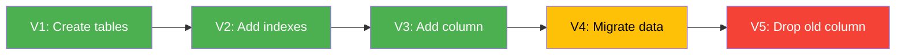
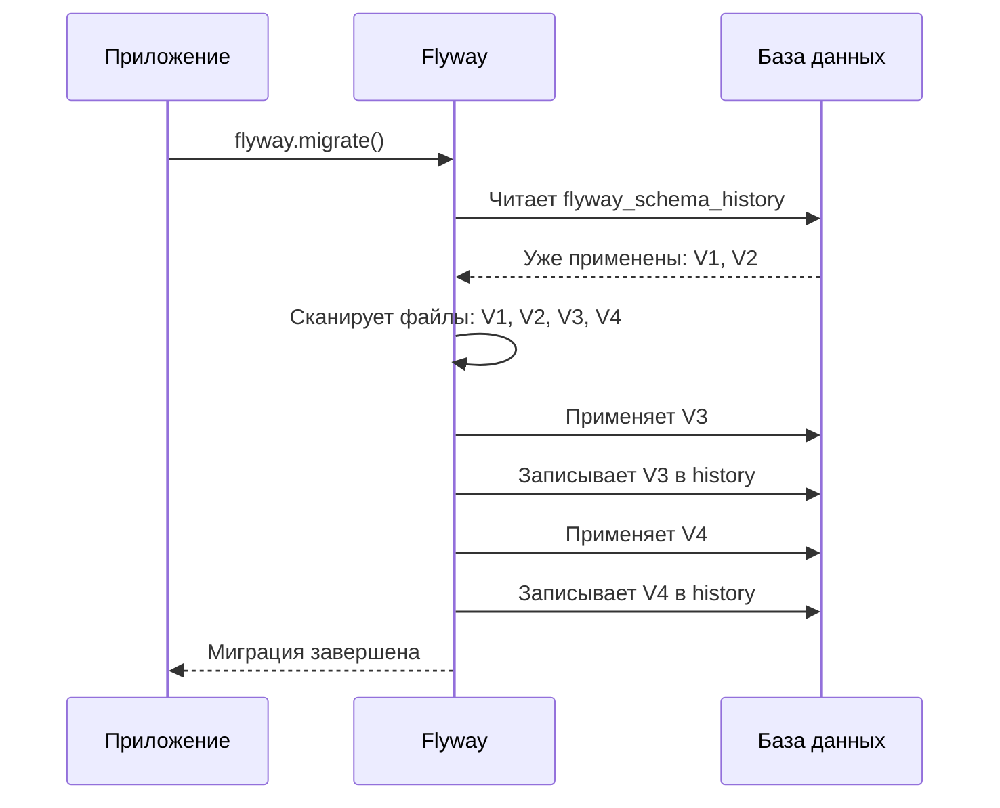
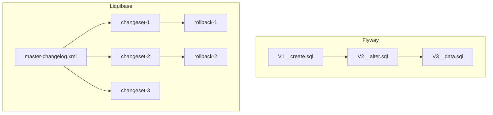
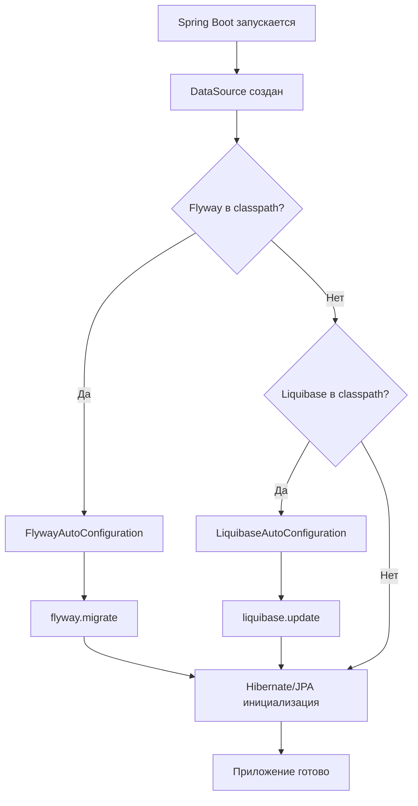
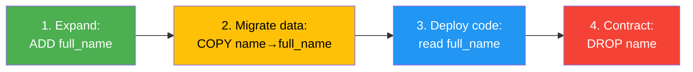

# Вопросы на собеседовании: `Flyway` и `Liquibase`

Полное покрытие инструментов миграции баз данных: `Flyway` (версионные и повторяемые миграции, callbacks, placeholders, baseline, repair, clean) и `Liquibase` (changelog, changeset, rollback, preconditions, contexts, labels, diff). Сравнение подходов, интеграция со `Spring Boot`, стратегии zero-downtime миграций.

Дата последнего обновления: 2026-04-13

Краткое введение: **Миграции баз данных** — это контролируемые, версионируемые изменения схемы и данных БД. Два самых популярных инструмента в Java-экосистеме — `Flyway` и `Liquibase`. На собеседованиях проверяют понимание принципов миграций, умение выбрать подходящий инструмент и знание стратегий безопасного развёртывания. Тема тесно связана с [SQL](sql-interview.md), [архитектурой БД](database-architecture-interview.md) и [Spring Boot](../frameworks/spring/spring-boot-interview.md).

## Полезные ссылки

### Официальная документация

- [Flyway Documentation](https://documentation.red-gate.com/flyway/) — документация Flyway (Redgate)
- [Liquibase Documentation](https://docs.liquibase.com/) — документация Liquibase
- [Spring Boot — Database Initialization](https://docs.spring.io/spring-boot/reference/data/sql.html#howto.data-initialization.migration-tool) — автоконфигурация миграций

### Статьи Baeldung

- [Database Migrations with Flyway](https://www.baeldung.com/database-migrations-with-flyway) — основы Flyway
- [Flyway Callbacks](https://www.baeldung.com/flyway-callbacks) — callbacks в Flyway
- [Flyway Repair with Spring Boot](https://www.baeldung.com/spring-boot-flyway-repair) — команда repair
- [Rolling Back Migrations with Flyway](https://www.baeldung.com/flyway-roll-back) — откат миграций
- [Liquibase to Safely Evolve Your Database Schema](https://www.baeldung.com/liquibase-refactor-schema-of-java-app) — основы Liquibase
- [Introduction to Liquibase Rollback](https://www.baeldung.com/liquibase-rollback) — откат в Liquibase
- [Liquibase vs Flyway](https://www.baeldung.com/liquibase-vs-flyway) — сравнение инструментов

## Содержание

- [Полезные ссылки](#полезные-ссылки)
- [See also](#see-also)

**Зачем нужны миграции БД**
- [Q1. (!) Что такое миграции базы данных и зачем они нужны?](#q1--что-такое-миграции-базы-данных-и-зачем-они-нужны)
- [Q2. Какие проблемы решает инструмент миграций?](#q2-какие-проблемы-решает-инструмент-миграций)

**Flyway — основы**
- [Q3. (!) Что такое Flyway и как он работает?](#q3--что-такое-flyway-и-как-он-работает)
- [Q4. (!) Какие типы миграций поддерживает Flyway?](#q4--какие-типы-миграций-поддерживает-flyway)
- [Q5. (!) Какое соглашение об именовании файлов миграций в Flyway?](#q5--какое-соглашение-об-именовании-файлов-миграций-в-flyway)
- [Q6. Что такое таблица flyway_schema_history?](#q6-что-такое-таблица-flyway_schema_history)
- [Q7. Какие основные команды Flyway существуют?](#q7-какие-основные-команды-flyway-существуют)

**Flyway — продвинутые возможности**
- [Q8. (!) Что такое Flyway Callbacks и для чего они используются?](#q8--что-такое-flyway-callbacks-и-для-чего-они-используются)
- [Q9. Что такое placeholders в Flyway?](#q9-что-такое-placeholders-в-flyway)
- [Q10. Что такое baseline в Flyway?](#q10-что-такое-baseline-в-flyway)
- [Q11. Когда и как используется команда repair?](#q11-когда-и-как-используется-команда-repair)
- [Q12. Что делает команда clean и почему она опасна?](#q12-что-делает-команда-clean-и-почему-она-опасна)

**Liquibase — основы**
- [Q13. (!) Что такое Liquibase и чем он отличается от Flyway?](#q13--что-такое-liquibase-и-чем-он-отличается-от-flyway)
- [Q14. (!) Что такое Changelog и Changeset в Liquibase?](#q14--что-такое-changelog-и-changeset-в-liquibase)
- [Q15. В каких форматах можно описывать миграции в Liquibase?](#q15-в-каких-форматах-можно-описывать-миграции-в-liquibase)
- [Q16. Как Liquibase отслеживает выполненные миграции?](#q16-как-liquibase-отслеживает-выполненные-миграции)

**Liquibase — продвинутые возможности**
- [Q17. (!) Как работает rollback в Liquibase?](#q17--как-работает-rollback-в-liquibase)
- [Q18. Что такое preconditions в Liquibase?](#q18-что-такое-preconditions-в-liquibase)
- [Q19. Что такое contexts и labels в Liquibase?](#q19-что-такое-contexts-и-labels-в-liquibase)
- [Q20. Что делает команда diff в Liquibase?](#q20-что-делает-команда-diff-в-liquibase)

**Сравнение Flyway и Liquibase**
- [Q21. (!) Flyway vs Liquibase: ключевые различия](#q21--flyway-vs-liquibase-ключевые-различия)
- [Q22. Когда выбрать Flyway, а когда Liquibase?](#q22-когда-выбрать-flyway-а-когда-liquibase)

**Spring Boot интеграция**
- [Q23. (!) Как Spring Boot автоконфигурирует Flyway и Liquibase?](#q23--как-spring-boot-автоконфигурирует-flyway-и-liquibase)
- [Q24. Как настроить миграции для нескольких DataSource?](#q24-как-настроить-миграции-для-нескольких-datasource)

**Стратегии и лучшие практики**
- [Q25. (!) Что такое expand-contract pattern для zero-downtime миграций?](#q25--что-такое-expand-contract-pattern-для-zero-downtime-миграций)
- [Q26. Какие правила backward-compatible миграций надо соблюдать?](#q26-какие-правила-backward-compatible-миграций-надо-соблюдать)
- [Q27. Как тестировать миграции?](#q27-как-тестировать-миграции)
- [Q28. Как организовать миграции в multi-tenant приложении?](#q28-как-организовать-миграции-в-multi-tenant-приложении)

**Продвинутые сценарии**
- [Q29. Как Flyway и Liquibase работают в multi-module приложениях?](#q29-как-flyway-и-liquibase-работают-в-multi-module-приложениях)
- [Q30. (!) Как обрабатывать failed migrations и восстанавливаться после сбоя?](#q30--как-обрабатывать-failed-migrations-и-восстанавливаться-после-сбоя)
- [Q31. Что такое Flyway Teams (Enterprise) и его ключевые возможности?](#q31-что-такое-flyway-teams-enterprise-и-его-ключевые-возможности)
- [Q32. Как в Liquibase работает `tagDatabase` и rollback по тегу?](#q32-как-в-liquibase-работает-tagdatabase-и-rollback-по-тегу)

**Лучшие практики**
- [Q33. (!) Лучшие практики именования и структуры миграций](#q33--лучшие-практики-именования-и-структуры-миграций)
- [Q34. Как обеспечить идемпотентность и атомарность миграций?](#q34-как-обеспечить-идемпотентность-и-атомарность-миграций)
- [Q35. Как мигрировать данные (data migration) безопасно?](#q35-как-мигрировать-данные-data-migration-безопасно)

**Kubernetes и продвинутые сценарии**
- [Q36. Как запускать Flyway в Kubernetes — init containers и Job?](#q36-как-запускать-flyway-в-kubernetes--init-containers-и-job)
- [Q37. Что такое Liquibase Hub и Liquibase Pro — чем они расширяют OSS-версию?](#q37-что-такое-liquibase-hub-и-liquibase-pro--чем-они-расширяют-oss-версию)
- [Q38. Как работают Flyway Callbacks — beforeMigrate, afterMigrate и другие хуки?](#q38-как-работают-flyway-callbacks--beforemigrate-aftermigrate-и-другие-хуки)
- [Q39. Expand-contract pattern для zero-downtime миграций — как реализовать?](#q39-expand-contract-pattern-для-zero-downtime-миграций--как-реализовать)
- [Q40. Стратегии rollback в Flyway и Liquibase — undo-скрипты и команда rollback](#q40-стратегии-rollback-в-flyway-и-liquibase--undo-скрипты-и-команда-rollback)
- [Q41. Как использовать Testcontainers для интеграционного тестирования миграций?](#q41-как-использовать-testcontainers-для-интеграционного-тестирования-миграций)
- [Q42. Как безопасно мигрировать большие таблицы — pg_repack, CONCURRENTLY, batching](#q42-как-безопасно-мигрировать-большие-таблицы--pg_repack-concurrently-batching)

---

## Q1. (!) Что такое миграции базы данных и зачем они нужны?

**Миграция базы данных** — это версионируемое, воспроизводимое изменение схемы или данных БД, оформленное в виде скрипта и применяемое автоматически.

Зачем нужны:

- **Версионирование схемы** — схема БД эволюционирует вместе с кодом, каждое изменение отслеживается в VCS
- **Воспроизводимость** — любой разработчик может поднять базу с нуля, последовательно применив все миграции
- **Консистентность окружений** — dev, staging и production гарантированно находятся в одной версии схемы
- **Аудит изменений** — видно кто, когда и какое изменение внёс
- **Автоматизация** — миграции применяются при старте приложения или в CI/CD pipeline, без ручного вмешательства



Без инструмента миграций команды часто прибегают к ручным SQL-скриптам, пересылке дампов или устным договорённостям — всё это приводит к рассинхронизации окружений и сложно отлавливаемым багам.

## Q2. Какие проблемы решает инструмент миграций?

Инструмент миграций (такой как `Flyway` или `Liquibase`) решает следующие проблемы:

| Проблема | Решение |
|----------|---------|
| «На моей машине работает, а на staging — нет» | Единый набор миграций для всех окружений |
| Ручное применение SQL-скриптов на production | Автоматическое последовательное применение |
| Непонятно, какая версия схемы на сервере | Таблица истории миграций в самой БД |
| Конфликты при параллельной разработке | Версионирование и блокировки |
| Невозможно откатить изменение | Rollback-механизмы (особенно в `Liquibase`) |
| Тестирование схемы | Миграции запускаются в тестах через `Testcontainers` |

Оба инструмента — Java-based, поддерживают CLI, Maven/Gradle плагины, программный API и интеграцию со `Spring Boot`.

## Q3. (!) Что такое Flyway и как он работает?

**`Flyway`** — инструмент миграции баз данных, основанный на принципе **версионных SQL-скриптов**. Развивается компанией Redgate.

Принцип работы:

1. При запуске `Flyway` сканирует указанную директорию (по умолчанию `db/migration`) на наличие файлов миграций
2. Проверяет таблицу `flyway_schema_history` — какие миграции уже применены
3. Сортирует непримененные миграции по версии
4. Последовательно применяет каждую миграцию в отдельной транзакции
5. Записывает результат (успех/ошибка, checksum, время) в `flyway_schema_history`



Философия `Flyway` — **простота**: пишешь SQL, который уже знаешь, нет дополнительного DSL для изучения.

## Q4. (!) Какие типы миграций поддерживает Flyway?

`Flyway` поддерживает три типа миграций:

### 1. Versioned migrations (версионные)

Самый распространённый тип. Применяются **ровно один раз**, в порядке возрастания версии. Используются для изменения схемы.

```sql
-- V1__create_users_table.sql
CREATE TABLE users (
    id BIGSERIAL PRIMARY KEY,
    email VARCHAR(255) NOT NULL UNIQUE,
    created_at TIMESTAMP DEFAULT CURRENT_TIMESTAMP
);

-- V2__add_user_roles.sql
ALTER TABLE users ADD COLUMN role VARCHAR(50) DEFAULT 'USER';
CREATE INDEX idx_users_role ON users(role);
```

### 2. Repeatable migrations (повторяемые)

Применяются **каждый раз, когда меняется их checksum**. Не имеют версии. Выполняются после всех версионных миграций. Идеальны для представлений, функций, процедур.

```sql
-- R__create_active_users_view.sql
CREATE OR REPLACE VIEW active_users AS
SELECT id, email, role
FROM users
WHERE deleted_at IS NULL;
```

### 3. Undo migrations (платная версия)

Файлы с префиксом `U`, позволяют откатить конкретную версионную миграцию:

```sql
-- U2__add_user_roles.sql
ALTER TABLE users DROP COLUMN role;
DROP INDEX IF EXISTS idx_users_role;
```

> **Важно**: Undo-миграции доступны только в платной версии `Flyway`. В Community Edition откат делается через создание новой версионной миграции.

## Q5. (!) Какое соглашение об именовании файлов миграций в Flyway?

`Flyway` использует строгое соглашение об именовании:

```
<Prefix><Version>__<Description>.sql
```

| Компонент | Значение | Пример |
|-----------|----------|--------|
| Prefix | `V` — версионная, `R` — повторяемая, `U` — undo | `V` |
| Version | Числовая версия (точки или подчёркивания как разделители) | `1.2`, `1_2`, `202604121530` |
| `__` | Два подчёркивания — обязательный разделитель | `__` |
| Description | Описание миграции (подчёркивания = пробелы) | `create_users_table` |
| Suffix | Расширение файла | `.sql` |

Примеры корректных имён:

```
V1__create_users_table.sql
V1.1__add_email_index.sql
V2__add_orders_table.sql
R__refresh_materialized_views.sql
```

Примеры **некорректных** имён:

```
V1_create_users.sql      ← одно подчёркивание вместо двух
create_users_V1.sql      ← нет префикса в начале
V1__Create Users.sql     ← пробелы в имени файла
```

> **Совет для команд**: используйте timestamp-based версии (`V20260412153000__...`) вместо порядковых номеров — это предотвращает конфликты при параллельной разработке.

## Q6. Что такое таблица flyway_schema_history?

`flyway_schema_history` — служебная таблица, которую `Flyway` создаёт автоматически в целевой БД для отслеживания примененных миграций.

Структура таблицы:

| Колонка | Назначение |
|---------|------------|
| `installed_rank` | Порядок применения |
| `version` | Версия миграции (`NULL` для repeatable) |
| `description` | Описание из имени файла |
| `type` | `SQL`, `JDBC`, `BASELINE` и т.д. |
| `script` | Имя файла миграции |
| `checksum` | CRC32-хеш содержимого файла |
| `installed_by` | Пользователь БД |
| `installed_on` | Время применения |
| `execution_time` | Время выполнения (мс) |
| `success` | Успешность (`true`/`false`) |

`Flyway` использует `checksum` для обнаружения изменений в уже примененных миграциях — если файл миграции был изменён после применения, `validate` вернёт ошибку.

```sql
SELECT version, description, checksum, success
FROM flyway_schema_history
ORDER BY installed_rank;
```

## Q7. Какие основные команды Flyway существуют?

`Flyway` предоставляет 7 основных команд:

| Команда | Назначение |
|---------|------------|
| `migrate` | Применяет все непримененные миграции |
| `clean` | **Удаляет все объекты** из схемы (опасно!) |
| `info` | Показывает состояние всех миграций |
| `validate` | Проверяет, что примененные миграции совпадают с файлами |
| `baseline` | Помечает существующую БД как baseline для начала миграций |
| `repair` | Исправляет таблицу history (удаляет неудачные, обновляет checksum) |
| `undo` | Откатывает последнюю миграцию (платная версия) |

Использование через Gradle:

```groovy
plugins {
    id 'org.flywaydb.flyway' version '10.15.0'
}

flyway {
    url = 'jdbc:postgresql://localhost:5432/mydb'
    user = 'postgres'
    password = 'secret'
}
```

```bash
./gradlew flywayMigrate
./gradlew flywayInfo
./gradlew flywayValidate
```

## Q8. (!) Что такое Flyway Callbacks и для чего они используются?

**Callbacks** — это хуки, которые `Flyway` вызывает на определённых этапах жизненного цикла миграции. Позволяют выполнять дополнительную логику до/после миграций.

Основные callback-события:

| Callback | Когда вызывается |
|----------|-----------------|
| `beforeMigrate` | Перед началом миграции |
| `afterMigrate` | После успешной миграции |
| `afterMigrateError` | После ошибки миграции |
| `beforeEachMigrate` | Перед каждым отдельным файлом |
| `afterEachMigrate` | После каждого файла |
| `beforeValidate` | Перед валидацией |
| `beforeClean` / `afterClean` | До/после clean |

### SQL Callback

Создаёте файл с именем callback-события в директории миграций:

```sql
-- beforeMigrate.sql
-- Проверка, что расширение uuid-ossp установлено
CREATE EXTENSION IF NOT EXISTS "uuid-ossp";
```

### Java Callback

```java
@Component
public class FlywayCallbackLogger implements Callback {

    @Override
    public boolean supports(Event event, Context context) {
        return event == Event.AFTER_MIGRATE;
    }

    @Override
    public boolean canHandleInTransaction(Event event, Context context) {
        return true;
    }

    @Override
    public void handle(Event event, Context context) {
        log.info("Миграция завершена. Версия схемы: {}",
            context.getMigrationInfo().getVersion());
    }
}
```

Типичные use-cases: логирование, проверка prerequisites, загрузка справочных данных, установка прав доступа после миграции.

## Q9. Что такое placeholders в Flyway?

**Placeholders** — это переменные, которые `Flyway` подставляет в SQL-скрипты миграций на этапе выполнения. По умолчанию используется синтаксис `${name}`.

```sql
-- V3__create_schema.sql
CREATE SCHEMA IF NOT EXISTS ${schema_name};
CREATE TABLE ${schema_name}.config (
    key VARCHAR(100) PRIMARY KEY,
    value TEXT
);
INSERT INTO ${schema_name}.config (key, value)
VALUES ('env', '${environment}');
```

Конфигурация в `application.yml`:

```yaml
spring:
  flyway:
    placeholders:
      schema_name: "app"
      environment: "production"
```

Или в `flyway.conf`:

```properties
flyway.placeholders.schema_name=app
flyway.placeholders.environment=production
```

Встроенные placeholders:

| Placeholder | Значение |
|-------------|----------|
| `${flyway:defaultSchema}` | Схема по умолчанию |
| `${flyway:user}` | Пользователь БД |
| `${flyway:database}` | Имя базы данных |
| `${flyway:timestamp}` | Текущее время |

> **Важно**: изменение значения placeholder вызовет перевыполнение повторяемых (`R__`) миграций, так как изменится итоговый checksum.

## Q10. Что такое baseline в Flyway?

**Baseline** используется для внедрения `Flyway` в проект с **уже существующей базой данных**, которая ранее управлялась без инструмента миграций.

Проблема: у вас есть production-база с десятками таблиц, но без `flyway_schema_history`. Нельзя просто запустить `migrate` — `Flyway` попробует создать все таблицы заново.

Решение:

```bash
# Пометить текущее состояние БД как версию 1
flyway -baselineVersion=1 baseline
```

После этого `Flyway`:
1. Создаёт таблицу `flyway_schema_history`
2. Добавляет запись с типом `BASELINE` и указанной версией
3. Все миграции до `baselineVersion` включительно будут **пропущены**
4. Новые миграции (V2, V3...) будут применяться как обычно

```yaml
# application.yml — автоматический baseline при первом запуске
spring:
  flyway:
    baseline-on-migrate: true
    baseline-version: 1
```

## Q11. Когда и как используется команда repair?

Команда `repair` исправляет таблицу `flyway_schema_history` в двух ситуациях:

### 1. Неудачная миграция (failed migration)

Если миграция упала на БД без транзакционного DDL (например, `MySQL`, `Oracle`), в `flyway_schema_history` остаётся запись с `success=false`. Новый `migrate` не пройдёт, пока эта запись не будет удалена.

```bash
# Удалить записи о неудачных миграциях
flyway repair
# Исправить SQL и повторить
flyway migrate
```

### 2. Изменённый checksum

Если файл миграции был отредактирован после применения (например, исправили опечатку в комментарии), `validate` упадёт из-за несовпадения checksum. `repair` обновит checksum в history-таблице.

В `Spring Boot`:

```yaml
spring:
  flyway:
    repair-on-migrate: true  # Автоматический repair перед migrate
```

> **Важно**: `repair` не откатывает SQL, который уже выполнился. Если часть DDL-команд из неудачной миграции успела примениться (на БД без транзакционного DDL), нужно вручную привести БД в консистентное состояние.

## Q12. Что делает команда clean и почему она опасна?

Команда `clean` **полностью удаляет все объекты** из схемы: таблицы, представления, процедуры, функции, триггеры, типы — включая саму `flyway_schema_history`.

```bash
flyway clean    # ⚠️ УДАЛИТ ВСЕ ДАННЫЕ
flyway migrate  # Пересоздаст всё с нуля
```

Когда полезна:
- В **dev/test** — для быстрого сброса БД к чистому состоянию
- В CI — для проверки, что миграции корректно создают схему с нуля

Почему опасна:
- На **production** вызовет полную потерю данных
- `Flyway` по умолчанию **разрешает** `clean` на любой БД

Защита от случайного запуска:

```yaml
spring:
  flyway:
    clean-disabled: true  # Запретить clean (рекомендация для production)
```

Начиная с `Flyway 9+`, `cleanDisabled=true` — **значение по умолчанию**, что значительно снижает риск случайного удаления данных.

## Q13. (!) Что такое Liquibase и чем он отличается от Flyway?

**`Liquibase`** — инструмент миграции баз данных, основанный на концепции **абстрактного описания изменений** (change types). В отличие от `Flyway`, который работает напрямую с SQL, `Liquibase` предлагает DSL для описания изменений в формате XML, YAML, JSON или SQL.

Ключевые отличия от `Flyway`:

| Аспект | `Flyway` | `Liquibase` |
|--------|----------|-------------|
| Формат миграций | SQL (+ Java) | XML, YAML, JSON, SQL |
| Единица изменения | Файл миграции | Changeset внутри Changelog |
| Rollback | Платная версия (Undo) | Встроенный (Community) |
| Preconditions | Нет | Да |
| Contexts/Labels | Нет | Да |
| Database diff | Нет | Да |
| Кривая обучения | Низкая | Средняя |
| Философия | SQL-first, простота | Абстракция, гибкость |



## Q14. (!) Что такое Changelog и Changeset в Liquibase?

### Changelog

**Changelog** — основной файл (или набор файлов), содержащий упорядоченный список изменений базы данных. Это «реестр» всех миграций.

```xml
<!-- db/changelog/db.changelog-master.xml -->
<databaseChangeLog
    xmlns="http://www.liquibase.org/xml/ns/dbchangelog"
    xmlns:xsi="http://www.w3.org/2001/XMLSchema-instance"
    xsi:schemaLocation="http://www.liquibase.org/xml/ns/dbchangelog
        http://www.liquibase.org/xml/ns/dbchangelog/dbchangelog-latest.xsd">

    <include file="db/changelog/changes/001-create-users.xml"/>
    <include file="db/changelog/changes/002-add-orders.xml"/>
    <includeAll path="db/changelog/changes/"/>
</databaseChangeLog>
```

### Changeset

**Changeset** — атомарная единица изменения. Идентифицируется уникальной комбинацией `id` + `author` + путь к файлу.

```xml
<changeSet id="001" author="sergey">
    <createTable tableName="users">
        <column name="id" type="BIGINT" autoIncrement="true">
            <constraints primaryKey="true"/>
        </column>
        <column name="email" type="VARCHAR(255)">
            <constraints nullable="false" unique="true"/>
        </column>
        <column name="created_at" type="TIMESTAMP" defaultValueComputed="CURRENT_TIMESTAMP"/>
    </createTable>
    <rollback>
        <dropTable tableName="users"/>
    </rollback>
</changeSet>
```

Каждый changeset может содержать:
- Одно или несколько **изменений** (change types: `createTable`, `addColumn`, `createIndex`...)
- Блок **rollback** для отката
- **Preconditions** для условного выполнения
- Атрибуты `context`, `labels`, `runAlways`, `runOnChange`

## Q15. В каких форматах можно описывать миграции в Liquibase?

`Liquibase` поддерживает 4 формата описания миграций:

### XML (самый популярный)

```xml
<changeSet id="001" author="sergey">
    <addColumn tableName="users">
        <column name="phone" type="VARCHAR(20)"/>
    </addColumn>
</changeSet>
```

### YAML

```yaml
databaseChangeLog:
  - changeSet:
      id: 001
      author: sergey
      changes:
        - addColumn:
            tableName: users
            columns:
              - column:
                  name: phone
                  type: VARCHAR(20)
```

### JSON

```json
{
  "databaseChangeLog": [{
    "changeSet": {
      "id": "001",
      "author": "sergey",
      "changes": [{
        "addColumn": {
          "tableName": "users",
          "columns": [{"column": {"name": "phone", "type": "VARCHAR(20)"}}]
        }
      }]
    }
  }]
}
```

### SQL (formatted SQL changelog)

```sql
--liquibase formatted sql

--changeset sergey:001
ALTER TABLE users ADD COLUMN phone VARCHAR(20);

--rollback ALTER TABLE users DROP COLUMN phone;
```

> **На практике**: XML остаётся самым распространённым форматом благодаря строгой валидации через XSD-схему и лучшей поддержке IDE. YAML набирает популярность благодаря лаконичности. SQL-формат выбирают команды, предпочитающие `Flyway`-подобный подход, но с фичами `Liquibase`.

## Q16. Как Liquibase отслеживает выполненные миграции?

`Liquibase` создаёт две служебные таблицы:

### DATABASECHANGELOG

Хранит историю примененных changeset-ов:

| Колонка | Назначение |
|---------|------------|
| `ID` | ID changeset |
| `AUTHOR` | Автор |
| `FILENAME` | Путь к changelog-файлу |
| `DATEEXECUTED` | Время выполнения |
| `ORDEREXECUTED` | Порядок выполнения |
| `EXECTYPE` | `EXECUTED`, `FAILED`, `SKIPPED`, `RERAN`, `MARK_RAN` |
| `MD5SUM` | MD5-хеш changeset |
| `DESCRIPTION` | Описание (автоматическое) |
| `TAG` | Тег для rollback по тегу |

### DATABASECHANGELOGLOCK

Таблица блокировок — предотвращает одновременный запуск `Liquibase` с нескольких инстансов:

| Колонка | Назначение |
|---------|------------|
| `ID` | Всегда `1` |
| `LOCKED` | `true`/`false` |
| `LOCKGRANTED` | Когда захвачена |
| `LOCKEDBY` | Кто захватил (hostname + IP) |

> **Проблема на практике**: если приложение упало во время миграции, блокировка может остаться. Нужен ручной `UPDATE DATABASECHANGELOGLOCK SET LOCKED = false` или команда `liquibase releaseLocks`.

## Q17. (!) Как работает rollback в Liquibase?

`Liquibase` предоставляет полноценный rollback-механизм **в Community Edition** — это одно из ключевых преимуществ перед `Flyway`.

### Авто-rollback

Для многих change types `Liquibase` автоматически генерирует rollback-команды:

| Change Type | Автоматический Rollback |
|-------------|------------------------|
| `createTable` | `dropTable` |
| `addColumn` | `dropColumn` |
| `createIndex` | `dropIndex` |
| `addForeignKeyConstraint` | `dropForeignKeyConstraint` |
| `insert` (с `where`) | `delete` |

### Ручной rollback

Для сложных изменений rollback задаётся явно:

```xml
<changeSet id="003" author="sergey">
    <sql>
        UPDATE users SET status = 'ACTIVE' WHERE status IS NULL;
        ALTER TABLE users ALTER COLUMN status SET NOT NULL;
    </sql>
    <rollback>
        ALTER TABLE users ALTER COLUMN status DROP NOT NULL;
    </rollback>
</changeSet>
```

### Команды отката

```bash
# Откатить последние N changeset-ов
liquibase rollbackCount 3

# Откатить до указанного тега
liquibase rollback release-1.0

# Откатить до указанной даты
liquibase rollbackToDate 2026-04-01

# Сгенерировать SQL отката (без выполнения) — для ревью
liquibase rollbackCountSQL 3
```

### Тегирование

```bash
liquibase tag release-1.0
```

```xml
<changeSet id="tag-release" author="sergey">
    <tagDatabase tag="release-1.0"/>
</changeSet>
```

## Q18. Что такое preconditions в Liquibase?

**Preconditions** — условия, проверяемые перед выполнением changeset. Позволяют адаптировать миграции к текущему состоянию БД.

```xml
<changeSet id="005" author="sergey">
    <preConditions onFail="MARK_RAN">
        <not>
            <tableExists tableName="audit_log"/>
        </not>
    </preConditions>
    <createTable tableName="audit_log">
        <column name="id" type="BIGINT" autoIncrement="true">
            <constraints primaryKey="true"/>
        </column>
        <column name="action" type="VARCHAR(50)"/>
        <column name="timestamp" type="TIMESTAMP"/>
    </createTable>
</changeSet>
```

Поведение при невыполненном условии (`onFail`):

| Значение | Поведение |
|----------|-----------|
| `HALT` | Остановить выполнение (по умолчанию) |
| `CONTINUE` | Пропустить changeset, не записывать в историю |
| `MARK_RAN` | Пропустить changeset, записать как выполненный |
| `WARN` | Вывести предупреждение, выполнить changeset |

Доступные проверки: `tableExists`, `columnExists`, `indexExists`, `viewExists`, `foreignKeyConstraintExists`, `dbms`, `runningAs`, `sqlCheck`, `changeSetExecuted` и другие.

```xml
<!-- Применять только на PostgreSQL -->
<preConditions>
    <dbms type="postgresql"/>
</preConditions>

<!-- Проверить значение в БД -->
<preConditions>
    <sqlCheck expectedResult="0">
        SELECT COUNT(*) FROM users WHERE role = 'ADMIN'
    </sqlCheck>
</preConditions>
```

## Q19. Что такое contexts и labels в Liquibase?

### Contexts

**Contexts** — механизм управления тем, какие changeset-ы выполняются в конкретном окружении.

```xml
<!-- Выполнится только в test-окружении -->
<changeSet id="010" author="sergey" context="test">
    <insert tableName="users">
        <column name="email" value="test@example.com"/>
        <column name="role" value="ADMIN"/>
    </insert>
</changeSet>

<!-- Выполнится в dev и staging -->
<changeSet id="011" author="sergey" context="dev or staging">
    <sql>INSERT INTO config (key, value) VALUES ('debug', 'true');</sql>
</changeSet>
```

Запуск с указанием контекста:

```bash
liquibase --contexts="production" update
```

```yaml
# application.yml
spring:
  liquibase:
    contexts: production
```

### Labels

**Labels** — альтернативный механизм фильтрации. В отличие от contexts, labels задаются **на changeset**, а фильтр — **при запуске**.

```xml
<changeSet id="012" author="sergey" labels="feature-123, sprint-42">
    <addColumn tableName="users">
        <column name="avatar_url" type="VARCHAR(500)"/>
    </addColumn>
</changeSet>
```

```bash
# Применить только changeset-ы с label feature-123
liquibase --labelFilter="feature-123" update
```

| Аспект | Contexts | Labels |
|--------|----------|--------|
| Задаётся на | Changeset | Changeset |
| Фильтруется при | Запуске (`--contexts`) | Запуске (`--labelFilter`) |
| Логические выражения | На changeset (`dev or staging`) | В фильтре при запуске |
| Типичное применение | Окружения (dev, prod) | Фичи, спринты, релизы |

## Q20. Что делает команда diff в Liquibase?

Команда `diff` сравнивает **две базы данных** (или БД с офлайн-снимком) и генерирует отчёт о различиях.

```bash
# Сравнить reference-БД с target-БД
liquibase diff \
    --referenceUrl=jdbc:postgresql://localhost/reference_db \
    --referenceUsername=postgres \
    --referencePassword=secret \
    --url=jdbc:postgresql://localhost/target_db \
    --username=postgres \
    --password=secret
```

Результат показывает:
- Отсутствующие/лишние таблицы, колонки, индексы, FK, представления, процедуры
- Различия в типах данных, constraints, default values

### diffChangeLog

Генерирует changelog для приведения target-БД к состоянию reference-БД:

```bash
liquibase diffChangeLog \
    --referenceUrl=jdbc:postgresql://localhost/reference_db \
    --changeLogFile=diff-changelog.xml
```

> **Важно**: `diff` полезен для обнаружения «дрифта» (ручных изменений на production), но **не рекомендуется** для генерации production-миграций — автоматически сгенерированные changesets часто требуют ручной доработки (порядок, данные, rollback).

## Q21. (!) Flyway vs Liquibase: ключевые различия

| Критерий | `Flyway` | `Liquibase` |
|----------|----------|-------------|
| **Формат миграций** | SQL + Java | XML, YAML, JSON, SQL |
| **Философия** | «Пиши SQL, который знаешь» | «Описывай изменения абстрактно» |
| **Rollback (бесплатно)** | Нет (только новая миграция) | Да (auto + manual) |
| **Preconditions** | Нет | Да |
| **Contexts/Environments** | Через profiles/placeholders | Встроенные contexts + labels |
| **Database diff** | Нет | Да |
| **Database-agnostic** | Нет (SQL привязан к СУБД) | Да (XML change types) |
| **Кривая обучения** | Очень низкая | Средняя |
| **Spring Boot** | Автоконфигурация из коробки | Автоконфигурация из коробки |
| **Порядок миграций** | По версии файла | По порядку в changelog |
| **Checksum** | CRC32 по содержимому файла | MD5 по changeset |
| **Community** | Очень большое (Redgate) | Большое |
| **Лицензия** | Apache 2.0 (Community) | FSL (Community) |

> **Что спрашивают на собеседовании**: интервьюеры ожидают, что вы знаете оба инструмента, понимаете trade-offs и можете обосновать выбор для конкретного проекта. «Мы используем Flyway, потому что он проще» — слабый ответ. «Мы выбрали Flyway, потому что команда пишет database-specific SQL, rollback нам не нужен (мы используем expand-contract), а низкий порог входа важен для онбординга» — сильный ответ.

## Q22. Когда выбрать Flyway, а когда Liquibase?

### Выбирайте Flyway, если:

- Команда пишет **database-specific SQL** и не планирует менять СУБД
- Важна **простота** и минимальный порог входа
- Rollback реализуется через **forward-only миграции** (новая миграция вместо отката)
- Проект **небольшой-средний** с одной БД
- Используете expand-contract pattern для zero-downtime (см. [стратегии деплоя](../cicd/deployment-strategies-interview.md))

### Выбирайте Liquibase, если:

- Нужна **поддержка нескольких СУБД** одними миграциями (XML change types)
- Требуется встроенный **rollback** без платной лицензии
- Нужны **preconditions** для условного применения миграций
- Сложная **среда с множеством окружений** (contexts + labels)
- Проект **enterprise-уровня** с жёсткими требованиями к аудиту
- Нужен **database diff** для обнаружения дрифта

### На практике

В Java-экосистеме `Flyway` используется **чаще** — его простота и SQL-first подход хорошо сочетаются с типичным проектом на `Spring Boot` + `PostgreSQL`. `Liquibase` выбирают в enterprise-проектах с мультиплатформенными требованиями.

## Q23. (!) Как Spring Boot автоконфигурирует Flyway и Liquibase?

`Spring Boot` автоматически настраивает миграции при наличии соответствующей зависимости в classpath.

### Flyway

```groovy
// build.gradle
dependencies {
    implementation 'org.flywaydb:flyway-core'
    // Для PostgreSQL дополнительно:
    implementation 'org.flywaydb:flyway-database-postgresql'
}
```

По умолчанию:
- Миграции ищутся в `classpath:db/migration`
- Используется основной `DataSource`
- Миграции запускаются **до** инициализации `Hibernate`/JPA

```yaml
# application.yml
spring:
  flyway:
    enabled: true                    # default: true
    locations: classpath:db/migration
    baseline-on-migrate: false
    clean-disabled: true             # default с Flyway 9+
    out-of-order: false
    validate-on-migrate: true
```

### Liquibase

```groovy
dependencies {
    implementation 'org.liquibase:liquibase-core'
}
```

```yaml
spring:
  liquibase:
    enabled: true
    change-log: classpath:db/changelog/db.changelog-master.xml
    contexts: ${spring.profiles.active}
    default-schema: public
```

### Порядок инициализации



> **Важно**: `spring.jpa.hibernate.ddl-auto` должен быть `none` или `validate` при использовании инструмента миграций. Значение `update` или `create` будет конфликтовать с миграциями.

### Кастомизация через Java

```java
@Configuration
public class FlywayConfig {

    @Bean
    public FlywayMigrationStrategy flywayMigrationStrategy() {
        return flyway -> {
            // Кастомная логика перед миграцией
            flyway.repair();
            flyway.migrate();
        };
    }
}
```

## Q24. Как настроить миграции для нескольких DataSource?

При наличии нескольких баз данных автоконфигурация `Spring Boot` не справляется — нужна ручная настройка.

### Flyway с несколькими DataSource

```java
@Configuration
public class MultiDatabaseFlywayConfig {

    @Bean
    public Flyway primaryFlyway(@Qualifier("primaryDataSource") DataSource ds) {
        return Flyway.configure()
            .dataSource(ds)
            .locations("classpath:db/migration/primary")
            .table("flyway_schema_history")
            .load();
    }

    @Bean
    public Flyway secondaryFlyway(@Qualifier("secondaryDataSource") DataSource ds) {
        return Flyway.configure()
            .dataSource(ds)
            .locations("classpath:db/migration/secondary")
            .table("flyway_schema_history")
            .load();
    }

    @Bean
    public FlywayMigrationInitializer primaryFlywayInitializer(
            @Qualifier("primaryFlyway") Flyway flyway) {
        return new FlywayMigrationInitializer(flyway);
    }

    @Bean
    public FlywayMigrationInitializer secondaryFlywayInitializer(
            @Qualifier("secondaryFlyway") Flyway flyway) {
        return new FlywayMigrationInitializer(flyway);
    }
}
```

Структура директорий:

```
src/main/resources/
  db/migration/
    primary/
      V1__create_users.sql
      V2__create_orders.sql
    secondary/
      V1__create_analytics.sql
      V2__create_reports.sql
```

### Liquibase с несколькими DataSource

```java
@Bean
public SpringLiquibase primaryLiquibase(
        @Qualifier("primaryDataSource") DataSource ds) {
    SpringLiquibase liquibase = new SpringLiquibase();
    liquibase.setDataSource(ds);
    liquibase.setChangeLog("classpath:db/changelog/primary/master.xml");
    return liquibase;
}
```

## Q25. (!) Что такое expand-contract pattern для zero-downtime миграций?

**Expand-contract** (расширение-сжатие) — паттерн безопасного изменения схемы БД без остановки приложения. Каждое деструктивное изменение разбивается на несколько обратно-совместимых шагов.

### Пример: переименование колонки `name` → `full_name`

**Нельзя** делать одной миграцией:

```sql
-- ❌ Сломает работающее приложение
ALTER TABLE users RENAME COLUMN name TO full_name;
```

**Правильно** — в 4 шага:



```sql
-- Шаг 1 (Expand): добавляем новую колонку — V5
ALTER TABLE users ADD COLUMN full_name VARCHAR(255);

-- Шаг 2 (Migrate): копируем данные — V6
UPDATE users SET full_name = name WHERE full_name IS NULL;

-- >>> Деплой новой версии приложения, которая пишет в оба поля <<<

-- Шаг 3 (Contract): убираем старую колонку — V7 (через несколько дней)
ALTER TABLE users DROP COLUMN name;
```

### Принципы zero-downtime миграций

1. **Никогда** не удаляйте и не переименовывайте колонки в одном релизе с изменением кода
2. **Всегда** добавляйте новые колонки как `NULLABLE` или с `DEFAULT`
3. **Разделяйте** миграцию схемы и деплой кода во времени
4. **Тестируйте** обратную совместимость: старый код должен работать с новой схемой

Подробнее о стратегиях деплоя — в [вопросах по стратегиям деплоя](../cicd/deployment-strategies-interview.md).

## Q26. Какие правила backward-compatible миграций надо соблюдать?

Backward-compatible (обратно-совместимые) миграции — это миграции, после применения которых **старая версия приложения продолжает работать**.

### Безопасные операции (всегда backward-compatible)

| Операция | Почему безопасна |
|----------|-----------------|
| `ADD COLUMN ... NULL` | Старый код не знает о колонке и не сломается |
| `ADD COLUMN ... DEFAULT` | Аналогично, плюс данные консистентны |
| `CREATE TABLE` | Новая таблица не влияет на старый код |
| `CREATE INDEX CONCURRENTLY` | Не блокирует таблицу (PostgreSQL) |
| `ADD CONSTRAINT ... NOT VALID` | Проверяет только новые строки |

### Опасные операции (требуют expand-contract)

| Операция | Проблема |
|----------|----------|
| `DROP COLUMN` | Старый код упадёт при SELECT * или маппинге |
| `RENAME COLUMN` | Старый код ссылается на старое имя |
| `ALTER COLUMN ... NOT NULL` | Старый код может вставлять NULL |
| `ALTER COLUMN TYPE` | Несовместимость типов |
| `DROP TABLE` | Полная потеря данных |

### Чек-лист перед production-миграцией

1. Миграция идемпотентна? (можно запустить повторно без ошибки)
2. Обратно совместима с текущей версией кода?
3. Не содержит блокирующих DDL-операций на больших таблицах?
4. Есть план отката?
5. Протестирована на копии production-данных?

## Q27. Как тестировать миграции?

### 1. Testcontainers — golden standard

Запускаем реальную БД в Docker-контейнере и прогоняем все миграции:

```java
@Testcontainers
@SpringBootTest
class MigrationIntegrationTest {

    @Container
    static PostgreSQLContainer<?> postgres = new PostgreSQLContainer<>("postgres:16")
        .withDatabaseName("testdb");

    @DynamicPropertySource
    static void configure(DynamicPropertyRegistry registry) {
        registry.add("spring.datasource.url", postgres::getJdbcUrl);
        registry.add("spring.datasource.username", postgres::getUsername);
        registry.add("spring.datasource.password", postgres::getPassword);
    }

    @Test
    void allMigrationsApplySuccessfully() {
        // Spring Boot + Flyway/Liquibase автоматически применит все миграции
        // Тест пройдёт, если все миграции выполнились без ошибок
    }

    @Autowired
    private JdbcTemplate jdbcTemplate;

    @Test
    void migrationCreatesExpectedSchema() {
        Integer count = jdbcTemplate.queryForObject(
            "SELECT COUNT(*) FROM information_schema.tables WHERE table_name = 'users'",
            Integer.class
        );
        assertThat(count).isEqualTo(1);
    }
}
```

### 2. Flyway validate в CI

```bash
# CI pipeline — проверяет, что миграции консистентны
./gradlew flywayValidate
```

### 3. Liquibase validate + dry-run

```bash
# Проверить changelog без выполнения
liquibase validate

# Сгенерировать SQL для ревью
liquibase updateSQL
```

### 4. Тест на обратную совместимость

```java
@Test
void oldCodeWorksWithNewSchema() {
    // Применяем миграцию V(N+1)
    flyway.migrate();
    // Проверяем, что код текущей версии всё ещё работает
    User user = userRepository.findByEmail("test@example.com");
    assertThat(user).isNotNull();
}
```

> **Лучшая практика**: в CI запускайте полный цикл — `clean` → `migrate` → тесты. Это гарантирует, что миграции корректно создают схему с нуля. Дополнительно — тестируйте `migrate` поверх дампа production-схемы для проверки обратной совместимости.

## Q28. Как организовать миграции в multi-tenant приложении?

Multi-tenant архитектура с отдельной схемой (или БД) для каждого арендатора требует особого подхода к миграциям.

### Подход 1: Schema-per-tenant с Flyway

```java
@Component
public class TenantMigrationRunner {

    @Autowired
    private DataSource dataSource;

    @Autowired
    private TenantRegistry tenantRegistry;

    @EventListener(ApplicationReadyEvent.class)
    public void migrateAllTenants() {
        for (String tenantSchema : tenantRegistry.getAllSchemas()) {
            Flyway flyway = Flyway.configure()
                .dataSource(dataSource)
                .schemas(tenantSchema)
                .locations("classpath:db/migration/tenant")
                .load();
            flyway.migrate();
        }
    }
}
```

### Подход 2: Database-per-tenant

```java
public void migrateTenant(String tenantId) {
    DataSource tenantDs = tenantDataSourceProvider.getDataSource(tenantId);
    Flyway.configure()
        .dataSource(tenantDs)
        .locations("classpath:db/migration")
        .load()
        .migrate();
}
```

### Подход 3: Liquibase contexts для общей схемы

```xml
<!-- Общие данные -->
<changeSet id="100" author="sergey">
    <createTable tableName="products">...</createTable>
</changeSet>

<!-- Данные конкретного тенанта -->
<changeSet id="101" author="sergey" context="tenant-acme">
    <insert tableName="config">
        <column name="key" value="theme"/>
        <column name="value" value="acme-blue"/>
    </insert>
</changeSet>
```

### Ключевые проблемы multi-tenant миграций

- **Скорость**: миграция 1000 схем может занимать часы — используйте параллельное выполнение
- **Частичный сбой**: один тенант может упасть — нужен механизм retry и мониторинг
- **Версии**: тенанты могут быть на разных версиях схемы — усложняет код приложения
- **Тестирование**: нужно проверять миграцию и на пустой, и на «живой» базе каждого тенанта

## Q29. Как Flyway и Liquibase работают в multi-module приложениях?

В крупных проектах с несколькими модулями (например, `core`, `billing`, `notifications`) каждый модуль может иметь собственные миграции.

### Flyway: несколько locations

```yaml
spring:
  flyway:
    locations:
      - classpath:db/migration/core
      - classpath:db/migration/billing
      - classpath:db/migration/notifications
```

`Flyway` сортирует все найденные файлы из всех locations по версии и применяет глобально. Важно **не допускать конфликтов версий** между модулями.

**Рекомендуемые подходы к версионированию:**

```
# Диапазоны версий по модулям:
core:          V1__   – V99__
billing:       V100__ – V199__
notifications: V200__ – V299__

# Или timestamp-based:
V20260413100000__core_create_users.sql
V20260413100001__billing_create_invoices.sql
```

### Liquibase: иерархия changelog-файлов

```xml
<!-- db/changelog/master.xml — точка входа -->
<databaseChangeLog>
    <include file="db/changelog/modules/core/master.xml"/>
    <include file="db/changelog/modules/billing/master.xml"/>
    <include file="db/changelog/modules/notifications/master.xml"/>
</databaseChangeLog>
```

```xml
<!-- db/changelog/modules/core/master.xml -->
<databaseChangeLog>
    <include file="db/changelog/modules/core/001-create-users.xml"/>
    <include file="db/changelog/modules/core/002-add-roles.xml"/>
</databaseChangeLog>
```

**Ключевой момент**: в Liquibase порядок определяется порядком `include`, а не сортировкой имён файлов, что даёт более явный контроль. Уникальность changeset гарантируется тройкой `id + author + filename`.

## Q30. (!) Как обрабатывать failed migrations и восстанавливаться после сбоя?

Поведение при ошибке миграции различается в зависимости от СУБД и инструмента.

### Transactional DDL (PostgreSQL, SQL Server)

```
PostgreSQL откатывает всю транзакцию при ошибке:
→ Flyway: запись в flyway_schema_history с success=false НЕ остаётся
→ Можно исправить SQL и запустить migrate заново
```

### Non-transactional DDL (MySQL, Oracle, MariaDB)

```
MySQL не откатывает DDL-операции:
→ Часть SQL может быть применена
→ В flyway_schema_history остаётся запись с success=false
→ migrate откажет: "Found resolved migration not applied to database"
```

**Восстановление при Flyway:**

```bash
# Шаг 1: вручную откатить применённые изменения (если нужно)
# ALTER TABLE ... DROP COLUMN ... — вручную через psql/CLI

# Шаг 2: удалить запись о неудачной миграции
flyway repair

# Шаг 3: исправить SQL-файл и применить
flyway migrate
```

**Восстановление при Liquibase:**

```bash
# Если DATABASECHANGELOGLOCK завис (приложение упало во время миграции):
liquibase releaseLocks
# или вручную:
# UPDATE DATABASECHANGELOGLOCK SET LOCKED=false, LOCKGRANTED=null, LOCKEDBY=null WHERE ID=1;

# Очистить запись о неудачном changeset и повторить:
liquibase clearCheckSums
liquibase update
```

**Профилактика:**
- Всегда тестируйте миграции на staging перед production
- Используйте `IF EXISTS` / `IF NOT EXISTS` для идемпотентных операций
- Для MySQL: оборачивайте DDL в отдельные changeset-ы, чтобы минимизировать область частичного применения
- Настройте alerting на `success=false` в `flyway_schema_history`

## Q31. Что такое Flyway Teams (Enterprise) и его ключевые возможности?

**Flyway Teams** (ранее Flyway Pro/Enterprise) — платная версия Flyway от Redgate, расширяющая Community Edition.

### Ключевые возможности Teams:

| Возможность | Community | Teams |
|-------------|-----------|-------|
| SQL миграции | Да | Да |
| Java миграции | Да | Да |
| Undo migrations (U__) | Нет | **Да** |
| Dry runs | Нет | **Да** |
| Schema model | Нет | **Да** |
| Batching | Нет | **Да** |
| Oracle support | Базовая | Расширенная |
| Cherry-pick миграций | Нет | **Да** |

### Dry runs (пробный запуск)

Генерирует SQL всех pending-миграций **без их выполнения** — для ревью и аудита:

```java
Flyway flyway = Flyway.configure()
    .dataSource(url, user, password)
    .dryRunOutput("/tmp/migration-preview.sql")
    .load();
flyway.migrate();
// Файл содержит все SQL-команды, но ничего не выполнено в БД
```

### Cherry-pick: применить конкретные миграции

```java
Flyway.configure()
    .cherryPick("2.0", "2.1", "2.3")  // пропустить 2.2
    .load()
    .migrate();
```

### Undo migrations

```sql
-- U2__add_user_roles.sql (пара к V2__)
ALTER TABLE users DROP COLUMN role;
DROP INDEX IF EXISTS idx_users_role;
```

```bash
flyway undo  # откатывает последнюю применённую версионную миграцию
```

> **На собеседовании**: если кандидат говорит «Flyway не поддерживает rollback», правильный ответ — «в Community Edition, но не в Teams». На практике большинство проектов используют Community и реализуют откат через forward-only миграции (expand-contract).

## Q32. Как в Liquibase работает `tagDatabase` и rollback по тегу?

**Теги** в Liquibase позволяют зафиксировать точку в истории миграций, чтобы откатиться к ней позже — удобно для релизного процесса.

### Создание тега

**Через changeset** (рекомендуется — тег становится частью истории):

```xml
<!-- Добавляется в конец changelog перед релизом -->
<changeSet id="tag-v2.0.0" author="sergey" runAlways="false">
    <tagDatabase tag="v2.0.0"/>
</changeSet>
```

**Через CLI** (внешняя пометка):

```bash
liquibase tag v2.0.0
# Помечает последний выполненный changeset в DATABASECHANGELOG.TAG
```

### Rollback по тегу

```bash
# Откатить все changeset-ы до тега (не включая тег)
liquibase rollback v2.0.0

# Предварительный просмотр SQL отката без выполнения
liquibase rollbackSQL v2.0.0

# Откатить N последних changeset-ов
liquibase rollbackCount 3

# Откатить до даты
liquibase rollbackToDate 2026-04-01T10:00:00
```

### Типичный релизный workflow

```bash
# 1. Перед деплоем — тег текущего состояния
liquibase tag before-v3.0.0

# 2. Применить миграции
liquibase update

# 3. Если что-то пошло не так — откат к тегу
liquibase rollback before-v3.0.0
```

> **Важно**: rollback работает только для changeset-ов, у которых есть `<rollback>` блок или для которых Liquibase может сгенерировать его автоматически (см. Q17). Для `<sql>` changeset без `<rollback>` откат завершится ошибкой — добавляйте `<rollback>` явно.

## Q33. (!) Лучшие практики именования и структуры миграций

### Именование файлов Flyway

```
# Timestamp-based (рекомендуется для команд)
V20260413_100000__create_users_table.sql
V20260413_100100__add_email_index.sql

# Sequential (риск конфликтов при parallel-разработке)
V001__create_users.sql
V002__add_orders.sql

# Несколько разработчиков одновременно?
# → out-of-order: true в конфиге или timestamp-версии
```

```yaml
spring:
  flyway:
    out-of-order: true  # допустить применение V1.3 после V1.5 (если кто-то опоздал)
```

### Структура директорий

```
src/main/resources/
  db/
    migration/                    # Flyway versioned
      V1__create_schema.sql
      V2__add_indexes.sql
    repeatable/                   # Flyway repeatable (R__)
      R__create_views.sql
    changelog/                    # Liquibase
      db.changelog-master.xml
      changes/
        001-create-users.xml
        002-add-orders.xml
      seed/
        test-data.xml             # только для test-контекста
```

### Принципы хороших миграций

1. **Одна цель** — каждая миграция делает одно логическое изменение
2. **Маленький размер** — меньше риск при откате, легче ревью
3. **Описательное имя** — `V5__add_index_on_users_email.sql`, не `V5__fix.sql`
4. **Без данных приложения в schema-миграциях** — для seed-данных отдельный механизм (Liquibase context=dev или отдельный Flyway location)
5. **Комментарии** — объясняйте «почему», не «что» (SQL и так покажет «что»)
6. **Ревью миграций** — обязательный code review, особенно для production

## Q34. Как обеспечить идемпотентность и атомарность миграций?

**Идемпотентность** — миграция может быть применена несколько раз без побочных эффектов (важно для repair-сценариев и CI).

```sql
-- ✅ Идемпотентные DDL (PostgreSQL)
CREATE TABLE IF NOT EXISTS users (id BIGSERIAL PRIMARY KEY);
ALTER TABLE users ADD COLUMN IF NOT EXISTS phone VARCHAR(20);
CREATE INDEX IF NOT EXISTS idx_users_email ON users(email);
DROP TABLE IF EXISTS temp_migration;

-- ❌ Не идемпотентно
CREATE TABLE users (...);         -- упадёт при повторном запуске
ALTER TABLE users ADD COLUMN ...;  -- упадёт если колонка уже есть
```

```xml
<!-- Liquibase: precondition делает changeset идемпотентным -->
<changeSet id="add-phone" author="sergey">
    <preConditions onFail="MARK_RAN">
        <not><columnExists tableName="users" columnName="phone"/></not>
    </preConditions>
    <addColumn tableName="users">
        <column name="phone" type="VARCHAR(20)"/>
    </addColumn>
</changeSet>
```

**Атомарность** — либо вся миграция применяется, либо ничего:

```sql
-- Группируйте логически связанные DDL в одну транзакцию (PostgreSQL поддерживает)
BEGIN;
ALTER TABLE orders ADD COLUMN status VARCHAR(50);
UPDATE orders SET status = 'PENDING' WHERE status IS NULL;
ALTER TABLE orders ALTER COLUMN status SET NOT NULL;
COMMIT;

-- Для больших таблиц с LOCK: разбейте на несколько миграций
-- V5__add_status_nullable.sql    ← ADD COLUMN, быстро
-- V6__populate_status.sql        ← UPDATE, медленно, без блокировки записей
-- V7__set_status_not_null.sql    ← NOT NULL constraint
```

> **Правило**: в одной миграции — только те операции, которые должны быть атомарными. Если DDL и DML логически независимы — разделяйте их на отдельные версии.

## Q35. Как мигрировать данные (data migration) безопасно?

**Data migration** — изменение данных в БД (заполнение новых колонок, трансформация, очистка). Требует особой осторожности.

### Стратегия: schema отдельно от данных

```sql
-- V10__add_full_name_column.sql (schema migration — быстро, без блокировок)
ALTER TABLE users ADD COLUMN full_name VARCHAR(255);

-- V11__populate_full_name.sql (data migration — может быть долгим)
-- Для больших таблиц: пакетное обновление
DO $$
DECLARE
    batch_size INT := 1000;
    offset_val INT := 0;
    rows_updated INT;
BEGIN
    LOOP
        UPDATE users
        SET full_name = first_name || ' ' || last_name
        WHERE full_name IS NULL
          AND id IN (
              SELECT id FROM users WHERE full_name IS NULL
              ORDER BY id LIMIT batch_size OFFSET offset_val
          );
        GET DIAGNOSTICS rows_updated = ROW_COUNT;
        EXIT WHEN rows_updated = 0;
        PERFORM pg_sleep(0.1); -- небольшая пауза между батчами
    END LOOP;
END $$;
```

### Обеспечение безопасности data-миграций

1. **Батчирование**: не обновляйте миллионы строк в одной транзакции — блокирует таблицу
2. **Идемпотентность**: добавьте `WHERE new_col IS NULL` или аналогичное условие
3. **Тестирование на копии**: прогоните на dump production-данных, измерьте время
4. **Мониторинг**: для долгих миграций — логируйте прогресс
5. **Разделение деплоя**: сначала schema migration + деплой кода, затем data migration

```java
// Java migration в Flyway — для сложной логики (batch с Hibernate/JDBC)
public class V12__MigrateUserData extends BaseJavaMigration {
    @Override
    public void migrate(Context context) throws Exception {
        try (var stmt = context.getConnection().prepareStatement(
                "UPDATE users SET full_name = first_name || ' ' || last_name " +
                "WHERE full_name IS NULL")) {
            stmt.executeLargeUpdate();
        }
    }
}
```

> **Антипаттерн**: data migration, зависящая от бизнес-логики приложения (вызов service-методов из миграции). Миграции должны быть самодостаточными SQL/JDBC-операциями, не зависящими от состояния Spring Context.

---

## Q36. Как запускать Flyway в Kubernetes — init containers и Job?

В Kubernetes миграции базы данных запускают **до** старта основного приложения. Два основных подхода:

### Init Container

```yaml
apiVersion: apps/v1
kind: Deployment
spec:
  template:
    spec:
      initContainers:
        - name: flyway-migrate
          image: flyway/flyway:10-alpine
          args:
            - -url=jdbc:postgresql://postgres:5432/mydb
            - -schemas=public
            - -user=$(DB_USER)
            - -password=$(DB_PASSWORD)
            - migrate
          envFrom:
            - secretRef:
                name: db-credentials
          volumeMounts:
            - name: migrations
              mountPath: /flyway/sql
      containers:
        - name: app
          image: myapp:1.0.0
      volumes:
        - name: migrations
          configMap:
            name: flyway-migrations
```

**Плюсы init container:** простота, миграции всегда запускаются перед приложением.
**Минусы:** при горизонтальном масштабировании (replicas > 1) init container запускается в каждом Pod параллельно → race condition. Flyway защищает от этого advisory lock'ом на БД, но нагрузка на БД возрастает.

### Kubernetes Job (рекомендуется для production)

```yaml
apiVersion: batch/v1
kind: Job
metadata:
  name: flyway-migrate-v1-2-0
spec:
  backoffLimit: 3
  template:
    spec:
      restartPolicy: OnFailure
      containers:
        - name: flyway
          image: flyway/flyway:10-alpine
          args: ["-url=jdbc:postgresql://postgres:5432/mydb", "migrate"]
          envFrom:
            - secretRef:
                name: db-credentials
```

Job запускается один раз, мигрирует базу, и деплой приложения начинается только после его успешного завершения (например, через ArgoCD Sync Waves или Helm hooks `pre-upgrade`).

**Helm hook для миграций:**
```yaml
metadata:
  annotations:
    "helm.sh/hook": pre-upgrade,pre-install
    "helm.sh/hook-weight": "-5"
    "helm.sh/hook-delete-policy": before-hook-creation
```

---

## Q37. Что такое Liquibase Hub и Liquibase Pro — чем они расширяют OSS-версию?

### Liquibase Hub (теперь Liquibase Business/Pro Cloud)

**Liquibase Hub** (устаревшее название) / **Liquibase Pro** — коммерческие расширения open-source ядра Liquibase.

**Ключевые возможности Liquibase Pro:**

| Функция | OSS | Pro |
|---------|-----|-----|
| Rollback через `rollbackSQL` | Ручной | Автоматический `auto-rollback` |
| Stored procedures, triggers | Частично | Полная поддержка |
| `diff` и `generateChangeLog` | Базовый | Расширенный, с фильтрами |
| Drift detection | Нет | Есть (`status --verbose`) |
| Flow files | Нет | Есть — скриптование в YAML |
| Checks Framework | Нет | Политики качества SQL |
| MongoDB, Oracle + | Базовый | Расширенный |
| Поддержка | Community | Enterprise SLA |

**Liquibase Checks Framework (Pro)** — декларативные политики для SQL:
```yaml
# liquibase.checks-settings.conf
checks:
  - shortName: TableCommentCheck
    enabled: true
    severity: MAJOR
```

**Flow Files** — оркестрация нескольких команд в одном YAML-файле:
```yaml
stages:
  Default:
    actions:
      - type: liquibase
        command: status
      - type: liquibase
        command: update
      - type: liquibase
        command: tag
        cmdArgs: { tag: "release-1.2" }
```

Для большинства команд достаточно **OSS Liquibase**; Pro актуален при работе с enterprise СУБД (Oracle, DB2), нуждой в автоматическом rollback и соответствии корпоративным политикам.

---

## Q38. Как работают Flyway Callbacks — beforeMigrate, afterMigrate и другие хуки?

**Flyway Callbacks** позволяют выполнять SQL или Java-код на определённых этапах жизненного цикла миграции. Это cross-cutting concerns: аудит, управление соединением, seed-данные.

### Именование callback-файлов

```
beforeMigrate.sql          — перед запуском migrate
afterMigrate.sql           — после успешного migrate
afterMigrateError.sql      — если migrate завершился с ошибкой
beforeEachMigrate.sql      — перед каждым отдельным скриптом
afterEachMigrate.sql       — после каждого отдельного скрипта
afterEachMigrateError.sql  — если отдельный скрипт упал
beforeValidate.sql         — перед validate
afterValidate.sql          — после validate
beforeClean.sql            — перед clean (опасная команда!)
afterRepair.sql            — после repair
```

### Пример: beforeMigrate — отключить триггеры

```sql
-- beforeMigrate.sql
SET session_replication_role = 'replica'; -- отключает FK-триггеры в PostgreSQL
```

```sql
-- afterMigrate.sql
SET session_replication_role = 'origin'; -- восстанавливаем
INSERT INTO migration_audit(run_at, status) VALUES (NOW(), 'SUCCESS');
```

### Java Callback

```java
public class AuditCallback implements Callback {
    @Override
    public boolean supports(Event event, Context context) {
        return event == Event.AFTER_MIGRATE;
    }

    @Override
    public void handle(Event event, Context context) {
        // логирование, метрики, уведомления
        log.info("Migration completed at {}", Instant.now());
    }
}

// Регистрация в конфигурации Spring Boot:
@Bean
public FlywayConfigurationCustomizer flywayCustomizer() {
    return config -> config.callbacks(new AuditCallback());
}
```

**Важно:** callbacks не версионируются (не попадают в `flyway_schema_history`) и выполняются каждый раз при вызове соответствующей команды.

---

## Q39. Expand-contract pattern для zero-downtime миграций — как реализовать?

**Expand-contract** (также называемый **parallel change**) — паттерн безопасного изменения схемы БД без остановки приложения при rolling deployment.

### Три фазы:

```
Expand (Расширение) → Migrate (Перенос данных) → Contract (Сжатие)
```

**Пример: переименование колонки `user_name` → `username`**

**Фаза 1 — Expand** (деплой v1.1):
```sql
-- V3__expand_add_username.sql
ALTER TABLE users ADD COLUMN username VARCHAR(100);
-- Приложение v1.1 пишет в ОБЕ колонки: user_name и username
```

**Фаза 2 — Migrate** (деплой v1.2):
```sql
-- V4__migrate_username_data.sql
UPDATE users SET username = user_name WHERE username IS NULL;
ALTER TABLE users ALTER COLUMN username SET NOT NULL;
-- Приложение v1.2 читает из username, пишет в обе
```

**Фаза 3 — Contract** (деплой v1.3):
```sql
-- V5__contract_drop_user_name.sql
ALTER TABLE users DROP COLUMN user_name;
-- Приложение v1.3 работает только с username
```

### Когда применять expand-contract:
- Переименование/удаление колонок и таблиц
- Изменение типа данных (VARCHAR → TEXT)
- Добавление NOT NULL constraint на существующую колонку
- Разбиение/слияние таблиц

### Правило: **никогда не удаляй и не переименовывай в том же деплое**, что добавляешь новое.

---

## Q40. Стратегии rollback в Flyway и Liquibase — undo-скрипты и команда rollback

### Flyway: undo-скрипты (только Teams/Enterprise)

В бесплатной версии Flyway **нет автоматического rollback**. В Flyway Teams доступна команда `undo`, которая выполняет `U__`-скрипты в обратном порядке:

```
V3__add_index.sql       — применяет миграцию
U3__add_index.sql       — отменяет миграцию (undo-скрипт)
```

```sql
-- V3__add_index.sql
CREATE INDEX CONCURRENTLY idx_users_email ON users(email);

-- U3__add_index.sql
DROP INDEX IF EXISTS idx_users_email;
```

**В OSS Flyway** стратегии rollback:
1. **Forward-only** — создать новую миграцию, которая отменяет изменения
2. **Snapshot backup** — снять дамп БД до деплоя, восстановить при необходимости
3. **Blue-green** — переключение на старую версию вместе с её БД

### Liquibase: rollback (доступен в OSS)

```bash
# Откат последних N changeset'ов
liquibase rollbackCount 3

# Откат до определённого тега
liquibase rollback release-1.1

# Откат до определённой даты
liquibase rollbackToDate 2024-01-15T12:00:00

# Генерация SQL без выполнения
liquibase rollbackCountSQL 3
```

Для rollback Liquibase нужен явный `rollback` блок в changeset:
```xml
<changeSet id="3" author="dev">
    <addColumn tableName="users">
        <column name="phone" type="varchar(20)"/>
    </addColumn>
    <rollback>
        <dropColumn tableName="users" columnName="phone"/>
    </rollback>
</changeSet>
```

Без `rollback` блока Liquibase не знает как откатить changeset (для `addColumn` он выводится автоматически, для кастомного SQL — нет).

---

## Q41. Как использовать Testcontainers для интеграционного тестирования миграций?

**Testcontainers** позволяет поднять реальную СУБД в Docker-контейнере во время тестов, что даёт уверенность, что миграции работают на целевой БД (а не только на H2).

### Зависимости (Gradle)

```groovy
testImplementation 'org.testcontainers:postgresql:1.19.8'
testImplementation 'org.testcontainers:junit-jupiter:1.19.8'
testImplementation 'org.flywaydb:flyway-core'
```

### Тест с Flyway + PostgreSQL

```java
@Testcontainers
@SpringBootTest
class FlywayMigrationTest {

    @Container
    static PostgreSQLContainer<?> postgres = new PostgreSQLContainer<>("postgres:16-alpine")
            .withDatabaseName("testdb")
            .withUsername("test")
            .withPassword("test");

    @DynamicPropertySource
    static void configureProperties(DynamicPropertyRegistry registry) {
        registry.add("spring.datasource.url", postgres::getJdbcUrl);
        registry.add("spring.datasource.username", postgres::getUsername);
        registry.add("spring.datasource.password", postgres::getPassword);
    }

    @Autowired
    private Flyway flyway;

    @Autowired
    private DataSource dataSource;

    @Test
    void allMigrationsApplySuccessfully() {
        MigrationInfo[] migrations = flyway.info().applied();
        assertThat(migrations).isNotEmpty();
        assertThat(Arrays.stream(migrations)
                .noneMatch(m -> m.getState().isFailed()))
                .isTrue();
    }

    @Test
    void schemaContainsExpectedTables() throws Exception {
        try (var conn = dataSource.getConnection();
             var rs = conn.getMetaData().getTables(null, "public", "users", null)) {
            assertThat(rs.next()).isTrue();
        }
    }
}
```

### Тест "чистой миграции" с проверкой idempotency

```java
@Test
void migrationsAreIdempotent() {
    // Применяем миграции дважды — repair + migrate
    flyway.repair();
    MigrationInfo[] first = flyway.info().applied();

    // Повторный запуск не должен добавлять новых миграций
    flyway.migrate();
    MigrationInfo[] second = flyway.info().applied();

    assertThat(second.length).isEqualTo(first.length);
}
```

**Testcontainers + Flyway** — стандарт для проверки:
- Что все скрипты валидны для целевой СУБД
- Что нет конфликтов между changeset'ами
- Что schema соответствует ожидаемой структуре (можно использовать `flyway.info()` и `jdbc.getMetaData()`)

---

## Q42. Как безопасно мигрировать большие таблицы — pg_repack, CONCURRENTLY, batching

Изменения схемы на больших таблицах (>10M строк) в PostgreSQL могут **заблокировать всю таблицу** на длительное время, вызвав простой.

### Проблема: ALTER TABLE блокирует таблицу

```sql
-- ОПАСНО на большой таблице (AccessExclusiveLock):
ALTER TABLE orders ADD COLUMN status VARCHAR(20) DEFAULT 'pending' NOT NULL;
-- Блокирует все запросы на чтение и запись на время выполнения
```

### Решение 1: Добавление nullable колонки + backfill батчами

```sql
-- Шаг 1: Добавить колонку без DEFAULT (мгновенно в PostgreSQL 11+)
ALTER TABLE orders ADD COLUMN status VARCHAR(20);

-- Шаг 2: Backfill батчами (не блокирует таблицу)
DO $$
DECLARE
    batch_size INT := 10000;
    last_id BIGINT := 0;
    max_id BIGINT;
BEGIN
    SELECT MAX(id) INTO max_id FROM orders;
    WHILE last_id < max_id LOOP
        UPDATE orders
        SET status = 'pending'
        WHERE id > last_id AND id <= last_id + batch_size AND status IS NULL;
        last_id := last_id + batch_size;
        PERFORM pg_sleep(0.05); -- пауза для снижения нагрузки
    END LOOP;
END $$;

-- Шаг 3: Добавить NOT NULL constraint (PostgreSQL 12+: проверяет без scan, если данные заполнены)
ALTER TABLE orders ALTER COLUMN status SET NOT NULL;
ALTER TABLE orders ALTER COLUMN status SET DEFAULT 'pending';
```

### Решение 2: CREATE INDEX CONCURRENTLY

```sql
-- Обычное создание индекса — блокирует таблицу:
CREATE INDEX idx_orders_status ON orders(status);

-- CONCURRENTLY — не блокирует DML (только DDL), но выполняется дольше:
CREATE INDEX CONCURRENTLY idx_orders_status ON orders(status);

-- Аналогично для удаления:
DROP INDEX CONCURRENTLY idx_orders_status;
```

**Ограничение:** `CONCURRENTLY` нельзя выполнять внутри транзакции. В Flyway нужно отключить транзакцию для этой миграции:
```java
public class V10__AddIndexConcurrently extends BaseJavaMigration {
    @Override
    public boolean canExecuteInTransaction() { return false; }

    @Override
    public void migrate(Context context) throws Exception {
        context.getConnection().createStatement().execute(
            "CREATE INDEX CONCURRENTLY IF NOT EXISTS idx_orders_status ON orders(status)"
        );
    }
}
```

### Решение 3: pg_repack — перестройка таблицы без блокировки

**pg_repack** — расширение PostgreSQL для перестройки таблиц и индексов без длительной блокировки (аналог `VACUUM FULL`, но онлайн):

```bash
# Установка
apt-get install postgresql-16-repack

# Перестройка таблицы (убирает bloat, перестраивает индексы)
pg_repack -t orders --no-kill-backend

# Кластеризация по индексу
pg_repack -t orders -o created_at
```

### Сравнение подходов

| Подход | Блокировка | Применение |
|--------|-----------|------------|
| `ALTER TABLE` (обычный) | `AccessExclusiveLock`, долго | Маленькие таблицы |
| Batched backfill | Только по батчу (RowExclusiveLock) | Заполнение данных |
| `CREATE INDEX CONCURRENTLY` | ShareUpdateExclusiveLock | Создание индексов |
| `pg_repack` | Минимальная, кратковременная | Перестройка, bloat |
| Expand-contract | Поэтапная | Переименование колонок |

---

## See also

- [SQL](sql-interview.md) — основы SQL, DDL/DML, оптимизация запросов
- [Database Architecture](database-architecture-interview.md) — архитектура БД, индексы, репликация, шардирование
- [Транзакции и уровни изоляции](database-transactions-interview.md) — ACID, MVCC, блокировки, распределённые транзакции
- [Hibernate](hibernate-interview.md) — ORM, кэширование, маппинг сущностей
- [Spring Data JPA](../frameworks/spring/spring-data-jpa-interview.md) — репозитории, query methods, спецификации
- [Spring Boot](../frameworks/spring/spring-boot-interview.md) — автоконфигурация миграций, DataSource, профили
- [Стратегии деплоя](../cicd/deployment-strategies-interview.md) — zero-downtime деплой и его связь с миграциями БД

- [[cassandra-interview|Apache Cassandra]]
- [[clickhouse-interview|ClickHouse]]
- [[cockroachdb-interview|CockroachDB]]
- [[database-architecture-interview|Database Architecture]]
- [[database-transactions-interview|Транзакции и уровни изоляции]]
- [[dynamodb-interview|DynamoDB]]
