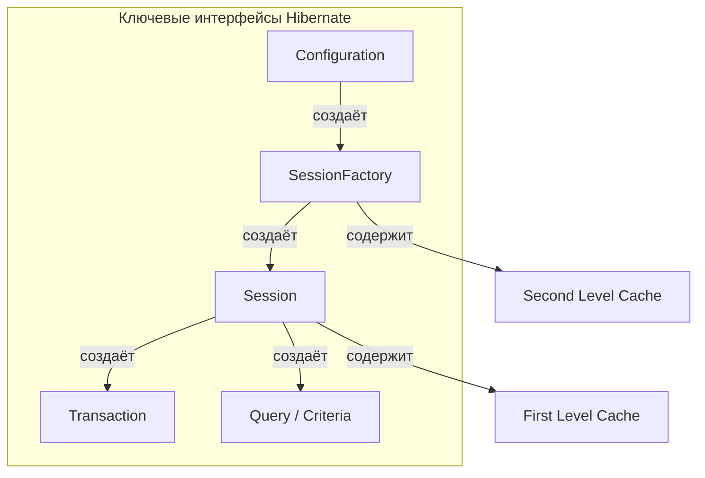
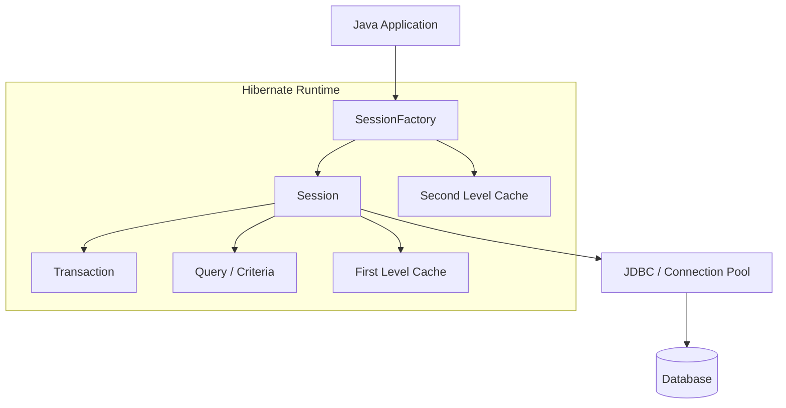
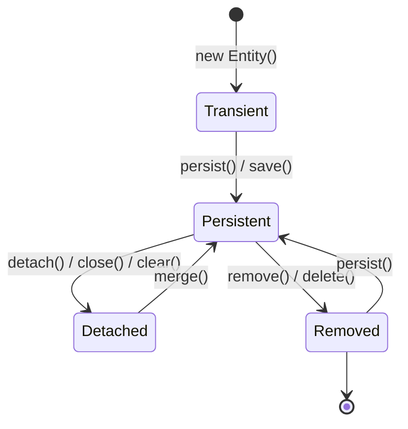
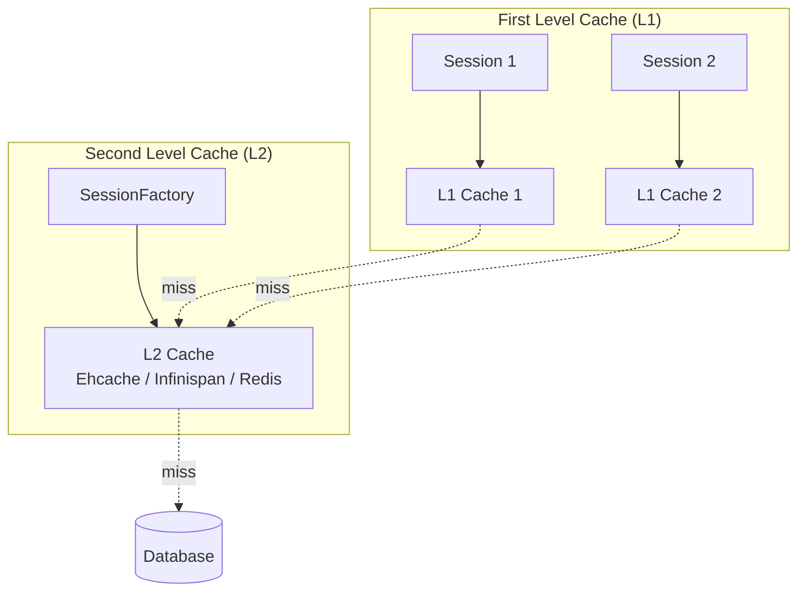
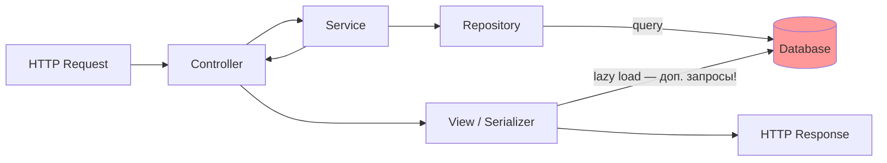

# Вопросы на собеседовании: `Hibernate`

Полное покрытие `Hibernate ORM`: маппинги, `Session`, lazy loading, N+1, кэширование, состояния entity, `Criteria API`, `JPQL`, транзакции, блокировки, наследование, batch processing.

Краткое введение: **Hibernate** — самая популярная реализация спецификации `JPA` для работы с реляционными БД в `Java`. На собеседовании проверяют глубокое понимание маппингов, жизненного цикла сущностей, механизмов кэширования, стратегий загрузки, N+1 проблемы, управления транзакциями и блокировок. Знание `Hibernate` тесно связано с [Spring Data JPA](../frameworks/spring/spring-data-jpa-interview.md) и [SQL](sql-interview.md).

## Полезные ссылки

### Официальная документация

- [Hibernate ORM Documentation](https://hibernate.org/orm/documentation/) — основная документация
- [Hibernate User Guide 6.x](https://docs.jboss.org/hibernate/orm/6.4/userguide/html_single/Hibernate_User_Guide.html) — руководство пользователя
- [JPA Specification](https://jakarta.ee/specifications/persistence/) — спецификация Jakarta Persistence

### Статьи Baeldung

- [N+1 Problem in Hibernate and Spring Data JPA](https://www.baeldung.com/spring-hibernate-n1-problem) — проблема N+1 и решения
- [Hibernate Second-Level Cache](https://www.baeldung.com/hibernate-second-level-cache) — кэш второго уровня
- [Hibernate Entity Lifecycle](https://www.baeldung.com/hibernate-entity-lifecycle) — жизненный цикл сущностей
- [Hibernate Inheritance Mapping](https://www.baeldung.com/hibernate-inheritance) — стратегии наследования
- [Optimistic Locking in JPA](https://www.baeldung.com/jpa-optimistic-locking) — оптимистичная блокировка
- [Pessimistic Locking in JPA](https://www.baeldung.com/jpa-pessimistic-locking) — пессимистичная блокировка
- [Batch Insert/Update with Hibernate/JPA](https://www.baeldung.com/jpa-hibernate-batch-insert-update) — batch-операции
- [JPA and Hibernate – Criteria vs. JPQL vs. HQL Query](https://www.baeldung.com/jpql-hql-criteria-query) — сравнение подходов к запросам
- [FetchMode in Hibernate](https://www.baeldung.com/hibernate-fetchmode) — стратегии загрузки связанных сущностей

## Содержание

- [Полезные ссылки](#полезные-ссылки)
- [See also](#see-also)

**Основы Hibernate и JPA**
- [Q1. (!) Что такое Hibernate ORM и чем он отличается от JPA?](#q1--что-такое-hibernate-orm-и-чем-он-отличается-от-jpa)
- [Q2. (!) Каковы преимущества Hibernate перед JDBC?](#q2--каковы-преимущества-hibernate-перед-jdbc)
- [Q3. (!) Назовите ключевые интерфейсы Hibernate](#q3--назовите-ключевые-интерфейсы-hibernate)
- [Q4. Что такое Session и SessionFactory?](#q4-что-такое-session-и-sessionfactory)
- [Q5. Является ли Session потокобезопасной?](#q5-является-ли-session-потокобезопасной)
- [Q6. Объясните архитектуру Hibernate](#q6-объясните-архитектуру-hibernate)

**Жизненный цикл сущностей**
- [Q7. (!) Какие состояния может иметь Entity?](#q7--какие-состояния-может-иметь-entity)
- [Q8. (!) Что такое Dirty Checking и как работает flush?](#q8--что-такое-dirty-checking-и-как-работает-flush)
- [Q9. В чём разница между persist(), save(), merge() и update()?](#q9-в-чём-разница-между-persist-save-merge-и-update)
- [Q10. В чём разница между get() и load()?](#q10-в-чём-разница-между-get-и-load)
- [Q11. Зачем Entity нужен конструктор без аргументов?](#q11-зачем-entity-нужен-конструктор-без-аргументов)
- [Q12. (!) Можно ли объявить Entity класс final?](#q12--можно-ли-объявить-entity-класс-final)

**Маппинг и аннотации**
- [Q13. Какие основные аннотации JPA используются для маппинга?](#q13-какие-основные-аннотации-jpa-используются-для-маппинга)
- [Q14. (!) Что такое Hibernate Inheritance Mapping?](#q14--что-такое-hibernate-inheritance-mapping)
- [Q15. Как маппить связь One-To-Many / Many-To-One?](#q15-как-маппить-связь-one-to-many--many-to-one)
- [Q16. Как маппить связь Many-To-Many?](#q16-как-маппить-связь-many-to-many)
- [Q17. В чём разница между @JoinColumn и mappedBy?](#q17-в-чём-разница-между-joincolumn-и-mappedby)
- [Q18. Что такое @Embeddable и @Embedded?](#q18-что-такое-embeddable-и-embedded)

**Lazy Loading и стратегии загрузки**
- [Q19. (!) Что такое Lazy Loading и Eager Loading?](#q19--что-такое-lazy-loading-и-eager-loading)
- [Q20. (!) Что такое проблема N+1?](#q20--что-такое-проблема-n1)
- [Q21. (!) Как решить проблему N+1?](#q21--как-решить-проблему-n1)
- [Q22. Что такое LazyInitializationException и как его избежать?](#q22-что-такое-lazyinitializationexception-и-как-его-избежать)
- [Q23. Что такое Entity Graph?](#q23-что-такое-entity-graph)

**Кэширование**
- [Q24. (!) В чём разница между First Level Cache и Second Level Cache?](#q24--в-чём-разница-между-first-level-cache-и-second-level-cache)
- [Q25. Как настроить кэш второго уровня?](#q25-как-настроить-кэш-второго-уровня)
- [Q26. Что такое Query Cache?](#q26-что-такое-query-cache)
- [Q27. (!) Какие Concurrency Strategy доступны для кэша?](#q27--какие-concurrency-strategy-доступны-для-кэша)

**Запросы: HQL, JPQL и Criteria API**
- [Q28. Что такое HQL и JPQL?](#q28-что-такое-hql-и-jpql)
- [Q29. Что такое Criteria API?](#q29-что-такое-criteria-api)
- [Q30. Что такое NamedQuery?](#q30-что-такое-namedquery)
- [Q31. Поддерживает ли Hibernate нативные SQL-запросы?](#q31-поддерживает-ли-hibernate-нативные-sql-запросы)
- [Q32. Подвержен ли Hibernate SQL Injection?](#q32-подвержен-ли-hibernate-sql-injection)

**Транзакции и блокировки**
- [Q33. (!) Что такое @Version и оптимистичная блокировка?](#q33--что-такое-version-и-оптимистичная-блокировка)
- [Q34. В чём разница между оптимистичной и пессимистичной блокировкой?](#q34-в-чём-разница-между-оптимистичной-и-пессимистичной-блокировкой)
- [Q35. Как работают транзакции в Hibernate?](#q35-как-работают-транзакции-в-hibernate)

**Производительность и оптимизация**
- [Q36. (!) Что такое Batch Processing в Hibernate?](#q36--что-такое-batch-processing-в-hibernate)
- [Q37. В чём разница между setMaxResults() и setFetchSize()?](#q37-в-чём-разница-между-setmaxresults-и-setfetchsize)
- [Q38. Что такое @Immutable?](#q38-что-такое-immutable)
- [Q39. Как использовать Hibernate Statistics для мониторинга?](#q39-как-использовать-hibernate-statistics-для-мониторинга)

**Конфигурация и интеграция**
- [Q40. Как настроить Hibernate в Spring Boot?](#q40-как-настроить-hibernate-в-spring-boot)
- [Q41. В чём разница между getCurrentSession() и openSession()?](#q41-в-чём-разница-между-getcurrentsession-и-opensession)
- [Q42. Что такое Hibernate Dialect?](#q42-что-такое-hibernate-dialect)

**Продвинутые темы**
- [Q43. (!) Что такое Open-in-View антипаттерн и как его избежать?](#q43--что-такое-open-in-view-антипаттерн-и-как-его-избежать)
- [Q44. Что такое Hibernate Envers и как организовать аудит изменений?](#q44-что-такое-hibernate-envers-и-как-организовать-аудит-изменений)
- [Q45. (!) Как использовать Projections для оптимизации запросов?](#q45--как-использовать-projections-для-оптимизации-запросов)
- [Q46. Что такое StatelessSession и когда его использовать?](#q46-что-такое-statelesssession-и-когда-его-использовать)
- [Q47. (!) Какие типичные ошибки производительности в Hibernate?](#q47--какие-типичные-ошибки-производительности-в-hibernate)
- [Q48. Как тестировать Hibernate-код?](#q48-как-тестировать-hibernate-код)

---

## Q1. (!) Что такое `Hibernate ORM` и чем он отличается от `JPA`?

**JPA** (`Jakarta Persistence API`, ранее `Java Persistence API`) — это **спецификация**, определяющая стандартный API для ORM в Java. **Hibernate** — это **реализация** этой спецификации (наряду с `EclipseLink`, `OpenJPA` и др.).

Ключевые различия:

| Аспект | `JPA` | `Hibernate` |
|--------|-------|-------------|
| Тип | Спецификация (интерфейсы) | Реализация (конкретные классы) |
| Пакет | `jakarta.persistence.*` | `org.hibernate.*` |
| Запросы | `JPQL` | `HQL` (надмножество `JPQL`) |
| Кэш L2 | Определяет API | Поддерживает `Ehcache`, `Infinispan` и др. |
| Расширения | Нет | `@Formula`, `@Where`, `@BatchSize`, `@NaturalId` и др. |

```java
// JPA-стандартный код — переносимый между реализациями
@Entity
@Table(name = "users")
public class User {
    @Id
    @GeneratedValue(strategy = GenerationType.IDENTITY)
    private Long id;

    @Column(nullable = false, length = 100)
    private String name;

    @OneToMany(mappedBy = "user", cascade = CascadeType.ALL, orphanRemoval = true)
    private List<Order> orders = new ArrayList<>();
}
```

На собеседовании важно подчеркнуть: рекомендуется программировать против `JPA` API (переносимость), а специфичные аннотации `Hibernate` использовать только когда стандартных возможностей недостаточно.

> [!mcq]
> - [ ] JPA — это конкретная реализация ORM, а Hibernate — интерфейс-спецификация. | Всё наоборот: JPA (`jakarta.persistence.*`) — спецификация (набор интерфейсов), а Hibernate — одна из конкретных реализаций этой спецификации. ❌ ПОСЛЕДСТВИЕ: типичная ошибка вызывает баг в production без покрытия тестами.
> - [x] JPA — это спецификация (интерфейсы), а Hibernate — одна из её реализаций. | Именно так: JPA определяет стандартный API (`jakarta.persistence.*`), а Hibernate реализует его, добавляя собственные расширения вроде `@Formula`, `@BatchSize` и HQL.
> - [ ] JPA и Hibernate — это два независимых ORM-фреймворка, не связанных между собой. | Hibernate реализует JPA: класс `org.hibernate.Session` расширяет `jakarta.persistence.EntityManager`, и код на стандартном JPA API запускается поверх Hibernate.
> - [ ] JPA поддерживает только аннотации, а Hibernate поддерживает только XML-маппинг. | Оба инструмента поддерживают как аннотации, так и XML-конфигурацию. JPA стандартизирует аннотации в `jakarta.persistence`, а Hibernate добавляет собственные в `org.hibernate.annotations`.

## Q2. (!) Каковы преимущества `Hibernate` перед `JDBC`?

| Аспект | `JDBC` | `Hibernate` |
|--------|--------|-------------|
| Код | Много boilerplate (`ResultSet`, `PreparedStatement`) | Чистый код, работа с объектами |
| SQL | Ручное написание, зависимость от диалекта | `HQL`/`JPQL` — независимость от БД |
| Транзакции | Ручное управление (`commit`/`rollback`) | Декларативное через `@Transactional` |
| Исключения | Checked `SQLException` | Unchecked `HibernateException` |
| Кэширование | Нет встроенного | L1 + L2 кэш |
| Маппинг | Ручной маппинг `ResultSet` → объект | Автоматический через аннотации |
| Ассоциации | `JOIN`-ы вручную | `@OneToMany`, `@ManyToMany` и др. |

```java
// JDBC — много boilerplate
try (Connection conn = dataSource.getConnection();
     PreparedStatement ps = conn.prepareStatement("SELECT * FROM users WHERE id = ?")) {
    ps.setLong(1, userId);
    ResultSet rs = ps.executeQuery();
    if (rs.next()) {
        User user = new User();
        user.setId(rs.getLong("id"));
        user.setName(rs.getString("name"));
    }
}

// Hibernate — чистый код
User user = session.get(User.class, userId);
```

> [!mcq]
> - [ ] Hibernate устраняет потребность в написании SQL полностью и не позволяет выполнять нативные запросы. | Hibernate позволяет выполнять нативный SQL через `entityManager.createNativeQuery()`. HQL/JPQL лишь избавляет от рутины в типичных CRUD-сценариях. ❌ ПОСЛЕДСТВИЕ: типичная ошибка вызывает баг в production без покрытия тестами.
> - [ ] Hibernate не поддерживает декларативное управление транзакциями, требуя ручного `commit`/`rollback`. | Hibernate вместе со Spring позволяет управлять транзакциями декларативно через `@Transactional`, что является одним из ключевых преимуществ над чистым JDBC. ❌ ПОСЛЕДСТВИЕ: антипаттерн деградирует SLA при росте нагрузки или зависимостей.
> - [x] Hibernate устраняет ручной маппинг `ResultSet` → объект и предоставляет встроенный кэш L1/L2. | В JDBC разработчик вручную читает `rs.getLong("id")`, `rs.getString("name")` и т.д. Hibernate автоматически маппит результат на объект через аннотации и управляет кэшированием на двух уровнях.
> - [ ] Hibernate автоматически нормализует схему БД, исключая потребность в DDL-миграциях. | Hibernate не нормализует схему автоматически. Управление схемой (`ddl-auto`) может создавать таблицы, но для production рекомендуется использовать Flyway/Liquibase.

## Q3. (!) Назовите ключевые интерфейсы `Hibernate`



1. **`Configuration`** — загрузка настроек из `hibernate.cfg.xml` или `persistence.xml`, регистрация маппингов
2. **`SessionFactory`** — потокобезопасная фабрика сессий, один экземпляр на приложение, содержит кэш L2 и метаданные маппинга
3. **`Session`** — единица работы (`unit of work`), содержит кэш L1, не потокобезопасна
4. **`Transaction`** — управление границами транзакций (`begin`, `commit`, `rollback`)
5. **`Query`** / **`CriteriaBuilder`** — выполнение `HQL`/`JPQL`/`Criteria`/`SQL` запросов

> [!mcq]
> - [ ] `Session` является потокобезопасным синглтоном, а `SessionFactory` создаётся заново для каждого запроса. | Всё наоборот: `SessionFactory` — потокобезопасный синглтон на всё приложение, а `Session` — лёгкий объект, создаваемый для каждой единицы работы. ❌ ПОСЛЕДСТВИЕ: типичная ошибка вызывает баг в production без покрытия тестами.
> - [x] `SessionFactory` — потокобезопасный синглтон, хранящий кэш L2, а `Session` — не потокобезопасный объект единицы работы с кэшем L1. | `SessionFactory` создаётся один раз при старте, хранит метаданные маппинга и кэш L2. `Session` создаётся под каждую транзакцию/запрос, хранит кэш L1 (persistence context) и не является потокобезопасной.
> - [ ] `Configuration` — это синглтон для управления транзакциями, а `Query` — для создания соединений с БД. | `Configuration` отвечает за загрузку настроек и создание `SessionFactory`. `Query` используется для выполнения HQL/JPQL/SQL запросов, а соединения управляет JDBC/пул соединений.
> - [ ] `Transaction` является частью `SessionFactory` и разделяется между всеми `Session`. | `Transaction` создаётся внутри конкретной `Session` через `session.beginTransaction()` и не разделяется между сессиями. ❌ ПОСЛЕДСТВИЕ: антипаттерн деградирует SLA при росте нагрузки или зависимостей.

## Q4. Что такое `Session` и `SessionFactory`?

**`SessionFactory`** — тяжёлый потокобезопасный объект, создаётся один раз при старте приложения. Хранит метаданные маппинга, кэш второго уровня, пулы соединений. Создание `SessionFactory` — дорогая операция (парсинг маппингов, валидация).

**`Session`** — лёгкий объект, представляющий единицу работы с БД. Содержит **кэш первого уровня** (Persistence Context): все загруженные сущности хранятся в памяти сессии и повторно не запрашиваются из БД. Типичный жизненный цикл: открыть → выполнить операции → закрыть.

```java
// Классический подход (без Spring)
SessionFactory sf = new Configuration().configure().buildSessionFactory();

try (Session session = sf.openSession()) {
    Transaction tx = session.beginTransaction();
    User user = session.get(User.class, 1L); // загружается в L1 cache
    User same = session.get(User.class, 1L); // берётся из L1 cache, SQL не выполняется
    assert user == same; // true — один и тот же объект
    tx.commit();
}
```

В `Spring` управление `Session` берёт на себя фреймворк через `@Transactional` — подробнее в [Spring Data JPA](../frameworks/spring/spring-data-jpa-interview.md).

> [!mcq]
> - [ ] `Session` является потокобезопасной, поэтому её можно разделять между несколькими потоками. | `Session` не является потокобезопасной. Одновременный доступ нескольких потоков к одной сессии приводит к гонкам данных и повреждению кэша L1. ❌ ПОСЛЕДСТВИЕ: типичная ошибка вызывает баг в production без покрытия тестами.
> - [ ] `SessionFactory` не является потокобезопасной и должна создаваться в каждом потоке заново. | `SessionFactory` — потокобезопасный тяжёлый объект, который создаётся один раз при старте приложения и разделяется между всеми потоками. ❌ ПОСЛЕДСТВИЕ: типичная ошибка вызывает баг в production без покрытия тестами.
> - [ ] В Spring каждый поток получает одну и ту же `Session` через статическое поле `SessionFactory`. | В Spring каждый поток получает свою `Session` через `ThreadLocal`-привязку при использовании `@Transactional`. Хранить `Session` в статическом поле категорически запрещено. ❌ ПОСЛЕДСТВИЕ: антипаттерн деградирует SLA при росте нагрузки или зависимостей.
> - [x] `Session` не является потокобезопасной: в Spring каждый поток получает свою сессию через `ThreadLocal`-привязку при `@Transactional`. | Правило: одна `Session` на один поток. Spring реализует это через `TransactionSynchronizationManager`, который хранит сессию в `ThreadLocal` и привязывает её к транзакции. ACID гарантии; изоляция влияет на performance: READ_UNCOMMITTED быстро, SERIALIZABLE безопасно.

## Q5. Является ли `Session` потокобезопасной?

Нет. **`Session`** не потокобезопасна. Одновременный доступ из нескольких потоков к одной `Session` приводит к гонкам, повреждению кэша L1 и непредсказуемому поведению.

**Правило**: одна `Session` на один поток (обычно — на один HTTP-запрос). В `Spring` при использовании `@Transactional` каждый поток получает свою сессию через `ThreadLocal`-привязку. Не храните `Session` в статическом поле и не передавайте между потоками.

**`SessionFactory`**, напротив, **потокобезопасна** и должна быть синглтоном.

> [!mcq]
> - [x] `Session` не потокобезопасна, а `SessionFactory` потокобезопасна и должна быть синглтоном. | `Session` — единица работы, привязанная к одному потоку/транзакции. `SessionFactory` — тяжёлый thread-safe объект, создаётся один раз при старте и разделяется между всеми потоками.
> - [ ] `Session` потокобезопасна, а `SessionFactory` должна создаваться заново в каждом потоке. | Всё наоборот: `Session` не потокобезопасна, попытка её разделить вызовет гонки в кэше L1; `SessionFactory` — синглтон, создание которого дорогое. ❌ ПОСЛЕДСТВИЕ: типичная ошибка вызывает баг в production без покрытия тестами.
> - [ ] `Session` и `SessionFactory` обе потокобезопасны и могут быть синглтонами. | `Session` содержит мутабельный persistence context (L1 cache), который невозможно безопасно разделить между потоками. ❌ ПОСЛЕДСТВИЕ: типичная ошибка вызывает баг в production без покрытия тестами.
> - [ ] `Session` и `SessionFactory` обе не потокобезопасны и требуют `ThreadLocal` для каждой. | `SessionFactory` спроектирована как thread-safe: её создание дорогое, поэтому она всегда синглтон на всё приложение. ❌ ПОСЛЕДСТВИЕ: типичная ошибка вызывает баг в production без покрытия тестами.

## Q6. Объясните архитектуру `Hibernate`



Архитектура `Hibernate` состоит из следующих слоёв:

1. **Java Application** — доменные сущности и бизнес-логика
2. **Hibernate Framework** — `SessionFactory`, `Session`, `Transaction`, `Query`
3. **Internal APIs** — `JDBC`, `JTA` (Java Transaction API), `JNDI`
4. **Database** — `PostgreSQL`, `MySQL`, `Oracle` и др.

`SessionFactory` создаёт `Session` по запросу. `Session` управляет persistence context (L1 cache), координирует dirty checking и flush. `Transaction` обеспечивает атомарность. Всё это строится поверх стандартного `JDBC`.

> [!mcq]
> - [ ] Кэш L1 принадлежит `SessionFactory` и разделяется между всеми `Session`. | Кэш L1 принадлежит конкретной `Session` — это её persistence context. Между сессиями разделяется только кэш L2 на уровне `SessionFactory`. ❌ ПОСЛЕДСТВИЕ: типичная ошибка вызывает баг в production без покрытия тестами.
> - [ ] `Hibernate` работает напрямую с сокетами БД, минуя `JDBC`. | Hibernate всегда строится поверх `JDBC`: именно `JDBC`-драйвер отвечает за сетевое общение с БД. Hibernate лишь генерирует SQL и обрабатывает маппинг.
> - [x] `SessionFactory` хранит L2-кэш и метаданные маппинга, а `Session` — L1-кэш и координирует dirty checking. | Это и есть ключевое архитектурное разделение: тяжёлый синглтон `SessionFactory` с общими ресурсами + лёгкая `Session` под каждую единицу работы со своим persistence context.
> - [ ] `Transaction` существует независимо от `Session` и управляется `SessionFactory` напрямую. | `Transaction` создаётся через `session.beginTransaction()` и всегда привязан к конкретной сессии. `SessionFactory` не участвует в управлении транзакциями. ❌ ПОСЛЕДСТВИЕ: антипаттерн деградирует SLA при росте нагрузки или зависимостей.

## Q7. (!) Какие состояния может иметь `Entity`?

Сущность `Hibernate` проходит через четыре состояния:



| Состояние | Описание | В Persistence Context? | Есть в БД? |
|-----------|----------|----------------------|------------|
| **Transient** | Новый объект, не связан с сессией | Нет | Нет |
| **Persistent** (Managed) | Привязан к сессии, tracked dirty checking | Да | Да (или будет при flush) |
| **Detached** | Был persistent, но сессия закрыта | Нет | Да |
| **Removed** | Помечен на удаление | Да | Будет удалён при flush |

```java
User user = new User("Alice"); // Transient

session.persist(user);         // Persistent (managed)
user.setName("Bob");           // dirty checking отследит изменение

session.detach(user);          // Detached — изменения не синхронизируются

User merged = session.merge(user); // снова Persistent (merged — новый managed объект)

session.remove(merged);        // Removed — удалится при flush/commit
```

> [!mcq]
> - [ ] Transient-объект уже сохранён в БД, но ещё не привязан к активной сессии Hibernate. | Transient — это объект, созданный через `new`, который никогда не был связан с сессией и не имеет записи в БД. ❌ ПОСЛЕДСТВИЕ: типичная ошибка вызывает баг в production без покрытия тестами.
> - [ ] Detached-объект полностью удалён из БД, но ещё хранится в памяти приложения. | Detached-объект существует в БД, но не отслеживается текущей сессией. Его можно снова привязать через `merge()`. ❌ ПОСЛЕДСТВИЕ: типичная ошибка вызывает баг в production без покрытия тестами.
> - [x] Persistent-объект отслеживается сессией через dirty checking, и изменения автоматически синхронизируются с БД при flush. | Persistent (Managed) — объект в persistence context. Hibernate хранит его snapshot и при flush сравнивает текущее состояние с ним, автоматически генерируя UPDATE при расхождении.
> - [ ] Removed-объект немедленно удаляется из БД в момент вызова `remove()`, не дожидаясь flush. | `remove()` лишь помечает объект к удалению. Фактический `DELETE` SQL выполняется при `flush()`, который происходит перед `commit()` или явно. ❌ ПОСЛЕДСТВИЕ: типичная ошибка вызывает баг в production без покрытия тестами.

> [!mcq]
> - [ ] Метод `merge()` переводит объект из состояния Transient прямо в Removed. | `merge()` переводит Detached-объект в Persistent, копируя его состояние в managed-копию. Для удаления используется `remove()`. ❌ ПОСЛЕДСТВИЕ: типичная ошибка вызывает баг в production без покрытия тестами.
> - [ ] После вызова `detach()` объект переходит в состояние Removed и будет удалён при flush. | `detach()` переводит объект в состояние Detached — он больше не отслеживается сессией, но остаётся в памяти и в БД. ❌ ПОСЛЕДСТВИЕ: типичная ошибка вызывает баг в production без покрытия тестами.
> - [ ] Вызов `persist()` на Detached-объекте переводит его обратно в Persistent без создания новой managed-копии. | `persist()` предназначен для Transient-объектов. Для Detached используется `merge()`, который создаёт новую managed-копию. ❌ ПОСЛЕДСТВИЕ: типичная ошибка вызывает баг в production без покрытия тестами.
> - [x] Вызов `merge()` на Detached-объекте создаёт новую managed-копию, при этом сам Detached-объект остаётся в состоянии Detached. | Это ключевое отличие `merge()`: он не «переприсоединяет» исходный объект, а возвращает новый managed-экземпляр. Изменения нужно вносить именно в возвращённый объект.

## Q8. (!) Что такое `Dirty Checking` и как работает `flush`?

**Dirty Checking** — механизм `Hibernate`, который автоматически обнаруживает изменённые (dirty) сущности в persistence context и генерирует `UPDATE` SQL при `flush`. Не требует явного вызова `update()`.

**Как это работает**: при загрузке сущности `Hibernate` сохраняет **snapshot** её начального состояния. При `flush` сравнивает текущие значения полей с snapshot — если есть различия, генерируется `UPDATE`.

**`flush()`** — синхронизация persistence context с БД. Происходит:
1. Автоматически перед `commit()`
2. Автоматически перед выполнением `JPQL`/`HQL` запроса (чтобы запрос видел актуальные данные)
3. Вручную — `session.flush()`

```java
@Transactional
public void updateUserName(Long id, String newName) {
    User user = entityManager.find(User.class, id);
    user.setName(newName);
    // НЕ нужно вызывать save() или update()!
    // Dirty checking сам обнаружит изменение и сгенерирует UPDATE при commit
}
```

**`FlushMode`** — управляет моментом flush:
- `AUTO` (по умолчанию) — перед запросом и перед commit
- `COMMIT` — только перед commit (может вернуть устаревшие данные из запроса)
- `MANUAL` — только при явном вызове `flush()`

> [!mcq]
> - [x] Hibernate сохраняет snapshot начального состояния и при flush сравнивает его с текущими значениями полей. | Dirty checking реализуется через сохранённый snapshot: при загрузке сущности Hibernate копирует её состояние и при flush сравнивает поле за полем, генерируя UPDATE только при реальных изменениях.
> - [ ] Hibernate ставит триггер на каждый сеттер сущности, который немедленно выполняет UPDATE в БД. | Hibernate не генерирует UPDATE при каждом сеттере — это было бы катастрофически медленно. SQL откладывается до flush. ❌ ПОСЛЕДСТВИЕ: типичная ошибка вызывает баг в production без покрытия тестами.
> - [ ] Hibernate использует hash-код сущности и сравнивает его с БД при каждом обращении. | Hash-код не позволяет определить, какие именно поля изменились. Hibernate хранит полный snapshot значений. ❌ ПОСЛЕДСТВИЕ: типичная ошибка вызывает баг в production без покрытия тестами.
> - [ ] Dirty checking требует явного вызова `session.markDirty(entity)` перед каждым изменением. | Никакого ручного маркирования не нужно — это главное преимущество dirty checking. Достаточно изменить поле managed-сущности. ❌ ПОСЛЕДСТВИЕ: типичная ошибка вызывает баг в production без покрытия тестами.

## Q9. В чём разница между `persist()`, `save()`, `merge()` и `update()`?

| Метод | Стандарт | Поведение | Возврат |
|-------|----------|-----------|---------|
| `persist()` | JPA | Делает transient → persistent. Не гарантирует немедленный `INSERT` | `void` |
| `save()` | Hibernate | Делает transient → persistent. Возвращает id. Может выполнить `INSERT` сразу | `Serializable` (id) |
| `merge()` | JPA | Копирует состояние detached объекта в managed копию | Managed entity |
| `update()` | Hibernate | Переприсоединяет detached объект. Выбрасывает исключение если уже есть в контексте | `void` |

```java
// persist() — JPA стандарт, рекомендуется
User user = new User("Alice");
entityManager.persist(user); // user теперь managed

// merge() — для detached объектов
User detached = ... ; // получен из другой сессии, десериализации и т.д.
User managed = entityManager.merge(detached);
// managed — управляемая копия, detached — по-прежнему detached!
managed.setName("Bob"); // будет синхронизировано с БД
```

**Рекомендация**: использовать `JPA`-стандартные `persist()` и `merge()` вместо `Hibernate`-специфичных `save()` и `update()`.

> [!mcq]
> - [ ] `persist()` возвращает сгенерированный id, а `save()` возвращает void. | Всё наоборот: Hibernate-специфичный `save()` возвращает `Serializable` (id), а JPA-стандартный `persist()` возвращает `void`. ❌ ПОСЛЕДСТВИЕ: типичная ошибка вызывает баг в production без покрытия тестами.
> - [ ] `merge()` переприсоединяет detached-объект, изменения в исходном объекте синхронизируются с БД. | `merge()` не переприсоединяет исходный detached-объект — он создаёт новую managed-копию. Исходный объект остаётся detached, изменения нужно вносить в возвращённый результат.
> - [x] `merge()` копирует состояние detached-объекта в новую managed-копию и возвращает её. | Это ключевое отличие `merge()` от `update()`: merge возвращает новый managed-экземпляр. Именно с ним нужно работать дальше, а не с исходным detached-объектом.
> - [ ] `update()` работает с transient-объектами так же, как `persist()`. | `update()` предназначен для detached-объектов. Для transient (новых) используется `persist()` — вызов `update()` на transient вызовет исключение. ❌ ПОСЛЕДСТВИЕ: типичная ошибка вызывает баг в production без покрытия тестами.

## Q10. В чём разница между `get()` и `load()`?

| Аспект | `get()` / `find()` | `load()` / `getReference()` |
|--------|--------------------|-----------------------------|
| Загрузка | Немедленная (`SELECT` сразу) | Ленивая (возвращает proxy) |
| Если не найден | Возвращает `null` | Выбрасывает `ObjectNotFoundException` при обращении |
| Proxy | Нет — реальный объект | Да — proxy до первого обращения к полю |
| Когда использовать | Когда не уверены, что запись существует | Когда точно знаете, что запись существует |

```java
// get/find — немедленный SELECT
User user = session.get(User.class, 1L);       // Hibernate
User user = entityManager.find(User.class, 1L); // JPA
if (user == null) { /* не найден */ }

// load/getReference — возвращает proxy, SELECT при первом обращении к полю
User ref = session.load(User.class, 1L);          // Hibernate
User ref = entityManager.getReference(User.class, 1L); // JPA
// SELECT ещё не выполнен
String name = ref.getName(); // SELECT выполняется здесь
```

`getReference()` полезен, когда нужно только установить связь (FK), не загружая всю сущность:

```java
Order order = new Order();
order.setUser(entityManager.getReference(User.class, userId)); // без SELECT для User
entityManager.persist(order);
```

> [!mcq]
> - [x] `get()`/`find()` выполняет SELECT сразу и возвращает `null` если запись не найдена, а `load()`/`getReference()` возвращает proxy и бросает исключение при обращении к полю несуществующей записи. | Это главное поведенческое отличие: `get` гарантирует существование записи и сразу возвращает объект или null, а `load` ленивый и не делает SQL до первого обращения к полю. NULL != 0 != ""; используйте IS NULL/IS NOT NULL, COALESCE для подстановки значений.
> - [ ] `get()` возвращает proxy, а `load()` — реальный объект. | Всё наоборот: `load()`/`getReference()` возвращает proxy (ленивая загрузка), а `get()`/`find()` возвращает реальный полностью загруженный объект. ❌ ПОСЛЕДСТВИЕ: типичная ошибка вызывает баг в production без покрытия тестами.
> - [ ] Оба метода выбрасывают исключение, если запись не найдена в БД. | Только `load()` бросает `ObjectNotFoundException` при обращении к полю. `get()` и `find()` возвращают `null`, что позволяет проверить существование без try/catch. ❌ ПОСЛЕДСТВИЕ: антипаттерн деградирует SLA при росте нагрузки или зависимостей.
> - [ ] `load()` всегда выполняет SELECT немедленно, игнорируя lazy loading. | `load()`/`getReference()` как раз специально откладывает SELECT до первого обращения к полю, что позволяет устанавливать FK-ссылки без лишних запросов к БД.

## Q11. Зачем `Entity` нужен конструктор без аргументов?

`Hibernate` создаёт экземпляры сущностей через **рефлексию** при загрузке из БД. Для этого необходим конструктор без аргументов (`no-arg constructor`). Это **требование спецификации JPA**.

Конструктор может быть `public` или `protected` (для инкапсуляции). Если его нет — `Hibernate` выбросит `InstantiationException`.

```java
@Entity
public class User {
    @Id
    @GeneratedValue(strategy = GenerationType.IDENTITY)
    private Long id;
    private String name;

    protected User() {} // для Hibernate — может быть protected

    public User(String name) { // для бизнес-логики
        this.name = name;
    }
}
```

> [!mcq]
> - [ ] Конструктор без аргументов обязан быть public, иначе Hibernate не сможет его вызвать. | Конструктор может быть `public` или `protected` — рефлексия позволяет вызывать и непубличные конструкторы. `protected` часто предпочтительнее для инкапсуляции.
> - [x] Hibernate создаёт сущности через рефлексию, поэтому требуется no-arg конструктор; иначе будет `InstantiationException`. | Это прямое требование спецификации JPA. При загрузке из БД Hibernate сначала создаёт пустой объект через no-arg конструктор, а затем заполняет поля через сеттеры/рефлексию.
> - [ ] No-arg конструктор нужен только если используется `GenerationType.IDENTITY`. | Требование no-arg конструктора не связано со стратегией генерации id — оно применяется ко всем entity-классам независимо от `@GeneratedValue`. ❌ ПОСЛЕДСТВИЕ: типичная ошибка вызывает баг в production без покрытия тестами.
> - [ ] Hibernate синтезирует no-arg конструктор автоматически через bytecode enhancement. | Hibernate не добавляет конструкторы автоматически — разработчик должен объявить его сам. Bytecode enhancement добавляет только служебные поля и методы для lazy loading и dirty checking.

## Q12. (!) Можно ли объявить `Entity` класс `final`?

**Не рекомендуется.** `Hibernate` создаёт **прокси-подклассы** для ленивой загрузки (`lazy loading`). Если класс `final` — его нельзя расширить, и прокси создать невозможно.

Последствия:
- Ленивая загрузка для ассоциаций к этой сущности **не будет работать**
- `load()` / `getReference()` вернёт реальный объект вместо прокси
- Потенциальное снижение производительности

```java
// ❌ Плохо — Hibernate не сможет создать proxy
@Entity
public final class User { ... }

// ✅ Хорошо — @Immutable для данных «только чтение»
@Entity
@Immutable
public class Country { ... }
```

Если нужна неизменяемость данных — используйте `@Immutable`, а не `final` на классе.

> [!mcq]
> - [ ] Hibernate полностью запрещает `final` entity-классы и бросает исключение при старте. | Hibernate не бросает исключение, приложение стартует. Просто ленивая загрузка для такой сущности перестаёт работать, поскольку невозможно создать proxy-подкласс.
> - [x] Для `final` entity ленивая загрузка не работает: Hibernate не может создать proxy-подкласс, поэтому `load()`/`getReference()` вернёт реальный объект. | Hibernate использует CGLIB/Byte Buddy для генерации proxy-подклассов. Финальный класс расширить невозможно, поэтому Hibernate вынужден грузить реальный объект сразу.
> - [ ] `final` entity автоматически становится неизменяемой как с аннотацией `@Immutable`. | `final` на классе запрещает наследование, но не отключает dirty checking. Неизменяемость на уровне Hibernate обеспечивается только аннотацией `@Immutable`.
> - [ ] `final` entity требует включения bytecode enhancement для создания proxy. | Bytecode enhancement работает в момент компиляции и не решает проблему `final`: невозможно сделать наследника финального класса даже через enhancement.

## Q13. Какие основные аннотации `JPA` используются для маппинга?

```java
@Entity                          // Помечает класс как сущность
@Table(name = "orders")          // Имя таблицы
public class Order {

    @Id                           // Первичный ключ
    @GeneratedValue(strategy = GenerationType.IDENTITY) // Стратегия генерации ID
    private Long id;

    @Column(name = "order_date", nullable = false) // Маппинг колонки
    private LocalDateTime orderDate;

    @Enumerated(EnumType.STRING)  // Enum как строка (не ordinal!)
    private OrderStatus status;

    @ManyToOne(fetch = FetchType.LAZY)  // Связь N:1
    @JoinColumn(name = "user_id")       // FK колонка
    private User user;

    @OneToMany(mappedBy = "order", cascade = CascadeType.ALL, orphanRemoval = true)
    private List<OrderItem> items = new ArrayList<>();

    @Transient                    // Поле не маппится в БД
    private BigDecimal calculatedTotal;

    @Version                      // Оптимистичная блокировка
    private Integer version;

    @CreationTimestamp             // Hibernate — автоматическая дата создания
    private LocalDateTime createdAt;
}
```

Ключевые стратегии `@GeneratedValue`:
- **`IDENTITY`** — автоинкремент БД (не подходит для batch insert)
- **`SEQUENCE`** — sequence в БД (рекомендуется для `PostgreSQL`)
- **`TABLE`** — отдельная таблица для генерации (медленнее всего)
- **`AUTO`** — `Hibernate` выбирает стратегию сам

> [!mcq]
> - [ ] `@GeneratedValue(strategy = GenerationType.IDENTITY)` рекомендуется для batch insert в PostgreSQL. | IDENTITY несовместим с batch insert: Hibernate вынужден делать INSERT по одному, чтобы получить сгенерированный БД id. Для batch в PostgreSQL используйте SEQUENCE.
> - [ ] `@Enumerated(EnumType.ORDINAL)` безопаснее, чем `EnumType.STRING`, для долговременного хранения. | ORDINAL хранит порядковый номер enum, поэтому при добавлении/переупорядочивании значений данные в БД становятся некорректными. STRING сохраняет имя и переживает изменения порядка.
> - [x] `@GeneratedValue(strategy = GenerationType.SEQUENCE)` рекомендуется для PostgreSQL и позволяет работать batch insert. | SEQUENCE позволяет Hibernate заранее брать блок id (через `allocationSize`), поэтому все INSERT можно батчить. Это стандартная рекомендация для PostgreSQL.
> - [ ] `@Transient` помечает поле как первичный ключ, эквивалентно `@Id`. | `@Transient` исключает поле из маппинга — оно не сохраняется в БД. Первичный ключ помечается аннотацией `@Id`. ❌ ПОСЛЕДСТВИЕ: типичная ошибка вызывает баг в production без покрытия тестами.

## Q14. (!) Что такое `Hibernate Inheritance Mapping`?

Три стратегии маппинга наследования:

```mermaid
graph TD
    subgraph "SINGLE_TABLE"
        ST[vehicles<br/>id | type | make | payload | seats]
    end

    subgraph "JOINED"
        JV[vehicles<br/>id | make] --> JT[trucks<br/>id | payload]
        JV --> JC[cars<br/>id | seats]
    end

    subgraph "TABLE_PER_CLASS"
        TT[trucks<br/>id | make | payload]
        TC[cars<br/>id | make | seats]
    end
```

| Стратегия | Аннотация | Плюсы | Минусы |
|-----------|-----------|-------|--------|
| **Single Table** | `@Inheritance(strategy = SINGLE_TABLE)` | Быстрые запросы, нет JOIN | NULL-колонки, нет NOT NULL constraint |
| **Joined** | `@Inheritance(strategy = JOINED)` | Нормализовано, NOT NULL | Медленные полиморфные запросы (JOIN) |
| **Table Per Class** | `@Inheritance(strategy = TABLE_PER_CLASS)` | Нет NULL, полные таблицы | Медленный UNION для полиморфных запросов |

```java
@Entity
@Inheritance(strategy = InheritanceType.SINGLE_TABLE)
@DiscriminatorColumn(name = "vehicle_type", discriminatorType = DiscriminatorType.STRING)
public abstract class Vehicle {
    @Id @GeneratedValue(strategy = GenerationType.IDENTITY)
    private Long id;
    private String make;
}

@Entity
@DiscriminatorValue("TRUCK")
public class Truck extends Vehicle {
    private Double payload;
}

@Entity
@DiscriminatorValue("CAR")
public class Car extends Vehicle {
    private Integer seats;
}
```

**На собеседовании**: `SINGLE_TABLE` — по умолчанию и чаще всего рекомендуется. `JOINED` — если важна нормализация и NOT NULL. `TABLE_PER_CLASS` — использовать редко.

> [!mcq]
> - [x] `SINGLE_TABLE` создаёт одну таблицу для всей иерархии, используя discriminator-колонку; главный минус — NULL-колонки для полей подклассов. | В одной таблице хранятся все подклассы, discriminator (`vehicle_type`) указывает конкретный тип. Запросы самые быстрые, но NOT NULL на поля подклассов недопустим. NULL != 0 != ""; используйте IS NULL/IS NOT NULL, COALESCE для подстановки значений.
> - [ ] `JOINED` создаёт одну таблицу на всю иерархию без JOIN и работает быстрее всего. | `JOINED` создаёт отдельную таблицу на каждый класс и требует JOIN при чтении — это самая медленная стратегия для полиморфных запросов, но наиболее нормализованная. ❌ ПОСЛЕДСТВИЕ: антипаттерн деградирует SLA при росте нагрузки или зависимостей.
> - [ ] `TABLE_PER_CLASS` хранит все типы в одной таблице с колонкой `class_type`. | TABLE_PER_CLASS создаёт отдельную таблицу на каждый конкретный класс (без таблицы для абстрактного суперкласса). Полиморфные запросы выполняются через UNION.
> - [ ] Стратегия `SINGLE_TABLE` позволяет объявить NOT NULL на любом поле подкласса. | Именно это и невозможно при SINGLE_TABLE: поля одного подкласса физически хранятся как NULL для строк других подклассов, поэтому NOT NULL бросит ошибку при INSERT. ❌ ПОСЛЕДСТВИЕ: антипаттерн деградирует SLA при росте нагрузки или зависимостей.

## Q15. Как маппить связь `One-To-Many` / `Many-To-One`?

Связь `@OneToMany` / `@ManyToOne` — самая распространённая в JPA. Владелец связи (owning side) — сторона с `@JoinColumn` (обычно `@ManyToOne`).

```java
@Entity
public class Department {
    @Id @GeneratedValue(strategy = GenerationType.IDENTITY)
    private Long id;
    private String name;

    @OneToMany(mappedBy = "department", cascade = CascadeType.ALL, orphanRemoval = true)
    private List<Employee> employees = new ArrayList<>();

    // Вспомогательные методы для поддержания консистентности обеих сторон
    public void addEmployee(Employee e) {
        employees.add(e);
        e.setDepartment(this);
    }
    public void removeEmployee(Employee e) {
        employees.remove(e);
        e.setDepartment(null);
    }
}

@Entity
public class Employee {
    @Id @GeneratedValue(strategy = GenerationType.IDENTITY)
    private Long id;
    private String name;

    @ManyToOne(fetch = FetchType.LAZY) // LAZY — best practice для @ManyToOne
    @JoinColumn(name = "department_id")
    private Department department;
}
```

**Важно**: `@ManyToOne` по умолчанию `EAGER` — всегда устанавливайте `fetch = FetchType.LAZY` явно, чтобы избежать проблемы N+1.

> [!mcq]
> - [ ] `@OneToMany` по умолчанию `EAGER`, а `@ManyToOne` по умолчанию `LAZY`. | Всё наоборот: `@OneToMany` (как и `@ManyToMany`) по умолчанию LAZY, а `@ManyToOne` (как и `@OneToOne`) по умолчанию EAGER — что и создаёт скрытые проблемы N+1.
> - [x] `@ManyToOne` по умолчанию `EAGER`, поэтому для избежания N+1 нужно явно указывать `fetch = FetchType.LAZY`. | Это неочевидное поведение JPA: each-to-one ассоциации грузятся eagerly по умолчанию. Лучшая практика — всегда ставить LAZY явно на все `@ManyToOne` и `@OneToOne`.
> - [ ] Владельцем связи между Department и Employee в примере является Department (сторона с `mappedBy`). | Владельцем всегда является сторона без `mappedBy`, т.е. та, которая имеет `@JoinColumn` и физически хранит FK. В примере это Employee с `department_id`. ❌ ПОСЛЕДСТВИЕ: антипаттерн деградирует SLA при росте нагрузки или зависимостей.
> - [ ] `orphanRemoval = true` автоматически удаляет связанную сущность при удалении родителя, эквивалент `CascadeType.REMOVE`. | `orphanRemoval` удаляет сущность при удалении её из коллекции родителя (или при разрыве связи), а не при удалении самого родителя. Это разное поведение.

## Q16. Как маппить связь `Many-To-Many`?

`@ManyToMany` создаёт промежуточную (join) таблицу:

```java
@Entity
public class Student {
    @Id @GeneratedValue(strategy = GenerationType.IDENTITY)
    private Long id;

    @ManyToMany(cascade = {CascadeType.PERSIST, CascadeType.MERGE})
    @JoinTable(
        name = "student_course",
        joinColumns = @JoinColumn(name = "student_id"),
        inverseJoinColumns = @JoinColumn(name = "course_id")
    )
    private Set<Course> courses = new HashSet<>(); // Set, не List!
}

@Entity
public class Course {
    @Id @GeneratedValue(strategy = GenerationType.IDENTITY)
    private Long id;

    @ManyToMany(mappedBy = "courses")
    private Set<Student> students = new HashSet<>();
}
```

**Best practices**:
- Используйте `Set`, а не `List` — `Hibernate` генерирует более эффективный SQL для `Set` при удалении элементов
- Не используйте `CascadeType.ALL` / `REMOVE` на `@ManyToMany` — это может удалить связанные сущности при удалении из коллекции
- Для join-таблиц с дополнительными полями (дата записи, оценка и т.д.) — создавайте отдельную `@Entity`

> [!mcq]
> - [x] Для `@ManyToMany` рекомендуется использовать `Set`, так как Hibernate генерирует более эффективный SQL при удалении элементов. | При удалении одного элемента из `List<@ManyToMany>` Hibernate делает DELETE всех строк join-таблицы и потом INSERT оставшихся. Для `Set` — точечный DELETE одной строки. Hash join для больших таблиц, nested loop для малых, merge для отсортированных; профилируйте EXPLAIN.
> - [ ] Для `@ManyToMany` рекомендуется использовать `CascadeType.ALL`, чтобы связанные сущности удалялись автоматически. | `CascadeType.ALL`/`REMOVE` на `@ManyToMany` опасен: удаление курса из списка студента может удалить сам курс целиком. Безопасны `PERSIST` и `MERGE`. ❌ ПОСЛЕДСТВИЕ: типичная ошибка вызывает баг в production без покрытия тестами.
> - [ ] Для `@ManyToMany` join-таблица создаётся аннотацией `@JoinColumn` на обеих сторонах. | `@JoinColumn` не создаёт join-таблицу, это аннотация для обычного FK. Для join-таблицы используется `@JoinTable` с параметрами `joinColumns` и `inverseJoinColumns`. ❌ ПОСЛЕДСТВИЕ: антипаттерн деградирует SLA при росте нагрузки или зависимостей.
> - [ ] Для join-таблиц с дополнительными полями (дата, оценка) достаточно расширить `@JoinTable` новыми колонками. | `@JoinTable` не позволяет маппить дополнительные поля. При наличии таких полей нужно создать отдельную `@Entity` с составным ключом и двумя `@ManyToOne`. ❌ ПОСЛЕДСТВИЕ: антипаттерн деградирует SLA при росте нагрузки или зависимостей.

## Q17. В чём разница между `@JoinColumn` и `mappedBy`?

**`@JoinColumn`** — маркер **owning side** (владелец связи). Определяет FK-колонку в таблице владельца.

**`mappedBy`** — маркер **inverse side** (обратная сторона). Указывает имя поля на стороне владельца.

```java
// Owning side — Employee владеет связью, в таблице employee есть FK department_id
@ManyToOne
@JoinColumn(name = "department_id")
private Department department;

// Inverse side — Department не владеет связью, ссылается на поле "department" у Employee
@OneToMany(mappedBy = "department")
private List<Employee> employees;
```

**Правило**: FK всегда хранится на стороне с `@JoinColumn`. Изменения на стороне `mappedBy` **не синхронизируются** с БД — нужно обновлять owning side.

> [!mcq]
> - [ ] `mappedBy` указывает на имя колонки FK в таблице БД. | `mappedBy` указывает на имя поля в классе-владельце, а не на имя колонки в БД. Имя колонки задаётся через `@JoinColumn(name = ...)` на owning side. ❌ ПОСЛЕДСТВИЕ: антипаттерн деградирует SLA при росте нагрузки или зависимостей.
> - [ ] Изменения на стороне `mappedBy` автоматически синхронизируются в БД. | Изменения на inverse-стороне НЕ синхронизируются. Нужно обновлять именно owning side (сторону с `@JoinColumn`), иначе БД не увидит изменений. ❌ ПОСЛЕДСТВИЕ: антипаттерн деградирует SLA при росте нагрузки или зависимостей.
> - [x] `@JoinColumn` маркирует owning side — сторону, на которой физически хранится FK-колонка. | Owning side всегда хранит FK в своей таблице. При `@ManyToOne` с `@JoinColumn(name = "department_id")` колонка `department_id` физически находится в таблице employee. Hash join для больших таблиц, nested loop для малых, merge для отсортированных; профилируйте EXPLAIN.
> - [ ] `@JoinColumn` и `mappedBy` взаимозаменяемы и могут использоваться одновременно на одной стороне связи. | На одной стороне может быть только что-то одно: `@JoinColumn` (owning) или `mappedBy` (inverse). Использование обоих вместе вызовет ошибку маппинга. ❌ ПОСЛЕДСТВИЕ: антипаттерн деградирует SLA при росте нагрузки или зависимостей.

## Q18. Что такое `@Embeddable` и `@Embedded`?

`@Embeddable` — value object, который не имеет собственного id и таблицы. Его поля встраиваются в таблицу родительской сущности.

```java
@Embeddable
public class Address {
    private String city;
    private String street;
    @Column(name = "zip_code")
    private String zipCode;
}

@Entity
public class Customer {
    @Id @GeneratedValue(strategy = GenerationType.IDENTITY)
    private Long id;

    @Embedded
    private Address homeAddress;

    @Embedded
    @AttributeOverrides({
        @AttributeOverride(name = "city", column = @Column(name = "work_city")),
        @AttributeOverride(name = "street", column = @Column(name = "work_street")),
        @AttributeOverride(name = "zipCode", column = @Column(name = "work_zip"))
    })
    private Address workAddress;
}
```

Результат — **одна таблица** `customer` с колонками: `id`, `city`, `street`, `zip_code`, `work_city`, `work_street`, `work_zip`.

> [!mcq]
> - [x] `@Embeddable` — value object без собственного id и таблицы, поля встраиваются в таблицу родителя. | Это ключевое определение: embeddable не имеет идентичности, хранится внутри родительской таблицы и используется для логической группировки полей (Address, Money, Period и т.п.).
> - [ ] `@Embeddable` создаёт отдельную таблицу с FK на родителя, как `@OneToOne`. | Отдельная таблица не создаётся — все поля embeddable располагаются в колонках таблицы родителя. Именно этим embeddable отличается от `@OneToOne`. ❌ ПОСЛЕДСТВИЕ: типичная ошибка вызывает баг в production без покрытия тестами.
> - [ ] При встраивании двух `@Embedded` одного типа в одну сущность возникает ошибка из-за конфликта имён колонок. | Конфликт разрешается через `@AttributeOverrides` / `@AttributeOverride`, которые переименовывают колонки для конкретного вхождения embeddable. ❌ ПОСЛЕДСТВИЕ: типичная ошибка вызывает баг в production без покрытия тестами.
> - [ ] `@Embedded`-поле обязано иметь собственный `@Id` и `@Version`. | Наоборот: embeddable не имеет id и версии — они принадлежат родительской сущности. Это отличает value object от entity. ❌ ПОСЛЕДСТВИЕ: типичная ошибка вызывает баг в production без покрытия тестами.

## Q19. (!) Что такое `Lazy Loading` и `Eager Loading`?

| Стратегия | Описание | По умолчанию для |
|-----------|----------|-----------------|
| **`LAZY`** | Данные загружаются при первом обращении | `@OneToMany`, `@ManyToMany` |
| **`EAGER`** | Данные загружаются сразу вместе с родительской сущностью | `@ManyToOne`, `@OneToOne` |

**`LAZY`** — `Hibernate` возвращает прокси-объект или обёртку коллекции. Реальный `SELECT` выполняется при первом вызове метода (кроме `getId()`).

**Best practice**: всегда устанавливайте `FetchType.LAZY` на все ассоциации и управляйте загрузкой через `JOIN FETCH`, `@EntityGraph` или `@BatchSize` — это предотвращает неожиданную загрузку ненужных данных.

```java
@Entity
public class Order {
    @ManyToOne(fetch = FetchType.LAZY) // явно LAZY для @ManyToOne
    @JoinColumn(name = "user_id")
    private User user;

    @OneToMany(mappedBy = "order", fetch = FetchType.LAZY) // LAZY по умолчанию
    private List<OrderItem> items;
}
```

> [!mcq]
> - [ ] По умолчанию `@OneToMany` и `@ManyToOne` оба `EAGER`. | Только `@ManyToOne` (и `@OneToOne`) по умолчанию EAGER. `@OneToMany` и `@ManyToMany` по умолчанию LAZY. ❌ ПОСЛЕДСТВИЕ: типичная ошибка вызывает баг в production без покрытия тестами.
> - [ ] По умолчанию `@OneToMany` и `@ManyToOne` оба `LAZY`. | `@ManyToOne` по умолчанию EAGER — это распространённая причина скрытых проблем производительности. Именно поэтому рекомендуется явно ставить LAZY на все `@ManyToOne`.
> - [x] Best practice — ставить `FetchType.LAZY` на все ассоциации и загружать нужные данные через `JOIN FETCH` или `@EntityGraph`. | Это даёт контроль над тем, что и когда загружается. EAGER по умолчанию приводит к загрузке ненужных данных во всех запросах — обратной стороной становятся скрытые JOIN и N+1. Hash join для больших таблиц, nested loop для малых, merge для отсортированных; профилируйте EXPLAIN.
> - [ ] `EAGER` полностью решает проблему N+1 и не имеет недостатков. | EAGER лишь заменяет N+1 на принудительную загрузку данных в каждом запросе, что приводит к избыточному трафику и JOIN-ам. Правильный способ — явный `JOIN FETCH`/`@EntityGraph` по месту.

## Q20. (!) Что такое проблема N+1?

Проблема **N+1** — ситуация, когда `Hibernate` выполняет **1 запрос** для получения списка из N сущностей, а затем **N дополнительных запросов** для загрузки связанных данных каждой сущности.

```java
// 1 запрос: SELECT * FROM authors
List<Author> authors = session.createQuery("FROM Author", Author.class).list();

// N запросов: для каждого автора — SELECT * FROM books WHERE author_id = ?
for (Author author : authors) {
    System.out.println(author.getBooks().size()); // каждый вызов — отдельный SELECT
}
```

Итого: **1 + N запросов** вместо одного. При N = 1000 авторов — 1001 запрос к БД.

```
-- 1-й запрос
SELECT * FROM authors;

-- 2-й запрос (автор #1)
SELECT * FROM books WHERE author_id = 1;
-- 3-й запрос (автор #2)
SELECT * FROM books WHERE author_id = 2;
-- ... и так N раз
```

Эта проблема — одна из главных причин performance-проблем в `Hibernate`-приложениях. Подробнее о запросах в [вопросах по SQL](sql-interview.md).

> [!mcq]
> - [x] 1 запрос для списка из N сущностей + N дополнительных запросов при обращении к lazy-ассоциациям каждой из них. | Это классическая N+1: первый запрос возвращает список, а затем Hibernate делает отдельный SELECT по каждой сущности при обращении к её lazy-коллекции или связи.
> - [ ] N+1 — это когда один запрос возвращает N+1 строк из-за JOIN-а. | Количество строк в результате не имеет отношения к N+1. Проблема именно в количестве SQL-запросов, которые Hibernate отправляет в БД. ❌ ПОСЛЕДСТВИЕ: антипаттерн деградирует SLA при росте нагрузки или зависимостей.
> - [ ] N+1 — это ситуация, когда Hibernate делает N запросов параллельно, а потом 1 финальный. | Запросы в N+1 выполняются строго последовательно: нельзя обратиться к полю следующей сущности, пока предыдущий SELECT не завершился. ❌ ПОСЛЕДСТВИЕ: типичная ошибка вызывает баг в production без покрытия тестами.
> - [ ] N+1 возникает только при использовании `@OneToOne`-ассоциаций с `EAGER`. | N+1 чаще всего возникает на `@OneToMany` и `@ManyToOne` при lazy-loading в цикле. `@OneToOne` EAGER вызывает аналогичную проблему, но это не единственная причина.

## Q21. (!) Как решить проблему N+1?

Существует несколько способов, от самого рекомендуемого к менее предпочтительному:

**1. `JOIN FETCH` в JPQL** (рекомендуется):

```java
// 1 запрос с JOIN: SELECT a.*, b.* FROM authors a JOIN books b ON a.id = b.author_id
List<Author> authors = entityManager
    .createQuery("SELECT a FROM Author a JOIN FETCH a.books", Author.class)
    .getResultList();
```

**2. `@EntityGraph`** (декларативный подход):

```java
@Entity
@NamedEntityGraph(name = "Author.withBooks",
    attributeNodes = @NamedAttributeNode("books"))
public class Author { ... }

// Использование
EntityGraph<?> graph = entityManager.getEntityGraph("Author.withBooks");
List<Author> authors = entityManager
    .createQuery("SELECT a FROM Author a", Author.class)
    .setHint("jakarta.persistence.fetchgraph", graph)
    .getResultList();
```

**3. `@BatchSize`** (уменьшает N+1 до N/batch+1):

```java
@Entity
public class Author {
    @OneToMany(mappedBy = "author")
    @BatchSize(size = 25) // загружает книги пачками по 25 авторов
    private List<Book> books;
}
// Вместо 1+N запросов будет 1 + ceil(N/25)
```

**4. `@Fetch(FetchMode.SUBSELECT)`**:

```java
@OneToMany(mappedBy = "author")
@Fetch(FetchMode.SUBSELECT)
private List<Book> books;
// 2 запроса: 1 для авторов + 1 subselect для всех книг
```

**Не рекомендуется**: менять `FetchType.LAZY` на `FetchType.EAGER` — это решит N+1, но создаст проблему избыточной загрузки данных во всех запросах.

> [!mcq]
> - [ ] `JOIN FETCH` в JPQL выполняет подзапрос и загружает связанные сущности отдельным запросом. | `JOIN FETCH` выполняет один SQL с JOIN-ом: и родительские, и связанные сущности загружаются одним запросом. Подзапрос использует `FetchMode.SUBSELECT`. ❌ ПОСЛЕДСТВИЕ: антипаттерн деградирует SLA при росте нагрузки или зависимостей.
> - [x] `JOIN FETCH` — рекомендуемый способ, выполняет один SQL с JOIN-ом и загружает родителя со связанными сущностями сразу. | Это самый явный и контролируемый способ: в запросе написано ровно то, что будет загружено, что минимизирует сюрпризы и N+1. Hash join для больших таблиц, nested loop для малых, merge для отсортированных; профилируйте EXPLAIN.
> - [ ] `@BatchSize(size = 25)` превращает N+1 в ровно 2 запроса независимо от количества авторов. | `@BatchSize` уменьшает количество запросов до `1 + ceil(N/25)`, а не до 2. Полное избавление достигается через `JOIN FETCH`. ❌ ПОСЛЕДСТВИЕ: антипаттерн деградирует SLA при росте нагрузки или зависимостей.
> - [ ] `FetchType.EAGER` — лучшее решение проблемы N+1 в production. | EAGER делает загрузку связанных данных обязательной во всех запросах к сущности. Это приводит к избыточному трафику, поэтому не рекомендуется. ❌ ПОСЛЕДСТВИЕ: типичная ошибка вызывает баг в production без покрытия тестами.

## Q22. Что такое `LazyInitializationException` и как его избежать?

**`LazyInitializationException`** возникает при обращении к lazy-ассоциации после закрытия `Session`:

```java
User user;
try (Session session = sf.openSession()) {
    user = session.get(User.class, 1L);
} // Session закрыта

user.getOrders().size(); // LazyInitializationException!
```

Способы решения:
1. **`JOIN FETCH`** в запросе — загрузить нужные данные заранее (рекомендуется)
2. **`@EntityGraph`** — декларативно указать что загружать
3. **`Open Session in View`** (`spring.jpa.open-in-view=true`) — Session остаётся открытой до конца HTTP-запроса (anti-pattern для production, может привести к N+1)
4. **DTO projection** — возвращать DTO с нужными полями вместо entity

> [!mcq]
> - [x] `LazyInitializationException` возникает при обращении к lazy-ассоциации вне открытой `Session`/транзакции. | Когда сессия закрыта, proxy-коллекция не может сделать SELECT для инициализации. Hibernate бросает исключение, чтобы указать на попытку lazy-load в detached-состоянии.
> - [ ] `LazyInitializationException` возникает при обращении к eager-ассоциации. | Eager-ассоциации загружаются сразу вместе с родителем, поэтому к моменту обращения к ним все данные уже в памяти — исключение не возникает. ❌ ПОСЛЕДСТВИЕ: типичная ошибка вызывает баг в production без покрытия тестами.
> - [ ] Единственный правильный способ избежать `LazyInitializationException` — включить `open-in-view = true`. | OSIV (open-in-view) считается антипаттерном в production: он маскирует проблему, но создаёт скрытые SQL-запросы в view-слое. Правильнее загружать данные явно в сервисе.
> - [ ] `LazyInitializationException` автоматически откатывает текущую транзакцию. | Исключение не затрагивает транзакцию — к моменту его возникновения транзакция обычно уже закрыта. Это unchecked runtime exception. ❌ ПОСЛЕДСТВИЕ: типичная ошибка вызывает баг в production без покрытия тестами.

## Q23. Что такое `Entity Graph`?

**Entity Graph** — механизм `JPA` 2.1+ для декларативного определения, какие ассоциации загрузить вместе с сущностью. Альтернатива `JOIN FETCH` в `JPQL`.

```java
// Через аннотацию
@Entity
@NamedEntityGraph(name = "Order.withItems",
    attributeNodes = {
        @NamedAttributeNode("items"),
        @NamedAttributeNode("user")
    })
public class Order { ... }

// Через API (программно)
EntityGraph<Order> graph = entityManager.createEntityGraph(Order.class);
graph.addAttributeNodes("items", "user");

Map<String, Object> hints = Map.of("jakarta.persistence.loadgraph", graph);
Order order = entityManager.find(Order.class, orderId, hints);
```

Два типа hint:
- **`fetchgraph`** — загружает ТОЛЬКО указанные атрибуты (остальные LAZY)
- **`loadgraph`** — загружает указанные + атрибуты с дефолтным EAGER

В [Spring Data JPA](../frameworks/spring/spring-data-jpa-interview.md) Entity Graph используется через аннотацию `@EntityGraph` на методе репозитория.

> [!mcq]
> - [ ] `fetchgraph` загружает указанные атрибуты плюс все с дефолтным EAGER. | Всё наоборот: `fetchgraph` грузит ТОЛЬКО указанные атрибуты (остальные становятся LAZY). Дефолтный EAGER учитывает `loadgraph`. ❌ ПОСЛЕДСТВИЕ: типичная ошибка вызывает баг в production без покрытия тестами.
> - [x] `loadgraph` загружает указанные атрибуты плюс те, что по умолчанию EAGER. | `loadgraph` дополняет граф к дефолтному поведению: EAGER-ассоциации остаются EAGER, а указанные в графе — тоже загружаются. Это ключевое разграничение из best practice.
> - [ ] Entity Graph можно задавать только программно через API, аннотация `@NamedEntityGraph` не поддерживается. | `@NamedEntityGraph` — стандартная JPA-аннотация, объявляется на классе сущности и используется через `entityManager.getEntityGraph(name)`. ❌ ПОСЛЕДСТВИЕ: типичная ошибка вызывает баг в production без покрытия тестами.
> - [ ] Entity Graph заменяет транзакцию и позволяет загружать данные вне `@Transactional`. | Entity Graph не управляет транзакциями — это лишь hint о том, какие атрибуты загружать. Транзакция всё равно должна быть открыта при выполнении запроса. ❌ ПОСЛЕДСТВИЕ: антипаттерн деградирует SLA при росте нагрузки или зависимостей.

## Q24. (!) В чём разница между `First Level Cache` и `Second Level Cache`?



| Аспект | L1 (First Level) | L2 (Second Level) |
|--------|------------------|-------------------|
| Область | Одна `Session` | `SessionFactory` (все сессии) |
| По умолчанию | Включён, нельзя отключить | Выключен |
| Жизненный цикл | Пока `Session` открыта | Пока приложение работает |
| Настройка | Не нужна | Требует провайдера (Ehcache, Infinispan) |
| Потокобезопасность | Нет (одна сессия = один поток) | Да |

Порядок поиска: **L1 cache → L2 cache → Database**.

```java
// L1 cache в действии
Session session = sf.openSession();
User u1 = session.get(User.class, 1L); // SELECT из БД, сохраняется в L1
User u2 = session.get(User.class, 1L); // Берётся из L1, SQL не выполняется
assert u1 == u2; // true — один и тот же объект
session.close(); // L1 очищается
```

> [!mcq]
> - [ ] L1 cache работает на уровне `SessionFactory` и разделяется между всеми сессиями. | L1 cache принадлежит конкретной `Session` — это и есть её persistence context. Между сессиями разделяется только L2. ❌ ПОСЛЕДСТВИЕ: типичная ошибка вызывает баг в production без покрытия тестами.
> - [ ] L2 cache включён в Hibernate по умолчанию, как и L1. | L1 включён всегда и его нельзя выключить. L2 выключен по умолчанию и требует явного подключения провайдера (Ehcache, Infinispan, Redis). ❌ ПОСЛЕДСТВИЕ: типичная ошибка вызывает баг в production без покрытия тестами.
> - [x] L1 cache принадлежит одной `Session`, очищается при её закрытии; L2 cache принадлежит `SessionFactory` и живёт всё время приложения. | Это главное архитектурное отличие: L1 — per-session context, L2 — общий на всё приложение. Порядок поиска: L1 → L2 → БД. Это ключевое разграничение из best practice.
> - [ ] L2 cache является потокобезопасным, а L1 cache требует внешней синхронизации. | L1 не требует синхронизации, потому что привязан к одному потоку. L2 действительно потокобезопасен, так как доступен всем сессиям. ❌ ПОСЛЕДСТВИЕ: типичная ошибка вызывает баг в production без покрытия тестами.

## Q25. Как настроить кэш второго уровня?

Для подключения L2 cache (на примере `Ehcache`):

**1. Зависимость** (Gradle):
```groovy
implementation 'org.hibernate.orm:hibernate-jcache'
implementation 'org.ehcache:ehcache:3.10.8'
```

**2. Конфигурация** (`application.yml`):
```yaml
spring:
  jpa:
    properties:
      hibernate:
        cache:
          use_second_level_cache: true
          region.factory_class: org.hibernate.cache.jcache.JCacheRegionFactory
        javax:
          cache:
            provider: org.ehcache.jsr107.EhcacheCachingProvider
```

**3. Аннотации на сущности**:
```java
@Entity
@Cacheable                                           // JPA стандарт
@Cache(usage = CacheConcurrencyStrategy.READ_WRITE)  // Hibernate — стратегия
public class Country {
    @Id
    private Long id;
    private String name;
}
```

L2 cache наиболее эффективен для сущностей, которые **часто читаются и редко изменяются** (справочники, конфигурации).

> [!mcq]
> - [x] Для включения L2 нужны: зависимость провайдера, `hibernate.cache.use_second_level_cache=true` и `@Cacheable`/`@Cache` на сущности. | Все три элемента обязательны: без провайдера нет реализации, без флага L2 отключён, без аннотации конкретная сущность не попадает в кэш. Это ключевое разграничение из best practice.
> - [ ] Достаточно установить только `spring.jpa.properties.hibernate.cache.use_second_level_cache=true`. | Этого недостаточно: нужны и JCache-провайдер (Ehcache/Infinispan), и аннотации на сущностях, иначе кэш не будет использоваться. ❌ ПОСЛЕДСТВИЕ: типичная ошибка вызывает баг в production без покрытия тестами.
> - [ ] L2 cache наиболее эффективен для часто изменяемых транзакционных данных. | L2 эффективен для редко изменяемых данных (справочники, конфигурации). Частые изменения вызывают инвалидацию кэша и сводят выгоду на нет. ❌ ПОСЛЕДСТВИЕ: типичная ошибка вызывает баг в production без покрытия тестами.
> - [ ] Для L2 не нужен внешний провайдер — Hibernate содержит встроенную реализацию. | Hibernate не содержит встроенного L2. Нужен JCache-провайдер: Ehcache, Infinispan, Caffeine, Hazelcast или Redis. ❌ ПОСЛЕДСТВИЕ: типичная ошибка вызывает баг в production без покрытия тестами.

## Q26. Что такое `Query Cache`?

**Query Cache** кэширует **результаты запросов** (список ID сущностей), а не сами сущности. Работает в паре с L2 cache — по ID из query cache достаются сущности из L2 cache.

```java
// Включение
// hibernate.cache.use_query_cache = true

// Использование
List<Country> countries = entityManager
    .createQuery("SELECT c FROM Country c WHERE c.region = :region", Country.class)
    .setParameter("region", "Europe")
    .setHint("org.hibernate.cacheable", true)
    .getResultList();
```

**Когда использовать**: для запросов, которые выполняются часто с одинаковыми параметрами, по сущностям, которые редко меняются. При любом `INSERT`/`UPDATE`/`DELETE` в таблице — Query Cache для этой таблицы **инвалидируется целиком**.

**Когда НЕ использовать**: для часто изменяемых таблиц — частая инвалидация сведёт на нет выигрыш.

> [!mcq]
> - [ ] Query Cache хранит полные объекты Entity, возвращаемые запросом. | Query Cache хранит только список ID, а сами сущности достаются из L2 cache. Поэтому L2 обязателен для работы Query Cache. ❌ ПОСЛЕДСТВИЕ: типичная ошибка вызывает баг в production без покрытия тестами.
> - [x] Query Cache хранит список ID результата и работает в паре с L2 cache: сущности достаются из L2 по ID. | Именно поэтому Query Cache без L2 не даёт выигрыша: ID известны, но каждый запрос за сущностями всё равно пойдёт в БД. Это ключевое разграничение из best practice.
> - [ ] Query Cache инвалидируется только для конкретных строк, которые были изменены. | Query Cache для таблицы инвалидируется ЦЕЛИКОМ при любом INSERT/UPDATE/DELETE в ней. Именно поэтому он неэффективен на часто изменяемых таблицах. ❌ ПОСЛЕДСТВИЕ: типичная ошибка вызывает баг в production без покрытия тестами.
> - [ ] Query Cache включается только глобально и не может быть выборочно применён к запросу. | Query Cache применяется per-query через hint `org.hibernate.cacheable=true`. Глобально достаточно только включить его флагом `use_query_cache`. ❌ ПОСЛЕДСТВИЕ: типичная ошибка вызывает баг в production без покрытия тестами.

## Q27. (!) Какие `Concurrency Strategy` доступны для кэша?

Стратегии параллелизма для L2 cache определяют, как обрабатываются конкурентные чтения/записи:

| Стратегия | Описание | Когда использовать |
|-----------|----------|--------------------|
| **`READ_ONLY`** | Только чтение, сущность никогда не обновляется | Справочники, enum-таблицы |
| **`NONSTRICT_READ_WRITE`** | Кэш обновляется после commit, возможно чтение устаревших данных | Данные, которые редко меняются и eventual consistency допустима |
| **`READ_WRITE`** | Soft-lock: при обновлении ставится блокировка в кэше | Данные, которые иногда меняются, нужна consistency |
| **`TRANSACTIONAL`** | Полная поддержка XA-транзакций (JTA) | Распределённые транзакции, кластерный кэш |

```java
@Entity
@Cache(usage = CacheConcurrencyStrategy.READ_ONLY)
public class Currency { ... }

@Entity
@Cache(usage = CacheConcurrencyStrategy.READ_WRITE)
public class Product { ... }
```

> [!mcq]
> - [x] `READ_ONLY` — для неизменяемых справочников, `READ_WRITE` — soft-lock для данных с изменениями, `TRANSACTIONAL` — XA-транзакции (JTA). | Это правильное соответствие назначений: READ_ONLY жёстко запрещает изменения, READ_WRITE обеспечивает консистентность через soft-lock, TRANSACTIONAL нужен в распределённых транзакциях.
> - [ ] `NONSTRICT_READ_WRITE` гарантирует strong consistency и никогда не возвращает устаревшие данные. | Как следует из названия — NONSTRICT допускает чтение устаревших данных (eventual consistency). Для strong consistency нужен READ_WRITE или TRANSACTIONAL. ❌ ПОСЛЕДСТВИЕ: антипаттерн деградирует SLA при росте нагрузки или зависимостей.
> - [ ] `READ_ONLY` блокирует UPDATE в БД так же, как `@Immutable`. | `READ_ONLY` управляет только поведением кэша, не блокируя UPDATE на уровне Hibernate. Защиту от изменений даёт только `@Immutable`. ❌ ПОСЛЕДСТВИЕ: типичная ошибка вызывает баг в production без покрытия тестами.
> - [ ] `TRANSACTIONAL` — это стратегия по умолчанию для большинства сущностей. | Стратегия всегда выбирается явно через `@Cache(usage=...)`. TRANSACTIONAL требует JTA и используется только в распределённых сценариях. ❌ ПОСЛЕДСТВИЕ: антипаттерн деградирует SLA при росте нагрузки или зависимостей.

## Q28. Что такое `HQL` и `JPQL`?

**`JPQL`** (`Jakarta Persistence Query Language`) — стандартный язык запросов `JPA`, объектно-ориентированный (работает с сущностями и полями, не с таблицами и колонками).

**`HQL`** (`Hibernate Query Language`) — надмножество `JPQL` с дополнительными возможностями (`Hibernate`-специфичными).

```java
// JPQL — стандарт JPA
TypedQuery<User> query = entityManager.createQuery(
    "SELECT u FROM User u WHERE u.name LIKE :name AND u.active = true",
    User.class
);
query.setParameter("name", "%Alice%");
List<User> users = query.getResultList();

// JPQL — агрегация
List<Object[]> stats = entityManager.createQuery(
    "SELECT u.department, COUNT(u), AVG(u.salary) " +
    "FROM User u GROUP BY u.department HAVING COUNT(u) > 5"
).getResultList();

// JPQL — JOIN FETCH
List<Author> authors = entityManager.createQuery(
    "SELECT DISTINCT a FROM Author a JOIN FETCH a.books WHERE a.active = true",
    Author.class
).getResultList();

// JPQL — UPDATE (bulk)
int updated = entityManager.createQuery(
    "UPDATE User u SET u.active = false WHERE u.lastLogin < :date"
).setParameter("date", cutoffDate)
 .executeUpdate();
```

> [!mcq]
> - [ ] JPQL работает с таблицами и колонками БД, как обычный SQL. | JPQL работает с сущностями и полями класса (например, `FROM User u`, `u.name`), а не с таблицами/колонками. Hibernate транслирует JPQL в SQL на лету. ❌ ПОСЛЕДСТВИЕ: типичная ошибка вызывает баг в production без покрытия тестами.
> - [x] HQL — надмножество JPQL с Hibernate-специфичными расширениями, поэтому весь JPQL-код работает и в HQL. | Это ключевое соотношение: любой JPQL-запрос валиден в HQL, но обратное неверно. HQL может использовать специфичные Hibernate-функции, которых нет в стандарте.
> - [ ] В JPQL нельзя делать UPDATE и DELETE — только SELECT-запросы. | JPQL поддерживает bulk UPDATE и DELETE через `executeUpdate()`. Они обходят dirty checking и выполняются одним SQL. ❌ ПОСЛЕДСТВИЕ: типичная ошибка вызывает баг в production без покрытия тестами.
> - [ ] JPQL возвращает только скалярные значения, а для сущностей нужно использовать Criteria API. | JPQL возвращает и сущности (`SELECT u FROM User u`), и скаляры, и DTO через `SELECT NEW`. Criteria API — лишь типобезопасная альтернатива. ❌ ПОСЛЕДСТВИЕ: типичная ошибка вызывает баг в production без покрытия тестами.

## Q29. Что такое `Criteria API`?

**Criteria API** — типобезопасный, программный способ построения запросов. Особенно полезен для **динамических запросов** (фильтры, сортировки, которые зависят от пользовательского ввода).

С `Hibernate 5.2+` устаревший `org.hibernate.Criteria` заменён на стандартный `JPA Criteria API`:

```java
CriteriaBuilder cb = entityManager.getCriteriaBuilder();
CriteriaQuery<User> cq = cb.createQuery(User.class);
Root<User> root = cq.from(User.class);

// Динамическое построение условий
List<Predicate> predicates = new ArrayList<>();

if (nameFilter != null) {
    predicates.add(cb.like(root.get("name"), "%" + nameFilter + "%"));
}
if (minAge != null) {
    predicates.add(cb.greaterThanOrEqualTo(root.get("age"), minAge));
}
if (active != null) {
    predicates.add(cb.equal(root.get("active"), active));
}

cq.where(predicates.toArray(new Predicate[0]));
cq.orderBy(cb.asc(root.get("name")));

List<User> users = entityManager.createQuery(cq).getResultList();
```

**С Metamodel** (compile-time проверка полей):

```java
// User_.name — сгенерированный metamodel, ошибка компиляции при опечатке
predicates.add(cb.like(root.get(User_.name), "%" + nameFilter + "%"));
```

В [Spring Data JPA](../frameworks/spring/spring-data-jpa-interview.md) для динамических запросов чаще используют `Specification` API, который оборачивает `Criteria API`.

> [!mcq]
> - [x] Criteria API — типобезопасный программный способ построения запросов, особенно удобный для динамических фильтров. | Главная ниша Criteria API — запросы, структура которых зависит от пользовательского ввода. Метамодель (`User_.name`) обеспечивает compile-time проверку.
> - [ ] Criteria API быстрее, чем JPQL, так как компилируется заранее. | Criteria API и JPQL компилируются в один и тот же SQL с сопоставимой производительностью. Выбор между ними — вопрос читаемости и динамичности, а не скорости.
> - [ ] Устаревший `org.hibernate.Criteria` до сих пор рекомендуется для новых проектов. | Начиная с Hibernate 5.2, `org.hibernate.Criteria` устарел. Для новых проектов нужно использовать JPA Criteria API из `jakarta.persistence.criteria`. ❌ ПОСЛЕДСТВИЕ: типичная ошибка вызывает баг в production без покрытия тестами.
> - [ ] Criteria API нельзя использовать совместно с `JOIN FETCH` для загрузки связанных данных. | Criteria API поддерживает fetch join через `root.fetch("attr", JoinType.LEFT)`, что эквивалентно `LEFT JOIN FETCH` в JPQL. ❌ ПОСЛЕДСТВИЕ: антипаттерн деградирует SLA при росте нагрузки или зависимостей.

## Q30. Что такое `NamedQuery`?

**NamedQuery** — предварительно определённый запрос, привязанный к сущности по имени. Проверяется при старте приложения (ошибки видны сразу, а не в рантайме).

```java
@Entity
@NamedQueries({
    @NamedQuery(
        name = "User.findByEmail",
        query = "SELECT u FROM User u WHERE u.email = :email"
    ),
    @NamedQuery(
        name = "User.findActive",
        query = "SELECT u FROM User u WHERE u.active = true ORDER BY u.name"
    )
})
public class User { ... }

// Использование
TypedQuery<User> query = entityManager.createNamedQuery("User.findByEmail", User.class);
query.setParameter("email", "alice@example.com");
User user = query.getSingleResult();
```

**Преимущества**: валидация при старте, кэширование плана запроса, единое место объявления, удобство для ревью.

> [!mcq]
> - [ ] NamedQuery компилируется в рантайме при первом вызове метода. | NamedQuery валидируется и кэшируется при старте приложения — это одно из главных его преимуществ: синтаксические ошибки обнаруживаются сразу, а не при первом обращении пользователя.
> - [x] NamedQuery объявляется через `@NamedQuery` на сущности и проверяется Hibernate при старте приложения. | Это ключевое отличие от createQuery: ошибка в тексте запроса приведёт к падению приложения при старте, а не в рантайме у пользователя. Также план запроса кэшируется.
> - [ ] NamedQuery поддерживает только нативный SQL, но не JPQL. | NamedQuery поддерживает JPQL (`@NamedQuery`) и нативный SQL (`@NamedNativeQuery`) — обе аннотации являются частью JPA. ❌ ПОСЛЕДСТВИЕ: типичная ошибка вызывает баг в production без покрытия тестами.
> - [ ] Для параметров в NamedQuery нужно использовать только позиционные `?1`, `?2`, именованные параметры не поддерживаются. | NamedQuery поддерживает и именованные параметры (`:email`), и позиционные (`?1`). Именованные параметры считаются более читаемыми. ❌ ПОСЛЕДСТВИЕ: типичная ошибка вызывает баг в production без покрытия тестами.

## Q31. Поддерживает ли `Hibernate` нативные `SQL`-запросы?

Да. Нативные SQL-запросы полезны для сложных запросов, оптимизации под конкретную СУБД или вызова хранимых процедур.

```java
// Нативный SQL с маппингом на Entity
List<User> users = entityManager.createNativeQuery(
    "SELECT * FROM users WHERE created_at > :date", User.class
).setParameter("date", cutoffDate)
 .getResultList();

// Нативный SQL с маппингом на DTO (через @SqlResultSetMapping или Tuple)
List<Object[]> results = entityManager.createNativeQuery(
    "SELECT u.name, COUNT(o.id) as order_count " +
    "FROM users u LEFT JOIN orders o ON u.id = o.user_id " +
    "GROUP BY u.name"
).getResultList();

// Через @NamedNativeQuery
@NamedNativeQuery(
    name = "User.findWithOrderCount",
    query = "SELECT u.*, COUNT(o.id) as order_count FROM users u ...",
    resultSetMapping = "UserWithOrderCount"
)
```

Подробнее о SQL-оптимизации — в [вопросах по SQL](sql-interview.md).

> [!mcq]
> - [x] Нативные SQL-запросы поддерживаются через `createNativeQuery()` и полезны для специфичных возможностей СУБД. | Hibernate позволяет падать на уровень чистого SQL через `entityManager.createNativeQuery()`. Это нужно для оконных функций, CTE, хранимых процедур и БД-специфичного синтаксиса.
> - [ ] Hibernate не поддерживает нативные SQL-запросы — только JPQL и HQL. | Hibernate всегда позволял нативный SQL. Это важный escape hatch для случаев, когда JPQL/HQL недостаточно выразителен. ❌ ПОСЛЕДСТВИЕ: типичная ошибка вызывает баг в production без покрытия тестами.
> - [ ] Результат нативного SQL нельзя замаппить на Entity, только на массив Object[]. | Результат можно замаппить на Entity: `createNativeQuery(sql, User.class)` или через `@SqlResultSetMapping` для сложных случаев с DTO. ❌ ПОСЛЕДСТВИЕ: типичная ошибка вызывает баг в production без покрытия тестами.
> - [ ] Нативные SQL-запросы обходят L1 cache и никогда не попадают в persistence context. | Результаты нативного запроса, возвращающего managed-сущности, попадают в L1 cache. Они даже могут конфликтовать с уже загруженными объектами, поэтому требуют осторожности.

## Q32. Подвержен ли `Hibernate` `SQL Injection`?

`Hibernate` **не обеспечивает автоматическую защиту** от SQL Injection. Всё зависит от того, как пишутся запросы:

```java
// ❌ УЯЗВИМО — конкатенация строк
String hql = "FROM User WHERE name = '" + userInput + "'";
session.createQuery(hql); // SQL Injection возможен!

// ✅ БЕЗОПАСНО — параметризованные запросы
session.createQuery("FROM User WHERE name = :name")
       .setParameter("name", userInput);

// ✅ БЕЗОПАСНО — Criteria API (параметры автоматически экранируются)
cb.equal(root.get("name"), userInput);

// ✅ БЕЗОПАСНО — нативный SQL с параметрами
entityManager.createNativeQuery("SELECT * FROM users WHERE name = ?1")
             .setParameter(1, userInput);
```

**Правило**: всегда используйте параметризованные запросы (`setParameter()`), никогда не конкатенируйте пользовательский ввод в HQL/SQL строку.

> [!mcq]
> - [ ] Hibernate автоматически защищает от SQL Injection независимо от того, как написан запрос. | Hibernate защищает только если разработчик использует параметризацию. Конкатенация строк в HQL-запрос так же уязвима, как в чистом JDBC. ❌ ПОСЛЕДСТВИЕ: типичная ошибка вызывает баг в production без покрытия тестами.
> - [x] Hibernate безопасен только при использовании `setParameter()` или Criteria API; конкатенация пользовательского ввода уязвима. | Параметризация транслируется в `PreparedStatement` с параметрами, где ввод экранируется драйвером. Конкатенация обходит защиту и делает HQL уязвимым. Это ключевое разграничение из best practice.
> - [ ] Использование нативного SQL в Hibernate всегда приводит к SQL Injection. | Нативный SQL также безопасен при использовании `setParameter()`. Небезопасна только конкатенация пользовательского ввода в строку запроса. ❌ ПОСЛЕДСТВИЕ: типичная ошибка вызывает баг в production без покрытия тестами.
> - [ ] Criteria API подвержен SQL Injection, потому что выполняет динамический SQL. | Criteria API как раз безопасен: все значения, переданные через методы типа `cb.equal(root.get("name"), userInput)`, автоматически становятся параметрами PreparedStatement.

## Q33. (!) Что такое `@Version` и оптимистичная блокировка?

**Оптимистичная блокировка** (`Optimistic Locking`) — стратегия, при которой конфликты обнаруживаются в момент `UPDATE`, а не при чтении. Реализуется через аннотацию `@Version`.

```java
@Entity
public class Product {
    @Id @GeneratedValue(strategy = GenerationType.IDENTITY)
    private Long id;
    private String name;
    private BigDecimal price;

    @Version
    private Integer version; // автоматически увеличивается при каждом UPDATE
}
```

Как это работает:

```sql
-- При UPDATE Hibernate добавляет version в WHERE:
UPDATE products SET name = 'New', price = 99.99, version = 3
WHERE id = 1 AND version = 2;

-- Если version не совпадает — 0 строк обновлено → OptimisticLockException
```

```java
try {
    product.setPrice(new BigDecimal("99.99"));
    entityManager.merge(product);
    entityManager.flush();
} catch (OptimisticLockException e) {
    // Кто-то другой уже обновил этот продукт
    // Перечитать из БД и повторить операцию
}
```

**Тип поля `@Version`**: `Integer`, `Long`, `Short`, `Timestamp`, `Instant`. Числовые типы предпочтительнее — точнее и без проблем с точностью времени.

> [!mcq]
> - [x] `@Version` добавляет колонку version в WHERE при UPDATE; если 0 строк обновлено — бросается `OptimisticLockException`. | Механизм прост: `UPDATE ... WHERE id=? AND version=?`. Если другой поток уже увеличил version, текущий UPDATE обновит 0 строк, и Hibernate превратит это в `OptimisticLockException`.
> - [ ] `@Version` блокирует строку в БД через `SELECT ... FOR UPDATE` при чтении. | `SELECT ... FOR UPDATE` — это пессимистичная блокировка. `@Version` обеспечивает оптимистичную: никакой блокировки на уровне БД, конфликт обнаруживается при UPDATE.
> - [ ] `@Version` должен иметь тип `String` для поддержки произвольных форматов версии. | Поддерживаются только `Integer`, `Long`, `Short`, `Timestamp`, `Instant`. Числовые типы предпочтительнее timestamp-ов из-за проблем с точностью времени.
> - [ ] Поле `@Version` нужно вручную увеличивать в коде перед каждым сохранением. | Hibernate инкрементирует version автоматически при каждом UPDATE. Ручное изменение — ошибка, оно сломает механизм обнаружения конфликтов. ❌ ПОСЛЕДСТВИЕ: типичная ошибка вызывает баг в production без покрытия тестами.

## Q34. В чём разница между оптимистичной и пессимистичной блокировкой?

| Аспект | Оптимистичная | Пессимистичная |
|--------|---------------|----------------|
| Принцип | Конфликты редки, проверяем при commit | Конфликты вероятны, блокируем при чтении |
| Механизм | `@Version` + проверка при UPDATE | `SELECT ... FOR UPDATE` |
| Блокировка БД | Нет | Да — строки заблокированы |
| Throughput | Высокий (нет ожидания) | Ниже (потоки ждут блокировки) |
| Deadlock | Нет | Возможен |
| Применение | Большинство web-приложений | Финансовые операции, критичные данные |

```java
// Оптимистичная — @Version на сущности
@Version
private Integer version;

// Пессимистичная — через JPA
Product product = entityManager.find(Product.class, id,
    LockModeType.PESSIMISTIC_WRITE); // SELECT ... FOR UPDATE
product.setStock(product.getStock() - 1);
// Другие транзакции ждут, пока текущая не завершится

// Пессимистичная — через JPQL
entityManager.createQuery("SELECT p FROM Product p WHERE p.id = :id")
    .setParameter("id", id)
    .setLockMode(LockModeType.PESSIMISTIC_WRITE)
    .getSingleResult();
```

> [!mcq]
> - [ ] Пессимистичная блокировка обеспечивает больший throughput и не вызывает deadlock. | Всё наоборот: пессимистичная блокировка снижает throughput (потоки ждут освобождения) и может привести к deadlock. Оптимистичная не блокирует и не вызывает deadlock.
> - [x] Оптимистичная блокировка через `@Version` не блокирует строку в БД, а обнаруживает конфликт при UPDATE; пессимистичная использует `SELECT ... FOR UPDATE`. | Это ключевое отличие: оптимистичная работает без блокировок и подходит, когда конфликты редки. Пессимистичная даёт консистентность ценой блокировки, нужна для критичных операций (деньги).
> - [ ] Пессимистичная блокировка работает только через аннотацию `@Version`. | `@Version` — это как раз оптимистичная блокировка. Пессимистичная задаётся через `LockModeType.PESSIMISTIC_WRITE`/`PESSIMISTIC_READ` при загрузке сущности.
> - [ ] Оптимистичная блокировка подходит для банковских операций, где конфликты часты. | Для частых конфликтов оптимистичная блокировка неэффективна — будет много retry. Для критичных операций с высокой конкуренцией лучше пессимистичная. ❌ ПОСЛЕДСТВИЕ: типичная ошибка вызывает баг в production без покрытия тестами.

## Q35. Как работают транзакции в `Hibernate`?

`Hibernate` использует `JDBC`-транзакции (или `JTA` для распределённых). В `Spring` транзакциями управляют через `@Transactional`:

```java
// Без Spring — ручное управление
Session session = sf.openSession();
Transaction tx = null;
try {
    tx = session.beginTransaction();
    session.persist(new User("Alice"));
    session.persist(new User("Bob"));
    tx.commit(); // flush + commit
} catch (Exception e) {
    if (tx != null) tx.rollback();
    throw e;
} finally {
    session.close();
}

// С Spring — декларативное управление
@Service
@RequiredArgsConstructor
public class UserService {
    private final UserRepository userRepository;

    @Transactional // Spring создаёт Session, управляет commit/rollback
    public void createUsers(List<String> names) {
        names.forEach(name -> userRepository.save(new User(name)));
    } // commit при успешном завершении, rollback при RuntimeException
}
```

**Уровни изоляции** задаются через `@Transactional(isolation = Isolation.READ_COMMITTED)`. Подробнее об уровнях изоляции — в [вопросах по архитектуре БД](database-architecture-interview.md).

> [!mcq]
> - [x] `@Transactional` в Spring декларативно управляет границами транзакции: commit при успехе, rollback при `RuntimeException`. | Spring AOP оборачивает метод в транзакционный proxy: begin перед вызовом, commit после и rollback только для unchecked исключений по умолчанию. ACID гарантии; изоляция влияет на performance: READ_UNCOMMITTED быстро, SERIALIZABLE безопасно.
> - [ ] `@Transactional` делает rollback для checked-исключений по умолчанию. | По умолчанию Spring откатывает транзакцию только для `RuntimeException` и `Error`. Для checked-исключений нужно явно указать `rollbackFor = Exception.class`. ❌ ПОСЛЕДСТВИЕ: антипаттерн деградирует SLA при росте нагрузки или зависимостей.
> - [ ] Без Spring управлять транзакциями Hibernate невозможно — `Transaction` API не работает. | `Transaction` API работает и без Spring: `session.beginTransaction()`, `tx.commit()`, `tx.rollback()`. Spring лишь добавляет декларативность. ❌ ПОСЛЕДСТВИЕ: антипаттерн деградирует SLA при росте нагрузки или зависимостей.
> - [ ] В Spring транзакция автоматически применяет уровень изоляции SERIALIZABLE, если он не указан. | По умолчанию Spring использует уровень изоляции БД (`Isolation.DEFAULT`), который для PostgreSQL — READ COMMITTED. SERIALIZABLE никогда не навязывается автоматически.

## Q36. (!) Что такое `Batch Processing` в `Hibernate`?

**Batch Processing** — техника отправки нескольких SQL-операций одним пакетом, что значительно ускоряет массовые `INSERT`/`UPDATE`/`DELETE`.

**Конфигурация:**
```yaml
spring:
  jpa:
    properties:
      hibernate:
        jdbc:
          batch_size: 50          # количество операций в одном batch
          batch_versioned_data: true  # batch для @Version сущностей
        order_inserts: true       # группировка INSERT по типу сущности
        order_updates: true       # группировка UPDATE по типу сущности
```

**Важно**: `GenerationType.IDENTITY` **несовместим** с batch insert — `Hibernate` должен выполнить каждый `INSERT` отдельно, чтобы получить сгенерированный ID. Используйте `SEQUENCE` для batch-операций.

```java
@Transactional
public void batchInsert(List<UserDto> dtos) {
    for (int i = 0; i < dtos.size(); i++) {
        entityManager.persist(toEntity(dtos.get(i)));

        if (i % 50 == 0) { // batch_size = 50
            entityManager.flush();  // отправить batch в БД
            entityManager.clear();  // очистить L1 cache, чтобы не съесть память
        }
    }
}
```

Без `flush()` + `clear()` при вставке 100K записей все сущности останутся в L1 cache — `OutOfMemoryError`.

> [!mcq]
> - [ ] `GenerationType.IDENTITY` идеально подходит для batch insert, так как позволяет Hibernate вставлять строки пакетами. | IDENTITY несовместим с batch insert: Hibernate вынужден делать INSERT каждой строки отдельно, чтобы узнать сгенерированный БД id. Для batch используется SEQUENCE.
> - [x] `GenerationType.SEQUENCE` с большим `allocationSize` позволяет Hibernate батчить INSERT, так как id известен до выполнения SQL. | SEQUENCE-генератор заранее берёт блок id (например, 50 штук). Hibernate знает id до INSERT, поэтому может собрать batch и отправить одним запросом. Это ключевое разграничение из best practice.
> - [ ] Для batch processing достаточно установить `hibernate.jdbc.batch_size=50`, `flush()` и `clear()` не нужны. | Без периодического `flush()+clear()` persistence context растёт, пока не съест всю память. Это распространённая причина `OutOfMemoryError` при bulk insert.
> - [ ] `order_inserts: true` ускоряет единичные INSERT даже без включённого batch_size. | `order_inserts` имеет смысл только в паре с batch_size: он группирует INSERT одного типа сущности вместе, чтобы они попали в один batch. Без batching эта настройка бесполезна.

## Q37. В чём разница между `setMaxResults()` и `setFetchSize()`?

| Метод | Назначение | Аналог в SQL | Влияет на |
|-------|-----------|-------------|-----------|
| `setMaxResults(n)` | Ограничивает число возвращаемых строк | `LIMIT n` | Результат запроса |
| `setFetchSize(n)` | Подсказка драйверу: получать по n строк | Нет аналога | Способ доставки результата |

```java
// setMaxResults — получить первые 10 записей
List<User> top10 = entityManager.createQuery("SELECT u FROM User u ORDER BY u.rating DESC")
    .setMaxResults(10)
    .getResultList();

// setFetchSize — потоковая обработка большого результата (PostgreSQL)
Query query = session.createQuery("FROM LogEntry");
query.setFetchSize(100); // получать по 100 строк за раз через cursor
ScrollableResults results = query.scroll(ScrollMode.FORWARD_ONLY);
while (results.next()) {
    LogEntry entry = (LogEntry) results.get(0);
    process(entry);
}
```

`setFetchSize` уменьшает пиковое потребление памяти при больших выборках. Поддержка зависит от JDBC-драйвера (для `PostgreSQL` — работает через cursor, для `MySQL` — зависит от драйвера).

> [!mcq]
> - [x] `setMaxResults(n)` ограничивает число возвращаемых строк (эквивалент `LIMIT n`), а `setFetchSize(n)` — подсказка драйверу о размере порции для доставки результата. | Это принципиально разные вещи: maxResults влияет на сам запрос (на БД), fetchSize — на то, как драйвер доставляет уже выбранные строки по сети. Это ключевое разграничение из best practice.
> - [ ] `setMaxResults(n)` эквивалентен `setFetchSize(n)` и оба добавляют `LIMIT` к SQL. | `setFetchSize` не добавляет LIMIT к SQL — он меняет поведение курсора JDBC-драйвера. SQL-запрос остаётся прежним. ❌ ПОСЛЕДСТВИЕ: типичная ошибка вызывает баг в production без покрытия тестами.
> - [ ] `setFetchSize` поддерживается всеми JDBC-драйверами одинаково и всегда работает через cursor. | Поведение `setFetchSize` зависит от драйвера: PostgreSQL использует cursor, MySQL требует особых флагов соединения, некоторые драйверы игнорируют hint.
> - [ ] `setMaxResults` — подсказка драйверу, которая может быть проигнорирована. | `setMaxResults` — строгое ограничение, которое транслируется в `LIMIT`/`FETCH FIRST` на уровне SQL и всегда выполняется. «Подсказкой» является fetchSize.

## Q38. Что такое `@Immutable`?

**`@Immutable`** — `Hibernate`-аннотация, которая помечает сущность как неизменяемую. `Hibernate` не выполняет `dirty checking` для таких сущностей и не генерирует `UPDATE`.

```java
@Entity
@Immutable
@Cache(usage = CacheConcurrencyStrategy.READ_ONLY) // идеально для L2 cache
public class Country {
    @Id
    private Long id;
    private String name;
    private String isoCode;
}
```

**Преимущества**: отсутствие dirty checking снижает накладные расходы, идеально сочетается с `READ_ONLY` кэш-стратегией. **Применение**: справочники, конфигурации, исторические данные.

Вызов `update()` или `merge()` для `@Immutable` сущности будет **проигнорирован** — `Hibernate` не сгенерирует `UPDATE`.

> [!mcq]
> - [ ] `@Immutable` запрещает INSERT — сущность нельзя даже создать в БД. | `@Immutable` запрещает только UPDATE (Hibernate не генерирует его и отключает dirty checking). Создание новых записей через `persist()` и удаление через `remove()` работают штатно.
> - [x] `@Immutable` отключает dirty checking и игнорирует вызовы `update()`/`merge()` — Hibernate не сгенерирует UPDATE. | Это и даёт выигрыш в производительности: отсутствие snapshot-ов для сравнения и генерации UPDATE снижает накладные расходы для часто читаемых справочников.
> - [ ] `@Immutable` автоматически добавляет сущность в L2 cache с любой стратегией. | `@Immutable` не включает L2 cache — это отдельная настройка. Но в паре с `@Cache(usage = READ_ONLY)` даёт оптимальную комбинацию для справочников. ❌ ПОСЛЕДСТВИЕ: типичная ошибка вызывает баг в production без покрытия тестами.
> - [ ] `@Immutable` эквивалентен объявлению класса `final` на уровне Java. | `final` запрещает наследование и ломает lazy loading. `@Immutable` не влияет на возможность создания proxy — это разные механизмы с разной целью. ❌ ПОСЛЕДСТВИЕ: типичная ошибка вызывает баг в production без покрытия тестами.

## Q39. Как использовать `Hibernate Statistics` для мониторинга?

`Hibernate Statistics` — встроенный механизм сбора метрик (количество запросов, попадания в кэш, время выполнения).

```yaml
# Включение статистики
spring:
  jpa:
    properties:
      hibernate:
        generate_statistics: true
```

```java
// Программный доступ к статистике
Statistics stats = sessionFactory.getStatistics();
stats.setStatisticsEnabled(true);

// После выполнения операций
log.info("Queries executed: {}", stats.getQueryExecutionCount());
log.info("L2 cache hit ratio: {}/{}",
    stats.getSecondLevelCacheHitCount(),
    stats.getSecondLevelCacheMissCount());
log.info("Slowest query: {} ({}ms)",
    stats.getQueryExecutionMaxTimeQueryString(),
    stats.getQueryExecutionMaxTime());

stats.clear(); // сбросить статистику
```

Полезно для обнаружения N+1 проблем (неожиданно большое число запросов) и проверки эффективности кэша. В production рекомендуется экспортировать в систему мониторинга через `Micrometer` и `Spring Boot Actuator`.

> [!mcq]
> - [x] Statistics включается через `hibernate.generate_statistics=true` и доступен через `sessionFactory.getStatistics()`. | Свойство активирует сбор метрик (количество запросов, hit/miss кэшей, время выполнения). Обращение идёт через API SessionFactory, в production экспортируют в Micrometer.
> - [ ] Statistics автоматически собирается Hibernate без какой-либо настройки. | Сбор статистики по умолчанию выключен из-за накладных расходов. Нужно явно включить через `generate_statistics=true` или `stats.setStatisticsEnabled(true)`.
> - [ ] Statistics не позволяет определить slowest query — для этого нужен отдельный профайлер. | Statistics содержит `getQueryExecutionMaxTimeQueryString()` и `getQueryExecutionMaxTime()` — именно этот запрос выполнялся дольше всего с момента последнего `clear()`.
> - [ ] Включение Statistics обязательно требует Spring Boot Actuator. | Statistics — это встроенная часть Hibernate ORM и работает без Spring Boot. Actuator нужен только для экспорта метрик наружу (Prometheus, Micrometer).

## Q40. Как настроить `Hibernate` в `Spring Boot`?

`Spring Boot` автоматически настраивает `Hibernate` через `spring-boot-starter-data-jpa`:

```yaml
spring:
  datasource:
    url: jdbc:postgresql://localhost:5432/mydb
    username: app_user
    password: secret
    driver-class-name: org.postgresql.Driver

  jpa:
    hibernate:
      ddl-auto: validate  # none | validate | update | create | create-drop
    show-sql: false
    open-in-view: false   # рекомендация: отключить в production
    properties:
      hibernate:
        format_sql: true
        default_batch_fetch_size: 25   # глобальный @BatchSize
        jdbc:
          batch_size: 50
        order_inserts: true
        order_updates: true
```

**`ddl-auto` значения**:
- `none` — ничего не делать (production, миграции через `Flyway`/`Liquibase`)
- `validate` — проверить схему при старте (рекомендуется для production)
- `update` — обновить схему (только для разработки!)
- `create-drop` — пересоздать при старте и удалить при остановке (тесты)

Подробнее о конфигурации — в [вопросах по Spring Boot](../frameworks/spring/spring-boot-interview.md).

> [!mcq]
> - [ ] `ddl-auto: update` рекомендуется для production, так как автоматически применяет изменения схемы. | `update` категорически не рекомендуется для production — он может изменять схему непредсказуемо и не отслеживает миграции. Для production используется `validate` + Flyway/Liquibase.
> - [x] Для production рекомендуется `ddl-auto: validate` + отдельная система миграций (Flyway/Liquibase). | `validate` проверяет соответствие схемы и entity при старте приложения. Реальные изменения схемы выносятся в контролируемые миграции. Это ключевое разграничение из best practice.
> - [ ] `open-in-view: true` — рекомендуемая настройка в production для избежания LazyInitializationException. | OSIV считается антипаттерном в production: он маскирует N+1 и создаёт скрытые SQL в view-слое. Рекомендация — выключить и явно загружать данные. ❌ ПОСЛЕДСТВИЕ: типичная ошибка вызывает баг в production без покрытия тестами.
> - [ ] `ddl-auto: create-drop` — безопасная стратегия для production, так как не удаляет существующие данные. | `create-drop` как раз удаляет все данные при остановке приложения. Это стратегия для тестов, в production приведёт к полной потере данных. ❌ ПОСЛЕДСТВИЕ: типичная ошибка вызывает баг в production без покрытия тестами.

## Q41. В чём разница между `getCurrentSession()` и `openSession()`?

| Аспект | `getCurrentSession()` | `openSession()` |
|--------|----------------------|-----------------|
| Привязка | К текущему контексту (`ThreadLocal`) | Новая независимая сессия |
| Закрытие | Автоматическое (при commit/rollback) | Ручное — разработчик обязан закрыть |
| Конфигурация | Требует `current_session_context_class` | Не требует |
| Использование | В managed-среде (Spring, JEE) | В standalone-приложениях |

```java
// getCurrentSession — привязана к текущей транзакции
Session session = sf.getCurrentSession();
session.beginTransaction();
session.persist(user);
session.getTransaction().commit(); // session автоматически закрывается

// openSession — ручное управление
Session session = sf.openSession();
try {
    session.beginTransaction();
    session.persist(user);
    session.getTransaction().commit();
} finally {
    session.close(); // обязательно!
}
```

Также существует `openStatelessSession()` — сессия без кэша L1 и dirty checking, для bulk-операций.

> [!mcq]
> - [x] `getCurrentSession()` возвращает сессию, привязанную к текущей транзакции (через ThreadLocal), и закрывается автоматически; `openSession()` создаёт независимую сессию, закрывать нужно вручную. | Это и есть ключевое отличие: getCurrentSession — для managed-среды (Spring, JEE), openSession — для standalone-кода, где нужен полный контроль над жизненным циклом.
> - [ ] Обе функции возвращают одну и ту же сессию внутри одного потока. | `openSession()` каждый раз создаёт новую независимую Session. `getCurrentSession()` в рамках одной транзакции возвращает одну и ту же сессию через ThreadLocal.
> - [ ] `openSession()` автоматически закрывается при commit/rollback транзакции. | Автозакрытие при commit/rollback — это поведение `getCurrentSession()`. `openSession()` требует явного `session.close()`, иначе будет утечка соединения.
> - [ ] `getCurrentSession()` создаёт новую сессию при каждом вызове из того же потока. | `getCurrentSession()` привязывает сессию к контексту (обычно к транзакции). Повторные вызовы в рамках одной транзакции возвращают ту же сессию. ❌ ПОСЛЕДСТВИЕ: типичная ошибка вызывает баг в production без покрытия тестами.

## Q42. Что такое `Hibernate Dialect`?

**Dialect** — класс, который сообщает `Hibernate` особенности конкретной СУБД: синтаксис SQL, поддерживаемые типы данных, функции, пагинацию и т.д.

| СУБД | Dialect |
|------|---------|
| `PostgreSQL` | `org.hibernate.dialect.PostgreSQLDialect` |
| `MySQL` | `org.hibernate.dialect.MySQLDialect` |
| `Oracle` | `org.hibernate.dialect.OracleDialect` |
| `H2` | `org.hibernate.dialect.H2Dialect` |
| `SQLite` | Требует сторонний dialect |

```yaml
spring:
  jpa:
    properties:
      hibernate:
        dialect: org.hibernate.dialect.PostgreSQLDialect
```

Начиная с **Hibernate 6**, диалект определяется **автоматически** на основе URL подключения — явное указание обычно не требуется. Явное указание полезно, когда нужно зафиксировать конкретную версию диалекта или использовать кастомный.

> [!mcq]
> - [ ] Dialect определяет синтаксис Java-кода при маппинге сущностей. | Dialect влияет на генерируемый SQL, а не на Java-код. Он описывает особенности конкретной СУБД: синтаксис пагинации, поддерживаемые типы и функции. ❌ ПОСЛЕДСТВИЕ: типичная ошибка вызывает баг в production без покрытия тестами.
> - [x] Dialect описывает особенности конкретной СУБД (синтаксис SQL, типы, функции, пагинация) и в Hibernate 6 определяется автоматически по JDBC URL. | Hibernate 6 переосмыслил подход: по умолчанию используется auto-detection на основе метаданных JDBC-соединения. Явное указание нужно только для нестандартных диалектов.
> - [ ] Dialect необязателен и используется только для экзотических СУБД. | Dialect обязателен всегда — без него Hibernate не сможет сгенерировать корректный SQL. Просто в современных версиях он определяется автоматически. ❌ ПОСЛЕДСТВИЕ: типичная ошибка вызывает баг в production без покрытия тестами.
> - [ ] Один и тот же Dialect подходит для PostgreSQL и MySQL, если включён auto-detection. | Каждая СУБД имеет свой Dialect из-за различий в синтаксисе (пагинация `LIMIT`/`OFFSET` vs `ROWNUM`, типы, функции). Один общий Dialect невозможен. ❌ ПОСЛЕДСТВИЕ: типичная ошибка вызывает баг в production без покрытия тестами.

## Q43. (!) Что такое `Open-in-View` антипаттерн и как его избежать?

**Open-in-View** (`OSIV` — Open Session In View) — паттерн, при котором `Hibernate Session` (или JPA `EntityManager`) открывается на весь HTTP-запрос, включая рендеринг view. В Spring Boot **включён по умолчанию**.

**Проблемы OSIV:**



1. **Скрытые запросы к БД в слое представления** — lazy-загрузка происходит вне транзакционного контекста
2. **Удержание соединения с БД** на всё время запроса (включая сериализацию, внешние вызовы)
3. **Непредсказуемая производительность** — количество запросов зависит от того, какие поля сериализатор «трогает»

**Диагностика:**

```yaml
# Включить логирование SQL
spring:
  jpa:
    show-sql: true
  logging:
    level:
      org.hibernate.SQL: DEBUG
      org.hibernate.orm.jdbc.bind: TRACE
```

**Отключение OSIV (рекомендуется для production):**

```yaml
spring:
  jpa:
    open-in-view: false
```

После отключения — `LazyInitializationException` при доступе к lazy-коллекциям вне транзакции. Решение: явная загрузка нужных данных в сервисном слое.

**Правильный подход — загружать всё в транзакции:**

```java
// ❌ OSIV-зависимый код
@GetMapping("/users/{id}")
public UserDto getUser(@PathVariable Long id) {
    User user = userRepository.findById(id).orElseThrow();
    // orders загрузятся лениво в сериализаторе — но OSIV это позволяет
    return mapper.toDto(user); // lazy load здесь
}

// ✅ Явная загрузка в сервисе
@Service
public class UserService {
    @Transactional(readOnly = true)
    public UserDto getUserWithOrders(Long id) {
        User user = userRepository.findByIdWithOrders(id); // fetch join
        return mapper.toDto(user); // все данные уже загружены
    }
}

// Repository с fetch join
@Query("SELECT u FROM User u LEFT JOIN FETCH u.orders WHERE u.id = :id")
Optional<User> findByIdWithOrders(@Param("id") Long id);
```

**Альтернатива — DTO Projection на уровне запроса:**

```java
@Transactional(readOnly = true)
public UserSummaryDto getUserSummary(Long id) {
    return userRepository.findUserSummaryById(id); // только нужные поля
}

// Repository
@Query("SELECT new com.example.dto.UserSummaryDto(u.id, u.name, SIZE(u.orders)) " +
       "FROM User u WHERE u.id = :id")
Optional<UserSummaryDto> findUserSummaryById(@Param("id") Long id);
```

> [!mcq]
> - [ ] OSIV — best practice для production, ускоряющий обработку запросов за счёт долгоживущей сессии. | OSIV — антипаттерн в production: он удерживает соединение с БД на всё время запроса, создаёт скрытые SQL в view-слое и делает производительность непредсказуемой.
> - [x] OSIV в Spring Boot включён по умолчанию (`spring.jpa.open-in-view=true`) и должен быть явно отключён в production. | Spring Boot оставляет OSIV включённым для удобства разработки, но это ведёт к скрытым lazy-load в сериализаторе. Рекомендуется явно выставить `false` и грузить данные в сервисе.
> - [ ] Отключение OSIV автоматически решает проблему LazyInitializationException без изменений в коде. | Наоборот: выключение OSIV приводит к появлению LazyInitializationException при доступе к lazy-коллекциям вне транзакции. Это индикатор, что данные нужно грузить явно в сервисе.
> - [ ] OSIV — это альтернативное название для уровня изоляции транзакции. | OSIV — это паттерн удержания persistence context на время запроса, не имеющий отношения к уровням изоляции (READ_COMMITTED, SERIALIZABLE и др.). ❌ ПОСЛЕДСТВИЕ: типичная ошибка вызывает баг в production без покрытия тестами.

## Q44. Что такое `Hibernate Envers` и как организовать аудит изменений?

**Hibernate Envers** (`Entity Versioning System`) — модуль для автоматического ведения истории изменений JPA-сущностей. Каждое изменение сохраняется в отдельную audit-таблицу.

**Подключение:**

```xml
<dependency>
    <groupId>org.hibernate.orm</groupId>
    <artifactId>hibernate-envers</artifactId>
</dependency>
```

**Аннотирование сущности:**

```java
@Entity
@Audited  // Hibernate Envers отслеживает все изменения
@Table(name = "products")
public class Product {
    @Id @GeneratedValue
    private Long id;

    private String name;
    private BigDecimal price;

    @NotAudited  // это поле не аудируется
    private byte[] thumbnail;

    @ManyToOne
    @Audited(targetAuditMode = RelationTargetAuditMode.NOT_AUDITED)
    private Category category;  // связь аудируется, но Category — нет
}
```

**Структура таблиц:**

```sql
-- Envers создаёт автоматически:
-- products_aud — история изменений
CREATE TABLE products_aud (
    id         BIGINT,
    rev        INTEGER,      -- номер ревизии
    revtype    SMALLINT,     -- 0=ADD, 1=MOD, 2=DEL
    name       VARCHAR(255),
    price      DECIMAL(19,2)
);

-- revinfo — метаданные ревизий
CREATE TABLE revinfo (
    rev      INTEGER PRIMARY KEY,
    revtstmp BIGINT   -- timestamp ревизии
);
```

**Расширение RevisionEntity для доп. метаданных:**

```java
@Entity
@RevisionEntity(AuditRevisionListener.class)
public class AuditRevision extends DefaultRevisionEntity {
    private String username;
    private String ipAddress;
}

public class AuditRevisionListener implements RevisionListener {
    @Override
    public void newRevision(Object revisionEntity) {
        AuditRevision rev = (AuditRevision) revisionEntity;
        rev.setUsername(SecurityContextHolder.getContext()
            .getAuthentication().getName());
    }
}
```

**Чтение истории через AuditReader:**

```java
@Service
public class ProductAuditService {
    @PersistenceContext
    private EntityManager em;

    public List<Object[]> getProductHistory(Long productId) {
        AuditReader reader = AuditReaderFactory.get(em);

        // Все ревизии сущности
        return reader.createQuery()
            .forRevisionsOfEntity(Product.class, false, true)
            .add(AuditEntity.id().eq(productId))
            .addOrder(AuditEntity.revisionNumber().asc())
            .getResultList();
    }

    // Состояние на конкретный момент времени
    public Product getProductAt(Long productId, Date date) {
        AuditReader reader = AuditReaderFactory.get(em);
        Number revNumber = reader.getRevisionNumberForDate(date);
        return reader.find(Product.class, productId, revNumber);
    }
}
```

> [!mcq]
> - [x] `@Audited` на сущности заставляет Envers создать audit-таблицу `<name>_aud` с колонками `rev`, `revtype` и копией данных при каждом изменении. | Envers автоматически создаёт таблицу с суффиксом `_aud` и таблицу `revinfo` с метаданными ревизий. Каждый INSERT/UPDATE/DELETE порождает запись с revtype 0/1/2.
> - [ ] `@Audited` сохраняет только последнюю версию сущности, перезаписывая предыдущие ревизии. | Envers хранит всю историю изменений — это главное его назначение. Для каждой ревизии создаётся отдельная строка в audit-таблице. ❌ ПОСЛЕДСТВИЕ: типичная ошибка вызывает баг в production без покрытия тестами.
> - [ ] `@NotAudited` на поле отключает аудит всей сущности целиком. | `@NotAudited` на поле исключает только это поле из аудита (полезно для больших blob-ов, thumbnail-ов). Для отключения аудита всей сущности нужно убрать `@Audited` с класса.
> - [ ] Чтение истории возможно только через нативный SQL — специального API нет. | Envers предоставляет `AuditReader` API: `forRevisionsOfEntity()` для истории, `find(Class, id, revNumber)` для состояния на конкретную ревизию, `getRevisionNumberForDate()` для поиска по дате.

## Q45. (!) Как использовать `Projections` для оптимизации запросов?

**Projection** — выборка только нужных полей вместо загрузки полных Entity. Критически важно для производительности.

**1. Interface-based Projection (Spring Data JPA):**

```java
// Определяем интерфейс с нужными полями
public interface UserSummary {
    Long getId();
    String getName();
    String getEmail();

    // Вычисляемое поле через SpEL
    @Value("#{target.firstName + ' ' + target.lastName}")
    String getFullName();
}

// Repository автоматически применит projection
public interface UserRepository extends JpaRepository<User, Long> {
    List<UserSummary> findByDepartmentId(Long deptId);

    // Открытая проекция — Spring сам выбирает из entity (не оптимально)
    // Закрытая проекция — Spring генерирует SELECT только нужных колонок
}
```

**2. Class-based (DTO) Projection:**

```java
public record OrderStats(String category, Long count, BigDecimal totalRevenue) {}

// JPQL с NEW — самый явный способ
@Query("""
    SELECT new com.example.dto.OrderStats(
        o.category, COUNT(o), SUM(o.amount)
    )
    FROM Order o
    WHERE o.createdAt >= :from
    GROUP BY o.category
""")
List<OrderStats> findOrderStats(@Param("from") LocalDateTime from);
```

**3. Tuple Projection через Criteria API:**

```java
CriteriaBuilder cb = em.getCriteriaBuilder();
CriteriaQuery<Tuple> q = cb.createTupleQuery();
Root<Product> p = q.from(Product.class);

q.multiselect(
    p.get("id").alias("id"),
    p.get("name").alias("name"),
    p.get("price").alias("price")
).where(cb.greaterThan(p.get("price"), BigDecimal.valueOf(1000)));

List<Tuple> results = em.createQuery(q).getResultList();
results.forEach(t -> {
    Long id = t.get("id", Long.class);
    String name = t.get("name", String.class);
});
```

**4. Native Query с @SqlResultSetMapping:**

```java
@NamedNativeQuery(
    name = "Product.findTopSellers",
    query = "SELECT p.id, p.name, COUNT(oi.id) as sales " +
            "FROM products p JOIN order_items oi ON p.id = oi.product_id " +
            "GROUP BY p.id, p.name ORDER BY sales DESC LIMIT :limit",
    resultSetMapping = "ProductSalesSummary"
)
@SqlResultSetMapping(
    name = "ProductSalesSummary",
    classes = @ConstructorResult(
        targetClass = ProductSalesDto.class,
        columns = {
            @ColumnResult(name = "id",    type = Long.class),
            @ColumnResult(name = "name",  type = String.class),
            @ColumnResult(name = "sales", type = Long.class)
        }
    )
)
```

**Сравнение подходов:**

| Подход | Производительность | Гибкость | Когда |
|--------|-------------------|----------|-------|
| Interface-based | Хорошая (если закрытая) | Средняя | Простые API-ответы |
| Class-based (DTO) | Отличная | Высокая | Аналитика, сложные агрегаты |
| Entity загрузка | Плохая | Максимальная | Когда нужны все поля + обновление |

> [!mcq]
> - [ ] Interface-based projection в Spring Data JPA всегда генерирует SELECT только нужных колонок. | Interface-based projection генерирует оптимизированный SELECT только для «закрытых» проекций (getter-ы без SpEL). Для «открытых» (с `@Value`/SpEL) Spring загружает всю Entity и берёт поля из неё.
> - [x] Class-based (DTO) projection через `SELECT new com.example.dto.Foo(...)` в JPQL — самый явный и оптимальный способ для сложных агрегатов. | JPQL `SELECT NEW` генерирует точный SELECT нужных полей и маппит результат в конструктор DTO. Даёт полный контроль и наибольшую производительность. Это ключевое разграничение из best practice.
> - [ ] Загрузка полной Entity всегда эффективнее projection, так как Hibernate оптимизирует её автоматически. | Загрузка Entity грузит все поля и может вызвать N+1. Projection обычно эффективнее, так как грузит только необходимое. Entity нужна только при изменениях (dirty checking).
> - [ ] Native query не может вернуть DTO — только массив Object[] или Entity. | Native query может вернуть DTO через `@SqlResultSetMapping` + `@ConstructorResult`, который маппит колонки SQL-результата на конструктор DTO-класса. ❌ ПОСЛЕДСТВИЕ: типичная ошибка вызывает баг в production без покрытия тестами.

## Q46. Что такое `StatelessSession` и когда его использовать?

**StatelessSession** — облегчённый режим `Hibernate` без кэша первого уровня (`L1 cache`), dirty checking и каскадных операций. Предназначен для bulk-обработки.

**Характеристики StatelessSession:**

| Аспект | Session | StatelessSession |
|--------|---------|-----------------|
| L1 Cache | Есть | Нет |
| Dirty checking | Есть | Нет |
| Cascade | Есть | Нет |
| Proxy (lazy) | Есть | Нет (реальные объекты) |
| Interceptor | Есть | Нет |
| Версионирование | Автоматическое | Ручное |

**Когда использовать:**
- Массовый импорт данных (тысячи/миллионы строк)
- ETL-операции
- Batch-обработка без необходимости накапливать объекты в памяти

**Пример: bulk insert через StatelessSession:**

```java
@Service
public class BulkImportService {

    @Autowired
    private SessionFactory sessionFactory;

    public void importProducts(List<ProductDto> products) {
        try (StatelessSession session = sessionFactory.openStatelessSession()) {
            Transaction tx = session.beginTransaction();
            try {
                int batchSize = 500;
                for (int i = 0; i < products.size(); i++) {
                    Product p = mapper.toEntity(products.get(i));
                    session.insert(p);  // INSERT сразу, без накопления в L1

                    if (i % batchSize == 0) {
                        // Нет flush/clear — StatelessSession не накапливает
                    }
                }
                tx.commit();
            } catch (Exception e) {
                tx.rollback();
                throw e;
            }
        }  // auto-close
    }
}
```

**Сравнение с обычным Session + batch:**

```java
// Session с batch — нужно периодически flush/clear
@Transactional
public void importWithSession(List<ProductDto> products) {
    Session session = em.unwrap(Session.class);
    for (int i = 0; i < products.size(); i++) {
        em.persist(mapper.toEntity(products.get(i)));
        if (i % 50 == 0) {
            em.flush();
            em.clear();  // освобождаем L1 cache
        }
    }
}
```

**StatelessSession** быстрее при больших объёмах, т.к. нет overhead на dirty checking и управление L1 cache.

> [!mcq]
> - [x] `StatelessSession` отключает L1 cache, dirty checking и cascade — ускоряет bulk-операции, но требует ручного управления версиями и каскадами. | Это и есть назначение stateless-сессии: никаких накопленных объектов в памяти, никаких snapshot-ов, прямой путь к БД для ETL и импорта миллионов строк.
> - [ ] `StatelessSession` автоматически использует batch_size и не требует периодического flush/clear. | StatelessSession не имеет L1 cache, поэтому flush/clear действительно не нужны. Однако batch_size всё равно нужно настроить через `hibernate.jdbc.batch_size`.
> - [ ] `StatelessSession` поддерживает lazy loading и возвращает proxy-объекты. | Stateless-сессия не поддерживает lazy loading — она возвращает реальные объекты. Это часть компромисса: нет кэша L1, который обычно нужен для работы proxy.
> - [ ] `StatelessSession` подходит для обычной CRUD-операции одной сущности в транзакции. | Для одиночных CRUD stateless-сессия не нужна — нет никаких преимуществ перед обычной Session. Её смысл проявляется только при bulk-операциях с тысячами/миллионами строк.

## Q47. (!) Какие типичные ошибки производительности в `Hibernate`?

Комплексный список проблем, которые часто встречаются на практике и на собеседованиях.

**1. N+1 — главная проблема (см. Q20-Q21)**

**2. Загрузка всей Entity там, где нужны 2 поля**

```java
// ❌ Загружаем все 30 полей User чтобы показать имя
List<User> users = userRepo.findAll();
users.stream().map(User::getName).collect(toList());

// ✅ Projection — только нужные поля
List<String> names = userRepo.findAllUserNames();

@Query("SELECT u.name FROM User u")
List<String> findAllUserNames();
```

**3. `@OneToMany` без `FetchType.LAZY`**

```java
// ❌ По умолчанию @OneToMany — LAZY, но если разработчик поставил EAGER:
@OneToMany(fetch = FetchType.EAGER)  // загружает orders ВСЕГДА
private List<Order> orders;

// ✅ Оставить LAZY, загружать явно только когда нужно
@OneToMany(mappedBy = "user", fetch = FetchType.LAZY)
private List<Order> orders;
```

**4. Cartesian Product при множественных `JOIN FETCH`**

```java
// ❌ Два fetch join с коллекциями = декартово произведение
@Query("SELECT u FROM User u " +
       "LEFT JOIN FETCH u.orders " +
       "LEFT JOIN FETCH u.roles")  // MultipleBagFetchException или duplicates
List<User> findAll();

// ✅ Разделить на несколько запросов или использовать @EntityGraph
@EntityGraph(attributePaths = {"orders", "roles"})
List<User> findAll();  // Hibernate сам оптимизирует
```

**5. `flush()` внутри цикла**

```java
// ❌ flush на каждой итерации = N отдельных INSERT/UPDATE
for (Product p : products) {
    em.persist(p);
    em.flush();  // сброс на каждый элемент
}

// ✅ batch + flush каждые N
for (int i = 0; i < products.size(); i++) {
    em.persist(products.get(i));
    if (i % 50 == 0) { em.flush(); em.clear(); }
}
```

**6. Игнорирование `@Transactional(readOnly = true)`**

```java
// ❌ Транзакция записи для read-only операции — dirty checking, snapshot overhead
@Transactional
public List<UserDto> getUsers() { ... }

// ✅ readOnly = true — Hibernate отключает dirty checking, flush
@Transactional(readOnly = true)
public List<UserDto> getUsers() { ... }
```

**7. `hibernate.jdbc.batch_size` не настроен**

```yaml
# application.yml — без этого batch INSERT не работает
spring:
  jpa:
    properties:
      hibernate:
        jdbc:
          batch_size: 50
        order_inserts: true   # группировка INSERT по типу
        order_updates: true   # группировка UPDATE по типу
```

**8. Использование `@GeneratedValue(IDENTITY)` с batch**

```java
// IDENTITY (AUTO_INCREMENT) запрещает батчинг — Hibernate вынужден делать INSERT отдельно
// чтобы получить сгенерированный ID
@GeneratedValue(strategy = GenerationType.IDENTITY)  // ❌ для batch

// ✅ SEQUENCE позволяет батчинг — Hibernate берёт блок ID заранее
@SequenceGenerator(name = "product_seq", allocationSize = 50)
@GeneratedValue(strategy = GenerationType.SEQUENCE, generator = "product_seq")
private Long id;
```

> [!mcq]
> - [ ] Cartesian Product при множественных `JOIN FETCH` решается автоматически Hibernate через `DISTINCT`. | `DISTINCT` уменьшает количество дубликатов, но два `JOIN FETCH` на коллекции всё равно запрещены — Hibernate бросит `MultipleBagFetchException`. Решение — `@EntityGraph` или раздельные запросы.
> - [x] Cartesian Product при двух `JOIN FETCH` с коллекциями приводит к `MultipleBagFetchException` или дубликатам; решается через `@EntityGraph` или разделение запросов. | Это известное ограничение: Hibernate не может безопасно fetch-джойнить две Bag-коллекции одновременно. `@EntityGraph` обходит проблему, выполняя fetch-ы стратегически. Hash join для больших таблиц, nested loop для малых, merge для отсортированных; профилируйте EXPLAIN.
> - [ ] `@Transactional(readOnly = true)` не влияет на производительность и является чисто декларативным флагом. | `readOnly = true` даёт реальные выигрыши: Hibernate отключает dirty checking и flush, а некоторые драйверы (PostgreSQL) могут использовать read-only соединения. ❌ ПОСЛЕДСТВИЕ: антипаттерн деградирует SLA при росте нагрузки или зависимостей.
> - [ ] `flush()` внутри цикла — рекомендуемая практика для быстрых bulk insert. | `flush()` на каждой итерации вызывает отдельный INSERT для каждого элемента, обнуляя выгоду от batching. Правильно — flush+clear каждые N элементов. ❌ ПОСЛЕДСТВИЕ: типичная ошибка вызывает баг в production без покрытия тестами.

## Q48. Как тестировать `Hibernate`-код?

**1. Unit-тесты с Mockito (сервисный слой):**

```java
@ExtendWith(MockitoExtension.class)
class UserServiceTest {
    @Mock UserRepository userRepository;
    @Mock EntityManager em;
    @InjectMocks UserService userService;

    @Test
    void shouldReturnUserDto() {
        User user = TestUserBuilder.aUser().withName("Ivan").build();
        when(userRepository.findById(1L)).thenReturn(Optional.of(user));

        UserDto dto = userService.getUser(1L);
        assertThat(dto.getName()).isEqualTo("Ivan");
    }
}
```

**2. DataJpaTest — интеграционные тесты репозиториев (H2 in-memory):**

```java
@DataJpaTest
@TestPropertySource(properties = {
    "spring.jpa.show-sql=true",
    "spring.jpa.properties.hibernate.format_sql=true"
})
class UserRepositoryTest {
    @Autowired UserRepository userRepository;
    @Autowired TestEntityManager tem;

    @Test
    void findByDepartment_shouldReturnCorrectUsers() {
        Department dept = tem.persist(new Department("Engineering"));
        User user = tem.persist(new User("Ivan", dept));
        tem.flush();
        tem.clear();  // очищаем L1 cache для чистого SELECT

        List<User> result = userRepository.findByDepartment(dept);
        assertThat(result).hasSize(1).extracting("name").contains("Ivan");
    }
}
```

**3. Testcontainers — реальная БД:**

```java
@SpringBootTest
@Testcontainers
class OrderRepositoryIntegrationTest {

    @Container
    static PostgreSQLContainer<?> postgres = new PostgreSQLContainer<>("postgres:16")
        .withDatabaseName("testdb");

    @DynamicPropertySource
    static void overrideProperties(DynamicPropertyRegistry registry) {
        registry.add("spring.datasource.url", postgres::getJdbcUrl);
        registry.add("spring.datasource.username", postgres::getUsername);
        registry.add("spring.datasource.password", postgres::getPassword);
    }

    @Autowired OrderRepository orderRepository;

    @Test
    void complexQueryShouldWork() {
        // Тест с реальным PostgreSQL — диалект, функции, индексы
    }
}
```

**4. Проверка количества SQL-запросов (Hypersistence Utils / datasource-proxy):**

```java
// datasource-proxy — счётчик запросов
@Test
void shouldLoadUserWithoutNPlusOne() {
    // Ожидаем ровно 1 запрос (fetch join), не N+1
    assertSelectCount(1, () -> {
        List<UserDto> users = userService.getAllUsersWithOrders();
    });
}
```

**5. Проверка Hibernate Statistics:**

```java
@Test
void shouldUseSecondLevelCache() {
    Statistics stats = sessionFactory.getStatistics();
    stats.setStatisticsEnabled(true);

    userService.getUser(1L);  // первый вызов — cache miss
    userService.getUser(1L);  // второй — cache hit

    assertThat(stats.getSecondLevelCacheHitCount()).isEqualTo(1);
    assertThat(stats.getSecondLevelCacheMissCount()).isEqualTo(1);
}
```

> [!mcq]
> - [x] `@DataJpaTest` поднимает только JPA-слой с in-memory БД (H2) и автоматически откатывает транзакцию после каждого теста. | Это специализированный срез Spring Boot для репозиториев: быстрый, изолированный, с авто-rollback. `TestEntityManager` позволяет подготовить данные в обход репозитория.
> - [ ] `@DataJpaTest` использует реальную БД из production-конфигурации без изоляции между тестами. | `@DataJpaTest` по умолчанию заменяет DataSource на embedded (H2) и оборачивает каждый тест в транзакцию с rollback. Для реальной БД нужен Testcontainers.
> - [ ] Для проверки отсутствия N+1 в тестах достаточно посмотреть на количество SELECT в лог-файле вручную. | Ручная проверка ненадёжна и хрупка. Правильный подход — счётчик запросов через datasource-proxy или `assertSelectCount(1, ...)` из Hypersistence Utils.
> - [ ] Testcontainers использует только in-memory БД, не поддерживая реальный PostgreSQL. | Testcontainers как раз запускает реальный PostgreSQL в Docker-контейнере. Это главное его преимущество над H2 — тесты работают с настоящим диалектом и SQL-поведением.

---

## See also

- [Spring Data JPA](../frameworks/spring/spring-data-jpa-interview.md) — репозитории, query methods, спецификации
- [SQL](sql-interview.md) — SQL-запросы, оптимизация, индексы
- [Архитектура баз данных](database-architecture-interview.md) — архитектура СУБД, MVCC, WAL
- [Транзакции и уровни изоляции](database-transactions-interview.md) — ACID, MVCC, блокировки
- [Spring Framework](../frameworks/spring/spring-framework-interview.md) — IoC/DI, AOP, управление транзакциями
- [JVM](../jvm/jvm-interview.md) — управление памятью, GC, производительность

- [Apache Cassandra](cassandra-interview.md)
- [ClickHouse](clickhouse-interview.md)
- [CockroachDB](cockroachdb-interview.md)
- [Database Architecture](database-architecture-interview.md)
- [Транзакции и уровни изоляции](database-transactions-interview.md)
- [DynamoDB](dynamodb-interview.md)
