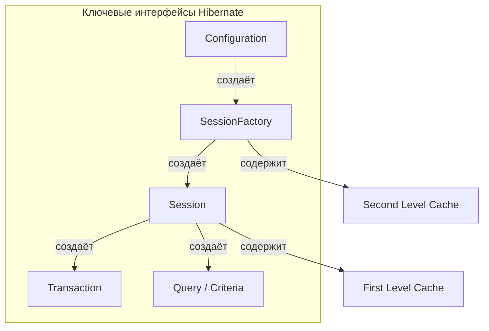
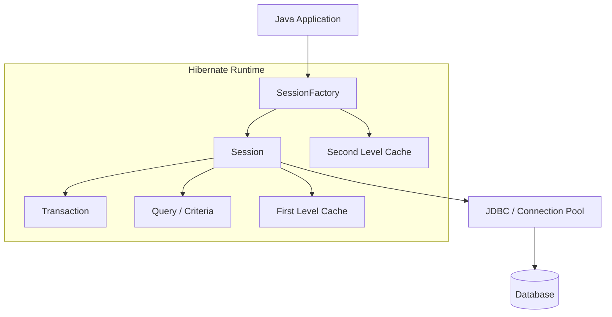
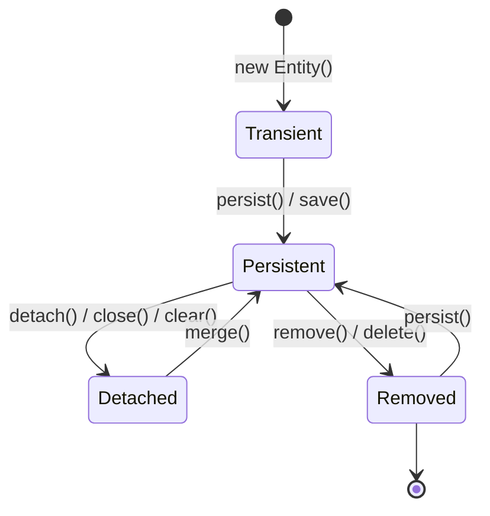
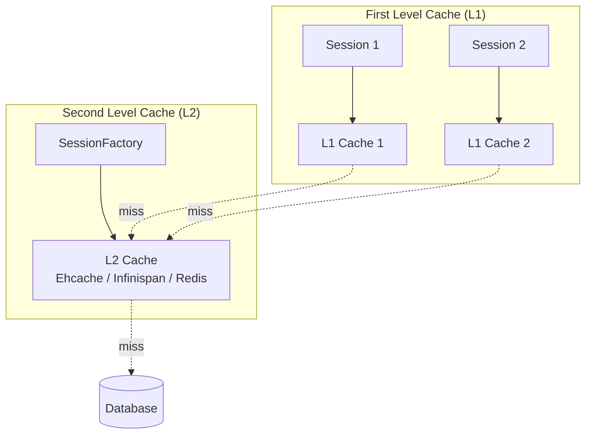
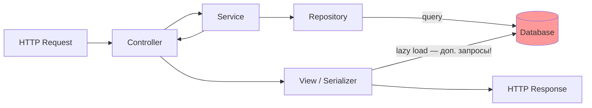

# Вопросы на собеседовании: `Hibernate`

Полное покрытие `Hibernate ORM`: маппинги, `Session`, lazy loading, N+1, кэширование, состояния entity, `Criteria API`, `JPQL`, транзакции, блокировки, наследование, batch processing.

Краткое введение: **Hibernate** — самая популярная реализация спецификации `JPA` для работы с реляционными БД в `Java`. На собеседовании проверяют глубокое понимание маппингов, жизненного цикла сущностей, механизмов кэширования, стратегий загрузки, N+1 проблемы, управления транзакциями и блокировок. Знание `Hibernate` тесно связано с [Spring Data JPA](../frameworks/spring/spring-data-jpa-interview.md) и [SQL](sql-interview.md).

## Полезные ссылки

### Официальная документация

- [Hibernate ORM Documentation](https://hibernate.org/orm/documentation/) — основная документация
- [Hibernate User Guide 6.x](https://docs.jboss.org/hibernate/orm/6.4/userguide/html_single/Hibernate_User_Guide.html) — руководство пользователя
- [JPA Specification](https://jakarta.ee/specifications/persistence/) — спецификация Jakarta Persistence

### Статьи Baeldung

- [N+1 Problem in Hibernate and Spring Data JPA](https://www.baeldung.com/spring-hibernate-n1-problem) — проблема N+1 и решения
- [Hibernate Second-Level Cache](https://www.baeldung.com/hibernate-second-level-cache) — кэш второго уровня
- [Hibernate Entity Lifecycle](https://www.baeldung.com/hibernate-entity-lifecycle) — жизненный цикл сущностей
- [Hibernate Inheritance Mapping](https://www.baeldung.com/hibernate-inheritance) — стратегии наследования
- [Optimistic Locking in JPA](https://www.baeldung.com/jpa-optimistic-locking) — оптимистичная блокировка
- [Pessimistic Locking in JPA](https://www.baeldung.com/jpa-pessimistic-locking) — пессимистичная блокировка
- [Batch Insert/Update with Hibernate/JPA](https://www.baeldung.com/jpa-hibernate-batch-insert-update) — batch-операции
- [JPA and Hibernate – Criteria vs. JPQL vs. HQL Query](https://www.baeldung.com/jpql-hql-criteria-query) — сравнение подходов к запросам
- [FetchMode in Hibernate](https://www.baeldung.com/hibernate-fetchmode) — стратегии загрузки связанных сущностей

## Содержание

- [Полезные ссылки](#полезные-ссылки)
- [See also](#see-also)

**Основы Hibernate и JPA**
- [Q1. (!) Что такое `Hibernate ORM` и чем он отличается от `JPA`?](#q1--что-такое-hibernate-orm-и-чем-он-отличается-от-jpa)
- [Q2. (!) Каковы преимущества `Hibernate` перед `JDBC`?](#q2--каковы-преимущества-hibernate-перед-jdbc)
- [Q3. (!) Назовите ключевые интерфейсы `Hibernate`](#q3--назовите-ключевые-интерфейсы-hibernate)
- [Q4. Что такое `Session` и `SessionFactory`?](#q4-что-такое-session-и-sessionfactory)
- [Q5. Является ли `Session` потокобезопасной?](#q5-является-ли-session-потокобезопасной)
- [Q6. Объясните архитектуру `Hibernate`](#q6-объясните-архитектуру-hibernate)

**Жизненный цикл сущностей**
- [Q7. (!) Какие состояния может иметь `Entity`?](#q7--какие-состояния-может-иметь-entity)
- [Q8. (!) Что такое `Dirty Checking` и как работает `flush`?](#q8--что-такое-dirty-checking-и-как-работает-flush)
- [Q9. В чём разница между `persist()`, `save()`, `merge()` и `update()`?](#q9-в-чём-разница-между-persist-save-merge-и-update)
- [Q10. В чём разница между `get()` и `load()`?](#q10-в-чём-разница-между-get-и-load)
- [Q11. Зачем `Entity` нужен конструктор без аргументов?](#q11-зачем-entity-нужен-конструктор-без-аргументов)
- [Q12. (!) Можно ли объявить `Entity` класс `final`?](#q12--можно-ли-объявить-entity-класс-final)

**Маппинг и аннотации**
- [Q13. Какие основные аннотации `JPA` используются для маппинга?](#q13-какие-основные-аннотации-jpa-используются-для-маппинга)
- [Q14. (!) Что такое `Hibernate Inheritance Mapping`?](#q14--что-такое-hibernate-inheritance-mapping)
- [Q15. Как маппить связь `One-To-Many` / `Many-To-One`?](#q15-как-маппить-связь-one-to-many--many-to-one)
- [Q16. Как маппить связь `Many-To-Many`?](#q16-как-маппить-связь-many-to-many)
- [Q17. В чём разница между `@JoinColumn` и `mappedBy`?](#q17-в-чём-разница-между-joincolumn-и-mappedby)
- [Q18. Что такое `@Embeddable` и `@Embedded`?](#q18-что-такое-embeddable-и-embedded)

**Lazy Loading и стратегии загрузки**
- [Q19. (!) Что такое `Lazy Loading` и `Eager Loading`?](#q19--что-такое-lazy-loading-и-eager-loading)
- [Q20. (!) Что такое проблема N+1?](#q20--что-такое-проблема-n1)
- [Q21. (!) Как решить проблему N+1?](#q21--как-решить-проблему-n1)
- [Q22. Что такое `LazyInitializationException` и как его избежать?](#q22-что-такое-lazyinitializationexception-и-как-его-избежать)
- [Q23. Что такое `Entity Graph`?](#q23-что-такое-entity-graph)

**Кэширование**
- [Q24. (!) В чём разница между `First Level Cache` и `Second Level Cache`?](#q24--в-чём-разница-между-first-level-cache-и-second-level-cache)
- [Q25. Как настроить кэш второго уровня?](#q25-как-настроить-кэш-второго-уровня)
- [Q26. Что такое `Query Cache`?](#q26-что-такое-query-cache)
- [Q27. (!) Какие `Concurrency Strategy` доступны для кэша?](#q27--какие-concurrency-strategy-доступны-для-кэша)

**Запросы: HQL, JPQL и Criteria API**
- [Q28. Что такое `HQL` и `JPQL`?](#q28-что-такое-hql-и-jpql)
- [Q29. Что такое `Criteria API`?](#q29-что-такое-criteria-api)
- [Q30. Что такое `NamedQuery`?](#q30-что-такое-namedquery)
- [Q31. Поддерживает ли `Hibernate` нативные `SQL`-запросы?](#q31-поддерживает-ли-hibernate-нативные-sql-запросы)
- [Q32. Подвержен ли `Hibernate` `SQL Injection`?](#q32-подвержен-ли-hibernate-sql-injection)

**Транзакции и блокировки**
- [Q33. (!) Что такое `@Version` и оптимистичная блокировка?](#q33--что-такое-version-и-оптимистичная-блокировка)
- [Q34. В чём разница между оптимистичной и пессимистичной блокировкой?](#q34-в-чём-разница-между-оптимистичной-и-пессимистичной-блокировкой)
- [Q35. Как работают транзакции в `Hibernate`?](#q35-как-работают-транзакции-в-hibernate)

**Производительность и оптимизация**
- [Q36. (!) Что такое `Batch Processing` в `Hibernate`?](#q36--что-такое-batch-processing-в-hibernate)
- [Q37. В чём разница между `setMaxResults()` и `setFetchSize()`?](#q37-в-чём-разница-между-setmaxresults-и-setfetchsize)
- [Q38. Что такое `@Immutable`?](#q38-что-такое-immutable)
- [Q39. Как использовать `Hibernate Statistics` для мониторинга?](#q39-как-использовать-hibernate-statistics-для-мониторинга)

**Конфигурация и интеграция**
- [Q40. Как настроить `Hibernate` в `Spring Boot`?](#q40-как-настроить-hibernate-в-spring-boot)
- [Q41. В чём разница между `getCurrentSession()` и `openSession()`?](#q41-в-чём-разница-между-getcurrentsession-и-opensession)
- [Q42. Что такое `Hibernate Dialect`?](#q42-что-такое-hibernate-dialect)

**Продвинутые темы**
- [Q43. (!) Что такое `Open-in-View` антипаттерн и как его избежать?](#q43--что-такое-open-in-view-антипаттерн-и-как-его-избежать)
- [Q44. Что такое `Hibernate Envers` и как организовать аудит изменений?](#q44-что-такое-hibernate-envers-и-как-организовать-аудит-изменений)
- [Q45. (!) Как использовать `Projections` для оптимизации запросов?](#q45--как-использовать-projections-для-оптимизации-запросов)
- [Q46. Что такое `StatelessSession` и когда его использовать?](#q46-что-такое-statelesssession-и-когда-его-использовать)
- [Q47. (!) Какие типичные ошибки производительности в `Hibernate`?](#q47--какие-типичные-ошибки-производительности-в-hibernate)
- [Q48. Как тестировать `Hibernate`-код?](#q48-как-тестировать-hibernate-код)

---

## Q1. (!) Что такое `Hibernate ORM` и чем он отличается от `JPA`?

**JPA** (`Jakarta Persistence API`, ранее `Java Persistence API`) — это **спецификация**, определяющая стандартный API для ORM в Java. **Hibernate** — это **реализация** этой спецификации (наряду с `EclipseLink`, `OpenJPA` и др.).

Ключевые различия:

| Аспект | `JPA` | `Hibernate` |
|--------|-------|-------------|
| Тип | Спецификация (интерфейсы) | Реализация (конкретные классы) |
| Пакет | `jakarta.persistence.*` | `org.hibernate.*` |
| Запросы | `JPQL` | `HQL` (надмножество `JPQL`) |
| Кэш L2 | Определяет API | Поддерживает `Ehcache`, `Infinispan` и др. |
| Расширения | Нет | `@Formula`, `@Where`, `@BatchSize`, `@NaturalId` и др. |

```java
// JPA-стандартный код — переносимый между реализациями
@Entity
@Table(name = "users")
public class User {
    @Id
    @GeneratedValue(strategy = GenerationType.IDENTITY)
    private Long id;

    @Column(nullable = false, length = 100)
    private String name;

    @OneToMany(mappedBy = "user", cascade = CascadeType.ALL, orphanRemoval = true)
    private List<Order> orders = new ArrayList<>();
}
```

На собеседовании важно подчеркнуть: рекомендуется программировать против `JPA` API (переносимость), а специфичные аннотации `Hibernate` использовать только когда стандартных возможностей недостаточно.

## Q2. (!) Каковы преимущества `Hibernate` перед `JDBC`?

Главное преимущество: `Hibernate` убирает рутину `JDBC` и даёт работать с объектами, а не со строками результата. Вы описываете маппинг один раз аннотациями — а `Hibernate` сам генерирует SQL, заполняет объекты из `ResultSet`, отслеживает изменения и синхронизирует их с БД.

| Аспект | `JDBC` | `Hibernate` |
|--------|--------|-------------|
| Код | Много boilerplate (`ResultSet`, `PreparedStatement`) | Чистый код, работа с объектами |
| SQL | Ручное написание, зависимость от диалекта | `HQL`/`JPQL` — независимость от БД |
| Транзакции | Ручное управление (`commit`/`rollback`) | Декларативное через `@Transactional` |
| Исключения | Checked `SQLException` | Unchecked `HibernateException` |
| Кэширование | Нет встроенного | L1 + L2 кэш |
| Маппинг | Ручной маппинг `ResultSet` → объект | Автоматический через аннотации |
| Ассоциации | `JOIN`-ы вручную | `@OneToMany`, `@ManyToMany` и др. |

```java
// JDBC — много boilerplate
try (Connection conn = dataSource.getConnection();
     PreparedStatement ps = conn.prepareStatement("SELECT * FROM users WHERE id = ?")) {
    ps.setLong(1, userId);
    ResultSet rs = ps.executeQuery();
    if (rs.next()) {
        User user = new User();
        user.setId(rs.getLong("id"));
        user.setName(rs.getString("name"));
    }
}

// Hibernate — чистый код
User user = session.get(User.class, userId);
```

**Обратная сторона:** за удобство платят потерей контроля над генерируемым SQL и более сложной отладкой производительности (N+1, lazy loading, кэширование). Поэтому на собеседовании важно показать не только плюсы, но и понимание этих ловушек — им посвящена бо́льшая часть остальных вопросов.

## Q3. (!) Назовите ключевые интерфейсы `Hibernate`



Интерфейсы выстроены в цепочку «конфигурация → фабрика → сессия → транзакция/запрос» — каждый следующий создаётся предыдущим. Запомнить порядок проще, чем зубрить список:

1. **`Configuration`** — читает настройки из `hibernate.cfg.xml` или `persistence.xml` и регистрирует маппинги. Используется один раз на старте, чтобы собрать `SessionFactory`.
2. **`SessionFactory`** — потокобезопасная фабрика сессий, один экземпляр на приложение. Дорогая в создании, поэтому живёт всё время работы приложения; хранит кэш L2 и метаданные маппинга.
3. **`Session`** — единица работы (`unit of work`): короткоживущая, не потокобезопасная, содержит кэш L1 (persistence context).
4. **`Transaction`** — управляет границами транзакции (`begin`, `commit`, `rollback`), обёртка над JDBC/JTA-транзакцией.
5. **`Query`** / **`CriteriaBuilder`** — выполнение запросов `HQL`/`JPQL`/`Criteria`/`SQL`.

## Q4. Что такое `Session` и `SessionFactory`?

**`SessionFactory`** — тяжёлый потокобезопасный объект, создаётся один раз при старте приложения. Хранит метаданные маппинга, кэш второго уровня, пулы соединений. Создание `SessionFactory` — дорогая операция (парсинг маппингов, валидация).

**`Session`** — лёгкий объект, представляющий единицу работы с БД. Содержит **кэш первого уровня** (Persistence Context): все загруженные сущности хранятся в памяти сессии и повторно не запрашиваются из БД. Типичный жизненный цикл: открыть → выполнить операции → закрыть.

```java
// Классический подход (без Spring)
SessionFactory sf = new Configuration().configure().buildSessionFactory();

try (Session session = sf.openSession()) {
    Transaction tx = session.beginTransaction();
    User user = session.get(User.class, 1L); // загружается в L1 cache
    User same = session.get(User.class, 1L); // берётся из L1 cache, SQL не выполняется
    assert user == same; // true — один и тот же объект
    tx.commit();
}
```

В `Spring` управление `Session` берёт на себя фреймворк через `@Transactional` — подробнее в [Spring Data JPA](../frameworks/spring/spring-data-jpa-interview.md).

## Q5. Является ли `Session` потокобезопасной?

Нет. **`Session`** не потокобезопасна. Одновременный доступ из нескольких потоков к одной `Session` приводит к гонкам, повреждению кэша L1 и непредсказуемому поведению.

**Правило**: одна `Session` на один поток (обычно — на один HTTP-запрос). В `Spring` при использовании `@Transactional` каждый поток получает свою сессию через `ThreadLocal`-привязку. Не храните `Session` в статическом поле и не передавайте между потоками.

**`SessionFactory`**, напротив, **потокобезопасна** и должна быть синглтоном.

## Q6. Объясните архитектуру `Hibernate`



`Hibernate` — это прослойка между объектной моделью приложения и реляционной БД. Сверху вниз архитектура делится на слои:

1. **Java Application** — доменные сущности и бизнес-логика, которые не знают про SQL.
2. **Hibernate Framework** — `SessionFactory`, `Session`, `Transaction`, `Query`: здесь объекты превращаются в SQL и обратно.
3. **Internal APIs** — `JDBC`, `JTA` (Java Transaction API), `JNDI`: через них `Hibernate` реально общается с БД и менеджером транзакций.
4. **Database** — `PostgreSQL`, `MySQL`, `Oracle` и др.

Как это работает вместе: `SessionFactory` (один на приложение) по запросу выдаёт `Session`. `Session` держит persistence context (L1 cache), отслеживает изменения сущностей (dirty checking) и сбрасывает их в БД при flush. `Transaction` гарантирует атомарность набора операций. Всё это в конечном счёте транслируется в обычные `JDBC`-вызовы — `Hibernate` не заменяет драйвер, а надстраивается над ним.

## Q7. (!) Какие состояния может иметь `Entity`?

Сущность `Hibernate` живёт в одном из четырёх состояний — **Transient, Persistent, Detached, Removed** — и состояние определяет, отслеживаются ли изменения объекта и попадут ли они в БД. Это центральная концепция: непонимание состояний — источник большинства багов вроде «почему мои изменения не сохранились» или «почему сохранились без вызова `save()`».



| Состояние | Описание | В Persistence Context? | Есть в БД? |
|-----------|----------|----------------------|------------|
| **Transient** | Новый объект, не связан с сессией | Нет | Нет |
| **Persistent** (Managed) | Привязан к сессии, tracked dirty checking | Да | Да (или будет при flush) |
| **Detached** | Был persistent, но сессия закрыта | Нет | Да |
| **Removed** | Помечен на удаление | Да | Будет удалён при flush |

```java
User user = new User("Alice"); // Transient

session.persist(user);         // Persistent (managed)
user.setName("Bob");           // dirty checking отследит изменение

session.detach(user);          // Detached — изменения не синхронизируются

User merged = session.merge(user); // снова Persistent (merged — новый managed объект)

session.remove(merged);        // Removed — удалится при flush/commit
```

## Q8. (!) Что такое `Dirty Checking` и как работает `flush`?

**Dirty Checking** — механизм `Hibernate`, который автоматически обнаруживает изменённые (dirty) сущности в persistence context и генерирует `UPDATE` SQL при `flush`. Не требует явного вызова `update()`.

**Как это работает**: при загрузке сущности `Hibernate` сохраняет **snapshot** её начального состояния. При `flush` сравнивает текущие значения полей с snapshot — если есть различия, генерируется `UPDATE`.

**`flush()`** — синхронизация persistence context с БД. Происходит:
1. Автоматически перед `commit()`
2. Автоматически перед выполнением `JPQL`/`HQL` запроса (чтобы запрос видел актуальные данные)
3. Вручную — `session.flush()`

```java
@Transactional
public void updateUserName(Long id, String newName) {
    User user = entityManager.find(User.class, id);
    user.setName(newName);
    // НЕ нужно вызывать save() или update()!
    // Dirty checking сам обнаружит изменение и сгенерирует UPDATE при commit
}
```

**`FlushMode`** — управляет моментом flush:
- `AUTO` (по умолчанию) — перед запросом и перед commit
- `COMMIT` — только перед commit (может вернуть устаревшие данные из запроса)
- `MANUAL` — только при явном вызове `flush()`

## Q9. В чём разница между `persist()`, `save()`, `merge()` и `update()`?

Коротко: `persist`/`save` — для **новых** (transient) объектов, `merge`/`update` — для **отсоединённых** (detached). `persist` и `merge` — стандарт `JPA`; `save` и `update` — устаревшие методы `Hibernate`, делающие почти то же. Главная ловушка — `merge` не делает переданный объект управляемым, а возвращает **новую** управляемую копию.

| Метод | Стандарт | Поведение | Возврат |
|-------|----------|-----------|---------|
| `persist()` | JPA | Делает transient → persistent. Не гарантирует немедленный `INSERT` | `void` |
| `save()` | Hibernate | Делает transient → persistent. Возвращает id. Может выполнить `INSERT` сразу | `Serializable` (id) |
| `merge()` | JPA | Копирует состояние detached объекта в managed копию | Managed entity |
| `update()` | Hibernate | Переприсоединяет detached объект. Выбрасывает исключение если уже есть в контексте | `void` |

```java
// persist() — JPA стандарт, рекомендуется
User user = new User("Alice");
entityManager.persist(user); // user теперь managed

// merge() — для detached объектов
User detached = ... ; // получен из другой сессии, десериализации и т.д.
User managed = entityManager.merge(detached);
// managed — управляемая копия, detached — по-прежнему detached!
managed.setName("Bob"); // будет синхронизировано с БД
```

**Рекомендация**: использовать `JPA`-стандартные `persist()` и `merge()` вместо `Hibernate`-специфичных `save()` и `update()`.

## Q10. В чём разница между `get()` и `load()`?

Различие — в моменте запроса к БД и в поведении при отсутствии записи. `get()` (JPA: `find()`) выполняет `SELECT` сразу и вернёт `null`, если записи нет. `load()` (JPA: `getReference()`) возвращает **прокси без запроса**, а `SELECT` откладывается до первого обращения к полю; если записи нет — исключение прилетит именно тогда. Поэтому `load()`/`getReference()` берут, когда уверены в существовании записи и нужно лишь сослаться на неё.

| Аспект | `get()` / `find()` | `load()` / `getReference()` |
|--------|--------------------|-----------------------------|
| Загрузка | Немедленная (`SELECT` сразу) | Ленивая (возвращает proxy) |
| Если не найден | Возвращает `null` | Выбрасывает `ObjectNotFoundException` при обращении |
| Proxy | Нет — реальный объект | Да — proxy до первого обращения к полю |
| Когда использовать | Когда не уверены, что запись существует | Когда точно знаете, что запись существует |

```java
// get/find — немедленный SELECT
User user = session.get(User.class, 1L);       // Hibernate
User user = entityManager.find(User.class, 1L); // JPA
if (user == null) { /* не найден */ }

// load/getReference — возвращает proxy, SELECT при первом обращении к полю
User ref = session.load(User.class, 1L);          // Hibernate
User ref = entityManager.getReference(User.class, 1L); // JPA
// SELECT ещё не выполнен
String name = ref.getName(); // SELECT выполняется здесь
```

`getReference()` полезен, когда нужно только установить связь (FK), не загружая всю сущность:

```java
Order order = new Order();
order.setUser(entityManager.getReference(User.class, userId)); // без SELECT для User
entityManager.persist(order);
```

## Q11. Зачем `Entity` нужен конструктор без аргументов?

`Hibernate` создаёт экземпляры сущностей через **рефлексию** при загрузке из БД. Для этого необходим конструктор без аргументов (`no-arg constructor`). Это **требование спецификации JPA**.

Конструктор может быть `public` или `protected` (для инкапсуляции). Если его нет — `Hibernate` выбросит `InstantiationException`.

```java
@Entity
public class User {
    @Id
    @GeneratedValue(strategy = GenerationType.IDENTITY)
    private Long id;
    private String name;

    protected User() {} // для Hibernate — может быть protected

    public User(String name) { // для бизнес-логики
        this.name = name;
    }
}
```

## Q12. (!) Можно ли объявить `Entity` класс `final`?

**Не рекомендуется.** `Hibernate` создаёт **прокси-подклассы** для ленивой загрузки (`lazy loading`). Если класс `final` — его нельзя расширить, и прокси создать невозможно.

Последствия:
- Ленивая загрузка для ассоциаций к этой сущности **не будет работать**
- `load()` / `getReference()` вернёт реальный объект вместо прокси
- Потенциальное снижение производительности

```java
// ❌ Плохо — Hibernate не сможет создать proxy
@Entity
public final class User { ... }

// ✅ Хорошо — @Immutable для данных «только чтение»
@Entity
@Immutable
public class Country { ... }
```

Если нужна неизменяемость данных — используйте `@Immutable`, а не `final` на классе.

## Q13. Какие основные аннотации `JPA` используются для маппинга?

Базовый набор — это `@Entity` + `@Table` (что и куда маппится), `@Id` + `@GeneratedValue` (первичный ключ), `@Column` (тонкая настройка колонок), аннотации связей (`@ManyToOne`, `@OneToMany` и др.) и служебные (`@Transient`, `@Version`, `@Enumerated`). Ниже — типичная сущность со всеми ключевыми аннотациями в контексте:

```java
@Entity                          // Помечает класс как сущность
@Table(name = "orders")          // Имя таблицы
public class Order {

    @Id                           // Первичный ключ
    @GeneratedValue(strategy = GenerationType.IDENTITY) // Стратегия генерации ID
    private Long id;

    @Column(name = "order_date", nullable = false) // Маппинг колонки
    private LocalDateTime orderDate;

    @Enumerated(EnumType.STRING)  // Enum как строка (не ordinal!)
    private OrderStatus status;

    @ManyToOne(fetch = FetchType.LAZY)  // Связь N:1
    @JoinColumn(name = "user_id")       // FK колонка
    private User user;

    @OneToMany(mappedBy = "order", cascade = CascadeType.ALL, orphanRemoval = true)
    private List<OrderItem> items = new ArrayList<>();

    @Transient                    // Поле не маппится в БД
    private BigDecimal calculatedTotal;

    @Version                      // Оптимистичная блокировка
    private Integer version;

    @CreationTimestamp             // Hibernate — автоматическая дата создания
    private LocalDateTime createdAt;
}
```

Ключевые стратегии `@GeneratedValue`:
- **`IDENTITY`** — автоинкремент БД (не подходит для batch insert)
- **`SEQUENCE`** — sequence в БД (рекомендуется для `PostgreSQL`)
- **`TABLE`** — отдельная таблица для генерации (медленнее всего)
- **`AUTO`** — `Hibernate` выбирает стратегию сам

## Q14. (!) Что такое `Hibernate Inheritance Mapping`?

Inheritance Mapping — это способ уложить **иерархию Java-классов** (базовый класс и наследники) в реляционные таблицы, у которых наследования нет. `Hibernate` предлагает три стратегии, и каждая по-своему разменивает скорость запросов на нормализацию данных:

```mermaid
graph TD
    subgraph "SINGLE_TABLE"
        ST[vehicles<br/>id | type | make | payload | seats]
    end

    subgraph "JOINED"
        JV[vehicles<br/>id | make] --> JT[trucks<br/>id | payload]
        JV --> JC[cars<br/>id | seats]
    end

    subgraph "TABLE_PER_CLASS"
        TT[trucks<br/>id | make | payload]
        TC[cars<br/>id | make | seats]
    end
```

| Стратегия | Аннотация | Плюсы | Минусы |
|-----------|-----------|-------|--------|
| **Single Table** | `@Inheritance(strategy = SINGLE_TABLE)` | Быстрые запросы, нет JOIN | NULL-колонки, нет NOT NULL constraint |
| **Joined** | `@Inheritance(strategy = JOINED)` | Нормализовано, NOT NULL | Медленные полиморфные запросы (JOIN) |
| **Table Per Class** | `@Inheritance(strategy = TABLE_PER_CLASS)` | Нет NULL, полные таблицы | Медленный UNION для полиморфных запросов |

```java
@Entity
@Inheritance(strategy = InheritanceType.SINGLE_TABLE)
@DiscriminatorColumn(name = "vehicle_type", discriminatorType = DiscriminatorType.STRING)
public abstract class Vehicle {
    @Id @GeneratedValue(strategy = GenerationType.IDENTITY)
    private Long id;
    private String make;
}

@Entity
@DiscriminatorValue("TRUCK")
public class Truck extends Vehicle {
    private Double payload;
}

@Entity
@DiscriminatorValue("CAR")
public class Car extends Vehicle {
    private Integer seats;
}
```

**На собеседовании**: `SINGLE_TABLE` — по умолчанию и чаще всего рекомендуется. `JOINED` — если важна нормализация и NOT NULL. `TABLE_PER_CLASS` — использовать редко.

## Q15. Как маппить связь `One-To-Many` / `Many-To-One`?

Связь `@OneToMany` / `@ManyToOne` — самая распространённая в JPA. Владелец связи (owning side) — сторона с `@JoinColumn` (обычно `@ManyToOne`).

```java
@Entity
public class Department {
    @Id @GeneratedValue(strategy = GenerationType.IDENTITY)
    private Long id;
    private String name;

    @OneToMany(mappedBy = "department", cascade = CascadeType.ALL, orphanRemoval = true)
    private List<Employee> employees = new ArrayList<>();

    // Вспомогательные методы для поддержания консистентности обеих сторон
    public void addEmployee(Employee e) {
        employees.add(e);
        e.setDepartment(this);
    }
    public void removeEmployee(Employee e) {
        employees.remove(e);
        e.setDepartment(null);
    }
}

@Entity
public class Employee {
    @Id @GeneratedValue(strategy = GenerationType.IDENTITY)
    private Long id;
    private String name;

    @ManyToOne(fetch = FetchType.LAZY) // LAZY — best practice для @ManyToOne
    @JoinColumn(name = "department_id")
    private Department department;
}
```

**Важно**: `@ManyToOne` по умолчанию `EAGER` — всегда устанавливайте `fetch = FetchType.LAZY` явно, чтобы избежать проблемы N+1.

## Q16. Как маппить связь `Many-To-Many`?

`@ManyToMany` маппится через **промежуточную (join) таблицу** с двумя внешними ключами — отдельной сущности для связи нет. Одна сторона владеет связью (задаёт `@JoinTable`), вторая помечается `mappedBy`:

```java
@Entity
public class Student {
    @Id @GeneratedValue(strategy = GenerationType.IDENTITY)
    private Long id;

    @ManyToMany(cascade = {CascadeType.PERSIST, CascadeType.MERGE})
    @JoinTable(
        name = "student_course",
        joinColumns = @JoinColumn(name = "student_id"),
        inverseJoinColumns = @JoinColumn(name = "course_id")
    )
    private Set<Course> courses = new HashSet<>(); // Set, не List!
}

@Entity
public class Course {
    @Id @GeneratedValue(strategy = GenerationType.IDENTITY)
    private Long id;

    @ManyToMany(mappedBy = "courses")
    private Set<Student> students = new HashSet<>();
}
```

**Best practices**:
- Используйте `Set`, а не `List` — `Hibernate` генерирует более эффективный SQL для `Set` при удалении элементов
- Не используйте `CascadeType.ALL` / `REMOVE` на `@ManyToMany` — это может удалить связанные сущности при удалении из коллекции
- Для join-таблиц с дополнительными полями (дата записи, оценка и т.д.) — создавайте отдельную `@Entity`

## Q17. В чём разница между `@JoinColumn` и `mappedBy`?

**`@JoinColumn`** — маркер **owning side** (владелец связи). Определяет FK-колонку в таблице владельца.

**`mappedBy`** — маркер **inverse side** (обратная сторона). Указывает имя поля на стороне владельца.

```java
// Owning side — Employee владеет связью, в таблице employee есть FK department_id
@ManyToOne
@JoinColumn(name = "department_id")
private Department department;

// Inverse side — Department не владеет связью, ссылается на поле "department" у Employee
@OneToMany(mappedBy = "department")
private List<Employee> employees;
```

**Правило**: FK всегда хранится на стороне с `@JoinColumn`. Изменения на стороне `mappedBy` **не синхронизируются** с БД — нужно обновлять owning side.

## Q18. Что такое `@Embeddable` и `@Embedded`?

`@Embeddable` — value object, который не имеет собственного id и таблицы. Его поля встраиваются в таблицу родительской сущности.

```java
@Embeddable
public class Address {
    private String city;
    private String street;
    @Column(name = "zip_code")
    private String zipCode;
}

@Entity
public class Customer {
    @Id @GeneratedValue(strategy = GenerationType.IDENTITY)
    private Long id;

    @Embedded
    private Address homeAddress;

    @Embedded
    @AttributeOverrides({
        @AttributeOverride(name = "city", column = @Column(name = "work_city")),
        @AttributeOverride(name = "street", column = @Column(name = "work_street")),
        @AttributeOverride(name = "zipCode", column = @Column(name = "work_zip"))
    })
    private Address workAddress;
}
```

Результат — **одна таблица** `customer` с колонками: `id`, `city`, `street`, `zip_code`, `work_city`, `work_street`, `work_zip`.

## Q19. (!) Что такое `Lazy Loading` и `Eager Loading`?

Это две стратегии того, **когда** загружать связанные сущности. **LAZY** откладывает загрузку до первого обращения, **EAGER** грузит всё сразу вместе с родителем. Выбор напрямую влияет на число SQL-запросов и на риск получить либо проблему N+1, либо лишние данные.

| Стратегия | Описание | По умолчанию для |
|-----------|----------|-----------------|
| **`LAZY`** | Данные загружаются при первом обращении | `@OneToMany`, `@ManyToMany` |
| **`EAGER`** | Данные загружаются сразу вместе с родительской сущностью | `@ManyToOne`, `@OneToOne` |

**`LAZY`** — `Hibernate` возвращает прокси-объект или обёртку коллекции. Реальный `SELECT` выполняется при первом вызове метода (кроме `getId()`).

**Best practice**: всегда устанавливайте `FetchType.LAZY` на все ассоциации и управляйте загрузкой через `JOIN FETCH`, `@EntityGraph` или `@BatchSize` — это предотвращает неожиданную загрузку ненужных данных.

```java
@Entity
public class Order {
    @ManyToOne(fetch = FetchType.LAZY) // явно LAZY для @ManyToOne
    @JoinColumn(name = "user_id")
    private User user;

    @OneToMany(mappedBy = "order", fetch = FetchType.LAZY) // LAZY по умолчанию
    private List<OrderItem> items;
}
```

## Q20. (!) Что такое проблема N+1?

Проблема **N+1** — ситуация, когда `Hibernate` выполняет **1 запрос** для получения списка из N сущностей, а затем **N дополнительных запросов** для загрузки связанных данных каждой сущности.

```java
// 1 запрос: SELECT * FROM authors
List<Author> authors = session.createQuery("FROM Author", Author.class).list();

// N запросов: для каждого автора — SELECT * FROM books WHERE author_id = ?
for (Author author : authors) {
    System.out.println(author.getBooks().size()); // каждый вызов — отдельный SELECT
}
```

Итого: **1 + N запросов** вместо одного. При N = 1000 авторов — 1001 запрос к БД.

```
-- 1-й запрос
SELECT * FROM authors;

-- 2-й запрос (автор #1)
SELECT * FROM books WHERE author_id = 1;
-- 3-й запрос (автор #2)
SELECT * FROM books WHERE author_id = 2;
-- ... и так N раз
```

Эта проблема — одна из главных причин performance-проблем в `Hibernate`-приложениях. Подробнее о запросах в [вопросах по SQL](sql-interview.md).

## Q21. (!) Как решить проблему N+1?

Существует несколько способов, от самого рекомендуемого к менее предпочтительному:

**1. `JOIN FETCH` в JPQL** (рекомендуется):

```java
// 1 запрос с JOIN: SELECT a.*, b.* FROM authors a JOIN books b ON a.id = b.author_id
List<Author> authors = entityManager
    .createQuery("SELECT a FROM Author a JOIN FETCH a.books", Author.class)
    .getResultList();
```

**2. `@EntityGraph`** (декларативный подход):

```java
@Entity
@NamedEntityGraph(name = "Author.withBooks",
    attributeNodes = @NamedAttributeNode("books"))
public class Author { ... }

// Использование
EntityGraph<?> graph = entityManager.getEntityGraph("Author.withBooks");
List<Author> authors = entityManager
    .createQuery("SELECT a FROM Author a", Author.class)
    .setHint("jakarta.persistence.fetchgraph", graph)
    .getResultList();
```

**3. `@BatchSize`** (уменьшает N+1 до N/batch+1):

```java
@Entity
public class Author {
    @OneToMany(mappedBy = "author")
    @BatchSize(size = 25) // загружает книги пачками по 25 авторов
    private List<Book> books;
}
// Вместо 1+N запросов будет 1 + ceil(N/25)
```

**4. `@Fetch(FetchMode.SUBSELECT)`**:

```java
@OneToMany(mappedBy = "author")
@Fetch(FetchMode.SUBSELECT)
private List<Book> books;
// 2 запроса: 1 для авторов + 1 subselect для всех книг
```

**Не рекомендуется**: менять `FetchType.LAZY` на `FetchType.EAGER` — это решит N+1, но создаст проблему избыточной загрузки данных во всех запросах.

## Q22. Что такое `LazyInitializationException` и как его избежать?

**`LazyInitializationException`** возникает, когда вы обращаетесь к lazy-ассоциации (прокси или коллекции) уже после закрытия `Session`. Причина в том, что для дозагрузки данных прокси нужна живая сессия и соединение с БД — а их больше нет. Классический сценарий: данные загрузили в сервисе, сессию закрыли, а lazy-поле «развернули» уже в контроллере или сериализаторе.

```java
User user;
try (Session session = sf.openSession()) {
    user = session.get(User.class, 1L);
} // Session закрыта

user.getOrders().size(); // LazyInitializationException!
```

Способы решения:
1. **`JOIN FETCH`** в запросе — загрузить нужные данные заранее (рекомендуется)
2. **`@EntityGraph`** — декларативно указать что загружать
3. **`Open Session in View`** (`spring.jpa.open-in-view=true`) — Session остаётся открытой до конца HTTP-запроса (anti-pattern для production, может привести к N+1)
4. **DTO projection** — возвращать DTO с нужными полями вместо entity

## Q23. Что такое `Entity Graph`?

**Entity Graph** — механизм `JPA` 2.1+ для декларативного определения, какие ассоциации загрузить вместе с сущностью. Альтернатива `JOIN FETCH` в `JPQL`.

```java
// Через аннотацию
@Entity
@NamedEntityGraph(name = "Order.withItems",
    attributeNodes = {
        @NamedAttributeNode("items"),
        @NamedAttributeNode("user")
    })
public class Order { ... }

// Через API (программно)
EntityGraph<Order> graph = entityManager.createEntityGraph(Order.class);
graph.addAttributeNodes("items", "user");

Map<String, Object> hints = Map.of("jakarta.persistence.loadgraph", graph);
Order order = entityManager.find(Order.class, orderId, hints);
```

Два типа hint:
- **`fetchgraph`** — загружает ТОЛЬКО указанные атрибуты (остальные LAZY)
- **`loadgraph`** — загружает указанные + атрибуты с дефолтным EAGER

В [Spring Data JPA](../frameworks/spring/spring-data-jpa-interview.md) Entity Graph используется через аннотацию `@EntityGraph` на методе репозитория.

## Q24. (!) В чём разница между `First Level Cache` и `Second Level Cache`?

Ключевое различие — **область видимости и время жизни**. L1 привязан к одной `Session` и живёт, пока та открыта; L2 общий для всего `SessionFactory` и переживает отдельные сессии. L1 включён всегда и не отключается; L2 по умолчанию выключен и требует отдельного провайдера.



| Аспект | L1 (First Level) | L2 (Second Level) |
|--------|------------------|-------------------|
| Область | Одна `Session` | `SessionFactory` (все сессии) |
| По умолчанию | Включён, нельзя отключить | Выключен |
| Жизненный цикл | Пока `Session` открыта | Пока приложение работает |
| Настройка | Не нужна | Требует провайдера (Ehcache, Infinispan) |
| Потокобезопасность | Нет (одна сессия = один поток) | Да |

Порядок поиска: **L1 cache → L2 cache → Database**.

```java
// L1 cache в действии
Session session = sf.openSession();
User u1 = session.get(User.class, 1L); // SELECT из БД, сохраняется в L1
User u2 = session.get(User.class, 1L); // Берётся из L1, SQL не выполняется
assert u1 == u2; // true — один и тот же объект
session.close(); // L1 очищается
```

## Q25. Как настроить кэш второго уровня?

Для подключения L2 cache (на примере `Ehcache`):

**1. Зависимость** (Gradle):
```groovy
implementation 'org.hibernate.orm:hibernate-jcache'
implementation 'org.ehcache:ehcache:3.10.8'
```

**2. Конфигурация** (`application.yml`):
```yaml
spring:
  jpa:
    properties:
      hibernate:
        cache:
          use_second_level_cache: true
          region.factory_class: org.hibernate.cache.jcache.JCacheRegionFactory
        javax:
          cache:
            provider: org.ehcache.jsr107.EhcacheCachingProvider
```

**3. Аннотации на сущности**:
```java
@Entity
@Cacheable                                           // JPA стандарт
@Cache(usage = CacheConcurrencyStrategy.READ_WRITE)  // Hibernate — стратегия
public class Country {
    @Id
    private Long id;
    private String name;
}
```

L2 cache наиболее эффективен для сущностей, которые **часто читаются и редко изменяются** (справочники, конфигурации).

## Q26. Что такое `Query Cache`?

**Query Cache** кэширует **результаты запросов** (список ID сущностей), а не сами сущности. Работает в паре с L2 cache — по ID из query cache достаются сущности из L2 cache.

```java
// Включение
// hibernate.cache.use_query_cache = true

// Использование
List<Country> countries = entityManager
    .createQuery("SELECT c FROM Country c WHERE c.region = :region", Country.class)
    .setParameter("region", "Europe")
    .setHint("org.hibernate.cacheable", true)
    .getResultList();
```

**Когда использовать**: для запросов, которые выполняются часто с одинаковыми параметрами, по сущностям, которые редко меняются. При любом `INSERT`/`UPDATE`/`DELETE` в таблице — Query Cache для этой таблицы **инвалидируется целиком**.

**Когда НЕ использовать**: для часто изменяемых таблиц — частая инвалидация сведёт на нет выигрыш.

## Q27. (!) Какие `Concurrency Strategy` доступны для кэша?

Стратегии параллелизма для L2 cache определяют, как обрабатываются конкурентные чтения/записи:

| Стратегия | Описание | Когда использовать |
|-----------|----------|--------------------|
| **`READ_ONLY`** | Только чтение, сущность никогда не обновляется | Справочники, enum-таблицы |
| **`NONSTRICT_READ_WRITE`** | Кэш обновляется после commit, возможно чтение устаревших данных | Данные, которые редко меняются и eventual consistency допустима |
| **`READ_WRITE`** | Soft-lock: при обновлении ставится блокировка в кэше | Данные, которые иногда меняются, нужна consistency |
| **`TRANSACTIONAL`** | Полная поддержка XA-транзакций (JTA) | Распределённые транзакции, кластерный кэш |

```java
@Entity
@Cache(usage = CacheConcurrencyStrategy.READ_ONLY)
public class Currency { ... }

@Entity
@Cache(usage = CacheConcurrencyStrategy.READ_WRITE)
public class Product { ... }
```

## Q28. Что такое `HQL` и `JPQL`?

**`JPQL`** (`Jakarta Persistence Query Language`) — стандартный язык запросов `JPA`, объектно-ориентированный (работает с сущностями и полями, не с таблицами и колонками).

**`HQL`** (`Hibernate Query Language`) — надмножество `JPQL` с дополнительными возможностями (`Hibernate`-специфичными).

```java
// JPQL — стандарт JPA
TypedQuery<User> query = entityManager.createQuery(
    "SELECT u FROM User u WHERE u.name LIKE :name AND u.active = true",
    User.class
);
query.setParameter("name", "%Alice%");
List<User> users = query.getResultList();

// JPQL — агрегация
List<Object[]> stats = entityManager.createQuery(
    "SELECT u.department, COUNT(u), AVG(u.salary) " +
    "FROM User u GROUP BY u.department HAVING COUNT(u) > 5"
).getResultList();

// JPQL — JOIN FETCH
List<Author> authors = entityManager.createQuery(
    "SELECT DISTINCT a FROM Author a JOIN FETCH a.books WHERE a.active = true",
    Author.class
).getResultList();

// JPQL — UPDATE (bulk)
int updated = entityManager.createQuery(
    "UPDATE User u SET u.active = false WHERE u.lastLogin < :date"
).setParameter("date", cutoffDate)
 .executeUpdate();
```

## Q29. Что такое `Criteria API`?

**Criteria API** — типобезопасный, программный способ построения запросов. Особенно полезен для **динамических запросов** (фильтры, сортировки, которые зависят от пользовательского ввода).

С `Hibernate 5.2+` устаревший `org.hibernate.Criteria` заменён на стандартный `JPA Criteria API`:

```java
CriteriaBuilder cb = entityManager.getCriteriaBuilder();
CriteriaQuery<User> cq = cb.createQuery(User.class);
Root<User> root = cq.from(User.class);

// Динамическое построение условий
List<Predicate> predicates = new ArrayList<>();

if (nameFilter != null) {
    predicates.add(cb.like(root.get("name"), "%" + nameFilter + "%"));
}
if (minAge != null) {
    predicates.add(cb.greaterThanOrEqualTo(root.get("age"), minAge));
}
if (active != null) {
    predicates.add(cb.equal(root.get("active"), active));
}

cq.where(predicates.toArray(new Predicate[0]));
cq.orderBy(cb.asc(root.get("name")));

List<User> users = entityManager.createQuery(cq).getResultList();
```

**С Metamodel** (compile-time проверка полей):

```java
// User_.name — сгенерированный metamodel, ошибка компиляции при опечатке
predicates.add(cb.like(root.get(User_.name), "%" + nameFilter + "%"));
```

В [Spring Data JPA](../frameworks/spring/spring-data-jpa-interview.md) для динамических запросов чаще используют `Specification` API, который оборачивает `Criteria API`.

## Q30. Что такое `NamedQuery`?

**NamedQuery** — предварительно определённый запрос, привязанный к сущности по имени. Проверяется при старте приложения (ошибки видны сразу, а не в рантайме).

```java
@Entity
@NamedQueries({
    @NamedQuery(
        name = "User.findByEmail",
        query = "SELECT u FROM User u WHERE u.email = :email"
    ),
    @NamedQuery(
        name = "User.findActive",
        query = "SELECT u FROM User u WHERE u.active = true ORDER BY u.name"
    )
})
public class User { ... }

// Использование
TypedQuery<User> query = entityManager.createNamedQuery("User.findByEmail", User.class);
query.setParameter("email", "alice@example.com");
User user = query.getSingleResult();
```

**Преимущества**: валидация при старте, кэширование плана запроса, единое место объявления, удобство для ревью.

## Q31. Поддерживает ли `Hibernate` нативные `SQL`-запросы?

Да. Нативные SQL-запросы полезны для сложных запросов, оптимизации под конкретную СУБД или вызова хранимых процедур.

```java
// Нативный SQL с маппингом на Entity
List<User> users = entityManager.createNativeQuery(
    "SELECT * FROM users WHERE created_at > :date", User.class
).setParameter("date", cutoffDate)
 .getResultList();

// Нативный SQL с маппингом на DTO (через @SqlResultSetMapping или Tuple)
List<Object[]> results = entityManager.createNativeQuery(
    "SELECT u.name, COUNT(o.id) as order_count " +
    "FROM users u LEFT JOIN orders o ON u.id = o.user_id " +
    "GROUP BY u.name"
).getResultList();

// Через @NamedNativeQuery
@NamedNativeQuery(
    name = "User.findWithOrderCount",
    query = "SELECT u.*, COUNT(o.id) as order_count FROM users u ...",
    resultSetMapping = "UserWithOrderCount"
)
```

Подробнее о SQL-оптимизации — в [вопросах по SQL](sql-interview.md).

## Q32. Подвержен ли `Hibernate` `SQL Injection`?

`Hibernate` **не обеспечивает автоматическую защиту** от SQL Injection. Всё зависит от того, как пишутся запросы:

```java
// ❌ УЯЗВИМО — конкатенация строк
String hql = "FROM User WHERE name = '" + userInput + "'";
session.createQuery(hql); // SQL Injection возможен!

// ✅ БЕЗОПАСНО — параметризованные запросы
session.createQuery("FROM User WHERE name = :name")
       .setParameter("name", userInput);

// ✅ БЕЗОПАСНО — Criteria API (параметры автоматически экранируются)
cb.equal(root.get("name"), userInput);

// ✅ БЕЗОПАСНО — нативный SQL с параметрами
entityManager.createNativeQuery("SELECT * FROM users WHERE name = ?1")
             .setParameter(1, userInput);
```

**Правило**: всегда используйте параметризованные запросы (`setParameter()`), никогда не конкатенируйте пользовательский ввод в HQL/SQL строку.

## Q33. (!) Что такое `@Version` и оптимистичная блокировка?

**Оптимистичная блокировка** (`Optimistic Locking`) — стратегия, при которой конфликты обнаруживаются в момент `UPDATE`, а не при чтении. Реализуется через аннотацию `@Version`.

```java
@Entity
public class Product {
    @Id @GeneratedValue(strategy = GenerationType.IDENTITY)
    private Long id;
    private String name;
    private BigDecimal price;

    @Version
    private Integer version; // автоматически увеличивается при каждом UPDATE
}
```

Как это работает:

```sql
-- При UPDATE Hibernate добавляет version в WHERE:
UPDATE products SET name = 'New', price = 99.99, version = 3
WHERE id = 1 AND version = 2;

-- Если version не совпадает — 0 строк обновлено → OptimisticLockException
```

```java
try {
    product.setPrice(new BigDecimal("99.99"));
    entityManager.merge(product);
    entityManager.flush();
} catch (OptimisticLockException e) {
    // Кто-то другой уже обновил этот продукт
    // Перечитать из БД и повторить операцию
}
```

**Тип поля `@Version`**: `Integer`, `Long`, `Short`, `Timestamp`, `Instant`. Числовые типы предпочтительнее — точнее и без проблем с точностью времени.

## Q34. В чём разница между оптимистичной и пессимистичной блокировкой?

Разница — в предположении о вероятности конфликта. **Оптимистичная** исходит из того, что конфликты редки: блокировок нет, а столкновение ловится только в момент `UPDATE` (по `@Version`). **Пессимистичная** исходит из того, что конфликт вероятен: строка блокируется в БД (`SELECT ... FOR UPDATE`) сразу при чтении, и остальные ждут. Первая даёт высокий throughput ценой возможных повторов операции, вторая — гарантию ценой ожидания и риска deadlock.

| Аспект | Оптимистичная | Пессимистичная |
|--------|---------------|----------------|
| Принцип | Конфликты редки, проверяем при commit | Конфликты вероятны, блокируем при чтении |
| Механизм | `@Version` + проверка при UPDATE | `SELECT ... FOR UPDATE` |
| Блокировка БД | Нет | Да — строки заблокированы |
| Throughput | Высокий (нет ожидания) | Ниже (потоки ждут блокировки) |
| Deadlock | Нет | Возможен |
| Применение | Большинство web-приложений | Финансовые операции, критичные данные |

```java
// Оптимистичная — @Version на сущности
@Version
private Integer version;

// Пессимистичная — через JPA
Product product = entityManager.find(Product.class, id,
    LockModeType.PESSIMISTIC_WRITE); // SELECT ... FOR UPDATE
product.setStock(product.getStock() - 1);
// Другие транзакции ждут, пока текущая не завершится

// Пессимистичная — через JPQL
entityManager.createQuery("SELECT p FROM Product p WHERE p.id = :id")
    .setParameter("id", id)
    .setLockMode(LockModeType.PESSIMISTIC_WRITE)
    .getSingleResult();
```

## Q35. Как работают транзакции в `Hibernate`?

`Hibernate` использует `JDBC`-транзакции (или `JTA` для распределённых). В `Spring` транзакциями управляют через `@Transactional`:

```java
// Без Spring — ручное управление
Session session = sf.openSession();
Transaction tx = null;
try {
    tx = session.beginTransaction();
    session.persist(new User("Alice"));
    session.persist(new User("Bob"));
    tx.commit(); // flush + commit
} catch (Exception e) {
    if (tx != null) tx.rollback();
    throw e;
} finally {
    session.close();
}

// С Spring — декларативное управление
@Service
@RequiredArgsConstructor
public class UserService {
    private final UserRepository userRepository;

    @Transactional // Spring создаёт Session, управляет commit/rollback
    public void createUsers(List<String> names) {
        names.forEach(name -> userRepository.save(new User(name)));
    } // commit при успешном завершении, rollback при RuntimeException
}
```

**Уровни изоляции** задаются через `@Transactional(isolation = Isolation.READ_COMMITTED)`. Подробнее об уровнях изоляции — в [вопросах по архитектуре БД](database-architecture-interview.md).

## Q36. (!) Что такое `Batch Processing` в `Hibernate`?

**Batch Processing** — отправка нескольких SQL-операций в БД одним пакетом вместо отдельного round-trip на каждую. Выигрыш именно в сетевых задержках: один пакет из 50 `INSERT` вместо 50 отдельных запросов резко сокращает число обращений к БД и ускоряет массовые `INSERT`/`UPDATE`/`DELETE` в разы.

**Конфигурация:**
```yaml
spring:
  jpa:
    properties:
      hibernate:
        jdbc:
          batch_size: 50          # количество операций в одном batch
          batch_versioned_data: true  # batch для @Version сущностей
        order_inserts: true       # группировка INSERT по типу сущности
        order_updates: true       # группировка UPDATE по типу сущности
```

**Важно**: `GenerationType.IDENTITY` **несовместим** с batch insert — `Hibernate` должен выполнить каждый `INSERT` отдельно, чтобы получить сгенерированный ID. Используйте `SEQUENCE` для batch-операций.

```java
@Transactional
public void batchInsert(List<UserDto> dtos) {
    for (int i = 0; i < dtos.size(); i++) {
        entityManager.persist(toEntity(dtos.get(i)));

        if (i % 50 == 0) { // batch_size = 50
            entityManager.flush();  // отправить batch в БД
            entityManager.clear();  // очистить L1 cache, чтобы не съесть память
        }
    }
}
```

Без `flush()` + `clear()` при вставке 100K записей все сущности останутся в L1 cache — `OutOfMemoryError`.

## Q37. В чём разница между `setMaxResults()` и `setFetchSize()`?

Их часто путают, но они про разное. `setMaxResults(n)` ограничивает, **сколько** строк вернётся (это `LIMIT` в SQL). `setFetchSize(n)` не меняет результат — это подсказка JDBC-драйверу, **порциями по сколько строк** тянуть их из БД по сети, чтобы не держать весь результат в памяти разом.

| Метод | Назначение | Аналог в SQL | Влияет на |
|-------|-----------|-------------|-----------|
| `setMaxResults(n)` | Ограничивает число возвращаемых строк | `LIMIT n` | Результат запроса |
| `setFetchSize(n)` | Подсказка драйверу: получать по n строк | Нет аналога | Способ доставки результата |

```java
// setMaxResults — получить первые 10 записей
List<User> top10 = entityManager.createQuery("SELECT u FROM User u ORDER BY u.rating DESC")
    .setMaxResults(10)
    .getResultList();

// setFetchSize — потоковая обработка большого результата (PostgreSQL)
Query query = session.createQuery("FROM LogEntry");
query.setFetchSize(100); // получать по 100 строк за раз через cursor
ScrollableResults results = query.scroll(ScrollMode.FORWARD_ONLY);
while (results.next()) {
    LogEntry entry = (LogEntry) results.get(0);
    process(entry);
}
```

`setFetchSize` уменьшает пиковое потребление памяти при больших выборках. Поддержка зависит от JDBC-драйвера (для `PostgreSQL` — работает через cursor, для `MySQL` — зависит от драйвера).

## Q38. Что такое `@Immutable`?

**`@Immutable`** — `Hibernate`-аннотация, которая помечает сущность как неизменяемую. `Hibernate` не выполняет `dirty checking` для таких сущностей и не генерирует `UPDATE`.

```java
@Entity
@Immutable
@Cache(usage = CacheConcurrencyStrategy.READ_ONLY) // идеально для L2 cache
public class Country {
    @Id
    private Long id;
    private String name;
    private String isoCode;
}
```

**Преимущества**: отсутствие dirty checking снижает накладные расходы, идеально сочетается с `READ_ONLY` кэш-стратегией. **Применение**: справочники, конфигурации, исторические данные.

Вызов `update()` или `merge()` для `@Immutable` сущности будет **проигнорирован** — `Hibernate` не сгенерирует `UPDATE`.

## Q39. Как использовать `Hibernate Statistics` для мониторинга?

`Hibernate Statistics` — встроенный механизм сбора метрик (количество запросов, попадания в кэш, время выполнения).

```yaml
# Включение статистики
spring:
  jpa:
    properties:
      hibernate:
        generate_statistics: true
```

```java
// Программный доступ к статистике
Statistics stats = sessionFactory.getStatistics();
stats.setStatisticsEnabled(true);

// После выполнения операций
log.info("Queries executed: {}", stats.getQueryExecutionCount());
log.info("L2 cache hit ratio: {}/{}",
    stats.getSecondLevelCacheHitCount(),
    stats.getSecondLevelCacheMissCount());
log.info("Slowest query: {} ({}ms)",
    stats.getQueryExecutionMaxTimeQueryString(),
    stats.getQueryExecutionMaxTime());

stats.clear(); // сбросить статистику
```

Полезно для обнаружения N+1 проблем (неожиданно большое число запросов) и проверки эффективности кэша. В production рекомендуется экспортировать в систему мониторинга через `Micrometer` и `Spring Boot Actuator`.

## Q40. Как настроить `Hibernate` в `Spring Boot`?

`Spring Boot` автоматически настраивает `Hibernate` через `spring-boot-starter-data-jpa`:

```yaml
spring:
  datasource:
    url: jdbc:postgresql://localhost:5432/mydb
    username: app_user
    password: secret
    driver-class-name: org.postgresql.Driver

  jpa:
    hibernate:
      ddl-auto: validate  # none | validate | update | create | create-drop
    show-sql: false
    open-in-view: false   # рекомендация: отключить в production
    properties:
      hibernate:
        format_sql: true
        default_batch_fetch_size: 25   # глобальный @BatchSize
        jdbc:
          batch_size: 50
        order_inserts: true
        order_updates: true
```

**`ddl-auto` значения**:
- `none` — ничего не делать (production, миграции через `Flyway`/`Liquibase`)
- `validate` — проверить схему при старте (рекомендуется для production)
- `update` — обновить схему (только для разработки!)
- `create-drop` — пересоздать при старте и удалить при остановке (тесты)

Подробнее о конфигурации — в [вопросах по Spring Boot](../frameworks/spring/spring-boot-interview.md).

## Q41. В чём разница между `getCurrentSession()` и `openSession()`?

`getCurrentSession()` возвращает сессию, **привязанную к текущей транзакции/потоку** (через `ThreadLocal`), и закрывает её сам при commit/rollback. `openSession()` всегда открывает **новую независимую** сессию, которую вы обязаны закрыть вручную. В managed-среде (Spring, JEE) почти всегда нужен первый вариант; второй — для standalone-кода или когда нужна отдельная сессия вне текущей транзакции.

| Аспект | `getCurrentSession()` | `openSession()` |
|--------|----------------------|-----------------|
| Привязка | К текущему контексту (`ThreadLocal`) | Новая независимая сессия |
| Закрытие | Автоматическое (при commit/rollback) | Ручное — разработчик обязан закрыть |
| Конфигурация | Требует `current_session_context_class` | Не требует |
| Использование | В managed-среде (Spring, JEE) | В standalone-приложениях |

```java
// getCurrentSession — привязана к текущей транзакции
Session session = sf.getCurrentSession();
session.beginTransaction();
session.persist(user);
session.getTransaction().commit(); // session автоматически закрывается

// openSession — ручное управление
Session session = sf.openSession();
try {
    session.beginTransaction();
    session.persist(user);
    session.getTransaction().commit();
} finally {
    session.close(); // обязательно!
}
```

Также существует `openStatelessSession()` — сессия без кэша L1 и dirty checking, для bulk-операций.

## Q42. Что такое `Hibernate Dialect`?

**Dialect** — класс, который сообщает `Hibernate` особенности конкретной СУБД: синтаксис SQL, поддерживаемые типы данных, функции, пагинацию и т.д.

| СУБД | Dialect |
|------|---------|
| `PostgreSQL` | `org.hibernate.dialect.PostgreSQLDialect` |
| `MySQL` | `org.hibernate.dialect.MySQLDialect` |
| `Oracle` | `org.hibernate.dialect.OracleDialect` |
| `H2` | `org.hibernate.dialect.H2Dialect` |
| `SQLite` | Требует сторонний dialect |

```yaml
spring:
  jpa:
    properties:
      hibernate:
        dialect: org.hibernate.dialect.PostgreSQLDialect
```

Начиная с **Hibernate 6**, диалект определяется **автоматически** на основе URL подключения — явное указание обычно не требуется. Явное указание полезно, когда нужно зафиксировать конкретную версию диалекта или использовать кастомный.

## Q43. (!) Что такое `Open-in-View` антипаттерн и как его избежать?

**Open-in-View** (`OSIV` — Open Session In View) — паттерн, при котором `Hibernate Session` (или JPA `EntityManager`) открывается на весь HTTP-запрос, включая рендеринг view. В Spring Boot **включён по умолчанию**.

**Проблемы OSIV:**



1. **Скрытые запросы к БД в слое представления** — lazy-загрузка происходит вне транзакционного контекста
2. **Удержание соединения с БД** на всё время запроса (включая сериализацию, внешние вызовы)
3. **Непредсказуемая производительность** — количество запросов зависит от того, какие поля сериализатор «трогает»

**Диагностика:**

```yaml
# Включить логирование SQL
spring:
  jpa:
    show-sql: true
  logging:
    level:
      org.hibernate.SQL: DEBUG
      org.hibernate.orm.jdbc.bind: TRACE
```

**Отключение OSIV (рекомендуется для production):**

```yaml
spring:
  jpa:
    open-in-view: false
```

После отключения — `LazyInitializationException` при доступе к lazy-коллекциям вне транзакции. Решение: явная загрузка нужных данных в сервисном слое.

**Правильный подход — загружать всё в транзакции:**

```java
// ❌ OSIV-зависимый код
@GetMapping("/users/{id}")
public UserDto getUser(@PathVariable Long id) {
    User user = userRepository.findById(id).orElseThrow();
    // orders загрузятся лениво в сериализаторе — но OSIV это позволяет
    return mapper.toDto(user); // lazy load здесь
}

// ✅ Явная загрузка в сервисе
@Service
public class UserService {
    @Transactional(readOnly = true)
    public UserDto getUserWithOrders(Long id) {
        User user = userRepository.findByIdWithOrders(id); // fetch join
        return mapper.toDto(user); // все данные уже загружены
    }
}

// Repository с fetch join
@Query("SELECT u FROM User u LEFT JOIN FETCH u.orders WHERE u.id = :id")
Optional<User> findByIdWithOrders(@Param("id") Long id);
```

**Альтернатива — DTO Projection на уровне запроса:**

```java
@Transactional(readOnly = true)
public UserSummaryDto getUserSummary(Long id) {
    return userRepository.findUserSummaryById(id); // только нужные поля
}

// Repository
@Query("SELECT new com.example.dto.UserSummaryDto(u.id, u.name, SIZE(u.orders)) " +
       "FROM User u WHERE u.id = :id")
Optional<UserSummaryDto> findUserSummaryById(@Param("id") Long id);
```

## Q44. Что такое `Hibernate Envers` и как организовать аудит изменений?

**Hibernate Envers** (`Entity Versioning System`) — модуль для автоматического ведения истории изменений JPA-сущностей. Каждое изменение сохраняется в отдельную audit-таблицу.

**Подключение:**

```xml
<dependency>
    <groupId>org.hibernate.orm</groupId>
    <artifactId>hibernate-envers</artifactId>
</dependency>
```

**Аннотирование сущности:**

```java
@Entity
@Audited  // Hibernate Envers отслеживает все изменения
@Table(name = "products")
public class Product {
    @Id @GeneratedValue
    private Long id;

    private String name;
    private BigDecimal price;

    @NotAudited  // это поле не аудируется
    private byte[] thumbnail;

    @ManyToOne
    @Audited(targetAuditMode = RelationTargetAuditMode.NOT_AUDITED)
    private Category category;  // связь аудируется, но Category — нет
}
```

**Структура таблиц:**

```sql
-- Envers создаёт автоматически:
-- products_aud — история изменений
CREATE TABLE products_aud (
    id         BIGINT,
    rev        INTEGER,      -- номер ревизии
    revtype    SMALLINT,     -- 0=ADD, 1=MOD, 2=DEL
    name       VARCHAR(255),
    price      DECIMAL(19,2)
);

-- revinfo — метаданные ревизий
CREATE TABLE revinfo (
    rev      INTEGER PRIMARY KEY,
    revtstmp BIGINT   -- timestamp ревизии
);
```

**Расширение RevisionEntity для доп. метаданных:**

```java
@Entity
@RevisionEntity(AuditRevisionListener.class)
public class AuditRevision extends DefaultRevisionEntity {
    private String username;
    private String ipAddress;
}

public class AuditRevisionListener implements RevisionListener {
    @Override
    public void newRevision(Object revisionEntity) {
        AuditRevision rev = (AuditRevision) revisionEntity;
        rev.setUsername(SecurityContextHolder.getContext()
            .getAuthentication().getName());
    }
}
```

**Чтение истории через AuditReader:**

```java
@Service
public class ProductAuditService {
    @PersistenceContext
    private EntityManager em;

    public List<Object[]> getProductHistory(Long productId) {
        AuditReader reader = AuditReaderFactory.get(em);

        // Все ревизии сущности
        return reader.createQuery()
            .forRevisionsOfEntity(Product.class, false, true)
            .add(AuditEntity.id().eq(productId))
            .addOrder(AuditEntity.revisionNumber().asc())
            .getResultList();
    }

    // Состояние на конкретный момент времени
    public Product getProductAt(Long productId, Date date) {
        AuditReader reader = AuditReaderFactory.get(em);
        Number revNumber = reader.getRevisionNumberForDate(date);
        return reader.find(Product.class, productId, revNumber);
    }
}
```

## Q45. (!) Как использовать `Projections` для оптимизации запросов?

**Projection** — выборка только нужных полей вместо загрузки полных Entity. Критически важно для производительности.

**1. Interface-based Projection (Spring Data JPA):**

```java
// Определяем интерфейс с нужными полями
public interface UserSummary {
    Long getId();
    String getName();
    String getEmail();

    // Вычисляемое поле через SpEL
    @Value("#{target.firstName + ' ' + target.lastName}")
    String getFullName();
}

// Repository автоматически применит projection
public interface UserRepository extends JpaRepository<User, Long> {
    List<UserSummary> findByDepartmentId(Long deptId);

    // Открытая проекция — Spring сам выбирает из entity (не оптимально)
    // Закрытая проекция — Spring генерирует SELECT только нужных колонок
}
```

**2. Class-based (DTO) Projection:**

```java
public record OrderStats(String category, Long count, BigDecimal totalRevenue) {}

// JPQL с NEW — самый явный способ
@Query("""
    SELECT new com.example.dto.OrderStats(
        o.category, COUNT(o), SUM(o.amount)
    )
    FROM Order o
    WHERE o.createdAt >= :from
    GROUP BY o.category
""")
List<OrderStats> findOrderStats(@Param("from") LocalDateTime from);
```

**3. Tuple Projection через Criteria API:**

```java
CriteriaBuilder cb = em.getCriteriaBuilder();
CriteriaQuery<Tuple> q = cb.createTupleQuery();
Root<Product> p = q.from(Product.class);

q.multiselect(
    p.get("id").alias("id"),
    p.get("name").alias("name"),
    p.get("price").alias("price")
).where(cb.greaterThan(p.get("price"), BigDecimal.valueOf(1000)));

List<Tuple> results = em.createQuery(q).getResultList();
results.forEach(t -> {
    Long id = t.get("id", Long.class);
    String name = t.get("name", String.class);
});
```

**4. Native Query с @SqlResultSetMapping:**

```java
@NamedNativeQuery(
    name = "Product.findTopSellers",
    query = "SELECT p.id, p.name, COUNT(oi.id) as sales " +
            "FROM products p JOIN order_items oi ON p.id = oi.product_id " +
            "GROUP BY p.id, p.name ORDER BY sales DESC LIMIT :limit",
    resultSetMapping = "ProductSalesSummary"
)
@SqlResultSetMapping(
    name = "ProductSalesSummary",
    classes = @ConstructorResult(
        targetClass = ProductSalesDto.class,
        columns = {
            @ColumnResult(name = "id",    type = Long.class),
            @ColumnResult(name = "name",  type = String.class),
            @ColumnResult(name = "sales", type = Long.class)
        }
    )
)
```

**Сравнение подходов:**

| Подход | Производительность | Гибкость | Когда |
|--------|-------------------|----------|-------|
| Interface-based | Хорошая (если закрытая) | Средняя | Простые API-ответы |
| Class-based (DTO) | Отличная | Высокая | Аналитика, сложные агрегаты |
| Entity загрузка | Плохая | Максимальная | Когда нужны все поля + обновление |

## Q46. Что такое `StatelessSession` и когда его использовать?

**StatelessSession** — облегчённый режим `Hibernate` без кэша первого уровня (`L1 cache`), dirty checking, каскадов и прокси. Именно отсутствие этих механизмов делает его быстрым и предсказуемым по памяти: сущности не накапливаются в persistence context, поэтому при обработке миллионов строк не нужны ручные `flush()`/`clear()` и нет риска `OutOfMemoryError`. Расплата — теряются удобства: каскады, ленивая загрузка и автоматическое версионирование приходится делать руками.

**Характеристики StatelessSession:**

| Аспект | Session | StatelessSession |
|--------|---------|-----------------|
| L1 Cache | Есть | Нет |
| Dirty checking | Есть | Нет |
| Cascade | Есть | Нет |
| Proxy (lazy) | Есть | Нет (реальные объекты) |
| Interceptor | Есть | Нет |
| Версионирование | Автоматическое | Ручное |

**Когда использовать:**
- Массовый импорт данных (тысячи/миллионы строк)
- ETL-операции
- Batch-обработка без необходимости накапливать объекты в памяти

**Пример: bulk insert через StatelessSession:**

```java
@Service
public class BulkImportService {

    @Autowired
    private SessionFactory sessionFactory;

    public void importProducts(List<ProductDto> products) {
        try (StatelessSession session = sessionFactory.openStatelessSession()) {
            Transaction tx = session.beginTransaction();
            try {
                int batchSize = 500;
                for (int i = 0; i < products.size(); i++) {
                    Product p = mapper.toEntity(products.get(i));
                    session.insert(p);  // INSERT сразу, без накопления в L1

                    if (i % batchSize == 0) {
                        // Нет flush/clear — StatelessSession не накапливает
                    }
                }
                tx.commit();
            } catch (Exception e) {
                tx.rollback();
                throw e;
            }
        }  // auto-close
    }
}
```

**Сравнение с обычным Session + batch:**

```java
// Session с batch — нужно периодически flush/clear
@Transactional
public void importWithSession(List<ProductDto> products) {
    Session session = em.unwrap(Session.class);
    for (int i = 0; i < products.size(); i++) {
        em.persist(mapper.toEntity(products.get(i)));
        if (i % 50 == 0) {
            em.flush();
            em.clear();  // освобождаем L1 cache
        }
    }
}
```

**StatelessSession** быстрее при больших объёмах, т.к. нет overhead на dirty checking и управление L1 cache.

## Q47. (!) Какие типичные ошибки производительности в `Hibernate`?

Почти все проблемы производительности `Hibernate` сводятся к одному: фреймворк делает **больше запросов или тянет больше данных**, чем нужно. Ниже — самые частые конкретные ошибки (и они же — частые вопросы на собеседовании).

**1. N+1 — главная проблема (см. Q20-Q21)**

**2. Загрузка всей Entity там, где нужны 2 поля**

```java
// ❌ Загружаем все 30 полей User чтобы показать имя
List<User> users = userRepo.findAll();
users.stream().map(User::getName).collect(toList());

// ✅ Projection — только нужные поля
List<String> names = userRepo.findAllUserNames();

@Query("SELECT u.name FROM User u")
List<String> findAllUserNames();
```

**3. `@OneToMany` без `FetchType.LAZY`**

```java
// ❌ По умолчанию @OneToMany — LAZY, но если разработчик поставил EAGER:
@OneToMany(fetch = FetchType.EAGER)  // загружает orders ВСЕГДА
private List<Order> orders;

// ✅ Оставить LAZY, загружать явно только когда нужно
@OneToMany(mappedBy = "user", fetch = FetchType.LAZY)
private List<Order> orders;
```

**4. Cartesian Product при множественных `JOIN FETCH`**

```java
// ❌ Два fetch join с коллекциями = декартово произведение
@Query("SELECT u FROM User u " +
       "LEFT JOIN FETCH u.orders " +
       "LEFT JOIN FETCH u.roles")  // MultipleBagFetchException или duplicates
List<User> findAll();

// ✅ Разделить на несколько запросов или использовать @EntityGraph
@EntityGraph(attributePaths = {"orders", "roles"})
List<User> findAll();  // Hibernate сам оптимизирует
```

**5. `flush()` внутри цикла**

```java
// ❌ flush на каждой итерации = N отдельных INSERT/UPDATE
for (Product p : products) {
    em.persist(p);
    em.flush();  // сброс на каждый элемент
}

// ✅ batch + flush каждые N
for (int i = 0; i < products.size(); i++) {
    em.persist(products.get(i));
    if (i % 50 == 0) { em.flush(); em.clear(); }
}
```

**6. Игнорирование `@Transactional(readOnly = true)`**

```java
// ❌ Транзакция записи для read-only операции — dirty checking, snapshot overhead
@Transactional
public List<UserDto> getUsers() { ... }

// ✅ readOnly = true — Hibernate отключает dirty checking, flush
@Transactional(readOnly = true)
public List<UserDto> getUsers() { ... }
```

**7. `hibernate.jdbc.batch_size` не настроен**

```yaml
# application.yml — без этого batch INSERT не работает
spring:
  jpa:
    properties:
      hibernate:
        jdbc:
          batch_size: 50
        order_inserts: true   # группировка INSERT по типу
        order_updates: true   # группировка UPDATE по типу
```

**8. Использование `@GeneratedValue(IDENTITY)` с batch**

```java
// IDENTITY (AUTO_INCREMENT) запрещает батчинг — Hibernate вынужден делать INSERT отдельно
// чтобы получить сгенерированный ID
@GeneratedValue(strategy = GenerationType.IDENTITY)  // ❌ для batch

// ✅ SEQUENCE позволяет батчинг — Hibernate берёт блок ID заранее
@SequenceGenerator(name = "product_seq", allocationSize = 50)
@GeneratedValue(strategy = GenerationType.SEQUENCE, generator = "product_seq")
private Long id;
```

## Q48. Как тестировать `Hibernate`-код?

Тестируют на разных уровнях: бизнес-логику — без БД (mock репозитория), а сам маппинг и запросы — обязательно на реальной БД, потому что у `Hibernate` много поведения проявляется только при работе с СУБД (диалект, генерация SQL, ленивая загрузка). Отдельно стоит проверять **число запросов**, чтобы ловить N+1 в тестах, а не в проде.

**1. Unit-тесты с Mockito (сервисный слой):**

```java
@ExtendWith(MockitoExtension.class)
class UserServiceTest {
    @Mock UserRepository userRepository;
    @Mock EntityManager em;
    @InjectMocks UserService userService;

    @Test
    void shouldReturnUserDto() {
        User user = TestUserBuilder.aUser().withName("Ivan").build();
        when(userRepository.findById(1L)).thenReturn(Optional.of(user));

        UserDto dto = userService.getUser(1L);
        assertThat(dto.getName()).isEqualTo("Ivan");
    }
}
```

**2. DataJpaTest — интеграционные тесты репозиториев (H2 in-memory):**

```java
@DataJpaTest
@TestPropertySource(properties = {
    "spring.jpa.show-sql=true",
    "spring.jpa.properties.hibernate.format_sql=true"
})
class UserRepositoryTest {
    @Autowired UserRepository userRepository;
    @Autowired TestEntityManager tem;

    @Test
    void findByDepartment_shouldReturnCorrectUsers() {
        Department dept = tem.persist(new Department("Engineering"));
        User user = tem.persist(new User("Ivan", dept));
        tem.flush();
        tem.clear();  // очищаем L1 cache для чистого SELECT

        List<User> result = userRepository.findByDepartment(dept);
        assertThat(result).hasSize(1).extracting("name").contains("Ivan");
    }
}
```

**3. Testcontainers — реальная БД:**

```java
@SpringBootTest
@Testcontainers
class OrderRepositoryIntegrationTest {

    @Container
    static PostgreSQLContainer<?> postgres = new PostgreSQLContainer<>("postgres:16")
        .withDatabaseName("testdb");

    @DynamicPropertySource
    static void overrideProperties(DynamicPropertyRegistry registry) {
        registry.add("spring.datasource.url", postgres::getJdbcUrl);
        registry.add("spring.datasource.username", postgres::getUsername);
        registry.add("spring.datasource.password", postgres::getPassword);
    }

    @Autowired OrderRepository orderRepository;

    @Test
    void complexQueryShouldWork() {
        // Тест с реальным PostgreSQL — диалект, функции, индексы
    }
}
```

**4. Проверка количества SQL-запросов (Hypersistence Utils / datasource-proxy):**

```java
// datasource-proxy — счётчик запросов
@Test
void shouldLoadUserWithoutNPlusOne() {
    // Ожидаем ровно 1 запрос (fetch join), не N+1
    assertSelectCount(1, () -> {
        List<UserDto> users = userService.getAllUsersWithOrders();
    });
}
```

**5. Проверка Hibernate Statistics:**

```java
@Test
void shouldUseSecondLevelCache() {
    Statistics stats = sessionFactory.getStatistics();
    stats.setStatisticsEnabled(true);

    userService.getUser(1L);  // первый вызов — cache miss
    userService.getUser(1L);  // второй — cache hit

    assertThat(stats.getSecondLevelCacheHitCount()).isEqualTo(1);
    assertThat(stats.getSecondLevelCacheMissCount()).isEqualTo(1);
}
```

---

## See also

- [Spring Data JPA](../frameworks/spring/spring-data-jpa-interview.md) — репозитории, query methods, спецификации
- [SQL](sql-interview.md) — SQL-запросы, оптимизация, индексы
- [Архитектура баз данных](database-architecture-interview.md) — архитектура СУБД, MVCC, WAL
- [Транзакции и уровни изоляции](database-transactions-interview.md) — ACID, MVCC, блокировки
- [Spring Framework](../frameworks/spring/spring-framework-interview.md) — IoC/DI, AOP, управление транзакциями
- [JVM](../jvm/jvm-interview.md) — управление памятью, GC, производительность

- [Apache Cassandra](cassandra-interview.md)
- [ClickHouse](clickhouse-interview.md)
- [CockroachDB](cockroachdb-interview.md)
- [Database Architecture](database-architecture-interview.md)
- [Транзакции и уровни изоляции](database-transactions-interview.md)
- [DynamoDB](dynamodb-interview.md)
