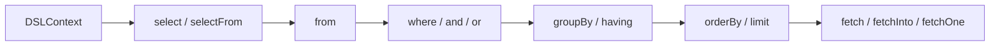
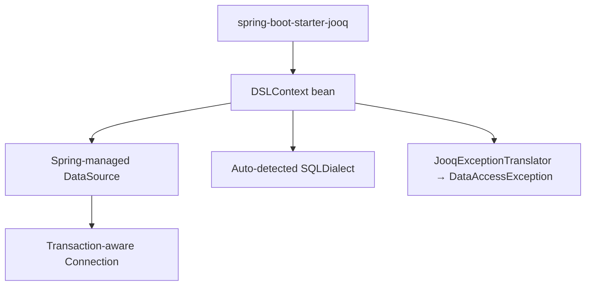

# Вопросы на собеседовании: `jOOQ`

`jOOQ` (Java Object Oriented Querying) — это библиотека, которая делает SQL первоклассным языком внутри Java: она генерирует типобезопасный fluent-DSL из реальной схемы БД, так что запросы выглядят как SQL, но проверяются компилятором. На собеседованиях `jOOQ` проверяют, чтобы понять, умеет ли кандидат выбирать SQL-centric инструмент вместо ORM там, где это оправдано, и насколько глубоко он владеет SQL.

Дата последнего обновления: 2026-06-25

## Полезные ссылки

### Официальная документация

- [jOOQ Manual](https://www.jooq.org/doc/latest/manual/) — основное руководство по библиотеке
- [Fetching](https://www.jooq.org/doc/latest/manual/sql-execution/fetching/) — все способы извлечения данных
- [Transaction management](https://www.jooq.org/doc/latest/manual/sql-execution/transaction-management/) — управление транзакциями
- [Dynamic SQL](https://www.jooq.org/doc/latest/manual/sql-building/dynamic-sql/) — динамическое построение запросов
- [MULTISET value constructor](https://www.jooq.org/doc/latest/manual/sql-building/column-expressions/multiset-value-constructor/) — вложенные коллекции
- [Licensing](https://www.jooq.org/legal/licensing) — модель лицензирования

### Статьи Baeldung

- [Baeldung: jOOQ](https://www.baeldung.com/jooq-with-spring) — туториал
- [Spring Boot Support for jOOQ](https://www.baeldung.com/spring-boot-support-for-jooq) — интеграция со Spring Boot
- [Getting Started with jOOQ](https://www.baeldung.com/jooq-intro) — основы и code generation
- [jOOQ and Kotlin](https://www.baeldung.com/kotlin/jooq) — использование с Kotlin

## Содержание

- [Полезные ссылки](#полезные-ссылки)
- [See also](#see-also)

**Основы и философия**
- [Q1. (!) Что такое jOOQ и в чём его философия?](#q1--что-такое-jooq-и-в-чём-его-философия)
- [Q2. Что такое генерация кода в jOOQ и какие классы она создаёт?](#q2-что-такое-генерация-кода-в-jooq-и-какие-классы-она-создаёт)
- [Q3. Что такое DSLContext и как строится fluent-запрос?](#q3-что-такое-dslcontext-и-как-строится-fluent-запрос)

**Сравнения и выбор**
- [Q4. (!) Чем jOOQ отличается от JPA/Hibernate и когда что выбирать?](#q4--чем-jooq-отличается-от-jpahibernate-и-когда-что-выбирать)
- [Q5. Чем jOOQ отличается от Spring Data JDBC и Spring Data JPA?](#q5-чем-jooq-отличается-от-spring-data-jdbc-и-spring-data-jpa)
- [Q6. Когда стоит выбрать jOOQ, а когда — нет?](#q6-когда-стоит-выбрать-jooq-а-когда--нет)

**Запросы и извлечение данных**
- [Q7. Как строить SELECT с from/where/join/groupBy в jOOQ?](#q7-как-строить-select-с-fromwherejoingroupby-в-jooq)
- [Q8. (!) Чем различаются fetch, fetchInto, fetchOne и fetchOptional?](#q8--чем-различаются-fetch-fetchinto-fetchone-и-fetchoptional)
- [Q9. Чем Record отличается от POJO и когда что использовать?](#q9-чем-record-отличается-от-pojo-и-когда-что-использовать)

**Модификация данных и транзакции**
- [Q10. Как выполнять CRUD через UpdatableRecord?](#q10-как-выполнять-crud-через-updatablerecord)
- [Q11. (!) Как управлять транзакциями в jOOQ?](#q11--как-управлять-транзакциями-в-jooq)

**Интеграция и продвинутые возможности**
- [Q12. Как интегрировать jOOQ со Spring Boot?](#q12-как-интегрировать-jooq-со-spring-boot)
- [Q13. Как строить динамический SQL в jOOQ?](#q13-как-строить-динамический-sql-в-jooq)
- [Q14. Как выполнять batch-операции в jOOQ?](#q14-как-выполнять-batch-операции-в-jooq)
- [Q15. (!) Что такое MULTISET и зачем нужны вложенные коллекции?](#q15--что-такое-multiset-и-зачем-нужны-вложенные-коллекции)

**Эксплуатационные вопросы**
- [Q16. Как лицензируется jOOQ?](#q16-как-лицензируется-jooq)
- [Q17. Как использовать jOOQ с Kotlin?](#q17-как-использовать-jooq-с-kotlin)
- [Q18. Как jOOQ обеспечивает типобезопасность и почему это важно?](#q18-как-jooq-обеспечивает-типобезопасность-и-почему-это-важно)

## Q1. (!) Что такое jOOQ и в чём его философия?

`jOOQ` (Java Object Oriented Querying) — это библиотека для работы с реляционной БД, которая относится к SQL как к первоклассному языку внутри Java, а не прячет его за объектной абстракцией.

Ключевая идея: вы пишете SQL, но через типобезопасный fluent-DSL, который компилятор проверяет на корректность имён таблиц, колонок и типов. Это противоположность ORM-философии.

- **SQL — это хорошо, а не зло.** ORM исходит из того, что SQL надо скрыть; `jOOQ` исходит из того, что SQL мощный и его надо сделать удобным и безопасным.
- **Схема БД — источник истины.** Код генерируется из существующей схемы (database-first), а не схема выводится из классов.
- **Полный контроль над генерируемым SQL.** Вы видите ровно тот SQL, который уйдёт в БД, без скрытых N+1 и неожиданных JOIN-ов.

```java
// Запрос выглядит почти как SQL, но проверяется компилятором
Result<Record2<String, Integer>> result =
    dsl.select(AUTHOR.FIRST_NAME, AUTHOR.AGE)
       .from(AUTHOR)
       .where(AUTHOR.AGE.gt(30))
       .orderBy(AUTHOR.FIRST_NAME)
       .fetch();
```

`jOOQ` — это **не ORM**. Он не управляет жизненным циклом сущностей, не делает lazy loading, не держит persistence context. Это типобезопасный построитель SQL плюс лёгкий маппинг результата в объекты.

**Итог:** `jOOQ` — для команд, которые любят SQL и хотят писать его осознанно, но с защитой компилятора и автодополнением IDE.

## Q2. Что такое генерация кода в jOOQ и какие классы она создаёт?

Генерация кода (code generation) — это процесс, в котором инструмент `jooq-codegen` подключается к существующей схеме БД (или к DDL-скрипту) и генерирует Java-классы, отражающие таблицы, колонки и связи. Именно это даёт типобезопасность.

Генератор создаёт несколько видов классов:

| Тип класса | Что описывает | Пример |
|------------|---------------|--------|
| `Table` | Таблицу как объект DSL | `Author.AUTHOR`, статический референс `AUTHOR` |
| `TableField` | Колонку с типом | `AUTHOR.FIRST_NAME` типа `Field<String>` |
| `Record` | Строку конкретной таблицы | `AuthorRecord` |
| `POJO` (опционально) | Простой data-класс без DSL | `Author` |
| `DAO` (опционально) | Базовые CRUD-операции | `AuthorDao` |

Генерацию обычно запускают через Maven/Gradle-плагин, привязанный к фазе `generate-sources`:

```xml
<plugin>
    <groupId>org.jooq</groupId>
    <artifactId>jooq-codegen-maven</artifactId>
    <executions>
        <execution>
            <goals><goal>generate</goal></goals>
        </execution>
    </executions>
    <configuration>
        <jdbc>
            <url>jdbc:postgresql://localhost:5432/app</url>
            <user>app</user>
            <password>secret</password>
        </jdbc>
        <generator>
            <database>
                <inputSchema>public</inputSchema>
            </database>
            <target>
                <packageName>com.example.db</packageName>
                <directory>target/generated-sources/jooq</directory>
            </target>
        </generator>
    </configuration>
</plugin>
```

**Подвох:** сгенерированный код надо регенерировать при каждом изменении схемы. Поэтому генерацию связывают с миграциями (`Flyway`/`Liquibase`): миграции применяются к БД (часто в `Testcontainers`), затем по обновлённой схеме генерируется код.

**Итог:** code generation — это то, что превращает `jOOQ` из «ещё одного query-билдера» в типобезопасный инструмент: компилятор знает реальную структуру вашей БД.

## Q3. Что такое DSLContext и как строится fluent-запрос?

`DSLContext` — это центральная точка входа в `jOOQ`. Через него создаются все запросы; он держит `Configuration` (соединение/`DataSource`, SQL-диалект, настройки).

```java
// Создание вручную
DSLContext dsl = DSL.using(connection, SQLDialect.POSTGRES);

// Или через DataSource
DSLContext dsl = DSL.using(dataSource, SQLDialect.POSTGRES);
```

Fluent-DSL строится цепочкой методов, повторяющих структуру SQL-выражения:

```java
List<BookRecord> books =
    dsl.selectFrom(BOOK)
       .where(BOOK.PUBLISHED_YEAR.ge(2020))
       .and(BOOK.TITLE.likeIgnoreCase("%java%"))
       .orderBy(BOOK.PUBLISHED_YEAR.desc())
       .limit(10)
       .fetch();
```

Каждый шаг возвращает следующий допустимый тип в цепочке — это и есть источник типобезопасности. Например, после `where(...)` нельзя вызвать `from(...)`, потому что компилятор не разрешит несуществующий переход.



**Подвох:** в Spring Boot не создавайте `DSLContext` вручную через `DSL.using(connection)` — стартер уже даёт настроенный бин, который участвует в транзакциях Spring (см. Q12).

**Итог:** `DSLContext` — это объект, через который вы всегда начинаете запрос; fluent-цепочка отражает порядок SQL-клауз.

## Q4. (!) Чем jOOQ отличается от JPA/Hibernate и когда что выбирать?

Это разные парадигмы, а не «конкуренты за одну нишу». `Hibernate`/`JPA` — это ORM, который прячет SQL и работает с графом объектов; `jOOQ` — типобезопасный SQL-билдер, который SQL принимает и усиливает.

| Аспект | jOOQ | JPA / Hibernate |
|--------|------|-----------------|
| Парадигма | SQL-centric DSL | Object-centric ORM |
| Источник истины | Схема БД (database-first) | Сущности/маппинг |
| Контроль над SQL | Полный, видишь точный запрос | Частичный, SQL генерируется |
| Типобезопасность | Колонки и типы из схемы | JPQL/Criteria, меньше гарантий |
| Кеш 1-го/2-го уровня | Нет | Есть (persistence context, 2L cache) |
| Lazy loading | Нет | Есть |
| Сложный/специфичный SQL | Сильная сторона (CTE, window, JSON) | Слабая сторона, упирается в JPQL |
| N+1 проблема | Не возникает скрыто | Классическая ловушка |
| CRUD-«бойлерплейт» | Чуть больше ручной работы | Минимальный (репозитории) |

**Когда `jOOQ` лучше:**

- Сложные аналитические/отчётные запросы, window-функции, CTE, `JSON`-агрегации.
- Нужно видеть и оптимизировать каждый запрос; критична производительность.
- Используются vendor-специфичные фичи БД.

**Когда `JPA`/`Hibernate` лучше:**

- CRUD-heavy доменные приложения с богатым графом объектов.
- Нужны кеширование, lazy loading, автоматическое отслеживание изменений.
- Быстрый старт greenfield-проекта.

**Гибрид (частая практика):** `Spring Data JPA` для рутинного CRUD + `jOOQ` (через `DSLContext`) для тяжёлых отчётных запросов. Они спокойно живут в одном приложении и одной транзакции.

**Итог:** это не «или-или». `jOOQ` — про SQL и производительность запросов; `Hibernate` — про управление объектами. На senior-интервью важно сказать именно это, а не «jOOQ заменяет Hibernate».

## Q5. Чем jOOQ отличается от Spring Data JDBC и Spring Data JPA?

Все три уровня находятся на разной высоте абстракции над JDBC.

| Инструмент | Абстракция | Типобезопасность запросов | Маппинг объектов |
|------------|------------|---------------------------|------------------|
| `Spring Data JPA` | Высокая (ORM) | Низкая (строковый JPQL) | Полный ORM-маппинг, lazy |
| `Spring Data JDBC` | Средняя (простой ORM без lazy) | Низкая (строковый SQL) | Агрегаты, без persistence context |
| `jOOQ` | Низкая (SQL-DSL) | Высокая (DSL из схемы) | Лёгкий маппинг в Record/POJO |

- `Spring Data JPA` — даёт репозитории, derived queries, кеш, lazy loading; SQL скрыт.
- `Spring Data JDBC` — намеренно проще JPA: нет lazy loading и persistence context, работает с агрегатами, но запросы в `@Query` — обычные строки.
- `jOOQ` — не репозиторный фреймворк, а инструмент построения запросов; зато запросы проверяются компилятором.

**Ключевое отличие:** в `Spring Data` (и JPA, и JDBC) кастомные запросы пишутся строками в `@Query`, и опечатка в имени колонки всплывёт только в рантайме. В `jOOQ` такая опечатка не скомпилируется.

**Итог:** `jOOQ` решает другую задачу — типобезопасный SQL. Его часто комбинируют со `Spring Data` (репозитории для CRUD, `jOOQ` для сложных запросов).

## Q6. Когда стоит выбрать jOOQ, а когда — нет?

Выбор зависит от природы приложения и от того, насколько команда владеет SQL.

**Выбирать `jOOQ`, когда:**

- Приложение data/report-centric: много сложных запросов, агрегаций, аналитики.
- Нужен полный контроль над SQL и его производительностью.
- Активно используются возможности конкретной СУБД (window-функции, CTE, `JSON`, upsert).
- Команда комфортно мыслит на SQL и хочет защиту компилятора вместо строковых запросов.

**Скорее не выбирать `jOOQ`, когда:**

- Классический CRUD-домен с богатым объектным графом — ORM даст меньше бойлерплейта.
- Нужны из коробки кеш 2-го уровня, lazy loading, автоматический dirty checking.
- В целевых БД присутствуют коммерческие СУБД (Oracle, SQL Server, DB2), а бюджета на коммерческую лицензию нет (см. Q16).
- Команда не хочет добавлять шаг генерации кода в сборку.

**Подвох на интервью:** не противопоставляйте `jOOQ` и ORM как взаимоисключающие. Часто правильный ответ — «оба в одном проекте»: ORM для агрегатов, `jOOQ` для отчётов.

**Итог:** `jOOQ` оправдан там, где SQL — центр приложения; для объектно-центричных CRUD-доменов чаще выигрывает ORM.

## Q7. Как строить SELECT с from/where/join/groupBy в jOOQ?

Структура DSL повторяет SQL: `select` → `from` → `join`/`on` → `where` → `groupBy`/`having` → `orderBy`.

```java
Result<Record2<String, Integer>> result =
    dsl.select(AUTHOR.LAST_NAME, DSL.count())
       .from(AUTHOR)
       .join(BOOK).on(BOOK.AUTHOR_ID.eq(AUTHOR.ID))
       .where(BOOK.PUBLISHED_YEAR.ge(2015))
       .groupBy(AUTHOR.LAST_NAME)
       .having(DSL.count().gt(1))
       .orderBy(DSL.count().desc())
       .fetch();
```

Виды JOIN-ов выражаются методами: `join` (INNER), `leftJoin`, `rightJoin`, `fullOuterJoin`, `crossJoin`. Условие задаётся через `.on(...)`.

```java
// LEFT JOIN с двумя таблицами
var rows = dsl.select(AUTHOR.FIRST_NAME, BOOK.TITLE)
              .from(AUTHOR)
              .leftJoin(BOOK).on(BOOK.AUTHOR_ID.eq(AUTHOR.ID))
              .fetch();
```

Полезные приёмы:

- `selectFrom(TABLE)` — короткая форма для выборки всех колонок одной таблицы (возвращает типизированный `Record` этой таблицы).
- `select(field1, field2)` — явный список колонок (типизированный `Record2`, `Record3` и т.д.).
- Агрегаты и функции — через `DSL.count()`, `DSL.sum(...)`, `DSL.max(...)`.

**Подвох:** условия (`Condition`) можно собирать и комбинировать как объекты (см. Q13), а не только инлайном — это основа динамического SQL.

**Итог:** DSL зеркалит SQL-синтаксис, поэтому если вы знаете SQL — вы уже знаете `jOOQ`.

## Q8. (!) Чем различаются fetch, fetchInto, fetchOne и fetchOptional?

Эти методы определяют, **как** результат запроса материализуется. Выбор зависит от того, сколько строк вы ожидаете и в какой тип хотите маппить.

| Метод | Возвращает | Поведение при количестве строк |
|-------|------------|--------------------------------|
| `fetch()` | `Result<Record>` (список) | Любое число строк |
| `fetchInto(Class)` | `List<T>` | Любое число, маппинг в POJO |
| `fetchOne()` | `Record` или `null` | 0 → `null`; 1 → запись; >1 → исключение |
| `fetchOptional()` | `Optional<Record>` | 0 → empty; 1 → present; >1 → исключение |
| `fetchOptionalInto(Class)` | `Optional<T>` | то же + маппинг в POJO |
| `fetchAny()` | `Record` или `null` | Любое число, берёт произвольную одну |

```java
// Список записей
Result<Record> all = dsl.selectFrom(BOOK).fetch();

// Список POJO
List<Book> books = dsl.selectFrom(BOOK).fetchInto(Book.class);

// Ровно одна или ноль (но не больше одной — иначе TooManyRowsException)
BookRecord one = dsl.selectFrom(BOOK).where(BOOK.ID.eq(1)).fetchOne();

// Безопасный вариант с Optional
Optional<BookRecord> opt = dsl.selectFrom(BOOK).where(BOOK.ID.eq(1)).fetchOptional();
```

Маппинг в POJO работает по «best-matching»-правилу: `jOOQ` сопоставляет колонки с конструктором/полями/сеттерами. Если на POJO есть `jakarta.persistence.@Column`, используется именно она (только `@Column`, другие JPA-аннотации игнорируются).

**Подвохи:**

- `fetchOne()` бросает `TooManyRowsException` при >1 строке — не используйте его там, где запрос может вернуть несколько.
- `fetchOne()` возвращает `null` при 0 строках; `fetchOptional()` безопаснее для «может не быть».
- `fetchAny()` не бросает исключение на множестве строк — он просто берёт одну.

**Итог:** `fetch`/`fetchInto` — для коллекций, `fetchOne`/`fetchOptional` — для одиночных результатов; `Optional`-версии предпочтительнее для «возможно отсутствует».

## Q9. Чем Record отличается от POJO и когда что использовать?

Это два разных способа представления строки данных в `jOOQ`.

- **`Record`** (например, `BookRecord`) — «активный» объект, привязанный к таблице. Знает свою структуру, отслеживает изменённые поля, умеет `store()`/`update()`/`delete()`. Это `UpdatableRecord`.
- **`POJO`** (например, `Book`) — простой неизменяемый/изменяемый data-класс без поведения и без привязки к DSL. Удобен для передачи между слоями (DTO-подобно).

| Критерий | `Record` | `POJO` |
|----------|----------|--------|
| Привязка к таблице | Да | Нет |
| CRUD-методы (`store`/`update`) | Есть | Нет |
| Отслеживание изменений | Да (changed flags) | Нет |
| Подходит как DTO между слоями | Не очень (тяжёлый, привязан) | Да |
| Получение | `fetch()`, `selectFrom()` | `fetchInto(Class)` |

```java
// Record — можно менять и сохранять
BookRecord rec = dsl.selectFrom(BOOK).where(BOOK.ID.eq(1)).fetchOne();
rec.setTitle("New title");
rec.store(); // UPDATE затронет только изменённое поле

// POJO — чистые данные
Book pojo = dsl.selectFrom(BOOK).where(BOOK.ID.eq(1)).fetchOneInto(Book.class);
```

**Практика:** `Record` удобен для записи (CRUD внутри сервиса), `POJO` — для отдачи наружу (контроллеры, API), чтобы не протаскивать `jOOQ`-зависимости через слои.

**Итог:** `Record` — «живая» строка с поведением, `POJO` — пассивные данные; для DTO почти всегда берут POJO.

## Q10. Как выполнять CRUD через UpdatableRecord?

`UpdatableRecord` — это `Record` таблицы с первичным ключом, который умеет выполнять CRUD прямо на себе через активную запись (active record pattern).

```java
// CREATE — новый Record, привязанный к DSLContext
BookRecord book = dsl.newRecord(BOOK);
book.setTitle("jOOQ in Action");
book.setAuthorId(1);
book.store();           // INSERT, генерированный ключ подставляется обратно

// READ
BookRecord found = dsl.fetchOne(BOOK, BOOK.ID.eq(book.getId()));

// UPDATE
found.setTitle("jOOQ in Action, 2nd ed.");
found.store();          // UPDATE только изменённых колонок

// DELETE
found.delete();
```

Ключевые моменты:

- `store()` — умный метод: делает `INSERT`, если запись новая, и `UPDATE`, если она уже существует (есть PK).
- `jOOQ` отслеживает изменённые поля, поэтому `UPDATE` затрагивает только реально изменённые колонки.
- Альтернатива active record — обычные DSL-операции: `dsl.insertInto(...)`, `dsl.update(...)`, `dsl.deleteFrom(...)`, которые часто предпочитают за явность.

```java
// Тот же UPDATE через явный DSL
dsl.update(BOOK)
   .set(BOOK.TITLE, "New title")
   .where(BOOK.ID.eq(1))
   .execute();
```

**Подвох:** active record (`store`/`delete`) требует, чтобы у таблицы был первичный ключ; для таблиц без PK работают только явные DSL-операции.

**Итог:** `UpdatableRecord` даёт удобный active-record CRUD, но для массовых и явных операций часто чище использовать `insertInto`/`update`/`deleteFrom`.

## Q11. (!) Как управлять транзакциями в jOOQ?

У `jOOQ` есть собственный транзакционный API, и при этом он умеет интегрироваться с транзакциями Spring.

**Собственный API `jOOQ`** — лямбда-ориентированный. Нормальное завершение лямбды коммитит, исключение — откатывает:

```java
// Без возвращаемого значения
dsl.transaction(configuration -> {
    DSLContext ctx = DSL.using(configuration);
    ctx.insertInto(AUTHOR, AUTHOR.FIRST_NAME).values("John").execute();
    ctx.insertInto(AUTHOR, AUTHOR.FIRST_NAME).values("Jane").execute();
});

// С возвращаемым значением
int inserted = dsl.transactionResult(configuration -> {
    DSLContext ctx = DSL.using(configuration);
    int r = ctx.insertInto(AUTHOR, AUTHOR.FIRST_NAME).values("John").execute();
    return r;
});
```

Важная деталь дизайна: внутри лямбды нужно работать через **локально переданную** `Configuration` (`DSL.using(configuration)`), а не через глобальный `DSLContext` — это и обеспечивает корректную транзакционную область, в том числе вложенные транзакции (savepoints).

**Интеграция со Spring** — чаще всего на практике именно так. При использовании `spring-boot-starter-jooq` бин `DSLContext` подключается к Spring-управляемому соединению. Тогда транзакциями управляет Spring через `@Transactional`, а `jOOQ`-запросы автоматически в неё попадают:

```java
@Service
public class BookService {

    private final DSLContext dsl;

    @Transactional
    public void importBooks() {
        dsl.insertInto(BOOK, BOOK.TITLE).values("A").execute();
        dsl.insertInto(BOOK, BOOK.TITLE).values("B").execute();
        // откат при исключении управляется Spring
    }
}
```

**Подвох:** не смешивайте `dsl.transaction(...)` и `@Transactional` бессистемно — выберите один уровень управления. В Spring-приложениях обычно полагаются на `@Transactional`.

**Итог:** у `jOOQ` есть лямбда-API (`transaction`/`transactionResult`), но в Spring-проектах транзакциями обычно рулит `@Transactional`, а `jOOQ` к ним прозрачно подключается.

## Q12. Как интегрировать jOOQ со Spring Boot?

Spring Boot даёт автоконфигурацию через стартер `spring-boot-starter-jooq`.

```xml
<dependency>
    <groupId>org.springframework.boot</groupId>
    <artifactId>spring-boot-starter-jooq</artifactId>
</dependency>
```

Что делает стартер автоматически:

- Создаёт бин `DSLContext`, который можно инжектить куда угодно.
- Подключает `DSLContext` к Spring-управляемому `DataSource` и соединению, так что `jOOQ` участвует в транзакциях Spring (`@Transactional`).
- Определяет `SQLDialect` по присутствующему на classpath драйверу БД (например, увидев H2 или PostgreSQL).
- Оборачивает SQL-исключения `jOOQ` в иерархию `DataAccessException` Spring (через `JooqExceptionTranslator`).

```java
@Repository
public class BookRepository {

    private final DSLContext dsl;

    public BookRepository(DSLContext dsl) {
        this.dsl = dsl;
    }

    public List<Book> findRecent() {
        return dsl.selectFrom(BOOK)
                  .where(BOOK.PUBLISHED_YEAR.ge(2020))
                  .fetchInto(Book.class);
    }
}
```



**Подвох:** для коммерческих диалектов (Oracle/SQL Server) автодетекта диалекта open-source-версией может быть недостаточно — там нужна коммерческая редакция `jOOQ` (см. Q16).

**Итог:** со стартером достаточно инжектить `DSLContext` — соединение, транзакции, диалект и трансляция исключений настраиваются автоматически.

## Q13. Как строить динамический SQL в jOOQ?

Поскольку запрос в `jOOQ` — это обычные Java-объекты, а не строки, условия можно собирать программно. Это одна из сильнейших сторон библиотеки.

`Condition` — это объект; его можно накапливать в цикле или по `if`-ам:

```java
Condition condition = DSL.noCondition();   // «пустое» условие

if (title != null) {
    condition = condition.and(BOOK.TITLE.likeIgnoreCase("%" + title + "%"));
}
if (yearFrom != null) {
    condition = condition.and(BOOK.PUBLISHED_YEAR.ge(yearFrom));
}

List<Book> result = dsl.selectFrom(BOOK)
                       .where(condition)
                       .fetchInto(Book.class);
```

Для «пустых» условий есть три помощника:

| Метод | Что генерирует | Когда использовать |
|-------|----------------|--------------------|
| `DSL.noCondition()` | Ничего не добавляет в SQL | Для динамического накопления условий |
| `DSL.trueCondition()` | `1 = 1` (identity для AND) | Когда условие обязательно по синтаксису |
| `DSL.falseCondition()` | `1 = 0` (identity для OR) | Аналогично, для OR-редукции |

`noCondition()` предпочтительнее: если он остаётся единственным предикатом, `WHERE`-клауза вообще не сгенерируется, тогда как `trueCondition()` оставит лишний `1 = 1`.

```java
// Накопление через trueCondition (классический паттерн редукции)
Condition c = DSL.trueCondition();
for (var filter : filters) {
    c = c.and(filter.toCondition());
}
```

**Подвох:** будьте аккуратны с `DSL.and(noCondition())` / `DSL.or(noCondition())` — в некоторых версиях они могут генерировать лишние `1 = 1` / `1 = 0` и слегка влиять на план. Для накопления чище начинать с `noCondition()` и добавлять через `.and(...)`.

**Итог:** динамический SQL в `jOOQ` строится из `Condition`-объектов; `noCondition()` — основной инструмент для опциональных предикатов без строковой конкатенации и без SQL-инъекций.

## Q14. Как выполнять batch-операции в jOOQ?

Batch — это отправка множества SQL-операций одной пачкой, что резко снижает накладные расходы на round-trip к БД.

`jOOQ` поддерживает несколько форм:

```java
// 1. batch из готовых запросов
dsl.batch(
    dsl.insertInto(BOOK, BOOK.TITLE).values("A"),
    dsl.insertInto(BOOK, BOOK.TITLE).values("B"),
    dsl.insertInto(BOOK, BOOK.TITLE).values("C")
).execute();

// 2. один подготовленный запрос с разными bind-значениями (batchInsert по шаблону)
int[] counts = dsl.batch(
        dsl.insertInto(BOOK, BOOK.ID, BOOK.TITLE).values((Integer) null, null))
    .bind(1, "A")
    .bind(2, "B")
    .bind(3, "C")
    .execute();

// 3. batch из коллекции Record
List<BookRecord> records = buildRecords();
dsl.batchInsert(records).execute();
dsl.batchUpdate(records).execute();
dsl.batchStore(records).execute();   // INSERT или UPDATE по состоянию
```

Различие важно для производительности:

- `batch(query1, query2, ...)` — разные запросы, отправляются как один batch.
- `batch(template).bind(...).bind(...)` — один и тот же подготовленный statement с разными значениями (самый эффективный для однотипных вставок).
- `batchInsert/batchUpdate/batchStore(records)` — удобные обёртки над коллекцией `Record`.

**Подвох:** batch не возвращает сгенерированные ключи так же удобно, как одиночный `store()` — для bulk-вставок с возвратом ключей используйте `insertInto(...).returning(...)`.

**Итог:** для массовых операций используйте `batch`/`batchInsert`; форма с одним шаблоном и множеством `bind` — самая производительная для однотипных строк.

## Q15. (!) Что такое MULTISET и зачем нужны вложенные коллекции?

`MULTISET` (появился в `jOOQ` 3.15) — это конструктор, который собирает результат вложенного (не-скалярного) подзапроса в одну вложенную коллекцию прямо внутри строки родительского запроса. Это решает классическую проблему «to-many» отношений без N+1.

Идея: вы декларируете результат сразу в той форме, которая нужна клиенту — например, автор со списком его книг — и `jOOQ` типобезопасно маппит это в вложенные Java-объекты одним запросом.

```java
var authors =
    dsl.select(
            AUTHOR.FIRST_NAME,
            AUTHOR.LAST_NAME,
            multiset(
                select(BOOK.TITLE, BOOK.PUBLISHED_YEAR)
                .from(BOOK)
                .where(BOOK.AUTHOR_ID.eq(AUTHOR.ID))
            ).as("books")
        )
        .from(AUTHOR)
        .fetch();

// authors.get(0).value3() — это вложенный Result<Record2<String,Integer>> (список книг)
```

Почему это важно:

- **Нет N+1.** Вся вложенная структура приходит одним SQL-запросом, без отдельного запроса на каждого родителя.
- **Нет ручной дедупликации.** При JOIN-подходе пришлось бы схлопывать декартово произведение вручную; `MULTISET` отдаёт уже структурированный результат.
- **Полная типобезопасность.** Вложенная коллекция типизирована, как и всё остальное.

Под капотом `MULTISET` редко поддерживается БД нативно — `jOOQ` эмулирует его через `SQL/JSON` или `SQL/XML` в зависимости от диалекта. С `Field.convertFrom()` (ad-hoc conversion API, тоже 3.15) вложенные коллекции легко маппятся в собственные типы.

**Подвох:** `MULTISET` мощный, но генерирует `JSON`/`XML`-агрегации — на очень больших объёмах вложенных данных стоит замерять план запроса.

**Итог:** `MULTISET` — это типобезопасный способ получить вложенные коллекции (родитель + дети) одним запросом без N+1 и ручной дедупликации; одна из «фишек» `jOOQ`, которую трудно повторить в ORM.

## Q16. Как лицензируется jOOQ?

`jOOQ` использует dual-licensing — лицензия зависит от того, с какими БД вы работаете.

| Редакция | Лицензия | Поддерживаемые БД | Стоимость |
|----------|----------|-------------------|-----------|
| Open Source Edition | Apache License 2.0 | Open-source БД (PostgreSQL, MySQL, MariaDB, SQLite, H2 и др.) | Бесплатно |
| Commercial Editions | Коммерческая (jOOQ License) | Те же + коммерческие (Oracle, SQL Server, DB2, Sybase, MS Access) | Платно, по тарифам |

Ключевые правила:

- Open Source Edition можно использовать **в том числе в коммерческом ПО** — лицензия Apache 2.0 это позволяет, пока вы работаете с open-source-БД.
- Как только хотя бы одна целевая БД коммерческая (Oracle/SQL Server/DB2), нужна коммерческая редакция.
- Коммерческая модель — per developer workstation: платят только за рабочие места разработчиков; build-серверы, тест-серверы и конечные пользователи лицензируются бесплатно.

**Подвох на интервью:** частая ошибка — думать, что `jOOQ` платный всегда. Нет: для PostgreSQL/MySQL и прочих open-source-БД он полностью бесплатен под Apache 2.0. Платность включается именно коммерческими СУБД.

**Итог:** Apache 2.0 для open-source-БД (бесплатно, в том числе в коммерческих продуктах); коммерческая лицензия — только если в наборе есть Oracle/SQL Server/DB2 и им подобные.

## Q17. Как использовать jOOQ с Kotlin?

`jOOQ` отлично работает с Kotlin и имеет специальную поддержку, делающую код идиоматичнее.

Возможности генератора для Kotlin:

- `pojosAsKotlinDataClasses = true` — генерирует POJO как неизменяемые Kotlin `data class`.
- Kotlin-friendly расширения и DSL делают цепочки запросов компактнее.

```kotlin
val books: List<Book> =
    dsl.selectFrom(BOOK)
       .where(BOOK.PUBLISHED_YEAR.ge(2020))
       .fetchInto(Book::class.java)

// Идиоматичный маппинг с деструктуризацией
val titles = dsl.select(BOOK.TITLE, BOOK.PUBLISHED_YEAR)
                .from(BOOK)
                .fetch { (title, year) -> "$title ($year)" }
```

Полезные приёмы в Kotlin:

- Лямбда-маппинг `fetch { record -> ... }` хорошо ложится на Kotlin-синтаксис.
- `data class`-POJO дают immutability и удобную деструктуризацию из коробки.
- Coroutine/reactive-сценарии возможны через reactive-расширения `jOOQ` (R2DBC).

**Подвох:** не забудьте включить нужные кодген-опции (`pojosAsKotlinDataClasses`, и при желании Kotlin-генератор), иначе получите обычные Java-классы.

**Итог:** `jOOQ` + Kotlin — естественная пара: генерация `data class`-POJO и лямбда-маппинг делают код лаконичным, сохраняя типобезопасность.

## Q18. Как jOOQ обеспечивает типобезопасность и почему это важно?

Типобезопасность `jOOQ` строится на двух механизмах: **генерация кода из схемы** и **типизированный fluent-DSL**.

1. **Имена и типы из схемы.** Колонка `BOOK.PUBLISHED_YEAR` — это `Field<Integer>`, сгенерированный из реальной схемы. Опечатка в имени колонки или сравнение строки с числом не скомпилируются.

2. **Типизированные шаги DSL.** Каждый метод цепочки возвращает только допустимые следующие типы, поэтому невалидный SQL-«синтаксис» отлавливается компилятором.

```java
// Не скомпилируется: PUBLISHED_YEAR это Integer, нельзя сравнить со String
dsl.selectFrom(BOOK).where(BOOK.PUBLISHED_YEAR.eq("not a number")); // ошибка компиляции

// Не скомпилируется: такой колонки нет в сгенерированном классе
dsl.selectFrom(BOOK).where(BOOK.PUBLISH_YEARR.eq(2020)); // ошибка компиляции
```

Почему это ценно по сравнению со строковыми запросами (`@Query`, нативный SQL, JPQL):

- Ошибки имён/типов всплывают на **компиляции**, а не в проде.
- Рефакторинг схемы (переименование колонки → регенерация кода) ломает компиляцию во всех местах использования — вы их сразу видите.
- IDE даёт автодополнение по реальным колонкам.
- Защита от SQL-инъекций: значения уходят как bind-параметры, а не конкатенацией строк.

**Trade-off:** цена — шаг генерации кода в сборке и необходимость регенерации при изменении схемы. Для большинства команд это окупается надёжностью.

**Итог:** `jOOQ` сдвигает ошибки SQL с рантайма на этап компиляции за счёт кодогенерации из схемы и типизированного DSL — это его главное преимущество над строковыми запросами.

---

## See also

- [Вопросы на собеседовании: SQL](sql-interview.md) — основы SQL, на которые опирается DSL jOOQ
- [Вопросы на собеседовании: Hibernate](hibernate-interview.md) — ORM-альтернатива, с которой часто сравнивают jOOQ
- [Вопросы на собеседовании: PostgreSQL](postgresql-interview.md) — основная open-source БД для бесплатной редакции jOOQ
- [Вопросы на собеседовании: транзакции БД](database-transactions-interview.md) — транзакционная семантика, важная для jOOQ
- [Вопросы на собеседовании: Flyway и Liquibase](flyway-liquibase-interview.md) — миграции схемы, по которой генерируется код jOOQ
- [Вопросы на собеседовании: Spring Data JPA](../frameworks/spring/spring-data-jpa-interview.md) — репозиторный подход, часто комбинируемый с jOOQ
