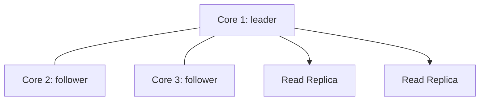

# Вопросы на собеседовании: `Neo4j`

`Neo4j` — самая популярная графовая база данных (Швеция, с 2007). Нативное графовое хранилище. Запросы на **Cypher** (SQL-подобный язык для графов). Применяется в социальных сетях (LinkedIn, расследования по Facebook), рекомендациях, выявлении мошенничества, графах знаний. Альтернативы: Amazon Neptune, ArangoDB, JanusGraph, NebulaGraph.

## Полезные ссылки

### Официальная документация и авторитетные источники

- [Neo4j Documentation](https://neo4j.com/docs/)
- [Cypher Manual](https://neo4j.com/docs/cypher-manual/)
- [Graph Algorithms Book](https://www.oreilly.com/library/view/graph-algorithms/9781492047674/)
- [Neo4j Graph Data Science (GDS)](https://neo4j.com/docs/graph-data-science/)
- [GraphAcademy by Neo4j](https://graphacademy.neo4j.com/)
- [openCypher Specification](https://opencypher.org/)

## Содержание

- [Полезные ссылки](#полезные-ссылки)
- [See also](#see-also)

**Базовые понятия**
- [Q1. (!) Что такое graph database?](#q1--что-такое-graph-database)
- [Q2. (!) Когда graph DB лучше реляционной?](#q2--когда-graph-db-лучше-реляционной)
- [Q3. Property graph model?](#q3-property-graph-model)
- [Q4. Что такое native graph storage?](#q4-что-такое-native-graph-storage)

**Data model**
- [Q5. (!) Nodes, relationships, properties?](#q5--nodes-relationships-properties)
- [Q6. Labels на nodes?](#q6-labels-на-nodes)
- [Q7. Direction relationships?](#q7-direction-relationships)

**Cypher**
- [Q8. (!) Что такое Cypher?](#q8--что-такое-cypher)
- [Q9. (!) MATCH, WHERE, RETURN?](#q9--match-where-return)
- [Q10. (!) Pattern matching syntax (`(a)-[r]->(b)`)?](#q10--pattern-matching-syntax-a-rb)
- [Q11. CREATE, MERGE, SET, DELETE?](#q11-create-merge-set-delete)
- [Q12. Variable-length paths?](#q12-variable-length-paths)
- [Q13. WITH clause (chaining queries)?](#q13-with-clause-chaining-queries)

**Indexes и constraints**
- [Q14. (!) Индексы в Neo4j?](#q14--индексы-в-neo4j)
- [Q15. Constraints (UNIQUE, NOT NULL)?](#q15-constraints-unique-not-null)
- [Q16. Full-text search index?](#q16-full-text-search-index)

**Performance**
- [Q17. (!) Query plan, EXPLAIN, PROFILE?](#q17--query-plan-explain-profile)
- [Q18. (!) Index-free adjacency — что это?](#q18--index-free-adjacency--что-это)
- [Q19. Anchor patterns в Cypher?](#q19-anchor-patterns-в-cypher)

**Графовые алгоритмы**
- [Q20. (!) Graph Data Science (GDS) library?](#q20--graph-data-science-gds-library)
- [Q21. Shortest path algorithms?](#q21-shortest-path-algorithms)
- [Q22. PageRank, centrality?](#q22-pagerank-centrality)
- [Q23. Community detection (Louvain, Leiden)?](#q23-community-detection-louvain-leiden)

**Applications**
- [Q24. (!) Social networks (friends-of-friends)?](#q24--social-networks-friends-of-friends)
- [Q25. (!) Recommendations engine?](#q25--recommendations-engine)
- [Q26. Fraud detection?](#q26-fraud-detection)
- [Q27. Knowledge graphs?](#q27-knowledge-graphs)

**Production**
- [Q28. (!) Neo4j editions (Community vs Enterprise vs Aura)?](#q28--neo4j-editions-community-vs-enterprise-vs-aura)
- [Q29. Causal Cluster (replication)?](#q29-causal-cluster-replication)
- [Q30. (!) Альтернативы Neo4j?](#q30--альтернативы-neo4j)

## Q1. (!) Что такое graph database?

**Графовая база данных** — БД для хранения и запросов к **графам** (nodes + relationships).

**Основная парадигма:** связи relationships — это **сущность первого класса**, а не то, что приходится джойнить в запросах.

```
Alice --FRIEND--> Bob
Bob --FOLLOWS--> Charlie
Alice --LIKES--> Pizza
```

**Применения:**
- Социальные сети (друзья, подписчики)
- Рекомендательные движки
- Выявление мошенничества (циклы, подозрительные паттерны)
- Графы знаний (Wikipedia, Google)
- Топология сети
- Управление identity / доступом

**Основные вендоры:** Neo4j, Amazon Neptune, ArangoDB, JanusGraph.

## Q2. (!) Когда graph DB лучше реляционной?

**Реляционная БД:**
```sql
SELECT u2.name FROM users u1
JOIN friendships f1 ON u1.id = f1.user_id
JOIN friendships f2 ON f1.friend_id = f2.user_id
JOIN friendships f3 ON f2.friend_id = f3.user_id
JOIN users u2 ON f3.friend_id = u2.id
WHERE u1.name = 'Alice';
-- Friends-of-friends-of-friends — 4 joins, slow
```

**Графовая БД:**
```cypher
MATCH (alice:User {name: "Alice"})-[:FRIEND*3]->(friend)
RETURN friend.name
-- Constant complexity per hop
```

**Когда графовая лучше:**
- **Много джойнов** (3+ уровней в глубину)
- Запросы с **переменной глубиной**
- **Pattern matching** (поиск треугольников, циклов)
- **Частые обходы по relationships**

**Когда реляционная лучше:**
- Табличные данные
- Простые агрегации
- Жёсткие требования к ACID
- Уже сложившаяся экосистема SQL

## Q3. Property graph model?

**Property graph (граф со свойствами):**
- **Nodes** — сущности (со свойствами properties)
- **Relationships** — типизированные связи (со свойствами properties)
- **Labels** — категоризируют узлы nodes
- **Direction** — у связей relationships есть направление

```
(:Person {name: "Alice", age: 30}) -[:KNOWS {since: 2020}]-> (:Person {name: "Bob"})
```

**В сравнении с RDF-графом (Resource Description Framework):**
- Триплеты (subject-predicate-object)
- Стандарт W3C, используется в semantic web (DBpedia, Wikidata)
- Инструменты: SPARQL, RDF-хранилища

В **2025** **property graphs** — мейнстрим. RDF — ниша semantic web.

## Q4. Что такое native graph storage?

**Нативное графовое хранилище** — специальная раскладка хранения для графов.

**Index-free adjacency:**
- Каждый node хранит **прямые указатели** на связанные nodes
- Обход к соседям за O(1)
- Производительность не деградирует с ростом размера графа

**В сравнении с не-нативным** (графовый слой поверх реляционной БД):
- Джойны на каждый hop
- Производительность деградирует экспоненциально

**Neo4j** — нативная. **AWS Neptune, JanusGraph** — тоже нативные (но с другими архитектурами).

## Q5. (!) Nodes, relationships, properties?

```cypher
CREATE (alice:Person {name: "Alice", age: 30})
CREATE (bob:Person {name: "Bob", age: 25})
CREATE (alice)-[:FRIEND_OF {since: 2020}]->(bob)
```

**Node (узел):**
- Сущность (Person, Movie, Order)
- Ноль или более labels (Person, Customer)
- Ноль или более properties (name, age)

**Relationship (связь):**
- Типизированная связь (FRIEND_OF, OWNS)
- Всегда направленная (от → к)
- Ноль или более properties (since, weight)
- Две конечные точки (начальный и конечный node)

**Property (свойство):**
- Пара ключ-значение
- Типы: String, Integer, Float, Boolean, Array

## Q6. Labels на nodes?

**Labels** — категории для nodes (≈ теги).

```cypher
CREATE (alice:Person:Customer {name: "Alice"})
-- alice has both Person and Customer labels
```

**Фильтрация по label:**
```cypher
MATCH (n:Person) RETURN n  -- all Persons
MATCH (n:Customer) RETURN n  -- all Customers
```

**Несколько labels** — у node их может быть несколько (Person + Customer + VIP).

**Индексация по label:**
```cypher
CREATE INDEX ON :Person(name)
```

## Q7. Direction relationships?

Все relationships **направленные**:
```
(a)-[:KNOWS]->(b)  -- a knows b, but not necessarily b knows a
```

**Двунаправленный запрос:**
```cypher
MATCH (a)-[:KNOWS]-(b)  -- direction-agnostic
```

**Исходящие (outgoing):**
```cypher
MATCH (a)-[:KNOWS]->(b)
```

**Входящие (incoming):**
```cypher
MATCH (a)<-[:KNOWS]-(b)
```

**Выбор направления** важен для производительности запросов и семантики.

## Q8. (!) Что такое Cypher?

**Cypher** — декларативный язык запросов для графов. Создан Neo4j (2011), стал стандартом **openCypher** (2015).

```cypher
MATCH (alice:Person {name: "Alice"})-[:FRIEND_OF]->(friend)
WHERE friend.age > 25
RETURN friend.name, friend.age
ORDER BY friend.age DESC
LIMIT 10
```

**SQL-подобная структура:**
- `MATCH` ↔ `FROM`/`JOIN`
- `WHERE` ↔ `WHERE`
- `RETURN` ↔ `SELECT`
- `ORDER BY`, `LIMIT` ↔ так же

**Уникальная особенность:** **ASCII-art паттерны** для сопоставления графа.

## Q9. (!) MATCH, WHERE, RETURN?

**MATCH** — pattern matching (находит паттерны в графе).

```cypher
MATCH (a:Person)-[:KNOWS]->(b:Person)
WHERE a.age > 30
RETURN a.name, b.name
```

**WHERE** — условия фильтрации.
**RETURN** — что вернуть.

**OPTIONAL MATCH** — как LEFT JOIN (возвращает NULL, если совпадения нет).
```cypher
MATCH (a:Person {name: "Alice"})
OPTIONAL MATCH (a)-[:KNOWS]->(friend)
RETURN a.name, friend.name  -- friend.name = NULL если нет friends
```

## Q10. (!) Pattern matching syntax (`(a)-[r]->(b)`)?

**Синтаксис:**
- `(a)` — node, переменная `a`
- `(a:Person)` — node с меткой label
- `(a:Person {name: "Alice"})` — node с label и properties
- `[r:KNOWS]` — переменная relationship + тип
- `->` — исходящее направление
- `<-` — входящее
- `-` — любое направление

**Примеры:**
```cypher
-- Find friends-of-friends
MATCH (alice:Person {name: "Alice"})-[:KNOWS]->(friend)-[:KNOWS]->(fof)
WHERE alice <> fof  -- exclude Alice herself
RETURN DISTINCT fof.name

-- Find triangles
MATCH (a)-[:KNOWS]->(b)-[:KNOWS]->(c)-[:KNOWS]->(a)
RETURN a, b, c
```

**Мощный инструмент** для графовых паттернов.

## Q11. CREATE, MERGE, SET, DELETE?

**CREATE** — всегда создаёт новый (даже если дубликат).
```cypher
CREATE (n:Person {name: "Alice"})
```

**MERGE** — найти существующий ИЛИ создать.
```cypher
MERGE (n:Person {name: "Alice"})
-- Если node с этим name existed → match
-- Иначе → create
```

**SET** — обновить properties.
```cypher
MATCH (n:Person {name: "Alice"})
SET n.age = 31, n.email = "alice@example.com"
```

**DELETE** — удалить nodes / relationships.
```cypher
MATCH (n:Person {name: "Alice"})
DETACH DELETE n  -- delete node + all its relationships
```

## Q12. Variable-length paths?

**`*N..M`** — путь длиной от N до M hops.

```cypher
-- 1 to 3 hops
MATCH (alice:Person {name: "Alice"})-[:KNOWS*1..3]->(person)
RETURN DISTINCT person

-- Exactly 4 hops
MATCH (a)-[:KNOWS*4]->(b) RETURN a, b

-- 1 to infinity (use carefully!)
MATCH (a:Person {name: "Alice"})-[:KNOWS*]->(b) RETURN b

-- Shortest path
MATCH path = shortestPath((a:Person {name: "Alice"})-[:KNOWS*]-(b:Person {name: "Charlie"}))
RETURN path
```

**Подвох:** неограниченный `*` может «взорваться». Всегда задавайте максимальную глубину.

## Q13. WITH clause (chaining queries)?

**WITH** — передаёт результаты на следующую стадию запроса (как pipe).

```cypher
MATCH (alice:Person {name: "Alice"})-[:KNOWS]->(friend)
WITH alice, count(friend) AS friendCount
WHERE friendCount > 5
MATCH (alice)-[:KNOWS]->(close)
RETURN close
```

`WITH` похож на SQL-**подзапросы**. Используется для:
- Фильтрации агрегатов
- Ограничения перед следующим match
- Цепочек преобразований

## Q14. (!) Индексы в Neo4j?

```cypher
-- B-tree index (default, fastest)
CREATE INDEX FOR (p:Person) ON (p.email)

-- Composite index
CREATE INDEX FOR (p:Person) ON (p.firstName, p.lastName)

-- Range index (для numerical ranges)
CREATE RANGE INDEX FOR (p:Person) ON (p.age)

-- Drop
DROP INDEX index_name

-- Show indexes
SHOW INDEXES
```

**Когда нужны:** для **anchor nodes** в запросах.

```cypher
-- Без index → SCAN всех Person
MATCH (p:Person {email: "alice@example.com"})

-- С index → INDEX SEEK
```

**Best practice:** индекс по **критериям поиска** (точки входа в обход графа).

## Q15. Constraints (UNIQUE, NOT NULL)?

```cypher
-- Uniqueness
CREATE CONSTRAINT FOR (p:Person) REQUIRE p.email IS UNIQUE

-- NOT NULL (existence)
CREATE CONSTRAINT FOR (p:Person) REQUIRE p.name IS NOT NULL

-- Type
CREATE CONSTRAINT FOR (p:Person) REQUIRE p.age IS :: INTEGER

-- Composite uniqueness (Enterprise only)
CREATE CONSTRAINT FOR (p:Person) REQUIRE (p.firstName, p.lastName) IS UNIQUE
```

**Constraints** автоматически создают поддерживающий индекс.

## Q16. Full-text search index?

```cypher
-- Create full-text index
CREATE FULLTEXT INDEX article_search FOR (n:Article) ON EACH [n.title, n.content]

-- Query
CALL db.index.fulltext.queryNodes("article_search", "neo4j cypher")
YIELD node, score
RETURN node.title, score
ORDER BY score DESC
```

Использует **Lucene** под капотом. Для полнотекстового поиска по nodes.

**Альтернатива:** OpenSearch / Elasticsearch для серьёзных поисковых нагрузок.

## Q17. (!) Query plan, EXPLAIN, PROFILE?

**EXPLAIN** — план без выполнения:
```cypher
EXPLAIN MATCH (n:Person {name: "Alice"})-[:KNOWS]->(friend) RETURN friend
```

**PROFILE** — план + реальная статистика выполнения (DB hits, строки):
```cypher
PROFILE MATCH (n:Person)-[:KNOWS]->(friend) RETURN friend
```

**Вывод:**
```
Operator        | Rows | DB Hits
NodeIndexSeek   | 1    | 2
Expand          | 50   | 100
ProduceResults  | 50   | 0
```

**Цель:** минимизировать DB hits. Высматривайте `NodeByLabelScan` (полный скан, медленно) — обычно нужен индекс.

## Q18. (!) Index-free adjacency — что это?

**Index-free adjacency** (безындексная смежность) — Neo4j (и другие нативные графовые БД) хранит **прямые указатели** между связанными узлами nodes.

```
Node Alice → list of pointers к connected nodes [Bob, Charlie, ...]
```

**Обход:** O(1) на hop (один прыжок — это просто переход по указателю).

**В сравнении с реляционной БД:**
- Реляционный join → lookup по хеш-таблице или merge → логарифмически/линейно
- Для глубоких обходов → экспоненциально медленнее

**Нативное графовое хранилище** — главное преимущество Neo4j по производительности.

## Q19. Anchor patterns в Cypher?

**Anchor** — стартовая точка запроса (обычно проиндексированная).

```cypher
-- Bad — no anchor (scans all Persons)
MATCH (a:Person)-[:KNOWS]->(b) WHERE a.name = "Alice" RETURN b

-- Good — anchor on indexed name
MATCH (a:Person {name: "Alice"})-[:KNOWS]->(b) RETURN b
```

После anchor — эффективный обход relationships.

**Best practice:** начинать с **наиболее селективного** node (наименьший набор совпадений).

## Q20. (!) Graph Data Science (GDS) library?

**Neo4j GDS** — библиотека графовых алгоритмов (50+).

**Категории:**
- **Центральность (centrality)** — PageRank, Betweenness, Closeness
- **Поиск сообществ (community detection)** — Louvain, Leiden, Label Propagation
- **Поиск путей (path finding)** — Dijkstra, A*, Yen's k-shortest
- **Схожесть (similarity)** — Jaccard, Cosine, Euclidean
- **Предсказание связей (link prediction)**
- **Эмбеддинги (embeddings)** — Node2Vec, FastRP

```cypher
-- PageRank
CALL gds.pageRank.stream('myGraph')
YIELD nodeId, score
RETURN gds.util.asNode(nodeId).name AS name, score
ORDER BY score DESC LIMIT 10
```

**Workflow:**
1. **Спроецировать граф** в память (подмножество для анализа)
2. **Запустить алгоритм** (mutate / write / stream)
3. **Получить результаты**

## Q21. Shortest path algorithms?

```cypher
-- Single shortest path
MATCH (a:Person {name: "Alice"}), (b:Person {name: "Charlie"})
MATCH path = shortestPath((a)-[*]-(b))
RETURN path

-- All shortest paths
MATCH path = allShortestPaths((a)-[*]-(b))
RETURN path

-- Weighted shortest (with cost property)
MATCH (a:City {name: "Paris"}), (b:City {name: "Berlin"})
CALL gds.shortestPath.dijkstra.stream('cities', {
    sourceNode: id(a),
    targetNode: id(b),
    relationshipWeightProperty: 'distance'
})
YIELD totalCost, nodeIds
RETURN totalCost, [n in nodeIds | gds.util.asNode(n).name]
```

Подробнее — в разделе [Графы](../algorithms/data-structures/graphs-interview.md).

## Q22. PageRank, centrality?

**PageRank** — оценка важности каждого node (исходный алгоритм Google).

```cypher
CALL gds.pageRank.stream('myGraph')
YIELD nodeId, score
RETURN gds.util.asNode(nodeId).name, score
ORDER BY score DESC LIMIT 10
```

**Меры центральности:**
- **Degree** — количество связей у узла
- **Betweenness** — как часто узел лежит на кратчайших путях (мосты)
- **Closeness** — среднее расстояние до всех остальных узлов
- **Eigenvector** — связи с важными узлами
- **PageRank** — разновидность центральности Eigenvector

**Сценарии применения:**
- Поиск инфлюенсеров
- Критическая инфраструктура
- Важность узлов в графе знаний

## Q23. Community detection (Louvain, Leiden)?

**Выявление групп** с плотными связями внутри.

```cypher
CALL gds.louvain.stream('myGraph')
YIELD nodeId, communityId
RETURN gds.util.asNode(nodeId).name, communityId
```

**Алгоритмы:**
- **Louvain** — оптимизация модулярности, быстрый
- **Leiden** — улучшенный Louvain (выше качество результата)
- **Label Propagation** — быстрый, но менее точный
- **Connected Components** — сильно или слабо связные компоненты

**Сценарии применения:**
- Сообщества в социальных сетях
- Сегментация клиентов
- Тематики в графе знаний

## Q24. (!) Social networks (friends-of-friends)?

```cypher
MATCH (alice:Person {name: "Alice"})-[:FRIEND]->(friend)-[:FRIEND]->(fof)
WHERE NOT (alice)-[:FRIEND]->(fof) AND alice <> fof
RETURN DISTINCT fof.name, count(*) AS mutualFriends
ORDER BY mutualFriends DESC
LIMIT 10
```

**Рекомендация друзей** через общих друзей.

В Facebook, LinkedIn фичи **People You May Know** построены на графовых алгоритмах.

## Q25. (!) Recommendations engine?

**Коллаборативная фильтрация** через граф:

```cypher
-- "Users who bought X also bought Y"
MATCH (u:User {id: "user1"})-[:BOUGHT]->(p:Product)<-[:BOUGHT]-(other:User)
MATCH (other)-[:BOUGHT]->(rec:Product)
WHERE NOT (u)-[:BOUGHT]->(rec)
RETURN rec.name, count(*) AS frequency
ORDER BY frequency DESC LIMIT 10
```

**Рекомендации фильмов:**
```cypher
MATCH (user:User {name: "Alice"})-[:RATED {rating: 5}]->(movie)<-[:RATED {rating: 5}]-(other:User)
MATCH (other)-[:RATED {rating: 5}]->(rec:Movie)
WHERE NOT (user)-[:RATED]->(rec)
RETURN rec.title, count(*) AS commonInterests
ORDER BY commonInterests DESC
```

## Q26. Fraud detection?

**Паттерн: циклы** между accounts (отмывание денег).

```cypher
MATCH path = (a:Account)-[:TRANSFER*1..5]->(a)
WHERE all(r IN relationships(path) WHERE r.amount > 10000)
RETURN path
```

**Паттерны:**
- **Циклы** — A → B → C → A (круговые операции, round-tripping)
- **Звезда** — много → 1 → много (посредник)
- **Хаб** — один account с необычной связностью

Банки (Capital One, HSBC) используют графовые БД для борьбы с мошенничеством.

## Q27. Knowledge graphs?

**Граф знаний** — сущности + relationships в предметной области.

```
(Einstein) -[:BORN_IN]-> (Germany)
(Einstein) -[:WORKED_ON]-> (Relativity)
(Einstein) -[:WON]-> (NobelPrize)
```

**Применения:**
- **Google Knowledge Graph** — результаты поиска
- **Wikidata, DBpedia** — открытые знания
- **Внутренние базы знаний** (сотрудники, проекты, экспертиза)
- **Здравоохранение** (лекарства, болезни, взаимодействия)

**Semantic Web (RDF, SPARQL)** — формальная альтернатива property graphs.

## Q28. (!) Neo4j editions (Community vs Enterprise vs Aura)?

**Community Edition (бесплатная редакция):**
- Открытый исходный код (GPL v3)
- Только один узел (single-node)
- Базовые возможности

**Enterprise Edition (корпоративная редакция):**
- Коммерческая лицензия
- Causal Cluster (репликация)
- Несколько баз данных (multi-database)
- Управление доступом на основе ролей (RBAC)
- Горячие бэкапы
- Расширенный GDS

**Neo4j Aura (управляемое облако):**
- Полностью управляемая
- Бесплатный уровень (50K узлов)
- Оплата по мере роста (pay-as-you-grow)
- Несколько регионов (multi-region)

**Выбор:**
- Хобби / open-source — Community
- Production на своих серверах — Enterprise
- Не хотите заниматься эксплуатацией — Aura

## Q29. Causal Cluster (replication)?

**Causal Cluster** (Enterprise) — репликация для высокой доступности (HA).



**Архитектура:**
- **Core-серверы (3+)** — консенсус Raft, принимают записи
- **Read replicas** — асинхронные реплики, масштабирование чтения

**Causal consistency** — bookmarks отслеживают ваши записи; последующие чтения гарантированно их видят.

## Q30. (!) Альтернативы Neo4j?

| БД | Особенности |
|-----|------------|
| **Amazon Neptune** | Управляемая в AWS, Property Graph + RDF, Gremlin + SPARQL |
| **ArangoDB** | Мультимодельная (граф + документы + key-value) |
| **JanusGraph** | С открытым кодом, распределённая, на HBase/Cassandra |
| **OrientDB** | Мультимодельная, граф + документы |
| **TigerGraph** | Высокая производительность, распределённая |
| **NebulaGraph** | С открытым кодом, распределённая, большой масштаб |
| **Memgraph** | В памяти (in-memory), работа в реальном времени |
| **Dgraph** | С открытым кодом, нативный GraphQL |
| **Azure Cosmos DB Gremlin API** | Мультимодельная |

**Языки запросов:**
- **Cypher** (Neo4j, openCypher)
- **Gremlin** (стандарт TinkerPop, multi-vendor)
- **GQL** (ISO-стандарт в разработке)
- **SPARQL** (RDF)
- **GraphQL** (Dgraph)

**В 2025** Neo4j — лидер, но **TigerGraph и NebulaGraph** растут для очень больших масштабов.

---

## See also

- [Графы (алгоритмы)](../algorithms/data-structures/graphs-interview.md) — algorithms
- [PostgreSQL](postgresql-interview.md) — для сравнения relational
- [MongoDB](mongodb-interview.md) — document DB
- [Cassandra](cassandra-interview.md) — wide-column
- [Database Architecture](database-architecture-interview.md) — NoSQL context
- [Redis](redis-interview.md) — for caching
- [Микросервисы](../architecture/microservices-interview.md) — graph DB per service
- [Caching](../architecture/caching-strategies-interview.md) — graph queries cache
- [[recommendations-interview|Recommendations]] — если будем добавлять
- [[fraud-detection-interview|Fraud Detection]] — если будем добавлять
- [AI Agents](../ai-ml/ai-agents-interview.md) — knowledge graphs для agents
- [RAG](../ai-ml/rag-interview.md) — GraphRAG
